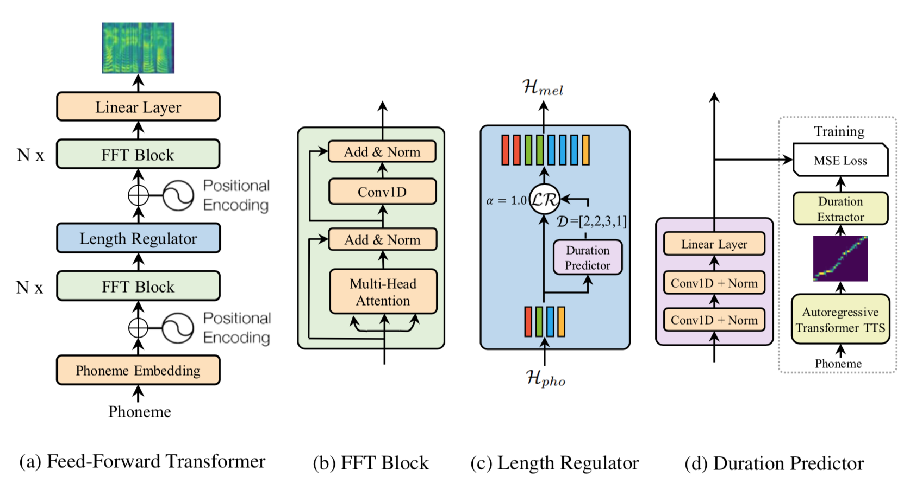

# FastSpeech For PyTorch and TensorRT

This repository provides a script and recipe to train the FastSpeech model to achieve state-of-the-art accuracy and is tested and maintained by NVIDIA.
It also provides an optimization in TensorRT to accelerate inference performance without loss of accuracy.

For more details, see this [talk](https://developer.nvidia.com/gtc/2020/video/s21420) and [slides](https://drive.google.com/file/d/1V-h5wBWAZpIpwg-qjwOuxZuOk4CLDRxy/view?usp=sharing) presented in GTC 2020.


## Table Of Contents

- [Model overview](#model-overview)
    * [Model architecture](#model-architecture)
    * [Default configuration](#default-configuration)
    * [Feature support matrix](#feature-support-matrix)
        * [Features](#features)
- [Setup](#setup)
    * [Requirements](#requirements)
- [Quick Start Guide](#quick-start-guide)
- [Advanced](#advanced)
    * [Scripts and sample code](#scripts-and-sample-code)
    * [Parameters](#parameters)
    * [Command-line options](#command-line-options)
    * [Getting the data](#getting-the-data)
        * [Dataset guidelines](#dataset-guidelines)
    * [Training process](#training-process)
    * [Inference process](#inference-process)
- [Performance](#performance)
    * [Benchmarking](#benchmarking)
        * [Training performance benchmark](#training-performance-benchmark)
        * [Inference performance benchmark](#inference-performance-benchmark)
    * [Results](#results)
        * [Training performance results](#training-performance-results)
        * [Inference performance results](#inference-performance-results)
            * [Inference performance: NVIDIA DGX-1 (1x V100 16GB)](#inference-performance-nvidia-dgx-1-1x-v100-16gb)
            * [Inference performance: NVIDIA T4](#inference-performance-nvidia-t4)
- [Release notes](#release-notes)
    * [Changelog](#changelog)
    * [Known issues](#known-issues)

## Model overview

The [FastSpeech](https://arxiv.org/pdf/1905.09263.pdf) model is one of the state-of-the-art Text-to-Mel models, researched by Microsoft and its paper was published to NeurIPS 2019. This model uses the WaveGlow vocoder model to generate waveforms.

One of the main points of this model is that the inference is disruptively fast. What make this possible is that it requires only single feed-forwarding, and no recurrence and auto-regression are required in the model. Another benefit of this model is that it’s robust to errors, meaning that it makes no repetitive words or skipped words.

Our implementation of the FastSpeech model differs from the model described in the paper. Our implementation uses Tacotron2 instead of Transformer TTS as a teacher model to get alignments between texts and mel-spectrograms.

This FastSpeech model is trained with mixed precision using Tensor Cores on NVIDIA Volta and Turing GPUs. Therefore, researchers can get results up to 2x faster than training without Tensor Cores, while experiencing the benefits of mixed precision training. Also, this model accelerates inference by running on TensorRT, up to 3x faster than running on PyTorch Framework on NVIDIA Volta and Turing GPUs. The models are tested against each NGC monthly container release to ensure consistent accuracy and performance over time.

### Model architecture
Fastspeech is a Text-to-Mel model, not based on any recurrent blocks or autoregressive logic. It consists of three parts - Phoneme-Side blocks, Length Regulator, and Mel-Side blocks. Phoneme-Side blocks contain an embedding layer, 6 Feed Forward Transformer(FFT) blocks, and the positional encoding adding layer. Length regulator has a nested neural model inside, Duration Predictor. Mel-Side blocks is almost similar with Phoneme-Side blocks, except for a linear layer in the tail.

The FFT Block is a variant of the Transformer block. It contains a multi-head attention layer with a residual connection, two layers of 1D-convolutional network with residual connections and two Layer Normalization layers.

The Length Regulator is the key block in FastSpeech model. Dealing with TTS, one of the biggest difficulties, is handling variable length of data. That's why recently most of the deep neural TTS have required recurrent blocks or autoregressive logic in them. However, the way Length Regulator handles variable length of data is completely different. Basically, it controls the length by repeating elements of the sequence, by the predicted durations. The Duration Predictor in Length Regulator, predicts each phoneme’s duration. It is also a neural model that consists of two 1D-convolution and a Fully Connected layer. Finally, Length Regulator expands each element of the sequence by the predicted durations.


Figure 1. Architecture of the FastSpeech model. Taken from the
[FastSpeech](https://arxiv.org/pdf/1905.09263.pdf) paper.

### Default configuration

This FastSpeech model supports multi-GPU and mixed precision training with dynamic loss scaling (see Apex code [here](https://github.com/NVIDIA/apex/blob/master/apex/fp16_utils/loss_scaler.py)), as well as mixed precision inference. To speed up FastSpeech training, reference mel-spectrograms and alignments between texts and mel-spectrograms are generated during a preprocessing step and read directly from disk during training, instead of being generated during training. Also, this model utilizes fused layer normalization supported by Apex (see [here](https://nvidia.github.io/apex/layernorm.html)) to get extra speed-up during training and inference.

This model is accelerated during inference by our implementation using TensorRT Python API (see [here](https://docs.nvidia.com/deeplearning/tensorrt/api/python_api/index.html)). Custom CUDA/C++ plugins are provided for some layers, to implement complex operations in the model for TensorRT and for better performance during inference. Also, we provide implementation of multi-engine inference as an experimental feature for improving inference performance more, dealing with variable input lengths. For more details, refer to [running on TensorRT](fastspeech/trt/README.md)

In summary, the following features were implemented in this model:
* Data-parallel multi-GPU training
* Dynamic loss scaling with backoff for Tensor Cores (mixed precision) training
* Accelerated inference on TensorRT using custom plugins and multi-engines approach

### Feature support matrix

The following features are supported by this model: 

| Feature                          | FastSpeech                
|----------------------------------|--------------------------
|Automatic mixed precision (AMP)   | Yes
|TensorRT inferencing              | Yes

#### Features

Automatic Mixed Precision (AMP) - AMP is a tool that enables Tensor Core-accelerated training. For more information, refer to [APEX AMP docs](https://nvidia.github.io/apex/amp.html).

TensorRT - a library for high-performance inference on NVIDIA GPUs, improving latency, throughput, power efficiency, and memory consumption. It builds optimized runtime engines by selecting the most performant kernels & algorithms, fusing layers, and using mixed precision. For more information, refer to [github.com/NVIDIA/TensorRT](https://github.com/NVIDIA/TensorRT).

## Setup

The following section lists the requirements that you need to meet in order to start training the FastSpeech model.

### Requirements

This repository contains Dockerfile which extends the PyTorch NGC container
and encapsulates some dependencies. Aside from these dependencies, ensure you
have the following components:

* [NVIDIA Docker](https://github.com/NVIDIA/nvidia-docker)
* [PyTorch 20.10-py3 NGC container](https://ngc.nvidia.com/registry/nvidia-pytorch)
or newer
* [NVIDIA Volta](https://www.nvidia.com/en-us/data-center/volta-gpu-architecture/), [Turing](https://www.nvidia.com/en-us/geforce/turing/)<!--, or [Ampere](https://www.nvidia.com/en-us/data-center/nvidia-ampere-gpu-architecture/) based GPU-->

For more information about how to get started with NGC containers, see the
following sections from the NVIDIA GPU Cloud Documentation and the Deep Learning
Documentation:

* [Getting Started Using NVIDIA GPU Cloud](https://docs.nvidia.com/ngc/ngc-getting-started-guide/index.html)
* [Accessing And Pulling From The NGC Container Registry](https://docs.nvidia.com/deeplearning/frameworks/user-guide/index.html#accessing_registry)
* [Running PyTorch](https://docs.nvidia.com/deeplearning/frameworks/pytorch-release-notes/running.html#running)

For those unable to use the PyTorch NGC container, to set up the required
environment or create your own container, see the versioned
[NVIDIA Container Support Matrix](https://docs.nvidia.com/deeplearning/frameworks/support-matrix/index.html).

## Quick Start Guide

To train your model using mixed precision with Tensor Cores or using FP32, perform the following steps using the default parameters of the FastSpeech model on the LJSpeech(https://keithito.com/LJ-Speech-Dataset) dataset. For the specifics concerning training and inference, see the [Advanced](#advanced) section.

1. Clone the repository,
	```
	git clone https://github.com/NVIDIA/DeepLearningExamples.git
	cd DeepLearningExamples/CUDA-Optimized/FastSpeech
   ```

2.  Download and preprocess the dataset. Data is downloaded to the ./LJSpeech-1.1 directory (on the host). The ./LJSpeech-1.1 directory is mounted to the /workspace/fastspeech/LJSpeech-1.1 location in the NGC container.
    ```
    bash scripts/prepare_dataset.sh
    ```

3.  Build the FastSpeech PyTorch NGC container.
    ```
    bash scripts/docker/build.sh
    ```

4.  Start an interactive session in the NGC container to run training/inference. After you build the container image, you can start an interactive CLI session with:
    ```
    bash scripts/docker/interactive.sh
    ```

5. Start training. To preprocess mel-spectrograms for faster training, first run:
   ```
   python fastspeech/dataset/ljspeech_dataset.py --dataset_path="./LJSpeech-1.1" --mels_path="./mels_ljspeech1.1"
   ```

   The preprocessed mel-spectrograms are stored in the ./mels_ljspeech1.1 directory. 

   Next, preprocess the alignments on LJSpeech dataset with feed-forwards to the teacher model. Download the Nvidia [pretrained Tacotron2 checkpoint](https://drive.google.com/file/d/1c5ZTuT7J08wLUoVZ2KkUs_VdZuJ86ZqA/view) to get a pretrained teacher model. And set --tacotron2_path to the Tacotron2 checkpoint file path and the result alignments are stored in --aligns_path.
   ```
   python fastspeech/align_tacotron2.py --dataset_path="./LJSpeech-1.1" --tacotron2_path="tacotron2_statedict.pt" --aligns_path="aligns_ljspeech1.1"
   ```

   The preprocessed alignments are stored in the ./aligns_ljspeech1.1 directory. For more information, refer to the [training process section](#training-process).

   
   Finally, run the training script:

   ```
   python fastspeech/train.py --dataset_path="./LJSpeech-1.1" --mels_path="./mels_ljspeech1.1" --aligns_path="./aligns_ljspeech1.1" --log_path="./logs" --checkpoint_path="./checkpoints"
   ```

   The checkpoints and Tensorboard log files are stored in the ./checkpoints and ./logs, respectively.

   Additionally, to accelerate the training using AMP, run with --use_amp:
   ```
   python fastspeech/train.py --dataset_path="./LJSpeech-1.1" --mels_path="./mels_ljspeech1.1" --aligns_path="./aligns_ljspeech1.1" --log_path="./logs" --checkpoint_path="./checkpoints" --use_amp
   ```

6. Start generation. To generate waveforms with WaveGlow Vocoder, Get [pretrained WaveGlow model](https://ngc.nvidia.com/catalog/models/nvidia:waveglow_ckpt_amp_256/files?version=19.10.0) from NGC into the home directory, for example, ./nvidia_waveglow256pyt_fp16.

   After you have trained the FastSpeech model, you can perform generation using the checkpoint stored in ./checkpoints. Then run:
   ```
   python generate.py --waveglow_path="./nvidia_waveglow256pyt_fp16" --checkpoint_path="./checkpoints" --text="./test_sentences.txt"
   ```

   The script loads automatically the latest checkpoint (if any exists), or you can pass a checkpoint file through --ckpt_file. And it loads input texts in ./test_sentences.txt and stores the result in ./results directory. You can also set the result directory path with --results_path.

   You can also run with a sample text:
   ```
   python generate.py  --waveglow_path="./nvidia_waveglow256pyt_fp16" --checkpoint_path="./checkpoints" --text="The more you buy, the more you save."
   ```

7. Accelerate generation(inferencing of FastSpeech and WaveGlow) with TensorRT. Set parameters config file with --hparam=trt.yaml to enable TensorRT inference mode. To prepare for running WaveGlow on TensorRT, first get an ONNX file via [DeepLearningExamples/PyTorch/SpeechSynthesis/Tacotron2/tensorrt](https://github.com/NVIDIA/DeepLearningExamples/tree/master/PyTorch/SpeechSynthesis/Tacotron2/tensorrt), convert it to an TensorRT engine using scripts/waveglow/convert_onnx2trt.py, and copy this in the home directory, for example, ./waveglow.fp16.trt. Then run with --waveglow_engine_path:
   ```
   python generate.py --hparam=trt.yaml --waveglow_path="./nvidia_waveglow256pyt_fp16" --checkpoint_path="./checkpoints" --text="./test_sentences.txt" --waveglow_engine_path="waveglow.fp16.trt"
   ```

## Advanced

The following sections provide greater details of the dataset, running training and inference, and the training results.

### Scripts and sample code

The ./fastspeech directory contains models and scripts for data processing, training/inference, and estimating performance.
* train.py: the FastSpeech model training script.
* infer.py: the FastSpeech model inference script.
* perf_infer.py: the script for estimating inference performance.
* align_tacotron2.py: the script for preprocessing alignments.

The ./fastspeech/trt directory contains the FastSpeech TensorRT model, inferencer and plugins for TensorRT.

And, ./generate.py is the script for generating waveforms with a vocoder.

### Parameters
All parameters of the FastSpeech model and for training/inference are defined in parameters config files in ./fastspeech/hparams.

The default config file, base.yaml, contains the most common parameters including paths, audio processing, and model hyperparams. The default config file for training, train.yaml, contains parameters used during training such as learning rate, batch size, and number of steps. And the default config file for inference, infer.yaml, contains parameters required for inference including batch size and usage of half precision. For more details, refer to the config files, i.e., base.yaml, train.yaml, and infer.yaml in ./fastspeech/hparams.

You can also define a new config file by overriding the default config, and set the config file via a command-line option --hparam, for example:

   ```yaml
   # File name: ./fastspeech/hparams/my_train.yaml
   
   # Inherit all parameters from train.yaml.
   parent_yaml: "train.yaml"

   # Override the learning rate.
   learning_rate: 0.0005
   ```

   ```
   python fastspeech/train.py --hparam=my_train.yaml ...
   ```

### Command-line options

To see the full list of available options and their descriptions, use the `-- -h` or `-- --help` command-line option, for example:
   ```
   python fastspeech/train.py -- -h
   ```

Although it will not display all parameters defined in the config files, you can override any parameters in the config files, for example:
   ```
   python fastspeech/train.py ... --batch_size=8 --final_steps=64000
   ```

### Getting the data

The FastSpeech model was trained on the LJSpeech-1.1 dataset. This repository contains the ./scripts/prepare_dataset.sh script which will automatically download and extract the whole dataset. By default, data will be extracted to the ./LJSpeech-1.1 directory. The dataset directory contains a README file, a wavs directory with all audio samples, and a file metadata.csv that contains audio file names and the corresponding transcripts.

#### Dataset guidelines

The LJSpeech dataset has 13,100 clips that amount to about 24 hours of speech. Since the original dataset has all transcripts in the metadata.csv file, the ./scripts/prepare_dataset.sh script partitions the metadata.csv into sub-meta files for training/test set - metadata_train.csv and metadata_test.csv containing 13,000 and 100 transcripts respectively.

### Training process

To accelerate the training performance, preprocessing of alignments between texts and mel-spectrograms is performed prior to the training iterations. 

The FastSpeech model requires reference alignments of texts and mel-spectrograms extracted from an auto-regressive TTS teacher model. As Tacotron2 is used as a teacher in our implementation, download the Nvidia [pretrained Tacotron2 checkpoint](https://drive.google.com/file/d/1c5ZTuT7J08wLUoVZ2KkUs_VdZuJ86ZqA/view) to utilize this for the preprocessing of the alignments.

Run ```align_tacotron2.py``` to get alignments on LJSpeech dataset with feed-forwards to the teacher model. --tacotron2_path is for setting Tacotron2 checkpoint file path and the result alignments are stored in --aligns_path. After that, the alignments are loaded during training.
   ```
   python fastspeech/align_tacotron2.py --dataset_path="./LJSpeech-1.1" --tacotron2_path="tacotron2_statedict.pt" --aligns_path="aligns_ljspeech1.1"
   ```

You can also preprocess mel-spectrograms for faster training. The result mel-spectrograms are stored in --mels_path and loaded during training. If --mels_path is not set, mel-spectrograms are processed during training.

Run ```ljspeech_dataset.py```
   ```
   python fastspeech/dataset/ljspeech_dataset.py --dataset_path="./LJSpeech-1.1" --mels_path="mels_ljspeech1.1"
   ```

#### Accelerated training
NVIDIA [APEX](https://github.com/NVIDIA/apex) library supports a simple method to obtain up to 2x speed-up during training. The library provides easy-to-use APIs for using AMP and layer fusions.

To use AMP during training, run with --use_amp
   ```
   python fastspeech/train.py ... --use_amp
   ```

Another approach for extra speed-up during training is fusing operations. To use fused layer normalization, set --fused_layernorm.
   ```
   python fastspeech/train.py ... --use_amp --fused_layernorm
   ```

### Inference process

```infer.py``` is provided to test the FastSpeech model on the LJSpeech dataset. --n_iters is the number of batches to infer. To run in FP16, run with --use_fp16.
   ```
   python fastspeech/infer.py --dataset_path="./LJSpeech-1.1" --checkpoint_path="./checkpoints" --n_iters=10 --use_fp16
   ```

#### Accelerated inference

To accelerate inference with TensorRT, set --hparam=trt.yaml.
   ```
   python fastspeech/infer.py --hparam=trt.yaml --dataset_path="./LJSpeech-1.1" --checkpoint_path="./checkpoints" --n_iters=10 --use_fp16
   ```
For more details, refer to [accelerating inference with TensorRT](fastspeech/trt/README.md).

#### Generation

To generate waveforms with WaveGlow Vocoder, get [pretrained WaveGlow model](https://ngc.nvidia.com/catalog/models/nvidia:waveglow_ckpt_amp_256/files?version=19.10.0) from NGC into the home directory, for example, ./nvidia_waveglow256pyt_fp16.

Run generate.py with:
  * --text - an input text or the text file path.
  * --results_path - result waveforms directory path. (default=./results).
  * --ckpt_file - checkpoint file path. (default checkpoint file is the latest file in --checkpoint_path)
   ```
   python generate.py --waveglow_path="./nvidia_waveglow256pyt_fp16" --text="The more you buy, the more you save."
   ```
   or
   ```
   python generate.py --waveglow_path="./nvidia_waveglow256pyt_fp16" --text=test_sentences.txt
   ```

Sample result waveforms are [here](samples).

To generate waveforms with the whole pipeline of FastSpeech and WaveGlow with TensorRT, extract a WaveGlow TRT engine file through https://github.com/NVIDIA/DeepLearningExamples/tree/master/PyTorch/SpeechSynthesis/Tacotron2/tensorrt and run generate.py with --hparam=trt.yaml and --waveglow_engine_path.

```
python generate.py --hparam=trt.yaml --waveglow_path="./nvidia_waveglow256pyt_fp16" --waveglow_engine_path="waveglow.fp16.trt" --text="The more you buy, the more you save."
```

Sample result waveforms are [FP32](fastspeech/trt/samples) and [FP16](fastspeech/trt/samples_fp16).


## Performance

The performance measurements in this document were conducted at the time of publication and may not reflect the performance achieved from NVIDIA’s latest software release. For the most up-to-date performance measurements, go to [NVIDIA Data Center Deep Learning Product Performance](https://developer.nvidia.com/deep-learning-performance-training-inference).

### Benchmarking

The following section shows how to run benchmarks measuring the model performance in training and inference modes.

#### Training performance benchmark

To benchmark the training performance, set CUDA_VISIBLE_DEVICES, depending on GPU count:
* for 1 GPU,
```
export CUDA_VISIBLE_DEVICES=0
```
* for 4 GPUs,
```
export CUDA_VISIBLE_DEVICES=0,1,2,3
```

and run on a specific batch size:

* in FP32
```
python fastspeech/train.py --batch_size=BATCH_SIZE
```

* in mixed precision
```
python fastspeech/train.py --batch_size=BATCH_SIZE --use_amp
```

#### Inference performance benchmark

Set CUDA_VISIBLE_DEVICES=0 to use single GPU,
```
export CUDA_VISIBLE_DEVICES=0
```

and run on a specific batch size:
* in FP32
```
python fastspeech/perf_infer.py --batch_size=BATCH_SIZE
```

* in FP16
```
python fastspeech/perf_infer.py --batch_size=BATCH_SIZE --use_fp16
```

To benchmark the inference performance with vocoder,
```
python fastspeech/perf_infer.py --batch_size=BATCH_SIZE --with_vocoder --waveglow_path=WAVEGLOW_PATH
```

Finally, to benchmark the inference performance on TensorRT,
```
python fastspeech/perf_infer.py --hparam=trt.yaml --batch_size=BATCH_SIZE
```
* with vocoder
```
python fastspeech/perf_infer.py --hparam=trt.yaml --batch_size=BATCH_SIZE --with_vocoder --waveglow_path=WAVEGLOW_PATH
```


### Results

The following sections provide details on how we achieved our performance and accuracy in training and inference.

#### Training performance results

Our results were obtained by running the script in [training performance benchmark](#training-performance-benchmark) on <!--NVIDIA DGX A100 with 8x A100 40G GPUs and -->NVIDIA DGX-1 with 8x V100 16G GPUs. Performance numbers (in number of mels per second) were averaged over an entire training epoch.

<!-- ##### Training performance: NVIDIA DGX A100 (8x A100 40GB)

| GPUs   | Batch size / GPU   | Throughput(mels/s) - FP32    | Throughput(mels/s) - mixed precision    | Throughput speedup (FP32 - mixed precision)   | Multi-GPU Weak scaling - FP32    | Multi-GPU Weak scaling - mixed precision        
|---|----|--------|--------|------|-----|------|
| 1 | 32 |   |   |  |  |  1 |
| 4 | 32 |  |  |  | |  |
| 8 | 32 |  |  |  | |  | -->

##### Training performance: NVIDIA DGX-1 (8x V100 16GB)

| GPUs   | Batch size / GPU   | Throughput(mels/s) - FP32    | Throughput(mels/s) - mixed precision    | Throughput speedup (FP32 - mixed precision)   | Multi-GPU Weak scaling - FP32    | Multi-GPU Weak scaling - mixed precision        
|---|----|--------|--------|------|-----|------|
| 1 | 32 |  31674 |  63431 | 2.00 |   1 |    1 |
| 4 | 32 | 101115 | 162847 | 1.61 | 3.19| 2.57 |
| 8 | 32 | 167650 | 188251 | 1.12 | 5.29| 2.97 |

#### Inference performance results

Our results were obtained by running the script in [inference performance benchmark](#inference-performance-benchmark) on NVIDIA DGX-1 with 1x V100 16GB GPU and a NVIDIA T4. The following tables show inference statistics for the FastSpeech and WaveGlow text-to-speech system on PyTorch and comparisons by framework with batch size 1 in FP16, gathered from 1000 inference runs. Latency is measured from the start of FastSpeech inference to the end of WaveGlow inference. The tables include average latency, latency standard deviation, and latency confidence intervals. Throughput is measured as the number of generated audio samples per second. RTF is the real-time factor which tells how many seconds of speech are generated in 1 second of compute. The used WaveGlow model is a 256-channel model. The numbers reported below were taken with a moderate length of 128 characters.

##### Inference performance: NVIDIA DGX-1 (1x V100 16GB)

| Batch size |	Precision | Avg latency (s) | Std latency(s) | Latency tolerance interval 90% (s) | Latency tolerance interval 95% (s) | Latency tolerance interval 99% (s) | Throughput (samples/s) | Avg RTF | Speed-up with mixed precision |
|------------|-----------|-----------------|----------------|------------------------------------|------------------------------------|--------------------|---------------------|---------|-------------------------------|
| 1 | FP16 | 0.2287 | 0.001  | 0.2295 | 0.2297 | 0.2303 | 681,773 | 30.92 | 1.50 |
| 4 | FP16 | 0.5003 | 0.0016 | 0.502  | 0.5023 | 0.5032 | 1,244,466 | 14.11 | 2.57 |
| 8 | FP16 | 0.9695 | 0.0023 | 0.9722 | 0.9732 | 0.9748 | 1,284,339 | 7.28 | 2.73 |
| 1 | FP32 | 0.3428 | 0.0016 | 0.3445 | 0.3449 | 0.3458 | 454,833 | 20.63 | 1.00 |
| 4 | FP32 | 1.287  | 0.0039 | 1.2916 | 1.2927 | 1.2954 | 484,558 | 5.50 | 1.00 |
| 8 | FP32 | 2.6481 | 0.0041 | 2.6535 | 2.6549 | 2.657  | 470,992 | 2.67 | 1.00 |


| Framework | Batch size |	Precision | Avg latency (s) | Std latency(s) | Latency tolerance interval 90% (s) | Latency tolerance interval 95% (s) | Latency tolerance interval 99% (s) | Throughput (samples/s) | Avg RTF | Speed-up (PyT - PyT+TRT) |
|-----------|------------|-----------|-----------------|----------------|------------------------------------|------------------------------------|--------------------|---------------------|---------|-------------------------------|
| PyT     | 1 | FP16 | 0.2287 | 0.001  | 0.2295 | 0.2297 | 0.2303 | 681,773   | 30.92 | 1    |
| PyT+TRT | 1 | FP16 | 0.1115 | 0.0007 | 0.1122 | 0.1124 | 0.1135 | 1,398,343 | 63.42 | 2.05 |
| PyT     | 4 | FP16 | 0.5003 | 0.0016 | 0.502  | 0.5023 | 0.5032 | 1,244,466 | 14.11 | 1    |
| PyT+TRT | 4 | FP16 | 0.3894 | 0.0019 | 0.3917 | 0.3925 | 0.3961 | 1,599,005 | 18.13 | 1.28 |

##### Inference performance: NVIDIA T4

| Batch size | Precision | Avg latency (s) | Std latency(s) | Latency tolerance interval 90% (s) | Latency tolerance interval 95% (s) | Latency tolerance interval 99% (s) | Throughput (samples/s) | Avg RTF | Speed-up with mixed precision |
|------------|-----------|-----------------|----------------|------------------------------------|------------------------------------|--------------------|---------------------|---------|-------------------------------|
| 1 | FP16 | 0.9345 | 0.0294 | 0.9662 | 0.9723 | 0.9806 |  167,003  | 7.57 | 1.28 |
| 4 | FP16 | 3.7815 | 0.0877 | 3.9078 | 3.9393 | 3.9632 |  164,730  | 1.87 | 1.28 |
| 8 | FP16 | 7.5722 | 0.1764 | 7.8273 | 7.8829 | 7.9286 |  164,530  | 0.93 | 1.21 |
| 1 | FP32 | 1.1952 | 0.0368 | 1.2438 | 1.2487 | 1.2589 |  130,572  | 5.92 | 1.00 |
| 4 | FP32 | 4.8578 | 0.1215 | 5.0343 | 5.0651 | 5.1027 |  128,453  | 1.46 | 1.00 |
| 8 | FP32 | 9.1563 | 0.4114 | 9.4049 | 9.4571 | 9.5194 |  136,367  | 0.77 | 1.00 |


| Framework | Batch size | Precision | Avg latency (s) | Std latency(s) | Latency tolerance interval 90% (s) | Latency tolerance interval 95% (s) | Latency tolerance interval 99% (s) | Throughput (samples/s) | Avg RTF | Speed-up (PyT - PyT+TRT) |
|-----------|------------|-----------|-----------------|----------------|------------------------------------|------------------------------------|--------------------|---------------------|---------|-------------------------------|
| PyT     | 1 | FP16 | 0.9345 | 0.0294 | 0.9662 | 0.9723 | 0.9806 |  167,003  | 7.57  | 1    |
| PyT+TRT | 1 | FP16 | 0.3234 | 0.0058 | 0.3304 | 0.3326 | 0.3358 |  482,286  | 21.87 | 2.89 |

## Release notes

### Changelog
Oct 2020
- PyTorch 1.7, TensorRT 7.2 support <!--and Nvidia Ampere architecture support-->

July 2020
- Initial release

### Known issues

There are no known issues in this release.