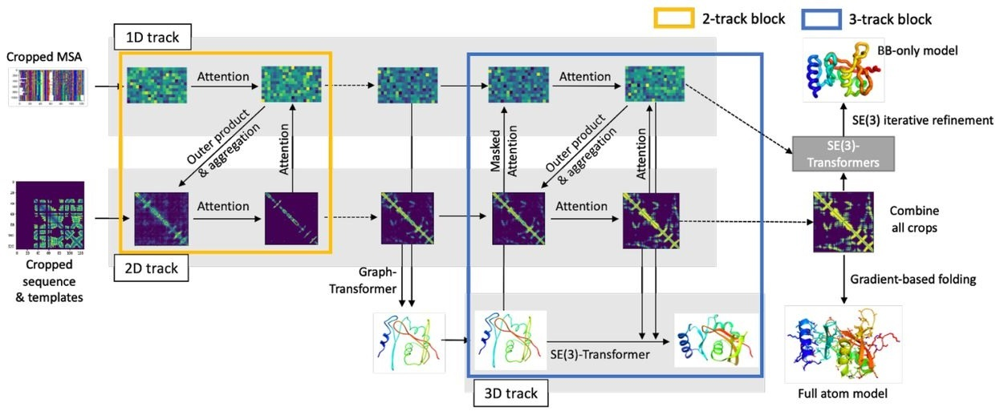

# RoseTTAFold for PyTorch

This repository provides a script to run inference using the RoseTTAFold model. The content of this repository is tested and maintained by NVIDIA.

## Table Of Contents

- [Model overview](#model-overview)
    * [Model architecture](#model-architecture)
- [Setup](#setup)
    * [Requirements](#requirements)
- [Quick Start Guide](#quick-start-guide) 
- [Release notes](#release-notes)
    * [Changelog](#changelog)
    * [Known issues](#known-issues)


## Model overview

The RoseTTAFold is a model designed to provide accurate protein structure from its amino acid sequence. This model is 
based on [Accurate prediction of protein structures and interactions using a 3-track network](https://www.biorxiv.org/content/10.1101/2021.06.14.448402v1) by Minkyung Baek et al.

This implementation is a dockerized version of the official [RoseTTAFold repository](https://github.com/RosettaCommons/RoseTTAFold/).
Here you can find the [original RoseTTAFold guide](README-ROSETTAFOLD.md).

### Model architecture

The RoseTTAFold model is based on a 3-track architecture fusing 1D, 2D, and 3D information about the protein structure. 
All information is exchanged between tracks to learn the sequence and coordinate patterns at the same time. The final prediction 
is refined using an SE(3)-Transformer.   


    
*Figure 1: The RoseTTAFold architecture. Image comes from the [original paper](https://www.biorxiv.org/content/10.1101/2021.06.14.448402v1).*

## Setup

The following section lists the requirements that you need to meet in order to run inference using the RoseTTAFold model.

### Requirements

This repository contains a Dockerfile that extends the PyTorch NGC container and encapsulates necessary dependencies. Aside from these dependencies, ensure you have the following components:
- [NVIDIA Docker](https://github.com/NVIDIA/nvidia-docker)
- PyTorch 21.09-py3 NGC container
- Supported GPUs:
  - [NVIDIA Volta architecture](https://www.nvidia.com/en-us/data-center/volta-gpu-architecture/)
  - [NVIDIA Turing architecture](https://www.nvidia.com/en-us/design-visualization/technologies/turing-architecture/)
  - [NVIDIA Ampere architecture](https://www.nvidia.com/en-us/data-center/nvidia-ampere-gpu-architecture/)

For more information about how to get started with NGC containers, refer to the following sections from the NVIDIA GPU Cloud Documentation and the Deep Learning Documentation:
- [Getting Started Using NVIDIA GPU Cloud](https://docs.nvidia.com/ngc/ngc-getting-started-guide/index.html)
- [Accessing And Pulling From The NGC Container Registry](https://docs.nvidia.com/deeplearning/frameworks/user-guide/index.html#accessing_registry)
- [Running PyTorch](https://docs.nvidia.com/deeplearning/frameworks/pytorch-release-notes/running.html#running)
  
For those unable to use the PyTorch NGC container, to set up the required environment or create your own container, refer to the versioned [NVIDIA Container Support Matrix](https://docs.nvidia.com/deeplearning/frameworks/support-matrix/index.html).

In addition, 1 TB of disk space is required to unpack the required databases.

## Quick Start Guide

To run inference using the RoseTTAFold model, perform the following steps using the default parameters.

1. Clone the repository.
    ```
    git clone https://github.com/NVIDIA/DeepLearningExamples
    cd DeepLearningExamples/DGLPyTorch/
    ```

2. Download the pre-trained weights and databases needed for inference.
    The following command downloads the pre-trained weights and two databases needed to create derived features to the input to the model.
    The script will download the `UniRef30` (~50 GB) and `pdb100_2021Mar03` (~115 GB) databases, which might take a considerable amount 
    of time. Additionally, unpacking those databases requires approximately 1 TB of free disk space.

    By default, the data will be downloaded to `./weights` and `./databases` folders in the current directory.
    ```
    bash scripts/download_databases.sh
    ```
    If you would like to specify the download location you can pass the following parameters    
    ```
    bash scripts/download_databases.sh PATH-TO-WEIGHTS PATH-TO-DATABASES
    ```    

3. Build the RoseTTAFold PyTorch NGC container. This step builds the PyTorch dependencies on your machine and can take between 30 minutes and 1 hour to complete. 
    ```
    docker build -t rosettafold .
    ```

4. Start an interactive session in the NGC container to run inference.
    
    The following command launches the container and mount the `PATH-TO-WEIGHTS` directory as a volume to the `/weights` directory in the container, the `PATH-TO-DATABASES` directory as a volume to the `/databases` directory in the container, and `./results` directory to the `/results` directory in the container.
    ```
    mkdir data results
    docker run --ipc=host -it --rm --runtime=nvidia -p6006:6006 -v PATH-TO-WEIGHTS:/weights -v PATH-TO-DATABASES:/databases -v ${PWD}/results:/results rosettafold:latest /bin/bash
    ```
   
5. Start inference/predictions.
    
    To run inference you have to prepare a FASTA file and pass a path to it or pass a sequence directly.
    ```
    python run_inference_pipeline.py [Sequence]
    ```
    There is an example FASTA file at `example/input.fa` for you to try. Running the inference pipeline consists of four steps:
   1. Preparing the Multiple Sequence Alignments (MSAs)
   2. Preparing the secondary structures
   3. Preparing the templates
   4. Iteratively refining the prediction
   
    The first three steps can take between a couple of minutes and an hour, depending on the sequence.
    The output will be stored at the `/results` directory as an `output.e2e.pdb` file

6. Start Jupyter Notebook to run inference interactively.

   To launch the application, copy the Notebook to the root folder.
    ```
    cp notebooks/run_inference.ipynb .
    
    ```
    To start Jupyter Notebook, run:
    ```
    jupyter notebook run_inference.ipynb
    ```
    
    For more information about Jupyter Notebook, refer to the Jupyter Notebook documentation.


## Release notes

### Changelog

October 2021
- Initial release

### Known issues

There are no known issues with this model.


