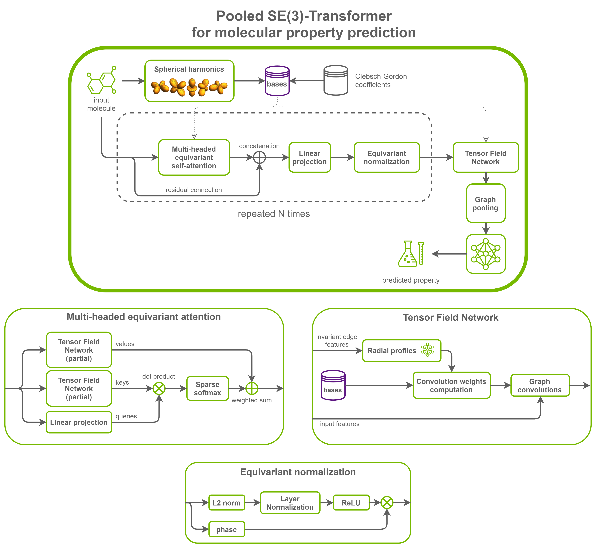

# SE(3)-Transformers For PyTorch

This repository provides a script and recipe to train the SE(3)-Transformer model to achieve state-of-the-art accuracy. The content of this repository is tested and maintained by NVIDIA.

## Table Of Contents
- [Model overview](#model-overview)
    * [Model architecture](#model-architecture)
    * [Default configuration](#default-configuration)
    * [Feature support matrix](#feature-support-matrix)
        * [Features](#features)
    * [Mixed precision training](#mixed-precision-training)
        * [Enabling mixed precision](#enabling-mixed-precision)
          * [Enabling TF32](#enabling-tf32)
    * [Glossary](#glossary)
- [Setup](#setup)
    * [Requirements](#requirements)
- [Quick Start Guide](#quick-start-guide)
- [Advanced](#advanced)
    * [Scripts and sample code](#scripts-and-sample-code)
    * [Parameters](#parameters)
    * [Command-line options](#command-line-options)
    * [Getting the data](#getting-the-data)
        * [Dataset guidelines](#dataset-guidelines)
        * [Multi-dataset](#multi-dataset)
    * [Training process](#training-process)
    * [Inference process](#inference-process)
- [Performance](#performance)
    * [Benchmarking](#benchmarking)
        * [Training performance benchmark](#training-performance-benchmark)
        * [Inference performance benchmark](#inference-performance-benchmark)
    * [Results](#results)
        * [Training accuracy results](#training-accuracy-results)                         
            * [Training accuracy: NVIDIA DGX A100 (8x A100 80GB)](#training-accuracy-nvidia-dgx-a100-8x-a100-80gb)  
            * [Training accuracy: NVIDIA DGX-1 (8x V100 16GB)](#training-accuracy-nvidia-dgx-1-8x-v100-16gb)
            * [Training stability test](#training-stability-test)
        * [Training performance results](#training-performance-results)
            * [Training performance: NVIDIA DGX A100 (8x A100 80GB)](#training-performance-nvidia-dgx-a100-8x-a100-80gb) 
            * [Training performance: NVIDIA DGX-1 (8x V100 16GB)](#training-performance-nvidia-dgx-1-8x-v100-16gb)
        * [Inference performance results](#inference-performance-results)
            * [Inference performance: NVIDIA DGX A100 (1x A100 80GB)](#inference-performance-nvidia-dgx-a100-1x-a100-80gb)
            * [Inference performance: NVIDIA DGX-1 (1x V100 16GB)](#inference-performance-nvidia-dgx-1-1x-v100-16gb)
- [Release notes](#release-notes)
    * [Changelog](#changelog)
    * [Known issues](#known-issues)


## Model overview


The **SE(3)-Transformer** is a Graph Neural Network using a variant of [self-attention](https://arxiv.org/abs/1706.03762v5) for 3D points and graphs processing.
This model is [equivariant](https://en.wikipedia.org/wiki/Equivariant_map) under [continuous 3D roto-translations](https://en.wikipedia.org/wiki/Euclidean_group), meaning that when the inputs (graphs or sets of points) rotate in 3D space (or more generally experience a [proper rigid transformation](https://en.wikipedia.org/wiki/Rigid_transformation)), the model outputs either stay invariant or transform with the input.
A mathematical guarantee of equivariance is important to ensure stable and predictable performance in the presence of nuisance transformations of the data input and when the problem has some inherent symmetries we want to exploit.


The model is based on the following publications:
- [SE(3)-Transformers: 3D Roto-Translation Equivariant Attention Networks](https://arxiv.org/abs/2006.10503) (NeurIPS 2020) by Fabian B. Fuchs, Daniel E. Worrall, et al. 
- [Tensor field networks: Rotation- and translation-equivariant neural networks for 3D point clouds](https://arxiv.org/abs/1802.08219) by Nathaniel Thomas, Tess Smidt, et al.

A follow-up paper explains how this model can be used iteratively, for example, to predict or refine protein structures:

- [Iterative SE(3)-Transformers](https://arxiv.org/abs/2102.13419) by Fabian B. Fuchs, Daniel E. Worrall, et al. 

Just like [the official implementation](https://github.com/FabianFuchsML/se3-transformer-public), this implementation uses [PyTorch](https://pytorch.org/) and the [Deep Graph Library (DGL)](https://www.dgl.ai/).

The main differences between this implementation of SE(3)-Transformers and the official one are the following:

- Training and inference support for multiple GPUs
- Training and inference support for [Mixed Precision](https://arxiv.org/abs/1710.03740)
- The [QM9 dataset from DGL](https://docs.dgl.ai/en/latest/api/python/dgl.data.html#qm9edge-dataset) is used and automatically downloaded
- Significantly increased throughput
- Significantly reduced memory consumption
- The use of layer normalization in the fully connected radial profile layers is an option (`--use_layer_norm`), off by default
- The use of equivariant normalization between attention layers is an option (`--norm`), off by default
- The [spherical harmonics](https://en.wikipedia.org/wiki/Spherical_harmonic) and [Clebsch–Gordan coefficients](https://en.wikipedia.org/wiki/Clebsch%E2%80%93Gordan_coefficients), used to compute bases matrices, are computed with the [e3nn library](https://e3nn.org/)


This model enables you to predict quantum chemical properties of small organic molecules in the [QM9 dataset](https://www.nature.com/articles/sdata201422).
In this case, the exploited symmetry is that these properties do not depend on the orientation or position of the molecules in space.


This model is trained with mixed precision using Tensor Cores on NVIDIA Volta, NVIDIA Turing, and the NVIDIA Ampere GPU architectures. Therefore, researchers can get results up to 1.5x faster than training without Tensor Cores while experiencing the benefits of mixed precision training. This model is tested against each NGC monthly container release to ensure consistent accuracy and performance over time.

### Model architecture

The model consists of stacked layers of equivariant graph self-attention and equivariant normalization.
Lastly, a Tensor Field Network convolution is applied to obtain invariant features. Graph pooling (mean or max over the nodes) is applied to these features, and the result is fed to a final MLP to get scalar predictions.

In this setup, the model is a graph-to-scalar network. The pooling can be removed to obtain a graph-to-graph network, and the final TFN can be modified to output features of any type (invariant scalars, 3D vectors, ...).





### Default configuration


SE(3)-Transformers introduce a self-attention layer for graphs that is equivariant to 3D roto-translations. It achieves this by leveraging Tensor Field Networks to build attention weights that are invariant and attention values that are equivariant.
Combining the equivariant values with the invariant weights gives rise to an equivariant output. This output is normalized while preserving equivariance thanks to equivariant normalization layers operating on feature norms.


The following features were implemented in this model:

- Support for edge features of any degree (1D, 3D, 5D, ...), whereas the official implementation only supports scalar invariant edge features (degree 0). Edge features with a degree greater than one are
concatenated to node features of the same degree. This is required in order to reproduce published results on point cloud processing.
- Data-parallel multi-GPU training (DDP)
- Mixed precision training (autocast, gradient scaling)
- Gradient accumulation
- Model checkpointing


The following performance optimizations were implemented in this model:


**General optimizations**

- The option is provided to precompute bases at the beginning of the training instead of computing them at the beginning of each forward pass (`--precompute_bases`)
- The bases computation is just-in-time (JIT) compiled with `torch.jit.script`
- The Clebsch-Gordon coefficients are cached in RAM


**Tensor Field Network optimizations**

- The last layer of each radial profile network does not add any bias in order to avoid large broadcasting operations
- The layout (order of dimensions) of the bases tensors is optimized to avoid copies to contiguous memory in the downstream TFN layers
- When Tensor Cores are available, and the output feature dimension of computed bases is odd, then it is padded with zeros to make more effective use of Tensor Cores (AMP and TF32 precisions)
- Multiple levels of fusion for TFN convolutions (and radial profiles) are provided and automatically used when conditions are met
- A low-memory mode is provided that will trade throughput for less memory use (`--low_memory`). Overview of memory savings over the official implementation (batch size 100), depending on the precision and the low memory mode:

    |   | FP32               | AMP                
    |---|-----------------------|--------------------------
    |`--low_memory false` (default)   |         4.7x | 7.1x
    |`--low_memory true`   |         29.4x | 43.6x 


**Self-attention optimizations**

- Attention keys and values are computed by a single partial TFN graph convolution in each attention layer instead of two
- Graph operations for different output degrees may be fused together if conditions are met


**Normalization optimizations**

- The equivariant normalization layer is optimized from multiple layer normalizations to a group normalization on fused norms when certain conditions are met
    


Competitive training results and analysis are provided for the following hyperparameters (identical to the ones in the original publication):
- Number of layers: 7
- Number of degrees: 4
- Number of channels: 32
- Number of attention heads: 8
- Channels division: 2
- Use of equivariant normalization: true
- Use of layer normalization: true
- Pooling: max


### Feature support matrix

This model supports the following features:: 

| Feature               | SE(3)-Transformer                
|-----------------------|--------------------------
|Automatic mixed precision (AMP)   |         Yes 
|Distributed data parallel (DDP)   |         Yes 
         
#### Features


**Distributed data parallel (DDP)**

[DistributedDataParallel (DDP)](https://pytorch.org/docs/stable/generated/torch.nn.parallel.DistributedDataParallel.html#torch.nn.parallel.DistributedDataParallel) implements data parallelism at the module level that can run across multiple GPUs or machines.

**Automatic Mixed Precision (AMP)**

This implementation uses the native PyTorch AMP implementation of mixed precision training. It allows us to use FP16 training with FP32 master weights by modifying just a few lines of code. A detailed explanation of mixed precision can be found in the next section.

### Mixed precision training

Mixed precision is the combined use of different numerical precisions in a computational method. [Mixed precision](https://arxiv.org/abs/1710.03740) training offers significant computational speedup by performing operations in half-precision format while storing minimal information in single-precision to retain as much information as possible in critical parts of the network. Since the introduction of [Tensor Cores](https://developer.nvidia.com/tensor-cores) in NVIDIA Volta, and following with both the NVIDIA Turing and NVIDIA Ampere Architectures, significant training speedups are experienced by switching to mixed precision -- up to 3x overall speedup on the most arithmetically intense model architectures. Using [mixed precision training](https://docs.nvidia.com/deeplearning/performance/mixed-precision-training/index.html) previously required two steps:
1.  Porting the model to use the FP16 data type where appropriate.    
2.  Adding loss scaling to preserve small gradient values.

AMP enables mixed precision training on NVIDIA Volta, NVIDIA Turing, and NVIDIA Ampere GPU architectures automatically. The PyTorch framework code makes all necessary model changes internally.

For information about:
-   How to train using mixed precision, refer to the [Mixed Precision Training](https://arxiv.org/abs/1710.03740) paper and [Training With Mixed Precision](https://docs.nvidia.com/deeplearning/performance/mixed-precision-training/index.html) documentation.
-   Techniques used for mixed precision training, refer to the [Mixed-Precision Training of Deep Neural Networks](https://devblogs.nvidia.com/mixed-precision-training-deep-neural-networks/) blog.
-   APEX tools for mixed precision training, refer to the [NVIDIA Apex: Tools for Easy Mixed-Precision Training in PyTorch](https://devblogs.nvidia.com/apex-pytorch-easy-mixed-precision-training/).

#### Enabling mixed precision

Mixed precision is enabled in PyTorch by using the native [Automatic Mixed Precision package](https://pytorch.org/docs/stable/amp.html), which casts variables to half-precision upon retrieval while storing variables in single-precision format. Furthermore, to preserve small gradient magnitudes in backpropagation, a [loss scaling](https://docs.nvidia.com/deeplearning/sdk/mixed-precision-training/index.html#lossscaling) step must be included when applying gradients. In PyTorch, loss scaling can be applied automatically using a `GradScaler`.
Automatic Mixed Precision makes all the adjustments internally in PyTorch, providing two benefits over manual operations. First, programmers need not modify network model code, reducing development and maintenance effort. Second, using AMP maintains forward and backward compatibility with all the APIs for defining and running PyTorch models.

To enable mixed precision, you can simply use the `--amp` flag when running the training or inference scripts.

#### Enabling TF32

TensorFloat-32 (TF32) is the new math mode in [NVIDIA A100](https://www.nvidia.com/en-us/data-center/a100/) GPUs for handling the matrix math, also called tensor operations. TF32 running on Tensor Cores in A100 GPUs can provide up to 10x speedups compared to single-precision floating-point math (FP32) on NVIDIA Volta GPUs. 

TF32 Tensor Cores can speed up networks using FP32, typically with no loss of accuracy. It is more robust than FP16 for models that require a high dynamic range for weights or activations.

For more information, refer to the [TensorFloat-32 in the A100 GPU Accelerates AI Training, HPC up to 20x](https://blogs.nvidia.com/blog/2020/05/14/tensorfloat-32-precision-format/) blog post.

TF32 is supported in the NVIDIA Ampere GPU architecture and is enabled by default.


### Glossary

**Degree (type)**

In the model, every feature (input, output and hidden) transforms in an equivariant way in relation to the input graph. When we define a feature, we need to choose, in addition to the number of channels, which transformation rule it obeys.

The degree or type of a feature is a positive integer that describes how this feature transforms when the input rotates in 3D.

This is related to [irreducible representations](https://en.wikipedia.org/wiki/Irreducible_representation) of different rotation orders.

The degree of a feature determines its dimensionality. A type-d feature has a dimensionality of 2d+1.

Some common examples include:
- Degree 0: 1D scalars invariant to rotation
- Degree 1: 3D vectors that rotate according to 3D rotation matrices
- Degree 2: 5D vectors that rotate according to 5D [Wigner-D matrices](https://en.wikipedia.org/wiki/Wigner_D-matrix). These can represent symmetric traceless 3x3 matrices.

**Fiber**

A fiber can be viewed as a representation of a set of features of different types or degrees (positive integers), where each feature type transforms according to its rule.

In this repository, a fiber can be seen as a dictionary with degrees as keys and numbers of channels as values.

**Multiplicity**

The multiplicity of a feature of a given type is the number of channels of this feature.

**Tensor Field Network**

A [Tensor Field Network](https://arxiv.org/abs/1802.08219) is a kind of equivariant graph convolution that can combine features of different degrees and produce new ones while preserving equivariance thanks to [tensor products](https://en.wikipedia.org/wiki/Tensor_product).

**Equivariance**

[Equivariance](https://en.wikipedia.org/wiki/Equivariant_map) is a property of a function of model stating that applying a symmetry transformation to the input and then computing the function produces the same result as computing the function and then applying the transformation to the output.

In the case of SE(3)-Transformer, the symmetry group is the group of continuous roto-translations (SE(3)).

## Setup

The following section lists the requirements that you need to meet in order to start training the SE(3)-Transformer model.

### Requirements

This repository contains a Dockerfile which extends the PyTorch 21.07 NGC container and encapsulates some dependencies. Aside from these dependencies, ensure you have the following components:
- [NVIDIA Docker](https://github.com/NVIDIA/nvidia-docker)
- PyTorch 21.07+ NGC container
- Supported GPUs:
    - [NVIDIA Volta architecture](https://www.nvidia.com/en-us/data-center/volta-gpu-architecture/)
    - [NVIDIA Turing architecture](https://www.nvidia.com/en-us/design-visualization/technologies/turing-architecture/)
    - [NVIDIA Ampere architecture](https://www.nvidia.com/en-us/data-center/nvidia-ampere-gpu-architecture/)

For more information about how to get started with NGC containers, refer to the following sections from the NVIDIA GPU Cloud Documentation and the Deep Learning Documentation:
- [Getting Started Using NVIDIA GPU Cloud](https://docs.nvidia.com/ngc/ngc-getting-started-guide/index.html)
- [Accessing And Pulling From The NGC Container Registry](https://docs.nvidia.com/deeplearning/frameworks/user-guide/index.html#accessing_registry)
- [Running PyTorch](https://docs.nvidia.com/deeplearning/frameworks/pytorch-release-notes/running.html#running)
  
For those unable to use the PyTorch NGC container to set up the required environment or create your own container, refer to the versioned [NVIDIA Container Support Matrix](https://docs.nvidia.com/deeplearning/frameworks/support-matrix/index.html).

## Quick Start Guide

To train your model using mixed or TF32 precision with Tensor Cores or FP32, perform the following steps using the default parameters of the SE(3)-Transformer model on the QM9 dataset. For the specifics concerning training and inference, refer to the [Advanced](#advanced) section.

1. Clone the repository.
    ```
    git clone https://github.com/NVIDIA/DeepLearningExamples
    cd DeepLearningExamples/DGLPyTorch/DrugDiscovery/SE3Transformer
    ```
   
2.  Build the `se3-transformer` PyTorch NGC container.
    ```
    docker build -t se3-transformer .
    ```

3.  Start an interactive session in the NGC container to run training/inference.
    ```
    mkdir -p results
    docker run -it --runtime=nvidia --shm-size=8g --ulimit memlock=-1 --ulimit stack=67108864 --rm -v ${PWD}/results:/results se3-transformer:latest
    ```

4. Start training.
   ```
   bash scripts/train.sh
   ```

5. Start inference/predictions.
   ```
   bash scripts/predict.sh
   ```


Now that you have your model trained and evaluated, you can choose to compare your training results with our [Training accuracy results](#training-accuracy-results). You can also choose to benchmark your performance to [Training performance benchmark](#training-performance-results) or [Inference performance benchmark](#inference-performance-results). Following the steps in these sections will ensure that you achieve the same accuracy and performance results as stated in the [Results](#results) section.

## Advanced

The following sections provide greater details of the dataset, running training and inference, and the training results.

### Scripts and sample code

In the root directory, the most important files are:
- `Dockerfile`: container with the basic set of dependencies to run SE(3)-Transformers
- `requirements.txt`: set of extra requirements to run SE(3)-Transformers
- `se3_transformer/data_loading/qm9.py`: QM9 data loading and preprocessing, as well as bases precomputation
- `se3_transformer/model/layers/`: directory containing model architecture layers
- `se3_transformer/model/transformer.py`: main Transformer module
- `se3_transformer/model/basis.py`: logic for computing bases matrices
- `se3_transformer/runtime/training.py`: training script, to be run as a python module
- `se3_transformer/runtime/inference.py`: inference script, to be run as a python module
- `se3_transformer/runtime/metrics.py`: MAE metric with support for multi-GPU synchronization
- `se3_transformer/runtime/loggers.py`: [DLLogger](https://github.com/NVIDIA/dllogger) and [W&B](wandb.ai/) loggers


### Parameters

The complete list of the available parameters for the `training.py` script contains:

**General**

- `--epochs`: Number of training epochs (default: `100` for single-GPU)
- `--batch_size`: Batch size (default: `240`)
- `--seed`: Set a seed globally (default: `None`)
- `--num_workers`: Number of dataloading workers (default: `8`)
- `--amp`: Use Automatic Mixed Precision (default `false`)
- `--gradient_clip`: Clipping of the gradient norms (default: `None`)
- `--accumulate_grad_batches`: Gradient accumulation (default: `1`)
- `--ckpt_interval`: Save a checkpoint every N epochs (default: `-1`)
- `--eval_interval`: Do an evaluation round every N epochs (default: `20`)
- `--silent`: Minimize stdout output (default: `false`)

**Paths**

- `--data_dir`: Directory where the data is located or should be downloaded (default: `./data`)
- `--log_dir`: Directory where the results logs should be saved (default: `/results`)
- `--save_ckpt_path`: File where the checkpoint should be saved (default: `None`)
- `--load_ckpt_path`: File of the checkpoint to be loaded (default: `None`)

**Optimizer**

- `--optimizer`: Optimizer to use (default: `adam`)
- `--learning_rate`: Learning rate to use (default: `0.002` for single-GPU)
- `--momentum`: Momentum to use (default: `0.9`)
- `--weight_decay`: Weight decay to use (default: `0.1`)

**QM9 dataset**

- `--task`: Regression task to train on (default: `homo`)
- `--precompute_bases`: Precompute bases at the beginning of the script during dataset initialization, instead of computing them at the beginning of each forward pass (default: `false`)

**Model architecture**

- `--num_layers`: Number of stacked Transformer layers (default: `7`)
- `--num_heads`: Number of heads in self-attention (default: `8`)
- `--channels_div`: Channels division before feeding to attention layer (default: `2`)
- `--pooling`: Type of graph pooling (default: `max`)
- `--norm`: Apply a normalization layer after each attention block (default: `false`)
- `--use_layer_norm`: Apply layer normalization between MLP layers (default: `false`)
- `--low_memory`: If true, will use ops that are slower but use less memory (default: `false`)
- `--num_degrees`: Number of degrees to use. Hidden features will have types [0, ..., num_degrees - 1] (default: `4`)
- `--num_channels`: Number of channels for the hidden features (default: `32`)


### Command-line options

To show the full list of available options and their descriptions, use the `-h` or `--help` command-line option, for example: `python -m se3_transformer.runtime.training --help`.


### Dataset guidelines

#### Demo dataset

The SE(3)-Transformer was trained on the QM9 dataset.

The QM9 dataset is hosted on DGL servers and downloaded (38MB) automatically when needed. By default, it is stored in the `./data` directory, but this location can be changed with the `--data_dir` argument.

The dataset is saved as a `qm9_edge.npz` file and converted to DGL graphs at runtime.

As input features, we use:
- Node features (6D):
    - One-hot-encoded atom type (5D) (atom types: H, C, N, O, F)
    - Number of protons of each atom (1D)
- Edge features: one-hot-encoded bond type (4D) (bond types: single, double, triple, aromatic)
- The relative positions between adjacent nodes (atoms)

#### Custom datasets

To use this network on a new dataset, you can extend the `DataModule` class present in `se3_transformer/data_loading/data_module.py`.

Your custom collate function should return a tuple with:

- A (batched) DGLGraph object
- A dictionary of node features ({‘{degree}’: tensor})
- A dictionary of edge features ({‘{degree}’: tensor})
- (Optional) Precomputed bases as a dictionary
- Labels as a tensor

You can then modify the `training.py` and `inference.py` scripts to use your new data module.

### Training process

The training script is `se3_transformer/runtime/training.py`, to be run as a module: `python -m se3_transformer.runtime.training`.

**Logs**

By default, the resulting logs are stored in `/results/`. This can be changed with `--log_dir`.

You can connect your existing Weights & Biases account by setting the WANDB_API_KEY environment variable, and enabling the `--wandb` flag.
If no API key is set, `--wandb` will log the run anonymously to Weights & Biases.

**Checkpoints**

The argument `--save_ckpt_path` can be set to the path of the file where the checkpoints should be saved.
`--ckpt_interval` can also be set to the interval (in the number of epochs) between checkpoints.

**Evaluation**

The evaluation metric is the Mean Absolute Error (MAE).

`--eval_interval` can be set to the interval (in the number of epochs) between evaluation rounds. By default, an evaluation round is performed after each epoch.

**Automatic Mixed Precision**

To enable Mixed Precision training, add the `--amp` flag.

**Multi-GPU and multi-node**

The training script supports the PyTorch elastic launcher to run on multiple GPUs or nodes.  Refer to the [official documentation](https://pytorch.org/docs/1.9.0/elastic/run.html).

For example, to train on all available GPUs with AMP:

```
python -m torch.distributed.run --nnodes=1 --nproc_per_node=gpu --module se3_transformer.runtime.training --amp
```


### Inference process

Inference can be run by using the `se3_transformer.runtime.inference` python module.

The inference script is `se3_transformer/runtime/inference.py`, to be run as a module: `python -m se3_transformer.runtime.inference`.  It requires a pre-trained model checkpoint (to be passed as `--load_ckpt_path`).


## Performance

The performance measurements in this document were conducted at the time of publication and may not reflect the performance achieved from NVIDIA’s latest software release. For the most up-to-date performance measurements, go to [NVIDIA Data Center Deep Learning Product Performance](https://developer.nvidia.com/deep-learning-performance-training-inference).

### Benchmarking

The following section shows how to run benchmarks measuring the model performance in training and inference modes.

#### Training performance benchmark

To benchmark the training performance on a specific batch size, run `bash scripts/benchmark_train.sh {BATCH_SIZE}` for single GPU, and `bash scripts/benchmark_train_multi_gpu.sh {BATCH_SIZE}` for multi-GPU.

#### Inference performance benchmark

To benchmark the inference performance on a specific batch size, run `bash scripts/benchmark_inference.sh {BATCH_SIZE}`.

### Results


The following sections provide details on how we achieved our performance and accuracy in training and inference.

#### Training accuracy results

##### Training accuracy: NVIDIA DGX A100 (8x A100 80GB)

Our results were obtained by running the `scripts/train.sh` training script in the PyTorch 21.07 NGC container on NVIDIA DGX A100 (8x A100 80GB) GPUs.

| GPUs    | Batch size / GPU    | Absolute error - TF32  | Absolute error - mixed precision  |   Time to train - TF32  |  Time to train - mixed precision | Time to train speedup (mixed precision to TF32) |       
|:------------------:|:----------------------:|:--------------------:|:------------------------------------:|:---------------------------------:|:----------------------:|:----------------------------------------------:|
|  1                 |    240                   |           0.03456                            |        0.03460                                |        1h23min      |    1h03min                |    1.32x              |
|  8                 |    240                   |           0.03417                            |        0.03424                                |        15min          |    12min                |    1.25x              |


##### Training accuracy: NVIDIA DGX-1 (8x V100 16GB)

Our results were obtained by running the `scripts/train.sh` training script in the PyTorch 21.07 NGC container on NVIDIA DGX-1 with (8x V100 16GB) GPUs.

| GPUs    | Batch size / GPU    | Absolute error - FP32  | Absolute error - mixed precision  |   Time to train - FP32  |  Time to train - mixed precision | Time to train speedup (mixed precision to FP32)  |      
|:------------------:|:----------------------:|:--------------------:|:------------------------------------:|:---------------------------------:|:----------------------:|:----------------------------------------------:|
|  1                 |    240                   |           0.03432                            |        0.03439                                |         2h25min         |    1h33min                |    1.56x              |
|  8                 |    240                   |           0.03380                            |        0.03495                                |        29min          |    20min                |    1.45x              |


#### Training performance results

##### Training performance: NVIDIA DGX A100 (8x A100 80GB)

Our results were obtained by running the `scripts/benchmark_train.sh` and `scripts/benchmark_train_multi_gpu.sh` benchmarking scripts in the PyTorch 21.07 NGC container on NVIDIA DGX A100 with 8x A100 80GB GPUs. Performance numbers (in molecules per millisecond) were averaged over five  entire training epochs after a warmup epoch.

| GPUs             | Batch size / GPU     | Throughput - TF32 [mol/ms]                             | Throughput - mixed precision [mol/ms]      | Throughput speedup (mixed precision - TF32)   | Weak scaling - TF32    | Weak scaling - mixed precision |
|:------------------:|:----------------------:|:--------------------:|:------------------------------------:|:---------------------------------:|:----------------------:|:----------------------------------------------:|
|   1              |     240             |   2.21                                       |   2.92                            |   1.32x                         |                      |                                              |
|   1              |     120              |  1.81                                        |  2.04                             |  1.13x                          |                      |                                              |
|   8              |     240             |   15.88                                      |     21.02                         |   1.32x                         |   7.18               |    7.20                                     |
|   8              |     120              |  12.68                                       |    13.99                          |  1.10x                          |       7.00           |    6.86                                       |


To achieve these same results, follow the steps in the [Quick Start Guide](#quick-start-guide).


##### Training performance: NVIDIA DGX-1 (8x V100 16GB)

Our results were obtained by running the `scripts/benchmark_train.sh` and `scripts/benchmark_train_multi_gpu.sh` benchmarking scripts in the PyTorch 21.07 NGC container on NVIDIA DGX-1 with 8x V100 16GB GPUs. Performance numbers (in molecules per millisecond) were averaged over five  entire training epochs after a warmup epoch.

| GPUs             | Batch size / GPU     | Throughput - FP32 [mol/ms] | Throughput - mixed precision  [mol/ms]     | Throughput speedup (FP32 - mixed precision)   | Weak scaling - FP32    | Weak scaling - mixed precision |
|:------------------:|:----------------------:|:--------------------:|:------------------------------------:|:---------------------------------:|:----------------------:|:----------------------------------------------:|
|   1              |     240              |    1.25          |    1.88                           |  1.50x                          |                      |                                              |
|   1              |     120              |    1.03           |   1.41                            |  1.37x                          |                      |                                              |
|   8              |     240              |    8.68           |   12.75                           |  1.47x                          |      6.94            |      6.78                                    |
|   8              |     120              |    6.64           |   8.58                           |   1.29x                         |        6.44          |        6.08                                  |


To achieve these same results, follow the steps in the [Quick Start Guide](#quick-start-guide).


#### Inference performance results


##### Inference performance: NVIDIA DGX A100 (1x A100 80GB)

Our results were obtained by running the `scripts/benchmark_inference.sh` inferencing benchmarking script in the PyTorch 21.07 NGC container on NVIDIA DGX A100 with 1x A100 80GB GPU.

FP16

| Batch size | Throughput Avg [mol/ms] | Latency Avg [ms] | Latency 90% [ms] |Latency 95% [ms] |Latency 99% [ms] |
|:------------:|:------:|:-----:|:-----:|:-----:|:-----:|
| 1600 | 11.60 | 140.94 | 138.29 | 140.12 | 386.40 |
| 800 | 10.74 | 75.69 | 75.74 | 76.50 | 79.77 |
| 400 | 8.86 | 45.57 | 46.11 | 46.60 | 49.97 |

TF32

| Batch size | Throughput Avg [mol/ms] | Latency Avg [ms] | Latency 90% [ms] |Latency 95% [ms] |Latency 99% [ms] |
|:------------:|:------:|:-----:|:-----:|:-----:|:-----:|
| 1600 | 8.58 | 189.20 | 186.39 | 187.71 | 420.28 |
| 800 | 8.28 | 97.56 | 97.20 | 97.73 | 101.13 |
| 400 | 7.55 | 53.38 | 53.72 | 54.48 | 56.62 |

To achieve these same results, follow the steps in the [Quick Start Guide](#quick-start-guide).


##### Inference performance: NVIDIA DGX-1 (1x V100 16GB)

Our results were obtained by running the `scripts/benchmark_inference.sh` inferencing benchmarking script in the PyTorch 21.07 NGC container on NVIDIA DGX-1 with 1x V100 16GB GPU.

FP16

| Batch size | Throughput Avg [mol/ms] | Latency Avg [ms] | Latency 90% [ms] |Latency 95% [ms] |Latency 99% [ms] |
|:------------:|:------:|:-----:|:-----:|:-----:|:-----:|
| 1600 | 6.42 | 254.54 | 247.97 | 249.29 | 721.15 |
| 800 | 6.13 | 132.07 | 131.90 | 132.70 | 140.15 |
| 400 | 5.37 | 75.12 | 76.01 | 76.66 | 79.90 |

FP32

| Batch size | Throughput Avg [mol/ms] | Latency Avg [ms] | Latency 90% [ms] |Latency 95% [ms] |Latency 99% [ms] |
|:------------:|:------:|:-----:|:-----:|:-----:|:-----:|
| 1600 | 3.39 | 475.86 | 473.82 | 475.64 | 891.18 |
| 800 | 3.36 | 239.17 | 240.64 | 241.65 | 243.70 |
| 400 | 3.17 | 126.67 | 128.19 | 128.82 | 130.54 |


To achieve these same results, follow the steps in the [Quick Start Guide](#quick-start-guide).


## Release notes

### Changelog

November 2021:
- Improved low memory mode to give further 6x memory savings
- Disabled W&B logging by default
- Fixed persistent workers when using one data loading process

October 2021:
- Updated README performance tables
- Fixed shape mismatch when using partially fused TFNs per output degree
- Fixed shape mismatch when using partially fused TFNs per input degree with edge degrees > 0

September 2021:
- Moved to new location (from `PyTorch/DrugDiscovery` to `DGLPyTorch/DrugDiscovery`)
- Fixed multi-GPUs training script

August 2021
- Initial release

### Known issues

If you encounter `OSError: [Errno 12] Cannot allocate memory` during the Dataloader iterator creation (more precisely during the `fork()`, this is most likely due to the use of the `--precompute_bases` flag. If you cannot add more RAM or Swap to your machine, it is recommended to turn off bases precomputation by removing the `--precompute_bases` flag or using `--precompute_bases false`.
