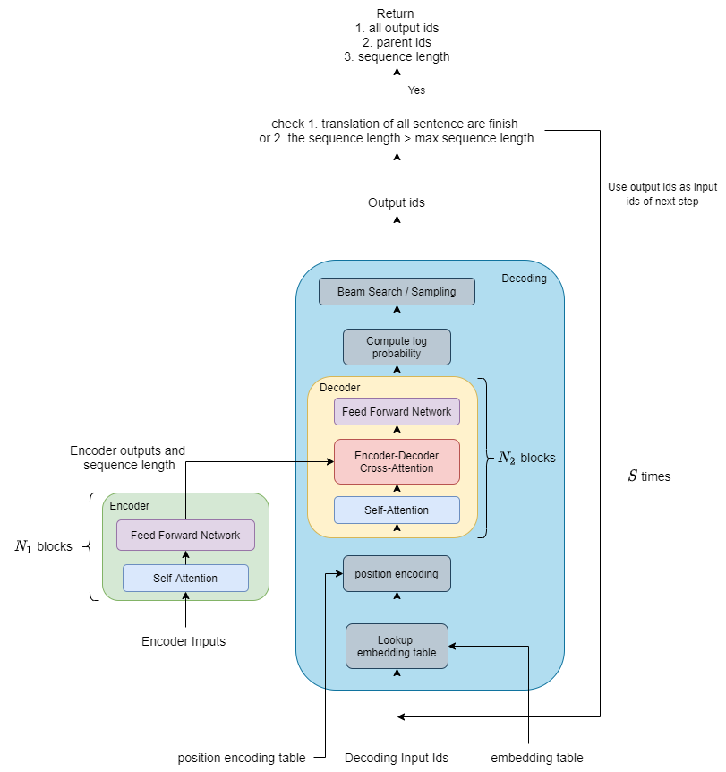
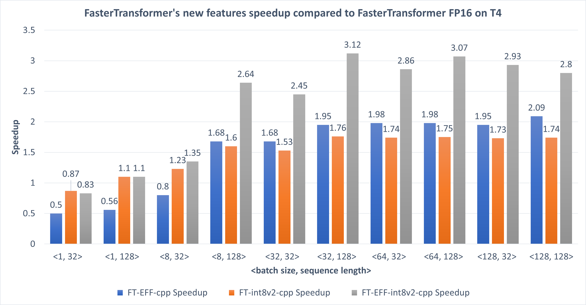
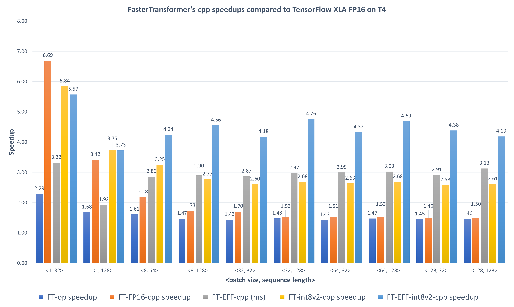
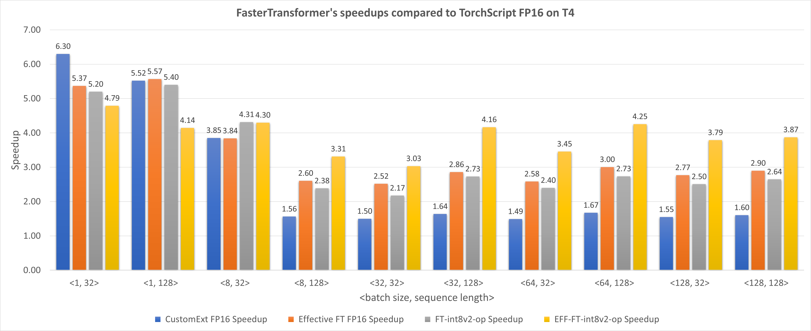
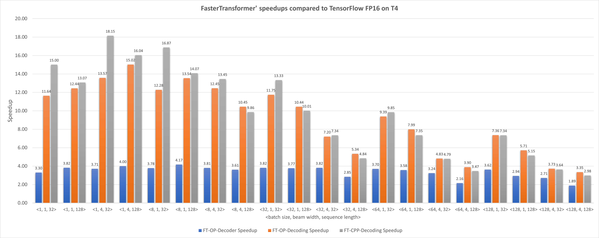
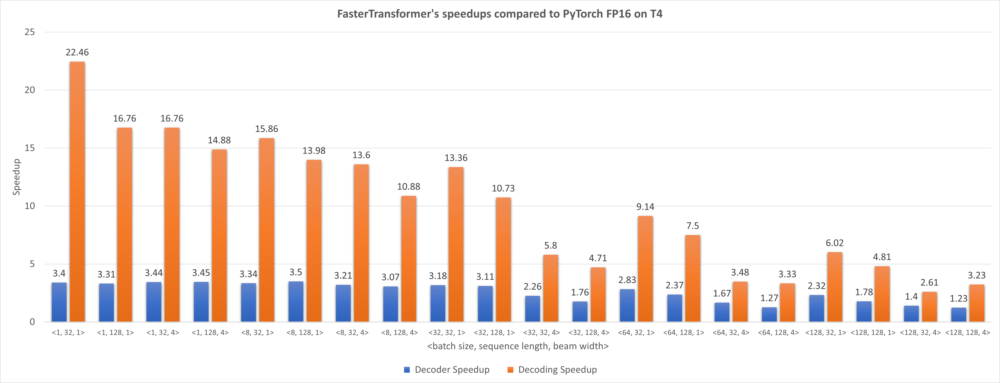

# FasterTransformer

This repository provides a script and recipe to run the highly optimized transformer-based encoder and decoder component, and it is tested and maintained by NVIDIA.

## Table Of Contents

- [FasterTransformer](#fastertransformer)
  - [Table Of Contents](#table-of-contents)
  - [Model overview](#model-overview)
    - [Configuration support matrix](#configuration-support-matrix)
  - [Setup](#setup)
    - [Requirements](#requirements)
  - [Quick Start Guide](#quick-start-guide)
    - [Build the FasterTransformer](#build-the-fastertransformer)
    - [Execute the encoder demos](#execute-the-encoder-demos)
    - [Execute the decoder/decoding demos](#execute-the-decoderdecoding-demos)
    - [Translation demos](#translation-demos)
  - [Advanced](#advanced)
    - [Scripts and sample codes](#scripts-and-sample-codes)
    - [Command-line options](#command-line-options)
    - [Inference process](#inference-process)
  - [Performance](#performance)
    - [Encoder performance](#encoder-performance)
      - [Encoder performances of FasterTransformer new features on cpp](#encoder-performances-of-fastertransformer-new-features-on-cpp)
      - [Encoder performance on TensorFlow](#encoder-performance-on-tensorflow)
      - [Encoder performance on PyTorch](#encoder-performance-on-pytorch)
    - [Decoding and Decoder performance](#decoding-and-decoder-performance)
      - [Decoder and Decoding performance on TensorFlow](#decoder-and-decoding-performance-on-tensorflow)
      - [Decoder and decoding performance on PyTorch](#decoder-and-decoding-performance-on-pytorch)
      - [TensorFlow performance on translation](#tensorflow-performance-on-translation)
      - [PyTorch performance on translation](#pytorch-performance-on-translation)
  - [Release notes](#release-notes)
    - [Changelog](#changelog)
    - [Known issues](#known-issues)
    - [TODO](#todo)

## Model overview


In NLP, encoder and decoder are two important components, with the transformer layer becoming a popular architecture for both components. FasterTransformer implements a highly optimized transformer layer for both the encoder and decoder for inference. On Volta, Turing and Ampere GPUs, the computing power of Tensor Cores are used automatically when the precision of the data and weights are FP16. 

In FasterTransformer 1.0, we implemented a highly optimized BERT transformer layer, which is used in the encoder.

In FasterTransformer 2.0, we have added a highly optimized decoder and decoding models based on OpenNMT-TF, an open-source library. Here, the decoder is the model that contains some transformer layers. On the other hand, decoding refers to the whole translating process, including the lookup embedding table, position encoding, a decoder and beam search. 

In FasterTransformer 2.1, we add some important features. First one is the supporting on PyTorch. Recently, there are more and more PyTorch users. We hope the users of PyTorch can also use the FasterTransformer in their application and research. The second feature is the supporting of [Effective Transformer](https://github.com/bytedance/effective_transformer). This idea is proposed by ByteDance. We call this feature as Effective FasterTransformer It removes the useless padding of encoder input to reduce the computing cost. Third, in addition to decoding with beam search, we also provide the decoding with sampling module. Finally, we optimize many kernels of encoder, decoder and beam search to improve the speed of FasterTransformer.

In FasterTransformer 3.0, we implemented the INT8 quantization for encoder (also supporting Effective FasterTransformer). With INT8 quantization, we can take advantage of the powerful INT8 tensor core in Turing GPU to achieve better inference performance (INT8 quantization in FT 3.0 is only supported on device with SM >= 7.5). We also provide quantization tools of tensorflow. 

In FasterTransformer 3.1, we provide following new features and enhancements. First, we optimize the INT8 kernel of encoder to achieve better performance. Compare to FasterTransformer 3.0, the performance of INT8 quantization brings at most 1.75x speedup. Second, we provide a PyTorch tool to let user be able to train a INT8 quantized model on PyTorch. Besides, FasterTransformer also starts to support the INT8 inference with PyTorch op. So, the users of PyTorch can leverage the INT8 inference. Third, we integrate the fused multi-head attention kernel of TensorRT plugin into FasterTransformer to improve the speed of encoder on Turing and new GPUs. This optimization can bring about 10% ~ 20% speedup compare to original implementation. Finally, we add the supporting of GPT-2 model, which is an important and popular model for decoder.

The following graph demonstrates the model architecture. 

<div align=center></div>
<div align=center>Fig. 1 Encoder-Decoding model architecture.</div>

FasterTransformer is built on top of CUDA, cuBLAS and cuBLASLt, providing the C++ API and TensorFlow/PyTorch OPs. Users can integrate them into TensorFlow, PyTorch, or other inference service codes that are built in native C++. We also provide some simple sample code to demonstrate how to use the encoder, decoder and to carry out decoding in C++, TensorFlow and PyTorch. 

More details are in [`docs/encoder_guide.md`](docs/encoder_guide.md) and [`docs/decoder_guide.md`](docs/decoder_guide.md). Some common questions and the respective answers are put in [`docs/QAList.md`](docs/QAList.md)

### Configuration support matrix

The following configurations are supported in the FasterTransformer encoder. 
- Batch size (B<sub>1</sub>): smaller or equal to 4096
- Sequence length (S): smaller or equal to 1024. For INT8 data type, sequence length should be a multiple of 32. 
- Head number (H) and size per head (N): 
  - 16 heads * 64 per heads
  - 12 heads * 64 per heads
  - 4 heads * 32 per heads
  - 8 heads * 96 per heads
- Data type: FP32, FP16 and INT8
- Any number layer (N<sub>1</sub>) if the memory is enough

The following configurations are supported in the FasterTransformer decoder and decoding.
- Batch size (B<sub>1</sub>) * beam width (B<sub>2</sub>): smaller than 1024
- Beam width: 1, 4, 16, 32 and 64 
- Sequence length (S): smaller than 4096 
- Head number (H): 8,12 and 16
- Size per head (N): 32, 64 and 96
- Vocabulary size (V): from 64 to 40000
- Data type: FP32 and FP16
- Any number layer (N<sub>2</sub>) if the memory is enough

## Setup

The following section lists the requirements to use FasterTransformer.

### Requirements

- CMake >= 3.8 for Tensorflow, CMake >= 3.13 for PyTorch
- CUDA 10.1 or newer version
- Python 3 is recommended because some features are not supported in python 2
- Tensorflow 1.13 or 1.14 or 1.15
- PyTorch >= 1.4.0
- TensorRT 5 or newer version

These components are readily available within the NGC TensorFlow/PyTorch Docker image below.

Ensure you have the following components:
- [NVIDIA Docker](https://github.com/NVIDIA/nvidia-docker) and NGC container are recommended
- [NVIDIA Pascal](https://www.nvidia.com/en-us/data-center/pascal-gpu-architecture/) or [Volta](https://www.nvidia.com/en-us/data-center/volta-gpu-architecture/) or [Turing](https://www.nvidia.com/en-us/geforce/turing/) or [Ampere](https://www.nvidia.com/en-us/data-center/nvidia-ampere-gpu-architecture/) based GPU 

For more information about how to get started with NGC containers, see the following sections from the NVIDIA GPU Cloud Documentation and the Deep Learning Documentation:

- [Getting Started Using NVIDIA GPU Cloud](https://docs.nvidia.com/ngc/ngc-getting-started-guide/index.html)
- [Accessing And Pulling From The NGC Container Registry](https://docs.nvidia.com/deeplearning/frameworks/user-guide/index.html#accessing_registry)
- [Running TensorFlow](https://docs.nvidia.com/deeplearning/frameworks/tensorflow-release-notes/running.html#running)
- [Running PyTorch](https://docs.nvidia.com/deeplearning/frameworks/pytorch-release-notes/index.html)

For those unable to use the NGC container, to set up the required environment or create your own container, see the versioned [NVIDIA Container Support Matrix](https://docs.nvidia.com/deeplearning/frameworks/support-matrix/index.html).

## Quick Start Guide 

The following section shows how to use FasterTransformer on the NGC container. 

### Build the FasterTransformer

1. Run the container.

    You can choose the tensorflow version and python version you want. Here, we list some possible images:

    - `nvcr.io/nvidia/tensorflow:19.06-py3` contains the TensorFlow 1.13 and python 3.5.
    - `nvcr.io/nvidia/tensorflow:19.07-py2` contains the TensorFlow 1.14 and python 2.7. 
    - `nvcr.io/nvidia/tensorflow:20.07-tf1-py3` contains the TensorFlow 1.15 and python 3.6. 
    - `nvcr.io/nvidia/tensorrt:20.03-py3` contains the TensorRT 7.0.0 and python 3.6.
    - `nvcr.io/nvidia/pytorch:20.01-py3` contains the PyTorch 1.4.0 and python 3.6
    - `nvcr.io/nvidia/pytorch:20.03-py3` contains the PyTorch 1.5.0 and python 3.6
    - `nvcr.io/nvidia/pytorch:20.07-py3` contains the PyTorch 1.6.0 and python 3.6

    For example, running image `nvcr.io/nvidia/tensorflow:19.07-py2` by 

    ```bash
    nvidia-docker run -ti --rm nvcr.io/nvidia/tensorflow:19.07-py2 bash
    ```

2. Clone the repository.

    ```bash
    git clone https://github.com/NVIDIA/DeepLearningExamples
    cd DeepLearningExamples/FasterTransformer/v3.1
    mkdir -p build
    cd build
    ```

3. Build the project.

    3.1 build with C++

    ```bash
    cmake -DSM=xx -DCMAKE_BUILD_TYPE=Release ..
    make
    ```

    Note: `xx` is the compute capability of your GPU. For example, 60 (P40) or 61 (P4) or 70 (V100) or 75(T4).

    3.2 build with TensorFlow 

    * `nvcr.io/nvidia/tensorflow:19.06-py3` 

    First, update the cmake to cmake 3.8 or later version, and then build the project by the following scripts.

    ```bash
    cmake -DSM=xx -DCMAKE_BUILD_TYPE=Release -DBUILD_TF=ON -DTF_PATH=/usr/local/lib/python3.5/dist-packages/tensorflow .. 
    make
    ```

    Note: `xx` is the compute capability of your GPU. For example, 60 (P40) or 61 (P4) or 70 (V100) or 75(T4).

    * `nvcr.io/nvidia/tensorflow:19.07-py2` 

    First, link the `libtensorflow_framework.so`, and then build the project by the following scripts.

    ```bash
    ln -s /usr/local/lib/python2.7/dist-packages/tensorflow/libtensorflow_framework.so.1 /usr/local/lib/python2.7/dist-packages/tensorflow/libtensorflow_framework.so
    cmake -DSM=xx -DCMAKE_BUILD_TYPE=Release -DBUILD_TF=ON -DTF_PATH=/usr/local/lib/python2.7/dist-packages/tensorflow ..
    make 
    ```

    Note: `xx` is the compute capability of your GPU. For example, 60 (P40) or 61 (P4) or 70 (V100) or 75(T4).

    * `nvcr.io/nvidia/tensorflow:20.07-tf1-py3`

    First, link the `libtensorflow_framework.so`, and then build the project by the following scripts.

    ```bash
    ln -s /usr/local/lib/python3.6/dist-packages/tensorflow_core/libtensorflow_framework.so.1 /usr/local/lib/python3.6/dist-packages/tensorflow_core/libtensorflow_framework.so
    cmake -DSM=xx -DCMAKE_BUILD_TYPE=Release -DBUILD_TF=ON -DTF_PATH=/usr/local/lib/python3.6/dist-packages/tensorflow_core/ ..
    make 
    ```

    Note: `xx` is the compute capability of your GPU. For example, 60 (P40) or 61 (P4) or 70 (V100) or 75(T4).

    3.3 build with TensorRT

    * `nvcr.io/nvidia/tensorrt:20.03-py3`

    ```bash
    cmake -DSM=xx -DCMAKE_BUILD_TYPE=Release -DBUILD_TRT=ON -DTRT_PATH=/opt/tensorrt/ ..
    make
    ```

    Note: `xx` is the compute capability of your GPU. For example, 60 (P40) or 61 (P4) or 70 (V100) or 75(T4).

    3.4 build with PyTorch

    * `nvcr.io/nvidia/pytorch:20.01-py3`

    ```bash
    cmake -DSM=xx -DCMAKE_BUILD_TYPE=Release -DBUILD_THE=ON ..
    make
    ```

    * `nvcr.io/nvidia/pytorch:20.03-py3` or later

    ```bash
    cmake -DSM=xx -DCMAKE_BUILD_TYPE=Release -DBUILD_THE=ON -DBUILD_THS=ON -DCXX_STD=14 ..
    make
    ```

    Note: `xx` is the compute capability of your GPU. For example, 60 (P40) or 61 (P4) or 70 (V100) or 75(T4). (You can ignore this variable.)

    `-DBUILD_THE=ON` is to build the regular PyTorch extension for eager mode. It is not compatible with TorchScript, but it may be compatible with more PyTorch versions.

    `-DBUILD_THS=ON` is to build the TorchScript custom class. If you want to use this custom class, please make sure that the `PyTorch >= 1.5.0`.

    ***You can choose one of them or all. No need to add all options.***

    For `PyTorch == 1.4.0`, please use C++11, that is, `-DCXX_STD=11` or just ignore this variable.

    For `PyTorch >= 1.5.0`, please use C++14, that is, `-DCXX_STD=14`.

    Note: From `FasterTransformer 3.1`, TorchScript custom op (function type) is deprecated.

### Execute the encoder demos

1. Run FasterTransformer encoder on C++

    

    ```bash
    ./bin/encoder_gemm <batch_size> <sequence_length> <head_number> <size_per_head> <is_use_fp16> <int8_mode>
    ./bin/encoder_sample <batch_size> <num_layers> <sequence_length> <head_number> <size_per_head> <is_use_fp16> <is_remove_padding> <int8_mode> <allow_gemm_test>
    ```

    1.1 Run FasterTransformer encoder under FP32 on C++

    ```bash
    ./bin/encoder_gemm 32 32 12 64 0 0
    ./bin/encoder_sample 32 12 32 12 64 0 0 0 0
    ``` 

    1.2 Run FasterTransformer encoder under FP16 on C++

    ```bash
    ./bin/encoder_gemm 32 32 12 64 1 0
    ./bin/encoder_sample 32 12 32 12 64 1 0 0 0
    ```
    
    1.3 Run FasterTransformer encoder under INT8 on C++
    
    We implement two INT8 pipelines. For int8_mode == 1 (int8v1), we don't quantize residual connection, use int32 as the output of int8 gemms and use per-channel quantization for weights; for int8_mode == 2 (int8v2), we quantize residual connection, use int8 as the output of int8 gemms and use per-tensor quantization for weights. Generally speaking, int8_mode == 1 will have higher accuracy while int8_mode == 2 will have better performance.  

    
    | feature | int8_mode == 1 | int8_mode == 2 | 
    |:-------:|:-------------:|:-------------:| 
    | quantize residual | No | Yes |
    | int8 output gemm | No | Yes |
    | per-channel quantiztion for weights | Yes | No |

    ```bash
    #For int8_mode == 1
    ./bin/encoder_gemm 32 32 12 64 1 1
    ./bin/encoder_sample 32 12 32 12 64 1 0 1 0
    
    #For int8_mode == 2
    ./bin/encoder_gemm 32 32 12 64 1 2
    ./bin/encoder_sample 32 12 32 12 64 1 0 2 0
    ```

    1.4 Run Effective FasterTransformer under FP32 on C++

    ```bash
    ./bin/encoder_gemm 32 32 12 64 0 0
    ./bin/encoder_sample 32 12 32 12 64 0 1 0 0
    ```
    
    1.5 Run Effective FasterTransformer under INT8 on C++
    
     ```bash
    #For int8_mode == 1
    ./bin/encoder_gemm 32 32 12 64 1 1
    ./bin/encoder_sample 32 12 32 12 64 1 1 1 0
    
    #For int8_mode == 2
    ./bin/encoder_gemm 32 32 12 64 1 2
    ./bin/encoder_sample 32 12 32 12 64 1 1 2 0

2. Run FasterTransformer encoder on TensorFlow

    2.1 Run FasterTransformer encoder under FP32 on TensorFlow

    ```bash
    ./bin/encoder_gemm 32 32 12 64 0 0
    python tensorflow/encoder_sample.py \
            --batch_size 32 \
            --max_seq_len 32 \
            --head_number 12 \
            --size_per_head 64 \
            --num_layer 12 \
            --data_type fp32 \
            --test_time 1 \
            --allow_gemm_test False
    ```

    2.2 Run FasterTransformer encoder under FP16 on TensorFlow

    ```bash
    ./bin/encoder_gemm 32 32 12 64 1 0
    python tensorflow/encoder_sample.py \
            --batch_size 32 \
            --max_seq_len 32 \
            --head_number 12 \
            --size_per_head 64 \
            --num_layer 12 \
            --data_type fp16 \
            --test_time 1 \
            --allow_gemm_test False
    ```
    
    2.3 Run FasterTransformer encoder under INT8 on TensorFlow
    ```bash
    #For int8_mode == 1
    ./bin/encoder_gemm 32 32 12 64 1 1
    python tensorflow/encoder_sample.py \
            --batch_size 32 \
            --max_seq_len 32 \
            --head_number 12 \
            --size_per_head 64 \
            --num_layer 12 \
            --data_type fp16 \
            --test_time 1 \
            --int8_mode 1 \
            --allow_gemm_test False
    
    #For int8_mode == 2
    ./bin/encoder_gemm 32 32 12 64 1 2
    python tensorflow/encoder_sample.py \
            --batch_size 32 \
            --max_seq_len 32 \
            --head_number 12 \
            --size_per_head 64 \
            --num_layer 12 \
            --data_type fp16 \
            --test_time 1 \
            --int8_mode 2 \
            --allow_gemm_test False
    ```

    2.4 Run Effective FasterTransformer under FP32 on TensorFlow

    ```bash
    ./bin/encoder_gemm 32 32 12 64 0 0
    python tensorflow/encoder_sample.py \
            --batch_size 32 \
            --max_seq_len 32 \
            --head_number 12 \
            --size_per_head 64 \
            --num_layer 12 \
            --data_type fp32 \
            --test_time 1 \
            --remove_padding True \
            --avg_seq_len 16 \
            --allow_gemm_test False
    ```
    
    2.5 Run Effective FasterTransformer under INT8 on TensorFlow
    ```bash
    #For int8_mode == 1
    ./bin/encoder_gemm 32 32 12 64 1 1
    python tensorflow/encoder_sample.py \
            --batch_size 32 \
            --max_seq_len 32 \
            --head_number 12 \
            --size_per_head 64 \
            --num_layer 12 \
            --data_type fp16 \
            --test_time 1 \
            --remove_padding True \
            --avg_seq_len 16 \
            --int8_mode 1 \
            --allow_gemm_test False
    
    #For int8_mode == 2
    ./bin/encoder_gemm 32 32 12 64 1 2
    python tensorflow/encoder_sample.py \
            --batch_size 32 \
            --max_seq_len 32 \
            --head_number 12 \
            --size_per_head 64 \
            --num_layer 12 \
            --data_type fp16 \
            --test_time 1 \
            --remove_padding True \
            --avg_seq_len 16 \
            --int8_mode 2 \
            --allow_gemm_test False
    ```

3. Run FasterTransformer on PyTorch

    Please install HuggingFace's `transformers` first before run the demos by
    ```bash
    pip install transformers==2.5.1
    ```

    3.1 Run FasterTransformer encoder under FP32 on PyTorch

    ```bash
    ./bin/encoder_gemm 32 32 12 64 0 0
    python pytorch/encoder_sample.py 32 12 32 12 64 --time
    ```

    3.2 Run FasterTransformer encoder under FP16 on PyTorch

    ```bash
    ./bin/encoder_gemm 32 32 12 64 1 0
    python pytorch/encoder_sample.py 32 12 32 12 64 --fp16 --time
    ```

    3.3 Run FasterTransformer encoder under INT8 on PyTorch

    ```bash
    #For int8_mode == 1
    ./bin/encoder_gemm 32 32 12 64 1 1
    python pytorch/encoder_sample.py 32 12 32 12 64 --int8_mode 1 --time

    #For int8_mode == 2
    ./bin/encoder_gemm 32 32 12 64 1 2
    python pytorch/encoder_sample.py 32 12 32 12 64 --int8_mode 2 --time
    ```

    3.4 Run Effective FasterTransformer under FP32 on PyTorch

    ```bash
    ./bin/encoder_gemm 32 32 12 64 0 0
    python pytorch/encoder_sample.py 32 12 32 12 64 --time --remove_padding
    ```

4. Run FasterTransformer on TensorRT

    4.1 Run FasterTransformer under FP32 on TensorRT

    ```bash
    ./bin/encoder_gemm 32 32 12 64 0 0
    ./bin/transformer_trt 32 12 32 12 64 fp32
    ```

    4.2 Run FasterTransformer under FP16 on TensorRT

    ```bash
    ./bin/encoder_gemm 32 32 12 64 1 0
    ./bin/transformer_trt 32 12 32 12 64 fp16
    ```

### Execute the decoder/decoding demos

1. Run FasterTransformer decoding on C++

    ```bash
    ./bin/decoding_gemm <batch_size> <beam_width> <head_number> <size_per_head> <vocab_size> <sequence_length> <encoder_hidden_dim> <is_use_fp16>
    ./bin/decoding_beamsearch_sample <batch_size> <beam_width> <head_number> <size_per_head> <vocab_size> <sequence_length> <num_layers> <encoder_hidden_dim> <is_use_fp16>
    ./bin/decoding_sampling_sample <batch_size> <candidate_num> <probability_threshold> <head_number> <size_per_head> <vocab_size> <sequence_length> <num_layers> <encoder_hidden_dim> <is_use_fp16>
    ```

    1.1 Run decoding under FP32 on C++

    ```bash
    ./bin/decoding_gemm 32 4 8 64 30000 32 512 0
    ./bin/decoding_beamsearch_sample 32 4 8 64 30000 32 6 512 0 # beam search

    ./bin/decoding_gemm 32 1 8 64 30000 32 512 0
    ./bin/decoding_sampling_sample 32 4 0.0 8 64 30000 32 6 512 0 # top k sampling
    ./bin/decoding_sampling_sample 32 0 0.01 8 64 30000 32 6 512 0 # top p sampling
    ```

    1.2 Run decoding under FP16 on C++

    ```bash
    ./bin/decoding_gemm 32 4 8 64 30000 32 512 1
    ./bin/decoding_beamsearch_sample 32 4 8 64 30000 32 6 512 1 # beam search

    ./bin/decoding_gemm 32 1 8 64 30000 32 512 1
    ./bin/decoding_sampling_sample 32 4 0.0 8 64 30000 32 6 512 1 # top k sampling
    ./bin/decoding_sampling_sample 32 0 0.01 8 64 30000 32 6 512 1 # top p sampling
    ```

2. Run FasterTransformer decoder/decoding on TensorFlow

    2.1 Run FasterTransformer decoder under FP32 on TensorFlow

    2.1.1 Verify the correctness

    ```bash
    ./bin/decoding_gemm 32 4 8 64 30000 32 512 0
    python tensorflow/decoder_sample.py \
            --batch_size 32 \
            --beam_width 4 \
            --head_number 8 \
            --size_per_head 64 \
            --vocab_size 30000 \
            --max_seq_len 32 \
            --num_layer 6 \
            --memory_hidden_dim 512 \
            --data_type fp32 \
            --decoder_type 2 
    ```

    2.1.2 Test time of TensorFlow decoder

    ```bash
    python tensorflow/decoder_sample.py \
            --batch_size 32 \
            --beam_width 4 \
            --head_number 8 \
            --size_per_head 64 \
            --vocab_size 30000 \
            --max_seq_len 32 \
            --num_layer 6 \
            --memory_hidden_dim 512 \
            --data_type fp32 \
            --decoder_type 0 \
            --test_time 1
    ```

    2.1.3 Test time of FasterTransformer decoder

    ```bash
    ./bin/decoding_gemm 32 4 8 64 30000 32 512 0
    python tensorflow/decoder_sample.py \
            --batch_size 32 \
            --beam_width 4 \
            --head_number 8 \
            --size_per_head 64 \
            --vocab_size 30000 \
            --max_seq_len 32 \
            --num_layer 6 \
            --memory_hidden_dim 512 \
            --data_type fp32 \
            --decoder_type 1 \
            --test_time 1
    ```

    2.2 Run FasterTransformer decoder under FP16 on TensorFlow

    ```bash
    ./bin/decoding_gemm 32 4 8 64 30000 32 512 1
    python tensorflow/decoder_sample.py \
            --batch_size 32 \
            --beam_width 4 \
            --head_number 8 \
            --size_per_head 64 \
            --vocab_size 30000 \
            --max_seq_len 32 \
            --num_layer 6 \
            --memory_hidden_dim 512 \
            --data_type fp16 \
            --decoder_type 2 
    ```

    2.3 Run FasterTransformer decoding under FP32 on TensorFlow

    ```bash
    ./bin/decoding_gemm 32 4 8 64 30000 32 512 0
    python tensorflow/decoding_sample.py \
            --batch_size 32 \
            --beam_width 4 \
            --head_number 8 \
            --size_per_head 64 \
            --vocab_size 30000 \
            --max_seq_len 32 \
            --num_layer 6 \
            --memory_hidden_dim 512 \
            --data_type fp32 \
            --beam_search_diversity_rate -1.3 \
            --sampling_topk 0 \
            --sampling_topp 0.01 \
            --test_time 0123
    ```

    2.4 Run FasterTransformer decoding under FP16 on TensorFlow

    ```bash
    ./bin/decoding_gemm 32 4 8 64 30000 32 512 1
    python tensorflow/decoding_sample.py \
            --batch_size 32 \
            --beam_width 4 \
            --head_number 8 \
            --size_per_head 64 \
            --vocab_size 30000 \
            --max_seq_len 32 \
            --num_layer 6 \
            --memory_hidden_dim 512 \
            --data_type fp16 \
            --beam_search_diversity_rate -1.3 \
            --sampling_topk 0 \
            --sampling_topp 0.01 \
            --test_time 0123
    ```

3. Run FasterTransformer decoder/decoding on PyTorch

    Please install OpenNMT-py first before running the demos by
    ```bash
    pip install opennmt-py==1.1.1
    ```

    3.1 Run FasterTransformer decoder under FP32 on PyTorch

    ```bash
    ./bin/decoding_gemm 8 4 8 64 31538 32 512 0
    python pytorch/decoder_sample.py 8 6 32 8 64 --time
    ```

    3.2 Run FasterTransformer decoder under FP16 on PyTorch

    ```bash
    ./bin/decoding_gemm 8 4 8 64 31538 32 512 1
    python pytorch/decoder_sample.py 8 6 32 8 64 --fp16 --time
    ```

    3.3 Run FasterTransformer decoding under FP32 on PyTorch

    ```bash
    ./bin/decoding_gemm 8 4 8 64 31538 32 512 0
    python pytorch/decoding_sample.py 8 6 32 8 64 4 31538 --time
    ```
    
    3.4 Run FasterTransformer decoding under FP16 on PyTorch

    ```bash
    ./bin/decoding_gemm 8 4 8 64 31538 32 512 1
    python pytorch/decoding_sample.py 8 6 32 8 64 4 31538 --fp16 --time
    ```

### Translation demos

1. Translation with FasterTransformer on TensorFlow

    1.1 Prepare data and model

    ```bash
    bash tensorflow/utils/translation/download_model_data.sh
    ```

    1.2 Run under FP32

    ```bash
    ./bin/decoding_gemm 128 4 8 64 32001 100 512 0
    python tensorflow/translate_sample.py \
            --batch_size 128 \
            --beam_width 4 \
            --encoder_head_number 8 \
            --encoder_size_per_head 64 \
            --decoder_head_number 8 \
            --decoder_size_per_head 64 \
            --max_seq_len 32 \
            --encoder_num_layer 6 \
            --decoder_num_layer 6 \
            --data_type fp32 \
            --beam_search_diversity_rate 0.0 \
            --sampling_topk 1 \
            --sampling_topp 0.00 \
            --test_time 012345
    ```

    1.3 Run under FP16

    ```bash
    python tensorflow/tensorflow_bert/ckpt_type_convert.py --init_checkpoint=translation/ckpt/model.ckpt-500000 --fp16_checkpoint=translation/ckpt/fp16_model.ckpt-500000
    ./bin/decoding_gemm 128 4 8 64 32001 100 512 1
    python tensorflow/translate_sample.py \
          --batch_size 128 \
          --beam_width 4 \
          --encoder_head_number 8 \
          --encoder_size_per_head 64 \
          --decoder_head_number 8 \
          --decoder_size_per_head 64 \
          --max_seq_len 32 \
          --encoder_num_layer 6 \
          --decoder_num_layer 6 \
          --data_type fp16 \
          --beam_search_diversity_rate 0.0 \
          --sampling_topk 1 \
          --sampling_topp 0.00 \
          --test_time 012345
    ```

2.  Translation with FasterTransformer on PyTorch

    2.1 Prepare model and data

    ```bash
    bash pytorch/scripts/download_translation_model.sh
    ```

    2.2 Run under FP32

    ```bash
    ./bin/decoding_gemm 128 4 8 64 31538 100 512 0
    python pytorch/run_translation.py --batch_size 128 --beam_size 4 --model_type decoding_ext --data_type fp32
    ```

    2.3 Run under FP16

    ```bash
    ./bin/decoding_gemm 128 4 8 64 31538 100 512 1
    python pytorch/run_translation.py --batch_size 128 --beam_size 4 --model_type decoding_ext --data_type fp16
    ```

## Advanced

The following sections provide greater details.

### Scripts and sample codes

The following code lists the directory structure of FasterTransformer: 

```bash
/fastertransformer: source code of transformer
    |--/cuda: some CUDA kernels and multi-head attention implementation, both are compiled with cuda/cuBLAS/cuBLASLt. 
    |--/tf_op: custom Tensorflow OP implementation
    |--/th_op: custom PyTorch OP implementation
    |--/trt_plugin: TensorRT plugin implementation
/sample: C++ and tensorflow transformer interface samples
    |--/cpp: C++ interface samples
    |--/pytorch: PyTorch OP samples
    |--/tensorflow: TensorFlow OP samples
        |--/tensorflow_bert: samples that show of how to integrate our Tensorflow OP into the open source BERT model for sentence (and sentence-pair) classification tasks (GLUE), the samples support both FP16 and FP32, see readme file within this folder more details
    |--/tensorRT: both FP16 and FP32 tensorRT plugin samples
/tools/gemm_test: loop over all GEMM algorithms to pick the best one
/bert-quantization/
    |--bert-tf-quantization: TensorFlow quantization tool and sample codes
    |--bert-pyt-quantization/: PyTorch quantization sample codes
/docs/
```

In the root directory of FasterTransformer, the most important directories are:
* `fastertransformer/`
* `sample/`
* `tools/`
* `bert-quantization/`
* `docs/`

The `fastertransformer/` folder encapsulates all the source codes of FasterTransformer:
* `tf_op/` - Contains the TensorFlow Op source files of encoder, decoder and decoding 
* `th_op/` - Contains the PyTorch Op source files of encoder, decoder and decoding 
* `cuda/` - Contains all CUDA kernels of FasterTransformer
* `bert_encoder_transformer.h` - Contains the encoder transformer layer 
* `open_decoder.h` - Contains the decoder transformer layer
* `decoding_beamsearch.h` - Contains the progress of decoding with beam search
* `decoding_sampling.h` - Contains the progress of decoding with beam search
* `gpt2.h` - Contains the progress of GPT-2

The `tools/` folder contains the tools to generate the GEMM configuration of FasterTransformer for different settings: 
* `tools/gemm_test/encoder_gemm.cc` - Encoder GEMM config
* `tools/gemm_test/decoding_gemm.cc` - Decoder and decoding GEMM config 

The `sample/` folder contains useful sample codes for FasterTransformer:
* `sample/cpp/encoder_sample.cc` - C encoder sample codes 
* `sample/cpp/decoding_beamsearch_sample.cc` - C decoding with beam search sample codes 
* `sample/cpp/decoding_sampling_sample.cc` - C decoding with sampling sample codes 
* `sample/cpp/gpt2_sample.cc` - C GPT-2 codes
* `sample/tensorflow/encoder_sample.py` - TensorFlow encoder sample codes
* `sample/tensorflow/encoder_sample_int8.py` - TensorFlow encoder sample codes for INT8
* `sample/tensorflow/decoder_sample.py` - TensorFlow decoder sample codes 
* `sample/tensorflow/decoding_sample.py` - TensorFlow decoding sample codes 
* `sample/tensorflow/tensorflow_bert/` - TensorFlow using FasterTransformer in BERT sample codes
* `sample/tensorflow/encoder_decoder_sample.py` - TensorFlow `encoder_decoder` sample codes 
* `sample/tensorflow/encoder_decoding_sample.py` - TensorFlow `encoder_decoding` sample codes 
* `sample/tensorflow/translate_sample.py` - TensorFlow translation sample codes
* `sample/tensorflow/gpt2_sample.py` - TensorFlow GPT-2 sample codes
* `sample/pytorch/encoder_sample.py` - PyTorch encoder sample codes 
* `sample/pytorch/decoder_sample.py` - PyTorch decoder sample codes 
* `sample/pytorch/decoding_sample.py` - PyTorch decoding sample codes 
* `sample/pytorch/run_glue.py` - PyTorch BERT on GLUE dataset sample codes 
* `sample/pytorch/run_squad.py` - PyTorch BERT on SQuAD dataset sample codes 
* `sample/pytorch/run_translation.py` - PyTorch decoding for translation sample codes 

### Command-line options

To see the full list of available options and their descriptions, use the `-h` or `--help` command-line option with the Python file, for example:

```bash
python tensorflow/encoder_sample.py --help
python tensorflow/encoder_sample_int8.py --help
python tensorflow/decoder_sample.py --help
python tensorflow/decoding_sample.py --help
python tensorflow/encoder_decoder_sample.py --help
python tensorflow/encoder_decoding_sample.py --help
python tensorflow/translate_sample.py --help
```

### Inference process

This subsection provides the details about how to use the encoder, the decoder and the decoding. 

## Performance 

Hardware settings: 
* T4 (with mclk 5000MHz, pclk 1590MHz) with Intel(R) Xeon(R) CPU E5-2670 0 @ 2.60GHz
* V100 (with mclk 877MHz, pclk 1380MHz) with Intel(R) Xeon(R) CPU E5-2698 v4 @ 2.20GHz (dgx-1 server)

In order to run the following benchmark, we need to install the unix computing tool "bc" by

```bash
apt-get install bc
```

### Encoder performance

We demonstrate the inference time of FasterTransformer in C++, TensorFlow and PyTorch, and compare to the performance of pure TensorFlow and PyTorch on T4 with FP16 and INT8. Besides, we also show the performance of Effective FasterTransformer on T4 with FP16. Note that the total sequence length of Effective FasterTransformer is not fixed, so we use the default gemm configuration to run the benchmark.

For the benchmark of TensorFlow, we compare the performance of TensorFlow with XLA (TF), the performance of TensorFlow with FasterTransformer OP (FT-OP) and the performance of FasterTransformer on C++ (TF-CPP), and show the speedup of FT-OP and FT-CPP compare to the TensorFlow. 

For the benchmark of PyTorch, we compare the performance of PyTorch, and performance of TorchScript and the performance of PyTorch with FasterTransformer custom extension (CustomExt) and show the speedup of CustomExt compare to the PyTorch and TorchScript. Because CustomExt has no obvious overhead compare to the FasterTransformer on C++, we skip the comparison with the C++ implementation.

The FP16 results of C++ and TensorFlow were obtained by running the `sample/tensorflow/scripts/profile_encoder_performance.sh` and `sample/tensorflow/scripts/profile_effective_transformer_performance.sh`.

The INT8 results of C++ and TensorFlow were obtained by running the `sample/tensorflow/scripts/profile_encoder_performance_int8.sh` and `sample/tensorflow/scripts/profile_effective_transformer_performance_int8.sh`.

The FP16 results of PyTorch were obtained by running the `sample/pytorch/scripts/profile_encoder.sh` and `sample/pytorch/scripts/profile_encoder_effective_transformer.sh`. 

The INT8 results of PyTorch were obtained by running the `sample/pytorch/scripts/profile_encoder_int8.sh` and `sample/pytorch/scripts/profile_encoder_effective_transformer_int8.sh`.

In the experiments of encoder, we updated the following parameters:

* head_num = 12
* size_per_head = 64 
* num_layers = 12

More benchmarks are put in [`docs/encoder_guide.md`](docs/encoder_guide.md#encoder-performance).

#### Encoder performances of FasterTransformer new features on cpp

The following figure compares the performances of different features of FasterTransformer and FasterTransformer under FP16 on T4.

For large batch size and sequence length, Effective FasterTransformer brings about 2x speedup and int8v2 brings about 1.75x speedup. Using Effective FasterTransformer and int8v2 at the same time can bring more than 3x speedup compared to FasterTransformer FP16.

<div align=center></div>

#### Encoder performance on TensorFlow

The following figure compares the performances of different features of FasterTransformer and TensorFlow XLA under FP16 on T4.

For small batch size and sequence length, using FasterTransformer CPP can bring about 3x ~ 6.5x speedup. 

For large batch size and sequence length, using Effective FasterTransformer with INT8 quantization can bring about 4x speedup.

<div align=center></div>

#### Encoder performance on PyTorch

The following figure compares the performances of different features of FasterTransformer and PyTorch TorchScript under FP16 on T4.

For small batch size and sequence length, using FasterTransformer CustomExt can bring about 4x ~ 6x speedup. 

For large batch size and sequence length, using Effective FasterTransformer with INT8 quantization can bring about 4x speedup.

<div align=center></div>

### Decoding and Decoder performance

We demonstrate the inference time of FasterTransformer in C++, TensorFlow and PyTorch, and compare to the performance of pure TensorFlow and PyTorch on T4 with FP16.

For the benchmark of TensorFlow, we compare the performance of TensorFlow (TF), the performance of FasterTransformer OP Decoder, FasterTransformer OP Decoding and the FasterTransformer CPP Decoding.

We do not demonstrate the performance of TensorFlow with XLA since we did not find that using XLA has obvious speedup. 

For the benchmark of PyTorch, we compare the performance of PyTorch, the performance of FasterTransformer OP Decoder and FasterTransformer OP Decoding. Due to the dynamic property, it is hard to trace/script the PyTorch decoder/decoding model, so we only test on plain PyTorch.

The results of C++ and TensorFlow were obtained by running the `sample/tensorflow/scripts/profile_decoder_performance.sh` and `sample/tensorflow/scripts/profile_decoding_performance.sh`.

The results of PyTorch were obtained by running the `../sample/pytorch/scripts/profile_decoder_decoding.sh`. 

In the experiments of decoding, we updated the following parameters:

* head_num = 8
* size_per_head = 64 
* num_layers = 6
* vocabulary_size = 30000 for TensorFlow sample codes, 31538 for PyTorch sample codes
* memory_hidden_dim = 512

More benchmarks are put in [`docs/decoder_guide.md`](docs/decoder_guide.md#decoding-performance).

#### Decoder and Decoding performance on TensorFlow

<div align=center></div>

#### Decoder and decoding performance on PyTorch

<div align=center></div>

#### TensorFlow performance on translation

We test with batch size 128, beam width 4 on V100.

| Type | tokens per seconds | BLEU |
|:----:|:------------------:|:----:|
| TensorFlow, beam search, FP32 | 2137  | BLEU 26.29 |
| Decoder, beam search, FP32    | 6473  | BLEU 26.29 |
| Decoding, beam search, FP32   | 8513  | BLEU 26.31 |
| TensorFlow, sampling, FP32    | 4178  | BLEU 25.79 |
| Decoder, sampling, FP32       | 10781 | BLEU 25.79 |
| Decoding, sampling, FP32      | 16524 | BLEU 25.79 |
| TensorFlow, beam search, FP16 | 2949  | BLEU 26.31 |
| Decoder, beam search, FP16    | 8682  | BLEU 26.30 |
| Decoding, beam search, FP16   | 12746 | BLEU 26.33 |
| TensorFlow, sampling, FP16    | 6968  | BLEU 25.83 |
| Decoder, sampling, FP16       | 13773 | BLEU 25.80 |
| Decoding, sampling, FP16      | 26718 | BLEU 25.82 |

#### PyTorch performance on translation

batch size 128, beam width 4, max_seq_len 32, beam search algorithm on V100:

| Type | tokens per seconds | BLEU |
|:----:|:------------------:|:----:|
| PyTorch, FP32  | 2462  | BLEU 24.1 |
| Decoder, FP32  | 3358  | BLEU 24.1 |
| Decoding, FP32 | 8959  | BLEU 24.1 |
| PyTorch, FP16  | 4019  | BLEU 24.1 |
| Decoder, FP16  | 4377  | BLEU 24.1 |
| Decoding, FP16 | 15048  | BLEU 24.1 |


<!-- batch size 128, beam width 4, max_seq_len 100, beam search algorithm on V100:

| Type | tokens per seconds | BLEU |
|:----:|:------------------:|:----:|
| PyTorch, FP32  | 2616  | BLEU 28.0 |
| Decoder, FP32  | 2804  | BLEU 28.0 |
| Decoding, FP32 | 4638  | BLEU 28.0 |
| PyTorch, FP16  | 2754  | BLEU 28.0 |
| Decoder, FP16  | 3848  | BLEU 28.0 |
| Decoding, FP16 | 7984  | BLEU 28.0 | -->

## Release notes

### Changelog

Dec 2020
- **Release the FasterTransformer 3.1**

Nov 2020
- Optimize the INT8 inference.
- Support PyTorch INT8 inference.
- Provide PyTorch INT8 quantiztion tools.
- Integrate the fused multi-head attention kernel of TensorRT into FasterTransformer.
- Add unit test of SQuAD. 
- Update the missed NGC checkpoints.

Sep 2020
- Support GPT2
- **Release the FasterTransformer 3.0**
  - Support INT8 quantization of encoder of cpp and TensorFlow op.
  - Add bert-tf-quantization tool.
  - Fix the issue that Cmake 15 or Cmake 16 fail to build this project.

Aug 2020
- Fix the bug of trt plugin.

June 2020
- **Release the FasterTransformer 2.1**
  - Add Effective FasterTransformer based on the idea of [Effective Transformer](https://github.com/bytedance/effective_transformer) idea.
  - Optimize the beam search kernels.
  - Add PyTorch op supporting

May 2020
- Fix the bug that seq_len of encoder must be larger than 3.
- Add the position_encoding of decoding as the input of FasterTransformer decoding. This is convenient to use different types of position encoding. FasterTransformer does not compute the position encoding value, but only lookup the table. 
- Modifying the method of loading model in `translate_sample.py`.

April 2020
- Rename `decoding_opennmt.h` to `decoding_beamsearch.h`
- Add DiverseSiblingsSearch for decoding.
- Add sampling into Decoding
  - The implementation is in the `decoding_sampling.h`
  - Add top_k sampling, top_p sampling for decoding.
- Refactor the tensorflow custom op codes.
  - Merge `bert_transformer_op.h`, `bert_transformer_op.cu.cc` into `bert_transformer_op.cc`
  - Merge `decoder.h`, `decoder.cu.cc` into `decoder.cc`
  - Merge `decoding_beamsearch.h`, `decoding_beamsearch.cu.cc` into `decoding_beamsearch.cc`
- Fix the bugs of finalize function decoding.py. 
- Fix the bug of tf DiverseSiblingSearch.
- Add BLEU scorer `bleu_score.py` into `utils`. Note that the BLEU score requires python3. 
- Fuse QKV Gemm of encoder and masked_multi_head_attention of decoder.
- Add dynamic batch size and dynamic sequence length features into all ops.

March 2020
- Add feature in FasterTransformer 2.0
  - Add `translate_sample.py` to demonstrate how to translate a sentence by restoring the pretrained model of OpenNMT-tf.
- Fix bugs of Fastertransformer 2.0
  - Fix the bug of maximum sequence length of decoder cannot be larger than 128.
  - Fix the bug that decoding does not check finish or not after each step. 
  - Fix the bug of decoder about max_seq_len.
  - Modify the decoding model structure to fit the OpenNMT-tf decoding model. 
    - Add a layer normalization layer after decoder.
    - Add a normalization for inputs of decoder

Febuary 2020
- **Release the FasterTransformer 2.0**
  - Provide a highly optimized OpenNMT-tf based decoder and decoding, including C++ API and TensorFlow op. 
  - Refine the sample codes of encoder.
  - Add dynamic batch size feature into encoder op.

July 2019
- **Release the FasterTransformer 1.0**
  - Provide a highly optimized bert equivalent transformer layer, including C++ API, TensorFlow op and TensorRT plugin. 

### Known issues

- Undefined symbol errors when import the extension
  - Please `import torch` first. If this has been done, it is due to the incompatible C++ ABI. You may need to check the PyTorch used during compilation and execution are the same, or you need to check how your PyTorch is compiled, or the version of your GCC, etc.
- batch_size should be smaller or equal to 1024 in Decoder.
- batch_size x beam_width should be smaller or equal to 1024 in Decoding.
- Results of TensorFlow and OP would be different in decoding. This problem is caused by the accumulated log probability, and we do not avoid this problem. 
- If encounter some problem in the custom environment, try to use the gcc/g++ 4.8 to build the project of TensorFlow op, especially for TensorFlow 1.14. 

### TODO

- Refactor the codes
- Split the initialization of top k and top p sampling
