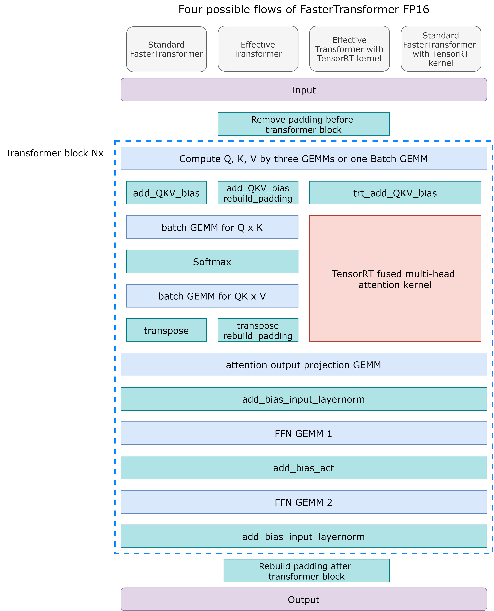
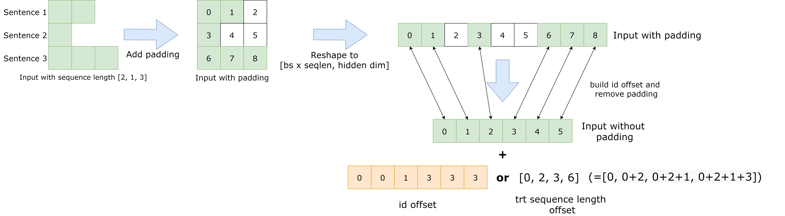
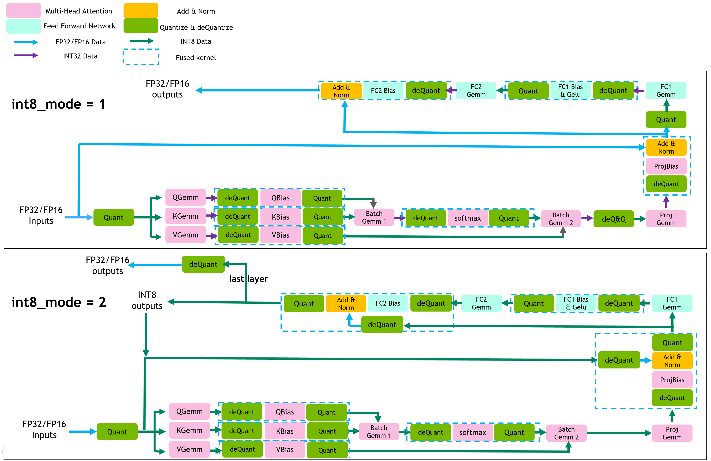

# FasterTransformer Encoder

The FasterTransformer Encoder contains the optimized BERT model, Effective FasterTransformer and INT8 quantization inference. 

## Table Of Contents

- [FasterTransformer Encoder](#fastertransformer-encoder)
  - [Table Of Contents](#table-of-contents)
  - [Model architecture](#model-architecture)
    - [Standard BERT and Effective FasterTransformer](#standard-bert-and-effective-fastertransformer)
  - [Setup](#setup)
    - [Requirements](#requirements)
  - [How to use](#how-to-use)
    - [Encoder process](#encoder-process)
  - [Performance](#performance)
    - [Encoder performance](#encoder-performance)
      - [Encoder performance on T4 and cpp](#encoder-performance-on-t4-and-cpp)
      - [Encoder performance on T4 and TensorFlow](#encoder-performance-on-t4-and-tensorflow)
      - [Encoder performance on V100 and TensorFlow](#encoder-performance-on-v100-and-tensorflow)
      - [Encoder performance on T4 and PyTorch](#encoder-performance-on-t4-and-pytorch)
      - [Encoder performance on V100 and PyTorch](#encoder-performance-on-v100-and-pytorch)
    - [Effective FasterTransformer performance](#effective-fastertransformer-performance)
      - [Performance on TensorFlow](#performance-on-tensorflow)
      - [Effective FasterTransformer performance on PyTorch](#effective-fastertransformer-performance-on-pytorch)
    - [Performance on BERT Applications: SQuAD MRPC](#performance-on-bert-applications-squad-mrpc)
      - [Performance of TensorFlow](#performance-of-tensorflow)
      - [Performance of PyTorch](#performance-of-pytorch)

## Model architecture

### Standard BERT and Effective FasterTransformer

The following configurations are supported in the FasterTransformer encoder. 
- Batch size (B<sub>1</sub>): smaller or equal to 4096
- Sequence length (S): smaller or equal to 1024. For INT8 data type, sequence length should be a multiple of 32. 
- Head number (H) and size per head (N): 
  - 16 heads * 64 per heads
  - 12 heads * 64 per heads
  - 4 heads * 32 per heads
  - 8 heads * 96 per heads
- Data type: FP32, FP16 and INT8
- Any number layer (N<sub>1</sub>) if the memory is enough

In the FasterTransformer v1.0, we provide a highly optimized BERT-equivalent encoder model. Next, based on the idea of [Effective Transformer](https://github.com/bytedance/effective_transformer), we further optimize BERT inference by removing the useless padding in FasterTransformer v2.1 and provide the Effective FasterTransformer. In FasterTransformer v3.0, we provide INT8 quantization inference to get better performance. In FasterTransformer v3.1, we optimize the INT8 kernels to improve the performance of INT8 inference, and integrate the multi-head attention of TensorRT plugin into FasterTransformer. The following graph demonstrates the flow chart of these optimization, except INT8.
 
<div align=center></div>
<div align=center>Fig. 1 Flowchart of encoder.</div>

The BERT model is proposed by google in 2018. The encoder of FasterTransformer is equivalent to BERT model, but do lots of optimization. The leftmost flow of Fig. 1 shows the optimization in FasterTransformer. After optimization, FasterTransformer only uses 8 or 6 gemms (blue blocks) and 6 custom CUDA kernels (green blocks) to implement one transformer block.

For Effective FasterTransformer, the main idea is removing the padding of sentence to prevent computing the useless tokens. This method can save lots of time when the average sequence length of one batch is much smaller than the maximum sequence length. Fig. 2 shows the idea and the offset (in orange) we use. 

It is not hard to implement Effective FasterTransformer because the batch size and the sequence length are independent for most computing. We only need to consider two problem. First, we need to remove the padding before BERT, and rebuild padding after leaving BERT to keep the shape of result. This is simple and only bring ignorable overhead. The second problem is the computing of multi-head attention. A naïve solution is rebuilding the padding before the multi-head attention and removing the padding after the multi-head attention, which demonstrate in the second flowchart of Fig. 1. Because we can fuse these rebuilding/removing into other kernels, the additional overheads are also ignorable.

In FasterTransformer v3.1, we integrate the multi-head attention of TensorRT, which fuses the whole attention computing into one kernel. The source codes are [here]( https://github.com/NVIDIA/TensorRT/tree/master/plugin/bertQKVToContextPlugin). This kernel supports Effective FasterTransformer and standard BERT model at the same time. The third and forth flowcharts in Fig. 1 shows the workflow. With such kernel, we do not worry the padding issue multi-head attention. This kernel requires another offset, which is also show in Fig. 2.

<div align=center></div>
<div align=center>Fig. 2 Effective Transformer.</div>

Besides, we find that the padding would affect the accuracy for some tasks although they should be useless. So, we recommend removing the padding in the final outputs of downstream tasks. 

The arguments, inputs, and outputs of encoder: 

* Arguments:
  1. Head number (H)
  2. Size per head (N)
  3. Remove padding flag: A bool value to determine using the Effective FasterTransformer or not. 
  4. INT8 mode flag: An integer value to determine which INT8 mode is used.
5. Layer index: An integer value to determine which layer is.
  6. Layer number: The number of layers.
  7. allow gemm test flag: A bool value to determine running the gemm test automatically or not.
* Inputs:
  1. An input tensor. The shape is \[ B<sub>1</sub>, S, H x N\] or \[S<sub>2</sub>, H x N\] (when removing padding).
  2. An attention mask. The shape is \[ B<sub>1</sub>, S, S \].
  3. The weights of all parameters.
  4. Sequence id offset vector, using to compute the offset of sentence for Effective FasterTransformer. It is only used when removing padding and the shape is \[S<sub>2</sub>\] 
  5. Scales list, using to quantize and de-quantize activation in INT8 quantization.
  6. TensorRT sequence length offset. The customer can refer [link](https://github.com/NVIDIA/TensorRT/tree/release/7.2/plugin/embLayerNormPlugin) to understand how to generate this offset. The shape is \[ B<sub>1</sub> * 2 + 1 \] (with padding) or \[ B<sub>1</sub> + 1\] (without padding).
* Outputs:
  1. The encoder output feature. The shape is \[ B<sub>1</sub>, S, H x N \] or \[S<sub>2</sub>, HxN \].

Note that S<sub>2</sub> means that the total sequence length after removing padding. When we remove the padding, there is not concept about batch size, and hence the dimension of both input tensor and output are 2.

Besides, notice that the multi-head attention kernel from TensorRT is powerful but have some limitation. First, this kernel requires Turing or new GPU and the size per head must be 64. When the conditions are not satisfied, we use original multi-head attention implementation of FasterTransformer. Second, it requires an additional sequence length offset as we describe above. When the input has padding, the shape of the sequence length offset is \[2 x B<sub>1</sub> + 1 \]. Assume there are there sentences with sequence length s<sub>1</sub>, s<sub>2</sub> and s<sub>3</sub>, and the sequence length after padding is S. Then the sequence length offset is \[0, s<sub>1</sub>, S, s<sub>2</sub> + S, 2 x S, 2 x S + s<sub>3</sub>, 3 x S\]. On the other hand, when we remove the padding, the shape of the sequence length offset is \[B<sub>1</sub> + 1\], and the sequence length offset is \[0, s<sub>1</sub>, s<sub>1</sub> + s<sub>2</sub>, s<sub>1</sub> + s<sub>2</sub> + s<sub>3</sub> \]. Namely, the sequence length offset records the sequence length for each sentence. When we have padding, we view the padding as some independent sentences. 

In FasterTransformer v3.1, we implement two pipelines of INT8 inference, as shown in Fig. 3.. For int8_mode == 1 (int8v1), we don't quantize residual connection, use int32 as the output of int8 gemms and use per-channel quantization for weights. For int8_mode == 2 (int8v2), we quantize residual connection, use int8 as the output of int8 gemms and use per-tensor quantization for weights. Generally speaking, int8_mode == 1 will have higher accuracy while int8_mode == 2 will have better performance.

<div align=center></div>
<div align=center>Fig. 3 Workflow of int8 inference.</div>

| feature | int8_mode == 1 | int8_mode == 2 | 
|:-------:|:-------------:|:-------------:| 
| quantize residual | No | Yes |
| int8 output gemm | No | Yes |
| per-channel quantiztion for weights | Yes | No |

For INT8 inference, quantized model is needed. We provide TensorFlow quantization tool and sample codes, and PyTorch sample codes with TensorRT's quantization tool is also provided. Please refer to the `README` in `bert-quantization/bert-tf-quantization` and `bert-quantization/bert-pyt-quantization` first.

## Setup

The following section lists the requirements to use FasterTransformer Encoder.

### Requirements

- CMake >= 3.8 for Tensorflow, CMake >= 3.13 for PyTorch
- CUDA 10.1 or newer version
- Python 3 is recommended because some features are not supported in python 2
- Tensorflow 1.13 or 1.14 or 1.15
- PyTorch >= 1.4.0
- TensorRT 5 or newer version 

These components are readily available within the NGC TensorFlow/PyTorch Docker image below.

Ensure you have the following components:
- [NVIDIA Docker](https://github.com/NVIDIA/nvidia-docker) and NGC container are recommended
- [NVIDIA Pascal](https://www.nvidia.com/en-us/data-center/pascal-gpu-architecture/) or [Volta](https://www.nvidia.com/en-us/data-center/volta-gpu-architecture/) or [Turing](https://www.nvidia.com/en-us/geforce/turing/) or [Ampere](https://www.nvidia.com/en-us/data-center/nvidia-ampere-gpu-architecture/) based GPU 

For more information about how to get started with NGC containers, see the following sections from the NVIDIA GPU Cloud Documentation and the Deep Learning Documentation:

- [Getting Started Using NVIDIA GPU Cloud](https://docs.nvidia.com/ngc/ngc-getting-started-guide/index.html)
- [Accessing And Pulling From The NGC Container Registry](https://docs.nvidia.com/deeplearning/frameworks/user-guide/index.html#accessing_registry)
- [Running TensorFlow](https://docs.nvidia.com/deeplearning/frameworks/tensorflow-release-notes/running.html#running)
- [Running PyTorch](https://docs.nvidia.com/deeplearning/frameworks/pytorch-release-notes/index.html)

For those unable to use the NGC container, to set up the required environment or create your own container, see the versioned [NVIDIA Container Support Matrix](https://docs.nvidia.com/deeplearning/frameworks/support-matrix/index.html).

## How to use

### Encoder process

1. Run FasterTransformer encoder on C++

    1.1 Generate the `gemm_config.in` file for FP32/FP16 and the `igemm_config.in` file for INT8

    There are two methods to generate the best GEMM configuration
    
    1.1.1 Using `./bin/encoder_gemm` to generate the best GEMM configuration.  

    ```bash
    ./bin/encoder_gemm <batch_size> <sequence_length> <head_number> <size_per_head> <is_use_fp16> <int8_mode>
    ```

    1.1.2 Generate the best GEMM configuration when running encoder.

    When <allow_gemm_test> == 1, encoder will first check if the corresponding GEMM configuration exists, if not, it will automatically generate the best GEMM configuration.

    ```bash
    ./bin/encoder_sample <batch_size> <num_layers> <sequence_length> <head_number> <size_per_head> <is_use_fp16> <is_remove_padding> <int8_mode> <allow_gemm_test>
    ```

    The generation of best GEMM configuration is recommended no matter what platform we use when we use FasterTransformer. If we do not generate the configure file, the FasterTransformer will use the default configuration and the inference speed may be slower. 

    Assume the settings of the encoder are as follows:

    - `batch_size`=32
    - `sequence_length`=32
    - `head_number`=12
    - `size_per_head`=64 
    - `data_type`=FP32
    - `int8_mode`=0

    Then the following scripts can generate the best GEMM configuration under such settings and record the configuration into the `gemm_config.in` file.

    ```bash
    ## Method 1
    ./bin/encoder_gemm 32 32 12 64 0 0
    ## Method 2
    ./bin/encoder_sample 32 12 32 12 64 0 0 0 1
    ``` 

    In the following subsection, we use the same settings and 12 transformer layers unless specified. 

    1.2 Run FasterTransformer encoder under FP32 on C++

    `./bin/encoder_sample` runs the encoder in the `C++`. The arguments of `encoder_sample` is:

    ```bash
    ./bin/encoder_sample <batch_size> <num_layers> <sequence_length> <head_number> <size_per_head> <is_use_fp16> <is_remove_padding> <int8_mode> <allow_gemm_test>
    ```

    Then the following scripts can run the encoder under the above settings. 

    ```bash
    ./bin/encoder_sample 32 12 32 12 64 0 0 0 0
    ```

    The outputs should be like to the following:  

    ```bash
    Device Tesla V100-PCIE-32GB
    before allocate free 29.46 GB total 31.75 GB
    After allocate free 29.41 GB used 2.34 GB total 31.75 GB
    [INFO] batch_size 32 seq_len 32 layer 12 FT-CPP-time 16.51 ms 
    ```

    1.3 Run FasterTransformer encoder under FP16 on C++

    So far, we use the FP32 to run the FasterTransformer. If we use the volta or newer NVIDIA GPU, we can use tensor core when we use the FP16. 

    To use the FP16, we only need to set the `<is_use_fp16>` flag to 1 like following:

    ```bash
    ./bin/encoder_gemm 32 32 12 64 1 0
    ./bin/encoder_sample 32 12 32 12 64 1 0 0 0
    ```

    Note that the configuration of FP32 and FP16 are different, so we need to generate the configuration again. 

    The outputs should be like to the following:  

    ```bash
    Device Tesla V100-PCIE-32GB
    before allocate free 29.46 GB total 31.75 GB
    After allocate free 29.43 GB used 2.32 GB total 31.75 GB
    [INFO] batch_size 32 seq_len 32 layer 12 FT-CPP-time 4.00 ms 
    ```
    
    1.4 Run FasterTransformer encoder under INT8 on C++

    If we use the Turing or newer NVIDIA GPUs, we can use tensor core when we use the INT8.    

    To use the INT8, we only need to set the `<int8_mode>` flag to 1 or 2 like following:

    ```bash
    #For int8_mode == 1
    ./bin/encoder_gemm 32 32 12 64 1 1
    ./bin/encoder_sample 32 12 32 12 64 1 0 1 0
    
    #For int8_mode == 2
    ./bin/encoder_gemm 32 32 12 64 1 2
    ./bin/encoder_sample 32 12 32 12 64 1 0 2 0
    ```

    Note that the configuration file of FP32/FP16 and INT8 are different, so we need to generate the configuration again. And the <is_use_fp16> is not necessarily 1, depending on what data type bias is.

    The outputs should be like to the following:  

    ```bash
    #For int8_mode == 1
    Device Tesla T4
    before allocate free 14.64 GB total 14.76 GB
    After allocate free 14.62 GB used 0.13 GB total 14.76 GB
    [INFO] batch_size 32 seq_len 32 layer 12 FT-CPP-time 8.14 ms 
    
    #For int8_mode == 2
    Device Tesla T4
    before allocate free 14.64 GB total 14.76 GB
    After allocate free 14.62 GB used 0.13 GB total 14.76 GB
    [INFO] batch_size 32 seq_len 32 layer 12 FT-CPP-time 5.52 ms
    ```

    1.5 Run Effective FasterTransformer under FP32 on C++

    To use the Effective FasterTransformer, we only need to set the `<is_remove_padding>` flag to 1 like following:

    ```bash
    ./bin/encoder_gemm 32 32 12 64 0 0
    ./bin/encoder_sample 32 12 32 12 64 0 1 0 0
    ```

    The outputs should be like to the following:  

    ```bash 
    Device Tesla V100-PCIE-32GB
    before allocate free 29.46 GB total 31.75 GB
    After allocate free 29.40 GB used 2.35 GB total 31.75 GB
    [INFO] batch_size 32 seq_len 32 layer 12 FT-CPP-time 9.77 ms 
    ```
    
    1.6 Run Effective FasterTransformer under INT8 on C++
    
    To use the Effective FasterTransformer under INT8, we need to set the `<is_remove_padding>` flag to 1 and `<int8_mode>` flag to 1 or 2 like following. Since the sequence length in INT8 should be a multiple of 32, Effective FasterTransformer could be a good choice for INT8.
    
    ```bash
    #For int8_mode == 1
    ./bin/encoder_gemm 32 32 12 64 1 1
    ./bin/encoder_sample 32 12 32 12 64 1 1 1 0
    
    #For int8_mode == 2
    ./bin/encoder_gemm 32 32 12 64 1 2
    ./bin/encoder_sample 32 12 32 12 64 1 1 2 0
    ```
    
    The outputs should be like to the following:
    
    ```bash 
    #For int8_mode == 1
    Device Tesla T4
    before allocate free 14.64 GB total 14.76 GB
    After allocate free 14.62 GB used 0.14 GB total 14.76 GB
    [INFO] batch_size 32 seq_len 32 layer 12 FT-CPP-time 4.81 ms

    
    #For int8_mode == 2
    Device Tesla T4
    before allocate free 14.64 GB total 14.76 GB
    After allocate free 14.62 GB used 0.14 GB total 14.76 GB
    [INFO] batch_size 32 seq_len 32 layer 12 FT-CPP-time 3.49 ms
    ```

2. Run FasterTransformer on TensorFlow (on T4 GPU)

    2.1 Run FasterTransformer encoder under FP32 on TensorFlow

    ```bash
    ./bin/encoder_gemm 32 32 12 64 0 0
    python tensorflow/encoder_sample.py \
            --batch_size 32 \
            --max_seq_len 32 \
            --head_number 12 \
            --size_per_head 64 \
            --num_layer 12 \
            --data_type fp32 \
            --test_time 1 \
            --allow_gemm_test False
    ```

    The outputs should be like to the following:  

    ```bash
    [INFO] Encoder TF v.s. FT with tensor input Cross check True
    [INFO] Max diff 4.76837158203125e-06
    [INFO] min diff 0.0
    [INFO] batch_size 32 max_seq_len 32 12 layer TF-time  48.01 ms
    [INFO] batch_size 32 max_seq_len 32 12 layer FT-OP-tensor-time  44.64 ms
    ```

    Note: We can also generate the best GEMM configuration when running encoder by setting `--allow_gemm_test True`.

    2.2 Run FasterTransformer encoder under FP16 on TensorFlow

    To use the FP16 in TensorFlow, we only need to set the `--data_type fp16` like following:

    ```bash
    ./bin/encoder_gemm 32 32 12 64 1 0
    python tensorflow/encoder_sample.py \
            --batch_size 32 \
            --max_seq_len 32 \
            --head_number 12 \
            --size_per_head 64 \
            --num_layer 12 \
            --data_type fp16 \
            --test_time 1 \
            --allow_gemm_test False
    ```

    The outputs should be like to the following:  

    ```bash
    [INFO] Encoder TF v.s. FT with tensor input Cross check True
    [INFO] Max diff 0.0234375
    [INFO] min diff 0.0
    [INFO] batch_size 32 max_seq_len 32 12 layer TF-time  14.30 ms
    [INFO] batch_size 32 max_seq_len 32 12 layer FT-OP-tensor-time  10.13 ms
    ```
    
    2.3 Run FasterTransformer encoder under INT8 on TensorFlow

    To use the INT8 in TensorFlow, we only need to set the `--int8_mode 1` or `--int8_mode 2` like following:

    ```bash
    #For int8_mode == 1
    ./bin/encoder_gemm 32 32 12 64 1 1
    python tensorflow/encoder_sample.py \
            --batch_size 32 \
            --max_seq_len 32 \
            --head_number 12 \
            --size_per_head 64 \
            --num_layer 12 \
            --data_type fp16 \
            --test_time 1 \
            --int8_mode 1 \
            --allow_gemm_test False
            
    #For int8_mode == 2
    ./bin/encoder_gemm 32 32 12 64 1 2
    python tensorflow/encoder_sample.py \
            --batch_size 32 \
            --max_seq_len 32 \
            --head_number 12 \
            --size_per_head 64 \
            --num_layer 12 \
            --data_type fp16 \
            --test_time 1 \
            --int8_mode 2 \
            --allow_gemm_test False
    ```

    The outputs should be like to the following:  

    ```bash
    #For int8_mode == 1
    [INFO] Encoder TF v.s. FT with tensor input Cross check False
    [INFO] Max diff 4.1328125
    [INFO] min diff 0.0
    [INFO] batch_size 32 max_seq_len 32 12 layer TF-time  14.01 ms
    [INFO] batch_size 32 max_seq_len 32 12 layer FT-OP-tensor-time  9.85 ms
    
    #For int8_mode == 2
    [INFO] Encoder TF v.s. FT with tensor input Cross check False
    [INFO] Max diff 6.06640625
    [INFO] min diff 0.0
    [INFO] batch_size 32 max_seq_len 32 12 layer TF-time  14.01 ms
    [INFO] batch_size 32 max_seq_len 32 12 layer FT-OP-tensor-time   7.55 ms
    ```
    
    Note: since we do not use the correct scales for quantization in this test, the Cross Check between TF and FT should fail.

    2.4 Run Effective FasterTransformer under FP32 on TensorFlow

    To use the Effective FasterTransformer in TensorFlow, we only need to set the `--remove_padding True` like following:

    ```bash
    ./bin/encoder_gemm 32 32 12 64 0 0
    python tensorflow/encoder_sample.py \
            --batch_size 32 \
            --max_seq_len 32 \
            --head_number 12 \
            --size_per_head 64 \
            --num_layer 12 \
            --data_type fp32 \
            --test_time 1 \
            --remove_padding True \
            --avg_seq_len 16 \
            --allow_gemm_test False
    ```

    The outputs should be like to the following:  

    ```bash
    [INFO] Encoder TF v.s. FT with tensor input Cross check True
    [INFO] Max diff 5.4836273193359375e-06
    [INFO] min diff 0.0
    [INFO] batch_size 32 max_seq_len 32 12 layer TF-time  47.78 ms
    [INFO] batch_size 32 max_seq_len 32 12 layer FT-OP-tensor-time  24.17 ms
    ```
    
    2.5 Run Effective FasterTransformer under INT8 on TensorFlow

    To use the Effective FasterTransformer under INT8, we only need to set the `--remove_padding True` and `--int8_mode 1`/`--int8_mode 2` like following:

    ```bash
    #For int8_mode == 1
    ./bin/encoder_gemm 32 32 12 64 1 1
    python tensorflow/encoder_sample.py \
            --batch_size 32 \
            --max_seq_len 32 \
            --head_number 12 \
            --size_per_head 64 \
            --num_layer 12 \
            --data_type fp16 \
            --test_time 1 \
            --remove_padding True \
            --avg_seq_len 16 \
            --int8_mode 1 \
            --allow_gemm_test False
            
    #For int8_mode == 2
    ./bin/encoder_gemm 32 32 12 64 1 2
    python tensorflow/encoder_sample.py \
            --batch_size 32 \
            --max_seq_len 32 \
            --head_number 12 \
            --size_per_head 64 \
            --num_layer 12 \
            --data_type fp16 \
            --test_time 1 \
            --remove_padding True \
            --avg_seq_len 16 \
            --int8_mode 2 \
            --allow_gemm_test False
    ```

    The outputs should be like to the following:  
		
    ```bash
    #For int8_mode == 1
    [INFO] Encoder TF v.s. FT with tensor input Cross check False
    [INFO] Max diff 4.1328125
    [INFO] min diff 0.0
    [INFO] batch_size 32 max_seq_len 32 12 layer TF-time  13.96 ms
    [INFO] batch_size 32 max_seq_len 32 12 layer FT-OP-tensor-time   7.32 ms
    
    #For int8_mode == 2
    [INFO] Encoder TF v.s. FT with tensor input Cross check False
    [INFO] Max diff 6.06640625
    [INFO] min diff 0.0
    [INFO] batch_size 32 max_seq_len 32 12 layer TF-time  13.94 ms
    [INFO] batch_size 32 max_seq_len 32 12 layer FT-OP-tensor-time   6.15 ms
    ```
    Note: since we do not use the correct scales for quantization in this test, the Cross Check between TF and FT should fail.

    2.6 Run FasterTransformer for GLUE dataset

    This subsection demonstrates how to integrate the FasterTransformer in TensorFlow, and evaluate the accuracy of FasterTransformer on GLUE dataset. To evaluate on GLUE dataset, it requires the repo of [BERT](https://github.com/google-research/bert).

    2.6.1 Prepare the BERT codes, Download the BERT pretrained model.

    ```bash
    git clone https://github.com/google-research/bert.git tensorflow/tensorflow_bert/bert
    wget https://storage.googleapis.com/bert_models/2018_10_18/uncased_L-12_H-768_A-12.zip
    unzip uncased_L-12_H-768_A-12.zip
    ```

    2.6.2 Download the GLUE MRPC dataset. Note that the file `download_glue_data.py` can only executed under python3. 

    ```bash
    wget https://gist.githubusercontent.com/W4ngatang/60c2bdb54d156a41194446737ce03e2e/raw/17b8dd0d724281ed7c3b2aeeda662b92809aadd5/download_glue_data.py
    python download_glue_data.py --tasks MRPC
    ```

    2.6.3 Finetune the pretrained model on MRPC datasets. This takes some minutes. 

    ```bash
    export BERT_BASE_DIR=${PWD}/uncased_L-12_H-768_A-12
    export GLUE_DIR=${PWD}/glue_data/

    python tensorflow/tensorflow_bert/bert/run_classifier.py \
          --task_name=MRPC \
          --do_train=true \
          --do_eval=true \
          --data_dir=$GLUE_DIR/MRPC \
          --vocab_file=$BERT_BASE_DIR/vocab.txt \
          --bert_config_file=$BERT_BASE_DIR/bert_config.json \
          --init_checkpoint=$BERT_BASE_DIR/bert_model.ckpt \
          --max_seq_length=128 \
          --train_batch_size=32 \
          --learning_rate=2e-5 \
          --num_train_epochs=3.0 \
          --output_dir=mrpc_output/
    ```

    The results would be like: 

    ```bash
    INFO:tensorflow:***** Eval results *****
    I1204 01:22:58.318809 139767509075776 run_classifier.py:923] ***** Eval results *****
    INFO:tensorflow:  eval_accuracy = 0.84068626
    I1204 01:22:58.318926 139767509075776 run_classifier.py:925]   eval_accuracy = 0.84068626
    INFO:tensorflow:  eval_loss = 0.5026195
    I1204 01:22:58.319309 139767509075776 run_classifier.py:925]   eval_loss = 0.5026195
    INFO:tensorflow:  global_step = 343
    I1204 01:22:58.319446 139767509075776 run_classifier.py:925]   global_step = 343
    INFO:tensorflow:  loss = 0.5026195
    I1204 01:22:58.319561 139767509075776 run_classifier.py:925]   loss = 0.5026195

    ```

    2.6.4 Evaluate the accuracy of FasterTransformer under FP32

    To evaluate the accuracy of FasterTransformer, we can use `tensorflow/tensorflow_bert/run_classifier_wrap.py`. This file uses `run_classifier.py` of bert repo, replacing the transformer model by FasterTransformer and add some additional arguments like `--floatx`. 

    ```bash 
    ./bin/encoder_gemm 8 128 12 64 0 0
    python tensorflow/tensorflow_bert/run_classifier_wrap.py \
          --floatx=float32 \
          --task_name=MRPC \
          --do_eval=true \
          --data_dir=$GLUE_DIR/MRPC \
          --vocab_file=$BERT_BASE_DIR/vocab.txt \
          --bert_config_file=$BERT_BASE_DIR/bert_config.json \
          --init_checkpoint=mrpc_output/model.ckpt-343 \
          --max_seq_length=128 \
          --eval_batch_size=8 \
          --output_dir=mrpc_output
    ```

    The results would be like: 

    ```bash
    INFO:tensorflow:***** Eval results *****
    I1204 01:25:59.202495 140314814412608 run_classifier.py:923] ***** Eval results *****
    INFO:tensorflow:  eval_accuracy = 0.84068626
    I1204 01:25:59.202617 140314814412608 run_classifier.py:925]   eval_accuracy = 0.84068626
    INFO:tensorflow:  eval_loss = 0.50261945
    I1204 01:25:59.202857 140314814412608 run_classifier.py:925]   eval_loss = 0.50261945
    INFO:tensorflow:  global_step = 343
    I1204 01:25:59.202969 140314814412608 run_classifier.py:925]   global_step = 343
    INFO:tensorflow:  loss = 0.50261945
    I1204 01:25:59.203072 140314814412608 run_classifier.py:925]   loss = 0.50261945
    ```

    2.6.5 Convert the finetuned checkpoint to FP16 and evaluate the accuracy of FasterTransformer under FP16. 

    To convert the checkpoint from FP32 to FP16, we can use `tensorflow/tensorflow_bert/ckpt_type_convert.py` to convert the checkpoint. This file requires two arguments, the location of FP32 checkpoint, and the location putting the FP16 checkpoint.

    ```bash
    python tensorflow/tensorflow_bert/ckpt_type_convert.py \
          --init_checkpoint=mrpc_output/model.ckpt-343 \
          --fp16_checkpoint=mrpc_output_fp16/fp16_model.ckpt
    ./bin/encoder_gemm 8 128 12 64 1 0
    python tensorflow/tensorflow_bert/run_classifier_wrap.py \
          --floatx=float16 \
          --task_name=MRPC \
          --do_eval=true \
          --data_dir=$GLUE_DIR/MRPC \
          --vocab_file=$BERT_BASE_DIR/vocab.txt \
          --bert_config_file=$BERT_BASE_DIR/bert_config.json \
          --init_checkpoint=mrpc_output_fp16/fp16_model.ckpt \
          --max_seq_length=128 \
          --eval_batch_size=8 \
          --output_dir=mrpc_output_fp16
    ```

    The results would be like: 

    ```bash
    INFO:tensorflow:***** Eval results *****
    I1204 01:27:49.961906 139736813242176 run_classifier.py:923] ***** Eval results *****
    INFO:tensorflow:  eval_accuracy = 0.8504902
    I1204 01:27:49.962020 139736813242176 run_classifier.py:925]   eval_accuracy = 0.8504902
    INFO:tensorflow:  eval_loss = 0.5103425
    I1204 01:27:49.962350 139736813242176 run_classifier.py:925]   eval_loss = 0.5103425
    INFO:tensorflow:  global_step = 343
    I1204 01:27:49.962482 139736813242176 run_classifier.py:925]   global_step = 343
    INFO:tensorflow:  loss = 0.5103358
    I1204 01:27:49.962604 139736813242176 run_classifier.py:925]   loss = 0.5103358
    ```

    2.6.6 Compare the speed of BERT of TensorFlow and FasterTransformer under both FP32 and FP16.

    To compare the speed of TensorFlow and FasterTransformer on BERT model directly, we can use `tensorflow/tensorflow_bert/profile_transformer_inferece.py`. 

    ```bash
    ./bin/encoder_gemm 8 128 12 64 0 0
    python tensorflow/tensorflow_bert/profile_transformer_inference.py \
            --init_checkpoint=mrpc_output/model.ckpt-343 \
            --tf_profile=false \
            --output_dir=mrpc_output \
            --profiling_output_file=time_elapsed \
            --xla=true \
            --floatx=float32
    ./bin/encoder_gemm 8 128 12 64 1 0
    python tensorflow/tensorflow_bert/profile_transformer_inference.py \
            --init_checkpoint=mrpc_output_fp16/fp16_model.ckpt \
            --tf_profile=false \
            --output_dir=mrpc_output_fp16 \
            --profiling_output_file=time_elapsed \
            --xla=true \
            --floatx=float16
    ```

    The results of FP32 would be like:

    ```bash
    average time (seconds) elapsed original tensorflow: 0.049444806575775144
    average time (seconds) elapsed fast transformer: 0.046385574340820315
    ```

    The results of FP16 would be like:

    ```bash
    average time (seconds) elapsed original tensorflow: 0.015163004398345947
    average time (seconds) elapsed fast transformer: 0.009342837333679199
    ```

    2.7 Run FasterTransformer for SQuAD 1.1 dataset

    This subsection demonstrates how to integrate the FasterTransformer in TensorFlow and evaluates the accuracy of FasterTransformer on SQuAD 1.1 dataset. To evaluate on SQuAD 1.1 dataset, it requires the repo of [BERT](https://github.com/google-research/bert).

    2.7.1 Prepare the BERT codes and download the fine-tuned model of SQuAD 1.1 from NGC

    Because the training time of SQuAD is longer, and the NVIDIA NGC has provided the fine-tuned BERT model, we download the fine-tuned model directly.

    ```bash
    git clone https://github.com/google-research/bert.git tensorflow/tensorflow_bert/bert
    wget --content-disposition https://api.ngc.nvidia.com/v2/models/nvidia/bert_tf_ckpt_base_qa_squad11_amp_128/versions/19.03.1/zip -O bert_tf_ckpt_base_qa_squad11_amp_128_19.03.1.zip
    unzip bert_tf_ckpt_base_qa_squad11_amp_128_19.03.1.zip -d squad_model
    ```

    2.7.2 Download the SQuAD dataset. 

    ```bash
    mkdir squad_data
    wget -P squad_data https://rajpurkar.github.io/SQuAD-explorer/dataset/train-v1.1.json
    wget -P squad_data https://rajpurkar.github.io/SQuAD-explorer/dataset/dev-v1.1.json
    ```

    2.7.3 Evaluate the accuracy of TensorFlow under FP32

    ```bash
    python tensorflow/tensorflow_bert/bert/run_squad.py \
    --predict_batch_size=8 \
    --vocab_file=squad_model/vocab.txt \
    --bert_config_file=squad_model/bert_config.json \
    --init_checkpoint=squad_model/model.ckpt \
    --train_file=squad_data/train-v1.1.json \
    --do_predict=True \
    --predict_file=squad_data/dev-v1.1.json \
    --max_seq_length=384 \
    --output_dir=./squad_tf_output/fp_32/

    python tensorflow/tensorflow_bert/squad_evaluate_v1_1.py squad_data/dev-v1.1.json squad_tf_output/fp_32/predictions.json
    ```

    The results of TensorFlow would be like:

    ```bash
    {"exact_match": 78.9120151371807, "f1": 86.22012390507868}
    ```

    2.7.4 Evaluate the accuracy of FasterTransformer under FP32

    To evaluate the accuracy of FasterTransformer, we can use `tensorflow/tensorflow_bert/run_squad_wrap.py`. This file uses `run_squad.py` of bert repo, replacing the transformer model by FasterTransformer, and add some additional arguments like `--floatx`. 

    ```bash
    ./bin/encoder_gemm 8 384 12 64 0 0
    python tensorflow/tensorflow_bert/run_squad_wrap.py \
          --floatx=float32 \
          --predict_batch_size=8 \
          --vocab_file=squad_model/vocab.txt \
          --bert_config_file=squad_model/bert_config.json \
          --init_checkpoint=squad_model/model.ckpt \
          --train_file=squad_data/train-v1.1.json \
          --do_predict=True \
          --predict_file=squad_data/dev-v1.1.json \
          --max_seq_length=384 \
          --output_dir=./squad_ft_output/fp_32/ \
          --allow_gemm_test=False

    python tensorflow/tensorflow_bert/squad_evaluate_v1_1.py squad_data/dev-v1.1.json squad_ft_output/fp_32/predictions.json
    ```

    The results of TensorFlow would be like:

    ```bash
    {"exact_match": 78.9120151371807, "f1": 86.22012390507868}
    ```

    2.7.5 Convert the checkpoint to FP16 and evaluate the accuracy of TensorFlow and FasterTransformer under FP16

    To convert the checkpoint from FP32 to FP16, we can use `tensorflow/tensorflow_bert/ckpt_type_convert.py` to convert the checkpoint. This file requires two arguments, the location of FP32 checkpoint, and the location putting the FP16 checkpoint.

    ```bash
    python tensorflow/tensorflow_bert/ckpt_type_convert.py --init_checkpoint=squad_model/model.ckpt --fp16_checkpoint=squad_fp16_model/model.ckpt

    ./bin/encoder_gemm 8 384 12 64 1 0
    python tensorflow/tensorflow_bert/run_squad_wrap.py \
          --floatx=float16 \
          --predict_batch_size=8 \
          --vocab_file=squad_model/vocab.txt \
          --bert_config_file=squad_model/bert_config.json \
          --init_checkpoint=squad_fp16_model/model.ckpt \
          --train_file=squad_data/train-v1.1.json \
          --do_predict=True \
          --predict_file=squad_data/dev-v1.1.json \
          --max_seq_length=384 \
          --output_dir=./squad_ft_output/fp_16/ \
          --allow_gemm_test=False

    python tensorflow/tensorflow_bert/squad_evaluate_v1_1.py squad_data/dev-v1.1.json squad_ft_output/fp_16/predictions.json
    ```

    The results of TensorFlow would be like:

    ```bash
    {"exact_match": 79.03500473036897, "f1": 86.23027825772257}
    ```

      2.7.6 Evaluate the accuracy of Effective FasterTransformer under FP16
 
      Since the total sequence length is not fixed, we recommend using the default gemm configuration directly for Effective FasterTransformer.

      ```bash
      python tensorflow/tensorflow_bert/run_squad_wrap.py \
            --floatx=float16 \
            --predict_batch_size=8 \
            --vocab_file=squad_model/vocab.txt \
            --bert_config_file=squad_model/bert_config.json \
            --init_checkpoint=squad_fp16_model/model.ckpt \
            --train_file=squad_data/train-v1.1.json \
            --do_predict=True \
            --predict_file=squad_data/dev-v1.1.json \
            --max_seq_length=384 \
            --output_dir=./squad_ft_output/fp_16/ \
            --allow_gemm_test=False \
            --remove_padding=True

      python tensorflow/tensorflow_bert/squad_evaluate_v1_1.py squad_data/dev-v1.1.json squad_ft_output/fp_16/predictions.json
      ```

      The results of TensorFlow would be like:

      ```bash
      {"exact_match": 79.04446546830653, "f1": 86.23343183703513}
      ```

      2.7.7 Evaluate the accuracy of FasterTransformer under INT8

      Please refer to the directory `bert-quantization\bert-tf-quantization` first for how to get a quantized model. In `section 2.7.7` and `section 2.7.8`, to keep consistent with the procedures described in `bert-quantization\bert-tf-quantization`, we use `https://storage.googleapis.com/bert_models/2020_02_20/uncased_L-12_H-768_A-12.zip` as initial checkpoint with finetuned accuracy of <f1, exact_match> == <89.55, 82.42>. 
      
      In `bert-tf-quantization`, we give detailed procedure of Post Training Quantization(PTQ), Quantization Aware Training (QAT) and QAT with Knowledge-distillation. Since they have the same inference procedure, we use QAT checkpoint to show how to evaluate the accuracy of FasterTransformer under INT8.  
      
      Suppose we already fine-tuned a FP32 checkpoint using QAT with ft_mode == 2 as described in `bert-tf-quantization`. The path to checkpoint is `squad_model/QAT_mode_2/`.

      
      We first convert the checkpoint from FP32 to FP16 (this step is not nesseary, but it will give us a better performance) and then quantize the FP16 checkpoint using `tensorflow/tensorflow_bert/ckpt_quantization.py`. This file requires three arguments, the location of initial checkpoint, the location putting the quantized checkpoint and the int8_mode.
      
      ```bash
      python tensorflow/tensorflow_bert/ckpt_type_convert.py --init_checkpoint=squad_model/QAT_mode_2/model.ckpt-5474 --fp16_checkpoint=squad_model/QAT_mode_2_fp16/model.ckpt

      python tensorflow/tensorflow_bert/ckpt_quantization.py --init_checkpoint=squad_model/QAT_mode_2_fp16/model.ckpt --quantized_checkpoint=squad_model/QAT_mode_2_fp16_quantized/model.ckpt --int8_mode=2

      ./bin/encoder_gemm 8 384 12 64 1 1
      python tensorflow/tensorflow_bert/run_squad_wrap.py \
            --floatx=float16 \
            --predict_batch_size=8 \
            --vocab_file=squad_model/vocab.txt \
            --bert_config_file=squad_model/bert_config.json \
            --init_checkpoint=squad_model/QAT_mode_2_fp16_quantized/model.ckpt \
            --train_file=squad_data/train-v1.1.json \
            --do_predict=True \
            --predict_file=squad_data/dev-v1.1.json \
            --max_seq_length=384 \
            --output_dir=./squad_ft_output/int8_mode_2/ \
            --int8_mode=2 \
            --allow_gemm_test=False

      python tensorflow/tensorflow_bert/squad_evaluate_v1_1.py squad_data/dev-v1.1.json squad_ft_output/int8_mode_2/predictions.json
      ```
      
      The results of TensorFlow would be like:

      ```bash
      {"exact_match": 81.95837275307474, "f1": 89.2021841747768}
      ```
      
      2.7.8 Evaluate the accuracy of Effective FasterTransformer under INT8
      
      To evaluate the accuracy of Effective FasterTransformer under INT8, we follow the steps described in above section to get the correct checkpoint, and then run `tensorflow/tensorflow_bert/run_squad_wrap.py` with `--remove_padding True` flag.
      
      ```bash
      ./bin/encoder_gemm 8 384 12 64 1 1
      python tensorflow/tensorflow_bert/run_squad_wrap.py \
            --floatx=float16 \
            --predict_batch_size=8 \
            --vocab_file=squad_model/vocab.txt \
            --bert_config_file=squad_model/bert_config.json \
            --init_checkpoint=squad_model/QAT_mode_2_fp16_quantized/model.ckpt \
            --train_file=squad_data/train-v1.1.json \
            --do_predict=True \
            --predict_file=squad_data/dev-v1.1.json \
            --max_seq_length=384 \
            --output_dir=./squad_ft_output/int8_mode_2_effectiveTransformer/ \
            --remove_padding=True \
            --int8_mode=2 \
            --allow_gemm_test=False

      python tensorflow/tensorflow_bert/squad_evaluate_v1_1.py squad_data/dev-v1.1.json squad_ft_output/int8_mode_2_effectiveTransformer/predictions.json
      ```
      
      The results of TensorFlow would be like:

      ```bash
      {"exact_match": 81.95837275307474, "f1": 89.2021841747768}
      ```

      2.7.9 Compare the speed of BERT of TensorFlow and FasterTransformer under both FP32 and FP16.

      ```bash
      ./bin/encoder_gemm 8 128 12 64 0 0
      python tensorflow/tensorflow_bert/profile_transformer_inference.py \
            --init_checkpoint=squad_model/model.ckpt \
            --tf_profile=false \
            --output_dir=squad_ft_output/fp_32 \
            --profiling_output_file=time_elapsed \
            --xla=true \
            --floatx=float32
      ./bin/encoder_gemm 8 128 12 64 1 0
      python tensorflow/tensorflow_bert/profile_transformer_inference.py \
            --init_checkpoint=squad_fp16_model/model.ckpt \
            --tf_profile=false \
            --output_dir=squad_ft_output/fp16/ \
            --profiling_output_file=time_elapsed \
            --xla=true \
            --floatx=float16
      ```

      The results of FP32 would be like:

      ```bash
      average time (seconds) elapsed original tensorflow: 0.048822569847106936
      average time (seconds) elapsed fast transformer: 0.04593744277954102    
      ```

      The results of FP16 would be like:

      ```bash
      average time (seconds) elapsed original tensorflow: 0.014947164058685302
      average time (seconds) elapsed fast transformer: 0.00892937183380127    
      ```

3. Run FasterTransformer on PyTorch

      Please install HuggingFace's `transformers` first before running the demos by
      ```bash
      pip install transformers==2.5.1
      ```

      3.1 Generate the `gemm_config.in` file:

      ```bash
      ./bin/encoder_gemm <batch_size> <sequence_length> <head_number> <size_per_head> <is_use_fp16> <int8_mode>
      ./bin/encoder_gemm 1 32 12 64 1 0
      ```
      If you want to use the library in other directory, please generate this file according to your setting and copy it to your working directory.

      3.2 Run the PyTorch encoder sample: 

      ```bash
      python pytorch/encoder_sample.py <batch_size> <layer_num> <sequence_length> <head_number> <size_per_head> <--fp16> <--int8_mode 0/1/2> <--time> <--ths> <--remove_padding> <--allow_gemm_test>
      python pytorch/encoder_sample.py 1 12 32 12 64 --fp16 --time
      ```
      
      Remove `--fp16` for fp32 mode. `--int8_mode 1` or `--int8_mode 2` will use int8_mode 1 or 2 in FasterTransformer. `--ths` will run on TorchScript mode. `--remove_padding` will remove the padding of sentence and this brings speedups when the average of sequence length is smaller than the maximum sequence length. `--allow_gemm_test` will enable gemm test config during forward pass.

      The outputs should be like to the following:

      ```bash
      Mean diff: 0.0009646415710449219
      Max diff: 0.00830078125
      Min diff: 0.0
      [INFO] HuggingFaceEnocder time costs: 8.32 ms
      [INFO] FasterTransformer time costs: 1.40 ms
      ```

      3.3 Run the BERT application code:

      We have two BERT application code samples, SQuAD and MRPC.

      ```bash
      bash pytorch/scripts/run_squad.sh <model_type> <data_type>
      bash pytorch/scripts/run_mrpc.sh <model_type> <data_type>
      ```
      the `<mode_type>` can be:
      - `ori`: original HuggingFace's BERT encoder
      - `ext`: our PyTorch eager extension
      - `ths`: original HuggingFace's BERT encoder in TorchScript mode
      - `thsext`: our TorchScript custom class

      the `<data_type>` can be `fp32` or `fp16`

      For example, run HuggingFace's BERT under FP32 by following scripts:

      ```bash
      bash pytorch/scripts/run_mrpc.sh ori fp32
      ```

      The outputs should be like to the following:

      ```bash 
      06/28/2020 07:29:59 - INFO - __main__ -     Evaluation for mrpc done in total 4.646116 secs (0.011388 sec per example)
      06/28/2020 07:29:59 - INFO - __main__ -   ***** Eval results  *****
      06/28/2020 07:29:59 - INFO - __main__ -     acc = 0.8284313725490197
      06/28/2020 07:29:59 - INFO - __main__ -     acc_and_f1 = 0.8556872581808643
      06/28/2020 07:29:59 - INFO - __main__ -     f1 = 0.8829431438127091
      ```

      For example, run our PyTorch custom op under FP16 by following scripts:

      ```bash
      bash pytorch/scripts/run_mrpc.sh thsext fp16
      ```

      The outputs should be like to the following:

      ```bash 
      06/28/2020 07:30:19 - INFO - __main__ -     Evaluation for mrpc done in total 1.725153 secs (0.004228 sec per example)
      06/28/2020 07:30:19 - INFO - __main__ -   ***** Eval results  *****
      06/28/2020 07:30:19 - INFO - __main__ -     acc = 0.8284313725490197
      06/28/2020 07:30:19 - INFO - __main__ -     acc_and_f1 = 0.8556872581808643
      06/28/2020 07:30:19 - INFO - __main__ -     f1 = 0.8829431438127091
      ```

      3.4 Run SQuAD in INT8 mode:
      Please refer to the directory `bert-quantization\bert-pyt-quantization` first for how to get a quantized model.

      After we obtained a quantized model checkpoint, we can run the following command to run FasterTransformer PyTorch extension in INT8 mode:

      ```bash
      python pytorch/run_squad.py \
            --model_name_or_path quantized_model_ckpt_dir \
            --do_eval \
            --do_lower_case \
            --predict_file pytorch/bert_squad/squad_data/dev-v1.1.json \
            --output_dir pytorch/bert_squad/output/ \
            --cache_dir pytorch/bert_squad/models/ \
            --max_seq_length 384 \
            --per_gpu_eval_batch_size 8 \
            --model_type ext \      # or thsext, quantized model cannot run on original PyTorch codes (ori or ths)
            --data_type fp16 \
            --int8_mode 2 \         # or 1, should match with the quantized checkpoint
            --allow_gemm_test
      ```

## Performance

Hardware settings: 
* T4 (with mclk 5000MHz, pclk 1590MHz) with Intel(R) Xeon(R) CPU E5-2670 0 @ 2.60GHz
* V100 (with mclk 877MHz, pclk 1380MHz) with Intel(R) Xeon(R) CPU E5-2698 v4 @ 2.20GHz (dgx-1 server)

Note that the CPU may affect the performance when the batch size and sequence length are small. 

To run the following benchmark, we need to install the unix computing tool "bc" by

```bash
apt-get install bc
```

### Encoder performance

We demonstrate the inference time of FasterTransformer in C++, TensorFlow and PyTorch, and compare to the performance on T4 and V100. 

For the benchmark of TensorFlow, we compare the performance of TensorFlow with XLA (TF), the performance of TensorFlow with FasterTransformer OP (FT-OP) and the performance of FasterTransformer on C++ (TF-CPP), and show the speedup of FT-OP and FT-CPP compare to the TensorFlow. 

For the benchmark of PyTorch, we compare the performance of TorchScript and the performance of PyTorch with FasterTransformer custom extension (CustomExt), and show the speedup of CustomExt compare to the TorchScript. For standard PyTorch implementation, we find that its performance is smaller or close to TorchScript, so we only demonstrate the performance of TorchScript. Besides, because CustomExt has no obvious overhead compare to the FasterTransformer on C++, we skip the comparison with the C++ implementation.  

The FP32/FP16 results of C++ and TensorFlow were obtained by running the `sample/tensorflow/scripts/profile_encoder_performance.sh`.

The INT8 results of C++ and TensorFlow were obtained by running the `sample/tensorflow/scripts/profile_encoder_performance_int8.sh`.

The FP32/FP16 results of PyTorch were obtained by running the `sample/pytorch/scripts/profile_encoder.sh`. 

The FP32/FP16 results of PyTorch were obtained by running the `sample/pytorch/scripts/profile_encoder_int8.sh`. 

In the experiments of encoder, we updated the following parameters:

* head_num = 12
* size_per_head = 64 
* num_layers = 12

#### Encoder performance on T4 and cpp

| <batch_size, seq_len> | FT-FP16-cpp (ms) | FT-EFF-cpp (ms) | FT-int8v2-cpp (ms) | FT-EFF-int8v2-cpp (ms) | FT-EFF-cpp Speedup | FT-int8v2-cpp Speedup | FT-EFF-int8v2-cpp Speedup |
|:---------------------:|:----------------:|:---------------:|:------------------:|:----------------------:|:------------------:|:---------------------:|:-------------------------:|
| <1, 32>    | 1.45   | 2.92  | 1.66  | 1.74  | 0.50 | 0.87 | 0.83 |
| <1, 64>    | 1.53   | 2.95  | 1.66  | 1.74  | 0.52 | 0.92 | 0.88 |
| <1, 128>   | 1.92   | 3.41  | 1.75  | 1.76  | 0.56 | 1.10 | 1.10 |
| <8, 32>    | 2.61   | 3.28  | 2.13  | 1.94  | 0.80 | 1.23 | 1.35 |
| <8, 64>    | 4.38   | 3.34  | 2.94  | 2.25  | 1.31 | 1.49 | 1.95 |
| <8, 128>   | 8.55   | 5.09  | 5.33  | 3.24  | 1.68 | 1.60 | 2.64 |
| <32, 32>   | 8.53   | 5.07  | 5.58  | 3.48  | 1.68 | 1.53 | 2.45 |
| <32, 64>   | 17.84  | 9.14  | 10.13 | 5.98  | 1.95 | 1.76 | 2.98 |
| <32, 128>  | 35.14  | 18.05 | 20.01 | 11.28 | 1.95 | 1.76 | 3.12 |
| <64, 32>   | 18.4   | 9.3   | 10.58 | 6.44  | 1.98 | 1.74 | 2.86 |
| <64, 64>   | 34.19  | 17.98 | 19.64 | 11.15 | 1.90 | 1.74 | 3.07 |
| <64, 128>  | 68.28  | 34.49 | 38.92 | 22.27 | 1.98 | 1.75 | 3.07 |
| <128, 32>  | 35.41  | 18.19 | 20.52 | 12.07 | 1.95 | 1.73 | 2.93 |
| <128, 64>  | 67.73  | 34.09 | 37.74 | 21.78 | 1.99 | 1.79 | 3.11 |
| <128, 128> | 139.72 | 66.88 | 80.12 | 49.95 | 2.09 | 1.74 | 2.80 |

#### Encoder performance on T4 and TensorFlow

* Performance on FP32

| <batch_size, seq_len> | TF (ms) | FT-OP (ms) | FT-CPP (ms) | FT-OP Speedup | FT-CPP Speedup | 
|:---------------------:|:-------:|:----------:|:-----------:|:-------------:|:--------------:| 
| <1, 32>    | 8.09   | 4.70   | 2.57   | 1.72 | 3.14 | 
| <1, 64>    | 8.47   | 5.75   | 3.71   | 1.47 | 2.28 | 
| <1, 128>   | 9.78   | 7.50   | 6.17   | 1.30 | 1.58 | 
| <8, 32>    | 14.45  | 12.56  | 11.70  | 1.15 | 1.23 | 
| <8, 64>    | 24.99  | 23.17  | 22.22  | 1.07 | 1.12 | 
| <8, 128>   | 49.23  | 48.09  | 46.99  | 1.02 | 1.04 | 
| <32, 32>   | 47.23  | 46.44  | 45.58  | 1.01 | 1.03 | 
| <32, 64>   | 94.47  | 87.76  | 86.57  | 1.07 | 1.09 | 
| <32, 128>  | 195.23 | 177.79 | 174.46 | 1.09 | 1.11 | 
| <64, 32>   | 94.07  | 86.56  | 85.25  | 1.08 | 1.10 | 
| <64, 64>   | 191.65 | 173.67 | 170.94 | 1.10 | 1.12 | 
| <64, 128>  | 393.74 | 352.82 | 341.39 | 1.11 | 1.15 | 
| <128, 32>  | 190.89 | 170.55 | 167.32 | 1.11 | 1.14 | 
| <128, 64>  | 384.93 | 344.23 | 332.85 | 1.11 | 1.15 | 
| <128, 128> | 817.94 | 729.46 | 711.44 | 1.12 | 1.14 | 

* Performance on FP16

| <batch_size, seq_len> | TF (ms) | FT-OP (ms) | FT-CPP (ms) | FT-OP Speedup | FT-CPP Speedup | 
|:---------------------:|:-------:|:----------:|:-----------:|:-------------:|:--------------:| 
| <1, 32>    | 9.70   | 4.24   | 1.45   | 2.28 | 6.68 | 
| <1, 64>    | 9.08   | 4.83   | 1.53   | 1.87 | 5.93 | 
| <1, 128>   | 6.56   | 3.91   | 1.92   | 1.67 | 3.41 | 
| <8, 32>    | 8.22   | 6.00   | 2.61   | 1.37 | 3.14 | 
| <8, 64>    | 9.55   | 5.94   | 4.38   | 1.60 | 2.18 | 
| <8, 128>   | 14.76  | 10.04  | 8.55   | 1.47 | 1.72 | 
| <32, 32>   | 14.53  | 10.13  | 8.53   | 1.43 | 1.70 | 
| <32, 64>   | 27.73  | 18.84  | 17.84  | 1.47 | 1.55 | 
| <32, 128>  | 53.68  | 36.33  | 35.14  | 1.47 | 1.52 | 
| <64, 32>   | 27.85  | 19.53  | 18.40  | 1.42 | 1.51 | 
| <64, 64>   | 52.34  | 35.67  | 34.19  | 1.46 | 1.53 | 
| <64, 128>  | 104.39 | 70.87  | 68.28  | 1.47 | 1.52 | 
| <128, 32>  | 52.92  | 36.55  | 35.41  | 1.44 | 1.49 | 
| <128, 64>  | 101.59 | 70.16  | 67.73  | 1.44 | 1.49 | 
| <128, 128> | 209.16 | 143.13 | 139.72 | 1.46 | 1.49 | 

* Performance on INT8 

| <batch_size, seq_len> | TF FP16 (ms) | FT-int8v1-op (ms) | FT-int8v2-op (ms) | FT-int8v1-op Speedup | FT-int8v2-op Speedup |
|----------------------:|:------------:|:-----------------:|:-----------------:|:--------------------:|:--------------------:|
| <1, 32>    | 8.95   | 5.23   | 5.70  | 1.71 | 1.57 |
| <1, 64>    | 9.54   | 5.01   | 4.98  | 1.90 | 1.92 |
| <1, 128>   | 9.27   | 5.85   | 5.31  | 1.58 | 1.75 |
| <8, 32>    | 9.04   | 5.86   | 5.77  | 1.54 | 1.57 |
| <8, 64>    | 8.87   | 6.42   | 5.84  | 1.38 | 1.52 |
| <8, 128>   | 14.74  | 10.78  | 7.45  | 1.37 | 1.98 |
| <32, 32>   | 14.01  | 9.85   | 7.54  | 1.42 | 1.86 |
| <32, 64>   | 27.13  | 17.84  | 10.95 | 1.52 | 2.48 |
| <32, 128>  | 53.44  | 33.62  | 19.78 | 1.59 | 2.70 |
| <64, 32>   | 26.46  | 17.21  | 11.42 | 1.54 | 2.32 |
| <64, 64>   | 51.2   | 31.64  | 19.37 | 1.62 | 2.64 |
| <64, 128>  | 103.66 | 65.08  | 36.57 | 1.59 | 2.83 |
| <128, 32>  | 50.91  | 31.27  | 20.17 | 1.63 | 2.52 |
| <128, 64>  | 100.14 | 60.55  | 35.77 | 1.65 | 2.80 |
| <128, 128> | 206.65 | 128.28 | 73.08 | 1.61 | 2.83 |

#### Encoder performance on V100 and TensorFlow

* Performance on FP32

| <batch_size, seq_len> | TF (ms) | FT-OP (ms) | FT-CPP (ms) | FT-OP Speedup | FT-CPP Speedup | 
|:---------------------:|:-------:|:----------:|:-----------:|:-------------:|:--------------:| 
| <1, 32>    | 3.78   | 2.99   | 1.76   | 1.26 | 2.14 | 
| <1, 64>    | 4.55   | 3.29   | 2.16   | 1.38 | 2.10 | 
| <1, 128>   | 5.23   | 4.15   | 2.94   | 1.26 | 1.77 | 
| <8, 32>    | 7.42   | 6.14   | 4.66   | 1.20 | 1.59 | 
| <8, 64>    | 10.80  | 9.98   | 8.48   | 1.08 | 1.27 | 
| <8, 128>   | 18.73  | 17.63  | 15.50  | 1.06 | 1.20 | 
| <32, 32>   | 18.16  | 16.97  | 15.34  | 1.07 | 1.18 | 
| <32, 64>   | 33.87  | 32.69  | 30.01  | 1.03 | 1.12 | 
| <32, 128>  | 66.11  | 64.31  | 59.46  | 1.02 | 1.11 | 
| <64, 32>   | 34.17  | 32.56  | 29.91  | 1.04 | 1.14 | 
| <64, 64>   | 66.21  | 63.51  | 58.84  | 1.04 | 1.12 | 
| <64, 128>  | 133.61 | 126.58 | 119.08 | 1.05 | 1.12 | 
| <128, 32>  | 65.36  | 62.72  | 58.22  | 1.04 | 1.12 | 
| <128, 64>  | 131.12 | 123.94 | 117.80 | 1.05 | 1.11 | 
| <128, 128> | 253.90 | 251.03 | 234.30 | 1.01 | 1.08 | 

* Performance on FP16

| <batch_size, seq_len> | TF (ms) | FT-OP (ms) | FT-CPP (ms) | FT-OP Speedup | FT-CPP Speedup | 
|:---------------------:|:-------:|:----------:|:-----------:|:-------------:|:--------------:| 
| <1, 32>    | 3.44  | 3.05  | 1.24  | 1.12 | 2.77 | 
| <1, 64>    | 4.96  | 2.88  | 1.45  | 1.72 | 3.42 | 
| <1, 128>   | 3.59  | 2.79  | 1.57  | 1.28 | 2.28 | 
| <8, 32>    | 3.94  | 3.00  | 1.80  | 1.31 | 2.18 | 
| <8, 64>    | 5.12  | 3.86  | 2.45  | 1.32 | 2.08 | 
| <8, 128>   | 7.16  | 5.21  | 3.79  | 1.37 | 1.88 | 
| <32, 32>   | 7.27  | 5.25  | 3.60  | 1.38 | 2.01 | 
| <32, 64>   | 11.26 | 8.47  | 6.61  | 1.32 | 1.70 | 
| <32, 128>  | 20.62 | 15.52 | 12.52 | 1.32 | 1.64 | 
| <64, 32>   | 11.31 | 8.57  | 6.59  | 1.31 | 1.71 | 
| <64, 64>   | 19.94 | 15.63 | 12.22 | 1.27 | 1.63 | 
| <64, 128>  | 36.25 | 28.86 | 23.73 | 1.25 | 1.52 | 
| <128, 32>  | 20.15 | 15.27 | 12.24 | 1.31 | 1.64 | 
| <128, 64>  | 35.67 | 28.73 | 23.40 | 1.24 | 1.52 | 
| <128, 128> | 68.84 | 54.53 | 46.11 | 1.26 | 1.49 | 

#### Encoder performance on T4 and PyTorch

* Performance on FP32

| <batch_size, seq_len> | TorchScript (ms) | CustomExt (ms) | CustomExt Speedup | 
|:---------------------:|:----------------:|:--------------:|:-----------------:|
| <1, 32>    | 12.16  | 2.71   | 4.48 | 
| <1, 64>    | 12.45  | 3.98   | 3.12 | 
| <1, 128>   | 12.46  | 6.37   | 1.95 | 
| <8, 32>    | 13.50  | 11.34  | 1.19 | 
| <8, 64>    | 24.91  | 21.14  | 1.17 | 
| <8, 128>   | 52.93  | 42.62  | 1.24 | 
| <32, 32>   | 51.04  | 41.27  | 1.23 | 
| <32, 64>   | 93.57  | 82.27  | 1.13 | 
| <32, 128>  | 197.38 | 164.14 | 1.20 | 
| <64, 32>   | 93.19  | 81.00  | 1.15 | 
| <64, 64>   | 191.26 | 162.27 | 1.17 | 
| <64, 128>  | 394.24 | 333.26 | 1.18 | 
| <128, 32>  | 191.31 | 158.40 | 1.20 | 
| <128, 64>  | 383.33 | 325.44 | 1.17 | 
| <128, 128> | 799.05 | 670.33 | 1.19 | 

* Performance on FP16

| <batch_size, seq_len> | TorchScript (ms) | CustomExt (ms) | CustomExt Speedup | 
|:---------------------:|:----------------:|:--------------:|:-----------------:|
| <1, 32>    | 11.59  | 1.84   | 6.29 | 
| <1, 64>    | 12.15  | 1.91   | 6.36 | 
| <1, 128>   | 12.47  | 2.26   | 5.51 | 
| <8, 32>    | 11.17  | 2.90   | 3.85 | 
| <8, 64>    | 10.74  | 4.61   | 2.32 | 
| <8, 128>   | 13.51  | 8.65   | 1.56 | 
| <32, 32>   | 13.03  | 8.70   | 1.49 | 
| <32, 64>   | 25.71  | 16.81  | 1.52 | 
| <32, 128>  | 53.81  | 32.88  | 1.63 | 
| <64, 32>   | 25.67  | 17.24  | 1.48 | 
| <64, 64>   | 51.31  | 32.36  | 1.58 | 
| <64, 128>  | 106.72 | 63.85  | 1.67 | 
| <128, 32>  | 51.73  | 33.42  | 1.54 | 
| <128, 64>  | 101.73 | 62.72  | 1.62 | 
| <128, 128> | 209.20 | 130.55 | 1.60 | 

* Performance on INT8

| <batch_size, seq_len> | TorchScript FP16 (ms) | FT-INT8v1-OP (ms) | FT-INT8v2-OP (ms) | FT-INT8v1-OP Speedup | FT-INT8v2-OP Speedup |
|:---------------------:|:---------------------:|:-----------------:|:-----------------:|:--------------------:|:--------------------:|
| <1, 32>    | 11.66  | 1.99   | 2.23  | 5.86 | 5.23 |
| <1, 64>    | 12.2   | 1.96   | 2.18  | 6.22 | 5.60 |
| <1, 128>   | 11.27  | 2.16   | 2.31  | 5.22 | 4.88 |
| <8, 32>    | 11.09  | 2.83   | 2.59  | 3.92 | 4.28 |
| <8, 64>    | 10.79  | 4.43   | 3.31  | 2.44 | 3.26 |
| <8, 128>   | 13.5   | 8.82   | 5.67  | 1.53 | 2.38 |
| <32, 32>   | 12.85  | 8.49   | 6     | 1.51 | 2.14 |
| <32, 64>   | 25.57  | 16.07  | 10.18 | 1.59 | 2.51 |
| <32, 128>  | 53.58  | 32.76  | 19.72 | 1.64 | 2.72 |
| <64, 32>   | 25.34  | 16.25  | 10.71 | 1.56 | 2.37 |
| <64, 64>   | 51.28  | 30.78  | 19.74 | 1.67 | 2.60 |
| <64, 128>  | 104.8  | 64.53  | 39.04 | 1.62 | 2.68 |
| <128, 32>  | 50.8   | 31.03  | 20.66 | 1.64 | 2.46 |
| <128, 64>  | 99.47  | 60.09  | 38.77 | 1.66 | 2.57 |
| <128, 128> | 210.27 | 128.63 | 79.11 | 1.63 | 2.66 |

#### Encoder performance on V100 and PyTorch

* Performance on FP32

| <batch_size, seq_len> | TorchScript (ms) | CustomExt (ms) | CustomExt Speedup | 
|:---------------------:|:----------------:|:--------------:|:-----------------:|
| <1, 32>    | 6.39   | 1.80   | 3.55 | 
| <1, 64>    | 8.63   | 2.20   | 3.92 | 
| <1, 128>   | 6.76   | 3.03   | 2.23 | 
| <8, 32>    | 6.71   | 4.74   | 1.41 | 
| <8, 64>    | 9.52   | 8.34   | 1.14 | 
| <8, 128>   | 18.80  | 15.34  | 1.22 | 
| <32, 32>   | 18.24  | 15.08  | 1.20 | 
| <32, 64>   | 34.39  | 29.60  | 1.16 | 
| <32, 128>  | 65.60  | 58.64  | 1.11 | 
| <64, 32>   | 34.24  | 29.60  | 1.15 | 
| <64, 64>   | 63.26  | 58.85  | 1.07 | 
| <64, 128>  | 130.51 | 117.66 | 1.10 | 
| <128, 32>  | 63.47  | 57.86  | 1.09 | 
| <128, 64>  | 126.92 | 115.19 | 1.10 | 
| <128, 128> | 254.07 | 230.81 | 1.10 | 

* Performance on FP16

| <batch_size, seq_len> | TorchScript (ms) | CustomExt (ms) | CustomExt Speedup | 
|:---------------------:|:----------------:|:--------------:|:-----------------:|
| <1, 32>    | 8.50  | 1.69  | 5.02 | 
| <1, 64>    | 8.66  | 1.71  | 5.06 | 
| <1, 128>   | 6.74  | 1.91  | 3.52 | 
| <8, 32>    | 7.72  | 1.84  | 4.19 | 
| <8, 64>    | 6.74  | 2.51  | 2.68 | 
| <8, 128>   | 6.67  | 3.73  | 1.78 | 
| <32, 32>   | 6.19  | 3.70  | 1.67 | 
| <32, 64>   | 9.36  | 6.78  | 1.38 | 
| <32, 128>  | 18.41 | 12.63 | 1.45 | 
| <64, 32>   | 9.20  | 6.63  | 1.38 | 
| <64, 64>   | 17.35 | 12.36 | 1.40 | 
| <64, 128>  | 34.14 | 23.90 | 1.42 | 
| <128, 32>  | 17.09 | 12.32 | 1.38 | 
| <128, 64>  | 33.28 | 23.44 | 1.41 | 
| <128, 128> | 66.03 | 46.83 | 1.40 | 

### Effective FasterTransformer performance

We demonstrate the inference time of Effective FasterTransformer OP (Effective FT), TensorFlow XLA (TF) and PyTorch (TorchScript) under FP32, FP16 and INT8, and compare to the performance on T4 and V100. 

The FP32/FP16 results of TensorFlow were obtained by running the `sample/tensorflow/scripts/profile_effective_transformer_performance.sh`.

The INT8 results of TensorFlow are obtained by running the `profile_effective_transformer_performance_int8.sh`.

The FP32/FP16 results of PyTorch were obtained by running the `profile_encoder_effective_transformer.sh`.

The INT8 results of PyTorch were obtained by running the `profile_encoder_effective_transformer_int8.sh`.

In the experiments, we updated the following parameters:

* head_num = 12
* size_per_head = 64 
* num_layers = 12
* average sequence length of Effective FasterTransformer is max_seq_len / 2

#### Performance on TensorFlow

* Performance on V100 with FP32 

| <batch_size, max_seq_len> | TF (ms) | Effective FT (ms) | Effective FT Speedup |
|:-------------------------:|:-------:|:-----------------:|:--------------------:|
| <1, 32>    | 3.94   | 2.8    | 1.4  |
| <1, 64>    | 4.13   | 2.86   | 1.44 |
| <1, 128>   | 5.31   | 3.57   | 1.48 |
| <8, 32>    | 6.99   | 4.34   | 1.61 |
| <8, 64>    | 10.77  | 6.5    | 1.65 |
| <8, 128>   | 18.55  | 11.01  | 1.68 |
| <32, 32>   | 18.31  | 10.76  | 1.7  |
| <32, 64>   | 34.51  | 19.61  | 1.75 |
| <32, 128>  | 66.97  | 36.94  | 1.81 |
| <64, 32>   | 34.64  | 19.47  | 1.77 |
| <64, 64>   | 66.38  | 36.26  | 1.83 |
| <64, 128>  | 131.9  | 71.79  | 1.83 |
| <128, 32>  | 66.98  | 35.62  | 1.88 |
| <128, 64>  | 129.4  | 69.98  | 1.84 |
| <128, 128> | 258.44 | 139.94 | 1.84 |

* Performance on V100 with FP16

| <batch_size, max_seq_len> | TF (ms) | Effective FT (ms) | Effective FT Speedup |
|:-------------------------:|:-------:|:-----------------:|:--------------------:|
| <1, 32>    | 3.49  | 2.64  | 1.32 |
| <1, 64>    | 3.27  | 2.77  | 1.18 |
| <1, 128>   | 3.49  | 2.74  | 1.27 |
| <8, 32>    | 3.87  | 2.83  | 1.36 |
| <8, 64>    | 5.04  | 3.42  | 1.47 |
| <8, 128>   | 7.11  | 4.44  | 1.60 |
| <32, 32>   | 7.00  | 4.37  | 1.60 |
| <32, 64>   | 10.99 | 6.03  | 1.82 |
| <32, 128>  | 19.89 | 10.71 | 1.85 |
| <64, 32>   | 11.06 | 5.98  | 1.84 |
| <64, 64>   | 19.81 | 10.42 | 1.90 |
| <64, 128>  | 36.47 | 19.21 | 1.89 |
| <128, 32>  | 19.67 | 10.37 | 1.89 |
| <128, 64>  | 35.34 | 18.58 | 1.90 |
| <128, 128> | 69.08 | 36.76 | 1.87 |

* Performance on T4 with FP32

| <batch_size, max_seq_len> | TF (ms) | Effective FT (ms) | Effective FT Speedup |
|:-------------------------:|:-------:|:-----------------:|:--------------------:|
| <1, 32>    | 9.61   | 5.26   | 1.82 |
| <1, 64>    | 7.27   | 5.37   | 1.35 |
| <1, 128>   | 9.04   | 6.02   | 1.50 |
| <8, 32>    | 14.50  | 8.34   | 1.73 |
| <8, 64>    | 25.38  | 13.98  | 1.81 |
| <8, 128>   | 49.90  | 27.24  | 1.83 |
| <32, 32>   | 48.08  | 26.08  | 1.84 |
| <32, 64>   | 96.04  | 51.82  | 1.85 |
| <32, 128>  | 203.03 | 90.93  | 2.23 |
| <64, 32>   | 95.96  | 50.05  | 1.91 |
| <64, 64>   | 189.31 | 87.43  | 2.16 |
| <64, 128>  | 387.62 | 199.81 | 1.93 |
| <128, 32>  | 189.80 | 84.86  | 2.23 |
| <128, 64>  | 377.90 | 192.17 | 1.96 |
| <128, 128> | 820.11 | 408.03 | 2.00 |

* Performance on T4 with FP16

| <batch_size, max_seq_len> | TF (ms) | Effective FT (ms) | Effective FT Speedup |
|:-------------------------:|:-------:|:-----------------:|:--------------------:|
| <1, 32>    | 9.69   | 4.57  | 2.12 |
| <1, 64>    | 8.43   | 5.42  | 1.55 |
| <1, 128>   | 8.24   | 4.41  | 1.86 |
| <8, 32>    | 8.57   | 4.56  | 1.87 |
| <8, 64>    | 9.59   | 6.26  | 1.53 |
| <8, 128>   | 15.16  | 7.51  | 2.01 |
| <32, 32>   | 15.12  | 6.59  | 2.29 |
| <32, 64>   | 27.64  | 10.96 | 2.52 |
| <32, 128>  | 53.27  | 20.32 | 2.62 |
| <64, 32>   | 27.59  | 11.22 | 2.45 |
| <64, 64>   | 51.94  | 20.24 | 2.56 |
| <64, 128>  | 103.40 | 38.71 | 2.67 |
| <128, 32>  | 52.46  | 20.27 | 2.58 |
| <128, 64>  | 101.15 | 38.14 | 2.65 |
| <128, 128> | 207.24 | 75.06 | 2.76 |

* Performance on T4 with INT8

| <batch_size, max_seq_len> | TF FP16 (ms) | EFF-FT-int8v1-op (ms) | EFF-FT-int8v2-op (ms) | EFF-FT-int8v1-op Speedup | EFF-FT-int8v2-op Speedup |
|:-------------------------:|:------------:|:---------------------:|:---------------------:|:------------------------:|:------------------------:|
| <1, 32>    | 7.16   | 5.54  | 6.06  | 1.29 | 1.18 |
| <1, 64>    | 6.68   | 5.98  | 5.61  | 1.12 | 1.19 |
| <1, 128>   | 6.78   | 5.53  | 5.2   | 1.23 | 1.30 |
| <8, 32>    | 6.38   | 5.75  | 5.18  | 1.11 | 1.23 |
| <8, 64>    | 9.7    | 6.36  | 5.71  | 1.53 | 1.70 |
| <8, 128>   | 14.72  | 7.59  | 6.37  | 1.94 | 2.31 |
| <32, 32>   | 13.96  | 7.32  | 6.26  | 1.91 | 2.23 |
| <32, 64>   | 26.72  | 12.01 | 8.03  | 2.22 | 3.33 |
| <32, 128>  | 53.56  | 22.63 | 13.16 | 2.37 | 4.07 |
| <64, 32>   | 26.56  | 11.96 | 8.71  | 2.22 | 3.05 |
| <64, 64>   | 52.13  | 21.22 | 12.81 | 2.46 | 4.07 |
| <64, 128>  | 102.85 | 43.84 | 23.03 | 2.35 | 4.47 |
| <128, 32>  | 50.07  | 20.51 | 13.81 | 2.44 | 3.63 |
| <128, 64>  | 99.58  | 39.26 | 22.73 | 2.54 | 4.38 |
| <128, 128> | 208.58 | 87.74 | 49.87 | 2.38 | 4.18 |

#### Effective FasterTransformer performance on PyTorch

* Performance on T4 with FP16 

| <batch_size, max_seq_len> | TorchScript (ms) | Effective FT (ms) | Effective FT Speedup |
|:-------------------------:|:----------------:|:-----------------:|:--------------------:|
| <1, 32>    | 12.45  | 2.16  | 5.76 |
| <1, 64>    | 12.82  | 2.08  | 6.16 |
| <1, 128>   | 11.54  | 2.24  | 5.15 |
| <8, 32>    | 11.25  | 2.91  | 3.87 |
| <8, 64>    | 11.1   | 3.34  | 3.32 |
| <8, 128>   | 13.59  | 5.19  | 2.62 |
| <32, 32>   | 12.95  | 5.18  | 2.50 |
| <32, 64>   | 25.89  | 9.64  | 2.69 |
| <32, 128>  | 54.72  | 18.83 | 2.91 |
| <64, 32>   | 25.57  | 9.94  | 2.57 |
| <64, 64>   | 51.11  | 18.15 | 2.82 |
| <64, 128>  | 105.87 | 35.53 | 2.98 |
| <128, 32>  | 50.54  | 18.69 | 2.70 |
| <128, 64>  | 102.3  | 35.14 | 2.91 |
| <128, 128> | 214.55 | 72.22 | 2.97 |

* Performance on T4 with INT8

| <batch_size, max_seq_len> | TorchScript (ms) | EFF-FT-INT8v1-OP (ms) | EFF-FT-INT8v2-OP (ms) | EFF-FT-INT8v1-OP Speedup | EFF-FT-INT8v2-OP Speedup |
|:-------------------------:|:----------------:|:---------------------:|:---------------------:|:------------------------:|:------------------------:|
| <1, 32>    | 11.74  | 2.49  | 2.42  | 4.71 | 4.85 |
| <1, 64>    | 12.04  | 2.3   | 2.45  | 5.23 | 4.91 |
| <1, 128>   | 14.17  | 2.93  | 3.01  | 4.84 | 4.71 |
| <8, 32>    | 11.13  | 2.53  | 2.6   | 4.40 | 4.28 |
| <8, 64>    | 10.7   | 3.27  | 2.9   | 3.27 | 3.69 |
| <8, 128>   | 13.63  | 5.97  | 4.08  | 2.28 | 3.34 |
| <32, 32>   | 12.97  | 5.62  | 4.3   | 2.31 | 3.02 |
| <32, 64>   | 25.83  | 10.22 | 6.97  | 2.53 | 3.71 |
| <32, 128>  | 54.59  | 21.32 | 12.92 | 2.56 | 4.23 |
| <64, 32>   | 25.85  | 10.28 | 7.43  | 2.51 | 3.48 |
| <64, 64>   | 52.35  | 19.59 | 12.81 | 2.67 | 4.09 |
| <64, 128>  | 109.09 | 42.38 | 25.09 | 2.57 | 4.35 |
| <128, 32>  | 52.08  | 19.67 | 13.66 | 2.65 | 3.81 |
| <128, 64>  | 102.25 | 37.93 | 24.69 | 2.70 | 4.14 |
| <128, 128> | 215.16 | 86.5  | 54.04 | 2.49 | 3.98 |

### Performance on BERT Applications: SQuAD MRPC

#### Performance of TensorFlow

* [BERT-base-SQuAD-1.1 model]( For FP32/FP16, we use https://api.ngc.nvidia.com/v2/models/nvidia/bert_tf_ckpt_base_qa_squad11_amp_128/versions/19.03.1/zip; for INT8, we use https://storage.googleapis.com/bert_models/2020_02_20/uncased_L-12_H-768_A-12.zip, finetune it with FP32 precision and then use QAT to generate INT8 checkpoint.), batch size 8, seq len 128, on T4.

We use `tensorflow/tensorflow_bert/profile_transformer_inference.py` to generate the following results.

| Type | Exact match | F1 score | inference time (ms/example) | 
|:----:|:-----------:|:--------:|:---------------------------:|
| TensorFlow FP32             | 78.91% | 86.22% | 6.13 | 
| FasterTransformer OP FP32   | 78.91% | 86.22% | 5.76 |
| FasterTransformer OP FP32 (remove padding)  | 78.91% | 86.22% | 2.75 | 
| TensorFlow FP16             | x      | x      | 1.77 | 
| FasterTransformer OP FP16   | 79.03% | 86.23% | 1.19 | 
| FasterTransformer OP FP16 (remove padding)  | 79.03% | 86.23% | 0.68 |
| | | |
| Finetune FP32               | 82.42% | 89.55% | x | 
| FasterTransformer OP INT8v1 | 81.86% | 89.30% | 1.27 |
| FasterTransformer OP INT8v2 | 81.94% | 89.20% | 0.92 |
| FasterTransformer OP INT8v1 (remove padding)  | 81.86% | 89.30% | 0.89 |
| FasterTransformer OP INT8v2 (remove padding)  | 81.94% | 89.20% | 0.66 |

#### Performance of PyTorch

* BERT-large-SQuAD-1.1, dev set: batch size 8, seq len 384, on T4

| Type | Exact match | F1 score | inference time (ms/example) | 
|:----:|:-----------:|:--------:|:---------------------------:|
| TorchScipt FP32                                   | 86.92% | 93.15% | 74.08 |
| FasterTransformer OP FP32                         | 86.93% | 93.17% | 60.66 |
| FasterTransformer OP FP32 (remove padding)        | 86.93% | 93.17% | 33.97 |
| TorchScipt FP16                                   | 86.93% | 93.16% | 20.17 |
| FasterTransformer OP FP16                         | 86.93% | 93.15% | 11.28 |
| FasterTransformer OP FP16 (remove padding)        | 86.96% | 93.16% |  5.60 |
| | | |
| FasterTransformer OP INT8 mode 2                  | 86.08% * | 92.59% * |  7.19 |
| FasterTransformer OP INT8 mode 2 (remove padding) | 86.08% * | 92.59% * |  4.51 |

Note *: the checkpoint for INT8 is QAT-finetuned by ourselves, and is different with other's, so the accuracy is not comparable, the corresponding FP16 accuracy is `F1/EM: 92.89%/86.62%`.

* BERT-base-MRPC, dev set: batch size 8, seq len 128, on T4

| Type | Accuracy | F1 score | inference time (ms/example) | 
|:----:|:-----------:|:--------:|:---------------------------:|
| TorchScipt FP32              | 82.84% | 88.29% | 6.97 |
| FasterTransformer OP FP32 | 82.84% | 88.29% | 5.94 |
| FasterTransformer OP FP32 (remove padding) | 82.84% | 88.29% | 3.03 |
| TorchScipt FP16              | 82.84% | 88.29% | 1.98 |
| FasterTransformer OP FP16 | 82.84% | 88.29% | 1.20 |
| FasterTransformer OP FP16 (remove padding) | 82.84% | 88.29% | 0.70 |
