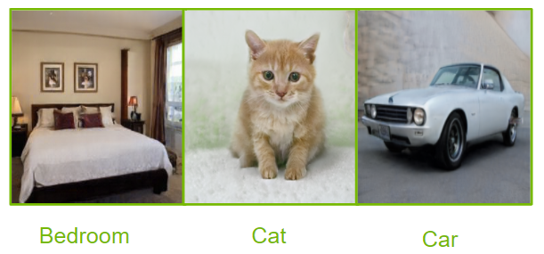
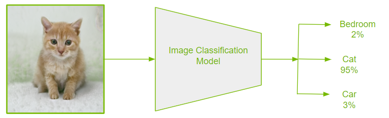

# Image Classification

Image classification is the task of categorizing an image into one of several predefined classes, often also giving a probability of the input belonging to a certain class. This task is crucial in understanding and analyzing images, and it comes quite effortlessly to human beings with our complex visual systems. Most powerful image classification models today are built using some form of Convolution Neural Networks (CNNs), which are also the backbone of many other tasks in Computer Vision.

[Source](https://github.com/NVlabs/stylegan)

In this overview, we will cover
- Types of image Classification
- How does it work?
- How is the performance evaluated?
- Use cases and applications
- Where to get started

---
## Types of image Classification
Image Classification can be broadly divided into either Binary or Multi-class problems depending on the number of categories. Binary image classification problems entail predicting one of two classes. An example of this would be to predict whether an image is that of a dog or not. A subtly different problem is that of single-class (one vs all) classification, where the goal is to recognize data from one class and reject all other. This is beneficial when there is an overabundance of data from one of the classes, also called a class imbalance.

In Multi-class classification problems, models categorize instances into one of three or more categories. Multi-class models often also return confidence scores (or probabilities) of an image belonging to each of the possible classes. This should not be confused with multi-label classification, where a model assigns multiple labels to an instance.

---
## How is the performance evaluated?
Image Classification performance is often reported as Top-1 or Top-5  scores. In top-1 score, classification is considered correct if the top predicted class (with the highest predicted probability) matches the true class for a given instance. In top-5, we check if one of the top 5 predictions matches the true class. The score is just the number of correct predictions divided by the total number of instances evaluated.

---
## Use cases and applications
### Categorizing Images  in Large Visual Databases
Businesses with visual databases may accumulate large amounts of images with missing tags or meta-data. Unless there is an effective way to organize such images, they may not be much use at all. On the contrary, they may hog precious storage space. Automated image classification algorithms can classify such untagged images into predefined categories. Businesses can avoid expensive manual labor by employing automated image classification algorithms.

A related task is that of Image Organization in smart devices like mobile phones. With Image Classification techniques, images and videos can be organized for improved accessibility.

### Visual Search
Visual Search or Image-based search has risen to popularity over the recent years. Many prominent search engines already provide this feature where users can search for visual content similar to a provided image. This has many applications in the e-commerce and retail industry where users can take a snap and upload an image of a product they are interested in purchasing. This makes the shopping experience much more efficient for customers, and can increase sales for businesses.

### Healthcare
Medical Imaging is about creating visual images of internal body parts for clinical purposes. This includes health monitoring, medical diagnosis, treatment, and keeping organized records. Image Classification algorithms can play a crucial role in Medical Imaging by assisting medical professionals detect presence of illness and having consistency in clinical diagnosis.

---
## Getting started
NVIDIA provides examples for JAX models on [Rosetta](https://github.com/NVIDIA/JAX-Toolbox/tree/main/rosetta/rosetta/projects). These examples provide you with easy to consume and highly optimized scripts for both training and inferencing. The quick start guide at our GitHub repository will help you in setting up the environment using NGC Docker Images, download pre-trained models from NGC and adapt the model training and inference for your application/use-case.

These models are tested and maintained by NVIDIA, leveraging mixed precision using tensor cores on our latest GPUs for faster training times while maintaining accuracy.
