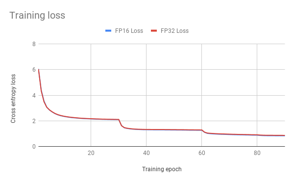
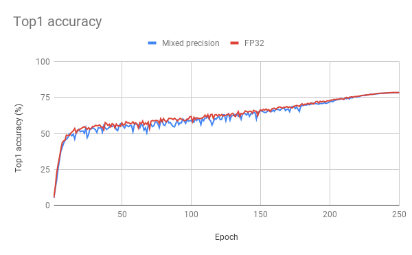
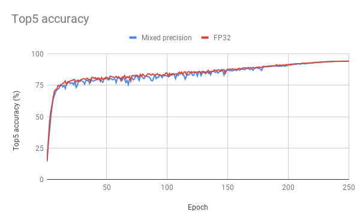

# ResNet50 v1.5 for MXNet

This repository provides a script and recipe to train the ResNet50 v1.5 model to achieve state of the art accuracy, and is tested and maintained by NVIDIA.

## Table Of Contents
- [Model overview](#model-overview)
    * [Default configuration](#default-configuration)
    * [Feature support matrix](#feature-support-matrix)
        * [Features](#features)
    * [Mixed precision training](#mixed-precision-training)
        * [Enabling mixed precision](#enabling-mixed-precision)
- [Setup](#setup)
    * [Requirements](#requirements)
- [Quick Start Guide](#quick-start-guide)
- [Advanced](#advanced)
    * [Scripts and sample code](#scripts-and-sample-code)
    * [Parameters](#parameters)
    * [Command-line options](#command-line-options)
    * [Getting the data](#getting-the-data)
        * [Dataset guidelines](#dataset-guidelines)
    * [Multi-dataset](#multi-dataset)
    * [Training process](#training-process)
    * [Inference process](#inference-process)
- [Performance](#performance)
    * [Benchmarking](#benchmarking)
        * [Training performance benchmark](#training-performance-benchmark)
        * [Inference performance benchmark](#inference-performance-benchmark)
    * [Results](#results)
        * [Training accuracy results](#training-accuracy-results)
            * [Training accuracy: NVIDIA DGX-1 (8x V100 16G)](#training-accuracy-nvidia-dgx-1-(8x-v100-16G))
            * [Training stability test](#training-stability-test)
        * [Training performance results](#training-performance-results)
            * [Training performance: NVIDIA DGX-1 (8x V100 16G)](#training-performance-nvidia-dgx-1-(8x-v100-16G))
            * [Training performance: NVIDIA DGX-2 (16x V100 32G)](#training-performance-nvidia-dgx-2-(16x-v100-32G))
        * [Inference performance results](#inference-performance-results)
            * [Inference performance: NVIDIA DGX-1 (8x V100 16G)](#inference-performance-nvidia-dgx-1-(8x-v100-16G))
            * [Inference performance: NVIDIA T4](#inference-performance-nvidia-t4)
- [Release notes](#release-notes)
    * [Changelog](#changelog)
    * [Known issues](#known-issues)


## Model overview
The ResNet50 v1.5 model is a modified version of the [original ResNet50 v1 model](https://arxiv.org/abs/1512.03385).

The difference between v1 and v1.5 is in the bottleneck blocks which require
downsampling. ResNet v1 has stride = 2 in the first 1x1 convolution, whereas
v1.5 has stride = 2 in the 3x3 convolution

This difference makes ResNet50 v1.5 slightly more accurate (~0.5% top1) than v1, but comes with a small performance drawback (~5% imgs/sec).

This model is trained with mixed precision using Tensor Cores on NVIDIA Volta and Turing GPUs. Therefore, researchers can get results 3.5x faster than training without Tensor Cores, while experiencing the benefits of mixed precision training. This model is tested against each NGC monthly container release to ensure consistent accuracy and performance over time.

### Default configuration

**Optimizer:**

* SGD with momentum (0.875)
* Learning rate = 0.256 for 256 batch size, for other batch sizes we lineary scale the learning rate.
* Learning rate schedule -- we use cosine LR schedule
* Linear warmup of the learning rate during first 5 epochs according to [Accurate, Large Minibatch SGD: Training ImageNet in 1 Hour](https://arxiv.org/abs/1706.02677).
* Weight decay: 3.0517578125e-05 (1/32768).
* We do not apply WD on Batch Norm trainable parameters (gamma/bias)
* Label Smoothing: 0.1
* We train for:
    * 50 Epochs -> configuration that reaches 75.9% top1 accuracy
    * 90 Epochs -> 90 epochs is a standard for ResNet50
    * 250 Epochs -> best possible accuracy. For 250 epoch training we also use [MixUp regularization](https://arxiv.org/pdf/1710.09412.pdf).

**Data augmentation:**

This model uses the following data augmentation:

For training:
* Normalization
* Random resized crop to 224x224
* Scale from 8% to 100%
* Aspect ratio from 3/4 to 4/3
* Random horizontal flip

For inference:
* Normalization
* Scale to 256x256
* Center crop to 224x224

### Feature support matrix

| **Feature** | **ResNet50 MXNet** |
|:---:|:--------:|
|[DALI](https://docs.nvidia.com/deeplearning/sdk/dali-release-notes/index.html)|yes|
|Horovod Multi-GPU|yes|


#### Features
The following features are supported by this model.

NVIDIA DALI - NVIDIA Data Loading Library (DALI) is a collection of highly optimized building blocks, and an execution engine, to accelerate the pre-processing of the input data for deep learning applications. DALI provides both the performance and the flexibility for accelerating different data pipelines as a single library. This single library can then be easily integrated into different deep learning training and inference applications.

Horovod Multi-GPU - Horovod is a distributed training framework for TensorFlow, Keras, PyTorch and MXNet. The goal of Horovod is to make distributed deep learning fast and easy to use. For more information about how to get started with Horovod, see the [Horovod: Official repository](https://github.com/horovod/horovod).


### Mixed precision training

Mixed precision is the combined use of different numerical precisions in a computational method. [Mixed precision](https://arxiv.org/abs/1710.03740) training offers significant computational speedup by performing operations in half-precision format, while storing minimal information in single-precision to retain as much information as possible in critical parts of the network. Since the introduction of [Tensor Cores](https://developer.nvidia.com/tensor-cores) in the Volta and Turing architecture, significant training speedups are experienced by switching to mixed precision -- up to 3x overall speedup on the most arithmetically intense model architectures. Using mixed precision training requires two steps:
1.  Porting the model to use the FP16 data type where appropriate.
2.  Adding loss scaling to preserve small gradient values.

The ability to train deep learning networks with lower precision was introduced in the Pascal architecture and first supported in [CUDA 8](https://devblogs.nvidia.com/parallelforall/tag/fp16/) in the NVIDIA Deep Learning SDK.

For information about:
-   How to train using mixed precision, see the [Mixed Precision Training](https://arxiv.org/abs/1710.03740) paper and [Training With Mixed Precision](https://docs.nvidia.com/deeplearning/sdk/mixed-precision-training/index.html) documentation.
-   Techniques used for mixed precision training, see the [Mixed-Precision Training of Deep Neural Networks](https://devblogs.nvidia.com/mixed-precision-training-deep-neural-networks/) blog.


#### Enabling mixed precision
Using the Gluon API, ensure you perform the following steps to convert a model that supports computation with float16.

1. Cast Gluon Block‘s parameters and expected input type to float16 by calling the cast method of the Block representing the network.
    ```python
    net = net.cast('float16')
    ```

2. Ensure the data input to the network is of float16 type. If your DataLoader or Iterator produces output in another datatype, then you have to cast your data. There are different ways you can do this. The easiest way is to use the `astype` method of NDArrays.
    ```python
    data = data.astype('float16', copy=False)
    ```

3. If you are using images and DataLoader, you can also use a Cast transform.  It is preferable to use multi_precision mode of optimizer when training in float16. This mode of optimizer maintains a master copy of the weights in float32 even when the training (forward and backward pass) is in float16. This helps increase precision of the weight updates and can lead to faster convergence in some scenarios.
    ```python
    optimizer = mx.optimizer.create('sgd', multi_precision=True, lr=0.01)
    ```

## Setup
The following section lists the requirements in order to start training the ResNet50 v1.5 model.

### Requirements

This repository contains Dockerfile which extends the MXNet NGC container and encapsulates some dependencies. Aside from these dependencies, ensure you have the following components:
-   [NVIDIA Docker](https://github.com/NVIDIA/nvidia-docker)
-   [MXNet 19.07-py3 NGC container](https://ngc.nvidia.com/catalog/containers/nvidia%2Fmxnet)
-   [NVIDIA Volta](https://www.nvidia.com/en-us/data-center/volta-gpu-architecture/) or [Turing](https://www.nvidia.com/en-us/geforce/turing/) based GPU

For more information about how to get started with NGC containers, see the following sections from the NVIDIA GPU Cloud Documentation and the Deep Learning Documentation:
-   [Getting Started Using NVIDIA GPU Cloud](https://docs.nvidia.com/ngc/ngc-getting-started-guide/index.html)
-   [Accessing And Pulling From The NGC Container Registry](https://docs.nvidia.com/deeplearning/frameworks/user-guide/index.html#accessing_registry)
-   [Running MXNet](https://docs.nvidia.com/deeplearning/dgx/mxnet-release-notes/running.html#running)

For those unable to use the MXNet NGC container, to set up the required environment or create your own container, see the versioned [NVIDIA Container Support Matrix](https://docs.nvidia.com/deeplearning/frameworks/support-matrix/index.html).


## Quick Start Guide

**1. Clone the repository.**
```bash
git clone https://github.com/NVIDIA/DeepLearningExamples
cd DeepLearningExamples/MxNet/Classification/RN50v1.5
```

**2. Build the ResNet50 MXNet NGC container.**
After Docker is setup, you can build the ResNet50 image with:
```bash
docker build . -t nvidia_rn50_mx
```

**3. Start an interactive session in the NGC container to run preprocessing/training/inference.**
```bash
nvidia-docker run --rm -it --ipc=host <path to dataset>:/data/imagenet/train-val-recordio-passthrough nvidia_rn50_mx
```

**4. Download and preprocess the data.**
* Download the images from http://image-net.org/download-images.
* Extract the training and validation data:
    ```bash
    mkdir train && mv ILSVRC2012_img_train.tar train/ && cd train
    tar -xvf ILSVRC2012_img_train.tar && rm -f ILSVRC2012_img_train.tar
    find . -name "*.tar" | while read NAME ; do mkdir -p "${NAME%.tar}"; tar -xvf "${NAME}" -C "${NAME%.tar}"; rm -f "${NAME}"; done
    cd ..
    ```

**5. Extract the validation data and move the images to subfolders.**
```bash
mkdir val && mv ILSVRC2012_img_val.tar val/ && cd val && tar -xvf ILSVRC2012_img_val.tar
wget -qO- https://raw.githubusercontent.com/soumith/imagenetloader.torch/master/valprep.sh | bash
```

**6. Preprocess the dataset.**
```bash
./scripts/prepare_imagenet.sh <path to raw imagenet> <path where processed dataset will be created>
```

**7. Start training.**
```bash
./runner -n <number of gpus> -b <batch size per GPU (default 192)>
```

**8. Start validation/evaluation.**
```bash
./runner -n <number of gpus> -b <batch size per GPU (default 192)> --load <path to trained model> --mode val
```

**9. Start inference/predictions.**
```bash
./runner --load <path to trained model> --mode pred --data-pred <path to the image>
```


## Advanced

The following sections provide greater details of the dataset, running training and inference, and the training results.

### Scripts and sample code

In the root directory, the most important files are:
* `runner`: A wrapper on the `train.py` script which is the main executable script for training/validation/predicting
* `benchmark.py`: A script for benchmarking
* `Dockerfile`: Container to build the container
* `fit.py`: A file containing most of the training and validation logic
* `data.py`: Data loading and preprocessing code
* `dali.py`: Data loading and preprocessing code using DALI
* `models.py`: The model architecture
* `report.py`: A file containing JSON report structure and description of fields

In the `scripts` directory, the most important files are:
* `prepare_imagenet.sh`: A script that converts raw dataset format to RecordIO format


### Parameters

The complete list of available parameters contains:
```
Model:
  --arch {resnetv1,resnetv15,resnextv1,resnextv15,xception}
                        model architecture (default: resnetv15)
  --num-layers NUM_LAYERS
                        number of layers in the neural network, required by
                        some networks such as resnet (default: 50)
  --num-groups NUM_GROUPS
                        number of groups for grouped convolutions, required by
                        some networks such as resnext (default: 32)
  --num-classes NUM_CLASSES
                        the number of classes (default: 1000)
  --batchnorm-eps BATCHNORM_EPS
                        the amount added to the batchnorm variance to prevent
                        output explosion. (default: 1e-05)
  --batchnorm-mom BATCHNORM_MOM
                        the leaky-integrator factor controling the batchnorm
                        mean and variance. (default: 0.9)
  --fuse-bn-relu FUSE_BN_RELU
                        have batchnorm kernel perform activation relu
                        (default: 0)
  --fuse-bn-add-relu FUSE_BN_ADD_RELU
                        have batchnorm kernel perform add followed by
                        activation relu (default: 0)

Training:
  --mode {train_val,train,val,pred}
                        mode (default: train_val)
  --seed SEED           random seed (default: None)
  -n NGPUS, --ngpus NGPUS
                        number of GPUs to use (default: 1)
  --kv-store {device,horovod}
                        key-value store type (default: horovod)
  --dtype {float32,float16}
                        Precision (default: float16)
  --amp                 If enabled, turn on AMP (Automatic Mixed Precision)
                        (default: False)
  -b BATCH_SIZE, --batch-size BATCH_SIZE
                        batch size per GPU (default: 192)
  -e NUM_EPOCHS, --num-epochs NUM_EPOCHS
                        number of epochs (default: 90)
  -l LR, --lr LR        learning rate; IMPORTANT: true learning rate will be
                        calculated as `lr * batch_size / 256` (default: 0.256)
  --lr-schedule {multistep,cosine}
                        learning rate schedule (default: cosine)
  --lr-factor LR_FACTOR
                        the ratio to reduce lr on each step (default: 0.256)
  --lr-steps LR_STEPS   the epochs to reduce the lr, e.g. 30,60 (default: [])
  --warmup-epochs WARMUP_EPOCHS
                        the epochs to ramp-up lr to scaled large-batch value
                        (default: 5)
  --optimizer OPTIMIZER
                        the optimizer type (default: sgd)
  --mom MOM             momentum for sgd (default: 0.875)
  --wd WD               weight decay for sgd (default: 3.0517578125e-05)
  --label-smoothing LABEL_SMOOTHING
                        label smoothing factor (default: 0.1)
  --mixup MIXUP         alpha parameter for mixup (if 0 then mixup is not
                        applied) (default: 0)
  --disp-batches DISP_BATCHES
                        show progress for every n batches (default: 20)
  --model-prefix MODEL_PREFIX
                        model checkpoint prefix (default: model)
  --save-frequency SAVE_FREQUENCY
                        frequency of saving model in epochs (--model-prefix
                        must be specified). If -1 then save only best model.
                        If 0 then do not save anything. (default: -1)
  --begin-epoch BEGIN_EPOCH
                        start the model from an epoch (default: 0)
  --load LOAD           checkpoint to load (default: None)
  --test-io             test reading speed without training (default: False)
  --test-io-mode {train,val}
                        data to test (default: train)
  --log LOG             file where to save the log from the experiment
                        (default: log.log)
  --report REPORT       file where to save report (default: report.json)
  --no-metrics          do not calculate evaluation metrics (for benchmarking)
                        (default: False)
  --benchmark-iters BENCHMARK_ITERS
                        run only benchmark-iters iterations from each epoch
                        (default: None)

Data:
  --data-root DATA_ROOT
                        Directory with RecordIO data files (default:
                        /data/imagenet/train-val-recordio-passthrough)
  --data-backend {dali,mxnet,synthetic}
                        data backend (default: dali)
  --image-shape IMAGE_SHAPE
                        the image shape feed into the network (default: [3,
                        224, 224])
  --rgb-mean RGB_MEAN   a tuple of size 3 for the mean rgb (default: [123.68,
                        116.779, 103.939])
  --rgb-std RGB_STD     a tuple of size 3 for the std rgb (default: [58.393,
                        57.12, 57.375])
  --input-layout {NCHW,NHWC}
                        the layout of the input data (default: NCHW)
  --conv-layout {NCHW,NHWC}
                        the layout of the data assumed by the conv operation
                        (default: NCHW)
  --batchnorm-layout {NCHW,NHWC}
                        the layout of the data assumed by the batchnorm
                        operation (default: NCHW)
  --pooling-layout {NCHW,NHWC}
                        the layout of the data assumed by the pooling
                        operation (default: NCHW)
  --num-examples NUM_EXAMPLES
                        the number of training examples (doesn't work with
                        mxnet data backend) (default: 1281167)
  --data-val-resize DATA_VAL_RESIZE
                        base length of shorter edge for validation dataset
                        (default: 256)

DALI data backend:
  entire group applies only to dali data backend

  --dali-separ-val      each process will perform independent validation on
                        whole val-set (default: False)
  --dali-threads DALI_THREADS
                        number of threadsper GPU for DALI (default: 3)
  --dali-validation-threads DALI_VALIDATION_THREADS
                        number of threadsper GPU for DALI for validation
                        (default: 10)
  --dali-prefetch-queue DALI_PREFETCH_QUEUE
                        DALI prefetch queue depth (default: 2)
  --dali-nvjpeg-memory-padding DALI_NVJPEG_MEMORY_PADDING
                        Memory padding value for nvJPEG (in MB) (default: 64)

MXNet data backend:
  entire group applies only to mxnet data backend

  --data-mxnet-threads DATA_MXNET_THREADS
                        number of threads for data decoding for mxnet data
                        backend (default: 40)
  --random-crop RANDOM_CROP
                        if or not randomly crop the image (default: 0)
  --random-mirror RANDOM_MIRROR
                        if or not randomly flip horizontally (default: 1)
  --max-random-h MAX_RANDOM_H
                        max change of hue, whose range is [0, 180] (default:
                        0)
  --max-random-s MAX_RANDOM_S
                        max change of saturation, whose range is [0, 255]
                        (default: 0)
  --max-random-l MAX_RANDOM_L
                        max change of intensity, whose range is [0, 255]
                        (default: 0)
  --min-random-aspect-ratio MIN_RANDOM_ASPECT_RATIO
                        min value of aspect ratio, whose value is either None
                        or a positive value. (default: 0.75)
  --max-random-aspect-ratio MAX_RANDOM_ASPECT_RATIO
                        max value of aspect ratio. If min_random_aspect_ratio
                        is None, the aspect ratio range is
                        [1-max_random_aspect_ratio,
                        1+max_random_aspect_ratio], otherwise it is
                        [min_random_aspect_ratio, max_random_aspect_ratio].
                        (default: 1.33)
  --max-random-rotate-angle MAX_RANDOM_ROTATE_ANGLE
                        max angle to rotate, whose range is [0, 360] (default:
                        0)
  --max-random-shear-ratio MAX_RANDOM_SHEAR_RATIO
                        max ratio to shear, whose range is [0, 1] (default: 0)
  --max-random-scale MAX_RANDOM_SCALE
                        max ratio to scale (default: 1)
  --min-random-scale MIN_RANDOM_SCALE
                        min ratio to scale, should >= img_size/input_shape.
                        otherwise use --pad-size (default: 1)
  --max-random-area MAX_RANDOM_AREA
                        max area to crop in random resized crop, whose range
                        is [0, 1] (default: 1)
  --min-random-area MIN_RANDOM_AREA
                        min area to crop in random resized crop, whose range
                        is [0, 1] (default: 0.05)
  --min-crop-size MIN_CROP_SIZE
                        Crop both width and height into a random size in
                        [min_crop_size, max_crop_size] (default: -1)
  --max-crop-size MAX_CROP_SIZE
                        Crop both width and height into a random size in
                        [min_crop_size, max_crop_size] (default: -1)
  --brightness BRIGHTNESS
                        brightness jittering, whose range is [0, 1] (default:
                        0)
  --contrast CONTRAST   contrast jittering, whose range is [0, 1] (default: 0)
  --saturation SATURATION
                        saturation jittering, whose range is [0, 1] (default:
                        0)
  --pca-noise PCA_NOISE
                        pca noise, whose range is [0, 1] (default: 0)
  --random-resized-crop RANDOM_RESIZED_CROP
                        whether to use random resized crop (default: 1)
```

### Command-line options

To see the full list of available options and their descriptions, use the `-h` or `--help` command line option: `./runner --help` and `python train.py --help`. `./runner` acts as a wrapper on `train.py` and all additional flags will be passed to `train.py`.

`./runner` command-line options:
```
usage: runner [-h] [-n NGPUS] [-b BATCH_SIZE] [-e NUM_EPOCHS] [-l LR]
              [--data-root DATA_ROOT] [--dtype {float32,float16}]
              [--kv-store {device,horovod}]
              [--data-backend {dali,mxnet,synthetic}]
```

`train.py` command-line options:
```
usage: train.py [-h]
                [--arch {resnetv1,resnetv15,resnextv1,resnextv15,xception}]
                [--num-layers NUM_LAYERS] [--num-groups NUM_GROUPS]
                [--num-classes NUM_CLASSES] [--batchnorm-eps BATCHNORM_EPS]
                [--batchnorm-mom BATCHNORM_MOM] [--fuse-bn-relu FUSE_BN_RELU]
                [--fuse-bn-add-relu FUSE_BN_ADD_RELU]
                [--mode {train_val,train,val,pred}] [--seed SEED]
                [--gpus GPUS] [--kv-store {device,horovod}]
                [--dtype {float32,float16}] [--amp] [--batch-size BATCH_SIZE]
                [--num-epochs NUM_EPOCHS] [--lr LR]
                [--lr-schedule {multistep,cosine}] [--lr-factor LR_FACTOR]
                [--lr-steps LR_STEPS] [--warmup-epochs WARMUP_EPOCHS]
                [--optimizer OPTIMIZER] [--mom MOM] [--wd WD]
                [--label-smoothing LABEL_SMOOTHING] [--mixup MIXUP]
                [--disp-batches DISP_BATCHES] [--model-prefix MODEL_PREFIX]
                [--save-frequency SAVE_FREQUENCY] [--begin-epoch BEGIN_EPOCH]
                [--load LOAD] [--test-io] [--test-io-mode {train,val}]
                [--log LOG] [--report REPORT] [--no-metrics]
                [--benchmark-iters BENCHMARK_ITERS] [--data-train DATA_TRAIN]
                [--data-train-idx DATA_TRAIN_IDX] [--data-val DATA_VAL]
                [--data-val-idx DATA_VAL_IDX] [--data-pred DATA_PRED]
                [--data-backend {dali,mxnet,synthetic}]
                [--image-shape IMAGE_SHAPE] [--rgb-mean RGB_MEAN]
                [--rgb-std RGB_STD] [--input-layout {NCHW,NHWC}]
                [--conv-layout {NCHW,NHWC}] [--batchnorm-layout {NCHW,NHWC}]
                [--pooling-layout {NCHW,NHWC}] [--num-examples NUM_EXAMPLES]
                [--data-val-resize DATA_VAL_RESIZE] [--dali-separ-val]
                [--dali-threads DALI_THREADS]
                [--dali-validation-threads DALI_VALIDATION_THREADS]
                [--dali-prefetch-queue DALI_PREFETCH_QUEUE]
                [--dali-nvjpeg-memory-padding DALI_NVJPEG_MEMORY_PADDING]
                [--data-mxnet-threads DATA_MXNET_THREADS]
                [--random-crop RANDOM_CROP] [--random-mirror RANDOM_MIRROR]
                [--max-random-h MAX_RANDOM_H] [--max-random-s MAX_RANDOM_S]
                [--max-random-l MAX_RANDOM_L]
                [--min-random-aspect-ratio MIN_RANDOM_ASPECT_RATIO]
                [--max-random-aspect-ratio MAX_RANDOM_ASPECT_RATIO]
                [--max-random-rotate-angle MAX_RANDOM_ROTATE_ANGLE]
                [--max-random-shear-ratio MAX_RANDOM_SHEAR_RATIO]
                [--max-random-scale MAX_RANDOM_SCALE]
                [--min-random-scale MIN_RANDOM_SCALE]
                [--max-random-area MAX_RANDOM_AREA]
                [--min-random-area MIN_RANDOM_AREA]
                [--min-crop-size MIN_CROP_SIZE]
                [--max-crop-size MAX_CROP_SIZE] [--brightness BRIGHTNESS]
                [--contrast CONTRAST] [--saturation SATURATION]
                [--pca-noise PCA_NOISE]
                [--random-resized-crop RANDOM_RESIZED_CROP]
```

### Getting the data

The MXNet ResNet50 v1.5 script operates on ImageNet 1k, a widely popular image classification dataset from ILSVRC challenge.
You can download the images from http://image-net.org/download-images.

The recommended data format is
[RecordIO](http://mxnet.io/architecture/note_data_loading.html), which
concatenates multiple examples into seekable binary files for better read
efficiency. MXNet provides a tool called `im2rec.py` located in the `/opt/mxnet/tools/` directory.
The tool converts individual images into `.rec` files.

To prepare a RecordIO file containing ImageNet data, we first need to create `.lst` files
which consist of the labels and image paths. We assume that the original images were
downloaded to `/data/imagenet/raw/train-jpeg` and `/data/imagenet/raw/val-jpeg`.

```bash
python /opt/mxnet/tools/im2rec.py --list --recursive train /data/imagenet/raw/train-jpeg
python /opt/mxnet/tools/im2rec.py --list --recursive val /data/imagenet/raw/val-jpeg
```

Next, we generate the `.rec` (RecordIO files with data) and `.idx` (indexes required by DALI
to speed up data loading) files. To obtain the best training accuracy
we do not preprocess the images when creating the RecordIO file.

```bash
python /opt/mxnet/tools/im2rec.py --pass-through --num-thread 40 train /data/imagenet/raw/train-jpeg
python /opt/mxnet/tools/im2rec.py --pass-through --num-thread 40 val /data/imagenet/raw/val-jpeg
```

#### Dataset guidelines
The process of loading, normalizing and augmenting the data contained in the dataset can be found in the `data.py` and `dali.py` files.

The data is read from RecordIO format, which concatenates multiple examples into seekable binary files for better read efficiency.

Data augmentation techniques are described in the [Default configuration](#default-configuration) section.

#### Multi-dataset

In most cases, to train a model on a different dataset, no changes in the code are required, but the dataset has to be converted into RecordIO format.

To convert a custom dataset, follow the steps from [Getting the data](#getting-the-data) section, and refer to the `scripts/prepare_dataset.py` script.


### Training process

To start training, run:
`./runner -n <number of gpus> -b <batch size per GPU> --data-root <path to imagenet> --dtype <float32 or float16>`

By default the training script runs the validation after each epoch:
* the best checkpoint will be stored in the `model_best.params` file in the working directory
* the log from training will be saved in the  `log.log` file in the working directory
* the JSON report with statistics will be saved in the  `report.json` file in the working directory

If ImageNet is mounted in the `/data/imagenet/train-val-recordio-passthrough` directory, you don't have to specify the `--data-root` flag.

### Inference process

To start validation, run:
`./runner -n <number of gpus> -b <batch size per GPU> --data-root <path to imagenet> --dtype <float32 or float16> --mode val`

By default: 
* the log from validation will be saved in the `log.log` file in the working directory
* the JSON report with statistics will be saved in the `report.json` file in the working directory

## Performance

### Benchmarking

To benchmark training and inference, run:
`python benchmark.py -n <numbers of gpus separated by comma> -b <batch sizes per GPU separated by comma> --data-root <path to imagenet> --dtype <float32 or float16> -o <path to benchmark report>`

To control the benchmark length per epoch, use the `-i` flag (defaults to 100 iterations).
To control the number of epochs, use the `-e` flag.
To control the number of warmup epochs (epochs which are not taken into account), use the `-w` flag.
To limit the length of the dataset, use the `--num-examples` flag.
By default, the same parameters as in `./runner` will be used. Additional flags will be passed to `./runner`.

#### Training performance benchmark
To benchmark only training, use the `--mode train` flag.

#### Inference performance benchmark
To benchmark only inference, use the `--mode val` flag.


### Results

The following sections provide details on how we achieved our performance and accuracy in training and inference.

#### Training accuracy results

##### Training accuracy: NVIDIA DGX-1 (8x V100 16G)

90 epochs configuration
Our results were obtained by running the `./runner -n <number of gpus> -b 96 --dtype float32` script for FP32 and the `./runner -n <number of gpus> -b 192` script for mixed precision in the in the mxnet-19.07-py3  NGC container on NVIDIA DGX-1 with (8x V100 16G) GPUs.
 on NVIDIA DGX-1 with (8x V100 16G) GPUs.

| **GPUs** | **Accuracy - mixed precision** | **Accuracy - FP32** | **Time to train - mixed precision** | **Time to train - FP32** | **Time to train - speedup** |
|:---:|:---:|:---:|:---:|:---:|:---:|
|1|77.208|77.160|24.2|84.5|3.49|
|4|77.296|77.280|6.0|21.4|3.59|
|8|77.308|77.292|3.0|10.7|3.54|

##### Training stability test

Our results were obtained by running the following commands 8 times with different seeds.

* For 50 epochs
  * `./runner -n 8 -b 96 --dtype float32 --num-epochs 50` for FP32
  * `./runner -n 8 -b 192 --num-epochs 50` for mixed precision
* For 90 epochs
  * `./runner -n 8 -b 96 --dtype float32` for FP32
  * `./runner -n 8 -b 192` for mixed precision
* For 250 epochs
  * `./runner -n 8 -b 96 --dtype float32 --num-epochs 250 --mixup 0.2` for FP32
  * `./runner -n 8 -b 192 --num-epochs 250 --mixup 0.2` for mixed precision

| **# of epochs** | **mixed precision avg top1** | **FP32 avg top1** | **mixed precision standard deviation** | **FP32 standard deviation** | **mixed precision minimum top1** | **FP32 minimum top1** | **mixed precision maximum top1** | **FP32 maximum top1** |
|:---:|:---:|:---:|:---:|:---:|:---:|:---:|:---:|:---:|
|50|76.156|76.185|0.118|0.082|76.010|76.062|76.370|76.304|
|90|77.105|77.224|0.097|0.060|76.982|77.134|77.308|77.292|
|250|78.317|78.400|0.073|0.102|78.202|78.316|78.432|78.570|


Plots for 250 epoch configuration
Here are example graphs of FP32 and mixed precision training on 8 GPU 250 epochs configuration:








#### Training performance results

##### Training performance: NVIDIA DGX-1 (8x V100 16G)

The following results were obtained by running the
`python benchmark.py -n 1,2,4,8 -b 192 --dtype float16 -o benchmark_report_fp16.json -i 500 -e 3 -w 1 --num-examples 32000 --mode train` script for mixed precision and the
`python benchmark.py -n 1,2,4,8 -b 96 --dtype float32 -o benchmark_report_fp32.json -i 500 -e 3 -w 1 --num-examples 32000 --mode train` script for FP32 in the mxnet-19.07-py3 NGC container on NVIDIA DGX-1 with (8x V100 16G) GPUs.

Training performance reported as Total IPS (data + compute time taken into account).
Weak scaling is calculated as a ratio of speed for given number of GPUs to speed for 1 GPU.

| **GPUs** | **Throughput - mixed precision** | **Throughput - FP32** | **Throughput speedup (FP32 - mixed precision)** | **Weak scaling - mixed precision** | **Weak scaling - FP32** |
|:---:|:---:|:---:|:---:|:---:|:---:|
|1|1427|385|3.71|1.00|1.00|
|2|2820|768|3.67|1.98|2.00|
|4|5560|1513|3.68|3.90|3.93|
|8|10931|3023|3.62|7.66|7.86|

##### Training performance: NVIDIA DGX-2 (16x V100 32G)

The following results were obtained by running the
`python benchmark.py -n 1,4,8,16 -b 256 --dtype float16 -o benchmark_report_fp16.json -i 500 -e 3 -w 1 --num-examples 32000 --mode train` script for mixed precision and the
`python benchmark.py -n 1,4,8,16 -b 128 --dtype float32 -o benchmark_report_fp32.json -i 500 -e 3 -w 1 --num-examples 32000 --mode train` script for FP32 in the mxnet-19.07-py3 NGC container on NVIDIA DGX-1 with (8x V100 16G) GPUs.

Training performance reported as Total IPS (data + compute time taken into account).
Weak scaling is calculated as a ratio of speed for given number of GPUs to speed for 1 GPU.

| **GPUs** | **Throughput - mixed precision** | **Throughput - FP32** | **Throughput speedup (FP32 - mixed precision)** | **Weak scaling - mixed precision** | **Weak scaling - FP32** |
|:---:|:---:|:---:|:---:|:---:|:---:|
|1|1438|409|3.52|1.00|1.00|
|2|2868|817|3.51|1.99|2.00|
|4|5624|1617|3.48|3.91|3.96|
|8|11174|3214|3.48|7.77|7.86|
|16|20530|6356|3.23|14.28|15.54|

#### Inference performance results

##### Inference performance: NVIDIA DGX-1 (8x V100 16G)

The following results were obtained by running the
`python benchmark.py -n 1 -b 1,2,4,8,16,32,64,128,192,256 --dtype float16 -o inferbenchmark_report_fp16.json -i 500 -e 3 -w 1 --mode val` script for mixed precision and the
`python benchmark.py -n 1 -b 1,2,4,8,16,32,64,128,192,256 --dtype float32 -o inferbenchmark_report_fp32.json -i 500 -e 3 -w 1 --mode val` script for FP32 in the mxnet-19.07-py3 NGC container on NVIDIA DGX-1 with (8x V100 16G) GPUs.

Inference performance reported as Total IPS (data + compute time taken into account).

Reported mixed precision speedups are relative to FP32 numbers for corresponding configuration.

| **Batch size** | **Throughput (img/sec) - mixed precision** | **Throughput - speedup** | **Avg latency (ms) - mixed precision** | **Avg latency - speedup** | **50% latency (ms) - mixed precision** | **50% latency - speedup** | **90% latency (ms) - mixed precision** | **90% latency - speedup** | **95% latency (ms) - mixed precision** | **95% latency - speedup** | **99% latency (ms) - mixed precision** | **99% latency - speedup** | **100% latency (ms) - mixed precision** | **100% latency - speedup** |
|:---:|:---:|:---:|:---:|:---:|:---:|:---:|:---:|:---:|:---:|:---:|:---:|:---:|:---:|:---:|
| 1 | 397 | 1.65 | 2.5 | 1.65 | 2.5 | 1.67 | 2.7 | 1.59 | 2.8 | 1.56 | 3.2 | 1.51 | 15.8 | 0.84 |
| 2 | 732 | 1.81 | 2.7 | 1.81 | 2.6 | 1.88 | 3.0 | 1.67 | 3.3 | 1.52 | 4.9 | 1.10 | 18.8 | 0.83 |
| 4 | 1269 | 2.08 | 3.2 | 2.08 | 3.0 | 2.21 | 3.5 | 1.92 | 4.0 | 1.72 | 7.5 | 0.97 | 14.5 | 0.54 |
| 8 | 2012 | 2.53 | 4.0 | 2.53 | 3.9 | 2.59 | 4.2 | 2.45 | 4.4 | 2.37 | 8.3 | 1.29 | 15.3 | 0.72 |
| 16 | 2667 | 2.64 | 6.0 | 2.64 | 5.9 | 2.66 | 6.3 | 2.54 | 6.4 | 2.52 | 8.3 | 2.02 | 16.9 | 1.05 |
| 32 | 3240 | 2.86 | 9.9 | 2.86 | 9.8 | 2.87 | 10.3 | 2.79 | 10.4 | 2.76 | 11.5 | 2.53 | 28.4 | 1.12 |
| 64 | 3776 | 3.10 | 17.0 | 3.10 | 17.0 | 3.09 | 17.5 | 3.03 | 17.7 | 3.01 | 18.1 | 3.01 | 18.7 | 2.99 |
| 128 | 3734 | 3.02 | 34.3 | 3.02 | 33.8 | 3.05 | 35.5 | 2.93 | 36.3 | 2.88 | 42.4 | 2.79 | 51.7 | 2.38 |
| 192 | 3641 | 2.90 | 52.7 | 2.90 | 52.4 | 2.90 | 55.2 | 2.77 | 56.2 | 2.74 | 65.4 | 2.76 | 77.1 | 2.41 |
| 256 | 3463 | 2.73 | 73.9 | 2.73 | 72.8 | 2.75 | 77.3 | 2.61 | 79.9 | 2.54 | 100.8 | 2.39 | 104.1 | 2.35 |

##### Inference performance: NVIDIA T4

The following results were obtained by running the
`python benchmark.py -n 1 -b 1,2,4,8,16,32,64,128,192,256 --dtype float16 -o inferbenchmark_report_fp16.json -i 500 -e 3 -w 1 --mode val` script for mixed precision and the
`python benchmark.py -n 1 -b 1,2,4,8,16,32,64,128,192,256 --dtype float32 -o inferbenchmark_report_fp32.json -i 500 -e 3 -w 1 --mode val` script for FP32 in the mxnet-19.07-py3 NGC container on an NVIDIA T4 GPU.

Inference performance reported as Total IPS (data + compute time taken into account).

Reported mixed precision speedups are relative to FP32 numbers for corresponding configuration.

| **Batch size** | **Throughput (img/sec) - mixed precision** | **Throughput - speedup** | **Avg latency (ms) - mixed precision** | **Avg latency - speedup** | **50% latency (ms) - mixed precision** | **50% latency - speedup** | **90% latency (ms) - mixed precision** | **90% latency - speedup** | **95% latency (ms) - mixed precision** | **95% latency - speedup** | **99% latency (ms) - mixed precision** | **99% latency - speedup** | **100% latency (ms) - mixed precision** | **100% latency - speedup** |
|:---:|:---:|:---:|:---:|:---:|:---:|:---:|:---:|:---:|:---:|:---:|:---:|:---:|:---:|:---:|
| 1 | 348 | 1.88 | 2.9 | 1.88 | 2.8 | 1.91 | 2.9 | 1.88 | 3.0 | 1.90 | 3.9 | 1.82 | 17.6 | 0.74 |
| 2 | 594 | 2.30 | 3.4 | 2.30 | 3.3 | 2.35 | 3.4 | 2.34 | 3.5 | 2.38 | 5.7 | 1.55 | 20.2 | 0.74 |
| 4 | 858 | 2.93 | 4.7 | 2.93 | 4.6 | 2.97 | 4.9 | 2.86 | 5.0 | 2.81 | 6.0 | 2.46 | 13.7 | 1.12 |
| 8 | 1047 | 3.17 | 7.6 | 3.17 | 7.6 | 3.19 | 7.9 | 3.10 | 8.2 | 3.02 | 9.1 | 2.77 | 15.0 | 1.72 |
| 16 | 1163 | 3.16 | 13.8 | 3.16 | 13.7 | 3.17 | 14.1 | 3.13 | 14.4 | 3.07 | 15.4 | 2.90 | 17.5 | 2.62 |
| 32 | 1225 | 3.22 | 26.1 | 3.22 | 26.1 | 3.22 | 27.0 | 3.15 | 27.3 | 3.12 | 28.3 | 3.05 | 30.5 | 2.89 |
| 64 | 1230 | 3.15 | 52.0 | 3.15 | 51.8 | 3.16 | 52.9 | 3.12 | 53.3 | 3.10 | 54.4 | 3.08 | 58.8 | 2.90 |
| 128 | 1260 | 3.21 | 101.6 | 3.21 | 101.3 | 3.22 | 102.7 | 3.21 | 103.2 | 3.20 | 115.0 | 2.89 | 121.8 | 2.86 |
| 192 | 1252 | 3.20 | 153.3 | 3.20 | 153.1 | 3.20 | 154.7 | 3.19 | 155.5 | 3.21 | 156.9 | 3.20 | 182.3 | 2.81 |
| 256 | 1251 | 3.22 | 204.6 | 3.22 | 204.3 | 3.23 | 206.4 | 3.21 | 207.1 | 3.21 | 209.3 | 3.18 | 241.9 | 2.76 |

## Release notes 

### Changelog

1. Dec, 2018
  * Initial release (based on https://github.com/apache/incubator-mxnet/tree/master/example/image-classification)
2. June, 2019
  * Code refactor
  * Label smoothing
  * Cosine LR schedule
  * MixUp regularization
  * Better configurations


### Known Issues

There are no known issues with this model.
