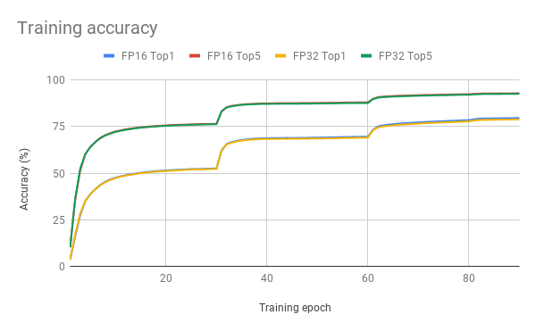
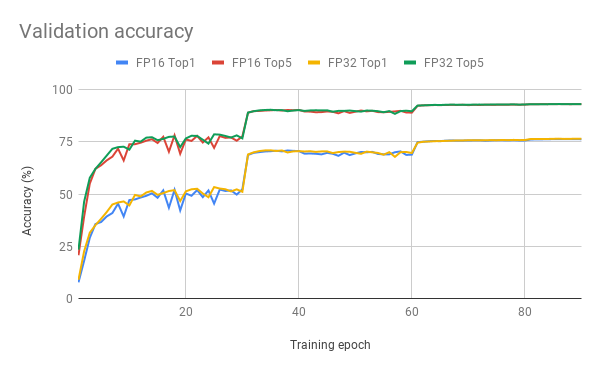

# ResNet50 v1.5 For MXNet

## The model
The ResNet50 v1.5 model is a modified version of the [original ResNet50 v1 model](https://arxiv.org/abs/1512.03385).

The difference between v1 and v1.5 is in the bottleneck blocks which require
downsampling. ResNet v1 has stride = 2 in the first 1x1 convolution, whereas
v1.5 has stride = 2 in the 3x3 convolution

This difference makes ResNet50 v1.5 slightly more accurate (~0.5% top1) than v1, but comes with a small performance drawback (~5% imgs/sec).

## Training procedure

### Optimizer

This model trains for 90 epochs, with the standard ResNet v1.5 setup:

* SGD with momentum (0.9)

* Learning rate = 0.1 for 256 batch size, for other batch sizes we linearly
scale the learning rate.

* Learning rate decay - multiply by 0.1 after 30, 60, and 80 epochs

* Linear warmup of the learning rate during first 5 epochs
according to [Accurate, Large Minibatch SGD: Training ImageNet in 1 Hour](https://arxiv.org/abs/1706.02677).

* Weight decay: 1e-4

### Data Augmentation

During training, we perform the following augmentation techniques:
* Normalization
* Random resized crop to 224x224
* Scale from 5% to 100%
* Aspect ratio from 3/4 to 4/3
* Random horizontal flip

During inference, we perform the following augmentation techniques:
* Normalization
* Scale to 256x256
* Center crop to 224x224

See `data.py` for more info.

# Setup

## Requirements

Ensure your environment meets the following requirements:

* [NVIDIA Docker](https://github.com/NVIDIA/nvidia-docker)
* [MXNet 18.12-py3 NGC container](https://ngc.nvidia.com/catalog/containers/nvidia%2Fmxnet) or newer
* [NVIDIA-DALI 0.5.0](https://github.com/NVIDIA/DALI) -- included in the MXNet container
* [Python 3.5](https://www.python.org) -- included in the MXNet container
* [CUDA 10](https://developer.nvidia.com/cuda-toolkit) -- included in the MXNet container
* [cuDNN 7.4.1](https://developer.nvidia.com/cudnn) -- included in the the MXNet container
* (optional) NVIDIA Volta or Turing GPU (see section below) -- for best training performance using FP16

For more information about how to get started with NGC containers, see the
following sections from the NVIDIA GPU Cloud Documentation and the Deep Learning Documentation:
* [Getting Started Using NVIDIA GPU Cloud](https://docs.nvidia.com/ngc/ngc-getting-started-guide/index.html)
* [Accessing And Pulling From The NGC Container Registry](https://docs.nvidia.com/deeplearning/dgx/user-guide/index.html#accessing_registry)
* [Running MXNet](https://docs.nvidia.com/deeplearning/dgx/mxnet-release-notes/running.html#running)

## Training using mixed precision with Tensor Cores

### Hardware requirements
Training with mixed precision on NVIDIA Tensor Cores, requires an NVIDIA Volta-based or Turing-based GPU.


### Software changes

For information about how to train using mixed precision, see the
[Mixed Precision Training paper](https://arxiv.org/abs/1710.03740)
and
[Training With Mixed Precision documentation](https://docs.nvidia.com/deeplearning/sdk/mixed-precision-training/index.html).


# Quick start guide

## Docker

To run docker MXNet container, run:

`nvidia-docker run --rm -it --ipc=host -v <path to source of this repo>:/workspace/resnet50 -v <path to prepared dataset>:/data/imagenet/train-val-recordio-passthrough nvcr.io/nvidia/mxnet:18.12-py3`

It will also automatically start downloading the MXNet container if you haven't downloaded it yet. You can also download it manually by running:

`nvidia-docker pull nvcr.io/nvidia/mxnet:18.12-py3`

If you haven't prepared dataset yet (see section below), download raw ImageNet dataset (see section below), and run:

`nvidia-docker run --rm -it --ipc=host -v <path to source of this repo>:/workspace/resnet50 -v <path where prepared dataset should be created>:/data/imagenet/train-val-recordio-passthrough -v <path to raw dataset>:/data/imagenet/raw nvcr.io/nvidia/mxnet:18.12-py3`

and follow step from Prepare Dataset section.

## Prepare Dataset

The MXNet ResNet50 v1.5 script operates on ImageNet 1k, a widely popular image classification dataset from ILSVRC challenge.
You can download the images from http://image-net.org/download-images

The recommended data format is
[RecordIO](http://mxnet.io/architecture/note_data_loading.html), which
concatenates multiple examples into seekable binary files for better read
efficiency. MXNet provides a tool called `im2rec.py` located in the `/opt/mxnet/tools/` directory.
The tool converts individual images into `.rec` files.

To prepare RecordIO file containing ImageNet data, we first need to create .lst files
which consist of the labels and image paths. We assume that the original images were
downloaded to `/data/imagenet/raw/train-jpeg` and `/data/imagenet/raw/val-jpeg`.

```bash
python /opt/mxnet/tools/im2rec.py --list --recursive train /data/imagenet/raw/train-jpeg
python /opt/mxnet/tools/im2rec.py --list --recursive val /data/imagenet/raw/val-jpeg
```

Then we generate the `.rec` (RecordIO files with data) and `.idx` (indexes required by DALI
to speed up data loading) files. To obtain the best training accuracy
we do not preprocess the images when creating RecordIO file.

```bash
python /opt/mxnet/tools/im2rec.py --pass-through --num-thread 40 train /data/imagenet/raw/train-jpeg
python /opt/mxnet/tools/im2rec.py --pass-through --num-thread 40 val /data/imagenet/raw/val-jpeg
```

## Running training

To run training for a standard configuration (1/4/8 GPUs, FP16/FP32),
run one of the scripts in the `./examples` directory
called `./examples/RN50_{FP16, FP32}_{1, 4, 8}GPU.sh`.
By default the training scripts run the validation and save checkpoint after each epoch.
Checkpoints will be stored in `model-symbol.json` and `model-<number of epoch>.params` files.

If imagenet is mounted in the `/data/imagenet/train-val-recordio-passthrough` directory, you don't have to specify `--data-root` flag.

To run a non standard configuration use:

`./runner -n <number of gpus> -b <batch size per gpu> --data-root <path to imagenet> --dtype <float32 or float16> --model-prefix <model prefix>`

Checkpoints will be stored in `<model prefix>-symbol.json` and `<model prefix>-<number of epoch>.params` files.
To generate JSON report with performance and accuracy stats, use `--report <path to report>` flag (see `report.py` for info about JSON report file structure).
Use `./runner -h` and `python ./train.py -h` to obtain the list of available options.

## Running inference

To run inference on a checkpointed model run:
* For FP16
    `./examples/SCORE_FP16.sh <model prefix> <epoch>`
* For FP32
    `./examples/SCORE_FP32.sh <model prefix> <epoch>`


## Benchmark scripts

To benchmark training and inference, run:

`python benchmark.py -n <numbers of gpus separated by comma> -b <batch sizes per gpu separated by comma> --data-root <path to imagenet> --dtype <float32 or float16> -o <path to benchmark report>`

To control benchmark length per epoch, use `-i` flag (defaults to 100 iterations).
To control number of epochs, use `-e` flag.
To control number of warmup epochs (epochs which are not taken into account), use `-w` flag.
To limit length of dataset, use `--num-examples` flag.
To benchmark only inference, use `--only-inference` flag.
By default, the same parameters as in `./runner` will be used. Additional flags will be passed to `./runner`.


## Training accuracy results

The following results were obtained by running the `./examples/RN50_{FP16, FP32}_{1, 4, 8}GPU.sh` scripts in the
mxnet-18.12-py3 Docker container on NVIDIA DGX-1 with 8 V100 16G GPUs.

| **number of GPUs** | **FP16 top1** | **FP16 training time** | **FP32 top1** | **FP32 training time** |
|:------------------:|:-------------:|:----------------------:|:-------------:|:----------------------:|
| 1                  | 76.424        | 22.9h                  | 76.462        | 82.0h                  |
| 4                  | 76.328        | 6.2h                   | 76.448        | 21.1h                  |
| 8                  | 76.490        | 3.3h                   | 76.668        | 11.1h                  |

Here are example graphs of FP32 and FP16 training on 8 GPU configuration:







## Training performance results

The following results were obtained by running
`python benchmark.py -n 1,4,8 -b 208 --dtype float16 -o benchmark_report_fp16.json --data-root <path to imagenet> -i 100 -e 12 -w 4 --num-examples 25600` for FP16, and
`python benchmark.py -n 1,4,8 -b 96 --dtype float32 -o benchmark_report_fp32.json --data-root <path to imagenet> -i 100 -e 12 -w 4 --num-examples 12800` for FP32
in the mxnet-18.12-py3 Docker container on NVIDIA DGX-1 with V100 16G GPUs.
Training performance reported as Total IPS (data + compute time taken into account).
Weak scaling is calculated as a ratio of speed for given number of GPUs to speed for 1 GPU.

| **number of GPUs** | **FP16 img/s** | **FP32 img/s** | **FP16 speedup** | **FP16 weak scaling** | **FP32 weak scaling** |
|:------------------:|:--------------:|:--------------:|:----------------:|:---------------------:|:---------------------:|
| 1                  | 1442.6         | 400.2          | 3.60             | 1.00                  | 1.00                  |
| 4                  | 5391.8         | 1558.6         | 3.46             | 3.74                  | 3.89                  |
| 8                  | 10263.2        | 2957.4         | 3.47             | 7.11                  | 7.39                  |


## Inference performance results

The following results were obtained by running
`python benchmark.py -n 1 -b 1,2,4,8,16,32,64,96,128,192,208 --dtype float16 -o inferbenchmark_report_fp16.json --data-root <path to imagenet> -i 200 -e 12 -w 4 --only-inference` for FP16, and
`python benchmark.py -n 1 -b 1,2,4,8,16,32,64,96 --dtype float32 -o inferbenchmark_report_fp32.json --data-root <path to imagenet> -i 200 -e 12 -w 4 --only-inference` for FP32
in the mxnet-18.12-py3 Docker container on NVIDIA DGX-1 using one V100 16G GPU.
Inference performance reported as Total IPS (data + compute time taken into account).

| **batch size** | **FP16 img/s** | **FP32 img/s** |
|:--------------:|:--------------:|:--------------:|
|              1 |  314           | 252            |
|              2 |  555           | 393            |
|              4 |  1024          | 601            |
|              8 |  1642          | 824            |
|             16 |  2144          | 1028           |
|             32 |  2954          | 1138           |
|             64 |  3428          | 1236           |
|             96 |  3546          | 1282           |
|            128 |  3690          |                |
|            192 |  3828          |                |
|            208 |  3832          |                |


# Changelog

1. Dec 19, 2018
  * Initial release (based on https://github.com/apache/incubator-mxnet/tree/master/example/image-classification)


# Known Issues

There are no known issues with this model.
