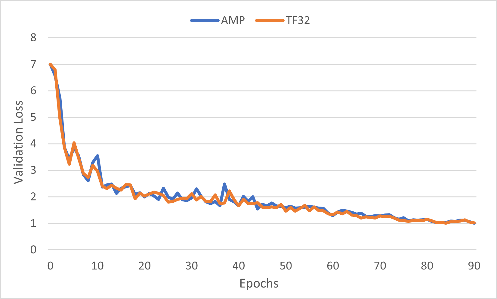
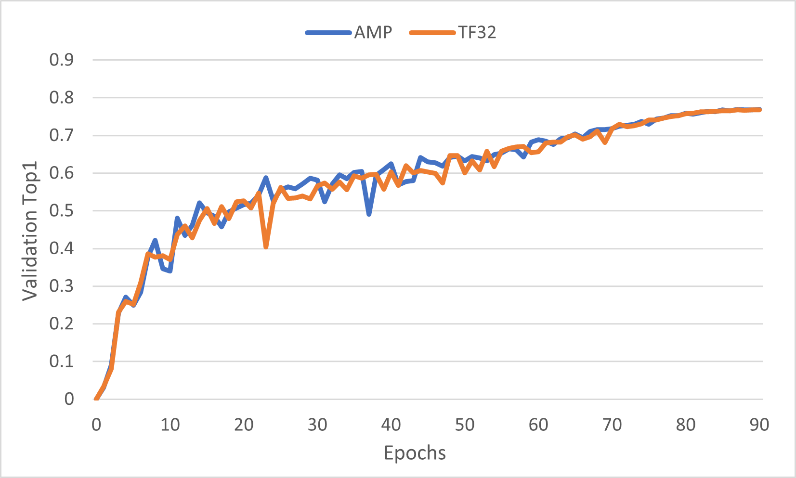
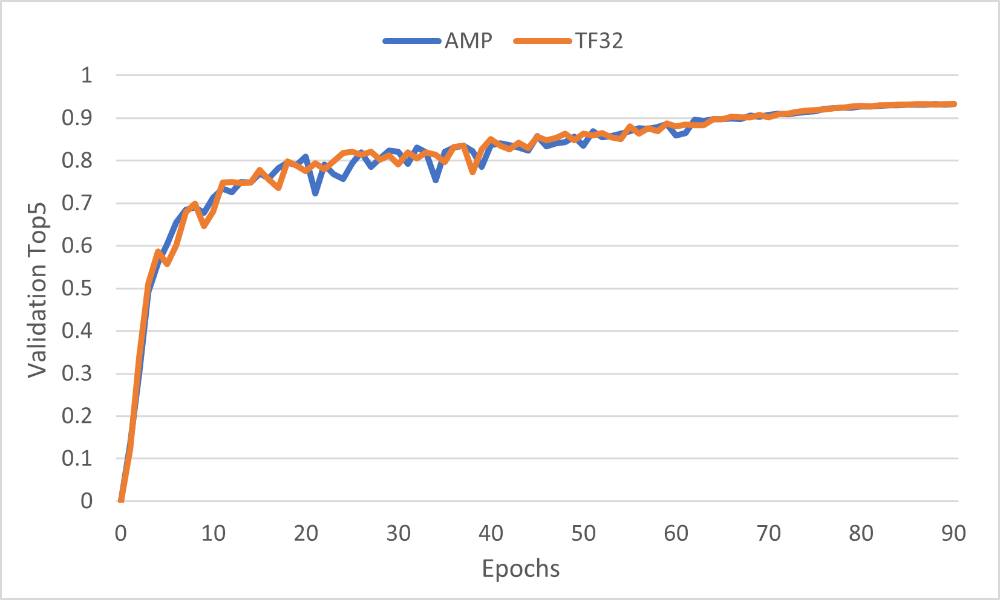

# ResNet50 v1.5 For PaddlePaddle

This repository provides a script and recipe to train the ResNet50 model to
achieve state-of-the-art accuracy. The content of this repository is tested and maintained by NVIDIA.

## Table Of Contents

* [Model overview](#model-overview)
  * [Default configuration](#default-configuration)
    * [Optimizer](#optimizer)
    * [Data augmentation](#data-augmentation)
  * [DALI](#dali)
  * [Feature support matrix](#feature-support-matrix)
    * [Features](#features)
  * [Mixed precision training](#mixed-precision-training)
    * [Enabling mixed precision](#enabling-mixed-precision)
    * [Enabling TF32](#enabling-tf32)
  * [Automatic SParsity](#automatic-sparsity)
    * [Enable Automatic SParsity](#enable-automatic-sparsity)
* [Setup](#setup)
  * [Requirements](#requirements)
* [Quick Start Guide](#quick-start-guide)
* [Advanced](#advanced)
  * [Scripts and sample code](#scripts-and-sample-code)
  * [Command-line options](#command-line-options)
  * [Dataset guidelines](#dataset-guidelines)
  * [Training process](#training-process)
  * [Automatic SParsity training process](#automatic-sparsity-training-process)
  * [Inference process](#inference-process)
* [Performance](#performance)
  * [Benchmarking](#benchmarking)
    * [Training performance benchmark](#training-performance-benchmark)
    * [Inference performance benchmark](#inference-performance-benchmark)
  * [Results](#results)
    * [Training accuracy results](#training-accuracy-results)
      * [Training accuracy: NVIDIA DGX A100 (8x A100 80GB)](#training-accuracy-nvidia-dgx-a100-8x-a100-80gb)
      * [Example plots](#example-plots)
      * [Accuracy recovering of Automatic SParsity: NVIDIA DGX A100 (8x A100 80GB)](#accuracy-recovering-of-automatic-sparsity-nvidia-dgx-a100-8x-a100-80gb)
    * [Training performance results](#training-performance-results)
      * [Training performance: NVIDIA DGX A100 (8x A100 80GB)](#training-performance-nvidia-dgx-a100-8x-a100-80gb)
      * [Training performance of Automatic SParsity: NVIDIA DGX A100 (8x A100 80GB)](#training-performance-of-automatic-sparsity-nvidia-dgx-a100-8x-a100-80gb)
    * [Inference performance results](#inference-performance-results)
      * [Inference performance: NVIDIA DGX A100 (1x A100 80GB)](#inference-performance-nvidia-dgx-a100-1x-a100-80gb)
    * [Paddle-TRT performance results](#paddle-trt-performance-results)
      * [Paddle-TRT performance: NVIDIA DGX A100 (1x A100 80GB)](#paddle-trt-performance-nvidia-dgx-a100-1x-a100-80gb)
      * [Paddle-TRT performance: NVIDIA A30 (1x A30 24GB)](#paddle-trt-performance-nvidia-a30-1x-a30-24gb)
      * [Paddle-TRT performance: NVIDIA A10 (1x A10 24GB)](#paddle-trt-performance-nvidia-a10-1x-a10-24gb)
* [Release notes](#release-notes)
  * [Changelog](#changelog)
  * [Known issues](#known-issues)

## Model overview
The ResNet50 v1.5 model is a modified version of the [original ResNet50 v1 model](https://arxiv.org/abs/1512.03385).

The difference between v1 and v1.5 is that in the bottleneck blocks which requires
downsampling, v1 has stride = 2 in the first 1x1 convolution, whereas v1.5 has stride = 2 in the 3x3 convolution.

This difference makes ResNet50 v1.5 slightly more accurate (~0.5% top1) than v1 but comes with a small performance drawback (~5% imgs/sec).

The model is initialized as described in [Delving deep into rectifiers: Surpassing human-level performance on ImageNet classification](https://arxiv.org/pdf/1502.01852.pdf)

This model is trained with mixed precision using Tensor Cores on the NVIDIA Ampere GPU architectures. Therefore, researchers can get results over 2x faster than training without Tensor Cores while experiencing the benefits of mixed precision training. This model is tested against each NGC monthly container release to ensure consistent accuracy and performance over time.


### Default configuration

The following sections highlight the default configurations for the ResNet50 model.

#### Optimizer

This model uses SGD with momentum optimizer with the following hyperparameters:

* Momentum (0.875)
* Learning rate (LR) = 0.256 for 256 global batch size, for other batch sizes we linearly
scale the learning rate. For example, default LR = 2.048 for 2048 global batch size on 8xA100. (256 batch size per GPU)
* Learning rate schedule - we use cosine LR schedule
* Linear warmup of the learning rate during the first 5 epochs according to [Training ImageNet in 1 hour](https://arxiv.org/abs/1706.02677).
* Weight decay (WD)= 3.0517578125e-05 (1/32768).
* We do not apply WD on Batch Norm trainable parameters (gamma/bias)
* Label smoothing = 0.1
* We train for: 
    * 50 Epochs -> configuration that reaches 75.9% top1 accuracy 
    * 90 Epochs -> configuration that reaches 76.9% top1 accuracy (90 epochs is a standard for ImageNet networks)


#### Data augmentation

This model uses the following data augmentation:

* For training:
  * Normalization
  * Random resized crop to 224x224
    * Scale from 8% to 100%
    * Aspect ratio from 3/4 to 4/3
  * Random horizontal flip
* For inference:
  * Normalization
  * Scale to 256x256
  * Center crop to 224x224

#### Other training recipes

This script does not target any specific benchmark.
There are changes that others have made which can speed up convergence and/or increase accuracy.

One of the more popular training recipes is provided by [fast.ai](https://github.com/fastai/imagenet-fast).

The fast.ai recipe introduces many changes to the training procedure, one of which is progressive resizing of the training images.

The first part of training uses 128px images, the middle part uses 224px images, and the last part uses 288px images.
The final validation is performed on 288px images.

The training script in this repository performs validation on 224px images, just like the original paper described.

These two approaches can't be directly compared, since the fast.ai recipe requires validation on 288px images,
and this recipe keeps the original assumption that validation is done on 224px images.

Using 288px images means that more FLOPs are needed during inference to reach the same accuracy.


### Feature support matrix

This model supports the following features:

| Feature               | ResNet50
|-----------------------|--------------------------
|[DALI](https://docs.nvidia.com/deeplearning/sdk/dali-release-notes/index.html)   | Yes |
|[Paddle AMP](https://www.paddlepaddle.org.cn/documentation/docs/en/guides/performance_improving/amp_en.html) | Yes |
|[Paddle ASP](https://www.paddlepaddle.org.cn/documentation/docs/en/api/paddle/static/sparsity/decorate_en.html) | Yes |
|[Paddle-TRT](https://github.com/PaddlePaddle/Paddle-Inference-Demo/blob/master/docs/optimize/paddle_trt_en.rst) | Yes |

#### Features

- NVIDIA DALI - DALI is a library accelerating the data preparation pipeline. To accelerate your input pipeline, you only need to define your data loader
with the DALI library. For more information about DALI, refer to the [DALI product documentation](https://docs.nvidia.com/deeplearning/dali/user-guide/docs/index.html).

- Paddle AMP is a PaddlePaddle built-in module that provides functions to construct AMP workflow. The details can be found in [Automatic Mixed Precision (AMP)](https://www.paddlepaddle.org.cn/documentation/docs/en/guides/performance_improving/amp_en.html#automatic-mixed-precision-training-with-paddlepaddle), which requires minimal network code changes to leverage Tensor Cores performance. Refer to the [Enabling mixed precision](#enabling-mixed-precision) section for more details.

- Paddle ASP is a PaddlePaddle built-in module that provides functions to enable automatic sparsity workflow with only a few code line insertions. The full APIs can be found in [Paddle.static.sparsity](https://www.paddlepaddle.org.cn/documentation/docs/en/api/paddle/static/sparsity/calculate_density_en.html). Paddle ASP support, currently, static graph mode only (Dynamic graph support is under development). Refer to the [Enable Automatic SParsity](#enable-automatic-sparsity) section for more details.

- Paddle-TRT is a PaddlePaddle inference integration with [TensorRT](https://docs.nvidia.com/deeplearning/tensorrt/developer-guide/index.html). It selects subgraph to be accelerated by TensorRT, while leaving the rest of the operations to be executed natively by PaddlePaddle. Refer to the [Inference with TensorRT](#inference-with-tensorrt) section for more details.

### DALI

We use [NVIDIA DALI](https://github.com/NVIDIA/DALI),
which speeds up data loading when the CPU becomes a bottleneck.
DALI can use CPU or GPU and outperforms the PaddlePaddle native data loader.

For data loader, we only support DALI as data loader for now.


### Mixed precision training

Mixed precision is the combined use of different numerical precisions in a computational method. [Mixed precision](https://arxiv.org/abs/1710.03740) training offers significant computational speedup by performing operations in half-precision format while storing minimal information in single-precision to retain as much information as possible in critical parts of the network. Since the introduction of [Tensor Cores](https://developer.nvidia.com/tensor-cores) in NVIDIA Volta, and following with both the NVIDIA Turing and NVIDIA Ampere architectures, significant training speedups are experienced by switching to mixed precision -- up to 3x overall speedup on the most arithmetically intense model architectures. Using mixed precision training requires two steps:
1.  Porting the model to use the FP16 data type where appropriate.
2.  Adding loss scaling to preserve small gradient values.

The ability to train deep learning networks with lower precision was introduced in the Pascal architecture and first supported in CUDA 8 in the NVIDIA Deep Learning SDK.

For information about:
-   How to train using mixed precision in PaddlePaddle, refer to the [Mixed Precision Training](https://arxiv.org/abs/1710.03740) paper and [Automatic Mixed Precision Training](https://www.paddlepaddle.org.cn/documentation/docs/en/guides/performance_improving/amp_en.html) documentation.
-   Techniques used for mixed precision training, refer to the [Mixed-Precision Training of Deep Neural Networks](https://devblogs.nvidia.com/mixed-precision-training-deep-neural-networks/) blog.


#### Enabling mixed precision

Mixed precision is enabled in Paddle by using the Automatic Mixed Precision (AMP) 
while storing variables in single-precision format. Furthermore, to preserve small gradient magnitudes in backpropagation, a [loss scaling](https://docs.nvidia.com/deeplearning/sdk/mixed-precision-training/index.html#lossscaling) step must be included when applying gradients.
In PaddlePaddle, loss scaling can be easily applied by passing in arguments to [GradScaler()](https://www.paddlepaddle.org.cn/documentation/docs/en/api/paddle/amp/GradScaler_en.html). The scaling value to be used can be dynamic or fixed.

For an in-depth walk through on AMP, check out sample usage [here](https://www.paddlepaddle.org.cn/documentation/docs/en/guides/performance_improving/amp_en.html). Paddle AMP is a PaddlePaddle built-in module that provides functions to construct AMP workflow. The details can be found in [Automatic Mixed Precision (AMP)](https://www.paddlepaddle.org.cn/documentation/docs/en/guides/performance_improving/amp_en.html#automatic-mixed-precision-training-with-paddlepaddle), which requires minimal network code changes to leverage Tensor Cores performance.


Code example to enable mixed precision for static graph:
- Use `paddle.static.amp.decorate` to wrap optimizer
  ```python
  import paddle.static.amp as amp
  mp_optimizer = amp.decorate(optimizer=optimizer, init_loss_scaling=8.0)
  ```
- Minimize `loss` , and get `scaled_loss`, which is useful when you need customized loss.
  ```python
  ops, param_grads = mp_optimizer.minimize(loss)
  scaled_loss = mp_optimizer.get_scaled_loss()
  ```
- For distributed training, it is recommended to use Fleet to enable amp, which is a unified API for distributed training of PaddlePaddle. For more information, refer to [Fleet](https://www.paddlepaddle.org.cn/documentation/docs/en/api/paddle/distributed/fleet/Fleet_en.html#fleet)

  ```python
  import paddle.distributed.fleet as fleet
  strategy = fleet.DistributedStrategy()
  strategy.amp = True # by default this is false
  optimizer = fleet.distributed_optimizer(optimizer, strategy=dist_strategy)
  ```

#### Enabling TF32

TensorFloat-32 (TF32) is the new math mode in [NVIDIA A100](https://www.nvidia.com/en-us/data-center/a100/) GPUs for handling the matrix math, also called tensor operations. TF32 running on Tensor Cores in A100 GPUs can provide up to 10x speedups compared to single-precision floating-point math (FP32) on Volta GPUs. 

TF32 Tensor Cores can speed up networks using FP32, typically with no loss of accuracy. It is more robust than FP16 for models which require a high dynamic range for weights or activations.

For more information, refer to the [TensorFloat-32 in the A100 GPU Accelerates AI Training, HPC up to 20x](https://blogs.nvidia.com/blog/2020/05/14/tensorfloat-32-precision-format/) blog post.

TF32 is supported in the NVIDIA Ampere GPU architecture and is enabled by default.

### Automatic SParsity

Automatic SParsity (ASP) provides a workflow to transfer deep learning models from dense to 2:4 structured sparse, that allows that inference leverage NVIDIA's Sparse Tensor Core, introduced in Ampere architecture, to theoretically reach 2x speedup and save almost 50% memory usage. The workflow of ASP generally includes two steps:
- Prune well-trained dense models to 2:4 sparse.
- Retrain sparse model with same hyper-parameters to recover accuracy.

For more information, refer to
- [GTC 2020: Accelerating Sparsity in the NVIDIA Ampere Architecture.](https://developer.nvidia.com/gtc/2020/video/s22085#)
- Mishra, Asit, et al. "Accelerating Sparse Deep Neural Networks." arXiv preprint arXiv:2104.08378 (2021).
- Pool, Jeff, and Chong Yu. "Channel Permutations for N: M Sparsity." Advances in Neural Information Processing Systems 34 (2021).

#### Enable Automatic SParsity
There is a built-in module in PaddlePaddle to enable ASP training, which only needs to insert a couple of lines in the original codebase [optimizer decoration](https://www.paddlepaddle.org.cn/documentation/docs/en/api/paddle/static/sparsity/decorate_en.html) and [model pruning](https://www.paddlepaddle.org.cn/documentation/docs/en/api/paddle/static/sparsity/prune_model_en.html). 
```python
optimizer = sparsity.decorate(optimizer)
...
sparsity.prune_model(main_program)
```
Moreover, ASP is also compatible with mixed precision training.

Note that currently ASP only supports static graphs (Dynamic graph support is under development).


## Setup

The following section lists the requirements you need to meet to start training the ResNet50 model.

### Requirements
This repository contains a Dockerfile that extends the CUDA NGC container and encapsulates some dependencies. Aside from these dependencies, ensure you have the following components:

* [NVIDIA Docker](https://github.com/NVIDIA/nvidia-docker)
* [PaddlePaddle 22.05-py3 NGC container](https://catalog.ngc.nvidia.com/orgs/nvidia/containers/paddlepaddle) or newer
* Supported GPUs:
    * [NVIDIA Ampere architecture](https://www.nvidia.com/en-us/data-center/nvidia-ampere-gpu-architecture/)

For more information about how to get started with NGC containers, refer to the
following sections from the NVIDIA GPU Cloud Documentation and the Deep Learning
DGX Documentation:
* [Getting Started Using NVIDIA GPU Cloud](https://docs.nvidia.com/ngc/ngc-getting-started-guide/index.html)
* [Accessing And Pulling From The NGC Container Registry](https://docs.nvidia.com/deeplearning/dgx/user-guide/index.html#accessing_registry)


## Quick Start Guide

### 1. Clone the repository.
```bash
git clone https://github.com/NVIDIA/DeepLearningExamples.git
cd DeepLearningExamples/PaddlePaddle/Classification/RN50v1.5
```

### 2. Download and preprocess the dataset.

The ResNet50 script operates on ImageNet 1k, a widely popular image classification dataset from the ILSVRC challenge.

Paddle can work directly on JPEGs; therefore, preprocessing/augmentation is not needed.

To train your model using mixed or TF32 precision with Tensor Cores or using FP32,
perform the following steps using the default parameters of the resnet50 model on the ImageNet dataset.
For the specifics concerning training and inference, refer to the [Advanced](#advanced) section.


1. [Download the images](http://image-net.org/download-images).

2. Extract the training data:
  ```bash
  cd <path to imagenet>
  mkdir train && mv ILSVRC2012_img_train.tar train/ && cd train
  tar -xvf ILSVRC2012_img_train.tar && rm -f ILSVRC2012_img_train.tar
  find . -name "*.tar" | while read NAME ; do mkdir -p "${NAME%.tar}"; tar -xvf "${NAME}" -C "${NAME%.tar}"; rm -f "${NAME}"; done
  cd ..
  ```

3. Extract the validation data and move the images to subfolders:
  ```bash
  mkdir val && mv ILSVRC2012_img_val.tar val/ && cd val && tar -xvf ILSVRC2012_img_val.tar
  wget -qO- https://raw.githubusercontent.com/soumith/imagenetloader.torch/master/valprep.sh | bash
  ```

The directory in which the `train/` and `val/` directories are placed is referred to as `<path to imagenet>` in this document.

### 3. Build the ResNet50 PaddlePaddle NGC container.
```bash
docker build . -t nvidia_resnet50
```

### 4. Start an interactive session in the NGC container to run training/inference.
```bash
nvidia-docker run --rm -it -v <path to imagenet>:/imagenet --ipc=host nvidia_resnet50
```

### 5. Start training

To run training for a standard configuration (DGXA100, AMP/TF32),
use one of scripts in `scripts/training` to launch training. (Please ensure ImageNet is mounted in the `/imagenet` directory.)

Example:
```bash
# For TF32 and 8 GPUs training in 90 epochs
bash scripts/training/train_resnet50_TF32_90E_DGXA100.sh

# For AMP and 8 GPUs training in 90 epochs
bash scripts/training/train_resnet50_TF32_90E_DGXA100.sh
```

Or you can manually launch training by `paddle.distributed.launch`. `paddle.distributed.launch` is a built-in module in PaddlePaddle that spawns up multiple distributed training processes on each of the training nodes.

Example:
```bash
# For single GPU training with AMP
python -m paddle.distributed.launch --gpus=0 train.py \
  --epochs 90 \
  --amp \
  --scale-loss 128.0 \
  --use-dynamic-loss-scaling \
  --data-layout NHWC

# For 8 GPUs training with AMP
python -m paddle.distributed.launch --gpus=0,1,2,3,4,5,6,7 train.py \
  --epochs 90 \
  --amp \
  --scale-loss 128.0 \
  --use-dynamic-loss-scaling \
  --data-layout NHWC
```

Note that for initializing training with checkpoints or pretrained parameters, refer to [Training process](#training-process) for more details.

### 6. Start validation/evaluation.
To evaluate the validation dataset located in `/imagenet/val`, you need to specify the pretrained parameters by `--from-pretrained-params` and set `eval_only` to `--run-scope`.

Example:
* TF32
```bash
# For single GPU evaluation
python -m paddle.distributed.launch --gpus=0 train.py \
  --from-pretrained-params <path_to_pretrained_params> \
  --run-scope eval_only

# For 8 GPUs evaluation
python -m paddle.distributed.launch --gpus=0,1,2,3,4,5,6,7 train.py \
  --from-pretrained-params <path_to_pretrained_params> \
  --run-scope eval_only
```

* AMP
```bash
# For single GPU evaluation
python -m paddle.distributed.launch --gpus=0 train.py \
  --from-pretrained-params <path_to_pretrained_params> \
  --run-scope eval_only \
  --amp \
  --data-layout NHWC

# For 8 GPUs evaluation
python -m paddle.distributed.launch --gpus=0,1,2,3,4,5,6,7 train.py \
  --from-pretrained-params <path_to_pretrained_params> \
  --run-scope eval_only \
  --amp \
  --data-layout NHWC
```

We also provide scripts to inference with TensorRT that could reach better performance. Refer to [Inference process](#inference-process) in [Advanced](#advanced) for more details.

## Advanced

The following sections provide greater details of the dataset, running training and inference, and the training results.

### Scripts and sample code

To run a non standard configuration use:

```bash
# For single GPU evaluation
python -m paddle.distributed.launch --gpus=0 train.py

# For 8 GPUs evaluation
python -m paddle.distributed.launch --gpus=0,1,2,3,4,5,6,7 train.py
```

### Command-line options:
To find the full list of available options and their descriptions, use the `-h` or `--help` command-line option, for example:
`python [train.py|export_model.py|inference.py] -h`

```bash
PaddlePaddle RN50v1.5 training script

optional arguments:
  -h, --help            show this help message and exit

Global:
  --output-dir OUTPUT_DIR
                        A path to store trained models. (default: ./output/)
  --run-scope {train_eval,train_only,eval_only}
                        Running scope. It should be one of {train_eval, train_only, eval_only}. (default: train_eval)
  --epochs EPOCHS       The number of epochs for training. (default: 90)
  --save-interval SAVE_INTERVAL
                        The iteration interval to save checkpoints. (default: 1)
  --eval-interval EVAL_INTERVAL
                        The iteration interval to test trained models on a given validation dataset. Ignored when --run-scope is train_only.
                        (default: 1)
  --print-interval PRINT_INTERVAL
                        The iteration interval to show training/evaluation message. (default: 10)
  --report-file REPORT_FILE
                        A file in which to store JSON experiment report. (default: ./report.json)
  --data-layout {NCHW,NHWC}
                        Data format. It should be one of {NCHW, NHWC}. (default: NCHW)
  --benchmark           To enable benchmark mode. (default: False)
  --benchmark-steps BENCHMARK_STEPS
                        Steps for benchmark run, only be applied when --benchmark is set. (default: 100)
  --benchmark-warmup-steps BENCHMARK_WARMUP_STEPS
                        Warmup steps for benchmark run, only be applied when --benchmark is set. (default: 100)
  --from-pretrained-params FROM_PRETRAINED_PARAMS
                        A pretrained parameters. It should be a file name without suffix .pdparams, and not be set with --from-checkpoint at
                        the same time. (default: None)
  --from-checkpoint FROM_CHECKPOINT
                        A checkpoint path to resume training. It should not be set with --from-pretrained-params at the same time. (default:
                        None)
  --last-epoch-of-checkpoint LAST_EPOCH_OF_CHECKPOINT
                        The epoch id of the checkpoint given by --from-checkpoint. Default is -1 means training starts from 0-th epoth.
                        (default: -1)
  --show-config SHOW_CONFIG
                        To show arguments. (default: True)
  --enable-cpu-affinity ENABLE_CPU_AFFINITY
                        To enable in-built GPU-CPU affinity. (default: True)

Dataset:
  --image-root IMAGE_ROOT
                        A root folder of train/val images. It should contain train and val folders, which store corresponding images.
                        (default: /imagenet)
  --image-shape IMAGE_SHAPE
                        The image shape. Its shape should be [channel, height, width]. (default: [4, 224, 224])
  --batch-size BATCH_SIZE
                        The batch size for both training and evaluation. (default: 256)
  --dali-random-seed DALI_RANDOM_SEED
                        The random seed for DALI data loader. (default: 42)
  --dali-num-threads DALI_NUM_THREADS
                        The number of threads applied to DALI data loader. (default: 4)
  --dali-output-fp16    Output FP16 data from DALI data loader. (default: False)

Data Augmentation:
  --crop-size CROP_SIZE
                        The size to crop input images. (default: 224)
  --rand-crop-scale RAND_CROP_SCALE
                        Range from which to choose a random area fraction. (default: [0.08, 1.0])
  --rand-crop-ratio RAND_CROP_RATIO
                        Range from which to choose a random aspect ratio (width/height). (default: [0.75, 1.3333333333333333])
  --normalize-scale NORMALIZE_SCALE
                        A scalar to normalize images. (default: 0.00392156862745098)
  --normalize-mean NORMALIZE_MEAN
                        The mean values to normalize RGB images. (default: [0.485, 0.456, 0.406])
  --normalize-std NORMALIZE_STD
                        The std values to normalize RGB images. (default: [0.229, 0.224, 0.225])
  --resize-short RESIZE_SHORT
                        The length of the shorter dimension of the resized image. (default: 256)

Model:
  --model-arch-name MODEL_ARCH_NAME
                        The model architecture name. It should be one of {ResNet50}. (default: ResNet50)
  --num-of-class NUM_OF_CLASS
                        The number classes of images. (default: 1000)
  --bn-weight-decay     Apply weight decay to BatchNorm shift and scale. (default: False)

Training:
  --label-smoothing LABEL_SMOOTHING
                        The ratio of label smoothing. (default: 0.1)
  --optimizer OPTIMIZER
                        The name of optimizer. It should be one of {Momentum}. (default: Momentum)
  --momentum MOMENTUM   The momentum value of optimizer. (default: 0.875)
  --weight-decay WEIGHT_DECAY
                        The coefficient of weight decay. (default: 3.0517578125e-05)
  --lr-scheduler LR_SCHEDULER
                        The name of learning rate scheduler. It should be one of {Cosine}. (default: Cosine)
  --lr LR               The initial learning rate. (default: 0.256)
  --warmup-epochs WARMUP_EPOCHS
                        The number of epochs for learning rate warmup. (default: 5)
  --warmup-start-lr WARMUP_START_LR
                        The initial learning rate for warmup. (default: 0.0)

Advanced Training:
  --amp                 Enable automatic mixed precision training (AMP). (default: False)
  --scale-loss SCALE_LOSS
                        The loss scalar for AMP training, only be applied when --amp is set. (default: 1.0)
  --use-dynamic-loss-scaling
                        Enable dynamic loss scaling in AMP training, only be applied when --amp is set. (default: False)
  --use-pure-fp16       Enable pure FP16 training, only be applied when --amp is set. (default: False)
  --asp                 Enable automatic sparse training (ASP). (default: False)
  --prune-model         Prune model to 2:4 sparse pattern, only be applied when --asp is set. (default: False)
  --mask-algo {mask_1d,mask_2d_greedy,mask_2d_best}
                        The algorithm to generate sparse masks. It should be one of {mask_1d, mask_2d_greedy, mask_2d_best}. This only be
                        applied when --asp and --prune-model is set. (default: mask_1d)

Paddle-TRT:
  --trt-inference-dir TRT_INFERENCE_DIR
                        A path to store/load inference models. export_model.py would export models to this folder, then inference.py would
                        load from here. (default: ./inference)
  --trt-precision {FP32,FP16,INT8}
                        The precision of TensorRT. It should be one of {FP32, FP16, INT8}. (default: FP32)
  --trt-workspace-size TRT_WORKSPACE_SIZE
                        The memory workspace of TensorRT in MB. (default: 1073741824)
  --trt-min-subgraph-size TRT_MIN_SUBGRAPH_SIZE
                        The minimal subgraph size to enable PaddleTRT. (default: 3)
  --trt-use-static TRT_USE_STATIC
                        Fix TensorRT engine at first running. (default: False)
  --trt-use-calib-mode TRT_USE_CALIB_MODE
                        Use the PTQ calibration of PaddleTRT int8. (default: False)
  --trt-export-log-path TRT_EXPORT_LOG_PATH
                        A file in which to store JSON model exporting report. (default: ./export.json)
  --trt-log-path TRT_LOG_PATH
                        A file in which to store JSON inference report. (default: ./inference.json)
  --trt-use-synthat TRT_USE_SYNTHAT
                        Apply synthetic data for benchmark. (default: False)
```

### Dataset guidelines

To use your own dataset, divide it in directories as in the following scheme:

 - Training images - `train/<class id>/<image>`
 - Validation images - `val/<class id>/<image>`

If the number of classes in your dataset is not 1000, you need to specify it to `--num-of-class`.

### Training process
The model will be stored in the directory specified with `--output-dir`, including three files:
- `.pdparams`: The parameters contain all the trainable tensors and will save to a file with the suffix “.pdparams”. 
- `.pdopts`: The optimizer information contains all the Tensors used by the optimizer. For Adam optimizer, it contains beta1, beta2, momentum, and so on. All the information will be saved to a file with suffix “.pdopt”. (If the optimizer has no Tensor need to save (like SGD), the file will not be generated).
- `.pdmodel`: The network description is the description of the program. It’s only used for deployment. The description will save to a file with the suffix “.pdmodel”.

The default prefix of model files is `paddle_example`. Model of each epoch would be stored in directory `./output/ResNet/epoch_id/` with three files by default, including `paddle_example.pdparams`, `paddle_example.pdopts`, `paddle_example.pdmodel`. Note that `epoch_id` is 0-based, which means `epoch_id` is from 0 to 89 for a total of 90 epochs. For example, the model of the 89th epoch would be stored in `./output/ResNet/89/paddle_example` 

Assume you want to train the ResNet for 90 epochs, but the training process aborts during the 50th epoch due to infrastructure faults. To resume training from the checkpoint, specify `--from-checkpoint` and `--last-epoch-of-checkpoint` with following these steps:  
- Set `./output/ResNet/49/paddle_example` to `--from-checkpoint`.
- Set `--last-epoch-of-checkpoint` to `49`.
Then rerun the training to resume training from the 50th epoch to the 89th epoch.

Example:
```bash
# Resume AMP training from checkpoint of 50-th epoch
python -m paddle.distributed.launch --gpus=0,1,2,3,4,5,6,7 train.py \
  --epochs 90 \
  --amp \
  --scale-loss 128.0 \
  --use-dynamic-loss-scaling \
  --data-layout NHWC \
  --from-checkpoint ./output/ResNet/49/paddle_example
  --last-epoch-of-checkpoint 49
```

To start training from pretrained weights, set `--from-pretrained-params` to `./output/ResNet/<epoch_id>/paddle_example`.

Example:
```bash
# Train AMP with model initialization by <./your_own_path_to/paddle_example>
python -m paddle.distributed.launch --gpus=0,1,2,3,4,5,6,7 train.py \
  --epochs 90 \
  --amp \
  --scale-loss 128.0 \
  --use-dynamic-loss-scaling \
  --data-layout NHWC \
  --from-pretrained-params ./your_own_path_to/paddle_example
```

Make sure:
- Resume from checkpoints: Both `paddle_example.pdopts` and `paddle_example.pdparams` must be in the given path.
- Start from pretrained weights: `paddle_example.pdparams` must be in the given path.
- The prefix `paddle_example` must be added to the end of the given path. For example: set path as `./output/ResNet/89/paddle_example` instead of `./output/ResNet/89/`
- Don't set `--from-checkpoint` and `--from-pretrained-params` at the same time.

The difference between those two is that `--from-pretrained-params` contain only model weights, and `--from-checkpoint`, apart from model weights, contain the optimizer state, and LR scheduler state.

`--from-checkpoint` is suitable for dividing the training into parts, for example, in order to divide the training job into shorter stages, or restart training after infrastructure faults.

`--from-pretrained-params` can be used as a base for finetuning the model to a different dataset or as a backbone to detection models.

Metrics gathered through both training and evaluation:
 - `[train|val].loss` - loss
 - `[train|val].top1` - top 1 accuracy
 - `[train|val].top5` - top 5 accuracy
 - `[train|val].data_time` - time spent on waiting on data
 - `[train|val].compute_time` - time spent on computing
 - `[train|val].batch_time` - time spent on a mini-batch
 - `[train|val].ips` - speed measured in images per second

 Metrics gathered through training only
 - `train.lr` - learning rate


### Automatic SParsity training process:
To enable automatic sparsity training workflow, turn on `--amp` and `--prune-mode` when training launches. Refer to [Command-line options](#command-line-options)

Note that automatic sparsity (ASP) requires a pretrained model to initialize parameters.

You can apply `scripts/training/train_resnet50_AMP_ASP_90E_DGXA100.sh` we provided to launch ASP + AMP training.
```bash
# Default path to pretrained parameters is ./output/ResNet50/89/paddle_example
bash scripts/training/train_resnet50_AMP_ASP_90E_DGXA100.sh <pretrained_parameters>
```

Or following steps below to manually launch ASP + AMP training.

First, set `--from-pretrained-params` to a pretrained model file. For example, if you have trained the ResNet for 90 epochs following [Training process](#training-process), the final pretrained weights would be stored in `./output/ResNet50/89/paddle_example.pdparams` by default, and set `--from-pretrained-params` to `./output/ResNet/89/paddle_example`.

Then run following command to run AMP + ASP:
```bash
python -m paddle.distributed.launch --gpus=0,1,2,3,4,5,6,7 train.py \
  --from-pretrained-params ./output/ResNet50/89/paddle_example \
  --epochs 90 \
  --amp \
  --scale-loss 128.0 \
  --use-dynamic-loss-scaling \
  --data-layout NHWC \
  --asp \
  --prune-model \
  --mask-algo mask_1d
```

### Inference process

#### Inference on your own datasets.
To run inference on a single example with pretrained parameters,

1. Set `--from-pretrained-params` to your pretrained parameters.
2. Set `--image-root` to the root folder of your own dataset. 
  - Note that validation dataset should be in `image-root/val`.
3. Set `--run-scope` to `eval_only`.
```bash
# For single GPU evaluation
python -m paddle.distributed.launch --gpus=0 train.py \
  --from-pretrained-params <path_to_pretrained_params> \
  --image-root <your_own_dataset> \
  --run-scope eval_only

# For 8 GPUs evaluation
python -m paddle.distributed.launch --gpus=0,1,2,3,4,5,6,7 train.py \
  --from-pretrained-params <path_to_pretrained_params> \
  --image-root <your_own_dataset> \
  --run-scope eval_only
```

#### Inference with TensorRT
To run inference with TensorRT for the best performance, you can apply the scripts in `scripts/inference`.

For example,
1. Run `bash scripts/inference/export_resnet50_AMP.sh <your_checkpoint>` to export an inference model.
  - The default path of checkpoint is `./output/ResNet/89/paddle_example`.
2. Run `bash scripts/inference/infer_resnet50_AMP.sh` to infer with TensorRT.

Or you could manually run `export_model.py` and `inference.py` with specific arguments, refer to [Command-line options](#command-line-options).

Note that arguments passed to `export_model.py` and `inference.py` should be the same with arguments used in training.

## Performance

The performance measurements in this document were conducted at the time of publication and may not reflect the performance achieved from NVIDIA’s latest software release. For the most up-to-date performance measurements, go to [NVIDIA Data Center Deep Learning Product Performance](https://developer.nvidia.com/deep-learning-performance-training-inference).

### Benchmarking

The following section shows how to run benchmarks measuring the model performance in training and inference modes.

#### Training performance benchmark

To benchmark training (A100 GPUs only for now), set `--benchmark`, `--benchmark-steps` and `--benchmark-warmup-steps`, then run training with `--run-scope train_only`.
Refer to [Command-line options](#command-line-options).

Example:
```bash
# For 8 GPUs benchmark for AMP
python -m paddle.distributed.launch --gpus=0,1,2,3,4,5,6,7 train.py \
  --run-scope train_only \
  --amp \
  --scale-loss 128.0 \
  --use-dynamic-loss-scaling \
  --data-layout NHWC \
  --benchmark \
  --benchmark-steps 100 \
  --benchmark-warmup-steps 300
```

Benchmark will run 300 iterations for warmup and 100 iterations for benchmark, then save benchmark results in the `--report-file` file.

#### Inference performance benchmark

##### Benchmark

To benchmark evaluation (A100 GPUs only for now), set `--benchmark`, `--benchmark-steps` and `--benchmark-warmup-steps`, then run training with `--run-scope eval_only`.
Refer to [Command-line options](#command-line-options).

Example:
```bash
# For 8 GPUs benchmark for AMP
python -m paddle.distributed.launch --gpus=0,1,2,3,4,5,6,7 train.py \
  --run-scope eval_only \
  --amp \
  --data-layout NHWC \
  --benchmark \
  --benchmark-steps 100 \
  --benchmark-warmup-steps 300
```

Benchmark will run 300 iterations for warmup and 100 iterations for benchmark, then save benchmark results in the `--report-file` file.

It is also allowed to set batch size for benchmark by adding `--batch-size <batch_size>` in launching commands.
```bash
# For 8 GPUs benchmark for AMP
python -m paddle.distributed.launch --gpus=0,1,2,3,4,5,6,7 train.py \
  --run-scope eval_only \
  --batch-size 32 \
  --amp \
  --data-layout NHWC \
  --benchmark \
  --benchmark-steps 100 \
  --benchmark-warmup-steps 300
```

##### Benchmark with TensorRT

To benchmark the inference performance with TensorRT on a specific batch size, run:

* FP32 / TF32
```bash
python inference.py \
    --trt-inference-dir <path_to_exported_model> \
    --trt-precision FP32 \
    --batch-size <batch_size> \
    --benchmark-steps 1024 \
    --benchmark-warmup-steps 16
```

* FP16
```bash
python inference.py \
    --trt-inference-dir <path_to_exported_model> \
    --trt-precision FP16 \
    --batch-size <batch_size>
    --benchmark-steps 1024 \
    --benchmark-warmup-steps 16
```

Note that arguments passed to `inference.py` should be the same with arguments used in training.

The benchmark uses the validation dataset by default, which should be put in `--image-root/val`.
For the performance benchmark of the raw model, a synthetic dataset can be used. To use synthetic dataset, add `--trt-use-synthat True` as a command line option.

### Results

#### Training accuracy results

Our results were obtained by running the applicable training script in the PaddlePaddle NGC container.

To achieve these same results, follow the steps in the [Quick Start Guide](#quick-start-guide).


##### Training accuracy: NVIDIA DGX A100 (8x A100 80GB)

| **Epochs** | **Mixed Precision Top1** | **TF32 Top1**   |
|:----------:|:------------------------:|:---------------:|
|     50     |       75.96 +/- 0.09     |  76.17 +/- 0.11 |
|     90     |       76.93 +/- 0.14     |  76.91 +/- 0.13 |

##### Example plots

The following images show the 90 epochs configuration on a DGX-A100.





##### Accuracy recovering of Automatic SParsity: NVIDIA DGX A100 (8x A100 80GB)

| **Epochs** | **Mixed Precision Top1 (Baseline)** | **Mixed Precision+ASP Top1**  |
|:----------:|:-----------------------------------:|:-----------------------------:|
|     90     |              76.92                  |              76.72             |

#### Training performance results

Our results were obtained by running the applicable training script in the PaddlePaddle NGC container.

To achieve these same results, follow the steps in the [Quick Start Guide](#quick-start-guide).

##### Training performance: NVIDIA DGX A100 (8x A100 80GB)

| **GPUs** |  **Throughput - TF32**  | **Throughput - mixed precision** | **Throughput speedup (TF32 to mixed precision)** | **TF32 Scaling** | **Mixed Precision Scaling** | **Mixed Precision Training Time (90E)** | **TF32 Training Time (90E)** |
|:--------:|:------------:|:-------------:|:------------:|:------:|:--------:|:--------:|:--------:|
|    1     |    993 img/s |  2711 img/s   |    2.73 x    | 1.0 x  |  1.0 x   | ~13 hours| ~40 hours|
|    8     |  7955 img/s  |   20267 img/s |    2.54 x    | 8.01 x | 7.47 x   | ~2 hours | ~4 hours |

##### Training performance of Automatic SParsity: NVIDIA DGX A100 (8x A100 80GB)
| **GPUs** |  **Throughput - mixed precision** | **Throughput - mixed precision+ASP** | **Overhead** |
|:--------:|:---------------------------------:|:------------------------------------:|:------------:|
|    1     |           2711 img/s              |               2686 img/s             | 1.0%         |
|    8     |          20267 img/s              |              20144 img/s             | 0.6%         |


Note that the `train.py` would enable CPU affinity binding to GPUs by default, that is designed and guaranteed being optimal for NVIDIA DGX-series. You could disable binding via launch `train.py` with `--enable-cpu-affinity false`.


### Inference performance results

#### Inference performance: NVIDIA DGX A100 (1x A100 80GB)
Our results were obtained by running the applicable training script with `--run-scope eval_only` argument in the PaddlePaddle NGC container.

**TF32 Inference Latency**

|**Batch Size**|**Avg throughput**|**Avg latency**|**90% Latency**|**95% Latency**|**99% Latency**|
|--------------|------------------|---------------|---------------|---------------|---------------|
| 1 | 138.90 img/s | 7.19 ms | 7.25 ms | 7.70 ms | 17.05 ms |
| 2 | 263.20 img/s | 7.59 ms | 7.61 ms | 8.27 ms | 18.17 ms |
| 4 | 442.47 img/s | 9.04 ms | 9.31 ms | 10.10 ms | 20.41 ms |
| 8 | 904.99 img/s | 8.83 ms | 9.27 ms | 10.08 ms | 18.16 ms |
| 16 | 1738.12 img/s | 9.20 ms | 9.75 ms | 10.16 ms | 18.06 ms |
| 32 | 2423.74 img/s | 13.20 ms | 16.09 ms | 18.10 ms | 28.01 ms |
| 64 | 2890.31 img/s | 22.14 ms | 22.10 ms | 22.79 ms | 30.62 ms |
| 128 | 2676.88 img/s | 47.81 ms | 68.94 ms | 77.97 ms | 92.41 ms |
| 256 | 3283.94 img/s | 77.95 ms | 79.02 ms | 80.88 ms | 98.36 ms |

**Mixed Precision Inference Latency**

|**Batch Size**|**Avg throughput**|**Avg latency**|**90% Latency**|**95% Latency**|**99% Latency**|
|--------------|------------------|---------------|---------------|---------------|---------------|
| 1 | 127.12 img/s | 7.86 ms | 8.24 ms | 8.52 ms | 14.17 ms |
| 2 | 239.49 img/s | 8.35 ms | 9.08 ms | 9.78 ms |  9.89 ms |
| 4 | 519.19 img/s | 7.70 ms | 7.44 ms | 7.69 ms | 14.20 ms |
| 8 | 918.01 img/s | 8.71 ms | 8.39 ms | 9.08 ms | 21.23 ms |
| 16 | 1795.41 img/s | 8.91 ms | 9.73 ms | 10.36 ms | 11.39 ms |
| 32 | 3201.59 img/s | 9.99 ms | 12.04 ms | 15.29 ms | 23.23 ms |
| 64 | 4919.89 img/s | 13.00 ms | 13.66 ms | 14.06 ms | 24.75 ms |
| 128 | 4361.36 img/s | 29.34 ms | 47.47 ms | 157.49 ms | 77.42 ms |
| 256 | 5742.03 img/s | 44.58 ms | 52.78 ms | 356.58 ms | 78.99 ms |

### Paddle-TRT performance results

#### Paddle-TRT performance: NVIDIA DGX A100 (1x A100 80GB)
Our results for Paddle-TRT were obtained by running the `inference.py` script on NVIDIA DGX A100 with (1x A100 80G) GPU.

**TF32 Inference Latency**

|**Batch Size**|**Avg throughput**|**Avg latency**|**90% Latency**|**95% Latency**|**99% Latency**|
|--------------|------------------|---------------|---------------|---------------|---------------|
| 1 | 716.49 img/s | 1.40 ms | 1.96 ms | 2.20 ms | 3.01 ms |
| 2 | 1219.98 img/s | 1.64 ms | 2.26 ms | 2.90 ms | 5.04 ms |
| 4 | 1880.12 img/s | 2.13 ms | 3.39 ms | 4.44 ms | 7.32 ms |
| 8 | 2404.10 img/s | 3.33 ms | 4.51 ms | 5.90 ms | 10.39 ms |
| 16 | 3101.28 img/s | 5.16 ms | 7.06 ms | 9.13 ms | 15.18 ms |
| 32 | 3294.11 img/s | 9.71 ms | 21.42 ms | 26.94 ms | 35.79 ms |
| 64 | 4327.38 img/s | 14.79 ms | 25.59 ms | 30.45 ms | 45.34 ms |
| 128 | 4956.59 img/s | 25.82 ms | 33.74 ms | 40.36 ms | 56.06 ms |
| 256 | 5244.29 img/s | 48.81 ms | 62.11 ms | 67.56 ms | 88.38 ms |

**FP16 Inference Latency**

|**Batch Size**|**Avg throughput**|**Avg latency**|**90% Latency**|**95% Latency**|**99% Latency**|
|--------------|------------------|---------------|---------------|---------------|---------------|
| 1 | 860.90 img/s | 1.16 ms | 1.81 ms | 2.06 ms | 2.98 ms |
| 2 | 1464.06 img/s | 1.37 ms | 2.13 ms | 2.73 ms | 4.76 ms |
| 4 | 2246.24 img/s | 1.78 ms | 3.17 ms | 4.20 ms | 7.39 ms |
| 8 | 2457.44 img/s | 3.25 ms | 4.35 ms | 5.50 ms | 9.98 ms |
| 16 | 3928.83 img/s | 4.07 ms | 6.26 ms | 8.50 ms | 15.10 ms |
| 32 | 3853.13 img/s | 8.30 ms | 19.87 ms | 25.51 ms | 34.99 ms |
| 64 | 5581.89 img/s | 11.46 ms | 22.32 ms | 30.75 ms | 43.35 ms |
| 128 | 6846.77 img/s | 18.69 ms | 25.43 ms | 35.03 ms | 50.04 ms |
| 256 | 7481.19 img/s | 34.22 ms | 40.92 ms | 51.10 ms | 65.68 ms |

#### Paddle-TRT performance: NVIDIA A30 (1x A30 24GB)
Our results for Paddle-TRT were obtained by running the `inference.py` script on NVIDIA A30 with (1x A30 24G) GPU.

**TF32 Inference Latency**

|**Batch Size**|**Avg throughput**|**Avg latency**|**90% Latency**|**95% Latency**|**99% Latency**|
|--------------|------------------|---------------|---------------|---------------|---------------|
| 1 | 672.79 img/s | 1.49 ms | 2.01 ms | 2.29 ms | 3.04 ms |
| 2 | 1041.47 img/s | 1.92 ms | 2.49 ms | 2.87 ms | 4.13 ms |
| 4 | 1505.64 img/s | 2.66 ms | 3.43 ms | 4.06 ms | 6.85 ms |
| 8 | 2001.13 img/s | 4.00 ms | 4.72 ms | 5.54 ms | 9.51 ms |
| 16 | 2462.80 img/s | 6.50 ms | 7.71 ms | 9.32 ms | 15.54 ms |
| 32 | 2474.34 img/s | 12.93 ms | 21.61 ms | 25.76 ms | 34.69 ms |
| 64 | 2949.38 img/s | 21.70 ms | 29.58 ms | 34.63 ms | 47.11 ms |
| 128 | 3278.67 img/s | 39.04 ms | 43.34 ms | 52.72 ms | 66.78 ms |
| 256 | 3293.10 img/s | 77.74 ms | 90.51 ms | 99.71 ms | 110.80 ms |

**FP16 Inference Latency**

|**Batch Size**|**Avg throughput**|**Avg latency**|**90% Latency**|**95% Latency**|**99% Latency**|
|--------------|------------------|---------------|---------------|---------------|---------------|
| 1 | 804.56 img/s | 1.24 ms | 1.81 ms | 2.15 ms | 3.07 ms |
| 2 | 1435.74 img/s | 1.39 ms | 2.05 ms | 2.48 ms | 3.86 ms |
| 4 | 2169.87 img/s | 1.84 ms | 2.72 ms | 3.39 ms | 5.94 ms |
| 8 | 2395.13 img/s | 3.34 ms | 4.46 ms | 5.11 ms | 9.49 ms |
| 16 | 3779.82 img/s | 4.23 ms | 5.83 ms | 7.66 ms | 14.44 ms |
| 32 | 3620.18 img/s | 8.84 ms | 17.90 ms | 22.31 ms | 30.91 ms |
| 64 | 4592.08 img/s | 13.94 ms | 24.00 ms | 29.38 ms | 41.41 ms |
| 128 | 5064.06 img/s | 25.28 ms | 31.73 ms | 37.79 ms | 53.01 ms |
| 256 | 4774.61 img/s | 53.62 ms | 59.04 ms | 67.29 ms | 80.51 ms |


#### Paddle-TRT performance: NVIDIA A10 (1x A10 24GB)
Our results for Paddle-TRT were obtained by running the `inference.py` script on NVIDIA A10 with (1x A10 24G) GPU.

**TF32 Inference Latency**

|**Batch Size**|**Avg throughput**|**Avg latency**|**90% Latency**|**95% Latency**|**99% Latency**|
|--------------|------------------|---------------|---------------|---------------|---------------|
| 1 | 372.04 img/s | 2.69 ms | 3.64 ms | 4.20 ms | 5.28 ms |
| 2 | 615.93 img/s | 3.25 ms | 4.08 ms | 4.59 ms | 6.42 ms |
| 4 | 1070.02 img/s | 3.74 ms | 3.90 ms | 4.35 ms | 7.48 ms |
| 8 | 1396.88 img/s | 5.73 ms | 6.87 ms | 7.52 ms | 10.63 ms |
| 16 | 1522.20 img/s | 10.51 ms | 12.73 ms | 13.84 ms | 17.84 ms |
| 32 | 1674.39 img/s | 19.11 ms | 23.23 ms | 24.63 ms | 29.55 ms |
| 64 | 1782.14 img/s | 35.91 ms | 41.84 ms | 44.53 ms | 48.94 ms |
| 128 | 1722.33 img/s | 74.32 ms | 85.37 ms | 89.27 ms | 94.85 ms |
| 256 | 1576.89 img/s | 162.34 ms | 181.01 ms | 185.92 ms | 194.42 ms |

**FP16 Inference Latency**

|**Batch Size**|**Avg throughput**|**Avg latency**|**90% Latency**|**95% Latency**|**99% Latency**|
|--------------|------------------|---------------|---------------|---------------|---------------|
| 1 | 365.38 img/s | 2.74 ms | 3.94 ms | 4.35 ms | 5.64 ms |
| 2 | 612.52 img/s | 3.26 ms | 4.34 ms | 4.80 ms | 6.97 ms |
| 4 | 1018.15 img/s | 3.93 ms | 4.95 ms | 5.55 ms | 9.16 ms |
| 8 | 1924.26 img/s | 4.16 ms | 5.44 ms | 6.20 ms | 11.89 ms |
| 16 | 2477.49 img/s | 6.46 ms | 8.07 ms | 9.21 ms | 15.05 ms |
| 32 | 2896.01 img/s | 11.05 ms | 13.56 ms | 15.32 ms | 21.76 ms |
| 64 | 3165.27 img/s | 20.22 ms | 24.20 ms | 25.94 ms | 33.18 ms |
| 128 | 3176.46 img/s | 40.29 ms | 46.36 ms | 49.15 ms | 54.95 ms |
| 256 | 3110.01 img/s | 82.31 ms | 93.21 ms | 96.06 ms | 99.97 ms |

## Release notes

### Changelog

1. December 2021
  * Initial release
  * Cosine LR schedule
  * DALI support
  * DALI-CPU dataloader
  * Added A100 scripts
  * Paddle AMP


2. January 2022
  * Added options Label Smoothing, fan-in initialization, skipping weight decay on batch norm gamma and bias.
  * Updated README
  * A100 convergence benchmark


### Known issues
  * Allreduce issues to top1 and top5 accuracy in evaluation. Workaround: use `build_strategy.fix_op_run_order = True` for eval program. (refer to [Paddle-issue-39567](https://github.com/PaddlePaddle/Paddle/issues/39567) for details)
