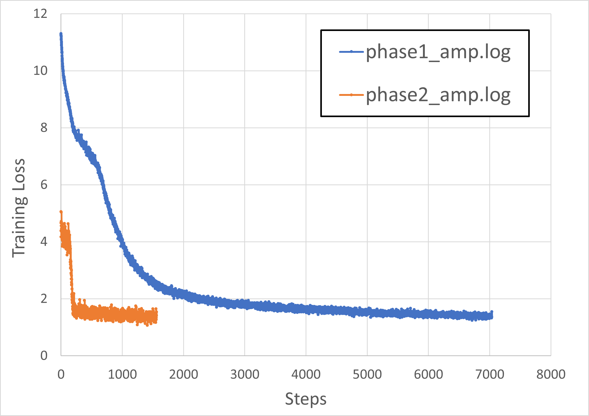

# BERT for PaddlePaddle

This repository provides a script and recipe to train the BERT model for PaddlePaddle to achieve state-of-the-art accuracy and is tested and maintained by NVIDIA.
 
## Table Of Contents
 
- [Model overview](#model-overview)
    * [Model architecture](#model-architecture)
    * [Default configuration](#default-configuration)
    * [Feature support matrix](#feature-support-matrix)
        * [Features](#features)
    * [Mixed precision training](#mixed-precision-training)
        * [Enabling mixed precision](#enabling-mixed-precision)
        * [Enabling TF32](#enabling-tf32)
    * [Glossary](#glossary)
- [Setup](#setup)
    * [Requirements](#requirements)
- [Quick Start Guide](#quick-start-guide)
- [Advanced](#advanced)
    * [Scripts and sample code](#scripts-and-sample-code)
    * [Parameters](#parameters)
        * [Pre-training parameters](#pre-training-parameters)
        * [Fine tuning parameters](#fine-tuning-parameters)
        * [Multi-node](#multi-node)
    * [Command-line options](#command-line-options)
    * [Getting the data](#getting-the-data)
        * [Dataset guidelines](#dataset-guidelines)
    * [Training process](#training-process)
        * [Pre-training](#pre-training)
        * [Fine-tuning](#fine-tuning)   
    * [Inference process](#inference-process)
- [Performance](#performance)
    * [Benchmarking](#benchmarking)
        * [Training performance benchmark](#training-performance-benchmark)
        * [Inference performance benchmark](#inference-performance-benchmark)
    * [Results](#results)
        * [Training accuracy results](#training-accuracy-results)
            * [Pre-training loss results: NVIDIA DGX A100 (8x A100 80GB)](#pre-training-loss-results-nvidia-dgx-a100-8x-a100-80gb)
            * [Pre-training loss curves](#pre-training-loss-curves)
            * [Fine-tuning accuracy results: NVIDIA DGX A100 (8x A100 80GB)](#fine-tuning-accuracy-results-nvidia-dgx-a100-8x-a100-80gb)
            * [Training stability test](#training-stability-test)
                * [Pre-training stability test](#pre-training-stability-test)
                * [Fine-tuning stability test](#fine-tuning-stability-test) 
        * [Training performance results](#training-performance-results)
            * [Training performance: NVIDIA DGX A100 (8x A100 80GB)](#training-performance-nvidia-dgx-a100-8x-a100-80gb)
                * [Pre-training NVIDIA DGX A100 (8x A100 80GB)](#pre-training-nvidia-dgx-a100-8x-a100-80gb)
                * [Pre-training NVIDIA DGX A100 (8x A100 80GB) Multi-node Scaling](#pre-training-nvidia-dgx-a100-8x-a100-80gb-multi-node-scaling)
                * [Fine-tuning NVIDIA DGX A100 (8x A100 80GB)](#fine-tuning-nvidia-dgx-a100-8x-a100-80gb)
        * [Inference performance results](#inference-performance-results)
            * [Inference performance: NVIDIA DGX A100 (1x A100 80GB)](#inference-performance-nvidia-dgx-a100-1x-a100-80gb)
                * [Fine-tuning inference on NVIDIA DGX A100 (1x A100 80GB)](#fine-tuning-inference-on-nvidia-dgx-a100-1x-a100-80gb)
- [Release notes](#release-notes)
    * [Changelog](#changelog)
    * [Known issues](#known-issues)
 
 
 
## Model overview
 
Bidirectional Encoder Representations from Transformers (BERT) is a new method of pre-training language representations that obtains state-of-the-art results on a wide array of Natural Language Processing (NLP) tasks. This model is based on the [BERT: Pre-training of Deep Bidirectional Transformers for Language Understanding](https://arxiv.org/abs/1810.04805) paper.
 
This repository contains scripts to interactively launch data download, training, benchmarking, and inference routines in a Docker container for pre-training and fine-tuning tasks such as question answering. The major differences between the original implementation of the paper and this version of BERT are as follows:
 
-   Scripts to download the Wikipedia dataset
-   Scripts to preprocess downloaded data into inputs and targets for pre-training in a modular fashion
-   [LAMB](https://arxiv.org/pdf/1904.00962.pdf) optimizer to support training with larger batches
-   Adam optimizer for fine-tuning tasks
-   Automatic mixed precision (AMP) training support
 
Other publicly available implementations of BERT include:
1. [NVIDIA PyTorch](https://github.com/NVIDIA/DeepLearningExamples/tree/master/PyTorch/LanguageModeling/BERT)
2. [NVIDIA TensorFlow](https://github.com/NVIDIA/DeepLearningExamples/tree/master/TensorFlow/LanguageModeling/BERT)
3. [Hugging Face](https://github.com/huggingface/pytorch-pretrained-BERT)
4. [codertimo](https://github.com/codertimo/BERT-pytorch)
5. [gluon-nlp](https://github.com/dmlc/gluon-nlp/tree/v0.10.x/scripts/bert)
6. [Google's implementation](https://github.com/google-research/bert)
    
This model trains with mixed precision Tensor Cores on NVIDIA Ampere and provides a push-button solution to pre-training on a corpus of choice. As a result, researchers can get results 4x faster than training without Tensor Cores. This model is tested against each NGC monthly container release to ensure consistent accuracy and performance over time.
 
### Model architecture
 
The BERT model uses the same architecture as the encoder of the Transformer. Input sequences are projected into an embedding space before being fed into the encoder structure. Additionally, positional and segment encodings are added to the embeddings to preserve positional information. The encoder structure is simply a stack of Transformer blocks, which consist of a multi-head attention layer followed by successive stages of feed-forward networks and layer normalization. The multi-head attention layer accomplishes self-attention on multiple input representations.
 
An illustration of the architecture taken from the [Transformer paper](https://arxiv.org/pdf/1706.03762.pdf) is shown below.
 
 
 
### Default configuration
 
The architecture of the BERT model is almost identical to the Transformer model that was first introduced in the [Attention Is All You Need paper](https://arxiv.org/pdf/1706.03762.pdf). The main innovation of BERT lies in the pre-training step, where the model is trained on two unsupervised prediction tasks using a large text corpus. Training on these unsupervised tasks produces a generic language model, which can then be quickly fine-tuned to achieve state-of-the-art performance on language processing tasks such as question answering.
 
The BERT paper reports the results for two configurations of BERT, each corresponding to a unique model size. This implementation provides the same default configurations, which are described in the table below.
 
| **Model** | **Hidden layers** | **Hidden unit size** | **Attention heads** | **Feedforward filter size** | **Max sequence length** | **Parameters** |
|:---------:|:-----------------:|:--------------------:|:-------------------:|:---------------------------:|:-----------------------:|:--------------:|
| BERTBASE  |    12 encoder     |         768          |         12          |          4 x  768           |           512           |      110M      |
| BERTLARGE |    24 encoder     |         1024         |         16          |          4 x 1024           |           512           |      330M      |
 
 
 
### Feature support matrix
 
The following features are supported by this model.  
 
| **Feature** | **BERT** |
|:-----------:|:--------:|
| [Paddle AMP](https://www.paddlepaddle.org.cn/documentation/docs/en/guides/performance_improving/amp_en.html)           |   Yes    |
| [Paddle Fleet](https://www.paddlepaddle.org.cn/documentation/docs/en/api/paddle/distributed/fleet/Fleet_en.html#fleet) |   Yes    |
| [LAMB](https://www.paddlepaddle.org.cn/documentation/docs/en/api/paddle/optimizer/Lamb_en.html)                        |   Yes    |
| [LDDL](https://github.com/NVIDIA/LDDL)  |   Yes    |
| Multi-node  |   Yes   |
 
#### Features
 
[Fleet](https://www.paddlepaddle.org.cn/documentation/docs/en/api/paddle/distributed/fleet/Fleet_en.html#fleet) is a unified API for distributed training of PaddlePaddle.
 
[LAMB](https://arxiv.org/pdf/1904.00962.pdf) stands for Layerwise Adaptive Moments based optimizer, which is a large batch optimization technique that helps accelerate the training of deep neural networks using large minibatches. It allows using a global batch size of 65536 and 32768 on sequence lengths 128 and 512, respectively, compared to a batch size of 256 for [Adam](https://arxiv.org/pdf/1412.6980.pdf). The optimized implementation accumulates 1024 gradient batches in phase 1 and 4096 steps in phase 2 before updating weights once. This results in a 15% training speedup. On multi-node systems, LAMB allows scaling up to 1024 GPUs resulting in training speedups of up to 72x in comparison to Adam. Adam has limitations on the learning rate that can be used since it is applied globally on all parameters, whereas LAMB follows a layerwise learning rate strategy.

[LDDL](https://github.com/NVIDIA/LDDL) is a library that enables scalable data preprocessing and loading. LDDL is used by this PaddlePaddle BERT example.


### Mixed precision training

Mixed precision is the combined use of different numerical precisions in a computational method. [Mixed precision](https://arxiv.org/abs/1710.03740) training offers significant computational speedup by performing operations in half-precision format while storing minimal information in single-precision to retain as much information as possible in critical parts of the network. Since the introduction of [Tensor Cores](https://developer.nvidia.com/tensor-cores) in NVIDIA Volta, and following with both the NVIDIA Turing and NVIDIA Ampere architectures, significant training speedups are experienced by switching to mixed precision -- up to 3x overall speedup on the most arithmetically intense model architectures. Using mixed precision training requires two steps:
1.  Porting the model to use the FP16 data type where appropriate.
2.  Adding loss scaling to preserve small gradient values.

The ability to train deep learning networks with lower precision was introduced in the Pascal architecture and first supported in CUDA 8 in the NVIDIA Deep Learning SDK.

For information about:
-   How to train using mixed precision in PaddlePaddle, refer to the [Mixed Precision Training](https://arxiv.org/abs/1710.03740) paper and [Automatic Mixed Precision Training](https://www.paddlepaddle.org.cn/documentation/docs/en/guides/01_paddle2.0_introduction/basic_concept/amp_en.html#automatic-mixed-precision-training) documentation.
-   Techniques used for mixed precision training, refer to the [Mixed-Precision Training of Deep Neural Networks](https://devblogs.nvidia.com/mixed-precision-training-deep-neural-networks/) blog.


#### Enabling mixed precision

Mixed precision is enabled in Paddle by using the Automatic Mixed Precision (AMP) while storing variables in single-precision format. Furthermore, to preserve small gradient magnitudes in backpropagation, a [loss scaling](https://docs.nvidia.com/deeplearning/sdk/mixed-precision-training/index.html#lossscaling) step must be included when applying gradients.
In PaddlePaddle, loss scaling can be easily applied by passing in arguments to [GradScaler()](https://www.paddlepaddle.org.cn/documentation/docs/en/api/paddle/amp/GradScaler_en.html). The scaling value to be used can be dynamic or fixed.

For an in-depth walkthrough on AMP, check out sample usage [here](https://www.paddlepaddle.org.cn/documentation/docs/en/guides/01_paddle2.0_introduction/basic_concept/amp_en.html). Paddle AMP is a PaddlePaddle built-in module that provides functions to construct AMP workflow. The details can be found in [Automatic Mixed Precision (AMP)](https://www.paddlepaddle.org.cn/documentation/docs/en/guides/01_paddle2.0_introduction/basic_concept/amp_en.html#automatic-mixed-precision-training), which requires minimal network code changes to leverage Tensor Cores performance.


Code example to enable mixed precision for static graph:
- Use `paddle.static.amp.decorate` to wrap optimizer
  ```python
  import paddle.static.amp as amp
  mp_optimizer = amp.decorate(optimizer=optimizer, init_loss_scaling=8.0)
  ```
- Minimize `loss` , and get `scaled_loss`, which is useful when you need customized loss.
  ```python
  ops, param_grads = mp_optimizer.minimize(loss)
  scaled_loss = mp_optimizer.get_scaled_loss()
  ```
- For distributed training, it is recommended to use Fleet to enable amp, which is a unified API for distributed training of PaddlePaddle. For more information, refer to [Fleet](https://www.paddlepaddle.org.cn/documentation/docs/en/api/paddle/distributed/fleet/Fleet_en.html#fleet)

  ```python
  import paddle.distributed.fleet as fleet
  strategy = fleet.DistributedStrategy()
  strategy.amp = True # by default this is false
  optimizer = fleet.distributed_optimizer(optimizer, strategy=dist_strategy)
  ```

#### Enabling TF32

TensorFloat-32 (TF32) is the new math mode in [NVIDIA A100](https://www.nvidia.com/en-us/data-center/a100/) GPUs for handling the matrix math, also called tensor operations. TF32 running on Tensor Cores in A100 GPUs can provide up to 10x speedups compared to single-precision floating-point math (FP32) on NVIDIA Volta GPUs.

TF32 Tensor Cores can speed up networks using FP32, typically with no loss of accuracy. It is more robust than FP16 for models, which require a high dynamic range for weights or activations.

For more information, refer to the [TensorFloat-32 in the A100 GPU Accelerates AI Training, HPC up to 20x](https://blogs.nvidia.com/blog/2020/05/14/tensorfloat-32-precision-format/) blog post.

TF32 is supported in the NVIDIA Ampere GPU architecture and is enabled by default.

### Glossary
 
**Fine-tuning**  
Training an already pre-trained model further using a task-specific dataset for subject-specific refinements by adding task-specific layers on top if required.
 
**Language Model**  
Assigns a probability distribution over a sequence of words. Given a sequence of words, it assigns a probability to the whole sequence.
 
**Pre-training**  
Training a model on vast amounts of data on the same (or different) task to build general understandings.
 
**Transformer**  
The paper [Attention Is All You Need](https://arxiv.org/abs/1706.03762) introduces a novel architecture called Transformer that uses an attention mechanism and transforms one sequence into another.
 
**Phase 1**  
Pre-training on samples of sequence length 128 and 20 masked predictions per sequence.
 
**Phase 2**  
Pre-training on samples of sequence length 512 and 80 masked predictions per sequence.
 
## Setup
 
The following section lists the requirements you need to meet to start training the BERT model. 
 
### Requirements
 
This repository contains a Dockerfile that extends the CUDA NGC container and encapsulates some dependencies. Aside from these dependencies, ensure you have the following components:
 
* [NVIDIA Docker](https://github.com/NVIDIA/nvidia-docker)
* [PaddlePaddle 22.12-py3 NGC container](https://catalog.ngc.nvidia.com/orgs/nvidia/containers/paddlepaddle) or newer
* Supported GPUs:
    * [NVIDIA Ampere architecture](https://www.nvidia.com/en-us/data-center/nvidia-ampere-gpu-architecture/)

For more information about how to get started with NGC containers, refer to the
following sections from the NVIDIA GPU Cloud Documentation and the Deep Learning
DGX Documentation:
* [Getting Started Using NVIDIA GPU Cloud](https://docs.nvidia.com/ngc/ngc-getting-started-guide/index.html)
* [Accessing And Pulling From The NGC Container Registry](https://docs.nvidia.com/deeplearning/dgx/user-guide/index.html#accessing_registry)

For those unable to use the PaddlePaddle NGC container, to set up the required environment or create your own container, refer to the versioned [NVIDIA Container Support Matrix](https://docs.nvidia.com/deeplearning/dgx/support-matrix/index.html).

For multi-node, the sample provided in this repository requires [Enroot](https://github.com/NVIDIA/enroot) and [Pyxis](https://github.com/NVIDIA/pyxis) set up on a [SLURM](https://slurm.schedmd.com) cluster.
 
More information on how to set up and launch can be found in the [Multi-node Documentation](https://docs.nvidia.com/ngc/multi-node-bert-user-guide).

 
## Quick Start Guide
 
To train your model using mixed or TF32 precision with Tensor Cores, perform the following steps using the default parameters of the BERT model. Training configurations to run on 8 x A100 cards and examples of usage are provided at the end of this section. For the specifics concerning training and inference, refer to the [Advanced](#advanced) section.
 
 
1. Clone the repository.
```
git clone https://github.com/NVIDIA/DeepLearningExamples.git
cd DeepLearningExamples/PaddlePaddle/LanguageModeling/BERT
```
 
2. Download the NVIDIA pre-trained checkpoint.
If you want to use a pre-trained checkpoint, visit [NGC](https://catalog.ngc.nvidia.com/orgs/nvidia/teams/dle/models/bert_large_paddle_ckpt_mode-pretrain/files). This pre-trained checkpoint is used to fine-tune on SQuAD. Ensure you unzip the downloaded file and place the checkpoint in the `checkpoints/` folder. For a checkpoint already fine-tuned for QA on SQuAD v1.1 visit [NGC](https://catalog.ngc.nvidia.com/orgs/nvidia/teams/dle/models/bert_large_paddle_ckpt_mode-qa_ds-squad11/files).


3. Build BERT on top of the NGC container.
```
bash scripts/docker/build.sh
```
 
4. Start an interactive session in the NGC container to run training/inference.
```
bash scripts/docker/launch.sh
```

By default: 
- Checkpoints of pretraining and fine-tuning routines are stored in the `results/` folder.
- Paddle native logs are stored in the `log/` folder.
- DLLogger's outputs are stored in the `results/` folder. 

5. Download the dataset.

This repository provides scripts to download, verify, and extract the following datasets:
 
- [SQuAD](https://rajpurkar.github.io/SQuAD-explorer/) (fine-tuning for question answering)
- Wikipedia (pre-training)

 
To download, verify, extract the datasets, run:  
```shell
bash data/create_datasets_from_start.sh
```

Note: For fine-tuning only, downloading the Wikipedia dataset can be skipped by commenting it out.

Note: Ensure a complete Wikipedia download. But if the download failed in LDDL,
remove the output directory `data/wikipedia/` and start over again. 


6. Start pre-training.
 
To run on a single node 8 x A100 80G cards from within the container, you can use the following script to run pre-training.
```
bash scripts/run_pretraining.sh
```
 
The default hyperparameters are set to run on 8x A100 80G cards.

To run on multiple nodes, refer to the [Multi-node](#multi-node) section.  

7. Start fine-tuning with the SQuAD dataset.
 
The above pre-trained BERT representations can be fine-tuned with just one additional output layer for a state-of-the-art question answering system. Running the following script launches fine-tuning for question answering with the SQuAD dataset.
```
bash scripts/run_squad.sh /workspace/bert/checkpoints/<pre-trained_checkpoint>
```

8. Start validation/evaluation.
 
For SQuAD, validation can be performed with the `bash scripts/run_squad.sh /workspace/bert/checkpoints/<pre-trained_checkpoint>`, setting `mode` to `eval` in `scripts/run_squad.sh` as follows:

```
mode=${12:-"eval"}
```

 
9. Start inference/predictions.
Inference can be performed with the `bash scripts/run_squad.sh /workspace/bert/checkpoints/<pre-trained_checkpoint>`, setting `mode` to `prediction` in `scripts/run_squad.sh` as follows:

```
mode=${12:-"prediction"}
```


Note:
- Both in `prediction` and `eval` mode, the inference process will be performed and the prediction results will be saved into `<OUT_DIR>/bert-large-uncased/squad/predictions.json`, set in `scripts/run_squad.sh` as follows:

```
OUT_DIR=${11:-"/results"} # For SQuAD.
```
- In `eval` mode, after the inference process is completed, the script will further evalute the `predictions.json` on the test dateset and output two metrics: the average `exact match` score and the average `F1` score.

- `predictions.json` only contains a dict of mapping the questions' id to their predicted answers. For example:
```json
{
    "56be4db0acb8001400a502ec": "Denver Broncos",
    "56be4db0acb8001400a502ed": "Carolina Panthers",
}
```
- All the reference (such as contexts, questions, answers) can be located in test dataset (`dev-v1.1.json`) according to the unique `id`. For example:
```json
{
    "answers": [{"answer_start": 177, "text": "Denver Broncos"}, {"answer_start": 177, "text": "Denver Broncos"}, {"answer_start": 177, "text": "Denver Broncos"}], 
    "question": "Which NFL team represented the AFC at Super Bowl 50?", 
    "id": "56be4db0acb8001400a502ec"
}
```


This repository contains some predefined configurations to run the pre-training and SQuAD on NVIDIA DGX A100 nodes in `scripts/configs/pretrain_config.sh` and `scripts/configs/squad_config.sh`. For example, to use the default DGX A100 8 gpu config, run:
```
bash scripts/run_pretraining.sh $(source scripts/configs/pretrain_config.sh && dgxa100-80g_8gpu_amp) # For pre-training with mixed precision.
bash scripts/run_pretraining.sh $(source scripts/configs/pretrain_config.sh && dgxa100-80g_8gpu_tf32) # For pre-training with TF32 precision.
bash scripts/run_squad.sh $(source scripts/configs/squad_config.sh && dgxa100-80g_8gpu_amp)  # For the SQuAD v1.1 dataset with mixed precision.
bash scripts/run_squad.sh $(source scripts/configs/squad_config.sh && dgxa100-80g_8gpu_tf32)  # For the SQuAD v1.1 dataset with TF32 precision.
```


## Advanced
 
The following sections provide greater details of the dataset, running training and inference, and the training results.
 
### Scripts and sample code

Descriptions of the key scripts and folders are provided below.
 
-   `data/` - Contains scripts for downloading and preparing individual datasets and will contain downloaded and processed datasets.
-   `scripts/` - Contains shell scripts to launch data download, pre-training, and fine-tuning.
-   `run_squad.sh`  - Interface for launching question answering fine-tuning with `run_squad.py`.
-   `run_pretraining.sh`  - Interface for launching BERT pre-training with `run_pretraining.py`.
-   `create_pretraining_data.py` - Creates `.hdf5` files from shared text files in the final step of dataset creation.
-   `modeling.py` - Implements the BERT pre-training and fine-tuning model architectures with PaddlePaddle.
-   `optimizer.py` - Implements the LAMB optimizer with PaddlePaddle.
-   `tokenizer.py` - Implements the BERT tokenizer.
-   `loss.py` - Implement the loss function for BERT pre-training and fine-tuning.
-   `run_squad.py` - Implements fine-tuning training and evaluation for question answering on the [SQuAD](https://rajpurkar.github.io/SQuAD-explorer/) dataset.
-   `run_pretraining.py` - Implements BERT pre-training.

 
### Parameters
 
#### Pre-training parameters

BERT is designed to pre-train deep bidirectional networks for language representations. The following scripts replicate pre-training on Wikipedia from this [paper](https://arxiv.org/pdf/1810.04805.pdf). These scripts are general and can be used for pre-training language representations on any corpus of choice.
 
The complete list of the available parameters for the `run_pretraining.py` script is :
```
Global:
  --input-dir INPUT_DIR
                        The input data directory. Should be specified by users and contain .hdf5 files for the task. (default: None)
  --vocab-file VOCAB_FILE
                        Vocabulary mapping/file BERT was pretrainined on. (default: None)
  --output-dir OUTPUT_DIR
                        The output directory where the model checkpoints will be written. Should be specified by users. (default: None)
  --bert-model {bert-base-uncased,bert-base-cased,bert-large-uncased,bert-large-cased,custom}
                        Specifies the type of BERT model to use. If it is set as custom, the path to the config file must be given by specifying --config-file (default: bert-large-uncased)
  --config-file CONFIG_FILE
                        The BERT model config. If set to None, `<--bert-model>.json` in folder `bert_configs` will be used. (default: None)
  --max-steps MAX_STEPS
                        Total number of training steps to perform. (default: None)
  --log-freq LOG_FREQ   Frequency of logging loss. (default: 10)
  --num-steps-per-checkpoint NUM_STEPS_PER_CHECKPOINT
                        Number of update steps until a model checkpoint is saved to disk. (default: 100)
  --from-pretrained-params FROM_PRETRAINED_PARAMS
                        Path to pretrained parameters. If set to None, no pretrained parameter will be used. (default: None)
  --from-checkpoint FROM_CHECKPOINT
                        A checkpoint path to resume training. If set to None, no checkpoint will be used. If not None, --from-pretrained-params will be ignored. (default: None)
  --last-step-of-checkpoint LAST_STEP_OF_CHECKPOINT
                        The step id of the checkpoint given by --from-checkpoint. It should be None, auto, or integer > 0. If it is set as None, then training will start from the 1-th epoch. If it is set as auto,
                        then it will search the largest integer-convertible folder --from-checkpoint, which contains the required checkpoint. (default: None)
  --from-phase1-final-params FROM_PHASE1_FINAL_PARAMS
                        Path to final checkpoint of phase1, which will be used to initialize the parameter in the first step of phase2, and ignored in the rest steps of phase2. (default: None)
  --seed SEED           Random seed. (default: 42)
  --report-file REPORT_FILE
                        A file in which to store JSON experiment reports. (default: ./report.json)
  --model-prefix MODEL_PREFIX
                        The prefix name of model files to save/load. (default: bert_paddle)
  --show-config SHOW_CONFIG
                        To show arguments. (default: True)
  --enable-cpu-affinity ENABLE_CPU_AFFINITY
                        To enable in-built GPU-CPU affinity. (default: True)
  --benchmark           To enable benchmark mode. (default: False)
  --benchmark-steps BENCHMARK_STEPS
                        Steps for a benchmark run, only applied when --benchmark is set. (default: 20)
  --benchmark-warmup-steps BENCHMARK_WARMUP_STEPS
                        Warmup steps for a benchmark run, only applied when --benchmark is set. (default: 20)

Training:
  --optimizer OPTIMIZER
                        The name of optimizer. It should be one of {Lamb, AdamW}. (default: Lamb)
  --gradient-merge-steps GRADIENT_MERGE_STEPS
                        Number of update steps to accumulate before performing a backward/update pass. (default: 1)
  --learning-rate LEARNING_RATE
                        The initial learning rate. (default: 0.0001)
  --warmup-start-lr WARMUP_START_LR
                        The initial learning rate for warm up. (default: 0.0)
  --warmup-proportion WARMUP_PROPORTION
                        Proportion of training to perform linear learning rate warmup for. For example, 0.1 = 10% of training. (default: 0.01)
  --beta1 BETA1         The exponential decay rate for the 1st moment estimates. (default: 0.9)
  --beta2 BETA2         The exponential decay rate for the 2st moment estimates. (default: 0.999)
  --epsilon EPSILON     A small float value for numerical stability. (default: 1e-06)
  --weight-decay WEIGHT_DECAY
                        The weight decay coefficient. (default: 0.01)
  --max-seq-length MAX_SEQ_LENGTH
                        The maximum total input sequence length after WordPiece tokenization. Sequences longer than this will be truncated, and sequences shorter than this will be padded. (default: 512)
  --batch-size BATCH_SIZE
                        The batch size for training (default: 32)
  --phase1              The phase of BERT pretraining. It should not be set with --phase2 at the same time. (default: False)
  --phase2              The phase of BERT pretraining. It should not be set with --phase1 at the same time. (default: False)
  --max-predictions-per-seq MAX_PREDICTIONS_PER_SEQ
                        The maximum total of masked tokens in the input sequence (default: 80)

Advanced Training:
  --amp                 Enable automatic mixed precision training (AMP). (default: False)
  --scale-loss SCALE_LOSS
                        The loss scalar for AMP training, only applied when --amp is set. (default: 1.0)
  --use-dynamic-loss-scaling
                        Enable dynamic loss scaling in AMP training, only applied when --amp is set. (default: False)
  --use-pure-fp16       Enable pure FP16 training, only applied when --amp is set. (default: False)
  --fuse-mha            Enable multihead attention fusion. Require cudnn version >= 8.9.1.
```


#### Fine tuning parameters

* SQuAD 

Default arguments are listed below in the order `scripts/run_squad.sh` expects:
 
-   Initial checkpoint - The default is `checkpoints/squad`.
-   Number of training Epochs - The default is `2`.
-   Batch size - The default is `32`.
-   Learning rate - The default is `4.6e-5`.
-   Warmup proportion - The default is `0.2`.
-   Precision (either `amp` or `fp32`) - The default is `amp`.
-   Number of GPUs - The default is `8`.
-   Seed - The default is `1`.
-   SQuAD directory - The default is `data/download/squad/v1.1`.
-   Vocabulary file (token to ID mapping) - The default is `vocab/bert-large-uncased-vocab.txt`.
-   Output directory for results - The default is `/results`.
-   Mode (`train`, `eval`, `prediction`, `train_eval`) - The default is `train_eval`.
-   Config file for the BERT model (It should be the same as the pre-trained model) - The default is `None`, which means `bert_configs/<--bert-model>.json` will be used.
-   Max steps - The default is -1.
-   Enable benchmark - The default is `false`.
-   Benchmark steps - The default is `100`.
-   Benchmark warmup steps - The default is `100`.
-   Fuse MHA fusion - The default is `true`

The script saves the final checkpoint to the `/results/bert-large-uncased/squad` folder.

Note:
- For SQuAD fine-tuning, `<--max-steps>` is not required since it's usually trained for two or three epochs. If `<--max-steps>` is not set or set to -1, it will be trained for `<--epochs>` epochs. If `<--max-steps>` is set to a positive number, the total training steps is calculated by: `total_steps = min(max_steps, epochs * steps_per_epoch)`.
- For pre-training, `<--max-steps>` is required and `<--epochs>` is deprecated. Because We typically train for a specified number of steps rather than epochs.

#### Multi-node
Multi-node runs can be launched on a pyxis/enroot Slurm cluster (refer to [Requirements](#requirements)) with the `run.sub` script with the following command for a 4-node DGX-A100 example for both phase 1 and phase 2:
 
```
TRAIN_BATCH_SIZE=256 GRADIENT_ACCUMULATION_STEPS=8 PHASE=1 sbatch -N4 run.sub
TRAIN_BATCH_SIZE=32 GRADIENT_ACCUMULATION_STEPS=32 PHASE=2 sbatch -N4 run.sub
```
 
Checkpoints  after phase 1 will be saved in `checkpointdir` specified in `run.sub`. The checkpoint will be automatically picked up to resume training on phase 2. Note that phase 2 should be run after phase 1.
 
 
The batch variables `BATCHSIZE`, `GRADIENT_STEPS`,`PHASE` refer to the Python arguments `--batch-size`, `--gradient-merge-steps`, `--phase1/--phase2` respectively.
 
Note that the `run.sub` script is a starting point that has to be adapted depending on the environment. In particular, variables such as `datadir` handle the location of the files for each phase. 
 
Refer to the file’s contents to find the full list of variables to adjust for your system.


### Command-line options
 
To view the full list of available options and their descriptions, use the `-h` or `--help` command-line option, for example:
 
`python run_pretraining.py --help`
 
`python run_squad.py --help`

Detailed descriptions of command-line options can be found in the [Parameters](#parameters) section.
 
### Getting the data

For pre-training BERT, we use the Wikipedia (2500M words) dataset. We extract 
only the text passages and ignore headers, lists, and tables. BERT requires that
datasets are structured as a document level corpus rather than a shuffled 
sentence-level corpus because it is critical to extract long contiguous 
sentences. `data/create_datasets_from_start.sh` uses the LDDL downloader to 
download the Wikipedia dataset, and `scripts/run_pretraining.sh` uses the LDDL 
preprocessor and load balancer to preprocess the Wikipedia dataset into Parquet
shards which are then streamed during the pre-training by the LDDL data loader.
Refer to [LDDL's README](https://github.com/NVIDIA/LDDL/blob/main/README.md) for more 
information on how to use LDDL. Depending on the speed of your internet 
connection, downloading and extracting the Wikipedia dataset takes a few hours,
and running the LDDL preprocessor and load balancer takes half an hour on a 
single DGXA100 node.

For fine-tuning a pre-trained BERT model for specific tasks, by default, this repository prepares the following dataset:
 
-   [SQuAD](https://rajpurkar.github.io/SQuAD-explorer/): for question answering

 
#### Dataset guidelines
 
The procedure to prepare a text corpus for pre-training is described in the above section. This section provides additional insight into how exactly raw text is processed so that it is ready for pre-training.
 
First, raw text is tokenized using [WordPiece tokenization](https://arxiv.org/pdf/1609.08144.pdf). A [CLS] token is inserted at the start of every sequence, and the two sentences in the sequence are separated by a [SEP] token.
 
Note: BERT pre-training looks at pairs of sentences at a time. A sentence embedding token [A] is added to the first sentence and token [B] to the next.
 
BERT pre-training optimizes for two unsupervised classification tasks. The first is Masked Language Modeling (Masked LM). One training instance of Masked LM is a single modified sentence. Each token in the sentence has a 15% chance of being replaced by a [MASK] token. The chosen token is replaced with [MASK] 80% of the time, 10% with a random token and the remaining 10% the token is retained. The task is then to predict the original token.
 
The second task is next sentence prediction. One training instance of BERT pre-training is two sentences (a sentence pair). A sentence pair may be constructed by simply taking two adjacent sentences from a single document or by pairing up two random sentences with equal probability. The goal of this task is to predict whether or not the second sentence followed the first in the original document.


### Training process
 
The training process consists of two steps: pre-training and fine-tuning.
 
#### Pre-training

Pre-training is performed using the `run_pretraining.py` script along with parameters defined in the `scripts/run_pretraining.sh`.
 
The `run_pretraining.sh` script runs a job on a single node that trains the BERT-large model from scratch using Wikipedia datasets as training data using the LAMB optimizer. By default, the training script runs two phases of training with a hyperparameter recipe specific to 8x A100 80G cards:

Phase 1: (Maximum sequence length of 128)
-   Runs on 8 GPUs with a training batch size of 256 per GPU.
-   Uses a learning rate of 6e-3.
-   Has AMP enabled.
-   Runs for 7038 steps, where the first 28.43% (2000) are warm-up steps
-   Saves a checkpoint every 200 iterations (keeps only the latest three checkpoints) and at the end of training. All checkpoints and training logs are saved to the `results/` directory (in the container, which can be mounted to a local directory).
-   Creates a log file containing all the output

 
Phase 2: (Maximum sequence length of 512)
-   Runs on 8 GPUs with training batch size of 32 per GPU
-   Uses a learning rate of 4e-3
-   Has AMP enabled
-   Runs for 1563 steps, where the first 12.8% are warm-up steps
-   Saves a checkpoint every 200 iterations (keeps only the latest 3 checkpoints) and at the end of training. All checkpoints, and training logs are saved to the `results/` directory (in the container which can be mounted to a local directory).
-   Creates a log file containing all the output
 
The default hyperparameters in `run_pretraining.sh` will train BERT-large model using FP16 arithmetic on the Wikipedia dataset to state-of-the-art accuracy on a DGXA100 with 8x80GB A100 cards. 90% of the training steps are done with sequence length 128 (phase 1 of training) and 10% of the training steps are done with sequence length 512 (phase 2 of training).
 
```shell
bash run_pretraining.sh \
    <train_batch_size> \
    <learning_rate> \
    <precision> \
    <num_gpus> \
    <warmup_proportion> \
    <train_steps> \
    <save_checkpoint_steps> \
    <create_logfile> \
    <gradient_accumulation_steps> \
    <seed> \
    <job_name> \
    <train_batch_size_phase2> \
    <learning_rate_phase2> \
    <warmup_proportion_phase2> \
    <train_steps_phase2> \
    <gradient_accumulation_steps_phase2> \
    <dataset_dir_phase1> \
    <dataset_dir_phase2> \
    <code_dir> \
    <init_checkpoint_dir> \
    <wikipedia_source> \
    <num_dask_workers> \
    <num_shards_per_workers> \
    <num_workers> \
    <sample_ratio> \
    <phase2_bin_size> \
    <masking> \
    <bert_config_file> \
    <enable_benchmark> \
    <benchmark_steps> \
    <benchmark_warmup_steps> \
    <fuse_mha>
```

Where:
-   `<train_batch_size>` is the per-GPU batch size used for training. Larger batch sizes run more efficiently but require more memory.
-   `<learning_rate>` is the base learning rate for training
-   `<precision>` is the type of math in your model, which can be either `amp` or `fp32`. The options mean:
    -   AMP: Mixed precision 16 and 32-bit floats.
    -   FP32: 32-bit IEEE single precision floats.
-   `<num_gpus>` is the number of GPUs to use for training. Must be equal to or smaller than the number of GPUs attached to your node.
-   `<warmup_proportion>` is the percentage of training steps used for warm-up at the start of training.
-   `<train_steps>` is the total number of training steps.
-   `<save_checkpoint_steps>` controls how often checkpoints are saved.
-   `<create_logfile>` a flag indicating if output should be written to a log file or not (acceptable values are `true` or `false`. `true` indicates output should be saved to a log file.)
-   `<gradient_accumulation_steps>` an integer indicating the number of steps to accumulate gradients over.
-   `<seed>` random seed for the run.
-   `<train_batch_size_phase2>` is per-GPU batch size used for training in phase 2. Larger batch sizes run more efficiently, but require more memory.
-   `<learning_rate_phase2>` is the base learning rate for training phase 2.
-   `<warmup_proportion_phase2>` is the percentage of training steps used for warm-up at the start of training.
-   `<train_steps_phase2>` is the total number of training steps for phase 2, to be continued in addition to phase 1.
-   `<gradient_accumulation_steps_phase2>` is an integer indicating the number of steps to accumulate gradients in phase 2.
-   `<dataset_dir_phase1>` is the path to dataset of phase 1. It should be a path to the folder containing `.hdf` files.
-   `<dataset_dir_phase12` is the path to dataset of phase 2. It should be a path to the folder containing `.hdf` files.
-   `<code_dir>` is the root path to bert code.
-   `<init_checkpoint_dir>` is the path to the checkpoint to start the pretraining routine on (Usually a BERT pre-trained checkpoint).
-   `wikipedia_source` is the path to the 'source' subdirectory for the Wikipedia corpus.
-   `num_dask_workers` is the number of dask workers to preprocess the bert dataset.
-   `num_shards_per_workers` is the number of the output parquet/txt shards per worker.
-   `num_workers` is the number of workers for dataloading.
-   `sample_ratio` is the ratio of how many articles/documents are sampled from each corpus.
-   `phase2_bin_size` is the stride of the sequence length for each binbin size for phase2.
-   `masking` LDDL supports both static and dynamic masking. Refer to [LDDL's README](https://github.com/NVIDIA/LDDL/blob/main/README.md) for more information.
-   `<bert_config_file>` is the path to the bert config file.
-   `<enable_benchmark>` a flag to enable benchmark. The train process will warmup for `<benchmark_warmup_steps>` and then measure the throughput of the following `<benchmark_steps>`.
-   `<fuse_mha>` a flag to enable cuDNN MHA fusion.

Note that: 
- If users follow [Quick Start Guide](#quick-start-guide) to set up container and dataset, there is no need to set any parameters. For example:
```shell
bash scripts/run_pretraining.sh
```
- It's common for users to mount their own datasets or customize the hyperparameters. If so, it's better to specify all parameters in `scripts/run_pretraining.sh` manually and ensure that all paths are correct. For example:
```shell
bash scripts/run_pretraining.sh \
    256 6e-3 amp 8 0.2843 7038 200 false 32 0 bert_pretraining \
    32 4e-3 0.128 1563 128 \
    /path/to/dataset/phase1 \
    /path/to/dataset/phase2 \
    /workspace/bert \
    None \
    /path/to/wikipedia/source \
    32 128 4 0.9 64 static \
    None false
```
 
To run the pre-training routine on an initial checkpoint, point the `from-checkpoint` variable to the location of the checkpoint folder in `scripts/run_pretraining.sh`.

Both `scripts/run_pretraining.sh` and `scripts/run_squad.sh` rely on positional arguments, which means that if you want to change just one variable from the default value, you need to explicitly specify the values of all variables before it in the argument list, which can be annoying sometimes. Thus, it's also recommended for users to modify the predefined configurations or create their own configuration in `scripts/configs/` folder and run scripts like: `bash scripts/run_pretraining.sh $(source scripts/configs/<user_defined_config>.sh && <config_name>)`. 

If users want to move away from bash scripts and launch python scripts directly. It's also recommended to run `run_pretraining.py` and `run_squad.py` with named arguments. For example:
```shell
python3 -m paddle.distributed.launch \
    --gpus="0,1,2,3,4,5,6,7" \
    ./run_pretraining.py \
    --input-dir=/path/to/dataset/phase1 \
    --vocab-file=vocab/bert-large-uncased-vocab.txt \
    --output-dir=./results \
    --bert-model=bert-large-uncased \
    --from-checkpoint=./results/bert-large-uncased/phase1 \
    --last-step-of-checkpoint=auto \
    --batch-size=256 \
    --max-steps=7038 \
    --num-steps-per-checkpoint=200 \
    --log-freq=1 \
    --max-seq-length=128 \
    --max-predictions-per-seq=20 \
    --gradient-merge-steps=32 \
    --amp \
    --fuse-mha \
    --use-dynamic-loss-scaling \
    --optimizer=Lamb \
    --phase1 \
    --scale-loss=1048576 \
    --learning-rate=6e-3 \
    --warmup-proportion=0.2843 \
    --report-file=./results/dllogger_p1.json
```
We provide examples in `scripts/run_pretraining_p1.sh` for phase 1 pre-training and `scripts/run_pretraining_p2.sh` for phase 2 pre-training. For more imformation about each named argument, run `python run_pretraining.py -h` or `python run_squad.py -h`.

Note that:
- All `<batch_size>` arguments denote the size of a batch computed simultaneously on each GPU. For example, to run phase 1 pretraining on 8xA100, the `<train_batch_size>` is set to 256 and the `<gradient_accumulation_steps>` is set to 32 by default. Each GPU will compute 32 batches before performing a backward/update pass, which means the effective batch size per GPU is `256 * 32 = 8192` and the global batch size is `8192 * #GPUs = 65536`.
- Checkpoints will be stored in `<--output-dir>/<--bert-model>/<--phase>/<step_id>` folders.

For example, to run bert-large-uncased pre-training phase1 for 1000 steps and save checkpoints into `results/bert-large-uncased/phase1` for every 200 steps, set the following args:
```
--output-dir results
--bert-model bert-large-uncased
--phase1
--num-steps-per-checkpoint 200
--max_steps 1000
```
The lastest 3 checkpoints will be saved into `results/bert-large-uncased/phase1/600`, `results/bert-large-uncased/phase1/800` and `results/bert-large-uncased/phase1/1000`.

Each checkpoint includes four files:
- `<--model-prefix>.pdparams`: A file contains all the trainable tensors.
- `<--model-prefix>.pdopts`: A file contains all the tensors used by the optimizer. For Adam optimizer, it contains beta1, beta2, momentum, and so on. (If the optimizer has no Tensor need to save (like SGD), no file will be generated).
- `<--model-prefix>.pdmodel`: A file to keep the description of the program. It's only used for deployment.
- `<--model-prefix>_progress.json>`: The record of training progress, including file_id, step_id, phase_id, etc.

Make sure:
- Resume from checkpoints with `--from-checkpoint`: Both `<--model-prefix>.pdopts` and `<--model-prefix>.pdparams` must be in the given path.
- Start from pre-trained weights with `--from-pretrained-params`: `<--model-prefix>.pdparams` must be in the given path.
- Don't set `--from-checkpoint` and `--from-pretrained-params` at the same time.

The difference between those two is that `--from-pretrained-params` contain only model weights, and `--from-checkpoint`, apart from model weights, contain the optimizer state and LR scheduler state.

`--from-checkpoint` is suitable for dividing the training into parts, for example, in order to divide the training job into shorter stages, or restart training after infrastructure faults.

`--from-pretrained-params` can be used to set the initial parameter of phase2 or as a base for fine-tuning the model to a different dataset.

Assume the training process aborts during the 700th step due to infrastructure faults in the previous example, which means the latest checkpoint is saved in `results/bert-large-uncased/phase1/600`. To resume training from the checkpoint, specify `--from-checkpoint` and `--last-step-of-checkpoint` with following these steps:  
- Set `--from-checkpoint` to `results/bert-large-uncased/phase1/600`.
- Set `--last-step-of-checkpoint` to `600`, which can also be omitted because `results/bert-large-uncased/phase1/600/bert_paddle_progress.json` records the last step id.
Then rerun the training to resume training from the 601th step to the 1000th step.

We also provide automatic searching for the checkpoint from the last step. It can be enabled by setting `--last-step-of-checkpoint` as `auto`. Noted that if enable automatic searching, `--from-checkpoint` should be a folder containing checkpoint files or `<step_id>/<ckpt_files>`. In the previous example, it should be `results/bert-large-uncased/phase1`.

`--from-phase1-final-params` actually does the same thing as `--from-pretrained-params`. The difference is that the former only works in the first step of phase2, while the latter always works as long as it is set.

Assume you want to train bert-large from scratch however the train progress needs to be restarted many times due to the cluster time limit. To avoid changing `--from-checkpoint` at each run, set the following args:
- Phase1
```
--from-checkpoint results/bert-large-uncased/phase1
--last-step-of-checkpoint auto
```
- Phase2
```
--from-checkpoint results/bert-large-uncased/phase2
--last-step-of-checkpoint auto
--from-phase1-final-params results/bert-large-uncased/phase1/7038
```
At each rerun, the program will automatically find the checkpoint without having to specify it manually.

 
#### Fine-tuning
 
Fine-tuning is provided for a variety of tasks. The following tasks are included with this repository through the following scripts (only support SQuAD for now): 
 
-   Question Answering (`scripts/run_squad.sh`)
 
By default, each Python script implements fine-tuning a pre-trained BERT model for a specified number of training epochs as well as evaluation of the fine-tuned model. Each shell script invokes the associated Python script with the following default parameters:
 
-   Uses 8 GPUs
-   Has FP16 precision enabled
-   Saves a checkpoint at the end of training to the `./results/checkpoints/squad` folder
 
Fine-tuning Python scripts implement support for mixed precision and multi-GPU training. For a full list of parameters and associated explanations, refer to the [Parameters](#parameters) section.

The fine-tuning shell scripts have positional arguments outlined below:
 
```shell
bash scripts/run_squad.sh \
    <checkpoint_to_load> \
    <epochs> \
    <batch_size per GPU> \
    <learning rate> \
    <warmup_proportion> \
    <precision (either `amp` or `fp32`)> \
    <number of GPUs to use> \
    <seed> \
    <SQuAD_DATA_DIR> \
    <VOCAB_FILE> \
    <OUTPUT_DIR> \
    <mode (either `train`, `eval` or `train eval`)> \
    <CONFIG_FILE> \
    <max_steps> \
    <enable_benchmark> \
    <benchmark_steps> \
    <benchmark_warmup_steps> \
    <fuse_mha>
```
 
By default, the `mode` argument is set to `train eval`. Refer to the [Quick Start Guide](#quick-start-guide) for explanations of each positional argument.
 
Note: The first positional argument (the path to the checkpoint to load) is required.
 
The fine-tuning script assumes that the corresponding dataset files exist in the `data/` directory or a separate path can be a command-line input to `run_squad.sh`.

 
### Inference process
 
Fine-tuning inference can be run to obtain predictions on fine-tuning tasks, for example, Q&A on SQuAD. Evaluation fine-tuning is enabled by the same scripts as training:
 
-   Question Answering (`run_squad.py`)
 
The `mode` argument of the shell script is used to run in evaluation mode. The fine-tuned BERT model will be run on the evaluation dataset, and the evaluation loss and accuracy will be displayed.
 
Each inference shell script expects dataset files to exist in the same locations as the corresponding training scripts. The inference scripts can be run with default settings. By setting the `mode` variable in the script to either `eval` or `prediction` flag, you can choose between running predictions and evaluating them on a given dataset or just obtain the model predictions.

`bash scripts/run_squad.sh <path to fine-tuned model checkpoint>`
 
## Performance
 
### Benchmarking
 
The following section shows the steps to run benchmarks measuring the model performance in training and inference modes.
 
#### Training performance benchmark
 
Training performance benchmarks for pre-training can be obtained by running `scripts/run_pretraining.sh`, and fine-tuning can be obtained by running `scripts/run_squad.sh` for SQuAD, respectively. The required parameters can be passed through the command-line as described in [Training process](#training-process).

To benchmark the training performance on a specific batch size for pre-training, refer to [Pre-training](#pre-training) and turn on the `<benchmark>` flags. An example call to run pretraining for 20 steps (10 steps for warmup and 10 steps to measure, both in phase1 and phase2) and generate throughput numbers:
```shell
bash scripts/run_pretraining.sh \
    256 6e-3 amp 8 0.2843 7038 200 false \
    32 0 bert_pretraining 32 4e-3 0.128 1563 128 \
    /path/to/dataset/phase1 \
    /path/to/dataset/phase2 \
    /workspace/bert \
    None \
    /path/to/wikipedia/source \
    32 128 4 0.9 64 static \
    None true 10 10 true
```

To benchmark the training performance on a specific batch size for SQuAD, refer to [Fine-tuning](#fine-tuning) and turn on the `<benchmark>` flags. An example call to run training for 200 steps (100 steps for warmup and 100 steps to measure), and generate throughput numbers:
```shell
bash scripts/run_squad.sh \
    /path/to/pretrained/model \
    2 32 4.6e-5 0.2 amp 8 42 \
    /path/to/squad/v1.1 \
    vocab/bert-large-uncased-vocab.txt \
    results/checkpoints \
    train \
    bert_configs/bert-large-uncased.json \
    -1 true 100 100 true
```
 
#### Inference performance benchmark
Inference performance benchmark for fine-tuning can be obtained by running `scripts/run_squad.sh`. The required parameters can be passed through the command-line as described in [Inference process](#inference-process).
 
To benchmark the inference performance on a specific batch size for SQuAD, run:
```shell
bash scripts/run_squad.sh \
    <pre-trained model path> \
    <epochs> <batch size> <learning rate> <warmup_proportion> <amp|fp32> <num_gpus> <seed> \
    <path to SQuAD dataset> \
    <path to vocab set> \
    <results directory> \
    eval \
    <BERT config path> \
    <max steps> <benchmark> <benchmark_steps> <benchmark_warmup_steps> \
    <fuse_mha>
```
 
An example call to run inference and generate throughput numbers:
```
bash scripts/run_squad.sh \
    /path/to/pretrained/model \
    2 32 4.6e-5 0.2 amp 8 42 \
    /path/to/squad/v1.1 \
    vocab/bert-large-uncased-vocab.txt \
    results/checkpoints \
    eval \
    bert_configs/bert-large-uncased.json \
    -1 true 100 100 true
```

 
### Results
 
The following sections provide details on how we achieved our performance and accuracy in training and inference. 
 
#### Training accuracy results
 
Our results were obtained by running the `scripts/run_squad.sh` and `scripts/run_pretraining.sh` training scripts in the paddle NGC container unless otherwise specified.
 
##### Pre-training loss results: NVIDIA DGX A100 (8x A100 80GB)

| DGX System         | GPUs / Node | Precision | Accumulated Batch size / GPU (Phase 1 and Phase 2) | Accumulation steps (Phase 1 and Phase 2) |     Final Loss    | Time to train(hours) | Time to train speedup (TF32 to mixed precision) |
|--------------------|-------------|-----------|----------------------------------------------------|------------------------------------------|-------------------|----------------------|-------------------------------------------------|
| 32 x DGX A100 80GB | 8           | AMP       | 256 and 128                                        | 1 and 4                                  |       1.409       |    ~ 1.1 hours       | 2.27                                            |
| 32 x DGX A100 80GB | 8           | TF32      | 128 and 16b                                        | 2 and 8                                  |       1.421       |    ~ 2.5 hours       | 1                                               |


##### Pre-training loss curves


##### Fine-tuning accuracy results: NVIDIA DGX A100 (8x A100 80GB)
* SQuAD

| GPUs | Batch size / GPU (TF32 and FP16) | Accuracy - TF32(% F1) | Accuracy - mixed precision(% F1) | Time to train(hours) - TF32 | Time to train(hours) - mixed precision | Time to train speedup (TF32 to mixed precision) |
|------|----------------------------------|-----------------------|----------------------------------|-----------------------------|----------------------------------------|-------------------------------------------------|
| 8    | 32                               | 91.13                 | 91.11                            |           0.078             |                  0.056                 |             1.39                                |

 
##### Training stability test
 
###### Pre-training stability test
 
| Accuracy Metric | Seed 0 | Seed 1 | Seed 2 | Seed 3 | Seed 4 | Mean  | Standard Deviation |
|-----------------|--------|--------|--------|--------|--------|-------|--------------------|
| Final Loss      |  1.409 |  1.367 |  1.528 | 1.434  | 1.470  | 1.442 |       0.049        |
 
###### Fine-tuning stability test
* SQuAD
 
Training stability with 8 GPUs, FP16 computations, batch size of 32:
 
| Accuracy Metric | Seed 0 | Seed 1 | Seed 2 | Seed 3 | Seed 4 | Seed 5 | Seed 6 | Seed 7 | Seed 8 | Seed 9 | Mean  | Standard Deviation |
|-----------------|--------|--------|--------|--------|--------|--------|--------|--------|--------|--------|-------|--------------------|
| Exact Match %   |  84.07 |  84.39 |  83.94 | 83.78  | 83.85  |  84.47 | 84.13  |  84.20 | 84.03  | 83.80  | 84.07 |       0.225        |
| f1 %            |  90.86 |  91.00 |  90.82 | 90.56  | 90.76  |  91.11 | 90.77  |  90.90 | 90.65  | 90.54  | 90.80 |       0.173        |
 
 
#### Training performance results

##### Training performance: NVIDIA DGX A100 (8x A100 80GB)

Our results were obtained by running the script `run_pretraining.sh` in the PaddlePaddle:22.12-py3 NGC container on NVIDIA DGX A100 (8x A100 80GB) GPUs. Performance numbers (in sequences per second) were averaged over a few training iterations.

###### Pre-training NVIDIA DGX A100 (8x A100 80GB)

| GPUs | Batch size / GPU (TF32 and FP16) | Accumulation steps (TF32 and FP16) | Sequence length | Throughput - TF32(sequences/sec) | Throughput - mixed precision(sequences/sec) | Throughput speedup (TF32 - mixed precision) | Weak scaling - TF32 | Weak scaling - mixed precision |
|------|----------------------------------|------------------------------------|-----------------|----------------------------------|---------------------------------------------|---------------------------------------------|---------------------|--------------------------------|
| 1    | 8192 and 8192                    | 64 and 32                          | 128             |  307                             |   694                                       | 2.26                                        | 1.00                | 1.00                           |
| 8    | 8192 and 8192                    | 64 and 32                          | 128             | 2428                             |  5541                                       | 2.28                                        | 7.91                | 7.98                           |
| 1    | 4096 and 4096                    | 256 and 128                        | 512             |  107                             |   264                                       | 2.47                                        | 1.00                | 1.00                           |
| 8    | 4096 and 4096                    | 256 and 128                        | 512             |  851                             |  2109                                       | 2.48                                        | 7.95                | 7.99                           |


###### Pre-training NVIDIA DGX A100 (8x A100 80GB) Multi-node Scaling

| Nodes | GPUs / node | Batch size / GPU (TF32 and FP16) | Accumulated Batch size / GPU (TF32 and FP16) | Accumulation steps (TF32 and FP16) | Sequence length | Mixed Precision Throughput | Mixed Precision Strong Scaling | TF32 Throughput | TF32 Strong Scaling | Speedup (Mixed Precision to TF32) |
|-------|-------------|----------------------------------|------------------------------------|-----------------|----------------------------|--------------------------------|-----------------|---------------------|-----------------------------------|-----|
| 1     | 8           | 126 and 256 | 8192 and 8192                    | 64 and 32             | 128             |   5541               | 1                              |   2428          |  1                  |  2.28               |
| 2     | 8           | 126 and 256 | 4096 and 4096                    | 32 and 16             | 128             |   10646              | 1.92                           |   4638          |  1.91               |  2.29               |
| 4     | 8           | 126 and 256 | 2048 and 2048                    | 16 and 8              | 128             |   21389              | 3.86                           |   9445          |  3.89               |  2.26               |
| 8     | 8           | 126 and 256 | 1024 and 1024                    | 8 and 4               | 128             |   41681              | 7.52                           |   18335         |  7.55               |  2.27               |
| 16    | 8           | 126 and 256 | 512 and 512                      | 4 and 2               | 128             |   79023              | 14.26                          |   35526         |  14.63              |  2.22               |
| 32    | 8           | 126 and 256 | 256 and 256                      | 2 and 1               | 128             |   157952             | 28.51                          |   69701         |  28.71              |  2.27               |
| 1     | 8           | 16  and 32  | 4096 and 4096                    | 256 and 128           | 512             |   2109               | 1                              |   851           |  1                  |  2.48               |
| 2     | 8           | 16  and 32  | 2048 and 2048                    | 128 and 64            | 512             |   4051               | 1.92                           |   1601          |  1.88               |  2.53               |
| 4     | 8           | 16  and 32  | 1024 and 1024                    | 64 and 32             | 512             |   7972               | 3.78                           |   3240          |  3.81               |  2.46               |
| 8     | 8           | 16  and 32  | 512 and 512                      | 32 and 16             | 512             |   15760              | 7.47                           |   6329          |  7.44               |  2.49               |
| 16    | 8           | 16  and 32  | 256 and 256                      | 16 and 8              | 512             |   31129              | 14.76                          |   12273         |  14.42              |  2.54               |
| 32    | 8           | 16  and 32  | 128 and 128                      | 8 and 4               | 512             |   60206              | 28.55                          |   24047         |  28.26              |  2.50               |


###### Fine-tuning NVIDIA DGX A100 (8x A100 80GB)

* SQuAD
  
| GPUs | Batch size / GPU (TF32 and FP16) | Throughput - TF32(sequences/sec) | Throughput - mixed precision(sequences/sec) | Throughput speedup (TF32 - mixed precision) | Weak scaling - TF32 | Weak scaling - mixed precision |
|------|----------------------------------|----------------------------------|---------------------------------------------|---------------------------------------------|---------------------|--------------------------------|
| 1    | 32 and 32                        |          83                      |               123                           |               1.48                          | 1.00                | 1.00                           |
| 8    | 32 and 32                        |         629                      |               929                           |               1.48                          | 7.59                | 7.55                           |
 
#### Inference performance results

##### Inference performance: NVIDIA DGX A100 (1x A100 80GB) 
 
Our results were obtained by running `scripts/run_squad.sh` in the PaddlePaddle:22.08-py3 NGC container on NVIDIA DGX A100 with (1x A100 80G) GPUs.
 
###### Fine-tuning inference on NVIDIA DGX A100 (1x A100 80GB)

* SQuAD
 
| GPUs |  Batch Size   (TF32/FP16) | Sequence Length | Throughput \- TF32\(sequences/sec\) | Throughput \- Mixed Precision\(sequences/sec\) |
|------|---------------------------|-----------------|-------------------------------------|------------------------------------------------|
| 1    | 32/32                     | 384             |            131                      |                      158                       |

To achieve these same results, follow the steps in the [Quick Start Guide](#quick-start-guide).
 
The inference performance metrics used were items/second.


## Release notes
 
### Changelog

January 2023
- [Pre-training using Language Datasets and Data Loaders (LDDL)](https://github.com/NVIDIA/LDDL)
- Binned pretraining for phase2 with LDDL using a bin size of 64

August 2022
- Pre-training support with LAMB optimizer.
- Updated Data download and Preprocessing.
- Integrate DLLogger.
- Pre-training with AMP, Fleet.
- Pre-training support with Lamb optimizer.
- SQuAD finetune support with AdamW optimizer.
- Updated accuracy and performance tables tested on A100.
- Initial release.

March 2023
- Pre-training using [Language Datasets and Data Loaders (LDDL)](https://github.com/NVIDIA/LDDL)
- Binned pretraining for phase2 with LDDL using a bin size of 64

July 2023
- Optimize AMP training with cuDNN fused dot product attention kernel.
 
### Known issues
 
There are no known issues with this model.
