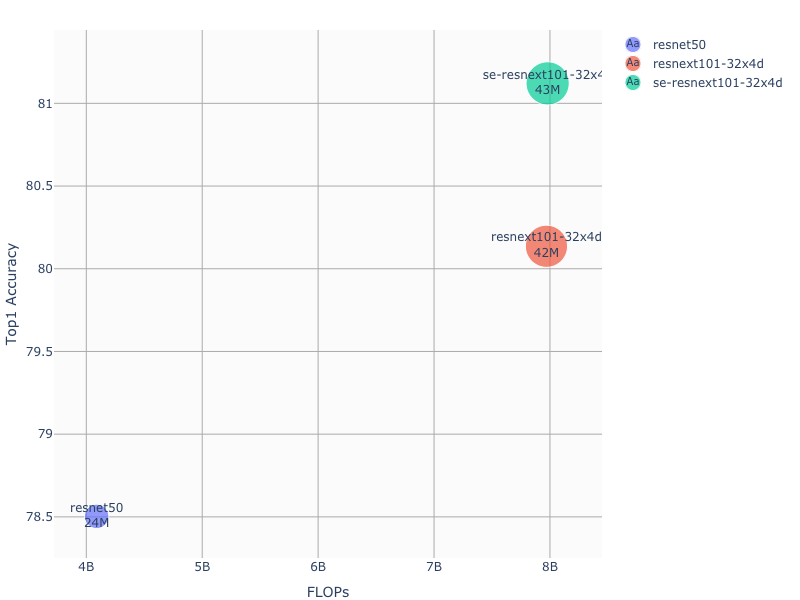
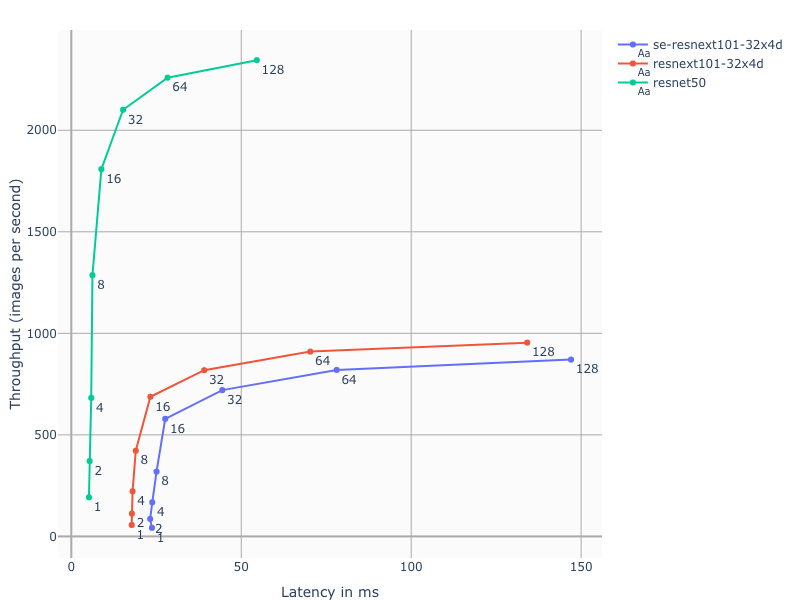

# Convolutional Networks for Image Classification in PyTorch

In this repository you will find implementations of various image classification models.

## Table Of Contents

* [Models](#models)
* [Validation accuracy results](#validation-accuracy-results)
* [Training performance results](#training-performance-results)
  * [Training performance: NVIDIA DGX-1 (8x V100 16G)](#training-performance-nvidia-dgx-1-(8x-v100-16G))
  * [Training performance: NVIDIA DGX-2 (16x V100 32G)](#training-performance-nvidia-dgx-2-(16x-v100-32G))
* [Model comparison](#model-comparison)
  * [Accuracy vs FLOPS](#accuracy-vs-flops)
  * [Latency vs Throughput on different batch sizes](#latency-vs-throughput-on-different-batch-sizes)

## Models

The following table provides links to where you can find additional information on each model:

| **Model** | **Link**|
|:-:|:-:|
| resnet50 | [README](./resnet50v1.5/README.md) |
| resnext101-32x4d | [README](./resnext101-32x4d/README.md) |
| se-resnext101-32x4d | [README](./se-resnext101-32x4d/README.md) |

## Validation accuracy results

Our results were obtained by running the applicable 
training scripts in the [framework-container-name] NGC container 
on NVIDIA DGX-1 with (8x V100 16G) GPUs. 
The specific training script that was run is documented 
in the corresponding model's README.

The following table shows the validation accuracy results of the 
three classification models side-by-side.

| **arch** | **AMP Top1** | **AMP Top5** | **FP32 Top1** | **FP32 Top1** |
|:-:|:-:|:-:|:-:|:-:|
| resnet50 | 78.46 | 94.15 | 78.50 | 94.11 |
| resnext101-32x4d | 80.08 | 94.89 | 80.14 | 95.02 |
| se-resnext101-32x4d | 81.01 | 95.52 | 81.12 | 95.54 |

## Training performance results

### Training performance: NVIDIA DGX-1 (8x V100 16G)

Our results were obtained by running the applicable 
training scripts in the pytorch-19.10 NGC container 
on NVIDIA DGX-1 with (8x V100 16G) GPUs. 
Performance numbers (in images per second) 
were averaged over an entire training epoch.
The specific training script that was run is documented 
in the corresponding model's README.

The following table shows the training accuracy results of the 
three classification models side-by-side.

| **arch** | **Mixed Precision** | **FP32** | **Mixed Precision speedup** |
|:-:|:-:|:-:|:-:|
| resnet50 | 6888.75 img/s | 2945.37 img/s | 2.34x |
| resnext101-32x4d | 2384.85 img/s | 1116.58 img/s | 2.14x |
| se-resnext101-32x4d | 2031.17 img/s | 977.45 img/s | 2.08x |

### Training performance: NVIDIA DGX-2 (16x V100 32G)

Our results were obtained by running the applicable 
training scripts in the pytorch-19.10 NGC container 
on NVIDIA DGX-2 with (16x V100 32G) GPUs. 
Performance numbers (in images per second) 
were averaged over an entire training epoch.
The specific training script that was run is documented 
in the corresponding model's README.

The following table shows the training accuracy results of the 
three classification models side-by-side.

| **arch** | **Mixed Precision** | **FP32** | **Mixed Precision speedup** |
|:-:|:-:|:-:|:-:|
| resnet50 | 13443.82 img/s | 6263.41 img/s | 2.15x |
| resnext101-32x4d | 4473.37 img/s | 2261.97 img/s | 1.98x |
| se-resnext101-32x4d | 3776.03 img/s | 1953.13 img/s | 1.93x |

## Model Comparison

### Accuracy vs FLOPS

Plot describes relationship between floating point operations
needed for computing forward pass on a 224px x 224px image, 
for the implemented models.
Dot size indicates number of trainable parameters.

### Latency vs Throughput on different batch sizes

Plot describes relationship between 
inference latency, throughput and batch size 
for the implemented models.

