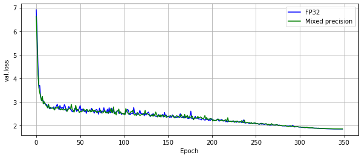
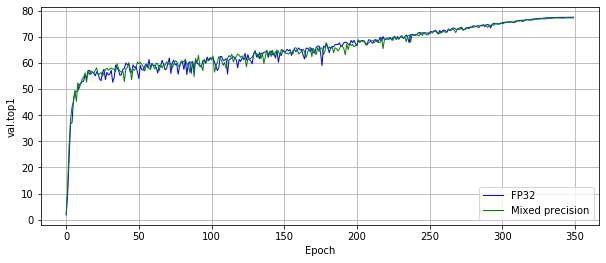

# EfficientNet For PyTorch

This repository provides a script and recipe to train the EfficientNet model to
achieve state-of-the-art accuracy, and is tested and maintained by NVIDIA.

## Table Of Contents

* [Model overview](#model-overview)
  * [Default configuration](#default-configuration)
  * [Feature support matrix](#feature-support-matrix)
    * [Features](#features)
  * [Mixed precision training](#mixed-precision-training)
    * [Enabling mixed precision](#enabling-mixed-precision)
    * [Enabling TF32](#enabling-tf32)
  * [Quantization](#quantization)
    * [Quantization-aware training](#qat)
* [Setup](#setup)
  * [Requirements](#requirements)
* [Quick Start Guide](#quick-start-guide)
* [Advanced](#advanced)
  * [Scripts and sample code](#scripts-and-sample-code)
  * [Command-line options](#command-line-options)
  * [Dataset guidelines](#dataset-guidelines)
  * [Training process](#training-process)
  * [Inference process](#inference-process)
    * [NGC pretrained weights](#ngc-pretrained-weights)
  * [QAT process](#qat-process)
* [Performance](#performance)
  * [Benchmarking](#benchmarking)
    * [Training performance benchmark](#training-performance-benchmark)
    * [Inference performance benchmark](#inference-performance-benchmark)
  * [Results](#results)
    * [Training accuracy results](#training-accuracy-results)
      * [Training accuracy: NVIDIA A100 (8x A100 80GB)](#training-accuracy-nvidia-a100-8x-a100-80gb)
      * [Training accuracy: NVIDIA DGX-1 (8x V100 16GB)](#training-accuracy-nvidia-dgx-1-8x-v100-16gb)
      * [Example plots](#example-plots)
    * [Training performance results](#training-performance-results)
      * [Training performance: NVIDIA A100 (8x A100 80GB)](#training-performance-nvidia-a100-8x-a100-80gb)
      * [Training performance: NVIDIA DGX-1 (8x V100 16GB)](#training-performance-nvidia-dgx-1-8x-v100-16gb)
      * [Training performance: NVIDIA DGX-1 (8x V100 32GB)](#training-performance-nvidia-dgx-1-8x-v100-32gb)
  * [Inference performance results](#inference-performance-results)
      * [Inference performance: NVIDIA A100 (1x A100 80GB)](#inference-performance-nvidia-a100-1x-a100-80gb)
      * [Inference performance: NVIDIA V100 (1x V100 16GB)](#inference-performance-nvidia-v100-1x-v100-16gb)
  * [QAT results](#qat-results)
      * [QAT Training performance: NVIDIA DGX-1 (8x V100 32GB)](#qat-training-performance-nvidia-dgx-1-8x-v100-32gb))
      * [QAT Inference accuracy](#qat-inference-accuracy)
* [Release notes](#release-notes)
  * [Changelog](#changelog)
  * [Known issues](#known-issues)

## Model overview

EfficientNet is an image classification model family. It was first described in [EfficientNet: Rethinking Model Scaling for Convolutional Neural Networks](https://arxiv.org/abs/1905.11946). The scripts provided enable you to train the EfficientNet-B0, EfficientNet-B4, EfficientNet-WideSE-B0 and, EfficientNet-WideSE-B4 models.

EfficientNet-WideSE models use Squeeze-and-Excitation layers wider than original EfficientNet models, the width of SE module is proportional to the width of Depthwise Separable Convolutions instead of block width.

WideSE models are slightly more accurate than original models.

This model is trained with mixed precision using Tensor Cores on Volta and the NVIDIA Ampere GPU architectures. Therefore, researchers can get results over 2x faster than training without Tensor Cores, while experiencing the benefits of mixed precision training. This model is tested against each NGC monthly container release to ensure consistent accuracy and performance over time.

We use [NHWC data layout](https://pytorch.org/tutorials/intermediate/memory_format_tutorial.html) when training using Mixed Precision.

### Default configuration

The following sections highlight the default configurations for the EfficientNet models.

**Optimizer**

This model uses RMSprop with the following hyperparameters:
* Momentum (0.9)
* Learning rate (LR):
  * 0.08 for 4096 batch size for B0 models
  * 0.16 for 4096 batch size for B4 models
scale the learning rate.
* Learning rate schedule - we use cosine LR schedule
* We use linear warmup of the learning rate during the first 16 epochs
* Weight decay (WD):
  * 1e-5 for B0 models
  * 5e-6 for B4 models
* We do not apply WD on Batch Norm trainable parameters (gamma/bias)
* Label smoothing = 0.1
* [MixUp](https://arxiv.org/pdf/1710.09412.pdf) = 0.2
* We train for 400 epochs

**Optimizer for QAT**

This model uses SGD optimizer for B0 models and RMSPROP optimizer alpha=0.853  epsilon=0.00422 for B4 models. Other hyperparameters we used are:
* Momentum:
  * 0.89 for B0 models
  * 0.9 for B4 models
* Learning rate (LR):
  * 0.0125 for 128 batch size for B0 models
  * 4.09e-06 for 32 batch size for B4 models
scale the learning rate.
* Learning rate schedule: 
  * cosine LR schedule for B0 models
  * linear LR schedule for B4 models
* Weight decay (WD):
  * 4.50e-05 for B0 models
  * 9.714e-04 for B4 models
* We do not apply WD on Batch Norm trainable parameters (gamma/bias)
* We train for:
	*10 epochs for B0 models
	*2 epochs for B4 models


**Data augmentation**

This model uses the following data augmentation:
* For training:
  * Auto-augmentation
  * Basic augmentation:
      * Normalization
      * Random resized crop to target images size (depending on model version)
        * Scale from 8% to 100%
        * Aspect ratio from 3/4 to 4/3
      * Random horizontal flip

* For inference:
  * Normalization
  * Scale to target image size + 32
  * Center crop to target image size


### Feature support matrix

The following features are supported by this model:

| Feature               | EfficientNet
|-----------------------|--------------------------
|[DALI](https://docs.nvidia.com/deeplearning/dali/release-notes/index.html)   |   Yes (without autoaugmentation)
|[APEX AMP](https://nvidia.github.io/apex/amp.html) | Yes
|[QAT](https://github.com/NVIDIA/TensorRT/tree/master/tools/pytorch-quantization)  |   Yes

#### Features

**NVIDIA DALI**

DALI is a library accelerating data preparation pipeline. To accelerate your input pipeline, you only need to define your data loader
with the DALI library. For more information about DALI, refer to the [DALI product documentation](https://docs.nvidia.com/deeplearning/dali/user-guide/docs/index.html).

We use [NVIDIA DALI](https://github.com/NVIDIA/DALI),
which speeds up data loading when CPU becomes a bottleneck.
DALI can use CPU or GPU, and outperforms the PyTorch native dataloader.

Run training with `--data-backends dali-gpu` or `--data-backends dali-cpu` to enable DALI.
For DGXA100 and DGX1 we recommend `--data-backends dali-cpu`.

DALI currently does not support Autoaugmentation, so for best accuracy it has to be disabled.


**[APEX](https://github.com/NVIDIA/apex)**

A PyTorch extension that contains utility libraries, such as [Automatic Mixed Precision (AMP)](https://nvidia.github.io/apex/amp.html), which require minimal network code changes to leverage Tensor Cores performance. Refer to the [Enabling mixed precision](#enabling-mixed-precision) section for more details.

**[QAT](https://github.com/NVIDIA/TensorRT/tree/master/tools/pytorch-quantization)**

Quantization aware training (QAT) is a method for changing precision to INT8 which speeds up the inference process at the price of a slight decrease of network accuracy. Refer to the [Quantization](#quantization) section for more details.


### Mixed precision training

Mixed precision is the combined use of different numerical precisions in a computational method. [Mixed precision](https://arxiv.org/abs/1710.03740) training offers significant computational speedup by performing operations in half-precision format, while storing minimal information in single-precision to retain as much information as possible in critical parts of the network. Since the introduction of [Tensor Cores](https://developer.nvidia.com/tensor-cores) in Volta, and following with both the Turing and Ampere architectures, significant training speedups are experienced by switching to mixed precision -- up to 3x overall speedup on the most arithmetically intense model architectures. Using mixed precision training requires two steps:
1.  Porting the model to use the FP16 data type where appropriate.
2.  Adding loss scaling to preserve small gradient values.

The ability to train deep learning networks with lower precision was introduced in the Pascal architecture and first supported in CUDA 8 in the NVIDIA Deep Learning SDK.

For information about:
-   How to train using mixed precision, see the [Mixed Precision Training](https://arxiv.org/abs/1710.03740) paper and [Training With Mixed Precision](https://docs.nvidia.com/deeplearning/performance/mixed-precision-training/index.html) documentation.
-   Techniques used for mixed precision training, see the [Mixed-Precision Training of Deep Neural Networks](https://devblogs.nvidia.com/mixed-precision-training-deep-neural-networks/) blog.
-   APEX tools for mixed precision training, see the [NVIDIA Apex: Tools for Easy Mixed-Precision Training in PyTorch](https://devblogs.nvidia.com/apex-pytorch-easy-mixed-precision-training/).

#### Enabling mixed precision

Mixed precision is enabled in PyTorch by using the Automatic Mixed Precision (AMP), a library from [APEX](https://github.com/NVIDIA/apex) that casts variables to half-precision upon retrieval,
while storing variables in single-precision format. Furthermore, to preserve small gradient magnitudes in backpropagation, a [loss scaling](https://docs.nvidia.com/deeplearning/performance/mixed-precision-training/index.html#lossscaling) step must be included when applying gradients.
In PyTorch, loss scaling can be easily applied by using `scale_loss()` method provided by AMP. The scaling value to be used can be [dynamic](https://nvidia.github.io/apex/fp16_utils.html#apex.fp16_utils.DynamicLossScaler) or fixed.

For an in-depth walk through on AMP, check out sample usage [here](https://github.com/NVIDIA/apex/tree/master/apex/amp#usage-and-getting-started). [APEX](https://github.com/NVIDIA/apex) is a PyTorch extension that contains utility libraries, such as AMP, which require minimal network code changes to leverage Tensor Cores performance.

To enable mixed precision, you can:
- Import AMP from APEX:

  ```python
  from apex import amp
  ```

- Wrap model and optimizer in `amp.initialize`:
  ```python
  model, optimizer = amp.initialize(model, optimizer, opt_level="O1", loss_scale="dynamic")
  ```

- Scale loss before backpropagation:
  ```python
  with amp.scale_loss(loss, optimizer) as scaled_loss:
    scaled_loss.backward()
  ```

#### Enabling TF32

TensorFloat-32 (TF32) is the new math mode in [NVIDIA A100](https://www.nvidia.com/en-us/data-center/a100/) GPUs for handling the matrix math also called tensor operations. TF32 running on Tensor Cores in A100 GPUs can provide up to 10x speedups compared to single-precision floating-point math (FP32) on Volta GPUs. 

TF32 Tensor Cores can speed up networks using FP32, typically with no loss of accuracy. It is more robust than FP16 for models which require high dynamic range for weights or activations.

For more information, refer to the [TensorFloat-32 in the A100 GPU Accelerates AI Training, HPC up to 20x](https://blogs.nvidia.com/blog/2020/05/14/tensorfloat-32-precision-format/) blog post.

TF32 is supported in the NVIDIA Ampere GPU architecture and is enabled by default.

### Quantization

Quantization is the process of transforming deep learning models to use parameters and computations at a lower precision. Traditionally, DNN training and inference have relied on the IEEE single-precision floating-point format, using 32 bits to represent the floating-point model weights and activation tensors.

This compute budget may be acceptable at training as most DNNs are trained in data centers or in the cloud with NVIDIA V100 or A100 GPUs that have significantly large compute capability and much larger power budgets. However, during deployment, these models are most often required to run on devices with much smaller computing resources and lower power budgets at the edge. Running a DNN inference using the full 32-bit representation is not practical for real-time analysis given the compute, memory, and power constraints of the edge.

To help reduce the compute budget, while not compromising on the structure and number of parameters in the model, you can run inference at a lower precision. Initially, quantized inferences were run at half-point precision with tensors and weights represented as 16-bit floating-point numbers. While this resulted in compute savings of about 1.2–1.5x, there was still some compute budget and memory bandwidth that could be leveraged. In lieu of this, models are now quantized to an even lower precision, with an 8-bit integer representation for weights and tensors. This results in a model that is 4x smaller in memory and about 2–4x faster in throughput.

While 8-bit quantization is appealing to save compute and memory budgets, it is a lossy process. During quantization, a small range of floating-point numbers are squeezed to a fixed number of information buckets. This results in loss of information.

The minute differences which could originally be resolved using 32-bit representations are now lost because they are quantized to the same bucket in 8-bit representations. This is similar to rounding errors that one encounters when representing fractional numbers as integers. To maintain accuracy during inferences at a lower precision, it is important to try and mitigate errors arising due to this loss of information.

#### Quantization-aware training

In QAT, the quantization error is considered when training the model. The training graph is modified to simulate the lower precision behavior in the forward pass of the training process. This introduces the quantization errors as part of the training loss, which the optimizer tries to minimize during the training. Thus, QAT helps in modeling the quantization errors during training and mitigates its effects on the accuracy of the model at deployment.

However, the process of modifying the training graph to simulate lower precision behavior is intricate. To run QAT, it is necessary to insert FakeQuantization nodes for the weights of the DNN Layers and Quantize-Dequantize (QDQ) nodes to the intermediate activation tensors to compute their dynamic ranges.

For more information, see this [Quantization paper](https://arxiv.org/abs/2004.09602) and [Quantization-Aware Training](https://docs.nvidia.com/deeplearning/frameworks/tf-trt-user-guide/index.html#quantization-training) documentation.
Tutorial for `pytoch-quantization` library can be found here [`pytorch-quantization` tutorial](https://docs.nvidia.com/deeplearning/tensorrt/pytorch-quantization-toolkit/docs/tutorials/quant_resnet50.html).

It is important to mention that EfficientNet is NN, which is hard to quantize because the activation function all across the network is the SiLU (called also the Swish), whose negative values lie in very short range, which introduce a large quantization error. More details can be found in Appendix D of the [Quantization paper](https://arxiv.org/abs/2004.09602).

## Setup

The following section lists the requirements that you need to meet in order to start training the EfficientNet model.

### Requirements

This repository contains Dockerfile which extends the PyTorch NGC container and encapsulates some dependencies. Aside from these dependencies, ensure you have the following components:

* [NVIDIA Docker](https://github.com/NVIDIA/nvidia-docker)
* [PyTorch 21.03-py3 NGC container](https://ngc.nvidia.com/registry/nvidia-pytorch) or newer
* Supported GPUs:
    * [NVIDIA Volta architecture](https://www.nvidia.com/en-us/data-center/volta-gpu-architecture/)
    * [NVIDIA Turing architecture](https://www.nvidia.com/en-us/geforce/turing/)
    * [NVIDIA Ampere architecture](https://www.nvidia.com/en-us/data-center/nvidia-ampere-gpu-architecture/)

For more information about how to get started with NGC containers, see the
following sections from the NVIDIA GPU Cloud Documentation and the Deep Learning
DGX Documentation:
* [Getting Started Using NVIDIA GPU Cloud](https://docs.nvidia.com/ngc/ngc-getting-started-guide/index.html)
* [Accessing And Pulling From The NGC Container Registry](https://docs.nvidia.com/deeplearning/dgx/user-guide/index.html#accessing_registry)
* [Running PyTorch](https://docs.nvidia.com/deeplearning/frameworks/pytorch-release-notes/running.html#running)

To set up the required environment or create your own container, as an alternative to the use of the PyTorch NGC container, see the versioned [NVIDIA Container Support Matrix](https://docs.nvidia.com/deeplearning/frameworks/support-matrix/index.html).

## Quick Start Guide

To train your model using mixed or TF32 precision with Tensor Cores or using FP32,
perform the following steps using the default parameters of the efficientnet model on the ImageNet dataset.
For the specifics concerning training and inference, see the [Advanced](#advanced) section.

1. Clone the repository.
```
git clone https://github.com/NVIDIA/DeepLearningExamples
cd DeepLearningExamples/PyTorch/Classification/
```

2. Download and pre-process the dataset.

The EfficientNet script operates on ImageNet 1k, a widely popular image classification dataset from the ILSVRC challenge.

PyTorch can work directly on JPEGs, therefore, pre-processing/augmentation is not needed.


3. [Download the images](http://image-net.org/download-images).

4. Extract the training data:
  ```bash
  mkdir train && mv ILSVRC2012_img_train.tar train/ && cd train
  tar -xvf ILSVRC2012_img_train.tar && rm -f ILSVRC2012_img_train.tar
  find . -name "*.tar" | while read NAME ; do mkdir -p "${NAME%.tar}"; tar -xvf "${NAME}" -C "${NAME%.tar}"; rm -f "${NAME}"; done
  cd ..
  ```

5. Extract the validation data and move the images to subfolders:
  ```bash
  mkdir val && mv ILSVRC2012_img_val.tar val/ && cd val && tar -xvf ILSVRC2012_img_val.tar
  wget -qO- https://raw.githubusercontent.com/soumith/imagenetloader.torch/master/valprep.sh | bash
  ```

The directory in which the `train/` and `val/` directories are placed, is referred to as `<path to imagenet>` in this document.

6. Build the EfficientNet PyTorch NGC container.

```
docker build . -t nvidia_efficientnet
```

7. Start an interactive session in the NGC container to run training/inference.
```
nvidia-docker run --rm -it -v <path to imagenet>:/imagenet --ipc=host nvidia_efficientnet
```


8. Start training

To run training for a standard configuration (DGX A100/DGX-1V, AMP/TF32/FP32, 400 Epochs),
run one of the scripts in the `./efficientnet/training` directory
called `./efficientnet/training/{AMP, TF32, FP32}/{ DGX A100, DGX-1V }_efficientnet-<version>_{AMP, TF32, FP32}_{ 400 }E.sh`.

Ensure ImageNet is mounted in the `/imagenet` directory.

For example:
    `bash ./efficientnet/training/AMP/DGXA100_efficientnet-b0_AMP.sh <path were to store checkpoints and logs>`

9. Start inference

You can download pre-trained weights from NGC:

```bash
wget --content-disposition  -O 

unzip 
```

To run inference on ImageNet, run:

`python ./main.py --arch efficientnet-<version> --evaluate --epochs 1 --pretrained  -b <batch size> <path to imagenet>`

To run inference on JPEG image using pre-trained weights, run:

`python classify.py --arch efficientnet-<version> --pretrained --precision AMP|FP32 --image <path to JPEG image>`


## Advanced

The following sections provide greater details of the dataset, running training and inference, and the training results.

### Scripts and sample code

For a non-standard configuration, run:

* For 1 GPU
    * FP32
        `python ./main.py --arch efficientnet-<version> --label-smoothing 0.1 <path to imagenet>`
        `python ./main.py --arch efficientnet-<version> --label-smoothing 0.1 --amp --static-loss-scale 256 <path to imagenet>`

* For multiple GPUs
    * FP32
        `python ./multiproc.py --nproc_per_node 8 ./main.py --arch efficientnet-<version> --label-smoothing 0.1 <path to imagenet>`
    * AMP
        `python ./multiproc.py --nproc_per_node 8 ./main.py --arch efficientnet-<version> --label-smoothing 0.1 --amp --static-loss-scale 256 <path to imagenet>`

Use `python ./main.py -h` to obtain the list of available options in the `main.py` script.


### Command-line options

To see the full list of available options and their descriptions, use the `-h` or `--help` command-line option, for example:

`python main.py -h`


### Dataset guidelines

To use your own dataset, divide it into directories. For example:

 - Training images - `train/<class id>/<image>`
 - Validation images - `val/<class id>/<image>`

If your dataset has a number of classes different than 1000, you need to pass the `--num-classes N` flag to the training script.

### Training process

All the results of the training will be stored in the directory specified with `--workspace` argument.

The script will store:
 - the most recent checkpoint - `checkpoint.pth.tar` (unless `--no-checkpoints` flag is used).
 - the checkpoint with the best validation accuracy - `model_best.pth.tar` (unless `--no-checkpoints` flag is used).
 - the JSON log - in the file specified with the `--raport-file` flag.

Metrics gathered through training:
 - `train.loss` - training loss
 - `train.total_ips` - training speed measured in images/second
 - `train.compute_ips` - training speed measured in images/second, not counting data loading
 - `train.data_time` - time spent on waiting on data
 - `train.compute_time` - time spent in forward/backward pass

To restart training from the checkpoint use the `--resume` option.

To start training from pretrained weights (for example, downloaded from NGC) use the `--pretrained-from-file` option.

The difference between `--resume` and `--pretrained-from-file` flags is that the pretrained weights contain only model weights,
and checkpoints, apart from model weights, contain optimizer state, LR scheduler state.

Checkpoints are suitable for dividing the training into parts, for example, in order
to divide the training job into shorter stages, or restart training after an infrastructure failure.

Pretrained weights can be used as a base for fine tuning the model to a different dataset,
or as a backbone to detection models.

### Inference process

Validation is done every epoch, and can be also run separately on a checkpointed model.

`python ./main.py --arch efficientnet-<version> --evaluate --epochs 1 --resume <path to checkpoint> -b <batch size> <path to imagenet>`

Metrics gathered through training:

 - `val.loss` - validation loss
 - `val.top1` - validation top1 accuracy
 - `val.top5` - validation top5 accuracy
 - `val.total_ips` - inference speed measured in images/second
 - `val.compute_ips` - inference speed measured in images/second, not counting data loading
 - `val.data_time` - time spent on waiting on data
 - `val.compute_time` - time spent on inference


To run inference on JPEG image, you have to first extract the model weights from checkpoint:

`python checkpoint2model.py --checkpoint-path <path to checkpoint> --weight-path <path where weights will be stored>`

Then, run the classification script:

`python classify.py --arch efficientnet-<version> --pretrained-from-file <path to weights from previous step> --precision AMP|FP32 --image <path to JPEG image>`

You can also run the ImageNet validation on pretrained weights:

`python ./main.py --arch efficientnet-<version> --evaluate --epochs 1 --pretrained-from-file <path to pretrained weights> -b <batch size> <path to imagenet>`

#### NGC pretrained weights

Pretrained weights can be downloaded from NGC:

```bash
wget <ngc weights url>
```

URL for each model can be found in the following table:

| **Model** | **NGC weights URL** |
|:---------:|:-------------------:|
| efficientnet-b0 | https://api.ngc.nvidia.com/v2/models/nvidia/efficientnet_b0_pyt_amp/versions/20.12.0/files/nvidia_efficientnet-b0_210412.pth | 
| efficientnet-b4 | https://api.ngc.nvidia.com/v2/models/nvidia/efficientnet_b4_pyt_amp/versions/20.12.0/files/nvidia_efficientnet-b4_210412.pth | 
| efficientnet-widese-b0 | https://api.ngc.nvidia.com/v2/models/nvidia/efficientnet_widese_b0_pyt_amp/versions/20.12.0/files/nvidia_efficientnet-widese-b0_210412.pth | 
| efficientnet-widese-b4 | https://api.ngc.nvidia.com/v2/models/nvidia/efficientnet_widese_b4_pyt_amp/versions/20.12.0/files/nvidia_efficientnet-widese-b4_210412.pth | 
| efficientnet-quant-b0 | https://api.ngc.nvidia.com/v2/models/nvidia/efficientnet_b0_pyt_qat_ckpt_fp32/versions/21.03.0/files/nvidia-efficientnet-quant-b0-130421.pth | 
| efficientnet-quant-b4 | https://api.ngc.nvidia.com/v2/models/nvidia/efficientnet_b4_pyt_qat_ckpt_fp32/versions/21.03.0/files/nvidia-efficientnet-quant-b4-130421.pth | 

To run inference on ImageNet, run:

`python ./main.py --arch efficientnet-<version> --evaluate --epochs 1 --pretrained -b <batch size> <path to imagenet>`

To run inference on JPEG images using pretrained weights, run:

`python classify.py --arch efficientnet-<version> --pretrained --precision AMP|FP32 --image <path to JPEG image>`


### Quantization process

EfficientNet-b0 and EfficientNet-b4 models can be quantized using the QAT process from running the `quant_main.py` script.

`python ./quant_main.py <path to imagenet> --arch efficientnet-quant-<version> --epochs <# of QAT epochs> --pretrained-from-file <path to non-quantized model weights> <any other parameters for training such as batch, momentum etc.>`

During the QAT process, evaluation is done in the same way as during standard training. `quant_main.py`  works in the same way as the original `main.py` script, but with quantized models. It means that `quant_main.py` can be used to resume the QAT process with the flag `--resume`:

`python ./quant_main.py <path to imagenet> --arch efficientnet-quant-<version> --resume <path to mid-training checkpoint> ...`

or to evaluate a created checkpoint with the flag `--evaluate`:

`python ./quant_main.py --arch efficientnet-quant-<version> --evaluate --epochs 1 --resume <path to checkpoint> -b <batch size> <path to imagenet>` 

It also can run on multi-GPU in an identical way as the standard `main.py` script:

`python ./multiproc.py --nproc_per_node 8 ./quant_main.py --arch efficientnet-quant-<version> ... <path to imagenet>`

There is also a possibility to transform trained models (quantized or not) into ONNX format, which is needed to convert it later into TensorRT, where quantized networks are much faster during inference. Conversion to TensorRT will be supported in the next release. The conversion to ONNX consists of two steps:

* translate checkpoint to pure weights:

`python checkpoint2model.py --checkpoint-path <path to quant checkpoint> --weight-path <path where quant weights will be stored>`

* translate pure weights to ONNX:

`python model2onnx.py --arch efficientnet-quant-<version> --pretrained-from-file <path to model quant weights> -b <batch size> --trt True`


Quantized models could also be used to classify new images using the `classify.py`  flag. For example:
`python classify.py --arch efficientnet-quant-<version> --pretrained-from-file <path to quant weights> --image <path to JPEG image>`


## Performance

The performance measurements in this document were conducted at the time of publication and may not reflect the performance achieved from NVIDIA’s latest software release. For the most up-to-date performance measurements, go to [NVIDIA Data Center Deep Learning Product Performance](https://developer.nvidia.com/deep-learning-performance-training-inference).

### Benchmarking

The following section shows how to run benchmarks measuring the model performance in training and inference modes.

#### Training performance benchmark

To benchmark training, run:

* For 1 GPU
    * FP32 (V100 GPUs only)
        `python ./launch.py --model efficientnet-<version> --precision FP32 --mode benchmark_training --platform DGX1V <path to imagenet> --raport-file benchmark.json --epochs 1 --prof 100`
    * TF32 (A100 GPUs only)
        `python ./launch.py --model efficientnet-<version> --precision TF32 --mode benchmark_training --platform DGXA100 <path to imagenet> --raport-file benchmark.json --epochs 1 --prof 100`
    * AMP
        `python ./launch.py --model efficientnet-<version> --precision AMP --mode benchmark_training --platform <DGX1V|DGXA100> <path to imagenet> --raport-file benchmark.json --epochs 1 --prof 100`

* For multiple GPUs
    * FP32 (V100 GPUs only)
        `python ./launch.py --model efficientnet-<version> --precision FP32 --mode benchmark_training --platform DGX1V <path to imagenet> --raport-file benchmark.json --epochs 1 --prof 100`
    * TF32 (A100 GPUs only)
        `python ./multiproc.py --nproc_per_node 8 ./launch.py --model efficientnet-<version> --precision TF32 --mode benchmark_training --platform DGXA100 <path to imagenet> --raport-file benchmark.json --epochs 1 --prof 100`
    * AMP
        `python ./multiproc.py --nproc_per_node 8 ./launch.py --model efficientnet-<version> --precision AMP --mode benchmark_training --platform <DGX1V|DGXA100> <path to imagenet> --raport-file benchmark.json --epochs 1 --prof 100`

Each of these scripts will run 100 iterations and save results in the `benchmark.json` file.

#### Inference performance benchmark

To benchmark inference, run:

* FP32 (V100 GPUs only)

`python ./launch.py --model efficientnet-<version> --precision FP32 --mode benchmark_inference --platform DGX1V <path to imagenet> --raport-file benchmark.json --epochs 1 --prof 100`

* TF32 (A100 GPUs only)

`python ./launch.py --model efficientnet-<version> --precision TF32 --mode benchmark_inference --platform DGXA100 <path to imagenet> --raport-file benchmark.json --epochs 1 --prof 100`

* AMP

`python ./launch.py --model efficientnet-<version> --precision AMP --mode benchmark_inference --platform <DGX1V|DGXA100> <path to imagenet> --raport-file benchmark.json --epochs 1 --prof 100`

Each of these scripts will run 100 iterations and save results in the `benchmark.json` file.

### Results

Our results were obtained by running the applicable training script in the pytorch-21.03 NGC container.

To achieve these same results, follow the steps in the [Quick Start Guide](#quick-start-guide).

#### Training accuracy results

##### Training accuracy: NVIDIA DGX A100 (8x A100 80GB)

Our results were obtained by running the applicable `efficientnet/training/<AMP|TF32>/*.sh` training script in the PyTorch 20.12 NGC container on NVIDIA DGX A100 (8x A100 80GB) GPUs.

|       **Model**        | **Epochs** | **GPUs** | **Top1 accuracy - TF32** | **Top1 accuracy - mixed precision** | **Time to train - TF32** | **Time to train - mixed precision** | **Time to train speedup (TF32 to mixed precision)** |
|:----------------------:|:----------:|:--------:|:------------------------:|:-----------------------------------:|:------------------------:|:-----------------------------------:|:---------------------------------------------------:|
|    efficientnet-b0     |    400     |    8     |      77.16 +/- 0.07      |           77.42 +/- 0.11            |            19            |                 11                  |                        1.727                        |
|    efficientnet-b4     |    400     |    8     |      82.82 +/- 0.04      |           82.85 +/- 0.09            |           126            |                 66                  |                        1.909                        |
| efficientnet-widese-b0 |    400     |    8     |      77.84 +/- 0.08      |           77.84 +/- 0.02            |            19            |                 10                  |                        1.900                        |
| efficientnet-widese-b4 |    400     |    8     |      83.13 +/- 0.11      |            83.1 +/- 0.09            |           126            |                 66                  |                        1.909                        |


##### Training accuracy: NVIDIA DGX-1 (8x V100 16GB)

Our results were obtained by running the applicable `efficientnet/training/<AMP|FP32>/*.sh` training script in the PyTorch 20.12 NGC container on NVIDIA DGX-1 (8x V100 16GB) GPUs.

|       **Model**        | **Epochs** | **GPUs** | **Top1 accuracy - FP32** | **Top1 accuracy - mixed precision** | **Time to train - FP32** | **Time to train - mixed precision** | **Time to train speedup (FP32 to mixed precision)** |
|:----------------------:|:----------:|:--------:|:------------------------:|:-----------------------------------:|:------------------------:|:-----------------------------------:|:---------------------------------------------------:|
|    efficientnet-b0     |    400     |    8     |      77.02 +/- 0.04      |           77.17 +/- 0.08            |            34            |                 24                  |                        1.417                        |
| efficientnet-widese-b0 |    400     |    8     |      77.59 +/- 0.16      |           77.69 +/- 0.12            |            35            |                 24                  |                        1.458                        |


##### Example plots

The following images show an A100 run.






#### Training performance results

##### Training performance: NVIDIA A100 (8x A100 80GB)

Our results were obtained by running the applicable `efficientnet/training/<AMP|TF32>/*.sh` training script in the PyTorch 21.03 NGC container on NVIDIA DGX A100 (8x A100 80GB) GPUs.

|       **Model**        | **GPUs** |  **TF32**   | **Throughput - mixed precision** | **Throughput speedup (TF32 to mixed precision)** | **TF32 Strong Scaling** | **Mixed Precision Strong Scaling** |
|:----------------------:|:--------:|:-----------:|:--------------------------------:|:------------------------------------------------:|:-----------------------:|:----------------------------------:|
|    efficientnet-b0     |    1     | 1078 img/s  |            2489 img/s            |                      2.3 x                       |          1.0 x          |               1.0 x                |
|    efficientnet-b0     |    8     | 8193 img/s  |           16652 img/s            |                      2.03 x                      |         7.59 x          |               6.68 x               |
|    efficientnet-b0     |    16    | 16137 img/s |           29332 img/s            |                      1.81 x                      |         14.96 x         |              11.78 x               |
|    efficientnet-b4     |    1     |  157 img/s  |            331 img/s             |                      2.1 x                       |          1.0 x          |               1.0 x                |
|    efficientnet-b4     |    8     | 1223 img/s  |            2570 img/s            |                      2.1 x                       |         7.76 x          |               7.75 x               |
|    efficientnet-b4     |    16    | 2417 img/s  |            4813 img/s            |                      1.99 x                      |         15.34 x         |              14.51 x               |
|    efficientnet-b4     |    32    | 4813 img/s  |            9425 img/s            |                      1.95 x                      |         30.55 x         |              28.42 x               |
|    efficientnet-b4     |    64    | 9146 img/s  |           18900 img/s            |                      2.06 x                      |         58.05 x         |               57.0 x               |
| efficientnet-widese-b0 |    1     | 1078 img/s  |            2512 img/s            |                      2.32 x                      |          1.0 x          |               1.0 x                |
| efficientnet-widese-b0 |    8     | 8244 img/s  |           16368 img/s            |                      1.98 x                      |         7.64 x          |               6.51 x               |
| efficientnet-widese-b0 |    16    | 16062 img/s |           29798 img/s            |                      1.85 x                      |         14.89 x         |              11.86 x               |
| efficientnet-widese-b4 |    1     |  157 img/s  |            331 img/s             |                      2.1 x                       |          1.0 x          |               1.0 x                |
| efficientnet-widese-b4 |    8     | 1223 img/s  |            2585 img/s            |                      2.11 x                      |         7.77 x          |               7.8 x                |
| efficientnet-widese-b4 |    16    | 2399 img/s  |            5041 img/s            |                      2.1 x                       |         15.24 x         |              15.21 x               |
| efficientnet-widese-b4 |    32    | 4616 img/s  |            9379 img/s            |                      2.03 x                      |         29.32 x         |               28.3 x               |
| efficientnet-widese-b4 |    64    | 9140 img/s  |           18516 img/s            |                      2.02 x                      |         58.07 x         |              55.88 x               |


##### Training performance: NVIDIA DGX-1 (8x V100 16GB)

Our results were obtained by running the applicable `efficientnet/training/<AMP|FP32>/*.sh` training script in the PyTorch 21.03 NGC container on NVIDIA DGX-1 (8x V100 16GB) GPUs.

|       **Model**        | **GPUs** |  **FP32**  | **Throughput - mixed precision** | **Throughput speedup (FP32 to mixed precision)** | **FP32 Strong Scaling** | **Mixed Precision Strong Scaling** |
|:----------------------:|:--------:|:----------:|:--------------------------------:|:------------------------------------------------:|:-----------------------:|:----------------------------------:|
|    efficientnet-b0     |    1     | 655 img/s  |            1301 img/s            |                      1.98 x                      |          1.0 x          |               1.0 x                |
|    efficientnet-b0     |    8     | 4672 img/s |            7789 img/s            |                      1.66 x                      |         7.12 x          |               5.98 x               |
|    efficientnet-b4     |    1     |  83 img/s  |            204 img/s             |                      2.46 x                      |          1.0 x          |               1.0 x                |
|    efficientnet-b4     |    8     | 616 img/s  |            1366 img/s            |                      2.21 x                      |         7.41 x          |               6.67 x               |
| efficientnet-widese-b0 |    1     | 655 img/s  |            1299 img/s            |                      1.98 x                      |          1.0 x          |               1.0 x                |
| efficientnet-widese-b0 |    8     | 4592 img/s |            7875 img/s            |                      1.71 x                      |          7.0 x          |               6.05 x               |
| efficientnet-widese-b4 |    1     |  83 img/s  |            204 img/s             |                      2.45 x                      |          1.0 x          |               1.0 x                |
| efficientnet-widese-b4 |    8     | 612 img/s  |            1356 img/s            |                      2.21 x                      |         7.34 x          |               6.63 x               |


##### Training performance: NVIDIA DGX-1 (8x V100 32GB)

Our results were obtained by running the applicable `efficientnet/training/<AMP|FP32>/*.sh` training script in the PyTorch 21.03 NGC container on NVIDIA DGX-1 (8x V100 16GB) GPUs.

|       **Model**        | **GPUs** |  **FP32**  | **Throughput - mixed precision** | **Throughput speedup (FP32 to mixed precision)** | **FP32 Strong Scaling** | **Mixed Precision Strong Scaling** |
|:----------------------:|:--------:|:----------:|:--------------------------------:|:------------------------------------------------:|:-----------------------:|:----------------------------------:|
|    efficientnet-b0     |    1     | 646 img/s  |            1401 img/s            |                      2.16 x                      |          1.0 x          |               1.0 x                |
|    efficientnet-b0     |    8     | 4937 img/s |            8615 img/s            |                      1.74 x                      |         7.63 x          |               6.14 x               |
|    efficientnet-b4     |    1     |  36 img/s  |             89 img/s             |                      2.44 x                      |          1.0 x          |               1.0 x                |
|    efficientnet-b4     |    8     | 641 img/s  |            1565 img/s            |                      2.44 x                      |         17.6 x          |              17.57 x               |
| efficientnet-widese-b0 |    1     | 281 img/s  |            603 img/s             |                      2.14 x                      |          1.0 x          |               1.0 x                |
| efficientnet-widese-b0 |    8     | 4924 img/s |            8870 img/s            |                      1.8 x                       |         17.49 x         |               14.7 x               |
| efficientnet-widese-b4 |    1     |  36 img/s  |             89 img/s             |                      2.45 x                      |          1.0 x          |               1.0 x                |
| efficientnet-widese-b4 |    8     | 639 img/s  |            1556 img/s            |                      2.43 x                      |         17.61 x         |              17.44 x               |


#### Inference performance results

##### Inference performance: NVIDIA A100 (1x A100 80GB)

Our results were obtained by running the applicable `efficientnet/inference/<AMP|FP32>/*.sh` inference script in the PyTorch 21.03 NGC container on NVIDIA DGX-1 (8x V100 16GB) GPUs.

###### TF32 Inference Latency

|       **Model**        | **Batch Size** | **Throughput Avg** | **Latency Avg** | **Latency 95%** | **Latency 99%** |
|:----------------------:|:--------------:|:------------------:|:---------------:|:---------------:|:---------------:|
|    efficientnet-b0     |       1        |     130 img/s      |     9.33 ms     |     7.95 ms     |     9.0 ms      |
|    efficientnet-b0     |       2        |     262 img/s      |     9.39 ms     |     8.51 ms     |     9.5 ms      |
|    efficientnet-b0     |       4        |     503 img/s      |     9.68 ms     |     9.53 ms     |    10.78 ms     |
|    efficientnet-b0     |       8        |     1004 img/s     |     9.85 ms     |     9.89 ms     |    11.49 ms     |
|    efficientnet-b0     |       16       |     1880 img/s     |    10.27 ms     |    10.34 ms     |    11.19 ms     |
|    efficientnet-b0     |       32       |     3401 img/s     |    11.46 ms     |    12.51 ms     |    14.39 ms     |
|    efficientnet-b0     |       64       |     4656 img/s     |    19.58 ms     |    14.52 ms     |    16.63 ms     |
|    efficientnet-b0     |      128       |     5001 img/s     |    31.03 ms     |    25.72 ms     |    28.34 ms     |
|    efficientnet-b0     |      256       |     5154 img/s     |    60.71 ms     |    49.44 ms     |    54.99 ms     |
|    efficientnet-b4     |       1        |      69 img/s      |    16.22 ms     |    14.87 ms     |    15.34 ms     |
|    efficientnet-b4     |       2        |     133 img/s      |    16.84 ms     |    16.49 ms     |    17.72 ms     |
|    efficientnet-b4     |       4        |     259 img/s      |    17.33 ms     |    16.39 ms     |    19.67 ms     |
|    efficientnet-b4     |       8        |     491 img/s      |    18.22 ms     |    18.09 ms     |    19.51 ms     |
|    efficientnet-b4     |       16       |     606 img/s      |    28.28 ms     |    26.55 ms     |    26.84 ms     |
|    efficientnet-b4     |       32       |     651 img/s      |    51.08 ms     |    49.39 ms     |    49.61 ms     |
|    efficientnet-b4     |       64       |     684 img/s      |    96.23 ms     |    93.54 ms     |    93.78 ms     |
|    efficientnet-b4     |      128       |     700 img/s      |    195.22 ms    |    182.17 ms    |    182.42 ms    |
|    efficientnet-b4     |      256       |     702 img/s      |    380.01 ms    |    361.81 ms    |    371.64 ms    |
| efficientnet-widese-b0 |       1        |     130 img/s      |     9.49 ms     |     8.76 ms     |     9.68 ms     |
| efficientnet-widese-b0 |       2        |     265 img/s      |     9.25 ms     |     8.51 ms     |     9.75 ms     |
| efficientnet-widese-b0 |       4        |     520 img/s      |     9.42 ms     |     8.67 ms     |     9.97 ms     |
| efficientnet-widese-b0 |       8        |     996 img/s      |    12.27 ms     |     9.69 ms     |    11.31 ms     |
| efficientnet-widese-b0 |       16       |     1916 img/s     |     10.2 ms     |    10.29 ms     |     11.3 ms     |
| efficientnet-widese-b0 |       32       |     3293 img/s     |    11.71 ms     |     13.0 ms     |    14.57 ms     |
| efficientnet-widese-b0 |       64       |     4639 img/s     |    16.21 ms     |    14.61 ms     |    16.29 ms     |
| efficientnet-widese-b0 |      128       |     4997 img/s     |    30.81 ms     |    25.76 ms     |    26.02 ms     |
| efficientnet-widese-b0 |      256       |     5166 img/s     |    73.68 ms     |    49.39 ms     |    55.74 ms     |
| efficientnet-widese-b4 |       1        |      68 img/s      |    16.41 ms     |    15.14 ms     |    16.59 ms     |
| efficientnet-widese-b4 |       2        |     135 img/s      |    16.65 ms     |    15.52 ms     |    17.93 ms     |
| efficientnet-widese-b4 |       4        |     251 img/s      |    17.74 ms     |    17.29 ms     |    20.47 ms     |
| efficientnet-widese-b4 |       8        |     501 img/s      |    17.75 ms     |    17.12 ms     |    18.01 ms     |
| efficientnet-widese-b4 |       16       |     590 img/s      |    28.94 ms     |    27.29 ms     |    27.81 ms     |
| efficientnet-widese-b4 |       32       |     651 img/s      |    50.96 ms     |    49.34 ms     |    49.55 ms     |
| efficientnet-widese-b4 |       64       |     683 img/s      |    99.28 ms     |    93.65 ms     |    93.88 ms     |
| efficientnet-widese-b4 |      128       |     700 img/s      |    189.81 ms    |    182.3 ms     |    182.58 ms    |
| efficientnet-widese-b4 |      256       |     702 img/s      |    379.36 ms    |    361.84 ms    |    366.05 ms    |


###### Mixed Precision Inference Latency

|       **Model**        | **Batch Size** | **Throughput Avg** | **Latency Avg** | **Latency 95%** | **Latency 99%** |
|:----------------------:|:--------------:|:------------------:|:---------------:|:---------------:|:---------------:|
|    efficientnet-b0     |       1        |     105 img/s      |    11.21 ms     |     9.9 ms      |    12.55 ms     |
|    efficientnet-b0     |       2        |     214 img/s      |    11.01 ms     |    10.06 ms     |    11.89 ms     |
|    efficientnet-b0     |       4        |     412 img/s      |    11.45 ms     |    11.73 ms     |     13.0 ms     |
|    efficientnet-b0     |       8        |     803 img/s      |    11.78 ms     |    11.59 ms     |     14.2 ms     |
|    efficientnet-b0     |       16       |     1584 img/s     |    11.89 ms     |     11.9 ms     |    13.63 ms     |
|    efficientnet-b0     |       32       |     2915 img/s     |    13.03 ms     |    14.79 ms     |    17.35 ms     |
|    efficientnet-b0     |       64       |     6315 img/s     |    12.71 ms     |    13.59 ms     |    15.27 ms     |
|    efficientnet-b0     |      128       |     9311 img/s     |    18.78 ms     |    15.34 ms     |    17.99 ms     |
|    efficientnet-b0     |      256       |    10239 img/s     |    39.05 ms     |    24.97 ms     |    29.24 ms     |
|    efficientnet-b4     |       1        |      53 img/s      |    20.45 ms     |    19.06 ms     |    20.36 ms     |
|    efficientnet-b4     |       2        |     109 img/s      |    20.01 ms     |    19.74 ms     |     21.5 ms     |
|    efficientnet-b4     |       4        |     212 img/s      |     20.6 ms     |    19.88 ms     |    22.37 ms     |
|    efficientnet-b4     |       8        |     416 img/s      |    21.02 ms     |    21.46 ms     |    24.82 ms     |
|    efficientnet-b4     |       16       |     816 img/s      |    21.53 ms     |    22.91 ms     |    26.06 ms     |
|    efficientnet-b4     |       32       |     1208 img/s     |     28.4 ms     |    26.77 ms     |     28.3 ms     |
|    efficientnet-b4     |       64       |     1332 img/s     |    50.55 ms     |    48.23 ms     |    48.49 ms     |
|    efficientnet-b4     |      128       |     1418 img/s     |    95.84 ms     |    90.12 ms     |    95.76 ms     |
|    efficientnet-b4     |      256       |     1442 img/s     |    191.48 ms    |    176.19 ms    |    189.04 ms    |
| efficientnet-widese-b0 |       1        |     104 img/s      |    11.28 ms     |     10.0 ms     |    12.72 ms     |
| efficientnet-widese-b0 |       2        |     206 img/s      |    11.41 ms     |    10.65 ms     |    12.72 ms     |
| efficientnet-widese-b0 |       4        |     426 img/s      |    11.15 ms     |    10.23 ms     |    11.03 ms     |
| efficientnet-widese-b0 |       8        |     794 img/s      |     11.9 ms     |    12.68 ms     |    14.17 ms     |
| efficientnet-widese-b0 |       16       |     1536 img/s     |    12.32 ms     |    13.22 ms     |    14.57 ms     |
| efficientnet-widese-b0 |       32       |     2876 img/s     |    14.12 ms     |    14.45 ms     |    16.23 ms     |
| efficientnet-widese-b0 |       64       |     6183 img/s     |    13.02 ms     |    14.19 ms     |    16.68 ms     |
| efficientnet-widese-b0 |      128       |     9310 img/s     |    20.06 ms     |    15.24 ms     |    17.84 ms     |
| efficientnet-widese-b0 |      256       |    10193 img/s     |    36.07 ms     |    25.13 ms     |    34.22 ms     |
| efficientnet-widese-b4 |       1        |      53 img/s      |    20.24 ms     |    19.05 ms     |    19.91 ms     |
| efficientnet-widese-b4 |       2        |     109 img/s      |    20.98 ms     |    19.24 ms     |    22.58 ms     |
| efficientnet-widese-b4 |       4        |     213 img/s      |    20.48 ms     |    20.48 ms     |    23.64 ms     |
| efficientnet-widese-b4 |       8        |     425 img/s      |    20.57 ms     |    20.26 ms     |    22.44 ms     |
| efficientnet-widese-b4 |       16       |     800 img/s      |    21.93 ms     |    23.15 ms     |    26.51 ms     |
| efficientnet-widese-b4 |       32       |     1201 img/s     |    28.51 ms     |    26.89 ms     |    28.13 ms     |
| efficientnet-widese-b4 |       64       |     1322 img/s     |    50.96 ms     |    48.58 ms     |    48.77 ms     |
| efficientnet-widese-b4 |      128       |     1417 img/s     |    96.45 ms     |    90.17 ms     |    90.43 ms     |
| efficientnet-widese-b4 |      256       |     1439 img/s     |    190.06 ms    |    176.59 ms    |    188.51 ms    |


##### Inference performance: NVIDIA V100 (1x V100 16GB)

Our results were obtained by running the applicable `efficientnet/inference/<AMP|FP32>/*.sh` inference script in the PyTorch 21.03 NGC container on NVIDIA DGX-1 (8x V100 16GB) GPUs.

###### FP32 Inference Latency

|       **Model**        | **Batch Size** | **Throughput Avg** | **Latency Avg** | **Latency 95%** | **Latency 99%** |
|:----------------------:|:--------------:|:------------------:|:---------------:|:---------------:|:---------------:|
|    efficientnet-b0     |       1        |      83 img/s      |    13.15 ms     |    13.23 ms     |    14.11 ms     |
|    efficientnet-b0     |       2        |     167 img/s      |    13.17 ms     |    13.46 ms     |    14.39 ms     |
|    efficientnet-b0     |       4        |     332 img/s      |    13.25 ms     |    13.29 ms     |    14.85 ms     |
|    efficientnet-b0     |       8        |     657 img/s      |    13.42 ms     |    13.86 ms     |    15.77 ms     |
|    efficientnet-b0     |       16       |     1289 img/s     |    13.78 ms     |    15.02 ms     |    16.99 ms     |
|    efficientnet-b0     |       32       |     2140 img/s     |    16.46 ms     |    18.92 ms     |     22.2 ms     |
|    efficientnet-b0     |       64       |     2743 img/s     |    25.14 ms     |    23.44 ms     |    23.79 ms     |
|    efficientnet-b0     |      128       |     2908 img/s     |    48.03 ms     |    43.98 ms     |    45.36 ms     |
|    efficientnet-b0     |      256       |     2968 img/s     |    94.86 ms     |    85.62 ms     |    91.01 ms     |
|    efficientnet-b4     |       1        |      45 img/s      |    23.31 ms     |     23.3 ms     |     24.9 ms     |
|    efficientnet-b4     |       2        |      87 img/s      |    24.07 ms     |    23.81 ms     |    25.14 ms     |
|    efficientnet-b4     |       4        |     160 img/s      |    26.29 ms     |    26.78 ms     |    30.85 ms     |
|    efficientnet-b4     |       8        |     316 img/s      |    26.65 ms     |    26.44 ms     |    28.61 ms     |
|    efficientnet-b4     |       16       |     341 img/s      |    48.18 ms     |     46.9 ms     |    47.13 ms     |
|    efficientnet-b4     |       32       |     365 img/s      |    89.07 ms     |    87.83 ms     |    88.02 ms     |
|    efficientnet-b4     |       64       |     374 img/s      |    173.2 ms     |    171.61 ms    |    172.27 ms    |
|    efficientnet-b4     |      128       |     376 img/s      |    346.32 ms    |    339.74 ms    |    340.37 ms    |
| efficientnet-widese-b0 |       1        |      82 img/s      |    13.37 ms     |    12.95 ms     |    13.89 ms     |
| efficientnet-widese-b0 |       2        |     168 img/s      |    13.11 ms     |    12.45 ms     |    13.94 ms     |
| efficientnet-widese-b0 |       4        |     346 img/s      |    12.73 ms     |    12.22 ms     |    12.95 ms     |
| efficientnet-widese-b0 |       8        |     674 img/s      |    13.07 ms     |    12.75 ms     |    14.93 ms     |
| efficientnet-widese-b0 |       16       |     1235 img/s     |     14.3 ms     |    15.05 ms     |    16.53 ms     |
| efficientnet-widese-b0 |       32       |     2194 img/s     |    15.99 ms     |    17.37 ms     |    19.01 ms     |
| efficientnet-widese-b0 |       64       |     2747 img/s     |    25.05 ms     |    23.38 ms     |    23.71 ms     |
| efficientnet-widese-b0 |      128       |     2906 img/s     |    48.05 ms     |     44.0 ms     |    44.59 ms     |
| efficientnet-widese-b0 |      256       |     2962 img/s     |    95.14 ms     |    85.86 ms     |    86.25 ms     |
| efficientnet-widese-b4 |       1        |      43 img/s      |    24.28 ms     |    25.24 ms     |    27.36 ms     |
| efficientnet-widese-b4 |       2        |      87 img/s      |    24.04 ms     |    24.38 ms     |    26.01 ms     |
| efficientnet-widese-b4 |       4        |     169 img/s      |    24.96 ms     |     25.8 ms     |    27.14 ms     |
| efficientnet-widese-b4 |       8        |     307 img/s      |    27.39 ms     |     28.4 ms     |     30.7 ms     |
| efficientnet-widese-b4 |       16       |     342 img/s      |    48.05 ms     |    46.74 ms     |     46.9 ms     |
| efficientnet-widese-b4 |       32       |     363 img/s      |    89.44 ms     |    88.23 ms     |    88.39 ms     |
| efficientnet-widese-b4 |       64       |     373 img/s      |    173.47 ms    |    172.01 ms    |    172.36 ms    |
| efficientnet-widese-b4 |      128       |     376 img/s      |    347.18 ms    |    340.09 ms    |    340.45 ms    |


###### Mixed Precision Inference Latency

|       **Model**        | **Batch Size** | **Throughput Avg** | **Latency Avg** | **Latency 95%** | **Latency 99%** |
|:----------------------:|:--------------:|:------------------:|:---------------:|:---------------:|:---------------:|
|    efficientnet-b0     |       1        |      62 img/s      |    17.19 ms     |    18.01 ms     |    18.63 ms     |
|    efficientnet-b0     |       2        |     119 img/s      |    17.96 ms     |     18.3 ms     |    19.95 ms     |
|    efficientnet-b0     |       4        |     238 img/s      |     17.9 ms     |     17.8 ms     |    19.13 ms     |
|    efficientnet-b0     |       8        |     495 img/s      |    17.38 ms     |    18.34 ms     |    19.29 ms     |
|    efficientnet-b0     |       16       |     945 img/s      |    18.23 ms     |    19.42 ms     |    21.58 ms     |
|    efficientnet-b0     |       32       |     1784 img/s     |    19.29 ms     |    20.71 ms     |    22.51 ms     |
|    efficientnet-b0     |       64       |     3480 img/s     |    20.34 ms     |    22.22 ms     |    24.62 ms     |
|    efficientnet-b0     |      128       |     5759 img/s     |    26.11 ms     |    22.61 ms     |    24.06 ms     |
|    efficientnet-b0     |      256       |     6176 img/s     |    49.36 ms     |    41.18 ms     |     43.5 ms     |
|    efficientnet-b4     |       1        |      34 img/s      |    30.28 ms     |     30.2 ms     |    32.24 ms     |
|    efficientnet-b4     |       2        |      69 img/s      |    30.12 ms     |    30.02 ms     |    31.92 ms     |
|    efficientnet-b4     |       4        |     129 img/s      |    32.08 ms     |    33.29 ms     |    34.74 ms     |
|    efficientnet-b4     |       8        |     242 img/s      |    34.43 ms     |    37.34 ms     |    41.08 ms     |
|    efficientnet-b4     |       16       |     488 img/s      |    34.12 ms     |    36.13 ms     |    39.39 ms     |
|    efficientnet-b4     |       32       |     738 img/s      |    44.67 ms     |    44.85 ms     |    47.86 ms     |
|    efficientnet-b4     |       64       |     809 img/s      |    80.93 ms     |    79.19 ms     |    79.42 ms     |
|    efficientnet-b4     |      128       |     843 img/s      |    156.42 ms    |    152.17 ms    |    152.76 ms    |
|    efficientnet-b4     |      256       |     847 img/s      |    311.03 ms    |    301.44 ms    |    302.48 ms    |
| efficientnet-widese-b0 |       1        |      64 img/s      |    16.71 ms     |    17.59 ms     |    19.23 ms     |
| efficientnet-widese-b0 |       2        |     129 img/s      |    16.63 ms     |     16.1 ms     |    17.34 ms     |
| efficientnet-widese-b0 |       4        |     238 img/s      |    17.92 ms     |    17.52 ms     |    18.82 ms     |
| efficientnet-widese-b0 |       8        |     445 img/s      |    19.24 ms     |    19.53 ms     |     20.4 ms     |
| efficientnet-widese-b0 |       16       |     936 img/s      |    18.64 ms     |    19.55 ms     |     21.1 ms     |
| efficientnet-widese-b0 |       32       |     1818 img/s     |    18.97 ms     |    20.62 ms     |    23.06 ms     |
| efficientnet-widese-b0 |       64       |     3572 img/s     |    19.81 ms     |    21.14 ms     |    23.29 ms     |
| efficientnet-widese-b0 |      128       |     5748 img/s     |    26.18 ms     |    23.72 ms     |     26.1 ms     |
| efficientnet-widese-b0 |      256       |     6187 img/s     |    49.11 ms     |    41.11 ms     |    41.59 ms     |
| efficientnet-widese-b4 |       1        |      32 img/s      |     32.1 ms     |     31.6 ms     |    34.69 ms     |
| efficientnet-widese-b4 |       2        |      68 img/s      |     30.4 ms     |     30.9 ms     |    32.67 ms     |
| efficientnet-widese-b4 |       4        |     123 img/s      |    33.81 ms     |     39.0 ms     |    40.76 ms     |
| efficientnet-widese-b4 |       8        |     257 img/s      |    32.34 ms     |    33.39 ms     |    34.93 ms     |
| efficientnet-widese-b4 |       16       |     497 img/s      |    33.51 ms     |    34.92 ms     |    37.24 ms     |
| efficientnet-widese-b4 |       32       |     739 img/s      |    44.63 ms     |    43.62 ms     |    46.39 ms     |
| efficientnet-widese-b4 |       64       |     808 img/s      |    81.08 ms     |    79.43 ms     |    79.59 ms     |
| efficientnet-widese-b4 |      128       |     840 img/s      |    157.11 ms    |    152.87 ms    |    153.26 ms    |
| efficientnet-widese-b4 |      256       |     846 img/s      |    310.73 ms    |    301.68 ms    |    302.9 ms     |


#### Quantization results

##### QAT Training performance: NVIDIA DGX-1 (8x V100 32GB)

|       **Model**       | **GPUs** | **Calibration** |  **QAT model**  |  **FP32**  | **QAT ratio** |
|:---------------------:|:---------|:---------------:|:---------------:|:----------:|:-------------:|
| efficientnet-quant-b0 |    8     |   14.71 img/s   |  2644.62 img/s  | 3798 img/s |    0.696 x    |
| efficientnet-quant-b4 |    8     |    1.85 img/s   |   310.41 img/s  | 666 img/s  |    0.466 x    |


###### Quant Inference accuracy
The best checkpoints generated during training were used as a base for the QAT.

|       **Model**       | **QAT Epochs** | **QAT Top1** | **Gap between FP32 Top1 and QAT Top1** |
|:---------------------:|:--------------:|:------------:|:--------------------------------------:|
| efficientnet-quant-b0 |        10      |     77.12    |                  0.51                  |
| efficientnet-quant-b4 |         2      |     82.54    |                  0.44                  |


## Release notes
### Changelog

1. April 2020
  * Initial release

### Known issues

There are no known issues with this model.

