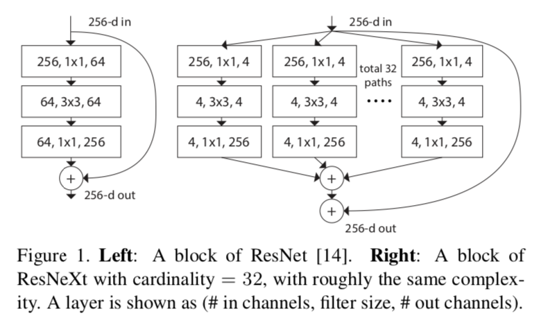
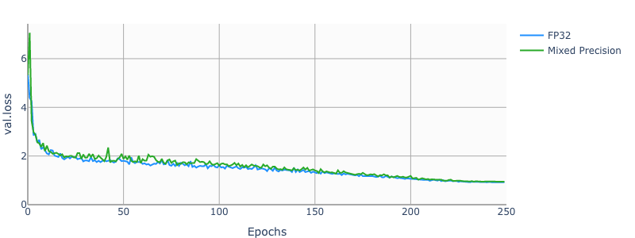
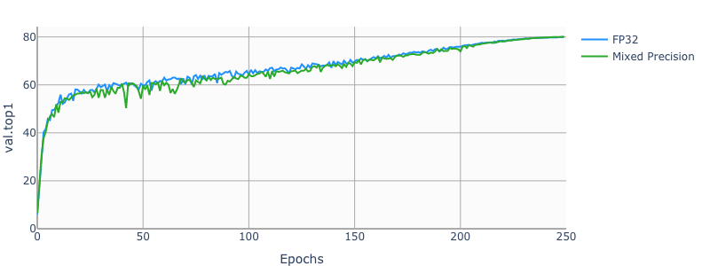
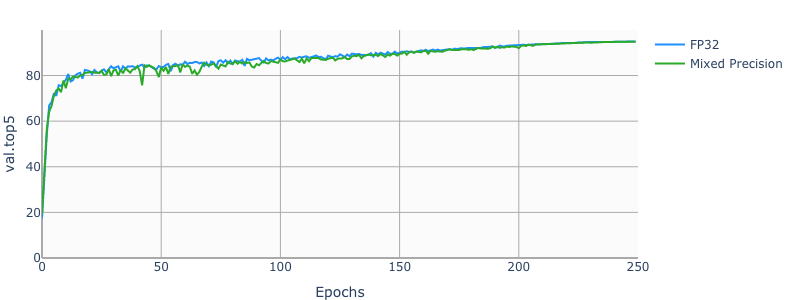

# ResNeXt101-32x4d For PyTorch

This repository provides a script and recipe to train the ResNeXt101-32x4d model to
achieve state-of-the-art accuracy, and is tested and maintained by NVIDIA.

## Table Of Contents

* [Model overview](#model-overview)
  * [Model architecture](#model-architecture)
  * [Default configuration](#default-configuration)
    * [Optimizer](#optimizer)
    * [Data augmentation](#data-augmentation)
  * [DALI](#dali)
  * [Feature support matrix](#feature-support-matrix)
    * [Features](#features)
  * [Mixed precision training](#mixed-precision-training)
    * [Enabling mixed precision](#enabling-mixed-precision)
* [Setup](#setup)
  * [Requirements](#requirements)
* [Quick Start Guide](#quick-start-guide)
* [Advanced](#advanced)
  * [Scripts and sample code](#scripts-and-sample-code)
    * [Parameters](#parameters)
    * [Command-line options](#command-line-options)
    * [Getting the data](#getting-the-data)
        * [Dataset guidelines](#dataset-guidelines)
        * [Multi-dataset](#multi-dataset)
    * [Training process](#training-process)
    * [Inference process](#inference-process)

* [Performance](#performance)
  * [Benchmarking](#benchmarking)
    * [Training performance benchmark](#training-performance-benchmark)
    * [Inference performance benchmark](#inference-performance-benchmark)
  * [Results](#results)
    * [Training accuracy results](#training-accuracy-results)
      * [Training accuracy: NVIDIA DGX-1 (8x V100 16G)](#training-accuracy-nvidia-dgx-1-(8x-v100-16G))
      * [Example plots](*example-plots)
    * [Training performance results](#training-performance-results)
      * [Training performance: NVIDIA DGX-1 (8x V100 16G)](#training-performance-nvidia-dgx-1-(8x-v100-16G))
    * [Training time for 90 epochs](#training-time-for-90-epochs)
      * [Training time: NVIDIA DGX-1 (8x V100 16G)](#training-time-nvidia-dgx-1-(8x-v100-16G))
  * [Inference performance results](#inference-performance-results)
      * [Inference performance: NVIDIA DGX-1 (1x V100 16G)](#inference-performance-nvidia-dgx-1-(1x-v100-16G))
      * [Inference performance: NVIDIA T4](#inference-performance-nvidia-t4)
* [Release notes](#release-notes)
  * [Changelog](#changelog)
  * [Known issues](#known-issues)

## Model overview

The ResNeXt101-32x4d is a model introduced in the [Aggregated Residual Transformations for Deep Neural Networks](https://arxiv.org/pdf/1611.05431.pdf) paper.

It is based on regular ResNet model, substituting 3x3 convolutions inside the bottleneck block for 3x3 grouped convolutions.

### Model architecture



_ Image source: [Aggregated Residual Transformations for Deep Neural Networks](https://arxiv.org/pdf/1611.05431.pdf) _

Image shows difference between ResNet bottleneck block and ResNeXt bottleneck block.

ResNeXt101-32x4d model's cardinality equals to 32 and bottleneck width equals to 4.

### Default configuration

The following sections highlight the default configurations for the ResNeXt101-32x4d model.

#### Optimizer

This model uses SGD with momentum optimizer with the following hyperparameters:

* Momentum (0.875)

* Learning rate (LR) = 0.256 for 256 batch size, for other batch sizes we lineary
scale the learning rate.

* Learning rate schedule - we use cosine LR schedule

* For bigger batch sizes (512 and up) we use linear warmup of the learning rate
during the first couple of epochs
according to [Training ImageNet in 1 hour](https://arxiv.org/abs/1706.02677).
Warmup length depends on the total training length.

* Weight decay (WD)= 6.103515625e-05 (1/16384).

* We do not apply WD on Batch Norm trainable parameters (gamma/bias)

* Label smoothing = 0.1

* We train for:

    * 90 Epochs -> 90 epochs is a standard for ImageNet networks

    * 250 Epochs -> best possible accuracy.

* For 250 epoch training we also use [MixUp regularization](https://arxiv.org/pdf/1710.09412.pdf).


#### Data augmentation

This model uses the following data augmentation:

* For training:
  * Normalization
  * Random resized crop to 224x224
    * Scale from 8% to 100%
    * Aspect ratio from 3/4 to 4/3
  * Random horizontal flip

* For inference:
  * Normalization
  * Scale to 256x256
  * Center crop to 224x224

### Feature support matrix

The following features are supported by this model:

| Feature               | ResNeXt101-32x4d
|-----------------------|--------------------------
|[DALI](https://docs.nvidia.com/deeplearning/sdk/dali-release-notes/index.html)   |   Yes
|[APEX AMP](https://nvidia.github.io/apex/amp.html) | Yes |

#### Features

- NVIDIA DALI - DALI is a library accelerating data preparation pipeline. To accelerate your input pipeline, you only need to define your data loader
with the DALI library. For more information about DALI, refer to the [DALI product documentation](https://docs.nvidia.com/deeplearning/sdk/index.html#data-loading).

- [APEX](https://github.com/NVIDIA/apex) is a PyTorch extension that contains utility libraries, such as [Automatic Mixed Precision (AMP)](https://nvidia.github.io/apex/amp.html), which require minimal network code changes to leverage Tensor Cores performance. Refer to the [Enabling mixed precision](#enabling-mixed-precision) section for more details.

### DALI

We use [NVIDIA DALI](https://github.com/NVIDIA/DALI),
which speeds up data loading when CPU becomes a bottleneck.
DALI can use CPU or GPU, and outperforms the PyTorch native dataloader.

Run training with `--data-backends dali-gpu` or `--data-backends dali-cpu` to enable DALI.
For ResNeXt101-32x4d, for DGX1 and DGX2 we recommend `--data-backends dali-cpu`.

### Mixed precision training

Mixed precision is the combined use of different numerical precisions in a computational method. [Mixed precision](https://arxiv.org/abs/1710.03740) training offers significant computational speedup by performing operations in half-precision format, while storing minimal information in single-precision to retain as much information as possible in critical parts of the network. Since the introduction of [Tensor Cores](https://developer.nvidia.com/tensor-cores) in the Volta and Turing architecture, significant training speedups are experienced by switching to mixed precision -- up to 3x overall speedup on the most arithmetically intense model architectures. Using mixed precision training requires two steps:
1.  Porting the model to use the FP16 data type where appropriate.
2.  Adding loss scaling to preserve small gradient values.

The ability to train deep learning networks with lower precision was introduced in the Pascal architecture and first supported in [CUDA 8](https://devblogs.nvidia.com/parallelforall/tag/fp16/) in the NVIDIA Deep Learning SDK.

For information about:
-   How to train using mixed precision, see the [Mixed Precision Training](https://arxiv.org/abs/1710.03740) paper and [Training With Mixed Precision](https://docs.nvidia.com/deeplearning/sdk/mixed-precision-training/index.html) documentation.
-   Techniques used for mixed precision training, see the [Mixed-Precision Training of Deep Neural Networks](https://devblogs.nvidia.com/mixed-precision-training-deep-neural-networks/) blog.
-   How to access and enable AMP for TensorFlow, see [Using TF-AMP](https://docs.nvidia.com/deeplearning/dgx/tensorflow-user-guide/index.html#tfamp) from the TensorFlow User Guide.
-   APEX tools for mixed precision training, see the [NVIDIA Apex: Tools for Easy Mixed-Precision Training in PyTorch](https://devblogs.nvidia.com/apex-pytorch-easy-mixed-precision-training/).

#### Enabling mixed precision

Mixed precision is enabled in PyTorch by using the Automatic Mixed Precision (AMP), a library from [APEX](https://github.com/NVIDIA/apex) that casts variables to half-precision upon retrieval,
while storing variables in single-precision format. Furthermore, to preserve small gradient magnitudes in backpropagation, a [loss scaling](https://docs.nvidia.com/deeplearning/sdk/mixed-precision-training/index.html#lossscaling) step must be included when applying gradients.
In PyTorch, loss scaling can be easily applied by using scale_loss() method provided by AMP. The scaling value to be used can be [dynamic](https://nvidia.github.io/apex/fp16_utils.html#apex.fp16_utils.DynamicLossScaler) or fixed.

For an in-depth walk through on AMP, check out sample usage [here](https://github.com/NVIDIA/apex/tree/master/apex/amp#usage-and-getting-started). [APEX](https://github.com/NVIDIA/apex) is a PyTorch extension that contains utility libraries, such as AMP, which require minimal network code changes to leverage tensor cores performance.

To enable mixed precision, you can:
- Import AMP from APEX, for example:

  ```
  from apex import amp
  ```
- Initialize an AMP handle, for example:

  ```
  amp_handle = amp.init(enabled=True, verbose=True)
  ```
- Wrap your optimizer with the AMP handle, for example:

  ```
  optimizer = amp_handle.wrap_optimizer(optimizer)
  ```
- Scale loss before backpropagation (assuming loss is stored in a variable called losses)
  - Default backpropagate for FP32:

    ```
    losses.backward()
    ```
  - Scale loss and backpropagate with AMP:

    ```
    with optimizer.scale_loss(losses) as scaled_losses:
       scaled_losses.backward()
    ```

## Setup

The following section lists the requirements that you need to meet in order to start training the ResNeXt101-32x4d model.

### Requirements

This repository contains Dockerfile which extends the PyTorch NGC container and encapsulates some dependencies. Aside from these dependencies, ensure you have the following components:

* [NVIDIA Docker](https://github.com/NVIDIA/nvidia-docker)
* [PyTorch 19.10-py3 NGC container](https://ngc.nvidia.com/registry/nvidia-pytorch) or newer
* [NVIDIA Volta](https://www.nvidia.com/en-us/data-center/volta-gpu-architecture/) or [Turing](https://www.nvidia.com/en-us/geforce/turing/) based GPU

For more information about how to get started with NGC containers, see the
following sections from the NVIDIA GPU Cloud Documentation and the Deep Learning
DGX Documentation:
* [Getting Started Using NVIDIA GPU Cloud](https://docs.nvidia.com/ngc/ngc-getting-started-guide/index.html)
* [Accessing And Pulling From The NGC Container Registry](https://docs.nvidia.com/deeplearning/dgx/user-guide/index.html#accessing_registry)
* [Running PyTorch](https://docs.nvidia.com/deeplearning/dgx/pytorch-release-notes/running.html#running)

For those unable to use the PyTorch NGC container, to set up the required environment or create your own container, see the versioned [NVIDIA Container Support Matrix](https://docs.nvidia.com/deeplearning/frameworks/support-matrix/index.html).

## Quick Start Guide

### 1. Clone the repository.
```
git clone https://github.com/NVIDIA/DeepLearningExamples
cd DeepLearningExamples/PyTorch/Classification/
```

### 2. Download and preprocess the dataset.

The ResNeXt101-32x4d script operates on ImageNet 1k, a widely popular image classification dataset from the ILSVRC challenge.

PyTorch can work directly on JPEGs, therefore, preprocessing/augmentation is not needed.

1. [Download the images](http://image-net.org/download-images).

2. Extract the training data:
  ```bash
  mkdir train && mv ILSVRC2012_img_train.tar train/ && cd train
  tar -xvf ILSVRC2012_img_train.tar && rm -f ILSVRC2012_img_train.tar
  find . -name "*.tar" | while read NAME ; do mkdir -p "${NAME%.tar}"; tar -xvf "${NAME}" -C "${NAME%.tar}"; rm -f "${NAME}"; done
  cd ..
  ```

3. Extract the validation data and move the images to subfolders:
  ```bash
  mkdir val && mv ILSVRC2012_img_val.tar val/ && cd val && tar -xvf ILSVRC2012_img_val.tar
  wget -qO- https://raw.githubusercontent.com/soumith/imagenetloader.torch/master/valprep.sh | bash
  ```

The directory in which the `train/` and `val/` directories are placed, is referred to as `<path to imagenet>` in this document.

### 3. Build the RNXT101-32x4d PyTorch NGC container.

```
docker build . -t nvidia_rnxt101-32x4d
```

### 4. Start an interactive session in the NGC container to run training/inference.
```
nvidia-docker run --rm -it -v <path to imagenet>:/imagenet --ipc=host nvidia_rnxt101-32x4d
```

### 5. Start training

To run training for a standard configuration (DGX1V, AMP/FP32, 90/250 Epochs),
run one of the scripts in the `./resnext101-32x4d/training` directory
called `./resnext101-32x4d/training/{AMP,FP32}/{DGX1}_RNXT101-32x4d_{AMP, FP32}_{90,250}E.sh`.

Ensure ImageNet is mounted in the `/imagenet` directory.

Example:
    `bash ./resnext101-32x4d/training/DGX1_RNXT101-32x4d_FP16_250E.sh <path were to store checkpoints and logs>`

### 6. Start inference

To run inference on ImageNet on a checkpointed model, run:

`python ./main.py --arch resnext101-32x4d --evaluate --epochs 1 --resume <path to checkpoint> -b <batch size> <path to imagenet>`

To run inference on JPEG image, you have to first extract the model weights from checkpoint:

`python checkpoint2model.py --checkpoint-path <path to checkpoint> --weight-path <path where weights will be stored>`

Then run classification script:

`python classify.py --arch resnext101-32x4d -c fanin --weights <path to weights from previous step> --precision AMP|FP16|FP32 --image <path to JPEG image>`


## Advanced

The following sections provide greater details of the dataset, running training and inference, and the training results.

### Scripts and sample code

To run a non standard configuration use:

* For 1 GPU
    * FP32
        `python ./main.py --arch resnext101-32x4d -c fanin --label-smoothing 0.1 <path to imagenet>`
        `python ./main.py --arch resnext101-32x4d -c fanin --label-smoothing 0.1 --amp --static-loss-scale 256 <path to imagenet>`

* For multiple GPUs
    * FP32
        `python ./multiproc.py --nproc_per_node 8 ./main.py --arch resnext101-32x4d -c fanin --label-smoothing 0.1 <path to imagenet>`
    * AMP
        `python ./multiproc.py --nproc_per_node 8 ./main.py --arch resnext101-32x4d -c fanin --label-smoothing 0.1 --amp --static-loss-scale 256 <path to imagenet>`

Use `python ./main.py -h` to obtain the list of available options in the `main.py` script.


### Commmand-line options:

To see the full list of available options and their descriptions, use the `-h` or `--help` command-line option, for example:

`python main.py -h`


```
usage: main.py [-h] [--data-backend BACKEND] [--arch ARCH]
               [--model-config CONF] [-j N] [--epochs N] [-b N]
               [--optimizer-batch-size N] [--lr LR] [--lr-schedule SCHEDULE]
               [--warmup E] [--label-smoothing S] [--mixup ALPHA]
               [--momentum M] [--weight-decay W] [--bn-weight-decay]
               [--nesterov] [--print-freq N] [--resume PATH]
               [--pretrained-weights PATH] [--fp16]
               [--static-loss-scale STATIC_LOSS_SCALE] [--dynamic-loss-scale]
               [--prof N] [--amp] [--local_rank LOCAL_RANK] [--seed SEED]
               [--gather-checkpoints] [--raport-file RAPORT_FILE] [--evaluate]
               [--training-only] [--no-checkpoints] [--workspace DIR]
               DIR

PyTorch ImageNet Training

positional arguments:
  DIR                   path to dataset

optional arguments:
  -h, --help            show this help message and exit
  --data-backend BACKEND
                        data backend: pytorch | syntetic | dali-gpu | dali-cpu
                        (default: dali-cpu)
  --arch ARCH, -a ARCH  model architecture: resnet18 | resnet34 | resnet50 |
                        resnet101 | resnet152 | resnext101-32x4d | se-
                        resnext101-32x4d (default: resnet50)
  --model-config CONF, -c CONF
                        model configs: classic | fanin | grp-fanin | grp-
                        fanout(default: classic)
  -j N, --workers N     number of data loading workers (default: 5)
  --epochs N            number of total epochs to run
  -b N, --batch-size N  mini-batch size (default: 256) per gpu
  --optimizer-batch-size N
                        size of a total batch size, for simulating bigger
                        batches using gradient accumulation
  --lr LR, --learning-rate LR
                        initial learning rate
  --lr-schedule SCHEDULE
                        Type of LR schedule: step, linear, cosine
  --warmup E            number of warmup epochs
  --label-smoothing S   label smoothing
  --mixup ALPHA         mixup alpha
  --momentum M          momentum
  --weight-decay W, --wd W
                        weight decay (default: 1e-4)
  --bn-weight-decay     use weight_decay on batch normalization learnable
                        parameters, (default: false)
  --nesterov            use nesterov momentum, (default: false)
  --print-freq N, -p N  print frequency (default: 10)
  --resume PATH         path to latest checkpoint (default: none)
  --pretrained-weights PATH
                        load weights from here
  --fp16                Run model fp16 mode.
  --static-loss-scale STATIC_LOSS_SCALE
                        Static loss scale, positive power of 2 values can
                        improve fp16 convergence.
  --dynamic-loss-scale  Use dynamic loss scaling. If supplied, this argument
                        supersedes --static-loss-scale.
  --prof N              Run only N iterations
  --amp                 Run model AMP (automatic mixed precision) mode.
  --local_rank LOCAL_RANK
                        Local rank of python process. Set up by distributed
                        launcher
  --seed SEED           random seed used for numpy and pytorch
  --gather-checkpoints  Gather checkpoints throughout the training, without
                        this flag only best and last checkpoints will be
                        stored
  --raport-file RAPORT_FILE
                        file in which to store JSON experiment raport
  --evaluate            evaluate checkpoint/model
  --training-only       do not evaluate
  --no-checkpoints      do not store any checkpoints, useful for benchmarking
  --workspace DIR       path to directory where checkpoints will be stored
```


### Dataset guidelines

To use your own dataset, divide it in directories as in the following scheme:

 - Training images - `train/<class id>/<image>`
 - Validation images - `val/<class id>/<image>`

If your dataset's has number of classes different than 1000, you need to add a custom config
in the `image_classification/resnet.py` file.

```python
resnet_versions = {
    ...
    'resnext101-32x4d-custom' : {
        'net' : ResNet,
        'block' : Bottleneck,
        'cardinality' : 32,
        'layers' : [3, 4, 23, 3],
        'widths' : [128, 256, 512, 1024],
        'expansion' : 2,
        'num_classes' : <custom number of classes>,
    }
}
```

After adding the config, run the training script with `--arch resnext101-32x4d-custom` flag.

### Training process

All the results of the training will be stored in the directory specified with `--workspace` argument.
Script will store:
 - most recent checkpoint - `checkpoint.pth.tar` (unless `--no-checkpoints` flag is used).
 - checkpoint with best validation accuracy - `model_best.pth.tar` (unless `--no-checkpoints` flag is used).
 - JSON log - in the file specified with `--raport-file` flag.

Metrics gathered through training:

 - `train.loss` - training loss
 - `train.total_ips` - training speed measured in images/second
 - `train.compute_ips` - training speed measured in images/second, not counting data loading
 - `train.data_time` - time spent on waiting on data
 - `train.compute_time` - time spent in forward/backward pass

### Inference process

Validation is done every epoch, and can be also run separately on a checkpointed model.

`python ./main.py --arch resnext101-32x4d --evaluate --epochs 1 --resume <path to checkpoint> -b <batch size> <path to imagenet>`

Metrics gathered through training:

 - `val.loss` - validation loss
 - `val.top1` - validation top1 accuracy
 - `val.top5` - validation top5 accuracy
 - `val.total_ips` - inference speed measured in images/second
 - `val.compute_ips` - inference speed measured in images/second, not counting data loading
 - `val.data_time` - time spent on waiting on data
 - `val.compute_time` - time spent on inference


To run inference on JPEG image, you have to first extract the model weights from checkpoint:

`python checkpoint2model.py --checkpoint-path <path to checkpoint> --weight-path <path where weights will be stored>`

Then run classification script:

`python classify.py --arch resnext101-32x4d -c fanin --weights <path to weights from previous step> --precision AMP|FP16|FP32 --image <path to JPEG image>`

Example output:


## Performance

### Benchmarking

The following section shows how to run benchmarks measuring the model performance in training and inference modes.

#### Training performance benchmark

To benchmark training, run:

* For 1 GPU
    * FP32
`python ./main.py --arch resnext101-32x4d --training-only -p 1 --raport-file benchmark.json --epochs 1 --prof 100 <path to imagenet>`
    * FP16
`python ./main.py --arch resnext101-32x4d --training-only -p 1 --raport-file benchmark.json --epochs 1 --prof 100 --fp16 --static-loss-scale 256 <path to imagenet>`
    * AMP
`python ./main.py --arch resnext101-32x4d --training-only -p 1 --raport-file benchmark.json --epochs 1 --prof 100 --amp --static-loss-scale 256 <path to imagenet>`
* For multiple GPUs
    * FP32
`python ./multiproc.py --nproc_per_node 8 ./main.py --arch resnext101-32x4d --training-only -p 1 --raport-file benchmark.json --epochs 1 --prof 100 <path to imagenet>`
    * FP16
`python ./multiproc.py --nproc_per_node 8 ./main.py --arch resnext101-32x4d --training-only -p 1 --raport-file benchmark.json --fp16 --static-loss-scale 256 --epochs 1 --prof 100 <path to imagenet>`
    * AMP
`python ./multiproc.py --nproc_per_node 8 ./main.py --arch resnext101-32x4d --training-only -p 1 --raport-file benchmark.json --amp --static-loss-scale 256 --epochs 1 --prof 100 <path to imagenet>`

Each of these scripts will run 100 iterations and save results in the `benchmark.json` file.

#### Inference performance benchmark

To benchmark inference, run:

* FP32

`python ./main.py --arch resnext101-32x4d -p 1 --raport-file benchmark.json --epochs 1 --prof 100 --evaluate <path to imagenet>`

* FP16

`python ./main.py --arch resnext101-32x4d -p 1 --raport-file benchmark.json --epochs 1 --prof 100 --evaluate --fp16 <path to imagenet>`

* AMP

`python ./main.py --arch resnext101-32x4d -p 1 --raport-file benchmark.json --epochs 1 --prof 100 --evaluate --amp <path to imagenet>`

Each of these scripts will run 100 iterations and save results in the `benchmark.json` file.


### Results

Our results were obtained by running the applicable training script     in the pytorch-19.10 NGC container.

To achieve these same results, follow the steps in the [Quick Start Guide](#quick-start-guide).

#### Training accuracy results

##### Training accuracy: NVIDIA DGX-1 (8x V100 16G)

| **epochs** | **Mixed Precision Top1** | **FP32 Top1** |
|:-:|:-:|:-:|
| 90 | 79.23 +/- 0.09 | 79.23 +/- 0.09 |
| 250 | 79.92 +/- 0.13 | 80.06 +/- 0.06 |


##### Example plots

The following images show a 250 epochs configuration on a DGX-1V.







#### Training performance results

##### Traininig performance: NVIDIA DGX1-16G (8x V100 16G)

| **GPUs** | **Mixed Precision** | **FP32** | **Mixed Precision speedup** | **Mixed Precision Strong Scaling** | **FP32 Strong Scaling** |
|:-:|:-:|:-:|:-:|:-:|:-:|
| 1 | 313.43 img/s | 146.66 img/s | 2.14x | 1.00x | 1.00x |
| 8 | 2384.85 img/s | 1116.58 img/s | 2.14x | 7.61x | 7.61x |

##### Traininig performance: NVIDIA DGX1-32G (8x V100 32G)

| **GPUs** | **Mixed Precision** | **FP32** | **Mixed Precision speedup** | **Mixed Precision Strong Scaling** | **FP32 Strong Scaling** |
|:-:|:-:|:-:|:-:|:-:|:-:|
| 1 | 297.83 img/s | 143.27 img/s | 2.08x | 1.00x | 1.00x |
| 8 | 2270.85 img/s | 1104.62 img/s | 2.06x | 7.62x | 7.71x |

##### Traininig performance: NVIDIA DGX2 (16x V100 32G)

| **GPUs** | **Mixed Precision** | **FP32** | **Mixed Precision speedup** | **Mixed Precision Strong Scaling** | **FP32 Strong Scaling** |
|:-:|:-:|:-:|:-:|:-:|:-:|
| 1 | 308.42 img/s | 151.67 img/s | 2.03x | 1.00x | 1.00x |
| 16 | 4473.37 img/s | 2261.97 img/s | 1.98x | 14.50x | 14.91x |

#### Training Time for 90 Epochs

##### Training time: NVIDIA DGX-1 (8x V100 16G)

| **GPUs** | **Mixed Precision training time** | **FP32 training time** |
|:-:|:-:|:-:|
| 1 | ~ 114 h | ~ 242 h |
| 8 | ~ 17 h | ~ 34 h |

##### Training time: NVIDIA DGX-2 (16x V100 32G)

| **GPUs** | **Mixed Precision training time** | **FP32 training time** |
|:-:|:-:|:-:|
| 1 | ~ 116 h | ~ 234 h |
| 16 | ~ 10 h | ~ 18 h |


#### Inference performance results

##### Inference performance: NVIDIA DGX-1 (1x V100 16G)

###### FP32 Inference Latency

| **batch size** | **Throughput Avg** | **Latency Avg** | **Latency 90%** | **Latency 95%** | **Latency 99%** |
|:-:|:-:|:-:|:-:|:-:|:-:|
| 1 | 47.34 img/s | 21.02ms | 23.41ms | 24.55ms | 26.00ms |
| 2 | 89.68 img/s | 22.14ms | 22.90ms | 24.86ms | 26.59ms |
| 4 | 175.92 img/s | 22.57ms | 24.96ms | 25.53ms | 26.03ms |
| 8 | 325.69 img/s | 24.35ms | 25.17ms | 25.80ms | 28.52ms |
| 16 | 397.04 img/s | 40.04ms | 40.01ms | 40.08ms | 40.32ms |
| 32 | 431.77 img/s | 73.71ms | 74.05ms | 74.09ms | 74.26ms |
| 64 | 485.70 img/s | 131.04ms | 131.38ms | 131.53ms | 131.81ms |
| 128 | N/A | N/A | N/A | N/A | N/A |

###### Mixed Precision Inference Latency

| **batch size** | **Throughput Avg** | **Latency Avg** | **Latency 90%** | **Latency 95%** | **Latency 99%** |
|:-:|:-:|:-:|:-:|:-:|:-:|
| 1 | 43.11 img/s | 23.05ms | 25.19ms | 25.41ms | 26.63ms |
| 2 | 83.29 img/s | 23.82ms | 25.11ms | 26.25ms | 27.29ms |
| 4 | 173.67 img/s | 22.82ms | 24.38ms | 25.26ms | 25.92ms |
| 8 | 330.18 img/s | 24.05ms | 26.45ms | 27.37ms | 27.74ms |
| 16 | 634.82 img/s | 25.00ms | 26.93ms | 28.12ms | 28.73ms |
| 32 | 884.91 img/s | 35.71ms | 35.96ms | 36.01ms | 36.13ms |
| 64 | 998.40 img/s | 63.43ms | 63.63ms | 63.75ms | 63.96ms |
| 128 | 1079.10 img/s | 117.74ms | 118.02ms | 118.11ms | 118.35ms |


##### Inference performance: NVIDIA T4

###### FP32 Inference Latency

| **batch size** | **Throughput Avg** | **Latency Avg** | **Latency 90%** | **Latency 95%** | **Latency 99%** |
|:-:|:-:|:-:|:-:|:-:|:-:|
| 1 | 55.64 img/s | 17.88ms | 19.21ms | 20.35ms | 22.29ms |
| 2 | 109.22 img/s | 18.24ms | 19.00ms | 20.43ms | 22.51ms |
| 4 | 217.27 img/s | 18.26ms | 18.88ms | 19.51ms | 21.74ms |
| 8 | 294.55 img/s | 26.74ms | 27.35ms | 27.62ms | 28.93ms |
| 16 | 351.30 img/s | 45.34ms | 45.72ms | 46.10ms | 47.43ms |
| 32 | 401.97 img/s | 79.10ms | 79.37ms | 79.44ms | 81.83ms |
| 64 | 449.30 img/s | 140.30ms | 140.73ms | 141.26ms | 143.57ms |
| 128 | N/A | N/A | N/A | N/A | N/A |

###### Mixed Precision Inference Latency

| **batch size** | **Throughput Avg** | **Latency Avg** | **Latency 90%** | **Latency 95%** | **Latency 99%** |
|:-:|:-:|:-:|:-:|:-:|:-:|
| 1 | 51.14 img/s | 19.48ms | 20.16ms | 21.40ms | 26.21ms |
| 2 | 102.29 img/s | 19.44ms | 19.77ms | 20.42ms | 24.51ms |
| 4 | 209.44 img/s | 18.93ms | 19.52ms | 20.23ms | 21.95ms |
| 8 | 408.69 img/s | 19.47ms | 21.12ms | 23.15ms | 25.77ms |
| 16 | 641.78 img/s | 24.54ms | 25.19ms | 25.64ms | 27.31ms |
| 32 | 800.26 img/s | 39.28ms | 39.43ms | 39.54ms | 41.96ms |
| 64 | 883.66 img/s | 71.76ms | 71.87ms | 71.94ms | 72.78ms |
| 128 | 948.27 img/s | 134.19ms | 134.40ms | 134.58ms | 134.81ms |


## Release notes

### Changelog

1. October 2019
  * Initial release

### Known issues

There are no known issues with this model.


