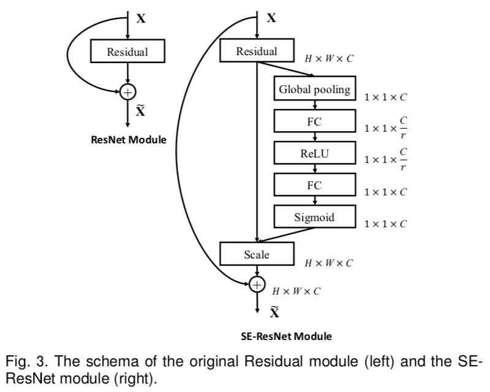
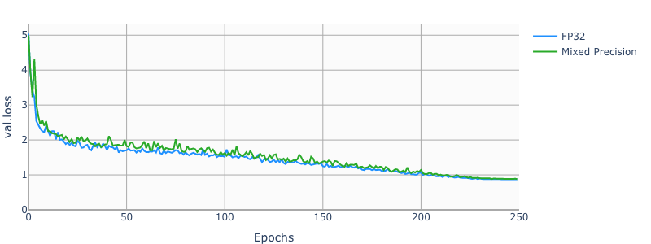
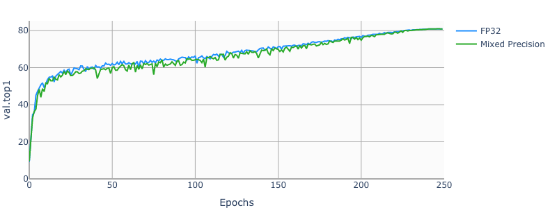
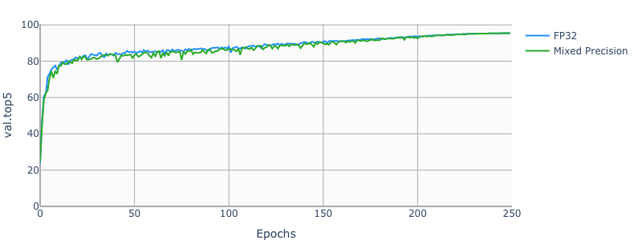

# SE-ResNeXt101-32x4d For PyTorch

This repository provides a script and recipe to train the SE-ResNeXt101-32x4d model to
achieve state-of-the-art accuracy, and is tested and maintained by NVIDIA.

## Table Of Contents

* [Model overview](#model-overview)
  * [Model architecture](#model-architecture)
  * [Default configuration](#default-configuration)
    * [Optimizer](#optimizer)
    * [Data augmentation](#data-augmentation)
  * [DALI](#dali)
  * [Feature support matrix](#feature-support-matrix)
    * [Features](#features)
  * [Mixed precision training](#mixed-precision-training)
    * [Enabling mixed precision](#enabling-mixed-precision)
    * [Enabling TF32](#enabling-tf32)
* [Setup](#setup)
  * [Requirements](#requirements)
* [Quick Start Guide](#quick-start-guide)
* [Advanced](#advanced)
  * [Scripts and sample code](#scripts-and-sample-code)
  * [Command-line options](#command-line-options)
  * [Dataset guidelines](#dataset-guidelines)
  * [Training process](#training-process)
  * [Inference process](#inference-process)
* [Performance](#performance)
  * [Benchmarking](#benchmarking)
    * [Training performance benchmark](#training-performance-benchmark)
    * [Inference performance benchmark](#inference-performance-benchmark)
  * [Results](#results)
    * [Training accuracy results](#training-accuracy-results)
      * [Training accuracy: NVIDIA DGX A100 (8x A100 80GB)](#training-accuracy-nvidia-dgx-a100-8x-a100-80gb)
      * [Training accuracy: NVIDIA DGX-1 (8x V100 16GB)](#training-accuracy-nvidia-dgx-1-8x-v100-16gb)
      * [Example plots](#example-plots)
    * [Training performance results](#training-performance-results)
      * [Training performance: NVIDIA DGX A100 (8x A100 80GB)](#training-performance-nvidia-dgx-a100-8x-a100-80gb)
      * [Training performance: NVIDIA DGX-1 16GB (8x V100 16GB)](#training-performance-nvidia-dgx-1-16gb-8x-v100-16gb)
      * [Training performance: NVIDIA DGX-1 32GB (8x V100 32GB)](#training-performance-nvidia-dgx-1-32gb-8x-v100-32gb)
  * [Inference performance results](#inference-performance-results)
      * [Inference performance: NVIDIA DGX-1 16GB (1x V100 16GB)](#inference-performance-nvidia-dgx-1-1x-v100-16gb)
      * [Inference performance: NVIDIA T4](#inference-performance-nvidia-t4)
* [Release notes](#release-notes)
  * [Changelog](#changelog)
  * [Known issues](#known-issues)

## Model overview

The SE-ResNeXt101-32x4d is a [ResNeXt101-32x4d](https://arxiv.org/pdf/1611.05431.pdf)
model with added Squeeze-and-Excitation module introduced
in [Squeeze-and-Excitation Networks](https://arxiv.org/pdf/1709.01507.pdf) paper.

Squeeze and Excitation module architecture for ResNet-type models:

This model is trained with mixed precision using Tensor Cores on Volta, Turing, and the NVIDIA Ampere GPU architectures. Therefore, researchers can get results 3x faster than training without Tensor Cores, while experiencing the benefits of mixed precision training. This model is tested against each NGC monthly container release to ensure consistent accuracy and performance over time.

We use [NHWC data layout](https://pytorch.org/tutorials/intermediate/memory_format_tutorial.html) when training using Mixed Precision.

### Model architecture



_Image source: [Squeeze-and-Excitation Networks](https://arxiv.org/pdf/1709.01507.pdf)_

Image shows the architecture of SE block and where is it placed in ResNet bottleneck block.

### Default configuration

The following sections highlight the default configurations for the SE-ResNeXt101-32x4d model.

#### Optimizer

This model uses SGD with momentum optimizer with the following hyperparameters:

* Momentum (0.875)
* Learning rate (LR) = 0.256 for 256 batch size, for other batch sizes we linearly
scale the learning rate.
* Learning rate schedule - we use cosine LR schedule
* For bigger batch sizes (512 and up) we use linear warmup of the learning rate
during the first couple of epochs
according to [Training ImageNet in 1 hour](https://arxiv.org/abs/1706.02677).
Warmup length depends on the total training length.
* Weight decay (WD)= 6.103515625e-05 (1/16384).
* We do not apply WD on Batch Norm trainable parameters (gamma/bias)
* Label smoothing = 0.1
* We train for:
    * 90 Epochs -> 90 epochs is a standard for ImageNet networks
    * 250 Epochs -> best possible accuracy.
* For 250 epoch training we also use [MixUp regularization](https://arxiv.org/pdf/1710.09412.pdf).


#### Data augmentation

This model uses the following data augmentation:

* For training:
  * Normalization
  * Random resized crop to 224x224
    * Scale from 8% to 100%
    * Aspect ratio from 3/4 to 4/3
  * Random horizontal flip
* For inference:
  * Normalization
  * Scale to 256x256
  * Center crop to 224x224


### Feature support matrix

The following features are supported by this model:

| Feature               | SE-ResNeXt101-32x4d
|-----------------------|--------------------------
|[DALI](https://docs.nvidia.com/deeplearning/sdk/dali-release-notes/index.html)   |   Yes
|[APEX AMP](https://nvidia.github.io/apex/amp.html) | Yes |

#### Features

- NVIDIA DALI - DALI is a library accelerating data preparation pipeline. To accelerate your input pipeline, you only need to define your data loader
with the DALI library. For more information about DALI, refer to the [DALI product documentation](https://docs.nvidia.com/deeplearning/dali/user-guide/docs/index.html).

- [APEX](https://github.com/NVIDIA/apex) is a PyTorch extension that contains utility libraries, such as [Automatic Mixed Precision (AMP)](https://nvidia.github.io/apex/amp.html), which require minimal network code changes to leverage Tensor Cores performance. Refer to the [Enabling mixed precision](#enabling-mixed-precision) section for more details.

### DALI

We use [NVIDIA DALI](https://github.com/NVIDIA/DALI),
which speeds up data loading when CPU becomes a bottleneck.
DALI can use CPU or GPU, and outperforms the PyTorch native dataloader.

Run training with `--data-backends dali-gpu` or `--data-backends dali-cpu` to enable DALI.
For DGXA100 and DGX1 we recommend `--data-backends dali-cpu`.

### Mixed precision training

Mixed precision is the combined use of different numerical precisions in a computational method. [Mixed precision](https://arxiv.org/abs/1710.03740) training offers significant computational speedup by performing operations in half-precision format, while storing minimal information in single-precision to retain as much information as possible in critical parts of the network. Since the introduction of [Tensor Cores](https://developer.nvidia.com/tensor-cores) in Volta, and following with both the Turing and Ampere architectures, significant training speedups are experienced by switching to mixed precision -- up to 3x overall speedup on the most arithmetically intense model architectures. Using mixed precision training requires two steps:
1.  Porting the model to use the FP16 data type where appropriate.
2.  Adding loss scaling to preserve small gradient values.

The ability to train deep learning networks with lower precision was introduced in the Pascal architecture and first supported in CUDA 8 in the NVIDIA Deep Learning SDK.

For information about:
-   How to train using mixed precision, see the [Mixed Precision Training](https://arxiv.org/abs/1710.03740) paper and [Training With Mixed Precision](https://docs.nvidia.com/deeplearning/sdk/mixed-precision-training/index.html) documentation.
-   Techniques used for mixed precision training, see the [Mixed-Precision Training of Deep Neural Networks](https://devblogs.nvidia.com/mixed-precision-training-deep-neural-networks/) blog.
-   APEX tools for mixed precision training, see the [NVIDIA Apex: Tools for Easy Mixed-Precision Training in PyTorch](https://devblogs.nvidia.com/apex-pytorch-easy-mixed-precision-training/).

#### Enabling mixed precision

Mixed precision is enabled in PyTorch by using the Automatic Mixed Precision (AMP), a library from [APEX](https://github.com/NVIDIA/apex) that casts variables to half-precision upon retrieval,
while storing variables in single-precision format. Furthermore, to preserve small gradient magnitudes in backpropagation, a [loss scaling](https://docs.nvidia.com/deeplearning/sdk/mixed-precision-training/index.html#lossscaling) step must be included when applying gradients.
In PyTorch, loss scaling can be easily applied by using scale_loss() method provided by AMP. The scaling value to be used can be [dynamic](https://nvidia.github.io/apex/fp16_utils.html#apex.fp16_utils.DynamicLossScaler) or fixed.

For an in-depth walk through on AMP, check out sample usage [here](https://github.com/NVIDIA/apex/tree/master/apex/amp#usage-and-getting-started). [APEX](https://github.com/NVIDIA/apex) is a PyTorch extension that contains utility libraries, such as AMP, which require minimal network code changes to leverage tensor cores performance.

To enable mixed precision, you can:
- Import AMP from APEX:

  ```python
  from apex import amp
  ```

- Wrap model and optimizer in amp.initialize:

  ```python
  model, optimizer = amp.initialize(model, optimizer, opt_level="O1", loss_scale="dynamic")
  ```

- Scale loss before backpropagation:
  ```python
  with amp.scale_loss(loss, optimizer) as scaled_loss:
    scaled_loss.backward()
  ```

#### Enabling TF32

TensorFloat-32 (TF32) is the new math mode in [NVIDIA A100](https://www.nvidia.com/en-us/data-center/a100/) GPUs for handling the matrix math also called tensor operations. TF32 running on Tensor Cores in A100 GPUs can provide up to 10x speedups compared to single-precision floating-point math (FP32) on Volta GPUs. 

TF32 Tensor Cores can speed up networks using FP32, typically with no loss of accuracy. It is more robust than FP16 for models which require high dynamic range for weights or activations.

For more information, refer to the [TensorFloat-32 in the A100 GPU Accelerates AI Training, HPC up to 20x](https://blogs.nvidia.com/blog/2020/05/14/tensorfloat-32-precision-format/) blog post.

TF32 is supported in the NVIDIA Ampere GPU architecture and is enabled by default.


## Setup

The following section lists the requirements that you need to meet in order to start training the SE-ResNeXt101-32x4d model.

### Requirements

This repository contains Dockerfile which extends the PyTorch NGC container and encapsulates some dependencies. Aside from these dependencies, ensure you have the following components:

* [NVIDIA Docker](https://github.com/NVIDIA/nvidia-docker)
* [PyTorch 21.03-py3 NGC container](https://ngc.nvidia.com/registry/nvidia-pytorch) or newer
* Supported GPUs:
    * [NVIDIA Volta architecture](https://www.nvidia.com/en-us/data-center/volta-gpu-architecture/)
    * [NVIDIA Turing architecture](https://www.nvidia.com/en-us/geforce/turing/)
    * [NVIDIA Ampere architecture](https://www.nvidia.com/en-us/data-center/nvidia-ampere-gpu-architecture/)

For more information about how to get started with NGC containers, see the
following sections from the NVIDIA GPU Cloud Documentation and the Deep Learning
DGX Documentation:
* [Getting Started Using NVIDIA GPU Cloud](https://docs.nvidia.com/ngc/ngc-getting-started-guide/index.html)
* [Accessing And Pulling From The NGC Container Registry](https://docs.nvidia.com/deeplearning/dgx/user-guide/index.html#accessing_registry)
* [Running PyTorch](https://docs.nvidia.com/deeplearning/dgx/pytorch-release-notes/running.html#running)

For those unable to use the PyTorch NGC container, to set up the required environment or create your own container, see the versioned [NVIDIA Container Support Matrix](https://docs.nvidia.com/deeplearning/frameworks/support-matrix/index.html).

## Quick Start Guide

### 1. Clone the repository.
```
git clone https://github.com/NVIDIA/DeepLearningExamples
cd DeepLearningExamples/PyTorch/Classification/
```

### 2. Download and preprocess the dataset.

The SE-ResNeXt101-32x4d script operates on ImageNet 1k, a widely popular image classification dataset from the ILSVRC challenge.

PyTorch can work directly on JPEGs, therefore, preprocessing/augmentation is not needed.

To train your model using mixed or TF32 precision with Tensor Cores or using FP32,
perform the following steps using the default parameters of the se-resnext101-32x4d model on the ImageNet dataset.
For the specifics concerning training and inference, see the [Advanced](#advanced) section.


1. [Download the images](http://image-net.org/download-images).

2. Extract the training data:
  ```bash
  mkdir train && mv ILSVRC2012_img_train.tar train/ && cd train
  tar -xvf ILSVRC2012_img_train.tar && rm -f ILSVRC2012_img_train.tar
  find . -name "*.tar" | while read NAME ; do mkdir -p "${NAME%.tar}"; tar -xvf "${NAME}" -C "${NAME%.tar}"; rm -f "${NAME}"; done
  cd ..
  ```

3. Extract the validation data and move the images to subfolders:
  ```bash
  mkdir val && mv ILSVRC2012_img_val.tar val/ && cd val && tar -xvf ILSVRC2012_img_val.tar
  wget -qO- https://raw.githubusercontent.com/soumith/imagenetloader.torch/master/valprep.sh | bash
  ```

The directory in which the `train/` and `val/` directories are placed, is referred to as `<path to imagenet>` in this document.

### 3. Build the SE-ResNeXt101-32x4d PyTorch NGC container.

```
docker build . -t nvidia_se-resnext101-32x4d
```

### 4. Start an interactive session in the NGC container to run training/inference.
```
nvidia-docker run --rm -it -v <path to imagenet>:/imagenet --ipc=host nvidia_se-resnext101-32x4d
```


### 5. Start training

To run training for a standard configuration (DGXA100/DGX1V, AMP/TF32/FP32, 90/250 Epochs),
run one of the scripts in the `./se-resnext101-32x4d/training` directory
called `./se-resnext101-32x4d/training/{AMP, TF32, FP32}/{ DGXA100, DGX1V }_se-resnext101-32x4d_{AMP, TF32, FP32}_{ 90, 250 }E.sh`.

Ensure ImageNet is mounted in the `/imagenet` directory.

Example:
    `bash ./se-resnext101-32x4d/training/AMP/DGX1_se-resnext101-32x4d_AMP_250E.sh <path were to store checkpoints and logs>`

### 6. Start inference

You can download pretrained weights from NGC:

```bash
wget --content-disposition https://api.ngc.nvidia.com/v2/models/nvidia/seresnext101_32x4d_pyt_amp/versions/20.06.0/zip -O seresnext101_32x4d_pyt_amp_20.06.0.zip

unzip seresnext101_32x4d_pyt_amp_20.06.0.zip
```

To run inference on ImageNet, run:

`python ./main.py --arch se-resnext101-32x4d --evaluate --epochs 1 --pretrained-weights nvidia_se-resnext101-32x4d_200821.pth.tar -b <batch size> <path to imagenet>`

To run inference on JPEG image using pretrained weights:

`python classify.py --arch se-resnext101-32x4d --pretrained-from-file nvidia_se-resnext101-32x4d_200821.pth.tar --precision AMP|FP32 --image <path to JPEG image>`


## Advanced

The following sections provide greater details of the dataset, running training and inference, and the training results.

### Scripts and sample code

To run a non standard configuration use:

* For 1 GPU
    * FP32
        `python ./main.py --arch se-resnext101-32x4d -c fanin --label-smoothing 0.1 <path to imagenet>`
        `python ./main.py --arch se-resnext101-32x4d -c fanin --label-smoothing 0.1 --amp --static-loss-scale 256 <path to imagenet>`

* For multiple GPUs
    * FP32
        `python ./multiproc.py --nproc_per_node 8 ./main.py --arch se-resnext101-32x4d -c fanin --label-smoothing 0.1 <path to imagenet>`
    * AMP
        `python ./multiproc.py --nproc_per_node 8 ./main.py --arch se-resnext101-32x4d -c fanin --label-smoothing 0.1 --amp --static-loss-scale 256 <path to imagenet>`

Use `python ./main.py -h` to obtain the list of available options in the `main.py` script.


### Command-line options:

To see the full list of available options and their descriptions, use the `-h` or `--help` command-line option, for example:

`python main.py -h`


```
usage: main.py [-h] [--data-backend BACKEND] [--arch ARCH]
               [--model-config CONF] [--num-classes N] [-j N] [--epochs N]
               [--run-epochs N] [-b N] [--optimizer-batch-size N] [--lr LR]
               [--lr-schedule SCHEDULE] [--warmup E] [--label-smoothing S]
               [--mixup ALPHA] [--momentum M] [--weight-decay W]
               [--bn-weight-decay] [--nesterov] [--print-freq N]
               [--resume PATH] [--pretrained-weights PATH]
               [--static-loss-scale STATIC_LOSS_SCALE] [--dynamic-loss-scale]
               [--prof N] [--amp] [--seed SEED] [--gather-checkpoints]
               [--raport-file RAPORT_FILE] [--evaluate] [--training-only]
               [--no-checkpoints] [--checkpoint-filename CHECKPOINT_FILENAME]
               [--workspace DIR] [--memory-format {nchw,nhwc}]
               DIR

PyTorch ImageNet Training

positional arguments:
  DIR                   path to dataset

optional arguments:
  -h, --help            show this help message and exit
  --data-backend BACKEND
                        data backend: pytorch | syntetic | dali-gpu | dali-cpu
                        (default: dali-cpu)
  --arch ARCH, -a ARCH  model architecture: resnet18 | resnet34 | resnet50 |
                        resnet101 | resnet152 | resnext50-32x4d |
                        resnext101-32x4d | resnext101-32x8d |
                        resnext101-32x8d-basic | se-resnext101-32x4d (default:
                        resnet50)
  --model-config CONF, -c CONF
                        model configs: classic | fanin | grp-fanin | grp-
                        fanout(default: classic)
  --num-classes N       number of classes in the dataset
  -j N, --workers N     number of data loading workers (default: 5)
  --epochs N            number of total epochs to run
  --run-epochs N        run only N epochs, used for checkpointing runs
  -b N, --batch-size N  mini-batch size (default: 256) per gpu
  --optimizer-batch-size N
                        size of a total batch size, for simulating bigger
                        batches using gradient accumulation
  --lr LR, --learning-rate LR
                        initial learning rate
  --lr-schedule SCHEDULE
                        Type of LR schedule: step, linear, cosine
  --warmup E            number of warmup epochs
  --label-smoothing S   label smoothing
  --mixup ALPHA         mixup alpha
  --momentum M          momentum
  --weight-decay W, --wd W
                        weight decay (default: 1e-4)
  --bn-weight-decay     use weight_decay on batch normalization learnable
                        parameters, (default: false)
  --nesterov            use nesterov momentum, (default: false)
  --print-freq N, -p N  print frequency (default: 10)
  --resume PATH         path to latest checkpoint (default: none)
  --pretrained-weights PATH
                        load weights from here
  --static-loss-scale STATIC_LOSS_SCALE
                        Static loss scale, positive power of 2 values can
                        improve amp convergence.
  --dynamic-loss-scale  Use dynamic loss scaling. If supplied, this argument
                        supersedes --static-loss-scale.
  --prof N              Run only N iterations
  --amp                 Run model AMP (automatic mixed precision) mode.
  --seed SEED           random seed used for numpy and pytorch
  --gather-checkpoints  Gather checkpoints throughout the training, without
                        this flag only best and last checkpoints will be
                        stored
  --raport-file RAPORT_FILE
                        file in which to store JSON experiment raport
  --evaluate            evaluate checkpoint/model
  --training-only       do not evaluate
  --no-checkpoints      do not store any checkpoints, useful for benchmarking
  --checkpoint-filename CHECKPOINT_FILENAME
  --workspace DIR       path to directory where checkpoints will be stored
  --memory-format {nchw,nhwc}
                        memory layout, nchw or nhwc

```


### Dataset guidelines

To use your own dataset, divide it in directories as in the following scheme:

 - Training images - `train/<class id>/<image>`
 - Validation images - `val/<class id>/<image>`

If your dataset's has number of classes different than 1000, you need to pass `--num-classes N` flag to the training script.

### Training process

All the results of the training will be stored in the directory specified with `--workspace` argument.
Script will store:
 - most recent checkpoint - `checkpoint.pth.tar` (unless `--no-checkpoints` flag is used).
 - checkpoint with best validation accuracy - `model_best.pth.tar` (unless `--no-checkpoints` flag is used).
 - JSON log - in the file specified with `--raport-file` flag.

Metrics gathered through training:

 - `train.loss` - training loss
 - `train.total_ips` - training speed measured in images/second
 - `train.compute_ips` - training speed measured in images/second, not counting data loading
 - `train.data_time` - time spent on waiting on data
 - `train.compute_time` - time spent in forward/backward pass

To restart training from checkpoint use `--resume` option.

To start training from pretrained weights (e.g. downloaded from NGC) use `--pretrained-weights` option.

The difference between those two is that the pretrained weights contain only model weights,
and checkpoints, apart from model weights, contain optimizer state, LR scheduler state.

Checkpoints are suitable for dividing the training into parts, for example in order
to divide the training job into shorter stages, or restart training after infrastructure fail.

Pretrained weights can be used as a base for finetuning the model to a different dataset,
or as a backbone to detection models.

### Inference process

Validation is done every epoch, and can be also run separately on a checkpointed model.

`python ./main.py --arch se-resnext101-32x4d --evaluate --epochs 1 --resume <path to checkpoint> -b <batch size> <path to imagenet>`

Metrics gathered through training:

 - `val.loss` - validation loss
 - `val.top1` - validation top1 accuracy
 - `val.top5` - validation top5 accuracy
 - `val.total_ips` - inference speed measured in images/second
 - `val.compute_ips` - inference speed measured in images/second, not counting data loading
 - `val.data_time` - time spent on waiting on data
 - `val.compute_time` - time spent on inference


To run inference on JPEG image, you have to first extract the model weights from checkpoint:

`python checkpoint2model.py --checkpoint-path <path to checkpoint> --weight-path <path where weights will be stored>`

Then run classification script:

`python classify.py --arch se-resnext101-32x4d --pretrained-from-file <path to weights from previous step> --precision AMP|FP32 --image <path to JPEG image>`

You can also run ImageNet validation on pretrained weights:

`python ./main.py --arch se-resnext101-32x4d --evaluate --epochs 1 --pretrained-weights <path to pretrained weights> -b <batch size> <path to imagenet>`

#### NGC Pretrained weights:

Pretrained weights can be downloaded from NGC:

```bash
wget --content-disposition https://api.ngc.nvidia.com/v2/models/nvidia/seresnext101_32x4d_pyt_amp/versions/20.06.0/zip -O seresnext101_32x4d_pyt_amp_20.06.0.zip

unzip seresnext101_32x4d_pyt_amp_20.06.0.zip
```
To run inference on ImageNet, run:

`python ./main.py --arch se-resnext101-32x4d --evaluate --epochs 1 --pretrained-weights nvidia_se-resnext101-32x4d_200821.pth.tar -b <batch size> <path to imagenet>`

To run inference on JPEG image using pretrained weights:

`python classify.py --arch se-resnext101-32x4d --pretrained-from-file nvidia_se-resnext101-32x4d_200821.pth.tar --precision AMP|FP32 --image <path to JPEG image>`


## Performance

The performance measurements in this document were conducted at the time of publication and may not reflect the performance achieved from NVIDIA’s latest software release. For the most up-to-date performance measurements, go to [NVIDIA Data Center Deep Learning Product Performance](https://developer.nvidia.com/deep-learning-performance-training-inference).

### Benchmarking

The following section shows how to run benchmarks measuring the model performance in training and inference modes.

#### Training performance benchmark

To benchmark training, run:

* For 1 GPU
    * FP32 (V100 GPUs only)
        `python ./launch.py --model se-resnext101-32x4d --precision FP32 --mode benchmark_training --platform DGX1V <path to imagenet> --raport-file benchmark.json --epochs 1 --prof 100`
    * TF32 (A100 GPUs only)
        `python ./launch.py --model se-resnext101-32x4d --precision TF32 --mode benchmark_training --platform DGXA100 <path to imagenet> --raport-file benchmark.json --epochs 1 --prof 100`
    * AMP
        `python ./launch.py --model se-resnext101-32x4d --precision AMP --mode benchmark_training --platform <DGX1V|DGXA100> <path to imagenet> --raport-file benchmark.json --epochs 1 --prof 100`
* For multiple GPUs
    * FP32 (V100 GPUs only)
        `python ./launch.py --model se-resnext101-32x4d --precision FP32 --mode benchmark_training --platform DGX1V <path to imagenet> --raport-file benchmark.json --epochs 1 --prof 100`
    * TF32 (A100 GPUs only)
        `python ./multiproc.py --nproc_per_node 8 ./launch.py --model se-resnext101-32x4d --precision TF32 --mode benchmark_training --platform DGXA100 <path to imagenet> --raport-file benchmark.json --epochs 1 --prof 100`
    * AMP
        `python ./multiproc.py --nproc_per_node 8 ./launch.py --model se-resnext101-32x4d --precision AMP --mode benchmark_training --platform <DGX1V|DGXA100> <path to imagenet> --raport-file benchmark.json --epochs 1 --prof 100`

Each of these scripts will run 100 iterations and save results in the `benchmark.json` file.

#### Inference performance benchmark

To benchmark inference, run:

* FP32 (V100 GPUs only)

`python ./launch.py --model se-resnext101-32x4d --precision FP32 --mode benchmark_inference --platform DGX1V <path to imagenet> --raport-file benchmark.json --epochs 1 --prof 100`

* TF32 (A100 GPUs only)

`python ./launch.py --model se-resnext101-32x4d --precision TF32 --mode benchmark_inference --platform DGXA100 <path to imagenet> --raport-file benchmark.json --epochs 1 --prof 100`

* AMP

`python ./launch.py --model se-resnext101-32x4d --precision AMP --mode benchmark_inference --platform <DGX1V|DGXA100> <path to imagenet> --raport-file benchmark.json --epochs 1 --prof 100`

Each of these scripts will run 100 iterations and save results in the `benchmark.json` file.

### Results

#### Training accuracy results

Our results were obtained by running the applicable training script the pytorch-20.12 NGC container.

To achieve these same results, follow the steps in the [Quick Start Guide](#quick-start-guide).

##### Training accuracy: NVIDIA DGX A100 (8x A100 80GB)

| **Epochs** | **Mixed Precision Top1** | **TF32 Top1**  |
|:----------:|:------------------------:|:--------------:|
|     90     |      80.03 +/- 0.11      | 79.92 +/- 0.07 |
|    250     |      80.9 +/- 0.08       | 80.98 +/- 0.07 |


##### Training accuracy: NVIDIA DGX-1 (8x V100 16GB)

| **Epochs** | **Mixed Precision Top1** | **FP32 Top1**  |
|:----------:|:------------------------:|:--------------:|
|     90     |      80.04 +/- 0.07      | 79.93 +/- 0.10 |
|    250     |      80.92 +/- 0.09      | 80.97 +/- 0.09 |


##### Example plots

The following images show a 250 epochs configuration on a DGX-1V.







#### Training performance results

Our results were obtained by running the applicable training script the pytorch-21.03 NGC container.

To achieve these same results, follow the steps in the [Quick Start Guide](#quick-start-guide).

##### Training performance: NVIDIA DGX A100 (8x A100 80GB)

| **GPUs** | **Throughput - TF32** | **Throughput - mixed precision** | **Throughput speedup (TF32 to mixed precision)** | **TF32 Strong Scaling** | **Mixed Precision Strong Scaling** | **Mixed Precision Training Time (90E)** | **TF32 Training Time (90E)** |
|:--------:|:---------------------:|:--------------------------------:|:------------------------------------------------:|:-----------------------:|:----------------------------------:|:---------------------------------------:|:----------------------------:|
|    1     |       395 img/s       |            855 img/s             |                      2.16 x                      |          1.0 x          |               1.0 x                |                ~40 hours                |          ~86 hours           |
|    8     |      2991 img/s       |            5779 img/s            |                      1.93 x                      |         7.56 x          |               6.75 x               |                ~6 hours                 |          ~12 hours           |


##### Training performance: NVIDIA DGX-1 16GB (8x V100 16GB)

| **GPUs** | **Throughput - FP32** | **Throughput - mixed precision** | **Throughput speedup (FP32 to mixed precision)** | **FP32 Strong Scaling** | **Mixed Precision Strong Scaling** | **Mixed Precision Training Time (90E)** | **FP32 Training Time (90E)** |
|:--------:|:---------------------:|:--------------------------------:|:------------------------------------------------:|:-----------------------:|:----------------------------------:|:---------------------------------------:|:----------------------------:|
|    1     |       132 img/s       |            443 img/s             |                      3.34 x                      |          1.0 x          |               1.0 x                |                ~76 hours                |          ~254 hours          |
|    8     |      1004 img/s       |            2971 img/s            |                      2.95 x                      |         7.57 x          |               6.7 x                |                ~12 hours                |          ~34 hours           |


##### Training performance: NVIDIA DGX-1 32GB (8x V100 32GB)

| **GPUs** | **Throughput - FP32** | **Throughput - mixed precision** | **Throughput speedup (FP32 to mixed precision)** | **FP32 Strong Scaling** | **Mixed Precision Strong Scaling** | **Mixed Precision Training Time (90E)** | **FP32 Training Time (90E)** |
|:--------:|:---------------------:|:--------------------------------:|:------------------------------------------------:|:-----------------------:|:----------------------------------:|:---------------------------------------:|:----------------------------:|
|    1     |       130 img/s       |            427 img/s             |                      3.26 x                      |          1.0 x          |               1.0 x                |                ~79 hours                |          ~257 hours          |
|    8     |       992 img/s       |            2925 img/s            |                      2.94 x                      |         7.58 x          |               6.84 x               |                ~12 hours                |          ~34 hours           |


#### Inference performance results

Our results were obtained by running the applicable training script the pytorch-21.03 NGC container.

To achieve these same results, follow the steps in the [Quick Start Guide](#quick-start-guide).

##### Inference performance: NVIDIA DGX-1 (1x V100 16GB)

###### FP32 Inference Latency

| **Batch Size** | **Throughput Avg** | **Latency Avg** | **Latency 95%** | **Latency 99%** |
|:--------------:|:------------------:|:---------------:|:---------------:|:---------------:|
|       1        |      40 img/s      |    24.92 ms     |    26.78 ms     |    31.12 ms     |
|       2        |      80 img/s      |    24.89 ms     |    27.63 ms     |    30.81 ms     |
|       4        |     127 img/s      |    31.58 ms     |    35.92 ms     |    39.64 ms     |
|       8        |     250 img/s      |    32.29 ms     |     34.5 ms     |    38.14 ms     |
|       16       |     363 img/s      |     44.5 ms     |    44.16 ms     |    44.37 ms     |
|       32       |     423 img/s      |    76.86 ms     |    75.89 ms     |    76.17 ms     |
|       64       |     472 img/s      |    138.36 ms    |    135.85 ms    |    136.52 ms    |
|      128       |     501 img/s      |    262.64 ms    |    255.48 ms    |    256.02 ms    |
|      256       |     508 img/s      |    519.84 ms    |    500.71 ms    |    501.5 ms     |


###### Mixed Precision Inference Latency

| **Batch Size** | **Throughput Avg** | **Latency Avg** | **Latency 95%** | **Latency 99%** |
|:--------------:|:------------------:|:---------------:|:---------------:|:---------------:|
|       1        |      29 img/s      |    33.83 ms     |     39.1 ms     |    41.57 ms     |
|       2        |      58 img/s      |    34.35 ms     |    36.92 ms     |    41.66 ms     |
|       4        |     117 img/s      |    34.33 ms     |    38.67 ms     |    41.05 ms     |
|       8        |     232 img/s      |    34.66 ms     |    39.51 ms     |    42.16 ms     |
|       16       |     459 img/s      |    35.23 ms     |    36.77 ms     |    38.11 ms     |
|       32       |     871 img/s      |    37.62 ms     |    39.36 ms     |    41.26 ms     |
|       64       |     1416 img/s     |    46.95 ms     |    45.26 ms     |    47.48 ms     |
|      128       |     1533 img/s     |    87.49 ms     |    83.54 ms     |    83.75 ms     |
|      256       |     1576 img/s     |    170.79 ms    |    161.97 ms    |    162.93 ms    |


##### Inference performance: NVIDIA T4

###### FP32 Inference Latency

| **Batch Size** | **Throughput Avg** | **Latency Avg** | **Latency 95%** | **Latency 99%** |
|:--------------:|:------------------:|:---------------:|:---------------:|:---------------:|
|       1        |      40 img/s      |    25.12 ms     |    28.83 ms     |    31.59 ms     |
|       2        |      75 img/s      |    26.82 ms     |    30.54 ms     |    33.13 ms     |
|       4        |     136 img/s      |    29.79 ms     |    33.33 ms     |    37.65 ms     |
|       8        |     155 img/s      |    51.74 ms     |    52.57 ms     |    53.12 ms     |
|       16       |     164 img/s      |    97.99 ms     |    98.76 ms     |    99.21 ms     |
|       32       |     173 img/s      |    186.31 ms    |    186.43 ms    |    187.4 ms     |
|       64       |     171 img/s      |    378.1 ms     |    377.19 ms    |    378.82 ms    |
|      128       |     165 img/s      |    785.83 ms    |    778.23 ms    |    782.64 ms    |
|      256       |     158 img/s      |   1641.96 ms    |   1601.74 ms    |   1614.52 ms    |


###### Mixed Precision Inference Latency

| **Batch Size** | **Throughput Avg** | **Latency Avg** | **Latency 95%** | **Latency 99%** |
|:--------------:|:------------------:|:---------------:|:---------------:|:---------------:|
|       1        |      31 img/s      |    32.51 ms     |    37.26 ms     |    39.53 ms     |
|       2        |      61 img/s      |    32.76 ms     |    37.61 ms     |    39.62 ms     |
|       4        |     123 img/s      |    32.98 ms     |    38.97 ms     |    42.66 ms     |
|       8        |     262 img/s      |    31.01 ms     |     36.3 ms     |    39.11 ms     |
|       16       |     482 img/s      |    33.76 ms     |    34.54 ms     |     38.5 ms     |
|       32       |     512 img/s      |    63.68 ms     |    63.29 ms     |    63.73 ms     |
|       64       |     527 img/s      |    123.57 ms    |    122.69 ms    |    123.56 ms    |
|      128       |     525 img/s      |    248.97 ms    |    245.39 ms    |    246.66 ms    |
|      256       |     527 img/s      |    496.23 ms    |    485.68 ms    |    488.3 ms     |


## Release notes

### Changelog

1. October 2019
  * Initial release
2. July 2020
  * Added A100 scripts
  * Updated README
3. February 2021
  * Moved from APEX AMP to Native AMP

### Known issues

There are no known issues with this model.

