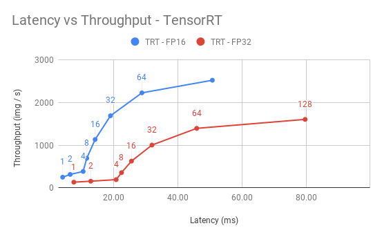
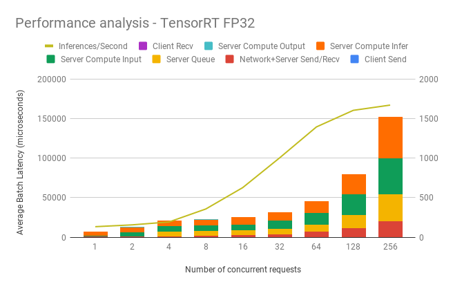
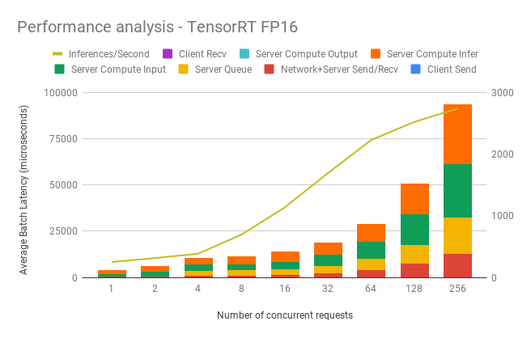

# Deploying the ResNet-50 v1.5 model using Triton Inference Server

The [NVIDIA Triton Inference Server](https://github.com/NVIDIA/trtis-inference-server) provides a datacenter and cloud inferencing solution optimized for NVIDIA GPUs. The server provides an inference service via an HTTP or gRPC endpoint, allowing remote clients to request inferencing for any number of GPU or CPU models being managed by the server. 

This folder contains instructions on how to deploy and run inference on
Triton Inference Server as well as gather detailed performance analysis.

## Table Of Contents

* [Model overview](#model-overview)
* [Setup](#setup)
  * [Inference container](#inference-container)
  * [Deploying the model](#deploying-the-model)
  * [Running the Triton Inference Server](#running-the-triton-inference-server)
* [Quick Start Guide](#quick-start-guide)
  * [Running the client](#running-the-client)
  * [Gathering performance data](#gathering-performance-data)
* [Advanced](#advanced)
  * [Automated benchmark script](#automated-benchmark-script)
* [Performance](#performance)
  * [Dynamic batching performance](#dynamic-batching-performance)
  * [TensorRT backend inference performance (1x V100 16GB)](#tensorrt-backend-inference-performance-1x-v100-16gb)
* [Release notes](#release-notes)
  * [Changelog](#changelog)
  * [Known issues](#known-issues)

## Model overview
The ResNet50 v1.5 model is a modified version of the [original ResNet50 v1 model](https://arxiv.org/abs/1512.03385).

The difference between v1 and v1.5 is that, in the bottleneck blocks which requires
downsampling, v1 has stride = 2 in the first 1x1 convolution, whereas v1.5 has stride = 2 in the 3x3 convolution.

This difference makes ResNet50 v1.5 slightly more accurate (~0.5% top1) than v1, but comes with a smallperformance drawback (~5% imgs/sec)

The ResNet50 v1.5 model can be deployed for inference on the [NVIDIA Triton Inference Server](https://github.com/NVIDIA/trtis-inference-server) using
TorchScript, ONNX Runtime or TensorRT as an execution backend.

## Setup

This script requires trained ResNet50 v1.5 model checkpoint that can be used for deployment. 

### Inference container

For easy-to-use deployment, a build script for special inference container was prepared. To build that container, go to the main repository folder and run:

`docker build -t rn50_inference . -f triton/Dockerfile`

This command will download the dependencies and build the inference containers. Then, run shell inside the container:

`docker run -it --rm --gpus device=0 --shm-size=1g --ulimit memlock=-1 --ulimit stack=67108864 --net=host -v <PATH_TO_MODEL_REPOSITORY>:/repository rn50_inference bash`

Here `device=0,1,2,3` selects the GPUs indexed by ordinals `0,1,2` and `3`, respectively. The server will see only these GPUs. If you write `device=all`, then the server will see all the available GPUs. `PATH_TO_MODEL_REPOSITORY` indicates location to where the
deployed models were stored.

### Deploying the model

To deploy the ResNet-50 v1.5 model into the Triton Inference Server, you must run the `deployer.py` script from inside the deployment Docker container to achieve a compatible format. 

```
usage: deployer.py [-h] (--ts-script | --ts-trace | --onnx | --trt)
                   [--triton-no-cuda] [--triton-model-name TRITON_MODEL_NAME]
                   [--triton-model-version TRITON_MODEL_VERSION]
                   [--triton-server-url TRITON_SERVER_URL]
                   [--triton-max-batch-size TRITON_MAX_BATCH_SIZE]
                   [--triton-dyn-batching-delay TRITON_DYN_BATCHING_DELAY]
                   [--triton-engine-count TRITON_ENGINE_COUNT]
                   [--save-dir SAVE_DIR]
                   [--max_workspace_size MAX_WORKSPACE_SIZE] [--trt-fp16]
                   [--capture-cuda-graph CAPTURE_CUDA_GRAPH]
                   ...

optional arguments:
  -h, --help            show this help message and exit
  --ts-script           convert to torchscript using torch.jit.script
  --ts-trace            convert to torchscript using torch.jit.trace
  --onnx                convert to onnx using torch.onnx.export
  --trt                 convert to trt using tensorrt

triton related flags:
  --triton-no-cuda      Use the CPU for tracing.
  --triton-model-name TRITON_MODEL_NAME
                        exports to appropriate directory structure for TRITON
  --triton-model-version TRITON_MODEL_VERSION
                        exports to appropriate directory structure for TRITON
  --triton-server-url TRITON_SERVER_URL
                        exports to appropriate directory structure for TRITON
  --triton-max-batch-size TRITON_MAX_BATCH_SIZE
                        Specifies the 'max_batch_size' in the TRITON model
                        config. See the TRITON documentation for more info.
  --triton-dyn-batching-delay TRITON_DYN_BATCHING_DELAY
                        Determines the dynamic_batching queue delay in
                        milliseconds(ms) for the TRITON model config. Use '0'
                        or '-1' to specify static batching. See the TRITON
                        documentation for more info.
  --triton-engine-count TRITON_ENGINE_COUNT
                        Specifies the 'instance_group' count value in the
                        TRITON model config. See the TRITON documentation for
                        more info.
  --save-dir SAVE_DIR   Saved model directory

optimization flags:
  --max_workspace_size MAX_WORKSPACE_SIZE
                        set the size of the workspace for trt export
  --trt-fp16            trt flag ---- export model in mixed precision mode
  --capture-cuda-graph CAPTURE_CUDA_GRAPH
                        capture cuda graph for obtaining speedup. possible
                        values: 0, 1. default: 1.
  model_arguments       arguments that will be ignored by deployer lib and
                        will be forwarded to your deployer script
```

Following model specific arguments have to be specified for model deployment:
  
```
  --config CONFIG        Network architecture to use for deployment (eg. resnet50, 
                         resnext101-32x4d or se-resnext101-32x4d)
  --checkpoint CHECKPOINT
                         Path to stored model weight. If not specified, model will be 
                         randomly initialized
  --batch_size BATCH_SIZE
                         Batch size used for dummy dataloader
  --fp16                 Use model with half-precision calculations
```

For example, to deploy model into TensorRT format, using half precision and max batch size 64 called
`rn-trt-16` execute:

`python -m triton.deployer --trt --trt-fp16 --triton-model-name rn-trt-16 --triton-max-batch-size 64 --save-dir /repository -- --config resnet50 --checkpoint model_checkpoint --batch_size 64 --fp16`

Where `model_checkpoint` is a checkpoint for a trained model with the same architecture (resnet50) as used during export.

### Running the Triton Inference Server

**NOTE: This step is executed outside the inference container.**

Pull the Triton Inference Server container from our repository:

`docker pull nvcr.io/nvidia/tritonserver:20.07-py3`

Run the command to start the Triton Inference Server:

`docker run -d --rm --gpus device=0 --ipc=host --network=host -p 8000:8000 -p 8001:8001 -p 8002:8002 -v <PATH_TO_MODEL_REPOSITORY>:/models nvcr.io/nvidia/tritonserver:20.07-py3 trtserver --model-store=/models --log-verbose=1 --model-control-mode=poll --repository-poll-secs=5`

Here `device=0,1,2,3` selects GPUs indexed by ordinals `0,1,2` and `3`, respectively. The server will see only these GPUs. If you write `device=all`, then the server will see all the available GPUs. `PATH_TO_MODEL_REPOSITORY` indicates the location where the 
deployed models were stored. An additional `--model-controle-mode` option allows to reload the model when it changes in the filesystem. It is a required option for benchmark scripts that works with multiple model versions on a single Triton Inference Server instance.

## Quick Start Guide

### Running the client

The client `client.py` checks the model accuracy against synthetic or real validation
data. The client connects to Triton Inference Server and performs inference. 

```
usage: client.py [-h] --triton-server-url TRITON_SERVER_URL
                 --triton-model-name TRITON_MODEL_NAME [-v]
                 [--inference_data INFERENCE_DATA] [--batch_size BATCH_SIZE]
                 [--fp16]

optional arguments:
  -h, --help            show this help message and exit
  --triton-server-url TRITON_SERVER_URL
                        URL adress of trtion server (with port)
  --triton-model-name TRITON_MODEL_NAME
                        Triton deployed model name
  -v, --verbose         Verbose mode.
  --inference_data INFERENCE_DATA
                        Path to file with inference data.
  --batch_size BATCH_SIZE
                        Inference request batch size
  --fp16                Use fp16 precision for input data

```

To run inference on the model exported in the previous steps, using the data located under
`/dataset`, run:

`python -m triton.client --triton-server-url localhost:8001 --triton-model-name rn-trt-16 --inference_data /data/test_data.bin --batch_size 16 --fp16`


### Gathering performance data
Performance data can be gathered using the `perf_client` tool. To use this tool to measure performance for batch_size=32, the following command can be used:

`/workspace/bin/perf_client --max-threads 10 -m rn-trt-16 -x 1 -p 10000 -v -i gRPC -u localhost:8001 -b 32 -l 5000 --concurrency-range 1 -f result.csv`

For more information about `perf_client`, refer to the [documentation](https://docs.nvidia.com/deeplearning/sdk/triton-inference-server-master-branch-guide/docs/optimization.html#perf-client).

## Advanced

### Automated benchmark script
To automate benchmarks of different model configurations, a special benchmark script is located in `triton/scripts/benchmark.sh`. To use this script,
run Triton Inference Server and then execute the script as follows:

`bash triton/scripts/benchmark.sh <MODEL_REPOSITORY> <LOG_DIRECTORY> <ARCHITECTURE> (<CHECKPOINT_PATH>)`

The benchmark script tests all supported backends with different batch sizes and server configuration. Logs from execution will be stored in `<LOG DIRECTORY>`.
To process static configuration logs, `triton/scripts/process_output.sh` script can be used.

## Performance

### Dynamic batching performance
The Triton Inference Server has a dynamic batching mechanism built-in that can be enabled. When it is enabled, the server creates inference batches from multiple received requests. This allows us to achieve better performance than doing inference on each single request. The single request is assumed to be a single image that needs to be inferenced. With dynamic batching enabled, the server will concatenate single image requests into an inference batch. The upper bound of the size of the inference batch is set to 64. All these parameters are configurable.

Our results were obtained by running automated benchmark script. 
Throughput is measured in images/second, and latency in milliseconds.

### TensorRT backend inference performance (1x V100 16GB)
**FP32 Inference Performance**

|**Concurrent requests**|**Throughput (img/s)**|**Avg. Latency (ms)**|**90% Latency (ms)**|**95% Latency (ms)**|**99% Latency (ms)**|
|-----|--------|-------|--------|-------|-------|
| 1 | 133.6 | 7.48 | 7.56 | 7.59 | 7.68 |
| 2 | 156.6 | 12.77 | 12.84 | 12.86 | 12.93 |
| 4 | 193.3 | 20.70 | 20.82 | 20.85 | 20.92 | 
| 8 | 357.4 | 22.38 | 22.53 | 22.57 | 22.67 |
| 16 | 627.3 | 25.49 | 25.64 | 25.69 | 25.80 |
| 32 | 1003 | 31.87 | 32.43 | 32.61 | 32.91 |
| 64 | 1394.7 | 45.85 | 46.13 | 46.22 | 46.86 |
| 128 | 1604.4 | 79.70 | 80.50 | 80.96 | 83.09 |
| 256 | 1670.7 | 152.21 | 186.78 | 188.36 | 190.52 |

**FP16 Inference Performance**

|**Concurrent requests**|**Throughput (img/s)**|**Avg. Latency (ms)**|**90% Latency (ms)**|**95% Latency (ms)**|**99% Latency (ms)**|
|-----|--------|-------|--------|-------|-------|
| 1 | 250.1 | 3.99 | 4.08 | 4.11 | 4.16 |
| 2 | 314.8 | 6.35 | 6.42 | 6.44 | 6.49 |
| 4 | 384.8 | 10.39 | 10.51 | 10.54 | 10.60 |
| 8 | 693.8 | 11.52 | 11.78 | 11.88 | 12.09 |
| 16 | 1132.9 | 14.13 | 14.31 | 14.41 | 14.65 |
| 32 | 1689.7 | 18.93 | 19.11 | 19.20 | 19.44 |
| 64 | 2226.3 | 28.74 | 29.53 | 29.74 | 31.09 |
| 128 | 2521.5 | 50.74 | 51.97 | 52.30 | 53.61 |
| 256 | 2738 | 93.76 | 97.14 | 115.19 | 117.21 |









## Release notes

### Changelog
September 2020
- Initial release