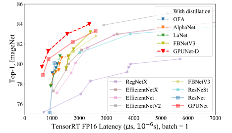
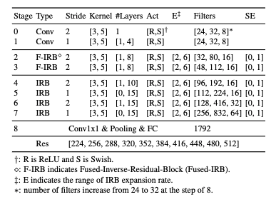
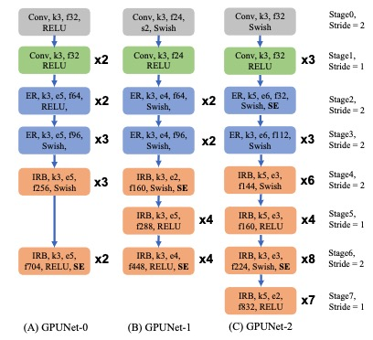

# GPUNet for Pytorch

GPUNet is a new family of Convolutional Neural Networks designed to max out the performance of NVIDIA GPU and TensorRT. Crafted by AI, GPUNet demonstrates state-of-the-art inference performance up to 2x faster than EfficientNet-X and FBNet-V3. This repo holds the original GPUNet implementation in our CVPR-2022 [paper](https://arxiv.org/pdf/2205.00841.pdf), allowing a user to quickly reproduce the inference latency and accuracy, re-train or customize the models. 

- [Model overview](#model-overview)
    * [Model architecture](#model-architecture)
    * [Default configuration](#default-configuration)
    * [Feature support matrix](#feature-support-matrix)
	    * [Features](#features)
- [Setup](#setup)
  * [Requirements](#requirements)
- [Quick Start Guide](#quick-start-guide)
    * [Prepare the dataset](#prepare-the-dataset)
    * [Training](#training)
    * [Inference](#inference)
- [Advanced Usage](#advanced-usage)
    * [Scripts and sample code](#scripts-and-sample-code)
    * [Model customization](#model-customization)
    * [Command-line options](#command-line-options)
    * [Train on your data](#train-on-your-data)
    * [Training process](#training-process)
    * [Inference process](#inference-process)
    * [Benchmark the GPUNet latency](#benchmark-the-gpunet-latency)
- [Performance](#performance)
    * [Training accuracy results](#training-accuracy-results)
    * [Training performance results](#training-performance-results)
    * [Inference results](#inference-results)
- [Release notes](#release-notes)
    * [Changelog](#changelog)
    * [Known issues](#known-issues)


## Model overview
Developed by NVIDIA, GPUNet differs from the current ConvNets in three aspects:
- **Designed by AI**: we built an AI agent to establish SOTA GPUNet out of our years of research in Neural Architecture Search. Powered by [Selene](https://blogs.nvidia.com/blog/2020/12/18/nvidia-selene-busy/) supercomputer, our AI agent can automatically orchestrate hundreds of GPUs to meticulously trade-off sophisticated design decisions w.r.t multiple design goals without intervening by the domain experts.

- **Co-designed with NVIDIA TensorRT and GPU**: GPUNet only considers the most relevant factors to the model accuracy and the TensorRT inference latency, promoting GPU friendly operators (for example, larger filters) over memory-bound operators (for example, fancy activations), therefore delivering the SOTA GPU latency and the accuracy on ImageNet.

- **TensorRT deployment-ready**: All the GPUNet reported latencies are after the optimization from TensorRT, including kernel fusion, quantization, etc., so GPUNet is directly deployable to users.

<p align="center">
  
</p>

Because of better design trade-off and hardware and software co-design, GPUNet has established new SOTA latency and accuracy Pareto frontier on ImageNet. Specifically, GPUNet is up to 2x faster than EfficentNet, EfficientNet-X and FBNetV3. Our CVPR-2022 [paper](https://arxiv.org/pdf/2205.00841.pdf) provides extensive evaluation results aginsts other networks.

### Model architecture
<p align="center">
  
</p>

The above table describes the general structure of GPUNet, which consists of 8 stages, and we search for the configurations of each stage. The layers within a stage share the same configurations. The first two stages are to search for the head configurations using convolutions. Inspired by [EfficientNet-V2](https://arxiv.org/abs/2104.00298), the 2 and 3 stages use Fused Inverted Residual Blocks(IRB); however, we observed the increasing latency after replacing the rest IRB with Fused-IRB. Therefore, from stages 4 to 7, we use IRB as the primary layer. The column \#Layers shows the range of \#Layers in the stage, for example, [3, 10] at stage 4 means that the stage can have three to 10 IRBs, and the column filters shows the range of filters for the layers in the stage. We also tuned the expansion ratio, activation types, kernel sizes, and the Squeeze Excitation(SE) layer inside the IRB/Fused-IRB. Finally, the dimensions of the input image increased from 224 to 512 at step 32.

GPUNet has provided seven specific model architectures at different latencies. You can easily query the architecture details from the JSON formatted model (for example, those in eval.py). The following figure describes GPUNet-0, GPUNet-1, and GPUNet-2 in the paper. Note that only the first IRB's stride is two and the stride of the rest IRBs is 1 in stages 2, 3, 4, and 6.
<p align="center">
  
</p>

### Default configuration

* Training features:
  * Customize the training pipeline in [Timm](https://github.com/rwightman/pytorch-image-models) to support the distillation.
    * [Here](./train_params/GPUNet-D1.train.params) provides an example of training hyper-parameters with distillation.
  * All the features in [Timm](https://github.com/rwightman/pytorch-image-models), including
    * Random data augmentation, mean = 9, std = 0.5. 
    * Exponential Moving Average (EMA).
    * Rmsproptf optimizer.
    * Multi-GPU training.
    * Automatic mixed precision (AMP).
    * GPUNet can be further improved with other training hacks such as Mixup or drop path regularization. More hacks are available at [Timm](https://github.com/rwightman/pytorch-image-models).
  * The exact training hyper-parameters to reproduce the GPUNet results can be found [here](./train_params). 
* Inference features:
  * Test the accuracy of pre-trained GPUNet.
  * Save GPUNet to the ONNX files for the latency benchmarking.

### Feature support matrix
This model supports the following features:

| Feature               | GPUNet                
|-----------------------|--------------------------
|Multi-GPU training     | ✓
|Automatic mixed precision (AMP)   |  ✓
|Distillation           |        ✓  

#### Features

**Multi-GPU training**: we re-use the same training pipeline from [Timm](https://github.com/rwightman/pytorch-image-models) to train GPUNet. Timm has adopted NCCL to optimize the multi-GPU training efficiency.

**Automatic Mixed Precision (AMP)**: mixed precision is the combined use of different numerical precisions in a computational method. [Mixed precision](https://arxiv.org/abs/1710.03740) training offers significant computational speed-up by performing operations in half-precision format while storing minimal information in single-precision to retain as much information as possible in critical parts of the network.

[Timm](https://github.com/rwightman/pytorch-image-models) supports AMP by default and only requires the '--amp' flag to enable the AMP training.


**Distillation**: originally introduced in [Hinton's seminal paper](https://arxiv.org/pdf/1503.02531.pdf), knowledge distillation uses a larger and better teacher network to supervise the training of a student network in addition to the ground truth. Generally the final accuracy of a student network is better than the training without a teacher; for example, ~+2% on ImageNet.

We customized [Timm](https://github.com/rwightman/pytorch-image-models) to support the distillation. The teacher model can be any model supported by [Timm](https://github.com/rwightman/pytorch-image-models). We demonstrate the usage of distillation in [Training with distillation](#training-with-distillation).

## Setup

The following section lists the requirements you need to meet to start training the GPUNet.

### Requirements

This repository contains a Dockerfile that extends the PyTorch NGC container and encapsulates all dependencies. You also need the following components to get started:
-  [NVIDIA Docker](https://github.com/NVIDIA/nvidia-docker)
-  [ImageNet 1K dataset](https://image-net.org/download.php)
-  Supported GPUs:
   * [NVIDIA Volta architecture](https://www.nvidia.com/en-us/data-center/volta-gpu-architecture/)
   * [NVIDIA Turing architecture](https://www.nvidia.com/en-us/design-visualization/technologies/turing-architecture/)
   * [NVIDIA Ampere architecture](https://www.nvidia.com/en-us/data-center/nvidia-ampere-gpu-architecture/)
 
For more information about how to get started with NGC containers, refer tothe following sections from the NVIDIA GPU Cloud Documentation and the Deep Learning
DGX Documentation:
* [Getting Started Using NVIDIA GPU Cloud](https://docs.nvidia.com/ngc/ngc-getting-started-guide/index.html)
* [Accessing And Pulling From The NGC Container Registry](https://docs.nvidia.com/deeplearning/dgx/user-guide/index.html#accessing_registry)
* [Running PyTorch](https://docs.nvidia.com/deeplearning/frameworks/pytorch-release-notes/running.html#running)


## Quick Start Guide
This repo allows a user to easily train GPUNet, reproduce our results, test the accuracy of pre-trained checkpoints, and benchmark GPUNet latency. For customizing GPUNet, refer to [Model customization](#model-customization).

1. To get started, clone the repo:
```
git clone https://github.com/NVIDIA/DeepLearningExamples
cd DeepLearningExamples/PyTorch/Classification/GPUNet
```

2. Download ImageNet from the [offical website](https://image-net.org/download-images). Recursively unzip the dataset, and locate the train and val folders. Refer to [Prepare the dataset](#prepare-the-dataset) for more details.


3. Build and run the GPUNet PyTorch container, assuming you have installed the docker.
```
docker build -t gpunet .
docker run --gpus all -it --rm --network=host --shm-size 600G --ipc=host -v /path/to/imagenet:/root/data/imagenet/ gpunet
```

### Prepare the Dataset

1. [Download the ImageNet](http://image-net.org/download-images).

2. Extract the training data:
  ```bash
  mkdir train && mv ILSVRC2012_img_train.tar train/ && cd train
  tar -xvf ILSVRC2012_img_train.tar && rm -f ILSVRC2012_img_train.tar
  find . -name "*.tar" | while read NAME ; do mkdir -p "${NAME%.tar}"; tar -xvf "${NAME}" -C "${NAME%.tar}"; rm -f "${NAME}"; done
  cd ..
  ```

3. Extract the validation data and move the images to subfolders:
  ```bash
  mkdir val && mv ILSVRC2012_img_val.tar val/ && cd val && tar -xvf ILSVRC2012_img_val.tar
  wget -qO- https://raw.githubusercontent.com/soumith/imagenetloader.torch/master/valprep.sh | bash
  ```

The directory where the `train/` and `val/` directories are placed is referred to as `/path/to/imagenet/` in this document.


### Training

We have provided the [training launch scripts](./train_params) for you to reproduce the GPUNet accuracy by training from scratch. For example, a user can copy the launch script in GPUNet-0.train.params or the training hyper-parameters below to reproduce the accuracy.

GPUNet training hyperparameters:

1. GPUNet-0 
```
./train.sh 8 /root/data/imagenet/ --model gpunet_0 --sched step --decay-epochs 2.4 --decay-rate .97 --opt rmsproptf -b 192 --epochs 450 --opt-eps .001 -j 8 --warmup-lr 1e-6 --weight-decay 1e-5 --drop 0.3 --drop-connect 0.2 --model-ema --model-ema-decay 0.9999 --aa rand-m9-mstd0.5 --remode pixel --reprob 0.2 --lr .06 --num-classes 1000 --enable-distill False --crop-pct 1.0 --img-size 320 --amp
```

2. GPUNet-1
```
./train.sh 8 /root/data/imagenet/ --model gpunet_1 --sched step --decay-epochs 2.4 --decay-rate .97 --opt rmsproptf -b 192 --epochs 450 --opt-eps .001 -j 8 --warmup-lr 1e-6 --weight-decay 1e-5 --drop 0.3 --drop-connect 0.2 --model-ema --model-ema-decay 0.9999 --aa rand-m9-mstd0.5 --remode pixel --reprob 0.2 --lr .06 --num-classes 1000 --enable-distill False --crop-pct 1.0 --img-size 288 --amp
```

3. GPUNet-2
```
./train.sh 8 /root/data/imagenet/ --model gpunet_2 --sched step --decay-epochs 2.4 --decay-rate .97 --opt rmsproptf -b 192 --epochs 450 --opt-eps .001 -j 8 --warmup-lr 1e-6 --weight-decay 1e-5 --drop 0.3 --drop-connect 0.2 --model-ema --model-ema-decay 0.9999 --aa rand-m9-mstd0.5 --remode pixel --reprob 0.2 --lr .06 --num-classes 1000 --enable-distill False --crop-pct 1.0 --img-size 384 --amp
```

4. GPUNet-D1 with distillation
```
./train.sh 8 /root/data/imagenet/ --model gpunet_d1 --sched step --decay-epochs 2.4 --decay-rate .97 --opt rmsproptf -b 192 --epochs 450 --opt-eps .001 -j 8 --warmup-lr 1e-6 --weight-decay 1e-5 --drop 0.3 --drop-connect 0.2 --model-ema --model-ema-decay 0.9999 --aa rand-m9-mstd0.5 --remode pixel --reprob 0.2 --lr .06 --num-classes 1000 --enable-distill True --crop-pct 1.0 --img-size 456 --amp --test-teacher False --teacher tf_efficientnet_b5_ns --teacher-img-size 456
```

5. GPUNet-D2 with distillation
```
./train.sh 8 /root/data/imagenet/ --model gpunet_d2 --sched step --decay-epochs 2.4 --decay-rate .97 --opt rmsproptf -b 128 --epochs 450 --opt-eps .001 -j 8 --warmup-lr 1e-6 --weight-decay 1e-5 --drop 0.3 --drop-connect 0.2 --model-ema --model-ema-decay 0.9999 --aa rand-m9-mstd0.5 --remode pixel --reprob 0.2 --lr .06 --num-classes 1000 --enable-distill True --crop-pct 1.0 --img-size 528 --amp --test-teacher False --teacher tf_efficientnet_b6_ns --teacher-img-size 528
```

6. GPUNet-P0 with distillation
```
./train.sh 8 /root/data/imagenet/ --model gpunet_p0 --sched step --decay-epochs 2.4 --decay-rate 0.97 --opt rmsproptf -b 256 --epochs 450 --opt-eps 0.001 -j 8 --warmup-lr 1e-6 --weight-decay 1e-5 --drop 0.3 --drop-connect 0.2 --model-ema --model-ema-decay 0.9999 --aa rand-m9-mstd0.5 --remode pixel --reprob 0.2 --lr 0.08 --num-classes 1000 --enable-distill True --crop-pct 0.875 --img-size 224 --amp --test-teacher False --teacher tf_efficientnet_b2 --teacher-img-size 260
```

7. GPUNet-P1 with distillation
```
./train.sh 8 /root/data/imagenet/ --model gpunet_p1 --sched step --decay-epochs 2.4 --decay-rate 0.97 --opt rmsproptf -b 256 --epochs 450 --opt-eps 0.001 -j 8 --warmup-lr 1e-6 --weight-decay 1e-5 --drop 0.3 --drop-connect 0.2 --model-ema --model-ema-decay 0.9999 --aa rand-m9-mstd0.5 --remode pixel --reprob 0.2 --lr 0.08 --num-classes 1000 --enable-distill True --crop-pct 0.875 --img-size 224 --amp --test-teacher False --teacher tf_efficientnet_b2 --teacher-img-size 260
```

You need to call train.sh to start the training, and here is an example of arguments to train.sh.
```
./train.sh 8                   >>launch with 8 GPUs.
/root/data/imagenet/           >>path to the imagenet.
--model gpunet_d1              >>name of GPUNet.
--sched step                   >>stepwise learning rate scheduler.
--decay-epochs 2.4             >>epoch interval to decay LR.
--decay-rate .97               >>LR decay rate (default: 0.1).
--opt rmsproptf                >>optimizer.
-b 192                         >>batch size.
--epochs 450                   >>total training epochs.
--opt-eps .001                 >>optimizer epsilon.
-j 8                           >>the number of threads for data loader.
--lr .06                       >>learning rate.
--warmup-lr 1e-6               >>warmup learning rate.
--weight-decay 1e-5            >>weight-decay rate.
--drop 0.3                     >>dropout rate.
--drop-connect 0.2             >>drop connect rate.
--model-ema                    >>enable tracking moving average of model weights.
--model-ema-decay 0.9999       >>decay factor for model weights moving average (default: 0.9998).
--aa rand-m9-mstd0.5           >>using the random augmentation.
--remode pixel                 >>random erase mode.
--reprob 0.2                   >>random erase prob.
--num-classes 1000             >>the number of output classes.
--amp                          >>enable the amp training.
--crop-pct 1.0                 >>input image center crop percent.
--output ./output/             >>path to output folder.
--img-size 456                 >>image size for the student model, i.e., gpunet_d1.
--enable-distill True          >>to turn on/off the distillation.
--test-teacher False           >>to test the accuracy of teacher model
--teacher tf_efficientnet_b5   >>the name of teacher model
--teacher-img-size 456         >>the image size to the teacher model. Note the student and teacher may have different image resolutions.
```


#### Training with distillation
We recommend running the distillation on a GPU with large DRAM; for example, 80G A100, since it needs to fit another teacher network.

- The following describes the usage of distillation.
    * --enable-distill [Boolean]
      * Enable or disable distillation.
    * --teacher [String]
      * Specify the name of the teacher model from Timm. You can find the full list of teacher models [here](https://github.com/rwightman/pytorch-image-models/blob/master/results/results-imagenet.csv), and you can pick any models from the model column. We expect the teacher model to be larger and better than the selected GPUNet.
    * --teacher-img-size [Int]
      * Specify the image resolution to the teacher model. The teacher model may use a larger resolution, and you can find the teacher's resolution from the column img_size to the selected teacher. Internally we use one data loader for both the teacher and student models, and we downsample an image batch with the teacher's resolution to the student's resolution using [Interpolation](https://pytorch.org/docs/stable/generated/torch.nn.functional.interpolate.html).

### Inference

We also allow a user to evaluate the accuracy of pre-trained GPUNet checkpoints and benchmark the model's TensorRT latency. For evaluating GPUNet on a custom dataset, refer to [Train on your data](#train-on-your-data).

#### Evaluate the pre-trained GPUNet checkpoints
In the `eval.py`, we have listed seven configurations to the released GPUNet models in the table below.
| batch     |  Distillation | GPU                 | Latency  |               
|-----------|---------------|---------------------|----------|
| 1         |         No    | GV100               | 0.65ms   | 
| 1         |         No    | GV100               | 0.85ms   | 
| 1         |         No    | GV100               | 1.75ms   | 
| 1         |         Yes   | GV100               | 0.5ms-D  |
| 1         |         Yes   | GV100               | 0.8ms-D  | 
| 1         |         Yes   | GV100               | 1.25ms-D | 
| 1         |         Yes   | GV100               | 2.25ms-D |


A user can easily evaluate the accuracy of a pre-trained checkpoint using the following code:

```
from configs.model_hub import get_configs, get_model_list
from models.gpunet_builder import GPUNet_Builder

modelJSON, cpkPath = get_configs(batch=1, latency="0.65ms", gpuType="GV100")        >>Get the model configurations and checkpoints.
builder = GPUNet_Builder()                                                          >>Build an instance of GPUNet constructor.
model = builder.get_model(modelJSON)                                                >>Build the GPUNet based on the model json.
builder.export_onnx(model)                                                          >>Export Pytorch model to ONNX for benchmarking the latency.

builder.test_model(                                                                 >>Test the checkpoint accuracy.
    model,
    testBatch=200,
    checkpoint=cpkPath,
    imgRes=(3, model.imgRes, model.imgRes),
    dtype="fp16",
    crop_pct=1,
    val_path="/root/data/imagenet/val",
)
```

#### Benchmark the GPUNet latency
We will need the ONNX file of the GPUNet model to reproduce the latency. `builder.export_onnx(model)` will export an ONNX file named `gpunet.onnx`. You can get the FP16 latency with the following command:
```
trtexec --onnx=gpunet.onnx --fp16 --workspace=10240
```
Here `gpunet.onnx` is configured to benchmark the latency at the batch = 1 to be consistent with the GPUNet [paper](https://arxiv.org/pdf/2205.00841.pdf). You can also look at the [torch.onnx](https://pytorch.org/docs/stable/onnx.html) API to benchmark different settings, such as batch sizes. Finally, we report the median GPUNet compute time; here is an example output of a network with batch=1, latency=0.65ms, gpuType=GV100.
```
[04/07/2022-19:40:17] [I] GPU Compute Time: min = 0.554077 ms, max = 0.572388 ms, mean = 0.564606 ms, median = 0.564209 ms, percentile(99%) = 0.570312 ms
```

## Advanced usage

The following sections provide greater details of the dataset, running training and inference, and the training results.

### Scripts and sample code

- Training
  * All the training launch scripts are available [here](./train_params).
  * See section [Training](#training) for the explanations of different control flags.
- Inference
  * We also provide `validate.py` to evaluate a customized model.
```
python validate.py /path/to/imagenet/val 
--model gpunet_0                                                                    >>Model name.
-b 200                                                                              >>Batch size.
-j 8                                     
--img-size 320                                                                      >>Test image resolution.
--num-classes 1000                                                                  >>1000 classes for ImageNet 1K.                         
--checkpoint ./configs/batch1/GV100/0.65ms.pth.tar                                  >>Checkpoint location.
```
### Model customization
Customizing GPUNet is as simple as tweaking a few hyper-parameters in a JSON, and [this folder](./configs/batch1/GV100) provides all the JSON formatted GPUNet. Let's take GPUNet-0 (0.65ms.json) as an example.
```
[
      {
            "layer_type": "data",   
            "img_resolution": 320,                                                  >>the image resolution to the network    
            "distill": false
      },
...
      # 1 convolution layer
      {
            "layer_type": "conv",
            "num_in_channels": 32,                                                  >> input filters to this convolution layer
            "num_out_channels": 32,                                                 >> output filters
            "stride": 1,
            "kernel_size": 3,
            "act": "relu",
            "stage": 1
      },
      # 1 Fused Inverted Residual Block (IRB), all the hyper-parameters are tunable.
      {
            "layer_type": "fused_irb",
            "num_in_channels": 32,
            "num_out_channels": 32,
            "stride": 2,
            "expansion": 5,
            "kernel_size": 3,
            "act": "relu",
            "use_se": false,
            "stage": 2
      },
...
```
The entire GPUNet is customizable in the above JSON. Feel free to add or trim layers, change the filters, kernels, activation, or layer types.

### Command-line options

`validate.py` and `train.py` enable users to test and train GPUNet. To see the complete list of available options and their descriptions, use the `-h` or `--help` command-line option, for example:
```
python train.py -h
python validate.py -h
```

### Train on your data

To use your own dataset, divide it into directories. For example:

 - Training images - `train/<class id>/<image>`
 - Validation images - `val/<class id>/<image>`

If your dataset has a number of classes different than 1000, you need to pass the `--num-classes N` flag to the training script.

### Training process

All the results of the training will be stored in the directory specified with `--output` argument.

The script will store:
 - the most recent checkpoint - `last.pth.tar`.
 - the checkpoint with the best validation accuracy - `model_best.pth.tar`.
 - the log - in the file of `summary.csv`.

Metrics gathered through training:
 - `Loss` - training loss (average train loss).
 - `Time` - iteration time, images/second (average iteration time, and average images/second).
 - `LR` - the current learning rate.
 - `Data` - data loading time.

To restart training from the checkpoint use the `--resume path/to/latest_checkpoint.pth` option.

### Inference process

Validation is done every epoch, and can be also run separately on a checkpointed model.

```
python validate.py </path/to/val> 
--model <model name> -b <batch size> 
-j <data loader thread, default 8> --img-size <image resolution> 
--num-classes <prediction classes, 1000 for imagenet 1k> 
--checkpoint <checkpoint path>
```

Metrics gathered through training:

 - `Time` - iteration time (average iteration time, and average images/second).
 - `Loss` - inference loss (average inference loss).
 - `Acc@1` - current top1 accuracy (average top1 accuracy), 
 - `Acc@5` - top5 speed measured in images/second

## Performance
This section demonstrates the GPUNet training and inference results independently benchmarked by a third party. You can also easily replicate the same results following [Quick Start Guide](#quick-start-guide).

### Results

#### Training Accuracy Results
We benchmark the training results following the steps in [Training](#training). This section lists the training results on NVIDIA DGX V100. 

##### NVIDIA DGX V100 (8x V100 32GB)
| **Model**|**Batch**| **Epochs** | **GPUs** | **FP32 Top1**  | **AMP Top1**   | **FP32 (hours)<br />Train Time** | **AMP (hours)<br />Train Time** | **Training speedup<br />(FP32 / AMP)** |
|:--------:|:------:|:----------:|:--------:|:--------------:|:--------------:|:-------------------:|:-----------------------:|:--------------------------------:|
| GPUNet-0  |192     |    450     |    8     | 78.90<sub>+/-0.03</sub> | 78.96<sub>+/-0.05</sub> |71.63|46.56|    1.54  x                         |
| GPUNet-1  |192     |    450     |    8     | 80.4-<sub>+/-0.03</sub>  | 80.5<sub>+/-0.03</sub> |67.5 |43.5 |    1.55  x                         |
| GPUNet-2  |192     |    450     |    8     | 82.1-<sub>+/-0.04</sub>  | 82.2<sub>+/-0.04</sub> |171  |84.25|    2.03  x                         |

#### Training performance results
Please also follow the steps in [Training](#training) to reproduce the performance results below.

##### NVIDIA DGX V100 (8x V100 32GB)
    
| **Model** | **GPUs** | **Batch** |   FP32<br />imgs/second  | **AMP<br />imgs/second** |  Speedup<br />(FP32 to AMP) | 
|:---------:|:--------:|:---------:|:-----------:|:--------------------------------:|:------------------------------------------------:|
| GPUNet-0   |    8     | 192       | 2289 img/s  |           3518 img/s            |                      1.53 x                       |
| GPUNet-1   |    8     | 192       | 2415 img/s  |           3774 img/s            |                      1.56 x                       |
| GPUNet-2   |    8     | 192       | 948 img/s   |           1957 img/s            |                      2.03 x                       |

##### NVIDIA DGX A100 (8x A100 80GB)
    
| **Model** | **GPUs** | **Batch** |   FP32<br />imgs/second  | **AMP<br />imgs/second** |  Speedup<br />(TF32 to AMP) | 
|:---------:|:--------:|:---------:|:-----------:|:--------------------------------:|:------------------------------------------------:|
| GPUNet-2   |    8     | 192       | 2002 img/s   |           2690 img/s            |                      1.34 x                       |
| GPUNet-D1   |    8     | 128       | 755 img/s   |           844 img/s            |                      1.11 x                       |

#### Inference results
We benchmark the training results following the steps in [Benchmark the GPUNet latency](#benchmark-the-gpunet-latency). This section lists the inference results on NVIDIA 32G V100 and 80G A100.

##### NVIDIA V100 (32GB)
|       **GPUNet**  | **Batch** |  **GPU** | **TensorRT8 FP16 Latency** | FP16 Latency               |  Perf Details            | ImageNet Top1 |
|:-----------------:|:--------------:|:--------:|:--------------------------:|:--------------------------:|:------------------------:|:------------:|
|    GPUNet-0       |       1        |     V100 |   0.63 ms                  |        1.82 ms             | [here](./triton/065ms)   | 78.9         |
|    GPUNet-1       |       1        |     V100 |   0.82 ms                  |        2.75 ms             | [here](./triton/085ms)   | 80.5         |
|    GPUNet-2       |       1        |     V100 |   1.68 ms                  |        5.50 ms             | [here](./triton/175ms)   | 82.2         |
|    GPUNet-P0      |       1        |     V100 |   0.63 ms                  |        2.11 ms             | [here](./triton/05ms-D)  | 80.3         |
|    GPUNet-P1      |       1        |     V100 |   0.96 ms                  |        2.47 ms             | [here](./triton/08ms-D)  | 81.1         |
|    GPUNet-D1      |       1        |     V100 |   1.24 ms                  |        2.88 ms             | [here](./triton/125ms-D) | 82.5         |
|    GPUNet-D2      |       1        |     V100 |   2.17 ms                  |        4.22 ms             | [here](./triton/225ms-D) | 83.6         |

##### NVIDIA A100 (80GB)
|       **GPUNet**  | **Batch** |  **GPU** | **TensorRT8 FP16 Latency** | FP16 Latency               |  Perf Details            | ImageNet Top1 |
|:-----------------:|:--------------:|:--------:|:--------------------------:|:--------------------------:|:------------------------:|:------------:|
|    GPUNet-0       |       1        |     A100 |   0.46 ms                  |        1.46 ms             | [here](./triton/065ms)   | 78.9         |
|    GPUNet-1       |       1        |     A100 |   0.59 ms                  |        1.81 ms             | [here](./triton/085ms)   | 80.5         |
|    GPUNet-2       |       1        |     A100 |   1.25 ms                  |        4.03 ms             | [here](./triton/175ms)   | 82.2         |
|    GPUNet-P0      |       1        |     A100 |   0.45 ms                  |        1.31 ms             | [here](./triton/05ms-D)  | 80.3         |
|    GPUNet-P1      |       1        |     A100 |   0.61 ms                  |        1.64 ms             | [here](./triton/08ms-D)  | 81.1         |
|    GPUNet-D1      |       1        |     A100 |   0.94 ms                  |        2.44 ms             | [here](./triton/125ms-D) | 82.5         |
|    GPUNet-D2      |       1        |     A100 |   1.40 ms                  |        3.06 ms             | [here](./triton/225ms-D) | 83.6         |

## Release notes
The performance measurements in this document were conducted at the time of publication and may not reflect the performance achieved from NVIDIA’s latest software release. For the most up-to-date performance measurements, go to https://developer.nvidia.com/deep-learning-performance-training-inference.

### Changelog

May 2022
- Initial release

### Known issues
There are no known issues with this model.
