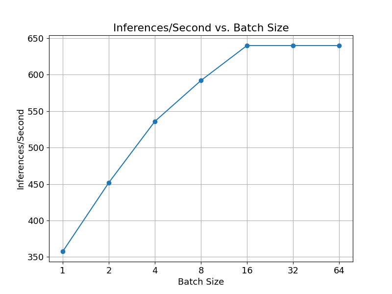
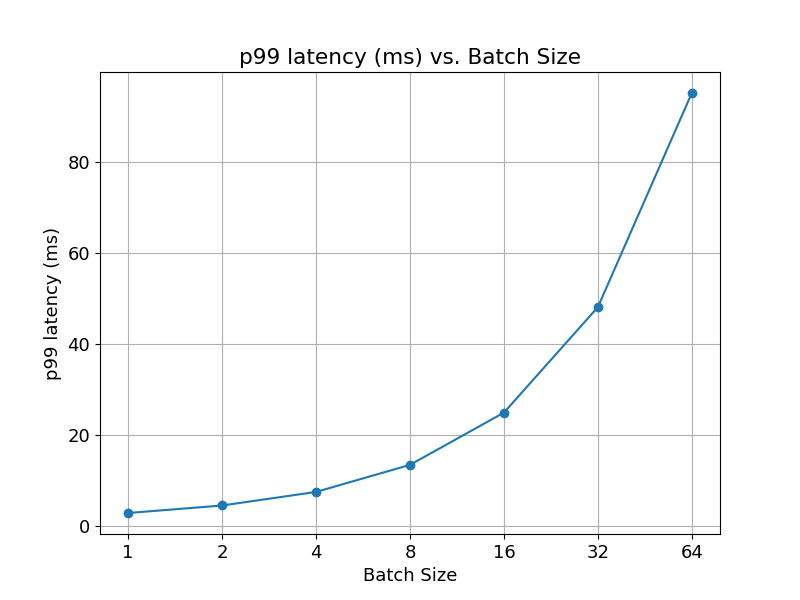
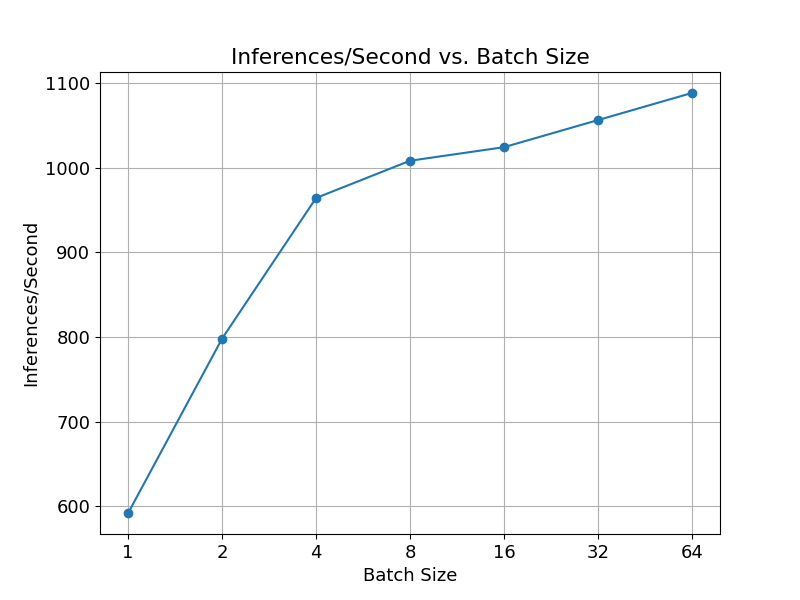
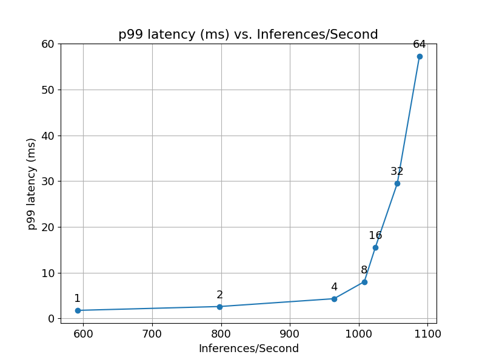
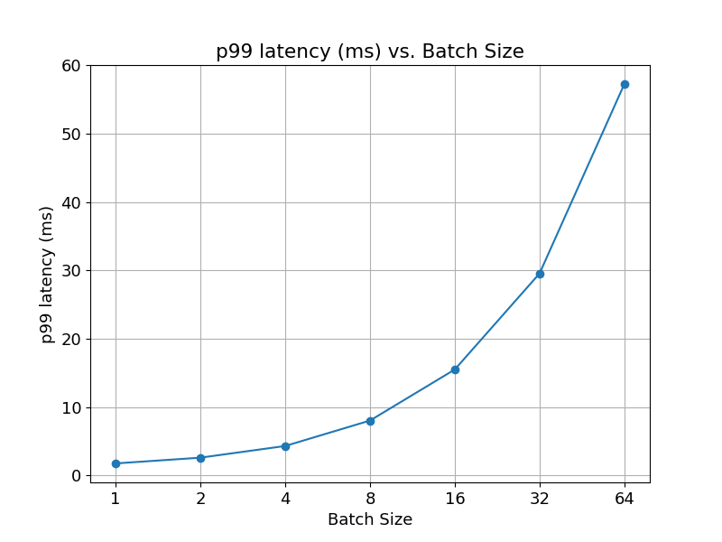
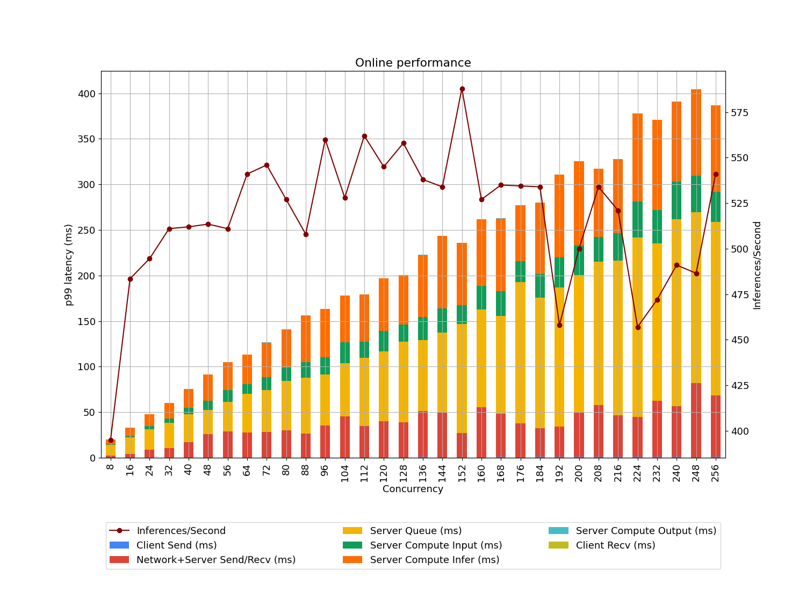
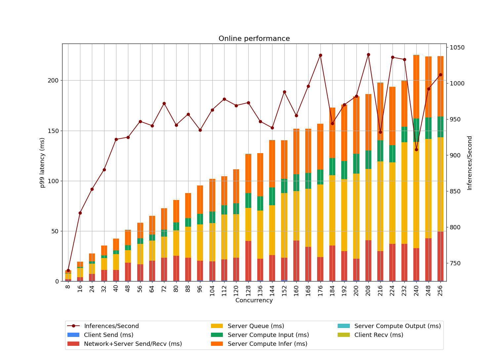

# Deploying the GPUNet model on Triton Inference Server

This folder contains instructions for deployment to run inference
on Triton Inference Server as well as a detailed performance analysis.
The purpose of this document is to help you with achieving
the best inference performance.

## Table of contents
  - [Solution overview](#solution-overview)
    - [Introduction](#introduction)
    - [Deployment process](#deployment-process)
  - [Setup](#setup)
  - [Quick Start Guide](#quick-start-guide)
  - [Performance](#performance)
    - [Offline scenario](#offline-scenario)
        - [Offline: NVIDIA DGX-1 (1x V100 32GB), ONNX Runtime with FP16](#offline-nvidia-dgx-1-1x-v100-32gb-onnx-runtime-with-fp16)
        - [Offline: NVIDIA DGX A100 (1x A100 80GB), ONNX Runtime with FP16](#offline-nvidia-dgx-a100-1x-a100-80gb-onnx-runtime-with-fp16)
    - [Online scenario](#online-scenario)
        - [Online: NVIDIA DGX-1 (1x V100 32GB), ONNX Runtime with FP16](#online-nvidia-dgx-1-1x-v100-32gb-onnx-runtime-with-fp16)
        - [Online: NVIDIA DGX A100 (1x A100 80GB), ONNX Runtime with FP16](#online-nvidia-dgx-a100-1x-a100-80gb-onnx-runtime-with-fp16)
  - [Advanced](#advanced)
    - [Step by step deployment process](#step-by-step-deployment-process)
    - [Latency explanation](#latency-explanation)
  - [Release notes](#release-notes)
    - [Changelog](#changelog)
    - [Known issues](#known-issues)


## Solution overview
### Introduction
The [NVIDIA Triton Inference Server](https://github.com/NVIDIA/triton-inference-server)
provides a datacenter and cloud inferencing solution optimized for NVIDIA GPUs.
The server provides an inference service via an HTTP or gRPC endpoint,
allowing remote clients to request inferencing for any number of GPU
or CPU models being managed by the server.

This README provides step-by-step deployment instructions for models generated
during training (as described in the [model README](../readme.md)).
Additionally, this README provides the corresponding deployment scripts that
ensure optimal GPU utilization during inferencing on Triton Inference Server.

### Deployment process

The deployment process consists of two steps:

1. Conversion.

   The purpose of conversion is to find the best performing model
   format supported by Triton Inference Server.
   Triton Inference Server uses a number of runtime backends such as
   [TensorRT](https://developer.nvidia.com/tensorrt),
   [LibTorch](https://github.com/triton-inference-server/pytorch_backend) and 
   [ONNX Runtime](https://github.com/triton-inference-server/onnxruntime_backend)
   to support various model types. Refer to the
   [Triton documentation](https://github.com/triton-inference-server/backend#where-can-i-find-all-the-backends-that-are-available-for-triton)
   for a list of available backends.

2. Configuration.

   Model configuration on Triton Inference Server, which generates
   necessary [configuration files](https://github.com/triton-inference-server/server/blob/master/docs/model_configuration.md).

After deployment Triton inference server is used for evaluation of converted model in two steps:

1. Correctness tests.

   Produce results which are tested against given correctness thresholds.

2. Performance tests.

   Produce latency and throughput results for offline (static batching)
   and online (dynamic batching) scenarios.


All steps are executed by provided runner script. Refer to [Quick Start Guide](#quick-start-guide)


## Setup
Ensure you have the following components:
* [NVIDIA Docker](https://github.com/NVIDIA/nvidia-docker)
* [NVIDIA PyTorch NGC container 21.12](https://catalog.ngc.nvidia.com/orgs/nvidia/containers/pytorch)
* [NVIDIA Triton Inference Server NGC container 21.12](https://ngc.nvidia.com/catalog/containers/nvidia:tritonserver)
* [NVIDIA CUDA](https://docs.nvidia.com/cuda/archive//index.html)
* [NVIDIA Ampere](https://www.nvidia.com/en-us/data-center/nvidia-ampere-gpu-architecture/), [Volta](https://www.nvidia.com/en-us/data-center/volta-gpu-architecture/) or [Turing](https://www.nvidia.com/en-us/geforce/turing/) based GPU


## Quick Start Guide
Running the following scripts will build and launch the container with all required dependencies for native PyTorch as well as Triton Inference Server. This is necessary for running inference and can also be used for data download, processing, and training of the model.

1. Clone the repository.

```
git clone https://github.com/NVIDIA/DeepLearningExamples.git
cd PyTorch/Classification/GPUNet
```

2. Prepare dataset.
See the [Quick Start Guide](../../README.md#prepare-the-dataset)

3. Build and run a container that extends NGC PyTorch with the Triton client libraries and necessary dependencies.

```
./triton/scripts/docker/build.sh
./triton/scripts/docker/interactive.sh /path/to/imagenet/val/
```

4. Execute runner script (please mind, the run scripts are prepared per NVIDIA GPU).

```
NVIDIA DGX-1 (1x V100 32GB): ./triton/225ms-D/runner/start_NVIDIA-DGX-1-\(1x-V100-32GB\).sh

NVIDIA DGX A100 (1x A100 80GB): ./triton/225ms-D/runner/start_NVIDIA-DGX-A100-\(1x-A100-80GB\).sh
```

## Performance
The performance measurements in this document were conducted at the time of publication and may not reflect
the performance achieved from NVIDIA’s latest software release. For the most up-to-date performance measurements, go to
[NVIDIA Data Center Deep Learning Product Performance](https://developer.nvidia.com/deep-learning-performance-training-inference).
### Offline scenario

The offline scenario assumes the client and server are located on the same host. The tests uses:
- tensors are passed through shared memory between client and server, the Perf Analyzer flag `shared-memory=system` is used
- single request is send from client to server with static size of batch


#### Offline: NVIDIA DGX-1 (1x V100 32GB), ONNX Runtime with FP16

Our results were obtained using the following configuration:

| Parameter Name               | Parameter Value              |
|:-----------------------------|:-----------------------------|
| GPU                          |NVIDIA DGX-1 (1x V100 32GB)            |
| Backend                      |ONNX Runtime        |
| Backend accelerator          |NVIDIA TensorRT|
| Precision                    |FP16      |
| Model format                 |ONNX   |
| Max batch size               |64 |
| Number of model instances    |2|
| Export Format | ONNX    |
| Device Kind | gpu                 |
| Torch Jit | none                 |


<table>
<tbody>
  <tr>
    <td></td>
    <td></td>
  </tr>
  <tr>
    <td></td>
  </tr>
</tbody>
</table>

<details>
<summary>Results Table</summary>

|   Batch |   Concurrency |   Inferences/Second |   Client Send (ms) |   Network+Server Send/Recv (ms) |   Server Queue (ms) |   Server Compute Input (ms) |   Server Compute Infer (ms) |   Server Compute Output (ms) |   Client Recv (ms) |   p50 latency (ms) |   p90 latency (ms) |   p95 latency (ms) |   p99 latency (ms) |   avg latency (ms) |
|--------:|--------------:|--------------------:|-------------------:|--------------------------------:|--------------------:|----------------------------:|----------------------------:|-----------------------------:|-------------------:|-------------------:|-------------------:|-------------------:|-------------------:|-------------------:|
|       1 |             1 |              357.64 |               0.05 |                            0.22 |                0.08 |                        0.26 |                        2.17 |                         0.01 |               0.00 |               2.79 |               2.83 |               2.84 |               2.87 |               2.79 |
|       2 |             1 |              452.00 |               0.05 |                            0.22 |                0.08 |                        0.43 |                        3.62 |                         0.01 |               0.00 |               4.41 |               4.44 |               4.45 |               4.52 |               4.41 |
|       4 |             1 |              536.00 |               0.05 |                            0.23 |                0.08 |                        0.74 |                        6.32 |                         0.01 |               0.00 |               7.42 |               7.46 |               7.47 |               7.50 |               7.42 |
|       8 |             1 |              592.00 |               0.05 |                            0.22 |                0.08 |                        1.36 |                       11.64 |                         0.01 |               0.00 |              13.35 |              13.41 |              13.42 |              13.45 |              13.35 |
|      16 |             1 |              640.00 |               0.05 |                            0.23 |                0.08 |                        2.60 |                       21.80 |                         0.01 |               0.00 |              24.76 |              24.84 |              24.89 |              24.93 |              24.76 |
|      32 |             1 |              640.00 |               0.05 |                            0.26 |                0.06 |                        5.25 |                       42.06 |                         0.02 |               0.00 |              47.69 |              47.88 |              47.93 |              48.11 |              47.70 |
|      64 |             1 |              640.00 |               0.06 |                            0.37 |                0.09 |                       12.11 |                       82.00 |                         0.05 |               0.00 |              94.81 |              95.06 |              95.17 |              95.17 |              94.68 |

</details>


#### Offline: NVIDIA DGX A100 (1x A100 80GB), ONNX Runtime with FP16

Our results were obtained using the following configuration:

| Parameter Name               | Parameter Value              |
|:-----------------------------|:-----------------------------|
| GPU                          |NVIDIA DGX A100 (1x A100 80GB)            |
| Backend                      |ONNX Runtime        |
| Backend accelerator          |NVIDIA TensorRT|
| Precision                    |FP16      |
| Model format                 |ONNX   |
| Max batch size               |64 |
| Number of model instances    |2|
| Export Format | ONNX    |
| Device Kind | gpu                 |
| Torch Jit | none                 |


<table>
<tbody>
  <tr>
    <td></td>
    <td></td>
  </tr>
  <tr>
    <td></td>
  </tr>
</tbody>
</table>

<details>
<summary>Results Table</summary>

|   Batch |   Concurrency |   Inferences/Second |   Client Send (ms) |   Network+Server Send/Recv (ms) |   Server Queue (ms) |   Server Compute Input (ms) |   Server Compute Infer (ms) |   Server Compute Output (ms) |   Client Recv (ms) |   p50 latency (ms) |   p90 latency (ms) |   p95 latency (ms) |   p99 latency (ms) |   avg latency (ms) |
|--------:|--------------:|--------------------:|-------------------:|--------------------------------:|--------------------:|----------------------------:|----------------------------:|-----------------------------:|-------------------:|-------------------:|-------------------:|-------------------:|-------------------:|-------------------:|
|       1 |             1 |              592.00 |               0.02 |                            0.07 |                0.02 |                        0.17 |                        1.40 |                         0.00 |               0.00 |               1.68 |               1.70 |               1.72 |               1.76 |               1.68 |
|       2 |             1 |              798.00 |               0.02 |                            0.07 |                0.02 |                        0.28 |                        2.11 |                         0.00 |               0.00 |               2.50 |               2.56 |               2.57 |               2.60 |               2.50 |
|       4 |             1 |              964.00 |               0.02 |                            0.07 |                0.02 |                        0.48 |                        3.55 |                         0.00 |               0.00 |               4.13 |               4.21 |               4.23 |               4.31 |               4.14 |
|       8 |             1 |             1008.00 |               0.02 |                            0.11 |                0.03 |                        1.17 |                        6.54 |                         0.01 |               0.00 |               7.87 |               7.96 |               7.97 |               8.03 |               7.88 |
|      16 |             1 |             1024.00 |               0.03 |                            0.11 |                0.03 |                        2.86 |                       12.38 |                         0.02 |               0.00 |              15.42 |              15.47 |              15.49 |              15.50 |              15.42 |
|      32 |             1 |             1056.00 |               0.03 |                            0.13 |                0.03 |                        5.48 |                       23.76 |                         0.02 |               0.00 |              29.44 |              29.50 |              29.52 |              29.55 |              29.44 |
|      64 |             1 |             1088.00 |               0.03 |                            0.13 |                0.03 |                        9.76 |                       46.28 |                         0.03 |               0.00 |              56.87 |              57.09 |              57.14 |              57.26 |              56.25 |

</details>


### Online scenario

The online scenario assumes the client and server are located on different hosts. The tests uses:
- tensors are passed through HTTP from client to server
- concurrent requests are send from client to server, the final batch is created on server side


#### Online: NVIDIA DGX-1 (1x V100 32GB), ONNX Runtime with FP16

Our results were obtained using the following configuration:

| Parameter Name               | Parameter Value              |
|:-----------------------------|:-----------------------------|
| GPU                          |NVIDIA DGX-1 (1x V100 32GB)            |
| Backend                      |ONNX Runtime        |
| Backend accelerator          |NVIDIA TensorRT|
| Precision                    |FP16      |
| Model format                 |ONNX   |
| Max batch size               |64 |
| Number of model instances    |2|
| Export Format | ONNX    |
| Device Kind | gpu                 |
| Torch Jit | none                 |


<table>
<tbody>
  <tr>
    <td colspan="2" align="center"></td>
  </tr>
</tbody>
</table>

<details>
<summary>Results Table</summary>

|   Batch |   Concurrency |   Inferences/Second |   Client Send (ms) |   Network+Server Send/Recv (ms) |   Server Queue (ms) |   Server Compute Input (ms) |   Server Compute Infer (ms) |   Server Compute Output (ms) |   Client Recv (ms) |   p50 latency (ms) |   p90 latency (ms) |   p95 latency (ms) |   p99 latency (ms) |   avg latency (ms) |
|--------:|--------------:|--------------------:|-------------------:|--------------------------------:|--------------------:|----------------------------:|----------------------------:|-----------------------------:|-------------------:|-------------------:|-------------------:|-------------------:|-------------------:|-------------------:|
|       1 |             8 |              394.80 |               0.22 |                            1.98 |               11.97 |                        0.45 |                        5.54 |                         0.01 |               0.00 |              20.13 |              25.20 |              25.35 |              25.48 |              20.17 |
|       1 |            16 |              483.50 |               0.23 |                            4.07 |               17.86 |                        1.45 |                        9.25 |                         0.02 |               0.00 |              35.15 |              37.66 |              38.16 |              39.77 |              32.88 |
|       1 |            24 |              494.50 |               0.42 |                            8.57 |               22.09 |                        3.54 |                       13.37 |                         0.03 |               0.00 |              49.03 |              63.12 |              65.48 |              71.17 |              48.02 |
|       1 |            32 |              511.00 |               0.46 |                           10.33 |               27.72 |                        4.68 |                       16.87 |                         0.03 |               0.00 |              62.97 |              69.96 |              70.84 |              77.58 |              60.09 |
|       1 |            40 |              512.00 |               0.49 |                           16.81 |               30.52 |                        6.80 |                       20.82 |                         0.05 |               0.00 |              80.14 |              98.04 |             104.66 |             113.47 |              75.49 |
|       1 |            48 |              513.49 |               0.52 |                           25.32 |               26.75 |                       10.11 |                       28.60 |                         0.06 |               0.00 |              98.71 |             137.52 |             142.02 |             142.38 |              91.35 |
|       1 |            56 |              511.00 |               0.64 |                           28.44 |               32.14 |                       12.92 |                       30.57 |                         0.07 |               0.00 |             125.78 |             127.50 |             128.17 |             131.06 |             104.78 |
|       1 |            64 |              541.00 |               0.53 |                           27.44 |               41.96 |                       10.95 |                       32.38 |                         0.06 |               0.00 |             124.61 |             147.15 |             149.93 |             150.67 |             113.33 |
|       1 |            72 |              546.00 |               0.58 |                           27.71 |               46.25 |                       13.81 |                       38.06 |                         0.07 |               0.00 |             125.61 |             180.75 |             187.81 |             189.66 |             126.49 |
|       1 |            80 |              527.00 |               0.54 |                           29.70 |               54.12 |                       14.68 |                       41.82 |                         0.08 |               0.00 |             143.30 |             190.64 |             201.65 |             203.69 |             140.94 |
|       1 |            88 |              508.00 |               0.83 |                           25.69 |               61.55 |                       17.04 |                       50.94 |                         0.08 |               0.00 |             149.03 |             176.09 |             217.93 |             218.31 |             156.14 |
|       1 |            96 |              560.00 |               0.72 |                           34.51 |               56.07 |                       18.74 |                       53.09 |                         0.10 |               0.00 |             168.39 |             215.79 |             218.79 |             219.80 |             163.23 |
|       1 |           104 |              528.00 |               0.67 |                           44.94 |               57.91 |                       23.12 |                       51.57 |                         0.11 |               0.00 |             220.06 |             229.40 |             242.34 |             243.38 |             178.33 |
|       1 |           112 |              562.00 |               0.76 |                           33.78 |               75.07 |                       17.79 |                       51.63 |                         0.10 |               0.00 |             176.99 |             223.75 |             247.24 |             247.89 |             179.12 |
|       1 |           120 |              545.00 |               0.64 |                           39.43 |               76.38 |                       22.92 |                       57.66 |                         0.12 |               0.00 |             194.96 |             283.54 |             293.95 |             295.63 |             197.16 |
|       1 |           128 |              558.00 |               0.77 |                           38.16 |               88.39 |                       18.62 |                       54.24 |                         0.11 |               0.00 |             192.54 |             248.47 |             288.30 |             290.40 |             200.29 |
|       1 |           136 |              538.00 |               0.89 |                           50.60 |               77.52 |                       25.45 |                       68.08 |                         0.17 |               0.00 |             220.09 |             284.54 |             294.65 |             294.90 |             222.71 |
|       1 |           144 |              534.00 |               0.59 |                           49.03 |               87.53 |                       26.85 |                       79.59 |                         0.16 |               0.00 |             297.19 |             306.93 |             307.28 |             308.33 |             243.74 |
|       1 |           152 |              588.00 |               0.79 |                           26.11 |              119.83 |                       20.49 |                       68.73 |                         0.12 |               0.00 |             234.27 |             304.38 |             311.12 |             312.06 |             236.08 |
|       1 |           160 |              527.00 |               0.68 |                           54.55 |              107.78 |                       25.93 |                       72.68 |                         0.17 |               0.00 |             288.26 |             322.57 |             333.32 |             333.96 |             261.78 |
|       1 |           168 |              535.00 |               0.86 |                           47.44 |              107.55 |                       26.95 |                       79.84 |                         0.15 |               0.00 |             263.82 |             326.42 |             375.91 |             376.99 |             262.79 |
|       1 |           176 |              534.47 |               0.82 |                           36.78 |              155.22 |                       23.25 |                       60.96 |                         0.14 |               0.00 |             292.28 |             323.92 |             324.37 |             342.94 |             277.18 |
|       1 |           184 |              534.00 |               0.91 |                           31.66 |              143.39 |                       25.71 |                       78.13 |                         0.14 |               0.00 |             268.65 |             323.83 |             331.44 |             333.50 |             279.94 |
|       1 |           192 |              458.00 |               0.92 |                           33.42 |              152.41 |                       33.19 |                       90.85 |                         0.16 |               0.00 |             317.25 |             386.27 |             386.62 |             386.86 |             310.95 |
|       1 |           200 |              500.00 |               1.04 |                           48.76 |              150.77 |                       32.09 |                       92.64 |                         0.16 |               0.00 |             317.27 |             430.30 |             450.96 |             453.12 |             325.46 |
|       1 |           208 |              534.00 |               0.96 |                           56.61 |              157.52 |                       27.52 |                       74.40 |                         0.15 |               0.00 |             312.92 |             377.62 |             378.97 |             380.08 |             317.16 |
|       1 |           216 |              521.00 |               1.06 |                           45.53 |              169.89 |                       29.81 |                       81.20 |                         0.15 |               0.00 |             321.49 |             396.82 |             401.63 |             402.69 |             327.64 |
|       1 |           224 |              457.00 |               1.37 |                           43.29 |              197.18 |                       39.17 |                       96.67 |                         0.16 |               0.00 |             374.58 |             428.44 |             438.04 |             439.82 |             377.84 |
|       1 |           232 |              472.00 |               1.09 |                           61.50 |              172.57 |                       36.75 |                       98.89 |                         0.16 |               0.00 |             391.89 |             432.47 |             437.79 |             444.23 |             370.95 |
|       1 |           240 |              491.00 |               0.86 |                           55.80 |              205.28 |                       41.39 |                       87.48 |                         0.16 |               0.00 |             404.10 |             439.75 |             458.02 |             461.24 |             390.97 |
|       1 |           248 |              486.51 |               0.70 |                           81.07 |              187.71 |                       39.81 |                       94.90 |                         0.16 |               0.00 |             417.31 |             438.25 |             466.65 |             467.05 |             404.36 |
|       1 |           256 |              541.00 |               1.03 |                           67.13 |              190.53 |                       33.08 |                       95.01 |                         0.17 |               0.00 |             386.18 |             443.79 |             464.99 |             465.30 |             386.95 |

</details>


#### Online: NVIDIA DGX A100 (1x A100 80GB), ONNX Runtime with FP16

Our results were obtained using the following configuration:

| Parameter Name               | Parameter Value              |
|:-----------------------------|:-----------------------------|
| GPU                          |NVIDIA DGX A100 (1x A100 80GB)            |
| Backend                      |ONNX Runtime        |
| Backend accelerator          |NVIDIA TensorRT|
| Precision                    |FP16      |
| Model format                 |ONNX   |
| Max batch size               |64 |
| Number of model instances    |2|
| Export Format | ONNX    |
| Device Kind | gpu                 |
| Torch Jit | none                 |


<table>
<tbody>
  <tr>
    <td colspan="2" align="center"></td>
  </tr>
</tbody>
</table>

<details>
<summary>Results Table</summary>

|   Batch |   Concurrency |   Inferences/Second |   Client Send (ms) |   Network+Server Send/Recv (ms) |   Server Queue (ms) |   Server Compute Input (ms) |   Server Compute Infer (ms) |   Server Compute Output (ms) |   Client Recv (ms) |   p50 latency (ms) |   p90 latency (ms) |   p95 latency (ms) |   p99 latency (ms) |   avg latency (ms) |
|--------:|--------------:|--------------------:|-------------------:|--------------------------------:|--------------------:|----------------------------:|----------------------------:|-----------------------------:|-------------------:|-------------------:|-------------------:|-------------------:|-------------------:|-------------------:|
|       1 |             8 |              740.00 |               0.24 |                            1.71 |                5.70 |                        0.31 |                        2.76 |                         0.01 |               0.00 |              10.68 |              12.39 |              13.02 |              13.97 |              10.73 |
|       1 |            16 |              820.00 |               0.33 |                            3.65 |                9.07 |                        1.00 |                        5.25 |                         0.02 |               0.00 |              19.58 |              25.14 |              26.46 |              29.94 |              19.32 |
|       1 |            24 |              853.00 |               0.30 |                            6.96 |               10.28 |                        2.06 |                        7.87 |                         0.03 |               0.00 |              27.40 |              40.71 |              44.75 |              47.74 |              27.50 |
|       1 |            32 |              880.00 |               0.44 |                           10.85 |               11.54 |                        2.83 |                        9.73 |                         0.04 |               0.00 |              39.85 |              47.65 |              48.58 |              50.74 |              35.41 |
|       1 |            40 |              922.00 |               0.32 |                           10.93 |               15.74 |                        3.51 |                       11.94 |                         0.04 |               0.00 |              43.51 |              64.11 |              67.80 |              72.25 |              42.48 |
|       1 |            48 |              925.00 |               0.29 |                           18.18 |               12.30 |                        5.05 |                       15.26 |                         0.06 |               0.00 |              62.62 |              65.16 |              65.56 |              67.93 |              51.14 |
|       1 |            56 |              947.00 |               0.31 |                           16.32 |               20.65 |                        5.34 |                       15.38 |                         0.06 |               0.00 |              61.82 |              73.49 |              78.44 |              81.74 |              58.06 |
|       1 |            64 |              941.00 |               0.26 |                           20.09 |               20.02 |                        5.87 |                       18.87 |                         0.07 |               0.00 |              72.07 |              82.85 |              85.56 |              95.01 |              65.17 |
|       1 |            72 |              972.00 |               0.31 |                           22.91 |               21.08 |                        7.07 |                       21.14 |                         0.08 |               0.00 |              81.38 |              97.68 |              98.61 |              99.52 |              72.59 |
|       1 |            80 |              942.00 |               0.26 |                           25.08 |               25.34 |                        7.85 |                       22.30 |                         0.08 |               0.00 |              93.11 |             105.75 |             107.86 |             108.66 |              80.90 |
|       1 |            88 |              957.00 |               0.36 |                           22.82 |               31.03 |                        8.55 |                       24.84 |                         0.08 |               0.00 |              93.79 |             111.73 |             115.51 |             130.56 |              87.68 |
|       1 |            96 |              935.00 |               0.48 |                           19.96 |               36.06 |                       10.40 |                       28.40 |                         0.08 |               0.00 |             105.06 |             121.62 |             124.43 |             130.20 |              95.38 |
|       1 |           104 |              963.00 |               0.53 |                           19.26 |               37.98 |                       11.56 |                       32.53 |                         0.10 |               0.00 |             107.48 |             134.90 |             142.31 |             148.30 |             101.96 |
|       1 |           112 |              978.00 |               0.48 |                           21.18 |               44.75 |                        9.26 |                       28.77 |                         0.08 |               0.00 |             107.36 |             133.26 |             146.77 |             149.03 |             104.53 |
|       1 |           120 |              969.00 |               0.39 |                           23.07 |               43.39 |                       10.69 |                       33.87 |                         0.10 |               0.00 |             118.78 |             138.81 |             153.00 |             155.47 |             111.52 |
|       1 |           128 |              973.00 |               0.36 |                           39.72 |               32.80 |                       14.85 |                       38.92 |                         0.12 |               0.00 |             144.51 |             153.19 |             154.08 |             157.04 |             126.77 |
|       1 |           136 |              947.00 |               0.52 |                           21.72 |               48.03 |                       14.27 |                       42.88 |                         0.13 |               0.00 |             124.35 |             170.72 |             175.54 |             176.25 |             127.56 |
|       1 |           144 |              938.00 |               0.46 |                           25.39 |               49.73 |                       17.86 |                       47.05 |                         0.13 |               0.00 |             177.81 |             182.01 |             183.39 |             183.77 |             140.62 |
|       1 |           152 |              988.00 |               0.88 |                           22.59 |               64.36 |                       14.08 |                       38.35 |                         0.11 |               0.00 |             138.49 |             167.03 |             171.27 |             181.38 |             140.36 |
|       1 |           160 |              955.00 |               0.37 |                           40.02 |               49.30 |                       16.71 |                       45.36 |                         0.13 |               0.00 |             165.80 |             195.73 |             201.11 |             202.00 |             151.89 |
|       1 |           168 |              996.00 |               0.45 |                           33.74 |               57.75 |                       15.81 |                       44.01 |                         0.13 |               0.00 |             153.19 |             184.83 |             198.88 |             199.72 |             151.88 |
|       1 |           176 |             1039.00 |               0.44 |                           23.42 |               72.30 |                       14.80 |                       45.83 |                         0.13 |               0.00 |             153.21 |             189.59 |             210.38 |             220.08 |             156.92 |
|       1 |           184 |              944.00 |               0.43 |                           35.13 |               70.02 |                       17.09 |                       50.08 |                         0.13 |               0.00 |             184.89 |             227.64 |             234.29 |             234.97 |             172.87 |
|       1 |           192 |              970.00 |               0.50 |                           29.45 |               71.59 |                       18.09 |                       56.22 |                         0.12 |               0.00 |             174.53 |             232.46 |             242.64 |             244.82 |             175.98 |
|       1 |           200 |              982.00 |               0.79 |                           21.46 |               84.92 |                       19.58 |                       57.29 |                         0.15 |               0.00 |             181.26 |             239.74 |             240.14 |             242.91 |             184.18 |
|       1 |           208 |             1040.00 |               0.44 |                           40.28 |               71.11 |                       18.28 |                       56.21 |                         0.15 |               0.00 |             195.54 |             227.27 |             233.56 |             259.94 |             186.47 |
|       1 |           216 |              932.00 |               0.61 |                           29.16 |               89.66 |                       20.97 |                       57.24 |                         0.23 |               0.00 |             199.10 |             244.75 |             257.94 |             288.15 |             197.87 |
|       1 |           224 |             1036.00 |               0.36 |                           36.80 |               80.99 |                       17.31 |                       58.04 |                         0.15 |               0.00 |             196.15 |             235.40 |             240.68 |             254.10 |             193.65 |
|       1 |           232 |             1033.00 |               0.43 |                           36.77 |              101.26 |                       15.44 |                       45.74 |                         0.12 |               0.00 |             209.51 |             230.41 |             240.17 |             247.71 |             199.75 |
|       1 |           240 |              908.00 |               0.62 |                           32.32 |              105.65 |                       23.40 |                       63.21 |                         0.16 |               0.00 |             225.70 |             253.95 |             258.04 |             258.47 |             225.36 |
|       1 |           248 |              992.00 |               0.39 |                           42.24 |               99.04 |                       21.39 |                       60.67 |                         0.18 |               0.00 |             226.01 |             264.17 |             311.15 |             328.45 |             223.90 |
|       1 |           256 |             1012.00 |               0.37 |                           48.91 |               94.14 |                       20.70 |                       59.91 |                         0.19 |               0.00 |             225.17 |             275.34 |             300.56 |             303.33 |             224.22 |

</details>


## Advanced

| Inference runtime | Mnemonic used in scripts |
|-------------------|--------------------------|
| [TorchScript Tracing](https://pytorch.org/docs/stable/jit.html) | `ts-trace` |
| [TorchScript Scripting](https://pytorch.org/docs/stable/jit.html) | `ts-script` |
| [ONNX](https://onnx.ai) | `onnx` |
| [NVIDIA TensorRT](https://developer.nvidia.com/tensorrt) | `trt` |

### Step by step deployment process
Commands described below can be used for exporting, converting and profiling the model.

#### Clone Repository
IMPORTANT: This step is executed on the host computer.
<details>
<summary>Clone Repository Command</summary>

```shell
git clone https://github.com/NVIDIA/DeepLearningExamples.git
cd PyTorch/Classification/GPUNet
```
</details>

#### Start Triton Inference Server
Setup the environment in the host computer and start Triton Inference Server.
<details>
<summary>Setup Environment and Start Triton Inference Server Command</summary>

```shell
source ./triton/scripts/setup_environment.sh
./triton/scripts/docker/triton_inference_server.sh
```
</details>

#### Prepare Dataset.
Please use the data download from the [Main QSG](../../README.md#prepare-the-dataset)

#### Prepare Checkpoint
Please download a checkpoint from [here](https://api.ngc.nvidia.com/v2/models/nvidia/dle/gpunet_d2_pyt_ckpt/versions/21.12.0_amp/zip) 
and place it in `runner_workspace/checkpoints/2.25ms-D/`.  Note that the `2.25ms-D` subdirectory may not be created yet.

#### Setup Container
Build and run a container that extends the NGC PyTorch container with the Triton Inference Server client libraries and dependencies.
<details>
<summary>Setup Container Command</summary>

Build container:

```shell
./triton/scripts/docker/build.sh
```

Run container in interactive mode:

```shell
./triton/scripts/docker/interactive.sh /path/to/imagenet/val/
```

Setup environment in order to share artifacts in steps and with Triton Inference Server:

```shell
source ./triton/scripts/setup_environment.sh
```

</details>

#### Prepare configuration
You can use the environment variables to set the parameters of your inference configuration.

Example values of some key variables in one configuration:
<details>
<summary>Export Variables</summary>

```shell
export FORMAT="onnx"
export PRECISION="fp16"
export EXPORT_FORMAT="onnx"
export EXPORT_PRECISION="fp16"
export BACKEND_ACCELERATOR="trt"
export NUMBER_OF_MODEL_INSTANCES="2"
export TENSORRT_CAPTURE_CUDA_GRAPH="0"
export CHECKPOINT="2.25ms-D"
export CHECKPOINT_DIR=${CHECKPOINTS_DIR}/${CHECKPOINT}
```

</details>


#### Export Model
Export model from Python source to desired format (e.g. Savedmodel or TorchScript)
<details>
<summary>Export Model Command</summary>

```shell
if [[ "${EXPORT_FORMAT}" == "torchscript" ]]; then
    export FORMAT_SUFFIX="pt"
else
    export FORMAT_SUFFIX="${EXPORT_FORMAT}"
fi
python3 triton/export_model.py \
    --input-path triton/model.py \
    --input-type pyt \
    --output-path ${SHARED_DIR}/exported_model.${FORMAT_SUFFIX} \
    --output-type ${EXPORT_FORMAT} \
    --ignore-unknown-parameters \
    --onnx-opset 13 \
    --torch-jit none \
    \
    --config /workspace/gpunet/configs/batch1/GV100/2.25ms-D.json \
    --checkpoint ${CHECKPOINT_DIR}/2.25ms-D.pth.tar \
    --precision ${EXPORT_PRECISION} \
    \
    --dataloader triton/dataloader.py \
    --val-path ${DATASETS_DIR}/ \
    --is-prunet False \
    --batch-size 1
```

</details>


#### Convert Model
Convert the model from training to inference format (e.g. TensorRT).
<details>
<summary>Convert Model Command</summary>

```shell
if [[ "${EXPORT_FORMAT}" == "torchscript" ]]; then
    export FORMAT_SUFFIX="pt"
else
    export FORMAT_SUFFIX="${EXPORT_FORMAT}"
fi
model-navigator convert \
    --model-name ${MODEL_NAME} \
    --model-path ${SHARED_DIR}/exported_model.${FORMAT_SUFFIX} \
    --output-path ${SHARED_DIR}/converted_model \
    --target-formats ${FORMAT} \
    --target-precisions ${PRECISION} \
    --launch-mode local \
    --override-workspace \
    --verbose \
    \
    --onnx-opsets 13 \
    --max-batch-size 64 \
    --container-version 21.12 \
    --max-workspace-size 10000000000 \
    --atol OUTPUT__0=100 \
    --rtol OUTPUT__0=100
```

</details>


#### Deploy Model
Configure the model on Triton Inference Server.
Generate the configuration from your model repository.
<details>

<summary>Deploy Model Command</summary>

```shell
model-navigator triton-config-model \
    --model-repository ${MODEL_REPOSITORY_PATH} \
    --model-name ${MODEL_NAME} \
    --model-version 1 \
    --model-path ${SHARED_DIR}/converted_model \
    --model-format ${FORMAT} \
    --model-control-mode explicit \
    --load-model \
    --load-model-timeout-s 100 \
    --verbose \
    \
    --backend-accelerator ${BACKEND_ACCELERATOR} \
    --tensorrt-precision ${PRECISION} \
    --tensorrt-capture-cuda-graph \
    --tensorrt-max-workspace-size 10000000000 \
    --max-batch-size 64 \
    --batching dynamic \
    --preferred-batch-sizes 64 \
    --engine-count-per-device gpu=${NUMBER_OF_MODEL_INSTANCES}
```

</details>


#### Triton Performance Offline Test
We want to maximize throughput. It assumes you have your data available
for inference or that your data saturate to maximum batch size quickly.
Triton Inference Server supports offline scenarios with static batching.
Static batching allows inference requests to be served
as they are received. The largest improvements to throughput come
from increasing the batch size due to efficiency gains in the GPU with larger
batches.
<details>
<summary>Triton Performance Offline Test Command</summary>

```shell
python triton/run_performance_on_triton.py \
    --model-repository ${MODEL_REPOSITORY_PATH} \
    --model-name ${MODEL_NAME} \
    --input-data random \
    --batch-sizes 1 2 4 8 16 32 64 \
    --concurrency 1 \
    --evaluation-mode offline \
    --measurement-request-count 10 \
    --warmup \
    --performance-tool perf_analyzer \
    --result-path ${SHARED_DIR}/triton_performance_offline.csv
```

 </details>


#### Triton Performance Online Test
We want to maximize throughput within latency budget constraints.
Dynamic batching is a feature of Triton Inference Server that allows
inference requests to be combined by the server, so that a batch is
created dynamically, resulting in a reduced average latency.
<details>
<summary>Triton Performance Online Test</summary>

```shell
python triton/run_performance_on_triton.py \
    --model-repository ${MODEL_REPOSITORY_PATH} \
    --model-name ${MODEL_NAME} \
    --input-data random \
    --batch-sizes 1 \
    --concurrency 8 16 24 32 40 48 56 64 72 80 88 96 104 112 120 128 136 144 152 160 168 176 184 192 200 208 216 224 232 240 248 256 \
    --evaluation-mode online \
    --measurement-request-count 500 \
    --warmup \
    --performance-tool perf_analyzer \
    --result-path ${SHARED_DIR}/triton_performance_online.csv
```


</details>

### Latency explanation
A typical Triton Inference Server pipeline can be broken down into the following steps:

1. The client serializes the inference request into a message and sends it to
the server (Client Send).
2. The message travels over the network from the client to the server (Network).
3. The message arrives at the server and is deserialized (Server Receive).
4. The request is placed on the queue (Server Queue).
5. The request is removed from the queue and computed (Server Compute).
6. The completed request is serialized in a message and sent back to
the client (Server Send).
7. The completed message then travels over the network from the server
to the client (Network).
8. The completed message is deserialized by the client and processed as
a completed inference request (Client Receive).

Generally, for local clients, steps 1-4 and 6-8 will only occupy
a small fraction of time, compared to step 5. In distributed systems and online processing
where client and server side are connect through network, the send and receive steps might have impact
on overall processing performance. In order to analyze the possible bottlenecks the detailed
charts are presented in online scenario cases.


## Release Notes
We’re constantly refining and improving our performance on AI
and HPC workloads even on the same hardware with frequent updates
to our software stack. For our latest performance data refer
to these pages for
[AI](https://developer.nvidia.com/deep-learning-performance-training-inference)
and [HPC](https://developer.nvidia.com/hpc-application-performance) benchmarks.

### Changelog

May 2022
- Initial release

### Known issues

- There are no known issues with this model.