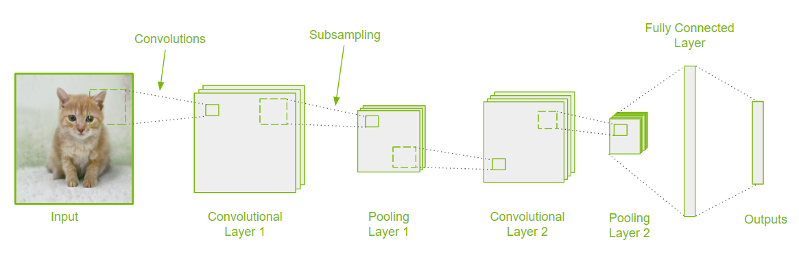

# Image Classification

Image classification is the task of categorizing an image into one of several predefined classes, often also giving a probability of the input belonging to a certain class. This task is crucial in understanding and analyzing images, and it comes quite effortlessly to human beings with our complex visual systems. Most powerful image classification models today are built using some form of Convolution Neural Networks (CNNs), which are also the backbone of many other tasks in Computer Vision.

[Source](https://github.com/NVlabs/stylegan)

In this overview, we will cover
- Types of image Classification
- How does it work?
- How is the performance evaluated?
- Use cases and applications
- Where to get started

---
## Types of image Classification
Image Classification can be broadly divided into either Binary or Multi-class problems depending on the number of categories. Binary image classification problems entail predicting one of two classes. An example of this would be to predict whether an image is that of a dog or not. A subtly different problem is that of single-class (one vs all) classification, where the goal is to recognize data from one class and reject all other. This is beneficial when there is an overabundance of data from one of the classes, also called a class imbalance.

In Multi-class classification problems, models categorize instances into one of three or more categories. Multi-class models often also return confidence scores (or probabilities) of an image belonging to each of the possible classes. This should not be confused with multi-label classification, where a model assigns multiple labels to an instance.

---
## How does it work?
In recent years, Convolutional Neural Networks (CNNs) have led the way to massive breakthroughs in Computer Vision. Most state-of-the-art Image Classification models today employ CNNs in some form. Convolutional Layers are the building blocks of CNNs, and similar to Neural Networks they are composed of neurons that learn parameters like weights and biases.  Most CNNs are composed of many Convolutional layers that work like feature extractors, and coupled with Fully Connected (FC) layers they learn to identify patterns in images to return confidence scores in different categories. 

But what makes Convolutional Networks special? Well, CNNs are built with the assumption that input is in the form of images, and exploiting this fact they can be vastly more efficient than a standard Neural Network for a given level of performance.

Network depth (number of layers) and the number of learnable parameters have been found to be of crucial importance in performance. Top models can typically have over a hundred layers and hundreds of millions of parameters. Much of recent research in visual recognition has been focused around “network engineering”, i.e. designing better architectures, even employing Machine Learning algorithms to search for one, such as in the case of Neural Architecture Search.

---
## How is the performance evaluated?
Image Classification performance is often reported as Top-1 or Top-5  scores. In top-1 score, classification is considered correct if the top predicted class (with the highest predicted probability) matches the true class for a given instance. In top-5, we check if one of the top 5 predictions matches the true class. The score is just the number of correct predictions divided by the total number of instances evaluated.

---
## Use cases and applications
### Categorizing Images  in Large Visual Databases
Businesses with visual databases may accumulate large amounts of images with missing tags or meta-data. Unless there is an effective way to organize such images, they may not be much use at all. On the contrary, they may hog precious storage space. Automated image classification algorithms can classify such untagged images into predefined categories. Businesses can avoid expensive manual labor by employing automated image classification algorithms.

A related task is that of Image Organization in smart devices like mobile phones. With Image Classification techniques, images and videos can be organized for improved accessibility.

### Visual Search
Visual Search or Image-based search has risen to popularity over the recent years. Many prominent search engines already provide this feature where users can search for visual content similar to a provided image. This has many applications in the e-commerce and retail industry where users can take a snap and upload an image of a product they are interested in purchasing. This makes the shopping experience much more efficient for customers, and can increase sales for businesses.

### Healthcare
Medical Imaging is about creating visual images of internal body parts for clinical purposes. This includes health monitoring, medical diagnosis, treatment, and keeping organized records. Image Classification algorithms can play a crucial role in Medical Imaging by assisting medical professionals detect presence of illness and having consistency in clinical diagnosis.

---
## Where to get started?
In this Collection, you will find state-of-the-art implementations of Image Classification models and their containers. A good place to get started with Image Classification is with the [ResNet-50](https://github.com/NVIDIA/DeepLearningExamples/tree/master/PyTorch/Classification/ConvNets/resnet50v1.5) model.

ResNets (Residual Networks) are very popular Convolutional Neural Network architectures built with blocks utilizing skip connections to jump over some layers. As the name suggests, ResNet-50 is a variant that is 50 layers deep! But why do we need these “skip” connections? As it turns out building better CNN architectures is not as simple as stacking more and more layers. In practice, If we just keep adding depth to a CNN, at some point the performance stagnates or may start getting worse. Very deep networks are notoriously difficult to train, because of the vanishing gradient problem. In simpler terms, as the depth increases, repeated multiplications during back-propagation may end up making the gradient vanishingly small. This may prevent weights from changing. In ResNets, the skip connects are meant to act like a “gradient superhighway” allowing the gradient to flow unrestrained thus alleviating the problem of the vanishing gradients. ResNets were very influential in the development of subsequent Convolutional Network architectures, and there is much more to them than the brief summary above!