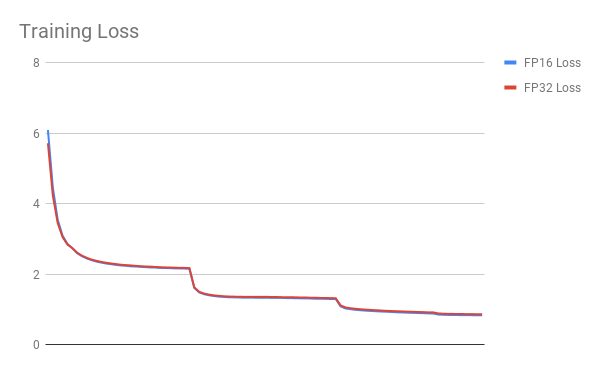

# ResNet50 v1.5

## The model
The ResNet50 v1.5 model is a modified version of the [original ResNet50 v1 model](https://arxiv.org/abs/1512.03385).

The difference between v1 and v1.5 is that, in the bottleneck blocks which requires
downsampling, v1 has stride = 2 in the first 1x1 convolution, whereas v1.5 has stride = 2 in the 3x3 convolution.

This difference makes ResNet50 v1.5 slightly more accurate (~0.5% top1) than v1, but comes with a smallperformance drawback (~5% imgs/sec).

The model is initialized as described in [Delving deep into rectifiers: Surpassing human-level performance on ImageNet classification](https://arxiv.org/pdf/1502.01852.pdf)

## Training procedure

### Optimizer

This model trains for 90 epochs, with standard ResNet v1.5 setup:

* SGD with momentum (0.9)

* Learning rate = 0.1 for 256 batch size, for other batch sizes we lineary
scale the learning rate.

* Learning rate decay - multiply by 0.1 after 30, 60, and 80 epochs

* For bigger batch sizes (512 and up) we use linear warmup of the learning rate
during first 5 epochs
according to [Training ImageNet in 1 hour](https://arxiv.org/abs/1706.02677).

* Weight decay: 1e-4

* We do not apply WD on Batch Norm trainable parameters (gamma/bias)

* Label Smoothing: 0.1


### Data Augmentation

This model uses the following data augmentation:

* For training:
  * Normalization
  * Random resized crop to 224x224
    * Scale from 8% to 100%
    * Aspect ratio from 3/4 to 4/3
  * Random horizontal flip

* For inference:
  * Normalization
  * Scale to 256x256
  * Center crop to 224x224

### Other training recipes

This script does not targeting any specific benchmark.
There are changes that others have made which can speed up convergence and/or increase accuracy.

One of the more popular training recipes is provided by [fast.ai](https://github.com/fastai/imagenet-fast).

The fast.ai recipe introduces many changes to the training procedure, one of which is progressive resizing of the training images.

The first part of training uses 128px images, the middle part uses 224px images, and the last part uses 288px images.
The final validation is performed on 288px images.

Training script in this repository performs validation on 224px images, just like the original paper described.

These two approaches can't be directly compared, since the fast.ai recipe requires validation on 288px images,
and this recipe keeps the original assumption that validation is done on 224px images.

Using 288px images means that a lot more FLOPs are needed during inference to reach the same accuracy.


# Setup
## Requirements

Ensure you meet the following requirements:

* [NVIDIA Docker](https://github.com/NVIDIA/nvidia-docker)
* [PyTorch 18.09-py3 NGC container](https://ngc.nvidia.com/registry/nvidia-pytorch) or newer
* (optional) NVIDIA Volta GPU (see section below) - for best training performance using mixed precision

For more information about how to get started with NGC containers, see the
following sections from the NVIDIA GPU Cloud Documentation and the Deep Learning
DGX Documentation:
* [Getting Started Using NVIDIA GPU Cloud](https://docs.nvidia.com/ngc/ngc-getting-started-guide/index.html)
* [Accessing And Pulling From The NGC Container Registry](https://docs.nvidia.com/deeplearning/dgx/user-guide/index.html#accessing_registry)
* [Running PyTorch](https://docs.nvidia.com/deeplearning/dgx/pytorch-release-notes/running.html#running)

## Training using mixed precision with Tensor Cores

### Hardware requirements
Training with mixed precision on NVIDIA Tensor Cores, requires an
[NVIDIA Volta](https://www.nvidia.com/en-us/data-center/volta-gpu-architecture/)-based GPU.

### Software changes

For information about how to train using mixed precision, see the
[Mixed Precision Training paper](https://arxiv.org/abs/1710.03740)
and
[Training With Mixed Precision documentation](https://docs.nvidia.com/deeplearning/sdk/mixed-precision-training/index.html).

For PyTorch, easily adding mixed-precision support is available from NVIDIA’s
[APEX](https://github.com/NVIDIA/apex), a PyTorch extension, that contains
utility libraries, such as AMP, which require minimal network code changes to
leverage Tensor Core performance.

# Quick start guide

## Geting the data

The ResNet50 v1.5 script operates on ImageNet 1k, a widely popular image classification dataset from ILSVRC challenge.

PyTorch can work directly on JPEGs, therefore, preprocessing/augmentation is not needed.

1. Download the images from http://image-net.org/download-images

2. Extract the training data:
  ```bash
  mkdir train && mv ILSVRC2012_img_train.tar train/ && cd train
  tar -xvf ILSVRC2012_img_train.tar && rm -f ILSVRC2012_img_train.tar
  find . -name "*.tar" | while read NAME ; do mkdir -p "${NAME%.tar}"; tar -xvf "${NAME}" -C "${NAME%.tar}"; rm -f "${NAME}"; done
  cd ..
  ```

3. Extract the validation data and move the images to subfolders:
  ```bash
  mkdir val && mv ILSVRC2012_img_val.tar val/ && cd val && tar -xvf ILSVRC2012_img_val.tar
  wget -qO- https://raw.githubusercontent.com/soumith/imagenetloader.torch/master/valprep.sh | bash
  ```

The directory in which the `train/` and `val/` directories are placed, is referred to as `<path to imagenet>` in this document.

## Running training

To run training for a standard configuration (1/4/8 GPUs, FP16/FP32),
run one of the scripts in the `./examples` directory
called `./examples/RN50_{FP16, FP32}_{1, 4, 8}GPU.sh`.

Ensure imagenet is mounted in the `/data/imagenet` directory.

To run a non standard configuration use:

* For 1 GPU
    * FP32
        `python ./main.py --arch resnet50 -c fanin --label-smoothing 0.1 <path to imagenet>`
    * FP16
        `python ./main.py --arch resnet50 -c fanin --label-smoothing 0.1 --fp16 --static-loss-scale 256 <path to imagenet>`

* For multiple GPUs
    * FP32
        `python ./multiproc.py --nproc_per_node 8 ./main.py --arch resnet50 -c fanin --label-smoothing 0.1 <path to imagenet>`
    * FP16
        `python ./multiproc.py --nproc_per_node 8 ./main.py --arch resnet50 -c fanin --label-smoothing 0.1 --fp16 --static-loss-scale 256 <path to imagenet>`

Use `python ./main.py -h` to obtain the list of available options in the `main.py` script.

## Running inference

To run inference on a checkpointed model run:

`python ./main.py --arch resnet50 --evaluate --resume <path to checkpoint> -b <batch size> <path to imagenet>`

## Benchmarking

### Training performance

To benchmark training, run:

* For 1 GPU
    * FP32
`python ./main.py --arch resnet50 --benchmark-training <path to imagenet>`
    * FP16
`python ./main.py --arch resnet50 --benchmark-training --fp16 --static-loss-scale 256 <path to imagenet>`
* For multiple GPUs
    * FP32
`python ./multiproc.py --nproc_per_node 8 ./main.py --arch resnet50 --benchmark-training <path to imagenet>`
    * FP16
`python ./multiproc.py --nproc_per_node 8 ./main.py --arch resnet50 --benchmark-training --fp16 --static-loss-scale 256 <path to imagenet>`

Each of this scripts will run 1 warmup iteration and measure the next 10 iterations.

To control warmup and benchmark length, use the `--bench-warmup` and `--bench-iterations` flags.

### Inference performance

To benchmark inference, run:

* FP32

`python ./main.py --arch resnet50 --benchmark-inference <path to imagenet>`

* FP16

`python ./main.py --arch resnet50 --benchmark-inference --fp16 <path to imagenet>`

Each of this scripts will run 1 warmup iteration and measure the next 10 iterations.

To control warmup and benchmark length, use `--bench-warmup` and `--bench-iterations` flags.

## Training Accuracy Results

The following results were obtained by running the `./examples/RN50_{FP16, FP32}_{1, 4, 8}GPU.sh` scripts in
the pytorch-18.09-py3 Docker container on NVIDIA DGX-1 with 8 V100 16G GPUs.

| **mixed precision top1** | **FP32 top1**   |
|:------------------------:|:---------------:|
| 76.71 +/- 0.11           | 76.83 +/- 0.11 |

| **number of GPUs** | **mixed precision training time** | **FP32 training time** |
|:------------------:|:---------------------------------:|:----------------------:|
| 1                  | 45.4h                             | 89.2h                  |
| 4                  | 13.5h                             | 25.6h                  |
| 8                  | 8.1h                              | 13.9h                  |

Here are example graphs of FP32 and FP16 training on 8 GPU configuration:




## Training Performance Results

| **number of GPUs** | **mixed precision img/s** | **FP32 img/s** | **mixed precision speedup** | **mixed precision weak scaling** | **FP32 weak scaling** |
|:------------------:|:-------------------------:|:--------------:|:---------------------------:|:--------------------------------:|:---------------------:|
| 1                  | 747.3                     | 363.1          | 2.06                        | 1.00                             | 1.00                  |
| 4                  | 2886.9                    | 1375.5         | 2.1                         | 3.86                             | 3.79                  |
| 8                  | 5815.8                    | 2857.9         | 2.03                        | 7.78                             | 7.87                  |


## Inference Performance Results

| **batch size** | **mixed precision img/s** | **FP32 img/s** |
|:--------------:|:-------------------------:|:--------------:|
|       1 |   131.8 |   134.9 |                                                                                                                                                                                                               │
|       2 |   248.7 |   260.6 |                                                                                                                                                                                                               │
|       4 |   486.4 |   425.5 |                                                                                                                                                                                                               │
|       8 |   908.5 |   783.6 |                                                                                                                                                                                                               │
|      16 |  1370.6 |   998.9 |                                                                                                                                                                                                               │
|      32 |  2287.5 |  1092.3 |                                                                                                                                                                                                               │
|      64 |  2476.2 |  1166.6 |                                                                                                                                                                                                               │
|     128 |  2615.6 |  1215.6 |                                                                                                                                                                                                               │
|     256 |  2696.7 |  N/A    |

# Changelog

1. September 2018
  * Initial release
2. January 2019
  * Added options Label Smoothing, fan-in initialization, skipping weight decay on batch norm gamma and bias.

# Known issues

There are no known issues with this model.
