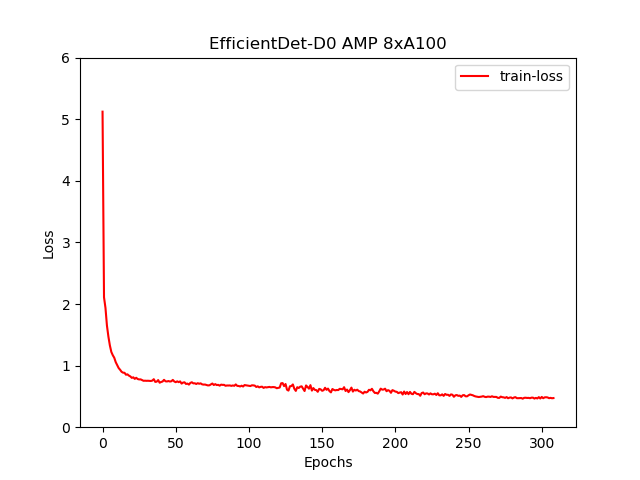

# EfficientDet For PyTorch
This repository provides a script and recipe to train and infer on EfficientDet to achieve state-of-the-art accuracy and is tested and maintained by NVIDIA.
 
## Table Of Contents
* [Model overview](#model-overview)
  * [Model Architecture](#model-architecture)  
  * [Default configuration](#default-configuration)
  * [Feature support matrix](#feature-support-matrix)
    * [Features](#features)
  * [Mixed precision training](#mixed-precision-training)
    * [Enabling mixed precision](#enabling-mixed-precision)
    * [Enabling TF32](#enabling-tf32)
* [Setup](#setup)
  * [Requirements](#requirements)
* [Quick start guide](#quick-start-guide)
* [Advanced](#advanced)
  * [Command-line arguments](#command-line-arguments)
  * [Getting the data](#getting-the-data)
    * [Dataset guidelines](#dataset-guidelines)
  * [Training process](#training-process)
* [Performance](#performance)
  * [Benchmarking](#benchmarking)
    * [Training performance benchmark](#training-performance-benchmark)
    * [Inference performance benchmark](#inference-performance-benchmark)
  * [Results](#results)
    * [Training accuracy results](#training-accuracy-results)
      * [Training accuracy: NVIDIA DGX A100 (8x A100 40GB)](#training-accuracy-nvidia-dgx-a100-8x-a100-40gb)  
      * [Training accuracy: NVIDIA DGX-1 (8x V100 32GB)](#training-accuracy-nvidia-dgx-1-8x-v100-32gb)
      * [Training accuracy: NVIDIA DGX-1 (32x V100 32GB)](#training-accuracy-nvidia-dgx-1-32x-v100-32gb)
      * [Training loss curves](#training-loss-curves)
      * [Training stability test](#training-stability-test)
    * [Training performance results](#training-performance-results)
      * [Training performance: NVIDIA DGX A100 (8x A100 40GB)](#training-performance-nvidia-dgx-a100-8x-a100-40gb)
      * [Training performance: NVIDIA DGX-1 (8x V100 16GB)](#training-performance-nvidia-dgx-1-8x-v100-16gb)
      * [Training performance: NVIDIA DGX-2 (16x V100 32GB)](#training-performance-nvidia-dgx-2-16x-v100-32gb)
    * [Inference performance results](#inference-performance-results)
      * [Inference performance: NVIDIA DGX A100 (1x A100 40GB)](#inference-performance-nvidia-dgx-a100-1x-a100-40gb)
      * [Inference performance: NVIDIA DGX-1 (1x V100 16GB)](#inference-performance-nvidia-dgx-1-1x-v100-16gb)
      * [Inference performance: NVIDIA DGX-2 (1x V100 32GB)](#inference-performance-nvidia-dgx-1-1x-v100-16gb)
* [Release notes](#release-notes)
  * [Changelog](#changelog)
  * [Known issues](#known-issues)
 
## Model overview
 
EfficientDet is a convolution-based neural network for the task of object detection. This model is based on [EfficientDet: Scalable and Efficient Object Detection](https://arxiv.org/abs/1911.09070). NVIDIA's implementation of EfficientDet PyTorch is an optimized version of [TensorFlow Model Garden](https://github.com/tensorflow/models/tree/master/research/object_detection) implementation, leveraging mixed precision arithmetic on NVIDIA Volta, NVIDIA Turing, and the NVIDIA Ampere GPU architectures for faster training times while maintaining target accuracy.
 
The repository also contains scripts to launch training, benchmarking, and inference routines in a Docker container interactively.
 
The major differences between the official implementation of the paper and our version of EfficientDet are as follows:
  - Mixed precision support with [PyTorch AMP](https://github.com/NVIDIA/apex).
  - Multi-node training support.
  - Custom fused CUDA kernels for faster computations.
  - Lightweight logging using [dllogger](https://github.com/NVIDIA/dllogger)
  - PyTorch multi-tensor ops for faster computation.
 
These techniques/optimizations improve model performance and reduce training time by a factor of 1.3x, allowing you to perform more efficient object detection with no additional effort.
 
Other publicly available implementations of EfficientDet include:
  -  [Yet-Another-EfficientDet-Pytorch](https://github.com/zylo117/Yet-Another-EfficientDet-Pytorch)
  -  [rwightman](https://github.com/rwightman/efficientdet-pytorch)
 
### Model architecture
 
EfficientDet is a one-stage detector with the following architecture components:
- ImageNet-pretrained EfficientNet backbone
- Weighted bi-directional feature pyramid network (BiFPN)
- Bounding and classification box head
- A compound scaling method that uniformly scales the resolution, depth, and width for all backbone, feature network, and box/class prediction networks at the same time
 
### Default Configuration
The default configuration of this model can be found at `train.py`. The default hyper-parameters are as follows:
  - General:
    - Base Global Learning Rate set to 0.01
    - Epochs set to 300
    - Local train batch size - 32
    - Local test batch size - 32
 
  - Backbone:
    - Backend network set to EfficientNet-B0
 
This repository implements multi-gpu to support larger batches and mixed precision support. This implementation also includes the following optimizations.
  - Custom CUDA kernels for Focal Loss and NMS.
  - Custom optimized implementation of EMA.
 
    The source files can be found under `effdet/csrc`.
 
### Feature support matrix
 
The model supports the following features.  
 
| **Feature** | **EfficientDet** |
|:---------:|:----------:|
|PyTorch native AMP|Yes|
|PyTorch native DDP|Yes|
|Custom Fused CUDA kernels|Yes|
 
#### Features
 
[PyTorch native AMP](https://pytorch.org/docs/stable/amp.html) is part of PyTorch, which provides convenience methods for mixed precision.
 
[DDP](https://pytorch.org/tutorials/beginner/dist_overview.html) stands for DistributedDataParallel and is used for multi-GPU training.
 
  
### Mixed precision training
 
Mixed precision is the combined use of different numerical precisions in a computational method. [Mixed precision](https://arxiv.org/abs/1710.03740) training offers significant computational speedup by performing operations in half-precision format while storing minimal information in single-precision to retain as much information as possible in critical parts of the network. Since the introduction of [tensor cores](https://developer.nvidia.com/tensor-cores) in NVIDIA Volta, and following with both the NVIDIA Turing and NVIDIA Ampere Architectures, significant training speedups are observed by switching to mixed precision—up to 3x overall speedup on the most arithmetically intense model architectures. Using mixed precision training requires two steps:
 
1.  Porting the model to use the FP16 data type where appropriate.
    
2.  Adding loss scaling to preserve small gradient values.
    
 
  
 
For information about:
 
-   How to train using mixed precision, refer to the [Mixed Precision Training](https://arxiv.org/abs/1710.03740) paper and [Training With Mixed Precision](https://docs.nvidia.com/deeplearning/sdk/mixed-precision-training/index.html) documentation.
    
-   Techniques used for mixed precision training, refer to the [Mixed-Precision Training of Deep Neural Networks](https://devblogs.nvidia.com/mixed-precision-training-deep-neural-networks/) blog.
    
 
NVIDIA Apex tools for mixed precision training, refer to the [NVIDIA Apex: Tools for Easy Mixed-Precision Training in PyTorch](https://devblogs.nvidia.com/apex-pytorch-easy-mixed-precision-training/).
  
 
#### Enabling mixed precision
 
In this repository, mixed precision training is enabled by the [PyTorch native AMP](https://pytorch.org/docs/stable/amp.html) library. PyTorch has an automatic mixed precision module that allows mixed precision to be enabled with minimal code changes.
 
Automatic mixed precision can be enabled with the following code changes: 
 
```
  # Create gradient scaler
  scaler = torch.cuda.amp.GradScaler(enabled=args.amp)
 
  # Wrap the forward pass and loss in torch.cuda.amp.autocast
  with torch.cuda.amp.autocast(enabled=args.amp):
    output = model(input, target)
    loss = output['loss']
```
 
Where `args.amp` is the flag to turn on or off AMP. Shell scripts all have a positional argument `--amp` available to enable mixed precision training.
 
#### Enabling TF32
 
 
TensorFloat-32 (TF32) is the new math mode in [NVIDIA A100](https://www.nvidia.com/en-us/data-center/a100/) GPUs for handling the matrix math, also called tensor operations. TF32 running on Tensor Cores in A100 GPUs can provide up to 10x speedups compared to single-precision floating-point math (FP32) on NVIDIA Volta GPUs. 
 
TF32 Tensor Cores can speed up networks using FP32, typically with no loss of accuracy. It is more robust than FP16 for models that require a high dynamic range for weights or activations.
 
For more information, refer to the [TensorFloat-32 in the A100 GPU Accelerates AI Training, HPC up to 20x](https://blogs.nvidia.com/blog/2020/05/14/tensorfloat-32-precision-format/) blog post.
 
TF32 is supported in the NVIDIA Ampere GPU architecture and is enabled by default.
 
 
## Setup
The following sections list the requirements in order to start training the EfficientDet model.
 
### Requirements
 
This repository contains `Dockerfile` which extends the PyTorch NGC container and encapsulates some dependencies.  Aside from these dependencies, ensure you have the following components:
  - [NVIDIA Docker](https://github.com/NVIDIA/nvidia-docker)
  - [PyTorch 21.06-py3 NGC container](https://ngc.nvidia.com/registry/nvidia-pytorch)
  - Supported GPUs:
  - [NVIDIA Volta architecture](https://www.nvidia.com/en-us/data-center/volta-gpu-architecture/)
  - [NVIDIA Turing architecture](https://www.nvidia.com/en-us/geforce/turing/)
  - [NVIDIA Ampere architecture](https://www.nvidia.com/en-us/data-center/nvidia-ampere-gpu-architecture/)
 
  For more information about how to get started with NGC containers, refer to the
  following sections from the NVIDIA GPU Cloud Documentation and the Deep Learning
  Documentation:
  - [Getting Started Using NVIDIA GPU Cloud](https://docs.nvidia.com/ngc/ngc-getting-started-guide/index.html)
  - [Accessing And Pulling From The NGC Container Registry](https://docs.nvidia.com/deeplearning/dgx/user-guide/index.html#accessing_registry)
  - [Running PyTorch](https://docs.nvidia.com/deeplearning/dgx/pytorch-release-notes/running.html#running)
 
For those unable to use the [Pytorch](https://ngc.nvidia.com/catalog/containers/nvidia:pytorch) NGC container, to set up the required environment or create your own container, refer to the versioned [NVIDIA Container Support Matrix](https://docs.nvidia.com/deeplearning/frameworks/support-matrix/index.html).
 
 
## Quick Start Guide
To train your model using mixed or TF32 precision with Tensor Cores or using FP32, perform the following steps using the default parameters of the EfficientDet on the COCO 2017 dataset. For the specifics concerning training and inference, refer to the [Advanced](#advanced) section.
 
 
### 1. Clone the repository.
```
git clone https://github.com/NVIDIA/DeepLearningExamples.git
cd DeepLearningExamples/PyTorch/Detection/EfficientDet
```
 
### 2. Download and preprocess the dataset.
This repository provides scripts to download and extract the COCO 2017 dataset.  Data will be downloaded to the `current working` directory on the host and extracted to a user-defined directory
 
To download, verify, and extract the COCO dataset, use the following scripts:
  ```
  ./download_dataset.sh <data/dir>
  ```
By default, the data is organized into the following structure:
  ```
  <data/dir>
    annotations/
      instances_train2017.json
      instances_val2017.json
    train2017/
      COCO_train2017_*.jpg
    val2017/
      COCO_val2017_*.jpg
  ```
 
### 3. Build the EfficientDet PyTorch NGC container.
```
bash scripts/docker/build.sh
```
 
### 4. Start an interactive session in the NGC container to run training/inference.
After you build the container image, you can start an interactive CLI session with  
```
bash scripts/docker/launch.sh
```
The `launch.sh` script requires that the location on the dataset is specified in the script.
 
 
### 5. Start training.
```
bash ./scripts/D0/train_{AMP, FP32, TF32}_8x{V100-32G, A100-80G}.sh
```
The training scripts train an EfficientDet-D0 model and performs evaluation on the COCO 2017 dataset. By default, the training script run training on standard configuration (DGX A100/DGX-1 V100, AMP/FP32/TF32, 300 epochs). Run one of the scripts in `./scripts/D0` directory using `bash ./scripts/D0/train_{AMP, FP32, TF32}_8x{V100-32G, A100-80G}.sh`. Ensure COCO-2017 is mounted in `/workspace/object_detection/datasets/coco` and EfficientNet-B0 backbone weights are mounted in `/backbone_checkpoints`. The backbone checkpoint can be downloaded from [this](https://ngc.nvidia.com/catalog/models/nvidia:efficientdet_backbone_efficientnet_b0_pyt_amp_ckpt) location.
 
### 6. Start validation/evaluation.

To run validation/evaluation for a standard configuration (DGX A100/DGX-1 V100, AMP/TF32/FP32, EfficientDet-D0),
run one of the scripts in the `./scripts/D0` directory using `bash ./scripts/D0/validation_{AMP, FP32, TF32}_8x{A100-80G, V100-16G, V100-32G}.sh`.
Ensure COCO-2017 is mounted in `/workspace/object_detection/datasets/coco`.
(Optional) Mount the checkpoint in the `/checkpoints` location to evaluate on a checkpoint and in the script add the path to the checkpoint as `--checkpoint /checkpoints/<NAME OF CHECKPOINT>`.

 
### 7. Start inference/predictions.
 
Model predictions can be obtained on a test dataset and a model checkpoint by running the  `scripts/D0/inference_{AMP, FP32, TF32}_{A100-80G, V100-32G}.sh` script. The script requires:
  - the location of the checkpoint folder and dataset to be specified and present within/mounted to the container.
  - number of GPUs to run inference on.
 
For example:
```
NUM_PROC=<number_of_processes> CKPT_PATH=<checkpoint_path> BATCH_SIZE=<batch_size> bash scripts/inference_{AMP, FP32, TF32}_{A100-80G, V100-32G}.sh
```
 
Model prediction files get saved in the `--results` path if provided; otherwise,  they will be saved in the current working directory.

 
To perform just inference and skip computation of mAP scores, use the `--inference` flag.
 
## Advanced
The following sections provide greater details of the dataset, running training and inference, and the training results.
 
### Scripts and sample code
 
 
Descriptions of the key scripts and folders are provided below.
 
  
 
-   effdet - Contains code to build individual components of the model such as backbone, FPN, RPN, classification and bbox heads, and so on.
-   data - Contains code to build the data pipeline such as dataloader, transforms, dataset builder.
-   download_dataset.sh - Launches download and processing of required datasets. `dtrx` package needs to be installed for this script to run without errors. 
    
-   scripts/ - Contains shell scripts to launch training and evaluation of the model and perform inferences.
    
 
  	-   D0/train_{AMP, TF32, FP32}_8x{V100-32G, A100-80G}.sh - Launches model training
      
  	-   D0/evaluation_{AMP, FP32, TF32}_8x{A100-80G, V100-16G, V100-32G}.sh  - Performs inference and computes mAP of predictions.
      
  	-   docker/ - Scripts to build the docker image and to start an interactive session.   
    
-   utils/
    - Contains utility components like samplers, EMA, optimizers, schedulers, and so on.

- train.py - End to end to script to load data, build and train the model.
- validate.py - End to end script to load data, checkpoint and perform inference and compute mAP score.
 
 
### Parameters

#### train.py script parameters

Important parameters for training are listed below with defaults.

  
### Command-line options
 
To display the full list of available options and their descriptions, use the -h or --help command-line option, for example:

- `data` - Path to coco dataset
- `model` - Name of the model to train (default: "efficientdet_d0")
- `lr` - Learning rate
- `epochs` - Maximum number of epochs to train for
- `warmup-epochs` - Epochs to warmup LR, if scheduler supports
- `batch-size` - Input batch size
 
  
 
`python train.py --help` will give all the command-line parameters specific to `train.py`:

```
--model MODEL         Name of the model to train (default: "countception"
  --redundant-bias      Override model config for redundant bias
  --no-redundant-bias   Override model config for redundant bias
  --pretrained          Start with the pretrained version of a specified network (if avail)
  --pretrained-backbone-path PATH
                        Start from pre-trained backbone weights.
  --initial-checkpoint PATH
                        Initialize model from this checkpoint (default: none)
  --resume              Resume full model and optimizer state from checkpoint (default: False)
  --no-resume-opt       Prevent resume of optimizer state when resuming model
  --interpolation NAME  Image resize interpolation type (overrides model)
  --fill-color NAME     Image augmentation fill (background) color ("mean" or int)
  -b N, --batch-size N  input batch size for training (default: 32)
  -vb N, --validation-batch-size-multiplier N
                        ratio of validation batch size to training batch size (default: 1)
  --input_size PCT      Image size (default: None) if this is not set default model image size is taken
  --drop PCT            Dropout rate (default: 0.)
  --clip-grad NORM      Clip gradient norm (default: 10.0)
  --opt OPTIMIZER       Optimizer (default: "momentum"
  --opt-eps EPSILON     Optimizer Epsilon (default: 1e-3)
  --momentum M          SGD momentum (default: 0.9)
  --weight-decay WEIGHT_DECAY
                        weight decay (default: 0.00004)
  --sched SCHEDULER     LR scheduler (default: "step"
  --lr LR               learning rate (default: 0.01)
  --lr-noise pct, pct [pct, pct ...]
                        learning rate noise on/off epoch percentages
  --lr-noise-pct PERCENT
                        learning rate noise limit percent (default: 0.67)
  --lr-noise-std STDDEV
                        learning rate noise std-dev (default: 1.0)
  --lr-cycle-mul MULT   learning rate cycle len multiplier (default: 1.0)
  --lr-cycle-limit N    learning rate cycle limit
  --warmup-lr LR        warmup learning rate (default: 0.0001)
  --min-lr LR           lower lr bound for cyclic schedulers that hit 0 (1e-5)
  --epochs N            number of epochs to train (default: 2)
  --start-epoch N       manual epoch number (useful on restarts)
  --decay-epochs N      epoch interval to decay LR
  --warmup-epochs N     epochs to warmup LR, if scheduler supports
  --cooldown-epochs N   epochs to cooldown LR at min_lr, after cyclic schedule ends
  --patience-epochs N   patience epochs for Plateau LR scheduler (default: 10
  --decay-rate RATE, --dr RATE
                        LR decay rate (default: 0.1)
  --mixup MIXUP         mixup alpha, mixup enabled if > 0. (default: 0.)
  --mixup-off-epoch N   turn off mixup after this epoch, disabled if 0 (default: 0)
  --smoothing SMOOTHING
                        label smoothing (default: 0.0)
  --train-interpolation TRAIN_INTERPOLATION
                        Training interpolation (random, bilinear, bicubic default: "random")
  --sync-bn             Enable NVIDIA Apex or Torch synchronized BatchNorm.
  --dist-bn DIST_BN     Distribute BatchNorm stats between nodes after each epoch ("broadcast", "reduce", or "")
  --model-ema           Enable tracking moving average of model weights
  --model-ema-decay MODEL_EMA_DECAY
                        decay factor for model weights moving average (default: 0.9998)
  --dist-group-size DIST_GROUP_SIZE
                        Group size for sync-bn
  --seed S              random seed (default: 42)
  --log-interval N      how many batches to wait before logging training status
  --eval-after N        Start evaluating after eval-after epochs
  --benchmark           Turn this on when measuring performance
  --benchmark-steps N   Run training for this number of steps for performance measurement
  --dllogger-file PATH  File name of dllogger json file (default: log.json, current dir)
  --save-checkpoint-interval N
                        Save checkpoints after so many epochs
  -j N, --workers N     how many training processes to use (default: 1)
  --amp                 use NVIDIA amp for mixed precision training
  --no-pin-mem          Disable pin CPU memory in DataLoader.
  --no-prefetcher       disable fast prefetcher
  --output PATH         path to the output folder (default: none, current dir)
  --eval-metric EVAL_METRIC
                        Best metric (default: "map"
  --local_rank LOCAL_RANK
  --memory-format {nchw,nhwc}
                        memory layout, nchw or nhwc
  --fused-focal-loss    Use fused focal loss for better performance.
  --waymo               Train on Waymo dataset or COCO dataset. Default: False (COCO dataset)
  --num_classes PCT     Number of classes the model needs to be trained for (default: None)
  --remove-weights [REMOVE_WEIGHTS [REMOVE_WEIGHTS ...]]
                        Remove these weights from the state dict before loading checkpoint (use case can be not loading heads)
  --freeze-layers [FREEZE_LAYERS [FREEZE_LAYERS ...]]
                        Freeze these layers
  --waymo-train-annotation WAYMO_TRAIN_ANNOTATION
                        Absolute Path to waymo training annotation (default: "None")
  --waymo-val-annotation WAYMO_VAL_ANNOTATION
                        Absolute Path to waymo validation annotation (default: "None")
  --waymo-train WAYMO_TRAIN
                        Path to waymo training relative to waymo data (default: "None")
  --waymo-val WAYMO_VAL
                        Path to waymo validation relative to waymo data (default: "None")
```
 
 
### Getting the data
By default, the EfficientDet model is trained on the [COCO 2017](http://cocodataset.org/#download) dataset.  This dataset comes with a training and validation set.  
 
This repository contains the `./download_dataset.sh` scripts that automatically downloads and preprocesses the training and validation sets.
 
#### Dataset guidelines
 
This repository contains the `./download_dataset.sh` scripts that automatically downloads and preprocesses the training and validation sets.

This repository also provides support for fine-tuning and evaluating on Waymo dataset.
In order to run on the Waymo dataset, ensure your dataset is present/mounted to the Docker container and the dataset is in COCO format. For that, this repository has scripts to download, preprocess and convert Waymo dataset into COCO format, which is ingestible by EfficientDet.

- `waymo_tool/waymo_data_converter.py` - downloads and converts the data into COCO format

Since the original Waymo dataset is in TFRecords format, to convert it into COCO format, Tensorflow needs to be installed.
 
### Training Process
Training is performed using the `train.py` script. The default parameters can be overridden by command-line arguments.
 
The training process can start from scratch or resume from a checkpoint.

By default, bash script `scripts/D0/train_{AMP, FP32, TF32}_8x{A100-80G, V100-32G}.sh` will start the training process from scratch with the following settings.
   - Use 8 GPUs
   - Saves checkpoints after every 10 epochs to `/workspace/output/` folder
   - AMP or FP32 or TF32 based on the folder `scripts/D0/train_{AMP, FP32, TF32}_8x{A100-80G, V100-32G}.sh`

To resume from a checkpoint, include `--resume` in the command-line and place the checkpoint into `/workspace/output/`.


#### Multi-node

Multi-node runs can be launched on a Pyxis/enroot Slurm cluster (see [Requirements](#requirements)) with the `./scripts/D0/train_{AMP, FP32}_32xV100-32G.sub` script with the following command for a 4-node NVIDIA DGX V100 example:

```
sbatch N 4 --ntasks-per-node=8 ./scripts/D0/train_{AMP, FP32}_32xV100-32G.sub
```
 
Note that the `./scripts/D0/train_{AMP, FP32}_32xV100-32G.sub` script is a starting point that has to be adapted depending on the environment. In particular, variables such as `--container-image` handle the container image to train using, and `datadir` handle the location of the COCO-2017 data. The backbone (EfficientNet) weights need to be put in `/backbone_checkpoints`.
 
Refer to the files contents to view  the full list of variables to adjust for your system.

 
## Performance
 
### Benchmarking
Benchmarking can be performed for both training and inference. Both the scripts run the EfficientDet model. You can specify whether benchmarking is performed in AMP, TF32, or FP32 by specifying it as an argument to the benchmarking scripts.
 
#### Training performance benchmark
Training benchmarking can be performed by running the script:
```
scripts/D0/train-benchmark_{AMP, TF32, FP32}_{V100-32G, A100-80G}.sh
```
 
#### Inference performance benchmark
Inference benchmarking can be performed by running the script:
```
scripts/D0/inference_{AMP, FP32, TF32}_{A100-80G, V100-32G}.sh
```
 
### Results
The following sections provide details on how we achieved our performance and accuracy in training and inference.
#### Training Accuracy Results
 
##### Training accuracy: NVIDIA DGX A100 (8x A100 80GB)
 
Our results were obtained by running the `scripts/D0/train_{AMP, TF32}_8xA100-80G.sh` training script in the 21.06-py3 NGC container on NVIDIA DGX A100 (8x A100 80GB) GPUs with no intermediate evaluation.
 
| GPUs     | BBOX mAP - TF32 | BBOX mAP - FP16|  Time to train - TF32  |  Time to train - mixed precision | Time to train - speedup (TF32 to mixed precision)
| --| --| -- | -- | -- | --
| 8 | 0.3399 | 0.3407 | 8.57 | 6.5 | 1.318
 
##### Training accuracy: NVIDIA DGX-1 (8x V100 32GB)

Our results were obtained by running the `scripts/D0/train_{AMP, FP32}_8xV100-32G.sh`  training script in the PyTorch 21.06-py3 NGC container on NVIDIA DGX-1 with 8x V100 32GB GPUs with no intermediate evaluation.
 
| GPUs    | BBOX mAP - FP32| BBOX mAP - FP16|   Time to train - FP32  |  Time to train - mixed precision | Time to train - speedup (FP32 to mixed precision)
| --| --  | -- | -- | -- | --
| 8 | 0.3410 | 0.3413 | 16 | 10.5 | 1.52

##### Training accuracy: NVIDIA DGX-1 (32x V100 32GB)
 
Our results were obtained by running the `scripts/D0/train_{AMP, FP32}_32xV100-32G.sh`  training script in the PyTorch 21.06-py3 NGC container on NVIDIA DGX-1 with 32x V100 32GB GPUs with no intermediate evaluation.

 
| GPUs    | BBOX mAP - FP32| BBOX mAP - FP16|   Time to train - FP32  |  Time to train - mixed precision | Time to train - speedup (FP32 to mixed precision)
| --| --  | -- | -- | -- | --
| 32 | 0.3418 | 0.3373 | 6 | 4.95 | 1.22
 

##### Training accuracy on Waymo dataset: NVIDIA DGX A100 (8x A100 80GB)
 
Our results were obtained by running the `scripts/waymo/train_waymo_AMP_8xA100-80G.sh` training script in the 21.06-py3 NGC container on the Waymo dataset on NVIDIA DGX A100 (8x A100 80GB) GPUs with no intermediate evaluation. These results were obtained by training the EfficientDet-D0 model with a frozen backbone.
 
| category   | mAP    | category   | AP @ IoU 0.7   | category   | AP @ IoU 0.5   | category   | AP @ IoU 0.5   |
|:-----------|:-------|:-----------|:---------------|:-----------|:---------------|:-----------|:---------------|
| L2_ALL_NS  | 50.377 | Vehicle    | 50.271         | Pedestrian | 61.788         | Cyclist    | 39.072         |
 

The following results were obtained by training the EfficientDet-D0 model without freezing any part of the architecture. This can be done by removing the `--freeze_layer` argument from the script.

| category   | mAP    | category   | AP @ IoU 0.7   | category   | AP @ IoU 0.5   | category   | AP @ IoU 0.5   |
|:-----------|:-------|:-----------|:---------------|:-----------|:---------------|:-----------|:---------------|
| L2_ALL_NS  | 51.249 | Vehicle    | 51.091         | Pedestrian | 62.816         | Cyclist    | 39.841         |


##### Training loss curves
 

 
Here, multihead loss is simply the weighted sum of losses on the classification head and the bounding box head.
 
 
##### Training Stability Test
The following tables compare mAP scores across five different training runs with different seeds.  The runs showcase consistent convergence on all five seeds with very little deviation.
 
| **Config** | **Seed 1** | **Seed 2** | **Seed 3** |  **Seed 4** | **Seed 5** | **Mean** | **Standard Deviation** |
| --- | --- | ----- | ----- | --- | --- | ----- | ----- |
|  8 GPUs, final AP BBox  | 0.3422 | 0.3379 | 0.3437 | 0.3424  | 0.3402 | 0.3412 | 0.002 |
 
#### Training Performance Results
 
##### Training performance: NVIDIA DGX A100 (8x A100 80GB)
 
Our results were obtained by running the `scripts/D0/train_benchmark_{AMP, TP32}_8xA100-80G.sh` training script in the 21.06-py3 NGC container on NVIDIA DGX A100 (8x A100 80GB) GPUs. Performance numbers in images per second were averaged over an entire training epoch.
 
| GPUs  | Throughput - TF32    | Throughput - mixed precision    | Throughput speedup (TF32 - mixed precision)   | Weak scaling - TF32    | Weak scaling - mixed precision
| --- | ----- | ----- | --- | --- | ----- |
| 1 | 170 | 255 | 1.5 | 1 | 1 |
| 4 | 616 | 866 | 1.4 | 3.62 | 3.39 |
| 8 | 1213 | 1835 | 1.5 | 7.05 | 7.05 |
 
##### Training performance: NVIDIA DGX-1 (8x V100 32GB)
 
Our results were obtained by running the `scripts/D0/train_benchmark_{AMP, FP32}_8xV100-32G.sh` training script in the 21.06-py3 NGC container on NVIDIA DGX-1 with (8x V100 32GB) GPUs. Performance numbers in images per second were averaged over an entire training epoch.
 
| GPUs  | Throughput - FP32    | Throughput - mixed precision    | Throughput speedup (FP32 - mixed precision)   | Weak scaling - FP32    | Weak scaling - mixed precision |
| --- | ----- | ----- | --- | --- | ----- |
| 1 | 110 | 186 | 1.69 | 1 | 1 |
| 4 | 367 | 610 | 1.66 | 3.33 | 3.28 |
| 8 | 613 | 1040 | 1.69 | 5.57 | 5.59 |
 
 
To achieve similar results, follow the steps in the [Quick Start Guide](#quick-start-guide).
 
#### Inference performance results
 
##### Inference performance: NVIDIA DGX A100 (1x A100 40GB)
 
Our results were obtained by running the `scripts/inference_{AMP, TF32}_A100-80G.sh` training script in the PyTorch 21.06-py3 NGC container on NVIDIA DGX A100 (1x A100 80GB) GPU.
 
| GPUs   | Batch size / GPU   | Throughput - TF32    | Throughput - mixed precision    | Throughput speedup (TF32 - mixed precision)
| --- | --- | ----- | ----- | ----- |
|  1  | 8 | 45.61 | 50.23 | 1.101 |
 
To achieve similar results, follow the steps in the [Quick Start Guide](#quick-start-guide).

##### Inference performance: NVIDIA DGX-1 (1x V100 32GB)
 
Our results were obtained by running the `scripts/inference_{AMP, FP32}_V100-32G.sh` training script in the PyTorch 21.06-py3 NGC container on NVIDIA DGX-1 with 1x V100 32GB GPUs. Performance numbers (in items/images per second) were averaged over an entire training epoch.
 
| GPUs   | Batch size / GPU   | Throughput - FP32    | Throughput - mixed precision    | Throughput speedup (FP32 - mixed precision)
| --- | --- | ----- | ----- | ----- |
|  1  | 8 | 38.81 | 42.25 | 1.08 |
 
To achieve these same results, follow the steps in the [Quick Start Guide](#quick-start-guide).
 
## Release notes
 
### Changelog
 
July 2021
- Initial Release
 
### Known Issues
There are no known issues with this model.
