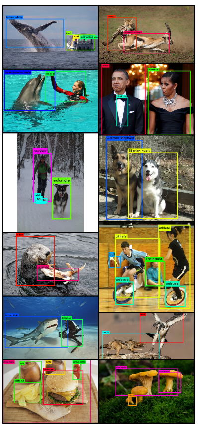
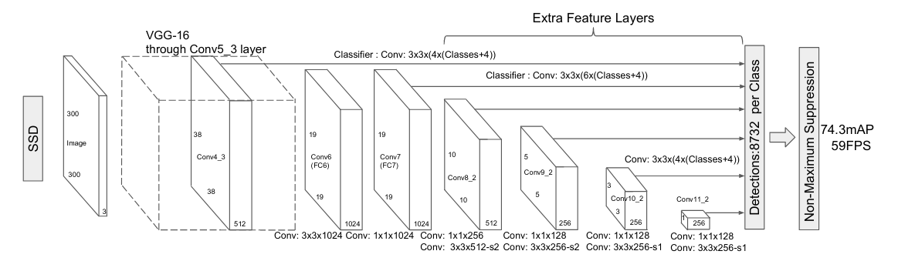

# Object Detection

A natural progression from image classification would be classification and localization of the subject of the image. We can take this idea one step further and localize objects in a given image. Simply put, object detection refers to identifying which object(s) are there in an image.

Source: [Joseph Redmon, Ali Farhadi, “YOLO9000:Better, Faster, Stronger”](https://arxiv.org/abs/1612.08242)

## Introduction to Object Detection
In this section we will try to answer the following questions: 
- What is object detection?
- Why is object detection important?

Object Detection is about not only detecting the presence and location of objects in images and videos, but also categorizing them into everyday objects. Oftentimes, there is a confusion between Image Classification and Object Detection. Simply put, the difference between them is the same as the difference between saying “This is a cat” and pointing to a cat and saying “There is the cat”.

To build autonomous systems, perception is the main challenge to be solved. Perception, in terms of autonomous systems refers to the ability of understanding the surroundings of the autonomous agent. This means that the agent needs to be able to figure out where and what objects are in its immediate vicinity.  

Object detection can help keep humans away from toxic environments and hazardous situations. Challenges like garbage segregation, oil rig monitoring, nightly surveillance, cargo port maintenance and other high risk applications can be aided by robots/cameras which can detect objects. Essentially, any environment that requires visual inspection or analysis and is too dangerous for humans, object detection pipelines can be used to shield from any onsite hazard.

## How does it work?
While this has been a topic of research since before Deep Learning became mainstream, the best performing models today use one or more Deep Neural Networks. 

Many architectures have networks pretrained on a different, simpler task, like Image Classification. As one can imagine, the inputs to this task can be images or videos, and the outputs are usually a set of bounding box coordinates that enclose each of the detected objects, as well as a class label for each detected object. With advances in research and the use of GPUs, it is possible to have object detection in real time with really impressive accuracies!

Source: [Wei Liu, Dragomir Anguelov, Dumitru Erhan, Christian Szegedy, Scott Reed, Cheng-Yang Fu, Alexander C. Berg, “SSD: Single Shot MultiBox Detector”](https://arxiv.org/abs/1512.02325)

Single Shot Detector(SSD) is one of the state-of-the-art models for object detection and localization. It is based on a feed-forward convolutional neural network which always yields a fixed set of bounding boxes and a confidence score which represents how confident the network is about the bounding box containing an object. This is followed by a non maximum suppression step which outputs the final detections. 

This network can be understood as two networks stacked on top of each other. The first network is a simple convolutional neural network which “extracts important features” which is the same as the image classification networks.

The second network is a multiscale feature map network built using another set of convolutional layers which are progressively smaller in size to allow detections on multiple scales. Simply put, the progressively smaller layers help detect objects of different sizes. Each layer in this set of layers outputs a number of detections and the final layer passes the output to a non maxima suppression which yields a final set of detections.

This Collection contains models and containers for object detection achieving state-of-the-art accuracies, tested and maintained by Nvidia.

## Applications and Use cases

### Autonomous Vehicles
Autonomous vehicles need to perceive and interact with real world objects in order to blend in with the environment. For instance a self-driving car needs to detect other vehicles, pedestrians, objects on the road, traffic signals and any and all obstacles on road and also understand the exact location of these objects. This perception information helps the agent avoid obstacles and understand how to interact with objects like traffic lights.

### Warehouses
Warehouses have many conveyor belts and segregation platforms. These tasks have traditionally been handled manually. As factories and warehouses scale, manually sorting and managing inventory cannot be scaled proportionally. Object detection pipelines deployed on robots can reduce operational friction and enable easy scale up solutions for businesses. 

### Surveillance
Surveillance systems typically accumulate large volumes of video data which needs to be analyzed for all sorts of anomalies. Given the number of video sources even a small store has, analysing surveillance data from a large operation is a challenge. Object detection networks can help automate much of the pipeline to highlight sections where there is an object of interest. It can also be trained to identify anomalies in video streams.

### Hazardous tasks
Humans work at waste processing plants, nuclear power plants, oil rigs and around heavy machinery, which tend to be extremely hazardous and dangerous which pose health risks. These tasks essentially require human presence for visual tasks and confirmations which revolve around recognizing objects and relaying locations of objects. Risky tasks like these can be completed with a help of a object detection pipeline deployed on a camera or a robot which can reduce operational risks and costs.