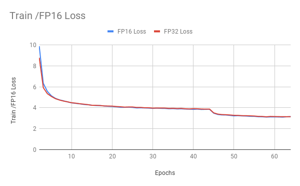
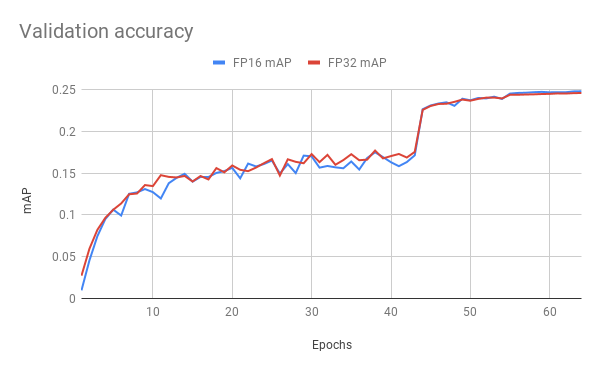

# SSD300 v1.1 For PyTorch

## Table Of Contents
* [The model](#the-model)
  * [Default configuration](#default-configuration)
* [Setup](#setup)
  * [Requirements](#requirements)
* [Quick start guide](#quick-start-guide)
* [Details](#details)
  * [Command line arguments](#command-line-arguments)
  * [Getting the data](#getting-the-data)
  * [Training process](#training-process)
    * [Data preprocessing](#data-preprocessing)
    * [Data augmentation](#data-augmentation)
  * [Enabling mixed precision](#enabling-mixed-precision)
* [Benchmarking](#benchmarking)
  * [Training performance benchmark](#training-performance-benchmark)
  * [Inference performance benchmark](#inference-performance-benchmark)
* [Results](#results)
  * [Training accuracy results](#training-accuracy-results)
  * [Training performance results](#training-performance-results)
  * [Inference performance results](#inference-performance-results)
* [Changelog](#changelog)
* [Known issues](#known-issues)

## The model
The SSD300 v1.1 model is based on the
[SSD: Single Shot MultiBox Detector](https://arxiv.org/abs/1512.02325) paper, which
describes SSD as “a method for detecting objects in images using a single deep neural network".
The input size is fixed to 300x300.

The main difference between this model and the one described in the paper is in the backbone.
Specifically, the VGG model is obsolete and is replaced by the ResNet-50 model.

From the
[Speed/accuracy trade-offs for modern convolutional object detectors](https://arxiv.org/abs/1611.10012)
paper, the following enhancements were made to the backbone:
*   The conv5_x, avgpool, fc and softmax layers were removed from the original classification model.
*   All strides in conv4_x are set to 1x1. 

The backbone is followed by 5 additional convolutional layers.
In addition to the convolutional layers, we attached 6 detection heads:
*   The first detection head is attached to the last conv4_x layer.
*   The other five detection heads are attached to the corresponding 5 additional layers.

Detector heads are similar to the ones referenced in the paper, however,
they are enhanced by additional BatchNorm layers after each convolution.

 
Additionally, we removed weight decay on every bias parameter and
all the BatchNorm layer parameters as described in the
[Highly Scalable Deep Learning Training System with Mixed-Precision: 
Training ImageNet in Four Minutes](https://arxiv.org/abs/1807.11205) paper. 

This model trains with mixed precision tensor cores on Volta, therefore you can get results much faster than training without tensor cores.
This model is tested against each NGC monthly container release to ensure
consistent accuracy and performance over time.

Because of these enhancements, the SSD300 v1.1 model achieves higher accuracy.

Training of SSD requires computational costly augmentations. To fully utilize GPUs during training we are using [NVIDIA DALI](https://github.com/NVIDIA/DALI) library to accelerate data preparation pipeline.


### Default configuration
We trained the model for 65 epochs with the following setup:
*	SGD with momentum (0.9)
*	Learning rate = 2.6e-3 * number of GPUs * (batch_size / 32)
*	Learning rate decay – multiply by 0.1 before 43 and 54 epochs
*	We use linear warmup of the learning rate during the first epoch. For more information, see the
 [Accurate, Large Minibatch SGD: Training ImageNet in 1 Hour](https://arxiv.org/abs/1706.02677) paper.
To enable warmup provide argument the `--warmup 300`
*	Weight decay:
    *	0 for BatchNorms and biases
	*   5e-4 for other layers
	
**Note**: The learning rate is automatically scaled (in other words, mutliplied by the number of GPUs and multiplied by the batch size divided by 32).

## Setup
The following section list the requirements in order to start training the SSD300 v1.1 model.


### Requirements
This repository contains `Dockerfile` which extends the PyTorch 19.03 NGC container and encapsulates some dependencies.  Aside from these dependencies, ensure you have the following software:
* [NVIDIA Docker](https://github.com/NVIDIA/nvidia-docker)
* [PyTorch 19.03-py3 NGC container](https://ngc.nvidia.com/registry/nvidia-pytorch)
* [NVIDIA Volta based GPU](https://www.nvidia.com/en-us/data-center/volta-gpu-architecture/)

For more information about how to get started with NGC containers, see the
following sections from the NVIDIA GPU Cloud Documentation and the Deep Learning
Documentation:
* [Getting Started Using NVIDIA GPU Cloud](https://docs.nvidia.com/ngc/ngc-getting-started-guide/index.html)
* [Accessing And Pulling From The NGC Container Registry](https://docs.nvidia.com/deeplearning/dgx/user-guide/index.html#accessing_registry)
* [Running PyTorch](https://docs.nvidia.com/deeplearning/dgx/pytorch-release-notes/running.html#running)


## Quick Start Guide
To train your model using mixed precision with Tensor Cores, perform the
following steps using the default parameters of the SSD v1.1 model on the
[COCO 2017](http://cocodataset.org/#download) dataset.

### 1. Download and preprocess the dataset.

Extract the COCO 2017 dataset with `download_dataset.sh $COCO_DIR`.
Data will be downloaded to the `$COCO_DIR` directory (on the host).

### 2. Build the SSD300 v1.1 PyTorch NGC container.

` docker build . -t nvidia_ssd `

### 3. Launch the NGC container to run training/inference.
`nvidia-docker run --rm -it --ulimit memlock=-1 --ulimit stack=67108864 -v $COCO_DIR:/coco --ipc=host nvidia_ssd`


**Note**: the default mount point in the container is `/coco`.

### 4. Start training.

The `./examples` directory provides several sample scripts for various GPU settings
and act as wrappers around the main.py script.
The example scripts need two arguments:
- A path to root SSD directory.
- A path to COCO 2017 dataset.

Remaining arguments are passed to the `main.py` script.

The `--save` flag, saves the model after each epoch.
The checkpoints are stored as `./models/epoch_*.pt`.

Use `python main.py -h` to obtain the list of available options in the `main.py` script.
For example, if you want to run 8 GPU training with TensorCore acceleration and
save checkpoints after each epoch, run:

`bash ./examples/SSD300_FP16_8GPU.sh . /coco --save`

For information about how to train using mixed precision, see the [Mixed Precision Training paper](https://arxiv.org/abs/1710.03740) and [Training With Mixed Precision documentation](https://docs.nvidia.com/deeplearning/sdk/mixed-precision-training/index.html).

For PyTorch, easily adding mixed-precision support is available from NVIDIA’s [APEX](https://github.com/NVIDIA/apex), a PyTorch extension that contains utility libraries, such as AMP, which require minimal network code changes to leverage tensor cores performance.


### 5. Start validation/evaluation.


The `main.py` training script automatically runs validation during training.
The results from the validation are printed to stdout.

Pycocotools’ open-sourced scripts provides a consistent way to evaluate models on the COCO dataset. We are using these scripts during validation to measure models performance in AP metric. Metrics below are evaluated using pycocotools’ methodology, in the following format:
```
 Average Precision  (AP) @[ IoU=0.50:0.95 | area=   all | maxDets=100 ] = 0.250
 Average Precision  (AP) @[ IoU=0.50      | area=   all | maxDets=100 ] = 0.423
 Average Precision  (AP) @[ IoU=0.75      | area=   all | maxDets=100 ] = 0.257
 Average Precision  (AP) @[ IoU=0.50:0.95 | area= small | maxDets=100 ] = 0.076
 Average Precision  (AP) @[ IoU=0.50:0.95 | area=medium | maxDets=100 ] = 0.269
 Average Precision  (AP) @[ IoU=0.50:0.95 | area= large | maxDets=100 ] = 0.399
 Average Recall     (AR) @[ IoU=0.50:0.95 | area=   all | maxDets=  1 ] = 0.237
 Average Recall     (AR) @[ IoU=0.50:0.95 | area=   all | maxDets= 10 ] = 0.342
 Average Recall     (AR) @[ IoU=0.50:0.95 | area=   all | maxDets=100 ] = 0.358
 Average Recall     (AR) @[ IoU=0.50:0.95 | area= small | maxDets=100 ] = 0.118
 Average Recall     (AR) @[ IoU=0.50:0.95 | area=medium | maxDets=100 ] = 0.394
 Average Recall     (AR) @[ IoU=0.50:0.95 | area= large | maxDets=100 ] = 0.548
```
The metric reported in our results is present in the first row.

To evaluate a checkpointed model saved in previous point, run:

`python ./main.py --backbone resnet50 --mode evaluation --checkpoint ./models/epoch_*.pt --data /coco`

### 6. Optionally, resume training from a checkpointed model.

`python ./main.py --backbone resnet50 --checkpoint ./models/epoch_*.pt --data /coco`

## Details

The following sections provide greater details of the dataset, running training and inference, and the training results.

### Command line arguments
All these parameters can be controlled by passing command line arguments to the `main.py` script. To get a complete list of all command line arguments with descriptions and default values you can run:

`python main.py --help`

### Getting the data

The SSD model was trained on the COCO 2017 dataset. The val2017 validation set was used as a validation dataset. PyTorch can work directly on JPEGs, therefore, preprocessing/augmentation is not needed.

This repository contains the `download_dataset.sh` download script which will automatically
download and preprocess the training, validation and test datasets. By default,
data will be downloaded to the `/coco` directory.

### Training process
Training the SSD model is implemented in the `main.py` script. 

By default, training is running for 65 epochs. Because evaluation is relatively time consuming,
it is not running every epoch. With default settings, evaluation is executed after epochs:
21, 31, 37, 42, 48, 53, 59, 64. The model is evaluated using pycocotools distributed with
the COCO dataset.
 Which epochs should be evaluated can be reconfigured with argument `--evaluation`.

To run training with Tensor Cores, use the `--fp16` flag when running the `main.py` script.
The flag `--save` flag enables storing checkpoints after each epoch under `./models/epoch_*.pt`.

#### Data preprocessing
Before we feed data to the model, both during training and inference, we perform:
*	Normalization
*	Encoding bounding boxes
*   Resize to 300x300

#### Data augmentation
During training we perform the following augmentation techniques:
*	Random crop
*	Random horizontal flip
*	Color jitter


### Enabling mixed precision
[Mixed precision](https://arxiv.org/abs/1710.03740) training offers significant computational speedup by performing operations in half-precision format, while storing minimal information in single-precision to retain as much information as possible in critical parts of the network. Since the introduction of [tensor cores](https://developer.nvidia.com/tensor-cores) in the Volta and Turing architectures, significant training speedups are experienced by switching to mixed precision -- up to 3x overall speedup on the most arithmetically intense model architectures.  Using [mixed precision](https://docs.nvidia.com/deeplearning/sdk/mixed-precision-training/index.html) training previously required two steps:
1. Porting the model to use the FP16 data type where appropriate.
2. Manually adding loss scaling to preserve small gradient values.
 
Mixed precision is enabled in PyTorch by using the Automatic Mixed Precision (AMP),  library from [APEX](https://github.com/NVIDIA/apex) that casts variables to half-precision upon retrieval,
while storing variables in single-precision format. Furthermore, to preserve small gradient magnitudes in backpropagation, a [loss scaling](https://docs.nvidia.com/deeplearning/sdk/mixed-precision-training/index.html#lossscaling) step must be included when applying gradients.
In PyTorch, loss scaling can be easily applied by using scale_loss() method provided by amp. The scaling value to be used can be dynamic or fixed.

For an in-depth walk through on AMP, check out sample usage [here](https://github.com/NVIDIA/apex/tree/master/apex/amp#usage-and-getting-started). [APEX](https://github.com/NVIDIA/apex) is a PyTorch extension that contains utility libraries, such as AMP, which require minimal network code changes to leverage tensor cores performance.

To enable mixed precision, you can:
- Import AMP from APEX, for example:

  `from apex import amp`
- Initialize an AMP handle, for example: 

  `amp_handle = amp.init(enabled=True, verbose=True)`
- Wrap your optimizer with the AMP handle, for example:

  `optimizer = amp_handle.wrap_optimizer(optimizer)`
- Scale loss before backpropagation (assuming loss is stored in a variable called losses)
  - Default backpropagate for FP32:

    `losses.backward()`
  - Scale loss and backpropagate with AMP:

    ```
    with optimizer.scale_loss(losses) as scaled_losses:
       scaled_losses.backward()
    ```

For information about:
- How to train using mixed precision, see the [Mixed Precision Training](https://arxiv.org/abs/1710.03740) paper and [Training With Mixed Precision](https://docs.nvidia.com/deeplearning/sdk/mixed-precision-training/index.html) documentation.
- Techniques used for mixed precision training, see the [Mixed-Precision Training of Deep Neural Networks](https://devblogs.nvidia.com/mixed-precision-training-deep-neural-networks/) blog.


## Benchmarking
The following section shows how to run benchmarks measuring the model performance in training and inference modes.

### Training performance benchmark
Training benchmark was run in various scenarios on V100 16G GPU. For each scenario, batch size was set to 32. The benchmark does not require a checkpoint from a fully trained model.

To benchmark training, run:
```
python -m torch.distributed.launch --nproc_per_node={NGPU} \
       main.py --batch-size {bs} \
               --mode benchmark-training \
               --benchmark-warmup 100 \
               --benchmark-iterations 200 \
               {fp16} \
               --data {data}
```
Where the `{NGPU}` selects number of GPUs used in benchmark, the `{bs}` is the desired batch size, the `{fp16}` is set to `--fp16` if you want to benchmark training with tensor cores, and the `{data}` is the location of the COCO 2017 dataset.

Benchmark warmup is specified to omit first iterations of first epoch. Benchmark iterations is number of iterations used to measure performance.

### Inference performance benchmark
Inference benchmark was run on 1x V100 16G GPU.  To benchmark inference, run:
```
python main.py --eval-batch-size {bs} \
               --mode benchmark-inference \
               --benchmark-warmup 100 \
               --benchmark-iterations 200 \
               {fp16} \
               --data {data}
```
Where the `{bs}` is the desired batch size, the `{fp16}` is set to `--fp16` if you want to benchmark inference with Tensor Cores, and the `{data}` is the location of the COCO 2017 dataset.

Benchmark warmup is specified to omit first iterations of first epoch. Benchmark iterations is number of iterations used to measure performance.

## Results

The following sections provide details on how we achieved our performance and accuracy in training and inference.

### Training accuracy results
Our results were obtained by running the `./examples/SSD300_FP{16,32}_{1,4,8}GPU.sh`
script in the pytorch-19.03-py3 NGC container on NVIDIA DGX-1 with 8x V100 16G GPUs. Batch was set to size best utilizing GPU memory. For FP32 precision, batch size is 32, for mixed precision batch size is 64

| **Number of GPUs** | **Mixed precision mAP** | **Training time with mixed precision** | **FP32 mAP** | **Training time with FP32** |
|:------------------:|:------------------------:|:-------------------------------------:|:------------:|:---------------------------:|
| 1                  | 0.2494                   | 10h 39min                             | 0.2483       | 21h 40min                   |
| 4                  | 0.2495                   | 2h 53min                              | 0.2478       | 5h 52min                    |
| 8                  | 0.2489                   | 1h 31min                              | 0.2475       | 2h 54min                    |


Here are example graphs of FP32 and FP16 training on 8 GPU configuration:





### Training performance results

Our results were obtained by running the `main.py` script with the
`--mode benchmark-training` flag in the pytorch-19.03-py3 NGC container on NVIDIA DGX-1 with V100 16G GPUs.

| **Number of GPUs** | **Batch size per GPU** | **Mixed precision img/s (median)** | **FP32 img/s (median)** | **Speed-up with mixed precision** | **Multi-gpu weak scaling with mixed precision** | **Multi-gpu weak scaling with FP32** |
|:------------------:|:----------------------:|:----------------------------------:|:-----------------------:|:---------------------------------:|:-----------------------------------------------:|:------------------------------------:|
| 1                  | 32                     |  217.052                           |  102.495                | 2.12                              | 1.00                                            | 1.00                                 |
| 4                  | 32                     |  838.457                           |  397.797                | 2.11                              | 3.86                                            | 3.88                                 |
| 8                  | 32                     | 1639.843                           |  789.695                | 2.08                              | 7.56                                            | 7.70                                 |

To achieve same results, follow the [Quick start guide](#quick-start-guide) outlined above.

### Inference performance results

Our results were obtained by running the `main.py` script with `--mode benchmark-inference` flag in the pytorch-19.03-py3 NGC container on NVIDIA DGX-1 with 1x V100 16G GPUs.

| **Batch size** | **Mixed precision img/s (median)** | **FP32 img/s (median)** |
|:--------------:|:----------------------------------:|:-----------------------:|
|              2 |                            163.12  |                147.91   |
|              4 |                            296.60  |                201.62   |
|              8 |                            412.52  |                228.16   |
|             16 |                            470.10  |                280.57   |
|             32 |                            520.54  |                302.43   |

To achieve same results, follow the [Quick start guide](#quick-start-guide) outlined above.

## Changelog

March 2019
 * Initial release

## Known issues
There are no known issues with this model.
