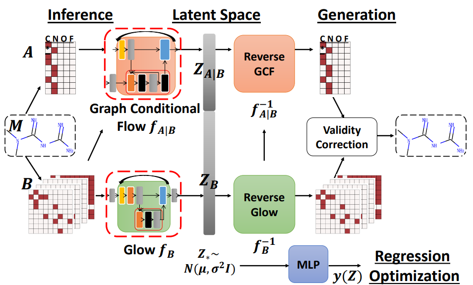

# MoFlow For PyTorch

This repository provides a script and recipe to train the MoFlow model to achieve state-of-the-art accuracy. The content of this repository is tested and maintained by NVIDIA.

## Table Of Contents

- [Model overview](#model-overview)
    * [Model architecture](#model-architecture)
    * [Default configuration](#default-configuration)
    * [Feature support matrix](#feature-support-matrix)
	    * [Features](#features)
    * [Mixed precision training](#mixed-precision-training)
	    * [Enabling mixed precision](#enabling-mixed-precision)
          * [Enabling TF32](#enabling-tf32)
    * [Glossary](#glossary)
- [Setup](#setup)
    * [Requirements](#requirements)
- [Quick Start Guide](#quick-start-guide)
- [Advanced](#advanced)
    * [Scripts and sample code](#scripts-and-sample-code)
    * [Parameters](#parameters)
    * [Command-line options](#command-line-options)
    * [Getting the data](#getting-the-data)
        * [Dataset guidelines](#dataset-guidelines)
        * [Multi-dataset](#multi-dataset)
    * [Training process](#training-process)
    * [Inference process](#inference-process)
- [Performance](#performance)
    * [Benchmarking](#benchmarking)
        * [Training performance benchmark](#training-performance-benchmark)
        * [Inference performance benchmark](#inference-performance-benchmark)
    * [Results](#results)
        * [Training accuracy results](#training-accuracy-results)                         
            * [Training accuracy: NVIDIA DGX A100 (8x A100 80GB)](#training-accuracy-nvidia-dgx-a100-8x-a100-80gb)  
            * [Training stability test](#training-stability-test)
        * [Training performance results](#training-performance-results)
            * [Training performance: NVIDIA DGX A100 (8x A100 80GB)](#training-performance-nvidia-dgx-a100-8x-a100-80gb) 
        * [Inference performance results](#inference-performance-results)
            * [Inference performance: NVIDIA DGX A100 (1x A100 80GB)](#inference-performance-nvidia-dgx-a100-1x-a100-80gb)
- [Release notes](#release-notes)
    * [Changelog](#changelog)
    * [Known issues](#known-issues)


## Model overview

MoFlow is a model for molecule generation that leverages Normalizing Flows.
Normalizing Flows is a class of generative neural networks that directly models the probability density of the data. They consist of a sequence of invertible transformations that convert the input data that follow some hard-to-model distribution into a latent code that follows a normal distribution which can then be easily used for sampling.

MoFlow was first introduced by Chengxi Zang et al. in their paper titled "MoFlow: An Invertible Flow Model for Generating Molecular Graphs" ([link](https://arxiv.org/pdf/2006.10137.pdf)).

The model enables you to generate novel molecules that have similar properties to your training data.
In the case of [ZINC dataset](https://zinc.docking.org/), which is used in this example, it allows you to navigate the chemical space of drug-like molecules and facilitate de-novo drug design.
The differences between this version and the [original implementation](https://github.com/calvin-zcx/moflow) accompanying the paper are as follows:
* Loss calculation was separated from the neural network
* ActNorm layers were refactored and their initialization was moved outside of the forward pass
* Numerical stability of the training was improved by introducing gradient clipping
* Numerically-stable formulas for 1/sigmoid(x) and log(sigmoid(x)) were used in AffineCoupling and GraphAffineCoupling layers
* Network and data configurations were untangled to allow for more flexibility
* Linear transformations for node features were implemented using native Linear layers instead of custom GraphLinear layers
* Rescaled adjacency matrix was removed as it did not provide any benefit for the training
* Data pre-processing and loading were refactored
* Support for data-parallel multi-GPU training was added
* Option to capture CUDA graphs was added
* Execution of bond and atom models in was put in two parallel CUDA streams
* Option to compile model to TorchScript format was added
* Support for Automatic Mixed Precision training and inference was added
* FusedAdam optimizer from [Apex](https://github.com/NVIDIA/apex) was used instead of Adam
* Training parameters were tuned to achieve better generation quality

This model is trained with mixed precision using Tensor Cores on the NVIDIA Ampere GPU architectures. Therefore, researchers can get results up to 1.43x faster than training with full precision while experiencing the benefits of mixed precision training. This model is tested against each NGC monthly container release to ensure consistent accuracy and performance over time.

### Model architecture


[Chengxi Zang and Fei Wang. 2020. MoFlow: An Invertible Flow Model for Generating Molecular Graphs. In Proceedings of the 26th ACM SIGKDD](https://arxiv.org/pdf/2006.10137.pdf)


The MoFlow model consists of two parts.
The first part, Glow, processes edges to convert an adjacency matrix into a latent vector Z_B.
The second part, Graph Conditional Flow, processes nodes in the context of edges to produce conditional latent vector Z_{A|B}.
Each part is a normalizing flow—a chain of invertible transformations with learnable parameters, which provide the ability to learn the distribution of the data. 

### Default configuration
The MoFlow model is built out of Normalizing Flows. It consists of two parts: Glow for processing edges and Graph Conditional Flow for processing nodes in the context of edges. 


The following features were implemented in this model:
* Data-parallel multi-GPU training (DDP)
* Mixed precision training (autocast, gradient scaling)
* Just-in-time compilation
* Resumable training
* CUDA graphs capture

The following performance optimizations were implemented in this model:
- A series of matrix manipulations in the GraphConv layer was replaced with a single torch.einsum
- Tensors are created on the device with the desired dtype whenever possible
- Channels-last memory format was used for Glow
- Stream concurrency was introduced to allow for executing Glow and Graph Conditional Flow at the same time. The concurrency happens in both forward and backward passes, and it hides the runtime of the smaller sub-model. Performance improvement is the most prominent for small batch sizes.
- Number of nodes in the graph is now independent of the maximum number of atoms in the dataset. This provides more flexibility and allows the use of shapes divisible by eight for better Tensor Cores usage.
- FusedAdam optimizer is used instead of native Adam.
- Normalization of the adjacency matrix was removed, as it did not benefit the training and required additional computation.


### Feature support matrix

This model supports the following features:: 

| Feature               | MoFlow                
|-----------------------|--------------------------
|Automatic mixed precision (AMP)   |         Yes 
|Distributed data parallel (DDP)   |         Yes 
|CUDA Graphs                       |         Yes 
         


#### Features
**Distributed data parallel (DDP)**

[DistributedDataParallel (DDP)](https://pytorch.org/docs/stable/generated/torch.nn.parallel.DistributedDataParallel.html#torch.nn.parallel.DistributedDataParallel) implements data parallelism at the module level that can run across multiple GPUs or machines.

**Automatic Mixed Precision (AMP)**

This implementation uses the native PyTorch AMP implementation of mixed precision training. It allows us to use FP16 training with FP32 master weights by modifying just a few lines of code. A detailed explanation of mixed precision can be found in the next section.

**CUDA Graphs**

This feature allows launching multiple GPU operations through a single CPU operation. The result is a vast reduction in CPU overhead. The benefits are particularly pronounced when training with relatively small batch sizes. The CUDA Graphs feature has been available through a [native PyTorch API](https://pytorch.org/docs/master/notes/cuda.html#cuda-graphs) starting from PyTorch v1.10. 


### Mixed precision training

Mixed precision is the combined use of different numerical precisions in a computational method. [Mixed precision](https://arxiv.org/abs/1710.03740) training offers significant computational speedup by performing operations in half-precision format while storing minimal information in single-precision to retain as much information as possible in critical parts of the network. Since the introduction of [Tensor Cores](https://developer.nvidia.com/tensor-cores) in NVIDIA Volta, and following with both the NVIDIA Turing and NVIDIA Ampere Architectures, significant training speedups are experienced by switching to mixed precision -- up to 3x overall speedup on the most arithmetically intense model architectures. Using [mixed precision training](https://docs.nvidia.com/deeplearning/performance/mixed-precision-training/index.html) previously required two steps:
1.  Porting the model to use the FP16 data type where appropriate.    
2.  Adding loss scaling to preserve small gradient values.

AMP enables mixed precision training on NVIDIA Volta, NVIDIA Turing, and NVIDIA Ampere GPU architectures automatically. The PyTorch framework code makes all necessary model changes internally.

For information about:
-   How to train using mixed precision, refer to the [Mixed Precision Training](https://arxiv.org/abs/1710.03740) paper and [Training With Mixed Precision](https://docs.nvidia.com/deeplearning/performance/mixed-precision-training/index.html) documentation.
-   Techniques used for mixed precision training, refer to the [Mixed-Precision Training of Deep Neural Networks](https://devblogs.nvidia.com/mixed-precision-training-deep-neural-networks/) blog.
-   APEX tools for mixed precision training, refer to the [NVIDIA Apex: Tools for Easy Mixed-Precision Training in PyTorch](https://devblogs.nvidia.com/apex-pytorch-easy-mixed-precision-training/).


#### Enabling mixed precision

Mixed precision is enabled in PyTorch by using the native [Automatic Mixed Precision package](https://pytorch.org/docs/stable/amp.html), which casts variables to half-precision upon retrieval while storing variables in single-precision format. Furthermore, to preserve small gradient magnitudes in backpropagation, a [loss scaling](https://docs.nvidia.com/deeplearning/sdk/mixed-precision-training/index.html#lossscaling) step must be included when applying gradients. In PyTorch, loss scaling can be applied automatically using a `GradScaler`.
Automatic Mixed Precision makes all the adjustments internally in PyTorch, providing two benefits over manual operations. First, programmers do not need to modify network model code, reducing development and maintenance efforts. Second, using AMP maintains forward and backward compatibility with all the APIs for defining and running PyTorch models.

To enable mixed precision, you can simply use the `--amp` flag when running the training or inference scripts.


#### Enabling TF32

TensorFloat-32 (TF32) is the new math mode in [NVIDIA A100](https://www.nvidia.com/en-us/data-center/a100/) GPUs for handling the matrix math, also called tensor operations. TF32 running on Tensor Cores in A100 GPUs can provide up to 10x speedups compared to single-precision floating-point math (FP32) on NVIDIA Volta GPUs. 

TF32 Tensor Cores can speed up networks using FP32, typically with no loss of accuracy. It is more robust than FP16 for models which require a high dynamic range for weights or activations.

For more information, refer to the [TensorFloat-32 in the A100 GPU Accelerates AI Training, HPC up to 20x](https://blogs.nvidia.com/blog/2020/05/14/tensorfloat-32-precision-format/) blog post.

TF32 is supported in the NVIDIA Ampere GPU architecture and is enabled by default.


### Glossary
**Normalizing flow** - a class of generative neural networks that directly models the probability density of the data.

**Molecular graph** - representation of a molecule, in which nodes correspond to atoms and edges correspond to chemical bonds

**SMILES format** - a format that allows representing a molecule with a string of characters
## Setup

The following section lists the requirements that you need to meet to  start training the MoFlow model.

### Requirements

This repository contains a Dockerfile that extends the PyTorch 22.11 NGC container and encapsulates some dependencies. Aside from these dependencies, ensure you have the following components:
-   [NVIDIA Docker](https://github.com/NVIDIA/nvidia-docker)
-   PyTorch 22.11+ NGC container
-   Supported GPUs:
    - [NVIDIA Volta architecture](https://www.nvidia.com/en-us/data-center/volta-gpu-architecture/)
    - [NVIDIA Turing architecture](https://www.nvidia.com/en-us/design-visualization/technologies/turing-architecture/)
    - [NVIDIA Ampere architecture](https://www.nvidia.com/en-us/data-center/nvidia-ampere-gpu-architecture/)

For more information about how to get started with NGC containers, refer to the following sections from the NVIDIA GPU Cloud Documentation and the Deep Learning Documentation:
-   [Getting Started Using NVIDIA GPU Cloud](https://docs.nvidia.com/ngc/ngc-getting-started-guide/index.html)
-   [Accessing And Pulling From The NGC Container Registry](https://docs.nvidia.com/deeplearning/frameworks/user-guide/index.html#accessing_registry)
-   Running [framework name - link to topic]
  
For those unable to use the [framework name] NGC container, to set up the required environment or create your own container, refer to the versioned [NVIDIA Container Support Matrix](https://docs.nvidia.com/deeplearning/frameworks/support-matrix/index.html).

## Quick Start Guide

To train your model using mixed or TF32 precision with Tensor Cores or using FP32, perform the following steps using the default parameters of the MoFlow model on the ZINC 250k dataset. For the specifics concerning training and inference, refer to the [Advanced](#advanced) section.

1. Clone the repository.
```
git clone [https://github.com/NVIDIA/DeepLearningExamples](https://github.com/NVIDIA/DeepLearningExamples)
cd [DeepLearningExamples](https://github.com/NVIDIA/DeepLearningExamples)/PyTorch/DrugDiscovery/MoFlow
```

2.  Build the MoFlow PyTorch NGC container.
```
docker build . -t moflow_pyt
```

3.  Start an interactive session in the NGC container to run training/inference.
Run the following command to launch the Docker container.

```
docker run --rm -it --shm-size=8gb --gpus all -v <path to results>:/results moflow_pyt
```

If you want to reuse the dataset between runs, (recommended), use -v <path to data directory>:/data to mount your directory inside the container:
```
docker run --rm -it --shm-size=8gb --gpus all -v <path to results>:/results -v <path to data directory>:/data moflow_pyt
```
The contents of /data will be downloaded in the following step.


4.  Download and preprocess the dataset.
```
bash scripts/prepare_datasets.sh
```

5. Start training and evaluation.
```
bash scripts/train.sh
```

6. Start inference.

You can train the model yourself (see the prevoius step) or download the pretrained weights from NGC:
```
wget 'https://api.ngc.nvidia.com/v2/models/nvidia/dle/moflow__pyt_ckpt/versions/22.11.0_amp/files/model_snapshot_epoch_300' -O /results/model_snapshot_epoch_300
```
Then you can run the inference:

```
bash scripts/predict.sh
```

Now that you have your model trained and evaluated, you can choose to compare your training results with our [Training accuracy results](#training-accuracy-results). You can also choose to benchmark your performance to [Training performance benchmark](#training-performance-results), or [Inference performance benchmark](#inference-performance-results). Following the steps in these sections will ensure that you achieve the same accuracy and performance results as stated in the [Results](#results) section.
## Advanced

The following sections provide greater details of the dataset, running training and inference, and the training results.

### Scripts and sample code
In the root directory, the most important files are:
- Dockerfile - definition of the Docker image with all dependencies needed to run MoFlow
- setup.py - script that allows installing MoFlow with pip. Note  that it does not include dependencies.

The `moflow` directory contains the definition of the network and tools needed for using it
- `config.py` - configuration of the dataset and network
- `data` - directory with tools needed to process and load the data
- `model` - directory with the definition of the MoFlow’s building blocks and helper functions
- `runtime` - directory that contains code for running experiments, multi-GPU training, and logging. The most important files in this directory are `train.py` and `generate.py`, which allow running training or inference, respectively.
- `utils.py`- various helper functions

The `scripts` directory contains scripts for running the most typical workflows inside the docker container:
- `benchmark_inference.sh` and `benchmark_training.sh` for measuring the performance of inference or training, respectively
- `data_preprocess.py` for dataset preparation
- `prepare_datasets.sh` for downloading and preprocessing the data (note, that it launches `data_preprocess.py`)
- `train.sh` for launching training
- `predict.sh` for sampling random molecules from the trained model
### Parameters

The complete list of parameters accepted by the runtime scripts (`moflow/runtime/train.py` and `moflow/runtime/generate.py`) consists of:
* --data_dir - Location for the dataset.
* --config_name - The config to choose. This parameter allows one to switch between different datasets and their dedicated configurations of the neural network. By default, a pre-defined “zinc250k” config is used.
* --results_dir - Directory where checkpoints are stored.
* --predictions_path - Path to store generated molecules. If an empty string is provided, predictions will not be saved (useful for benchmarking and debugging).
* --log_path - Path for DLLogger log. This file will contain information about the speed and accuracy of the model during training and inference. Note that if the file already exists, new logs will be added at the end.
* --log_interval - Frequency for writing logs, expressed in steps.
* --warmup_steps - Number of warmup steps. This value is used for benchmarking and for CUDA graph capture.
* --steps - Number of steps used for training/inference. This parameter allows finishing training earlier than the specified number of epochs. If used with inference, it allows generating  more molecules (by default only a single batch of molecules is generated). 
* --save_epochs - Frequency for saving checkpoints, expressed in epochs. If -1 is provided, checkpoints will not be saved.
* --eval_epochs - Evaluation frequency, expressed in epochs. If -1 is provided, an evaluation will not be performed.
* --learning_rate - Base learning rate.
* --beta1 - beta1 parameter for the Adam optimizer.
* --beta2 - beta2 parameter for the Adam optimizer.
* --clip - Gradient clipping norm.
* --epochs - Number of training epochs. Note that you can finish training mid-epoch by using “--steps” flag.
* --batch_size - Batch size per GPU.
* --num_workers - Number of workers in the data loader.
* --seed - Random seed used to initialize the distributed loaders.
* --local_rank - rank of the GPU, used to launch distributed training. This argument is specified automatically by `torchrun` and does not have to be provided by the user.
* --temperature - Temperature used for sampling.
* --val_batch_size - Number of molecules to generate during the validation step.
* --allow_untrained - Allow sampling  molecules from an untrained network. Useful for performance benchmarking or debugging purposes.
* --correct_validity - Apply validity correction after the generation of the molecules.
* --amp - Use Automatic Mixed Precision
* --cuda_graph - Capture GPU kernels with CUDA graphs. This option allows to speed up training.
* --jit - Compile the model with `torch.jit.script`. Can be used to speed up training or inference.
* --verbosity - Verbosity level. Specify the following values: 0, 1, 2, 3, where 0 means minimal verbosity (errors only) and 3 - maximal (debugging).


### Command-line options

To view the full list of available options and their descriptions, use the `-h` or `--help` command-line option, for example:
`python moflow/runtime/train.py --help`

The following example output is printed when running the model:
```
usage: train.py [-h] [--data_dir DATA_DIR] [--config_name {zinc250k}] [--results_dir RESULTS_DIR] [--predictions_path PREDICTIONS_PATH] [--log_path LOG_PATH] [--log_interval LOG_INTERVAL]
                [--warmup_steps WARMUP_STEPS] [--steps STEPS] [--save_epochs SAVE_EPOCHS] [--eval_epochs EVAL_EPOCHS] [--learning_rate LEARNING_RATE] [--beta1 BETA1] [--beta2 BETA2] [--clip CLIP]
                [--epochs EPOCHS] [--batch_size BATCH_SIZE] [--num_workers NUM_WORKERS] [--seed SEED] [--local_rank LOCAL_RANK] [--temperature TEMPERATURE] [--val_batch_size VAL_BATCH_SIZE]
                [--allow_untrained] [--correct_validity] [--amp] [--cuda_graph] [--jit] [--verbosity {0,1,2,3}]

optional arguments:
  -h, --help            show this help message and exit
  --data_dir DATA_DIR   Location for the dataset.
  --config_name {zinc250k}
                        The config to choose. This parameter allows one to switch between different datasets and their dedicated configurations of the neural network. By default, a pre-defined
                        "zinc250k" config is used.
  --results_dir RESULTS_DIR
                        Directory where checkpoints are stored.
  --predictions_path PREDICTIONS_PATH
                        Path to store generated molecules. If an empty string is provided, predictions will not be saved (useful for benchmarking and debugging).
  --log_path LOG_PATH   Path for DLLogger log. This file will contain information about the speed and accuracy of the model during training and inference. Note that if the file already exists, new logs
                        will be added at the end.
  --log_interval LOG_INTERVAL
                        Frequency for writing logs, expressed in steps.
  --warmup_steps WARMUP_STEPS
                        Number of warmup steps. This value is used for benchmarking and for CUDA graph capture.
  --steps STEPS         Number of steps used for training/inference. This parameter allows finishing training earlier than the specified number of epochs. If used with inference, it allows generating
                        more molecules (by default only a single batch of molecules is generated).
  --save_epochs SAVE_EPOCHS
                        Frequency for saving checkpoints, expressed in epochs. If -1 is provided, checkpoints will not be saved.
  --eval_epochs EVAL_EPOCHS
                        Evaluation frequency, expressed in epochs. If -1 is provided, an evaluation will not be performed.
  --learning_rate LEARNING_RATE
                        Base learning rate.
  --beta1 BETA1         beta1 parameter for the optimizer.
  --beta2 BETA2         beta2 parameter for the optimizer.
  --clip CLIP           Gradient clipping norm.
  --epochs EPOCHS       Number of training epochs. Note that you can finish training mid-epoch by using "--steps" flag.
  --batch_size BATCH_SIZE
                        Batch size per GPU.
  --num_workers NUM_WORKERS
                        Number of workers in the data loader.
  --seed SEED           Random seed used to initialize the distributed loaders.
  --local_rank LOCAL_RANK
                        rank of the GPU, used to launch distributed training. This argument is specified automatically by `torchrun` and does not have to be provided by the user.
  --temperature TEMPERATURE
                        Temperature used for sampling.
  --val_batch_size VAL_BATCH_SIZE
                        Number of molecules to generate during validation step.
  --allow_untrained     Allow sampling molecules from an untrained network. Useful for performance benchmarking or debugging purposes.
  --correct_validity    Apply validity correction after the generation of the molecules.
  --amp                 Use Automatic Mixed Precision.
  --cuda_graph          Capture GPU kernels with CUDA graphs. This option allows to speed up training.
  --jit                 Compile the model with `torch.jit.script`. Can be used to speed up training or inference.
  --verbosity {0,1,2,3}
                        Verbosity level. Specify the following values: 0, 1, 2, 3, where 0 means minimal verbosity (errors only) and 3 - maximal (debugging).

```
### Getting the data

The MoFlow model was trained on the ZINC 250k dataset. The original data split was used, with 224569 molecules in the training set and 24887 molecules in the test set.

This repository contains the `prepare_datasets.sh` script that will automatically download and process the dataset. By default, data will be downloaded to the `/data/` directory.

#### Dataset guidelines
The dataset preparation is implemented in the `scripts/data_preprocess.py` script, and the parameters for the dataset are defined in the `moflow/config.py` file. The config includes information about data location, the structure of the CSV file, types and numbers of atoms in the molecules, and the number of nodes in the output graphs.

Initially, the data is stored in a CSV file that contains the molecules in SMILES format, together with their properties (optional). The data is loaded using the `pandas` library, and the SMILES strings are converted to molecules with RDKit.

Then, the molecules are converted into graphs with features assigned to nodes and edges. The first step is the standardization of molecular structures - each molecule is converted into canonical SMILES and loaded back, and kekulized. Then, two numpy arrays are constructed. The first array is a vector corresponding to graph nodes and contains atomic numbers for all atoms in the molecule. The second array is a 2D square matrix corresponding to graph edges and contains codes for atomic bond orders - 0 if two atoms are not connected, 1 for a single bond, 2 for a double bond, and 3 for a triple bond.

Both arrays are padded to some predefined size larger than the maximum number of atoms in the molecules in the dataset. For ZINC 250k, the maximum number of atoms is 38, and the output size of the numpy arrays is set to 40 for the nodes array and 40x40 for the edges array.

This representation of the data is dumped on the disk using the numpy `savez` function.

During training, the numpy arrays are loaded, and one-hot-encoding is used to represent atomic numbers (node features) and bond orders (edge features). This representation is then used for training the neural network.

### Training process

The training script is located in `moflow/runtime/train.py` and it accepts the parameters listed above.

To make the usage of the model easier, there is also `scripts/train.sh` script that runs training with the default configuration and the evaluation using the trained checkpoint at the end. This script can be run without any arguments - then it launches training on a single GPU and performance optimizations enabled - automatic mixed precision (AMP) and CUDA graph capture.

```
./scripts/train.sh
```

It is also possible to pass the number of GPUs and precision (“amp” or “full”) that should be used for training. For example, to launch training with eight GPUs and AMP, run:
```
./scripts/train.sh 8
```
and to launch four GPU training with full precision, run:
```
./scripts/train.sh 4 full
```
These two arguments can also be followed by extra flags that will be passed to training and evaluation commands. For example, to train on eight GPUs with AMP, batch size of 2048 per GPU and save logs in `/results/dll.json`, run:
```
./scripts/train.sh 8 amp --batch_size 2048 --log_path /results/dll.json
```

Alternatively, you can launch training with `moflow/runtime/train.py`. To run the model with multiple GPUs, run:

```
torchrun --nproc_per_node=<# GPUs> moflow/runtime/train.py <arguments>
```
To enable mixed precision training, add `--amp`. You can also optimize the performance further by adding `--cuda_graph` or `--jit` flags to enable CUDA graph capture or just-in-time compilation, respectively.

#### Logs
By default, logs are printed to the screen and not saved on disk. If you want to store the logs, pass `--log_path` flag to `scripts/train.sh` or `moflow/runtime/train.py`.

#### Checkpoints
By default, the training script saves checkpoints inside `/results` every five epochs. The location of the checkpoints directory can be modified with `--results_dir` flag and saving interval with `--save_epochs` flag (pass -1 if you do not want to save checkpoints). Up to five  most recent checkpoints are kept while the older ones are removed.

#### Evaluation
The following metrics are used to evaluate the model:

- Validity - the percentage of predictions corresponding to the correct molecular graph.
- Uniqueness - the percentage of valid molecules that is unique.
- Novelty - the percentage of valid and unique molecules not present in the training set.
- N.U.V - the percentage of valid, unique, and novel molecules.

During training, a single batch of molecules is generated every couple of epochs to assess two metrics: validity and uniqueness, as they are quick to calculate and track the training progress.

By default, the validation batch size is set to 100 molecules per GPU, and evaluation happens every five epochs. This can be changed with `--val_batch_size` and `--eval_epochs` flags, respectively. To disable evaluation, pass `--eval_epochs -1`.

If you use `scripts/train.sh`, there is also a final evaluation of the model done on 100 batches of molecules. This larger sample is evaluated with all metrics described above, and we use N.U.V as the main metric.

Alternatively, you can trigger evaluation manually by running `moflow/runtime/evaluate.py` script. Make sure that you pass the same value for `--results_dir` for both training and evaluation scripts. 

### Inference process

Inference can be run by launching the `moflow/runtime/generate.py` or `scripts/predict.sh` script. The first one provides more flexibility and accepts the arguments listed above. The second script allows you to easily run the default configuration with performance optimization (`--jit` flag) and molecule validity correction (`--correct_validity`). To generate a single batch of molecules with AMP and batch size of 512, run:
```
./scripts/predict.sh
```
You can also provide batch size and precision to use for predictions. For example, to generate 1000 molecules with full precision, run:

```
./scripts/predict.sh 1000 full
```

The script also allows you to pass extra flags to the generation. For example, to generate 10 batches of 1000 each and save predictions inside /results/predictions.smi, run:
```
./scripts/predict.sh 1000 amp --steps 10 --predictions_path /results/predictions.smi
```


## Performance
The performance measurements in this document were conducted at the time of publication and may not reflect the performance achieved from NVIDIA’s latest software release. For the most up-to-date performance measurements, go to [NVIDIA Data Center Deep Learning Product Performance](https://developer.nvidia.com/deep-learning-performance-training-inference).

### Benchmarking

The following section shows how to run benchmarks measuring the model performance in training and inference modes.

#### Training performance benchmark

To benchmark the training performance on a specific number of GPUs, batch size and precision, run:

```
bash scripts/benchmark_training.sh <# GPUs> <batch_size> <precision>
```
Eg. running 
```
./scripts/benchmark_training.sh 8 2048 amp
```
will measure performance for eight GPUs, batch size of 2048 per GPU and mixed precision and running:
```
./scripts/benchmark_training.sh 1 1024 full
```
will measure performance for single GPU, batch size of 1024 and full precision.
#### Inference performance benchmark
To benchmark the inference performance on a specific batch size and precision, run:

```
bash scripts/benchmark_inference.sh <batch size> <precision>
```

Eg. running 
```
./scripts/benchmark_inference.sh 2048 amp
```
will measure performance for a batch size of 2048 and mixed precision and running:
```
./scripts/benchmark_inference.sh 1024 full
```
will measure performance for a batch size of 1024 and full precision.

### Results

The following sections provide details on how we achieved our performance and accuracy in training and inference.

#### Training accuracy results


##### Training accuracy: NVIDIA A100 (8x A100 80GB)

Our results were obtained by running the `scripts/train.sh` training script in the PyTorch 22.11 NGC container on NVIDIA A100 (8x A100 80GB) GPUs. The values presented below were averaged over 20 experiments.

| GPUs    | Batch size / GPU | NUV - TF32 | NUV - mixed precision |   Time to train - TF32  |  Time to train - mixed precision | Time to train speedup (TF32 to mixed precision)        
|---------|------------------|-----------------|----------------------------|-------------------------|----------------------------------|--------------
| 1       |  512             |  89.63 %        |  87.83 %                   |  5h8min                 |   4h0min                         |  1.28x
| 8       |  512             |  87.03 %        |  87.90 %                   |  48min                  |   40min                          |  1.20x


##### Training stability test


The MoFlow model was trained for 300 epochs starting from 20 different initial random seeds. Every five training epochs, the model was evaluated by generating a small sample of molecules (100 molecules per GPU), and validity and uniqueness were calculated. The training was performed in the PyTorch 22.11 Docker container on NVIDIA DGX A100 with 8x A100 80GB GPUs with AMP and CUDA graph capture enabled. The following table summarizes the results of the stability test.

The following table displays the validity and uniqueness scores after every 50 epochs for different initial random seeds.

|epoch|validity mean|validity std|validity min|validity max|validity median|uniqueness mean|uniqueness std|uniqueness min|uniqueness max|uniqueness median|
|-----|-------------|------------|------------|------------|---------------|---------------|--------------|--------------|--------------|-----------------|
|50   |68.22        |5.25        |57.38       |74.75       |69.50          |93.64          |8.22          |62.56         |99.82         |95.30            |
|100  |76.91        |4.23        |69.50       |84.38       |77.50          |99.39          |0.92          |96.31         |100.00        |99.83            |
|150  |80.48        |3.80        |73.88       |88.25       |81.75          |99.58          |0.78          |96.64         |100.00        |99.85            |
|200  |83.87        |3.98        |77.00       |90.62       |84.44          |99.76          |0.38          |98.81         |100.00        |100.00           |
|250  |86.08        |4.46        |77.12       |93.12       |86.56          |99.87          |0.21          |99.27         |100.00        |100.00           |
|300  |87.29        |3.70        |77.75       |93.38       |87.69          |99.82          |0.30          |98.70         |100.00        |99.93            |


#### Training performance results


##### Training performance: NVIDIA A100 (8x A100 80GB)

Our results were obtained by running the `scripts/benchmark_training.sh` training script in the PyTorch 22.11 NGC container on NVIDIA A100 (8x A100 80GB) GPUs. Performance numbers (in molecules per second) were averaged over 190 iterations after 10 warm-up steps.

|GPUs|Batch size / GPU|Throughput - TF32|Throughput - mixed precision|Throughput speedup (TF32 - mixed precision)|Weak scaling - TF32|Weak scaling - mixed precision|
|----|----------------|-----------------|----------------------------|-------------------------------------------|-------------------|------------------------------|
|1   |512             |3499.35          |4524.15                     |1.29                                       |                   |                              |
|1   |1024            |3883.49          |5392.78                     |1.39                                       |                   |                              |
|1   |2048            |4291.29          |6118.46                     |1.43                                       |                   |                              |
|8   |512             |24108.04         |29293.41                    |1.22                                       |6.89               |6.47                          |
|8   |1024            |28104.62         |37365.05                    |1.33                                       |7.24               |6.93                          |
|8   |2048            |30927.04         |42078.31                    |1.36                                       |7.21               |6.88                          |


To achieve these same results, follow the steps in the [Quick Start Guide](#quick-start-guide).


#### Inference performance results

##### Inference performance: NVIDIA A100 (1x A100 80GB)

Our results were obtained by running the `scripts/benchmark_inference.sh` inferencing benchmarking script in the PyTorch 22.11 NGC container on the NVIDIA A100 (1x A100 80GB) GPU.

FP16
|Batch size|Throughput Avg|Latency Avg|Latency 90%|Latency 95%|Latency 99%|
|----------|--------------|-----------|-----------|-----------|-----------|
|512       |12524.49      |41         |41         |41         |41         |
|1024      |13871.60      |74         |74         |74         |74         |
|2048      |14386.44      |142        |144        |144        |144        |

TF32
|Batch size|Throughput Avg|Latency Avg|Latency 90%|Latency 95%|Latency 99%|
|----------|--------------|-----------|-----------|-----------|-----------|
|512       |9696.35       |53         |53         |53         |53         |
|1024      |10242.98      |100        |100        |100        |100        |
|2048      |11174.75      |183        |187        |187        |187        |


To achieve these same results, follow the steps in the [Quick Start Guide](#quick-start-guide).

## Release notes

### Changelog
January 2023
- Initial release

### Known issues

There is a known issue with the selection of sampling temperature. For some runs, the default value (0.3) might be sub-optimal, and better prediction quality can be achieved when lowering or increasing the value of this parameter. To tune the value of this parameter, run `moflow/runtime/evaluate.py` script passing different values for the `--temperature` flag.
