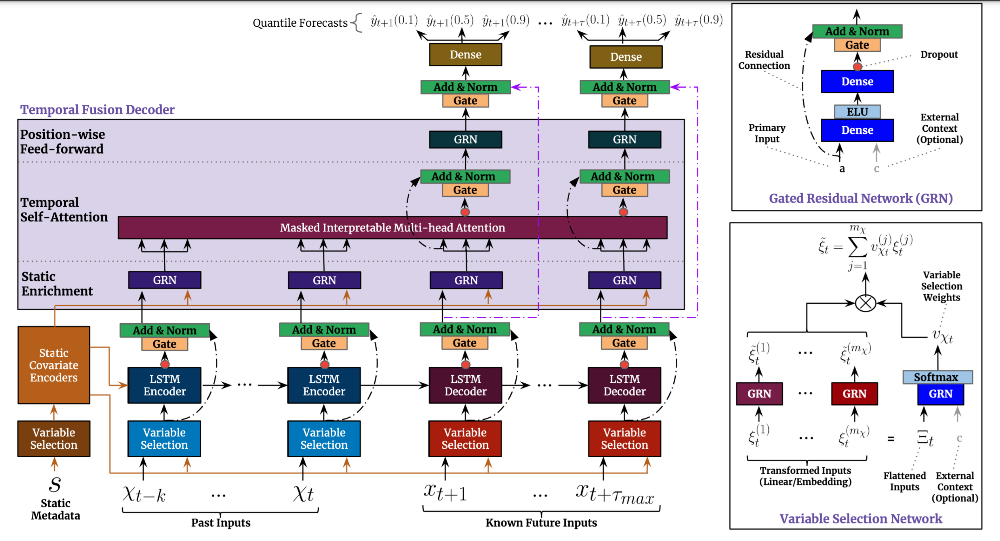

# Temporal Fusion Transformer For PyTorch

This repository provides a script and recipe to train the Temporal Fusion Transformer model to achieve state-of-the-art accuracy. The content of this repository is tested and maintained by NVIDIA.

## Table Of Contents

- [Model overview](#model-overview)
    * [Model architecture](#model-architecture)
    * [Default configuration](#default-configuration)
    * [Feature support matrix](#feature-support-matrix)
	    * [Features](#features)
    * [Mixed precision training](#mixed-precision-training)
	    * [Enabling mixed precision](#enabling-mixed-precision)
          * [Enabling TF32](#enabling-tf32)
    * [Glossary](#glossary)
- [Setup](#setup)
    * [Requirements](#requirements)
- [Quick Start Guide](#quick-start-guide)
- [Advanced](#advanced)
    * [Scripts and sample code](#scripts-and-sample-code)
    * [Command-line options](#command-line-options)
    * [Getting the data](#getting-the-data)
        * [Dataset guidelines](#dataset-guidelines)
        * [Multi-dataset](#multi-dataset)
    * [Training process](#training-process)
    * [Inference process](#inference-process)
    * [Triton deployment](#triton-deployment)
- [Performance](#performance)
    * [Benchmarking](#benchmarking)
        * [Training performance benchmark](#training-performance-benchmark)
        * [Inference performance benchmark](#inference-performance-benchmark)
    * [Results](#results)
        * [Training accuracy results](#training-accuracy-results)                         
            * [Training accuracy: NVIDIA DGX A100 (8x A100 80GB)](#training-accuracy-nvidia-dgx-a100-8x-a100-80gb)
            * [Training accuracy: NVIDIA DGX-1 (8x V100 16GB)](#training-accuracy-nvidia-dgx-1-8x-v100-16gb)
            * [Training stability test](#training-stability-test)
        * [Training performance results](#training-performance-results)
            * [Training performance: NVIDIA DGX A100 (8x A100 80GB)](#training-performance-nvidia-dgx-a100-8x-a100-80gb)
            * [Training performance: NVIDIA DGX-1 (8x V100 16GB)](#training-performance-nvidia-dgx-1-8x-v100-16gb)
        * [Inference performance results](#inference-performance-results)
            * [Inference Performance: NVIDIA DGX A100](#inference-performance-nvidia-dgx-a100)
            * [Inference Performance: NVIDIA DGX-1 V100](#inference-performance-nvidia-dgx-1-v100)
- [Release notes](#release-notes)
    * [Changelog](#changelog)
    * [Known issues](#known-issues)


## Model overview

The Temporal Fusion Transformer [TFT](https://arxiv.org/abs/1912.09363) model is a state-of-the-art architecture for interpretable, multi-horizon time-series prediction. The model was first developed and [implemented by Google](https://github.com/google-research/google-research/tree/master/tft) with the collaboration with the University of Oxford.
This implementation differs from the reference implementation by addressing the issue of missing data, which is common in production datasets, by either masking their values in attention matrices or embedding them as a special value in the latent space.
This model enables the prediction of confidence intervals for future values of time series for multiple future timesteps.

This model is trained with mixed precision using Tensor Cores on Volta, Turing, and the NVIDIA Ampere GPU architectures. Therefore, researchers can get results 1.45x faster than training without Tensor Cores while experiencing the benefits of mixed precision training. This model is tested against each NGC monthly container release to ensure consistent accuracy and performance over time.

### Model architecture

The TFT model is a hybrid architecture joining LSTM encoding of time series and interpretability of transformer attention layers. Prediction is based on three  types of variables: static (constant for a given time series), known (known in advance for whole history and future), observed (known only for historical data). All these variables come in two flavors: categorical, and continuous. In addition to historical data, we feed the model with historical values of time series. All variables are embedded in high-dimensional space by learning an embedding vector. Categorical variables embeddings are learned in the classical sense of embedding discrete values. The model learns a single vector for each continuous variable, which is then scaled by this variable’s value for further processing. The next step is to filter variables through the Variable Selection Network (VSN), which assigns weights to the inputs in accordance with their relevance to the prediction. Static variables are used as a context for variable selection of other variables and as an initial state of LSTM encoders.
After encoding, variables are passed to multi-head attention layers (decoder), which produce the final prediction. Whole architecture is interwoven with residual connections with gating mechanisms that allow  the architecture to adapt to various problems by skipping some parts of it.
For the sake of explainability, heads of self-attention layers share value matrices. This allows interpreting  self-attention as an ensemble of models predicting different temporal patterns over the same feature set. The other feature that helps us understand the model is VSN activations, which tells us how relevant the given feature is to the prediction.

*image source: https://arxiv.org/abs/1912.09363*

### Default configuration

The specific configuration of the TFT model depends on the dataset used. Not only is the volume of the model subject to change but so are the data sampling and preprocessing strategies. During preprocessing, data is normalized per feature. For a part of the datasets, we apply scaling per-time-series, which takes into account shifts in distribution between entities (i.e., a factory consumes more electricity than an average house). The model is trained with the quantile loss: 
For quantiles in [0.1, 0.5, 0.9]. The default configurations are tuned for distributed training on DGX-1-32G with mixed precision. We use dynamic loss scaling. Specific values are provided in the table below.

| Dataset | Training samples | Validation samples | Test samples | History length | Forecast horizon | Dropout | Hidden size | #Heads | BS | LR | Gradient clipping |
| --- | --- | --- | --- | --- | --- | --- | --- | --- | --- | --- | --- |
| Electricity | 450k | 50k | 53.5k | 168 | 24 | 0.1 | 128 | 4 | 8x1024 | 1e-3 | 0.0 |
| Traffic | 450k | 50k | 139.6k | 168 | 24 | 0.3 | 128 | 4 | 8x1024 | 1e-3 | 0.0

### Feature support matrix

The following features are supported by this model: 

| Feature                    | Yes column                
|----------------------------|--------------------------
|Distributed data parallel   |         Yes
|PyTorch AMP                 |         Yes 
    
         
#### Features

[Automatic Mixed Precision](https://pytorch.org/docs/stable/amp.html)
provides an easy way to leverage Tensor Cores’ performance. It allows the execution of parts of a network in lower precision. Refer to [Mixed precision training](#mixed-precision-training) for more information.

[PyTorch
DistributedDataParallel](https://pytorch.org/docs/stable/nn.html#torch.nn.parallel.DistributedDataParallel) - a module
wrapper that enables easy multiprocess distributed data-parallel
training.

### Mixed precision training

Mixed precision is the combined use of different numerical precisions in a
computational method.
[Mixed precision](https://arxiv.org/abs/1710.03740) training offers significant
computational speedup by performing operations in half-precision format while
storing minimal information in single-precision to retain as much information
as possible in critical parts of the network. Since the introduction of [Tensor Cores](https://developer.nvidia.com/tensor-cores) in Volta, and following with 
both the Turing and Ampere architectures, significant training speedups are 
experienced by switching to
mixed precision -- up to 3x overall speedup on the most arithmetically intense
model architectures. Using mixed precision training previously required two
steps:

1. Porting the model to use the FP16 data type where appropriate.
2. Manually adding loss scaling to preserve small gradient values.

The ability to train deep learning networks with lower precision was introduced
in the Pascal architecture and first supported in [CUDA
8](https://devblogs.nvidia.com/parallelforall/tag/fp16/) in the NVIDIA Deep
Learning SDK.

For information about:
* How to train using mixed precision, refer to the [Mixed Precision
  Training](https://arxiv.org/abs/1710.03740) paper and [Training With Mixed
  Precision](https://docs.nvidia.com/deeplearning/sdk/mixed-precision-training/index.html)
  documentation.
* Techniques used for mixed precision training, refer to the [Mixed-Precision
  Training of Deep Neural
  Networks](https://devblogs.nvidia.com/mixed-precision-training-deep-neural-networks/)
  blog.


#### Enabling mixed precision


Mixed precision is enabled in PyTorch by using the Automatic Mixed Precision torch.cuda.amp module, which casts variables to half-precision upon retrieval while storing variables in single-precision format. Furthermore, to preserve small gradient magnitudes in backpropagation, a [loss scaling](https://docs.nvidia.com/deeplearning/sdk/mixed-precision-training/index.html#lossscaling) step must be included when applying gradients. In PyTorch, loss scaling can be applied automatically by the GradScaler class. All the necessary steps to implement AMP are verbosely described [here](https://pytorch.org/docs/stable/notes/amp_examples.html#amp-examples).

To enable mixed precision for TFT, simply add the `--use_amp` option to the training script.
#### Enabling TF32

TensorFloat-32 (TF32) is the new math mode in [NVIDIA A100](https://www.nvidia.com/en-us/data-center/a100/) GPUs for handling the matrix math, also called tensor operations. TF32 running on Tensor Cores in A100 GPUs can provide up to 10x speedups compared to single-precision floating-point math (FP32) on Volta GPUs. 

TF32 Tensor Cores can speed up networks using FP32, typically with no loss of accuracy. It is more robust than FP16 for models which require high dynamic range for weights or activations.

For more information, refer to the [TensorFloat-32 in the A100 GPU Accelerates AI Training, HPC up to 20x](https://blogs.nvidia.com/blog/2020/05/14/tensorfloat-32-precision-format/) blog post.

TF32 is supported in the NVIDIA Ampere GPU architecture and is enabled by default.


### Glossary

**Multi horizon prediction**  
Process of estimating values of a time series for multiple future time steps.

**Quantiles**  
Cut points dividing the range of a probability distribution intervals with equal probabilities.

**Time series**  
Series of data points indexed and equally spaced in time.

**Transformer**  
The paper [Attention Is All You Need](https://arxiv.org/abs/1706.03762) introduces a novel architecture called Transformer that uses an attention mechanism and transforms one sequence into another.
 

## Setup

The following section lists the requirements that you need to meet in order to start training the TFT model.

### Requirements

This repository contains Dockerfile, which extends the PyTorch NGC container and encapsulates some dependencies. Aside from these dependencies, ensure you have the following components:
-   [NVIDIA Docker](https://github.com/NVIDIA/nvidia-docker)
-   [PyTorch 22.11 NGC container](https://ngc.nvidia.com/catalog/containers/nvidia:pytorch)
-   Supported GPUs:
- [NVIDIA Volta architecture](https://www.nvidia.com/en-us/data-center/volta-gpu-architecture/)
- [NVIDIA Turing architecture](https://www.nvidia.com/en-us/design-visualization/technologies/turing-architecture/)
- [NVIDIA Ampere architecture](https://www.nvidia.com/en-us/data-center/nvidia-ampere-gpu-architecture/)

For more information about how to get started with NGC containers, refer to the following sections from the NVIDIA GPU Cloud Documentation and the Deep Learning Documentation:
-   [Getting Started Using NVIDIA GPU Cloud](https://docs.nvidia.com/ngc/ngc-getting-started-guide/index.html)
-   [Accessing And Pulling From The NGC Container Registry](https://docs.nvidia.com/deeplearning/frameworks/user-guide/index.html#accessing_registry)
-   Running [PyTorch](https://docs.nvidia.com/deeplearning/frameworks/pytorch-release-notes/running.html#running)

  
For those unable to use the PyTorch NGC container to set up the required environment or create your own container, refer to the versioned [NVIDIA Container Support Matrix](https://docs.nvidia.com/deeplearning/frameworks/support-matrix/index.html).

## Quick Start Guide

To train your model using mixed or TF32 precision with Tensor Cores, perform the following steps using the default parameters of the TFT model on any of the benchmark datasets. For the specifics concerning training and inference, refer to the [Advanced](#advanced) section.

1. Clone the repository.
```bash
git clone https://github.com/NVIDIA/DeepLearningExamples
cd DeepLearningExamples/PyTorch/Forecasting/TFT
```

2.  Build the TFT PyTorch NGC container.
```bash
docker build --network=host -t tft .
```

3.  Start an interactive session in the NGC container to run training/inference.
```bash
docker run -it --rm --ipc=host --network=host --gpus all -v /path/to/your/data:/data/ tft
```

Note: Ensure to mount your dataset using the -v flag to make it available for training inside the NVIDIA Docker container.

4.  Download and preprocess datasets.
```bash
bash scripts/get_data.sh
```

5. Start training. Choose one of the scripts provided in the `scripts/` directory. Results are stored in the `/results` directory.
These scripts are tuned for DGX1-32G. If you have a different system, use NGPU and BATCH_SIZE variables to adjust the parameters for your system.
```bash
bash scripts/run_electricity.sh
bash scripts/run_traffic.sh
```

6. Start validation/evaluation. The metric we use for evaluation is q-risk. We can compare it per-quantile in the Pareto sense or jointly as one number indicating accuracy.
```bash
python inference.py \
--checkpoint <your_checkpoint> \
--data /data/processed/<dataset>/test.csv \
--cat_encodings /data/processed/<dataset>/cat_encodings.bin \
--tgt_scalers /data/processed/<dataset>/tgt_scalers.bin
```

7. Start inference/predictions. Visualize and save predictions by running the following command.
```bash
python inference.py \
--checkpoint <your_checkpoint> \
--data /data/processed/<dataset>/test.csv \
--cat_encodings /data/processed/<dataset>/cat_encodings.bin \
--tgt_scalers /data/processed/<dataset>/tgt_scalers.bin \
--visualize \
--save_predictions
```


Now that you have your model trained and evaluated, you can choose to compare your training results with our [Training accuracy results](#training-accuracy-results). You can also choose to benchmark your performance to [Training performance benchmark](#training-performance-results). Following the steps in these sections will ensure that you achieve the same accuracy and performance results as stated in the [Results](#results) section.
## Advanced

The following sections provide more  details about the dataset, running training and inference, and the training results.

### Scripts and sample code

In the root directory, the most important files are:

`train.py`: Entry point for training
`data_utils.py`: File containing the dataset implementation and preprocessing functions
`modeling.py`: Definition of the model
`configuration.py`: Contains configuration classes for various experiments
`test.py`: Entry point testing trained model.
`Dockerfile`: Container definition
`log_helper.py`: Contains helper functions for setting up dllogger
`criterions.py`: Definitions of loss functions

The `scripts` directory contains scripts for default use cases:
`run_electricity.sh`: train default model on the electricity dataset
`run_traffic.sh`: train default model on the traffic dataset

### Command-line options

To view the full list of available options and their descriptions, use the `-h` or `--help` command-line option, for example:
`python train.py --help`.

The following example output is printed when running the model:
```
usage: train.py [-h] --data_path DATA_PATH --dataset {electricity,traffic} [--epochs EPOCHS] [--sample_data SAMPLE_DATA SAMPLE_DATA] [--batch_size BATCH_SIZE] [--lr LR] [--seed SEED] [--use_amp] [--clip_grad CLIP_GRAD]
                [--early_stopping EARLY_STOPPING] [--results RESULTS] [--log_file LOG_FILE] [--distributed_world_size N] [--distributed_rank DISTRIBUTED_RANK] [--local_rank LOCAL_RANK] [--overwrite_config OVERWRITE_CONFIG]

optional arguments:
  -h, --help            show this help message and exit
  --data_path DATA_PATH
  --dataset {electricity,traffic}
  --epochs EPOCHS
  --sample_data SAMPLE_DATA SAMPLE_DATA
  --batch_size BATCH_SIZE
  --lr LR
  --seed SEED
  --use_amp             Enable automatic mixed precision
  --clip_grad CLIP_GRAD
  --early_stopping EARLY_STOPPING
                        Stop training if validation loss does not improve for more than this number of epochs.
  --results RESULTS
  --log_file LOG_FILE
  --distributed_world_size N
                        total number of GPUs across all nodes (default: all visible GPUs)
  --distributed_rank DISTRIBUTED_RANK
                        rank of the current worker
  --local_rank LOCAL_RANK
                        rank of the current worker
  --overwrite_config OVERWRITE_CONFIG
                        JSON string used to overload config

```

### Getting the data
    
The TFT model was trained on the electricity and traffic benchmark datasets. This repository contains the `get_data.sh` download script, which for electricity and and traffic datasets will automatically download and preprocess the training, validation and test datasets, and produce files that contain scalers.
#### Dataset guidelines

The `data_utils.py` file contains all functions that are used to preprocess the data. Initially the data is loaded to a `pandas.DataFrame` and parsed to the common format which contains the features we will use for training. Then standardized data is cleaned, normalized, encoded and binarized.
This step does the following:
Drop all the columns that are not marked in the configuration file as used for training or preprocessing
Flatten indices in case time series are indexed by more than one column
Split the data into training, validation and test splits
Filter out all the time series shorter than minimal example length
Normalize columns marked as continuous in the configuration file
Encode as integers columns marked as categorical
Save the data in csv and binary formats

#### Multi-dataset
In order to use an alternate dataset, you have to write a function that parses your data to a common format. The format is as follows:
There is at least one id column
There is exactly one time column (that can also be used as a feature column)
Each feature is in a separate column
Each row represents a moment in time for only one time series
Additionally, you must specify a configuration of the network, including a data description. Refer to the example in `configuration.py` file.
### Training process

The `train.py` script is an entry point for a training procedure. Refined recipes can be found in the `scripts` directory.
The model trains for at most `--epochs` epochs. If option `--early_stopping N` is set, then training will end if for N subsequent epochs validation loss hadn’t improved.
The details of the architecture and the dataset configuration are encapsulated by the `--dataset` option. This option chooses one of the configurations stored in the `configuration.py` file. You can enable mixed precision training by providing the `--use_amp` option. The training script supports multi-GPU training with the APEX package. To enable distributed training prepend training command with `python -m torch.distributed.run --nproc_per_node=${NGPU}`.

Example command:
```
python -m torch.distributed.run --nproc_per_node=8 train.py \
        --dataset electricity \
        --data_path /data/processed/electricity_bin \
        --batch_size=1024 \
        --sample 450000 50000 \
        --lr 1e-3 \
        --epochs 25 \
        --early_stopping 5 \
        --seed 1 \
        --use_amp \
        --results /results/TFT_electricity_bs8x1024_lr1e-3/seed_1
```

The model is trained by optimizing quantile loss 
. After training, the checkpoint with the least validation loss is evaluated on a test split with q-risk metric .
Results are by default stored in the `/results` directory. This can be changed by providing the `--results` option. At the end of the training,  the results directory will contain the trained checkpoint which had the lowest validation loss, dllogger logs (in dictionary per line format), and TensorBoard logs.

### Inference process

Inference can be run by launching the `inference.py` script. The script requires a trained checkpoint to run. It is crucial to prepare the data in the same way as training data prior to running the inference. Example command:
```
python inference.py \
--checkpoint /results/checkpoint.pt \
--data /data/processed/electricity_bin/test.csv \
--tgt_scalers /data/processed/electricity_bin/tgt_scalers.bin \
--cat_encodings /data/processed/electricity_bin/cat_encodings.bin \
--batch_size 2048 \
--visualize \
--save_predictions \
--joint_visualization \
--results /results
```

In the default setting, it performs the evaluation of the model on a specified dataset and prints q-risk evaluated on this dataset. In order to save the predictions, use the `--save_predictions` option. Predictions will be stored in the directory specified by the `--results` option in the csv format. Option `--joint_visualization` allows us to plot graphs in TensorBoard format, allowing us to inspect the results and compare them to true values. Using `--visualize`, you can save plots for each example in a separate file.


### Triton deployment

The [NVIDIA Triton Inference Server](https://github.com/triton-inference-server/server) provides a cloud inferencing solution optimized for NVIDIA GPUs. The server provides an inference service via an HTTP or GRPC endpoint, allowing remote clients to request inferencing for any model being managed by the server. More information on how to perform inference using NVIDIA Triton Inference Server can be found in [triton/README.md](https://github.com/NVIDIA/DeepLearningExamples/tree/master/PyTorch/Forecasting/TFT/triton).

## Performance

### Benchmarking

The following section shows how to run benchmarks measuring the model performance in training and inference modes. Note that the first 3 steps of each epoch are not used in the throughput or latency calculation.  This is due to the fact that the nvFuser performs the optimizations on the 3rd step of the first epoch causing a multi-second pause.

#### Training performance benchmark

In order to run training benchmarks, use the `scripts/benchmark.sh` script.

#### Inference performance benchmark

To benchmark the inference performance on a specific batch size and dataset, run the `inference.py` script.
### Results

The following sections provide details on how we achieved our performance and accuracy in training and inference.

#### Training accuracy results

We conducted an extensive hyperparameter search along with stability tests. The presented results are the averages from the hundreds of runs.

##### Training accuracy: NVIDIA DGX A100 (8x A100 80GB)

Our results were obtained by running the `train.sh` training script in the [PyTorch 22.11 NGC container](https://ngc.nvidia.com/catalog/containers/nvidia:pytorch) on NVIDIA A100 (8x A100 80GB) GPUs.

| Dataset | GPUs | Batch size / GPU    | Accuracy - TF32  | Accuracy - mixed precision  |   Time to train - TF32  |  Time to train - mixed precision | Time to train speedup (TF32 to mixed precision)     
|-------------|---|------|-----------------------|-----------------------|-------|-------|-------
| Electricity | 8 | 1024 | 0.026 / 0.056 / 0.029 | 0.028 / 0.058 / 0.029 | 200s  | 176s  | 1.136x
| Traffic     | 8 | 1024 | 0.044 / 0.108 / 0.078 | 0.044 / 0.109 / 0.079 | 140s  | 129s  | 1.085x


##### Training accuracy: NVIDIA DGX-1 (8x V100 16GB)

Our results were obtained by running the `train.sh` training script in the [PyTorch 22.11 NGC container](https://ngc.nvidia.com/catalog/containers/nvidia:pytorch) on NVIDIA DGX-1 with (8x V100 16GB) GPUs.

| Dataset | GPUs    | Batch size / GPU    | Accuracy - FP32  | Accuracy - mixed precision  |   Time to train - FP32  |  Time to train - mixed precision | Time to train speedup (FP32 to mixed precision)        
|-------------|---|------|-----------------------|-----------------------|-------|-------|-----------
| Electricity | 8 | 1024 | 0.028 / 0.057 / 0.028 | 0.027 / 0.059 / 0.030 | 371s  | 269s  | 1.379x   
| Traffic     | 8 | 1024 | 0.042 / 0.110 / 0.080 | 0.043 / 0.109 / 0.080 | 251s  | 191s  | 1.314x


##### Training stability test

In order to get a greater picture of the model’s accuracy, we performed a hyperparameter search along with stability tests on 100 random seeds for each configuration. Then, for each benchmark dataset, we have chosen the architecture with the least mean test q-risk. The table below summarizes the best configurations.

| Dataset     | #GPU | Hidden size | #Heads | Local BS | LR   | Gradient clipping | Dropout | Mean q-risk | Std q-risk | Min q-risk | Max q-risk
|-------------|------|-------------|--------|----------|------|-------------------|---------|-------------|------------| -----------|------ 
| Electricity | 8    | 128         | 4      | 1024     | 1e-3 | 0.0               | 0.1     | 0.1129      | 0.0025     | 0.1074     | 0.1244
| Traffic     | 8    | 128         | 4      | 1024     | 1e-3 | 0.0               | 0.3     | 0.2262      | 0.0027     | 0.2207     | 0.2331


#### Training performance results

##### Training performance: NVIDIA DGX A100 (8x A100 80GB)

Our results were obtained by running the `train.sh` training script in the [PyTorch 22.11 NGC container](https://ngc.nvidia.com/catalog/containers/nvidia:pytorch) on NVIDIA A100 (8x A100 80GB) GPUs. Performance numbers (in items/images per second) were averaged over an entire training epoch.

| Dataset | GPUs   | Batch size / GPU   | Throughput - TF32    | Throughput - mixed precision    | Throughput speedup (TF32 - mixed precision)   | Weak scaling - TF32    | Weak scaling - mixed precision        
|-------------|---|------|--------|--------|-------|-------|-----
| Electricity | 1 | 1024 | 12435  | 17608  | 1.42x | 1     | 1
| Electricity | 8 | 1024 | 94389  | 130769 | 1.39x | 7.59x | 7.42x
| Traffic     | 1 | 1024 | 12509  | 17591  | 1.40x | 1     | 1
| Traffic     | 8 | 1024 | 94476  | 130992 | 1.39x | 7.55x | 7.45x


To achieve these same results, follow the steps in the [Quick Start Guide](#quick-start-guide).

The performance metrics used were items per second.


##### Training performance: NVIDIA DGX-1 (8x V100 16GB)

Our results were obtained by running the `train.sh` training script in the [PyTorch 22.11 NGC container](https://ngc.nvidia.com/catalog/containers/nvidia:pytorch) on NVIDIA DGX-1 with (8x V100 16GB) GPUs. Performance numbers (in items/images per second) were averaged over an entire training epoch.

| Dataset | GPUs   | Batch size / GPU   | Throughput - FP32    | Throughput - mixed precision    | Throughput speedup (FP32 - mixed precision)   | Weak scaling - FP32    | Weak scaling - mixed precision        
|-------------|---|------|-------|-------|-------|------|----
| Electricity | 1 | 1024 | 5932  | 10163 | 1.71x | 1     | 1
| Electricity | 8 | 1024 | 45566 | 75660 | 1.66x | 7.68x | 7.44x
| Traffic     | 1 | 1024 | 5971  | 10166 | 1.70x | 1     | 1
| Traffic     | 8 | 1024 | 45925 | 75640 | 1.64x | 7.69x | 7.44x


To achieve these same results, follow the steps in the [Quick Start Guide](#quick-start-guide).

The performance metrics used were items per second.


#### Inference Performance Results


##### Inference Performance: NVIDIA DGX A100

Our results were obtained by running the `inference.py` script in the [PyTorch 22.11 NGC container](https://ngc.nvidia.com/catalog/containers/nvidia:pytorch) on NVIDIA DGX A100.  Throughput is measured in items per second and latency is measured in milliseconds.
To benchmark the inference performance on a specific batch size and dataset, run the `inference.py` script.
| Dataset | GPUs   | Batch size / GPU   | Throughput - mixed precision (item/s)    | Average Latency (ms) | Latency p90 (ms) | Latency p95 (ms) | Latency p99 (ms)
|-------------|--------|-----|---------------------------------|-----------------|-------------|-------------|------------
| Electricity | 1      | 1   | 272.43   | 3.67 | 3.70 | 3.87 | 4.18
| Electricity | 1      | 2   | 518.13   | 3.86 | 3.88 | 3.93 | 4.19
| Electricity | 1      | 4   | 1039.31  | 3.85 | 3.89 | 3.97 | 4.15
| Electricity | 1      | 8   | 2039.54  | 3.92 | 3.93 | 3.95 | 4.32
| Traffic     | 1      | 1   | 269.59   | 3.71 | 3.74 | 3.79 | 4.30
| Traffic     | 1      | 2   | 518.73   | 3.86 | 3.78 | 3.91 | 4.66
| Traffic     | 1      | 4   | 1021.49  | 3.92 | 3.94 | 3.95 | 4.25
| Traffic     | 1      | 8   | 2005.54  | 3.99 | 4.01 | 4.03 | 4.39


##### Inference Performance: NVIDIA DGX-1 V100

Our results were obtained by running the `inference.py` script in the [PyTorch 22.11 NGC container](https://ngc.nvidia.com/catalog/containers/nvidia:pytorch) on NVIDIA DGX-1 V100.  Throughput is measured in items per second and latency is measured in milliseconds.
To benchmark the inference performance on a specific batch size and dataset, run the `inference.py` script.
| Dataset | GPUs   | Batch size / GPU   | Throughput - mixed precision (item/s)    | Average Latency (ms) | Latency p90 (ms) | Latency p95 (ms) | Latency p99 (ms)
|-------------|--------|-----|---------------------------------|-----------------|-------------|-------------|------------
| Electricity | 1      | 1   | 171.68  | 5.82 | 5.99 | 6.17 | 7.00 
| Electricity | 1      | 2   | 318.92  | 6.27 | 6.43 | 6.60 | 7.51 
| Electricity | 1      | 4   | 684.79  | 5.84 | 6.02 | 6.08 | 6.47
| Electricity | 1      | 8   | 1275.54 | 6.27 | 7.31 | 7.36 | 7.51
| Traffic     | 1      | 1   | 183.39  | 5.45 | 5.64 | 5.86 | 6.73
| Traffic     | 1      | 2   | 340.73  | 5.87 | 6.07 | 6.77 | 7.25
| Traffic     | 1      | 4   | 647.33  | 6.18 | 6.35 | 7.99 | 8.07
| Traffic     | 1      | 8   | 1364.39 | 5.86 | 6.07 | 6.40 | 7.31
## Release notes
The performance measurements in this document were conducted at the time of publication and may not reflect the performance achieved from NVIDIA’s latest software release. For the most up-to-date performance measurements, go to https://developer.nvidia.com/deep-learning-performance-training-inference.

### Changelog

March 2023
- 23.01 Container Update
- Switch from NVIDIA Apex AMP and NVIDIA Apex FusedLayerNorm to Native PyTorch AMP and Native PyTorch LayerNorm
- Acceleration using NvFuser

February 2022
- 21.12 Container Update
- Triton Inference Performance Numbers

November 2021
- Initial release

### Known issues
There are no known issues with this model.

