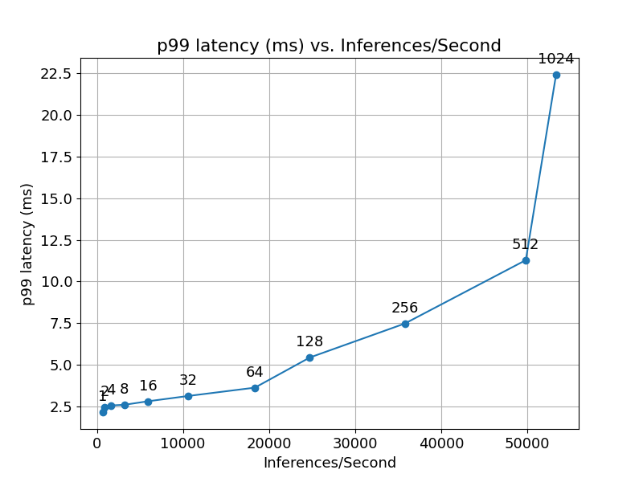

# Deploying the TFT model on Triton Inference Server

This folder contains instructions for deployment to run inference
on Triton Inference Server as well as a detailed performance analysis.
The purpose of this document is to help you with achieving
the best inference performance.

## Table of contents
  - [Solution overview](#solution-overview)
    - [Introduction](#introduction)
    - [Deployment process](#deployment-process)
  - [Setup](#setup)
  - [Quick Start Guide](#quick-start-guide)
  - [Performance](#performance)
    - [Offline scenario](#offline-scenario)
        - [Offline: NVIDIA A30, NVIDIA TensorRT with FP16, Dataset: electricity](#offline-nvidia-a30-nvidia-tensorrt-with-fp16-dataset-electricity)
        - [Offline: NVIDIA A30, NVIDIA TensorRT with FP16, Dataset: traffic](#offline-nvidia-a30-nvidia-tensorrt-with-fp16-dataset-traffic)
        - [Offline: NVIDIA A30, PyTorch with FP16, Dataset: electricity](#offline-nvidia-a30-pytorch-with-fp16-dataset-electricity)
        - [Offline: NVIDIA A30, PyTorch with FP16, Dataset: traffic](#offline-nvidia-a30-pytorch-with-fp16-dataset-traffic)
        - [Offline: NVIDIA DGX-1 (1x V100 32GB), NVIDIA TensorRT with FP16, Dataset: electricity](#offline-nvidia-dgx-1-1x-v100-32gb-nvidia-tensorrt-with-fp16-dataset-electricity)
        - [Offline: NVIDIA DGX-1 (1x V100 32GB), NVIDIA TensorRT with FP16, Dataset: traffic](#offline-nvidia-dgx-1-1x-v100-32gb-nvidia-tensorrt-with-fp16-dataset-traffic)
        - [Offline: NVIDIA DGX-1 (1x V100 32GB), PyTorch with FP16, Dataset: electricity](#offline-nvidia-dgx-1-1x-v100-32gb-pytorch-with-fp16-dataset-electricity)
        - [Offline: NVIDIA DGX-1 (1x V100 32GB), PyTorch with FP16, Dataset: traffic](#offline-nvidia-dgx-1-1x-v100-32gb-pytorch-with-fp16-dataset-traffic)
        - [Offline: NVIDIA DGX A100 (1x A100 80GB), NVIDIA TensorRT with FP16, Dataset: electricity](#offline-nvidia-dgx-a100-1x-a100-80gb-nvidia-tensorrt-with-fp16-dataset-electricity)
        - [Offline: NVIDIA DGX A100 (1x A100 80GB), NVIDIA TensorRT with FP16, Dataset: traffic](#offline-nvidia-dgx-a100-1x-a100-80gb-nvidia-tensorrt-with-fp16-dataset-traffic)
        - [Offline: NVIDIA DGX A100 (1x A100 80GB), PyTorch with FP16, Dataset: electricity](#offline-nvidia-dgx-a100-1x-a100-80gb-pytorch-with-fp16-dataset-electricity)
        - [Offline: NVIDIA DGX A100 (1x A100 80GB), PyTorch with FP16, Dataset: traffic](#offline-nvidia-dgx-a100-1x-a100-80gb-pytorch-with-fp16-dataset-traffic)
        - [Offline: NVIDIA T4, NVIDIA TensorRT with FP16, Dataset: electricity](#offline-nvidia-t4-nvidia-tensorrt-with-fp16-dataset-electricity)
        - [Offline: NVIDIA T4, NVIDIA TensorRT with FP16, Dataset: traffic](#offline-nvidia-t4-nvidia-tensorrt-with-fp16-dataset-traffic)
        - [Offline: NVIDIA T4, PyTorch with FP16, Dataset: electricity](#offline-nvidia-t4-pytorch-with-fp16-dataset-electricity)
        - [Offline: NVIDIA T4, PyTorch with FP16, Dataset: traffic](#offline-nvidia-t4-pytorch-with-fp16-dataset-traffic)
    - [Online scenario](#online-scenario)
        - [Online: NVIDIA A30, NVIDIA TensorRT with FP16, Dataset: electricity](#online-nvidia-a30-nvidia-tensorrt-with-fp16-dataset-electricity)
        - [Online: NVIDIA A30, NVIDIA TensorRT with FP16, Dataset: traffic](#online-nvidia-a30-nvidia-tensorrt-with-fp16-dataset-traffic)
        - [Online: NVIDIA A30, PyTorch with FP16, Dataset: electricity](#online-nvidia-a30-pytorch-with-fp16-dataset-electricity)
        - [Online: NVIDIA A30, PyTorch with FP16, Dataset: traffic](#online-nvidia-a30-pytorch-with-fp16-dataset-traffic)
        - [Online: NVIDIA DGX-1 (1x V100 32GB), NVIDIA TensorRT with FP16, Dataset: electricity](#online-nvidia-dgx-1-1x-v100-32gb-nvidia-tensorrt-with-fp16-dataset-electricity)
        - [Online: NVIDIA DGX-1 (1x V100 32GB), NVIDIA TensorRT with FP16, Dataset: traffic](#online-nvidia-dgx-1-1x-v100-32gb-nvidia-tensorrt-with-fp16-dataset-traffic)
        - [Online: NVIDIA DGX-1 (1x V100 32GB), PyTorch with FP16, Dataset: electricity](#online-nvidia-dgx-1-1x-v100-32gb-pytorch-with-fp16-dataset-electricity)
        - [Online: NVIDIA DGX-1 (1x V100 32GB), PyTorch with FP16, Dataset: traffic](#online-nvidia-dgx-1-1x-v100-32gb-pytorch-with-fp16-dataset-traffic)
        - [Online: NVIDIA DGX A100 (1x A100 80GB), NVIDIA TensorRT with FP16, Dataset: electricity](#online-nvidia-dgx-a100-1x-a100-80gb-nvidia-tensorrt-with-fp16-dataset-electricity)
        - [Online: NVIDIA DGX A100 (1x A100 80GB), NVIDIA TensorRT with FP16, Dataset: traffic](#online-nvidia-dgx-a100-1x-a100-80gb-nvidia-tensorrt-with-fp16-dataset-traffic)
        - [Online: NVIDIA DGX A100 (1x A100 80GB), PyTorch with FP16, Dataset: electricity](#online-nvidia-dgx-a100-1x-a100-80gb-pytorch-with-fp16-dataset-electricity)
        - [Online: NVIDIA DGX A100 (1x A100 80GB), PyTorch with FP16, Dataset: traffic](#online-nvidia-dgx-a100-1x-a100-80gb-pytorch-with-fp16-dataset-traffic)
        - [Online: NVIDIA T4, NVIDIA TensorRT with FP16, Dataset: electricity](#online-nvidia-t4-nvidia-tensorrt-with-fp16-dataset-electricity)
        - [Online: NVIDIA T4, NVIDIA TensorRT with FP16, Dataset: traffic](#online-nvidia-t4-nvidia-tensorrt-with-fp16-dataset-traffic)
        - [Online: NVIDIA T4, PyTorch with FP16, Dataset: electricity](#online-nvidia-t4-pytorch-with-fp16-dataset-electricity)
        - [Online: NVIDIA T4, PyTorch with FP16, Dataset: traffic](#online-nvidia-t4-pytorch-with-fp16-dataset-traffic)
  - [Advanced](#advanced)
    - [Step by step deployment process](#step-by-step-deployment-process)
    - [Latency explanation](#latency-explanation)
  - [Release notes](#release-notes)
    - [Changelog](#changelog)
    - [Known issues](#known-issues)


## Solution overview
### Introduction
The [NVIDIA Triton Inference Server](https://github.com/NVIDIA/triton-inference-server)
provides a datacenter and cloud inferencing solution optimized for NVIDIA GPUs.
The server provides an inference service via an HTTP or gRPC endpoint,
allowing remote clients to request inferencing for any number of GPU
or CPU models being managed by the server.

This README provides step-by-step deployment instructions for models generated
during training (as described in the [model README](../readme.md)).
Additionally, this README provides the corresponding deployment scripts that
ensure optimal GPU utilization during inferencing on Triton Inference Server.

### Deployment process

The deployment process consists of two steps:

1. Conversion.

   The purpose of conversion is to find the best performing model
   format supported by Triton Inference Server.
   Triton Inference Server uses a number of runtime backends such as
   [TensorRT](https://developer.nvidia.com/tensorrt),
   [LibTorch](https://github.com/triton-inference-server/pytorch_backend) and 
   [ONNX Runtime](https://github.com/triton-inference-server/onnxruntime_backend)
   to support various model types. Refer to the
   [Triton documentation](https://github.com/triton-inference-server/backend#where-can-i-find-all-the-backends-that-are-available-for-triton)
   for a list of available backends.

2. Configuration.

   Model configuration on Triton Inference Server, which generates
   necessary [configuration files](https://github.com/triton-inference-server/server/blob/master/docs/model_configuration.md).

After deployment Triton inference server is used for evaluation of converted model in two steps:

1. Accuracy tests.

   Produce results which are tested against given accuracy thresholds.

2. Performance tests.

   Produce latency and throughput results for offline (static batching)
   and online (dynamic batching) scenarios.


All steps are executed by provided runner script. Refer to [Quick Start Guide](#quick-start-guide)


## Setup
Ensure you have the following components:
* [NVIDIA Docker](https://github.com/NVIDIA/nvidia-docker)
* [PyTorch NGC container 21.12](https://catalog.ngc.nvidia.com/orgs/nvidia/containers/pytorch)
* [Triton Inference Server NGC container 21.12](https://ngc.nvidia.com/catalog/containers/nvidia:tritonserver)
* [NVIDIA CUDA](https://docs.nvidia.com/cuda/archive//index.html)
* [NVIDIA Ampere](https://www.nvidia.com/en-us/data-center/nvidia-ampere-gpu-architecture/), [Volta](https://www.nvidia.com/en-us/data-center/volta-gpu-architecture/) or [Turing](https://www.nvidia.com/en-us/geforce/turing/) based GPU


## Quick Start Guide
Running the following scripts will build and launch the container with all required dependencies for native PyTorch as well as Triton Inference Server. This is necessary for running inference and can also be used for data download, processing, and training of the model.

1. Clone the repository.

```
git clone https://github.com/NVIDIA/DeepLearningExamples.git
cd DeepLearningExamples/PyTorch/Forecasting/TFT
```

2. Prepare dataset.
Please use the data download from the [Main QSG](https://github.com/NVIDIA/DeepLearningExamples/tree/master/PyTorch/Forecasting/TFT#quick-start-guide)


3. Build and run a container that extends NGC PyTorch with the Triton client libraries and necessary dependencies.

```
bash ./triton/scripts/docker/build.sh
bash ./triton/scripts/docker/interactive.sh /path/to/your/data/
```

4. Execute runner script (please mind, the run scripts are prepared per NVIDIA GPU).

```
NVIDIA A30: bash ./triton/runner/start_NVIDIA-A30.sh

NVIDIA DGX-1 (1x V100 32GB): bash ./triton/runner/start_NVIDIA-DGX-1-\(1x-V100-32GB\).sh

NVIDIA DGX A100 (1x A100 80GB): bash ./triton/runner/start_NVIDIA-DGX-A100-\(1x-A100-80GB\).sh

NVIDIA T4: bash ./triton/runner/start_NVIDIA-T4.sh
```

If one encounters an error like `the provided PTX was compiled with an unsupported toolchain`, follow the steps in
[Step by step deployment process](#step-by-step-deployment-process).

## Performance
The performance measurements in this document were conducted at the time of publication and may not reflect
the performance achieved from NVIDIA’s latest software release. For the most up-to-date performance measurements, go to
[NVIDIA Data Center Deep Learning Product Performance](https://developer.nvidia.com/deep-learning-performance-training-inference).
### Offline scenario

The offline scenario assumes the client and server are located on the same host. The tests uses:
- tensors are passed through shared memory between client and server, the Perf Analyzer flag `shared-memory=system` is used
- single request is send from client to server with static size of batch


#### Offline: NVIDIA A30, NVIDIA TensorRT with FP16, Dataset: electricity

Our results were obtained using the following configuration:

| Parameter Name               | Parameter Value              |
|:-----------------------------|:-----------------------------|
| GPU                          |NVIDIA A30            |
| Backend                      |NVIDIA TensorRT        |
| Precision                    |FP16      |
| Model format                 |NVIDIA TensorRT   |
| Max batch size               |1024 |
| Number of model instances    |2|
| Export Precision | FP32    |
| NVIDIA TensorRT Capture CUDA Graph | Disabled    |
| Dataset | electricity                 |
| Device | gpu                 |
| Request Count | 500                 |


<table>
<tbody>
  <tr>
    <td colspan="2" align="center"></td>
  </tr>
</tbody>
</table>

<details>
<summary>Results Table</summary>

|   Batch |   Concurrency |   Inferences/Second |   Client Send (ms) |   Network+Server Send/Recv (ms) |   Server Queue (ms) |   Server Compute Input (ms) |   Server Compute Infer (ms) |   Server Compute Output (ms) |   Client Recv (ms) |   p50 latency (ms) |   p90 latency (ms) |   p95 latency (ms) |   p99 latency (ms) |   avg latency (ms) |
|--------:|--------------:|--------------------:|-------------------:|--------------------------------:|--------------------:|----------------------------:|----------------------------:|-----------------------------:|-------------------:|-------------------:|-------------------:|-------------------:|-------------------:|-------------------:|
|       1 |             1 |               595.0 |                0.0 |                             0.2 |                 0.1 |                         0.1 |                         1.3 |                          0.0 |                0.0 |                1.7 |                1.7 |                1.8 |                1.8 |                1.7 |
|       2 |             1 |               804.6 |                0.0 |                             0.1 |                 0.0 |                         0.1 |                         2.1 |                          0.1 |                0.0 |                2.5 |                2.6 |                2.6 |                2.6 |                2.5 |
|       4 |             1 |              1500.0 |                0.0 |                             0.2 |                 0.1 |                         0.1 |                         2.2 |                          0.1 |                0.0 |                2.7 |                2.7 |                2.7 |                2.8 |                2.7 |
|       8 |             1 |              2696.0 |                0.1 |                             0.2 |                 0.1 |                         0.1 |                         2.5 |                          0.0 |                0.0 |                2.9 |                3.0 |                3.1 |                3.3 |                3.0 |
|      16 |             1 |              4704.0 |                0.1 |                             0.2 |                 0.1 |                         0.1 |                         2.9 |                          0.0 |                0.0 |                3.4 |                3.5 |                3.6 |                3.8 |                3.4 |
|      32 |             1 |              8576.0 |                0.1 |                             0.2 |                 0.0 |                         0.1 |                         3.2 |                          0.1 |                0.0 |                3.7 |                3.9 |                3.9 |                4.0 |                3.7 |
|      64 |             1 |             14101.3 |                0.1 |                             0.2 |                 0.0 |                         0.1 |                         4.0 |                          0.0 |                0.0 |                4.5 |                4.6 |                4.7 |                5.2 |                4.5 |
|     128 |             1 |             19227.2 |                0.1 |                             0.2 |                 0.1 |                         0.1 |                         6.1 |                          0.0 |                0.0 |                6.5 |                6.7 |                8.0 |                8.3 |                6.6 |
|     256 |             1 |             24401.3 |                0.1 |                             0.3 |                 0.1 |                         0.2 |                         9.8 |                          0.0 |                0.0 |               10.4 |               10.5 |               11.4 |               11.6 |               10.5 |
|     512 |             1 |             27235.7 |                0.1 |                             0.4 |                 0.1 |                         1.0 |                        17.1 |                          0.1 |                0.0 |               18.8 |               18.8 |               18.8 |               18.8 |               18.8 |
|    1024 |             1 |             28782.6 |                0.1 |                             0.4 |                 0.1 |                         1.9 |                        32.9 |                          0.2 |                0.0 |               35.5 |               35.6 |               35.6 |               35.7 |               35.5 |

</details>


#### Offline: NVIDIA A30, NVIDIA TensorRT with FP16, Dataset: traffic

Our results were obtained using the following configuration:

| Parameter Name               | Parameter Value              |
|:-----------------------------|:-----------------------------|
| GPU                          |NVIDIA A30            |
| Backend                      |NVIDIA TensorRT        |
| Precision                    |FP16      |
| Model format                 |NVIDIA TensorRT   |
| Max batch size               |1024 |
| Number of model instances    |2|
| Export Precision | FP32    |
| NVIDIA TensorRT Capture CUDA Graph | Disabled    |
| Dataset | traffic                 |
| Device | gpu                 |
| Request Count | 500                 |


<table>
<tbody>
  <tr>
    <td colspan="2" align="center"></td>
  </tr>
</tbody>
</table>

<details>
<summary>Results Table</summary>

|   Batch |   Concurrency |   Inferences/Second |   Client Send (ms) |   Network+Server Send/Recv (ms) |   Server Queue (ms) |   Server Compute Input (ms) |   Server Compute Infer (ms) |   Server Compute Output (ms) |   Client Recv (ms) |   p50 latency (ms) |   p90 latency (ms) |   p95 latency (ms) |   p99 latency (ms) |   avg latency (ms) |
|--------:|--------------:|--------------------:|-------------------:|--------------------------------:|--------------------:|----------------------------:|----------------------------:|-----------------------------:|-------------------:|-------------------:|-------------------:|-------------------:|-------------------:|-------------------:|
|       1 |             1 |               605.4 |                0.0 |                             0.2 |                 0.0 |                         0.1 |                         1.3 |                          0.0 |                0.0 |                1.6 |                1.7 |                1.7 |                1.7 |                1.6 |
|       2 |             1 |               840.0 |                0.0 |                             0.1 |                 0.0 |                         0.1 |                         2.1 |                          0.0 |                0.0 |                2.4 |                2.4 |                2.4 |                2.5 |                2.4 |
|       4 |             1 |              1638.0 |                0.0 |                             0.1 |                 0.0 |                         0.1 |                         2.2 |                          0.0 |                0.0 |                2.4 |                2.5 |                2.5 |                2.6 |                2.4 |
|       8 |             1 |              2876.0 |                0.0 |                             0.1 |                 0.0 |                         0.1 |                         2.5 |                          0.0 |                0.0 |                2.8 |                2.9 |                2.9 |                2.9 |                2.8 |
|      16 |             1 |              5168.0 |                0.0 |                             0.1 |                 0.0 |                         0.1 |                         2.8 |                          0.0 |                0.0 |                3.1 |                3.3 |                3.3 |                3.4 |                3.1 |
|      32 |             1 |              8576.0 |                0.0 |                             0.1 |                 0.0 |                         0.1 |                         3.3 |                          0.0 |                0.0 |                3.7 |                3.9 |                4.0 |                4.1 |                3.7 |
|      64 |             1 |             14592.0 |                0.0 |                             0.1 |                 0.0 |                         0.1 |                         4.0 |                          0.0 |                0.0 |                4.3 |                4.5 |                4.5 |                4.7 |                4.4 |
|     128 |             1 |             19520.0 |                0.0 |                             0.1 |                 0.0 |                         0.1 |                         6.2 |                          0.0 |                0.0 |                6.5 |                6.6 |                7.9 |                8.3 |                6.5 |
|     256 |             1 |             24832.0 |                0.0 |                             0.2 |                 0.0 |                         0.2 |                         9.8 |                          0.0 |                0.0 |               10.2 |               10.4 |               10.9 |               11.1 |               10.3 |
|     512 |             1 |             27235.7 |                0.1 |                             0.4 |                 0.1 |                         1.1 |                        17.0 |                          0.1 |                0.0 |               18.8 |               18.8 |               18.8 |               18.9 |               18.8 |
|    1024 |             1 |             28725.7 |                0.1 |                             0.4 |                 0.1 |                         2.0 |                        32.9 |                          0.2 |                0.0 |               35.6 |               35.7 |               35.7 |               35.8 |               35.6 |

</details>


#### Offline: NVIDIA A30, PyTorch with FP16, Dataset: electricity

Our results were obtained using the following configuration:

| Parameter Name               | Parameter Value              |
|:-----------------------------|:-----------------------------|
| GPU                          |NVIDIA A30            |
| Backend                      |PyTorch        |
| Precision                    |FP16      |
| Model format                 |TorchScript Trace   |
| Max batch size               |1024 |
| Number of model instances    |2|
| Export Precision | FP32    |
| Dataset | electricity                 |
| Device | gpu                 |
| Request Count | 500                 |


<table>
<tbody>
  <tr>
    <td colspan="2" align="center"></td>
  </tr>
</tbody>
</table>

<details>
<summary>Results Table</summary>

|   Batch |   Concurrency |   Inferences/Second |   Client Send (ms) |   Network+Server Send/Recv (ms) |   Server Queue (ms) |   Server Compute Input (ms) |   Server Compute Infer (ms) |   Server Compute Output (ms) |   Client Recv (ms) |   p50 latency (ms) |   p90 latency (ms) |   p95 latency (ms) |   p99 latency (ms) |   avg latency (ms) |
|--------:|--------------:|--------------------:|-------------------:|--------------------------------:|--------------------:|----------------------------:|----------------------------:|-----------------------------:|-------------------:|-------------------:|-------------------:|-------------------:|-------------------:|-------------------:|
|       1 |             1 |               126.5 |                0.1 |                             0.4 |                 0.1 |                         0.1 |                         7.2 |                          0.0 |                0.0 |                7.8 |                8.0 |                8.8 |                9.5 |                7.9 |
|       2 |             1 |               234.8 |                0.1 |                             0.4 |                 0.1 |                         0.1 |                         7.8 |                          0.0 |                0.0 |                8.3 |                9.9 |               10.1 |               10.3 |                8.5 |
|       4 |             1 |               431.1 |                0.1 |                             0.4 |                 0.1 |                         0.1 |                         8.5 |                          0.0 |                0.0 |                8.6 |               10.3 |               10.4 |               10.5 |                9.2 |
|       8 |             1 |               860.8 |                0.1 |                             0.4 |                 0.1 |                         0.2 |                         8.5 |                          0.0 |                0.0 |                8.9 |               10.5 |               10.7 |               10.8 |                9.3 |
|      16 |             1 |              1747.2 |                0.1 |                             0.5 |                 0.1 |                         0.2 |                         8.3 |                          0.0 |                0.0 |                8.8 |               10.5 |               10.6 |               10.7 |                9.1 |
|      32 |             1 |              3205.8 |                0.1 |                             0.4 |                 0.1 |                         0.2 |                         9.1 |                          0.0 |                0.0 |                9.8 |               11.2 |               11.3 |               11.4 |               10.0 |
|      64 |             1 |              6249.6 |                0.1 |                             0.4 |                 0.1 |                         0.3 |                         8.9 |                          0.4 |                0.0 |                9.7 |               11.5 |               11.5 |               11.6 |               10.2 |
|     128 |             1 |              9216.0 |                0.1 |                             0.3 |                 0.1 |                         0.5 |                         8.9 |                          3.9 |                0.0 |               13.9 |               14.1 |               14.2 |               14.4 |               13.9 |
|     256 |             1 |             11369.7 |                0.1 |                             0.3 |                 0.1 |                         0.9 |                         5.3 |                         15.8 |                0.0 |               22.5 |               22.7 |               22.7 |               23.0 |               22.5 |
|     512 |             1 |             12383.8 |                0.1 |                             0.3 |                 0.1 |                         1.6 |                         5.4 |                         33.8 |                0.0 |               41.3 |               41.5 |               41.6 |               41.7 |               41.3 |
|    1024 |             1 |             12849.9 |                0.1 |                             0.4 |                 0.1 |                         3.2 |                         5.6 |                         70.2 |                0.0 |               79.6 |               80.0 |               80.1 |               80.3 |               79.6 |

</details>


#### Offline: NVIDIA A30, PyTorch with FP16, Dataset: traffic

Our results were obtained using the following configuration:

| Parameter Name               | Parameter Value              |
|:-----------------------------|:-----------------------------|
| GPU                          |NVIDIA A30            |
| Backend                      |PyTorch        |
| Precision                    |FP16      |
| Model format                 |TorchScript Trace   |
| Max batch size               |1024 |
| Number of model instances    |2|
| Export Precision | FP32    |
| Dataset | traffic                 |
| Device | gpu                 |
| Request Count | 500                 |


<table>
<tbody>
  <tr>
    <td colspan="2" align="center"></td>
  </tr>
</tbody>
</table>

<details>
<summary>Results Table</summary>

|   Batch |   Concurrency |   Inferences/Second |   Client Send (ms) |   Network+Server Send/Recv (ms) |   Server Queue (ms) |   Server Compute Input (ms) |   Server Compute Infer (ms) |   Server Compute Output (ms) |   Client Recv (ms) |   p50 latency (ms) |   p90 latency (ms) |   p95 latency (ms) |   p99 latency (ms) |   avg latency (ms) |
|--------:|--------------:|--------------------:|-------------------:|--------------------------------:|--------------------:|----------------------------:|----------------------------:|-----------------------------:|-------------------:|-------------------:|-------------------:|-------------------:|-------------------:|-------------------:|
|       1 |             1 |               189.0 |                0.1 |                             0.3 |                 0.0 |                         0.1 |                         4.8 |                          0.0 |                0.0 |                4.6 |                7.4 |                7.4 |                8.5 |                5.3 |
|       2 |             1 |               252.9 |                0.1 |                             0.4 |                 0.1 |                         0.1 |                         7.2 |                          0.0 |                0.0 |                7.9 |                8.0 |                8.0 |                8.1 |                7.9 |
|       4 |             1 |               500.0 |                0.1 |                             0.4 |                 0.1 |                         0.1 |                         7.3 |                          0.0 |                0.0 |                8.0 |                8.0 |                8.0 |                9.2 |                8.0 |
|       8 |             1 |               998.0 |                0.1 |                             0.3 |                 0.1 |                         0.1 |                         7.4 |                          0.0 |                0.0 |                8.0 |                8.0 |                8.1 |                8.2 |                8.0 |
|      16 |             1 |              1996.0 |                0.1 |                             0.3 |                 0.1 |                         0.1 |                         7.4 |                          0.0 |                0.0 |                8.0 |                8.1 |                8.1 |                9.1 |                8.0 |
|      32 |             1 |              3750.4 |                0.1 |                             0.4 |                 0.1 |                         0.1 |                         7.8 |                          0.0 |                0.0 |                8.5 |                8.6 |                8.7 |               10.3 |                8.5 |
|      64 |             1 |              7179.4 |                0.1 |                             0.4 |                 0.1 |                         0.2 |                         7.7 |                          0.4 |                0.0 |                8.9 |                9.0 |                9.1 |                9.4 |                8.9 |
|     128 |             1 |              9946.0 |                0.1 |                             0.3 |                 0.1 |                         0.3 |                         7.3 |                          4.8 |                0.0 |               12.8 |               13.3 |               13.6 |               13.7 |               12.8 |
|     256 |             1 |             11821.5 |                0.0 |                             0.2 |                 0.0 |                         0.6 |                         5.0 |                         15.8 |                0.0 |               21.6 |               21.8 |               21.8 |               21.8 |               21.6 |
|     512 |             1 |             12825.0 |                0.0 |                             0.2 |                 0.0 |                         0.8 |                         5.0 |                         33.8 |                0.0 |               40.0 |               40.3 |               40.5 |               40.6 |               39.8 |
|    1024 |             1 |             13284.7 |                0.0 |                             0.2 |                 0.0 |                         1.8 |                         5.3 |                         69.7 |                0.0 |               77.3 |               77.7 |               77.8 |               77.9 |               77.1 |

</details>


#### Offline: NVIDIA DGX-1 (1x V100 32GB), NVIDIA TensorRT with FP16, Dataset: electricity

Our results were obtained using the following configuration:

| Parameter Name               | Parameter Value              |
|:-----------------------------|:-----------------------------|
| GPU                          |NVIDIA DGX-1 (1x V100 32GB)            |
| Backend                      |NVIDIA TensorRT        |
| Precision                    |FP16      |
| Model format                 |NVIDIA TensorRT   |
| Max batch size               |1024 |
| Number of model instances    |2|
| Export Precision | FP32    |
| NVIDIA TensorRT Capture CUDA Graph | Disabled    |
| Dataset | electricity                 |
| Device | gpu                 |
| Request Count | 500                 |


<table>
<tbody>
  <tr>
    <td colspan="2" align="center"></td>
  </tr>
</tbody>
</table>

<details>
<summary>Results Table</summary>

|   Batch |   Concurrency |   Inferences/Second |   Client Send (ms) |   Network+Server Send/Recv (ms) |   Server Queue (ms) |   Server Compute Input (ms) |   Server Compute Infer (ms) |   Server Compute Output (ms) |   Client Recv (ms) |   p50 latency (ms) |   p90 latency (ms) |   p95 latency (ms) |   p99 latency (ms) |   avg latency (ms) |
|--------:|--------------:|--------------------:|-------------------:|--------------------------------:|--------------------:|----------------------------:|----------------------------:|-----------------------------:|-------------------:|-------------------:|-------------------:|-------------------:|-------------------:|-------------------:|
|       1 |             1 |               416.5 |                0.1 |                             0.2 |                 0.1 |                         0.1 |                         1.8 |                          0.0 |                0.0 |                2.4 |                2.5 |                2.5 |                2.6 |                2.4 |
|       2 |             1 |               770.6 |                0.1 |                             0.3 |                 0.1 |                         0.2 |                         1.9 |                          0.0 |                0.0 |                2.6 |                2.6 |                2.7 |                2.7 |                2.6 |
|       4 |             1 |              1427.3 |                0.1 |                             0.2 |                 0.1 |                         0.2 |                         2.2 |                          0.0 |                0.0 |                2.8 |                2.9 |                2.9 |                3.0 |                2.8 |
|       8 |             1 |              2604.0 |                0.1 |                             0.3 |                 0.1 |                         0.2 |                         2.4 |                          0.0 |                0.0 |                3.1 |                3.2 |                3.2 |                3.3 |                3.1 |
|      16 |             1 |              4480.0 |                0.1 |                             0.3 |                 0.1 |                         0.2 |                         2.9 |                          0.0 |                0.0 |                3.6 |                3.7 |                3.7 |                3.8 |                3.6 |
|      32 |             1 |              7274.7 |                0.1 |                             0.2 |                 0.1 |                         0.2 |                         3.9 |                          0.0 |                0.0 |                4.4 |                4.5 |                4.5 |                4.6 |                4.4 |
|      64 |             1 |             10922.7 |                0.1 |                             0.2 |                 0.1 |                         0.2 |                         5.3 |                          0.0 |                0.0 |                5.8 |                6.0 |                6.0 |                6.1 |                5.8 |
|     128 |             1 |             13744.5 |                0.1 |                             0.2 |                 0.1 |                         0.2 |                         8.7 |                          0.0 |                0.0 |                9.3 |                9.4 |                9.4 |                9.6 |                9.3 |
|     256 |             1 |             17341.8 |                0.1 |                             0.2 |                 0.1 |                         0.3 |                        14.0 |                          0.0 |                0.0 |               14.7 |               14.9 |               14.9 |               15.1 |               14.7 |
|     512 |             1 |             20439.0 |                0.1 |                             0.2 |                 0.1 |                         0.5 |                        24.1 |                          0.0 |                0.0 |               25.0 |               25.1 |               25.2 |               25.6 |               25.0 |
|    1024 |             1 |             23410.2 |                0.1 |                             0.3 |                 0.1 |                         0.7 |                        42.5 |                          0.0 |                0.0 |               43.6 |               43.8 |               43.9 |               44.6 |               43.7 |

</details>


#### Offline: NVIDIA DGX-1 (1x V100 32GB), NVIDIA TensorRT with FP16, Dataset: traffic

Our results were obtained using the following configuration:

| Parameter Name               | Parameter Value              |
|:-----------------------------|:-----------------------------|
| GPU                          |NVIDIA DGX-1 (1x V100 32GB)            |
| Backend                      |NVIDIA TensorRT        |
| Precision                    |FP16      |
| Model format                 |NVIDIA TensorRT   |
| Max batch size               |1024 |
| Number of model instances    |2|
| Export Precision | FP32    |
| NVIDIA TensorRT Capture CUDA Graph | Disabled    |
| Dataset | traffic                 |
| Device | gpu                 |
| Request Count | 500                 |


<table>
<tbody>
  <tr>
    <td colspan="2" align="center"></td>
  </tr>
</tbody>
</table>

<details>
<summary>Results Table</summary>

|   Batch |   Concurrency |   Inferences/Second |   Client Send (ms) |   Network+Server Send/Recv (ms) |   Server Queue (ms) |   Server Compute Input (ms) |   Server Compute Infer (ms) |   Server Compute Output (ms) |   Client Recv (ms) |   p50 latency (ms) |   p90 latency (ms) |   p95 latency (ms) |   p99 latency (ms) |   avg latency (ms) |
|--------:|--------------:|--------------------:|-------------------:|--------------------------------:|--------------------:|----------------------------:|----------------------------:|-----------------------------:|-------------------:|-------------------:|-------------------:|-------------------:|-------------------:|-------------------:|
|       1 |             1 |               406.0 |                0.1 |                             0.2 |                 0.1 |                         0.2 |                         1.8 |                          0.0 |                0.0 |                2.4 |                2.5 |                2.5 |                2.6 |                2.5 |
|       2 |             1 |               775.0 |                0.1 |                             0.2 |                 0.1 |                         0.2 |                         2.0 |                          0.0 |                0.0 |                2.6 |                2.7 |                2.7 |                2.8 |                2.6 |
|       4 |             1 |              1431.3 |                0.1 |                             0.2 |                 0.1 |                         0.2 |                         2.2 |                          0.0 |                0.0 |                2.8 |                3.0 |                3.0 |                3.2 |                2.8 |
|       8 |             1 |              2644.0 |                0.1 |                             0.2 |                 0.1 |                         0.1 |                         2.5 |                          0.0 |                0.0 |                3.0 |                3.1 |                3.1 |                3.1 |                3.0 |
|      16 |             1 |              4824.0 |                0.1 |                             0.2 |                 0.1 |                         0.2 |                         2.7 |                          0.0 |                0.0 |                3.3 |                3.4 |                3.4 |                3.5 |                3.3 |
|      32 |             1 |              7637.3 |                0.1 |                             0.2 |                 0.1 |                         0.2 |                         3.6 |                          0.0 |                0.0 |                4.2 |                4.3 |                4.3 |                4.4 |                4.2 |
|      64 |             1 |             10919.0 |                0.1 |                             0.3 |                 0.1 |                         0.2 |                         5.2 |                          0.0 |                0.0 |                5.8 |                5.9 |                6.0 |                6.0 |                5.8 |
|     128 |             1 |             13488.5 |                0.1 |                             0.2 |                 0.1 |                         0.2 |                         8.8 |                          0.0 |                0.0 |                9.4 |                9.7 |                9.8 |               10.0 |                9.5 |
|     256 |             1 |             17216.0 |                0.1 |                             0.2 |                 0.1 |                         0.3 |                        14.2 |                          0.0 |                0.0 |               14.8 |               15.0 |               15.1 |               15.2 |               14.8 |
|     512 |             1 |             20596.6 |                0.1 |                             0.3 |                 0.1 |                         0.5 |                        23.9 |                          0.0 |                0.0 |               24.8 |               25.0 |               25.1 |               25.3 |               24.8 |
|    1024 |             1 |             23456.8 |                0.1 |                             0.2 |                 0.1 |                         0.7 |                        42.6 |                          0.0 |                0.0 |               43.7 |               44.3 |               44.4 |               44.9 |               43.6 |

</details>


#### Offline: NVIDIA DGX-1 (1x V100 32GB), PyTorch with FP16, Dataset: electricity

Our results were obtained using the following configuration:

| Parameter Name               | Parameter Value              |
|:-----------------------------|:-----------------------------|
| GPU                          |NVIDIA DGX-1 (1x V100 32GB)            |
| Backend                      |PyTorch        |
| Precision                    |FP16      |
| Model format                 |TorchScript Trace   |
| Max batch size               |1024 |
| Number of model instances    |2|
| Export Precision | FP32    |
| Dataset | electricity                 |
| Device | gpu                 |
| Request Count | 500                 |


<table>
<tbody>
  <tr>
    <td colspan="2" align="center"></td>
  </tr>
</tbody>
</table>

<details>
<summary>Results Table</summary>

|   Batch |   Concurrency |   Inferences/Second |   Client Send (ms) |   Network+Server Send/Recv (ms) |   Server Queue (ms) |   Server Compute Input (ms) |   Server Compute Infer (ms) |   Server Compute Output (ms) |   Client Recv (ms) |   p50 latency (ms) |   p90 latency (ms) |   p95 latency (ms) |   p99 latency (ms) |   avg latency (ms) |
|--------:|--------------:|--------------------:|-------------------:|--------------------------------:|--------------------:|----------------------------:|----------------------------:|-----------------------------:|-------------------:|-------------------:|-------------------:|-------------------:|-------------------:|-------------------:|
|       1 |             1 |               134.2 |                0.1 |                             0.3 |                 0.1 |                         0.1 |                         6.9 |                          0.0 |                0.0 |                8.1 |                8.3 |                8.4 |                9.1 |                7.4 |
|       2 |             1 |               271.5 |                0.0 |                             0.2 |                 0.1 |                         0.1 |                         6.9 |                          0.0 |                0.0 |                7.2 |                8.2 |                8.3 |                8.3 |                7.3 |
|       4 |             1 |               524.9 |                0.1 |                             0.3 |                 0.1 |                         0.1 |                         7.1 |                          0.0 |                0.0 |                8.3 |                8.5 |                8.9 |                9.6 |                7.6 |
|       8 |             1 |              1044.0 |                0.1 |                             0.3 |                 0.1 |                         0.1 |                         7.1 |                          0.0 |                0.0 |                8.4 |                8.5 |                8.6 |                9.5 |                7.6 |
|      16 |             1 |              2119.5 |                0.1 |                             0.3 |                 0.1 |                         0.1 |                         7.0 |                          0.0 |                0.0 |                8.2 |                8.4 |                8.5 |                8.8 |                7.5 |
|      32 |             1 |              3775.2 |                0.1 |                             0.3 |                 0.1 |                         0.1 |                         7.9 |                          0.0 |                0.0 |                9.2 |                9.4 |                9.4 |                9.5 |                8.4 |
|      64 |             1 |              6424.3 |                0.1 |                             0.3 |                 0.1 |                         0.1 |                         7.9 |                          1.5 |                0.0 |                9.9 |               10.1 |               10.1 |               10.6 |                9.9 |
|     128 |             1 |              8528.0 |                0.1 |                             0.2 |                 0.1 |                         0.2 |                         8.0 |                          6.4 |                0.0 |               15.1 |               15.2 |               15.3 |               15.4 |               15.0 |
|     256 |             1 |             10644.4 |                0.1 |                             0.3 |                 0.1 |                         0.3 |                         8.0 |                         15.3 |                0.0 |               24.1 |               24.3 |               24.3 |               24.7 |               24.0 |
|     512 |             1 |             12213.7 |                0.1 |                             0.3 |                 0.1 |                         0.5 |                         7.3 |                         33.8 |                0.0 |               41.9 |               42.1 |               42.1 |               42.2 |               41.9 |
|    1024 |             1 |             13153.4 |                0.1 |                             0.3 |                 0.1 |                         0.8 |                         6.6 |                         69.9 |                0.0 |               77.7 |               77.8 |               77.9 |               78.1 |               77.7 |

</details>


#### Offline: NVIDIA DGX-1 (1x V100 32GB), PyTorch with FP16, Dataset: traffic

Our results were obtained using the following configuration:

| Parameter Name               | Parameter Value              |
|:-----------------------------|:-----------------------------|
| GPU                          |NVIDIA DGX-1 (1x V100 32GB)            |
| Backend                      |PyTorch        |
| Precision                    |FP16      |
| Model format                 |TorchScript Trace   |
| Max batch size               |1024 |
| Number of model instances    |2|
| Export Precision | FP32    |
| Dataset | traffic                 |
| Device | gpu                 |
| Request Count | 500                 |


<table>
<tbody>
  <tr>
    <td colspan="2" align="center"></td>
  </tr>
</tbody>
</table>

<details>
<summary>Results Table</summary>

|   Batch |   Concurrency |   Inferences/Second |   Client Send (ms) |   Network+Server Send/Recv (ms) |   Server Queue (ms) |   Server Compute Input (ms) |   Server Compute Infer (ms) |   Server Compute Output (ms) |   Client Recv (ms) |   p50 latency (ms) |   p90 latency (ms) |   p95 latency (ms) |   p99 latency (ms) |   avg latency (ms) |
|--------:|--------------:|--------------------:|-------------------:|--------------------------------:|--------------------:|----------------------------:|----------------------------:|-----------------------------:|-------------------:|-------------------:|-------------------:|-------------------:|-------------------:|-------------------:|
|       1 |             1 |               158.0 |                0.1 |                             0.2 |                 0.1 |                         0.1 |                         5.9 |                          0.0 |                0.0 |                6.4 |                6.5 |                6.6 |                6.7 |                6.3 |
|       2 |             1 |               312.5 |                0.1 |                             0.3 |                 0.1 |                         0.1 |                         5.9 |                          0.0 |                0.0 |                6.5 |                6.6 |                6.6 |                6.8 |                6.4 |
|       4 |             1 |               608.0 |                0.1 |                             0.3 |                 0.1 |                         0.1 |                         6.0 |                          0.0 |                0.0 |                6.6 |                6.8 |                6.8 |                7.0 |                6.6 |
|       8 |             1 |              1208.0 |                0.1 |                             0.2 |                 0.1 |                         0.1 |                         6.1 |                          0.0 |                0.0 |                6.7 |                6.8 |                6.9 |                6.9 |                6.6 |
|      16 |             1 |              2456.0 |                0.1 |                             0.3 |                 0.1 |                         0.1 |                         5.9 |                          0.0 |                0.0 |                6.5 |                6.6 |                6.7 |                7.3 |                6.5 |
|      32 |             1 |              4352.0 |                0.1 |                             0.3 |                 0.1 |                         0.1 |                         6.8 |                          0.0 |                0.0 |                7.3 |                7.4 |                7.5 |                8.1 |                7.3 |
|      64 |             1 |              6366.9 |                0.1 |                             0.3 |                 0.1 |                         0.1 |                         7.2 |                          2.3 |                0.0 |               10.0 |               10.1 |               10.1 |               10.2 |               10.0 |
|     128 |             1 |              8544.0 |                0.1 |                             0.3 |                 0.1 |                         0.2 |                         7.3 |                          7.0 |                0.0 |               14.9 |               15.1 |               15.1 |               15.3 |               15.0 |
|     256 |             1 |             10687.1 |                0.1 |                             0.3 |                 0.1 |                         0.3 |                         7.3 |                         15.9 |                0.0 |               23.9 |               24.0 |               24.0 |               24.1 |               23.9 |
|     512 |             1 |             12189.3 |                0.1 |                             0.3 |                 0.1 |                         0.5 |                         7.2 |                         33.9 |                0.0 |               42.0 |               42.1 |               42.1 |               42.2 |               42.0 |
|    1024 |             1 |             13153.1 |                0.1 |                             0.3 |                 0.1 |                         0.8 |                         7.0 |                         69.5 |                0.0 |               77.8 |               77.9 |               77.9 |               78.1 |               77.8 |

</details>


#### Offline: NVIDIA DGX A100 (1x A100 80GB), NVIDIA TensorRT with FP16, Dataset: electricity

Our results were obtained using the following configuration:

| Parameter Name               | Parameter Value              |
|:-----------------------------|:-----------------------------|
| GPU                          |NVIDIA DGX A100 (1x A100 80GB)            |
| Backend                      |NVIDIA TensorRT        |
| Precision                    |FP16      |
| Model format                 |NVIDIA TensorRT   |
| Max batch size               |1024 |
| Number of model instances    |2|
| Export Precision | FP32    |
| NVIDIA TensorRT Capture CUDA Graph | Disabled    |
| Dataset | electricity                 |
| Device | gpu                 |
| Request Count | 500                 |


<table>
<tbody>
  <tr>
    <td colspan="2" align="center"></td>
  </tr>
</tbody>
</table>

<details>
<summary>Results Table</summary>

|   Batch |   Concurrency |   Inferences/Second |   Client Send (ms) |   Network+Server Send/Recv (ms) |   Server Queue (ms) |   Server Compute Input (ms) |   Server Compute Infer (ms) |   Server Compute Output (ms) |   Client Recv (ms) |   p50 latency (ms) |   p90 latency (ms) |   p95 latency (ms) |   p99 latency (ms) |   avg latency (ms) |
|--------:|--------------:|--------------------:|-------------------:|--------------------------------:|--------------------:|----------------------------:|----------------------------:|-----------------------------:|-------------------:|-------------------:|-------------------:|-------------------:|-------------------:|-------------------:|
|       1 |             1 |               663.0 |                0.0 |                             0.1 |                 0.0 |                         0.1 |                         1.3 |                          0.0 |                0.0 |                1.4 |                1.6 |                1.6 |                4.7 |                1.5 |
|       2 |             1 |               879.0 |                0.0 |                             0.1 |                 0.0 |                         0.1 |                         2.1 |                          0.0 |                0.0 |                2.3 |                2.4 |                2.4 |                2.4 |                2.3 |
|       4 |             1 |              1638.0 |                0.0 |                             0.1 |                 0.0 |                         0.1 |                         2.2 |                          0.0 |                0.0 |                2.4 |                2.5 |                2.5 |                2.5 |                2.4 |
|       8 |             1 |              3080.0 |                0.0 |                             0.1 |                 0.0 |                         0.1 |                         2.4 |                          0.0 |                0.0 |                2.6 |                2.6 |                2.7 |                2.7 |                2.6 |
|      16 |             1 |              5808.0 |                0.0 |                             0.1 |                 0.0 |                         0.1 |                         2.5 |                          0.0 |                0.0 |                2.7 |                2.8 |                2.8 |                2.9 |                2.8 |
|      32 |             1 |             10688.0 |                0.0 |                             0.1 |                 0.0 |                         0.1 |                         2.7 |                          0.0 |                0.0 |                3.0 |                3.1 |                3.1 |                3.1 |                3.0 |
|      64 |             1 |             17664.0 |                0.0 |                             0.1 |                 0.0 |                         0.1 |                         3.4 |                          0.0 |                0.0 |                3.6 |                3.8 |                3.9 |                3.9 |                3.6 |
|     128 |             1 |             24362.7 |                0.0 |                             0.1 |                 0.0 |                         0.2 |                         4.9 |                          0.0 |                0.0 |                5.2 |                5.5 |                5.5 |                5.6 |                5.2 |
|     256 |             1 |             35136.0 |                0.0 |                             0.1 |                 0.0 |                         0.2 |                         6.9 |                          0.0 |                0.0 |                7.3 |                7.5 |                7.5 |                7.7 |                7.3 |
|     512 |             1 |             49493.3 |                0.0 |                             0.1 |                 0.0 |                         0.2 |                         9.9 |                          0.0 |                0.0 |               10.2 |               10.4 |               10.5 |               12.9 |               10.3 |
|    1024 |             1 |             54061.8 |                0.0 |                             0.1 |                 0.0 |                         0.5 |                        18.2 |                          0.1 |                0.0 |               18.8 |               18.9 |               19.0 |               22.3 |               18.9 |

</details>


#### Offline: NVIDIA DGX A100 (1x A100 80GB), NVIDIA TensorRT with FP16, Dataset: traffic

Our results were obtained using the following configuration:

| Parameter Name               | Parameter Value              |
|:-----------------------------|:-----------------------------|
| GPU                          |NVIDIA DGX A100 (1x A100 80GB)            |
| Backend                      |NVIDIA TensorRT        |
| Precision                    |FP16      |
| Model format                 |NVIDIA TensorRT   |
| Max batch size               |1024 |
| Number of model instances    |2|
| Export Precision | FP32    |
| NVIDIA TensorRT Capture CUDA Graph | Disabled    |
| Dataset | traffic                 |
| Device | gpu                 |
| Request Count | 500                 |


<table>
<tbody>
  <tr>
    <td colspan="2" align="center"></td>
  </tr>
</tbody>
</table>

<details>
<summary>Results Table</summary>

|   Batch |   Concurrency |   Inferences/Second |   Client Send (ms) |   Network+Server Send/Recv (ms) |   Server Queue (ms) |   Server Compute Input (ms) |   Server Compute Infer (ms) |   Server Compute Output (ms) |   Client Recv (ms) |   p50 latency (ms) |   p90 latency (ms) |   p95 latency (ms) |   p99 latency (ms) |   avg latency (ms) |
|--------:|--------------:|--------------------:|-------------------:|--------------------------------:|--------------------:|----------------------------:|----------------------------:|-----------------------------:|-------------------:|-------------------:|-------------------:|-------------------:|-------------------:|-------------------:|
|       1 |             1 |               716.0 |                0.0 |                             0.1 |                 0.0 |                         0.1 |                         1.2 |                          0.0 |                0.0 |                1.4 |                1.4 |                1.4 |                2.1 |                1.4 |
|       2 |             1 |               878.0 |                0.0 |                             0.1 |                 0.0 |                         0.1 |                         2.1 |                          0.0 |                0.0 |                2.3 |                2.4 |                2.4 |                2.4 |                2.3 |
|       4 |             1 |              1653.2 |                0.0 |                             0.1 |                 0.0 |                         0.1 |                         2.2 |                          0.0 |                0.0 |                2.4 |                2.5 |                2.5 |                2.5 |                2.4 |
|       8 |             1 |              3192.0 |                0.0 |                             0.1 |                 0.0 |                         0.1 |                         2.3 |                          0.0 |                0.0 |                2.5 |                2.5 |                2.6 |                2.6 |                2.5 |
|      16 |             1 |              5920.0 |                0.0 |                             0.1 |                 0.0 |                         0.1 |                         2.5 |                          0.0 |                0.0 |                2.7 |                2.8 |                2.8 |                2.8 |                2.7 |
|      32 |             1 |             10624.0 |                0.0 |                             0.1 |                 0.0 |                         0.1 |                         2.8 |                          0.0 |                0.0 |                3.0 |                3.1 |                3.1 |                3.1 |                3.0 |
|      64 |             1 |             18358.8 |                0.0 |                             0.1 |                 0.0 |                         0.1 |                         3.2 |                          0.0 |                0.0 |                3.5 |                3.5 |                3.6 |                3.6 |                3.5 |
|     128 |             1 |             24738.4 |                0.0 |                             0.1 |                 0.0 |                         0.2 |                         4.8 |                          0.0 |                0.0 |                5.2 |                5.3 |                5.3 |                5.4 |                5.2 |
|     256 |             1 |             35776.0 |                0.0 |                             0.1 |                 0.0 |                         0.2 |                         6.8 |                          0.0 |                0.0 |                7.1 |                7.3 |                7.4 |                7.5 |                7.1 |
|     512 |             1 |             49834.7 |                0.0 |                             0.1 |                 0.0 |                         0.2 |                         9.9 |                          0.0 |                0.0 |               10.2 |               10.3 |               10.3 |               11.3 |               10.3 |
|    1024 |             1 |             53350.4 |                0.0 |                             0.1 |                 0.0 |                         0.4 |                        18.6 |                          0.0 |                0.0 |               19.1 |               19.2 |               19.3 |               22.4 |               19.2 |

</details>


#### Offline: NVIDIA DGX A100 (1x A100 80GB), PyTorch with FP16, Dataset: electricity

Our results were obtained using the following configuration:

| Parameter Name               | Parameter Value              |
|:-----------------------------|:-----------------------------|
| GPU                          |NVIDIA DGX A100 (1x A100 80GB)            |
| Backend                      |PyTorch        |
| Precision                    |FP16      |
| Model format                 |TorchScript Trace   |
| Max batch size               |1024 |
| Number of model instances    |2|
| Export Precision | FP32    |
| Dataset | electricity                 |
| Device | gpu                 |
| Request Count | 500                 |


<table>
<tbody>
  <tr>
    <td colspan="2" align="center"></td>
  </tr>
</tbody>
</table>

<details>
<summary>Results Table</summary>

|   Batch |   Concurrency |   Inferences/Second |   Client Send (ms) |   Network+Server Send/Recv (ms) |   Server Queue (ms) |   Server Compute Input (ms) |   Server Compute Infer (ms) |   Server Compute Output (ms) |   Client Recv (ms) |   p50 latency (ms) |   p90 latency (ms) |   p95 latency (ms) |   p99 latency (ms) |   avg latency (ms) |
|--------:|--------------:|--------------------:|-------------------:|--------------------------------:|--------------------:|----------------------------:|----------------------------:|-----------------------------:|-------------------:|-------------------:|-------------------:|-------------------:|-------------------:|-------------------:|
|       1 |             1 |               205.0 |                0.0 |                             0.1 |                 0.0 |                         0.1 |                         4.6 |                          0.0 |                0.0 |                4.8 |                4.9 |                4.9 |                5.3 |                4.9 |
|       2 |             1 |               396.0 |                0.0 |                             0.1 |                 0.0 |                         0.1 |                         4.8 |                          0.0 |                0.0 |                5.0 |                5.2 |                5.4 |                5.5 |                5.0 |
|       4 |             1 |               788.0 |                0.0 |                             0.1 |                 0.0 |                         0.1 |                         4.8 |                          0.0 |                0.0 |                5.0 |                5.1 |                5.3 |                5.5 |                5.1 |
|       8 |             1 |              1544.0 |                0.0 |                             0.1 |                 0.0 |                         0.1 |                         4.9 |                          0.0 |                0.0 |                5.1 |                5.4 |                5.5 |                5.6 |                5.2 |
|      16 |             1 |              3081.6 |                0.0 |                             0.1 |                 0.0 |                         0.1 |                         4.9 |                          0.0 |                0.0 |                5.1 |                5.4 |                5.5 |                5.6 |                5.2 |
|      32 |             1 |              5802.7 |                0.0 |                             0.1 |                 0.0 |                         0.1 |                         5.2 |                          0.0 |                0.0 |                5.5 |                5.5 |                5.8 |                5.9 |                5.5 |
|      64 |             1 |             10624.0 |                0.0 |                             0.1 |                 0.0 |                         0.1 |                         5.3 |                          0.5 |                0.0 |                6.0 |                6.1 |                6.2 |                6.4 |                6.0 |
|     128 |             1 |             15203.4 |                0.0 |                             0.1 |                 0.0 |                         0.2 |                         5.3 |                          2.8 |                0.0 |                8.4 |                8.6 |                8.7 |                8.9 |                8.4 |
|     256 |             1 |             19821.7 |                0.0 |                             0.1 |                 0.0 |                         0.3 |                         5.3 |                          7.2 |                0.0 |               13.0 |               13.1 |               13.3 |               13.4 |               12.9 |
|     512 |             1 |             23123.4 |                0.0 |                             0.1 |                 0.0 |                         0.4 |                         5.3 |                         16.2 |                0.0 |               22.2 |               22.3 |               22.4 |               22.4 |               22.1 |
|    1024 |             1 |             25159.9 |                0.0 |                             0.1 |                 0.0 |                         0.9 |                         5.7 |                         33.9 |                0.0 |               40.7 |               40.8 |               40.9 |               40.9 |               40.6 |

</details>


#### Offline: NVIDIA DGX A100 (1x A100 80GB), PyTorch with FP16, Dataset: traffic

Our results were obtained using the following configuration:

| Parameter Name               | Parameter Value              |
|:-----------------------------|:-----------------------------|
| GPU                          |NVIDIA DGX A100 (1x A100 80GB)            |
| Backend                      |PyTorch        |
| Precision                    |FP16      |
| Model format                 |TorchScript Trace   |
| Max batch size               |1024 |
| Number of model instances    |2|
| Export Precision | FP32    |
| Dataset | traffic                 |
| Device | gpu                 |
| Request Count | 500                 |


<table>
<tbody>
  <tr>
    <td colspan="2" align="center"></td>
  </tr>
</tbody>
</table>

<details>
<summary>Results Table</summary>

|   Batch |   Concurrency |   Inferences/Second |   Client Send (ms) |   Network+Server Send/Recv (ms) |   Server Queue (ms) |   Server Compute Input (ms) |   Server Compute Infer (ms) |   Server Compute Output (ms) |   Client Recv (ms) |   p50 latency (ms) |   p90 latency (ms) |   p95 latency (ms) |   p99 latency (ms) |   avg latency (ms) |
|--------:|--------------:|--------------------:|-------------------:|--------------------------------:|--------------------:|----------------------------:|----------------------------:|-----------------------------:|-------------------:|-------------------:|-------------------:|-------------------:|-------------------:|-------------------:|
|       1 |             1 |               200.3 |                0.0 |                             0.1 |                 0.0 |                         0.1 |                         4.7 |                          0.0 |                0.0 |                5.0 |                5.1 |                5.3 |                5.4 |                5.0 |
|       2 |             1 |               393.3 |                0.0 |                             0.1 |                 0.0 |                         0.1 |                         4.8 |                          0.0 |                0.0 |                5.1 |                5.1 |                5.4 |                5.5 |                5.1 |
|       4 |             1 |               774.7 |                0.0 |                             0.1 |                 0.0 |                         0.1 |                         4.9 |                          0.0 |                0.0 |                5.1 |                5.2 |                5.5 |                5.8 |                5.2 |
|       8 |             1 |              1525.3 |                0.0 |                             0.1 |                 0.0 |                         0.1 |                         5.0 |                          0.0 |                0.0 |                5.2 |                5.5 |                5.6 |                5.7 |                5.2 |
|      16 |             1 |              3028.3 |                0.0 |                             0.1 |                 0.0 |                         0.1 |                         5.0 |                          0.0 |                0.0 |                5.2 |                5.6 |                5.7 |                5.7 |                5.3 |
|      32 |             1 |              5696.0 |                0.0 |                             0.1 |                 0.0 |                         0.1 |                         5.3 |                          0.0 |                0.0 |                5.6 |                5.7 |                5.9 |                6.0 |                5.6 |
|      64 |             1 |             10645.3 |                0.0 |                             0.1 |                 0.0 |                         0.1 |                         5.4 |                          0.3 |                0.0 |                6.0 |                6.2 |                6.2 |                6.3 |                6.0 |
|     128 |             1 |             15229.0 |                0.0 |                             0.2 |                 0.0 |                         0.2 |                         5.4 |                          2.6 |                0.0 |                8.4 |                8.6 |                8.7 |                8.8 |                8.4 |
|     256 |             1 |             19965.1 |                0.0 |                             0.1 |                 0.0 |                         0.3 |                         5.4 |                          7.0 |                0.0 |               12.8 |               13.2 |               13.3 |               13.3 |               12.8 |
|     512 |             1 |             23319.3 |                0.0 |                             0.1 |                 0.0 |                         0.5 |                         5.4 |                         15.9 |                0.0 |               21.9 |               22.1 |               22.2 |               22.2 |               21.9 |
|    1024 |             1 |             25452.5 |                0.0 |                             0.1 |                 0.0 |                         0.9 |                         5.8 |                         33.3 |                0.0 |               40.2 |               40.4 |               40.5 |               40.6 |               40.2 |

</details>


#### Offline: NVIDIA T4, NVIDIA TensorRT with FP16, Dataset: electricity

Our results were obtained using the following configuration:

| Parameter Name               | Parameter Value              |
|:-----------------------------|:-----------------------------|
| GPU                          |NVIDIA T4            |
| Backend                      |NVIDIA TensorRT        |
| Precision                    |FP16      |
| Model format                 |NVIDIA TensorRT   |
| Max batch size               |1024 |
| Number of model instances    |2|
| Export Precision | FP32    |
| NVIDIA TensorRT Capture CUDA Graph | Disabled    |
| Dataset | electricity                 |
| Device | gpu                 |
| Request Count | 500                 |


<table>
<tbody>
  <tr>
    <td colspan="2" align="center"></td>
  </tr>
</tbody>
</table>

<details>
<summary>Results Table</summary>

|   Batch |   Concurrency |   Inferences/Second |   Client Send (ms) |   Network+Server Send/Recv (ms) |   Server Queue (ms) |   Server Compute Input (ms) |   Server Compute Infer (ms) |   Server Compute Output (ms) |   Client Recv (ms) |   p50 latency (ms) |   p90 latency (ms) |   p95 latency (ms) |   p99 latency (ms) |   avg latency (ms) |
|--------:|--------------:|--------------------:|-------------------:|--------------------------------:|--------------------:|----------------------------:|----------------------------:|-----------------------------:|-------------------:|-------------------:|-------------------:|-------------------:|-------------------:|-------------------:|
|       1 |             1 |               415.0 |                0.1 |                             0.4 |                 0.1 |                         0.2 |                         1.6 |                          0.0 |                0.0 |                2.4 |                2.5 |                2.5 |                2.5 |                2.4 |
|       2 |             1 |               781.6 |                0.1 |                             0.4 |                 0.1 |                         0.2 |                         1.7 |                          0.0 |                0.0 |                2.5 |                2.6 |                2.6 |                2.6 |                2.5 |
|       4 |             1 |              1617.2 |                0.1 |                             0.3 |                 0.1 |                         0.2 |                         1.8 |                          0.0 |                0.0 |                2.5 |                2.5 |                2.5 |                2.6 |                2.5 |
|       8 |             1 |              2998.5 |                0.1 |                             0.3 |                 0.1 |                         0.2 |                         2.0 |                          0.0 |                0.0 |                2.7 |                2.7 |                2.7 |                2.7 |                2.6 |
|      16 |             1 |              4504.0 |                0.1 |                             0.5 |                 0.1 |                         0.2 |                         2.7 |                          0.0 |                0.0 |                3.5 |                3.6 |                3.6 |                3.6 |                3.5 |
|      32 |             1 |              6483.2 |                0.1 |                             0.5 |                 0.1 |                         0.2 |                         4.0 |                          0.0 |                0.0 |                4.9 |                5.0 |                5.0 |                5.0 |                4.9 |
|      64 |             1 |              9197.7 |                0.1 |                             0.5 |                 0.0 |                         0.2 |                         6.1 |                          0.0 |                0.0 |                6.9 |                7.0 |                7.0 |                7.0 |                6.9 |
|     128 |             1 |             11136.0 |                0.0 |                             0.3 |                 0.1 |                         0.2 |                        10.8 |                          0.0 |                0.0 |               11.5 |               11.6 |               11.6 |               11.6 |               11.5 |
|     256 |             1 |             12682.5 |                0.1 |                             0.5 |                 0.1 |                         0.2 |                        19.2 |                          0.0 |                0.0 |               20.1 |               20.2 |               20.3 |               20.3 |               20.1 |
|     512 |             1 |             12628.1 |                0.1 |                             0.5 |                 0.1 |                         0.4 |                        39.5 |                          0.0 |                0.0 |               40.5 |               40.7 |               40.7 |               40.8 |               40.5 |
|    1024 |             1 |             13054.4 |                0.1 |                             0.5 |                 0.1 |                         0.6 |                        77.1 |                          0.0 |                0.0 |               78.4 |               78.9 |               79.0 |               79.2 |               78.4 |

</details>


#### Offline: NVIDIA T4, NVIDIA TensorRT with FP16, Dataset: traffic

Our results were obtained using the following configuration:

| Parameter Name               | Parameter Value              |
|:-----------------------------|:-----------------------------|
| GPU                          |NVIDIA T4            |
| Backend                      |NVIDIA TensorRT        |
| Precision                    |FP16      |
| Model format                 |NVIDIA TensorRT   |
| Max batch size               |1024 |
| Number of model instances    |2|
| Export Precision | FP32    |
| NVIDIA TensorRT Capture CUDA Graph | Disabled    |
| Dataset | traffic                 |
| Device | gpu                 |
| Request Count | 500                 |


<table>
<tbody>
  <tr>
    <td colspan="2" align="center"></td>
  </tr>
</tbody>
</table>

<details>
<summary>Results Table</summary>

|   Batch |   Concurrency |   Inferences/Second |   Client Send (ms) |   Network+Server Send/Recv (ms) |   Server Queue (ms) |   Server Compute Input (ms) |   Server Compute Infer (ms) |   Server Compute Output (ms) |   Client Recv (ms) |   p50 latency (ms) |   p90 latency (ms) |   p95 latency (ms) |   p99 latency (ms) |   avg latency (ms) |
|--------:|--------------:|--------------------:|-------------------:|--------------------------------:|--------------------:|----------------------------:|----------------------------:|-----------------------------:|-------------------:|-------------------:|-------------------:|-------------------:|-------------------:|-------------------:|
|       1 |             1 |               455.5 |                0.1 |                             0.3 |                 0.0 |                         0.1 |                         1.6 |                          0.0 |                0.0 |                2.2 |                2.3 |                2.3 |                2.3 |                2.2 |
|       2 |             1 |               872.0 |                0.1 |                             0.3 |                 0.1 |                         0.1 |                         1.7 |                          0.0 |                0.0 |                2.3 |                2.4 |                2.4 |                2.4 |                2.3 |
|       4 |             1 |              1622.0 |                0.1 |                             0.2 |                 0.1 |                         0.1 |                         1.9 |                          0.0 |                0.0 |                2.5 |                2.5 |                2.5 |                2.6 |                2.4 |
|       8 |             1 |              2882.6 |                0.1 |                             0.4 |                 0.1 |                         0.1 |                         2.0 |                          0.0 |                0.0 |                2.8 |                2.9 |                2.9 |                2.9 |                2.8 |
|      16 |             1 |              4488.0 |                0.1 |                             0.5 |                 0.1 |                         0.1 |                         2.8 |                          0.0 |                0.0 |                3.6 |                3.6 |                3.6 |                3.6 |                3.5 |
|      32 |             1 |              6592.0 |                0.1 |                             0.5 |                 0.1 |                         0.1 |                         4.1 |                          0.0 |                0.0 |                4.8 |                4.9 |                4.9 |                4.9 |                4.8 |
|      64 |             1 |              9341.7 |                0.1 |                             0.4 |                 0.1 |                         0.1 |                         6.1 |                          0.0 |                0.0 |                6.8 |                6.9 |                6.9 |                7.0 |                6.8 |
|     128 |             1 |             10899.5 |                0.1 |                             0.5 |                 0.1 |                         0.1 |                        10.9 |                          0.0 |                0.0 |               11.7 |               11.8 |               11.8 |               11.8 |               11.7 |
|     256 |             1 |             12681.3 |                0.1 |                             0.4 |                 0.1 |                         0.2 |                        19.3 |                          0.0 |                0.0 |               20.1 |               20.3 |               20.3 |               20.4 |               20.1 |
|     512 |             1 |             12651.9 |                0.1 |                             0.5 |                 0.1 |                         0.3 |                        39.5 |                          0.0 |                0.0 |               40.4 |               40.6 |               40.7 |               40.8 |               40.4 |
|    1024 |             1 |             13003.2 |                0.1 |                             0.4 |                 0.1 |                         0.6 |                        77.3 |                          0.0 |                0.0 |               78.6 |               79.0 |               79.2 |               79.3 |               78.6 |

</details>


#### Offline: NVIDIA T4, PyTorch with FP16, Dataset: electricity

Our results were obtained using the following configuration:

| Parameter Name               | Parameter Value              |
|:-----------------------------|:-----------------------------|
| GPU                          |NVIDIA T4            |
| Backend                      |PyTorch        |
| Precision                    |FP16      |
| Model format                 |TorchScript Trace   |
| Max batch size               |1024 |
| Number of model instances    |2|
| Export Precision | FP32    |
| Dataset | electricity                 |
| Device | gpu                 |
| Request Count | 500                 |


<table>
<tbody>
  <tr>
    <td colspan="2" align="center"></td>
  </tr>
</tbody>
</table>

<details>
<summary>Results Table</summary>

|   Batch |   Concurrency |   Inferences/Second |   Client Send (ms) |   Network+Server Send/Recv (ms) |   Server Queue (ms) |   Server Compute Input (ms) |   Server Compute Infer (ms) |   Server Compute Output (ms) |   Client Recv (ms) |   p50 latency (ms) |   p90 latency (ms) |   p95 latency (ms) |   p99 latency (ms) |   avg latency (ms) |
|--------:|--------------:|--------------------:|-------------------:|--------------------------------:|--------------------:|----------------------------:|----------------------------:|-----------------------------:|-------------------:|-------------------:|-------------------:|-------------------:|-------------------:|-------------------:|
|       1 |             1 |               127.8 |                0.1 |                             0.6 |                 0.2 |                         0.1 |                         6.8 |                          0.0 |                0.0 |                7.7 |                8.6 |                8.9 |                9.4 |                7.8 |
|       2 |             1 |               251.0 |                0.1 |                             0.6 |                 0.1 |                         0.1 |                         6.9 |                          0.0 |                0.0 |                7.8 |                8.8 |                9.2 |                9.6 |                7.9 |
|       4 |             1 |               498.9 |                0.1 |                             0.6 |                 0.2 |                         0.1 |                         7.0 |                          0.0 |                0.0 |                8.0 |                8.5 |                9.1 |                9.3 |                8.0 |
|       8 |             1 |               975.8 |                0.1 |                             0.6 |                 0.2 |                         0.1 |                         7.1 |                          0.0 |                0.0 |                8.1 |                8.7 |                8.8 |                9.4 |                8.2 |
|      16 |             1 |              1913.6 |                0.1 |                             0.6 |                 0.2 |                         0.2 |                         7.2 |                          0.1 |                0.0 |                8.3 |                8.8 |                8.9 |                9.2 |                8.3 |
|      32 |             1 |              2820.9 |                0.1 |                             0.6 |                 0.1 |                         0.2 |                         7.5 |                          2.8 |                0.0 |               11.3 |               11.6 |               11.6 |               11.8 |               11.3 |
|      64 |             1 |              3366.1 |                0.1 |                             0.6 |                 0.1 |                         0.2 |                         8.1 |                          9.9 |                0.0 |               18.9 |               19.3 |               19.4 |               19.7 |               19.0 |
|     128 |             1 |              3786.8 |                0.1 |                             0.6 |                 0.1 |                         0.1 |                         4.5 |                         28.4 |                0.0 |               33.8 |               34.1 |               34.1 |               34.3 |               33.8 |
|     256 |             1 |              3948.1 |                0.1 |                             0.6 |                 0.1 |                         0.2 |                         4.4 |                         59.4 |                0.0 |               64.7 |               65.5 |               65.8 |               66.0 |               64.7 |
|     512 |             1 |              4079.3 |                0.1 |                             0.6 |                 0.1 |                         0.4 |                         4.5 |                        119.7 |                0.0 |              125.2 |              127.1 |              127.6 |              128.3 |              125.3 |
|    1024 |             1 |              4095.5 |                0.1 |                             0.6 |                 0.1 |                         0.8 |                         4.5 |                        243.8 |                0.0 |              250.0 |              251.7 |              252.0 |              252.6 |              249.9 |

</details>


#### Offline: NVIDIA T4, PyTorch with FP16, Dataset: traffic

Our results were obtained using the following configuration:

| Parameter Name               | Parameter Value              |
|:-----------------------------|:-----------------------------|
| GPU                          |NVIDIA T4            |
| Backend                      |PyTorch        |
| Precision                    |FP16      |
| Model format                 |TorchScript Trace   |
| Max batch size               |1024 |
| Number of model instances    |2|
| Export Precision | FP32    |
| Dataset | traffic                 |
| Device | gpu                 |
| Request Count | 500                 |


<table>
<tbody>
  <tr>
    <td colspan="2" align="center"></td>
  </tr>
</tbody>
</table>

<details>
<summary>Results Table</summary>

|   Batch |   Concurrency |   Inferences/Second |   Client Send (ms) |   Network+Server Send/Recv (ms) |   Server Queue (ms) |   Server Compute Input (ms) |   Server Compute Infer (ms) |   Server Compute Output (ms) |   Client Recv (ms) |   p50 latency (ms) |   p90 latency (ms) |   p95 latency (ms) |   p99 latency (ms) |   avg latency (ms) |
|--------:|--------------:|--------------------:|-------------------:|--------------------------------:|--------------------:|----------------------------:|----------------------------:|-----------------------------:|-------------------:|-------------------:|-------------------:|-------------------:|-------------------:|-------------------:|
|       1 |             1 |               136.0 |                0.1 |                             0.5 |                 0.1 |                         0.1 |                         6.6 |                          0.0 |                0.0 |                7.3 |                7.9 |                8.1 |                8.5 |                7.3 |
|       2 |             1 |               242.8 |                0.1 |                             0.6 |                 0.1 |                         0.1 |                         7.2 |                          0.0 |                0.0 |                8.1 |                8.7 |                9.0 |                9.4 |                8.2 |
|       4 |             1 |               479.9 |                0.1 |                             0.6 |                 0.2 |                         0.1 |                         7.3 |                          0.0 |                0.0 |                8.2 |                8.9 |                9.2 |                9.6 |                8.3 |
|       8 |             1 |               943.8 |                0.1 |                             0.6 |                 0.2 |                         0.2 |                         7.4 |                          0.0 |                0.0 |                8.4 |                9.1 |                9.2 |                9.5 |                8.4 |
|      16 |             1 |              2239.4 |                0.1 |                             0.5 |                 0.1 |                         0.1 |                         4.2 |                          2.1 |                0.0 |                7.1 |                7.2 |                7.2 |                7.3 |                7.1 |
|      32 |             1 |              2975.5 |                0.1 |                             0.5 |                 0.1 |                         0.1 |                         4.5 |                          5.5 |                0.0 |               10.7 |               10.9 |               10.9 |               10.9 |               10.7 |
|      64 |             1 |              3436.1 |                0.1 |                             0.5 |                 0.1 |                         0.1 |                         5.7 |                         12.0 |                0.0 |               18.6 |               19.1 |               19.3 |               19.5 |               18.6 |
|     128 |             1 |              3786.8 |                0.1 |                             0.5 |                 0.1 |                         0.2 |                         5.7 |                         27.1 |                0.0 |               33.7 |               34.0 |               34.1 |               34.2 |               33.7 |
|     256 |             1 |              3963.6 |                0.1 |                             0.6 |                 0.1 |                         0.3 |                         7.0 |                         56.4 |                0.0 |               64.5 |               65.2 |               65.4 |               65.8 |               64.5 |
|     512 |             1 |              4103.6 |                0.1 |                             0.6 |                 0.1 |                         0.4 |                         6.1 |                        117.4 |                0.0 |              124.6 |              126.3 |              126.6 |              127.1 |              124.7 |
|    1024 |             1 |              4120.2 |                0.1 |                             0.4 |                 0.1 |                         1.0 |                         7.1 |                        239.7 |                0.0 |              248.3 |              250.3 |              250.9 |              251.8 |              248.3 |

</details>


### Online scenario

The online scenario assumes the client and server are located on different hosts. The tests uses:
- tensors are passed through HTTP from client to server
- concurrent requests are send from client to server, the final batch is created on server side


#### Online: NVIDIA A30, NVIDIA TensorRT with FP16, Dataset: electricity

Our results were obtained using the following configuration:

| Parameter Name               | Parameter Value              |
|:-----------------------------|:-----------------------------|
| GPU                          |NVIDIA A30            |
| Backend                      |NVIDIA TensorRT        |
| Precision                    |FP16      |
| Model format                 |NVIDIA TensorRT   |
| Max batch size               |1024 |
| Number of model instances    |2|
| Export Precision | FP32    |
| NVIDIA TensorRT Capture CUDA Graph | Disabled    |
| Dataset | electricity                 |
| Device | gpu                 |
| Request Count | 500                 |


<table>
<tbody>
  <tr>
    <td colspan="2" align="center"></td>
  </tr>
</tbody>
</table>

<details>
<summary>Results Table</summary>

|   Batch |   Concurrency |   Inferences/Second |   Client Send (ms) |   Network+Server Send/Recv (ms) |   Server Queue (ms) |   Server Compute Input (ms) |   Server Compute Infer (ms) |   Server Compute Output (ms) |   Client Recv (ms) |   p50 latency (ms) |   p90 latency (ms) |   p95 latency (ms) |   p99 latency (ms) |   avg latency (ms) |
|--------:|--------------:|--------------------:|-------------------:|--------------------------------:|--------------------:|----------------------------:|----------------------------:|-----------------------------:|-------------------:|-------------------:|-------------------:|-------------------:|-------------------:|-------------------:|
|      16 |             8 |             15360.0 |                0.1 |                             0.3 |                 3.6 |                         0.1 |                         4.0 |                          0.0 |                0.0 |                8.2 |                8.3 |                8.4 |                8.7 |                8.2 |
|      16 |            16 |             15696.0 |                0.1 |                             0.5 |                 8.5 |                         0.2 |                         6.9 |                          0.1 |                0.0 |               16.4 |               20.2 |               20.4 |               22.2 |               16.2 |
|      16 |            24 |             17072.0 |                0.1 |                             0.8 |                10.8 |                         0.2 |                        10.2 |                          0.1 |                0.0 |               22.3 |               30.5 |               31.9 |               33.4 |               22.2 |
|      16 |            32 |             16640.0 |                0.1 |                             1.0 |                14.5 |                         0.3 |                        14.4 |                          0.1 |                0.0 |               32.0 |               36.1 |               36.6 |               39.2 |               30.3 |
|      16 |            40 |             19120.0 |                0.1 |                             1.6 |                13.8 |                         0.3 |                        17.2 |                          0.1 |                0.0 |               34.9 |               43.8 |               46.3 |               48.5 |               33.1 |
|      16 |            48 |             15984.0 |                0.1 |                             1.7 |                16.1 |                         0.4 |                        27.9 |                          0.1 |                0.0 |               49.2 |               52.5 |               53.0 |               53.5 |               46.2 |
|      16 |            56 |             16528.0 |                0.1 |                             1.9 |                21.7 |                         0.4 |                        26.3 |                          0.0 |                0.0 |               52.6 |               56.2 |               56.4 |               57.0 |               50.4 |
|      16 |            64 |             16256.0 |                0.1 |                             2.2 |                30.6 |                         0.3 |                        27.0 |                          0.0 |                0.0 |               63.8 |               66.2 |               66.5 |               66.9 |               60.3 |
|      16 |            72 |             17696.0 |                0.1 |                             2.5 |                34.4 |                         0.4 |                        25.8 |                          0.0 |                0.0 |               65.5 |               68.9 |               69.6 |               70.3 |               63.3 |
|      16 |            80 |             16976.0 |                0.1 |                             2.1 |                38.8 |                         0.4 |                        32.0 |                          0.1 |                0.0 |               78.7 |               82.1 |               82.6 |               82.9 |               73.4 |
|      16 |            88 |             20464.0 |                0.1 |                             2.7 |                32.0 |                         0.6 |                        30.5 |                          0.0 |                0.0 |               62.7 |               79.0 |               80.0 |               80.8 |               66.0 |
|      16 |            96 |             20064.0 |                0.1 |                             2.9 |                39.5 |                         0.6 |                        31.3 |                          0.1 |                0.0 |               75.6 |               79.8 |               80.6 |               81.0 |               74.3 |
|      16 |           104 |             20768.0 |                0.1 |                             3.9 |                38.1 |                         0.7 |                        34.1 |                          0.1 |                0.0 |               79.3 |               82.7 |               83.3 |               83.7 |               77.0 |
|      16 |           112 |             22032.0 |                0.1 |                             3.5 |                43.1 |                         0.7 |                        33.1 |                          0.1 |                0.0 |               83.0 |               84.1 |               84.3 |               84.5 |               80.5 |
|      16 |           120 |             21584.0 |                0.1 |                             3.4 |                49.9 |                         0.8 |                        33.0 |                          0.1 |                0.0 |               92.2 |               93.1 |               93.2 |               94.2 |               87.3 |
|      16 |           128 |             23280.0 |                0.1 |                             2.4 |                41.9 |                         0.7 |                        37.3 |                          0.1 |                0.0 |               84.4 |               94.2 |              103.3 |              104.8 |               82.5 |
|      16 |           136 |             23232.0 |                0.1 |                             3.6 |                52.6 |                         0.7 |                        32.7 |                          0.1 |                0.0 |               92.4 |               93.4 |               93.7 |               94.4 |               89.7 |
|      16 |           144 |             24224.0 |                0.1 |                             3.7 |                50.7 |                         0.8 |                        34.6 |                          0.1 |                0.0 |               92.8 |               95.0 |               96.1 |              102.7 |               90.0 |
|      16 |           152 |             23232.0 |                0.1 |                             2.7 |                64.5 |                         0.7 |                        33.4 |                          0.1 |                0.0 |              102.5 |              112.5 |              117.3 |              123.3 |              101.6 |
|      16 |           160 |             21040.0 |                0.1 |                             4.6 |                72.2 |                         0.8 |                        38.0 |                          0.1 |                0.0 |              127.8 |              130.2 |              130.8 |              150.9 |              115.8 |
|      16 |           168 |             23848.2 |                0.1 |                             4.5 |                66.3 |                         0.9 |                        35.8 |                          0.1 |                0.0 |              109.8 |              111.1 |              111.3 |              111.7 |              107.7 |
|      16 |           176 |             23280.0 |                0.1 |                             4.8 |                60.5 |                         0.8 |                        40.5 |                          0.1 |                0.0 |              109.4 |              117.4 |              130.9 |              133.3 |              106.8 |
|      16 |           184 |             21594.4 |                0.3 |                             2.8 |                87.2 |                         0.9 |                        36.6 |                          0.1 |                0.0 |              130.0 |              145.0 |              145.2 |              146.6 |              127.8 |
|      16 |           192 |             20816.0 |                0.3 |                             3.5 |                99.0 |                         0.9 |                        36.5 |                          0.1 |                0.0 |              145.1 |              147.1 |              148.0 |              165.5 |              140.3 |
|      16 |           200 |             20224.0 |                0.3 |                             3.5 |               104.1 |                         0.8 |                        37.4 |                          0.1 |                0.0 |              145.7 |              147.6 |              148.1 |              165.8 |              146.1 |
|      16 |           208 |             21744.0 |                0.2 |                             3.9 |                98.5 |                         1.0 |                        39.0 |                          0.2 |                0.0 |              145.8 |              150.7 |              166.3 |              168.3 |              142.8 |
|      16 |           216 |             20112.0 |                0.4 |                             2.7 |               117.8 |                         0.8 |                        34.0 |                          0.2 |                0.0 |              156.1 |              157.2 |              157.4 |              157.8 |              156.0 |
|      16 |           224 |             23504.0 |                0.4 |                             5.2 |                99.3 |                         0.9 |                        39.3 |                          0.2 |                0.0 |              147.0 |              151.3 |              167.6 |              168.0 |              145.3 |
|      16 |           232 |             24352.0 |                0.5 |                             3.6 |                93.6 |                         1.0 |                        41.3 |                          0.2 |                0.0 |              144.9 |              148.2 |              167.3 |              169.5 |              140.2 |
|      16 |           240 |             25760.0 |                0.4 |                             2.8 |                89.5 |                         0.9 |                        45.9 |                          0.1 |                0.0 |              140.8 |              159.9 |              171.6 |              181.1 |              139.7 |
|      16 |           248 |             23872.0 |                0.5 |                             2.5 |               114.7 |                         1.0 |                        34.7 |                          0.1 |                0.0 |              156.6 |              158.2 |              158.8 |              164.2 |              153.4 |
|      16 |           256 |             24960.0 |                0.5 |                             3.4 |               105.6 |                         1.1 |                        40.0 |                          0.1 |                0.0 |              152.3 |              173.8 |              182.2 |              188.4 |              150.8 |

</details>


#### Online: NVIDIA A30, NVIDIA TensorRT with FP16, Dataset: traffic

Our results were obtained using the following configuration:

| Parameter Name               | Parameter Value              |
|:-----------------------------|:-----------------------------|
| GPU                          |NVIDIA A30            |
| Backend                      |NVIDIA TensorRT        |
| Precision                    |FP16      |
| Model format                 |NVIDIA TensorRT   |
| Max batch size               |1024 |
| Number of model instances    |2|
| Export Precision | FP32    |
| NVIDIA TensorRT Capture CUDA Graph | Disabled    |
| Dataset | traffic                 |
| Device | gpu                 |
| Request Count | 500                 |


<table>
<tbody>
  <tr>
    <td colspan="2" align="center"></td>
  </tr>
</tbody>
</table>

<details>
<summary>Results Table</summary>

|   Batch |   Concurrency |   Inferences/Second |   Client Send (ms) |   Network+Server Send/Recv (ms) |   Server Queue (ms) |   Server Compute Input (ms) |   Server Compute Infer (ms) |   Server Compute Output (ms) |   Client Recv (ms) |   p50 latency (ms) |   p90 latency (ms) |   p95 latency (ms) |   p99 latency (ms) |   avg latency (ms) |
|--------:|--------------:|--------------------:|-------------------:|--------------------------------:|--------------------:|----------------------------:|----------------------------:|-----------------------------:|-------------------:|-------------------:|-------------------:|-------------------:|-------------------:|-------------------:|
|      16 |             8 |             15104.0 |                0.1 |                             0.5 |                 3.6 |                         0.1 |                         4.0 |                          0.1 |                0.0 |                8.4 |                8.4 |                8.5 |                8.5 |                8.4 |
|      16 |            16 |             15328.0 |                0.1 |                             0.7 |                 8.5 |                         0.2 |                         7.1 |                          0.1 |                0.0 |               16.8 |               20.8 |               21.1 |               23.1 |               16.6 |
|      16 |            24 |             17072.0 |                0.1 |                             1.2 |                10.4 |                         0.3 |                        10.2 |                          0.1 |                0.0 |               23.6 |               30.2 |               30.6 |               32.2 |               22.3 |
|      16 |            32 |             16176.0 |                0.1 |                             1.8 |                14.0 |                         0.3 |                        14.4 |                          0.1 |                0.0 |               33.5 |               35.9 |               36.0 |               36.5 |               30.6 |
|      16 |            40 |             18288.0 |                0.1 |                             1.7 |                17.3 |                         0.3 |                        14.5 |                          0.1 |                0.0 |               35.8 |               39.6 |               39.9 |               41.3 |               34.0 |
|      16 |            48 |             17136.0 |                0.1 |                             2.0 |                18.0 |                         0.4 |                        22.8 |                          0.1 |                0.0 |               45.6 |               51.5 |               52.5 |               53.9 |               43.4 |
|      16 |            56 |             16992.0 |                0.1 |                             2.9 |                22.3 |                         0.5 |                        26.1 |                          0.1 |                0.0 |               55.4 |               56.8 |               57.2 |               57.5 |               51.9 |
|      16 |            64 |             17552.0 |                0.1 |                             2.8 |                25.2 |                         0.5 |                        26.7 |                          0.1 |                0.0 |               56.2 |               65.9 |               66.3 |               66.6 |               55.4 |
|      16 |            72 |             19552.0 |                0.1 |                             3.3 |                28.8 |                         0.6 |                        25.4 |                          0.1 |                0.0 |               65.2 |               66.6 |               67.0 |               69.4 |               58.3 |
|      16 |            80 |             21072.0 |                0.1 |                             3.2 |                26.2 |                         0.7 |                        29.3 |                          0.2 |                0.0 |               62.3 |               65.4 |               66.0 |               66.3 |               59.7 |
|      16 |            88 |             19392.0 |                0.1 |                             2.3 |                36.0 |                         0.8 |                        30.6 |                          0.1 |                0.0 |               68.1 |               82.9 |               83.7 |               84.1 |               69.9 |
|      16 |            96 |             19168.0 |                0.1 |                             3.5 |                38.0 |                         0.7 |                        33.9 |                          0.2 |                0.0 |               79.2 |               80.2 |               80.6 |               83.3 |               76.3 |
|      16 |           104 |             17920.0 |                0.1 |                             3.1 |                51.8 |                         0.8 |                        32.2 |                          0.2 |                0.0 |               92.5 |               93.4 |               93.8 |               94.3 |               88.2 |
|      16 |           112 |             21296.0 |                0.1 |                             3.8 |                39.7 |                         1.0 |                        34.7 |                          0.2 |                0.0 |               83.4 |               84.3 |               84.8 |              104.0 |               79.4 |
|      16 |           120 |             22032.0 |                0.1 |                             3.1 |                45.0 |                         0.8 |                        33.0 |                          0.2 |                0.0 |               82.9 |               93.0 |               93.5 |               94.7 |               82.2 |
|      16 |           128 |             21882.1 |                0.1 |                             3.1 |                53.6 |                         0.9 |                        32.5 |                          0.2 |                0.0 |               93.0 |               93.6 |               93.8 |               94.4 |               90.4 |
|      16 |           136 |             25552.0 |                0.1 |                             3.8 |                41.3 |                         1.0 |                        37.3 |                          0.2 |                0.0 |               83.9 |               93.7 |              105.3 |              108.0 |               83.7 |
|      16 |           144 |             21904.0 |                0.1 |                             5.5 |                60.9 |                         0.8 |                        33.6 |                          0.2 |                0.0 |              103.9 |              113.3 |              113.4 |              132.9 |              101.1 |
|      16 |           152 |             21456.0 |                0.1 |                             3.6 |                66.5 |                         0.8 |                        35.6 |                          0.2 |                0.0 |              109.4 |              110.0 |              110.2 |              110.5 |              106.8 |
|      16 |           160 |             23040.0 |                0.2 |                             3.3 |                59.4 |                         0.9 |                        40.4 |                          0.2 |                0.0 |              109.7 |              129.7 |              130.1 |              130.9 |              104.3 |
|      16 |           168 |             19600.0 |                0.2 |                             0.9 |                88.8 |                         0.8 |                        34.2 |                          0.1 |                0.0 |              128.7 |              131.4 |              144.9 |              145.6 |              125.0 |
|      16 |           176 |             20880.0 |                0.2 |                             4.6 |                84.9 |                         0.9 |                        34.9 |                          0.1 |                0.0 |              129.2 |              130.0 |              130.6 |              133.1 |              125.6 |
|      16 |           184 |             22409.6 |                0.2 |                             6.5 |                78.3 |                         1.1 |                        40.1 |                          0.1 |                0.0 |              129.6 |              146.7 |              147.9 |              149.9 |              126.2 |
|      16 |           192 |             19456.0 |                0.2 |                             3.9 |               101.8 |                         0.9 |                        35.5 |                          0.2 |                0.0 |              145.9 |              147.1 |              147.3 |              147.7 |              142.4 |
|      16 |           200 |             20155.8 |                0.2 |                             3.7 |               105.2 |                         1.0 |                        35.6 |                          0.1 |                0.0 |              146.6 |              147.3 |              147.7 |              148.3 |              145.9 |
|      16 |           208 |             21040.0 |                0.3 |                             3.8 |               100.1 |                         0.8 |                        40.2 |                          0.1 |                0.0 |              145.7 |              165.6 |              166.2 |              172.1 |              145.4 |
|      16 |           216 |             20784.0 |                0.4 |                             2.7 |               117.4 |                         0.8 |                        34.0 |                          0.1 |                0.0 |              155.5 |              156.4 |              156.6 |              156.9 |              155.3 |
|      16 |           224 |             23344.0 |                0.5 |                             3.6 |                99.0 |                         0.8 |                        41.6 |                          0.1 |                0.0 |              149.9 |              157.3 |              173.8 |              190.6 |              145.7 |
|      16 |           232 |             21760.0 |                0.4 |                             3.2 |               117.4 |                         0.9 |                        34.2 |                          0.2 |                0.0 |              156.7 |              157.3 |              157.5 |              158.1 |              156.3 |
|      16 |           240 |             20784.0 |                0.2 |                             4.4 |               126.7 |                         1.0 |                        34.1 |                          0.1 |                0.0 |              166.6 |              169.1 |              169.5 |              169.8 |              166.6 |
|      16 |           248 |             26352.0 |                0.3 |                             3.7 |               107.7 |                         1.1 |                        32.3 |                          0.1 |                0.0 |              146.9 |              149.2 |              163.2 |              169.4 |              145.3 |
|      16 |           256 |             23408.0 |                0.4 |                             4.9 |               116.1 |                         1.1 |                        42.3 |                          0.1 |                0.0 |              163.0 |              197.6 |              201.1 |              204.3 |              164.9 |

</details>


#### Online: NVIDIA A30, PyTorch with FP16, Dataset: electricity

Our results were obtained using the following configuration:

| Parameter Name               | Parameter Value              |
|:-----------------------------|:-----------------------------|
| GPU                          |NVIDIA A30            |
| Backend                      |PyTorch        |
| Precision                    |FP16      |
| Model format                 |TorchScript Trace   |
| Max batch size               |1024 |
| Number of model instances    |2|
| Export Precision | FP32    |
| Dataset | electricity                 |
| Device | gpu                 |
| Request Count | 500                 |


<table>
<tbody>
  <tr>
    <td colspan="2" align="center"></td>
  </tr>
</tbody>
</table>

<details>
<summary>Results Table</summary>

|   Batch |   Concurrency |   Inferences/Second |   Client Send (ms) |   Network+Server Send/Recv (ms) |   Server Queue (ms) |   Server Compute Input (ms) |   Server Compute Infer (ms) |   Server Compute Output (ms) |   Client Recv (ms) |   p50 latency (ms) |   p90 latency (ms) |   p95 latency (ms) |   p99 latency (ms) |   avg latency (ms) |
|--------:|--------------:|--------------------:|-------------------:|--------------------------------:|--------------------:|----------------------------:|----------------------------:|-----------------------------:|-------------------:|-------------------:|-------------------:|-------------------:|-------------------:|-------------------:|
|      16 |             8 |              5528.0 |                0.1 |                             0.8 |                 8.1 |                         0.5 |                        13.1 |                          0.3 |                0.0 |               26.2 |               28.1 |               28.7 |               30.3 |               22.8 |
|      16 |            16 |              9120.0 |                0.1 |                             0.6 |                10.3 |                         0.7 |                        10.5 |                          5.3 |                0.0 |               30.8 |               33.5 |               34.7 |               35.8 |               27.5 |
|      16 |            24 |             10384.0 |                0.1 |                             0.8 |                14.0 |                         1.1 |                        10.6 |                          9.3 |                0.0 |               39.3 |               42.4 |               43.1 |               46.0 |               35.8 |
|      16 |            32 |             11076.9 |                0.1 |                             1.2 |                18.8 |                         1.4 |                        10.2 |                         13.2 |                0.0 |               48.5 |               51.1 |               51.5 |               54.6 |               44.9 |
|      16 |            40 |             11328.0 |                0.1 |                             2.0 |                21.6 |                         2.3 |                        10.7 |                         18.4 |                0.0 |               58.8 |               62.0 |               63.2 |               67.5 |               55.1 |
|      16 |            48 |             11296.0 |                0.1 |                             3.2 |                25.3 |                         5.1 |                         9.3 |                         22.1 |                0.0 |               67.7 |               73.3 |               76.0 |               79.1 |               65.1 |
|      16 |            56 |             11440.0 |                0.1 |                             3.3 |                29.6 |                         5.0 |                         9.9 |                         26.1 |                0.0 |               77.3 |               82.5 |               83.9 |               92.3 |               74.0 |
|      16 |            64 |             11600.0 |                0.1 |                             2.9 |                35.5 |                         7.6 |                         9.3 |                         29.0 |                0.0 |               88.5 |               95.2 |               98.9 |              113.5 |               84.4 |
|      16 |            72 |             11316.7 |                0.1 |                             4.3 |                38.1 |                        16.0 |                         7.7 |                         29.3 |                0.0 |               99.4 |              103.1 |              123.0 |              125.8 |               95.5 |
|      16 |            80 |             11664.0 |                0.1 |                             4.0 |                46.0 |                        18.0 |                         7.5 |                         28.0 |                0.0 |              108.4 |              112.7 |              116.1 |              126.0 |              103.7 |
|      16 |            88 |             11472.0 |                0.1 |                             3.0 |                47.8 |                        19.8 |                         8.2 |                         34.4 |                0.0 |              119.7 |              128.6 |              131.9 |              135.5 |              113.3 |
|      16 |            96 |             11760.0 |                0.1 |                             4.4 |                53.1 |                        22.1 |                         7.3 |                         36.1 |                0.0 |              128.7 |              131.5 |              132.1 |              133.3 |              123.1 |
|      16 |           104 |             11840.0 |                0.1 |                             5.4 |                59.4 |                         5.7 |                         9.8 |                         51.0 |                0.0 |              132.7 |              138.7 |              138.9 |              175.8 |              131.5 |
|      16 |           112 |             11728.0 |                0.1 |                             4.2 |                59.1 |                        16.9 |                         8.8 |                         51.3 |                0.0 |              146.7 |              162.7 |              164.0 |              168.4 |              140.3 |
|      16 |           120 |             11796.2 |                0.1 |                             5.3 |                54.2 |                        20.6 |                         7.6 |                         61.4 |                0.0 |              155.3 |              164.2 |              172.6 |              173.1 |              149.2 |
|      16 |           128 |             12272.0 |                0.1 |                             6.3 |                64.6 |                        16.7 |                         7.6 |                         61.5 |                0.0 |              165.7 |              175.9 |              194.4 |              197.7 |              156.8 |
|      16 |           136 |             11680.0 |                0.1 |                             6.0 |                74.7 |                        33.5 |                         6.6 |                         48.7 |                0.0 |              178.5 |              183.0 |              183.9 |              186.4 |              169.5 |
|      16 |           144 |             11408.0 |                0.1 |                             5.5 |                76.6 |                        33.3 |                         7.1 |                         55.4 |                0.0 |              190.7 |              198.8 |              203.2 |              204.6 |              178.0 |
|      16 |           152 |             11456.0 |                0.1 |                             4.7 |                87.4 |                        28.8 |                         7.2 |                         60.8 |                0.0 |              193.9 |              199.5 |              200.2 |              201.1 |              189.0 |
|      16 |           160 |             11444.6 |                0.2 |                             4.7 |                94.3 |                        24.3 |                         7.0 |                         67.1 |                0.0 |              198.0 |              199.4 |              199.5 |              199.6 |              197.5 |
|      16 |           168 |             11040.0 |                0.1 |                             7.5 |                89.1 |                        35.2 |                         6.8 |                         70.2 |                0.0 |              214.2 |              220.1 |              222.9 |              225.2 |              208.9 |
|      16 |           176 |             11536.0 |                0.2 |                             4.7 |                97.1 |                        39.1 |                         7.0 |                         67.9 |                0.0 |              221.9 |              239.7 |              242.6 |              255.8 |              216.0 |
|      16 |           184 |             11136.0 |                0.1 |                             6.5 |               101.3 |                        41.8 |                         7.1 |                         67.2 |                0.0 |              231.3 |              236.7 |              240.0 |              240.4 |              224.1 |
|      16 |           192 |             11376.0 |                0.2 |                             6.4 |               106.9 |                        47.0 |                         7.6 |                         68.9 |                0.0 |              245.5 |              252.9 |              256.1 |              265.9 |              237.1 |
|      16 |           200 |             11840.0 |                0.3 |                             5.0 |               110.3 |                        46.4 |                         7.0 |                         72.7 |                0.0 |              255.0 |              262.0 |              267.0 |              267.9 |              241.8 |
|      16 |           208 |             11680.0 |                0.2 |                             5.3 |               122.0 |                        37.8 |                         7.6 |                         78.0 |                0.0 |              252.1 |              254.0 |              309.6 |              311.0 |              250.9 |
|      16 |           216 |             11280.0 |                0.2 |                             6.0 |               151.5 |                        41.8 |                         6.9 |                         59.4 |                0.0 |              270.5 |              279.9 |              283.2 |              283.9 |              265.8 |
|      16 |           224 |             11152.0 |                0.4 |                             5.9 |               127.1 |                        51.8 |                         7.0 |                         79.1 |                0.0 |              280.9 |              283.7 |              284.6 |              285.1 |              271.3 |
|      16 |           232 |             10848.0 |                0.2 |                             5.0 |               158.1 |                        41.7 |                         7.8 |                         72.7 |                0.0 |              287.4 |              306.0 |              315.8 |              316.9 |              285.5 |
|      16 |           240 |             11088.0 |                0.2 |                            10.1 |               166.0 |                        34.4 |                         7.2 |                         78.0 |                0.0 |              296.1 |              318.6 |              348.7 |              354.4 |              295.8 |
|      16 |           248 |             10485.5 |                0.3 |                             5.8 |               174.3 |                        40.1 |                         7.2 |                         75.4 |                0.0 |              307.6 |              316.7 |              322.0 |              323.7 |              303.2 |
|      16 |           256 |             11168.0 |                0.4 |                             4.5 |               178.3 |                        45.8 |                         7.1 |                         77.2 |                0.0 |              320.5 |              341.6 |              342.6 |              348.6 |              313.2 |

</details>


#### Online: NVIDIA A30, PyTorch with FP16, Dataset: traffic

Our results were obtained using the following configuration:

| Parameter Name               | Parameter Value              |
|:-----------------------------|:-----------------------------|
| GPU                          |NVIDIA A30            |
| Backend                      |PyTorch        |
| Precision                    |FP16      |
| Model format                 |TorchScript Trace   |
| Max batch size               |1024 |
| Number of model instances    |2|
| Export Precision | FP32    |
| Dataset | traffic                 |
| Device | gpu                 |
| Request Count | 500                 |


<table>
<tbody>
  <tr>
    <td colspan="2" align="center"></td>
  </tr>
</tbody>
</table>

<details>
<summary>Results Table</summary>

|   Batch |   Concurrency |   Inferences/Second |   Client Send (ms) |   Network+Server Send/Recv (ms) |   Server Queue (ms) |   Server Compute Input (ms) |   Server Compute Infer (ms) |   Server Compute Output (ms) |   Client Recv (ms) |   p50 latency (ms) |   p90 latency (ms) |   p95 latency (ms) |   p99 latency (ms) |   avg latency (ms) |
|--------:|--------------:|--------------------:|-------------------:|--------------------------------:|--------------------:|----------------------------:|----------------------------:|-----------------------------:|-------------------:|-------------------:|-------------------:|-------------------:|-------------------:|-------------------:|
|      16 |             8 |              6544.0 |                0.1 |                             0.5 |                 7.0 |                         0.4 |                         8.8 |                          2.6 |                0.0 |               22.1 |               23.9 |               24.5 |               25.8 |               19.3 |
|      16 |            16 |              9456.0 |                0.1 |                             0.6 |                 9.7 |                         0.8 |                         8.7 |                          6.9 |                0.0 |               30.5 |               32.8 |               33.4 |               34.2 |               26.6 |
|      16 |            24 |             10704.0 |                0.1 |                             0.8 |                13.8 |                         0.9 |                         8.5 |                         11.3 |                0.0 |               39.0 |               41.9 |               42.2 |               42.7 |               35.4 |
|      16 |            32 |             11472.0 |                0.1 |                             0.9 |                18.3 |                         1.3 |                         8.4 |                         15.0 |                0.0 |               48.1 |               50.2 |               51.1 |               51.9 |               44.0 |
|      16 |            40 |             11568.0 |                0.1 |                             1.3 |                21.8 |                         1.5 |                         8.6 |                         20.1 |                0.0 |               57.7 |               60.4 |               60.8 |               62.3 |               53.4 |
|      16 |            48 |             12000.0 |                0.1 |                             2.8 |                24.6 |                         1.3 |                         8.7 |                         25.6 |                0.0 |               66.3 |               68.3 |               68.6 |               69.3 |               63.1 |
|      16 |            56 |             12048.0 |                0.1 |                             3.1 |                20.9 |                         1.6 |                         8.3 |                         37.6 |                0.0 |               75.2 |               77.2 |               77.9 |               78.8 |               71.5 |
|      16 |            64 |             11824.0 |                0.1 |                             2.8 |                29.1 |                         1.8 |                         8.5 |                         38.8 |                0.0 |               85.2 |               87.8 |               88.4 |               89.3 |               81.0 |
|      16 |            72 |             11888.0 |                0.1 |                             2.2 |                36.1 |                         2.0 |                         8.8 |                         40.8 |                0.0 |               93.9 |               96.0 |               96.5 |              101.8 |               90.0 |
|      16 |            80 |             11712.0 |                0.1 |                             3.7 |                44.4 |                        10.6 |                         8.1 |                         36.3 |                0.0 |              107.1 |              119.0 |              121.6 |              128.2 |              103.3 |
|      16 |            88 |             12240.0 |                0.1 |                             4.5 |                44.7 |                         5.7 |                         7.9 |                         48.6 |                0.0 |              115.8 |              119.8 |              130.2 |              153.3 |              111.5 |
|      16 |            96 |             11888.0 |                0.1 |                             3.0 |                48.8 |                        10.6 |                         7.8 |                         50.0 |                0.0 |              127.1 |              135.0 |              152.9 |              179.4 |              120.3 |
|      16 |           104 |             12096.0 |                0.1 |                             3.4 |                59.4 |                        10.2 |                         7.4 |                         48.6 |                0.0 |              134.8 |              139.1 |              146.7 |              158.2 |              129.1 |
|      16 |           112 |             11408.0 |                0.1 |                             5.3 |                57.8 |                        27.2 |                         5.8 |                         46.0 |                0.0 |              146.4 |              147.8 |              149.7 |              155.4 |              142.2 |
|      16 |           120 |             11812.2 |                0.1 |                             6.7 |                63.8 |                        14.0 |                         6.8 |                         57.3 |                0.0 |              153.3 |              157.9 |              160.4 |              161.9 |              148.7 |
|      16 |           128 |             11632.0 |                0.1 |                             4.9 |                69.6 |                        15.9 |                         7.3 |                         59.2 |                0.0 |              163.6 |              177.1 |              180.0 |              205.3 |              157.0 |
|      16 |           136 |             11620.4 |                0.1 |                             3.5 |                76.0 |                         9.8 |                         8.2 |                         68.3 |                0.0 |              172.9 |              182.9 |              195.5 |              196.8 |              166.0 |
|      16 |           144 |             11824.0 |                0.1 |                             3.3 |                81.3 |                        24.9 |                         7.0 |                         60.9 |                0.0 |              181.9 |              187.9 |              210.9 |              211.8 |              177.5 |
|      16 |           152 |             12032.0 |                0.1 |                             3.8 |                85.9 |                        22.9 |                         7.1 |                         67.1 |                0.0 |              192.9 |              219.2 |              239.1 |              252.4 |              187.0 |
|      16 |           160 |             12048.0 |                0.1 |                             4.0 |                89.0 |                        21.3 |                         6.5 |                         72.7 |                0.0 |              199.7 |              206.4 |              230.8 |              246.6 |              193.7 |
|      16 |           168 |             11456.0 |                0.1 |                             4.4 |                93.2 |                        30.2 |                         5.7 |                         70.5 |                0.0 |              208.4 |              209.8 |              211.8 |              212.0 |              204.3 |
|      16 |           176 |             11584.0 |                0.2 |                             5.7 |               100.5 |                        38.5 |                         6.5 |                         64.0 |                0.0 |              219.8 |              221.4 |              222.1 |              223.7 |              215.4 |
|      16 |           184 |             12096.0 |                0.2 |                             5.6 |               103.2 |                        40.9 |                         6.0 |                         69.2 |                0.0 |              230.2 |              233.5 |              233.8 |              233.9 |              225.0 |
|      16 |           192 |             11200.0 |                0.2 |                             6.2 |               107.5 |                        35.4 |                         6.5 |                         79.3 |                0.0 |              241.6 |              251.3 |              254.8 |              255.0 |              235.0 |
|      16 |           200 |             10880.0 |                0.3 |                             5.0 |               113.9 |                        31.7 |                         7.0 |                         88.9 |                0.0 |              255.2 |              267.0 |              294.9 |              296.2 |              246.8 |
|      16 |           208 |             11984.0 |                0.1 |                             6.4 |               116.5 |                        45.0 |                         6.2 |                         78.1 |                0.0 |              261.3 |              267.0 |              268.0 |              268.4 |              252.3 |
|      16 |           216 |             11632.0 |                0.2 |                             6.9 |               121.8 |                        39.8 |                         6.8 |                         90.8 |                0.0 |              275.9 |              280.9 |              282.2 |              282.5 |              266.4 |
|      16 |           224 |             11140.9 |                0.3 |                             6.6 |               128.6 |                        49.4 |                         6.8 |                         84.3 |                0.0 |              284.0 |              288.6 |              294.6 |              295.2 |              275.8 |
|      16 |           232 |             11568.0 |                0.2 |                             5.2 |               162.0 |                        15.2 |                         8.1 |                         89.0 |                0.0 |              285.6 |              312.9 |              315.5 |              335.5 |              279.7 |
|      16 |           240 |             11696.0 |                0.3 |                             5.3 |               167.3 |                        40.9 |                         6.2 |                         75.4 |                0.0 |              300.4 |              309.2 |              317.6 |              318.4 |              295.3 |
|      16 |           248 |             11040.0 |                0.2 |                             8.0 |               174.9 |                        32.4 |                         7.1 |                         82.8 |                0.0 |              307.4 |              327.0 |              370.7 |              371.9 |              305.6 |
|      16 |           256 |             10528.0 |                0.5 |                             4.0 |               179.5 |                        42.6 |                         6.8 |                         80.8 |                0.0 |              321.4 |              325.7 |              326.0 |              327.2 |              314.2 |

</details>


#### Online: NVIDIA DGX-1 (1x V100 32GB), NVIDIA TensorRT with FP16, Dataset: electricity

Our results were obtained using the following configuration:

| Parameter Name               | Parameter Value              |
|:-----------------------------|:-----------------------------|
| GPU                          |NVIDIA DGX-1 (1x V100 32GB)            |
| Backend                      |NVIDIA TensorRT        |
| Precision                    |FP16      |
| Model format                 |NVIDIA TensorRT   |
| Max batch size               |1024 |
| Number of model instances    |2|
| Export Precision | FP32    |
| NVIDIA TensorRT Capture CUDA Graph | Disabled    |
| Dataset | electricity                 |
| Device | gpu                 |
| Request Count | 500                 |


<table>
<tbody>
  <tr>
    <td colspan="2" align="center"></td>
  </tr>
</tbody>
</table>

<details>
<summary>Results Table</summary>

|   Batch |   Concurrency |   Inferences/Second |   Client Send (ms) |   Network+Server Send/Recv (ms) |   Server Queue (ms) |   Server Compute Input (ms) |   Server Compute Infer (ms) |   Server Compute Output (ms) |   Client Recv (ms) |   p50 latency (ms) |   p90 latency (ms) |   p95 latency (ms) |   p99 latency (ms) |   avg latency (ms) |
|--------:|--------------:|--------------------:|-------------------:|--------------------------------:|--------------------:|----------------------------:|----------------------------:|-----------------------------:|-------------------:|-------------------:|-------------------:|-------------------:|-------------------:|-------------------:|
|      16 |             8 |             11776.0 |                0.1 |                             0.5 |                 4.7 |                         0.2 |                         5.3 |                          0.0 |                0.0 |               10.8 |               10.9 |               11.0 |               11.0 |               10.7 |
|      16 |            16 |             11360.0 |                0.1 |                             0.7 |                11.7 |                         0.2 |                         9.4 |                          0.0 |                0.0 |               23.1 |               28.6 |               32.0 |               32.2 |               22.1 |
|      16 |            24 |             12656.0 |                0.1 |                             1.0 |                15.8 |                         0.3 |                        12.8 |                          0.0 |                0.0 |               33.8 |               34.3 |               34.4 |               37.7 |               30.1 |
|      16 |            32 |             11968.0 |                0.1 |                             1.6 |                20.9 |                         0.4 |                        18.8 |                          0.0 |                0.0 |               44.2 |               48.0 |               48.1 |               48.7 |               41.8 |
|      16 |            40 |             14640.0 |                0.1 |                             1.5 |                20.9 |                         0.4 |                        19.6 |                          0.0 |                0.0 |               47.6 |               48.0 |               48.0 |               48.1 |               42.6 |
|      16 |            48 |             13280.0 |                0.1 |                             1.6 |                32.8 |                         0.4 |                        21.3 |                          0.0 |                0.0 |               62.9 |               63.4 |               63.5 |               63.6 |               56.3 |
|      16 |            56 |             13232.0 |                0.1 |                             1.9 |                28.4 |                         0.6 |                        33.8 |                          0.0 |                0.0 |               66.9 |               71.8 |               72.2 |               72.3 |               64.8 |
|      16 |            64 |             12656.0 |                0.1 |                             1.9 |                42.4 |                         0.6 |                        32.3 |                          0.0 |                0.0 |               82.2 |               83.0 |               83.6 |               83.8 |               77.3 |
|      16 |            72 |             16671.3 |                0.1 |                             2.0 |                40.8 |                         0.5 |                        24.0 |                          0.0 |                0.0 |               73.4 |               74.0 |               83.6 |               84.0 |               67.5 |
|      16 |            80 |             16384.0 |                0.1 |                             2.1 |                36.3 |                         0.6 |                        34.6 |                          0.1 |                0.0 |               76.8 |               77.3 |               77.4 |               77.6 |               73.7 |
|      16 |            88 |             13728.0 |                0.1 |                             2.3 |                53.4 |                         0.6 |                        38.5 |                          0.0 |                0.0 |              100.5 |              101.3 |              101.5 |              101.7 |               95.0 |
|      16 |            96 |             15104.0 |                0.1 |                             3.0 |                53.7 |                         0.7 |                        39.6 |                          0.1 |                0.0 |              101.2 |              101.8 |              102.0 |              102.2 |               97.1 |
|      16 |           104 |             14512.0 |                0.1 |                             2.0 |                66.6 |                         0.7 |                        38.5 |                          0.1 |                0.0 |              111.1 |              111.5 |              111.7 |              111.9 |              107.9 |
|      16 |           112 |             18464.0 |                0.1 |                             3.0 |                49.7 |                         1.0 |                        40.8 |                          0.1 |                0.0 |               96.6 |              101.7 |              101.9 |              102.2 |               94.7 |
|      16 |           120 |             17760.0 |                0.1 |                             2.9 |                63.4 |                         1.2 |                        37.7 |                          0.1 |                0.0 |              112.1 |              113.4 |              113.8 |              113.9 |              105.4 |
|      16 |           128 |             17808.0 |                0.1 |                             3.9 |                64.6 |                         0.9 |                        39.5 |                          0.1 |                0.0 |              111.7 |              112.3 |              112.5 |              112.5 |              109.0 |
|      16 |           136 |             16848.0 |                0.1 |                             2.7 |                74.9 |                         0.8 |                        41.1 |                          0.1 |                0.0 |              129.9 |              130.6 |              130.7 |              130.7 |              119.7 |
|      16 |           144 |             19216.0 |                0.1 |                             3.7 |                66.2 |                         1.0 |                        38.9 |                          0.1 |                0.0 |              112.5 |              113.3 |              113.5 |              114.1 |              110.1 |
|      16 |           152 |             20864.0 |                0.1 |                             4.3 |                65.4 |                         1.0 |                        39.1 |                          0.2 |                0.0 |              112.3 |              113.4 |              113.7 |              114.9 |              110.2 |
|      16 |           160 |             18288.0 |                0.1 |                             3.8 |                81.3 |                         1.2 |                        42.7 |                          0.1 |                0.0 |              131.4 |              133.1 |              134.3 |              135.1 |              129.2 |
|      16 |           168 |             19152.0 |                0.2 |                             3.1 |                81.6 |                         1.1 |                        42.6 |                          0.1 |                0.0 |              131.2 |              131.6 |              131.7 |              131.8 |              128.7 |
|      16 |           176 |             15152.0 |                0.2 |                             2.5 |               127.3 |                         0.9 |                        42.8 |                          0.1 |                0.0 |              174.9 |              175.3 |              175.4 |              175.4 |              173.9 |
|      16 |           184 |             15824.0 |                0.1 |                             3.9 |               126.7 |                         1.0 |                        42.8 |                          0.1 |                0.0 |              175.5 |              176.1 |              176.3 |              176.4 |              174.6 |
|      16 |           192 |             18096.0 |                0.2 |                             3.0 |               113.1 |                         1.0 |                        40.2 |                          0.1 |                0.0 |              155.7 |              174.7 |              174.9 |              175.0 |              157.6 |
|      16 |           200 |             18128.0 |                0.2 |                             3.1 |               121.0 |                         1.1 |                        39.1 |                          0.1 |                0.0 |              165.0 |              165.9 |              166.2 |              166.6 |              164.7 |
|      16 |           208 |             16720.0 |                0.3 |                             3.1 |               127.9 |                         1.2 |                        42.9 |                          0.2 |                0.0 |              176.3 |              178.0 |              178.9 |              179.2 |              175.5 |
|      16 |           216 |             18221.8 |                0.4 |                             2.4 |               127.4 |                         1.1 |                        42.6 |                          0.1 |                0.0 |              174.9 |              175.2 |              175.3 |              175.4 |              174.0 |
|      16 |           224 |             18944.0 |                0.3 |                             3.1 |               127.4 |                         1.1 |                        42.8 |                          0.1 |                0.0 |              175.8 |              176.3 |              176.4 |              176.5 |              174.9 |
|      16 |           232 |             19484.5 |                0.4 |                             3.3 |               126.9 |                         1.2 |                        42.7 |                          0.1 |                0.0 |              175.2 |              176.5 |              176.8 |              177.2 |              174.7 |
|      16 |           240 |             17696.0 |                0.5 |                             2.1 |               147.7 |                         1.2 |                        40.8 |                          0.1 |                0.0 |              199.8 |              200.7 |              200.8 |              201.1 |              192.3 |
|      16 |           248 |             17856.0 |                0.5 |                             3.0 |               150.1 |                         1.1 |                        41.3 |                          0.1 |                0.0 |              199.8 |              201.0 |              201.2 |              201.5 |              196.1 |
|      16 |           256 |             17712.0 |                0.6 |                             2.6 |               155.2 |                         1.2 |                        41.4 |                          0.2 |                0.0 |              201.5 |              202.3 |              202.6 |              202.7 |              201.2 |

</details>


#### Online: NVIDIA DGX-1 (1x V100 32GB), NVIDIA TensorRT with FP16, Dataset: traffic

Our results were obtained using the following configuration:

| Parameter Name               | Parameter Value              |
|:-----------------------------|:-----------------------------|
| GPU                          |NVIDIA DGX-1 (1x V100 32GB)            |
| Backend                      |NVIDIA TensorRT        |
| Precision                    |FP16      |
| Model format                 |NVIDIA TensorRT   |
| Max batch size               |1024 |
| Number of model instances    |2|
| Export Precision | FP32    |
| NVIDIA TensorRT Capture CUDA Graph | Disabled    |
| Dataset | traffic                 |
| Device | gpu                 |
| Request Count | 500                 |


<table>
<tbody>
  <tr>
    <td colspan="2" align="center"></td>
  </tr>
</tbody>
</table>

<details>
<summary>Results Table</summary>

|   Batch |   Concurrency |   Inferences/Second |   Client Send (ms) |   Network+Server Send/Recv (ms) |   Server Queue (ms) |   Server Compute Input (ms) |   Server Compute Infer (ms) |   Server Compute Output (ms) |   Client Recv (ms) |   p50 latency (ms) |   p90 latency (ms) |   p95 latency (ms) |   p99 latency (ms) |   avg latency (ms) |
|--------:|--------------:|--------------------:|-------------------:|--------------------------------:|--------------------:|----------------------------:|----------------------------:|-----------------------------:|-------------------:|-------------------:|-------------------:|-------------------:|-------------------:|-------------------:|
|      16 |             8 |             12083.9 |                0.1 |                             0.4 |                 4.6 |                         0.2 |                         5.1 |                          0.0 |                0.0 |               10.5 |               10.7 |               10.7 |               10.8 |               10.5 |
|      16 |            16 |             11248.0 |                0.1 |                             0.7 |                11.3 |                         0.2 |                        10.1 |                          0.0 |                0.0 |               23.6 |               28.8 |               32.4 |               32.7 |               22.5 |
|      16 |            24 |             12048.0 |                0.1 |                             0.8 |                15.3 |                         0.3 |                        14.0 |                          0.0 |                0.0 |               32.5 |               38.9 |               42.4 |               42.7 |               30.6 |
|      16 |            32 |             13808.0 |                0.1 |                             1.0 |                14.8 |                         0.3 |                        19.3 |                          0.1 |                0.0 |               38.6 |               42.5 |               42.6 |               44.0 |               35.5 |
|      16 |            40 |             14160.0 |                0.1 |                             1.8 |                22.2 |                         0.4 |                        19.7 |                          0.0 |                0.0 |               44.3 |               53.9 |               54.1 |               57.7 |               44.1 |
|      16 |            48 |             13664.0 |                0.1 |                             2.1 |                25.4 |                         0.6 |                        27.1 |                          0.0 |                0.0 |               58.5 |               67.6 |               68.2 |               68.3 |               55.3 |
|      16 |            56 |             14624.0 |                0.1 |                             1.4 |                34.6 |                         0.5 |                        22.1 |                          0.0 |                0.0 |               63.5 |               63.8 |               63.8 |               74.0 |               58.8 |
|      16 |            64 |             18784.0 |                0.1 |                             1.7 |                27.6 |                         0.5 |                        22.9 |                          0.0 |                0.0 |               53.9 |               58.2 |               58.5 |               63.6 |               52.7 |
|      16 |            72 |             15584.0 |                0.1 |                             2.8 |                33.5 |                         0.6 |                        34.3 |                          0.0 |                0.0 |               76.2 |               77.3 |               77.4 |               77.6 |               71.3 |
|      16 |            80 |             14000.0 |                0.1 |                             2.2 |                52.8 |                         0.6 |                        32.8 |                          0.0 |                0.0 |               91.7 |               92.7 |               92.8 |               92.8 |               88.4 |
|      16 |            88 |             13760.0 |                0.1 |                             2.4 |                55.0 |                         0.6 |                        38.9 |                          0.1 |                0.0 |              100.5 |              101.6 |              101.7 |              102.0 |               96.9 |
|      16 |            96 |             18864.0 |                0.1 |                             2.8 |                41.3 |                         0.8 |                        33.8 |                          0.1 |                0.0 |               82.1 |               83.0 |               83.3 |               83.4 |               78.8 |
|      16 |           104 |             18000.0 |                0.1 |                             3.0 |                52.9 |                         0.7 |                        32.7 |                          0.1 |                0.0 |               91.9 |               92.8 |               92.9 |               93.0 |               89.4 |
|      16 |           112 |             16896.0 |                0.1 |                             3.3 |                56.5 |                         0.9 |                        39.1 |                          0.1 |                0.0 |              102.0 |              103.7 |              111.8 |              112.4 |              100.0 |
|      16 |           120 |             20144.0 |                0.1 |                             3.2 |                52.5 |                         0.8 |                        33.6 |                          0.1 |                0.0 |               92.7 |               93.7 |               93.8 |               93.9 |               90.3 |
|      16 |           128 |             19024.0 |                0.1 |                             2.9 |                55.0 |                         1.0 |                        40.4 |                          0.1 |                0.0 |              101.8 |              102.9 |              103.1 |              103.2 |               99.5 |
|      16 |           136 |             20560.0 |                0.1 |                             3.8 |                55.1 |                         1.0 |                        39.4 |                          0.1 |                0.0 |              101.8 |              102.9 |              103.0 |              103.2 |               99.5 |
|      16 |           144 |             17264.0 |                0.2 |                             2.7 |                81.1 |                         1.0 |                        42.5 |                          0.1 |                0.0 |              130.5 |              131.2 |              131.3 |              131.7 |              127.6 |
|      16 |           152 |             18352.0 |                0.2 |                             2.8 |                82.8 |                         0.9 |                        37.6 |                          0.1 |                0.0 |              125.2 |              125.5 |              125.6 |              125.7 |              124.4 |
|      16 |           160 |             16016.0 |                0.1 |                             1.0 |                99.0 |                         0.8 |                        37.6 |                          0.1 |                0.0 |              135.9 |              154.3 |              154.3 |              154.4 |              138.7 |
|      16 |           168 |             19200.0 |                0.1 |                             3.7 |                81.0 |                         1.1 |                        42.6 |                          0.2 |                0.0 |              131.1 |              132.0 |              132.2 |              132.3 |              128.7 |
|      16 |           176 |             16480.0 |                0.1 |                             2.5 |               112.7 |                         0.9 |                        40.8 |                          0.1 |                0.0 |              156.3 |              174.0 |              174.2 |              174.3 |              157.1 |
|      16 |           184 |             16528.0 |                0.2 |                             4.1 |               120.3 |                         1.0 |                        41.3 |                          0.1 |                0.0 |              174.3 |              174.9 |              175.1 |              175.6 |              167.1 |
|      16 |           192 |             18512.0 |                0.3 |                             2.3 |               109.9 |                         1.1 |                        40.8 |                          0.1 |                0.0 |              156.5 |              158.0 |              158.5 |              158.7 |              154.6 |
|      16 |           200 |             16735.3 |                0.2 |                             3.0 |               126.4 |                         1.0 |                        42.7 |                          0.1 |                0.0 |              174.2 |              174.9 |              175.1 |              175.2 |              173.5 |
|      16 |           208 |             17584.0 |                0.3 |                             2.9 |               126.9 |                         1.1 |                        42.5 |                          0.1 |                0.0 |              175.0 |              175.4 |              175.5 |              176.0 |              173.9 |
|      16 |           216 |             18301.7 |                0.4 |                             2.6 |               127.2 |                         1.1 |                        42.5 |                          0.1 |                0.0 |              174.8 |              175.1 |              175.2 |              175.4 |              174.0 |
|      16 |           224 |             19952.0 |                0.4 |                             2.6 |               127.2 |                         1.1 |                        39.1 |                          0.1 |                0.0 |              170.7 |              172.2 |              172.5 |              173.2 |              170.6 |
|      16 |           232 |             19536.0 |                0.5 |                             2.6 |               127.0 |                         1.2 |                        42.5 |                          0.1 |                0.0 |              174.8 |              175.4 |              175.5 |              175.7 |              173.9 |
|      16 |           240 |             18592.0 |                0.4 |                             2.9 |               144.2 |                         1.3 |                        41.5 |                          0.1 |                0.0 |              190.5 |              191.6 |              191.8 |              192.1 |              190.3 |
|      16 |           248 |             17952.0 |                0.3 |                             3.3 |               154.6 |                         1.1 |                        40.2 |                          0.1 |                0.0 |              200.4 |              201.1 |              201.4 |              202.0 |              199.8 |
|      16 |           256 |             19616.0 |                0.5 |                             2.8 |               144.7 |                         1.3 |                        41.3 |                          0.1 |                0.0 |              190.8 |              192.4 |              192.6 |              193.2 |              190.6 |

</details>


#### Online: NVIDIA DGX-1 (1x V100 32GB), PyTorch with FP16, Dataset: electricity

Our results were obtained using the following configuration:

| Parameter Name               | Parameter Value              |
|:-----------------------------|:-----------------------------|
| GPU                          |NVIDIA DGX-1 (1x V100 32GB)            |
| Backend                      |PyTorch        |
| Precision                    |FP16      |
| Model format                 |TorchScript Trace   |
| Max batch size               |1024 |
| Number of model instances    |2|
| Export Precision | FP32    |
| Dataset | electricity                 |
| Device | gpu                 |
| Request Count | 500                 |


<table>
<tbody>
  <tr>
    <td colspan="2" align="center"></td>
  </tr>
</tbody>
</table>

<details>
<summary>Results Table</summary>

|   Batch |   Concurrency |   Inferences/Second |   Client Send (ms) |   Network+Server Send/Recv (ms) |   Server Queue (ms) |   Server Compute Input (ms) |   Server Compute Infer (ms) |   Server Compute Output (ms) |   Client Recv (ms) |   p50 latency (ms) |   p90 latency (ms) |   p95 latency (ms) |   p99 latency (ms) |   avg latency (ms) |
|--------:|--------------:|--------------------:|-------------------:|--------------------------------:|--------------------:|----------------------------:|----------------------------:|-----------------------------:|-------------------:|-------------------:|-------------------:|-------------------:|-------------------:|-------------------:|
|      16 |             8 |              5008.0 |                0.1 |                             0.6 |                 9.4 |                         0.4 |                        11.3 |                          3.7 |                0.0 |               29.2 |               30.5 |               31.3 |               32.9 |               25.5 |
|      16 |            16 |              7016.0 |                0.1 |                             0.7 |                13.5 |                         0.8 |                        11.7 |                          8.9 |                0.0 |               41.2 |               42.9 |               43.4 |               44.2 |               35.7 |
|      16 |            24 |              8560.0 |                0.1 |                             1.0 |                17.5 |                         1.0 |                        11.9 |                         12.7 |                0.0 |               49.4 |               51.3 |               51.9 |               53.1 |               44.2 |
|      16 |            32 |              9264.0 |                0.1 |                             1.1 |                21.4 |                         1.4 |                        11.9 |                         17.0 |                0.0 |               57.9 |               59.1 |               59.3 |               59.6 |               52.9 |
|      16 |            40 |             10336.0 |                0.1 |                             1.9 |                23.2 |                         1.5 |                        12.0 |                         22.3 |                0.0 |               65.8 |               67.6 |               67.9 |               68.2 |               60.9 |
|      16 |            48 |             10064.0 |                0.1 |                             2.6 |                22.0 |                         1.7 |                        11.8 |                         32.6 |                0.0 |               75.7 |               76.6 |               76.7 |               77.4 |               70.8 |
|      16 |            56 |             10512.0 |                0.1 |                             2.5 |                20.1 |                         1.8 |                        11.6 |                         44.8 |                0.0 |               85.6 |               86.8 |               87.8 |               88.0 |               80.9 |
|      16 |            64 |             10848.0 |                0.1 |                             3.1 |                30.1 |                         1.9 |                        11.7 |                         42.2 |                0.0 |               93.8 |               95.9 |               96.0 |               99.7 |               89.2 |
|      16 |            72 |             10800.0 |                0.1 |                             2.9 |                22.0 |                         2.0 |                        11.3 |                         61.7 |                0.0 |              104.0 |              104.8 |              105.6 |              107.4 |               99.8 |
|      16 |            80 |             10976.0 |                0.1 |                             2.8 |                38.7 |                         2.2 |                        11.3 |                         52.2 |                0.0 |              111.6 |              112.5 |              113.3 |              116.0 |              107.3 |
|      16 |            88 |             11200.0 |                0.1 |                             3.4 |                47.7 |                         3.1 |                        11.7 |                         50.9 |                0.0 |              120.7 |              122.2 |              124.2 |              124.7 |              116.8 |
|      16 |            96 |             11152.0 |                0.1 |                             2.8 |                54.7 |                         3.3 |                        11.0 |                         54.2 |                0.0 |              130.4 |              132.2 |              133.0 |              133.9 |              126.1 |
|      16 |           104 |             11312.0 |                0.1 |                             4.2 |                60.6 |                         7.2 |                        12.2 |                         51.5 |                0.0 |              138.5 |              144.9 |              161.8 |              173.3 |              135.8 |
|      16 |           112 |             11216.0 |                0.1 |                             4.6 |                67.1 |                         3.2 |                        10.5 |                         60.7 |                0.0 |              150.1 |              151.5 |              152.3 |              154.1 |              146.2 |
|      16 |           120 |             10736.0 |                0.1 |                             4.6 |                73.0 |                        10.8 |                        10.3 |                         58.1 |                0.0 |              161.5 |              162.4 |              166.4 |              173.6 |              157.0 |
|      16 |           128 |             11504.0 |                0.1 |                             3.5 |                77.2 |                         7.0 |                         9.8 |                         66.2 |                0.0 |              168.8 |              171.6 |              172.7 |              186.1 |              163.8 |
|      16 |           136 |             11120.0 |                0.1 |                             4.5 |                81.4 |                         8.8 |                        10.3 |                         68.5 |                0.0 |              177.7 |              179.5 |              181.3 |              191.2 |              173.5 |
|      16 |           144 |             11808.0 |                0.1 |                             4.7 |                84.3 |                         8.4 |                        10.7 |                         73.0 |                0.0 |              185.0 |              193.4 |              196.4 |              202.1 |              181.2 |
|      16 |           152 |             11168.0 |                0.1 |                             3.7 |                91.8 |                        28.3 |                         8.6 |                         63.1 |                0.0 |              199.6 |              203.2 |              203.3 |              209.8 |              195.7 |
|      16 |           160 |             11392.0 |                0.1 |                             5.2 |                84.7 |                        21.9 |                         9.6 |                         81.9 |                0.0 |              205.7 |              220.0 |              248.4 |              248.8 |              203.4 |
|      16 |           168 |             11696.0 |                0.1 |                             4.9 |               103.6 |                        10.9 |                        10.1 |                         82.6 |                0.0 |              216.4 |              224.8 |              269.6 |              270.7 |              212.1 |
|      16 |           176 |             10912.0 |                0.1 |                             5.9 |               105.3 |                        30.6 |                         9.9 |                         73.6 |                0.0 |              230.7 |              235.1 |              235.4 |              235.7 |              225.3 |
|      16 |           184 |             11312.0 |                0.2 |                             4.2 |               110.4 |                        28.5 |                         9.5 |                         82.6 |                0.0 |              239.8 |              248.2 |              271.9 |              272.2 |              235.3 |
|      16 |           192 |             10992.0 |                0.1 |                             5.4 |               113.3 |                        43.4 |                         8.6 |                         70.0 |                0.0 |              246.1 |              248.0 |              248.3 |              248.8 |              241.0 |
|      16 |           200 |             11360.0 |                0.1 |                             5.8 |               116.5 |                        36.6 |                         9.9 |                         77.5 |                0.0 |              251.4 |              259.3 |              272.8 |              273.2 |              246.4 |
|      16 |           208 |             11360.0 |                0.1 |                             6.1 |               122.2 |                        43.4 |                         8.5 |                         77.2 |                0.0 |              259.1 |              263.0 |              265.2 |              265.9 |              257.6 |
|      16 |           216 |             11296.0 |                0.3 |                             3.3 |               129.2 |                        37.6 |                         8.7 |                         88.9 |                0.0 |              272.2 |              275.7 |              275.9 |              276.3 |              267.9 |
|      16 |           224 |             10800.0 |                0.2 |                             5.2 |               132.7 |                        43.4 |                         8.3 |                         86.3 |                0.0 |              277.4 |              281.9 |              282.2 |              282.9 |              276.1 |
|      16 |           232 |             11184.0 |                0.4 |                             3.2 |               170.0 |                        12.8 |                        10.5 |                         91.9 |                0.0 |              276.9 |              334.5 |              335.1 |              335.5 |              288.8 |
|      16 |           240 |             10992.0 |                0.4 |                             6.2 |               175.9 |                        27.0 |                         9.4 |                         84.9 |                0.0 |              301.9 |              342.6 |              348.0 |              348.2 |              303.8 |
|      16 |           248 |             10432.0 |                0.4 |                             3.8 |               179.2 |                        12.9 |                        10.8 |                         98.1 |                0.0 |              314.7 |              356.4 |              376.4 |              377.8 |              305.2 |
|      16 |           256 |             10896.0 |                0.5 |                             3.7 |               185.5 |                        38.1 |                         8.6 |                         83.4 |                0.0 |              323.5 |              329.8 |              332.4 |              332.7 |              319.6 |

</details>


#### Online: NVIDIA DGX-1 (1x V100 32GB), PyTorch with FP16, Dataset: traffic

Our results were obtained using the following configuration:

| Parameter Name               | Parameter Value              |
|:-----------------------------|:-----------------------------|
| GPU                          |NVIDIA DGX-1 (1x V100 32GB)            |
| Backend                      |PyTorch        |
| Precision                    |FP16      |
| Model format                 |TorchScript Trace   |
| Max batch size               |1024 |
| Number of model instances    |2|
| Export Precision | FP32    |
| Dataset | traffic                 |
| Device | gpu                 |
| Request Count | 500                 |


<table>
<tbody>
  <tr>
    <td colspan="2" align="center"></td>
  </tr>
</tbody>
</table>

<details>
<summary>Results Table</summary>

|   Batch |   Concurrency |   Inferences/Second |   Client Send (ms) |   Network+Server Send/Recv (ms) |   Server Queue (ms) |   Server Compute Input (ms) |   Server Compute Infer (ms) |   Server Compute Output (ms) |   Client Recv (ms) |   p50 latency (ms) |   p90 latency (ms) |   p95 latency (ms) |   p99 latency (ms) |   avg latency (ms) |
|--------:|--------------:|--------------------:|-------------------:|--------------------------------:|--------------------:|----------------------------:|----------------------------:|-----------------------------:|-------------------:|-------------------:|-------------------:|-------------------:|-------------------:|-------------------:|
|      16 |             8 |              4992.0 |                0.1 |                             0.6 |                 9.5 |                         0.4 |                        11.2 |                          3.6 |                0.0 |               28.9 |               29.9 |               30.2 |               32.2 |               25.3 |
|      16 |            16 |              7192.0 |                0.1 |                             0.7 |                12.8 |                         0.9 |                        11.8 |                          8.9 |                0.0 |               41.1 |               43.1 |               43.5 |               44.2 |               35.2 |
|      16 |            24 |              8496.0 |                0.1 |                             0.9 |                16.1 |                         1.1 |                        11.7 |                         13.7 |                0.0 |               49.2 |               51.3 |               52.5 |               53.4 |               43.6 |
|      16 |            32 |              9264.0 |                0.1 |                             1.1 |                19.2 |                         1.8 |                        13.1 |                         17.0 |                0.0 |               57.4 |               58.9 |               59.0 |               60.7 |               52.2 |
|      16 |            40 |              9808.0 |                0.1 |                             1.4 |                21.5 |                         1.8 |                        13.1 |                         23.5 |                0.0 |               66.0 |               66.4 |               66.5 |               66.6 |               61.4 |
|      16 |            48 |             10528.0 |                0.1 |                             3.2 |                18.6 |                         1.6 |                        11.6 |                         36.3 |                0.0 |               75.6 |               77.1 |               78.3 |               78.6 |               71.3 |
|      16 |            56 |             10480.0 |                0.1 |                             2.9 |                20.1 |                         1.7 |                        11.5 |                         44.5 |                0.0 |               85.7 |               86.5 |               86.6 |               87.4 |               80.8 |
|      16 |            64 |             10352.0 |                0.1 |                             2.7 |                21.9 |                         2.0 |                        11.3 |                         51.6 |                0.0 |               94.4 |               95.7 |               96.5 |               97.0 |               89.6 |
|      16 |            72 |             10864.0 |                0.1 |                             3.3 |                24.1 |                         2.2 |                        11.6 |                         58.0 |                0.0 |              103.6 |              105.6 |              106.1 |              107.1 |               99.4 |
|      16 |            80 |             10992.0 |                0.1 |                             2.7 |                35.9 |                         2.3 |                        11.2 |                         54.2 |                0.0 |              111.0 |              111.9 |              112.8 |              115.5 |              106.3 |
|      16 |            88 |             11648.0 |                0.1 |                             3.1 |                46.1 |                         2.3 |                        11.4 |                         53.5 |                0.0 |              120.3 |              121.4 |              122.1 |              125.9 |              116.5 |
|      16 |            96 |             11140.9 |                0.1 |                             3.7 |                55.3 |                         2.6 |                        11.3 |                         52.6 |                0.0 |              129.6 |              131.3 |              133.1 |              138.9 |              125.6 |
|      16 |           104 |             11280.0 |                0.1 |                             3.2 |                61.2 |                         3.1 |                        10.5 |                         57.0 |                0.0 |              138.8 |              140.7 |              140.7 |              144.1 |              135.1 |
|      16 |           112 |             11824.0 |                0.1 |                             3.9 |                65.2 |                         3.6 |                        11.0 |                         60.1 |                0.0 |              147.9 |              149.8 |              150.2 |              154.3 |              143.8 |
|      16 |           120 |             10864.0 |                0.1 |                             3.6 |                71.2 |                         4.6 |                        11.2 |                         62.9 |                0.0 |              157.6 |              158.7 |              159.4 |              166.0 |              153.5 |
|      16 |           128 |             11552.0 |                0.1 |                             4.7 |                75.8 |                         5.0 |                        11.0 |                         66.6 |                0.0 |              166.2 |              170.8 |              174.3 |              177.3 |              163.0 |
|      16 |           136 |             11152.0 |                0.1 |                             5.0 |                81.2 |                        12.7 |                         9.5 |                         66.0 |                0.0 |              177.9 |              181.8 |              187.7 |              194.7 |              174.5 |
|      16 |           144 |             11008.0 |                0.1 |                             4.1 |                87.5 |                        25.8 |                         8.6 |                         61.2 |                0.0 |              191.5 |              193.4 |              193.6 |              195.5 |              187.3 |
|      16 |           152 |             10992.0 |                0.1 |                             6.1 |                89.5 |                        18.9 |                         9.0 |                         71.5 |                0.0 |              200.3 |              207.5 |              207.7 |              208.1 |              195.1 |
|      16 |           160 |             10656.0 |                0.1 |                             5.5 |                91.2 |                        30.9 |                         8.8 |                         68.7 |                0.0 |              210.2 |              215.1 |              215.6 |              221.5 |              205.3 |
|      16 |           168 |             11024.0 |                0.1 |                             4.8 |                96.1 |                        34.5 |                         8.6 |                         70.2 |                0.0 |              219.3 |              224.1 |              224.8 |              225.3 |              214.3 |
|      16 |           176 |             10864.0 |                0.1 |                             4.7 |               101.8 |                        36.7 |                         8.4 |                         70.7 |                0.0 |              227.6 |              229.0 |              229.2 |              229.3 |              222.4 |
|      16 |           184 |             10896.0 |                0.1 |                             5.4 |               107.4 |                        38.1 |                         8.5 |                         73.6 |                0.0 |              237.6 |              242.9 |              243.1 |              244.1 |              233.2 |
|      16 |           192 |             10992.0 |                0.1 |                             3.2 |               115.2 |                        20.8 |                        10.0 |                         93.2 |                0.0 |              244.9 |              257.2 |              280.7 |              280.9 |              242.5 |
|      16 |           200 |             11552.0 |                0.2 |                             4.9 |               118.6 |                        44.4 |                         8.5 |                         73.4 |                0.0 |              254.1 |              257.2 |              257.2 |              257.6 |              250.0 |
|      16 |           208 |             11236.8 |                0.2 |                             1.9 |               124.8 |                        21.1 |                        10.8 |                        101.0 |                0.0 |              263.9 |              281.4 |              287.4 |              288.0 |              259.8 |
|      16 |           216 |             11504.0 |                0.2 |                             4.4 |               126.3 |                        48.3 |                         8.4 |                         79.7 |                0.0 |              273.0 |              275.6 |              275.9 |              276.0 |              267.3 |
|      16 |           224 |             11056.0 |                0.4 |                             4.7 |               131.6 |                        28.3 |                         9.9 |                        102.3 |                0.0 |              285.1 |              290.2 |              304.5 |              304.8 |              277.3 |
|      16 |           232 |             10528.0 |                0.3 |                             4.2 |               169.8 |                        36.7 |                         9.1 |                         73.4 |                0.0 |              295.4 |              317.8 |              318.4 |              319.0 |              293.5 |
|      16 |           240 |             10485.5 |                0.2 |                             4.6 |               173.9 |                        38.0 |                         8.4 |                         76.7 |                0.0 |              302.6 |              303.9 |              304.2 |              304.7 |              301.8 |
|      16 |           248 |             11168.0 |                0.3 |                             6.6 |               175.1 |                        32.5 |                         9.0 |                         88.1 |                0.0 |              314.0 |              331.7 |              333.7 |              334.1 |              311.6 |
|      16 |           256 |             10384.0 |                0.4 |                             3.3 |               184.6 |                        40.0 |                         8.4 |                         82.2 |                0.0 |              318.6 |              321.9 |              322.1 |              322.4 |              318.8 |

</details>


#### Online: NVIDIA DGX A100 (1x A100 80GB), NVIDIA TensorRT with FP16, Dataset: electricity

Our results were obtained using the following configuration:

| Parameter Name               | Parameter Value              |
|:-----------------------------|:-----------------------------|
| GPU                          |NVIDIA DGX A100 (1x A100 80GB)            |
| Backend                      |NVIDIA TensorRT        |
| Precision                    |FP16      |
| Model format                 |NVIDIA TensorRT   |
| Max batch size               |1024 |
| Number of model instances    |2|
| Export Precision | FP32    |
| NVIDIA TensorRT Capture CUDA Graph | Disabled    |
| Dataset | electricity                 |
| Device | gpu                 |
| Request Count | 500                 |


<table>
<tbody>
  <tr>
    <td colspan="2" align="center"></td>
  </tr>
</tbody>
</table>

<details>
<summary>Results Table</summary>

|   Batch |   Concurrency |   Inferences/Second |   Client Send (ms) |   Network+Server Send/Recv (ms) |   Server Queue (ms) |   Server Compute Input (ms) |   Server Compute Infer (ms) |   Server Compute Output (ms) |   Client Recv (ms) |   p50 latency (ms) |   p90 latency (ms) |   p95 latency (ms) |   p99 latency (ms) |   avg latency (ms) |
|--------:|--------------:|--------------------:|-------------------:|--------------------------------:|--------------------:|----------------------------:|----------------------------:|-----------------------------:|-------------------:|-------------------:|-------------------:|-------------------:|-------------------:|-------------------:|
|      16 |             8 |             18304.0 |                0.0 |                             0.3 |                 3.1 |                         0.1 |                         3.3 |                          0.0 |                0.0 |                6.9 |                7.0 |                7.1 |                7.4 |                6.9 |
|      16 |            16 |             20448.0 |                0.0 |                             0.5 |                 6.6 |                         0.1 |                         5.2 |                          0.0 |                0.0 |               12.5 |               15.5 |               15.6 |               17.1 |               12.4 |
|      16 |            24 |             24448.0 |                0.0 |                             0.7 |                 8.3 |                         0.2 |                         6.3 |                          0.1 |                0.0 |               17.4 |               17.6 |               17.7 |               17.8 |               15.5 |
|      16 |            32 |             25312.0 |                0.0 |                             0.8 |                10.2 |                         0.2 |                         8.5 |                          0.1 |                0.0 |               22.8 |               24.4 |               24.7 |               24.9 |               19.8 |
|      16 |            40 |             23232.0 |                0.0 |                             1.2 |                14.2 |                         0.4 |                        11.3 |                          0.1 |                0.0 |               28.7 |               30.3 |               30.4 |               30.5 |               27.1 |
|      16 |            48 |             25296.0 |                0.0 |                             1.4 |                 9.1 |                         0.4 |                        18.6 |                          0.1 |                0.0 |               31.0 |               32.7 |               32.7 |               33.0 |               29.7 |
|      16 |            56 |             26560.0 |                0.0 |                             1.4 |                16.2 |                         0.4 |                        14.8 |                          0.1 |                0.0 |               34.4 |               40.2 |               40.4 |               40.6 |               32.9 |
|      16 |            64 |             26848.0 |                0.0 |                             2.0 |                16.6 |                         0.4 |                        17.8 |                          0.1 |                0.0 |               38.6 |               39.0 |               39.1 |               39.2 |               36.9 |
|      16 |            72 |             27632.0 |                0.0 |                             1.8 |                22.4 |                         0.5 |                        16.6 |                          0.1 |                0.0 |               42.2 |               47.5 |               47.7 |               48.2 |               41.4 |
|      16 |            80 |             27808.0 |                0.0 |                             1.9 |                25.7 |                         0.5 |                        16.9 |                          0.1 |                0.0 |               47.9 |               48.2 |               48.4 |               48.8 |               45.2 |
|      16 |            88 |             29152.0 |                0.0 |                             2.5 |                22.8 |                         0.6 |                        21.1 |                          0.1 |                0.0 |               48.7 |               49.4 |               50.4 |               50.6 |               47.2 |
|      16 |            96 |             26352.0 |                0.0 |                             2.0 |                33.5 |                         0.6 |                        20.1 |                          0.2 |                0.0 |               58.2 |               58.8 |               58.9 |               59.1 |               56.5 |
|      16 |           104 |             31824.0 |                0.0 |                             2.1 |                27.9 |                         0.8 |                        20.5 |                          0.2 |                0.0 |               53.0 |               53.5 |               53.6 |               53.7 |               51.6 |
|      16 |           112 |             34992.0 |                0.0 |                             3.2 |                24.8 |                         0.9 |                        21.8 |                          0.2 |                0.0 |               51.8 |               59.5 |               61.5 |               67.9 |               50.9 |
|      16 |           120 |             34496.0 |                0.0 |                             1.9 |                29.8 |                         0.9 |                        22.3 |                          0.2 |                0.0 |               58.8 |               66.3 |               66.7 |               72.2 |               55.2 |
|      16 |           128 |             36784.0 |                0.0 |                             2.7 |                30.6 |                         1.1 |                        20.0 |                          0.2 |                0.0 |               54.4 |               59.0 |               59.1 |               59.6 |               54.5 |
|      16 |           136 |             36912.0 |                0.0 |                             2.3 |                33.8 |                         0.9 |                        20.4 |                          0.2 |                0.0 |               59.0 |               59.3 |               59.5 |               59.6 |               57.7 |
|      16 |           144 |             32672.0 |                0.1 |                             2.7 |                42.2 |                         1.1 |                        21.9 |                          0.2 |                0.0 |               69.1 |               71.4 |               72.9 |               73.8 |               68.2 |
|      16 |           152 |             36576.0 |                0.1 |                             1.6 |                37.4 |                         1.3 |                        23.4 |                          0.2 |                0.0 |               66.4 |               70.2 |               77.5 |               78.2 |               63.9 |
|      16 |           160 |             37824.0 |                0.1 |                             2.2 |                42.0 |                         0.9 |                        20.9 |                          0.2 |                0.0 |               67.1 |               72.1 |               77.5 |               81.7 |               66.3 |
|      16 |           168 |             35536.0 |                0.1 |                             1.8 |                49.0 |                         0.8 |                        21.1 |                          0.2 |                0.0 |               77.4 |               81.7 |               81.9 |               82.0 |               72.9 |
|      16 |           176 |             35488.0 |                0.1 |                             2.6 |                51.3 |                         0.8 |                        21.5 |                          0.2 |                0.0 |               81.6 |               82.2 |               82.4 |               90.9 |               76.5 |
|      16 |           184 |             33744.0 |                0.1 |                             3.7 |                56.2 |                         0.8 |                        22.4 |                          0.2 |                0.0 |               81.8 |               91.8 |               92.1 |               99.1 |               83.3 |
|      16 |           192 |             38032.0 |                0.1 |                             2.4 |                51.4 |                         1.1 |                        22.4 |                          0.2 |                0.0 |               82.5 |               83.2 |               88.0 |               92.1 |               77.7 |
|      16 |           200 |             39632.0 |                0.1 |                             2.5 |                49.4 |                         0.9 |                        23.9 |                          0.2 |                0.0 |               78.3 |               83.0 |               83.3 |               90.1 |               76.9 |
|      16 |           208 |             34400.0 |                0.1 |                             2.1 |                66.7 |                         1.1 |                        21.9 |                          0.2 |                0.0 |               92.5 |               93.1 |               93.3 |               93.5 |               92.2 |
|      16 |           216 |             31712.0 |                0.1 |                             2.3 |                80.2 |                         0.9 |                        20.9 |                          0.2 |                0.0 |              104.7 |              105.1 |              105.2 |              105.7 |              104.5 |
|      16 |           224 |             38016.0 |                0.1 |                             2.4 |                65.3 |                         1.2 |                        21.4 |                          0.2 |                0.0 |               90.2 |               93.1 |               93.2 |               93.3 |               90.7 |
|      16 |           232 |             37168.0 |                0.1 |                             1.8 |                72.2 |                         1.1 |                        19.7 |                          0.2 |                0.0 |               95.2 |               95.8 |               95.9 |               96.0 |               95.1 |
|      16 |           240 |             40832.0 |                0.1 |                             2.1 |                60.9 |                         0.9 |                        24.6 |                          0.2 |                0.0 |               87.7 |              105.3 |              108.2 |              112.9 |               88.8 |
|      16 |           248 |             38272.0 |                0.1 |                             2.4 |                71.3 |                         1.3 |                        23.1 |                          0.2 |                0.0 |               99.2 |              102.3 |              110.3 |              110.8 |               98.5 |
|      16 |           256 |             33472.0 |                0.1 |                             2.4 |                90.1 |                         1.1 |                        21.9 |                          0.2 |                0.0 |              115.9 |              116.9 |              117.4 |              117.8 |              115.9 |

</details>


#### Online: NVIDIA DGX A100 (1x A100 80GB), NVIDIA TensorRT with FP16, Dataset: traffic

Our results were obtained using the following configuration:

| Parameter Name               | Parameter Value              |
|:-----------------------------|:-----------------------------|
| GPU                          |NVIDIA DGX A100 (1x A100 80GB)            |
| Backend                      |NVIDIA TensorRT        |
| Precision                    |FP16      |
| Model format                 |NVIDIA TensorRT   |
| Max batch size               |1024 |
| Number of model instances    |2|
| Export Precision | FP32    |
| NVIDIA TensorRT Capture CUDA Graph | Disabled    |
| Dataset | traffic                 |
| Device | gpu                 |
| Request Count | 500                 |


<table>
<tbody>
  <tr>
    <td colspan="2" align="center"></td>
  </tr>
</tbody>
</table>

<details>
<summary>Results Table</summary>

|   Batch |   Concurrency |   Inferences/Second |   Client Send (ms) |   Network+Server Send/Recv (ms) |   Server Queue (ms) |   Server Compute Input (ms) |   Server Compute Infer (ms) |   Server Compute Output (ms) |   Client Recv (ms) |   p50 latency (ms) |   p90 latency (ms) |   p95 latency (ms) |   p99 latency (ms) |   avg latency (ms) |
|--------:|--------------:|--------------------:|-------------------:|--------------------------------:|--------------------:|----------------------------:|----------------------------:|-----------------------------:|-------------------:|-------------------:|-------------------:|-------------------:|-------------------:|-------------------:|
|      16 |             8 |             18816.0 |                0.0 |                             0.2 |                 3.1 |                         0.1 |                         3.3 |                          0.0 |                0.0 |                6.8 |                6.8 |                6.9 |                6.9 |                6.8 |
|      16 |            16 |             20720.0 |                0.0 |                             0.4 |                 6.5 |                         0.2 |                         5.0 |                          0.1 |                0.0 |               12.4 |               15.6 |               15.9 |               17.1 |               12.2 |
|      16 |            24 |             23424.0 |                0.0 |                             0.6 |                 8.9 |                         0.2 |                         6.4 |                          0.1 |                0.0 |               17.6 |               19.5 |               19.6 |               19.8 |               16.2 |
|      16 |            32 |             23840.0 |                0.0 |                             1.2 |                10.4 |                         0.4 |                         9.2 |                          0.1 |                0.0 |               23.1 |               23.4 |               23.5 |               23.6 |               21.3 |
|      16 |            40 |             27972.0 |                0.0 |                             1.3 |                11.2 |                         0.4 |                         9.6 |                          0.1 |                0.0 |               23.8 |               25.2 |               25.3 |               25.5 |               22.6 |
|      16 |            48 |             28704.0 |                0.0 |                             1.5 |                13.3 |                         0.4 |                        11.2 |                          0.1 |                0.0 |               28.6 |               29.0 |               29.1 |               30.6 |               26.5 |
|      16 |            56 |             26464.0 |                0.0 |                             1.8 |                17.3 |                         0.7 |                        13.1 |                          0.1 |                0.0 |               32.6 |               40.4 |               40.6 |               40.8 |               33.1 |
|      16 |            64 |             27536.0 |                0.0 |                             1.4 |                21.8 |                         0.3 |                        12.5 |                          0.1 |                0.0 |               37.9 |               38.3 |               38.7 |               40.7 |               36.2 |
|      16 |            72 |             33680.0 |                0.0 |                             1.5 |                13.5 |                         0.8 |                        17.8 |                          0.1 |                0.0 |               35.0 |               38.4 |               38.8 |               40.4 |               33.7 |
|      16 |            80 |             27984.0 |                0.0 |                             1.6 |                25.5 |                         0.5 |                        16.6 |                          0.1 |                0.0 |               47.7 |               48.2 |               48.3 |               48.6 |               44.4 |
|      16 |            88 |             36464.0 |                0.0 |                             1.9 |                16.8 |                         0.9 |                        18.2 |                          0.2 |                0.0 |               39.0 |               40.7 |               40.9 |               41.1 |               37.9 |
|      16 |            96 |             35792.0 |                0.0 |                             1.9 |                21.1 |                         0.7 |                        17.4 |                          0.1 |                0.0 |               42.7 |               43.0 |               43.1 |               43.2 |               41.4 |
|      16 |           104 |             35536.0 |                0.0 |                             2.1 |                25.9 |                         0.7 |                        17.6 |                          0.1 |                0.0 |               48.0 |               48.2 |               48.4 |               48.6 |               46.4 |
|      16 |           112 |             30448.0 |                0.0 |                             2.0 |                33.5 |                         0.9 |                        20.1 |                          0.1 |                0.0 |               58.2 |               58.7 |               58.9 |               59.0 |               56.8 |
|      16 |           120 |             32480.0 |                0.0 |                             2.9 |                32.9 |                         0.8 |                        20.3 |                          0.2 |                0.0 |               58.6 |               59.0 |               59.2 |               60.4 |               57.2 |
|      16 |           128 |             34528.0 |                0.0 |                             2.7 |                33.1 |                         1.0 |                        20.4 |                          0.2 |                0.0 |               58.7 |               59.1 |               59.2 |               59.3 |               57.4 |
|      16 |           136 |             37424.0 |                0.1 |                             1.8 |                34.3 |                         0.9 |                        19.9 |                          0.2 |                0.0 |               58.9 |               59.4 |               60.0 |               60.3 |               57.1 |
|      16 |           144 |             33552.0 |                0.0 |                             2.5 |                41.1 |                         0.9 |                        21.8 |                          0.2 |                0.0 |               68.9 |               69.2 |               69.3 |               69.5 |               66.6 |
|      16 |           152 |             35104.0 |                0.1 |                             2.2 |                43.0 |                         1.0 |                        21.4 |                          0.2 |                0.0 |               69.2 |               72.3 |               76.7 |               81.6 |               67.7 |
|      16 |           160 |             31984.0 |                0.1 |                             2.3 |                52.8 |                         0.9 |                        20.4 |                          0.2 |                0.0 |               81.4 |               82.0 |               91.3 |               91.4 |               76.7 |
|      16 |           168 |             35456.0 |                0.1 |                             2.4 |                49.3 |                         0.9 |                        20.9 |                          0.2 |                0.0 |               71.3 |               91.3 |               91.6 |               92.1 |               73.8 |
|      16 |           176 |             33200.0 |                0.1 |                             2.2 |                57.0 |                         1.0 |                        20.8 |                          0.2 |                0.0 |               82.1 |               84.1 |               91.7 |               92.2 |               81.2 |
|      16 |           184 |             32752.0 |                0.1 |                             1.6 |                60.2 |                         0.9 |                        21.0 |                          0.2 |                0.0 |               81.8 |               92.0 |               92.3 |               92.4 |               84.1 |
|      16 |           192 |             36192.0 |                0.1 |                             2.4 |                54.7 |                         1.1 |                        23.1 |                          0.2 |                0.0 |               84.2 |               92.2 |               92.3 |               93.0 |               81.7 |
|      16 |           200 |             37424.0 |                0.1 |                             2.8 |                56.8 |                         0.9 |                        20.8 |                          0.2 |                0.0 |               82.0 |               82.2 |               82.3 |               82.4 |               81.6 |
|      16 |           208 |             35616.0 |                0.1 |                             2.1 |                63.3 |                         0.9 |                        22.8 |                          0.2 |                0.0 |               91.7 |              100.4 |              104.0 |              104.6 |               89.3 |
|      16 |           216 |             37200.0 |                0.1 |                             2.6 |                63.9 |                         1.1 |                        21.0 |                          0.2 |                0.0 |               89.2 |               89.5 |               89.6 |               89.7 |               88.8 |
|      16 |           224 |             32512.0 |                0.1 |                             2.1 |                80.5 |                         0.9 |                        20.7 |                          0.2 |                0.0 |              104.6 |              105.0 |              105.1 |              105.6 |              104.5 |
|      16 |           232 |             40944.0 |                0.1 |                             2.0 |                59.3 |                         1.0 |                        24.4 |                          0.2 |                0.0 |               89.3 |               93.4 |              100.7 |              101.8 |               87.0 |
|      16 |           240 |             37952.0 |                0.1 |                             2.2 |                74.6 |                         1.0 |                        17.7 |                          0.2 |                0.0 |               94.0 |              101.3 |              101.6 |              103.8 |               95.7 |
|      16 |           248 |             37744.0 |                0.2 |                             2.2 |                74.6 |                         1.0 |                        23.0 |                          0.2 |                0.0 |              101.8 |              113.0 |              113.4 |              114.6 |              101.1 |
|      16 |           256 |             31120.0 |                0.1 |                             2.0 |               100.8 |                         0.9 |                        20.1 |                          0.1 |                0.0 |              124.2 |              124.9 |              125.1 |              125.5 |              124.2 |

</details>


#### Online: NVIDIA DGX A100 (1x A100 80GB), PyTorch with FP16, Dataset: electricity

Our results were obtained using the following configuration:

| Parameter Name               | Parameter Value              |
|:-----------------------------|:-----------------------------|
| GPU                          |NVIDIA DGX A100 (1x A100 80GB)            |
| Backend                      |PyTorch        |
| Precision                    |FP16      |
| Model format                 |TorchScript Trace   |
| Max batch size               |1024 |
| Number of model instances    |2|
| Export Precision | FP32    |
| Dataset | electricity                 |
| Device | gpu                 |
| Request Count | 500                 |


<table>
<tbody>
  <tr>
    <td colspan="2" align="center"></td>
  </tr>
</tbody>
</table>

<details>
<summary>Results Table</summary>

|   Batch |   Concurrency |   Inferences/Second |   Client Send (ms) |   Network+Server Send/Recv (ms) |   Server Queue (ms) |   Server Compute Input (ms) |   Server Compute Infer (ms) |   Server Compute Output (ms) |   Client Recv (ms) |   p50 latency (ms) |   p90 latency (ms) |   p95 latency (ms) |   p99 latency (ms) |   avg latency (ms) |
|--------:|--------------:|--------------------:|-------------------:|--------------------------------:|--------------------:|----------------------------:|----------------------------:|-----------------------------:|-------------------:|-------------------:|-------------------:|-------------------:|-------------------:|-------------------:|
|      16 |             8 |              8080.0 |                0.0 |                             0.2 |                 5.0 |                         0.2 |                        10.1 |                          0.1 |                0.0 |               19.3 |               20.4 |               20.5 |               20.9 |               15.6 |
|      16 |            16 |             12275.7 |                0.0 |                             0.4 |                 7.8 |                         0.4 |                        10.1 |                          1.7 |                0.0 |               23.3 |               25.3 |               25.9 |               26.3 |               20.4 |
|      16 |            24 |             15072.0 |                0.0 |                             0.6 |                10.2 |                         0.5 |                        10.5 |                          2.9 |                0.0 |               27.3 |               28.4 |               28.8 |               29.6 |               24.8 |
|      16 |            32 |             17616.0 |                0.0 |                             1.0 |                11.7 |                         0.6 |                        12.0 |                          3.1 |                0.0 |               30.9 |               32.0 |               32.3 |               32.6 |               28.5 |
|      16 |            40 |             19024.0 |                0.0 |                             0.9 |                14.2 |                         0.8 |                        11.7 |                          5.3 |                0.0 |               34.9 |               36.7 |               37.4 |               47.0 |               32.9 |
|      16 |            48 |             19312.0 |                0.1 |                             2.1 |                12.1 |                         1.1 |                        11.8 |                         12.2 |                0.0 |               39.9 |               46.1 |               49.0 |               54.4 |               39.2 |
|      16 |            56 |             20848.0 |                0.0 |                             1.4 |                17.9 |                         1.1 |                        10.0 |                         11.1 |                0.0 |               43.6 |               44.9 |               46.0 |               50.8 |               41.6 |
|      16 |            64 |             21456.0 |                0.0 |                             1.9 |                14.9 |                         1.4 |                         9.7 |                         18.6 |                0.0 |               48.2 |               50.1 |               51.0 |               51.3 |               46.5 |
|      16 |            72 |             21600.0 |                0.0 |                             4.1 |                19.6 |                         1.1 |                        10.4 |                         16.9 |                0.0 |               53.9 |               54.5 |               54.7 |               55.8 |               52.0 |
|      16 |            80 |             22192.0 |                0.1 |                             2.1 |                24.1 |                         2.2 |                         9.5 |                         18.0 |                0.0 |               57.9 |               60.0 |               61.5 |               63.2 |               56.0 |
|      16 |            88 |             22304.0 |                0.0 |                             2.1 |                27.6 |                         3.2 |                         8.8 |                         19.4 |                0.0 |               63.5 |               66.0 |               66.1 |               77.3 |               61.2 |
|      16 |            96 |             22176.0 |                0.0 |                             2.6 |                29.3 |                         4.1 |                         8.7 |                         21.6 |                0.0 |               68.6 |               71.9 |               76.1 |               79.0 |               66.3 |
|      16 |           104 |             22416.0 |                0.0 |                             4.4 |                30.2 |                         1.6 |                        10.8 |                         24.1 |                0.0 |               73.4 |               75.0 |               75.9 |               76.5 |               71.1 |
|      16 |           112 |             22096.0 |                0.1 |                             2.9 |                33.8 |                        10.6 |                         7.4 |                         23.1 |                0.0 |               81.6 |               83.9 |               84.4 |               90.5 |               77.8 |
|      16 |           120 |             22320.0 |                0.1 |                             3.0 |                34.8 |                        10.2 |                         7.9 |                         25.9 |                0.0 |               85.6 |               90.2 |              102.7 |              116.7 |               81.9 |
|      16 |           128 |             22544.0 |                0.1 |                             2.9 |                38.9 |                        12.9 |                         7.1 |                         25.4 |                0.0 |               91.8 |               95.3 |              103.6 |              105.4 |               87.3 |
|      16 |           136 |             22704.0 |                0.1 |                             3.8 |                40.5 |                        13.9 |                         7.1 |                         25.9 |                0.0 |               95.4 |               97.8 |               98.6 |              114.4 |               91.3 |
|      16 |           144 |             22224.0 |                0.1 |                             2.3 |                42.4 |                        18.0 |                         6.8 |                         26.6 |                0.0 |              101.8 |              107.1 |              108.3 |              108.4 |               96.1 |
|      16 |           152 |             22992.0 |                0.1 |                             3.3 |                45.4 |                        19.0 |                         6.8 |                         26.6 |                0.0 |              105.8 |              107.6 |              108.0 |              108.8 |              101.2 |
|      16 |           160 |             23328.0 |                0.1 |                             2.5 |                47.8 |                        11.5 |                         7.6 |                         34.7 |                0.0 |              106.5 |              121.2 |              123.0 |              140.4 |              104.2 |
|      16 |           168 |             22448.0 |                0.1 |                             3.7 |                50.4 |                        15.0 |                         8.8 |                         32.7 |                0.0 |              112.6 |              123.8 |              126.9 |              131.8 |              110.6 |
|      16 |           176 |             22640.0 |                0.1 |                             3.6 |                53.3 |                        14.9 |                         7.7 |                         35.1 |                0.0 |              118.0 |              124.1 |              128.9 |              144.0 |              114.7 |
|      16 |           184 |             22937.1 |                0.1 |                             4.0 |                52.5 |                        23.3 |                         7.1 |                         32.7 |                0.0 |              124.3 |              126.2 |              127.4 |              128.0 |              119.6 |
|      16 |           192 |             23768.2 |                0.1 |                             3.6 |                56.4 |                        20.6 |                         7.1 |                         36.2 |                0.0 |              127.9 |              130.7 |              136.4 |              139.0 |              124.0 |
|      16 |           200 |             23584.0 |                0.1 |                             3.9 |                57.8 |                        24.4 |                         7.2 |                         35.5 |                0.0 |              136.1 |              139.0 |              140.3 |              140.7 |              128.7 |
|      16 |           208 |             23192.8 |                0.1 |                             4.8 |                62.0 |                        20.9 |                         7.8 |                         38.9 |                0.0 |              140.9 |              145.3 |              170.9 |              187.7 |              134.5 |
|      16 |           216 |             22873.1 |                0.1 |                             3.6 |                80.7 |                        17.8 |                         7.4 |                         32.5 |                0.0 |              145.1 |              152.1 |              158.8 |              159.7 |              142.0 |
|      16 |           224 |             23360.0 |                0.1 |                             3.7 |                76.7 |                        19.9 |                         7.4 |                         36.1 |                0.0 |              145.4 |              153.1 |              166.4 |              168.8 |              144.0 |
|      16 |           232 |             23152.0 |                0.1 |                             3.8 |                83.3 |                        17.8 |                         7.8 |                         38.2 |                0.0 |              151.2 |              162.3 |              176.8 |              185.3 |              150.9 |
|      16 |           240 |             22384.0 |                0.1 |                             4.1 |                88.6 |                        21.1 |                         7.1 |                         34.2 |                0.0 |              157.6 |              161.1 |              166.3 |              170.4 |              155.1 |
|      16 |           248 |             22608.0 |                0.2 |                             4.5 |                93.4 |                        18.5 |                         9.3 |                         34.8 |                0.0 |              163.3 |              172.8 |              186.2 |              199.5 |              160.8 |
|      16 |           256 |             22320.0 |                0.1 |                             3.0 |                94.1 |                        16.6 |                         8.1 |                         41.7 |                0.0 |              165.4 |              178.2 |              188.9 |              202.4 |              163.7 |

</details>


#### Online: NVIDIA DGX A100 (1x A100 80GB), PyTorch with FP16, Dataset: traffic

Our results were obtained using the following configuration:

| Parameter Name               | Parameter Value              |
|:-----------------------------|:-----------------------------|
| GPU                          |NVIDIA DGX A100 (1x A100 80GB)            |
| Backend                      |PyTorch        |
| Precision                    |FP16      |
| Model format                 |TorchScript Trace   |
| Max batch size               |1024 |
| Number of model instances    |2|
| Export Precision | FP32    |
| Dataset | traffic                 |
| Device | gpu                 |
| Request Count | 500                 |


<table>
<tbody>
  <tr>
    <td colspan="2" align="center"></td>
  </tr>
</tbody>
</table>

<details>
<summary>Results Table</summary>

|   Batch |   Concurrency |   Inferences/Second |   Client Send (ms) |   Network+Server Send/Recv (ms) |   Server Queue (ms) |   Server Compute Input (ms) |   Server Compute Infer (ms) |   Server Compute Output (ms) |   Client Recv (ms) |   p50 latency (ms) |   p90 latency (ms) |   p95 latency (ms) |   p99 latency (ms) |   avg latency (ms) |
|--------:|--------------:|--------------------:|-------------------:|--------------------------------:|--------------------:|----------------------------:|----------------------------:|-----------------------------:|-------------------:|-------------------:|-------------------:|-------------------:|-------------------:|-------------------:|
|      16 |             8 |              8032.0 |                0.0 |                             0.3 |                 5.0 |                         0.2 |                        10.0 |                          0.1 |                0.0 |               19.3 |               20.2 |               20.4 |               21.0 |               15.6 |
|      16 |            16 |             12784.0 |                0.0 |                             0.4 |                 7.5 |                         0.4 |                         9.8 |                          1.6 |                0.0 |               22.8 |               23.6 |               23.8 |               24.3 |               19.8 |
|      16 |            24 |             15888.0 |                0.0 |                             0.7 |                 9.3 |                         0.5 |                         9.8 |                          3.6 |                0.0 |               26.5 |               27.3 |               27.5 |               27.7 |               23.9 |
|      16 |            32 |             17952.0 |                0.0 |                             0.7 |                10.8 |                         0.6 |                         9.8 |                          6.1 |                0.0 |               30.5 |               31.1 |               31.4 |               31.6 |               28.0 |
|      16 |            40 |             19376.0 |                0.0 |                             1.0 |                12.6 |                         0.7 |                         9.7 |                          8.1 |                0.0 |               34.5 |               35.3 |               35.5 |               35.7 |               32.2 |
|      16 |            48 |             20528.0 |                0.0 |                             1.4 |                15.9 |                         0.9 |                         9.6 |                          8.6 |                0.0 |               38.7 |               39.5 |               39.8 |               40.1 |               36.4 |
|      16 |            56 |             20848.0 |                0.0 |                             1.2 |                18.5 |                         0.9 |                        10.3 |                         10.7 |                0.0 |               43.8 |               45.2 |               45.6 |               46.3 |               41.7 |
|      16 |            64 |             21968.0 |                0.0 |                             1.6 |                20.6 |                         0.9 |                        10.2 |                         12.5 |                0.0 |               48.0 |               48.7 |               48.9 |               49.3 |               45.9 |
|      16 |            72 |             22144.0 |                0.1 |                             1.7 |                20.8 |                         1.2 |                         9.8 |                         16.7 |                0.0 |               52.5 |               53.6 |               54.1 |               54.7 |               50.3 |
|      16 |            80 |             22656.0 |                0.0 |                             2.2 |                23.2 |                         2.6 |                         9.0 |                         18.4 |                0.0 |               57.6 |               59.4 |               59.8 |               62.7 |               55.5 |
|      16 |            88 |             23208.8 |                0.0 |                             2.6 |                26.3 |                         2.0 |                         9.9 |                         18.7 |                0.0 |               61.5 |               62.6 |               62.9 |               68.4 |               59.5 |
|      16 |            96 |             22464.0 |                0.0 |                             2.6 |                27.4 |                         2.6 |                         9.0 |                         23.7 |                0.0 |               67.3 |               69.6 |               73.2 |               79.3 |               65.4 |
|      16 |           104 |             22752.0 |                0.0 |                             2.9 |                31.8 |                         3.7 |                         8.7 |                         22.9 |                0.0 |               72.4 |               76.1 |               78.1 |               85.2 |               70.0 |
|      16 |           112 |             23352.6 |                0.1 |                             3.6 |                31.8 |                         1.5 |                        10.6 |                         27.3 |                0.0 |               76.3 |               80.4 |               82.2 |               87.4 |               74.9 |
|      16 |           120 |             22592.0 |                0.1 |                             3.7 |                34.0 |                         7.5 |                         8.1 |                         28.6 |                0.0 |               83.8 |               86.1 |               88.0 |              107.9 |               81.9 |
|      16 |           128 |             22288.0 |                0.1 |                             3.7 |                38.1 |                         8.8 |                         8.1 |                         26.6 |                0.0 |               87.9 |               99.0 |              100.6 |              113.3 |               85.4 |
|      16 |           136 |             23440.0 |                0.1 |                             3.1 |                38.2 |                        16.5 |                         6.7 |                         25.4 |                0.0 |               94.0 |               99.6 |              100.7 |              102.5 |               90.1 |
|      16 |           144 |             22864.0 |                0.1 |                             2.8 |                43.7 |                        14.4 |                         7.3 |                         27.5 |                0.0 |               99.4 |              102.7 |              104.8 |              121.1 |               95.7 |
|      16 |           152 |             23224.8 |                0.1 |                             3.9 |                45.5 |                        11.7 |                         7.6 |                         31.4 |                0.0 |              103.0 |              108.4 |              116.6 |              128.1 |              100.2 |
|      16 |           160 |             22496.0 |                0.1 |                             4.3 |                46.8 |                        13.1 |                         7.7 |                         34.3 |                0.0 |              110.5 |              115.9 |              125.3 |              136.9 |              106.2 |
|      16 |           168 |             23760.0 |                0.1 |                             3.4 |                49.5 |                        18.7 |                         7.2 |                         29.3 |                0.0 |              111.9 |              113.3 |              113.8 |              135.5 |              108.1 |
|      16 |           176 |             23328.0 |                0.1 |                             3.9 |                51.5 |                        21.3 |                         7.6 |                         29.1 |                0.0 |              116.8 |              120.4 |              121.2 |              124.7 |              113.5 |
|      16 |           184 |             23440.0 |                0.1 |                             4.1 |                52.6 |                        21.0 |                         6.9 |                         34.0 |                0.0 |              123.0 |              127.5 |              128.1 |              129.3 |              118.6 |
|      16 |           192 |             23728.0 |                0.1 |                             3.7 |                56.8 |                        19.4 |                         7.0 |                         35.9 |                0.0 |              122.8 |              123.1 |              123.2 |              123.3 |              122.8 |
|      16 |           200 |             23808.0 |                0.1 |                             4.8 |                57.8 |                        23.0 |                         7.0 |                         33.6 |                0.0 |              128.3 |              132.6 |              133.2 |              136.8 |              126.3 |
|      16 |           208 |             23856.0 |                0.1 |                             4.2 |                59.0 |                        25.7 |                         7.2 |                         35.1 |                0.0 |              138.1 |              140.9 |              141.2 |              141.6 |              131.2 |
|      16 |           216 |             23200.0 |                0.1 |                             3.6 |                64.5 |                        23.8 |                         6.9 |                         36.7 |                0.0 |              135.5 |              136.1 |              136.6 |              136.7 |              135.6 |
|      16 |           224 |             24384.0 |                0.1 |                             4.8 |                67.1 |                        24.7 |                         6.7 |                         36.5 |                0.0 |              139.9 |              140.9 |              141.1 |              142.8 |              139.9 |
|      16 |           232 |             23040.0 |                0.1 |                             4.1 |                83.9 |                        20.1 |                         7.0 |                         33.5 |                0.0 |              152.9 |              158.9 |              168.2 |              169.6 |              148.6 |
|      16 |           240 |             23496.5 |                0.1 |                             3.1 |                87.0 |                        20.9 |                         7.1 |                         35.2 |                0.0 |              156.1 |              159.9 |              168.7 |              171.1 |              153.3 |
|      16 |           248 |             23072.0 |                0.1 |                             4.1 |                95.5 |                        13.4 |                         8.5 |                         38.0 |                0.0 |              161.2 |              178.6 |              179.7 |              193.0 |              159.5 |
|      16 |           256 |             21952.0 |                0.1 |                             4.0 |                97.0 |                        15.3 |                         7.7 |                         38.3 |                0.0 |              164.7 |              186.0 |              192.8 |              194.8 |              162.4 |

</details>


#### Online: NVIDIA T4, NVIDIA TensorRT with FP16, Dataset: electricity

Our results were obtained using the following configuration:

| Parameter Name               | Parameter Value              |
|:-----------------------------|:-----------------------------|
| GPU                          |NVIDIA T4            |
| Backend                      |NVIDIA TensorRT        |
| Precision                    |FP16      |
| Model format                 |NVIDIA TensorRT   |
| Max batch size               |1024 |
| Number of model instances    |2|
| Export Precision | FP32    |
| NVIDIA TensorRT Capture CUDA Graph | Disabled    |
| Dataset | electricity                 |
| Device | gpu                 |
| Request Count | 500                 |


<table>
<tbody>
  <tr>
    <td colspan="2" align="center"></td>
  </tr>
</tbody>
</table>

<details>
<summary>Results Table</summary>

|   Batch |   Concurrency |   Inferences/Second |   Client Send (ms) |   Network+Server Send/Recv (ms) |   Server Queue (ms) |   Server Compute Input (ms) |   Server Compute Infer (ms) |   Server Compute Output (ms) |   Client Recv (ms) |   p50 latency (ms) |   p90 latency (ms) |   p95 latency (ms) |   p99 latency (ms) |   avg latency (ms) |
|--------:|--------------:|--------------------:|-------------------:|--------------------------------:|--------------------:|----------------------------:|----------------------------:|-----------------------------:|-------------------:|-------------------:|-------------------:|-------------------:|-------------------:|-------------------:|
|      16 |             8 |             10048.0 |                0.1 |                             0.7 |                 5.3 |                         0.1 |                         6.3 |                          0.0 |                0.0 |               12.6 |               12.7 |               12.7 |               12.8 |               12.6 |
|      16 |            16 |              8464.0 |                0.1 |                             1.0 |                15.6 |                         0.2 |                        13.0 |                          0.0 |                0.0 |               30.5 |               41.0 |               41.5 |               41.7 |               29.9 |
|      16 |            24 |              9472.0 |                0.1 |                             1.4 |                19.2 |                         0.2 |                        17.9 |                          0.0 |                0.0 |               41.4 |               57.5 |               57.8 |               62.8 |               38.9 |
|      16 |            32 |              9568.0 |                0.1 |                             2.0 |                20.2 |                         0.3 |                        30.3 |                          0.0 |                0.0 |               57.4 |               61.5 |               61.6 |               61.7 |               53.1 |
|      16 |            40 |              9616.0 |                0.1 |                             2.4 |                31.6 |                         0.3 |                        29.4 |                          0.0 |                0.0 |               70.4 |               71.3 |               71.6 |               72.0 |               63.9 |
|      16 |            48 |              9872.0 |                0.1 |                             3.8 |                34.9 |                         0.5 |                        35.9 |                          0.1 |                0.0 |               71.1 |              108.0 |              108.8 |              109.3 |               75.3 |
|      16 |            56 |              9024.0 |                0.1 |                             2.8 |                54.7 |                         0.3 |                        36.5 |                          0.0 |                0.0 |              100.7 |              101.2 |              101.7 |              101.8 |               94.5 |
|      16 |            64 |              9536.0 |                0.1 |                             4.1 |                37.6 |                         0.6 |                        61.2 |                          0.1 |                0.0 |              108.4 |              109.0 |              109.3 |              109.5 |              103.7 |
|      16 |            72 |              8016.0 |                0.1 |                             3.7 |                74.4 |                         0.5 |                        53.0 |                          0.0 |                0.0 |              137.2 |              138.0 |              138.3 |              138.5 |              131.7 |
|      16 |            80 |              9328.0 |                0.1 |                             3.8 |                71.0 |                         0.6 |                        57.2 |                          0.1 |                0.0 |              137.5 |              138.6 |              139.6 |              139.8 |              132.7 |
|      16 |            88 |              8240.0 |                0.1 |                             3.0 |                85.8 |                         0.6 |                        61.5 |                          0.0 |                0.0 |              158.5 |              175.1 |              176.1 |              176.9 |              151.0 |
|      16 |            96 |              9504.0 |                0.1 |                             3.8 |                91.9 |                         0.6 |                        57.2 |                          0.0 |                0.0 |              158.4 |              159.8 |              160.6 |              196.6 |              153.7 |
|      16 |           104 |              9526.5 |                0.2 |                             3.6 |                96.2 |                         0.8 |                        69.6 |                          0.0 |                0.0 |              175.4 |              176.3 |              176.3 |              176.6 |              170.4 |
|      16 |           112 |              9424.0 |                0.2 |                             3.8 |                94.8 |                         0.9 |                        70.9 |                          0.1 |                0.0 |              175.9 |              176.9 |              177.0 |              177.1 |              170.6 |
|      16 |           120 |              9280.0 |                0.2 |                             4.0 |               116.7 |                         0.9 |                        69.5 |                          0.1 |                0.0 |              196.2 |              196.8 |              196.9 |              197.2 |              191.4 |
|      16 |           128 |              9552.0 |                0.2 |                             4.3 |               116.8 |                         0.9 |                        69.3 |                          0.1 |                0.0 |              196.4 |              197.2 |              197.4 |              197.6 |              191.5 |
|      16 |           136 |             10165.8 |                0.3 |                             3.3 |               117.3 |                         1.0 |                        69.4 |                          0.1 |                0.0 |              196.9 |              197.4 |              197.6 |              197.8 |              191.4 |
|      16 |           144 |             10400.0 |                0.3 |                             4.6 |               115.3 |                         1.0 |                        70.9 |                          0.1 |                0.0 |              196.6 |              197.2 |              197.4 |              197.7 |              192.1 |
|      16 |           152 |              9350.6 |                0.3 |                             5.1 |               146.4 |                         1.0 |                        77.2 |                          0.1 |                0.0 |              234.6 |              235.3 |              235.6 |              236.0 |              230.1 |
|      16 |           160 |              9744.0 |                0.3 |                             4.8 |               145.9 |                         1.1 |                        77.0 |                          0.1 |                0.0 |              234.1 |              234.9 |              235.3 |              235.6 |              229.2 |
|      16 |           168 |              7520.0 |                0.5 |                             2.7 |               220.8 |                         0.9 |                        77.2 |                          0.1 |                0.0 |              311.0 |              312.4 |              312.5 |              312.8 |              301.9 |
|      16 |           176 |              7880.1 |                0.5 |                             4.0 |               227.3 |                         0.9 |                        77.0 |                          0.1 |                0.0 |              311.6 |              312.7 |              312.8 |              313.1 |              309.8 |
|      16 |           184 |              9760.0 |                0.8 |                             5.3 |               183.3 |                         1.0 |                        73.3 |                          0.1 |                0.0 |              256.0 |              275.9 |              276.2 |              276.4 |              263.9 |
|      16 |           192 |              9312.0 |                0.8 |                             3.8 |               197.8 |                         0.9 |                        70.4 |                          0.1 |                0.0 |              275.1 |              275.9 |              276.0 |              276.5 |              273.9 |
|      16 |           200 |              8880.0 |                0.9 |                             3.5 |               229.1 |                         1.0 |                        77.2 |                          0.1 |                0.0 |              312.8 |              313.9 |              314.0 |              314.2 |              311.7 |
|      16 |           208 |             10992.0 |                1.1 |                             3.4 |               188.8 |                         1.1 |                        71.6 |                          0.2 |                0.0 |              266.3 |              266.9 |              267.1 |              267.5 |              266.1 |
|      16 |           216 |              9600.0 |                0.8 |                             4.8 |               228.0 |                         1.1 |                        77.2 |                          0.1 |                0.0 |              313.0 |              314.2 |              314.5 |              315.4 |              311.9 |
|      16 |           224 |              9776.0 |                1.1 |                             3.8 |               228.5 |                         1.1 |                        77.2 |                          0.1 |                0.0 |              313.0 |              313.7 |              313.8 |              314.0 |              311.9 |
|      16 |           232 |             10928.0 |                1.1 |                             3.5 |               220.3 |                         1.1 |                        69.4 |                          0.1 |                0.0 |              296.0 |              296.9 |              297.0 |              297.4 |              295.5 |
|      16 |           240 |             10752.0 |                1.3 |                             4.2 |               228.7 |                         1.1 |                        77.2 |                          0.2 |                0.0 |              313.3 |              314.0 |              314.1 |              314.3 |              312.8 |
|      16 |           248 |              9878.1 |                1.4 |                             5.1 |               249.7 |                         1.2 |                        74.8 |                          0.2 |                0.0 |              332.9 |              334.1 |              334.3 |              334.6 |              332.4 |
|      16 |           256 |             10368.0 |                1.2 |                             4.7 |               251.1 |                         1.1 |                        74.9 |                          0.2 |                0.0 |              333.6 |              334.4 |              334.6 |              335.3 |              333.2 |

</details>


#### Online: NVIDIA T4, NVIDIA TensorRT with FP16, Dataset: traffic

Our results were obtained using the following configuration:

| Parameter Name               | Parameter Value              |
|:-----------------------------|:-----------------------------|
| GPU                          |NVIDIA T4            |
| Backend                      |NVIDIA TensorRT        |
| Precision                    |FP16      |
| Model format                 |NVIDIA TensorRT   |
| Max batch size               |1024 |
| Number of model instances    |2|
| Export Precision | FP32    |
| NVIDIA TensorRT Capture CUDA Graph | Disabled    |
| Dataset | traffic                 |
| Device | gpu                 |
| Request Count | 500                 |


<table>
<tbody>
  <tr>
    <td colspan="2" align="center"></td>
  </tr>
</tbody>
</table>

<details>
<summary>Results Table</summary>

|   Batch |   Concurrency |   Inferences/Second |   Client Send (ms) |   Network+Server Send/Recv (ms) |   Server Queue (ms) |   Server Compute Input (ms) |   Server Compute Infer (ms) |   Server Compute Output (ms) |   Client Recv (ms) |   p50 latency (ms) |   p90 latency (ms) |   p95 latency (ms) |   p99 latency (ms) |   avg latency (ms) |
|--------:|--------------:|--------------------:|-------------------:|--------------------------------:|--------------------:|----------------------------:|----------------------------:|-----------------------------:|-------------------:|-------------------:|-------------------:|-------------------:|-------------------:|-------------------:|
|      16 |             8 |             10176.0 |                0.1 |                             0.7 |                 5.2 |                         0.1 |                         6.2 |                          0.0 |                0.0 |               12.4 |               12.5 |               12.6 |               12.6 |               12.4 |
|      16 |            16 |              8880.0 |                0.1 |                             0.9 |                14.6 |                         0.1 |                        12.4 |                          0.0 |                0.0 |               28.6 |               37.0 |               41.6 |               41.9 |               28.3 |
|      16 |            24 |              9520.0 |                0.1 |                             1.3 |                19.9 |                         0.2 |                        17.8 |                          0.0 |                0.0 |               41.6 |               50.9 |               57.3 |               61.9 |               39.4 |
|      16 |            32 |              9152.0 |                0.1 |                             2.1 |                21.0 |                         0.3 |                        30.8 |                          0.0 |                0.0 |               57.9 |               62.3 |               63.1 |               65.2 |               54.3 |
|      16 |            40 |              9712.0 |                0.1 |                             2.7 |                30.0 |                         0.3 |                        31.6 |                          0.0 |                0.0 |               70.7 |               71.2 |               71.4 |               71.6 |               64.8 |
|      16 |            48 |              8000.0 |                0.1 |                             3.4 |                28.3 |                         0.4 |                        61.5 |                          0.1 |                0.0 |               95.8 |              104.0 |              104.1 |              104.2 |               93.7 |
|      16 |            56 |              9376.0 |                0.1 |                             3.9 |                24.7 |                         0.6 |                        64.1 |                          0.1 |                0.0 |               95.4 |              104.5 |              105.3 |              106.0 |               93.4 |
|      16 |            64 |              8192.0 |                0.1 |                             3.4 |                55.8 |                         0.5 |                        58.8 |                          0.0 |                0.0 |              124.4 |              124.7 |              125.2 |              125.3 |              118.7 |
|      16 |            72 |              8432.0 |                0.1 |                             2.2 |                73.0 |                         0.5 |                        51.0 |                          0.0 |                0.0 |              137.8 |              138.8 |              139.1 |              139.4 |              126.9 |
|      16 |            80 |              8944.0 |                0.1 |                             4.3 |                71.9 |                         0.5 |                        55.9 |                          0.1 |                0.0 |              137.2 |              138.6 |              138.8 |              139.0 |              132.7 |
|      16 |            88 |              7936.0 |                0.1 |                             3.0 |                93.5 |                         0.7 |                        72.3 |                          0.1 |                0.0 |              175.2 |              176.1 |              176.3 |              176.4 |              169.6 |
|      16 |            96 |              9152.0 |                0.2 |                             3.0 |                92.8 |                         0.7 |                        56.4 |                          0.1 |                0.0 |              159.0 |              159.4 |              159.5 |              159.8 |              153.1 |
|      16 |           104 |              9510.5 |                0.1 |                             3.5 |                93.2 |                         0.7 |                        57.0 |                          0.1 |                0.0 |              159.3 |              159.9 |              159.9 |              160.1 |              154.6 |
|      16 |           112 |             10709.3 |                0.2 |                             2.8 |                91.4 |                         0.9 |                        61.3 |                          0.1 |                0.0 |              159.2 |              160.2 |              160.4 |              196.7 |              156.7 |
|      16 |           120 |              8848.0 |                0.2 |                             3.5 |               116.2 |                         0.9 |                        70.3 |                          0.1 |                0.0 |              196.7 |              198.1 |              198.5 |              199.3 |              191.2 |
|      16 |           128 |              9472.0 |                0.2 |                             3.8 |               118.7 |                         0.8 |                        68.4 |                          0.1 |                0.0 |              196.6 |              197.2 |              197.3 |              197.4 |              192.0 |
|      16 |           136 |             10208.0 |                0.2 |                             4.1 |               117.3 |                         0.9 |                        69.6 |                          0.1 |                0.0 |              196.9 |              197.8 |              198.1 |              199.0 |              192.2 |
|      16 |           144 |              8599.4 |                0.2 |                             4.2 |               146.6 |                         0.9 |                        77.2 |                          0.1 |                0.0 |              234.1 |              235.2 |              235.7 |              236.0 |              229.3 |
|      16 |           152 |              9110.9 |                0.3 |                             4.2 |               146.5 |                         1.0 |                        77.3 |                          0.1 |                0.0 |              235.0 |              235.6 |              235.7 |              236.0 |              229.4 |
|      16 |           160 |              7680.0 |                0.4 |                             3.2 |               196.0 |                         0.8 |                        72.5 |                          0.1 |                0.0 |              274.5 |              275.2 |              275.6 |              276.1 |              273.1 |
|      16 |           168 |              9968.0 |                0.5 |                             4.3 |               147.3 |                         1.2 |                        77.3 |                          0.1 |                0.0 |              234.8 |              236.1 |              236.3 |              236.7 |              230.7 |
|      16 |           176 |              9248.0 |                0.6 |                             3.4 |               197.3 |                         0.9 |                        71.7 |                          0.1 |                0.0 |              275.6 |              276.8 |              276.9 |              277.1 |              274.0 |
|      16 |           184 |              8871.1 |                0.6 |                             4.2 |               203.9 |                         1.1 |                        70.7 |                          0.1 |                0.0 |              275.5 |              313.3 |              313.9 |              314.6 |              280.6 |
|      16 |           192 |             11252.7 |                0.5 |                             5.4 |               151.3 |                         1.5 |                        77.1 |                          0.1 |                0.0 |              235.9 |              237.3 |              237.6 |              238.7 |              235.9 |
|      16 |           200 |             10896.0 |                0.8 |                             3.9 |               175.2 |                         1.2 |                        73.2 |                          0.2 |                0.0 |              255.9 |              256.5 |              256.6 |              257.4 |              254.4 |
|      16 |           208 |             11040.0 |                1.1 |                             3.5 |               195.6 |                         1.1 |                        73.1 |                          0.1 |                0.0 |              275.9 |              276.8 |              276.9 |              277.1 |              274.6 |
|      16 |           216 |             10384.0 |                1.1 |                             4.0 |               215.2 |                         1.1 |                        71.2 |                          0.1 |                0.0 |              295.2 |              296.3 |              296.7 |              297.4 |              292.8 |
|      16 |           224 |             10752.0 |                0.9 |                             4.5 |               224.8 |                         1.4 |                        70.8 |                          0.1 |                0.0 |              297.4 |              317.0 |              317.4 |              318.4 |              302.5 |
|      16 |           232 |             10144.0 |                1.0 |                             3.7 |               244.1 |                         1.0 |                        75.1 |                          0.2 |                0.0 |              324.5 |              332.0 |              332.9 |              333.0 |              325.0 |
|      16 |           240 |             10560.0 |                1.2 |                             4.4 |               228.1 |                         1.1 |                        77.3 |                          0.2 |                0.0 |              313.6 |              314.8 |              315.0 |              315.2 |              312.3 |
|      16 |           248 |             10896.0 |                1.5 |                             4.0 |               245.3 |                         1.2 |                        75.3 |                          0.2 |                0.0 |              326.0 |              334.1 |              334.5 |              335.4 |              327.5 |
|      16 |           256 |             11264.0 |                1.5 |                             4.3 |               230.6 |                         1.7 |                        77.0 |                          0.2 |                0.0 |              315.4 |              316.4 |              316.6 |              317.0 |              315.4 |

</details>


#### Online: NVIDIA T4, PyTorch with FP16, Dataset: electricity

Our results were obtained using the following configuration:

| Parameter Name               | Parameter Value              |
|:-----------------------------|:-----------------------------|
| GPU                          |NVIDIA T4            |
| Backend                      |PyTorch        |
| Precision                    |FP16      |
| Model format                 |TorchScript Trace   |
| Max batch size               |1024 |
| Number of model instances    |2|
| Export Precision | FP32    |
| Dataset | electricity                 |
| Device | gpu                 |
| Request Count | 500                 |


<table>
<tbody>
  <tr>
    <td colspan="2" align="center"></td>
  </tr>
</tbody>
</table>

<details>
<summary>Results Table</summary>

|   Batch |   Concurrency |   Inferences/Second |   Client Send (ms) |   Network+Server Send/Recv (ms) |   Server Queue (ms) |   Server Compute Input (ms) |   Server Compute Infer (ms) |   Server Compute Output (ms) |   Client Recv (ms) |   p50 latency (ms) |   p90 latency (ms) |   p95 latency (ms) |   p99 latency (ms) |   avg latency (ms) |
|--------:|--------------:|--------------------:|-------------------:|--------------------------------:|--------------------:|----------------------------:|----------------------------:|-----------------------------:|-------------------:|-------------------:|-------------------:|-------------------:|-------------------:|-------------------:|
|      16 |             8 |              3264.0 |                0.1 |                             0.6 |                13.9 |                         0.8 |                         8.9 |                         14.2 |                0.0 |               43.8 |               47.8 |               50.1 |               52.1 |               38.5 |
|      16 |            16 |              3669.3 |                0.1 |                             1.0 |                26.2 |                         2.0 |                         9.1 |                         30.3 |                0.0 |               76.8 |               82.8 |               84.7 |               86.7 |               68.7 |
|      16 |            24 |              3760.0 |                0.1 |                             1.6 |                37.0 |                         2.7 |                         9.1 |                         50.0 |                0.0 |              111.8 |              114.0 |              114.5 |              117.8 |              100.4 |
|      16 |            32 |              3818.7 |                0.1 |                             1.3 |                58.1 |                         1.9 |                         9.0 |                         61.7 |                0.0 |              143.8 |              146.6 |              148.1 |              150.5 |              132.2 |
|      16 |            40 |              3801.4 |                0.1 |                             3.0 |                69.5 |                         2.0 |                         8.9 |                         80.0 |                0.0 |              175.5 |              180.4 |              180.8 |              181.7 |              163.4 |
|      16 |            48 |              3822.7 |                0.1 |                             3.4 |                77.8 |                         6.0 |                         9.1 |                         98.1 |                0.0 |              205.7 |              209.7 |              211.7 |              216.0 |              194.6 |
|      16 |            56 |              3785.4 |                0.1 |                             4.7 |                77.8 |                         4.2 |                         8.8 |                        128.9 |                0.0 |              236.4 |              239.9 |              241.8 |              242.0 |              224.5 |
|      16 |            64 |              3669.3 |                0.1 |                             4.8 |                65.2 |                        10.4 |                         8.4 |                        169.2 |                0.0 |              270.8 |              277.5 |              278.0 |              278.2 |              258.2 |
|      16 |            72 |              3769.4 |                0.1 |                             4.6 |               129.8 |                         5.5 |                         8.2 |                        140.6 |                0.0 |              300.9 |              305.2 |              306.5 |              306.8 |              288.8 |
|      16 |            80 |              3528.0 |                0.1 |                             4.7 |               102.8 |                        15.8 |                         7.3 |                        190.4 |                0.0 |              335.5 |              342.8 |              342.9 |              384.7 |              321.2 |
|      16 |            88 |              3594.7 |                0.1 |                             4.0 |               158.6 |                        15.5 |                         9.1 |                        163.3 |                0.0 |              363.4 |              369.4 |              370.6 |              420.0 |              350.6 |
|      16 |            96 |              3700.1 |                0.1 |                             4.4 |               187.4 |                        22.6 |                         8.4 |                        159.2 |                0.0 |              394.9 |              397.8 |              398.7 |              412.2 |              382.2 |
|      16 |           104 |              3710.8 |                0.1 |                             6.4 |               191.4 |                        31.9 |                         8.7 |                        178.8 |                0.0 |              430.1 |              432.2 |              463.7 |              465.9 |              417.4 |
|      16 |           112 |              3680.0 |                0.1 |                             6.1 |               213.8 |                        33.0 |                         8.5 |                        187.7 |                0.0 |              461.4 |              464.6 |              465.3 |              465.5 |              449.4 |
|      16 |           120 |              3616.0 |                0.1 |                             7.5 |               158.8 |                        27.8 |                         7.7 |                        274.8 |                0.0 |              489.4 |              493.1 |              500.8 |              501.0 |              476.8 |
|      16 |           128 |              3514.7 |                0.2 |                             5.2 |               188.4 |                        83.0 |                         8.0 |                        223.8 |                0.0 |              525.3 |              531.1 |              531.6 |              573.8 |              508.6 |
|      16 |           136 |              3716.1 |                0.2 |                             5.4 |               243.3 |                        67.8 |                         8.0 |                        210.6 |                0.0 |              547.8 |              551.0 |              551.6 |              552.1 |              535.2 |
|      16 |           144 |              3168.0 |                0.2 |                             3.6 |               263.3 |                        76.0 |                         8.6 |                        213.1 |                0.0 |              583.8 |              720.5 |              720.8 |              721.4 |              564.8 |
|      16 |           152 |              3642.7 |                0.2 |                             6.6 |               232.6 |                        57.1 |                         7.4 |                        292.4 |                0.0 |              607.9 |              609.5 |              610.0 |              619.0 |              596.4 |
|      16 |           160 |              3512.0 |                0.3 |                             3.6 |               280.5 |                       119.6 |                         7.3 |                        221.4 |                0.0 |              647.3 |              650.8 |              651.4 |              666.6 |              632.7 |
|      16 |           168 |              3206.4 |                0.2 |                             6.4 |               283.2 |                       116.6 |                         7.9 |                        243.7 |                0.0 |              669.6 |              670.4 |              670.5 |              670.7 |              657.9 |
|      16 |           176 |              3550.8 |                0.4 |                             6.3 |               334.8 |                       109.5 |                         7.0 |                        239.9 |                0.0 |              710.4 |              714.1 |              720.1 |              722.4 |              697.9 |
|      16 |           184 |              3462.3 |                0.4 |                             5.4 |               334.5 |                       141.1 |                         6.6 |                        235.4 |                0.0 |              739.5 |              741.4 |              755.4 |              755.7 |              723.5 |
|      16 |           192 |              3232.0 |                0.4 |                             6.8 |               350.1 |                       135.7 |                         7.2 |                        255.5 |                0.0 |              769.6 |              774.4 |              786.3 |              786.6 |              755.7 |
|      16 |           200 |              3578.7 |                0.5 |                             5.9 |               366.7 |                       157.9 |                         6.5 |                        250.9 |                0.0 |              801.4 |              807.8 |              808.4 |              808.8 |              788.3 |
|      16 |           208 |              3384.0 |                0.4 |                             5.7 |               384.7 |                       134.6 |                         7.5 |                        283.0 |                0.0 |              827.6 |              832.8 |              836.8 |              837.3 |              816.0 |
|      16 |           216 |              2952.0 |                0.7 |                             5.4 |               419.1 |                       145.7 |                         6.8 |                        265.2 |                0.0 |              844.8 |              851.7 |              851.8 |              852.1 |              842.9 |
|      16 |           224 |              3198.4 |                0.8 |                             1.5 |               491.9 |                       138.6 |                         6.9 |                        231.5 |                0.0 |              882.4 |              900.1 |              901.0 |              904.3 |              871.1 |
|      16 |           232 |              3370.7 |                1.1 |                             6.2 |               436.3 |                       169.3 |                         7.0 |                        281.1 |                0.0 |              900.1 |              906.2 |              906.4 |              906.6 |              900.9 |
|      16 |           240 |              3514.7 |                1.2 |                             4.7 |               457.9 |                       188.6 |                         7.5 |                        278.4 |                0.0 |              941.9 |              947.9 |              948.0 |              948.2 |              938.4 |
|      16 |           248 |              3294.9 |                1.1 |                             6.2 |               572.9 |                       132.5 |                         8.2 |                        259.2 |                0.0 |              981.8 |              987.8 |              990.1 |              990.2 |              980.0 |
|      16 |           256 |              3144.0 |                0.7 |                             8.5 |               602.8 |                       120.8 |                         7.3 |                        269.7 |                0.0 |             1010.5 |             1247.8 |             1248.0 |             1248.8 |             1009.9 |

</details>


#### Online: NVIDIA T4, PyTorch with FP16, Dataset: traffic

Our results were obtained using the following configuration:

| Parameter Name               | Parameter Value              |
|:-----------------------------|:-----------------------------|
| GPU                          |NVIDIA T4            |
| Backend                      |PyTorch        |
| Precision                    |FP16      |
| Model format                 |TorchScript Trace   |
| Max batch size               |1024 |
| Number of model instances    |2|
| Export Precision | FP32    |
| Dataset | traffic                 |
| Device | gpu                 |
| Request Count | 500                 |


<table>
<tbody>
  <tr>
    <td colspan="2" align="center"></td>
  </tr>
</tbody>
</table>

<details>
<summary>Results Table</summary>

|   Batch |   Concurrency |   Inferences/Second |   Client Send (ms) |   Network+Server Send/Recv (ms) |   Server Queue (ms) |   Server Compute Input (ms) |   Server Compute Infer (ms) |   Server Compute Output (ms) |   Client Recv (ms) |   p50 latency (ms) |   p90 latency (ms) |   p95 latency (ms) |   p99 latency (ms) |   avg latency (ms) |
|--------:|--------------:|--------------------:|-------------------:|--------------------------------:|--------------------:|----------------------------:|----------------------------:|-----------------------------:|-------------------:|-------------------:|-------------------:|-------------------:|-------------------:|-------------------:|
|      16 |             8 |              3486.8 |                0.1 |                             0.8 |                10.6 |                         1.6 |                        10.0 |                         13.2 |                0.0 |               43.3 |               47.9 |               48.4 |               49.4 |               36.5 |
|      16 |            16 |              3668.1 |                0.1 |                             0.9 |                25.4 |                         2.2 |                         9.1 |                         30.4 |                0.0 |               77.2 |               82.6 |               83.9 |               87.3 |               68.0 |
|      16 |            24 |              3764.1 |                0.1 |                             1.4 |                40.4 |                         2.2 |                         9.1 |                         46.5 |                0.0 |              111.1 |              115.9 |              116.9 |              117.6 |               99.7 |
|      16 |            32 |              3822.7 |                0.1 |                             2.2 |                56.6 |                         1.8 |                         8.9 |                         61.3 |                0.0 |              142.5 |              145.5 |              147.1 |              151.0 |              130.9 |
|      16 |            40 |              3785.4 |                0.1 |                             2.6 |                69.6 |                         1.9 |                         8.9 |                         79.1 |                0.0 |              174.4 |              179.3 |              180.0 |              181.6 |              162.2 |
|      16 |            48 |              3854.7 |                0.1 |                             4.3 |                67.3 |                         4.2 |                         8.9 |                        107.5 |                0.0 |              205.1 |              209.3 |              209.5 |              212.6 |              192.4 |
|      16 |            56 |              3786.7 |                0.1 |                             3.2 |                99.9 |                         5.0 |                         8.5 |                        108.0 |                0.0 |              236.7 |              240.9 |              242.2 |              242.8 |              224.7 |
|      16 |            64 |              3882.7 |                0.1 |                             6.3 |                65.8 |                         8.2 |                         8.3 |                        168.3 |                0.0 |              269.1 |              275.5 |              276.0 |              378.1 |              257.1 |
|      16 |            72 |              3690.7 |                0.1 |                             6.5 |               103.0 |                        11.5 |                         8.0 |                        159.3 |                0.0 |              300.2 |              303.5 |              304.8 |              391.1 |              288.5 |
|      16 |            80 |              3669.3 |                0.1 |                             6.9 |                95.3 |                        19.2 |                         7.0 |                        193.2 |                0.0 |              333.9 |              338.4 |              338.6 |              339.3 |              321.8 |
|      16 |            88 |              3646.2 |                0.1 |                             4.8 |               145.9 |                        22.0 |                         7.1 |                        171.3 |                0.0 |              364.1 |              368.4 |              368.6 |              368.7 |              351.2 |
|      16 |            96 |              3712.0 |                0.1 |                             6.3 |               174.7 |                        32.3 |                         7.0 |                        159.8 |                0.0 |              394.4 |              399.8 |              400.2 |              400.6 |              380.1 |
|      16 |           104 |              3701.3 |                0.1 |                             5.2 |               192.4 |                        39.3 |                         7.1 |                        169.3 |                0.0 |              427.6 |              434.3 |              434.4 |              435.1 |              413.5 |
|      16 |           112 |              3686.2 |                0.1 |                             5.8 |               204.9 |                        41.2 |                         6.9 |                        186.4 |                0.0 |              458.5 |              462.0 |              462.3 |              464.8 |              445.5 |
|      16 |           120 |              3600.0 |                0.2 |                             5.6 |               221.5 |                        28.2 |                         7.2 |                        211.1 |                0.0 |              487.2 |              491.1 |              491.7 |              491.9 |              473.7 |
|      16 |           128 |              3656.0 |                0.2 |                             9.2 |               157.3 |                        27.6 |                         6.8 |                        307.7 |                0.0 |              518.4 |              525.4 |              525.5 |              526.8 |              508.7 |
|      16 |           136 |              3710.8 |                0.2 |                             6.8 |               249.1 |                        83.8 |                         7.3 |                        191.2 |                0.0 |              552.1 |              555.3 |              562.4 |              562.6 |              538.2 |
|      16 |           144 |              3593.5 |                0.2 |                             5.3 |               267.5 |                        77.6 |                         6.8 |                        213.9 |                0.0 |              583.8 |              586.1 |              587.0 |              587.8 |              571.3 |
|      16 |           152 |              3630.8 |                0.2 |                             6.8 |               258.2 |                        98.5 |                         7.3 |                        230.0 |                0.0 |              613.0 |              618.2 |              621.6 |              622.2 |              600.9 |
|      16 |           160 |              3464.0 |                0.2 |                             8.6 |               259.1 |                       112.2 |                         6.8 |                        240.4 |                0.0 |              640.7 |              644.5 |              644.6 |              644.8 |              627.2 |
|      16 |           168 |              3240.0 |                0.3 |                             6.4 |               278.2 |                       104.2 |                         7.2 |                        261.6 |                0.0 |              672.9 |              676.3 |              676.5 |              677.1 |              657.9 |
|      16 |           176 |              3376.0 |                0.3 |                             6.2 |               298.0 |                       126.7 |                         6.1 |                        254.5 |                0.0 |              701.3 |              706.9 |              707.0 |              707.2 |              691.8 |
|      16 |           184 |              3632.0 |                0.3 |                             7.2 |               334.7 |                       125.6 |                         7.4 |                        249.8 |                0.0 |              737.0 |              741.4 |              745.2 |              745.6 |              725.0 |
|      16 |           192 |              3504.0 |                0.5 |                             7.5 |               362.4 |                       125.7 |                         7.2 |                        252.9 |                0.0 |              766.8 |              768.9 |              769.1 |              769.3 |              756.1 |
|      16 |           200 |              3246.4 |                0.5 |                             5.1 |               360.5 |                       161.5 |                         6.7 |                        247.9 |                0.0 |              794.4 |              797.6 |              797.7 |              798.1 |              782.2 |
|      16 |           208 |              3344.0 |                0.4 |                             5.6 |               463.1 |                       109.0 |                         7.1 |                        234.1 |                0.0 |              827.3 |              830.1 |              830.4 |              859.6 |              819.4 |
|      16 |           216 |              3192.0 |                0.4 |                             9.0 |               409.4 |                       153.2 |                         6.9 |                        268.5 |                0.0 |              859.0 |              862.5 |              862.6 |              862.8 |              847.3 |
|      16 |           224 |              3312.0 |                0.5 |                             6.5 |               424.0 |                       179.8 |                         6.6 |                        257.1 |                0.0 |              888.1 |              893.6 |              900.8 |              901.6 |              874.5 |
|      16 |           232 |              3449.5 |                0.5 |                             7.0 |               517.0 |                       114.4 |                         7.3 |                        265.1 |                0.0 |              913.9 |              915.8 |              920.3 |              924.9 |              911.4 |
|      16 |           240 |              3392.0 |                0.7 |                            12.9 |               555.7 |                       100.4 |                         8.9 |                        289.1 |                0.0 |              952.8 |             1071.4 |             1138.9 |             1139.4 |              967.6 |
|      16 |           248 |              3321.6 |                0.7 |                             6.1 |               474.4 |                       132.1 |                         8.3 |                        339.2 |                0.0 |              959.6 |              967.6 |              968.1 |              968.5 |              960.8 |
|      16 |           256 |              3152.0 |                0.7 |                             6.1 |               583.5 |                       118.6 |                         7.7 |                        287.4 |                0.0 |             1008.6 |             1026.3 |             1042.2 |             1042.6 |             1004.0 |

</details>


## Advanced

| Inference runtime | Mnemonic used in scripts |
|-------------------|--------------------------|
| [TorchScript Tracing](https://pytorch.org/docs/stable/jit.html) | `ts-trace` |
| [TorchScript Scripting](https://pytorch.org/docs/stable/jit.html) | `ts-script` |
| [ONNX](https://onnx.ai) | `onnx` |
| [NVIDIA TensorRT](https://developer.nvidia.com/tensorrt) | `trt` |

### Step by step deployment process
Commands described below can be used for exporting, converting and profiling the model.

#### Clone Repository
IMPORTANT: This step is executed on the host computer.
<details>
<summary>Clone Repository Command</summary>

```shell
git clone https://github.com/NVIDIA/DeepLearningExamples.git
cd DeepLearningExamples/PyTorch/Forecasting/TFT
```
</details>

#### Setup Environment
Setup the environment in the host computer and start Triton Inference Server.
<details>
<summary>Setup Environment Command</summary>

```shell
source ./triton/scripts/setup_environment.sh
bash ./triton/scripts/docker/triton_inference_server.sh
```
</details>

#### Prepare Dataset.
Please use the data download from the [Main QSG](https://github.com/NVIDIA/DeepLearningExamples/tree/master/PyTorch/Forecasting/TFT#quick-start-guide)

#### Prepare Checkpoint
Please place a `checkpoint.pt` from TFT trained on electricity in `runner_workspace/checkpoints/electricity_bin/`.  Note that the `electricity_bin` 
subdirectory may not be created yet.  In addition one can download a zip archive of a trained checkpoint 
[here](https://api.ngc.nvidia.com/v2/models/nvidia/dle/tft_base_pyt_ckpt_ds-electricity/versions/22.11.0_amp/zip)

#### Setup Container
Build and run a container that extends the NGC PyTorch container with the Triton Inference Server client libraries and dependencies.
<details>
<summary>Setup Container Command</summary>

```shell
bash ./triton/scripts/docker/build.sh
bash ./triton/scripts/docker/interactive.sh /path/to/your/data/
```
</details>

#### Prepare configuration
You can use the environment variables to set the parameters of your inference configuration.

Example values of some key variables in one configuration:
<details>
<summary>Export Variables</summary>

```shell
WORKDIR="${WORKDIR:=$(pwd)}"
export DATASETS_DIR=${WORKDIR}/datasets
export WORKSPACE_DIR=${WORKDIR}/runner_workspace
export CHECKPOINTS_DIR=${WORKSPACE_DIR}/checkpoints
export MODEL_REPOSITORY_PATH=${WORKSPACE_DIR}/model_store
export SHARED_DIR=${WORKSPACE_DIR}/shared_dir
export MODEL_NAME=TFT
export ENSEMBLE_MODEL_NAME=
export TRITON_LOAD_MODEL_METHOD=explicit
export TRITON_INSTANCES=1
export FORMAT="trt"
export PRECISION="fp16"
export ACCELERATOR="none"
export TRITON_GPU_ENGINE_COUNT="2"
export CAPTURE_CUDA_GRAPH="0"
export BATCH_SIZE="1,2,4,8,16,32,64,128,256,512,1024"
export TRITON_MAX_QUEUE_DELAY="1"
export MAX_BATCH_SIZE="1024"
export BATCH_SIZES="1 2 4 8 16 32 64 128 256 512 1024"
export TRITON_PREFERRED_BATCH_SIZES="512 1024"
export EXPORT_FORMAT="onnx"
export EXPORT_PRECISION="fp32"
export DATASET="electricity_bin"
export DEVICE="gpu"
export REQUEST_COUNT="500"
export CHECKPOINT_VARIANT="electricity_bin"
export CHECKPOINT_DIR=${CHECKPOINTS_DIR}/${CHECKPOINT_VARIANT}
```

</details>


#### Export Model
Export model from Python source to desired format (e.g. Savedmodel or TorchScript)
<details>
<summary>Export Model Command</summary>

```shell
if [[ "${EXPORT_FORMAT}" == "ts-trace" || "${EXPORT_FORMAT}" == "ts-script" ]]; then
    export FORMAT_SUFFIX="pt"
else
    export FORMAT_SUFFIX="${EXPORT_FORMAT}"
fi
python3 triton/export_model.py \
    --input-path triton/model.py \
    --input-type pyt \
    --output-path ${SHARED_DIR}/exported_model.${FORMAT_SUFFIX} \
    --output-type ${EXPORT_FORMAT} \
    --ignore-unknown-parameters \
    --onnx-opset 13 \
    \
    --checkpoint ${CHECKPOINT_DIR}/ \
    --precision ${EXPORT_PRECISION} \
    \
    --dataloader triton/dataloader.py \
    --dataset ${DATASETS_DIR}/${DATASET} \
    --batch-size 1
```

</details>


#### Convert Model
Convert the model from training to inference format (e.g. TensorRT).
<details>
<summary>Convert Model Command</summary>

```shell
if [[ "${EXPORT_FORMAT}" == "ts-trace" || "${EXPORT_FORMAT}" == "ts-script" ]]; then
    export FORMAT_SUFFIX="pt"
else
    export FORMAT_SUFFIX="${EXPORT_FORMAT}"
fi
model-navigator convert \
    --model-name ${MODEL_NAME} \
    --model-path ${SHARED_DIR}/exported_model.${FORMAT_SUFFIX} \
    --output-path ${SHARED_DIR}/converted_model \
    --target-formats ${FORMAT} \
    --target-precisions ${PRECISION} \
    --launch-mode local \
    --override-workspace \
    --verbose \
    \
    --onnx-opsets 13 \
    --max-batch-size ${MAX_BATCH_SIZE} \
    --container-version 21.08 \
    --max-workspace-size 10000000000 \
    --atol target__0=100 \
    --rtol target__0=100
```

</details>


#### Deploy Model
Configure the model on Triton Inference Server.
Generate the configuration from your model repository.
<details>

<summary>Deploy Model Command</summary>

```shell
if [[ "${FORMAT}" == "ts-trace" || "${FORMAT}" == "ts-script" ]]; then
    export CONFIG_FORMAT="torchscript"
else
    export CONFIG_FORMAT="${FORMAT}"
fi
model-navigator triton-config-model \
    --model-repository ${MODEL_REPOSITORY_PATH} \
    --model-name ${MODEL_NAME} \
    --model-version 1 \
    --model-path ${SHARED_DIR}/converted_model \
    --model-format ${CONFIG_FORMAT} \
    --model-control-mode ${TRITON_LOAD_MODEL_METHOD} \
    --load-model \
    --load-model-timeout-s 100 \
    --verbose \
    \
    --backend-accelerator ${ACCELERATOR} \
    --tensorrt-precision ${PRECISION} \
    --tensorrt-capture-cuda-graph \
    --tensorrt-max-workspace-size 10000000000 \
    --max-batch-size ${MAX_BATCH_SIZE} \
    --batching dynamic \
    --preferred-batch-sizes ${TRITON_PREFERRED_BATCH_SIZES} \
    --max-queue-delay-us ${TRITON_MAX_QUEUE_DELAY} \
    --engine-count-per-device ${DEVICE}=${TRITON_GPU_ENGINE_COUNT}
```

</details>


#### Prepare Triton Profiling Data
Prepare data used for profiling on Triton server.
<details>
<summary>Prepare Triton Profiling Data Command</summary>

```shell
mkdir -p ${SHARED_DIR}/input_data

python triton/prepare_input_data.py \
    --input-data-dir ${SHARED_DIR}/input_data/ \
    --dataset ${DATASETS_DIR}/${DATASET} \
    --checkpoint ${CHECKPOINT_DIR}/
```

</details>


#### Triton Performance Offline Test
We want to maximize throughput. It assumes you have your data available
for inference or that your data saturate to maximum batch size quickly.
Triton Inference Server supports offline scenarios with static batching.
Static batching allows inference requests to be served
as they are received. The largest improvements to throughput come
from increasing the batch size due to efficiency gains in the GPU with larger
batches.
<details>
<summary>Triton Performance Offline Test Command</summary>

```shell
python triton/run_performance_on_triton.py \
    --model-repository ${MODEL_REPOSITORY_PATH} \
    --model-name ${MODEL_NAME} \
    --input-data ${SHARED_DIR}/input_data/data.json \
    --batch-sizes ${BATCH_SIZE} \
    --number-of-triton-instances ${TRITON_INSTANCES} \
    --batching-mode static \
    --evaluation-mode offline \
    --measurement-request-count ${REQUEST_COUNT} \
    --warmup \
    --performance-tool perf_analyzer \
    --result-path ${SHARED_DIR}/triton_performance_offline.csv
```

 </details>


#### Triton Performance Online Test
We want to maximize throughput within latency budget constraints.
Dynamic batching is a feature of Triton Inference Server that allows
inference requests to be combined by the server, so that a batch is
created dynamically, resulting in a reduced average latency.
<details>
<summary>Triton Performance Online Test</summary>

```shell
python triton/run_performance_on_triton.py \
    --model-repository ${MODEL_REPOSITORY_PATH} \
    --model-name ${MODEL_NAME} \
    --input-data ${SHARED_DIR}/input_data/data.json \
    --batch-sizes ${BATCH_SIZE} \
    --number-of-triton-instances ${TRITON_INSTANCES} \
    --number-of-model-instances ${TRITON_GPU_ENGINE_COUNT} \
    --batching-mode dynamic \
    --evaluation-mode online \
    --measurement-request-count 500 \
    --warmup \
    --performance-tool perf_analyzer \
    --result-path ${SHARED_DIR}/triton_performance_online.csv
```


</details>

### Latency explanation
A typical Triton Inference Server pipeline can be broken down into the following steps:

1. The client serializes the inference request into a message and sends it to
the server (Client Send).
2. The message travels over the network from the client to the server (Network).
3. The message arrives at the server and is deserialized (Server Receive).
4. The request is placed on the queue (Server Queue).
5. The request is removed from the queue and computed (Server Compute).
6. The completed request is serialized in a message and sent back to
the client (Server Send).
7. The completed message then travels over the network from the server
to the client (Network).
8. The completed message is deserialized by the client and processed as
a completed inference request (Client Receive).

Generally, for local clients, steps 1-4 and 6-8 will only occupy
a small fraction of time, compared to step 5. As backend deep learning
systems like TFT are rarely exposed directly to end users, but instead
only interfacing with local front-end servers, for the sake of TFT,
we can consider that all clients are local.


## Release Notes
We’re constantly refining and improving our performance on AI
and HPC workloads even on the same hardware with frequent updates
to our software stack. For our latest performance data refer
to these pages for
[AI](https://developer.nvidia.com/deep-learning-performance-training-inference)
and [HPC](https://developer.nvidia.com/hpc-application-performance) benchmarks.

### Changelog

February 2022
- Initial release
### Known issues

- There are no known issues with this model.