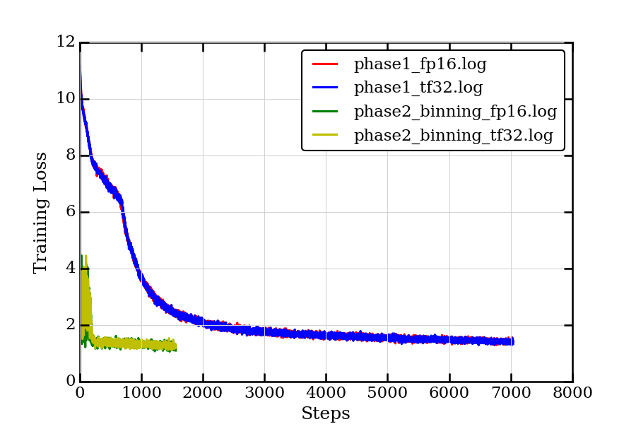

# BERT For PyTorch
 
This repository provides a script and recipe to train the BERT model for PyTorch to achieve state-of-the-art accuracy, and is tested and maintained by NVIDIA.
 
## Table Of Contents
 
- [Model overview](#model-overview)
    * [Model architecture](#model-architecture)
    * [Default configuration](#default-configuration)
    * [Feature support matrix](#feature-support-matrix)
        * [Features](#features)
    * [Mixed precision training](#mixed-precision-training)
        * [Enabling mixed precision](#enabling-mixed-precision)
        * [Enabling TF32](#enabling-tf32)
    * [Glossary](#glossary)
- [Setup](#setup)
    * [Requirements](#requirements)
- [Quick Start Guide](#quick-start-guide)
- [Advanced](#advanced)
    * [Scripts and sample code](#scripts-and-sample-code)
    * [Parameters](#parameters)
        * [Pre-training parameters](#pre-training-parameters)
        * [Fine tuning parameters](#fine-tuning-parameters)    
        * [Multi-node](#multi-node)
    * [Command-line options](#command-line-options)
    * [Getting the data](#getting-the-data)
        * [Dataset guidelines](#dataset-guidelines)
        * [Multi-dataset](#multi-dataset)
    * [Training process](#training-process)
        * [Pre-training](#pre-training)
        * [Fine-tuning](#fine-tuning)   
    * [Inference process](#inference-process)
        * [Fine-tuning inference](#fine-tuning-inference)
    * [Deploying BERT using NVIDIA Triton Inference Server](#deploying-bert-using-nvidia-triton-inference-server)
- [Performance](#performance)
    * [Benchmarking](#benchmarking)
        * [Training performance benchmark](#training-performance-benchmark)
        * [Inference performance benchmark](#inference-performance-benchmark)
    * [Results](#results)
        * [Training accuracy results](#training-accuracy-results)
            * [Pre-training loss results: NVIDIA DGX A100 (8x A100 40GB)](#pre-training-loss-results-nvidia-dgx-a100-8x-a100-40gb)
            * [Pre-training loss results: NVIDIA DGX-2H V100 (16x V100 32GB)](#pre-training-loss-results-nvidia-dgx-2h-v100-16x-v100-32gb)  
            * [Pre-training loss results](#pre-training-loss-results)
            * [Pre-training loss curves](#pre-training-loss-curves)
            * [Fine-tuning accuracy results: NVIDIA DGX A100 (8x A100 40GB)](#fine-tuning-accuracy-results-nvidia-dgx-a100-8x-a100-40gb)
            * [Fine-tuning accuracy results: NVIDIA DGX-2 (16x V100 32G)](#fine-tuning-accuracy-results-nvidia-dgx-2-16x-v100-32g)
            * [Fine-tuning accuracy results: NVIDIA DGX-1 (8x V100 16G)](#fine-tuning-accuracy-results-nvidia-dgx-1-8x-v100-16g)
            * [Training stability test](#training-stability-test)
                * [Pre-training stability test](#pre-training-stability-test)
                * [Fine-tuning stability test](#fine-tuning-stability-test) 
        * [Training performance results](#training-performance-results)
            * [Training performance: NVIDIA DGX A100 (8x A100 40GB)](#training-performance-nvidia-dgx-a100-8x-a100-40gb)
                * [Pre-training NVIDIA DGX A100 (8x A100 40GB)](#pre-training-nvidia-dgx-a100-8x-a100-40gb)
                * [Fine-tuning NVIDIA DGX A100 (8x A100 40GB)](#fine-tuning-nvidia-dgx-a100-8x-a100-40gb)      
            * [Training performance: NVIDIA DGX-2 (16x V100 32G)](#training-performance-nvidia-dgx-2-16x-v100-32g)
                * [Pre-training NVIDIA DGX-2 With 32G](#pre-training-nvidia-dgx-2-with-32g)
                * [Pre-training on multiple NVIDIA DGX-2H With 32G](#pre-training-on-multiple-nvidia-dgx-2h-with-32g)
                * [Fine-tuning NVIDIA DGX-2 With 32G](#fine-tuning-nvidia-dgx-2-with-32g)   
            * [Training performance: NVIDIA DGX-1 (8x V100 32G)](#training-performance-nvidia-dgx-1-8x-v100-32g)
                * [Pre-training NVIDIA DGX-1 With 32G](#pre-training-nvidia-dgx-1-with-32g)
                * [Fine-tuning NVIDIA DGX-1 With 32G](#fine-tuning-nvidia-dgx-1-with-32g)   
            * [Training performance: NVIDIA DGX-1 (8x V100 16G)](#training-performance-nvidia-dgx-1-8x-v100-16g)
                * [Pre-training NVIDIA DGX-1 With 16G](#pre-training-nvidia-dgx-1-with-16g)
                * [Pre-training on multiple NVIDIA DGX-1 With 16G](#pre-training-on-multiple-nvidia-dgx-1-with-16g)
                * [Fine-tuning NVIDIA DGX-1 With 16G](#fine-tuning-nvidia-dgx-1-with-16g)   
        * [Inference performance results](#inference-performance-results)
            * [Inference performance: NVIDIA DGX A100 (1x A100 40GB)](#inference-performance-nvidia-dgx-a100-1x-a100-40gb)
                * [Fine-tuning inference on NVIDIA DGX A100 (1x A100 40GB)](#fine-tuning-inference-on-nvidia-dgx-a100-1x-a100-40gb)
            * [Inference performance: NVIDIA DGX-2 (1x V100 32G)](#inference-performance-nvidia-dgx-2-1x-v100-32g)
                * [Fine-tuning inference on NVIDIA DGX-2 with 32G](#fine-tuning-inference-on-nvidia-dgx-2-with-32g)
            * [Inference performance: NVIDIA DGX-1 (1x V100 32G)](#inference-performance-nvidia-dgx-1-1x-v100-32g)
                * [Fine-tuning inference on NVIDIA DGX-1 with 32G](#fine-tuning-inference-on-nvidia-dgx-1-with-32g)
            * [Inference performance: NVIDIA DGX-1 (1x V100 16G)](#inference-performance-nvidia-dgx-1-1x-v100-16g)
                * [Fine-tuning inference on NVIDIA DGX-1 with 16G](#fine-tuning-inference-on-nvidia-dgx-1-with-16g)
- [Release notes](#release-notes)
    * [Changelog](#changelog)
    * [Known issues](#known-issues)
 
 
 
## Model overview
 
BERT, or Bidirectional Encoder Representations from Transformers, is a new method of pre-training language representations which obtains state-of-the-art results on a wide array of Natural Language Processing (NLP) tasks. This model is based on the [BERT: Pre-training of Deep Bidirectional Transformers for Language Understanding](https://arxiv.org/abs/1810.04805) paper. NVIDIA's implementation of BERT is an optimized version of the [Hugging Face implementation](https://github.com/huggingface/pytorch-pretrained-BERT), leveraging mixed precision arithmetic and Tensor Cores on Volta V100 and Ampere A100 GPUs for faster training times while maintaining target accuracy.
 
This repository contains scripts to interactively launch data download, training, benchmarking and inference routines in a Docker container for both pre-training and fine-tuning for tasks such as question answering. The major differences between the original implementation of the paper and this version of BERT are as follows:
 
-   Scripts to download Wikipedia and BookCorpus datasets
-   Scripts to preprocess downloaded data or a custom corpus into inputs and targets for pre-training in a modular fashion
-   Fused [LAMB](https://arxiv.org/pdf/1904.00962.pdf) optimizer to support training with larger batches
-   Fused Adam optimizer for fine tuning tasks
-   Fused CUDA kernels for better performance LayerNorm
-   Automatic mixed precision (AMP) training support
-   Scripts to launch on multiple number of nodes
 
Other publicly available implementations of BERT include:
1. [NVIDIA TensorFlow](https://github.com/NVIDIA/DeepLearningExamples/tree/master/TensorFlow/LanguageModeling/BERT)
2. [Hugging Face](https://github.com/huggingface/pytorch-pretrained-BERT)
3. [codertimo](https://github.com/codertimo/BERT-pytorch)
4. [gluon-nlp](https://github.com/dmlc/gluon-nlp/tree/v0.10.x/scripts/bert)
5. [Google's implementation](https://github.com/google-research/bert)
    
This model trains with mixed precision Tensor Cores on Volta and provides a push-button solution to pretraining on a corpus of choice. As a result, researchers can get results 4x faster than training without Tensor Cores. This model is tested against each NGC monthly container release to ensure consistent accuracy and performance over time.
 
### Model architecture
 
The BERT model uses the same architecture as the encoder of the Transformer. Input sequences are projected into an embedding space before being fed into the encoder structure. Additionally, positional and segment encodings are added to the embeddings to preserve positional information. The encoder structure is simply a stack of Transformer blocks, which consist of a multi-head attention layer followed by successive stages of feed-forward networks and layer normalization. The multi-head attention layer accomplishes self-attention on multiple input representations.
 
An illustration of the architecture taken from the [Transformer paper](https://arxiv.org/pdf/1706.03762.pdf) is shown below.
 
 
 
### Default configuration
 
The architecture of the BERT model is almost identical to the Transformer model that was first introduced in the [Attention Is All You Need paper](https://arxiv.org/pdf/1706.03762.pdf). The main innovation of BERT lies in the pre-training step, where the model is trained on two unsupervised prediction tasks using a large text corpus. Training on these unsupervised tasks produces a generic language model, which can then be quickly fine-tuned to achieve state-of-the-art performance on language processing tasks such as question answering.
 
The BERT paper reports the results for two configurations of BERT, each corresponding to a unique model size. This implementation provides the same configurations by default, which are described in the table below.  
 
| **Model** | **Hidden layers** | **Hidden unit size** | **Attention heads** | **Feedforward filter size** | **Max sequence length** | **Parameters** |
|:---------:|:----------:|:----:|:---:|:--------:|:---:|:----:|
|BERTBASE |12 encoder| 768| 12|4 x  768|512|110M|
|BERTLARGE|24 encoder|1024| 16|4 x 1024|512|330M|
 
 
 
### Feature support matrix
 
The following features are supported by this model.  
 
| **Feature** | **BERT** |
|:---------:|:----------:|
|APEX AMP|Yes|
|APEX DDP|Yes|
|LAMB|Yes|
|Multi-node|Yes|
 
#### Features
 
[APEX](https://github.com/NVIDIA/apex) is a PyTorch extension with NVIDIA-maintained utilities to streamline mixed precision and distributed training, whereas [AMP](https://nvidia.github.io/apex/amp.html) is an abbreviation used for automatic mixed precision training.
 
[DDP](https://nvidia.github.io/apex/parallel.html) stands for DistributedDataParallel and is used for multi-GPU training.
 
[LAMB](https://arxiv.org/pdf/1904.00962.pdf) stands for Layerwise Adaptive Moments based optimizer, is a large batch optimization technique that helps accelerate training of deep neural networks using large minibatches. It allows using a global batch size of 65536 and 32768 on sequence lengths 128 and 512 respectively, compared to a batch size of 256 for [Adam](https://arxiv.org/pdf/1412.6980.pdf). The optimized implementation accumulates 1024 gradient batches in phase 1 and 4096 steps in phase 2 before updating weights once. This results in 15% training speedup. On multi-node systems, LAMB allows scaling up to 1024 GPUs resulting in training speedups of up to 72x in comparison to Adam. Adam has limitations on the learning rate that can be used since it is applied globally on all parameters whereas LAMB follows a layerwise learning rate strategy.
 
NVLAMB adds the necessary tweaks to [LAMB version 1](https://arxiv.org/abs/1904.00962v1), to ensure correct convergence. The algorithm is as follows:
 
  
 
### Mixed precision training
 
Mixed precision is the combined use of different numerical precisions in a computational method. [Mixed precision](https://arxiv.org/abs/1710.03740) training offers significant computational speedup by performing operations in half-precision format, while storing minimal information in single-precision to retain as much information as possible in critical parts of the network. Since the introduction of [tensor cores](https://developer.nvidia.com/tensor-cores) in the Volta, and following with both the Turing and Ampere architectures, significant training speedups are experienced by switching to mixed precision -- up to 3x overall speedup on the most arithmetically intense model architectures. Using mixed precision training requires two steps:
 
1.  Porting the model to use the FP16 data type where appropriate.
2.  Adding loss scaling to preserve small gradient values.
 
For information about:
-   How to train using mixed precision, see the [Mixed Precision Training](https://arxiv.org/abs/1710.03740) paper and [Training With Mixed Precision](https://docs.nvidia.com/deeplearning/performance/mixed-precision-training/index.html) documentation.
-   Techniques used for mixed precision training, see the [Mixed-Precision Training of Deep Neural Networks](https://devblogs.nvidia.com/mixed-precision-training-deep-neural-networks/) blog.
-   APEX tools for mixed precision training, see the [NVIDIA APEX: Tools for Easy Mixed-Precision Training in PyTorch](https://devblogs.nvidia.com/apex-pytorch-easy-mixed-precision-training/).
 
#### Enabling mixed precision
 
In this repository, mixed precision training is enabled by NVIDIA’s APEX library. The APEX library has an automatic mixed precision module that allows mixed precision to be enabled with minimal code changes.
 
Automatic mixed precision can be enabled with the following code changes:
 
```
from apex import amp
if fp16:
    # Wrap optimizer and model
    model, optimizer = amp.initialize(model, optimizer, opt_level=<opt_level>, loss_scale="dynamic")
 
if fp16:
    with amp.scale_loss(loss, optimizer) as scaled_loss:
        scaled_loss.backward()
   ```
 
Where `<opt_level>` is the optimization level. In the pretraining, `O2` is set as the optimization level. Mixed precision training can be turned on by passing the `fp16` argument to the `run_pretraining.py` and `run_squad.py`. All shell scripts have a positional argument available to enable mixed precision training.

#### Enabling TF32

TensorFloat-32 (TF32) is the new math mode in [NVIDIA A100](https://www.nvidia.com/en-us/data-center/a100/) GPUs for handling the matrix math also called tensor operations. TF32 running on Tensor Cores in A100 GPUs can provide up to 10x speedups compared to single-precision floating-point math (FP32) on Volta GPUs. 

TF32 Tensor Cores can speed up networks using FP32, typically with no loss of accuracy. It is more robust than FP16 for models which require high dynamic range for weights or activations.

For more information, refer to the [TensorFloat-32 in the A100 GPU Accelerates AI Training, HPC up to 20x](https://blogs.nvidia.com/blog/2020/05/14/tensorfloat-32-precision-format/) blog post.

TF32 is supported in the NVIDIA Ampere GPU architecture and is enabled by default.

### Glossary
 
**Fine-tuning**  
Training an already pretrained model further using a task specific dataset for subject-specific refinements, by adding task-specific layers on top if required.
 
**Language Model**  
Assigns a probability distribution over a sequence of words. Given a sequence of words, it assigns a probability to the whole sequence.
 
**Pre-training**  
Training a model on vast amounts of data on the same (or different) task to build general understandings.
 
**Transformer**  
The paper [Attention Is All You Need](https://arxiv.org/abs/1706.03762) introduces a novel architecture called Transformer that uses an attention mechanism and transforms one sequence into another.
 
**Phase 1**  
Pretraining on samples of sequence length 128 and 20 masked predictions per sequence.
 
**Phase 2**  
Pretraining on samples of sequence length 512 and 80 masked predictions per sequence.
 
## Setup
 
The following section lists the requirements that you need to meet in order to start training the BERT model. 
 
### Requirements
 
This repository contains Dockerfile which extends the PyTorch NGC container and encapsulates some dependencies. Aside from these dependencies, ensure you have the following components:
 
-   [NVIDIA Docker](https://github.com/NVIDIA/nvidia-docker)
-   [PyTorch 20.06-py3 NGC container or later](https://ngc.nvidia.com/registry/nvidia-pytorch)
-   Supported GPUs:
- [NVIDIA Volta architecture](https://www.nvidia.com/en-us/data-center/volta-gpu-architecture/)
- [NVIDIA Turing architecture](https://www.nvidia.com/en-us/geforce/turing/)
- [NVIDIA Ampere architecture](https://www.nvidia.com/en-us/data-center/nvidia-ampere-gpu-architecture/)
 
For more information about how to get started with NGC containers, see the following sections from the NVIDIA GPU Cloud Documentation and the Deep Learning Documentation:
-   [Getting Started Using NVIDIA GPU Cloud](https://docs.nvidia.com/ngc/ngc-getting-started-guide/index.html)
-   [Accessing And Pulling From The NGC Container Registry](https://docs.nvidia.com/deeplearning/dgx/user-guide/index.html#accessing_registry)
-   [Running PyTorch](https://docs.nvidia.com/deeplearning/dgx/pytorch-release-notes/running.html#running)
 
For those unable to use the PyTorch NGC container, to set up the required environment or create your own container, see the versioned [NVIDIA Container Support Matrix](https://docs.nvidia.com/deeplearning/dgx/support-matrix/index.html).
 
For multi-node, the sample provided in this repository requires [Enroot](https://github.com/NVIDIA/enroot) and [Pyxis](https://github.com/NVIDIA/pyxis) set up on a [SLURM](https://slurm.schedmd.com) cluster.
 
More information on how to set up and launch can be found in the [Multi-node Documentation](https://docs.nvidia.com/ngc/multi-node-bert-user-guide).
 
## Quick Start Guide
 
To train your model using mixed or TF32 precision with Tensor Cores or using FP32, perform the following steps using the default parameters of the BERT model. Training configurations to run on 8 x A100 40G, 8 x V100 16G, 16 x V100 32G cards and examples of usage are provided at the end of this section. For the specifics concerning training and inference, see the [Advanced](#advanced) section.
 
 
1. Clone the repository.
`git clone https://github.com/NVIDIA/DeepLearningExamples.git`
 
`cd DeepLearningExamples/PyTorch/LanguageModeling/BERT`
 
2. Download the NVIDIA pretrained checkpoint.
 
If you want to use a pre-trained checkpoint, visit [NGC](https://ngc.nvidia.com/catalog/models/nvidia:bert_pyt_ckpt_large_pretraining_amp_lamb/files). This downloaded checkpoint is used to fine-tune on SQuAD. Ensure you unzip the downloaded file and place the checkpoint in the `checkpoints/` folder. For a checkpoint already fine-tuned for QA on SQuAD v1.1 visit [NGC](https://ngc.nvidia.com/catalog/models/nvidia:bert_pyt_ckpt_large_qa_squad11_amp/files).
 
3. Build BERT on top of the  NGC container.
`bash scripts/docker/build.sh`
 
4. Start an interactive session in the NGC container to run training/inference.
`bash scripts/docker/launch.sh`
 
Resultant logs and checkpoints of pretraining and fine-tuning routines are stored in the `results/` folder.
 
`data` and `vocab.txt` are downloaded in the `data/` directory by default. Refer to the [Getting the data](#getting-the-data) section for more details on how to process a custom corpus as required for BERT pretraining. 

5. Download and preprocess the dataset.

This repository provides scripts to download, verify, and extract the following datasets:
 
-   [SQuAD](https://rajpurkar.github.io/SQuAD-explorer/) (fine-tuning for question answering)
-   Wikipedia (pre-training)
-   BookCorpus (pre-training)
 
To download, verify, extract the datasets, and create the shards in `.hdf5` format, run:  
`/workspace/bert/data/create_datasets_from_start.sh`

Note: For fine tuning only, Wikipedia and Bookscorpus dataset download and preprocessing can be skipped by commenting it out.

- Download Wikipedia only for pretraining

The pretraining dataset is 170GB+ and takes 15+ hours to download. The BookCorpus server most of the times get overloaded and also contain broken links resulting in HTTP 403 and 503 errors. Hence, it is recommended to skip downloading BookCorpus data by running:

`/workspace/bert/data/create_datasets_from_start.sh wiki_only`

- Download Wikipedia and BookCorpus

Users are welcome to download BookCorpus from other sources to match our accuracy, or repeatedly try our script until the required number of files are downloaded by running the following:
`/workspace/bert/data/create_datasets_from_start.sh wiki_books`

Note: Not using BookCorpus can potentially change final accuracy on a few downstream tasks.

6. Start pretraining.
 
To run on a single node 8 x V100 32G cards, from within the container, you can use the following script to run pre-training.  
`bash scripts/run_pretraining.sh`
 
The default hyperparameters are set to run on 8x V100 32G cards.
 
To run on multiple nodes, see the [Multi-node](#multi-node) section.  
 
7. Start fine-tuning with the SQuAD dataset.
 
The above pretrained BERT representations can be fine tuned with just one additional output layer for a state-of-the-art question answering system. Running the following script launches fine-tuning for question answering with the SQuAD dataset.
`bash scripts/run_squad.sh /workspace/checkpoints/<downloaded_checkpoint>`
  
8. Start fine-tuning with the GLUE tasks.
 
The above pretrained BERT representations can be fine tuned with just one additional output layer for GLUE tasks. Running the following scripts launch fine-tuning for paraphrase detection with the MRPC dataset:
`bash scripts/run_glue.sh /workspace/bert/checkpoints/<downloaded_checkpoint>`
 
9. Start validation/evaluation.
 
For both SQuAD and GLUE, validation can be performed with the `bash scripts/run_squad.sh /workspace/checkpoints/<downloaded_checkpoint>` or `bash scripts/run_glue.sh /workspace/bert/checkpoints/<downloaded_checkpoint>`, setting `mode` to `eval` in `scripts/run_squad.sh` or `scripts/run_glue.sh` as follows:

```
mode=${11:-"eval"}
```
 
10. Start inference/predictions.
 
Inference can be performed with the `bash scripts/run_squad.sh /workspace/checkpoints/<downloaded_checkpoint>`, setting `mode` to `prediction` in `scripts/run_squad.sh` or `scripts/run_glue.sh` as follows:

```
mode=${11:-"prediction"}
```

Inference predictions are saved to `<OUT_DIR>/predictions.json`, set in `scripts/run_squad.sh` or `scripts/run_glue.sh` as follows:

```
OUT_DIR=${10:-"/workspace/bert/results/SQuAD"} # For SQuAD.
# Or…
out_dir=${5:-"/workspace/bert/results/MRPC"} # For MRPC.
# Or... 
out_dir=${5:-"/workspace/bert/results/SST-2"} # For SST-2.
```

This repository contains a number of predefined configurations to run the SQuAD, GLUE and pretraining on NVIDIA DGX-1, NVIDIA DGX-2H or NVIDIA DGX A100 nodes in `scripts/configs/squad_config.sh`, `scripts/configs/glue_config.sh` and `scripts/configs/pretrain_config.sh`. For example, to use the default DGX A100 8 gpu config, run:

```
bash scripts/run_squad.sh $(source scripts/configs/squad_config.sh && dgxa100_8gpu_fp16)
bash scripts/run_glue.sh $(source scripts/configs/glue_config.sh && mrpc_dgxa100_8gpu_fp16)  # For the MRPC dataset.
bash scripts/run_glue.sh $(source scripts/configs/glue_config.sh && sst-2_dgxa100_8gpu_fp16)  # For the SST-2 dataset.
bash scripts/run_pretraining.sh $(source scripts/configs/pretrain_config.sh && dgxa100_8gpu_fp16)
```

## Advanced
 
The following sections provide greater details of the dataset, running training and inference, and the training results.
 
### Scripts and sample code
 
Descriptions of the key scripts and folders are provided below.
 
-   `data/` - Contains scripts for downloading and preparing individual datasets, and will contain downloaded and processed datasets.
-   `scripts/` - Contains shell scripts to launch data download, pre-training, and fine-tuning.
-   `data_download.sh` - Launches download and processing of required datasets.
-   `run_squad.sh`  - Interface for launching question answering fine-tuning with `run_squad.py`.
-   `run_glue.sh`  - Interface for launching paraphrase detection and sentiment analysis fine-tuning with `run_glue.py`.
-   `run_pretraining.sh`  - Interface for launching BERT pre-training with `run_pretraining.py`.
-   `create_pretraining_data.py` - Creates `.hdf5` files from shared text files in the final step of dataset creation.
-   `model.py` - Implements the BERT pre-training and fine-tuning model architectures with PyTorch.
-   `optimization.py` - Implements the LAMB optimizer with PyTorch.
-   `run_squad.py` - Implements fine tuning training and evaluation for question answering on the [SQuAD](https://rajpurkar.github.io/SQuAD-explorer/) dataset.
-   `run_glue.py` - Implements fine tuning training and evaluation for [GLUE](https://gluebenchmark.com/) tasks.
-   `run_pretraining.py` - Implements BERT pre-training.
-   `run_pretraining_inference.py` - Implements evaluation of a BERT pre-trained model.
 
### Parameters
 
#### Pre-training parameters
 
BERT is designed to pre-train deep bidirectional networks for language representations. The following scripts replicate pretraining on Wikipedia + BookCorpus from this [paper](https://arxiv.org/pdf/1810.04805.pdf). These scripts are general and can be used for pre-training language representations on any corpus of choice.
 
The complete list of the available parameters for the `run_pretraining.py` script are:
 
```
  --input_dir INPUT_DIR       - The input data directory.
                                Should contain .hdf5 files for the task.
 
  --config_file CONFIG_FILE      - Path to a json file describing the BERT model
                                configuration. This file configures the model
                                architecture, such as the number of transformer
                                blocks, number of attention heads, etc.
 
  --bert_model BERT_MODEL        - Specifies the type of BERT model to use;
                                should be one of the following:
        bert-base-uncased
        bert-large-uncased
        bert-base-cased
        bert-base-multilingual
        bert-base-chinese
 
  --output_dir OUTPUT_DIR        - Path to the output directory where the model
                                checkpoints will be written.
 
  --init_checkpoint           - Initial checkpoint to start pretraining from (Usually a BERT pretrained checkpoint)
 
  --max_seq_length MAX_SEQ_LENGTH
                              - The maximum total input sequence length after
                                WordPiece tokenization. Sequences longer than
                                this will be truncated, and sequences shorter
                                than this will be padded.
 
  --max_predictions_per_seq MAX_PREDICTIONS_PER_SEQ
                              - The maximum total of masked tokens per input
                                sequence for Masked LM.
 
  --train_batch_size TRAIN_BATCH_SIZE
                              - Batch size per GPU for training.
 
  --learning_rate LEARNING_RATE
                              - The initial learning rate for LAMB optimizer.
 
  --max_steps MAX_STEPS       - Total number of training steps to perform.
 
  --warmup_proportion WARMUP_PROPORTION
                              - Proportion of training to perform linear learning
                                rate warmup for. For example, 0.1 = 10% of training.
 
  --seed SEED                 - Sets the seed to use for random number generation.
 
  --gradient_accumulation_steps GRADIENT_ACCUMULATION_STEPS
                              - Number of update steps to accumulate before
                                performing a backward/update pass.
 
  --allreduce_post_accumulation - If set to true, performs allreduce only after the defined number of gradient accumulation steps.
  
  --allreduce_post_accumulation_fp16 -  If set to true, performs allreduce after gradient accumulation steps in FP16.
 
  --amp or --fp16                      - If set, will perform computations using
                                automatic mixed precision.
 
  --loss_scale LOSS_SCALE        - Sets the loss scaling value to use when
                                mixed precision is used. The default value (0)
                                tells the script to use dynamic loss scaling
                                instead of fixed loss scaling.
 
  --log_freq LOG_FREQ         - If set, the script will output the training
                                loss every LOG_FREQ steps.
 
  --resume_from_checkpoint       - If set, training will resume from a checkpoint
                                that currently exists in OUTPUT_DIR.
 
  --num_steps_per_checkpoint NUM_STEPS_PER_CHECKPOINT
                              - Number of update steps until a model checkpoint
                                is saved to disk.
  --phase2                 - Specified if training on phase 2 only. If not specified, default pretraining is on phase 1.
 
  --phase1_end_step        - The number of steps phase 1 was trained for. In order to  
                           resume phase 2 the correct way, phase1_end_step should correspond to the --max_steps phase 1 was trained for.
 
```

#### Fine tuning parameters

* SQuAD 
 
Default arguments are listed below in the order `scripts/run_squad.sh` expects:
 
-   Initial checkpoint - The default is `/workspace/checkpoints/bert_uncased.pt`.
-   Number of training Epochs - The default is `2`.
-   Batch size - The default is `3`.
-   Learning rate - The default is `3e-5`.
-   Precision (either `fp16`, `tf32` or `fp32`) - The default is `fp16`.
-   Number of GPUs - The default is `8`.
-   Seed - The default is `1`.
-   SQuAD directory -  The default is `/workspace/bert/data/v1.1`.
-   Vocabulary file (token to ID mapping) - The default is `/workspace/bert/vocab/vocab`.
-   Output directory for result - The default is `/results/SQuAD`.
-   Mode (`train`, `eval`, `train eval`, `predict`) - The default is `train`.
-   Config file for the BERT model (It should be the same as the pretrained model) - The default is `/workspace/bert/bert_config.json`.
 
The script saves the final checkpoint to the `/results/SQuAD/pytorch_model.bin` file.

* GLUE

Default arguments are listed below in the order `scripts/run_glue.sh` expects:
 
-   Initial checkpoint - The default is `/workspace/bert/checkpoints/bert_uncased.pt`.
-   Data directory -  The default is `/workspace/bert/data/download/glue/MRPC/`.
-   Vocabulary file (token to ID mapping) - The default is `/workspace/bert/vocab/vocab`.
-   Config file for the BERT model (It should be the same as the pretrained model) - The default is `/workspace/bert/bert_config.json`.
-   Output directory for result - The default is `/workspace/bert/results/MRPC`.
-   The name of the GLUE task (`mrpc` or `sst-2`) - The default is `mrpc`
-   Number of GPUs - The default is `8`.
-   Batch size per GPU - The default is `16`.
-   Number of update steps to accumulate before performing a backward/update pass (this option effectively normalizes the GPU memory footprint down by the same factor) - The default is `1`.
-   Learning rate - The default is `2.4e-5`.
-   The proportion of training samples used to warm up learning rate - The default is `0.1`.
-   Number of training Epochs - The default is `3`.
-   Total number of training steps to perform - The default is `-1.0` which means it is determined by the number of epochs.
-   Precision (either `fp16`, `tf32` or `fp32`) - The default is `fp16`.
-   Seed - The default is `2`.
-   Mode (`train`, `eval`, `prediction`, `train eval`, `train prediction`, `eval prediction`, `train eval prediction`) - The default is `train eval`.

#### Multi-node
 
Multi-node runs can be launched on a pyxis/enroot Slurm cluster (see [Requirements](#requirements)) with the `run.sub` script with the following command for a 4-node DGX-1 example for both phase 1 and phase 2:
 
```
BATCHSIZE=2048 LR=6e-3 GRADIENT_STEPS=128 PHASE=1 sbatch -N4 --ntasks-per-node=8 run.sub
BATCHSIZE=1024 LR=4e-3 GRADIENT_STEPS=256 PHASE=2 sbatch -N4 --ntasks-per-node=8 run.sub
```
 
Checkpoint after phase 1 will be saved in `checkpointdir` specified in `run.sub`. The checkpoint will be automatically picked up to resume training on phase 2. Note that phase 2 should be run after phase 1.
 
Variables to re-run the [Training performance results](#training-performance-results) are available in the `configurations.yml` file. 
 
The batch variables `BATCHSIZE`, `LR`, `GRADIENT_STEPS`,`PHASE` refer to the Python arguments `train_batch_size`, `learning_rate`, `gradient_accumulation_steps`, `phase2` respectively.
 
Note that the `run.sub` script is a starting point that has to be adapted depending on the environment. In particular, variables such as `datadir` handle the location of the files for each phase. 
 
Refer to the files contents to see the full list of variables to adjust for your system.
 
### Command-line options
 
To see the full list of available options and their descriptions, use the `-h` or `--help` command line option, for example:
 
`python run_pretraining.py --help`
 
`python run_squad.py --help`

`python run_glue.py --help`
 
Detailed descriptions of command-line options can be found in the [Parameters](#parameters) section.
 
### Getting the data
 
For pre-training BERT, we use the concatenation of Wikipedia (2500M words) as well as BookCorpus (800M words). For Wikipedia, we extract only the text passages and ignore headers, lists, and tables. BERT requires that datasets are structured as a document level corpus rather than a shuffled sentence level corpus because it is critical to extract long contiguous sentences.
 
The preparation of the pre-training dataset is described in the `bertPrep.py` script found in the `data/` folder. The component steps in the automated scripts to prepare the datasets are as follows:
 
1.  Data download and extract - the dataset is downloaded and extracted.
 
2.  Clean and format - document tags, etc. are removed from the dataset.
 
3.  Sentence segmentation - the corpus text file is processed into separate sentences.
 
4.  Sharding - the sentence segmented corpus file is split into a number of uniformly distributed smaller text documents.
 
5.  `hdf5` file creation - each text file shard is processed by the `create_pretraining_data.py` script to produce a corresponding `hdf5` file. The script generates input data and labels for masked language modeling and sentence prediction tasks for the input text shard.
 
The tools used for preparing the BookCorpus and Wikipedia datasets can be applied to prepare an arbitrary corpus. The `create_datasets_from_start.sh` script in the `data/` directory applies sentence segmentation, sharding, and `hdf5` file creation given an arbitrary text file containing a document-separated text corpus.
 
For fine-tuning a pre-trained BERT model for specific tasks, by default this repository prepares the following dataset:
 
-   [SQuAD](https://rajpurkar.github.io/SQuAD-explorer/): for question answering
-   [MRPC](https://www.microsoft.com/en-us/download/details.aspx?id=52398): for paraphrase detection.
-   [SST-2](https://nlp.stanford.edu/sentiment/index.html): for sentiment analysis.
 
Depending on the speed of your internet connection, this process takes about a day to complete. The BookCorpus server could sometimes get overloaded and also contain broken links resulting in HTTP 403 and 503 errors. You can either skip the missing files or retry downloading at a later time.
 
#### Dataset guidelines
 
The procedure to prepare a text corpus for pre-training is described in the above section. This section will provide additional insight into how exactly raw text is processed so that it is ready for pre-training.
 
First, raw text is tokenized using [WordPiece tokenization](https://arxiv.org/pdf/1609.08144.pdf). A [CLS] token is inserted at the start of every sequence, and the two sentences in the sequence are separated by a [SEP] token.
 
Note: BERT pre-training looks at pairs of sentences at a time. A sentence embedding token [A] is added to the first sentence and token [B] to the next.
 
BERT pre-training optimizes for two unsupervised classification tasks. The first is Masked Language Modelling (Masked LM). One training instance of Masked LM is a single modified sentence. Each token in the sentence has a 15% chance of being replaced by a [MASK] token. The chosen token is replaced with [MASK] 80% of the time, 10% with a random token and the remaining 10% the token is retained. The task is then to predict the original token.
 
The second task is next sentence prediction. One training instance of BERT pre-training is two sentences (a sentence pair). A sentence pair may be constructed by simply taking two adjacent sentences from a single document, or by pairing up two random sentences with equal probability. The goal of this task is to predict whether or not the second sentence followed the first in the original document.
 
The `create_pretraining_data.py` script takes in raw text and creates training instances for both pre-training tasks.
 
#### Multi-dataset
 
This repository provides functionality to combine multiple datasets into a single dataset for pre-training on a diverse text corpus at the shard level in `data/create_datasets_from_start.sh`.
 
### Training process
 
The training process consists of two steps: pre-training and fine-tuning.
 
#### Pre-training
 
Pre-training is performed using the `run_pretraining.py` script along with parameters defined in the `scripts/run_pretraining.sh`.
 
The `run_pretraining.sh` script runs a job on a single node that trains the BERT-large model from scratch using Wikipedia and BookCorpus datasets as training data using the LAMB optimizer. By default, the training script runs two phases of training with a hyperparameter recipe specific to 8x V100 32G cards:
 
Phase 1: (Maximum sequence length of 128)
-   Runs on 8 GPUs with training batch size of 64 per GPU
-   Uses a learning rate of 6e-3
-   Has FP16 precision enabled
-   Runs for 7038 steps, where the first 28.43% (2000) are warm-up steps
-   Saves a checkpoint every 200 iterations (keeps only the latest 3 checkpoints) and at the end of training. All checkpoints, and training logs are saved to the `/results` directory (in the container which can be mounted to a local directory).
-   Creates a log file containing all the output
 
Phase 2: (Maximum sequence length of 512)
-   Runs on 8 GPUs with training batch size of 8 per GPU
-   Uses a learning rate of 4e-3
-   Has FP16 precision enabled
-   Runs for 1563 steps, where the first 12.8% are warm-up steps
-   Saves a checkpoint every 200 iterations (keeps only the latest 3 checkpoints) and at the end of training. All checkpoints, and training logs are saved to the `/results` directory (in the container which can be mounted to a local directory).
-   Creates a log file containing all the output
 
These parameters will train on Wikipedia and BookCorpus to state-of-the-art accuracy on a DGX-1 with 32GB V100 cards.
 
`bash run_pretraining.sh <training_batch_size> <learning-rate> <precision> <num_gpus> <warmup_proportion> <training_steps> <save_checkpoint_steps> <resume_training> <create_logfile> <accumulate_gradients> <gradient_accumulation_steps> <seed> <job_name> <allreduce_post_accumulation> <allreduce_post_accumulation_fp16> <accumulate_into_fp16> <train_bath_size_phase2> <learning_rate_phase2> <warmup_proportion_phase2> <train_steps_phase2> <gradient_accumulation_steps_phase2> `
 
Where:
 
-   `<training_batch_size>` is per-GPU batch size used for training. Larger batch sizes run more efficiently, but require more memory.
-   `<learning_rate>` is the base learning rate for training
-   `<precision>` is the type of math in your model, can be either `fp32` or `fp16`. The options mean:
    -   FP32: 32-bit IEEE single precision floats.
    -   FP16: Mixed precision 16 and 32-bit floats.
-   `<num_gpus>` is the number of GPUs to use for training. Must be equal to or smaller than the number of GPUs attached to your node.
-   `<warmup_proportion>` is the percentage of training steps used for warm-up at the start of training.
-   `<training_steps>` is the total number of training steps.
-   `<save_checkpoint_steps>` controls how often checkpoints are saved.
-   `<resume_training>` if set to `true`, training should resume from the latest model in `/results/checkpoints`. Default is `false`.
-   `<create_logfile>` a flag indicating if output should be written to a log file or not (acceptable values are `true` or 'false`. `true` indicates output should be saved to a log file.)
-   `<accumulate_gradient>` a flag indicating whether a larger batch should be simulated with gradient accumulation.
-   `<gradient_accumulation_steps>` an integer indicating the number of steps to accumulate gradients over. Effective batch size = `training_batch_size` / `gradient_accumulation_steps`.
-   `<seed>` random seed for the run.
- `<allreduce_post_accumulation>` - If set to `true`, performs `allreduce` only after the defined number of gradient accumulation steps.
- `<allreduce_post_accumulation_fp16>` -  If set to `true`, performs `allreduce` after gradient accumulation steps in FP16.
 
    Note: The above two options need to be set to false when running either TF32 or  FP32. 
    
-  `<training_batch_size_phase2>` is per-GPU batch size used for training in phase 2. Larger batch sizes run more efficiently, but require more memory.
-   `<learning_rate_phase2>` is the base learning rate for training phase 2.
-   `<warmup_proportion_phase2>` is the percentage of training steps used for warm-up at the start of training.
-   `<training_steps_phase2>` is the total number of training steps for phase 2, to be continued in addition to phase 1.
-   `<gradient_accumulation_steps_phase2>` an integer indicating the number of steps to accumulate gradients over in phase 2. Effective batch size = `training_batch_size_phase2` / `gradient_accumulation_steps_phase2`.
-   `<init_checkpoint>` A checkpoint to start the pretraining routine on (Usually a BERT pretrained checkpoint).
 
For example:
 
`bash scripts/run_pretraining.sh`
 
Trains BERT-large from scratch on a DGX-1 32G using FP16 arithmetic. 90% of the training steps are done with sequence length 128 (phase 1 of training) and 10% of the training steps are done with sequence length 512 (phase 2 of training).
 
To train on a DGX-1 16G, set `gradient_accumulation_steps` to `512` and `gradient_accumulation_steps_phase2` to `1024` in `scripts/run_pretraining.sh`.
 
To train on a DGX-2 32G, set `train_batch_size` to `4096`, `train_batch_size_phase2` to `2048`, `num_gpus` to `16`, `gradient_accumulation_steps` to `64` and `gradient_accumulation_steps_phase2` to `256` in `scripts/run_pretraining.sh`
 
In order to run pre-training routine on an initial checkpoint, do the following in `scripts/run_pretraining.sh`:
-   point the `init_checkpoint` variable to location of the checkpoint
-   set `resume_training` to `true`
-   Note: The parameter value assigned to `BERT_CONFIG` during training should remain unchanged. Also to resume pretraining on your corpus of choice, the training dataset should be created using the same vocabulary file used in `data/create_datasets_from_start.sh`.
 
#### Fine-tuning
 
Fine-tuning is provided for a variety of tasks. The following tasks are included with this repository through the following scripts:
 
-   Question Answering (`scripts/run_squad.sh`)
-   Paraphrase Detection and Sentiment Analysis (`script/run_glue.sh`)
 
By default, each Python script implements fine-tuning a pre-trained BERT model for a specified number of training epochs as well as evaluation of the fine-tuned model. Each shell script invokes the associated Python script with the following default parameters:
 
-   Uses 8 GPUs
-   Has FP16 precision enabled
-   Saves a checkpoint at the end of training to the `results/<dataset_name>` folder
 
Fine-tuning Python scripts implement support for mixed precision and multi-GPU training through NVIDIA’s [APEX](https://github.com/NVIDIA/apex) library. For a full list of parameters and associated explanations, see the [Parameters](#parameters) section.
 
The fine-tuning shell scripts have positional arguments outlined below:
 
```
# For SQuAD.
bash scripts/run_squad.sh <checkpoint_to_load> <epochs> <batch_size per GPU> <learning rate> <precision (either `fp16` or `fp32`)> <number of GPUs to use> <seed> <SQuAD_DATA_DIR> <VOCAB_FILE> <OUTPUT_DIR> <mode (either `train`, `eval` or `train eval`)> <CONFIG_FILE>
# For GLUE
bash scripts/run_glue.sh <checkpoint_to_load> <data_directory> <vocab_file> <config_file> <out_dir> <task_name> <number of GPUs to use> <batch size per GPU> <gradient_accumulation steps> <learning_rate> <warmup_proportion> <epochs> <precision (either `fp16` or `fp32` or `tf32`)> <seed> <mode (either `train`, `eval`, `prediction`, `train eval`, `train prediction`, `eval prediction` or `train eval prediction`)>
```
 
By default, the mode positional argument is set to train eval. See the [Quick Start Guide](#quick-start-guide) for explanations of each positional argument.
 
Note: The first positional argument (the path to the checkpoint to load) is required.
 
Each fine-tuning script assumes that the corresponding dataset files exist in the `data/` directory or separate path can be a command-line input to `run_squad.sh`.
 
### Inference process

Fine-tuning inference can be run in order to obtain predictions on fine-tuning tasks, for example Q&A on SQuAD.
 
#### Fine-tuning inference
 
Evaluation fine-tuning is enabled by the same scripts as training:
 
-   Question Answering (`scripts/run_squad.sh`)
-   Paraphrase Detection and Sentiment Analysis (`scripts/run_glue.sh`)
 
The mode positional argument of the shell script is used to run in evaluation mode. The fine-tuned BERT model will be run on the evaluation dataset, and the evaluation loss and accuracy will be displayed.
 
Each inference shell script expects dataset files to exist in the same locations as the corresponding training scripts. The inference scripts can be run with default settings. By setting the `mode` variable in the script to either `eval` or `prediction` flag, you can choose between running predictions and evaluating them on a given dataset or just obtain the model predictions.
 
`bash scripts/run_squad.sh <path to fine-tuned model checkpoint>`
`bash scripts/run_glue.sh <path to fine-tuned model checkpoint>`

For SQuAD, to run inference interactively on question-context pairs, use the script `inference.py` as follows:
 
`python inference.py --bert_model "bert-large-uncased" --init_checkpoint=<fine_tuned_checkpoint> --config_file="bert_config.json" --vocab_file=<path to vocab file>  --question="What food does Harry like?" --context="My name is Harry and I grew up in Canada. I love apples."`


### Deploying BERT using NVIDIA Triton Inference Server
 
The [NVIDIA Triton Inference Server](https://github.com/NVIDIA/triton-inference-server) provides a cloud inferencing solution optimized for NVIDIA GPUs. The server provides an inference service via an HTTP or GRPC endpoint, allowing remote clients to request inferencing for any model being managed by the server. More information on how to perform inference using NVIDIA Triton Inference Server can be found in [triton/README.md](./triton/README.md).
 
## Performance
 
### Benchmarking
 
The following section shows how to run benchmarks measuring the model performance in training and inference modes.
 
#### Training performance benchmark
 
Training performance benchmarks for pretraining can be obtained by running `scripts/run_pretraining.sh`, and for fine-tuning can be obtained by running `scripts/run_squad.sh` or `scripts/run_glue.sh` for SQuAD or GLUE respectively. The required parameters can be passed through the command-line as described in [Training process](#training-process).
 
As an example, to benchmark the training performance on a specific batch size for SQuAD, run:
`bash scripts/run_squad.sh <pretrained model path> <epochs> <batch size> <learning rate> <fp16|fp32> <num_gpus> <seed> <path to SQuAD dataset> <path to vocab set> <results directory> train <BERT config path] <max steps>`
 
An example call used to generate throughput numbers:
`bash scripts/run_squad.sh /workspace/bert/bert_large_uncased_wiki+books.pt.model 2.0 4 3e-5 fp16 8 42 /workspace/bert/squad_data /workspace/bert/scripts/vocab/vocab /results/SQuAD train /workspace/bert/bert_config.json -1`
 
 
 
#### Inference performance benchmark
 
Inference performance benchmarks for both pretraining and fine-tuning can be obtained by running `scripts/run_pretraining_inference.sh`, `scripts/run_squad.sh` and `scripts/run_glue.sh` respectively. The required parameters can be passed through the command-line as described in [Inference process](#inference-process).
 
As an example, to benchmark the inference performance on a specific batch size for SQuAD, run:
`bash scripts/run_squad.sh <pretrained model path> <epochs> <batch size> <learning rate> <fp16|fp32> <num_gpus> <seed> <path to SQuAD dataset> <path to vocab set> <results directory> eval <BERT config path> <max steps>`
 
An example call used to generate throughput numbers:
`bash scripts/run_squad.sh /workspace/bert/bert_large_uncased_wiki+books.pt.model 2.0 4 3e-5 fp16 8 42 /workspace/bert/squad_data /workspace/bert/scripts/vocab/vocab /results/SQuAD eval /workspace/bert/bert_config.json -1`
 
 
 
### Results
 
The following sections provide details on how we achieved our performance and accuracy in training and inference. 
 
#### Training accuracy results
 
Our results were obtained by running the `scripts/run_squad.sh` and `scripts/run_pretraining.sh` training scripts in the pytorch:20.06-py3 NGC container unless otherwise specified.
 
##### Pre-training loss results: NVIDIA DGX A100 (8x A100 40GB)

| DGX System | GPUs | Accumulated Batch size / GPU (Phase 1 and Phase 2) | Accumulation steps (Phase 1 and Phase 2) | Final Loss - TF32 | Final Loss - mixed precision | Time to train(hours) - TF32 | Time to train(hours) - mixed precision | Time to train speedup (TF32 to mixed precision)
|---|---|---|---|---|---|---|---|---
|32 x DGX A100 |8|256 and 128|4 and 8|---|1.3415|---|2.3|---  
|32 x DGX A100 |8|256 and 128|4 and 16|1.3415|---|3.7|---|--- 

##### Pre-training loss results: NVIDIA DGX-2H V100 (16x V100 32GB)

| DGX System | GPUs | Accumulated Batch size / GPU (Phase 1 and Phase 2) | Accumulation steps (Phase 1 and Phase 2) | Final Loss - FP32 | Final Loss - mixed precision | Time to train(hours) - FP32 | Time to train(hours) - mixed precision | Time to train speedup (FP32 to mixed precision)
|---|---|---|---|---|---|---|---|---
|32 x DGX-2H |16|128 and 64|2 and 8|---|1.3223|---|2.07|---  
|32 x DGX-2H |16|128 and 64|4 and 16|1.3305|---|7.9|---|---  

##### Pre-training loss results

Following results were obtained by running on pytorch:19.07-py3 NGC container.

| DGX System | GPUs | Accumulated Batch size / GPU (Phase 1 and Phase 2) | Accumulation steps (Phase 1 and Phase 2) | Final Loss - FP32 | Final Loss - mixed precision | Time to train(hours) - FP32 | Time to train(hours) - mixed precision | Time to train speedup (FP32 to mixed precision)
|---|---|---|---|---|---|---|---|---
| 1 x NVIDIA DGX-1|8|8192 and 4096 |512 and 1024|-|1.36|-|153.16|-
| 1 x NVIDIA DGX-2H|16|4096 and 2048 |64 and 256|-|1.35|-|58.4|-
| 4 x NVIDIA DGX-1|8|2048 and 1024 |128 and 256|-|1.34|-|39.27|-
| 4 x NVIDIA DGX-2H|16|1024 and 512 |16 and 64|-|1.33|-|15.35|-
| 16 x NVIDIA DGX-1|8|512 and 256 |32 and 64|-|1.329|-|10.36|-
| 16 x NVIDIA DGX-2H|16|256 and 128 |4 and 16|-|1.33|-|3.94|-
| 64 x NVIDIA DGX-2H|16|64 and 32 |FP16:(1;4) FP32(2;8)|1.33|1.331|4.338|1.124|3.85
 
##### Pre-training loss curves


##### Fine-tuning accuracy results: NVIDIA DGX A100 (8x A100 40GB)

* SQuAD

| GPUs | Batch size / GPU (TF32 and FP16) | Accuracy - TF32(% F1) | Accuracy - mixed precision(% F1) | Time to train(hours) - TF32 | Time to train(hours) - mixed precision | Time to train speedup (TF32 to mixed precision)
|---|------------|---------|--------|-------|--------|-----
|8|16 and 32|91.344|91.34|0.174|0.065|2.68

* MRPC

| GPUs | Batch size / GPU (TF32 and FP16) | Accuracy - TF32(%) | Accuracy - mixed precision(%) | Time to train(seconds) - TF32 | Time to train(seconds) - mixed precision | Time to train speedup (TF32 to mixed precision)
|---|------------|---------|--------|-------|--------|-----
|8|16| 88.97 | 88.73 | 21.5 | 8.9 | 2.4

* SST-2

| GPUs | Batch size / GPU (TF32 and FP16) | Accuracy - TF32(%) | Accuracy - mixed precision(%) | Time to train(seconds) - TF32 | Time to train(seconds) - mixed precision | Time to train speedup (TF32 to mixed precision)
|---|------------|---------|--------|-------|--------|-----
|8|64 and 128| 93.00 | 93.58 | 159.0 | 60.0 | 2.7

##### Fine-tuning accuracy results: NVIDIA DGX-2 (16x V100 32G)

* MRPC

| GPUs | Batch size / GPU (FP32 and FP16) | Accuracy - FP32(%) | Accuracy - mixed precision(%) | Time to train(seconds) - FP32 | Time to train(seconds) - mixed precision | Time to train speedup (FP32 to mixed precision)
|---|------------|---------|--------|-------|--------|-----
|16|8|89.22|88.97|34.9|13.8|2.5

* SST-2

| GPUs | Batch size / GPU (FP32 and FP16) | Accuracy - FP32(%) | Accuracy - mixed precision(%) | Time to train(seconds) - FP32 | Time to train(seconds) - mixed precision | Time to train speedup (FP32 to mixed precision)
|---|------------|---------|--------|-------|--------|-----
|16|64|93.46|93.92|253.0|63.4|4.0

##### Fine-tuning accuracy results: NVIDIA DGX-1 (8x V100 16G)

* SQuAD
 
| GPUs | Batch size / GPU | Accuracy - FP32(% F1) | Accuracy - mixed precision(% F1) | Time to train(hours) - FP32 | Time to train(hours) - mixed precision | Time to train speedup (FP32 to mixed precision)
|---|---|---|---|---|---|---
| 8|4 | 91.18|91.24|.77|.21| 3.66
 
##### Training stability test
 
###### Pre-training stability test
 
| Accuracy Metric | Seed 1 | Seed 2 | Seed 3 | Seed 4 | Seed 5 | Mean | Standard Deviation
|---|---|---|---|---|---|---|---
|Final Loss| 1.344 | 1.328 | 1.324 | 1.326 | 1.333 | 1.331 | 0.009
 
###### Fine-tuning stability test

* SQuAD
 
Training stability with 8 GPUs, FP16 computations, batch size of 4:
 
| Accuracy Metric | Seed 1 | Seed 2 | Seed 3 | Seed 4 | Seed 5 | Mean | Standard Deviation
|---|---|---|---|---|---|---|---
|Exact Match %| 84.50 | 84.07 | 84.52 | 84.23 | 84.17 | 84.30 | .200
| f1 % | 91.29 | 91.01 | 91.14 |  91.10 | 90.85 | 91.08 | 0.162
 
* MRPC

Training stability with 8 A100 GPUs, FP16 computations, batch size of 16 per GPU:
 
| Accuracy Metric | Seed 1 | Seed 2 | Seed 3 | Seed 4 | Seed 5 | Mean | Standard Deviation
|---|---|---|---|---|---|---|---
|Exact Match %| 85.78 | 84.31 | 85.05 | 88.73 | 79.17 | 84.61 | 3.472

> Note: Since MRPC is a very small dataset where overfitting can often occur, the resulting validation accuracy can often have high variance. By repeating the above experiments for 100 seeds, the max accuracy is 88.73, and the average accuracy is 82.56 with a standard deviation of 6.01.

* SST-2

Training stability with 8 A100 GPUs, FP16 computations, batch size of 128 per GPU:
 
| Accuracy Metric | Seed 1 | Seed 2 | Seed 3 | Seed 4 | Seed 5 | Mean | Standard Deviation
|---|---|---|---|---|---|---|---
|Exact Match %| 93.00 | 93.58 | 93.00  | 92.78  | 92.55  | 92.98  | 0.384
 
#### Training performance results

##### Training performance: NVIDIA DGX A100 (8x A100 40GB)

Our results were obtained by running the `scripts run_pretraining.sh` training script in the pytorch:20.06-py3 NGC container on NVIDIA DGX A100 (8x A100 40GB) GPUs. Performance numbers (in items/images per second) were averaged over a few training iterations.

###### Pre-training NVIDIA DGX A100 (8x A100 40GB)

| GPUs | Batch size / GPU (TF32 and FP16) | Accumulation steps (TF32 and FP16) | Sequence length | Throughput - TF32(sequences/sec) | Throughput - mixed precision(sequences/sec) | Throughput speedup (TF32 - mixed precision) | Weak scaling - TF32 | Weak scaling - mixed precision
|------------------|----------------------|----------------------|-------------------|-----------------------------------------------|------------------------------------|---------------------------------|----------------------|----------------------------------------------
|1 | 65232 and 65536 | 1208 and 1024| 128| 234 |415 |1.77 |1.00 | 1.00
|4 | 16308 and 16384 | 302 and 256| 128| 910 |1618 | 1.77| 3.89| 3.90
|8 | 8154 and 8192 | 151 and 128| 128| 1777 |3231 | 1.81| 7.59| 7.79
|1 | 32768 and 32768| 4096 and 2048| 512| 41 |78 |1.90 |1.00 | 1.00
|4 | 8192 and 8192| 1024 and 512| 512| 159 |308 | 1.93| 3.88| 3.95
| 8| 4096 and 4096| 512 and 256| 512| 318 |620 | 1.94| 7.95| 7.76

###### Fine-tuning NVIDIA DGX A100 (8x A100 40GB)

* SQuAD
  
| GPUs | Batch size / GPU (TF32 and FP16) | Throughput - TF32(sequences/sec) | Throughput - mixed precision(sequences/sec) | Throughput speedup (TF32 - mixed precision) | Weak scaling - TF32 | Weak scaling - mixed precision
|------------------|----------------------|-----------------------------------------------|------------------------------------|---------------------------------|----------------------|----------------------------------------------
|1 | 16 and 32|44 |116 | 2.63| 1.00| 1.00
|4 | 16 and 32|165 |441 | 2.67| 3.75| 3.80
| 8| 16 and 32|324 |861 | 2.65| 7.42| 7.36
 
##### Training performance: NVIDIA DGX-2 (16x V100 32G)
 
Our results were obtained by running the `scripts/run_pretraining.sh` and `scripts/run_squad.sh` training scripts in the pytorch:20.06-py3 NGC container on NVIDIA DGX-2 with (16x V100 32G) GPUs. Performance numbers (in sequences per second) were averaged over a few training iterations.
 
###### Pre-training NVIDIA DGX-2 With 32G
 
| GPUs | Batch size / GPU (FP32 and FP16) | Accumulation steps (FP32 and FP16) | Sequence length | Throughput - FP32(sequences/sec) | Throughput - mixed precision(sequences/sec) | Throughput speedup (FP32 - mixed precision) | Weak scaling - FP32 | Weak scaling - mixed precision
|------------------|----------------------|----------------------|-------------------|-----------------------------------------------|------------------------------------|---------------------------------|----------------------|----------------------------------------------
|1 | 65536 and 65536  | 8192 and 4096| 128| 42 |173 |4.11 |1.00 | 1.00
|4 | 16384 and 16384  | 2048 and 1024| 128| 166 |669 | 4.03| 3.95| 3.87
|8 | 8192 and 8192  | 1024 and 512| 128| 330 |1324 | 4.01| 7.86| 7.65
|16 | 4096 and 4096  | 512 and 256| 128| 658 |2557 | 3.88| 15.67| 14.78
|1 | 32768 and 32768 | 16384 and 8192| 512| 10 |36 |3.6 |1.00 | 1.00
|4 | 8192 and 8192 | 4096 and 2048| 512| 37 |137 | 3.70| 3.70| 3.81
| 8| 4096 and 4096 | 2048 and 1024| 512| 75 |273 | 3.64| 7.50| 7.58
| 16| 2048 and 2048 | 1024 and 512| 512| 150 |551 | 3.67| 15.00| 15.31

###### Pre-training on multiple NVIDIA DGX-2H With 32G
 
Note: Multi-node performance numbers below are on DGX-2H whereas the single node performance numbers above are on DGX-2.

Following numbers are obtained on pytorch:19.07-py3 NGC container. 
 
| Nodes | GPUs | Batch size / GPU (FP32) | Batch size / GPU (FP16) | Sequence length | Throughput - FP32(sequences/sec) | Throughput - mixed precision(sequences/sec) | Throughput speedup (FP32 - mixed precision) | Weak scaling - FP32 | Weak scaling - mixed precision
|------------------|----------------------|----------------------|-------------------|-----------------------------------------------|------------------------------------|---------------------------------|----------------------|----------------------------------------------|---------------------
|1 |16 | N/A | 64| 128| N/A |3379.2 |N/A |N/A | 1.00
|4 |16 | N/A | 64| 128| N/A |12709.88 | N/A| N/A| 3.76
|16 |16 | N/A | 64| 128| N/A |51937.28 | N/A| N/A| 15.37
|64 |16 | 32 | 64| 128| 46628.86 |188088.32 | 4.03 | N/A| 55.66
|1 |16 | N/A | 8| 512| N/A |625.66 |N/A |N/A | 1.00
|4 |16 | N/A | 8| 512| N/A |2386.38 | N/A| N/A| 3.81
|16| 16| N/A | 8| 512| N/A |9932.8 | N/A| N/A| 15.87
|64| 16| 4 | 8| 512| 9543.68 |37478.4 | 3.92| N/A| 59.9
 
###### Fine-tuning NVIDIA DGX-2 With 32G

* SQuAD
 
| GPUs | Batch size / GPU (FP32 and FP16) | Throughput - FP32(sequences/sec) | Throughput - mixed precision(sequences/sec) | Throughput speedup (FP32 - mixed precision) | Weak scaling - FP32 | Weak scaling - mixed precision
|------------------|----------------------|-----------------------------------------------|------------------------------------|---------------------------------|----------------------|----------------------------------------------
|1 |8 and 10 |12| 53| 4.41| 1.00| 1.00
|4 |8 and 10 | 47| 188| 4| 3.92| 3.55
|8 | 8 and 10| 92| 369| 4.01| 7.67| 6.96
|16 | 8 and 10| 178| 700| 3.93| 14.83| 13.21

##### Training performance: NVIDIA DGX-1 (8x V100 32G)
 
Our results were obtained by running the `scripts/run_pretraining.sh` and `scripts/run_squad.sh` training scripts in the pytorch:20.06-py3 NGC container on NVIDIA DGX-1 with (8x V100 32G) GPUs. Performance numbers (in sequences per second) were averaged over a few training iterations.
 
###### Pre-training NVIDIA DGX-1 With 32G
 
| GPUs | Batch size / GPU (FP32 and FP16) | Accumulation steps (FP32 and FP16) | Sequence length | Throughput - FP32(sequences/sec) | Throughput - mixed precision(sequences/sec) | Throughput speedup (FP32 - mixed precision) | Weak scaling - FP32 | Weak scaling - mixed precision
|------------------|----------------------|----------------------|-------------------|-----------------------------------------------|------------------------------------|---------------------------------|----------------------|----------------------------------------------
|1 | 65536 and 65536  | 8192 and 4096| 128| 40 |158 |3.95 |1.00 | 1.00
|4 | 16384 and 16384  | 2048 and 1024| 128| 157 |625 | 3.93| 3.96| 3.65
|8 | 8192 and 8192  | 1024 and 512| 128| 317 |1203 | 3.79| 7.93| 7.61
|1 | 32768 and 32768 | 16384 and 8192| 512| 9 |33 |3.66 |1.00 | 1.00
|4 | 8192 and 8192 | 4096 and 2048| 512| 35 |130 | 3.71| 3.89| 3.94
| 8| 4096 and 4096 | 2048 and 1024| 512| 72 |262 | 3.63| 8.0| 7.94
 
 
###### Fine-tuning NVIDIA DGX-1 With 32G

* SQuAD 
 
| GPUs | Batch size / GPU (FP32 and FP16) | Throughput - FP32(sequences/sec) | Throughput - mixed precision(sequences/sec) | Throughput speedup (FP32 - mixed precision) | Weak scaling - FP32 | Weak scaling - mixed precision
|------------------|----------------------|-----------------------------------------------|------------------------------------|---------------------------------|----------------------|----------------------------------------------
|1 | 8 and 10|12 |49 | 4.08| 1.00| 1.00
|4 | 8 and 10|42 |178 | 4.23| 3.5| 3.63
| 8| 8 and 10|67 |351 | 5.23| 5.58| 7.16 
  
##### Training performance: NVIDIA DGX-1 (8x V100 16G)
 
Our results were obtained by running the `scripts/run_pretraining.sh` and `scripts/run_squad.sh` training scripts in the pytorch:20.06-py3 NGC container on NVIDIA DGX-1 with (8x V100 16G) GPUs. Performance numbers (in sequences per second) were averaged over a few training iterations.
 
###### Pre-training NVIDIA DGX-1 With 16G
 
| GPUs | Batch size / GPU (FP32 and FP16) | Accumulation steps (FP32 and FP16) | Sequence length | Throughput - FP32(sequences/sec) | Throughput - mixed precision(sequences/sec) | Throughput speedup (FP32 - mixed precision) | Weak scaling - FP32 | Weak scaling - mixed precision
|------------------|----------------------|----------------------|-------------------|-----------------------------------------------|------------------------------------|---------------------------------|----------------------|----------------------------------------------
|1 | 65536 and 65536  | 8192 and 4096| 128| 40 |164 |4.1 |1.00 | 1.00
|4 | 16384 and 16384  | 2048 and 1024| 128| 155 |615 | 3.96| 3.88| 3.75
|8 | 8192 and 8192  | 1024 and 512| 128| 313 |1236 | 3.94| 7.83| 7.54
|1 | 32768 and 32768 | 16384 and 8192| 512| 9 |34 |3.77 |1.00 | 1.00
|4 | 8192 and 8192 | 4096 and 2048| 512| 35 |131 | 3.74| 3.89| 3.85
| 8| 4096 and 4096 | 2048 and 1024| 512| 71 |263 | 3.70| 7.89| 7.74
 
 
###### Pre-training on multiple NVIDIA DGX-1 With 16G

Following numbers were obtained on NGC pytorch:19.07-py3 NGC container.

| Nodes | GPUs | Batch size / GPU (FP32) | Batch size / GPU (FP16) | Sequence length | Throughput - FP32(sequences/sec) | Throughput - mixed precision(sequences/sec) | Throughput speedup (FP32 - mixed precision) | Weak scaling - FP32 | Weak scaling - mixed precision
|------------------|----------------------|----------------------|-------------------|-----------------------------------------------|------------------------------------|---------------------------------|----------------------|----------------------------------------------|--------------
|1 |8 | N/A | 16| 128| N/A |874.24 |N/A |N/A | 1.00
|4 |8 | N/A | 16| 128| N/A |3089.76 | N/A| N/A| 3.53
|16 |8 | N/A | 16| 128| N/A |12144.64 | N/A| N/A| 13.89
|1 |8 | N/A | 4| 512| N/A |195.93 |N/A |N/A | 1.00
|4 |8 | N/A | 4| 512| N/A |700.16 | N/A| N/A| 3.57
|16| 8| N/A | 4| 512| N/A |2746.368 | N/A| N/A| 14.02
 
 
###### Fine-tuning NVIDIA DGX-1 With 16G
 
* SQuAD
 
| GPUs | Batch size / GPU (FP32 and FP16) | Throughput - FP32(sequences/sec) | Throughput - mixed precision(sequences/sec) | Throughput speedup (FP32 - mixed precision) | Weak scaling - FP32 | Weak scaling - mixed precision
|------------------|----------------------|-----------------------------------------------|------------------------------------|---------------------------------|----------------------|----------------------------------------------
|1 | 4 and 10|9 |50 | 5.55| 1.00| 1.00
|4 | 4 and 10|32 |183 | 5.71| 3.56| 3.66
| 8| 4 and 10|61 |359 | 5.88| 6.78| 7.18
 
To achieve these same results, follow the steps in the [Quick Start Guide](#quick-start-guide).
 
#### Inference performance results

##### Inference performance: NVIDIA DGX A100 (1x A100 40GB) 
 
Our results were obtained by running `scripts/run_squad.sh` in the pytorch:20.06-py3 NGC container on NVIDIA DGX-1 with (1x V100 16G) GPUs.
 
###### Fine-tuning inference on NVIDIA DGX A100 (1x A100 40GB)

* SQuAD
 
| GPUs |  Batch Size \(TF32/FP16\) | Sequence Length | Throughput \- TF32\(sequences/sec\) | Throughput \- Mixed Precision\(sequences/sec\) |
|------|---------------------------|-----------------|-------------------|------------------------------------------------|
| 1    | 8/8  | 384             |      188       | 283    |

* MRPC

| GPUs |  Batch Size \(TF32/FP16\) | Sequence Length | Throughput \- TF32\(sequences/sec\) | Throughput \- Mixed Precision\(sequences/sec\) |
|------|---------------------------|-----------------|-------------------|------------------------------------------------|
| 1 | 1  | 128 | 47.77 | 56.18 |
| 1 | 2  | 128 | 109.89 | 114.17 |
| 1 | 4  | 128 | 158.30 | 238.81 |
| 1 | 8  | 128 | 176.72 | 463.49 |

* SST-2

| GPUs |  Batch Size \(TF32/FP16\) | Sequence Length | Throughput \- TF32\(sequences/sec\) | Throughput \- Mixed Precision\(sequences/sec\) |
|------|---------------------------|-----------------|-------------------|------------------------------------------------|
| 1 | 1  | 128 | 51.16 | 57.67  |
| 1 | 2  | 128 | 104.59 | 115.21 |
| 1 | 4  | 128 | 207.64 | 232.52 |
| 1 | 8  | 128 | 446.57 | 469.30 |

##### Inference performance: NVIDIA DGX-2 (1x V100 32G)
 
Our results were obtained by running `scripts/run_squad.sh` in the pytorch:20.06-py3 NGC container on NVIDIA DGX-2 with (1x V100 32G) GPUs.
 
###### Fine-tuning inference on NVIDIA DGX-2 with 32G

* SQuAD 

| GPUs |  Batch Size \(FP32/FP16\) | Sequence Length | Throughput \- FP32\(sequences/sec\) | Throughput \- Mixed Precision\(sequences/sec\) |
|------|---------------------------|-----------------|-------------------|------------------------------------------------|
| 1    | 8/8                       | 384             |43             | 148                                        |

* MRPC

| GPUs |  Batch Size \(FP32/FP16\) | Sequence Length | Throughput \- FP32\(sequences/sec\) | Throughput \- Mixed Precision\(sequences/sec\) |
|------|---------------------------|-----------------|-------------------|------------------------------------------------|
| 1    | 1                       | 128             | 59.07            | 60.53                                        |
| 1    | 2                       | 128             | 99.58             | 121.27                                       |
| 1    | 4                       | 128             | 136.92            | 228.77                                        |
| 1    | 8                       | 128             | 148.20            | 502.32                                       |

* SST-2

| GPUs |  Batch Size \(FP32/FP16\) | Sequence Length | Throughput \- FP32\(sequences/sec\) | Throughput \- Mixed Precision\(sequences/sec\) |
|------|---------------------------|-----------------|-------------------|------------------------------------------------|
| 1    | 1                       | 128             | 60.04            | 59.83                                        |
| 1    | 2                       | 128             | 111.25            | 117.59                                        |
| 1    | 4                       | 128             | 136.77            | 239.03                                        |
| 1    | 8                       | 128             | 146.58            | 504.10                                        |
 
##### Inference performance: NVIDIA DGX-1 (1x V100 32G)
 
Our results were obtained by running `scripts/run_squad.sh` in the pytorch:20.06-py3 NGC container on NVIDIA DGX-1 with (1x V100 32G) GPUs.
  
###### Fine-tuning inference on NVIDIA DGX-1 with 32G

* SQuAD 
 
| GPUs |  Batch Size \(FP32/FP16\) | Sequence Length | Throughput \- FP32\(sequences/sec\) | Throughput \- Mixed Precision\(sequences/sec\) |
|------|---------------------------|-----------------|-------------------|------------------------------------------------|
| 1    | 8/8                       | 384             |48             | 143                                        |
 
##### Inference performance: NVIDIA DGX-1 (1x V100 16G)
 
Our results were obtained by running `scripts/run_squad.sh` in the pytorch:20.06-py3 NGC container on NVIDIA DGX-1 with (1x V100 16G) GPUs.
 
###### Fine-tuning inference on NVIDIA DGX-1 with 16G

* SQuAD 
 
| GPUs |  Batch Size \(FP32/FP16\) | Sequence Length | Throughput \- FP32\(sequences/sec\) | Throughput \- Mixed Precision\(sequences/sec\) |
|------|---------------------------|-----------------|-------------------|------------------------------------------------|
| 1    | 8/8                       | 384             |      42       | 153                                        |
 
To achieve these same results, follow the steps in the [Quick Start Guide](#quick-start-guide).
 
The inference performance metrics used were items/second.
 
## Release notes
 
### Changelog
 
July 2020
-  Updated accuracy and performance tables to include A100 results
-  Fine-tuning with the MRPC and SST-2 datasets.
 
March 2020
- TRITON Inference Server support.
 
February 2020
- Integrate DLLogger.
 
November 2019
- Use LAMB from APEX.
- Code cleanup.
- Bug fix in BertAdam optimizer.
 
September 2019
- Scripts to support multi-node launch.
- Update pretraining loss results based on the latest data preparation scripts.
 
August 2019
- Pre-training support with LAMB optimizer.
- Updated Data download and Preprocessing.
 
July 2019
- Initial release.
 
### Known issues
 
There are no known issues with this model.
