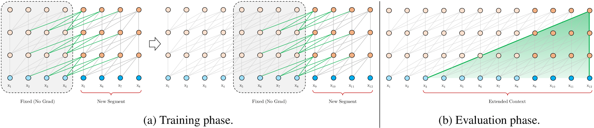
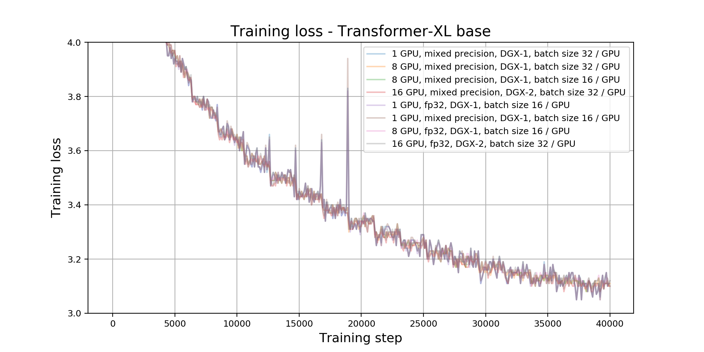
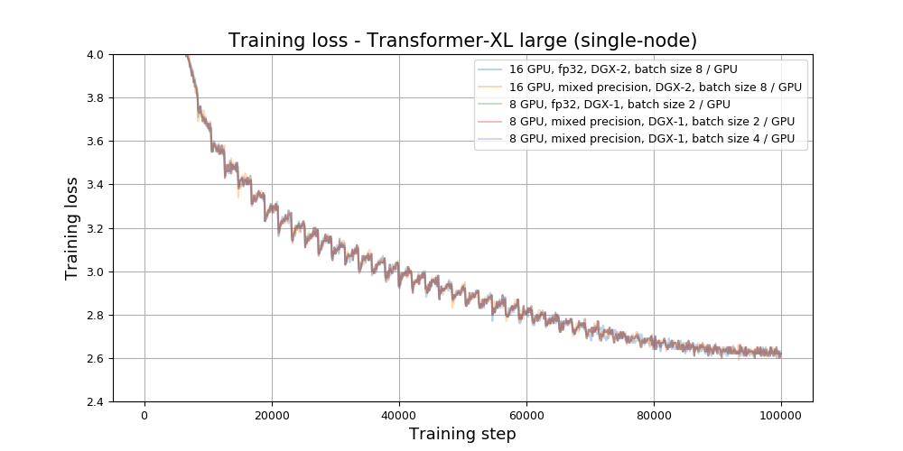
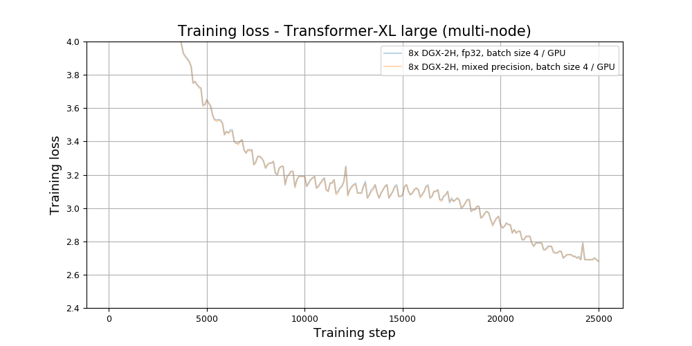

# Transformer-XL For PyTorch

This repository provides a script and recipe to train the Transformer-XL model
to achieve state-of-the-art accuracy, and is tested and maintained by NVIDIA.

## Table Of Contents

<!-- TOC GFM -->

* [Model overview](#model-overview)
  * [Model architecture](#model-architecture)
  * [Default configuration](#default-configuration)
  * [Feature support matrix](#feature-support-matrix)
    * [Features](#features)
  * [Mixed precision training](#mixed-precision-training)
    * [Enabling mixed precision](#enabling-mixed-precision)
* [Setup](#setup)
  * [Requirements](#requirements)
* [Quick Start Guide](#quick-start-guide)
* [Advanced](#advanced)
  * [Scripts and sample code](#scripts-and-sample-code)
  * [Parameters](#parameters)
  * [Command-line options](#command-line-options)
  * [Getting the data](#getting-the-data)
    * [Dataset guidelines](#dataset-guidelines)
    * [Multi-dataset](#multi-dataset)
  * [Training process](#training-process)
    * [Multi-node](#multi-node)
  * [Inference process](#inference-process)
* [Performance](#performance)
  * [Benchmarking](#benchmarking)
    * [Training performance benchmark](#training-performance-benchmark)
      * [Training performance benchmark for multi-node](#training-performance-benchmark-for-multi-node)
    * [Inference performance benchmark](#inference-performance-benchmark)
  * [Results](#results)
    * [Training accuracy results](#training-accuracy-results)
      * [Training accuracy: NVIDIA DGX-1 (8x V100 16G)](#training-accuracy-nvidia-dgx-1-8x-v100-16g)
        * [Base model](#base-model)
        * [Large model](#large-model)
      * [Training accuracy: NVIDIA DGX-2 (16x V100 32G)](#training-accuracy-nvidia-dgx-2-16x-v100-32g)
        * [Base model](#base-model-1)
        * [Large model](#large-model-1)
      * [Training accuracy: 8x NVIDIA DGX-2H (16x V100 32G)](#training-accuracy-8x-nvidia-dgx-2h-16x-v100-32g)
        * [Large model](#large-model-2)
      * [Training accuracy plots](#training-accuracy-plots)
        * [Base model](#base-model-2)
        * [Large model (single-node)](#large-model-single-node)
        * [Large model (multi-node)](#large-model-multi-node)
      * [Training stability test](#training-stability-test)
        * [Base model](#base-model-3)
        * [Large model (single-node)](#large-model-single-node-1)
        * [Large model (multi-node)](#large-model-multi-node-1)
    * [Training performance results](#training-performance-results)
      * [Training performance: NVIDIA DGX-1 (8x V100 16G)](#training-performance-nvidia-dgx-1-8x-v100-16g)
        * [Base model](#base-model-4)
        * [Large model](#large-model-3)
      * [Training performance: NVIDIA DGX-2 (16x V100 32G)](#training-performance-nvidia-dgx-2-16x-v100-32g)
        * [Base model](#base-model-5)
        * [Large model](#large-model-4)
      * [Training performance: 8x NVIDIA DGX-2 (16x V100 32G)](#training-performance-8x-nvidia-dgx-2-16x-v100-32g)
        * [Large model](#large-model-5)
    * [Inference performance results](#inference-performance-results)
      * [Inference performance: NVIDIA DGX-1 (1x V100 16G)](#inference-performance-nvidia-dgx-1-1x-v100-16g)
        * [Base model](#base-model-6)
        * [Large model](#large-model-6)
      * [Inference performance: NVIDIA T4](#inference-performance-nvidia-t4)
        * [Base model](#base-model-7)
        * [Large model](#large-model-7)
* [Release notes](#release-notes)
  * [Changelog](#changelog)
  * [Known issues](#known-issues)

<!-- /TOC -->

## Model overview

This repository provides an implementation of the Transformer-XL model in
[PyTorch](https://pytorch.org) from the paper [Transformer-XL: Attentive
Language Models Beyond a Fixed-Length
Context](https://arxiv.org/abs/1901.02860). Transformer-XL is a
transformer-based language model with a segment-level recurrence and a novel
relative positional encoding. Enhancements introduced in Transformer-XL help
capture better long-term dependencies by attending to tokens from multiple
previous segments.

Our implementation is based on the
[codebase](https://github.com/kimiyoung/transformer-xl) published by the
authors of the Transformer-XL paper.
Our implementation uses a modified model architecture. Our
modifications were made to achieve better hardware utilization and to take
advantage of Tensor Cores. Similar modifications were also proposed in an
implementation available from
[github.com/cybertronai/transformer-xl](https://github.com/cybertronai/transformer-xl).
Refer to the [Model architecture](#model-architecture) section for more
details.

This model is trained with mixed precision using Tensor Cores on NVIDIA Volta
GPUs and evaluated on Volta and Turing GPUs. Therefore, researchers can get
results up to 2.5x faster than training without Tensor Cores, while
experiencing the benefits of mixed precision training. This model is tested
against each NGC monthly container release to ensure consistent accuracy and
performance over time.

### Model architecture

The Transformer-XL "base" model for WikiText-103 dataset available in this
repository was modified to use the following hyperparameter values:


|**Hyperparameter**|**Description**|**Original setting for the base model**|**Our modification for the base model**|
|------------------|---------------|--------------------------------------:|--------------------------------------:|
| `d_model` | hidden size                                                      | 410  | 512  |
| `n_head`  | number of attention heads                                        | 10   | 8    |
| `d_head`  | size of each attention head                                      | 41   | 64   |
| `d_inner` | hidden size in fully-connected layers                            | 2100 | 2048 |
| `tgt_len` | number of tokens to predict during training                      | 150  | 192  |
| `mem_len` | number of tokens cached from previous iterations during training | 150  | 192  |

Changes described above were made to align certain hyperparameters with powers
of two, with this modification, the model is able to achieve better hardware
utilization, and therefore higher training throughput.

The Transformer-XL "large" model for WikiText-103 dataset available in this
repository uses the original hyperparameters from the [reference
implementation](https://github.com/kimiyoung/transformer-xl).

The following table lists the hyperparameters for the large and the base
Transformer-XL models for WikiText-103 dataset available in this repository.

| **Hyperparameter** | **Description**                                                  | **Base model** | **Large model**  |
| ------------------ | ---------------------------------------------------------------- | -------------: | ---------------: |
| `n_layer`          | number of layers                                                 | 16             | 18               |
| `d_model`          | hidden size                                                      | 512            | 1024             |
| `n_head`           | number of attention heads                                        | 8              | 16               |
| `d_head`           | size of each attention head                                      | 64             | 64               |
| `d_inner`          | inner hidden size in fully-connected layers                      | 2048           | 4096             |
| `dropout`          | dropout                                                          | 0.1            | 0.2              |
| `dropatt`          | dropout after softmax in the attention                           | 0.0            | 0.2              |
| `lr`               | base learning rate                                               | 0.01           | 0.01             |
| `eta_min`          | minimum learning rate (for cosine decay)                         | 0.001          | 0.0001           |
| `max_step`         | number of training steps                                         | 40,000         | 100,000          |
| `warmup_step`      | number of learning rate warmup steps                             | 1,000          | 16,000           |
| `batch_size`       | training batch size                                              | 256            | 128              |
| `tgt_len`          | number of tokens to predict during training                      | 192            | 384              |
| `mem_len`          | number of tokens cached from previous iterations during training | 192            | 384              |

The Transformer-XL model addresses the limitations of vanilla transformer-based
language models, which are only able to use relatively short context, bounded
by the segment length. The Transformer-XL introduces a recurrence mechanism,
which is able to use a cached hidden state from previous segments. During
training, the context consists of a concatenation of current segment's hidden
state and cached states from previous iterations. Gradients are backpropagated
only through the current segment, although the model is able to take advantage
of the extra information stored in the cache and therefore is able to model
long-term dependencies.

An illustration of the recurrence mechanism taken from the [Transformer-XL
paper](https://arxiv.org/abs/1901.02860) is shown below.



### Default configuration

The following features were implemented in this model:

* general
  * single-node or multi-node, data-parallel multi-GPU training
  * training and inference with mixed precision using Tensor Cores
  * mixed precision training implemented using 
    [Apex AMP](https://nvidia.github.io/apex/amp.html), with `O2` optimization
    level and with a dynamic loss scaling

* model
  * 16-layer base Transformer-XL model with hidden size 512, 8 attention heads,
    each head with hidden size 64
  * 18-layer large Transformer-XL model with hidden size 1024, 16 attention
    heads, each head with hidden size 64
  * the model trained on
    [WikiText-103](https://blog.einstein.ai/the-wikitext-long-term-dependency-language-modeling-dataset/)
    dataset, using word-level vocabulary and
    adaptive softmax
  * embedding weights are tied with weights in the classifier

* training
  * training with [LAMB](https://arxiv.org/abs/1904.00962) optimizer, the
    implementation of the optimizer uses
    [TorchScript](https://pytorch.org/docs/stable/jit.html), which enables
    the fusion of elementwise operations and accelerates the training
  * support for training with a gradient accumulation
  * base model:
    * linear learning rate warmup for 1,000 iterations, followed by the cosine
      learning rate schedule, the initial learning rate is set to 0.01, and the final
      learning rate is set to 0.001
    * training for 40,000 steps, using a batch size of 256
  * large model:
    * linear learning rate warmup for 16,000 iterations, followed by the cosine
      learning rate schedule, the initial learning rate is set to 0.01, and the final
      learning rate is set to 0.0001
    * training for 100,000 steps, using a batch size of 128

* inference
  * support for multi-gpu inference
  * support for [TorchScript](https://pytorch.org/docs/stable/jit.html) and
    pure Python inference
  * each token is using the same size of the context from previous time steps.
  * base model:
    * target length is set to 64, length of memory is set to 640
    * positional embeddings are clamped after 400 time steps
  * large model:
    * target length is set to 128, length of memory is set to 1,600
    * positional embeddings are clamped after 1,000 time steps

### Feature support matrix

The following features are supported by this model:

| **Feature** | **Transformer-XL** |
|:------------|-------------------:|
|[Apex AMP](https://nvidia.github.io/apex/amp.html) | Yes |
|[PyTorch DistributedDataParallel](https://pytorch.org/docs/stable/nn.html#torch.nn.parallel.DistributedDataParallel) | Yes |
|[LAMB](https://arxiv.org/abs/1904.00962v3) | Yes |
| Inference with [TorchScript](https://pytorch.org/docs/stable/jit.html) | Yes |
| Multi-node training | Yes |


#### Features

[Apex AMP](https://nvidia.github.io/apex/amp.html) - a tool that enables Tensor
Core-accelerated training. Refer to the [Enabling mixed
precision](#enabling-mixed-precision) section for more details.

[PyTorch
DistributedDataParallel](https://pytorch.org/docs/stable/nn.html#torch.nn.parallel.DistributedDataParallel) - a module
wrapper that enables easy multiprocess distributed data-parallel
training.

[LAMB](https://arxiv.org/abs/1904.00962v3) - stands for Layerwise Adaptive
Moments Based optimizer, is a large batch optimization technique that helps
accelerate training of deep neural networks using large minibatches.

[TorchScript](https://pytorch.org/docs/stable/jit.html) - is a way to create
serializable and optimizable models from PyTorch code. Any TorchScript program
can be saved from a Python process and loaded in a process where there is no
Python dependency.

### Mixed precision training

Mixed precision is the combined use of different numerical precisions in a
computational method.
[Mixed precision](https://arxiv.org/abs/1710.03740) training offers significant
computational speedup by performing operations in half-precision format while
storing minimal information in single-precision to retain as much information
as possible in critical parts of the network. Since the introduction of [Tensor
Cores](https://developer.nvidia.com/tensor-cores) in the Volta and Turing
architectures, significant training speedups are experienced by switching to
mixed precision -- up to 3x overall speedup on the most arithmetically intense
model architectures. Using mixed precision training previously required two
steps:

1. Porting the model to use the FP16 data type where appropriate.
2. Manually adding loss scaling to preserve small gradient values.

The ability to train deep learning networks with lower precision was introduced
in the Pascal architecture and first supported in [CUDA
8](https://devblogs.nvidia.com/parallelforall/tag/fp16/) in the NVIDIA Deep
Learning SDK.

For information about:
* How to train using mixed precision, see the [Mixed Precision
  Training](https://arxiv.org/abs/1710.03740) paper and [Training With Mixed
  Precision](https://docs.nvidia.com/deeplearning/sdk/mixed-precision-training/index.html)
  documentation.
* Techniques used for mixed precision training, see the [Mixed-Precision
  Training of Deep Neural
  Networks](https://devblogs.nvidia.com/mixed-precision-training-deep-neural-networks/)
  blog.
* APEX tools for mixed precision training, see the [NVIDIA Apex: Tools for Easy
  Mixed-Precision Training in
  PyTorch](https://devblogs.nvidia.com/apex-pytorch-easy-mixed-precision-training/)
  .

#### Enabling mixed precision
The `pytorch/train.py` training script launches mixed precision training
with Tensor Cores if the flag `--fp16` is set.

Mixed precision is enabled in PyTorch by using the Automatic Mixed Precision
(AMP), library from [APEX](https://github.com/NVIDIA/apex) that casts variables
to half-precision upon retrieval, while storing variables in single-precision
format. Furthermore, to preserve small gradient magnitudes in backpropagation,
a [loss
scaling](https://docs.nvidia.com/deeplearning/sdk/mixed-precision-training/index.html#lossscaling)
step must be included when applying gradients. In PyTorch, loss scaling can be
easily applied by using `scale_loss()` method provided by AMP. The scaling
value to be used can be
[dynamic](https://nvidia.github.io/apex/amp.html#apex.amp.initialize) or fixed.

For an in-depth walk through on AMP, check out sample usage
[here](https://nvidia.github.io/apex/amp.html#).
[APEX](https://github.com/NVIDIA/apex) is a PyTorch extension that contains
utility libraries, such as AMP, which require minimal network code changes to
leverage Tensor Cores performance.

The following steps were needed to enable mixed precision training in
Transformer-XL:

1. Import AMP from APEX:

```
from apex import amp
```

2. Initialize AMP and wrap the model and the optimizer before starting the
  training:

```
model, optimizer = amp.initialize(
    model,
    optimizer,
    opt_level='O2',
    )
```

3. Apply `scale_loss` context manager:

```
with amp.scale_loss(loss, optimizer) as scaled_loss:
    scaled_loss.backward()
```

4. Apply gradient clipping on single precision master weights:

```
torch.nn.utils.clip_grad_norm_(amp.master_params(optimizer), args.clip)
```

## Setup

The following section lists the requirements that you need to meet in order to
start training the Transformer-XL model.

### Requirements

This repository contains `Dockerfile` which extends the PyTorch NGC container
and encapsulates some dependencies. Aside from these dependencies, ensure you
have the following components:

* [NVIDIA Docker](https://github.com/NVIDIA/nvidia-docker)
* [PyTorch 19.11-py3 NGC container](https://ngc.nvidia.com/registry/nvidia-pytorch)
* [NVIDIA Volta](https://www.nvidia.com/en-us/data-center/volta-gpu-architecture/)
  or [Turing](https://www.nvidia.com/pl-pl/geforce/turing/) based GPU

For more information about how to get started with NGC containers, see the
following sections from the NVIDIA GPU Cloud Documentation and the Deep
Learning DGX Documentation:

* [Getting Started Using NVIDIA GPU Cloud](https://docs.nvidia.com/ngc/ngc-getting-started-guide/index.html),
* [Accessing And Pulling From The NGC container registry](https://docs.nvidia.com/deeplearning/dgx/user-guide/index.html#accessing_registry),
* [Running PyTorch](https://docs.nvidia.com/deeplearning/dgx/pytorch-release-notes/running.html#running).

For those unable to use the Pytorch NGC container, to set up the required
environment or create your own container, see the versioned [NVIDIA Container
Support
Matrix](https://docs.nvidia.com/deeplearning/frameworks/support-matrix/index.html).

For multi-node, the sample provided in this repository requires
[Enroot](https://github.com/NVIDIA/enroot) and
[Pyxis](https://github.com/NVIDIA/pyxis) set up on a
[SLURM](https://slurm.schedmd.com) cluster.

## Quick Start Guide

To train your model using mixed precision with Tensor Cores or using FP32,
perform the following steps using the default parameters of the Transformer-XL
base model on the
[WikiText-103](https://blog.einstein.ai/the-wikitext-long-term-dependency-language-modeling-dataset/)
dataset. 

For the specifics concerning training
and inference, see the [Advanced](#advanced) section.

1. Clone the repository.

```
git clone https://github.com/NVIDIA/DeepLearningExamples
cd DeepLearningExamples/PyTorch/LanguageModeling/Transformer-XL
```

2. Download and preprocess the dataset.

```
bash getdata.sh
```

3. Build the Transformer-XL PyTorch NGC container.

From now on, all scripts should be executed from the `pytorch` directory.

```
cd pytorch
bash scripts/docker/build.sh
```

4. Start an interactive session in the NGC container to run training/inference.

```
bash scripts/docker/interactive.sh
```

5. Start training.

This repository contains a number of predefined configurations to run the
training on DGX-1 and DGX-2 nodes.

To start the training, run:

```
bash run_wt103_{base,large}.sh train <#GPUs> --config {dgx1,dgx2}_<#GPUs>gpu_{fp16,fp32}
```

* use the `run_wt103_base.sh` script to train the base model, and use the
  `run_wt103_large.sh` script to train the large model
* the training is executed on `<#GPUs>` GPUs, supported values for `<#GPUs>`
  are: 1, 2, 4, 8, 16
* use configs with the `dgx1` prefix to run on a DGX-1, and configs with the
  `dgx2` prefix to run on a DGX-2
* configs with the `fp16` suffix are launching mixed precision training,
  configs with the `fp32` suffix are launching FP32 training

Examples:

To launch FP32 training of the base Transformer-XL model on a DGX-1 using 8
GPUs, run:
```
bash run_wt103_base.sh train 8 --config dgx1_8gpu_fp32
```

To launch mixed precision training of the large Transformer-XL model on a
DGX-2 using 16 GPUs, run:
```
bash run_wt103_large.sh train 16 --config dgx2_16gpu_fp16
```

To run on multiple nodes, see the [Multi-node](#multi-node) section.  

For more information on the available options, and for an explanation of what
happens at the end of training, refer to the [Training
process](#training-process) section.

6. Start evaluation.

To start inference on the test set using `<#GPUs>` GPUs, run:

```
bash run_wt103_{base,large}.sh eval <#GPUs> [--fp16] [--type {pytorch, torchscript}]
```

Select `run_wt103_base.sh` for the base Transformer-XL model and
`run_wt103_large.sh` for the large Transformer-XL model.
The `--fp16` flag is optional, however, if it's specified, then the script
launches mixed precision inference with Tensor Cores. If the flag is not
present, then the script launches FP32 inference.
By default, the script is loading the checkpoint from
`LM-TFM/checkpoint_best.pt`, which contains the model corresponding to the
lowest value of the validation loss from the previous training run. Path to the
checkpoint can be customized by setting the `--model` flag.

Inference can use pure Python execution or TorchScript from using the `--type`
flag.

Supported values for `<#GPUs>` are: 1, 2, 4, 8, 16.

Additionally, one can pass the input text directly from the command-line using
the `--manual` flag. This mode of operation supports only 1 GPU and batch size
of 1. The script outputs average loss and perplexity for the provided input
text.

Examples:

```
bash run_wt103_base.sh eval 1 \
  --model LM-TFM/checkpoint_best.pt \
  --fp16 \
  --manual "recognize speech"

===============================================================================
| test loss  6.20 | test ppl   494.291
===============================================================================
```

```
bash run_wt103_base.sh eval 1 \
  --model LM-TFM/checkpoint_best.pt \
  --fp16 \
  --manual "wreck a nice beach"

===============================================================================
| test loss  8.04 | test ppl  3099.706
===============================================================================
```

For more information on the available options, refer to the [Inference
process](#inference-process) section.

## Advanced

The following sections provide greater details of the dataset, running training
and inference, and the training results.

### Scripts and sample code

In the `pytorch` directory, the most important files are:

* `Dockerfile`: container with the basic set of dependencies to run
  Transformer-XL
* `data_utils.py`: data loading utilities
* `eval.py`: serves as the entry point to launch the evaluation and inference
* `lamb.py`: implementation of [LAMB](https://arxiv.org/abs/1904.00962)
  optimizer
* `mem_transformer.py`: implementation of the Transformer-XL model
* `requirements.txt`: set of extra requirements for running Transformer-XL
* `train.py`: serves as the entry point to launch the training
* `run.sub`: Slurm batch script for launching multi-node training

The `pytorch/utils` directory contains the following additional modules:

* `adaptive_softmax.py`: implementation of adaptive softmax
* `data_parallel.py`: implementation of `BalancedDataParallel` class
* `distributed.py`: utility functions for running distributed training
* `exp_utils.py`: utility functions for running training and benchmarking
* `log_uniform_sampler.py`: implementation of log-uniform sampler
* `proj_adaptive_softmax.py`: implementation of projected adaptive softmax
* `vocabulary.py`: implementation of word-level vocabulary and BPE-based
  vocabulary

The `pytorch/inference` directory contains modules optimized for running
inference with TorchScript:
* `mem_transformer_jit.py`: implementation of TorchScript-compatible
  Transformer-XL model
* `proj_adaptive_softmax_jit.py`: implementation of TorchScript-compatible
  projected adaptive softmax

### Parameters

**Training**

The complete list of available parameters for the `pytorch/train.py` training
script contains:

```
general setup:
  --work_dir WORK_DIR   Directory for the results (default: LM-TFM)
  --append_dataset      Automatically append dataset name to work_dir
                        (default: False)
  --append_time         Automatically append current time to work_dir
                        (default: False)
  --cuda                Run training on a GPU using CUDA (default: False)
  --fp16                Run training in fp16/mixed precision (default: False)
  --restart RESTART     Restart training from the saved checkpoint (default: )
  --debug               Run in debug mode (do not create exp dir) (default:
                        False)
  --log_all_ranks       Enable logging from all distributed ranks (default:
                        False)
  --save-all            Save all checkpoints (default: False)
  --log_interval LOG_INTERVAL
                        Report interval (default: 10)
  --target_throughput TARGET_THROUGHPUT
                        Target training throughput (for benchmarking)
                        (default: None)
  --target_perplexity TARGET_PERPLEXITY
                        Target validation perplexity (for benchmarking)
                        (default: None)

dataset setup:
  --data DATA           Location of the data corpus (default:
                        ../data/wikitext-103)
  --dataset {wt103,lm1b,enwik8,text8}
                        Dataset name (default: wt103)
  --vocab {word,bpe}    Type of vocabulary (default: word)

model setup:
  --n_layer N_LAYER     Number of total layers (default: 16)
  --n_head N_HEAD       Number of heads (default: 8)
  --d_head D_HEAD       Head dimension (default: 64)
  --d_embed D_EMBED     Embedding dimension (default: -1)
  --d_model D_MODEL     Model dimension (default: 512)
  --d_inner D_INNER     Inner dimension in feedforward layer (default: 2048)
  --dropout DROPOUT     Global dropout rate (default: 0.1)
  --dropatt DROPATT     Attention probability dropout rate (default: 0.0)
  --pre_lnorm           Apply LayerNorm to the input instead of the output
                        (default: False)
  --attn_type ATTN_TYPE
                        Attention type. 0 for ours, 1 for Shaw et al,2 for
                        Vaswani et al, 3 for Al Rfou et al. (default: 0)
  --not_tied            Do not tie the word embedding and softmax weights
                        (default: False)
  --clamp_len CLAMP_LEN
                        Use the same pos embeddings after clamp_len (default:
                        -1)
  --adaptive            Use adaptive softmax (default: False)
  --div_val DIV_VAL     Dividend value for adaptive input and softmax
                        (default: 1)
  --sample_softmax SAMPLE_SOFTMAX
                        Number of samples in sampled softmax (default: -1)
  --init INIT           Parameter initializer to use (default: normal)
  --emb_init EMB_INIT   Parameter initializer to use (default: normal)
  --init_range INIT_RANGE
                        Parameters initialized by U(-init_range, init_range)
                        (default: 0.1)
  --emb_init_range EMB_INIT_RANGE
                        Parameters initialized by U(-init_range, init_range)
                        (default: 0.01)
  --init_std INIT_STD   Parameters initialized by N(0, init_std) (default:
                        0.02)
  --proj_init_std PROJ_INIT_STD
                        Parameters initialized by N(0, init_std) (default:
                        0.01)

optimizer setup:
  --optim {adam,sgd,adagrad,lamb,jitlamb}
                        Optimizer to use (default: jitlamb)
  --lr LR               Initial learning rate (default: 0.01)
  --mom MOM             Momentum for sgd (default: 0.0)
  --scheduler {cosine,inv_sqrt,dev_perf,constant}
                        LR scheduler to use (default: cosine)
  --max_step_scheduler MAX_STEP_SCHEDULER
                        Max number of training steps for LR scheduler
                        (default: None)
  --warmup_step WARMUP_STEP
                        Number of iterations for LR warmup (default: 1000)
  --decay_rate DECAY_RATE
                        Decay factor when ReduceLROnPlateau is used (default:
                        0.5)
  --lr_min LR_MIN       Minimum learning rate during annealing (default: 0.0)
  --clip CLIP           Gradient clipping (default: 0.25)
  --weight_decay WEIGHT_DECAY
                        Weight decay for adam|lamb (default: 0.0)
  --clip_nonemb         Only clip the gradient of non-embedding params
                        (default: False)
  --patience PATIENCE   Patience (default: 0)
  --eta_min ETA_MIN     Min learning rate for cosine scheduler (default:
                        0.001)

training setup:
  --max_step MAX_STEP   Max number of training steps (default: 40000)
  --batch_size BATCH_SIZE
                        Global batch size (default: 256)
  --batch_chunk BATCH_CHUNK
                        Split batch into chunks and train with gradient
                        accumulation (default: 1)
  --roll                Enable random shifts within each data stream (default:
                        False)
  --tgt_len TGT_LEN     Number of tokens to predict (default: 192)
  --ext_len EXT_LEN     Length of the extended context (default: 0)
  --mem_len MEM_LEN     Length of the retained previous heads (default: 192)
  --seed SEED           Random seed (default: 1111)
  --multi_gpu {ddp,dp}  Use multiple GPU (default: None)
  --gpu0_bsz GPU0_BSZ   Batch size on gpu 0 (for "dp" backend) (default: -1)
  --same_length         Use the same attn length for all tokens (default:
                        False)
  --varlen              Use variable length (default: False)

validation setup:
  --eval_tgt_len EVAL_TGT_LEN
                        Number of tokens to predict for evaluation (default:
                        192)
  --eval_batch_size EVAL_BATCH_SIZE
                        Eval batch size (default: 16)
  --eval_max_steps EVAL_MAX_STEPS
                        Max eval steps (default: -1)
  --eval_interval EVAL_INTERVAL
                        Evaluation interval (default: 5000)
```

**Inference**

The complete list of available parameters for the `eval.py` inference
script contains:

```
  --work_dir WORK_DIR   experiment directory (default: LM-TFM)
  --debug               run in debug mode (do not create exp dir) (default:
                        False)
  --data DATA           location of the data corpus (default:
                        ../data/wikitext-103)
  --manual MANUAL [MANUAL ...]
                        run model on raw input data (default: None)
  --dataset {wt103,lm1b,enwik8,text8}
                        dataset name (default: wt103)
  --split {all,valid,test}
                        which split to evaluate (default: all)
  --type {pytorch,torchscript}
                        type of runtime to use (default: pytorch)
  --batch_size BATCH_SIZE
                        batch size (default: 16)
  --tgt_len TGT_LEN     number of tokens to predict (default: 64)
  --ext_len EXT_LEN     length of the extended context (default: 0)
  --mem_len MEM_LEN     length of the retained previous heads (default: 640)
  --clamp_len CLAMP_LEN
                        max positional embedding index (default: -1)
  --cuda                Run evaluation on a GPU using CUDA (default: False)
  --model MODEL         path to the checkpoint (default: )
  --fp16                Run training in fp16/mixed precision (default: False)
  --log_all_ranks       Enable logging for all distributed ranks (default:
                        False)
  --same_length         set same length attention with masking (default:
                        False)
  --log_interval LOG_INTERVAL
                        Report interval (default: 10)
  --target_perplexity TARGET_PERPLEXITY
                        target perplexity (default: None)
  --target_throughput TARGET_THROUGHPUT
                        target throughput (default: None)
  --save_data           save latency and throughput data to a file (default:
                        False)
  --repeat REPEAT       loop over the dataset REPEAT times (default: 1)
  --max_size MAX_SIZE   run inference on up to MAX_SIZE batches (default:
                        None)
  --percentiles PERCENTILES [PERCENTILES ...]
                        percentiles for latency confidence intervals (default:
                        [90, 95, 99])
  --save_torchscript SAVE_TORCHSCRIPT
                        save torchscript model to a file (default: None)
  --load_torchscript LOAD_TORCHSCRIPT
                        load torchscript model from a file (default: None)
```


### Command-line options

To see the full list of available options and their descriptions, use the `-h`
or `--help` command-line option. For example, for training:

```
python3 train.py --help

usage: train.py [-h] [--work_dir WORK_DIR] [--append_dataset] [--append_time]
                [--cuda] [--fp16] [--restart RESTART] [--debug]
                [--log_all_ranks] [--save-all] [--log_interval LOG_INTERVAL]
                [--target_throughput TARGET_THROUGHPUT]
                [--target_perplexity TARGET_PERPLEXITY] [--data DATA]
                [--dataset {wt103,lm1b,enwik8,text8}] [--vocab {word,bpe}]
                [--n_layer N_LAYER] [--n_head N_HEAD] [--d_head D_HEAD]
                [--d_embed D_EMBED] [--d_model D_MODEL] [--d_inner D_INNER]
                [--dropout DROPOUT] [--dropatt DROPATT] [--pre_lnorm]
                [--attn_type ATTN_TYPE] [--not_tied] [--clamp_len CLAMP_LEN]
                [--adaptive] [--div_val DIV_VAL]
                [--sample_softmax SAMPLE_SOFTMAX] [--init INIT]
                [--emb_init EMB_INIT] [--init_range INIT_RANGE]
                [--emb_init_range EMB_INIT_RANGE] [--init_std INIT_STD]
                [--proj_init_std PROJ_INIT_STD]
                [--optim {adam,sgd,adagrad,lamb,jitlamb}] [--lr LR]
                [--mom MOM] [--scheduler {cosine,inv_sqrt,dev_perf,constant}]
                [--max_step_scheduler MAX_STEP_SCHEDULER]
                [--warmup_step WARMUP_STEP] [--decay_rate DECAY_RATE]
                [--lr_min LR_MIN] [--clip CLIP] [--weight_decay WEIGHT_DECAY]
                [--clip_nonemb] [--patience PATIENCE] [--eta_min ETA_MIN]
                [--max_step MAX_STEP] [--batch_size BATCH_SIZE]
                [--batch_chunk BATCH_CHUNK] [--roll] [--tgt_len TGT_LEN]
                [--ext_len EXT_LEN] [--mem_len MEM_LEN] [--seed SEED]
                [--multi_gpu {ddp,dp}] [--gpu0_bsz GPU0_BSZ] [--same_length]
                [--varlen] [--eval_tgt_len EVAL_TGT_LEN]
                [--eval_batch_size EVAL_BATCH_SIZE]
                [--eval_max_steps EVAL_MAX_STEPS]
                [--eval_interval EVAL_INTERVAL] [--local_rank LOCAL_RANK]
```

For example, for inference:

```
python3 eval.py --help

usage: eval.py [-h] [--work_dir WORK_DIR] [--debug] [--data DATA]
               [--manual MANUAL [MANUAL ...]]
               [--dataset {wt103,lm1b,enwik8,text8}]
               [--split {all,valid,test}] [--type {pytorch,torchscript}]
               [--batch_size BATCH_SIZE] [--tgt_len TGT_LEN]
               [--ext_len EXT_LEN] [--mem_len MEM_LEN] [--clamp_len CLAMP_LEN]
               [--cuda] [--model MODEL] [--fp16] [--log_all_ranks]
               [--same_length] [--log_interval LOG_INTERVAL]
               [--target_perplexity TARGET_PERPLEXITY]
               [--target_throughput TARGET_THROUGHPUT] [--save_data]
               [--repeat REPEAT] [--max_size MAX_SIZE]
               [--percentiles PERCENTILES [PERCENTILES ...]]
               [--save_torchscript SAVE_TORCHSCRIPT]
               [--load_torchscript LOAD_TORCHSCRIPT] [--local_rank LOCAL_RANK]
```


### Getting the data

The Transformer-XL model was trained on the
[WikiText-103](https://blog.einstein.ai/the-wikitext-long-term-dependency-language-modeling-dataset/)
dataset. The WikiText-103 dataset is a collection of over 100 million tokens
extracted from the set of verified
[Good](https://en.wikipedia.org/wiki/Wikipedia:Good_articles) and
[Featured](https://en.wikipedia.org/wiki/Wikipedia:Featured_articles) articles
on Wikipedia.

This repository contains the `getdata.sh` download script which
automatically downloads and extracts the training, validation and test
datasets. By default, data is downloaded to the `data` directory.

In order to test with other datasets, the script needs to be customized
accordingly.

#### Dataset guidelines

The WikiText-103 dataset was already pre-tokenized with word-level tokens. The
dataset features a large vocabulary of 267,735 tokens and retains the original
case, punctuation and numbers.

The `getdata.sh` script downloads the data, extracts the archive and renames
the training, validation, and test set to `train.txt`, `valid.txt`, `test.txt`
respectively.

#### Multi-dataset

Using other datasets requires changes in the following files:

* `pytorch/train.py`:
  * the name of the new dataset should be added to the `dataset` argument in
    the `parse_args()` function
  * desired values of cutoffs for adaptive softmax should be added in the
    `main()` function, after the section which builds train/valid/test data
    iterators
* `pytorch/data_utils.py`:
  * the support for the new dataset needs to be added to the `Corpus` class:
    names of files containing training, validation and test data, options for
    the tokenizer, and dataset iterator

The current codebase supports training with word-level vocabulary
(automatically generated based on the provided dataset) and with BPE vocabulary
(using pre-built vocabulary from pretrained GPT2 model imported from
[github.com/huggingface/transformers](https://github.com/huggingface/transformers).

Additionally, using other datasets may require changes in some hyperparameters
(for example, batch size, learning rate, number of training steps,
and the configuration of learning rate scheduler). 

### Training process

The default training configuration can be launched by running the
`run_wt103_base.sh` or the `run_wt103_large.sh` script with the first argument
set to `train`. By default, the training results are saved to the `LM-TFM`
directory; this can be customized by setting the `--work_dir` parameter.

The training script launches a single-node data-parallel training with a fixed
global batch size of 256, optionally with gradient accumulation to allow
training on configurations with less than 8 GPUs. Logs from the training are
automatically saved to the `LM-TFM/train_log.log` file.

**Command-line**

You can launch training of the Transformer-XL base/large model on the
WikiText-103 dataset with the word-based vocabulary and adaptive softmax using
`<#GPUs>` GPUs. For example:

```
bash run_wt103_base.sh train <#GPUs> [--fp16] [--batch_chunk CHUNK]
```

and

```
bash run_wt103_large.sh train <#GPUs> [--fp16] [--batch_chunk CHUNK]
```


The `--fp16` flag is optional, however, if it's specified, then the script
launches mixed precision training with Tensor Cores; if the flag is not
present, then the script launches FP32 training.

The `--batch_chunk CHUNK` parameter controls gradient accumulation. With
gradient accumulation, the batch size is split into `CHUNK` chunks of equal
size, the training script executes the forward and backward pass using each
chunk and then executes the optimizer using accumulated gradients.

**Examples**

You can launch mixed precision training of the Transformer-XL base model on the
WikiText-103 dataset using 16 GPUs. For example:

```
bash run_wt103_base.sh train 16 --fp16 --batch_chunk 1
```

The batch size per GPU is equal to the default global batch size of 256
divided by the product of the number of GPUs times the number of chunks, in this
case batch size per GPU is equal to `256 / (16 * 1) = 16`.

You can launch FP32 training using 8 GPUs; the batch size per GPU is equal to 16
(`--batch_chunk` was set to `2` because a local batch size of 32 runs out
of memory on a DGX-1 with Tesla V100 16G in FP32 training). For example:

```
bash run_wt103_base.sh train 8 --batch_chunk 2
```

A progress summary of the training progress is printed after every 10 training
iterations; this can be customized by setting the `--log_interval` parameter.
The summary is printed in the following format:

```
| epoch  18 step    36000 | batches    283 / 2101 | lr 1.220e-03 | ms/batch 185.1 | tok/s  265585 | loss  3.12 | ppl     22.71
```

which contains information about a current training epoch, current training
step, number of batches processed within the current epoch, current learning
rate, execution time in milliseconds per batch, throughput in tokens per
second, current training loss and training perplexity.

The script saves two checkpoints: `checkpoint_best.pt` which contains the model
corresponding to the lowest value of the validation loss and
`checkpoint_last.pt` which contains the model corresponding to the last
execution of the validation step. By default, the validation is executed every
5000 training steps, this can be customized by setting the `--eval_interval`
parameter. The summary of results on the validation dataset is printed in the
following format:

```
| Eval   7 at step    35000 | time:  1.37s | valid loss  3.14 | valid ppl    23.132
```

which contains information about the current epoch, current training step, time
needed to execute the validation, current validation loss, and validation
perplexity.

At the end of the training, the training script automatically runs evaluation
on the test dataset. This automatic evaluation is executed with values of
`mem_len` and `tgt_len` hyperparameters inherited from the training setup.
Evaluation (inference) benefits from longer attention sequences, therefore to
reproduce perplexity values reported in the [Transformer-XL
paper](https://arxiv.org/abs/1901.02860), it's necessary to run the final
evaluation with a dedicated inference script. Refer to the [Inference
process](#inference-process) section for more details.

#### Multi-node

Multi-node runs can be launched on a pyxis/enroot Slurm cluster (see
[Requirements](#requirements)). To launch a multi-node run, issue the
`run.sub` script with the following command for an 8-node DGX-2H training, for
example:

```
sbatch run.sub all
```

This repository contains a number of predefined configurations to run the
multi-node training on DGX-2H nodes. By default, `run.sub` launches 8-node
training. 

To launch multi-node training on `<NODES>` DGX-2H nodes, run:

```
CONFIG=<NODES>dgx2_16gpu_{fp16,fp32} sbatch -N <NODES> run.sub all
```

* supported values for `<NODES>` parameter are: 1, 2, 4, 8
* configs with `fp16` suffix launch mixed precision training, configs with `fp32` suffix launch FP32 training

Examples:

To launch 4-node mixed-precision training, run:

```
CONFIG=4dgx2_16gpu_fp16 sbatch -N 4 run.sub all
```

To launch 2-node FP32 training, run:

```
CONFIG=2dgx2_16gpu_fp32 sbatch -N 2 run.sub all
```

Note that the `run.sub` script is a starting point that has to be adapted
depending on the environment. In particular, variables such as `WORK_DIR` handle
the location of the workspace in the file system. The variable `CONT` should
point to the location of the Transformer-XL Docker container. It's assumed that
the Docker container built with the `scripts/docker/build.sh` script was pushed
to a Docker registry accessible from all compute nodes.

Refer to the contents of the file to see the full list of variables to adjust
for your system.

### Inference process

Inference can be run by launching the `run_wt103_base.sh` or the
`run_wt103_large.sh` script with the first argument set to `eval`. Running
inference requires a pre-trained model checkpoint.

The script supports single-node multi-GPU inference, each batch is split
equally among all GPUs running the inference and the loss is averaged over the
global batch. Logs from the inference are automatically saved to the
`LM-TFM/eval_log.log` file.

**Command-line**

You can launch inference of the Transformer-XL base/large model on the
WikiText-103 dataset with the word-based vocabulary and adaptive softmax using
`<#GPUs>` GPUs. For example:

```
bash run_wt103_base.sh eval <#GPUs> --model <PATH TO THE CHECKPOINT> [--fp16] [--type {pytorch, torchscript}]
```

and

```
bash run_wt103_large.sh eval <#GPUs> --model <PATH TO THE CHECKPOINT> [--fp16] [--type {pytorch, torchscript}]
```

The `--fp16` flag is optional, however, if it's specified, then the script
launches inference with Tensor Cores; if the flag is not present, then the
script launches FP32 inference.

The `--type` flag selects between pure Python PyTorch execution and TorchScript
execution.

Supported values for `<#GPUs>` are: 1, 2, 4, 8, 16.

**Examples**

To launch TorchScript mixed precision inference on 8 GPUs using a checkpoint
loaded from `LM-TFM/checkpoint_best.pt`, run:
```
bash run_wt103_base.sh eval 8 --model LM-TFM/checkpoint_best.pt --fp16 --type torchscript
```

To launch pure Python FP32 inference on a single GPU using a checkpoint loaded
from `LM-TFM/checkpoint_best.pt`, run:

```
bash run_wt103_base.sh eval 1 --model LM-TFM/checkpoint_best.pt --type pytorch
```


After the execution, the script prints a summary in the following format:

```
Evaluating with math fp16 type torchscript bsz 16 tgt_len 64 ext_len 0 mem_len 640 clamp_len 400
Time : 5.29s, 22.05ms/segment
====================================================================================================
| test loss  3.15 | test ppl    23.304
====================================================================================================
```

which contains information about runtime parameters, execution time, loss and
perplexity on the test dataset.

## Performance

### Benchmarking

The following section shows how to run benchmarks measuring the model
performance in training and inference modes.

#### Training performance benchmark

To benchmark the training performance for a specific local (per-gpu) batch size
`<LBS>`, with a specific number of GPUs `<#GPUs>` for a specific number of
training iterations `<ITER>`, run:

```
bash run_wt103_{base,large}.sh train <#GPUs> --config trainbench --local_batch_size <LBS> --max_step <ITER> [--fp16]
```

* use the `run_wt103_base.sh` script to run the benchmark for the base model,
  and use the `run_wt103_large.sh` script to run the benchmark for the large
  model
* it's recommended to launch at least 500 training steps to get a reliable estimate of training performace.
* the `--fp16` flag is optional, however, if it's specified, then the script
  launches mixed precision training with Tensor Cores. If the flag is not
  present, then the script launches FP32 training

For more information about the available options, refer to the [Training
process](#training-process) section.

The training script prints information in the following format:

```
(...)
| epoch   1 step      499 | batches    499 / 16802 | lr 4.990e-03 | ms/batch 219.9 | tok/s   27947 | loss  6.43 | ppl    620.80
| epoch   1 step      500 | batches    500 / 16802 | lr 5.000e-03 | ms/batch 221.4 | tok/s   27747 | loss  6.42 | ppl    611.70
-------------------------------------------------------------------------------
(...)
Training time: 1.81 minutes
Training throughput: 28508.91 tok/s
```

The last two lines contain information on the total training time and on the
average training throughput measured in tokens per second.

##### Training performance benchmark for multi-node

To benchmark the multi-node training performance of the large model on a
specific number of DGX-2H nodes `<NODES>` and a specific local batch size
`<LBS>`, run:

For mixed precision:
```
FP16=1 LOCAL_BATCH_SIZE=<LBS> CONFIG=trainbench_multinode sbatch -N <NODES> run.sub train
```

For FP32:

```
LOCAL_BATCH_SIZE=<LBS> CONFIG=trainbench_multinode sbatch -N <NODES> run.sub train
```

#### Inference performance benchmark

The inference performance and accuracy benchmarks require a checkpoint from a
trained model.

To benchmark the inference performance on a specific global batch size `<BS>`
with a specific number of GPUs `<#GPUs>`, run:

For the base model:

```
bash run_wt103_base.sh eval <#GPUs> --model <CHECKPOINT> --batch_size <BS> --save_data [--fp16] [--type {pytorch, torchscript}]
```

For the large model:

```
bash run_wt103_large.sh eval <#GPUs> --model <CHECKPOINT> --batch_size <BS> --save_data [--fp16] [--type {pytorch, torchscript}]
```

The inference script prints information in the following format:

```
Evaluating with math fp16 type torchscript bsz 16 tgt_len 64 ext_len 0 mem_len 640 clamp_len 400
Time : 5.25s, 21.88ms/segment
====================================================================================================
| test loss  3.15 | test ppl    23.304
====================================================================================================
Throughput Avg: 46316.64 tok/s
Latency Avg: 22.09 ms
Latency 90%: 22.22 ms
Latency 95%: 22.25 ms
Latency 99%: 22.37 ms
====================================================================================================
```

The output contains information on the achieved test loss and test perplexity,
average inference throughput (measured in tokens per second), average inference
latency and latency at 90%, 95% and 99% confidence intervals (measured in
milliseconds).

The `scripts/inference_benchmark.sh` benchmarking script is provided for
convenience, it automatically launches FP32 and FP16 inference for various
batch sizes.

### Results

The following sections provide details on how we achieved our performance and
accuracy in training and inference.

#### Training accuracy results

##### Training accuracy: NVIDIA DGX-1 (8x V100 16G)

###### Base model

Our results were obtained by running the `pytorch/run_wt103_base.sh`
training script in the pytorch-19.11-py3 NGC container on NVIDIA DGX-1
with 8x V100 16G GPUs.

|**GPUs**|**Batch Size / GPU**|**Accuracy - FP32 (perplexity)**|**Accuracy - Mixed precision (perplexity)**|**Time to Train - FP32 (minutes)**|**Time to Train - Mixed precision (minutes)**|**Time to Train Speedup (FP32 to Mixed precision)**|
|-------:|-------------------:|-------------------------------:|------------------------------------------:|---------------------------------:|--------------------------------------------:|--------------------------------------------------:|
| 1 | 16 | 23.24 | 23.42 | 2309 | 971 | 2.38 |
| 8 | 16 | 23.38 | 23.44 | 349  | 169 | 2.06 |
| 1 | 32 | N/A   | 23.38 | N/A  | 777 | 2.97 |
| 8 | 32 | N/A   | 23.38 | N/A  | 132 | 2.63 |

###### Large model

Our results were obtained by running the `pytorch/run_wt103_large.sh`
training script in the pytorch-19.11-py3 NGC container on NVIDIA DGX-1
with 8x V100 16G GPUs.

|**GPUs**|**Batch Size / GPU**|**Accuracy - FP32 (perplexity)**|**Accuracy - Mixed precision (perplexity)**|**Time to Train - FP32 (minutes)**|**Time to Train - Mixed precision (minutes)**|**Time to Train Speedup (FP32 to Mixed precision)**|
|-------:|-------------------:|-------------------------------:|------------------------------------------:|---------------------------------:|--------------------------------------------:|--------------------------------------------------:|
| 8 | 2 | 18.24 | 18.295 | 3309 | 1610 | 2.06 |
| 8 | 4 | N/A   | 18.24  | N/A  | 1153 | 2.87 |

##### Training accuracy: NVIDIA DGX-2 (16x V100 32G)

###### Base model

Our results were obtained by running the `pytorch/run_wt103_base.sh`
training script in the pytorch-19.11-py3 NGC container on NVIDIA DGX-2
with 16x V100 32G GPUs.

|**GPUs**|**Batch Size / GPU**|**Accuracy - FP32 (perplexity)**|**Accuracy - Mixed precision (perplexity)**|**Time to Train - FP32 (minutes)**|**Time to Train - Mixed precision (minutes)**|**Time to Train Speedup (FP32 to Mixed precision)**|
|-------:|-------------------:|-------------------------------:|------------------------------------------:|---------------------------------:|--------------------------------------------:|--------------------------------------------------:|
| 16 | 16 | 23.36 | 23.32 | 177 | 89 | 1.99 |


###### Large model

Our results were obtained by running the `pytorch/run_wt103_large.sh`
training script in the pytorch-19.11-py3 NGC container on NVIDIA DGX-2
with 16x V100 32G GPUs.

|**GPUs**|**Batch Size / GPU**|**Accuracy - FP32 (perplexity)**|**Accuracy - Mixed precision (perplexity)**|**Time to Train - FP32 (minutes)**|**Time to Train - Mixed precision (minutes)**|**Time to Train Speedup (FP32 to Mixed precision)**|
|-------:|-------------------:|-------------------------------:|------------------------------------------:|---------------------------------:|--------------------------------------------:|--------------------------------------------------:|
| 16 | 8 | 18.21 | 18.20 | 1274 | 506 | 2.52 |

##### Training accuracy: 8x NVIDIA DGX-2H (16x V100 32G)

###### Large model

Our results were obtained by running the `pytorch/run.sub`
training script in the pytorch-19.11-py3 NGC container on 8x NVIDIA DGX-2H
with 16x V100 32G GPUs.

|**DGX System**|**Nodes**|**Batch Size / GPU**|**Accuracy - FP32 (perplexity)**|**Accuracy - Mixed precision (perplexity)**|**Time to Train - FP32 (minutes)**|**Time to Train - Mixed precision (minutes)**|**Time to Train Speedup (FP32 to Mixed precision)**|
|-------------:|--------:|-------------------:|-------------------------------:|------------------------------------------:|---------------------------------:|--------------------------------------------:|--------------------------------------------------:|
| DGX-2H | 8 | 4 | 18.27 | 18.26 | 174 | 84 | 2.07 |

##### Training accuracy plots

###### Base model



###### Large model (single-node)



###### Large model (multi-node)



##### Training stability test

###### Base model

The Transformer-XL base model was trained for 40,000 training steps, starting
from 20 different initial random seeds. After every 5,000 training steps, the
model was evaluated on the validation dataset and validation perplexity was
recorded. The training was performed in the pytorch-19.11-py3 NGC container on
NVIDIA DGX-1 with 8x V100 16G GPUs. The following table summarizes the
perplexity of our validation dataset.

|**Training step**|**Average perplexity**|**Standard deviation**|**Minimum**|**Maximum**|**Median**|
|----------------:|---------------------:|---------------------:|----------:|----------:|---------:|
| 5000  | 42.58 | 0.28639 | 41.98 | 43.11 | 42.62 |
| 10000 | 32.39 | 0.19765 | 32.09 | 32.78 | 32.41 |
| 15000 | 28.49 | 0.15000 | 28.28 | 28.78 | 28.49 |
| 20000 | 26.22 | 0.11862 | 26.06 | 26.52 | 26.22 |
| 25000 | 24.73 | 0.11190 | 24.45 | 24.88 | 24.74 |
| 30000 | 23.88 | 0.10489 | 23.67 | 24.04 | 23.87 |
| 35000 | 23.31 | 0.10010 | 23.09 | 23.45 | 23.33 |
| 40000 | 23.10 | 0.09857 | 22.86 | 23.23 | 23.11 |

After training, the models were evaluated on the test dataset. The following
table summarizes the final perplexity on the test set.

|**Average perplexity**|**Standard deviation**|**Minimum**|**Maximum**|**Median**|
|---------------------:|---------------------:|----------:|----------:|---------:|
| 23.39 | 0.06817 | 23.26 | 23.51 | 23.39 |

###### Large model (single-node)

The Transformer-XL large model was trained for 100,000 training steps, starting
from 10 different initial random seeds. After every 10,000 training steps, the
model was evaluated on the validation dataset and validation perplexity was
recorded. The training was performed in the pytorch-19.11-py3 NGC container on
NVIDIA DGX-2 with 16x V100 32G GPUs. The following table summarizes the
perplexity of our validation dataset.

|**Training step**|**Average perplexity**|**Standard deviation**|**Minimum**|**Maximum**|**Median**|
|----------------:|---------------------:|---------------------:|----------:|----------:|---------:|
| 10000  | 32.93 | 0.19519 | 32.63 | 33.30 | 32.93 |
| 20000  | 23.99 | 0.10196 | 23.81 | 24.16 | 23.99 |
| 30000  | 21.40 | 0.09401 | 21.17 | 21.50 | 21.42 |
| 40000  | 20.08 | 0.13242 | 19.89 | 20.34 | 20.02 |
| 50000  | 19.15 | 0.07319 | 19.05 | 19.32 | 19.14 |
| 60000  | 18.68 | 0.07408 | 18.57 | 18.81 | 18.67 |
| 70000  | 18.40 | 0.07012 | 18.30 | 18.51 | 18.42 |
| 80000  | 18.26 | 0.09534 | 18.16 | 18.50 | 18.24 |
| 90000  | 18.15 | 0.06039 | 18.07 | 18.29 | 18.14 |
| 100000 | 18.15 | 0.05380 | 18.08 | 18.28 | 18.14 |

After training, the models were evaluated on the test dataset. The following
table summarizes the final perplexity on the test set.

|**Average perplexity**|**Standard deviation**|**Minimum**|**Maximum**|**Median**|
|---------------------:|---------------------:|----------:|----------:|---------:|
| 18.31 | 0.05224 | 18.23 | 18.40 | 18.30 |

###### Large model (multi-node)

The Transformer-XL large model was trained for 25,000 training steps, starting
from 10 different initial random seeds. After every 1,000 training steps, the
model was evaluated on the validation dataset and validation perplexity was
recorded. The training was performed in the pytorch-19.11-py3 NGC container on
8x NVIDIA DGX-2 with 16x V100 32G GPUs. The following table summarizes the
perplexity of our validation dataset.

|**Training step**|**Average perplexity**|**Standard deviation**|**Minimum**|**Maximum**|**Median**|
|----------------:|---------------------:|---------------------:|----------:|----------:|---------:|
| 1000  | 605.76 | 3.60068 | 598.00 | 610.41 | 606.04 |
| 2000  | 142.91 | 1.12225 | 141.79 | 145.56 | 142.47 |
| 3000  | 62.35  | 0.44710 | 61.75  | 63.25  | 62.37  |
| 4000  | 40.35  | 0.27075 | 40.06  | 41.00  | 40.24  |
| 5000  | 32.06  | 0.13979 | 31.85  | 32.25  | 32.12  |
| 6000  | 28.11  | 0.12096 | 27.88  | 28.29  | 28.13  |
| 7000  | 25.63  | 0.15906 | 25.44  | 25.89  | 25.59  |
| 8000  | 24.20  | 0.07317 | 24.07  | 24.30  | 24.21  |
| 9000  | 23.13  | 0.15848 | 22.90  | 23.46  | 23.09  |
| 10000 | 22.96  | 0.16448 | 22.68  | 23.29  | 22.98  |
| 11000 | 21.88  | 0.13801 | 21.74  | 22.20  | 21.90  |
| 12000 | 21.67  | 0.13077 | 21.44  | 21.89  | 21.64  |
| 13000 | 21.52  | 0.09049 | 21.43  | 21.72  | 21.50  |
| 14000 | 21.26  | 0.09471 | 21.13  | 21.41  | 21.24  |
| 15000 | 21.19  | 0.12189 | 21.07  | 21.47  | 21.15  |
| 16000 | 21.15  | 0.11736 | 20.90  | 21.32  | 21.18  |
| 17000 | 20.81  | 0.08846 | 20.68  | 20.97  | 20.83  |
| 18000 | 20.33  | 0.08871 | 20.19  | 20.47  | 20.31  |
| 19000 | 19.77  | 0.07522 | 19.68  | 19.93  | 19.77  |
| 20000 | 19.16  | 0.11090 | 18.99  | 19.31  | 19.19  |
| 21000 | 18.50  | 0.10299 | 18.34  | 18.71  | 18.49  |
| 22000 | 18.18  | 0.04529 | 18.14  | 18.29  | 18.15  |
| 23000 | 17.97  | 0.03982 | 17.92  | 18.04  | 17.96  |
| 24000 | 17.89  | 0.03974 | 17.81  | 17.94  | 17.90  |
| 25000 | 17.87  | 0.04264 | 17.80  | 17.92  | 17.88  |

After training, the models were evaluated on the test dataset. The following
table summarizes the final perplexity on the test set.

|**Average perplexity**|**Standard deviation**|**Minimum**|**Maximum**|**Median**|
|---------------------:|---------------------:|----------:|----------:|---------:|
| 18.29 | 0.05214 | 18.24 | 18.40 | 18.27 |

#### Training performance results

##### Training performance: NVIDIA DGX-1 (8x V100 16G)

###### Base model

Our results were obtained by running the `pytorch/run_wt103_base.sh`
training script in the pytorch-19.11-py3 NGC container on NVIDIA DGX-1 with 8x
V100 16G GPUs. Performance numbers (in tokens per second) were averaged over 500
training iterations.

|**GPUs**|**Batch Size / GPU**|**Throughput - FP32 (tok/s)**|**Throughput - Mixed precision (tok/s)**|**Throughput speedup (FP32 to Mixed precision)**|**Weak Scaling - FP32**|**Weak Scaling - Mixed precision**|
|-------:|-------------------:|----------------------------:|---------------------------------------:|-----------------------------------------------:|----------------------:|---------------------------------:|
| 1 | 16 | 12,180 | 25,365  | 2.083 | 1.000 | 1.000 |
| 2 | 16 | 20,889 | 41,934  | 2.007 | 1.715 | 1.653 |
| 4 | 16 | 43,770 | 87,175  | 1.992 | 3.594 | 3.437 |
| 8 | 16 | 87,980 | 170,247 | 1.935 | 7.223 | 6.712 |
| 1 | 32 | N/A    | 34,771  | 2.855 | N/A   | 1.000 |
| 2 | 32 | N/A    | 60,733  | 2.907 | N/A   | 1.747 |
| 4 | 32 | N/A    | 124,159 | 2.837 | N/A   | 3.571 |
| 8 | 32 | N/A    | 241,489 | 2.745 | N/A   | 6.945 |

To achieve these same results, follow the steps in the 
[Quick Start Guide](#quick-start-guide) to download the dataset and setup 
the container, and then proceed to the 
[Training performance benchmark](#training-performance-benchmark) section for 
instruction on how to launch the benchmark.

###### Large model

Our results were obtained by running the `pytorch/run_wt103_large.sh` training
script in the pytorch-19.11-py3 NGC container on NVIDIA DGX-1 with 8x V100 16G
GPUs. Performance numbers (in tokens per second) were averaged over 500
training iterations.

|**GPUs**|**Batch Size / GPU**|**Throughput - FP32 (tok/s)**|**Throughput - Mixed precision (tok/s)**|**Throughput speedup (FP32 to Mixed precision)**|**Weak Scaling - FP32**|**Weak Scaling - Mixed precision**|
|-------:|-------------------:|----------------------------:|---------------------------------------:|-----------------------------------------------:|----------------------:|---------------------------------:|
| 1 | 2 | 2,976  | 5,810  | 1.953 | 1.000 | 1.000 |
| 2 | 2 | 5,122  | 9,484  | 1.852 | 1.721 | 1.632 |
| 4 | 2 | 10,636 | 19,780 | 1.860 | 3.574 | 3.404 |
| 8 | 2 | 21,303 | 37,873 | 1.778 | 7.159 | 6.518 |
| 1 | 4 | N/A    | 8,549  | 2.873 | N/A   | 1.000 |
| 2 | 4 | N/A    | 15,004 | 2.929 | N/A   | 1.755 |
| 4 | 4 | N/A    | 30,414 | 2.859 | N/A   | 3.558 |
| 8 | 4 | N/A    | 59,253 | 2.781 | N/A   | 6.931 |

To achieve these same results, follow the steps in the 
[Quick Start Guide](#quick-start-guide) to download the dataset and setup 
the container, and then proceed to the 
[Training performance benchmark](#training-performance-benchmark) section for 
instruction on how to launch the benchmark.

##### Training performance: NVIDIA DGX-2 (16x V100 32G)

###### Base model

Our results were obtained by running the `pytorch/run_wt103_base.sh` training
script in the pytorch-19.11-py3 NGC container on NVIDIA DGX-2 with 16x V100 32G
GPUs. Performance numbers (in tokens per second) were averaged over 500
training iterations.

|**GPUs**|**Batch Size / GPU**|**Throughput - FP32 (tok/s)**|**Throughput - Mixed precision (tok/s)**|**Throughput speedup (FP32 to Mixed precision)**|**Weak Scaling - FP32**|**Weak Scaling - Mixed precision**|
|-------:|-------------------:|----------------------------:|---------------------------------------:|-----------------------------------------------:|----------------------:|---------------------------------:|
| 1  | 16 | 13,075  | 27,181  | 2.079 | 1.000  | 1.000  |
| 2  | 16 | 24,303  | 48,553  | 1.998 | 1.859  | 1.786  |
| 4  | 16 | 47,324  | 94,259  | 1.992 | 3.619  | 3.468  |
| 8  | 16 | 93,882  | 180,459 | 1.922 | 7.180  | 6.639  |
| 16 | 16 | 184,802 | 356,906 | 1.931 | 14.134 | 13.130 |

To achieve these same results, follow the steps in the 
[Quick Start Guide](#quick-start-guide) to download the dataset and setup 
the container, and then proceed to the 
[Training performance benchmark](#training-performance-benchmark) section for 
instruction on how to launch the benchmark.

###### Large model

Our results were obtained by running the `pytorch/run_wt103_large.sh` training
script in the pytorch-19.11-py3 NGC container on NVIDIA DGX-2 with 16x V100 32G
GPUs. Performance numbers (in tokens per second) were averaged over 500
training iterations.

|**GPUs**|**Batch Size / GPU**|**Throughput - FP32 (tok/s)**|**Throughput - Mixed precision (tok/s)**|**Throughput speedup (FP32 to Mixed precision)**|**Weak Scaling - FP32**|**Weak Scaling - Mixed precision**|
|-------:|-------------------:|----------------------------:|---------------------------------------:|-----------------------------------------------:|----------------------:|---------------------------------:|
| 1  | 8 | 4,276  | 11,268  | 2.635 | 1.000  | 1.000  |
| 2  | 8 | 8,248  | 21,122  | 2.561 | 1.929  | 1.875  |
| 4  | 8 | 16,269 | 41,551  | 2.554 | 3.805  | 3.688  |
| 8  | 8 | 32,361 | 82,506  | 2.550 | 7.568  | 7.322  |
| 16 | 8 | 64,233 | 162,117 | 2.524 | 15.021 | 14.387 |

To achieve these same results, follow the steps in the 
[Quick Start Guide](#quick-start-guide) to download the dataset and setup 
the container, and then proceed to the 
[Training performance benchmark](#training-performance-benchmark) section for 
instruction on how to launch the benchmark.

##### Training performance: 8x NVIDIA DGX-2 (16x V100 32G)

Our results were obtained by running the `pytorch/run.sub` training script in
the pytorch-19.11-py3 NGC container. Performance numbers (in tokens per second)
were averaged over 500 training iterations.

###### Large model

|**DGX System**|**Nodes**|**Batch Size / GPU**|**Throughput - FP32 (tok/s)**|**Throughput - Mixed precision (tok/s)**|**Throughput speedup (FP32 to Mixed precision)**|**Weak Scaling - FP32**|**Weak scaling - Mixed precision**|
|-------------:|--------:|-------------------:|-------------------------------:|------------------------------------------:|---------------------------------:|--------------------------------------------:|--------------------------------------------------:|
| DGX-2H | 1 | 4 | 61,850  | 131,300   | 2.12 | 1.00 | 1.00 |
| DGX-2H | 2 | 4 | 122,400 | 258,400   | 2.11 | 1.98 | 1.97 |
| DGX-2H | 4 | 4 | 243,000 | 511,800   | 2.11 | 3.92 | 3.90 |
| DGX-2H | 8 | 4 | 479,500 | 1,004,000 | 2.09 | 7.75 | 7.65 |

To achieve these same results, follow the steps in the 
[Quick Start Guide](#quick-start-guide) to download the dataset and then
proceed to the
[Training performance benchmark for
multi-node](#training-performance-benchmark-for-multi-node) section for
instruction on how to launch the multi-node performance benchmark. The numbers
presented above were obtained with `LOCAL_BATCH_SIZE=4`.

#### Inference performance results

##### Inference performance: NVIDIA DGX-1 (1x V100 16G)

###### Base model

Our results were obtained by running the
`pytorch/scripts/inference_benchmark.sh` inferencing benchmarking script in the
pytorch-19.11-py3 NGC container on NVIDIA DGX-1 with 1x V100 16G GPU.

The command to launch the inference performance benchmark is provided in the
[Inference performance benchmark](#inference-performance-benchmark) section.

**FP16, pure Python**

|**Batch size**|**Sequence length**|**Memory length**|**Throughput Avg (tok/s)**|**Latency Avg (ms)**|**Latency 90% (ms)**|**Latency 95% (ms)**|**Latency 99% (ms)**|
|-------------:|------------------:|----------------:|-------------------------:|-------------------:|-------------------:|-------------------:|-------------------:|
| 1  | 64 | 640 | 3,158.7  | 20.28 | 20.85 | 21.20 | 22.34 |
| 2  | 64 | 640 | 5,939.3  | 21.56 | 22.15 | 22.58 | 23.61 |
| 4  | 64 | 640 | 11,953.7 | 21.42 | 22.08 | 22.51 | 23.76 |
| 8  | 64 | 640 | 23,637.2 | 21.65 | 22.22 | 22.51 | 23.39 |
| 16 | 64 | 640 | 42,150.8 | 24.28 | 24.71 | 24.88 | 26.18 |
| 32 | 64 | 640 | 59,404.2 | 34.46 | 34.72 | 35.21 | 37.50 |

**FP16, TorchScript**

|**Batch size**|**Sequence length**|**Memory length**|**Throughput Avg (tok/s)**|**Latency Avg (ms)**|**Latency 90% (ms)**|**Latency 95% (ms)**|**Latency 99% (ms)**|
|-------------:|------------------:|----------------:|-------------------------:|-------------------:|-------------------:|-------------------:|-------------------:|
| 1  | 64 | 640 | 4,940.4  | 12.97 | 13.46 | 13.75 | 14.78 |
| 2  | 64 | 640 | 9,299.3  | 13.77 | 14.20 | 14.47 | 15.39 |
| 4  | 64 | 640 | 18,314.3 | 13.98 | 14.35 | 14.75 | 15.92 |
| 8  | 64 | 640 | 35,242.5 | 14.53 | 14.90 | 15.44 | 16.55 |
| 16 | 64 | 640 | 55,406.2 | 18.48 | 18.78 | 18.95 | 20.14 |
| 32 | 64 | 640 | 65,739.1 | 31.13 | 31.30 | 31.45 | 33.06 |

**FP32, pure Python**

|**Batch size**|**Sequence length**|**Memory length**|**Throughput Avg (tok/s)**|**Latency Avg (ms)**|**Latency 90% (ms)**|**Latency 95% (ms)**|**Latency 99% (ms)**|
|-------------:|------------------:|----------------:|-------------------------:|-------------------:|-------------------:|-------------------:|-------------------:|
| 1  | 64 | 640 | 3,113.8  | 20.57 | 21.28 | 21.67 | 22.74 |
| 2  | 64 | 640 | 5,858.6  | 21.86 | 22.62 | 23.01 | 24.28 |
| 4  | 64 | 640 | 10,744.3 | 23.82 | 24.31 | 24.66 | 25.68 |
| 8  | 64 | 640 | 16,200.3 | 31.59 | 32.34 | 32.59 | 33.99 |
| 16 | 64 | 640 | 20,133.7 | 50.83 | 51.68 | 51.82 | 53.50 |
| 32 | 64 | 640 | 21,459.5 | 95.35 | 95.95 | 96.04 | 98.15 |

**FP32, TorchScript**

|**Batch size**|**Sequence length**|**Memory length**|**Throughput Avg (tok/s)**|**Latency Avg (ms)**|**Latency 90% (ms)**|**Latency 95% (ms)**|**Latency 99% (ms)**|
|-------------:|------------------:|----------------:|-------------------------:|-------------------:|-------------------:|-------------------:|-------------------:|
| 1  | 64 | 640 | 4,826.5  | 13.28 | 13.85 | 14.17 | 15.06 |
| 2  | 64 | 640 | 8,613.4  | 14.87 | 15.38 | 15.66 | 16.61 |
| 4  | 64 | 640 | 13,563.9 | 18.87 | 19.30 | 19.68 | 20.58 |
| 8  | 64 | 640 | 18,064.8 | 28.33 | 29.05 | 29.17 | 29.73 |
| 16 | 64 | 640 | 20,688.5 | 49.46 | 50.07 | 50.21 | 50.63 |
| 32 | 64 | 640 | 22,153.4 | 92.36 | 92.78 | 92.93 | 93.16 |


To achieve these same results, follow the steps in the 
[Quick Start Guide](#quick-start-guide) to download the dataset and setup 
the container, and then proceed to the 
[Inference performance benchmark](#inference-performance-benchmark) section for 
instruction on how to launch the benchmark.

###### Large model

Our results were obtained by running the
`pytorch/scripts/inference_benchmark.sh` inferencing benchmarking script in the
pytorch-19.11-py3 NGC container on NVIDIA DGX-1 with 1x V100 16G GPU.

The command to launch the inference performance benchmark is provided in the
[Inference performance benchmark](#inference-performance-benchmark) section.

**FP16, pure Python**

|**Batch size**|**Sequence length**|**Memory length**|**Throughput Avg (tok/s)**|**Latency Avg (ms)**|**Latency 90% (ms)**|**Latency 95% (ms)**|**Latency 99% (ms)**|
|-------------:|------------------:|----------------:|-------------------------:|-------------------:|-------------------:|-------------------:|-------------------:|
| 1  | 128 | 1,600 | 5,374.5  | 23.87  | 25.35  | 26.02  | 27.74  |
| 2  | 128 | 1,600 | 8,612.6  | 29.75  | 30.51  | 30.91  | 32.09  |
| 4  | 128 | 1,600 | 12,234.9 | 41.88  | 42.25  | 42.91  | 44.71  |
| 8  | 128 | 1,600 | 13,362.8 | 76.58  | 76.98  | 77.23  | 79.44  |
| 16 | 128 | 1,600 | 14,068.9 | 145.48 | 146.05 | 146.40 | 149.38 |
| 32 | 128 | 1,600 | 14,128.8 | 289.80 | 290.23 | 290.53 | 312.09 |

**FP16, TorchScript**

|**Batch size**|**Sequence length**|**Memory length**|**Throughput Avg (tok/s)**|**Latency Avg (ms)**|**Latency 90% (ms)**|**Latency 95% (ms)**|**Latency 99% (ms)**|
|-------------:|------------------:|----------------:|-------------------------:|-------------------:|-------------------:|-------------------:|-------------------:|
| 1  | 128 | 1,600 | 7,353.0  | 17.41  | 17.77  | 17.90  | 18.71  |
| 2  | 128 | 1,600 | 10,685.1 | 23.94  | 24.32  | 24.49  | 25.38  |
| 4  | 128 | 1,600 | 12,943.1 | 39.53  | 39.85  | 39.97  | 40.90  |
| 8  | 128 | 1,600 | 14,138.7 | 72.38  | 72.78  | 72.94  | 74.02  |
| 16 | 128 | 1,600 | 14,996.4 | 136.48 | 136.96 | 137.21 | 140.51 |
| 32 | 128 | 1,600 | 15,385.1 | 266.14 | 266.60 | 266.71 | 285.56 |

**FP32, pure Python**

|**Batch size**|**Sequence length**|**Memory length**|**Throughput Avg (tok/s)**|**Latency Avg (ms)**|**Latency 90% (ms)**|**Latency 95% (ms)**|**Latency 99% (ms)**|
|-------------:|------------------:|----------------:|-------------------------:|-------------------:|-------------------:|-------------------:|-------------------:|
| 1  | 128 | 1,600 | 3,001.7 | 42.66  | 43.59  | 43.95  | 45.19  |
| 2  | 128 | 1,600 | 3,616.8 | 70.74  | 71.36  | 71.60  | 72.66  |
| 4  | 128 | 1,600 | 4,165.9 | 122.83 | 123.63 | 123.92 | 124.98 |
| 8  | 128 | 1,600 | 4,425.8 | 231.18 | 232.52 | 232.69 | 232.97 |
| 16 | 128 | 1,600 | 4,543.6 | 450.36 | 452.44 | 453.03 | 453.72 |
| 32 | 128 | 1,600 | 4,547.2 | 900.50 | 897.02 | 969.38 | 999.82 |

**FP32, TorchScript**

|**Batch size**|**Sequence length**|**Memory length**|**Throughput Avg (tok/s)**|**Latency Avg (ms)**|**Latency 90% (ms)**|**Latency 95% (ms)**|**Latency 99% (ms)**|
|-------------:|------------------:|----------------:|-------------------------:|-------------------:|-------------------:|-------------------:|-------------------:|
| 1  | 128 | 1,600 | 3,099.3 | 41.29  | 41.76  | 41.93  | 42.45  |
| 2  | 128 | 1,600 | 3,685.7 | 69.42  | 69.97  | 70.14  | 70.99  |
| 4  | 128 | 1,600 | 4,239.3 | 120.67 | 121.50 | 121.70 | 122.56 |
| 8  | 128 | 1,600 | 4,504.9 | 227.12 | 228.56 | 228.84 | 229.17 |
| 16 | 128 | 1,600 | 4,650.9 | 439.97 | 442.28 | 443.12 | 444.17 |
| 32 | 128 | 1,600 | 4,727.9 | 866.26 | 863.62 | 872.69 | 985.84 |


To achieve these same results, follow the steps in the 
[Quick Start Guide](#quick-start-guide) to download the dataset and setup 
the container, and then proceed to the 
[Inference performance benchmark](#inference-performance-benchmark) section for 
instruction on how to launch the benchmark.

##### Inference performance: NVIDIA T4

###### Base model

Our results were obtained by running the
`pytorch/scripts/inference_benchmark.sh` inferencing benchmarking script in the
pytorch-19.11-py3 NGC container on NVIDIA T4.

The command to launch the inference performance benchmark is provided in the
[Inference performance benchmark](#inference-performance-benchmark) section.

**FP16, pure Python**

|**Batch size**|**Sequence length**|**Memory length**|**Throughput Avg (tok/s)**|**Latency Avg (ms)**|**Latency 90% (ms)**|**Latency 95% (ms)**|**Latency 99% (ms)**|
|-------------:|------------------:|----------------:|-------------------------:|-------------------:|-------------------:|-------------------:|-------------------:|
| 1  | 64 | 640 | 4,036.2  | 15.87 | 16.41 | 16.59 | 17.01  |
| 2  | 64 | 640 | 7,656.3  | 16.73 | 17.15 | 17.32 | 18.05  |
| 4  | 64 | 640 | 13,969.2 | 18.32 | 18.83 | 18.93 | 19.28  |
| 8  | 64 | 640 | 18,511.5 | 27.64 | 28.26 | 28.37 | 28.81  |
| 16 | 64 | 640 | 20,090.8 | 50.93 | 51.60 | 51.71 | 52.30  |
| 32 | 64 | 640 | 20,920.0 | 97.83 | 98.83 | 99.12 | 100.45 |

**FP16, TorchScript**

|**Batch size**|**Sequence length**|**Memory length**|**Throughput Avg (tok/s)**|**Latency Avg (ms)**|**Latency 90% (ms)**|**Latency 95% (ms)**|**Latency 99% (ms)**|
|-------------:|------------------:|----------------:|-------------------------:|-------------------:|-------------------:|-------------------:|-------------------:|
| 1  | 64 | 640 | 6,267.3  | 10.24 | 10.92 | 10.97 | 11.45 |
| 2  | 64 | 640 | 11,311.8 | 11.33 | 11.72 | 11.89 | 12.37 |
| 4  | 64 | 640 | 17,032.7 | 15.03 | 15.52 | 15.67 | 15.93 |
| 8  | 64 | 640 | 19,600.0 | 26.11 | 26.63 | 26.70 | 27.03 |
| 16 | 64 | 640 | 21,259.9 | 48.13 | 48.65 | 48.95 | 49.39 |
| 32 | 64 | 640 | 22,238.3 | 92.03 | 93.10 | 93.37 | 94.41 |

**FP32, pure Python**

|**Batch size**|**Sequence length**|**Memory length**|**Throughput Avg (tok/s)**|**Latency Avg (ms)**|**Latency 90% (ms)**|**Latency 95% (ms)**|**Latency 99% (ms)**|
|-------------:|------------------:|----------------:|-------------------------:|-------------------:|-------------------:|-------------------:|-------------------:|
| 1  | 64 | 640 | 3,447.0 | 18.65  | 19.85  | 20.24  | 20.96  |
| 2  | 64 | 640 | 4,854.5 | 26.40  | 27.47  | 27.99  | 29.52  |
| 4  | 64 | 640 | 5,813.4 | 44.03  | 46.00  | 46.46  | 47.04  |
| 8  | 64 | 640 | 6,704.2 | 76.32  | 78.19  | 78.88  | 79.56  |
| 16 | 64 | 640 | 7,055.4 | 145.02 | 146.89 | 147.41 | 149.14 |
| 32 | 64 | 640 | 7,201.5 | 284.13 | 286.46 | 286.84 | 287.86 |

**FP32, TorchScript**

|**Batch size**|**Sequence length**|**Memory length**|**Throughput Avg (tok/s)**|**Latency Avg (ms)**|**Latency 90% (ms)**|**Latency 95% (ms)**|**Latency 99% (ms)**|
|-------------:|------------------:|----------------:|-------------------------:|-------------------:|-------------------:|-------------------:|-------------------:|
| 1  | 64 | 640 | 3,992.4 | 16.12  | 17.39  | 17.70  | 18.41  |
| 2  | 64 | 640 | 5,072.7 | 25.27  | 26.33  | 26.79  | 28.47  |
| 4  | 64 | 640 | 5,911.5 | 43.30  | 45.25  | 45.72  | 46.28  |
| 8  | 64 | 640 | 6,799.3 | 75.26  | 77.29  | 77.87  | 78.73  |
| 16 | 64 | 640 | 7,147.8 | 143.15 | 144.98 | 145.52 | 146.18 |
| 32 | 64 | 640 | 7,265.6 | 281.62 | 284.31 | 284.79 | 285.61 |

To achieve these same results, follow the steps in the 
[Quick Start Guide](#quick-start-guide) to download the dataset and setup 
the container, and then proceed to the 
[Inference performance benchmark](#inference-performance-benchmark) section for 
instruction on how to launch the benchmark.

###### Large model

Our results were obtained by running the
`pytorch/scripts/inference_benchmark.sh` inferencing benchmarking script in the
pytorch-19.11-py3 NGC container on NVIDIA T4.

The command to launch the inference performance benchmark is provided in the
[Inference performance benchmark](#inference-performance-benchmark) section.

**FP16, pure Python**

|**Batch size**|**Sequence length**|**Memory length**|**Throughput Avg (tok/s)**|**Latency Avg (ms)**|**Latency 90% (ms)**|**Latency 95% (ms)**|**Latency 99% (ms)**|
|-------------:|------------------:|----------------:|-------------------------:|-------------------:|-------------------:|-------------------:|-------------------:|
| 1  | 128 | 1,600 | 3,703.9 | 34.57  | 35.14  | 35.34  | 35.85  |
| 2  | 128 | 1,600 | 3,948.1 | 64.81  | 65.84  | 66.14  | 66.86  |
| 4  | 128 | 1,600 | 4,343.6 | 117.82 | 118.81 | 119.19 | 120.04 |
| 8  | 128 | 1,600 | 4,488.9 | 227.95 | 229.14 | 229.55 | 230.21 |
| 16 | 128 | 1,600 | 4,566.5 | 448.20 | 450.94 | 451.68 | 452.88 |
| 32 | 128 | 1,600 | 4,538.9 | 901.97 | 904.85 | 906.26 | 958.25 |

**FP16, TorchScript**

|**Batch size**|**Sequence length**|**Memory length**|**Throughput Avg (tok/s)**|**Latency Avg (ms)**|**Latency 90% (ms)**|**Latency 95% (ms)**|**Latency 99% (ms)**|
|-------------:|------------------:|----------------:|-------------------------:|-------------------:|-------------------:|-------------------:|-------------------:|
| 1  | 128 | 1,600 | 3,751.7 | 34.11  | 34.71  | 34.90  | 35.24  |
| 2  | 128 | 1,600 | 4,114.5 | 62.16  | 62.92  | 63.15  | 63.67  |
| 4  | 128 | 1,600 | 4,535.8 | 112.80 | 114.10 | 114.43 | 114.86 |
| 8  | 128 | 1,600 | 4,679.1 | 218.69 | 220.30 | 220.58 | 221.38 |
| 16 | 128 | 1,600 | 4,788.9 | 427.43 | 431.23 | 433.01 | 435.63 |
| 32 | 128 | 1,600 | 4,741.8 | 863.47 | 864.53 | 865.40 | 924.29 |

**FP32, pure Python**

|**Batch size**|**Sequence length**|**Memory length**|**Throughput Avg (tok/s)**|**Latency Avg (ms)**|**Latency 90% (ms)**|**Latency 95% (ms)**|**Latency 99% (ms)**|
|-------------:|------------------:|----------------:|-------------------------:|-------------------:|-------------------:|-------------------:|-------------------:|
| 1  | 128 | 1,600 | 1,226.4 | 104.4   | 105.7   | 106.0   | 106.5   |
| 2  | 128 | 1,600 | 1,341.5 | 190.7   | 192.3   | 192.6   | 193.3   |
| 4  | 128 | 1,600 | 1,407.7 | 363.4   | 364.8   | 365.6   | 367.4   |
| 8  | 128 | 1,600 | 1,453.1 | 704.1   | 707.8   | 708.5   | 710.0   |
| 16 | 128 | 1,600 | 1,455.4 | 1,405.9 | 1,413.8 | 1,415.6 | 1,417.6 |

**FP32, TorchScript**

|**Batch size**|**Sequence length**|**Memory length**|**Throughput Avg (tok/s)**|**Latency Avg (ms)**|**Latency 90% (ms)**|**Latency 95% (ms)**|**Latency 99% (ms)**|
|-------------:|------------------:|----------------:|-------------------------:|-------------------:|-------------------:|-------------------:|-------------------:|
| 1  | 128 | 1,600 | 1,224.1 | 104.5   | 105.5   | 105.7   | 106.2   |
| 2  | 128 | 1,600 | 1,363.6 | 187.6   | 190.1   | 190.5   | 191.5   |
| 4  | 128 | 1,600 | 1,412.8 | 362.1   | 365.6   | 366.5   | 367.9   |
| 8  | 128 | 1,600 | 1,470.0 | 696.0   | 701.0   | 702.0   | 704.8   |
| 16 | 128 | 1,600 | 1,472.8 | 1,389.4 | 1,396.9 | 1,398.0 | 1,398.6 |

To achieve these same results, follow the steps in the 
[Quick Start Guide](#quick-start-guide) to download the dataset and setup 
the container, and then proceed to the 
[Inference performance benchmark](#inference-performance-benchmark) section for 
instruction on how to launch the benchmark.

## Release notes

### Changelog

* December 2019
  * Added support for the large Transformer-XL model trained on WikiText-103
    dataset, the large model was trained on DGX-1, DGX-2 and on 8x DGX-2H
    (multi-node training)
  * Updated default NGC container to pytorch-19.11-py3
  * Added support for inference with TorchScript

* October 2019
  * Initial release
  * Support for FP32 and mixed precision training on NVIDIA
    DGX-1, NVIDIA DGX-2, and inference on NVIDIA Tesla V100 16G
    and NVIDIA T4

### Known issues
There are no known issues with this model.
