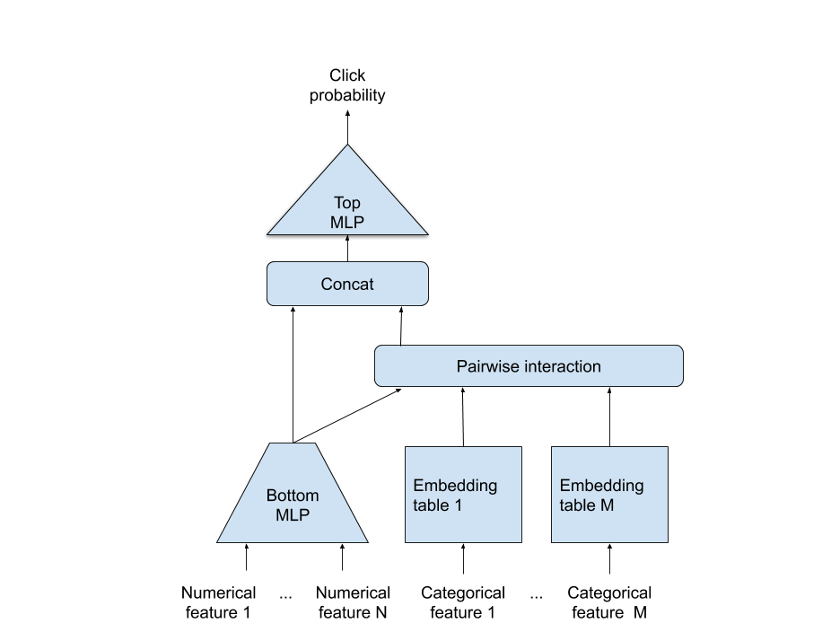

# DLRM For PyTorch

This repository provides a script and recipe to train the Deep Learning Recommendation Model (DLRM) to achieve state-of-the-art accuracy and is tested and maintained by NVIDIA.

## Table Of Contents	


  * [Table Of Contents](#table-of-contents)
  * [Model overview](#model-overview)
     * [Model architecture](#model-architecture)
     * [Default configuration](#default-configuration)
     * [Feature support matrix](#feature-support-matrix)
        * [Features](#features)
     * [Mixed precision training](#mixed-precision-training)
        * [Enabling mixed precision](#enabling-mixed-precision)
  * [Setup](#setup)
     * [Requirements](#requirements)
  * [Quick Start Guide](#quick-start-guide)
  * [Advanced](#advanced)
     * [Scripts and sample code](#scripts-and-sample-code)
     * [Parameters](#parameters)
     * [Command-line options](#command-line-options)
     * [Getting the data](#getting-the-data)
        * [Dataset guidelines](#dataset-guidelines)
        * [Multi-dataset](#multi-dataset)
        * [Preprocess with Spark](#preprocess-with-spark)
     * [Training process](#training-process)
     * [Inference process](#inference-process)
  * [Performance](#performance)
     * [Benchmarking](#benchmarking)
        * [Training performance benchmark](#training-performance-benchmark)
        * [Inference performance benchmark](#inference-performance-benchmark)
     * [Results](#results)
        * [Training accuracy results](#training-accuracy-results)
           * [Training accuracy: NVIDIA DGX-1 (8x V100 32G)](#training-accuracy-nvidia-dgx-1-8x-v100-32g)
           * [Training stability test](#training-stability-test)
        * [Training performance results](#training-performance-results)
           * [Training performance: NVIDIA DGX-1 (8x V100 32G)](#training-performance-nvidia-dgx-1-8x-v100-32g)
  * [Release notes](#release-notes)
     * [Changelog](#changelog)
     * [Known issues](#known-issues)

## Model overview

The Deep Learning Recommendation Model (DLRM) is a recommendation model designed to 
make use of both categorical and numerical inputs. It was first described in 
[Deep Learning Recommendation Model for Personalization and Recommendation Systems](https://arxiv.org/abs/1906.00091).
This repository provides a reimplementation of the codebase provided originally [here](https://github.com/facebookresearch/dlrm).
The scripts provided enable you to train DLRM on the [Criteo Terabyte Dataset](https://labs.criteo.com/2013/12/download-terabyte-click-logs/). 

This model uses a slightly different preprocessing procedure than the one found in the original implementation. You can find a detailed description of the preprocessing steps in the [Dataset guidelines](#dataset-guidelines) section.

Using DLRM you can train a high-quality general model for providing recommendations.

This model is trained with mixed precision using Tensor Cores on NVIDIA Volta and Turing GPUs. Therefore, researchers can get results 1.77x faster than training without Tensor Cores while experiencing the benefits of mixed precision training. It is tested against each NGC monthly container release to ensure consistent accuracy and performance over time.


### Model architecture

DLRM accepts two types of features: categorical and numerical. For each categorical
feature, an embedding table is used to provide dense representation to each unique value. The dense features enter the model and are transformed by a 
simple neural network referred to as "bottom MLP". This part of the network consists of a series
of linear layers with ReLU activations. The output of the bottom MLP and the embedding vectors
are then fed into the "dot interaction" operation. The output of "dot interaction" is then concatenated with the features resulting from bottom MLP and fed into the "top MLP" which is also a series of dense layers with activations.
The model outputs a single number which can be interpreted as a likelihood of a certain user clicking an ad. 


<p align="center">
  
  <br>
Figure 1. The architecture of DLRM. 
</p>

### Default configuration

The following features were implemented in this model:
- general
	- static loss scaling for Tensor Cores (mixed precision) training
- preprocessing
    - dataset preprocessing using Spark 
    
### Feature support matrix

The following features are supported by this model: 

| Feature               | DLRM                
|----------------------|--------------------------
|Automatic mixed precision (AMP)   | yes
         
#### Features

Automatic Mixed Precision (AMP) - enables mixed precision training without any changes to the code-base by performing automatic graph rewrites and loss scaling controlled by an environmental variable.


### Mixed precision training

Mixed precision is the combined use of different numerical precisions in a computational method. [Mixed precision](https://arxiv.org/abs/1710.03740) training offers significant computational speedup by performing operations in half-precision format while storing minimal information in single-precision to retain as much information as possible in critical parts of the network. Since the introduction of [Tensor Cores](https://developer.nvidia.com/tensor-cores) in the Volta and Turing architecture, significant training speedups are experienced by switching to mixed precision -- up to 3x overall speedup on the most arithmetically intense model architectures. Using mixed precision training requires two steps:
1.  Porting the model to use the FP16 data type where appropriate.    
2.  Adding loss scaling to preserve small gradient values.

The ability to train deep learning networks with lower precision was introduced in the Pascal architecture and first supported in [CUDA 8](https://devblogs.nvidia.com/parallelforall/tag/fp16/) in the NVIDIA Deep Learning SDK.

For information about:
-   How to train using mixed precision, see the [Mixed Precision Training](https://arxiv.org/abs/1710.03740) paper and [Training With Mixed Precision](https://docs.nvidia.com/deeplearning/sdk/mixed-precision-training/index.html) documentation.
-   Techniques used for mixed precision training, see the [Mixed-Precision Training of Deep Neural Networks](https://devblogs.nvidia.com/mixed-precision-training-deep-neural-networks/) blog.
-   APEX tools for mixed precision training, see the [NVIDIA Apex: Tools for Easy Mixed-Precision Training in PyTorch](https://devblogs.nvidia.com/apex-pytorch-easy-mixed-precision-training/).

#### Enabling mixed precision

Mixed precision training is enabled by default. To turn it off issue the `--nofp16` flag to the `main.py` script.


## Setup

The following section lists the requirements for training DLRM.

### Requirements

This repository contains Dockerfile which extends the PyTorch NGC container and encapsulates some dependencies. Aside from these dependencies, ensure you have the following components:
-   [NVIDIA Docker](https://github.com/NVIDIA/nvidia-docker)
-   [PyTorch 20.03-py3+] NGC container
-   [NVIDIA Volta](https://www.nvidia.com/en-us/data-center/volta-gpu-architecture/) or [Turing](https://www.nvidia.com/en-us/geforce/turing/) based GPU

For more information about how to get started with NGC containers, see the following sections from the NVIDIA GPU Cloud Documentation and the Deep Learning Documentation:
-   [Getting Started Using NVIDIA GPU Cloud](https://docs.nvidia.com/ngc/ngc-getting-started-guide/index.html)
-   [Accessing And Pulling From The NGC Container Registry](https://docs.nvidia.com/deeplearning/frameworks/user-guide/index.html#accessing_registry)
- [Running PyTorch](https://docs.nvidia.com/deeplearning/frameworks/pytorch-release-notes/running.html#running)
  
For those unable to use the PyTorch NGC container, to set up the required environment or create your own container, see the versioned [NVIDIA Container Support Matrix](https://docs.nvidia.com/deeplearning/frameworks/support-matrix/index.html).

## Quick Start Guide

To train your model using mixed precision with Tensor Cores or using FP32, perform the following steps using
the default parameters of DLRM on the Criteo Terabyte dataset. For the specifics concerning training and inference,
see the [Advanced](#advanced) section.

1. Clone the repository.
```
git clone https://github.com/NVIDIA/DeepLearningExamples
cd DeepLearningExamples/PyTorch/Recommendation/DLRM
```

2. Build a DLRM Docker container
```bash
docker build . -t nvidia_dlrm_pyt
```

3. Start an interactive session in the NGC container to run preprocessing/training and inference.
The NCF PyTorch container can be launched with:
```bash
mkdir -p data
docker run --runtime=nvidia -it --rm --ipc=host  -v ${PWD}/data:/data nvidia_dlrm_pyt bash
```

4.  Download and preprocess the dataset.
You can download the data by following the instructions at: http://labs.criteo.com/2013/12/download-terabyte-click-logs/.
When you have successfully downloaded it, put it in the `/data/dlrm/criteo/` directory in the container (`$PWD/data/dlrm/criteo` in the host system).
You can then run the preprocessing with the commands below. Note
that this will require about 4TB of disk storage.
```
cd preproc
./prepare_dataset.sh
cd -
```

5. Start training.
```
python -m dlrm.scripts.main --mode train --dataset /data/dlrm/binary_dataset/
```

6. Start validation/evaluation.
```
python -m dlrm.scripts.main --mode test --dataset /data/dlrm/binary_dataset/
```


## Advanced

The following sections provide greater details of the dataset, running training and inference, and the training results.

### Scripts and sample code

The `dlrm/scripts/main.py` script provides an entry point to most of the functionality. Using different command-line flags allows you to run training, validation and benchmark both training and inference on real or synthetic data. 

The `dlrm/model.py` file provides the definition of the DLRM neural network.

Utilities connected to loading the data reside in the `data` directory.


### Parameters

### Command-line options

The `dlrm/scripts/main.py` script supports a number of command-line flags. You can get the descriptions of those by running `python -m dlrm.scripts.main --help`. Running this command will output:

```        
       USAGE: /workspace/dlrm/dlrm/scripts/main.py [flags]
flags:

/workspace/dlrm/dlrm/scripts/main.py:
  --auc_threshold: Stop the training after achieving this AUC
    (a number)
  --base_device: Device to run the majority of the model operations
    (default: 'cuda')
  --batch_size: Batch size used for training
    (default: '32768')
    (an integer)
  --benchmark_warmup_steps: Number of initial iterations to exclude from
    throughput measurements
    (default: '0')
    (an integer)
  --bottom_mlp_sizes: Linear layer sizes for the bottom MLP
    (default: '512,256,128')
    (a comma separated list)
  --dataset: Full path to binary dataset. Must include files such as:
    train_data.bin, test_data.bin
  --dataset_subset: Use only a subset of the training data. If None (default)
    will use all of it. Must be either None, or a float in range [0,1]
    (a number)
  --decay_start_step: Optimization step after which to start decaying the
    learning rate, if None will start decaying right after the warmup phase is
    completed
    (default: '64000')
    (an integer)
  --decay_steps: Polynomial learning rate decay steps. If equal to 0 will not do
    any decaying
    (default: '80000')
    (an integer)
  --embedding_dim: Dimensionality of embedding space for categorical features
    (default: '128')
    (an integer)
  --epochs: Number of epochs to train for
    (default: '1')
    (an integer)
  --[no]fp16: If True (default) the script will use Automatic Mixed Precision
    (default: 'true')
  --[no]hash_indices: If True the model will compute `index := index % table
    size` to ensure that the indices match table sizes
    (default: 'false')
  --inference_benchmark_batch_sizes: Batch sizes for inference throughput and
    latency measurements
    (default: '1,64,4096')
    (a comma separated list)
  --inference_benchmark_steps: Number of steps for measuring inference latency
    and throughput
    (default: '200')
    (an integer)
  --interaction_op: Type of interaction operation to perform. Supported choices:
    'dot' or 'cat'
    (default: 'dot')
  --load_checkpoint_path: Path from which to load a checkpoint
  --log_path: Destination for the log file with various results and statistics
    (default: './log.json')
  --loss_scale: Static loss scale for Mixed Precision Training
    (default: '8192.0')
    (a number)
  --lr: Base learning rate
    (default: '28.0')
    (a number)
  --max_steps: Stop training after doing this many optimization steps
    (an integer)
  --max_table_size: Maximum number of rows per embedding table, by default equal
    to the number of unique values for each categorical variable
    (an integer)
  --mode: <train|test|inference_benchmark>: Select task to be performed
    (default: 'train')
  --num_numerical_features: Number of numerical features in the dataset.
    Defaults to 13 for the Criteo Terabyte Dataset
    (default: '13')
    (an integer)
  --output_dir: Path where to save the checkpoints
    (default: '/tmp')
  --print_freq: Number of optimizations steps between printing training status
    to stdout
    (default: '200')
    (an integer)
  --save_checkpoint_path: Path to which to save the training checkpoints
  --seed: Random seed
    (default: '12345')
    (an integer)
  --[no]self_interaction: Set to True to use self-interaction
    (default: 'false')
  -shuffle,--[no]shuffle_batch_order: Read batch in train dataset by random
    order
    (default: 'false')
  --[no]synthetic_dataset: Use synthetic instead of real data for benchmarking
    purposes
    (default: 'false')
  --synthetic_dataset_table_sizes: Embedding table sizes to use with the
    synthetic dataset
    (a comma separated list)
  --test_after: Don't test the model unless this many epochs has been completed
    (default: '0.0')
    (a number)
  --test_batch_size: Batch size used for testing/validation
    (default: '32768')
    (an integer)
  --test_freq: Number of optimization steps between validations. If None will
    test after each epoch
    (an integer)
  --top_mlp_sizes: Linear layer sizes for the top MLP
    (default: '1024,1024,512,256,1')
    (a comma separated list)
  --warmup_factor: Learning rate warmup factor. Must be a non-negative integer
    (default: '0')
    (an integer)
  --warmup_steps: Number of warmup optimization steps
    (default: '6400')
    (an integer)
``` 


The following example output is printed when running the model:
```
Epoch:[0/1] [200/128028]  eta: 1:28:44  loss: 0.1782  step_time: 0.041657  lr: 0.8794
Epoch:[0/1] [400/128028]  eta: 1:25:15  loss: 0.1403  step_time: 0.038504  lr: 1.7544
Epoch:[0/1] [600/128028]  eta: 1:23:56  loss: 0.1384  step_time: 0.038422  lr: 2.6294
Epoch:[0/1] [800/128028]  eta: 1:23:13  loss: 0.1370  step_time: 0.038421  lr: 3.5044
Epoch:[0/1] [1000/128028]  eta: 1:22:45  loss: 0.1362  step_time: 0.038464  lr: 4.3794
Epoch:[0/1] [1200/128028]  eta: 1:22:24  loss: 0.1346  step_time: 0.038455  lr: 5.2544
Epoch:[0/1] [1400/128028]  eta: 1:22:07  loss: 0.1339  step_time: 0.038459  lr: 6.1294
Epoch:[0/1] [1600/128028]  eta: 1:21:52  loss: 0.1320  step_time: 0.038481  lr: 7.0044
Epoch:[0/1] [1800/128028]  eta: 1:21:39  loss: 0.1315  step_time: 0.038482  lr: 7.8794
Epoch:[0/1] [2000/128028]  eta: 1:21:27  loss: 0.1304  step_time: 0.038466  lr: 8.7544
Epoch:[0/1] [2200/128028]  eta: 1:21:15  loss: 0.1305  step_time: 0.038430  lr: 9.6294
```

### Getting the data

This example uses the [Criteo Terabyte Dataset](https://labs.criteo.com/2013/12/download-terabyte-click-logs/).
The first 23 days are used as the training set. The last day is split in half. The first part is used as a validation set and the second one as a hold-out test set.


#### Dataset guidelines

The preprocessing steps applied to the raw data include:
- Replacing the missing values with `0`
- Replacing the categorical values that exist fewer than 15 times with a special value
- Converting the hash values to consecutive integers
- Adding 2 to all the numerical features so that all of them are greater or equal to 1
- Taking a natural logarithm of all numerical features

#### Multi-dataset

Our preprocessing scripts are designed for the Criteo Terabyte Dataset and should work with any other dataset with the same format. The data should be split into text files. Each line of those text files should contain a single training example. An example should consist of multiple fields separated by tabulators:
- The first field is the label – `1` for a positive example and `0` for negative.
- The next `N` tokens should contain the numerical features separated by tabs.
- The next `M` tokens should contain the hashed categorical features separated by tabs.


#### Preprocess with Spark

The script `spark_data_utils.py` is a PySpark application, which is used to preprocess the Criteo Terabyte Dataset. In the Docker image, we have installed Spark 2.4.5, which will start a standalone cluster of Spark. The script `run-spark.sh` starts the Spark, then runs several PySpark jobs with `spark_data_utils.py`. 
Generate the dictionary
Transform train dataset
Transform test dataset
Transform validation dataset

    Change the variables in the `run-spark.sh` script according to your environment.
    Configure the paths.
```
export SPARK_LOCAL_DIRS=/data/spark-tmp
export INPUT_PATH=/data/criteo
export OUTPUT_PATH=/data/output
```
Note that the Spark job requires about 3TB disk space used for data shuffle.

`SPARK_LOCAL_DIRS` is the path where Spark uses to write shuffle data.

`INPUT_PATH` is the path of the Criteo Terabyte Dataset, including uncompressed files like day_0, day_1…

`OUTPUT_PATH` is where the script writes the output data. It will generate below subdirectories of `models`, `train`, `test`, and `validation`. 
The `model` is the dictionary folder. 
The `train` is the train dataset transformed from day_0 to day_22. 
The `test` is the test dataset transformed from the prior half of day_23. 
The `validation` is the dataset transformed from the latter half of day_23.

Configure the resources which Spark will use.
```
export TOTAL_CORES=80
export TOTAL_MEMORY=800
```
`TOTAL_CORES` is the total CPU cores you want Spark to use.

`TOTAL_MEMORY` is the total memory Spark will use.

Configure frequency limit.
```
USE_FREQUENCY_LIMIT=15
```
The frequency limit is used to filter out the categorical values which appear less than n times in the whole dataset, and make them be 0. Change this variable to 1 to enable it. The default frequency limit is 15 in the script. You also can change the number as you want by changing  the line of `OPTS="--frequency_limit 8"`.

After the above configuration, you can run `run-spark.sh` if you already downloaded the dataset or run through `prepare_dataset.sh`, which includes verifying the downloaded dataset and running the job to preprocess the dataset.

### Training process

The main training script resides in `dlrm/scripts/main.py`. Once the training is completed, it stores the checkpoint
in the path specified by `--save_checkpoint_path` and a training log in `--log_path`. The quality of the predictions 
generated by the model is measured by the [ROC AUC metric](https://scikit-learn.org/stable/modules/model_evaluation.html#roc-metrics).
The speed of training and inference is measured by throughput i.e., the number 
of samples processed per second. We use mixed precision training with static loss scaling for the bottom and top MLPs while embedding tables are stored in FP32 format.


### Inference process

This section describes inference with PyTorch in Python. If you're interested in inference using the Triton Inference Server, refer to `triton/README.md` file.

Two modes for inference are currently supported by the `dlrm/scripts/main.py` script:

1. Inference benchmark – this mode will measure and print out throughput and latency numbers for multiple batch sizes. You can activate it by setting the batch sizes to be tested with the `inference_benchmark_batch_sizes` command-line argument. It will use the default test dataset unless the `--synthetic_dataset` flag is passed.
2. Test-only – this mode can be used to run a full validation on a checkpoint to measure ROC AUC . You can enable it by passing the `--mode test` flag.

## Performance

### Benchmarking

The following section shows how to run benchmarks measuring the model performance in training and inference modes.

#### Training performance benchmark

To benchmark the training performance on a specific batch size, run:

```
python -m dlrm.scripts.main --mode train --max_steps 500 --benchmark_warmup_steps 250 --dataset /data
```

You can also pass the `--synthetic_dataset` flag if you haven't yet downloaded the dataset.

#### Inference performance benchmark

To benchmark the inference performance on a specific batch size, run:

```
python -m dlrm.scripts.main --mode inference_benchmark --dataset /data
```

You can also pass the `--synthetic_dataset` flag if you haven't yet downloaded the dataset.

### Results 

The following sections provide details on how we achieved our performance and accuracy in training and inference.

#### Training accuracy results


##### Training accuracy: NVIDIA DGX-1 (8x V100 32G)

Our results were obtained by running the `dlrm/scripts/main.py` script for one epoch as described in the Quick Start Guide training script in the DLRM Docker container on a single Tesla V100 32G GPU.

| GPUs    | Batch size / GPU    | Accuracy (AUC) - FP32  | Accuracy (AUC) - mixed precision  |   Time to train - FP32  [hours] |  Time to train - mixed precision  [hours] | Time to train speedup (FP32 to mixed precision)        
|----|----|----|----|---|---|---|
| 1 | 32k | 0.80362 | 0.80362 | 2.46 | 1.44 | 1.71 |


##### Training stability test

The table below shows the complete convergence data for 16 different random seeds. 

|   Random seed |  Mixed precision AUC | Single precision AUC |
|-------:|---------:|---------:|
|      8 | 0.803696 | 0.803669 |
|      9 | 0.803617 | 0.803574 |
|     10 | 0.803672 | 0.80367  |
|     11 | 0.803699 | 0.803683 |
|     12 | 0.803659 | 0.803724 |
|     13 | 0.803578 | 0.803565 |
|     14 | 0.803609 | 0.803613 |
|     15 | 0.803585 | 0.803615 |
|     16 | 0.803553 | 0.803583 |
|     17 | 0.803644 | 0.803688 |
|     18 | 0.803656 | 0.803609 |
|     19 | 0.803589 | 0.803635 |
|     20 | 0.803567 | 0.803611 |
|     21 | 0.803548 | 0.803487 |
|     22 | 0.803532 | 0.803591 |
|     23 | 0.803625 | 0.803601 |
| **mean** | **0.803614** | **0.803620** |


#### Training performance results


##### Training performance: NVIDIA DGX-1 (8x V100 32G)

Our results were obtained by running:
```
python -m dlrm.scripts.main --mode train --max_steps 200 --benchmark_warmup_steps 50 --fp16 --dataset /data
```
 in the DLRM Docker container on NVIDIA DGX-1 with (8x V100 32G) GPUs. Performance numbers (in items/images per second) were averaged over 150 training steps.

| GPUs   | Batch size / GPU   | Throughput - FP32    | Throughput - mixed precision    | Throughput speedup (FP32 - mixed precision)   |
|----|---|---|---|---|
| 1 | 32k |  494k | 875k | 1.773 |


We used throughput in items processed per second as the performance metric.


## Release notes

### Changelog

April 2020
- Initial release


### Known issues

There are no known issues with this model

