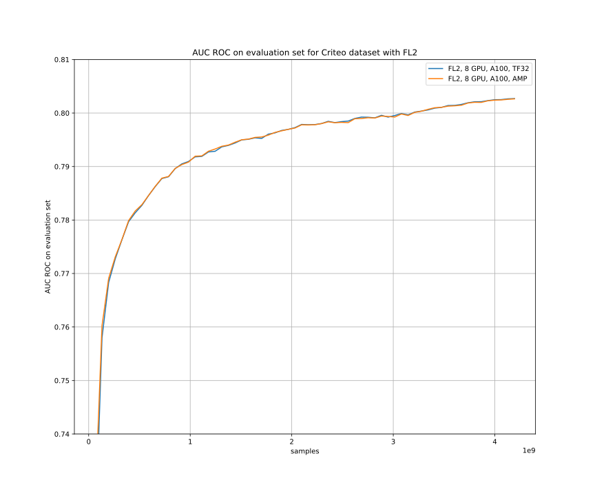
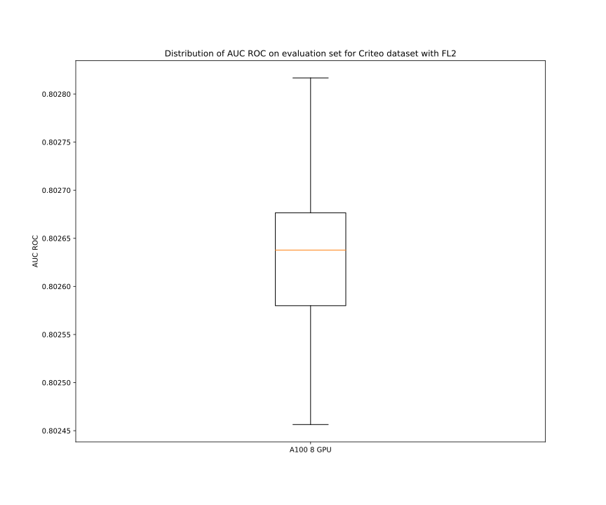
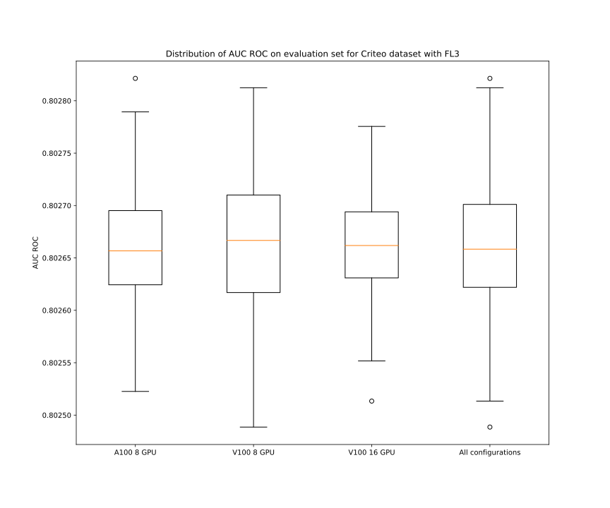
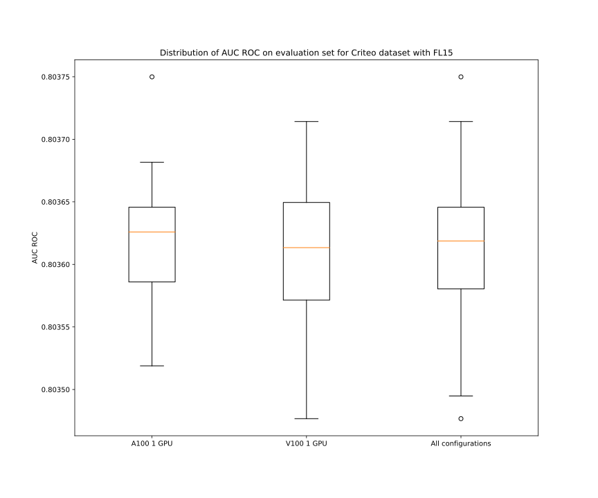
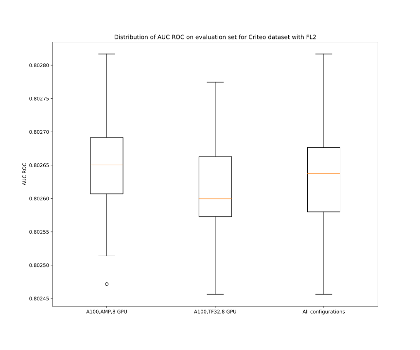
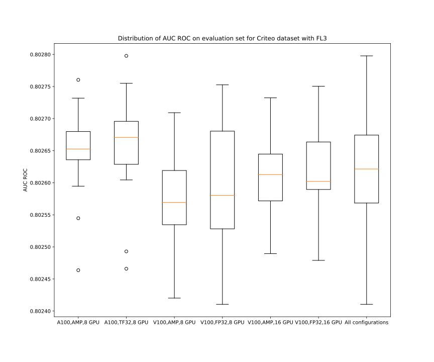
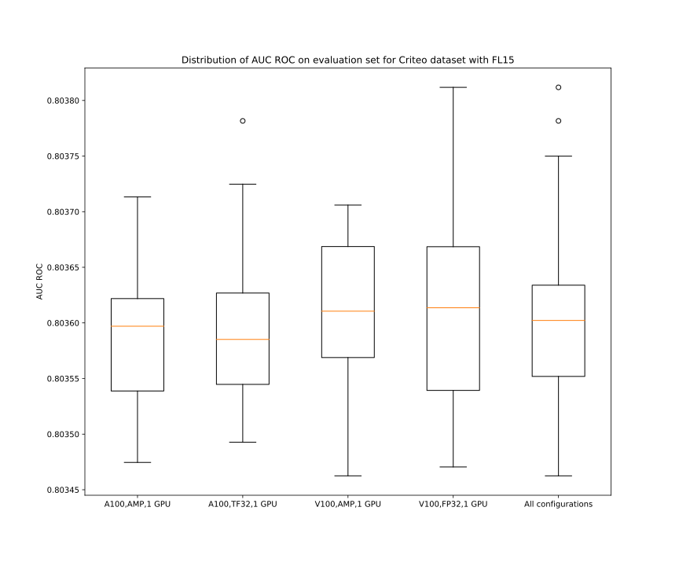

# DLRM For PyTorch

This repository provides a script and recipe to train the Deep Learning Recommendation Model (DLRM) to achieve state-of-the-art accuracy and is tested and maintained by NVIDIA.

## Table Of Contents	

  * [Model overview](#model-overview)
    + [Model architecture](#model-architecture)
    + [Default configuration](#default-configuration)
    + [Feature support matrix](#feature-support-matrix)
      - [Features](#features)
    + [Mixed precision training](#mixed-precision-training)
      - [Enabling mixed precision](#enabling-mixed-precision)
      - [Enabling TF32](#enabling-tf32)
    + [Hybrid-parallel multi-GPU with all-2-all communication](#hybrid-parallel-multi-gpu-with-all-2-all-communication)
      - [Embedding table placement and load balancing](#embedding-table-placement-and-load-balancing)
    + [Preprocessing on GPU](#preprocessing-on-gpu)
  * [Setup](#setup)
    + [Requirements](#requirements)
  * [Quick Start Guide](#quick-start-guide)
  * [Advanced](#advanced)
    + [Scripts and sample code](#scripts-and-sample-code)
    + [Parameters](#parameters)
    + [Command-line options](#command-line-options)
    + [Getting the data](#getting-the-data)
      - [Dataset guidelines](#dataset-guidelines)
      - [Multi-dataset](#multi-dataset)
      - [Preprocessing](#preprocessing)
        * [NVTabular](#nvtabular)
        * [Spark](#spark)
    + [Training process](#training-process)
    + [Inference process](#inference-process)
    + [Deploying DLRM Using NVIDIA Triton Inference Server](#deploying-dlrm-using-nvidia-triton-inference-server)
  * [Performance](#performance)
    + [Benchmarking](#benchmarking)
      - [Training performance benchmark](#training-performance-benchmark)
      - [Inference performance benchmark](#inference-performance-benchmark)
    + [Results](#results)
      - [Training accuracy results](#training-accuracy-results)
        * [Training accuracy: NVIDIA DGX A100 (8x A100 80GB)](#training-accuracy-nvidia-dgx-a100-8x-a100-80gb)
        * [Training accuracy: NVIDIA DGX-1 (8x V100 32GB)](#training-accuracy-nvidia-dgx-1-8x-v100-32gb)
        * [Training accuracy plots](#training-accuracy-plots)
        * [Training stability test](#training-stability-test)
        * [Impact of mixed precision on training accuracy](#impact-of-mixed-precision-on-training-accuracy)
      - [Training performance results](#training-performance-results)
        * [Training performance: NVIDIA DGX A100 (8x A100 80GB)](#training-performance-nvidia-dgx-a100-8x-a100-80gb)
        * [Training performance: NVIDIA DGX A100 (8x A100 40GB)](#training-performance-nvidia-dgx-a100-8x-a100-40gb)
        * [Training performance: NVIDIA DGX-1 (8x V100 32GB)](#training-performance-nvidia-dgx-1-8x-v100-32gb)
        * [Training performance: NVIDIA DGX-2 (16x V100 32GB)](#training-performance-nvidia-dgx-2-16x-v100-32gb)
  * [Release notes](#release-notes)
    + [Changelog](#changelog)
    + [Known issues](#known-issues)

## Model overview

The Deep Learning Recommendation Model (DLRM) is a recommendation model designed to 
make use of both categorical and numerical inputs. It was first described in 
[Deep Learning Recommendation Model for Personalization and Recommendation Systems](https://arxiv.org/abs/1906.00091).
This repository provides a reimplementation of the codebase provided originally [here](https://github.com/facebookresearch/dlrm).
The scripts provided enable you to train DLRM on the [Criteo Terabyte Dataset](https://labs.criteo.com/2013/12/download-terabyte-click-logs/). 

Using the scripts provided here, you can efficiently train models that are too large to fit into a single GPU. This is because we use a hybrid-parallel approach, which combines model parallelism for the embedding tables with data parallelism for the Top MLP. This is explained in details in [next sections](#hybrid-parallel-multigpu-with-all-2-all-communication).

This model uses a slightly different preprocessing procedure than the one found in the original implementation. You can find a detailed description of the preprocessing steps in the [Dataset guidelines](#dataset-guidelines) section.

Using DLRM you can train a high-quality general model for providing recommendations.

This model is trained with mixed precision using Tensor Cores on Volta, Turing, and NVIDIA Ampere GPU architectures. Therefore, researchers can get results up to 3.3x faster than training without Tensor Cores while experiencing the benefits of mixed precision training. It is tested against each NGC monthly container release to ensure consistent accuracy and performance over time.


### Model architecture

DLRM accepts two types of features: categorical and numerical. For each categorical
feature, an embedding table is used to provide dense representation to each unique value. The dense features enter the model and are transformed by a 
simple neural network referred to as "bottom MLP". This part of the network consists of a series
of linear layers with ReLU activations. The output of the bottom MLP and the embedding vectors
are then fed into the "dot interaction" operation. The output of "dot interaction" is then concatenated with the features resulting from the bottom MLP and fed into the "top MLP" which is also a series of dense layers with activations.
The model outputs a single number which can be interpreted as a likelihood of a certain user clicking an ad. 


<p align="center">
  
  <br>
Figure 1. The architecture of DLRM. 
</p>

### Default configuration

The following features were implemented in this model:
- general
	- static loss scaling for Tensor Cores (mixed precision) training
	- hybrid-parallel multi-GPU training
- preprocessing
    - dataset preprocessing using Spark 3 on GPUs 
    - dataset preprocessing using NVTabular on GPUs 
    
### Feature support matrix

The following features are supported by this model: 

| Feature                                 | DLRM                
|-----------------------------------------|-----
|Automatic mixed precision (AMP)          | yes
|Hybrid-parallel multi-GPU with all-2-all | yes
|Preprocessing on GPU with NVTabular      | yes
|Preprocessing on GPU with Spark 3        | yes

         
#### Features

Automatic Mixed Precision (AMP) - enables mixed precision training without any changes to the code-base by performing automatic graph rewrites and loss scaling controlled by an environmental variable.

Multi-GPU training with PyTorch distributed - our model uses `torch.distributed` to implement efficient multi-GPU training with NCCL. For details, see example sources in this repository or see the [PyTorch Tutorial](https://pytorch.org/tutorials/intermediate/dist_tuto.html).

Preprocessing on GPU with NVTabular - Criteo dataset preprocessing can be conducted using [NVTabular](https://github.com/NVIDIA/NVTabular). For more information on the framework, see the [Announcing the NVIDIA NVTabular Open Beta with Multi-GPU Support and New Data Loaders](https://developer.nvidia.com/blog/announcing-the-nvtabular-open-beta-with-multi-gpu-support-and-new-data-loaders/).

Preprocessing on GPU with Spark 3 - Criteo dataset preprocessing can be conducted using [Apache Spark 3.0](https://spark.apache.org/). For more information on the framework and how to leverage GPU to preprocessing, see the [Accelerating Apache Spark 3.0 with GPUs and RAPIDS](https://developer.nvidia.com/blog/accelerating-apache-spark-3-0-with-gpus-and-rapids/).


### Mixed precision training

Mixed precision is the combined use of different numerical precisions in a computational method. [Mixed precision](https://arxiv.org/abs/1710.03740) training offers significant computational speedup by performing operations in the half-precision floating-point format while storing minimal information in single-precision to retain as much information as possible in critical parts of the network. Since the introduction of [Tensor Cores](https://developer.nvidia.com/tensor-cores) in Volta, and following with both the Turing and Ampere architectures, significant training speedups are experienced by switching to mixed precision &ndash; up to 3.3x overall speedup on the most arithmetically intense model architectures. Using mixed precision training requires two steps:
1.  Porting the model to use the FP16 data type where appropriate.    
2.  Adding loss scaling to preserve small gradient values.

The ability to train deep learning networks with lower precision was introduced in the Pascal architecture and first supported in [CUDA 8](https://devblogs.nvidia.com/parallelforall/tag/fp16/) in the NVIDIA Deep Learning SDK.

For information about:
-   How to train using mixed precision, see the [Mixed Precision Training](https://arxiv.org/abs/1710.03740) paper and [Training With Mixed Precision](https://docs.nvidia.com/deeplearning/sdk/mixed-precision-training/index.html) documentation.
-   Techniques used for mixed precision training, see the [Mixed-Precision Training of Deep Neural Networks](https://devblogs.nvidia.com/mixed-precision-training-deep-neural-networks/) blog.
-   APEX tools for mixed precision training, see the [NVIDIA Apex: Tools for Easy Mixed-Precision Training in PyTorch](https://devblogs.nvidia.com/apex-pytorch-easy-mixed-precision-training/).

#### Enabling mixed precision

Mixed precision training is turned off by default. To turn it on issue the `--amp` flag to the `main.py` script.


#### Enabling TF32

TensorFloat-32 (TF32) is the new math mode in [NVIDIA A100](https://www.nvidia.com/en-us/data-center/a100/) GPUs for handling the matrix math also called tensor operations. TF32 running on Tensor Cores in A100 GPUs can provide up to 10x speedups compared to single-precision floating-point math (FP32) on Volta GPUs. 

TF32 Tensor Cores can speed up networks using FP32, typically with no loss of accuracy. It is more robust than FP16 for models that require a high dynamic range for weights or activations.

For more information, refer to the [TensorFloat-32 in the A100 GPU Accelerates AI Training, HPC up to 20x](https://blogs.nvidia.com/blog/2020/05/14/tensorfloat-32-precision-format/) blog post.

TF32 is supported in the NVIDIA Ampere GPU architecture and is enabled by default.

### Hybrid-parallel multi-GPU with all-2-all communication

Many recommendation models contain very large embedding tables. As a result, the model is often too large to fit onto a single device. This could be easily solved by training in a model-parallel way, using either the CPU or other GPUs as "memory donors". However, this approach is suboptimal as the "memory donor" devices' compute is not utilized. In this repository, we use the model-parallel approach for the bottom part of the model (Embedding Tables + Bottom MLP) while using a usual data parallel approach for the top part of the model (Dot Interaction + Top MLP). This way we can train models much larger than what would normally fit into a single GPU while at the same time making the training faster by using multiple GPUs. We call this approach hybrid-parallel.

The transition from model-parallel to data-parallel in the middle of the neural net needs a specific multi-GPU communication pattern called [all-2-all](https://en.wikipedia.org/wiki/All-to-all_\(parallel_pattern\)) which is available in our [PyTorch 21.04-py3](https://ngc.nvidia.com/catalog/containers/nvidia:pytorch/tags) NGC docker container. In the [original DLRM whitepaper](https://arxiv.org/abs/1906.00091) this has been also referred to as "butterfly shuffle". 

<p align="center">
  
  <br>
</p>


In the example shown in this repository we train models of three sizes: "small" (~15 GB), "large" (~82 GB), and "xlarge" (~142 GB). We use the hybrid-parallel approach for the "large" and "xlarge" models, as they do not fit in a single GPU.

#### Embedding table placement and load balancing

We use the following heuristic for dividing the work between the GPUs:
- The Bottom MLP is placed on GPU-0 and no embedding tables are placed on this device.
- The tables are sorted from the largest to the smallest
- Set `max_tables_per_gpu := ceil(number_of_embedding_tables / number_of_available_gpus)`
- Repeat until all embedding tables have an assigned device:
    - Out of all the available GPUs find the one with the largest amount of unallocated memory
    - Place the largest unassigned embedding table on this GPU. Raise an exception if it does not fit.
    - If the number of embedding tables on this GPU is now equal to `max_tables_per_gpu` remove this GPU from the list of available GPUs so that no more embedding tables will be placed on this GPU. This ensures the all2all communication is well balanced between all devices.

### Preprocessing on GPU

Please refer to [the "Preprocessing" section](#preprocessing) for a detailed description of the Apache Spark 3.0 and NVTabular GPU functionality 

## Setup

The following section lists the requirements for training DLRM.

### Requirements

This repository contains Dockerfile which extends the PyTorch NGC container and encapsulates some dependencies. Aside from these dependencies, ensure you have the following components:
- [NVIDIA Docker](https://github.com/NVIDIA/nvidia-docker)
- [PyTorch 21.04-py3](https://ngc.nvidia.com/catalog/containers/nvidia:pytorch/tags) NGC container
- Supported GPUs:
    - [NVIDIA Volta architecture](https://www.nvidia.com/en-us/data-center/volta-gpu-architecture/)
    - [NVIDIA Turing architecture](https://www.nvidia.com/en-us/design-visualization/technologies/turing-architecture/)
    - [NVIDIA Ampere architecture](https://www.nvidia.com/en-us/data-center/nvidia-ampere-gpu-architecture/)


For more information about how to get started with NGC containers, see the following sections from the NVIDIA GPU Cloud Documentation and the Deep Learning Documentation:
- [Getting Started Using NVIDIA GPU Cloud](https://docs.nvidia.com/ngc/ngc-getting-started-guide/index.html)
- [Accessing And Pulling From The NGC Container Registry](https://docs.nvidia.com/deeplearning/frameworks/user-guide/index.html#accessing_registry)
- [Running PyTorch](https://docs.nvidia.com/deeplearning/frameworks/pytorch-release-notes/running.html#running)
  
For those unable to use the PyTorch NGC container, to set up the required environment or create your own container, see the versioned [NVIDIA Container Support Matrix](https://docs.nvidia.com/deeplearning/frameworks/support-matrix/index.html).

## Quick Start Guide

To train your model using mixed or TF32 precision with Tensor Cores or using FP32, perform the following steps using
the default parameters of DLRM on the Criteo Terabyte dataset. For the specifics concerning training and inference,
see the [Advanced](#advanced) section.

1. Clone the repository.
```
git clone https://github.com/NVIDIA/DeepLearningExamples
cd DeepLearningExamples/PyTorch/Recommendation/DLRM
```

2. Download the dataset.

You can download the data by following the instructions at: http://labs.criteo.com/2013/12/download-terabyte-click-logs/.
When you have successfully downloaded it and unpacked it, set the `CRITEO_DATASET_PARENT_DIRECTORY` to its parent directory:
```
CRITEO_DATASET_PARENT_DIRECTORY=/raid/dlrm
``` 
We recommend to choose the fastest possible file system, otherwise it may lead to an IO bottleneck.

3. Build DLRM Docker containers
```bash
docker build -t nvidia_dlrm_pyt .
docker build -t nvidia_dlrm_preprocessing -f Dockerfile_preprocessing . --build-arg DGX_VERSION=[DGX-2|DGX-A100]
```

3. Start an interactive session in the NGC container to run preprocessing.
The DLRM PyTorch container can be launched with:
```bash
docker run --runtime=nvidia -it --rm --ipc=host  -v ${CRITEO_DATASET_PARENT_DIRECTORY}:/data/dlrm nvidia_dlrm_preprocessing bash
```

4.  Preprocess the dataset.

Here are a few examples of different preprocessing commands. For the details on how those scripts work and detailed description of dataset types (small FL=15, large FL=3, xlarge FL=2), training possibilities and all the parameters consult the [preprocessing section](#preprocessing). 

Depending on datastet type (small FL=15, large FL=3, xlarge FL=2) run one of following command:

4.1. Preprocess to small dataset (FL=15) with Spark GPU:
```bash
cd /workspace/dlrm/preproc
./prepare_dataset.sh 15 GPU Spark
```

4.2. Preprocess to large dataset (FL=3) with Spark GPU:
```bash
cd /workspace/dlrm/preproc
./prepare_dataset.sh 3 GPU Spark
```

4.3. Preprocess to xlarge dataset (FL=2) with Spark GPU:
```bash
cd /workspace/dlrm/preproc
./prepare_dataset.sh 2 GPU Spark
```


5. Start training.

- First start the docker container (adding `--security-opt seccomp=unconfined` option is needed to take the full advantage of processor affinity in multi-GPU training):
```bash
docker run --security-opt seccomp=unconfined --runtime=nvidia -it --rm --ipc=host  -v ${PWD}/data:/data nvidia_dlrm_pyt bash
```

- single-GPU:
```bash
python -m dlrm.scripts.main --mode train --dataset /data/dlrm/binary_dataset/
```

- multi-GPU for DGX A100:
```bash
python -m torch.distributed.launch --no_python --use_env --nproc_per_node 8 \
          bash  -c './bind.sh --cpu=dgxa100_ccx.sh --mem=dgxa100_ccx.sh python -m dlrm.scripts.dist_main \
          --dataset /data/dlrm/binary_dataset/ --seed 0 --epochs 1 --amp'
```

- multi-GPU for DGX-1 and DGX-2:
```bash
python -m torch.distributed.launch --no_python --use_env --nproc_per_node 8 \
          bash  -c './bind.sh  --cpu=exclusive -- python -m dlrm.scripts.dist_main \
          --dataset /data/dlrm/binary_dataset/ --seed 0 --epochs 1 --amp'
```

6. Start validation/evaluation. If you want to run validation or evaluation, you can either:
 - use the checkpoint obtained from the training commands above, or
 - download the pretrained checkpoint from NGC.

In order to download the checkpoint from NGC, visit ngc.nvidia.com website and browse the available models. Download the checkpoint files and unzip them to some path, for example, to `$CRITEO_DATASET_PARENT_DIRECTORY/checkpoints/`. The checkpoint requires around 15GB of disk space.

Commands:
- single-GPU:
```bash
python -m dlrm.scripts.main --mode test --dataset /data/dlrm/binary_dataset/ --load_checkpoint_path `$CRITEO_DATASET_PARENT_DIRECTORY/checkpoints/checkpoint`
```

- multi-GPU for DGX A100:
```bash
python -m torch.distributed.launch --no_python --use_env --nproc_per_node 8 \
          bash  -c './bind.sh --cpu=dgxa100_ccx.sh --mem=dgxa100_ccx.sh python -m dlrm.scripts.dist_main \
          --dataset /data/dlrm/binary_dataset/ --seed 0 --epochs 1 --amp --load_checkpoint_path `$CRITEO_DATASET_PARENT_DIRECTORY/checkpoints/checkpoint`'
```

- multi-GPU for DGX-1 and DGX-2:
```bash
python -m torch.distributed.launch --no_python --use_env --nproc_per_node 8 \
          bash  -c './bind.sh  --cpu=exclusive -- python -m dlrm.scripts.dist_main \
          --dataset /data/dlrm/binary_dataset/ --seed 0 --epochs 1 --amp --load_checkpoint_path `$CRITEO_DATASET_PARENT_DIRECTORY/checkpoints/checkpoint`'
```

## Advanced

The following sections provide greater details of the dataset, running training and inference, and the training results.

### Scripts and sample code

The `dlrm/scripts/main.py` script provides an entry point to most of the functionality in a single-GPU setting. Using different command-line flags allows you to run training, validation, and benchmark both training and inference on real or synthetic data.

Analogously, the `dlrm/scripts/dist_main.py` script provides an entry point for the functionality in a multi-GPU setting. It uses the same flags as in the single-GPU case with the defaults tuned to large model training.

The `dlrm/model/single.py` file provides the definition of the DLRM neural network for single-GPU, whereas `dlrm/model/distributed.py` contains DLRM definition for multi-GPU case.

Utilities connected to loading the data reside in the `data` directory.

### Parameters

### Command-line options

The `dlrm/scripts/main.py` script supports a number of command-line flags. You can get the descriptions of those by running `python -m dlrm.scripts.main --help`. Running this command will output:

```        
USAGE: /workspace/dlrm/scripts/main.py [flags]
flags:

/workspace/dlrm/dlrm/scripts/main.py:
  --[no]amp: If True the script will use Automatic Mixed Precision
    (default: 'false')
  --auc_threshold: Stop the training after achieving this AUC
    (a number)
  --base_device: Device to run the majority of the model operations
    (default: 'cuda')
  --batch_size: Batch size used for training
    (default: '32768')
    (an integer)
  --benchmark_warmup_steps: Number of initial iterations to exclude from throughput measurements
    (default: '0')
    (an integer)
  --bottom_mlp_sizes: Linear layer sizes for the bottom MLP
    (default: '512,256,128')
    (a comma separated list)
  --dataset: Path to dataset
  --dataset_type: <binary|split|synthetic_gpu>: The type of the dataset to use
    (default: 'split')
  --decay_end_lr: LR after the decay ends
    (default: '0.0')
    (a number)
  --decay_power: Polynomial learning rate decay power
    (default: '2')
    (an integer)
  --decay_start_step: Optimization step after which to start decaying the learning rate, if None will start decaying right after the warmup phase is completed
    (default: '64000')
    (an integer)
  --decay_steps: Polynomial learning rate decay steps. If equal to 0 will not do any decaying
    (default: '80000')
    (an integer)
  --embedding_dim: Dimensionality of embedding space for categorical features
    (default: '128')
    (an integer)
  --embedding_type: <joint|joint_fused|joint_sparse|multi_table>: The type of the embedding operation to use
    (default: 'joint_fused')
  --epochs: Number of epochs to train for
    (default: '1')
    (an integer)
  --[no]hash_indices: If True the model will compute `index := index % table size` to ensure that the indices match table sizes
    (default: 'false')
  --inference_benchmark_batch_sizes: Batch sizes for inference throughput and latency measurements
    (default: '1,64,4096')
    (a comma separated list)
  --inference_benchmark_steps: Number of steps for measuring inference latency and throughput
    (default: '200')
    (an integer)
  --interaction_op: <cuda_dot|dot|cat>: Type of interaction operation to perform.
    (default: 'cuda_dot')
  --load_checkpoint_path: Path from which to load a checkpoint
  --log_path: Destination for the log file with various results and statistics
    (default: './log.json')
  --loss_scale: Static loss scale for Mixed Precision Training
    (default: '1024.0')
    (a number)
  --lr: Base learning rate
    (default: '28.0')
    (a number)
  --max_steps: Stop training after doing this many optimization steps
    (an integer)
  --max_table_size: Maximum number of rows per embedding table, by default equal to the number of unique values for each categorical variable
    (an integer)
  --mode: <train|test|inference_benchmark|prof-train>: Select task to be performed
    (default: 'train')
  --num_numerical_features: Number of numerical features in the dataset. Defaults to 13 for the Criteo Terabyte Dataset
    (default: '13')
    (an integer)
  --[no]optimized_mlp: Use an optimized implementation of MLP from apex
    (default: 'true')
  --output_dir: Path where to save the checkpoints
    (default: '/tmp')
  --print_freq: Number of optimizations steps between printing training status to stdout
    (default: '200')
    (an integer)
  --save_checkpoint_path: Path to which to save the training checkpoints
  --seed: Random seed
    (default: '12345')
    (an integer)
  -shuffle,--[no]shuffle_batch_order: Read batch in train dataset by random order
    (default: 'false')
  --synthetic_dataset_num_entries: Number of samples per epoch for the synthetic dataset
    (default: '33554432')
    (an integer)
  --synthetic_dataset_table_sizes: Embedding table sizes to use with the synthetic dataset
    (default: '100000,100000,100000,100000,100000,100000,100000,100000,100000,100000,100000,100000,100000,100000,100000,100000,100000,100000,100000,100000,100000,100000,10
    0000,100000,100000,100000')
    (a comma separated list)
  --test_after: Don't test the model unless this many epochs has been completed
    (default: '0.0')
    (a number)
  --test_batch_size: Batch size used for testing/validation
    (default: '32768')
    (an integer)
  --test_freq: Number of optimization steps between validations. If None will test after each epoch
    (an integer)
  --top_mlp_sizes: Linear layer sizes for the top MLP
    (default: '1024,1024,512,256,1')
    (a comma separated list)
  --warmup_factor: Learning rate warmup factor. Must be a non-negative integer
    (default: '0')
    (an integer)
  --warmup_steps: Number of warmup optimization steps
    (default: '6400')
    (an integer)
``` 
The multi-GPU training script, `dlrm/scripts/dist_main.py` has also a few, specific for itself, option, that you can get by running `python -m dlrm.scripts.dist_main --help`:
```
USAGE: /workspace/dlrm/dlrm/scripts/dist_main.py [flags]
flags:

/workspace/dlrm/dlrm/scripts/dist_main.py:
  --[no]Adam_MLP_optimizer: Swaps MLP optimizer to Adam
    (default: 'false')
  --[no]Adam_embedding_optimizer: Swaps embedding optimizer to Adam
    (default: 'false')
  --backend: Backend to use for distributed training. Default nccl
    (default: 'nccl')
  --[no]bottom_features_ordered: Sort features from the bottom model, useful when using saved checkpoint in different
    device configurations
    (default: 'false')
```


The following example output is printed when running the model:
```
Epoch:[0/1] [200/128028]  eta: 1:28:44  loss: 0.1782  step_time: 0.041657  lr: 0.8794
Epoch:[0/1] [400/128028]  eta: 1:25:15  loss: 0.1403  step_time: 0.038504  lr: 1.7544
Epoch:[0/1] [600/128028]  eta: 1:23:56  loss: 0.1384  step_time: 0.038422  lr: 2.6294
Epoch:[0/1] [800/128028]  eta: 1:23:13  loss: 0.1370  step_time: 0.038421  lr: 3.5044
Epoch:[0/1] [1000/128028]  eta: 1:22:45  loss: 0.1362  step_time: 0.038464  lr: 4.3794
Epoch:[0/1] [1200/128028]  eta: 1:22:24  loss: 0.1346  step_time: 0.038455  lr: 5.2544
Epoch:[0/1] [1400/128028]  eta: 1:22:07  loss: 0.1339  step_time: 0.038459  lr: 6.1294
Epoch:[0/1] [1600/128028]  eta: 1:21:52  loss: 0.1320  step_time: 0.038481  lr: 7.0044
Epoch:[0/1] [1800/128028]  eta: 1:21:39  loss: 0.1315  step_time: 0.038482  lr: 7.8794
Epoch:[0/1] [2000/128028]  eta: 1:21:27  loss: 0.1304  step_time: 0.038466  lr: 8.7544
Epoch:[0/1] [2200/128028]  eta: 1:21:15  loss: 0.1305  step_time: 0.038430  lr: 9.6294
```

### Getting the data

This example uses the [Criteo Terabyte Dataset](https://labs.criteo.com/2013/12/download-terabyte-click-logs/).
The first 23 days are used as the training set. The last day is split in half. The first part is used as a validation set and the second one as a hold-out test set.


#### Dataset guidelines

The preprocessing steps applied to the raw data include:
- Replacing the missing values with `0`
- Replacing the categorical values that exist fewer than `T` times with a special value (T value is called a frequency threshold or a frequency limit)
- Converting the hash values to consecutive integers
- Adding 3 to all the numerical features so that all of them are greater or equal to 1
- Taking a natural logarithm of all numerical features

#### Multi-dataset

Our preprocessing scripts are designed for the Criteo Terabyte Dataset and should work with any other dataset with the same format. The data should be split into text files. Each line of those text files should contain a single training example. An example should consist of multiple fields separated by tabulators:
- The first field is the label – `1` for a positive example and `0` for negative.
- The next `N` tokens should contain the numerical features separated by tabs.
- The next `M` tokens should contain the hashed categorical features separated by tabs.


#### Preprocessing 

The preprocessing scripts provided in this repository support running both on CPU and GPU using [NVtabular](https://developer.nvidia.com/blog/announcing-the-nvtabular-open-beta-with-multi-gpu-support-and-new-data-loaders/) (GPU only) and [Apache Spark 3.0](https://www.nvidia.com/en-us/deep-learning-ai/solutions/data-science/apache-spark-3/).

Please note that the preprocessing will require about 4TB of disk storage. 


The syntax for the preprocessing script is as follows:
```bash
cd /workspace/dlrm/preproc
./prepare_dataset.sh <frequency_threshold> <GPU|CPU> <NVTabular|Spark>
```

For the Criteo Terabyte dataset, we recommend a frequency threshold of `T=3`(when using A100 40GB or V100 32 GB) or `T=2`(when using A100 80GB) if you intend to run the hybrid-parallel mode
on multiple GPUs. If you want to make the model fit into a single NVIDIA Tesla V100-32GB, you can set `T=15`. 

The first argument means the frequency threshold to apply to the categorical variables. For a frequency threshold `T`, the categorical values that occur less 
often than `T` will be replaced with one special value for each category. Thus, a larger value of `T` will require smaller embedding tables 
and will substantially reduce the overall size of the model.

The second argument is the hardware to use (either GPU or CPU).  

The third arguments is a framework to use (either NVTabular or Spark). In case of choosing a CPU preprocessing this argument is omitted as it only Apache Spark is supported on CPU.

The preprocessing scripts make use of the following environment variables to configure the data directory paths:
- `download_dir` – this directory should contain the original Criteo Terabyte CSV files
- `spark_output_path` – directory to which the parquet data will be written
- `conversion_intermediate_dir` – directory used for storing intermediate data used to convert from parquet to train-ready format
- `final_output_dir` – directory to store the final results of the preprocessing which can then be used to train DLRM 

In the `final_output_dir` will be three subdirectories created: `train`, `test`, `validation`, and one json file &ndash; `model_size.json` &ndash; containing a maximal index of each category. 
The `train` is the train dataset transformed from day_0 to day_22. 
The `test` is the test dataset transformed from the prior half of day_23. 
The `validation` is the dataset transformed from the latter half of day_23.

The model is tested on 3 datasets resulting from Criteo dataset preprocessing: small (Freqency threshold = 15), large (Freqency threshold = 3) and xlarge (Freqency threshold = 2). Each dataset occupies approx 370GB of disk space. Table below presents information on the supercomputer and GPU count that are needed to train model on particular dataset.

| Dataset | GPU VRAM consumption\* | Model checkpoint size\* | FL setting | DGX A100 40GB, 1GPU | DGX A100 40GB, 8GPU | DGX A100 80GB, 1GPU | DGX A100 80GB, 8GPU | DGX-1** or DGX-2, 1 GPU | DGX-1** or DGX-2, 8GPU | DGX-2, 16GPU |
| ------- | ---------------------- | ----------------------- | ---------- | -------------------- | -------------------- | -------------------- | -------------------- | ---------------------- | --------------------- | ------------ |
| small (FL=15) | 20.5 | 15.0 | 15 | Yes | Yes | Yes | Yes | Yes | Yes | Yes |
| large (FL=3) | 132.3 | 81.9 | 3 | NA | Yes | NA | Yes | NA | Yes | Yes |
| xlarge (FL=2) | 198.8 | 141.3 | 2 | NA | NA | NA | Yes | NA | NA | NA |

\*with default embedding dimension setting
\**DGX-1 V100 32GB

##### NVTabular

NVTabular preprocessing is calibrated to run on [DGX A100](https://www.nvidia.com/en-us/data-center/dgx-a100/) and [DGX-2](https://www.nvidia.com/en-us/data-center/dgx-2/) AI systems. However, it should be possible to change the values of `ALL_DS_MEM_FRAC`, `TRAIN_DS_MEM_FRAC`, `TEST_DS_MEM_FRAC`, `VALID_DS_MEM_FRAC` in `preproc/preproc_NVTabular.py`, so that they'll work on also on other hardware platforms such as DGX-1 or a custom one. 

##### Spark

The script `spark_data_utils.py` is a PySpark application, which is used to preprocess the Criteo Terabyte Dataset. In the Docker image, we have installed Spark 3.0.1, which will start a standalone cluster of Spark. The scripts `run_spark_cpu.sh` and `run_spark_gpu.sh` start Spark, then run several PySpark jobs with `spark_data_utils.py`. 

Note that the Spark job requires about 3TB disk space used for data shuffle.

Spark preprocessing is calibrated to run on [DGX A100](https://www.nvidia.com/en-us/data-center/dgx-a100/) and [DGX-2](https://www.nvidia.com/en-us/data-center/dgx-2/) AI systems. However, it should be possible to change the values in `preproc/DGX-2_config.sh` or `preproc/DGX-A100_config.sh`
so that they'll work on also on other hardware platforms such as DGX-1 or a custom one. 

### Training process

The main training script resides in `dlrm/scripts/main.py`. Once the training is completed, it stores the checkpoint
in the path specified by `--save_checkpoint_path` and a training log in `--log_path`. The quality of the predictions 
generated by the model is measured by the [ROC AUC metric](https://scikit-learn.org/stable/modules/model_evaluation.html#roc-metrics).
The speed of training and inference is measured by throughput i.e., the number 
of samples processed per second. We use mixed precision training with static loss scaling for the bottom and top MLPs while embedding tables are stored in FP32 format.

### Inference process

This section describes inference with PyTorch in Python. If you're interested in inference using the Triton Inference Server, refer to [triton/README.md](triton/README.md) file.

Two modes for inference are currently supported by the `dlrm/scripts/main.py` script:

1. Inference benchmark – this mode will measure and print out throughput and latency numbers for multiple batch sizes. You can activate it by setting the batch sizes to be tested with the `inference_benchmark_batch_sizes` command-line argument.
2. Test-only – this mode can be used to run a full validation on a checkpoint to measure ROC AUC. You can enable it by passing the `--mode test` flag.

### Deploying DLRM Using NVIDIA Triton Inference Server
The NVIDIA Triton Inference Server provides a cloud inferencing solution optimized for NVIDIA GPUs. The server provides an inference service via an HTTP or gRPC endpoint, allowing remote clients to request inferencing for any model being managed by the server. More information on how to perform inference using NVIDIA Triton Inference Server can be found in [triton/README.md](triton/README.md).

## Performance

### Benchmarking

The following section shows how to run benchmarks measuring the model performance in training and inference modes.

#### Training performance benchmark

To benchmark the training performance on a specific batch size, please follow the instructions
in the [Quick Start Guide](#quick-start-guide). You can also add the `--max_steps 1000 --benchmark_warmup_steps 500`
if you want to get a reliable throughput measurement without running the entire training. 

You can also create a synthetic dataset by running `python -m dlrm.scripts.prepare_synthetic_dataset --synthetic_dataset_dir /tmp/dlrm_synthetic_data` if you haven't yet downloaded the dataset.

#### Inference performance benchmark

To benchmark the inference performance on a specific batch size, run:

```
python -m dlrm.scripts.main --mode inference_benchmark --dataset /data
```

You can also create a synthetic dataset by running `python -m dlrm.scripts.prepare_synthetic_dataset --synthetic_dataset_dir /tmp/dlrm_synthetic_data` if you haven't yet downloaded the dataset.

### Results 

The following sections provide details on how we achieved our performance and accuracy in training and inference. 

We used three model size variants to show memory scalability in a multi-GPU setup:
- small - refers to a model trained on Criteo dataset with frequency thresholding set to 15 resulting in smaller embedding tables - total model size: ~15 GB
- large - refers to a model trained on Criteo dataset with frequency thresholding set to 3 resulting in larger embedding tables - total model size: ~82 GB
- xlarge -  refers to a model trained on Criteo dataset with frequency thresholding set to 2 resulting in larger embedding tables - total model size: ~142 GB

#### Training accuracy results


##### Training accuracy: NVIDIA DGX A100 (8x A100 80GB)

Our results were obtained by running training scripts as described in the Quick Start Guide in the DLRM Docker container in two configurations:
- on a single NVIDIA A100 80GB GPU (`dlrm/scripts/main.py`)
- in multi-GPU setup on DGX A100 with 8x Ampere A100 80GB (`dlrm/scripts/dist_main.py`)

| GPUs    | Model size    | Batch size / GPU    | Accuracy (AUC) - TF32  | Accuracy (AUC) - mixed precision  |   Time to train - TF32 [minutes]  |  Time to train - mixed precision [minutes] | Time to train speedup (TF32 to mixed precision)        
|----:|----|----|----:|----:|---:|---:|---:|
| 8 | xlarge | 64k | 0.8026 | 0.8026 |  6.75 |  4.73 | 1.43 |
| 8 |  large | 64k | 0.8027 | 0.8027 |  6.98 |  4.72 | 1.48 |
| 1 |  small | 32k | 0.8036 | 0.8036 | 25.88 | 17.17 | 1.51 |


##### Training accuracy: NVIDIA DGX-1 (8x V100 32GB)

Our results were obtained by running training scripts as described in the Quick Start Guide in the DLRM Docker container in two configurations:
- on a single Tesla V100 32GB GPU (`dlrm/scripts/main.py`)
- in multi-GPU setup on DGX-1 8 x Tesla V100 32 GPU (`dlrm/scripts/dist_main.py`)

| GPUs    | Model size    | Batch size / GPU    | Accuracy (AUC) - FP32  | Accuracy (AUC) - mixed precision  |   Time to train - FP32  [minutes] |  Time to train - mixed precision  [minutes] | Time to train speedup (FP32 to mixed precision)        
|----:|----|----|----:|----:|---:|---:|---:|
| 8 | large | 64k | 0.8026 | 0.8026 | 25.05 | 9.87 | 2.54 |
| 1 | small | 32k | 0.8036 | 0.8036 | 106.6 | 32.6 | 3.27 |


##### Training accuracy plots

Models trained with FP32, TF32, and Automatic Mixed Precision (AMP) achieve similar accuracy.

The plot represents ROC AUC metric as a function of steps (step is single batch) during training for default precision (FP32 for Volta architecture (DGX-1) and TF32 for Ampere GPU architecture (DGX-A100)), and AMP for all three datasets. 
All other parameters of training are default.

<p align="center">
  
  <br>
  Figure 1. Training stability for a FL2 dataset: distribution of ROC AUC across different configurations. 'All configurations' refer to the distribution of ROC AUC for cartesian product of architecture, training precision. </a>
</p>

<p align="center">
  
  <br>
  Figure 2. Training stability for a FL3 dataset: distribution of ROC AUC across different configurations. 'All configurations' refer to the distribution of ROC AUC for cartesian product of architecture, training precision. </a>
</p>

<p align="center">
  
  <br>
  Figure 3. Training stability for a FL15 dataset: distribution of ROC AUC across different configurations. 'All configurations' refer to the distribution of ROC AUC for cartesian product of architecture, training precision. </a>
</p>


##### Training stability test

Training of the model is stable for multiple configurations achieving the standard deviation of 10e-4. 
The model achieves similar ROC AUC scores for A100 and V100, training precisions. 
The DLRM model was trained for one epoch (roughly 4 billion samples, 128028 batches for single-GPU and 64014 for multi-GPU training), starting from 20 different initial random seeds for each setup.
The training was performed in the pytorch:21.04-py3 NGC container with and without mixed precision enabled.
The provided charts and numbers consider single and 8 GPU training. After training, the models were evaluated on the test set. 
The following plots compare distributions of ROC AUC on the test set. 
In columns there is single vs 8 GPU training, in rows type of hardware: A100 and V100.

<p align="center">
  
  <br>
  Figure 4. Training stability for a FL2 dataset: distribution of ROC AUC across different configurations. 'All configurations' refer to the distribution of ROC AUC for cartesian product of architecture, training precision. Single distribution is presented since only DGX A100 80GB is large enought to support dataset with FL=2. See [Preprocessing section](#preprocessing) for more details</a>
</p>

<p align="center">
  
  <br>
  Figure 5. Training stability for a FL3 dataset: distribution of ROC AUC across different configurations. 'All configurations' refer to the distribution of ROC AUC for cartesian product of architecture, training precision. </a>
</p>

<p align="center">
  
  <br>
  Figure 6. Training stability for a FL15 dataset: distribution of ROC AUC across different configurations. 'All configurations' refer to the distribution of ROC AUC for cartesian product of architecture, training precision. </a>
</p>

Training stability was also compared in terms of point statistics for ROC AUC distribution for multiple configurations. Refer to the expandable table below.

##### Impact of mixed precision on training accuracy

The accuracy of training, measured with ROC AUC on the test set after the final epoch metric was not impacted by enabling mixed precision. The obtained results were statistically similar. The similarity was measured according to the following procedure:

The model was trained 20 times for default settings (FP32 or TF32 for Volta and Ampere architecture respectively) and 20 times for AMP. After the last epoch, the accuracy score ROC AUC was calculated on the test set.

Distributions for two hardware configurations (A100, V100) for 3 datasets are presented below.

<p align="center">
  
  <br>
  Figure 7. Influence of AMP on ROC AUC distribution for A100 and V100 GPUs for single- and multi-gpu training on a dataset with a frequency threshold of 2. </a>
</p>

<p align="center">
  
  <br>
  Figure 8. Influence of AMP on ROC AUC distribution for A100 and V100 GPUs for single- and multi-gpu training on a dataset with a frequency threshold of 3. </a>
</p>

<p align="center">
  
  <br>
  Figure 9. Influence of AMP on ROC AUC distribution for A100 and V100 GPUs for single- and multi-gpu training on a dataset with a frequency threshold of 15. </a>
</p>


Distribution of AUC ROC for single precision training (TF32 for A100, FP32 for Volta) and AMP training were compared in terms of mean, variance and [Kolmogorov–Smirnov test](https://en.wikipedia.org/wiki/Kolmogorov%E2%80%93Smirnov_test) to state statistical difference between single precision and AMP results. Refer to the expandable table below.

<details>
<summary>Full tabular data for AMP influence on AUC ROC</summary>

| Supercomputer | Dataset | GPUs | mean AUC ROC for TF32 (DGX A100)/ FP32 (DGX-1,DGX-2) | std AUC ROC for TF32 (DGX A100)/ FP32 (DGX-1,DGX-2) |mean AUC ROC for AMP | std AUC ROC for AMP | KS test value: statistics, p-value |
| ------------- | -----| ------- | ---------------------------------------------------- | ----------------------------------------------------|---------------------|-------------------- | -----------------------------------|
DGX A100|FL2|8|0.80262|0.00006|0.80262|0.00005|0.30000 (0.33559)|
DGX A100|FL3|8|0.80266|0.00008|0.80265|0.00006|0.20000 (0.83197)|
DGX A100|FL15|1|0.80360|0.00007|0.80359|0.00006|0.20000 (0.83197)|
DGX-2 / DGX-1|FL3|8|0.80259|0.00009|0.80257|0.00008|0.20000 (0.83197)|
DGX-2 / DGX-1|FL3|16|0.80262|0.00006|0.80261|0.00007|0.20000 (0.83197)|
DGX-2 / DGX-1|FL15|1|0.80362|0.00009|0.80361|0.00006|0.25000 (0.57134)|

Sample size was set to 20 experiments for each training setup.

</details>

#### Training performance results


We used throughput in items processed per second as the performance metric.


##### Training performance: NVIDIA DGX A100 (8x A100 80GB)

Our results were obtained by running the following commands:
- for single-GPU setup:
```
python -m dlrm.scripts.main --dataset /data [--amp]
```
- for multi-GPU setup:
```
python -m torch.distributed.launch --no_python --use_env --nproc_per_node 8 \
          bash  -c './bind.sh --cpu=dgxa100_ccx.sh --mem=dgxa100_ccx.sh python -m dlrm.scripts.dist_main \
          --dataset /data [--amp]'
```

in the DLRM Docker container on NVIDIA DGX A100 (8x A100 80GB) GPUs. Performance numbers (in records of data per second) were averaged over an entire training epoch.

| GPUs   | Model size    | Batch size / GPU   | Throughput - TF32    | Throughput - mixed precision    | Throughput speedup (TF32 - mixed precision)      
|----:|----|----|---:|---:|---:|
| 8 | xlarge | 64k | 10,700,000 | 16,400,000 | 1.53 |
| 8 |  large | 64k | 10,600,000 | 16,200,000 | 1.53 |
| 1 |  small | 32k |  2,740,000 |  4,180,000 | 1.53 |

To achieve these same results, follow the steps in the [Quick Start Guide](#quick-start-guide).

##### Training performance: NVIDIA DGX A100 (8x A100 40GB)

Our results were obtained by running the following commands:
- for single-GPU setup:
```
python -m dlrm.scripts.main --dataset /data [--amp]
```
- for multi-GPU setup:
```
python -m torch.distributed.launch --no_python --use_env --nproc_per_node 8 \
          bash  -c './bind.sh --cpu=dgxa100_ccx.sh --mem=dgxa100_ccx.sh python -m dlrm.scripts.dist_main \
          --dataset /data/ [--amp]'
```

in the DLRM Docker container on NVIDIA DGX A100 (8x A100 40GB) GPUs. Performance numbers (in records of data per second) were averaged over an entire training epoch.

| GPUs   | Model size    | Batch size / GPU   | Throughput - TF32    | Throughput - mixed precision    | Throughput speedup (TF32 - mixed precision)      
|----:|----|----|---:|---:|---:|
| 8 | large | 64k | 9,980,000 | 15,400,000 | 1.54 |
| 1 | small | 32k | 2,530,000 |  3,970,000 | 1.57 |


##### Training performance: NVIDIA DGX-1 (8x V100 32GB)

Our results were obtained by running the following commands:
- for single-GPU setup:
```
python -m dlrm.scripts.main --mode train --dataset /data [--amp]
```
- for multi-GPU setup:
```
python -m torch.distributed.launch --no_python --use_env --nproc_per_node 8 \
          bash  -c './bind.sh  --cpu=exclusive -- python -m dlrm.scripts.dist_main \
          --dataset /data [--amp]'
```

 in the DLRM Docker container on NVIDIA DGX-1 with (8x V100 32GB) GPUs. Performance numbers (in records of data per second) were averaged over an entire training epoch.

| GPUs   | Model size    | Batch size / GPU   | Throughput - FP32    | Throughput - mixed precision    | Throughput speedup (FP32 - mixed precision)   |     
|----:|----|----|---:|---:|---:|
| 8 | large | 64k | 2,830,000 | 7,480,000 | 2.64 |
| 1 | small | 32k |   667,000 | 2,200,000 | 3.30 |

To achieve these same results, follow the steps in the [Quick Start Guide](#quick-start-guide).


##### Training performance: NVIDIA DGX-2 (16x V100 32GB)

Our results were obtained by running the following commands:
- for single-GPU setup:
```
python -m dlrm.scripts.main --dataset /data [--amp] 
```
- for multi-GPU setup:
```
python -m torch.distributed.launch --no_python --use_env --nproc_per_node [8/16] \
          bash  -c './bind.sh  --cpu=exclusive -- python -m dlrm.scripts.dist_main \
          --dataset /data [--amp]'
```
 in the DLRM Docker container on NVIDIA DGX-2 with (16x V100 32GB) GPUs. Performance numbers (in records of data per second) were averaged over an entire training epoch.

| GPUs   | Model size   | Batch size / GPU   | Throughput - FP32    | Throughput - mixed precision    | Throughput speedup (FP32 - mixed precision)     
|----:|----|---|---:|---:|---:|
| 16 | large | 64k | 4,690,000 | 11,100,000 | 2.37 |
| 8  | large | 64k | 3,280,000 |  8,480,000 | 2.59 |
| 1  | small | 32k |   713,000 |  2,330,000 | 3.27 |


To achieve these same results, follow the steps in the [Quick Start Guide](#quick-start-guide).


## Release notes

### Changelog

April 2020
- Initial release

May 2020
- Performance optimizations

June 2020
- Updated performance tables to include A100 results and multi-GPU setup
- Multi-GPU optimizations

August 2020
- Preprocessing with Spark 3 on GPU
- Multiple performance optimizations
- Automatic placement and load balancing of embedding tables
- Improved README

March 2021
- Added NVTabular as a new preprocessing option
- Added a new dataset - xlarge, which uses a frequency threshold of 2
- Introduced a new GPU - A100 80GB, and its performance results
- Updated Spark preprocessing
- Added Adam as an optional optimizer for embedding and MLPs, for multi-GPU training
- Improved README

June 2021
- Updated container version
- Updated performance results

### Known issues

- Adam performance is not optimized.  
- For some seeds, the model's loss can become NaN due to aggressive scheduling rate policy.
