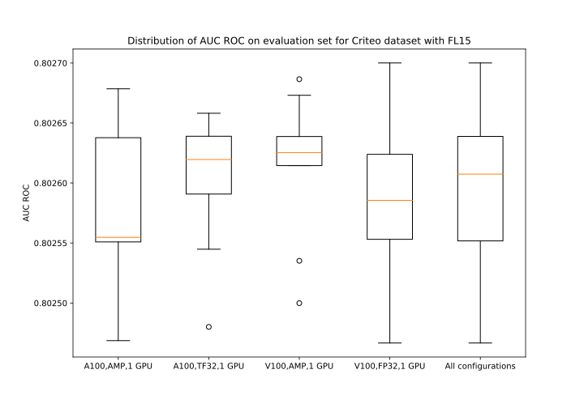

# DLRM For PyTorch

This repository provides a script and recipe to train the Deep Learning Recommendation Model (DLRM)
to achieve state-of-the-art accuracy and is tested and maintained by NVIDIA.

## Table Of Contents

- [Model overview](#model-overview)
    * [Model architecture](#model-architecture)
    * [Default configuration](#default-configuration)
    * [Feature support matrix](#feature-support-matrix)
        * [Features](#features)
    * [Mixed precision training](#mixed-precision-training)
        * [Enabling mixed precision](#enabling-mixed-precision)
        * [Enabling TF32](#enabling-tf32)
    * [Hybrid-parallel multi-GPU with all-2-all communication](#hybrid-parallel-multi-gpu-with-all-2-all-communication)
        * [Embedding table placement and load balancing](#embedding-table-placement-and-load-balancing)
    * [Preprocessing on GPU](#preprocessing-on-gpu)
    * [BYO dataset functionality overview](#byo-dataset-functionality-overview)
        * [Glossary](#glossary)
        * [Dataset feature specification](#dataset-feature-specification)
        * [Data flow in NVIDIA Deep Learning Examples recommendation models](#data-flow-in-nvidia-deep-learning-examples-recommendation-models)
        * [Example of dataset feature specification](#example-of-dataset-feature-specification)
        * [BYO dataset functionality](#byo-dataset-functionality)
- [Setup](#setup)
    * [Requirements](#requirements)
- [Quick Start Guide](#quick-start-guide)
- [Advanced](#advanced)
    * [Scripts and sample code](#scripts-and-sample-code)
    * [Command-line options](#command-line-options)
    * [Getting the data](#getting-the-data)
        * [Dataset guidelines](#dataset-guidelines)
        * [BYO dataset](#byo-dataset)
          * [Channel definitions and requirements](#channel-definitions-and-requirements)
          * [BYO dataset constraints for the model](#BYO-dataset-constraints-for-the-model)
        * [Preprocessing](#preprocessing)
            * [NVTabular](#nvtabular)
            * [Spark](#spark)
    * [Training process](#training-process)
    * [Inference process](#inference-process)
    * [Deploying DLRM Using NVIDIA Triton Inference Server](#deploying-dlrm-using-nvidia-triton-inference-server)
- [Performance](#performance)
    * [Benchmarking](#benchmarking)
        * [Training performance benchmark](#training-performance-benchmark)
        * [Inference performance benchmark](#inference-performance-benchmark)
    * [Results](#results)
        * [Training accuracy results](#training-accuracy-results)
            * [Training accuracy: NVIDIA DGX A100 (8x A100 80GB)](#training-accuracy-nvidia-dgx-a100-8x-a100-80gb)
            * [Training accuracy: NVIDIA DGX-1 (8x V100 32GB)](#training-accuracy-nvidia-dgx-1-8x-v100-32gb)
            * [Training accuracy plots](#training-accuracy-plots)
            * [Training stability test](#training-stability-test)
            * [Impact of mixed precision on training accuracy](#impact-of-mixed-precision-on-training-accuracy)
        * [Training performance results](#training-performance-results)
            * [Training performance: NVIDIA DGX A100 (8x A100 80GB)](#training-performance-nvidia-dgx-a100-8x-a100-80gb)
            * [Training performance: NVIDIA DGX-1 (8x V100 32GB)](#training-performance-nvidia-dgx-1-8x-v100-32gb)
            * [Training performance: NVIDIA DGX-2 (16x V100 32GB)](#training-performance-nvidia-dgx-2-16x-v100-32gb)
        * [Inference performance results](#inference-performance-results)
            * [Inference performance: NVIDIA DGX A100 (1x A100 80GB)](#inference-performance-nvidia-dgx-a100-1x-a100-80gb)
            * [Inference performance: NVIDIA DGX-1 (1x V100 32GB)](#inference-performance-nvidia-dgx-1-1x-v100-32gb)
- [Release notes](#release-notes)
    * [Changelog](#changelog)
    * [Known issues](#known-issues)

## Model overview

The Deep Learning Recommendation Model (DLRM) is a recommendation model designed to 
make use of both categorical and numerical inputs. It was first described in 
[Deep Learning Recommendation Model for Personalization and Recommendation Systems](https://arxiv.org/abs/1906.00091).
This repository provides a reimplementation of the codebase provided originally [here](https://github.com/facebookresearch/dlrm).
The scripts provided enable you to train DLRM on the [Criteo Terabyte Dataset](https://labs.criteo.com/2013/12/download-terabyte-click-logs/). 

Using the scripts provided here, you can efficiently train models that are too large to fit into a single GPU. This is because we use a hybrid-parallel approach, which combines model parallelism for the embedding tables with data parallelism for the Top MLP. This is explained in details in [next sections](#hybrid-parallel-multigpu-with-all-2-all-communication).

This model uses a slightly different preprocessing procedure than the one found in the original implementation. You can find a detailed description of the preprocessing steps in the [Dataset guidelines](#dataset-guidelines) section.

Using DLRM you can train a high-quality general model for providing recommendations.

This model is trained with mixed precision using Tensor Cores on Volta, Turing, and NVIDIA Ampere GPU architectures. Therefore, researchers can get results up to 3.3x faster than training without Tensor Cores while experiencing the benefits of mixed precision training. It is tested against each NGC monthly container release to ensure consistent accuracy and performance over time.


### Model architecture

DLRM accepts two types of features: categorical and numerical. For each categorical
feature, an embedding table is used to provide dense representation to each unique value. The dense features enter the model and are transformed by a 
simple neural network referred to as "bottom MLP". This part of the network consists of a series
of linear layers with ReLU activations. The output of the bottom MLP and the embedding vectors
are then fed into the "dot interaction" operation. The output of "dot interaction" is then concatenated with the features resulting from the bottom MLP and fed into the "top MLP" which is also a series of dense layers with activations.
The model outputs a single number which can be interpreted as a likelihood of a certain user clicking an ad. 


<p align="center">
  
  <br>
Figure 1. The architecture of DLRM. 
</p>

### Default configuration

The following features were implemented in this model:
- general
	- static loss scaling for Tensor Cores (mixed precision) training
	- hybrid-parallel multi-GPU training
- preprocessing
    - dataset preprocessing using Spark 3 on GPUs 
    - dataset preprocessing using NVTabular on GPUs 
    
### Feature support matrix

This model supports the following features:

| Feature                                 | DLRM                
|-----------------------------------------|-----
|Automatic mixed precision (AMP)          | yes
|CUDA Graphs                              | yes
|Hybrid-parallel multi-GPU with all-2-all | yes
|Preprocessing on GPU with NVTabular      | yes
|Preprocessing on GPU with Spark 3        | yes

         
#### Features

Automatic Mixed Precision (AMP) - enables mixed precision training without any changes to the code-base by performing automatic graph rewrites and loss scaling controlled by an environmental variable.

CUDA Graphs - This feature allows to launch multiple GPU operations through a single CPU operation. The result is a vast reduction in CPU overhead. The benefits are particularly pronounced when training with relatively small batch sizes. The CUDA Graphs feature has been available through a [native PyTorch API](https://pytorch.org/docs/master/notes/cuda.html#cuda-graphs) starting from PyTorch v1.10. 

Multi-GPU training with PyTorch distributed - our model uses `torch.distributed` to implement efficient multi-GPU training with NCCL. For details, see example sources in this repository or see the [PyTorch Tutorial](https://pytorch.org/tutorials/intermediate/dist_tuto.html).

Preprocessing on GPU with NVTabular - Criteo dataset preprocessing can be conducted using [NVTabular](https://github.com/NVIDIA/NVTabular). For more information on the framework, see the [Announcing the NVIDIA NVTabular Open Beta with Multi-GPU Support and New Data Loaders](https://developer.nvidia.com/blog/announcing-the-nvtabular-open-beta-with-multi-gpu-support-and-new-data-loaders/).

Preprocessing on GPU with Spark 3 - Criteo dataset preprocessing can be conducted using [Apache Spark 3.0](https://spark.apache.org/). For more information on the framework and how to leverage GPU to preprocessing, see the [Accelerating Apache Spark 3.0 with GPUs and RAPIDS](https://developer.nvidia.com/blog/accelerating-apache-spark-3-0-with-gpus-and-rapids/).


### Mixed precision training

Mixed precision is the combined use of different numerical precisions in a computational method. [Mixed precision](https://arxiv.org/abs/1710.03740) training offers significant computational speedup by performing operations in the half-precision floating-point format while storing minimal information in single-precision to retain as much information as possible in critical parts of the network. Since the introduction of [Tensor Cores](https://developer.nvidia.com/tensor-cores) in Volta, and following with both the Turing and Ampere architectures, significant training speedups are experienced by switching to mixed precision &ndash; up to 3.3x overall speedup on the most arithmetically intense model architectures. Using mixed precision training requires two steps:
1.  Porting the model to use the FP16 data type where appropriate.    
2.  Adding loss scaling to preserve small gradient values.

The ability to train deep learning networks with lower precision was introduced in the Pascal architecture and first supported in [CUDA 8](https://devblogs.nvidia.com/parallelforall/tag/fp16/) in the NVIDIA Deep Learning SDK.

For information about:
-   How to train using mixed precision, see the [Mixed Precision Training](https://arxiv.org/abs/1710.03740) paper and [Training With Mixed Precision](https://docs.nvidia.com/deeplearning/sdk/mixed-precision-training/index.html) documentation.
-   Techniques used for mixed precision training, see the [Mixed-Precision Training of Deep Neural Networks](https://devblogs.nvidia.com/mixed-precision-training-deep-neural-networks/) blog.
-   APEX tools for mixed precision training, see the [NVIDIA Apex: Tools for Easy Mixed-Precision Training in PyTorch](https://devblogs.nvidia.com/apex-pytorch-easy-mixed-precision-training/).

#### Enabling mixed precision

Mixed precision training is turned off by default. To turn it on issue the `--amp` flag to the `main.py` script.


#### Enabling TF32

TensorFloat-32 (TF32) is the new math mode in [NVIDIA A100](https://www.nvidia.com/en-us/data-center/a100/) GPUs for handling the matrix math also called tensor operations. TF32 running on Tensor Cores in A100 GPUs can provide up to 10x speedups compared to single-precision floating-point math (FP32) on Volta GPUs. 

TF32 Tensor Cores can speed up networks using FP32, typically with no loss of accuracy. It is more robust than FP16 for models that require a high dynamic range for weights or activations.

For more information, refer to the [TensorFloat-32 in the A100 GPU Accelerates AI Training, HPC up to 20x](https://blogs.nvidia.com/blog/2020/05/14/tensorfloat-32-precision-format/) blog post.

TF32 is supported in the NVIDIA Ampere GPU architecture and is enabled by default.

### Hybrid-parallel multi-GPU with all-2-all communication

Many recommendation models contain very large embedding tables. As a result, the model is often too large to fit onto a single device. This could be easily solved by training in a model-parallel way, using either the CPU or other GPUs as "memory donors". However, this approach is suboptimal as the "memory donor" devices' compute is not utilized. In this repository, we use the model-parallel approach for the bottom part of the model (Embedding Tables + Bottom MLP) while using a usual data parallel approach for the top part of the model (Dot Interaction + Top MLP). This way we can train models much larger than what would normally fit into a single GPU while at the same time making the training faster by using multiple GPUs. We call this approach hybrid-parallel.

The transition from model-parallel to data-parallel in the middle of the neural net needs a specific multi-GPU communication pattern called [all-2-all](https://en.wikipedia.org/wiki/All-to-all_\(parallel_pattern\)) which is available in our [PyTorch 21.04-py3](https://ngc.nvidia.com/catalog/containers/nvidia:pytorch/tags) NGC docker container. In the [original DLRM whitepaper](https://arxiv.org/abs/1906.00091) this has been also referred to as "butterfly shuffle". 

<p align="center">
  
  <br>
</p>


In the example shown in this repository we train models of three sizes: "small" (~15 GB), "large" (~82 GB), and "xlarge" (~142 GB). We use the hybrid-parallel approach for the "large" and "xlarge" models, as they do not fit in a single GPU.

#### Embedding table placement and load balancing

We use the following heuristic for dividing the work between the GPUs:
- The Bottom MLP is placed on GPU-0 and no embedding tables are placed on this device.
- The tables are sorted from the largest to the smallest
- Set `max_tables_per_gpu := ceil(number_of_embedding_tables / number_of_available_gpus)`
- Repeat until all embedding tables have an assigned device:
    - Out of all the available GPUs find the one with the largest amount of unallocated memory
    - Place the largest unassigned embedding table on this GPU. Raise an exception if it does not fit.
    - If the number of embedding tables on this GPU is now equal to `max_tables_per_gpu` remove this GPU from the list of available GPUs so that no more embedding tables will be placed on this GPU. This ensures the all2all communication is well balanced between all devices.

### Preprocessing on GPU

Please refer to [the "Preprocessing" section](#preprocessing) for a detailed description of the Apache Spark 3.0 and NVTabular GPU functionality 

### BYO dataset functionality overview

This section describes how you can train the DeepLearningExamples RecSys models on your own datasets without changing
the model or data loader and with similar performance to the one published in each repository.
This can be achieved thanks to Dataset Feature Specification, which describes how the dataset, data loader and model
interact with each other during training, inference and evaluation.
Dataset Feature Specification has a consistent format across all recommendation models in NVIDIA’s DeepLearningExamples
repository, regardless of dataset file type and the data loader,
giving you the flexibility to train RecSys models on your own datasets.

- [Glossary](#glossary)
- [Dataset Feature Specification](#dataset-feature-specification)
- [Data Flow in Recommendation Models in DeepLearning examples](#data-flow-in-nvidia-deep-learning-examples-recommendation-models)
- [Example of Dataset Feature Specification](#example-of-dataset-feature-specification)
- [BYO dataset functionality](#byo-dataset-functionality)

#### Glossary

The Dataset Feature Specification consists of three mandatory and one optional section:

<b>feature_spec </b> provides a base of features that may be referenced in other sections, along with their metadata.
	Format: dictionary (feature name) => (metadata name => metadata value)<br>

<b>source_spec </b> provides information necessary to extract features from the files that store them. 
	Format: dictionary (mapping name) => (list of chunks)<br>

* <i>Mappings</i> are used to represent different versions of the dataset (think: train/validation/test, k-fold splits). A mapping is a list of chunks.<br>
* <i>Chunks</i> are subsets of features that are grouped together for saving. For example, some formats may constrain data saved in one file to a single data type. In that case, each data type would correspond to at least one chunk. Another example where this might be used is to reduce file size and enable more parallel loading. Chunk description is a dictionary of three keys:<br>
  * <i>type</i> provides information about the format in which the data is stored. Not all formats are supported by all models.<br>
  * <i>features</i> is a list of features that are saved in a given chunk. Order of this list may matter: for some formats, it is crucial for assigning read data to the proper feature.<br>
  * <i>files</i> is a list of paths to files where the data is saved. For Feature Specification in yaml format, these paths are assumed to be relative to the yaml file’s directory (basename). <u>Order of this list matters:</u> It is assumed that rows 1 to i appear in the first file, rows i+1 to j in the next one, etc. <br>

<b>channel_spec</b> determines how features are used. It is a mapping (channel name) => (list of feature names). 

Channels are model specific magic constants. In general, data within a channel is processed using the same logic. Example channels: model output (labels), categorical ids, numerical inputs, user data, and item data.

<b>metadata</b> is a catch-all, wildcard section: If there is some information about the saved dataset that does not fit into the other sections, you can store it here.

#### Dataset feature specification

Data flow can be described abstractly:
Input data consists of a list of rows. Each row has the same number of columns; each column represents a feature.
The columns are retrieved from the input files, loaded, aggregated into channels and supplied to the model/training script. 

FeatureSpec contains metadata to configure this process and can be divided into three parts:

* Specification of how data is organized on disk (source_spec). It describes which feature (from feature_spec) is stored in which file and how files are organized on disk.

* Specification of features (feature_spec). Describes a dictionary of features, where key is feature name and values are features’ characteristics such as  dtype and other metadata (for example, cardinalities for categorical features)

* Specification of model’s inputs and outputs (channel_spec). Describes a dictionary of model’s inputs where keys specify model channel’s names and values specify lists of features to be loaded into that channel. Model’s channels are groups of data streams to which common model logic is applied, for example categorical/continuous data, user/item ids. Required/available channels depend on the model


The FeatureSpec is a common form of description regardless of underlying dataset format, dataset data loader form and model. 


#### Data flow in NVIDIA Deep Learning Examples recommendation models

The typical data flow is as follows:
* <b>S.0.</b> Original dataset is downloaded to a specific folder.
* <b>S.1.</b> Original dataset is preprocessed into Intermediary Format. For each model, the preprocessing is done differently, using different tools. The Intermediary Format also varies (for example, for DLRM PyTorch, the Intermediary Format is a custom binary one.)
* <b>S.2.</b> The Preprocessing Step outputs Intermediary Format with dataset split into training and validation/testing parts along with the Dataset Feature Specification yaml file. Metadata in the preprocessing step is automatically calculated.
* <b>S.3.</b> Intermediary Format data together with Dataset Feature Specification are fed into training/evaluation scripts. Data loader reads Intermediary Format and feeds the data into the model according to the description in the Dataset Feature Specification.
* <b>S.4.</b> The model is trained and evaluated


<p align="center">
  
  <br>

Fig.1. Data flow in Recommender models in NVIDIA Deep Learning Examples repository. Channels of the model are drawn in green</a>.
</p>


#### Example of dataset feature specification

As an example, let’s consider a Dataset Feature Specification for a small CSV dataset for some abstract model.

```yaml
feature_spec:
  user_gender:
    dtype: torch.int8
    cardinality: 3 #M,F,Other
  user_age: #treated as numeric value
    dtype: torch.int8
  user_id:
    dtype: torch.int32
    cardinality: 2655
  item_id:
    dtype: torch.int32
    cardinality: 856
  label:
    dtype: torch.float32

source_spec:
  train:
    - type: csv
      features:
        - user_gender
        - user_age
      files:
        - train_data_0_0.csv
        - train_data_0_1.csv
    - type: csv
      features:
        - user_id
        - item_id
        - label
      files:
        - train_data_1.csv
  test:
    - type: csv
      features:
        - user_id
        - item_id
        - label
        - user_gender
        - user_age
        
      files:
        - test_data.csv

channel_spec:
  numeric_inputs: 
    - user_age
  categorical_user_inputs: 
    - user_gender
    - user_id
  categorical_item_inputs: 
    - item_id
  label_ch: 
    - label
```


The data contains five features: (user_gender, user_age, user_id, item_id, label). Their data types and necessary metadata are described in the feature specification section.

In the source mapping section, two mappings are provided: one describes the layout of the training data, the other of the testing data. The layout for training data has been chosen arbitrarily to showcase the flexibility.
The train mapping consists of two chunks. The first one contains user_gender and user_age, saved as a CSV, and is further broken down into two files. For specifics of the layout, refer to the following example and consult the glossary. The second chunk contains the remaining columns and is saved in a single file. Notice that the order of columns is different in the second chunk - this is alright, as long as the order matches the order in that file (that is, columns in the .csv are also switched)


Let’s break down the train source mapping. The table contains example data color-paired to the files containing it.

<p align="center">

</p>


The channel spec describes how the data will be consumed. Four streams will be produced and available to the script/model.
The feature specification does not specify what happens further: names of these streams are only lookup constants defined by the model/script.
Based on this example, we can speculate that the model has three  input channels: numeric_inputs, categorical_user_inputs,
categorical_item_inputs, and one  output channel: label.
Feature names are internal to the FeatureSpec and can be freely modified.


#### BYO dataset functionality

In order to train any Recommendation model in NVIDIA Deep Learning Examples one can follow one of three possible ways:
* One delivers already preprocessed dataset in the Intermediary Format supported by data loader used by the training script
(different models use different data loaders) together with FeatureSpec yaml file describing at least specification of dataset, features and model channels

* One uses a transcoding script

* One delivers dataset in non-preprocessed form and uses preprocessing scripts that are a part of the model repository.
In order to use already existing preprocessing scripts, the format of the dataset needs to match the one of the original datasets.
This way, the FeatureSpec file will be generated automatically, but the user will have the same preprocessing as in the original model repository.


## Setup

The following section lists the requirements for training DLRM.

### Requirements

This repository contains Dockerfile which extends the PyTorch NGC container and encapsulates some dependencies. Aside from these dependencies, ensure you have the following components:
- [NVIDIA Docker](https://github.com/NVIDIA/nvidia-docker)
- [PyTorch 21.10-py3](https://ngc.nvidia.com/catalog/containers/nvidia:pytorch/tags) NGC container
- Supported GPUs:
    - [NVIDIA Volta architecture](https://www.nvidia.com/en-us/data-center/volta-gpu-architecture/)
    - [NVIDIA Turing architecture](https://www.nvidia.com/en-us/design-visualization/technologies/turing-architecture/)
    - [NVIDIA Ampere architecture](https://www.nvidia.com/en-us/data-center/nvidia-ampere-gpu-architecture/)


For more information about how to get started with NGC containers, see the following sections from the NVIDIA GPU Cloud Documentation and the Deep Learning Documentation:
- [Getting Started Using NVIDIA GPU Cloud](https://docs.nvidia.com/ngc/ngc-getting-started-guide/index.html)
- [Accessing And Pulling From The NGC Container Registry](https://docs.nvidia.com/deeplearning/frameworks/user-guide/index.html#accessing_registry)
- [Running PyTorch](https://docs.nvidia.com/deeplearning/frameworks/pytorch-release-notes/running.html#running)
  
For those unable to use the PyTorch NGC container, to set up the required environment or create your own container, see the versioned [NVIDIA Container Support Matrix](https://docs.nvidia.com/deeplearning/frameworks/support-matrix/index.html).

## Quick Start Guide

To train your model using mixed or TF32 precision with Tensor Cores or using FP32, perform the following steps using
the default parameters of DLRM on the Criteo Terabyte dataset. For the specifics concerning training and inference,
see the [Advanced](#advanced) section.

1. Clone the repository.
```
git clone https://github.com/NVIDIA/DeepLearningExamples
cd DeepLearningExamples/PyTorch/Recommendation/DLRM
```

2. Download the dataset.

You can download the data by following the instructions at: http://labs.criteo.com/2013/12/download-terabyte-click-logs/.
When you have successfully downloaded it and unpacked it, set the `CRITEO_DATASET_PARENT_DIRECTORY` to its parent directory:
```
CRITEO_DATASET_PARENT_DIRECTORY=/raid/dlrm
``` 
We recommend to choose the fastest possible file system, otherwise it may lead to an IO bottleneck.

3. Build DLRM Docker containers
```bash
docker build -t nvidia_dlrm_pyt .
docker build -t nvidia_dlrm_preprocessing -f Dockerfile_preprocessing . --build-arg DGX_VERSION=[DGX-2|DGX-A100]
```

3. Start an interactive session in the NGC container to run preprocessing.
The DLRM PyTorch container can be launched with:
```bash
docker run --runtime=nvidia -it --rm --ipc=host  -v ${CRITEO_DATASET_PARENT_DIRECTORY}:/data/dlrm nvidia_dlrm_preprocessing bash
```

4.  Preprocess the dataset.

Here are a few examples of different preprocessing commands. Out of the box, we support preprocessing  on DGX-2 and DGX A100 systems. For the details on how those scripts work and detailed description of dataset types (small FL=15, large FL=3, xlarge FL=2), system requirements, setup instructions for different systems  and all the parameters consult the [preprocessing section](#preprocessing).
For an explanation of the `FL` parameter, see the [Dataset Guidelines](#dataset-guidelines) and [Preprocessing](#preprocessing) sections. 

Depending on dataset type (small FL=15, large FL=3, xlarge FL=2) run one of following command:

4.1. Preprocess to small dataset (FL=15) with Spark GPU:
```bash
cd /workspace/dlrm/preproc
./prepare_dataset.sh 15 GPU Spark
```

4.2. Preprocess to large dataset (FL=3) with Spark GPU:
```bash
cd /workspace/dlrm/preproc
./prepare_dataset.sh 3 GPU Spark
```

4.3. Preprocess to xlarge dataset (FL=2) with Spark GPU:
```bash
cd /workspace/dlrm/preproc
./prepare_dataset.sh 2 GPU Spark
```


5. Start training.

- First start the docker container (adding `--security-opt seccomp=unconfined` option is needed to take the full advantage of processor affinity in multi-GPU training):
```bash
docker run --security-opt seccomp=unconfined --runtime=nvidia -it --rm --ipc=host  -v ${PWD}/data:/data nvidia_dlrm_pyt bash
```

- single-GPU:
```bash
python -m dlrm.scripts.main --mode train --dataset /data/dlrm/binary_dataset/ --amp --cuda_graphs
```

- multi-GPU for DGX A100:
```bash
python -m torch.distributed.launch --no_python --use_env --nproc_per_node 8 \
          bash  -c './bind.sh --cpu=dgxa100_ccx.sh --mem=dgxa100_ccx.sh python -m dlrm.scripts.main \
          --dataset /data/dlrm/binary_dataset/ --seed 0 --epochs 1 --amp --cuda_graphs'
```

- multi-GPU for DGX-1 and DGX-2:
```bash
python -m torch.distributed.launch --no_python --use_env --nproc_per_node 8 \
          bash  -c './bind.sh  --cpu=exclusive -- python -m dlrm.scripts.main \
          --dataset /data/dlrm/binary_dataset/ --seed 0 --epochs 1 --amp --cuda_graphs'
```

6. Start validation/evaluation. If you want to run validation or evaluation, you can either:
 - use the checkpoint obtained from the training commands above, or
 - download the pretrained checkpoint from NGC.

In order to download the checkpoint from NGC, visit ngc.nvidia.com website and browse the available models. Download the checkpoint files and unzip them to some path, for example, to `$CRITEO_DATASET_PARENT_DIRECTORY/checkpoints/`. The checkpoint requires around 15GB of disk space.

Commands:
- single-GPU:
```bash
python -m dlrm.scripts.main --mode test --dataset /data/dlrm/binary_dataset/ --load_checkpoint_path `$CRITEO_DATASET_PARENT_DIRECTORY/checkpoints/checkpoint`
```

- multi-GPU for DGX A100:
```bash
python -m torch.distributed.launch --no_python --use_env --nproc_per_node 8 \
          bash  -c './bind.sh --cpu=dgxa100_ccx.sh --mem=dgxa100_ccx.sh python -m dlrm.scripts.main \
          --dataset /data/dlrm/binary_dataset/ --seed 0 --epochs 1 --amp --load_checkpoint_path `$CRITEO_DATASET_PARENT_DIRECTORY/checkpoints/checkpoint`'
```

- multi-GPU for DGX-1 and DGX-2:
```bash
python -m torch.distributed.launch --no_python --use_env --nproc_per_node 8 \
          bash  -c './bind.sh  --cpu=exclusive -- python -m dlrm.scripts.main \
          --dataset /data/dlrm/binary_dataset/ --seed 0 --epochs 1 --amp --load_checkpoint_path `$CRITEO_DATASET_PARENT_DIRECTORY/checkpoints/checkpoint`'
```

## Advanced

The following sections provide greater details of the dataset, running training and inference, and the training results.

### Scripts and sample code

The `dlrm/scripts/main.py` script provides an entry point to most of the functionality. Using different command-line flags allows you to run training, validation, and benchmark both training and inference on real or synthetic data.

Utilities related to loading the data reside in the `data` directory.


### Command-line options

The `dlrm/scripts/main.py` script supports a number of command-line flags. You can get the descriptions of those by running `python -m dlrm.scripts.main --help`.


The following example output is printed when running the model:
```
Epoch:[0/1] [200/128028]  eta: 1:28:44  loss: 0.1782  step_time: 0.041657  lr: 0.8794
Epoch:[0/1] [400/128028]  eta: 1:25:15  loss: 0.1403  step_time: 0.038504  lr: 1.7544
Epoch:[0/1] [600/128028]  eta: 1:23:56  loss: 0.1384  step_time: 0.038422  lr: 2.6294
Epoch:[0/1] [800/128028]  eta: 1:23:13  loss: 0.1370  step_time: 0.038421  lr: 3.5044
Epoch:[0/1] [1000/128028]  eta: 1:22:45  loss: 0.1362  step_time: 0.038464  lr: 4.3794
Epoch:[0/1] [1200/128028]  eta: 1:22:24  loss: 0.1346  step_time: 0.038455  lr: 5.2544
Epoch:[0/1] [1400/128028]  eta: 1:22:07  loss: 0.1339  step_time: 0.038459  lr: 6.1294
Epoch:[0/1] [1600/128028]  eta: 1:21:52  loss: 0.1320  step_time: 0.038481  lr: 7.0044
Epoch:[0/1] [1800/128028]  eta: 1:21:39  loss: 0.1315  step_time: 0.038482  lr: 7.8794
Epoch:[0/1] [2000/128028]  eta: 1:21:27  loss: 0.1304  step_time: 0.038466  lr: 8.7544
Epoch:[0/1] [2200/128028]  eta: 1:21:15  loss: 0.1305  step_time: 0.038430  lr: 9.6294
```

### Getting the data

This example uses the [Criteo Terabyte Dataset](https://labs.criteo.com/2013/12/download-terabyte-click-logs/).
The first 23 days are used as the training set. The last day is split in half. The first part, referred to as "test", is used for validating training results. The second one, referred to as "validation", is unused.


#### Dataset guidelines

The preprocessing steps applied to the raw data include:
- Replacing the missing values with `0`
- Replacing the categorical values that exist fewer than `FL` times with a special value (FL value is called a frequency threshold or a frequency limit)
- Converting the hash values to consecutive integers
- Adding 3 to all the numerical features so that all of them are greater or equal to 1
- Taking a natural logarithm of all numerical features


#### BYO dataset 

This implementation supports using other datasets thanks to BYO dataset functionality. 
The BYO dataset functionality allows users to plug in their dataset in a common fashion for all Recommender models 
that support this functionality. Using BYO dataset functionality, the user does not have to modify the source code of 
the model thanks to the Feature Specification file. For general information on how BYO dataset works, refer to the 
[BYO dataset overview section](#byo-dataset-functionality-overview).

There are three ways to plug in user's dataset:
<details>
<summary><b>1. Provide an unprocessed dataset in a format matching the one used by Criteo 1TB, then use Criteo 1TB's preprocessing. Feature Specification file is then generated automatically.</b></summary>
The required format of the user's dataset is:

The data should be split into text files. Each line of those text files should contain a single training example. 
An example should consist of multiple fields separated by tabulators:

* The first field is the label – 1 for a positive example and 0 for negative.
* The next N tokens should contain the numerical features separated by tabs.
* The next M tokens should contain the hashed categorical features separated by tabs.

The correct dataset files together with the Feature Specification yaml file will be generated automatically by preprocessing script.

For an example of using this process, refer to the [Quick Start Guide](#quick-start-guide)

</details>

<details>
<summary><b>2. Provide a CSV containing preprocessed data and a simplified Feature Specification yaml file, then transcode the data with `transcode.py` script </b> </summary>
This option should be used if the user has their own CSV file with a preprocessed dataset they want to train on.

The required format of the user's dataset is:
* CSV files containing the data, already split into train and test sets. 
* Feature Specification yaml file describing the layout of the CSV data

For an example of a feature specification file, refer to the `tests/transcoding` folder.

The CSV containing the data:
* should be already split into train and test
* should contain no header
* should contain one column per feature, in the order specified by the list of features for that chunk 
  in the source_spec section of the feature specification file
* categorical features should be non-negative integers in the range [0,cardinality-1] if cardinality is specified

The Feature Specification yaml file:
* needs to describe the layout of data in CSV files
* may contain information about cardinalities. However, if set to `auto`, they will be inferred from the data by the transcoding script.

Refer to `tests/transcoding/small_csv.yaml` for an example of the yaml Feature Specification.

The following example shows how to use this way of plugging user's dataset:

Prepare your data and save the path:
```bash
DATASET_PARENT_DIRECTORY=/raid/dlrm
```

Build the DLRM image with:
```bash
docker build -t nvidia_dlrm_pyt .
```
Launch the container with:
```bash
docker run --runtime=nvidia -it --rm --ipc=host  -v ${DATASET_PARENT_DIRECTORY}:/data nvidia_dlrm_preprocessing bash
```

If you are just testing the process, you can create synthetic csv data:
```bash
python -m dlrm.scripts.gen_csv --feature_spec_in tests/transcoding/small_csv.yaml
```

Convert the data:
```bash
mkdir /data/conversion_output
python -m dlrm.scripts.transcode --input /data --output /data/converted
```
You may need to tune the --chunk_size parameter. Higher values speed up the conversion but require more RAM.

This will convert the data from `/data` and save the output in `/data/converted`.
A feature specification file describing the new data will be automatically generated.

To run the training on 1 GPU:
```bash
python -m dlrm.scripts.main --mode train --dataset /data/converted --amp --cuda_graphs
```

- multi-GPU for DGX A100:
```bash
python -m torch.distributed.launch --no_python --use_env --nproc_per_node 8 \
          bash  -c './bind.sh --cpu=dgxa100_ccx.sh --mem=dgxa100_ccx.sh python -m dlrm.scripts.main \
          --dataset /data/converted --seed 0 --epochs 1 --amp --cuda_graphs'
```

- multi-GPU for DGX-1 and DGX-2:
```bash
python -m torch.distributed.launch --no_python --use_env --nproc_per_node 8 \
          bash  -c './bind.sh  --cpu=exclusive -- python -m dlrm.scripts.main \
          --dataset /data/converted --seed 0 --epochs 1 --amp --cuda_graphs'
```
</details>
<details>
<summary><b>3. Provide a fully preprocessed dataset, saved in split binary files, and a Feature Specification yaml file</b></summary>
This is the option to choose if you want full control over preprocessing and/or want to preprocess data directly to the target format.

Your final output will need to contain a Feature Specification yaml describing data and file layout. 
For an example feature specification file, refer to `tests/feature_specs/criteo_f15.yaml`

For details, refer to the [BYO dataset overview section](#byo-dataset-functionality-overview).
</details>


##### Channel definitions and requirements

This model defines three channels:

- categorical, accepting an arbitrary number of features
- numerical, accepting an arbitrary number of features
- label, accepting a single feature


The training script expects two mappings:

- train
- test

For performance reasons:
* The only supported dataset type is split binary
* Splitting chunks into multiple files is not supported.
* Each categorical feature has to be provided in a separate chunk
* All numerical features have to be provided in a single chunk
* All numerical features have to appear in the same order in channel_spec and source_spec
* Only integer types are supported for categorical features
* Only float16 is supported for numerical features

##### BYO dataset constraints for the model

There are the following constraints of BYO dataset functionality for this model:
1. The performance of the model depends on the dataset size. Generally, the model should scale better for datasets containing more data points. For a smaller dataset, you might experience slower performance than the one reported for Criteo
2. Using other datasets might require tuning some hyperparameters (for example, learning rate, beta1 and beta2) to reach desired accuracy.
3. The optimized cuda interaction kernels for FP16 and TF32 assume that the number of categorical variables is smaller than WARP_SIZE=32 and embedding size is <=128
#### Preprocessing 

The preprocessing scripts provided in this repository support running both on CPU and GPU using [NVtabular](https://developer.nvidia.com/blog/announcing-the-nvtabular-open-beta-with-multi-gpu-support-and-new-data-loaders/) (GPU only) and [Apache Spark 3.0](https://www.nvidia.com/en-us/deep-learning-ai/solutions/data-science/apache-spark-3/).

Please note that the preprocessing will require about 4TB of disk storage. 


The syntax for the preprocessing script is as follows:
```bash
cd /workspace/dlrm/preproc
./prepare_dataset.sh <frequency_threshold> <GPU|CPU> <NVTabular|Spark>
```

For the Criteo Terabyte dataset, we recommend a frequency threshold of `FL=3`(when using A100 40GB or V100 32 GB) or `FL=2`(when using A100 80GB) if you intend to run the hybrid-parallel mode
on multiple GPUs. If you want to make the model fit into a single NVIDIA Tesla V100-32GB, you can set `FL=15`. 

The first argument means the frequency threshold to apply to the categorical variables. For a frequency threshold `FL`, the categorical values that occur less 
often than `FL` will be replaced with one special value for each category. Thus, a larger value of `FL` will require smaller embedding tables 
and will substantially reduce the overall size of the model.

The second argument is the hardware to use (either GPU or CPU).  

The third arguments is a framework to use (either NVTabular or Spark). In case of choosing a CPU preprocessing this argument is omitted as it only Apache Spark is supported on CPU.

The preprocessing scripts make use of the following environment variables to configure the data directory paths:
- `download_dir` – this directory should contain the original Criteo Terabyte CSV files
- `spark_output_path` – directory to which the parquet data will be written
- `conversion_intermediate_dir` – directory used for storing intermediate data used to convert from parquet to train-ready format
- `final_output_dir` – directory to store the final results of the preprocessing which can then be used to train DLRM 

In the `final_output_dir` will be three subdirectories created: `train`, `test`, `validation`, and one json file &ndash; `model_size.json` &ndash; containing a maximal index of each category. 
The `train` is the train dataset transformed from day_0 to day_22. 
The `test` is the test dataset transformed from the prior half of day_23. 
The `validation` is the dataset transformed from the latter half of day_23.

The model is tested on 3 datasets resulting from Criteo dataset preprocessing: small (Freqency threshold = 15), large (Freqency threshold = 3) and xlarge (Freqency threshold = 2). Each dataset occupies approx 370GB of disk space. Table below presents information on the supercomputer and GPU count that are needed to train model on particular dataset.

| Dataset | GPU VRAM consumption\* | Model checkpoint size\* | FL setting | DGX A100 40GB, 1GPU | DGX A100 40GB, 8GPU | DGX A100 80GB, 1GPU | DGX A100 80GB, 8GPU | DGX-1** or DGX-2, 1 GPU | DGX-1** or DGX-2, 8GPU | DGX-2, 16GPU |
| ------- | ---------------------- | ----------------------- | ---------- | -------------------- | -------------------- | -------------------- | -------------------- | ---------------------- | --------------------- | ------------ |
| small (FL=15) | 20.5 | 15.0 | 15 | Yes | Yes | Yes | Yes | Yes | Yes | Yes |
| large (FL=3) | 132.3 | 81.9 | 3 | NA | Yes | NA | Yes | NA | Yes | Yes |
| xlarge (FL=2) | 198.8 | 141.3 | 2 | NA | NA | NA | Yes | NA | NA | NA |

\*with default embedding dimension setting
\**DGX-1 V100 32GB

##### NVTabular

NVTabular preprocessing is calibrated to run on [DGX A100](https://www.nvidia.com/en-us/data-center/dgx-a100/) and [DGX-2](https://www.nvidia.com/en-us/data-center/dgx-2/) AI systems. However, it should be possible to change the values of `ALL_DS_MEM_FRAC`, `TRAIN_DS_MEM_FRAC`, `TEST_DS_MEM_FRAC`, `VALID_DS_MEM_FRAC` in `preproc/preproc_NVTabular.py`, so that they'll work on also on other hardware platforms such as DGX-1 or a custom one. 

##### Spark

The script `spark_data_utils.py` is a PySpark application, which is used to preprocess the Criteo Terabyte Dataset. In the Docker image, we have installed Spark 3.0.1, which will start a standalone cluster of Spark. The scripts `run_spark_cpu.sh` and `run_spark_gpu.sh` start Spark, then run several PySpark jobs with `spark_data_utils.py`. 

Note that the Spark job requires about 3TB disk space used for data shuffling.

Spark preprocessing is calibrated to run on [DGX A100](https://www.nvidia.com/en-us/data-center/dgx-a100/) and [DGX-2](https://www.nvidia.com/en-us/data-center/dgx-2/) AI systems. However, it should be possible to change the values in `preproc/DGX-2_config.sh` or `preproc/DGX-A100_config.sh`
so that they'll work on also on other hardware platforms such as DGX-1 or a custom one. 

### Training process

The main training script resides in `dlrm/scripts/main.py`. Once the training is completed, it stores the checkpoint
in the path specified by `--save_checkpoint_path` and a JSON training log in `--log_path`. The quality of the predictions 
generated by the model is measured by the [ROC AUC metric](https://scikit-learn.org/stable/modules/model_evaluation.html#roc-metrics).
The speed of training and inference is measured by throughput i.e., the number 
of samples processed per second. We use mixed precision training with static loss scaling for the bottom and top MLPs while embedding tables are stored in FP32 format.

### Inference process

This section describes inference with PyTorch in Python. If you're interested in inference using the Triton Inference Server, refer to [triton/README.md](triton/README.md) file.

Two modes for inference are currently supported by the `dlrm/scripts/main.py` script:

1. Inference benchmark – this mode will measure and print out throughput and latency numbers for multiple batch sizes. You can activate it by passing the `--mode inference_benchmark` command line flag. The batch sizes to be tested can be set with the `--inference_benchmark_batch_sizes` command-line argument.
2. Test-only – this mode can be used to run a full validation on a checkpoint to measure ROC AUC. You can enable it by passing `--mode test`.

### Deploying DLRM Using NVIDIA Triton Inference Server
The NVIDIA Triton Inference Server provides a cloud inferencing solution optimized for NVIDIA GPUs. The server provides an inference service via an HTTP or gRPC endpoint, allowing remote clients to request inferencing for any model being managed by the server. More information on how to perform inference using NVIDIA Triton Inference Server can be found in [triton/README.md](triton/README.md).

## Performance

The performance measurements in this document were conducted at the time of publication and may not reflect the performance achieved from NVIDIA’s latest software release. For the most up-to-date performance measurements, go to [NVIDIA Data Center Deep Learning Product Performance](https://developer.nvidia.com/deep-learning-performance-training-inference).

### Benchmarking

The following section shows how to run benchmarks measuring the model performance in training and inference modes.

#### Training performance benchmark

To benchmark the training performance on a specific batch size, please follow the instructions
in the [Quick Start Guide](#quick-start-guide). You can also add the `--max_steps 1000 --benchmark_warmup_steps 500`
if you want to get a reliable throughput measurement without running the entire training. 

You can create a synthetic dataset by running `python -m dlrm.scripts.prepare_synthetic_dataset --synthetic_dataset_dir /tmp/dlrm_synthetic_data` if you haven't yet downloaded the dataset.

#### Inference performance benchmark

To benchmark the inference performance on a specific batch size, run:

```
python -m dlrm.scripts.main --mode inference_benchmark --dataset /data
```

You can also create a synthetic dataset by running `python -m dlrm.scripts.prepare_synthetic_dataset --synthetic_dataset_dir /tmp/dlrm_synthetic_data` if you haven't yet downloaded the dataset.

### Results 

The following sections provide details on how we achieved our performance and accuracy in training and inference. 

We used three model size variants to show memory scalability in a multi-GPU setup:

| Model variant | Frequency threshold | Model size
|---:|---|---|
|small | 15 | 15 GB |
|large | 3 | 82 GB |
|xlarge| 2 | 142 GB|

#### Training accuracy results


##### Training accuracy: NVIDIA DGX A100 (8x A100 80GB)

Our results were obtained by running `dlrm/scripts/main.py` script as described in the Quick Start Guide in the DLRM Docker container using NVIDIA A100 80GB GPUs.

|   GPUs | Model size   | Batch size / GPU   |   Accuracy (AUC) - TF32 |   Accuracy (AUC) - mixed precision | Time to train - TF32]   | Time to train - mixed precision   |   Time to train speedup (TF32 to mixed precision) |
|-------:|:-------------|:-------------------|------------------------:|-----------------------------------:|:------------------------|:----------------------------------|--------------------------------------------------:|
|      8 | large        | 8k                 |                0.802509 |                           0.802528 | 0:06:27                 | 0:04:36                           |                                           1.40217 |
|      1 | small        | 64k                |                0.802537 |                           0.802521 | 0:24:26                 | 0:17:47                           |                                           1.37395 |


##### Training accuracy: NVIDIA DGX-1 (8x V100 32GB)

Our results were obtained by running `dlrm/scripts/main.py` script as described in the Quick Start Guide in the DLRM Docker container using NVIDIA V100 32GB GPUs.

|   GPUs | Model size   | Batch size / GPU   |   Accuracy (AUC) - FP32 |   Accuracy (AUC) - mixed precision | Time to train - FP32]   | Time to train - mixed precision   |   Time to train speedup (FP32 to mixed precision) |
|-------:|:-------------|:-------------------|------------------------:|-----------------------------------:|:------------------------|:----------------------------------|--------------------------------------------------:|
|      8 | large        | 8k                 |                0.802568 |                           0.802562 | 0:28:24                 | 0:11:45                           |                                           2.41702 |
|      1 | small        | 64k                |                0.802784 |                           0.802723 | 1:58:10                 | 0:38:17                           |                                           3.08663 |


##### Training accuracy plots

Models trained with FP32, TF32, and Automatic Mixed Precision (AMP) achieve similar accuracy.

The plot represents ROC AUC metric as a function of steps (step is single batch) during training for default precision (FP32 for Volta architecture (DGX-1) and TF32 for Ampere GPU architecture (DGX-A100)), and AMP for all three datasets. 
All other parameters of training are default.

<p align="center">
  
  <br>
  Figure 1. Training stability for a FL3 dataset: distribution of ROC AUC across different configurations. 'All configurations' refer to the distribution of ROC AUC for cartesian product of architecture, training precision. </a>
</p>

<p align="center">
  
  <br>
  Figure 2. Training stability for a FL15 dataset: distribution of ROC AUC across different configurations. 'All configurations' refer to the distribution of ROC AUC for cartesian product of architecture, training precision. </a>
</p>


##### Training stability test

Training of the model is stable for multiple configurations achieving a standard deviation of 10e-4. 
The model achieves similar ROC AUC scores for A100 and V100, training precisions. 
It was trained for one epoch (roughly 4 billion samples, 64014 batches), starting from 10 different initial random seeds for each setup.
The training was performed in the pytorch:21.10-py3 NGC container with and without mixed precision enabled.
The provided charts and numbers consider single and multi GPU training. After training, the models were evaluated on the test set. 
The following plots compare distributions of ROC AUC on the test set.

<p align="center">
  
  <br>
  Figure 3. Training stability for a FL3 dataset: distribution of ROC AUC across different configurations. 'All configurations' refer to the distribution of ROC AUC for cartesian product of architecture, training precision. </a>
</p>

<p align="center">
  
  <br>
  Figure 4. Training stability for a FL15 dataset: distribution of ROC AUC across different configurations. 'All configurations' refer to the distribution of ROC AUC for cartesian product of architecture, training precision. </a>
</p>

##### Impact of mixed precision on training accuracy

The accuracy of training, measured with ROC AUC on the test set after the final epoch metric was not impacted by enabling mixed precision. The obtained results were statistically similar. The similarity was measured according to the following procedure:

The model was trained 10 times for default settings (FP32 or TF32 for Volta and Ampere architecture respectively) and 10 times for AMP. After the last epoch, the accuracy score ROC AUC was calculated on the test set.

Distributions for two hardware configurations (A100, V100) for 2 datasets are presented below.

<p align="center">
  
  <br>
  Figure 5. Impact of AMP on ROC AUC distribution for A100 and V100 GPUs for single- and multi-gpu training on a dataset with a frequency threshold of 3. </a>
</p>

<p align="center">
  
  <br>
  Figure 6. Impact of AMP on ROC AUC distribution for A100 and V100 GPUs for single- and multi-gpu training on a dataset with a frequency threshold of 15. </a>
</p>


Distribution of AUC ROC for single precision training (TF32 for A100, FP32 for Volta) and AMP training were compared in terms of mean, variance and [Kolmogorov–Smirnov test](https://en.wikipedia.org/wiki/Kolmogorov%E2%80%93Smirnov_test) to state statistical difference between single precision and AMP results. Refer to the expandable table below.

<details>
<summary>Full tabular data for AMP influence on AUC ROC</summary>

| Hardware   | Dataset   | GPUs   | mean AUC ROC for full precision   | std AUC ROC for full precision   | mean AUC ROC for AMP   | std AUC ROC for AMP   | KS test value: statictics, p-value   |
|:-----------|:----------|:-------|:----------------------------------|:---------------------------------|:-----------------------|:----------------------|:-------------------------------------|
| DGX A100   | FL3       | 8      | 0.802681                          | 0.000073                         | 0.802646               | 0.000063              | ('0.400', '0.418')                   |
| DGX-2      | FL3       | 16     | 0.802614                          | 0.000073                         | 0.802623               | 0.000122              | ('0.267', '0.787')                   |
Sample size was set to 10 experiments for each training setup.

</details>

#### Training performance results


We used throughput in items processed per second as the performance metric.


##### Training performance: NVIDIA DGX A100 (8x A100 80GB)

Our results were obtained by running the following commands:
- for single-GPU setup:
```
python -m dlrm.scripts.main --dataset /data --amp --cuda_graphs
```
- for multi-GPU setup:
```
python -m torch.distributed.launch --no_python --use_env --nproc_per_node 8 \
          bash  -c './bind.sh --cpu=dgxa100_ccx.sh --mem=dgxa100_ccx.sh python -m dlrm.scripts.main \
          --dataset /data --amp --cuda_graphs'
```

in the DLRM Docker container on NVIDIA DGX A100 (8x A100 80GB) GPUs. Performance numbers (in records of data per second) were averaged over an entire training epoch.


|   GPUs | Model size   | Batch size / GPU   |   Throughput - TF32 |   Throughput - mixed precision |   Throughput speedup (TF32 to mixed precision) |
|-------:|:-------------|:-------------------|--------------------:|-------------------------------:|-----------------------------------------------:|
|      8 | large        | 8k                 |          11,400,000 |                     16,500,000 |                                          1.447 |
|      1 | small        | 64k                |           2,880,000 |                      4,020,000 |                                          1.396 |


To achieve these same results, follow the steps in the [Quick Start Guide](#quick-start-guide).

##### Training performance: NVIDIA DGX-1 (8x V100 32GB)

Our results were obtained by running the following commands:
- for single-GPU:
```
python -m dlrm.scripts.main --mode train --dataset /data --amp --cuda_graphs
```
- for multi-GPU :
```
python -m torch.distributed.launch --no_python --use_env --nproc_per_node 8 \
          bash  -c './bind.sh  --cpu=exclusive -- python -m dlrm.scripts.main \
          --dataset /data --amp --cuda_graphs'
```

 in the DLRM Docker container on NVIDIA DGX-1 with (8x V100 32GB) GPUs. Performance numbers (in records of data per second) were averaged over an entire training epoch.

|   GPUs | Model size   | Batch size / GPU   |   Throughput - FP32 |   Throughput - mixed precision |   Throughput speedup (FP32 to mixed precision) |
|-------:|:-------------|:-------------------|--------------------:|-------------------------------:|-----------------------------------------------:|
|      8 | large        | 8k                 |           2,880,000 |                      6,920,000 |                                          2.403 |
|      1 | small        | 64k                |             672,000 |                      2,090,000 |                                          3.110 |

To achieve these same results, follow the steps in the [Quick Start Guide](#quick-start-guide).


##### Training performance: NVIDIA DGX-2 (16x V100 32GB)

Our results were obtained by running the following commands:
- for single-GPU:
```
python -m dlrm.scripts.main --dataset /data --amp --cuda_graphs 
```
- for multi-GPU:
```
python -m torch.distributed.launch --no_python --use_env --nproc_per_node [8/16] \
          bash  -c './bind.sh  --cpu=exclusive -- python -m dlrm.scripts.main \
          --dataset /data --amp --cuda_graphs'
```
 in the DLRM Docker container on NVIDIA DGX-2 with (16x V100 32GB) GPUs. Performance numbers (in records of data per second) were averaged over an entire training epoch.

|   GPUs | Model size   | Batch size / GPU   |   Throughput - FP32 |   Throughput - mixed precision |   Throughput speedup (FP32 to mixed precision) |
|-------:|:-------------|:-------------------|--------------------:|-------------------------------:|-----------------------------------------------:|
|     16 | large        | 4k                 |           4,740,000 |                     10,800,000 |                                          2.278 |
|      8 | large        | 8k                 |           3,330,000 |                      7,930,000 |                                          2.381 |
|      1 | small        | 64k                |             717,000 |                      2,250,000 |                                          3.138 |


To achieve these same results, follow the steps in the [Quick Start Guide](#quick-start-guide).

#### Inference performance results


##### Inference performance: NVIDIA A100 (1x A100 80GB)

Our results were obtained by running the --inference_benchmark mode
in the DLRM Docker container on on the NVIDIA A100 (1x A100 80GB) GPU.

<table>
<tbody>
<tr><td></td><td colspan="4" style="text-align:center"><b>Mixed Precision</b></td><td colspan="4" style="text-align:center"><b>TF32</b></td></tr>
<tr><td></td><td colspan="2" style="text-align:center"><b>CUDA Graphs ON</b></td><td colspan="2" style="text-align:center"><b>CUDA Graphs OFF</b></td><td colspan="2" style="text-align:center"><b>CUDA Graphs ON</b></td><td colspan="2" style="text-align:center"><b>CUDA Graphs OFF</b></td></tr>
<tr><td><b>Batch size</b></td><td><b>Throughput Avg</b></td><td><b>Latency Avg</b></td><td><b>Throughput Avg</b></td><td><b>Latency Avg</b></td><td><b>Throughput Avg</b></td><td><b>Latency Avg</b></td><td><b>Throughput Avg</b></td><td><b>Latency Avg</b></td></tr>
<tr><td style="text-align: right;">32768</td><td style="text-align: right;">14,796,024</td><td style="text-align: right;">0.00221</td><td style="text-align: right;">14,369,047</td><td style="text-align: right;">0.00228</td><td style="text-align: right;">8,832,225</td><td style="text-align: right;">0.00371</td><td style="text-align: right;">8,637,000</td><td style="text-align: right;">0.00379</td></tr>
<tr><td style="text-align: right;">16384</td><td style="text-align: right;">14,217,340</td><td style="text-align: right;">0.00115</td><td style="text-align: right;">13,673,623</td><td style="text-align: right;">0.00120</td><td style="text-align: right;">8,540,191</td><td style="text-align: right;">0.00192</td><td style="text-align: right;">8,386,694</td><td style="text-align: right;">0.00195</td></tr>
<tr><td style="text-align: right;"> 8192</td><td style="text-align: right;">12,769,583</td><td style="text-align: right;">0.00064</td><td style="text-align: right;">11,336,204</td><td style="text-align: right;">0.00072</td><td style="text-align: right;">7,658,459</td><td style="text-align: right;">0.00107</td><td style="text-align: right;">7,463,740</td><td style="text-align: right;">0.00110</td></tr>
<tr><td style="text-align: right;"> 4096</td><td style="text-align: right;">10,556,140</td><td style="text-align: right;">0.00039</td><td style="text-align: right;"> 8,203,285</td><td style="text-align: right;">0.00050</td><td style="text-align: right;">6,777,965</td><td style="text-align: right;">0.00060</td><td style="text-align: right;">6,142,076</td><td style="text-align: right;">0.00067</td></tr>
<tr><td style="text-align: right;"> 2048</td><td style="text-align: right;"> 8,415,889</td><td style="text-align: right;">0.00024</td><td style="text-align: right;"> 4,785,479</td><td style="text-align: right;">0.00043</td><td style="text-align: right;">5,214,990</td><td style="text-align: right;">0.00039</td><td style="text-align: right;">4,365,954</td><td style="text-align: right;">0.00047</td></tr>
<tr><td style="text-align: right;"> 1024</td><td style="text-align: right;"> 5,045,754</td><td style="text-align: right;">0.00020</td><td style="text-align: right;"> 2,357,953</td><td style="text-align: right;">0.00043</td><td style="text-align: right;">3,854,504</td><td style="text-align: right;">0.00027</td><td style="text-align: right;">2,615,601</td><td style="text-align: right;">0.00039</td></tr>
<tr><td style="text-align: right;">  512</td><td style="text-align: right;"> 3,168,261</td><td style="text-align: right;">0.00016</td><td style="text-align: right;"> 1,190,989</td><td style="text-align: right;">0.00043</td><td style="text-align: right;">2,441,310</td><td style="text-align: right;">0.00021</td><td style="text-align: right;">1,332,944</td><td style="text-align: right;">0.00038</td></tr>
<tr><td style="text-align: right;">  256</td><td style="text-align: right;"> 1,711,749</td><td style="text-align: right;">0.00015</td><td style="text-align: right;">   542,310</td><td style="text-align: right;">0.00047</td><td style="text-align: right;">1,365,320</td><td style="text-align: right;">0.00019</td><td style="text-align: right;">  592,034</td><td style="text-align: right;">0.00043</td></tr>
<tr><td style="text-align: right;">  128</td><td style="text-align: right;">   889,777</td><td style="text-align: right;">0.00014</td><td style="text-align: right;">   274,223</td><td style="text-align: right;">0.00047</td><td style="text-align: right;">  790,984</td><td style="text-align: right;">0.00016</td><td style="text-align: right;">  300,908</td><td style="text-align: right;">0.00043</td></tr>
<tr><td style="text-align: right;">   64</td><td style="text-align: right;">   459,728</td><td style="text-align: right;">0.00014</td><td style="text-align: right;">   136,180</td><td style="text-align: right;">0.00047</td><td style="text-align: right;">  416,463</td><td style="text-align: right;">0.00015</td><td style="text-align: right;">  150,382</td><td style="text-align: right;">0.00043</td></tr>
<tr><td style="text-align: right;">   32</td><td style="text-align: right;">   222,386</td><td style="text-align: right;">0.00014</td><td style="text-align: right;">    70,107</td><td style="text-align: right;">0.00046</td><td style="text-align: right;">  174,163</td><td style="text-align: right;">0.00018</td><td style="text-align: right;">   75,768</td><td style="text-align: right;">0.00042</td></tr>
<tr><td style="text-align: right;">   16</td><td style="text-align: right;">   117,386</td><td style="text-align: right;">0.00014</td><td style="text-align: right;">    34,983</td><td style="text-align: right;">0.00046</td><td style="text-align: right;">  108,992</td><td style="text-align: right;">0.00015</td><td style="text-align: right;">   38,369</td><td style="text-align: right;">0.00042</td></tr>
<tr><td style="text-align: right;">    8</td><td style="text-align: right;">    59,200</td><td style="text-align: right;">0.00014</td><td style="text-align: right;">    18,852</td><td style="text-align: right;">0.00042</td><td style="text-align: right;">   55,661</td><td style="text-align: right;">0.00014</td><td style="text-align: right;">   19,440</td><td style="text-align: right;">0.00041</td></tr>
<tr><td style="text-align: right;">    4</td><td style="text-align: right;">    29,609</td><td style="text-align: right;">0.00014</td><td style="text-align: right;">     8,505</td><td style="text-align: right;">0.00047</td><td style="text-align: right;">   27,957</td><td style="text-align: right;">0.00014</td><td style="text-align: right;">   10,206</td><td style="text-align: right;">0.00039</td></tr>
<tr><td style="text-align: right;">    2</td><td style="text-align: right;">    14,066</td><td style="text-align: right;">0.00014</td><td style="text-align: right;">     4,610</td><td style="text-align: right;">0.00043</td><td style="text-align: right;">   13,010</td><td style="text-align: right;">0.00015</td><td style="text-align: right;">    5,229</td><td style="text-align: right;">0.00038</td></tr>
</tbody>
</table>

To achieve these same results, follow the steps in the [Quick Start Guide](#quick-start-guide).

##### Inference performance: NVIDIA DGX-1 (1x V100 32GB)


Our results were obtained by running the `--inference_benchmark` mode
in the DLRM Docker container on NVIDIA DGX-1 with (1x V100 32GB) GPU.

<table>
<tbody>
<tr><td></td><td colspan="4" style="text-align:center"><b>Mixed Precision</b></td><td colspan="4" style="text-align:center"><b>FP32</b></td></tr>
<tr><td></td><td colspan="2" style="text-align:center"><b>CUDA Graphs ON</b></td><td colspan="2" style="text-align:center"><b>CUDA Graphs OFF</b></td><td colspan="2" style="text-align:center"><b>CUDA Graphs ON</b></td><td colspan="2" style="text-align:center"><b>CUDA Graphs OFF</b></td></tr>
<tr><td><b>Batch size</b></td><td><b>Throughput Avg</b></td><td><b>Latency Avg</b></td><td><b>Throughput Avg</b></td><td><b>Latency Avg</b></td><td><b>Throughput Avg</b></td><td><b>Latency Avg</b></td><td><b>Throughput Avg</b></td><td><b>Latency Avg</b></td></tr>
<tr><td style="text-align: right;">32768</td><td style="text-align: right;">6,716,240</td><td style="text-align: right;">0.00488</td><td style="text-align: right;">6,792,739</td><td style="text-align: right;">0.00482</td><td style="text-align: right;">1,809,345</td><td style="text-align: right;">0.01811</td><td style="text-align: right;">1,802,851</td><td style="text-align: right;">0.01818</td></tr>
<tr><td style="text-align: right;">16384</td><td style="text-align: right;">6,543,544</td><td style="text-align: right;">0.00250</td><td style="text-align: right;">6,520,519</td><td style="text-align: right;">0.00251</td><td style="text-align: right;">1,754,713</td><td style="text-align: right;">0.00934</td><td style="text-align: right;">1,745,214</td><td style="text-align: right;">0.00939</td></tr>
<tr><td style="text-align: right;"> 8192</td><td style="text-align: right;">6,215,194</td><td style="text-align: right;">0.00132</td><td style="text-align: right;">6,074,446</td><td style="text-align: right;">0.00135</td><td style="text-align: right;">1,669,188</td><td style="text-align: right;">0.00491</td><td style="text-align: right;">1,656,393</td><td style="text-align: right;">0.00495</td></tr>
<tr><td style="text-align: right;"> 4096</td><td style="text-align: right;">5,230,443</td><td style="text-align: right;">0.00078</td><td style="text-align: right;">4,901,451</td><td style="text-align: right;">0.00084</td><td style="text-align: right;">1,586,666</td><td style="text-align: right;">0.00258</td><td style="text-align: right;">1,574,068</td><td style="text-align: right;">0.00260</td></tr>
<tr><td style="text-align: right;"> 2048</td><td style="text-align: right;">4,261,124</td><td style="text-align: right;">0.00048</td><td style="text-align: right;">3,523,239</td><td style="text-align: right;">0.00058</td><td style="text-align: right;">1,462,006</td><td style="text-align: right;">0.00140</td><td style="text-align: right;">1,416,985</td><td style="text-align: right;">0.00145</td></tr>
<tr><td style="text-align: right;"> 1024</td><td style="text-align: right;">3,306,724</td><td style="text-align: right;">0.00031</td><td style="text-align: right;">2,047,274</td><td style="text-align: right;">0.00050</td><td style="text-align: right;">1,277,860</td><td style="text-align: right;">0.00080</td><td style="text-align: right;">1,161,032</td><td style="text-align: right;">0.00088</td></tr>
<tr><td style="text-align: right;">  512</td><td style="text-align: right;">2,049,382</td><td style="text-align: right;">0.00025</td><td style="text-align: right;">1,005,919</td><td style="text-align: right;">0.00051</td><td style="text-align: right;">1,016,186</td><td style="text-align: right;">0.00050</td><td style="text-align: right;">  841,732</td><td style="text-align: right;">0.00061</td></tr>
<tr><td style="text-align: right;">  256</td><td style="text-align: right;">1,149,997</td><td style="text-align: right;">0.00022</td><td style="text-align: right;">  511,102</td><td style="text-align: right;">0.00050</td><td style="text-align: right;">  726,349</td><td style="text-align: right;">0.00035</td><td style="text-align: right;">  485,162</td><td style="text-align: right;">0.00053</td></tr>
<tr><td style="text-align: right;">  128</td><td style="text-align: right;">  663,048</td><td style="text-align: right;">0.00019</td><td style="text-align: right;">  264,015</td><td style="text-align: right;">0.00048</td><td style="text-align: right;">  493,878</td><td style="text-align: right;">0.00026</td><td style="text-align: right;">  238,936</td><td style="text-align: right;">0.00054</td></tr>
<tr><td style="text-align: right;">   64</td><td style="text-align: right;">  359,505</td><td style="text-align: right;">0.00018</td><td style="text-align: right;">  132,913</td><td style="text-align: right;">0.00048</td><td style="text-align: right;">  295,273</td><td style="text-align: right;">0.00022</td><td style="text-align: right;">  124,120</td><td style="text-align: right;">0.00052</td></tr>
<tr><td style="text-align: right;">   32</td><td style="text-align: right;">  175,465</td><td style="text-align: right;">0.00018</td><td style="text-align: right;">   64,287</td><td style="text-align: right;">0.00050</td><td style="text-align: right;">  157,629</td><td style="text-align: right;">0.00020</td><td style="text-align: right;">   63,919</td><td style="text-align: right;">0.00050</td></tr>
<tr><td style="text-align: right;">   16</td><td style="text-align: right;">   99,207</td><td style="text-align: right;">0.00016</td><td style="text-align: right;">   31,062</td><td style="text-align: right;">0.00052</td><td style="text-align: right;">   83,019</td><td style="text-align: right;">0.00019</td><td style="text-align: right;">   34,660</td><td style="text-align: right;">0.00046</td></tr>
<tr><td style="text-align: right;">    8</td><td style="text-align: right;">   52,532</td><td style="text-align: right;">0.00015</td><td style="text-align: right;">   16,492</td><td style="text-align: right;">0.00049</td><td style="text-align: right;">   43,289</td><td style="text-align: right;">0.00018</td><td style="text-align: right;">   17,893</td><td style="text-align: right;">0.00045</td></tr>
<tr><td style="text-align: right;">    4</td><td style="text-align: right;">   27,626</td><td style="text-align: right;">0.00014</td><td style="text-align: right;">    8,391</td><td style="text-align: right;">0.00048</td><td style="text-align: right;">   22,692</td><td style="text-align: right;">0.00018</td><td style="text-align: right;">    8,923</td><td style="text-align: right;">0.00045</td></tr>
<tr><td style="text-align: right;">    2</td><td style="text-align: right;">   13,791</td><td style="text-align: right;">0.00015</td><td style="text-align: right;">    4,146</td><td style="text-align: right;">0.00048</td><td style="text-align: right;">   11,747</td><td style="text-align: right;">0.00017</td><td style="text-align: right;">    4,487</td><td style="text-align: right;">0.00045</td></tr>
</tbody>
</table>

To achieve these same results, follow the steps in the [Quick Start Guide](#quick-start-guide).

## Release notes

### Changelog

October 2021
- Added support for CUDA Graphs
- Switched to PyTorch native AMP for mixed precision training
- Unified the single-GPU and multi-GPU training scripts
- Added support for BYO dataset
- Updated performance results
- Updated container version

June 2021
- Updated container version
- Updated performance results

March 2021
- Added NVTabular as a new preprocessing option
- Added a new dataset - xlarge, which uses a frequency threshold of 2
- Introduced a new GPU - A100 80GB, and its performance results
- Updated Spark preprocessing
- Added Adam as an optional optimizer for embedding and MLPs, for multi-GPU training
- Improved README

August 2020
- Preprocessing with Spark 3 on GPU
- Multiple performance optimizations
- Automatic placement and load balancing of embedding tables
- Improved README

June 2020
- Updated performance tables to include A100 results and multi-GPU setup
- Multi-GPU optimizations

May 2020
- Performance optimizations

April 2020
- Initial release

### Known issues

- Adam optimizer performance is not optimized.  
- For some seeds, the model's loss can become NaN due to aggressive learning rate schedule.
- Custom dot interaction kernels for FP16 and TF32 assume that embedding size <= 128 and number of categorical variables < 32.
  Pass `--interaction_op dot` to use the slower native operation in those cases.

