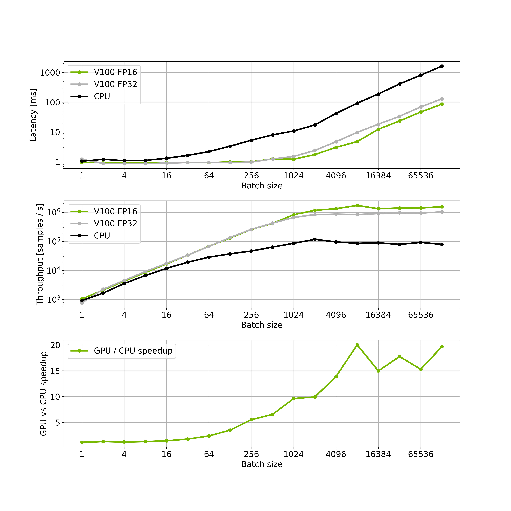
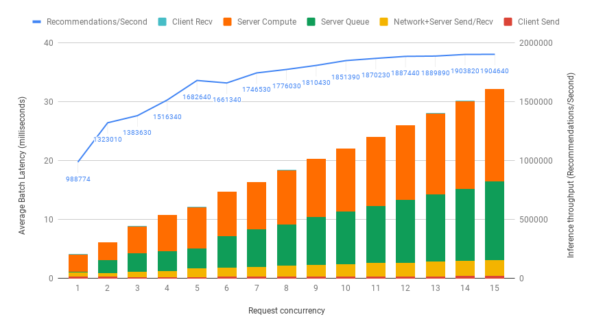

# Deploying the DLRM model using Triton Inference Server

The [NVIDIA Triton Inference Server](https://github.com/NVIDIA/trtis-inference-server) provides a datacenter and cloud inferencing solution optimized for NVIDIA GPUs. The server provides an inference service via an HTTP or gRPC endpoint, allowing remote clients to request inferencing for any number of GPU or CPU models being managed by the server. 

This folder contains instructions for deploment and exemplary client application to run inference on
Triton Inference Server as well as detailed performance analysis.

## Table Of Contents

- [Running Triton Inference Server and client](#running-triton-inference-server-and-client)
- [Latency vs Throughput](#throughputlatency-results)
- [Dynamic batching support](#dynamic-batching-support)

## Running Triton Inference Server and client

The very first step of deployment is to acquire trained checkpoint and model configuration for this
checkpoint. Default model configuration are stored inside `dlrm/config` directory.

### Inference container

Every command below is called from special inference container. To build that container go to main
repository folder and call

`docker build -t dlrm-inference . -f triton/Dockerfile`

This command will download dependencies and build inference container. Then run shell inside the
container:

`docker run -it --rm --gpus device=0 --shm-size=1g --ulimit memlock=-1 --ulimit stack=67108864 --net=host -v <PATH_TO_MODEL_REPOSITORY>:/repository dlrm-inference bash`

Here `device=0,1,2,3` selects GPUs indexed by ordinals `0,1,2` and `3`, respectively. The server will see only these GPUs. If you write `device=all`, then the server will see all the available GPUs. `PATH_TO_MODEL_REPOSITORY` indicates location where
deployed models were stored.

### Deploying the model

To deploy model into Triton compatible format, `deployer.py` script can by used. This script is
meant to be run from inside deployment docker container. 

```
usage: deployer.py [-h] (--ts-script | --ts-trace | --onnx) [--triton-no-cuda]
                   [--triton-model-name TRITON_MODEL_NAME]
                   [--triton-model-version TRITON_MODEL_VERSION]
                   [--triton-max-batch-size TRITON_MAX_BATCH_SIZE]
                   [--triton-dyn-batching-delay TRITON_DYN_BATCHING_DELAY]
                   [--triton-engine-count TRITON_ENGINE_COUNT]
                   [--save-dir SAVE_DIR]
                   ...

optional arguments:
  -h, --help            show this help message and exit
  --ts-script           convert to torchscript using torch.jit.script
  --ts-trace            convert to torchscript using torch.jit.trace
  --onnx                convert to onnx using torch.onnx.export

triton related flags:
  --triton-no-cuda      Use the CPU for tracing.
  --triton-model-name TRITON_MODEL_NAME
                        exports to appropriate directory structure for triton
  --triton-model-version TRITON_MODEL_VERSION
                        exports to appropriate directory structure for triton
  --triton-max-batch-size TRITON_MAX_BATCH_SIZE
                        Specifies the 'max_batch_size' in the triton model
                        config. See the triton documentation for more info.
  --triton-dyn-batching-delay TRITON_DYN_BATCHING_DELAY
                        Determines the dynamic_batching queue delay in
                        milliseconds(ms) for the triton model config. Use '0'
                        or '-1' to specify static batching. See the triton
                        documentation for more info.
  --triton-engine-count TRITON_ENGINE_COUNT
                        Specifies the 'instance_group' count value in the
                        triton model config. See the triton documentation for
                        more info.
  --save-dir SAVE_DIR   Saved model directory

other flags:
  model_arguments       arguments that will be ignored by deployer lib and
                        will be forwarded to your deployer script

```

Following model specific arguments have to be specified for model deployment:
  
```
  --num_numerical_features NUM_FEATURES
                        Number of numerical features at network input.
  --embedding_dim EMBEDDING_DIM
                        Embedding dimensionality.
  --top_mlp_sizes TOP_MLP_SIZES [TOP_MLP_SIZES ...]
                        Units in layers of top MLP (default: 1024 1024 512 256 1).
  --bottom_mlp_sizes BOTTOM_MLP_SIZES [BOTTOM_MLP_SIZES ...]
                        Units in layers of bottom MLP (default: 512 256 128).
  --interaction_op {cat,dot}
                        Interaction operator to use.
  --self_interaction
                        Enables self interaction.
  --hash_indices
                        Hash indices for categorical features.
  --dataset DATASET
                        Path to dataset directory contaning model_size.json file
                        describing input sizes for each embedding layer.
  --batch_size BATCH_SIZE
                        Internal dataloader batch size, usually it is the same as batch size
                        specified in --triton-max-batch_size flag.
  --fp16
                        Set a model for fp16 deployment.
  --dump_perf_data DIRECTORY_NAME
                        Dump binary performance data that can by loaded by perf client.
  --model_checkpoint MODEL_CHECKPOINT
                        Checkpoint file with trained model that is going to be deployed.
  --cpu                 Export cpu model instead of gpu.
```

For example, to deploy model into onnx format, using half precision and max batch size 4096 called
`dlrm-onnx-16` execute:

`python triton/deployer.py --onnx --triton-model-name dlrm-onnx-16 --triton-max-batch-size 4096 --save-dir /repository -- --model_checkpoint /results/checkpoint --fp16 --batch_size 4096 --num_numerical_features 13 --embedding_dim 128 --top_mlp_sizes 1024 1024 512 256 1 --bottom_mlp_sizes 512 256 128 --interaction_op dot --hash_indices --dataset /data`

Where `model_checkpoint` is a checkpoint for a trained model with the same configuration as used during export and dataset (or at least dataset configuration)
is mounted under `/data`

### Running the Triton server
**NOTE: This step is executed outside inference container**

1. `docker pull nvcr.io/nvidia/tritonserver:20.03-py3`
2. `docker run -d --rm --gpus device=0 --ipc=host --network=host [--cpuset-cpus=0-15] -p 8000:8000 -p 8001:8001 -p 8002:8002 -v <PATH_TO_MODEL_REPOSITORY>:/models nvcr.io/nvidia/tritonserver:20.03-py3 trtserver --model-store=/models --log-verbose=1 --model-control-mode=explicit`

Here `device=0,1,2,3` selects GPUs indexed by ordinals `0,1,2` and `3`, respectively. The server will see only these GPUs. If you write `device=all`, then the server will see all the available GPUs. `PATH_TO_MODEL_REPOSITORY` indicates location where
deployed models were stored. Additional `--model-controle-mode` option allows to manually load and
unload models. This is especially useful when dealing with numerous large models like DLRM.

For models exported to onnx format and hosted inside onnx runtime it might be required to limit visible cpu to fully utlize gpu acceleration. Use `--cpuset-cpus` docker option for that.

### Running client

Exemplary client `client.py` allows to check model performance against synthetic or real validation
data. Client connects to Triton server and perform inference. 

```
usage: client.py [-h] --triton-server-url TRITON_SERVER_URL
                 --triton-model-name TRITON_MODEL_NAME
                 [--triton-model-version TRITON_MODEL_VERSION]
                 [--protocol PROTOCOL] [-v] [-H HTTP_HEADER]
                 [--num_numerical_features NUM_NUMERICAL_FEATURES]
                 --dataset_config DATASET_CONFIG
                 [--inference_data INFERENCE_DATA] [--batch_size BATCH_SIZE]
                 [--fp16]

optional arguments:
  -h, --help            show this help message and exit
  --triton-server-url TRITON_SERVER_URL
                        URL adress of trtion server (with port)
  --triton-model-name TRITON_MODEL_NAME
                        Triton deployed model name
  --triton-model-version TRITON_MODEL_VERSION
                        Triton model version
  --protocol PROTOCOL   Communication protocol (HTTP/GRPC)
  -v, --verbose         Verbose mode.
  -H HTTP_HEADER        HTTP headers to add to inference server requests.
                        Format is -H"Header:Value".
  --num_numerical_features NUM_NUMERICAL_FEATURES
                        Number of numerical features as an input.
  --dataset_config DATASET_CONFIG
                        Configuration file describing categorical features
  --inference_data INFERENCE_DATA
                        Path to file with inference data.
  --batch_size BATCH_SIZE
                        Inference request batch size
  --fp16                Use 16bit for numerical input
```

To run inference on model exported in previous steps, using data located under
`/data/test_data.bin` execute:

`python triton/client.py --triton-server-url localhost:8000 --protocol HTTP --triton-model-name dlrm-onnx-16 --num_numerical_features 13 --dataset_config /data/model_size.json --inference_data /data/test_data.bin --batch_size 4096 --fp16`

or

`python triton/client.py --triton-server-url localhost:8001 --protocol GRPC --triton-model-name dlrm-onnx-16 --num_numerical_features 13 --dataset_config /data/model_size.json --inference_data /data/test_data.bin --batch_size 4096 --fp16`


### Gathering performance data
Performance data can be gathered using `perf_client` tool. To use this tool, performance data needs
to be dumped during deployment. To do that, use `--dump_perf_data` option for the deployer:

`python triton/deployer.py --onnx --triton-model-name dlrm-onnx-16 --triton-max-batch-size 4096 --save-dir /repository -- --model_checkpoint /results/checkpoint --fp16 --batch_size 4096 --num_numerical_features 13 --embedding_dim 128 --top_mlp_sizes 1024 1024 512 256 1 --bottom_mlp_sizes 512 256 128 --interaction_op dot --hash_indices --dataset /data --dump_perf_data /location/for/perfdata`

When perf data are dumped, `perf_client` can be used with following command:

`/workspace/install/bin/perf_client --max-threads 10 -m dlrm-onnx-16 -x 1 -p 5000 -v -i gRPC -u localhost:8001 -b 4096 -l 5000 --concurrency-range 1 --input-data /location/for/perfdata -f result.csv`

For more information about `perf_client` please refer to [official documentation](https://docs.nvidia.com/deeplearning/sdk/triton-inference-server-master-branch-guide/docs/optimization.html#perf-client).

## Throughput/Latency results

Throughput is measured in recommendations/second, and latency in milliseconds. 

**ONNX FP16 inference (V100-32G)**

| **Batch Size** | **Throughput** | **Avg Latency** | **95% Latency** | **99% Latency** |
|----------------|----------------|-----------------|-----------------|-----------------|
| 1	             | 432.4 rec/s    | 2.31 ms         | 2.42 ms         | 2.51 ms         |
| 8	             | 3214.4 rec/s   |	2.48 ms         |	2.64 ms         |	2.72 ms         |
| 64	           | 26924.8 rec/s  |	2.37 ms         | 2.50 ms	        | 2.57 ms         |
| 512	           | 190413 rec/s   |	2.68 ms         | 2.85 ms         | 2.94 ms         |
| 4096	         | 891290 rec/s   | 4.58 ms         |	4.82 ms         |	4.96 ms         |
| 32768	         | 1218970 rec/s  |	26.85 ms        |	27.43 ms        |	28.81 ms        |
| 65536	         | 1245180 rec/s  |	52.55	ms        | 53.46	ms        | 55.83 ms        |
| 131072	       | 1140330 rec/s  |	115.24 ms       |	117.56 ms       |	120.32 ms       |

**TorchScript FP16 inference (V100-32G)**

| **Batch Size** | **Throughput** | **Avg Latency** | **95% Latency** | **99% Latency** |
|----------------|----------------|-----------------|-----------------|-----------------|
| 1	             | 399.6 rec/s    |	2.50 ms         | 2.56 ms         | 2.70 ms         |
| 8	             | 3563.2 rec/s   |	2.24 ms         | 2.29 ms         | 2.42 ms         |
| 64             | 28288.2 rec/s  | 2.26 ms         | 2.33 ms         | 2.41 ms         |
| 512            | 220774 rec/s   | 2.31 ms         | 2.38 ms         | 2.44 ms         |
| 4096           | 1104280 rec/s  | 3.70 ms         | 3.78 ms         | 3.86 ms         |
| 32768          | 1428680 rec/s  | 22.97 ms        | 23.29 ms        | 24.05 ms        |
| 65536          | 1402470 rec/s  | 46.80 ms        | 48.12 ms        | 52.88 ms        |
| 131072         | 1546650 rec/s  | 85.27 ms        | 86.17 ms        | 87.05 ms        |

**TorchScript FP32 inference (V100-32G)**

| **Batch Size** | **Throughput** | **Avg Latency** | **95% Latency** | **99% Latency** |
|----------------|----------------|-----------------|-----------------|-----------------|
| 1              | 333.7 rec/s    | 2.99 ms         | 3.17 ms         | 3.32 ms         |
| 8              | 3092.8 rec/s   | 2.58 ms         | 2.79 ms         | 2.91 ms         |
| 64             | 24435.2 rec/s  | 2.61 ms         | 2.78 ms         | 2.89 ms         |
| 512            | 169216 rec/s   | 3.02 ms         | 3.14 ms         | 3.19 ms         |
| 4096           | 718438 rec/s   | 5.69 ms         | 5.93 ms         | 6.08 ms         |
| 32768          | 842138 rec/s   | 38.96 ms        | 39.68 ms        | 41.02 ms        |
| 65536          | 892138 rec/s   | 73.53 ms        | 74.56 ms        | 74.99 ms        |
| 131072         | 904397 rec/s   | 146.11 ms       | 149.88 ms       | 151.43 ms       |

**ONNX FP32 inference CPU (2x E5-2698 v4 @ 2.20GHz)**

| **Batch Size** | **Throughput** | **Avg Latency** | **95% Latency** | **99% Latency** |
|----------------|----------------|-----------------|-----------------|-----------------|
| 1              | 402.5 rec/s    | 2.48 ms         | 2.34 ms         | 3.16 ms         |
| 8              | 2316 rec/s     | 3.39 ms         | 2.89 ms         | 6.93 ms         |
| 64             | 9248 rec/s     | 6.91 ms         | 6.73 ms         | 13.14 ms        |
| 512            | 14643.3 rec/s  | 35.00 ms        | 42.77 ms        | 69.24 ms        |
| 4096           | 13926.4 rec/s  | 291.28 ms       | 321.90 ms       | 490.06 ms       |
| 32768          | 13107.2 rec/s  | 2387.24 ms      | 2395.80 ms      | 2395.80 ms      |
| 65536          | 14417.9 rec/s  | 5008.26 ms      | 5311.47 ms      | 5311.47 ms      |
| 131072         | 13107.2 rec/s  | 10033.19 ms     | 10416.43 ms     | 10416.43 ms     |

**TorchScript FP32 inference CPU (2x E5-2698 v4 @ 2.20GHz)**

| **Batch Size** | **Throughput** | **Avg Latency** | **95% Latency** | **99% Latency** |
|----------------|----------------|-----------------|-----------------|-----------------|
| 1              | 116.3 rec/s    | 8.60 ms         | 9.83 ms         | 14.60 ms        |
| 8              | 3723.2 rec/s   | 2.14 ms         | 2.55 ms         | 2.78 ms         |
| 64             | 3014.4 rec/s   | 21.22 ms        | 31.34 ms        | 41.28 ms        |
| 512            | 6451.2 rec/s   | 79.69 ms        | 106.00 ms       | 296.39 ms       |
| 4096           | 41984 rec/s    | 97.71 ms        | 118.70 ms       | 123.37 ms       |
| 32768          | 79735.5 rec/s  | 407.98 ms       | 426.64 ms       | 430.66 ms       |
| 65536          | 79021.8 rec/s  | 852.90 ms       | 902.39 ms       | 911.46 ms       |
| 131072         | 81264.6 rec/s  | 1601.28 ms      | 1694.64 ms      | 1711.57 ms      |



The plot above shows, that the GPU is saturated with batch size 4096. However, running inference with larger batches 
might be faster, than running several inference requests. Therefore, we choose 65536 as the optimal batch size. 


## Dynamic batching support
The Triton server has a dynamic batching mechanism built in, that can be enabled. When it is enabled, then the server creates 
inference batches from the received requests. Since the output of the model is a single probability, the batch size of a 
single request may be large. Here it is assumed to be 4096. With dynamic batching enabled, the server will concatenate requests of this size into 
an inference batch. The upper bound of the size of the inference batch is set to 65536. All these parameters are configurable. 
Performance results on a single V100-32G (ONNX FP16 model) for various numbers of simultaneous requests are shown in the figure below.



The plot above shows, that if we have a 20ms upper bound on latency, then a single GPU can handle up to 8 concurrent requests. 
This leads to total throughput of 1.776.030 recommendations/sec. This means 35520 recommendations within 20ms, on a single GPU. 