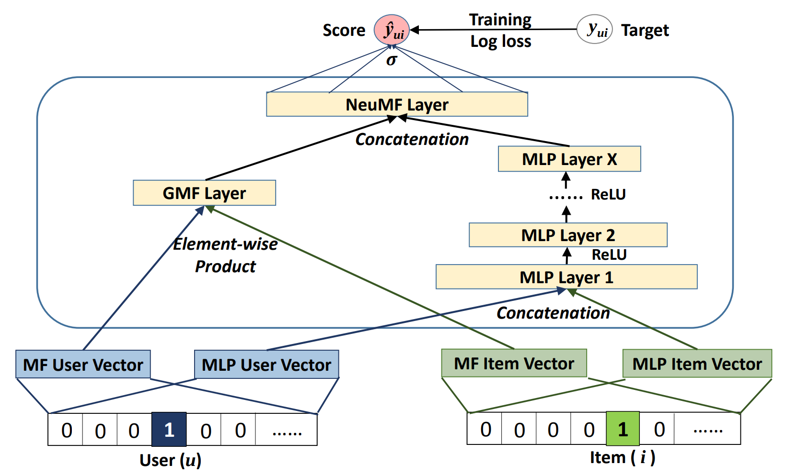
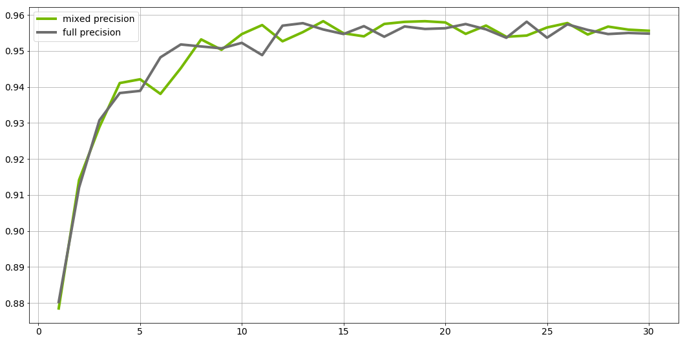
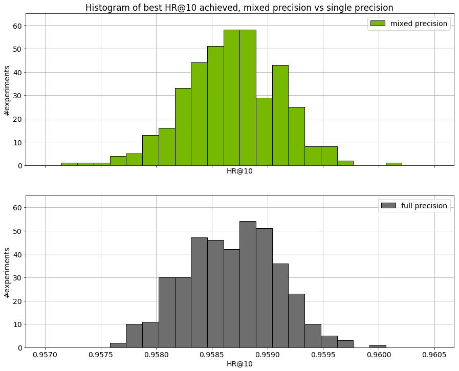

# Neural Collaborative Filtering (NCF) for PyTorch

This repository provides a script and recipe to train the Neural Collaborative Filtering (NCF)
model to achieve state of the art accuracy, and is tested and maintained by NVIDIA.

Table of Contents
=================

* [Model overview](#model-overview)
    * [Model architecture](#model-architecture)
    * [Default configuration](#default-configuration)
    * [Feature support matrix](#feature-support-matrix)
        * [Features](#features)
    * [Mixed precision training](#mixed-precision-training)
        * [Enabling mixed precision](#enabling-mixed-precision)
* [Setup](#setup)
    * [Requirements](#requirements)
* [Quick Start Guide](#quick-start-guide)
* [Advanced](#advanced)
    * [Scripts and sample code](#scripts-and-sample-code)
    * [Command-line options](#command-line-options)
    * [Getting the data](#getting-the-data)
        * [Dataset guidelines](#dataset-guidelines)
        * [Multi-dataset](#multi-dataset)
    * [ML-1m](#ml-1m)
    * [Training process](#training-process)
    * [Inference process](#inference-process)
* [Performance](#performance)
    * [Benchmarking](#benchmarking)
        * [Training performance benchmark](#training-performance-benchmark)
        * [Inference performance benchmark](#inference-performance-benchmark)
    * [Results](#results)
        * [Training accuracy results](#training-accuracy-results)
            * [NVIDIA DGX-1 (8x V100 16G)](#nvidia-dgx-1-8x-v100-16g)
            * [NVIDIA DGX-1 (8x V100 32G)](#nvidia-dgx-1-8x-v100-32g)
            * [NVIDIA DGX-2 (16x V100 32G)](#nvidia-dgx-2-16x-v100-32g)
            * [Training stability test](#training-stability-test)
        * [Training performance results](#training-performance-results)
            * [NVIDIA DGX-1 (8x V100 16G)](#nvidia-dgx-1-(8x-v100-16g))
            * [NVIDIA DGX-1 (8x V100 32G)](#nvidia-dgx-1-(8x-v100-32g))
            * [NVIDIA DGX-2 (16x V100 32G)](#nvidia-dgx-2-(16x-v100-32g))
        * [Inference performance results](#inference-performance-results)
            * [NVIDIA DGX-1 (8x V100 16G)](#nvidia-dgx-1-(8x-v100-16g))
            * [NVIDIA DGX-1 (8x V100 32G)](#nvidia-dgx-1-(8x-v100-32g))
            * [NVIDIA DGX-2 (16x V100 32G)](#nvidia-dgx-2-(16x-v100-32g))
* [Release notes](#release-notes)
    * [Changelog](#changelog)
    * [Known issues](#known-issues)
        * [Scaling beyond 8 GPUs](#scaling-beyond-8-gpus)
        * [Memory usage](#memory-usage)

## Model overview

The NCF model focuses on providing recommendations, also known as collaborative filtering; with implicit feedback. The training data for this model should contain binary information about whether a user interacted with a specific item.
NCF was first described by Xiangnan He, Lizi Liao, Hanwang Zhang, Liqiang Nie, Xia Hu and Tat-Seng Chua in the [Neural Collaborative Filtering paper](https://arxiv.org/abs/1708.05031).

The implementation in this repository focuses on the NeuMF instantiation of the NCF architecture.
We modified it to use dropout in the FullyConnected layers. This reduces overfitting and increases the final accuracy.
Training the other two instantiations of NCF (GMF and MLP) is not supported. 
 
Contrary to the original paper, we benchmark the model on the larger [ML-20m dataset](https://grouplens.org/datasets/movielens/20m/)
instead of using the smaller [ML-1m](https://grouplens.org/datasets/movielens/1m/) dataset as we think this is more realistic of production type environments.
However, using the ML-1m dataset is also supported.

This model is trained with mixed precision using Tensor Cores on NVIDIA Volta and Turing GPUs. Therefore, researchers can get results 2x faster than training without Tensor Cores, while experiencing the benefits of mixed precision training. Multi-GPU training is also supported. This model is tested against each NGC monthly container release to ensure consistent accuracy and performance over time.


### Model architecture

This model is based mainly on Embedding and FullyConnected layers. The control flow is divided into two branches:
* Multi Layer Perceptron (MLP) branch, which transforms the input through FullyConnected layers with ReLU activations and dropout.
* Matrix Factorization (MF) branch, which performs collaborative filtering factorization.
Each user and each item has two embedding vectors associated with it -- one for the MLP branch and the other for the MF branch.

The outputs from those branches are concatenated and fed to the final FullyConnected layer with sigmoid activation.
This can be interpreted as a probability of a user interacting with a given item.

<p align="center">
  
  <br>
Figure 1. The architecture of a Neural Collaborative Filtering model. Taken from the <a href="https://arxiv.org/abs/1708.05031">Neural Collaborative Filtering paper</a>.
</p>


### Default configuration

The following features were implemented in this model:
  * Automatic Mixed Precision (AMP)
  * Data-parallel multi-GPU training and evaluation 
  * Dropout
  * Gradient accumulation

The following performance optimizations were implemented in this model:
  * FusedAdam optimizer
  * Approximate train negative sampling
  * Caching all the positive training samples in the device memory


### Feature support matrix
The following features are supported by this model:

| **Feature** | **NCF PyTorch** | 
|:---:|:--------:|
| Automatic Mixed Precision (AMP) | Yes |
| Multi-GPU training with Distributed Data Parallel (DDP) | Yes |
| Fused Adam | Yes |

#### Features

* Automatic Mixed Precision - This implementation of NCF uses AMP to implement mixed precision training.
It allows us to use FP16 training with FP32 master weights by modifying just 3 lines of code. 
* Multi-GPU training with Distributed Data Parallel - uses Apex's DDP to implement efficient multi-GPU training with NCCL.
* Fused Adam - We use a special implementation of the Adam implementation provided by the Apex package. It fuses some operations for faster weight updates.
Since NCF is a relatively lightweight model with a large number of parameters, we’ve observed significant performance improvements from using FusedAdam.

## Mixed precision training

Mixed precision is the combined use of different numerical precisions in a computational method. [Mixed precision](https://arxiv.org/abs/1710.03740) training offers significant computational speedup by performing operations in half-precision format, while storing minimal information in single-precision to retain as much information as possible in critical parts of the network. Since the introduction of [tensor cores](https://developer.nvidia.com/tensor-cores) in the Volta and Turing architecture, significant training speedups are experienced by switching to mixed precision -- up to 3x overall speedup on the most arithmetically intense model architectures. Using mixed precision training requires two steps:
1.  Porting the model to use the FP16 data type where appropriate.
2.  Adding loss scaling to preserve small gradient values.

The ability to train deep learning networks with lower precision was introduced in the Pascal architecture and first supported in [CUDA 8](https://devblogs.nvidia.com/parallelforall/tag/fp16/) in the NVIDIA Deep Learning SDK.

For information about:
-   How to train using mixed precision, see the [Mixed Precision Training](https://arxiv.org/abs/1710.03740) paper and [Training With Mixed Precision](https://docs.nvidia.com/deeplearning/sdk/mixed-precision-training/index.html) documentation.
-   Techniques used for mixed precision training, see the [Mixed-Precision Training of Deep Neural Networks](https://devblogs.nvidia.com/mixed-precision-training-deep-neural-networks/) blog.
-   How to access and enable AMP for TensorFlow, see [Using TF-AMP](https://docs.nvidia.com/deeplearning/dgx/tensorflow-user-guide/index.html#tfamp) from the TensorFlow User Guide.
-   APEX tools for mixed precision training, see the [NVIDIA Apex: Tools for Easy Mixed-Precision Training in PyTorch](https://devblogs.nvidia.com/apex-pytorch-easy-mixed-precision-training/).


### Enabling mixed precision

Using the Automatic Mixed Precision (AMP) package requires two modifications in the source code.
The first one is to initialize the model and the optimizer using the `amp.initialize` function:
```python
model, optimizer = amp.initialize(model, optimizer, opt_level=args.opt_level,
                                          keep_batchnorm_fp32=False, loss_scale='dynamic')
```

The second one is to use the AMP's loss scaling context manager:
```python
with amp.scale_loss(loss, optimizer) as scaled_loss:
    scaled_loss.backward()
```

## Setup
The following section lists the requirements in order to start training the Neural Collaborative Filtering model.

### Requirements
This repository contains Dockerfile which extends the PyTorch NGC container and encapsulates some dependencies. 
Aside from these dependencies, ensure you have the following components:
NVIDIA Docker
PyTorch 19.05-py3 NGC container
NVIDIA Volta or Turing based GPU

For more information about how to get started with NGC containers, see the following sections from the NVIDIA GPU Cloud Documentation and the Deep Learning Documentation:
Getting Started Using NVIDIA GPU Cloud
Accessing And Pulling From The NGC Container Registry
Running PyTorch

For those unable to use the PyTorch NGC container, to set up the required environment or create your own container, see the versioned NVIDIA Container Support Matrix.  
  
## Quick Start Guide

1. Clone the repository.
```bash
git clone https://github.com/NVIDIA/DeepLearningExamples
cd DeepLearningExamples/TensorFlow/Segmentation/UNetIndustrial
```

2. Build an NCF PyTorch Docker container.

After Docker is setup, you can build the NCF image with:
```bash
docker build . -t nvidia_ncf
``` 

3. Start an interactive session in the NGC container to run preprocessing/training and inference.

The NCF PyTorch container can be launched with:
```bash
mkdir data
docker run --runtime=nvidia -it --rm --ipc=host  -v ${PWD}/data:/data nvidia_ncf bash
```

This will launch the container and mount the `./data` directory as a volume to the `./data` directory inside the container.
Any datasets and experiment results (logs, checkpoints etc.) saved to `./data` will be accessible
in the `./data` directory on the host. 

4. Download and preprocess the data.

Preprocessing consists of downloading the data, filtering out users that have less than 20 ratings (by default), sorting the data and dropping the duplicates. 
The preprocessed train and test data is then saved in PyTorch binary format to be loaded just before training.

Note: Preprocessing requires PyTorch and should therefore be run inside the Docker container.

No data augmentation techniques are used.

To download and preprocess the ML-20m dataset you can run:

```bash
./prepare_dataset.sh
```

Note: This command will return immediately without downloading anything if the data is already present in the `./data` directory.

This will store the preprocessed training and evaluation data in the `./data` directory so that it can be later
used to train the model (by passing the appropriate `--data` argument to the `ncf.py` script).

5. Start training.

After the Docker container is launched, the training with the default hyperparameters can be started with:

```bash
./prepare_dataset.sh
python -m torch.distributed.launch --nproc_per_node=8 --use_env ncf.py --data /data/cache/ml-20m
```

This will result in a checkpoint file being written to `/data/checkpoints/model.pth`.


6. Start validation/evaluation.

The trained model can be evaluated by passing the `--mode` test flag to the `run.sh` script:

```bash
python -m torch.distributed.launch --nproc_per_node=1 --use_env ncf.py --data /data/cache/ml-20m  --mode test --load_checkpoint_path /data/checkpoints/model.pth
```


## Advanced

The following sections provide greater details of the dataset, running training and inference, and the training results.

### Scripts and sample code

The `ncf.py` script contains most of the training and validation logic. Data loading and preprocessing code is located in `dataloading.py`.
The model architecture is defined in `neumf.py`. Some initial data preprocessing is located in `convert.py`.
The logger directory contains simple bookkeeping utilities for storing training results.

### Command-line options

To see the full list of available options and their descriptions, use the `-h` or `--help` command line option, for example: 
`python ncf.py --help`

The following example output is printed when running the sample:
```
usage: ncf.py [-h] [--data DATA] [-e EPOCHS] [-b BATCH_SIZE]
              [--valid_batch_size VALID_BATCH_SIZE] [-f FACTORS]
              [--layers LAYERS [LAYERS ...]] [-n NEGATIVE_SAMPLES]
              [-l LEARNING_RATE] [-k TOPK] [--seed SEED]
              [--threshold THRESHOLD]
              [--beta1 BETA1] [--beta2 BETA2] [--eps EPS] [--dropout DROPOUT]
              [--checkpoint_dir CHECKPOINT_DIR] [--mode {train,test}]
              [--grads_accumulated GRADS_ACCUMULATED] [--opt_level {O0,O2}]
              [--local_rank LOCAL_RANK]

Train a Neural Collaborative Filtering model:


optional arguments:
  -h, --help            show this help message and exit
  --data DATA           Path to test and training data files
  -e EPOCHS, --epochs EPOCHS
                        Number of epochs for training
  -b BATCH_SIZE, --batch_size BATCH_SIZE
                        Number of examples for each iteration
  --valid_batch_size VALID_BATCH_SIZE
                        Number of examples in each validation chunk
  -f FACTORS, --factors FACTORS
                        Number of predictive factors
  --layers LAYERS [LAYERS ...]
                        Sizes of hidden layers for MLP
  -n NEGATIVE_SAMPLES, --negative_samples NEGATIVE_SAMPLES
                        Number of negative examples per interaction
  -l LEARNING_RATE, --learning_rate LEARNING_RATE
                        Learning rate for optimizer
  -k TOPK, --topk TOPK  Rank for test examples to be considered a hit
  --seed SEED, -s SEED  Manually set random seed for torch
  --threshold THRESHOLD, -t THRESHOLD
                        Stop training early at threshold
  --beta1 BETA1, -b1 BETA1
                        Beta1 for Adam
  --beta2 BETA2, -b2 BETA2
                        Beta1 for Adam
  --eps EPS             Epsilon for Adam
  --dropout DROPOUT     Dropout probability, if equal to 0 will not use
                        dropout at all
  --checkpoint_dir CHECKPOINT_DIR
                        Path to the directory storing the checkpoint file
  --mode {train,test}   Passing "test" will only run a single evaluation,
                        otherwise full training will be performed
  --grads_accumulated GRADS_ACCUMULATED
                        Number of gradients to accumulate before performing an
                        optimization step
  --opt_level {O0,O2}   Optimization level for Automatic Mixed Precision
  --local_rank LOCAL_RANK
                        Necessary for multi-GPU training

```

### Getting the data

The NCF model was trained on the ML-20m dataset.
For each user, the interaction with the latest timestamp was included in the test set and the rest of the examples are used as the training data. 

This repository contains the `./prepare_dataset.sh` script which will automatically download and preprocess the training and validation datasets. 
By default, data will be downloaded to the `/data` directory. The preprocessed data will be placed in `/data/cache`.

#### Dataset guidelines

The required format of the data is a CSV file with three columns: `user_id`, `item_id` and `timestamp`. This CSV should contain only the positive examples,  in other words,
the ones for which an interaction between a user and an item occurred. The negatives will be sampled during the training and validation.

#### Multi-dataset 

This implementation is tuned for the ML-20m and ML-1m datasets.
Using other datasets might require tuning some hyperparameters (for example, learning rate, beta1 and beta2).

If you'd like to use your custom dataset you can do it by adding support for it in the `prepare_dataset.sh` and `download_dataset.sh` scripts.

The performance of the model depends on the dataset size.
Generally, the model should scale better for datasets containing more data points.
For a smaller dataset you might experience slower performance.


#### ML-1m

To download, preprocess and train on the ML-1m dataset run:
```bash
./prepare_dataset.sh ml-1m
python -m torch.distributed.launch --nproc_per_node=8 --use_env ncf.py --data /data/cache/ml-1m
```

### Training process
The name of the training script is `ncf.py`. Because of the multi-GPU support, it should always be run with the torch distributed launcher like this:
```bash
python -m torch.distributed.launch --nproc_per_node=<number_of_gpus> --use_env ncf.py --data <path_to_dataset> [other_parameters]
```

The main result of the training are checkpoints stored by default in `/data/checkpoints/`. This location can be controlled
by the `--checkpoint_dir` command-line argument.

The validation metric is Hit Rate at 10 (HR@10) with 100 test negative samples. This means that for each positive sample in 
the test set 100 negatives are sampled. All resulting 101 samples are then scored by the model. If the true positive sample is
among the 10 samples with highest scores we have a "hit" and the metric is equal to 1, otherwise it's equal to 0.
The HR@10 metric is the number of hits in the entire test set divided by the number of samples in the test set.  

### Inference process

Inference can be launched with the same script used for training by passing the `--mode test` flag:
```bash
python -m torch.distributed.launch --nproc_per_node=<number_of_gpus> --use_env ncf.py  --data <path_to_dataset> --mode test [other_parameters]
```

The script will then:
* Load the checkpoint from the directory specified by the `--checkpoint_dir` directory
* Run inference on the test dataset
* Compute and print the validation metric

## Performance

### Benchmarking

#### Training performance benchmark

NCF training on NVIDIA DGX systems is very fast, therefore, in order to measure train and validation throughput, you can simply run the full training job with: 
```bash
./prepare_dataset.sh
python -m torch.distributed.launch --nproc_per_node=8 --use_env ncf.py --data /data/cache/ml-20m --epochs 5
```

At the end of the script, a line reporting the best train throughput is printed.


#### Inference performance benchmark

Validation throughput can be measured by running the full training job with:
```bash
./prepare_dataset.sh
python -m torch.distributed.launch --nproc_per_node=8 --use_env ncf.py --data /data/cache/ml-20m --epochs 5
```

The best validation throughput is reported to the standard output. 

### Results

The following sections provide details on how we achieved our performance and accuracy in training and inference. 

#### Training accuracy results

##### NVIDIA DGX-1 (8x V100 16G)

Our results were obtained by following the steps in the Quick Start Guide in the PyTorch 19.05-py3 NGC container on NVIDIA DGX-1 with 8x V100 16G GPUs.

The following table lists the best hit rate at 10 for DGX-1 with 8 V100 16G GPUs. It also shows the average time to reach this HR@10 across 5 random seeds.
The training time was measured excluding data downloading, preprocessing, validation data generation and library initialization times.

| **GPUs**    | **Batch size / GPU** | **Accuracy - FP32**  | **Accuracy - mixed precision**  |   **Time to train - FP32 (s)** |  **Time to train - mixed precision (s)** | **Time to train speedup (FP32 to mixed precision)**  |     
|--------------------------:|-----------------------------:|--------------------------:|--------------------------:|-------------------------------:|-------------------------------:|------------------:|
|                         1 | 1,048,576                    |  0.95913                  |  0.95887                  |                         188.82 |                         100.37 |              1.88 |
|                         8 | 131,072                      |  0.95905                  |  0.95906                  |                          43.20 |                          26.68 |              1.62 |

To reproduce this result, start the NCF Docker container interactively and run:
```bash
./prepare_dataset.sh
python -m torch.distributed.launch --nproc_per_node=8 --use_env ncf.py --data /data/cache/ml-20m
```

##### NVIDIA DGX-1 (8x V100 32G)

Our results were obtained by following the steps in the Quick Start Guide in the PyTorch 19.05-py3 NGC container on NVIDIA DGX-1 with 8x V100 32G GPUs.

The following table lists the best hit rate at 10 for DGX-1 with 8 V100 16G GPUs. It also shows the average time to reach this HR@10 across 5 random seeds.
The training time was measured excluding data downloading, preprocessing, validation data generation and library initialization times.

| **GPUs**    | **Batch size / GPU** | **Accuracy - FP32**  | **Accuracy - mixed precision**  |   **Time to train - FP32 (s)** |  **Time to train - mixed precision (s)** | **Time to train speedup (FP32 to mixed precision)**  |     
|--------------------------:|-----------------------------:|--------------------------:|--------------------------:|-------------------------------:|-------------------------------:|------------------:|
|                         1 | 1,048,576                    |  0.95913                  |  0.95887                  |                         194.72 |                         106.03 |              1.84 |
|                         8 | 131,072                      |  0.95905                  |  0.95906                  |                          44.07 |                          27.86 |              1.58 |


Here's an example validation accuracy curve for mixed precision vs single precision on DGX-1 with 8 V100 32G GPUs:



To reproduce this result, start the NCF Docker container interactively and run:
```bash
./prepare_dataset.sh
python -m torch.distributed.launch --nproc_per_node=8 --use_env ncf.py --data /data/cache/ml-20m
```

##### NVIDIA DGX-2 (16x V100 32G)

Our results were obtained by following the steps in the Quick Start Guide in the PyTorch 19.05-py3 NGC container on NVIDIA DGX-1 with 8x V100 16G GPUs.

The following table lists the best hit rate at 10 for DGX-1 with 8 V100 16G GPUs. It also shows the average time to reach this HR@10 across 5 random seeds.
The training time was measured excluding data downloading, preprocessing, validation data generation and library initialization times.

| **GPUs**    | **Batch size / GPU** | **Accuracy - FP32**  | **Accuracy - mixed precision**  |   **Time to train - FP32 (s)** |  **Time to train - mixed precision (s)** | **Time to train speedup (FP32 to mixed precision)**  |     
|--------------------------:|-----------------------------:|--------------------------:|--------------------------:|-------------------------------:|-------------------------------:|------------------:|
|                         1 | 1,048,576                    |  0.95913                  |  0.95887                  |                         180.85 |                         100.33 |              1.80 |
|                         8 | 131,072                      |  0.95900                  |  0.95918                  |                          44.21 |                          29.68 |              1.49 |
|                        16 | 65,536                       |  0.95896                  |  0.95906                  |                          34.47 |                          26.52 |              1.30 |


To reproduce this result, start the NCF Docker container interactively and run:
```bash
./prepare_dataset.sh
python -m torch.distributed.launch --nproc_per_node=16 --use_env ncf.py --data /data/cache/ml-20m
```


##### Training stability test

The histogram below shows the best HR@10 achieved 
for 400 experiments using mixed precision and 400 experiments using single precision.
Mean HR@10 for mixed precision was equal to 0.95868 and for single precision it was equal to
0.95867.



#### Training performance results


##### NVIDIA DGX-1 (8x V100 16G)

Our results were obtained by following the steps in the Quick Start Guide in the PyTorch 19.05-py3 NGC container on NVIDIA DGX-1 with 8x V100 16G GPUs. 

The following table shows the best training throughput:

|   **GPUs**                |   **Batch Size / GPU**       | **Throughput - FP32 (samples / s)** |   **Throughput - Mixed precision (samples /s)** |   **Throughput Speedup (FP32 to Mixed precision)** |   **Strong Scaling - FP32** |   **Strong scaling - Mixed precision** |
|--------------------------:|-----------------------------:|----------------------------------:|----------------------------------:|------------------:|---------------------:|---------------------:|
|                         1 | 1,048,576                    | 10,536,076                        | 21,059,303                        |              2.00 |                 1.00 |                 1.00 |
|                         8 | 131,072                      | 58,286,313                        | 100,760,496                       |              1.73 |                 5.53 |                 4.78 |

##### NVIDIA DGX-1 (8x V100 32G)

Our results were obtained by following the steps in the Quick Start Guide in the PyTorch 19.05-py3 NGC container on NVIDIA DGX-1 with 8x V100 32G GPUs. 

The following table shows the best training throughput:
	
|   **GPUs**                |   **Batch Size / GPU**       | **Throughput - FP32 (samples / s)** |   **Throughput - Mixed precision (samples /s)** |   **Throughput Speedup (FP32 to Mixed precision)** |   **Strong Scaling - FP32** |   **Strong scaling - Mixed precision** |
|--------------------------:|-----------------------------:|----------------------------------:|----------------------------------:|------------------:|---------------------:|---------------------:|
|                         1 | 1,048,576                    | 10,230,464                        | 19,894,392                        |              1.94 |                 1.00 |                 1.00 |
|                         8 | 131,072                      | 57,043,196                        | 95,424,391                        |              1.67 |                 5.58 |                 4.80 |


##### NVIDIA DGX-2 (16x V100 32G)

Our results were obtained by following the steps in the Quick Start Guide in the PyTorch 19.05-py3 NGC container on NVIDIA DGX-2 with 16x V100 32G GPUs. 

The following table shows the best training throughput:
	
|   **GPUs**                |   **Batch Size / GPU**       | **Throughput - FP32 (samples / s)** |   **Throughput - Mixed precision (samples /s)** |   **Throughput Speedup (FP32 to Mixed precision)** |   **Strong Scaling - FP32** |   **Strong scaling - Mixed precision** |
|--------------------------:|:-----------------------------|:----------------------------------|:----------------------------------|------------------:|---------------------:|---------------------:|
|                         1 | 1,048,576                    | 10,941,690                        | 21,056,129                        |              1.92 |                 1.00 |                 1.00 |
|                         8 | 131,072                      | 60,247,209                        | 100,142,844                       |              1.66 |                 5.51 |                 4.76 |
|                        16 | 65,536                       | 84,287,736                        | 133,300,953                       |              1.58 |                 7.70 |                 6.33 |


#### Inference performance results


##### NVIDIA DGX-1 (8x V100 16G)

Our results were obtained by following the steps in the Quick Start Guide in the PyTorch 19.05-py3 NGC container on NVIDIA DGX-1 with 8x V100 16G GPUs.

The following table shows the best inference throughput:

| **Number of GPUs** | **Mixed precision (samples/sec)** | **Single precision (samples/sec)** | **Speed-up with mixed precision** | 
|:---:|:-------------:|:-----------:|:-----:|
| 1 | 57,163,273 | 28,877,257 | 1.98 |

##### NVIDIA DGX-1 (8x V100 32G)

Our results were obtained by following the steps in the Quick Start Guidein the PyTorch 19.05-py3 NGC container on NVIDIA DGX-1 with 8x V100 32G GPUs.

The following table shows the best inference throughput:

| **Number of GPUs** | **Mixed precision (samples/sec)** | **Single precision (samples/sec)** | **Speed-up with mixed precision** | 
|:---:|:-------------:|:-----------:|:-----:|
| 1 | 54,570,476 | 28,085,521 | 1.94 |


##### NVIDIA DGX-2 (16x V100 32G)

Our results were obtained by following the steps in the Quick Start Guide in the PyTorch 19.05-py3 NGC container on NVIDIA DGX-2 with 16x V100 32G GPUs.

The following table shows the best inference throughput:

| **Number of GPUs** | **Mixed precision (samples/sec)** | **Single precision (samples/sec)** | **Speed-up with mixed precision** | 
|:---:|:-------------:|:-----------:|:-----:|
| 1 | 58,383,216 | 30,018,043 | 1.94 |

## Release notes

### Changelog
1. January 22, 2018
    * Initial release
2. May, 2019
    * Lower memory consumption (down from about 18GB to 10GB for batch size 1M on a single NVIDIA Tesla V100). Achieved by using an approximate method for generating negatives for training.
    * Automatic Mixed Precision (AMP) with dynamic loss scaling instead of a custom mixed-precision optimizer.
    * Performance numbers for NVIDIA DGX-2.
    * Data loading code cleanup.
    * Default container updated to PyTorch 19.05-py3.
    * Updated README.md.
3. June, 2019
    * Updated performance tables.
    * Default container changed to PyTorch 19.06-py3.
    * Caching validation negatives between runs
4. September, 2019
    * Adjusting for API changes in PyTorch and APEX
    * Checkpoints loading fix
5. January, 2020
   * DLLogger support added

### Known issues
 
#### Scaling beyond 8 GPUs
Neural Collaborative Filtering is a relatively lightweight model that trains quickly with this relatively smaller dataset, ML-20m.
Because of that, the high ratio of communication to computation makes it difficult to 
efficiently use more than 8 GPUs. Typically, this is not an issue because when using 8
GPUs with FP16 precision, the training is sufficiently fast. However, if you’d like to
 scale the training to 16 GPUs and beyond, you might try modifying the model so that 
 the communication-computation ratio facilitates better scaling. This could be done, for example,
  by finding hyperparameters that enable using a larger batch size or by reducing the 
  number of trainable parameters.

#### Memory usage

In the default settings, the additional memory beyond 16G may not be fully utilized.
This is because we set the default batch size for ML-20m dataset to 1M,
which is too small to completely fill-up multiple 32G GPUs.
1M is the batch size for which we experienced the best convergence on the ML-20m dataset.
However, on other datasets, even faster performance can be possible by finding hyperparameters that work well for larger batches and leverage additional GPU memory.


