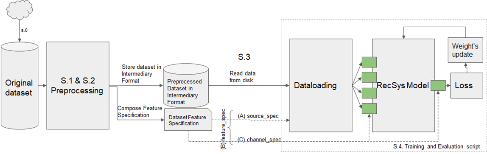
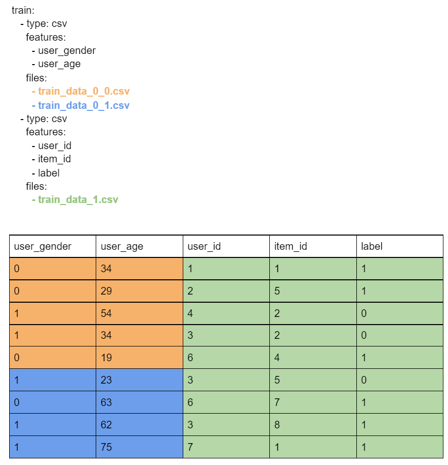
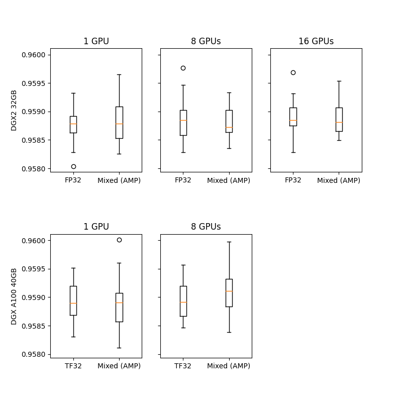
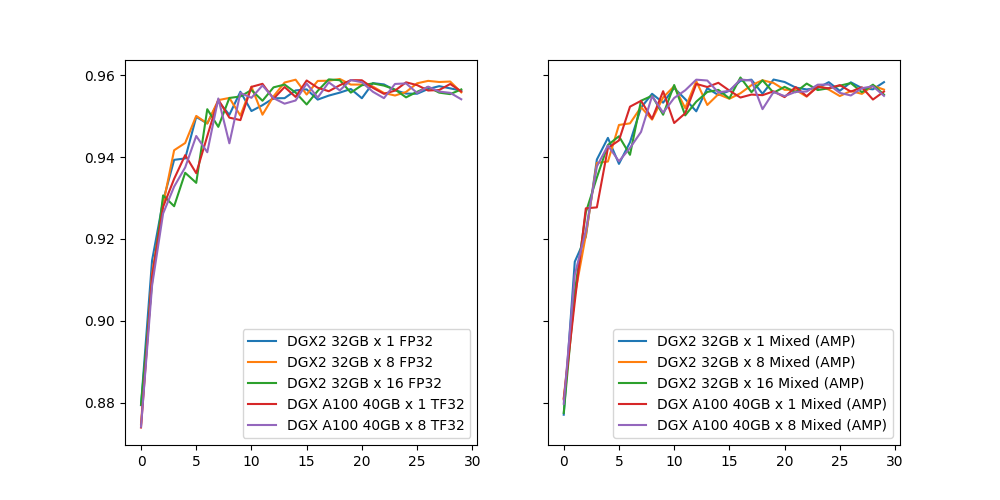

# Neural Collaborative Filtering (NCF) for PyTorch

This repository provides a script and recipe to train the Neural Collaborative Filtering (NCF)
model to achieve state-of-the-art accuracy. The content of this repository is tested and maintained by NVIDIA.

## Table Of Contents

- [Model overview](#model-overview)
    * [Model architecture](#model-architecture)
    * [Default configuration](#default-configuration)
    * [Feature support matrix](#feature-support-matrix)
        * [Features](#features)
    * [Mixed precision training](#mixed-precision-training)
        * [Enabling mixed precision](#enabling-mixed-precision)
        * [Enabling TF32](#enabling-tf32)
    * [BYO dataset functionality overview](#byo-dataset-functionality-overview)
        * [Dataset feature specification](#dataset-feature-specification)
        * [Data flow in NVIDIA Deep Learning Examples recommendation models](#data-flow-in-nvidia-deep-learning-examples-recommendation-models)
        * [Example of dataset feature specification](#example-of-dataset-feature-specification)
        * [BYO dataset functionality](#byo-dataset-functionality)
        * [Glossary](#glossary)
- [Setup](#setup)
    * [Requirements](#requirements)
- [Quick Start Guide](#quick-start-guide)
- [Advanced](#advanced)
    * [Scripts and sample code](#scripts-and-sample-code)
    * [Command-line options](#command-line-options)
    * [Getting the data](#getting-the-data)
        * [Dataset guidelines](#dataset-guidelines)
        * [BYO dataset](#byo-dataset)
        * [ML-1m](#ml-1m)
    * [Training process](#training-process)
    * [Inference process](#inference-process)
- [Performance](#performance)
    * [Benchmarking](#benchmarking)
        * [Training performance benchmark](#training-performance-benchmark)
        * [Inference performance benchmark](#inference-performance-benchmark)
    * [Results](#results)
        * [Training accuracy results](#training-accuracy-results)
            * [Training accuracy: NVIDIA DGX A100(8x A100 40GB)](#training-accuracy-nvidia-dgx-a1008x-a100-40gb)
            * [Training accuracy: NVIDIA DGX-1 (8x V100 16GB)](#training-accuracy-nvidia-dgx-1-8x-v100-16gb)
            * [Training accuracy: NVIDIA DGX-1 (8x V100 32GB)](#training-accuracy-nvidia-dgx-1-8x-v100-32gb)
            * [Training accuracy: NVIDIA DGX-2 (16x V100 32GB)](#training-accuracy-nvidia-dgx-2-16x-v100-32gb)
            * [Training stability test](#training-stability-test)
        * [Training performance results](#training-performance-results)
            * [Training performance: NVIDIA DGX A100 (8x A100 40GB)](#training-performance-nvidia-dgx-a100-8x-a100-40gb)
            * [Training performance: NVIDIA DGX-1 (8x V100 16GB)](#training-performance-nvidia-dgx-1-8x-v100-16gb)
            * [Training performance: NVIDIA DGX-1 (8x V100 32GB)](#training-performance-nvidia-dgx-1-8x-v100-32gb)
            * [Training performance: NVIDIA DGX-2 (16x V100 32GB)](#training-performance-nvidia-dgx-2-16x-v100-32gb)
        * [Inference performance results](#inference-performance-results)
            * [Inference performance: NVIDIA DGX A100 (1x A100 40GB)](#inference-performance-nvidia-dgx-a100-1x-a100-40gb)
            * [Inference performance: NVIDIA DGX-1 (1x V100 16GB)](#inference-performance-nvidia-dgx-1-1x-v100-16gb)
- [Release notes](#release-notes)
    * [Changelog](#changelog)
    * [Known issues](#known-issues)
        * [Scaling beyond 8 GPUs](#scaling-beyond-8-gpus)
        * [Memory usage](#memory-usage)


## Model overview

The NCF model focuses on providing recommendations, also known as collaborative filtering with implicit feedback. The training data for this model should contain binary information about whether a user interacted with a specific item.
NCF was first described by Xiangnan He, Lizi Liao, Hanwang Zhang, Liqiang Nie, Xia Hu and Tat-Seng Chua in the [Neural Collaborative Filtering paper](https://arxiv.org/abs/1708.05031).

The implementation in this repository focuses on the NeuMF instantiation of the NCF architecture.
We modified it to use dropout in the FullyConnected layers. This reduces overfitting and increases the final accuracy.
Training the other two instantiations of NCF (GMF and MLP) is not supported. 
 
Contrary to the original paper, we benchmark the model on the larger [ML-20m dataset](https://grouplens.org/datasets/movielens/20m/)
instead of using the smaller [ML-1m](https://grouplens.org/datasets/movielens/1m/) dataset because we think this is more realistic for production type environments.
However, using the ML-1m dataset is also supported.

This model is trained with mixed precision using Tensor Cores on Volta, Turing, and the NVIDIA Ampere GPU architectures.
Therefore, researchers can get results 2x faster than training without Tensor Cores while experiencing the benefits of mixed precision training.


### Model architecture

This model is based mainly on Embedding and FullyConnected layers. The control flow is divided into two branches:
* Multi Layer Perceptron (MLP) branch, which transforms the input through FullyConnected layers with ReLU activations, and dropout.
* Matrix Factorization (MF) branch, which performs collaborative filtering factorization.
Each user and each item has two embedding vectors associated with it -- one for the MLP branch and the other for the MF branch.

The outputs from those branches are concatenated and fed to the final FullyConnected layer with sigmoid activation.
This can be interpreted as a probability of a user interacting with a given item.

<p align="center">
  
  <br>
Figure 1. The architecture of a Neural Collaborative Filtering model. Taken from the <a href="https://arxiv.org/abs/1708.05031">Neural Collaborative Filtering paper</a>.
</p>


### Default configuration

The following features were implemented in this model:
  * Automatic Mixed Precision (AMP)
  * Data-parallel multi-GPU training and evaluation 
  * Dropout
  * Gradient accumulation

The following performance optimizations were implemented in this model:
  * FusedAdam optimizer
  * Approximate train negative sampling
  * Caching all the positive training samples in the device memory


### Feature support matrix
This model supports the following features:


| **Feature** | **NCF PyTorch** | 
|:---:|:--------:|
| Automatic Mixed Precision (AMP) | Yes |
| Multi-GPU training with Distributed Data Parallel (DDP) | Yes |
| Fused Adam | Yes |

#### Features

* Automatic Mixed Precision - This implementation of NCF uses AMP to implement mixed precision training.
It allows us to use FP16 training with FP32 master weights by modifying just three lines of code. 
* Multi-GPU training with Distributed Data Parallel - uses Apex's DDP to implement efficient multi-GPU training with NCCL.
* Fused Adam - We use a special implementation of the Adam implementation provided by the Apex package. It fuses some operations for faster weight updates.
Since NCF is a relatively lightweight model with a large number of parameters, we’ve observed significant performance improvements from using FusedAdam.

### Mixed precision training

Mixed precision is the combined use of different numerical precisions in a computational method. 
[Mixed precision](https://arxiv.org/abs/1710.03740) training offers significant computational speedup by performing 
operations in half-precision format while storing minimal information in single-precision to retain as much information
as possible in critical parts of the network. Since the introduction of 
[tensor cores](https://developer.nvidia.com/tensor-cores) in Volta, 
and following with both the Turing and Ampere architectures, significant training speedups are experienced by switching 
to mixed precision -- up to 3x overall speedup on the most arithmetically intense model architectures. 
Using [mixed precision training](https://docs.nvidia.com/deeplearning/performance/mixed-precision-training/index.html) 
previously required two steps:
1.  Porting the model to use the FP16 data type where appropriate.
2.  Adding loss scaling to preserve small gradient values.

The ability to train deep learning networks with lower precision was introduced in the Pascal architecture and first supported in [CUDA 8](https://devblogs.nvidia.com/parallelforall/tag/fp16/) in the NVIDIA Deep Learning SDK.

For information about:
-   How to train using mixed precision, refer to the [Mixed Precision Training](https://arxiv.org/abs/1710.03740) paper and [Training With Mixed Precision](https://docs.nvidia.com/deeplearning/sdk/mixed-precision-training/index.html) documentation.
-   Techniques used for mixed precision training, refer to the [Mixed-Precision Training of Deep Neural Networks](https://devblogs.nvidia.com/mixed-precision-training-deep-neural-networks/) blog.


#### Enabling mixed precision

Mixed precision training is turned off by default. To turn it on issue the `--amp` flag to the `main.py` script.

#### Enabling TF32

TensorFloat-32 (TF32) is the new math mode in [NVIDIA A100](https://www.nvidia.com/en-us/data-center/a100/) GPUs for 
handling the matrix math, also called tensor operations. TF32 running on Tensor Cores in A100 GPUs can provide up to 10x 
speedups compared to single-precision floating-point math (FP32) on Volta GPUs. 

TF32 Tensor Cores can speed up networks using FP32, typically with no loss of accuracy. It is more robust than FP16 for 
models which require a high dynamic range for weights or activations.

For more information, refer to the [TensorFloat-32 in the A100 GPU Accelerates AI Training, HPC up to 20x](https://blogs.nvidia.com/blog/2020/05/14/tensorfloat-32-precision-format/) blog post.

TF32 is supported in the NVIDIA Ampere GPU architecture and is enabled by default.

### BYO dataset functionality overview

This section describes how you can train the DeepLearningExamples RecSys models on your own datasets without changing the model or data loader and with similar performance to the one published in each repository.
This can be achieved thanks to Dataset Feature Specification, which describes how the dataset, data loader and model interact with each other during training, inference and evaluation.
Dataset Feature Specification has a consistent format across all recommendation models in NVIDIA’s DeepLearningExamples repository, regardless of dataset file type and the data loader,  giving you the flexibility to train RecSys models on your own datasets.

- [Dataset Feature Specification](#dataset-feature-specification)
- [Data Flow in Recommendation Models in DeepLearning examples](#data-flow-in-recommendation-models-in-deeplearning-examples)
- [Example of Dataset Feature Specification](#example-of-dataset-feature-specification)
- [BYO dataset functionality](#byo-dataset-functionality)
- [Glossary](#glossary)

#### Dataset feature specification

Data flow can be described abstractly:
Input data consists of a list of rows. Each row has the same number of columns; each column represents a feature.
The columns are retrieved from the input files, loaded, aggregated into channels and supplied to the model/training script. 

FeatureSpec contains metadata to configure this process and can be divided into three parts:

* Specification of how data is organized on disk (source_spec). It describes which feature (from feature_spec) is stored in which file and how files are organized on disk.

* Specification of features (feature_spec). Describes a dictionary of features, where key is feature name and values are features’ characteristics such as  dtype and other metadata (for example, cardinalities for categorical features)

* Specification of model’s inputs and outputs (channel_spec). Describes a dictionary of model’s inputs where keys specify model channel’s names and values specify lists of features to be loaded into that channel. Model’s channels are groups of data streams to which common model logic is applied, for example categorical/continuous data, user/item ids. Required/available channels depend on the model


The FeatureSpec is a common form of description regardless of underlying dataset format, dataset data loader form and model. 


#### Data flow in NVIDIA Deep Learning Examples recommendation models

The typical data flow is as follows:
* <b>S.0.</b> Original dataset is downloaded to a specific folder.
* <b>S.1.</b> Original dataset is preprocessed into Intermediary Format. For each model, the preprocessing is done differently, using different tools. The Intermediary Format also varies (for example, for NCF implementation in the PyTorch model, the Intermediary Format is Pytorch tensors in *.pt files.)
* <b>S.2.</b> The Preprocessing Step outputs Intermediary Format with dataset split into training and validation/testing parts along with the Dataset Feature Specification yaml file. Metadata in the preprocessing step is automatically calculated.
* <b>S.3.</b> Intermediary Format data together with Dataset Feature Specification are fed into training/evaluation scripts. Data loader reads Intermediary Format and feeds the data into the model according to the description in the Dataset Feature Specification.
* <b>S.4.</b> The model is trained and evaluated


<p align="center">
  
  <br>

Fig.1. Data flow in Recommender models in NVIDIA Deep Learning Examples repository. Channels of the model are drawn in green</a>.
</p>


#### Example of dataset feature specification

As an example, let’s consider a Dataset Feature Specification for a small CSV dataset.

```yaml
feature_spec:
  user_gender:
    dtype: torch.int8
    cardinality: 3 #M,F,Other
  user_age: #treated as numeric value
    dtype: torch.int8
  user_id:
    dtype: torch.int32
    cardinality: 2655
  item_id:
    dtype: torch.int32
    cardinality: 856
  label:
    dtype: torch.float32

source_spec:
  train:
    - type: csv
      features:
        - user_gender
        - user_age
      files:
        - train_data_0_0.csv
        - train_data_0_1.csv
    - type: csv
      features:
        - user_id
        - item_id
        - label
      files:
        - train_data_1.csv
  test:
    - type: csv
      features:
        - user_id
        - item_id
        - label
        - user_gender
        - user_age
        
      files:
        - test_data.csv

channel_spec:
  numeric_inputs: 
    - user_age
  categorical_user_inputs: 
    - user_gender
    - user_id
  categorical_item_inputs: 
    - item_id
  label_ch: 
    - label
```


The data contains five features: (user_gender, user_age, user_id, item_id, label). Their data types and necessary metadata are described in the feature specification section.

In the source mapping section, two mappings are provided: one describes the layout of the training data, the other of the testing data. The layout for training data has been chosen arbitrarily to showcase the flexibility.
The train mapping consists of two chunks. The first one contains user_gender and user_age, saved as a CSV, and is further broken down into two files. For specifics of the layout, refer to the following example and consult the glossary. The second chunk contains the remaining columns and is saved in a single file. Notice that the order of columns is different in the second chunk - this is alright, as long as the order matches the order in that file (that is, columns in the .csv are also switched)


Let’s break down the train source mapping. The table contains example data color-paired to the files containing it.

<p align="center">

</p>


The channel spec describes how the data will be consumed. Four streams will be produced and available to the script/model. The feature specification does not specify what happens further: names of these streams are only lookup constants defined by the model/script.
Based on this example, we can speculate that the model has three  input channels: numeric_inputs, categorical_user_inputs, categorical_item_inputs, and one  output channel: label.
Feature names are internal to the FeatureSpec and can be freely modified.


#### BYO dataset functionality

In order to train any Recommendation model in NVIDIA Deep Learning Examples one can follow one of three possible ways:
* One delivers already preprocessed dataset in the Intermediary Format supported by data loader used by the training script (different models use different data loaders) together with FeatureSpec yaml file describing at least specification of dataset, features and model channels

* One uses a transcoding script

* One delivers dataset in non-preprocessed form and uses preprocessing scripts that are a part of the model repository. In order to use already existing preprocessing scripts, the format of the dataset needs to match the one of the original datasets. This way, the FeatureSpec file will be generated automatically, but the user will have the same preprocessing as in the original model repository.

#### Glossary

The Dataset Feature Specification consists of three mandatory and one optional section:

<b>feature_spec </b> provides a base of features that may be referenced in other sections, along with their metadata.
	Format: dictionary (feature name) => (metadata name => metadata value)<br>

<b>source_spec </b> provides information necessary to extract features from the files that store them. 
	Format: dictionary (mapping name) => (list of chunks)<br>

* <i>Mappings</i> are used to represent different versions of the dataset (think: train/validation/test, k-fold splits). A mapping is a list of chunks.<br>
* <i>Chunks</i> are subsets of features that are grouped together for saving. For example, some formats may constrain data saved in one file to a single data type. In that case, each data type would correspond to at least one chunk. Another example where this might be used is to reduce file size and enable more parallel loading. Chunk description is a dictionary of three keys:<br>
  * <i>type</i> provides information about the format in which the data is stored. Not all formats are supported by all models.<br>
  * <i>features</i> is a list of features that are saved in a given chunk. Order of this list may matter: for some formats, it is crucial for assigning read data to the proper feature.<br>
  * <i>files</i> is a list of paths to files where the data is saved. For Feature Specification in yaml format, these paths are assumed to be relative to the yaml file’s directory (basename). <u>Order of this list matters:</u> It is assumed that rows 1 to i appear in the first file, rows i+1 to j in the next one, etc. <br>

<b>channel_spec</b> determines how features are used. It is a mapping (channel name) => (list of feature names). 

Channels are model specific magic constants. In general, data within a channel is processed using the same logic. Example channels: model output (labels), categorical ids, numerical inputs, user data, and item data.

<b>metadata</b> is a catch-all, wildcard section: If there is some information about the saved dataset that does not fit into the other sections, you can store it here.

## Setup
The following section lists the requirements in order to start training the Neural Collaborative Filtering model.

### Requirements
This repository contains a Dockerfile that extends the PyTorch NGC container and encapsulates some dependencies. 
Aside from these dependencies, ensure you have the following components:

- [NVIDIA Docker](https://github.com/NVIDIA/nvidia-docker)
- PyTorch 21.04-py3+ NGC container
-   Supported GPUs:
    - [NVIDIA Volta architecture](https://www.nvidia.com/en-us/data-center/volta-gpu-architecture/)
    - [NVIDIA Turing architecture](https://www.nvidia.com/en-us/design-visualization/technologies/turing-architecture/)
    - [NVIDIA Ampere architecture](https://www.nvidia.com/en-us/data-center/nvidia-ampere-gpu-architecture/)


For more information about how to get started with NGC containers, refer to the following sections from the NVIDIA GPU Cloud Documentation and the Deep Learning Documentation:
-   [Getting Started Using NVIDIA GPU Cloud](https://docs.nvidia.com/ngc/ngc-getting-started-guide/index.html)
-   [Accessing And Pulling From The NGC Container Registry](https://docs.nvidia.com/deeplearning/frameworks/user-guide/index.html#accessing_registry)

Running PyTorch

For those unable to use the PyTorch NGC container, to set up the required environment or create your own container, refer to the versioned [NVIDIA Container Support Matrix](https://docs.nvidia.com/deeplearning/frameworks/support-matrix/index.html).  
  
## Quick Start Guide

To train your model using mixed or TF32 precision with Tensor Cores or using FP32, perform the following steps using the default parameters of the NCF model on the ML-20m dataset. For the specifics concerning training and inference, refer to the [Advanced](#advanced) section.

1. Clone the repository.
```bash
git clone https://github.com/NVIDIA/DeepLearningExamples
cd DeepLearningExamples/PyTorch/Recommendation/NCF
```

2. Build an NCF PyTorch Docker container.

After Docker is set up, you can build the NCF image with:
```bash
docker build . -t nvidia_ncf
``` 

3. Start an interactive session in the NGC container to run preprocessing/training and inference.

The NCF PyTorch container can be launched with:
```bash
docker run --runtime=nvidia -it --rm --ipc=host  -v ${PWD}/data:/data nvidia_ncf bash
```

This will launch the container and mount the `./data` directory as a volume to the `/data` directory inside the container.
Any datasets and experiment results (logs, checkpoints etc.) saved to `/data` will be accessible
in the `./data` directory on the host. 

4. Download and preprocess the data.

Download the data from https://grouplens.org/datasets/movielens/20m/ and put it in `/data/ml-20m/ml-20m.zip`.

Preprocessing consists of sorting the data, dropping the duplicates, renumbering users and items,
selecting last interaction of each user to include in the test set,
then randomly generating negative test set members (scoring candidates).
The preprocessed train and test data is then saved in PyTorch binary format to be loaded just before training.

Note: Preprocessing requires PyTorch and should therefore be run inside the Docker container.

To preprocess the ML-20m dataset, you can run:

```bash
./prepare_dataset.sh
```

Note: This command will return immediately without downloading anything if the data is already present in the `/data` directory.

This will store the preprocessed training and evaluation data in the `/data` directory so that it can be later
used to train the model (by passing the appropriate `--data` argument to the `ncf.py` script).

5. Start training.

After the Docker container is launched, the training with the default hyperparameters (suitable for a DGX-1V or DGX A100 with 8 GPUs) can be started with:

```bash
python -m torch.distributed.launch --nproc_per_node=8 --use_env ncf.py --data /data/cache/ml-20m  --checkpoint_dir /data/checkpoints/
```

This will result in a checkpoint file being written to `/data/checkpoints/model.pth`.


6. Start validation/evaluation.

The trained model can be evaluated by passing the `--mode` test flag to the `run.sh` script:

```bash
python -m torch.distributed.launch --nproc_per_node=1 --use_env ncf.py --data /data/cache/ml-20m  --mode test --load_checkpoint_path /data/checkpoints/model.pth
```


## Advanced

The following sections provide greater details of the dataset, running training and inference, and the training results.

### Scripts and sample code

The `ncf.py` script contains most of the training and validation logic. Data loading and preprocessing code is located in `dataloading.py`.
The model architecture is defined in `neumf.py`. Some initial data preprocessing is located in `convert.py`.
The logger directory contains simple bookkeeping utilities for storing training results.
The `transcode.py` script enables transcoding data from a CSV containing preprocessed data to a format accessible by the model.

### Command-line options

To view the full list of available options and their descriptions, use the `-h` or `--help` command-line option, for example: 
`python ncf.py --help`

The following example output is printed when running the sample:
```
usage: ncf.py [-h] [--data DATA] [--feature_spec_file FEATURE_SPEC_FILE] [-e EPOCHS] [-b BATCH_SIZE] [--valid_batch_size VALID_BATCH_SIZE] [-f FACTORS]
              [--layers LAYERS [LAYERS ...]] [-n NEGATIVE_SAMPLES] [-l LEARNING_RATE] [-k TOPK] [--seed SEED] [--threshold THRESHOLD] [--beta1 BETA1] [--beta2 BETA2]
              [--eps EPS] [--dropout DROPOUT] [--checkpoint_dir CHECKPOINT_DIR] [--load_checkpoint_path LOAD_CHECKPOINT_PATH] [--mode {train,test}]
              [--grads_accumulated GRADS_ACCUMULATED] [--amp] [--log_path LOG_PATH]

Train a Neural Collaborative Filtering model

optional arguments:
  -h, --help            show this help message and exit
  --data DATA           Path to the directory containing the feature specification yaml
  --feature_spec_file FEATURE_SPEC_FILE
                        Name of the feature specification file or path relative to the data directory.
  -e EPOCHS, --epochs EPOCHS
                        Number of epochs for training
  -b BATCH_SIZE, --batch_size BATCH_SIZE
                        Number of examples for each iteration. This will be divided by the number of devices
  --valid_batch_size VALID_BATCH_SIZE
                        Number of examples in each validation chunk. This will be the maximum size of a batch on each device.
  -f FACTORS, --factors FACTORS
                        Number of predictive factors
  --layers LAYERS [LAYERS ...]
                        Sizes of hidden layers for MLP
  -n NEGATIVE_SAMPLES, --negative_samples NEGATIVE_SAMPLES
                        Number of negative examples per interaction
  -l LEARNING_RATE, --learning_rate LEARNING_RATE
                        Learning rate for optimizer
  -k TOPK, --topk TOPK  Rank for test examples to be considered a hit
  --seed SEED, -s SEED  Manually set random seed for torch
  --threshold THRESHOLD, -t THRESHOLD
                        Stop training early at threshold
  --beta1 BETA1, -b1 BETA1
                        Beta1 for Adam
  --beta2 BETA2, -b2 BETA2
                        Beta1 for Adam
  --eps EPS             Epsilon for Adam
  --dropout DROPOUT     Dropout probability, if equal to 0 will not use dropout at all
  --checkpoint_dir CHECKPOINT_DIR
                        Path to the directory storing the checkpoint file, passing an empty path disables checkpoint saving
  --load_checkpoint_path LOAD_CHECKPOINT_PATH
                        Path to the checkpoint file to be loaded before training/evaluation
  --mode {train,test}   Passing "test" will only run a single evaluation; otherwise, full training will be performed
  --grads_accumulated GRADS_ACCUMULATED
                        Number of gradients to accumulate before performing an optimization step
  --amp                 Enable mixed precision training
  --log_path LOG_PATH   Path for the JSON training log

```


### Getting the data

The NCF model was trained on the ML-20m dataset.
For each user, the interaction with the latest timestamp was included in the test set, and the rest of the examples are used as the training data. 

This repository contains the `./prepare_dataset.sh` script that automatically preprocess the training and validation datasets. 
By default, the preprocessed data will be placed in `/data/cache`.

#### Dataset guidelines

NCF supports all datasets that include a Feature Specification file and are properly formatted.
For details, refer to the [BYO dataset](#byo-dataset) section.

#### ML-1m

To preprocess and train on the ML-1m dataset run:
```bash
./prepare_dataset.sh ml-1m
python -m torch.distributed.launch --nproc_per_node=8 --use_env ncf.py --data /data/cache/ml-1m
```

### BYO dataset 

This implementation supports using other datasets thanks to BYO dataset functionality. 
The BYO dataset functionality allows users to plug in their dataset in a common fashion for all Recommender models 
that support this functionality. Using BYO dataset functionality, the user does not have to modify the source code of 
the model thanks to the Feature Specification file. For general information on how BYO dataset works, refer to the 
[BYO dataset overview section](#byo-dataset-functionality-overview).

There are three ways to plug in user's dataset:
<details>
<summary><b>1. Provide an unprocessed dataset in a format matching the one used by ml-20m, then use ml-20m's preprocessing. Feature Specification file is then generated automatically.</b></summary>
The required format of the user's dataset is:

* CSV file with three columns: `user_id`, `item_id` and `timestamp`
* This CSV should contain only the positive examples. The negatives will be sampled during the training and validation.


The correct torch.tensor dataset files together with the Feature Specification yaml file will be generated automatically by preprocessing script.

The following example shows how to use this way of plugging a user's dataset:

Build the NCF image with:
```bash
docker build . -t nvidia_ncf
```
Launch the container with:
```bash
docker run --runtime=nvidia -it --rm --ipc=host  -v ${PWD}/data:/data nvidia_ncf bash
```

Inside the container run:
```bash
./prepare_dataset.sh like_movielens
```
This will preprocess the `data/like_movielens/ratings.csv` file and save the output in `data/cache/like_movielens`

To run the training on 1 GPU:
```bash
python -m torch.distributed.launch --nproc_per_node=1 --use_env ncf.py --data /data/cache/like_movielens
```

To run the training on 8 GPUs
```bash
python -m torch.distributed.launch --nproc_per_node=8 --use_env ncf.py --data /data/cache/like_movielens
```

One can also add direct support for your dataset in the `prepare_dataset.sh` and `load.py` scripts.
</details>

<details>
<summary><b>2. Provide a CSV containing preprocessed data and a simplified Feature Specification yaml file, then transcode the data with `transcode.py` script </b> </summary>
This option should be used if the user has their own CSV file with a preprocessed dataset they want to train on.

The required format of the user's dataset is:
* CSV files containing the data, already split into train and test sets. 
* Feature Specification yaml file describing the layout of the CSV data

For an example of a feature specification file and properly formatted CSVs, refer to the `data/csv_conversion` folder.

The CSV containing the data:
* should be already split into train and test
* should contain no header
* should contain one column per feature, in the order specified by the feature specification file
* `user_id` and `item_id` should be all non-negative integers of range (0,num_users), (0,num_items) respectively
* negative examples for the testing set should already be present
* negative examples for the training set may be already present. By default, the training script samples additional random negative examples (controlled by the '--negative_samples' flag supplied to the `ncf.py` script).
 
The Feature Specification yaml file:
* needs to describe the layout of data in CSV files
* should contain information about user, item cardinalities. However, if set to `auto`, they will be inferred from the data by the transcoding script.

Refer to `data/csv_conversion/feature_spec.yaml` for an example of the yaml Feature Specification.

The following example shows how to use this way of plugging user's dataset:


Build the NCF image with:
```bash
docker build . -t nvidia_ncf
```
Launch the container with:
```bash
docker run --runtime=nvidia -it --rm --ipc=host  -v ${PWD}/data:/data nvidia_ncf bash
```

Inside the container run:
```bash
mkdir /data/conversion_output
python transcode.py --path /data/csv_conversion --output /data/conversion_output
```

This will convert the data from `data/csv_conversion` and save the output in `data/conversion_output`.
Refer to `data/csv_conversion/feature_spec.yaml` for an example of the yaml Feature Specification.

To run the training on 1 GPU:
```bash
python -m torch.distributed.launch --nproc_per_node=1 --use_env ncf.py --data /data/conversion_output -k 3
```

To run the training on 8 GPUs
```bash
python -m torch.distributed.launch --nproc_per_node=8 --use_env ncf.py --data /data/conversion_output -k 3
```

The parameter `k` changes the computed metric from HR@10 to HR@3. This is done because the examples are extremely small,
and hit rate depth may not be longer than lists of candidates.
</details>
<details>
<summary><b>3. Provide a fully preprocessed dataset, saved in torch.tensor files, and a Feature Specification yaml file</b></summary>
This is the option to choose if you want full control over preprocessing and/or want to preprocess data directly to the target format.

Your final output will need to contain a Feature Specification yaml describing data and file layout. For an example feature specification file, refer to `data/ml-20m/feature_spec_template.yaml`

For details, refer to the [BYO dataset overview section](#byo-dataset-functionality-overview).
</details>


#### Channel definitions and requirements for NCF-PyT feature specifications.

This model defines three channels, each accepting a single feature:

- user_ch
- item_ch
- label_ch

The training script expects two mappings:

- train
- test

As this NeuMF implementation computes list ranking metrics, the testing set actually consists of lists of candidates.
Usually, all entries in a list share the same user id, although this is not mandatory.
All entries from a given list must appear consecutively in the testing set.
List boundaries are not marked in the testing set.
All lists must have the same length. This length must be set by the metadata:test_samples_per_series parameter in the Feature Specification yaml file.


#### BYO dataset constraints for the model

There are the following constraints of BYO dataset functionality for this model:
1. The performance of the model depends on the dataset size. Generally, the model should scale better for datasets containing more data points. For a smaller dataset, you might experience slower performance than the one reported for ml-20m
2. As this implementation keeps the training and testing data in GPU VRAM, supported dataset size is limited by the GPU VRAM size.
3. Using other datasets might require tuning some hyperparameters (for example, learning rate, beta1 and beta2) to reach desired accuracy.
4. The transcoding script uses pandas, and the user's dataset needs to fit into the system memory


### Training process
The name of the training script is `ncf.py`. Because of the multi-GPU support, it should always be run with the torch distributed launcher like this:
```bash
python -m torch.distributed.launch --nproc_per_node=<number_of_gpus> --use_env ncf.py --data <path_to_dataset> [other_parameters]
```

The main result of the training are checkpoints stored by default in `/data/checkpoints/`. This location can be controlled
by the `--checkpoint_dir` command-line argument.

The validation metric is Hit Rate at 10 (HR@10) with 100 test negative samples. This means that for each positive sample in 
the test set, 100 negatives are sampled. All resulting 101 samples are then scored by the model. If the true positive sample is
among the 10 samples with the highest scores we have a "hit," and the metric is equal to 1; otherwise, it's equal to 0.
The HR@10 metric is the number of hits in the entire test set divided by the number of samples in the test set.  

### Inference process

Inference can be launched with the same script used for training by passing the `--mode test` flag:
```bash
python -m torch.distributed.launch --nproc_per_node=<number_of_gpus> --use_env ncf.py  --data <path_to_dataset> --mode test [other_parameters]
```

The script will then:
* Load the checkpoint from the directory specified by the `--checkpoint_dir` directory
* Run inference on the test dataset
* Compute and print the validation metric

## Performance

The performance measurements in this document were conducted at the time of publication and may not reflect the performance achieved from NVIDIA’s latest software release. For the most up-to-date performance measurements, go to [NVIDIA Data Center Deep Learning Product Performance](https://developer.nvidia.com/deep-learning-performance-training-inference).

### Benchmarking

#### Training performance benchmark

NCF training on NVIDIA DGX systems is very fast; therefore, in order to measure train and validation throughput, you can simply run the full training job with: 
```bash
./prepare_dataset.sh
python -m torch.distributed.launch --nproc_per_node=8 --use_env ncf.py --data /data/cache/ml-20m --epochs 5
```

At the end of the script, a line reporting the best train throughput is printed.


#### Inference performance benchmark

Validation throughput can be measured by running the full training job with:
```bash
./prepare_dataset.sh
python -m torch.distributed.launch --nproc_per_node=8 --use_env ncf.py --data /data/cache/ml-20m --epochs 5
```

The best validation throughput is reported to the standard output. 

### Results

The following sections provide details on how we achieved our performance and accuracy in training and inference. 

#### Training accuracy results

##### Training accuracy: NVIDIA DGX A100(8x A100 40GB)
Our results were obtained by following the steps in the Quick Start Guide in the PyTorch 21.04-py3 NGC container on NVIDIA DGX A100 (8x A100 40GB) GPUs.

The following table lists the best hit rate at 10 for DGX A100 with 8 A100 40GB GPUs. It also shows the time to reach this HR@10.
Results are averages across 20 random seeds.

|   GPUs |   Batch size / GPU |   Accuracy - TF32 |   Accuracy - mixed precision |   Time to train - TF32 |   Time to train - mixed precision |   Time to train speedup (TF32 to mixed precision) |
|-------:|-------------------:|------------------:|-----------------------------:|-----------------------:|----------------------------------:|--------------------------------------------------:|
|      1 |            1048576 |          0.958925 |                     0.958892 |               140.771  |                           94.2386 |                                              1.49 |
|      8 |             131072 |          0.958938 |                     0.959089 |                30.0928 |                           23.7362 |                                              1.27 |


##### Training accuracy: NVIDIA DGX-1 (8x V100 16GB)

Our results were obtained by following the steps in the Quick Start Guide in the PyTorch 21.04-py3 NGC container on NVIDIA DGX-1 with 8x V100 16GB GPUs.

The following table lists the best hit rate at 10 for DGX-1 with 8 V100 16GB GPUs. It also shows the time to reach this HR@10.
Results are averages across 20 random seeds.
The training time was measured excluding data downloading, preprocessing, validation data generation and library initialization times.

|   GPUs |   Batch size / GPU |   Accuracy - FP32 |   Accuracy - mixed precision |   Time to train - FP32 |   Time to train - mixed precision |   Time to train speedup (FP32 to mixed precision) |
|-------:|-------------------:|------------------:|-----------------------------:|-----------------------:|----------------------------------:|--------------------------------------------------:|
|      1 |            1048576 |          0.958857 |                     0.958815 |               302.443  |                          145.423  |                                              2.08 |
|      8 |             131072 |          0.958768 |                     0.959052 |                53.7044 |                           34.2503 |                                              1.57 |

To reproduce this result, start the NCF Docker container interactively and run:
```bash
./prepare_dataset.sh
python -m torch.distributed.launch --nproc_per_node=8 --use_env ncf.py --data /data/cache/ml-20m
```

##### Training accuracy: NVIDIA DGX-1 (8x V100 32GB)

Our results were obtained by following the steps in the Quick Start Guide in the PyTorch 21.04-py3 NGC container on NVIDIA DGX-1 with 8x V100 32GB GPUs.

The following table lists the best hit rate at 10 for DGX-1 with 8 V100 32GB GPUs. It also shows the time to reach this HR@10.
Results are averages across 20 random seeds.
The training time was measured excluding data downloading, preprocessing, validation data generation and library initialization times.

|   GPUs |   Batch size / GPU |   Accuracy - FP32 |   Accuracy - mixed precision |   Time to train - FP32 |   Time to train - mixed precision |   Time to train speedup (FP32 to mixed precision) |
|-------:|-------------------:|------------------:|-----------------------------:|-----------------------:|----------------------------------:|--------------------------------------------------:|
|      1 |            1048576 |          0.958992 |                     0.959002 |                310.467 |                          153.616  |                                              2.02 |
|      8 |             131072 |          0.95871  |                     0.958925 |                 55.716 |                           36.3384 |                                              1.53 |


To reproduce this result, start the NCF Docker container interactively and run:
```bash
./prepare_dataset.sh
python -m torch.distributed.launch --nproc_per_node=8 --use_env ncf.py --data /data/cache/ml-20m
```

##### Training accuracy: NVIDIA DGX-2 (16x V100 32GB)

Our results were obtained by following the steps in the Quick Start Guide in the PyTorch 21.04-py3 NGC container on NVIDIA DGX-2 with 16x V100 32GB GPUs.

The following table lists the best hit rate at 10 for DGX-2 with 16 V100 32GB GPUs. It also shows the time to reach this HR@10.
Results are averages across 20 random seeds.
The training time was measured excluding data downloading, preprocessing, validation data generation and library initialization times.

|   GPUs |   Batch size / GPU |   Accuracy - FP32 |   Accuracy - mixed precision |   Time to train - FP32 |   Time to train - mixed precision |   Time to train speedup (FP32 to mixed precision) |
|-------:|-------------------:|------------------:|-----------------------------:|-----------------------:|----------------------------------:|--------------------------------------------------:|
|      1 |            1048576 |          0.958756 |                     0.958833 |               289.004  |                          143.61   |                                              2.01 |
|      8 |             131072 |          0.958864 |                     0.958806 |                52.1788 |                           33.7456 |                                              1.55 |
|     16 |              65536 |          0.958905 |                     0.958893 |                37.7075 |                           27.174  |                                              1.39 |


To reproduce this result, start the NCF Docker container interactively and run:
```bash
./prepare_dataset.sh
python -m torch.distributed.launch --nproc_per_node=16 --use_env ncf.py --data /data/cache/ml-20m
```


##### Influence of AMP on accuracy

The box plots below show the best accuracy achieved in each run.
Twenty experiments were performed for each configuration.




##### Training validation curves

The plots below show the validation accuracy over the course of training.
One sample curve is shown for each configuration.




#### Training performance results

Results are averages over 20 runs for each configuration.

##### Training performance: NVIDIA DGX A100 (8x A100 40GB)
Our results were obtained by following the steps in the Quick Start Guide in the PyTorch 21.04-py3 NGC container on NVIDIA DGX A100 (8x A100 40GB) GPUs. Performance numbers (in items per second) were averaged over an entire training epoch.

|   GPUs |   Batch size / GPU | Throughput - TF32 (samples/s)   | Throughput - mixed precision (samples/s)   |   Throughput speedup (TF32 to mixed precision) |   Strong scaling - TF32 |   Strong scaling - mixed precision |
|-------:|-------------------:|:--------------------------------|:-------------------------------------------|-----------------------------------------------:|------------------------:|-----------------------------------:|
|      1 |            1048576 | 22.59M                          | 34.08M                                     |                                           0.66 |                    1    |                               1    |
|      8 |             131072 | 110.16M                         | 142.90M                                    |                                           0.77 |                    4.88 |                               4.19 |


##### Training performance: NVIDIA DGX-1 (8x V100 16GB)

Our results were obtained by following the steps in the Quick Start Guide in the PyTorch 21.04-py3 NGC container on NVIDIA DGX-1 with 8x V100 16GB GPUs. 

The following table shows the best training throughput:

|   GPUs |   Batch size / GPU | Throughput - FP32 (samples/s)   | Throughput - mixed precision (samples/s)   |   Throughput speedup (FP32 to mixed precision) |   Strong scaling - FP32 |   Strong scaling - mixed precision |
|-------:|-------------------:|:--------------------------------|:-------------------------------------------|-----------------------------------------------:|------------------------:|-----------------------------------:|
|      1 |            1048576 | 10.42M                          | 21.84M                                     |                                           0.48 |                    1    |                               1    |
|      8 |             131072 | 60.03M                          | 95.95M                                     |                                           0.63 |                    5.76 |                               4.39 |

##### Training performance: NVIDIA DGX-1 (8x V100 32GB)

Our results were obtained by following the steps in the Quick Start Guide in the PyTorch 21.04-py3 NGC container on NVIDIA DGX-1 with 8x V100 32GB GPUs. 

The following table shows the best training throughput:

|   GPUs |   Batch size / GPU | Throughput - FP32 (samples/s)   | Throughput - mixed precision (samples/s)   |   Throughput speedup (FP32 to mixed precision) |   Strong scaling - FP32 |   Strong scaling - mixed precision |
|-------:|-------------------:|:--------------------------------|:-------------------------------------------|-----------------------------------------------:|------------------------:|-----------------------------------:|
|      1 |            1048576 | 10.14M                          | 20.65M                                     |                                           0.49 |                    1    |                               1    |
|      8 |             131072 | 58.50M                          | 91.77M                                     |                                           0.64 |                    5.77 |                               4.44 |


##### Training performance: NVIDIA DGX-2 (16x V100 32GB)

Our results were obtained by following the steps in the Quick Start Guide in the PyTorch 21.04-py3 NGC container on NVIDIA DGX-2 with 16x V100 32GB GPUs. 

The following table shows the best training throughput:

|   GPUs |   Batch size / GPU | Throughput - FP32 (samples/s)   | Throughput - mixed precision (samples/s)   |   Throughput speedup (FP32 to mixed precision) |   Strong scaling - FP32 |   Strong scaling - mixed precision |
|-------:|-------------------:|:--------------------------------|:-------------------------------------------|-----------------------------------------------:|------------------------:|-----------------------------------:|
|      1 |            1048576 | 10.90M                          | 22.16M                                     |                                           0.49 |                    1    |                               1    |
|      8 |             131072 | 62.16M                          | 98.56M                                     |                                           0.63 |                    5.7  |                               4.45 |
|     16 |              65536 | 92.20M                          | 134.91M                                    |                                           0.68 |                    8.46 |                               6.09 |


#### Inference performance results

##### Inference performance: NVIDIA DGX A100 (1x A100 40GB)

Our results were obtained by running the `inference.py` script in the PyTorch 21.04 NGC container on NVIDIA DGX A100 with 1x A100 GPU.

TF32

|   Batch size |   Throughput Avg |   Latency Avg |   Latency 90% |   Latency 95% |   Latency 99% |
|-------------:|-----------------:|--------------:|--------------:|--------------:|--------------:|
|         1024 |      2.96198e+06 |      0.000346 |      0.00037  |      0.000374 |      0.000383 |
|         4096 |      1.16823e+07 |      0.000351 |      0.000375 |      0.000382 |      0.000389 |
|        16384 |      4.01876e+07 |      0.000408 |      0.000442 |      0.000443 |      0.000445 |
|        65536 |      5.06161e+07 |      0.001295 |      0.001319 |      0.001321 |      0.001324 |
|       262144 |      5.62193e+07 |      0.004663 |      0.004655 |      0.00466  |      0.005091 |
|      1048576 |      5.74678e+07 |      0.018246 |      0.018258 |      0.018261 |      0.018276 |

FP16

|   Batch size |   Throughput Avg |   Latency Avg |   Latency 90% |   Latency 95% |   Latency 99% |
|-------------:|-----------------:|--------------:|--------------:|--------------:|--------------:|
|         1024 |      2.9068e+06  |      0.000352 |      0.000379 |      0.000383 |      0.000401 |
|         4096 |      1.1149e+07  |      0.000367 |      0.000394 |      0.000396 |      0.000402 |
|        16384 |      4.46873e+07 |      0.000367 |      0.000391 |      0.000397 |      0.000406 |
|        65536 |      7.15357e+07 |      0.000916 |      0.001064 |      0.001068 |      0.001071 |
|       262144 |      8.02216e+07 |      0.003268 |      0.00327  |      0.003272 |      0.00338  |
|      1048576 |      8.27085e+07 |      0.012678 |      0.012685 |      0.012688 |      0.012809 |


##### Inference performance: NVIDIA DGX-1 (1x V100 16GB)

Our results were obtained by running the `inference.py` script in the PyTorch 21.04 NGC container on NVIDIA DGX-1 with 1x V100 16GB GPU.

FP32

|   Batch size |   Throughput Avg |   Latency Avg |   Latency 90% |   Latency 95% |   Latency 99% |
|-------------:|-----------------:|--------------:|--------------:|--------------:|--------------:|
|         1024 |      1.91315e+06 |      0.000535 |      0.000557 |      0.000565 |      0.000589 |
|         4096 |      7.4782e+06  |      0.000548 |      0.000566 |      0.000577 |      0.000718 |
|        16384 |      2.15241e+07 |      0.000761 |      0.000783 |      0.000791 |      0.000842 |
|        65536 |      2.77005e+07 |      0.002366 |      0.00242  |      0.002431 |      0.002435 |
|       262144 |      2.95251e+07 |      0.008879 |      0.008888 |      0.008895 |      0.008932 |
|      1048576 |      2.92491e+07 |      0.03585  |      0.03603  |      0.036078 |      0.036144 |

FP16

|   Batch size |   Throughput Avg |   Latency Avg |   Latency 90% |   Latency 95% |   Latency 99% |
|-------------:|-----------------:|--------------:|--------------:|--------------:|--------------:|
|         1024 |      2.00172e+06 |      0.000512 |      0.000538 |      0.000546 |      0.000577 |
|         4096 |      8.08797e+06 |      0.000506 |      0.000519 |      0.000535 |      0.000569 |
|        16384 |      3.22482e+07 |      0.000508 |      0.000516 |      0.000519 |      0.000557 |
|        65536 |      5.20587e+07 |      0.001259 |      0.001265 |      0.001267 |      0.001278 |
|       262144 |      5.66404e+07 |      0.004628 |      0.004636 |      0.004638 |      0.004642 |
|      1048576 |      5.66507e+07 |      0.018509 |      0.018547 |      0.018556 |      0.018583 |


## Release notes

The performance measurements in this document were conducted at the time of publication and may not reflect
the performance achieved from NVIDIA’s latest software release. For the most up-to-date performance measurements, 
go to [NVIDIA Data Center Deep Learning Product Performance](https://developer.nvidia.com/deep-learning-performance-training-inference).


### Changelog
1. January 22, 2018
    * Initial release
2. May, 2019
    * Lower memory consumption (down from about 18GB to 10GB for batch size 1M on a single NVIDIA Tesla V100). Achieved by using an approximate method for generating negatives for training.
    * Automatic Mixed Precision (AMP) with dynamic loss scaling instead of a custom mixed-precision optimizer.
    * Performance numbers for NVIDIA DGX-2.
    * Data loading code cleanup.
    * Default container updated to PyTorch 19.05-py3.
    * Updated README.md.
3. June, 2019
    * Updated performance tables.
    * Default container changed to PyTorch 19.06-py3.
    * Caching validation negatives between runs
4. September, 2019
    * Adjusting for API changes in PyTorch and APEX
    * Checkpoints loading fix
5. January, 2020
    * DLLogger support added
6. June, 2020
    * Updated performance tables to include A100 results5. 
7. June, 2021
    * Enhanced BYO dataset functionality - added Feature Specification and transcoding
    * Default container changed to PyTorch 21.04-py3
    * Updated performance and accuracy tables and plots
    * Code cleanup


### Known issues
 
#### Scaling beyond 8 GPUs
Neural Collaborative Filtering is a relatively lightweight model that trains quickly with this relatively smaller dataset, ML-20m.
Because of that, the high ratio of communication to computation makes it difficult to 
efficiently use more than 8 GPUs. Typically, this is not an issue because when using 8
GPUs with FP16 precision, the training is sufficiently fast. However, if you’d like to
 scale the training to 16 GPUs and beyond, you might try modifying the model so that 
 the communication-computation ratio facilitates better scaling. This could be done, for example,
  by finding hyperparameters that enable using a larger batch size or by reducing the 
  number of trainable parameters.

#### Memory usage

In the default settings, the additional memory beyond 16GB may not be fully utilized.
This is because we set the default batch size for the ML-20m dataset to 1M,
which is too small to fill up multiple 32GB GPUs completely.
1M is the batch size for which we experienced the best convergence on the ML-20m dataset.
However, on other datasets, even faster performance can be possible by finding hyperparameters that work well for larger batches and leverage additional GPU memory.


