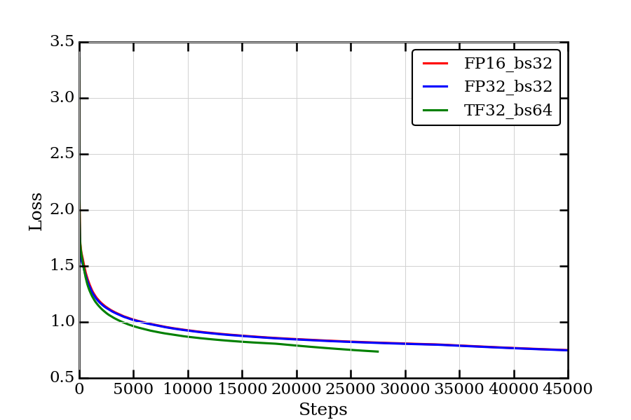
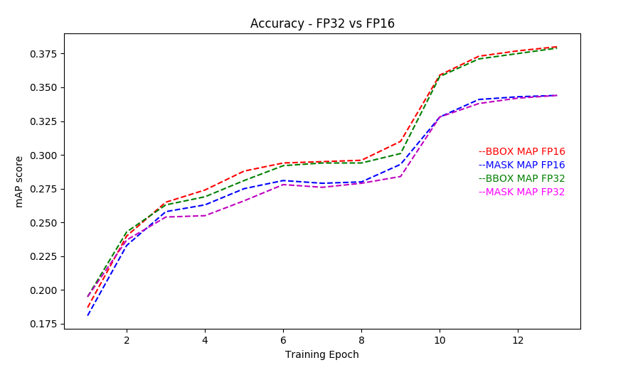

# Mask R-CNN For PyTorch
This repository provides a script and recipe to train and infer on MaskRCNN to achieve state of the art accuracy, and is tested and maintained by NVIDIA.

## Table Of Contents
* [Model overview](#model-overview)
  * [Model Architecture](#model-architecture)  
  * [Default configuration](#default-configuration)
  * [Mixed precision training](#mixed-precision-training)
  * [Enabling mixed precision](#enabling-mixed-precision)
* [Setup](#setup)
  * [Requirements](#requirements)
* [Quick start guide](#quick-start-guide)
* [Advanced](#advanced)
  * [Command line arguments](#command-line-arguments)
  * [Getting the data](#getting-the-data)
  * [Training process](#training-process)
* [Performance](#performance)
  * [Benchmarking](#benchmarking)
    * [Training performance benchmark](#training-performance-benchmark)
    * [Inference performance benchmark](#inference-performance-benchmark)
  * [Results](#results)
    * [Training accuracy results](#training-accuracy-results)
      * [Training stability test](#training-stability-test)
    * [Training performance results](#training-performance-results)
      * [NVIDIA DGX-1 (8x V100 16G)](#nvidia-dgx-1-8x-v100-16g)
      * [NVIDIA DGX-1 (8x V100 32G)](#nvidia-dgx-1-8x-v100-32g)
    * [Inference performance results](#inference-performance-results)
      * [NVIDIA DGX-1 16G (1x V100 16G)](#nvidia-dgx-1-16g-1x-v100-16g)
      * [NVIDIA DGX-1 32G (1x V100 32G)](#nvidia-dgx-1-32g-1x-v100-32g)
* [Release notes](#release-notes)
  * [Changelog](#changelog)
  * [Known issues](#known-issues)

## Model overview

Mask R-CNN is a convolution based neural network for the task of object instance segmentation. The paper describing the model can be found [here](https://arxiv.org/abs/1703.06870). NVIDIA’s Mask R-CNN 19.2 is an optimized version of [Facebook’s implementation](https://github.com/facebookresearch/maskrcnn-benchmark), leveraging mixed precision arithmetic and tensor cores on V100 GPUs for 1.3x faster training times while maintaining target accuracy. Because this model trains with mixed precision tensor cores on Volta, researchers can get results much faster than training without tensor cores.  This model is tested against each NGC monthly container release to ensure consistent accuracy and performance over time.

The repository also contains scripts to interactively launch training, benchmarking and inference routines in a Docker container.

The major differences between the official implementation of the paper and our version of Mask R-CNN are as follows:
  - Mixed precision support with [PyTorch AMP](https://github.com/NVIDIA/apex).
  - Gradient accumulation to simulate larger batches.
  - Custom fused CUDA kernels for faster computations.

These techniques/optimizations improve model performance and reduce training time by a factor of 1.3x, allowing you to perform more efficient instance segmentation with no additional effort.

Other publicly available implementations of Mask R-CNN include:
  - [Matterport](https://github.com/matterport/Mask_RCNN)
  - [Tensorpack](https://github.com/tensorpack/tensorpack/tree/master/examples/FasterRCNN)
  - [Google’s tensorflow model](https://github.com/tensorflow/models/tree/master/research/object_detection)

### Model architecture

MaskRCNN builds on top of FasterRCNN adding an additional mask head for the task of image segmentation.

The architecture consists of following:
- R-50 backbone with FPN
- RPN head
- RoI ALign
- Bounding and classification box head
- Mask head
 
### Default Configuration
The default configuration of this model can be found at `pytorch/maskrcnn_benchmark/config/defaults.py`. The default hyper-parameters are as follows:
  - General:
    - Base Learning Rate set to 0.001
    - Global batch size set to 16 images
    - Steps set to 30000
    - Images resized with aspect ratio maintained and smaller side length between [800,1333]
    - Global train batch size - 16
    - Global test batch size - 8

  - Feature extractor:
    - Backend network set to Resnet50_conv4
    - Backbone network weights are frozen after second epoch

  - Region Proposal Network (RPN):
    - Anchor stride set to 16
    - Anchor sizes set to (32, 64, 128, 256, 512)
    - Foreground IOU Threshold set to 0.7, Background IOU Threshold set to 0.5
    - RPN target fraction of positive proposals set to 0.5
    - Train Pre-NMS Top proposals set to 12000
    - Train Post-NMS Top proposals set to 2000
    - Test Pre-NMS Top proposals set to 6000
    - Test Post-NMS Top proposals set to 1000
    - RPN NMS Threshold set to 0.7

  - RoI heads:
    - Foreground threshold set to 0.5
    - Batch size per image set to 512
    - Positive fraction of batch set to 0.25

This repository implements multi-gpu and gradient accumulation to support larger batches and mixed precision support. This implementation also includes the following optimizations.
  - Target generation - Optimized GPU implementation for generating binary mask ground truths from the list of polygon coordinates that exist in the dataset.
  - Custom CUDA kernels for:
    - Box Intersection over Union (IoU) computation
    - Proposal matcher
    - Generate anchor boxes
    - Pre NMS box selection - Selection of RoIs based on objectness score before NMS is applied.

    The source files can be found under `maskrcnn_benchmark/csrc/cuda`.

### Feature support matrix

The following features are supported by this model.  

| **Feature** | **MaskRCNN** |
|:---------:|:----------:|
|APEX AMP|Yes|
|APEX DDP|Yes|

#### Features
APEX is a Pytorch extension with NVIDIA-maintained utilities to streamline mixed precision and distributed training.
  
### Mixed precision training

  


Mixed precision is the combined use of different numerical precisions in a computational method. [Mixed precision](https://arxiv.org/abs/1710.03740) training offers significant computational speedup by performing operations in half-precision format, while storing minimal information in single-precision to retain as much information as possible in critical parts of the network. Since the introduction of [tensor cores](https://developer.nvidia.com/tensor-cores) in the Volta and Turing architecture, significant training speedups are experienced by switching to mixed precision -- up to 3x overall speedup on the most arithmetically intense model architectures. Using mixed precision training requires two steps:

1.  Porting the model to use the FP16 data type where appropriate.
    
2.  Adding loss scaling to preserve small gradient values.
    

  

For information about:

-   How to train using mixed precision, see the [Mixed Precision Training](https://arxiv.org/abs/1710.03740) paper and [Training With Mixed Precision](https://docs.nvidia.com/deeplearning/sdk/mixed-precision-training/index.html) documentation.
    
-   Techniques used for mixed precision training, see the [Mixed-Precision Training of Deep Neural Networks](https://devblogs.nvidia.com/mixed-precision-training-deep-neural-networks/) blog.
    

APEX tools for mixed precision training, see the [NVIDIA Apex: Tools for Easy Mixed-Precision Training in PyTorch](https://devblogs.nvidia.com/apex-pytorch-easy-mixed-precision-training/).
  

#### Enabling mixed precision

  


In this repository, mixed precision training is enabled by NVIDIA’s [APEX](https://github.com/NVIDIA/apex) library. The APEX library has an automatic mixed precision module that allows mixed precision to be enabled with minimal code changes.

  

Automatic mixed precision can be enabled with the following code changes: 

```
from apex import amp
if fp16:
    # Wrap optimizer and model
    model, optimizer = amp.initialize(model, optimizer, opt_level=<opt_level>, loss_scale=”dynamic”)
 
if fp16:
    with amp.scale_loss(loss, optimizer) as scaled_loss:
        scaled_loss.backward()
   ```

Where <opt_level> is the optimization level. In the MaskRCNN, “O1” is set as the optimization level. Mixed precision training can be turned on by passing in the argument fp16 to the pre-training and fine-tuning Python scripts. Shell scripts all have a positional argument available to enable mixed precision training.


## Setup
The following sections list the requirements in order to start training the Mask R-CNN model.
### Requirements
This repository contains `Dockerfile` which extends the PyTorch NGC container and encapsulates some dependencies.  Aside from these dependencies, ensure you have the following components:
  - [NVIDIA Docker](https://github.com/NVIDIA/nvidia-docker)
  - [PyTorch 19.02-py3 NGC container](https://ngc.nvidia.com/registry/nvidia-pytorch)
  - [NVIDIA Volta based GPU](https://www.nvidia.com/en-us/data-center/volta-gpu-architecture/)

  For more information about how to get started with NGC containers, see the
  following sections from the NVIDIA GPU Cloud Documentation and the Deep Learning
  Documentation:
  - [Getting Started Using NVIDIA GPU Cloud](https://docs.nvidia.com/ngc/ngc-getting-started-guide/index.html)
  - [Accessing And Pulling From The NGC Container Registry](https://docs.nvidia.com/deeplearning/dgx/user-guide/index.html#accessing_registry)
  - [Running PyTorch](https://docs.nvidia.com/deeplearning/dgx/pytorch-release-notes/running.html#running)

## Quick Start Guide
To train your model using mixed precision with tensor cores or using FP32, perform the following steps using the default parameters of the Mask R-CNN model on the COCO 2014 dataset.

### 1. Clone the repository.
```
git clone https://github.com/NVIDIA/DeepLearningExamples.git
cd DeepLearningExamples/PyTorch/Segmentation/MaskRCNN
```

### 2. Download and preprocess the dataset.
This repository provides scripts to download and extract the COCO 2014 dataset.  Data will be downloaded to the `current working` directory on the host and extracted to a user-defined directory

To download, verify, and extract the COCO dataset, use the following scripts:
  ```
  ./download_dataset.sh <data/dir>
  ```
By default, the data is organized into the following structure:
  ```
  <data/dir>
    annotations/
      instances_train2014.json
      instances_val2014.json
    train2014/
      COCO_train2014_*.jpg
    val2014/
      COCO_val2014_*.jpg
  ```

### 3. Build the Mask R-CNN PyTorch NGC container.
```
cd pytorch/
bash scripts/docker/build.sh
```

### 4. Start an interactive session in the NGC container to run training/inference.
After you build the container image, you can start an interactive CLI session with  
```
bash scripts/docker/interactive.sh <path/to/dataset/>
```
The `interactive.sh` script requires that the location on the dataset is specified.  For example, `/home/<USER>/Detectron_PyT/detectron/lib/datasets/data/coco`


### 5. Start training.
```
bash scripts/train.sh
```
The `train.sh` script trains a model and performs evaluation on the COCO 2014 dataset. By default, the training script:
  - Uses 8 GPUs.
  - Saves a checkpoint every 2500 iterations and at the end of training. All checkpoints, evaluation results and training logs are saved to the `/results` directory (in the container which can be mounted to a local directory).
  - Mixed precision training with Tensor Cores is invoked by adding `DTYPE \"float16\"` to the end of the above command as shown in the train script. This will override the default `DTYPE` configuration which is float32.

  The `scripts/train.sh` script runs the following Python command:
  ```
  python -m torch.distributed.launch --nproc_per_node=8 tools/train_net.py --config-file “configs/e2e_mask_rcnn_R_50_FPN_1x.yaml”   
  ```

### 6. Start validation/evaluation.
  ```
  bash scripts/eval.sh
  ```
Model evaluation on a checkpoint can be launched by running the  `pytorch/scripts/eval.sh` script. The script requires:
- the location of the checkpoint folder to be specified and present within/mounted to the container.
- a text file named last_checkpoint which contains the path to the latest checkpoint. This mechanism is required in order to resume training from the latest checkpoint.
- The file last_checkpoint is automatically created at the end of the training process.

By default, evaluation is performed on the test dataset once training is complete. To skip evaluation at the end of training, issue the `--skip-test` flag.

Additionally, to perform evaluation after every epoch and terminate training on reaching a minimum required mAP score, set
- `PER_EPOCH_EVAL = True`
- `MIN_BBOX_MAP = <required value>`
- `MIN_MASK_MAP = <required value>`

### 7. Start inference/predictions.

Model predictions can be obtained on a test dataset and a model checkpoint by running the  `scripts/inference.sh <config/file/path>` script. The script requires:
  - the location of the checkpoint folder and dataset to be specified and present within/mounted to the container.
  - a text file named last_checkpoint which contains the path to the checkpoint.

For example:
```
bash scripts/inference.sh configs/e2e_mask_rcnn_R_50_FPN_1x.yaml
```

Model predictions get saved in the `<OUTPUT_DIR>/inference` directory.

To perform inference and skip computation of mAP scores, issue the `--skip-eval` flag. Performance is reported in seconds per iteration per GPU. The benchmarking scripts can be used to extract frames per second on training and inference.

## Advanced
The following sections provide greater details of the dataset, running training and inference, and the training results.

### Scripts and sample code


Descriptions of the key scripts and folders are provided below.

  

-   maskrcnn_benchmark - Contains scripts for to build individual components of the model such as backbone, FPN, RPN, mask and bbox heads etc.,
-   download_dataset.sh - Launches download and processing of required datasets.
    
-   scripts/ - Contains shell scripts to launch data download, train the model and perform inferences.
    

	-   train.sh - Launches model training
	    
	-   eval.sh  - Performs inference and compute mAP of predictions.
	    
	-   inference.sh  - Performs inference on given data.
	    
	-   train_benchmark.sh  - To benchmark training performance.
	    
	-   inference_benchmark.sh  - To benchmark inference performance.
	-   docker/ - Scripts to build the docker image and to start an interactive session.   
    
-   tools/
    - train_net.py - End to end to script to load data, build and train the model.
    - test.net.py - End to end script to load data, checkpoint and perform inference and compute mAP score.


### Parameters
#### train_net.py script parameters
You can modify the training behaviour through the various flags in both the `train_net.py` script and through overriding specific parameters in the YAML config files. Flags in the `train_net.py` script are as follows:
  
  `--config_file` - path to config file containing model params
  
  `--skip-test` - skips model testing after training
  
  `--skip-eval` - skips computation of mAP scores
  
  `--opts` - allows for you to override specific params in config file

For example:
```
python -m torch.distributed.launch --nproc_per_node=2 tools/train_net.py \
    --config-file configs/e2e_faster_rcnn_R_50_FPN_1x.yaml \
    --skip-eval \
    DTYPE "float16" \
    OUTPUT_DIR RESULTS \
    SOLVER.BASE_LR 0.002 \
    SOLVER.STEPS “(360000, 480000)”
```
  
### Command-line options

To see the full list of available options and their descriptions, use the -h or --help command line option, for example:

  

`python tools/train_net.py --help`


### Getting the data
The Mask R-CNN model was trained on the [COCO 2014](http://cocodataset.org/#download) dataset.  This dataset comes with a training and validation set.  

This repository contains the `./download_dataset.sh`,`./verify_dataset.sh`, and `./extract_dataset.sh` scripts which automatically download and preprocess the training and validation sets.

#### Dataset guidelines

In order to run on your own dataset, ensure your dataset is present/mounted to the Docker container with the following hierarchy:
```
my_dataset/
  images_train/
  images_val/
  instances_train.json
  instances_val.json
```
and add it to `DATASETS` dictionary in `maskrcnn_benchmark/config/paths_catalog.py`

```
DATASETS = {
        "my_dataset_train": {
            "img_dir": "data/images_train",
            "ann_file": "data/instances_train.json"
        },
        "my_dataset_val": {
            "img_dir": "data/images_val",
            "ann_file": "data/instances_val.json"
        },
      }
```
```
python -m torch.distributed.launch --nproc_per_node=<NUM_GPUS> tools/train_net.py \
        --config-file <CONFIG? \
        DATASETS.TRAIN "(\"my_dataset_train\")"\
        DATASETS.TEST "(\"my_dataset_val\")"\
        DTYPE "float16" \
        OUTPUT_DIR <RESULTS> \
        | tee <LOGFILE>
```

### Training Process
Training is performed using the `tools/train_net.py` script along with parameters defined in the config file. The default config files can be found in the `pytorch/configs/` directory.

The `e2e_mask_rcnn_R_50_FPN_1x.yaml` file was used to gather accuracy and performance metrics. This configuration sets the following parameters:
  - Backbone weights to ResNet-50
  - Feature extractor set to ResNet-50 with Feature Pyramid Networks (FPN)
  - RPN uses FPN
  - RoI Heads use FPN
  - Dataset - COCO 2014
  - Base Learning Rate - 0.02
  - Global train batch size - 16
  - Global test batch size - 8
  - RPN batch size - 256
  - ROI batch size - 512
  - Solver steps - (60000, 80000)
  - Max iterations - 90000
  - Warmup iterations - 500
  - Warmup factor = 0.33
    - Initial learning rate = Base Learning Rate x Warmup factor

The default feature extractor can be changed by setting `CONV_BODY` parameter in `yaml` file to any of the following:
  - R-50-C4
  - R-50-C5
  - R-101-C4
  - R-101-C5
  - R-101-FPN

The default backbone can be changed to a flavor of Resnet-50 or ResNet-101 by setting `WEIGHT` parameter in `yaml` file to any of the following:
  - "catalog://ImageNetPretrained/MSRA/R-50-GN"
  - "catalog://ImageNetPretrained/MSRA/R-101"
  - "catalog://ImageNetPretrained/MSRA/R-101-GN"

This script outputs results to the current working directory by default. However, this can be changed by adding `OUTPUT_DIR <DIR_NAME>` to the end of the default command. Logs produced during training are also stored in the `OUTPUT_DIR` specified. The training log will contain information about:
  - Loss, time per iteration, learning rate and memory metrics
  - performance values such as time per step
  - test accuracy and test performance values after evaluation

The training logs are located in the `<OUTPUT_DIR>/log` directory. The summary after each training epoch is printed in the following format:
  ```
  INFO:maskrcnn_benchmark.trainer:eta: 4:42:15  iter: 20  loss: 1.8236 (2.7274)  loss_box_reg: 0.0249 (0.0620)  loss_classifier: 0.6086 (1.2918)  loss_mask: 0.6996 (0.8026)  loss_objectness: 0.5373 (0.4787)  loss_rpn_box_reg: 0.0870 (0.0924)  time: 0.2002 (0.3765)  data: 0.0099 (0.1242)  lr: 0.014347  max mem: 3508
  ```
  The mean and median training losses are reported every 20 steps.

Multi-gpu and multi-node training is enabled with the PyTorch distributed launch module. The following example runs training on 8 GPUs:
  ```
  python -m torch.distributed.launch --nproc_per_node=8 tools/train_net.py --config-file \"configs/e2e_mask_rcnn_R_50_FPN_1x.yaml\"
  ```

We have tested a batch sizes upto 4 on a 16GB V100 and upto 16 on a 32G V100 with mixed precision. The repository also implements gradient accumulation functionality to simulate bigger batches. The following command can be used to run a batch of 64:
  ```
  python -m torch.distributed.launch --nproc_per_node=8 tools/train_net.py --config-file \"configs/e2e_mask_rcnn_R_50_FPN_1x.yaml\" SOLVER.ACCUMULATE_GRAD True SOLVER.ACCUMULATE_STEPS 4
  ```

By default, training is performed using FP32, however training time can be reduced using tensor cores and mixed precision. This can be done by adding `DTYPE \"float16\"` to override the respective parameter in the config file.

__Note__: When training a global batch size >= 32, it is recommended to additionally set the following parameters:
  - `SOLVER.WARMUP_ITERS 625`
  - `SOLVER.WARMUP_FACTOR 0.01`

When experimenting with different global batch sizes for training and inference, make sure `SOLVER.IMS_PER_BATCH` and `TEST.IMS_PER_BATCH` are divisible by the number of GPUs.  

#### Other training options
A sample single GPU config is provided under `configs/e2e_mask_rcnn_R_50_FPN_1x_1GPU.yaml`

For multi-gpu runs, `-m torch.distributed.launch --nproc_per_node num_gpus` is added prior to `tools/train_net.py`.  For example, for an 8 GPU run:
```
python -m torch.distributed.launch --nproc_per_node=8 tools/train_net.py --config-file “configs/e2e_mask_rcnn_R_50_FPN_1x.yaml”   
```

Training is terminated when either the required accuracies specified on the command line are reached or if the number of training iterations specified is reached.

To terminate training on reaching target accuracy on 8 GPUs, run:
```
python -m torch.distributed.launch --nproc_per_node=8 tools/train_net.py --config-file “configs/e2e_mask_rcnn_R_50_FPN_1x.yaml” PER_EPOCH_EVAL True MIN_BBOX_MAP 0.377 MIN_MASK_MAP 0.342
```

__Note__: The score is always the Average Precision(AP) at
  - IoU = 0.50:0.95
  - Area = all - include small, medium and large
  - maxDets = 100

## Performance

### Benchmarking
Benchmarking can be performed for both training and inference. Both scripts run the Mask R-CNN model using the parameters defined in `configs/e2e_mask_rcnn_R_50_FPN_1x.yaml`. You can specify whether benchmarking is performed in FP16 or FP32 by specifying it as an argument to the benchmarking scripts.

#### Training performance benchmark
Training benchmarking can performed by running the script:
```
scripts/train_benchmark.sh <float16/float32>
```

#### Inference performance benchmark
Inference benchmarking can be performed by running the script:
```
scripts/inference_benchmark.sh <float16/float32>
```

### Results
The following sections provide details on how we achieved our performance and accuracy in training and inference.
#### Training Accuracy Results

##### NVIDIA DGX-1 (8x V100 16G)
Our results were obtained by running the `tools/train_net.py`  training script in the PyTorch 19.02-py3 NGC container on NVIDIA DGX-1 with 8x V100 16G GPUs.

| **number of GPUs** | **batch size/GPU** | **Training time with FP16(hours)** | **Training time with FP32(hours)** |
| --- | --- | ----- | ----- |
|  8  | 4 | 4.81 | 6.35 |

LOSS CURVE:



Here, multihead loss is simply the summation of losses on the mask head and the bounding box head.

ACCURACY CURVE:



##### Training Stability Test
The following tables compare mAP scores across 5 different training runs with different seeds, for both FP16 and FP32 respectively.  The runs showcase consistent convergence on all 5 seeds with very little deviation.

| **Config** | **Seed #1** | **Seed #2** | **Seed #3** |  **Seed #4** | **Seed #5** | **mean** | **std** |
| --- | --- | ----- | ----- | --- | --- | ----- | ----- |
|  8 GPUs, fp16, final AP BBox  | 0.377 | 0.376 | 0.376 | 0.378  | 0.377 | 0.377 | 0.001 |
| 8 GPUs, fp16, final AP Segm | 0.343 | 0.342 | 0.341 | 0.343  | 0.343 | 0.342 | 0.001 |

| **Config** | **Seed #1** | **Seed #2** | **Seed #3** |  **Seed #4** | **Seed #5** | **mean** | **std** |
| --- | --- | ----- | ----- | --- | --- | ----- | ----- |
|  8 GPUs, fp32, final AP BBox  | 0.377 | 0.377 | 0.376 | 0.378  | 0.378 | 0.377 | 0.001 |
| 8 GPUs, fp32, final AP Segm | 0.344 | 0.342 | 0.343 | 0.343  | 0.343 | 0.342 | 0.001 |

#### Training Performance Results
##### NVIDIA DGX-1  (8x V100 16G)
Our results were obtained by running the `scripts/train.sh` training script in the PyTorch 19.02-py3 NGC container on NVIDIA DGX-1 with 8x V100 16G GPUs. Performance numbers (in tokens per second) were averaged over an entire training epoch.

| **number of GPUs** | **batch size/GPU** | **FP 32 items/sec** | **FP16 items/sec** | **Speed-up with mixed precision** | **Multi-gpu weak scaling with FP32** | **Multi-gpu weak scaling with FP16** |
| --- | --- | ----- | ----- | --- | --- | ----- |
| 1 | 2 | 8.47 | 10.77 | 1.27 | 1 | 1 |
| 4 | 2 | 30.23 | 36.88 | 1.22 | 3.67 | 3.53 |
| 8 | 2 | 56.35 | 70.45 | 1.25 | 6.96 | 6.51 |

| **number of GPUs** | **batch size/GPU** | **FP 32 items/sec** | **FP16 items/sec** | **Speed-up with mixed precision** | **Multi-gpu weak scaling with FP32** | **Multi-gpu weak scaling with FP16** |
| --- | --- | ----- | ----- | --- | --- | ----- |
| 1 | 4 | 9.29 | 12.73 | 1.37 | 1 | 1 |
| 4 | 4 | 34.07 | 44.95 | 1.32 | 3.67 | 3.53 |
| 8 | 4 | 62.7 | 82.9 | 1.32 | 6.75 | 6.51 |

To achieve these same results, follow the [Quick start guide](#quick-start-guide) outlined above.

##### NVIDIA DGX-1 (8x V100 32G)
Our results were obtained by running the `scripts/train.sh` training script in the PyTorch 19.02-py3 NGC container on NVIDIA DGX-1 with 8x V100 32G GPUs. Performance numbers (in items/images per second) were averaged over an entire training epoch.

| **number of GPUs** | **batch size/GPU** | **FP 32 items/sec** | **FP16 items/sec** | **Speed-up with mixed precision** | **Multi-gpu weak scaling with FP32** | **Multi-gpu weak scaling with FP16** |
| --- | --- | ----- | ----- | --- | --- | ----- |
| 1 | 4 | 9.06 | 13.14 | 1.45 | 1 | 1 |
| 4 | 4 | 32.87 | 50.70 | 1.54 | 3.86 | 3.63 |
| 8 | 4 | 62.93 | 82.30 | 1.31 | 6.94 | 6.26 |

| **number of GPUs** | **batch size/GPU** | **FP 32 items/sec** | **FP16 items/sec** | **Speed-up with mixed precision** | **Multi-gpu weak scaling with FP32** | **Multi-gpu weak scaling with FP16** |
| --- | --- | ----- | ----- | --- | --- | ----- |
| 1 | 8 | 9.35 | 13.05 | 1.40 | 1 | 1 |
| 4 | 8 | 33.38 | 46.69 | 1.40 | 3.57 | 3.57 |
| 8 | 8 | 71.85 | 87.10 | 1.21 | 7.68 | 7.68 |

| **number of GPUs** | **batch size/GPU** | **FP 32 items/sec** | **FP16 items/sec** | **Speed-up with mixed precision** | **Multi-gpu weak scaling with FP32** | **Multi-gpu weak scaling with FP16** |
| --- | --- | ----- | ----- | --- | --- | ----- |
| 1 | 16 | NA | 13.82 | NA | NA | 1 |
| 4 | 16 | NA | 48.41 | NA | NA | 3.50 |
| 8 | 16 | NA | 89.33 | NA | NA | 6.46 |

It should be noted that respective values for FP32 runs using a batch size of 16 are not available due to out of memory errors that arise. Batch size of 16 is only available on using FP16.

To achieve these same results, follow the [Quick start guide](#quick-start-guide) outlined above.

#### Inference performance results
##### NVIDIA DGX-1 16G (1x V100 16G)
Our results were obtained by running the `scripts/inference.sh` training script in the PyTorch 19.02-py3 NGC container on NVIDIA DGX-1 with 1x V100 16G GPUs. Performance numbers (in items/images per second) were averaged over an entire training epoch.

| **number of GPUs** | **batch size/GPU** | **FP 32 items/sec** | **FP16 items/sec** | **Speedup** |
| --- | --- | ----- | ----- | ----- |
|  1  | 8 | 15.3 | 16.94 | 1.107 |

To achieve these same results, follow the [Quick start guide](#quick-start-guide) outlined above.

##### NVIDIA DGX-1 32G (1x V100 32G)
Our results were obtained by running the `scripts/inference.sh <config/file/path>` training script in the PyTorch 19.02-py3 NGC container on NVIDIA DGX-1 with 1x V100 32G GPUs. Performance numbers (in items/images per second) were averaged over an entire training epoch.

| **number of GPUs** | **batch size/GPU** | **FP 32 items/sec** | **FP16 items/sec** | **Speedup** |
| --- | --- | ----- | ----- | ----- |
|  1  | 8 | 14.43  | 16.33 | 1.13 |

To achieve these same results, follow the [Quick start guide](#quick-start-guide) outlined above.

## Release notes

### Changelog

September 2019
  - Updates for PyTorch 1.2
  - Jupyter notebooks added

July 2019
  - Update AMP to new API
  - Update README
  - Download support from torch hub
  - Update default test batch size to 1/gpu

March 2019
  - Initial release


### Known Issues
There are no known issues with this model.

