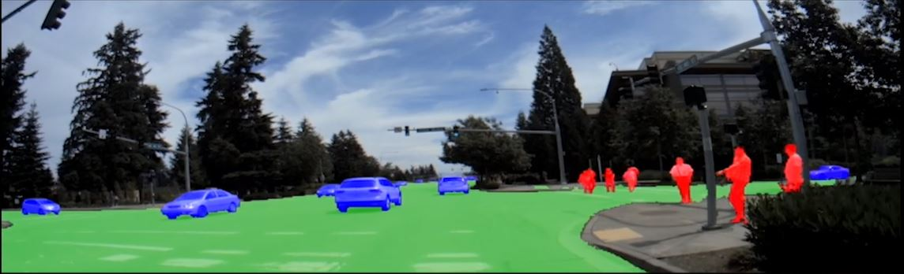
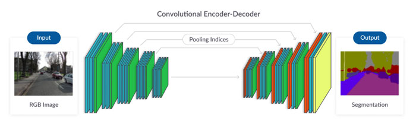
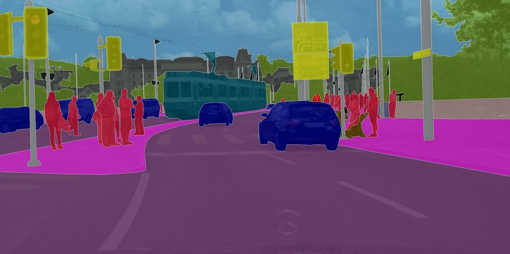
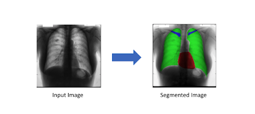
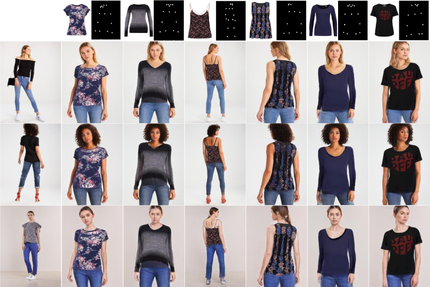

# Segmentation

Image Segmentation is the field of image processing that deals with separating the image into multiple subgroups or regions (such as pixels set, also known as image segments) representing distinctive objects or its subparts. 

Nowadays, we are constantly making interpretations of the world around us through cameras and other devices. Therefore image segmentation has become an integral part of our lives, since it's an indispensable technique for teaching the devices how to process this interpretation, how to understand the world around them.

In this collection, we will cover:
- What is image segmentation?
- Types of image segmentation
- How does image segmentation work?
- Use-cases and applications
- Where to get started

---
## What is image segmentation?

Image segmentation is a computer vision process by which a digital image is divided into various categories or segments. We use this method to understand what is depicted using a pixel-wise classification of the image. It is very much distinct from image classification, which allots labels to an entire image; object detection identifies and locates objects within an image by drawing bounding boxes around them. Image segmentation presents more pixel-level knowledge about the image content.

Consider a road side scenario with pedestrians, cars and lights:

This photo is made up of an immense number of individual pixels, and image segmentation aims to assign each of those pixels to the object to which it belongs. Segmentation of an image enables us to segregate the foreground from the background, identify a road or a car's precise location, and mark the margins that separate a pedestrian from a car or road.

---
## Types of image segmentation

Image segmentation tasks can be broken down into two broad categories: semantic segmentation and instance segmentation.

1. Semantic segmentation:- This is the process of classifying each pixel belonging to a particular label. It doesn't different across different instances of the same object. For example if there are 2 cats in an image, semantic segmentation gives same label to all the pixels of both cats

2. Instance segmentation:- This differs from semantic segmentation in the sense that it gives a unique label to every instance of a particular object in the image. As can be seen in the image above all 3 dogs are assigned different colours i.e different labels. With semantic segmentation all of them would have been assigned the same colour.

---
## How does image segmentation work?
Let's consider image segmentation as a function.
An image is given as input to the function and it gives a matrix or a mask as the output, where each element tells us which class or instance that pixel belongs to.

Machine learning moves towards image segmentation train models to recognize which features of an image are crucial, rather than designing bespoke heuristics by hand. 

Although deep neural networks architectures for image segmentation may differ in implementation, most follows similar basis structure:

Source - [SegNet Paper](https://arxiv.org/pdf/1511.00561.pdf)

- The encoder: A set of layers that extract features of an image through a sequence of progressively narrower and deeper filters. Oftentimes, the encoder is pre-trained on a different task (like image recognition), where it learns statistical correlations from many images and may transfer that knowledge for the purposes of segmentation. 
- The Decoder: A set of layers that progressively grows the output of the encoder into a segmentation mask resembling the pixel resolution of the input image.
- Skip connections: Long range connections in the neural network that allow the model to draw on features at varying spatial scales to improve model accuracy.

Most of the architectures used for segmentation tasks are built on the technique of Fully Convolutional Network (FCN) i.e., the architecture contains convolution layers instead of any Dense or Max Pool layers. Though various models support the FCN technique, a few handpicked models generally used in production are - UNet, MaskRCNN, and DeepLabv3.

---
## Use-cases and applications

Image Segmentation can be useful for a lot of different use-cases - handwriting recognition, virtual try-on, visual image search, road scene segmentation, organ segmentation and much more. Here are the few applications explained in detail:

### Autonomous vehicles:

There are a lot of things that needs your attention while driving- the road, other vehicles, pedestrians, sidewalks, and (potentially) a plethora of other potential obstacles/safety hazards.

If you’ve been driving for a long time, noticing and reacting to this environment might seem automatic or like second nature. In case of a self driving car, it would be a quick observation that this car needs to see, interpret, and respond to a scene in real-time. This implies the need to create pixel-level map of the world through the camera system in this vehicle in order to navigate it safely and efficiently.

Even though the field of autonomous machines/automobiles is much more complex than performing segmentation, this pixel-level understanding is a essential ingredient in a step towards reality. 

### Medical imaging and diagnostics:

In the initial steps of a diagnostic and treatment pipeline for many conditions that require medical images, such as CT or MRI scans, image segmentation can be used as a powerful technique.

Essentially, segmentation can effectively distinguish and separate homogeneous areas that may include particularly important pixels of organs, lesions, etc. However, there are significant challenges, including low contrast, noise, and various other imaging ambiguities.

### Virtual try-on:

Virtual try on clothes is quite a fascinating feature which was available in stores using specialized hardware which creates a 3d model. But interestingly with deep learning and image segmentation the same can be obtained using just a 2d image.

---
## Where to get started
NVIDIA provides Deep Learning Examples for Image Segmentation on its GitHub repository. These examples provide you with easy to consume and highly optimized scripts for both training and inferencing. The quick start guide at our GitHub repository will help you in setting up the environment using NGC Docker Images, download pre-trained models from NGC and adapt the model training and inference for your application/use-case. 
Here are the examples relevant for image segmentation, directly from [Deep Learning Examples](https://github.com/NVIDIA/DeepLearningExamples):

1. 3D UNet for Medical Image Segmentation using Tensorflow 1.x
- [Git repository](https://github.com/NVIDIA/DeepLearningExamples/tree/master/TensorFlow/Segmentation/UNet_3D_Medical)
- Uses TensorFlow 20.06-tf1-py3 [NGC container](https://ngc.nvidia.com/registry/nvidia-tensorflow)

2. 2D UNet for Industrial Defect Segmentation using Tensorflow 1.x
- [Git repository](https://github.com/NVIDIA/DeepLearningExamples/tree/master/TensorFlow/Segmentation/UNet_Industrial)
- Uses TensorFlow 20.06-tf1-py3 [NGC container](https://ngc.nvidia.com/registry/nvidia-tensorflow)

3. MaskRCNN for Common Objects Segmentation using PyTorch
- [Git repository](https://github.com/NVIDIA/DeepLearningExamples/tree/master/PyTorch/Segmentation/MaskRCNN)
- Uses PyTorch 20.06-py3 [NGC container](https://ngc.nvidia.com/registry/nvidia-pytorch)
