# Deploying the nnUNet model on Triton Inference Server

This folder contains instructions for deployment to run inference
on the Triton Inference Server and a detailed performance analysis.
The purpose of this document is to help you achieve
the best inference performance.

## Table of contents

  - [Solution overview](#solution-overview)
    - [Introduction](#introduction)
    - [Deployment process](#deployment-process)
  - [Setup](#setup)
  - [Quick Start Guide](#quick-start-guide)
  - [Advanced](#advanced)
    - [Triton embedded deployment](#triton-embedded-deployment)
    - [Prepare configuration](#prepare-configuration)
    - [Latency explanation](#latency-explanation)
  - [Performance](#performance)
    - [Offline scenario](#offline-scenario)
      - [Offline: NVIDIA DGX-1 (1x V100 32GB) with FP16](#offline-nvidia-dgx-1-1x-v100-32gb-with-fp16)
      - [Offline: NVIDIA DGX-1 (1x V100 32GB) with FP32](#offline-nvidia-dgx-1-1x-v100-32gb-with-fp32)
      - [Offline: NVIDIA A40 with FP16](#offline-nvidia-a40-with-fp16)
      - [Offline: NVIDIA A40 with FP32](#offline-nvidia-a40-with-fp32)
      - [Offline: NVIDIA T4 with FP16](#offline-nvidia-t4-with-fp16)
      - [Offline: NVIDIA T4 with FP32](#offline-nvidia-t4-with-fp32)
      - [Offline: NVIDIA DGX A100 (1x A100 80GB) with FP16](#offline-nvidia-dgx-a100-1x-a100-80gb-with-fp16)
      - [Offline: NVIDIA DGX A100 (1x A100 80GB) with FP32](#offline-nvidia-dgx-a100-1x-a100-80gb-with-fp32)
    - [Online scenario](#online-scenario)
      - [Online: NVIDIA DGX A100 (1x A100 80GB) with FP16](#online-nvidia-dgx-a100-1x-a100-80gb-with-fp16)
      - [Online: NVIDIA DGX A100 (1x A100 80GB) with FP32](#online-nvidia-dgx-a100-1x-a100-80gb-with-fp32)
      - [Online: NVIDIA A40 with FP16](#online-nvidia-a40-with-fp16)
      - [Online: NVIDIA A40 with FP32](#online-nvidia-a40-with-fp32)
      - [Online: NVIDIA T4 with FP16](#online-nvidia-t4-with-fp16)
      - [Online: NVIDIA T4 with FP32](#online-nvidia-t4-with-fp32)
      - [Online: NVIDIA DGX-1 (1x V100 32GB) with FP16](#online-nvidia-dgx-1-1x-v100-32gb-with-fp16)
      - [Online: NVIDIA DGX-1 (1x V100 32GB) with FP32](#online-nvidia-dgx-1-1x-v100-32gb-with-fp32)
  - [Release Notes](#release-notes)
    - [Changelog](#changelog)
    - [Known issues](#known-issues)


## Solution overview


### Introduction
The [NVIDIA Triton Inference Server](https://github.com/NVIDIA/triton-inference-server)
provides a datacenter and cloud inferencing solution optimized for NVIDIA GPUs.
The server provides an inference service via an HTTP or gRPC endpoint that allows remote clients to request inferencing for any number of GPU
or CPU models being managed by the server.

This README provides step-by-step deployment instructions for models generated
during training (as described in the [model README](../README.md)).
Additionally, this README provides the corresponding deployment scripts that
ensure optimal GPU utilization during inferencing on the Triton Inference Server.

### Deployment process
The deployment process consists of two steps:

1. Conversion. The purpose of conversion is to find the best performing model
   format supported by the Triton Inference Server.
   Triton Inference Server uses a number of runtime backends such as
   [TensorRT](https://developer.nvidia.com/tensorrt),
   [LibTorch](https://github.com/triton-inference-server/pytorch_backend) and
   [ONNX Runtime](https://github.com/triton-inference-server/onnxruntime_backend)
   to support various model types. Refer to
   [Triton documentation](https://github.com/triton-inference-server/backend#where-can-i-find-all-the-backends-that-are-available-for-triton)
   for the list of available backends.
2. Configuration. Model configuration on the Triton Inference Server, which generates
   necessary [configuration files](https://github.com/triton-inference-server/server/blob/master/docs/model_configuration.md).

To run benchmarks measuring the model performance in inference,
perform the following steps:

1. Start the Triton Inference Server.

   The Triton Inference Server container is started
   in one (possibly remote) container and the ports for gRPC or REST API are exposed.

2. Run accuracy tests.

   Produce results that are tested against given accuracy thresholds.
   Refer to step 8 in the [Quick Start Guide](#quick-start-guide).

3. Run performance tests.

   Produce latency and throughput results for offline (static batching)
   and online (dynamic batching) scenarios.
   Refer to step 10 in the [Quick Start Guide](#quick-start-guide).


## Setup


Ensure you have the following components:
* [NVIDIA Docker](https://github.com/NVIDIA/nvidia-docker)
* [PyTorch NGC container 21.02](https://ngc.nvidia.com/catalog/containers/nvidia:pytorch)
* [Triton Inference Server NGC container 21.02](https://ngc.nvidia.com/catalog/containers/nvidia:tritonserver)
* [NVIDIA CUDA repository](https://docs.nvidia.com/cuda/archive/11.2.0/index.html)
* [NVIDIA Ampere](https://www.nvidia.com/en-us/data-center/nvidia-ampere-gpu-architecture/), [Volta](https://www.nvidia.com/en-us/data-center/volta-gpu-architecture/) or [Turing](https://www.nvidia.com/en-us/geforce/turing/) based GPU


## Quick Start Guide


To deploy your model on Triton Inference Server perform the following steps using the default parameters of the nnUNet model on the [Medical Segmentation Decathlon](http://medicaldecathlon.com/) dataset. For the specifics concerning inference, see the [Advanced](#advanced) section.

1. Clone the repository.
   IMPORTANT: This step is executed on the host computer.
 
   ```
    git clone https://github.com/NVIDIA/DeepLearningExamples.git
    cd DeepLearningExamples/PyTorch/Segmentation/nnUNet
   ```

2. Setup the environment on the host computer and start the Triton Inference Server.
 
   ```
    source triton/scripts/setup_environment.sh
    bash triton/scripts/docker/triton_inference_server.sh 
   ```

3. Build and run a container that extends the NGC PyTorch container with the Triton Inference Server client libraries and dependencies.
 
   ```
    bash triton/scripts/docker/build.sh
    bash triton/scripts/docker/interactive.sh
   ```


4. Prepare the deployment configuration and create folders in Docker.
 
   IMPORTANT: These and the following commands must be executed in the PyTorch NGC container.
 
 
   ```
    source triton/scripts/setup_environment.sh
   ```

5. Download and pre-process the dataset.
 
 
   ```
    bash triton/scripts/download_data.sh
    bash triton/scripts/process_dataset.sh
   ```
 
6. Setup parameters for deployment.
 
   ```
    source triton/scripts/setup_parameters.sh
   ```
 
7. Convert the model from training to inference format (for example TensorRT).
 
 
   ```
    python3 triton/convert_model.py \
        --input-path triton/model.py \
        --input-type pyt \
        --output-path ${SHARED_DIR}/model \
        --output-type ${FORMAT} \
        --onnx-opset 12 \
        --onnx-optimized 1 \
        --max-batch-size ${MAX_BATCH_SIZE} \
        --max-workspace-size 4294967296 \
        --ignore-unknown-parameters \
        --checkpoint-dir ${CHECKPOINT_DIR}/nvidia_nnunet_pyt_ckpt_amp_3d_fold2.ckpt \
        --precision ${PRECISION} \
        --dataloader triton/dataloader.py \
        --data-dir ${DATASETS_DIR}/01_3d/ \
        --batch-size 1 \

   ```
 
 
8. Configure the model on the Triton Inference Server.
 
   Generate the configuration from your model repository.
 
   ```
    python3 triton/config_model_on_triton.py \
            --model-repository ${MODEL_REPOSITORY_PATH} \
            --model-path ${SHARED_DIR}/model \
            --model-format ${FORMAT} \
            --model-name ${MODEL_NAME} \
            --model-version 1 \
            --max-batch-size ${MAX_BATCH_SIZE} \
            --precision ${PRECISION} \
            --number-of-model-instances ${NUMBER_OF_MODEL_INSTANCES} \
            --preferred-batch-sizes ${TRITON_PREFERRED_BATCH_SIZES} \
            --max-queue-delay-us ${TRITON_MAX_QUEUE_DELAY} \
            --capture-cuda-graph 0 \
            --backend-accelerator ${BACKEND_ACCELERATOR} \
            --load-model ${TRITON_LOAD_MODEL_METHOD}
   ```
 
9. Run the Triton Inference Server accuracy tests.
 
   ```
    python3 triton/run_inference_on_triton.py \
            --server-url ${TRITON_SERVER_URL}:8001 \
            --model-name ${MODEL_NAME} \
            --model-version 1 \
            --output-dir ${SHARED_DIR}/accuracy_dump \
            \
            --dataloader triton/dataloader.py \
            --data-dir ${DATASETS_DIR}/01_3d \
            --batch-size ${MAX_BATCH_SIZE} \
            --precision ${PRECISION} \
            --dump-labels

    python3 triton/calculate_metrics.py \
            --metrics triton/metrics.py \
            --dump-dir ${SHARED_DIR}/accuracy_dump \
            --csv ${SHARED_DIR}/accuracy_metrics.csv

    cat ${SHARED_DIR}/accuracy_metrics.csv
   ```
 
 
10. Run the Triton Inference Server performance online tests.
 
   We want to maximize throughput within latency budget constraints.
   Dynamic batching is a feature of the Triton Inference Server that allows
   inference requests to be combined by the server, so that a batch is
   created dynamically, resulting in a reduced average latency.
   You can set the Dynamic Batcher parameter `max_queue_delay_microseconds` to
   indicate the maximum amount of time you are willing to wait and
   `preferred_batch_size` to indicate your maximum server batch size
   in the Triton Inference Server model configuration. The measurements
   presented below set the maximum latency to zero to achieve the best latency
   possible with good performance.
 
 
   ```
    python triton/run_online_performance_test_on_triton.py \
            --server-url ${TRITON_SERVER_URL} \
            --model-name ${MODEL_NAME} \
            --input-data random \
            --batch-sizes ${BATCH_SIZE} \
            --triton-instances ${TRITON_INSTANCES} \
            --number-of-model-instances ${NUMBER_OF_MODEL_INSTANCES} \
            --shared-memory \
            --result-path ${SHARED_DIR}/triton_performance_online.csv
   ```


11. Run the Triton Inference Server performance offline tests.
 
   We want to maximize throughput. It assumes you have your data available
   for inference or that your data saturate to maximum batch size quickly.
   Triton Inference Server supports offline scenarios with static batching.
   Static batching allows inference requests to be served
   as they are received. The largest improvements to throughput come
   from increasing the batch size due to efficiency gains in the GPU with larger
   batches. This example uses shared-memory.
 
   ```
    python triton/run_offline_performance_test_on_triton.py \
            --server-url ${TRITON_SERVER_URL} \
            --model-name ${MODEL_NAME} \
            --input-data random \
            --batch-sizes ${BATCH_SIZE} \
            --triton-instances ${TRITON_INSTANCES} \
            --shared-memory \
            --result-path ${SHARED_DIR}/triton_performance_offline.csv
   ```


## Advanced

### Triton embedded deployment

Triton embedded deployment means that client and server are running on the same machine (e.g. MRI).

The shared-memory extensions allow a client to communicate input and output 
tensors by system or CUDA shared memory. Using shared memory instead of sending
the tensor data over the GRPC or REST interface can provide significant 
performance improvement for some use cases. Because both of these extensions 
are supported, Triton reports "system_shared_memory" and "cuda_shared_memory" 
in the extensions field of its Server Metadata. 

More information about shared memory can be found here [Shared memory](https://github.com/triton-inference-server/server/blob/master/docs/protocol/extension_shared_memory.md)

### Prepare configuration
You can use the environment variables to set the parameters of your inference
configuration.

Triton deployment scripts support several inference runtimes listed in the table below:
| Inference runtime | Mnemonic used in scripts |
|-------------------|--------------------------|
| [TorchScript Tracing](https://pytorch.org/docs/stable/jit.html) | `ts-trace` |
| [TorchScript Tracing](https://pytorch.org/docs/stable/jit.html) | `ts-script` |
| [ONNX](https://onnx.ai) | `onnx` |
| [NVIDIA TensorRT](https://developer.nvidia.com/tensorrt) | `trt` |


Example values of some key variables in one configuration:
```
PRECISION="fp16"
FORMAT="ts-script"
BATCH_SIZE="1, 2, 4"
BACKEND_ACCELERATOR="cuda"
MAX_BATCH_SIZE="4"
NUMBER_OF_MODEL_INSTANCES="1"
TRITON_MAX_QUEUE_DELAY="1"
TRITON_PREFERRED_BATCH_SIZES="2 4"

```

### Latency explanation
A typical Triton Inference Server pipeline can be broken down into the following steps:

1. The client serializes the inference request into a message and sends it to
the server (Client Send).
2. The message travels over the network from the client to the server (Network).
3. The message arrives at the server and is deserialized (Server Receive).
4. The request is placed on the queue (Server Queue).
5. The request is removed from the queue and computed (Server Compute).
6. The completed request is serialized in a message and sent back to
the client (Server Send).
7. The completed message then travels over the network from the server
to the client (Network).
8. The completed message is deserialized by the client and processed as
a completed inference request (Client Receive).

Generally, for local clients, steps 1-4 and 6-8 occupy
a small fraction of time, compared to steps 5. As backend deep learning
systems like Jasper are rarely exposed directly to end users, but instead
only interfacing with local front-end servers, for the sake of Jasper,
we can consider that all clients are local.


## Performance

The performance measurements in this document were conducted at the time of publication and may not reflect the performance achieved from NVIDIA’s latest software release. For the most up-to-date performance measurements, go to [NVIDIA Data Center Deep Learning Product Performance](https://developer.nvidia.com/deep-learning-performance-training-inference).


### Offline scenario
This table lists the common variable parameters for all performance measurements:

| Parameter Name               | Parameter Value       |
|:-----------------------------|:----------------------|
| Model Format                 | TorchScript Scripting |
| Backend Accelerator          | CUDA                  |
| Max Batch Size               | 4                     |
| Number of model instances    | 1                     |
| Triton Max Queue Delay       | 1                     |
| Triton Preferred Batch Sizes | 2 4                   |


## **GPU:** NVIDIA DGX-1 (1x V100 32GB)
<table>
<tr>
 <td></td>
 <td>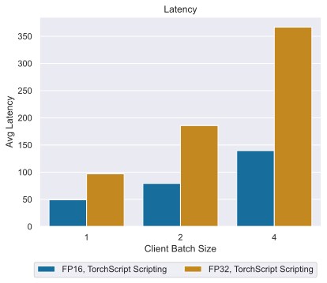</td>
</tr>
</table>

### Offline: NVIDIA DGX-1 (1x V100 32GB) with FP16
Our results were obtained using the following configuration:
 * **GPU:** NVIDIA DGX-1 (1x V100 32GB)
 * **Backend:** PyTorch
 * **Backend accelerator:** CUDA
 * **Precision:** FP16
 * **Model Format:** TorchScript
 * **Conversion variant:** Script
 * **Image resolution:** 4x128x128x128


<details>

<summary>
Full tabular data
</summary>

| Precision   |   Client Batch Size |   Inferences/second |   P90 Latency |   P95 Latency |   P99 Latency |   Avg Latency |
|:------------|--------------------:|--------------------:|--------------:|--------------:|--------------:|--------------:|
| FP16        |                   1 |                20.3 |        49.295 |        49.329 |        49.386 |        49.188 |
| FP16        |                   2 |                25.2 |        79.464 |        79.529 |        79.611 |        79.247 |
| FP16        |                   4 |                28.4 |       140.378 |       140.639 |       140.844 |       139.634 |

</details>

### Offline: NVIDIA DGX-1 (1x V100 32GB) with FP32
Our results were obtained using the following configuration:
 * **GPU:** NVIDIA DGX-1 (1x V100 32GB)
 * **Backend:** PyTorch
 * **Backend accelerator:** CUDA
 * **Precision:** FP32
 * **Model Format:** TorchScript
 * **Conversion variant:** Script
 * **Image resolution:** 4x128x128x128


<details>

<summary>
Full tabular data
</summary>

| Precision   |   Client Batch Size |   Inferences/second |   P90 Latency |   P95 Latency |   P99 Latency |   Avg Latency |
|:------------|--------------------:|--------------------:|--------------:|--------------:|--------------:|--------------:|
| FP32        |                   1 |                10.3 |        97.262 |        97.335 |        97.56  |        96.908 |
| FP32        |                   2 |                10.6 |       186.551 |       186.839 |       187.05  |       185.747 |
| FP32        |                   4 |                11.2 |       368.61  |       368.982 |       370.119 |       366.781 |

</details>

## **GPU:** NVIDIA A40
<table>
<tr>
 <td>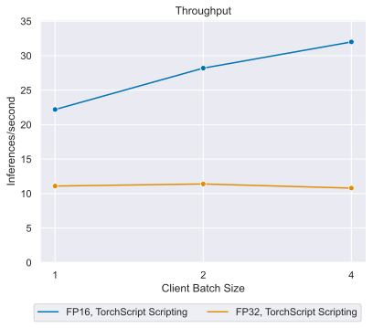</td>
 <td>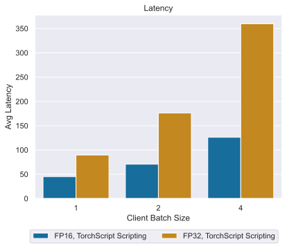</td>
</tr>
</table>

### Offline: NVIDIA A40 with FP16
Our results were obtained using the following configuration:
 * **GPU:** NVIDIA A40
 * **Backend:** PyTorch
 * **Backend accelerator:** CUDA
 * **Precision:** FP16
 * **Model Format:** TorchScript
 * **Conversion variant:** Script
 * **Image resolution:** 4x128x128x128


<details>

<summary>
Full tabular data
</summary>

| Precision   |   Client Batch Size |   Inferences/second |   P90 Latency |   P95 Latency |   P99 Latency |   Avg Latency |
|:------------|--------------------:|--------------------:|--------------:|--------------:|--------------:|--------------:|
| FP16        |                   1 |                22.2 |        44.997 |        45.001 |        45.011 |        44.977 |
| FP16        |                   2 |                28.2 |        70.697 |        70.701 |        70.711 |        70.667 |
| FP16        |                   4 |                32   |       126.1   |       126.111 |       126.13  |       126.061 |

</details>

### Offline: NVIDIA A40 with FP32
Our results were obtained using the following configuration:
 * **GPU:** NVIDIA A40
 * **Backend:** PyTorch
 * **Backend accelerator:** CUDA
 * **Precision:** FP32
 * **Model Format:** TorchScript
 * **Conversion variant:** Script
 * **Image resolution:** 4x128x128x128


<details>

<summary>
Full tabular data
</summary>

| Precision   |   Client Batch Size |   Inferences/second |   P90 Latency |   P95 Latency |   P99 Latency |   Avg Latency |
|:------------|--------------------:|--------------------:|--------------:|--------------:|--------------:|--------------:|
| FP32        |                   1 |                11.1 |        90.236 |        90.35  |        90.438 |        89.503 |
| FP32        |                   2 |                11.4 |       176.345 |       176.521 |       176.561 |       176.063 |
| FP32        |                   4 |                10.8 |       360.355 |       360.631 |       360.668 |       359.839 |

</details>


## **GPU:** NVIDIA T4
<table>
<tr>
 <td>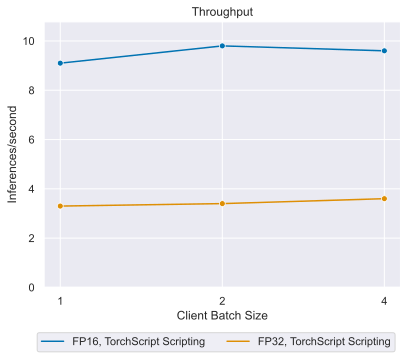</td>
 <td>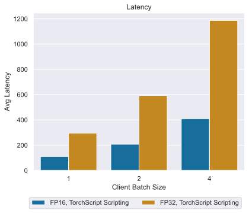</td>
</tr>
</table>

### Offline: NVIDIA T4 with FP16
Our results were obtained using the following configuration:
 * **GPU:** NVIDIA T4
 * **Backend:** PyTorch
 * **Backend accelerator:** CUDA
 * **Precision:** FP16
 * **Model Format:** TorchScript
 * **Conversion variant:** Script
 * **Image resolution:** 4x128x128x128


<details>

<summary>
Full tabular data
</summary>

| Precision   |   Client Batch Size |   Inferences/second |   P90 Latency |   P95 Latency |   P99 Latency |   Avg Latency |
|:------------|--------------------:|--------------------:|--------------:|--------------:|--------------:|--------------:|
| FP16        |                   1 |                 9.1 |       110.197 |       110.598 |       111.201 |       109.417 |
| FP16        |                   2 |                 9.8 |       209.083 |       209.347 |       209.9   |       208.026 |
| FP16        |                   4 |                 9.6 |       411.128 |       411.216 |       411.711 |       409.599 |

</details>

### Offline: NVIDIA T4 with FP32
Our results were obtained using the following configuration:
 * **GPU:** NVIDIA T4
 * **Backend:** PyTorch
 * **Backend accelerator:** CUDA
 * **Precision:** FP32
 * **Model Format:** TorchScript
 * **Conversion variant:** Script
 * **Image resolution:** 4x128x128x128


<details>

<summary>
Full tabular data
</summary>

| Precision   |   Client Batch Size |   Inferences/second |   P90 Latency |   P95 Latency |   P99 Latency |   Avg Latency |
|:------------|--------------------:|--------------------:|--------------:|--------------:|--------------:|--------------:|
| FP32        |                   1 |                 3.3 |       298.003 |       298.23  |       298.585 |       295.594 |
| FP32        |                   2 |                 3.4 |       592.412 |       592.505 |       592.881 |       591.209 |
| FP32        |                   4 |                 3.6 |      1188.76  |      1189.1   |      1189.1   |      1187.24  |

</details>


## **GPU:** NVIDIA DGX A100 (1x A100 80GB)
<table>
<tr>
 <td>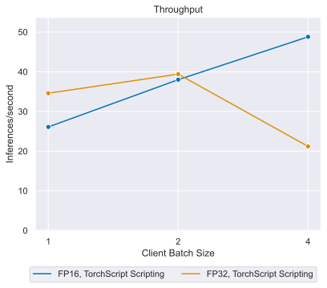</td>
 <td>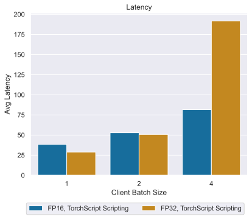</td>
</tr>
</table>

### Offline: NVIDIA DGX A100 (1x A100 80GB) with FP16
Our results were obtained using the following configuration:
 * **GPU:** NVIDIA DGX A100 (1x A100 80GB)
 * **Backend:** PyTorch
 * **Backend accelerator:** CUDA
 * **Precision:** FP16
 * **Model Format:** TorchScript
 * **Conversion variant:** Script
 * **Image resolution:** 4x128x128x128
 

<details>

<summary>
Full tabular data
</summary>

| Precision   |   Client Batch Size |   Inferences/second |   P90 Latency |   P95 Latency |   P99 Latency |   Avg Latency |
|:------------|--------------------:|--------------------:|--------------:|--------------:|--------------:|--------------:|
| FP16        |                   1 |                26.1 |        38.326 |        38.353 |        38.463 |        38.29  |
| FP16        |                   2 |                38   |        52.893 |        52.912 |        52.95  |        52.859 |
| FP16        |                   4 |                48.8 |        81.778 |        81.787 |        81.8   |        81.738 |

</details>

### Offline: NVIDIA DGX A100 (1x A100 80GB) with FP32
Our results were obtained using the following configuration:
 * **GPU:** NVIDIA DGX A100 (1x A100 80GB)
 * **Backend:** PyTorch
 * **Backend accelerator:** CUDA
 * **Precision:** FP32
 * **Model Format:** TorchScript
 * **Conversion variant:** Script
 * **Image resolution:** 4x128x128x128

<details>

<summary>
Full tabular data
</summary>

| Precision   |   Client Batch Size |   Inferences/second |   P90 Latency |   P95 Latency |   P99 Latency |   Avg Latency |
|:------------|--------------------:|--------------------:|--------------:|--------------:|--------------:|--------------:|
| FP32        |                   1 |                34.6 |        29.043 |        29.088 |        29.159 |        28.918 |
| FP32        |                   2 |                39.4 |        50.942 |        50.991 |        51.118 |        50.835 |
| FP32        |                   4 |                21.2 |       299.924 |       322.953 |       354.473 |       191.724 |

</details>


### Online scenario
This table lists the common variable parameters for all performance measurements:
| Parameter Name               | Parameter Value       |
|:-----------------------------|:----------------------|
| Model Format                 | TorchScript Scripting |
| Backend Accelerator          | CUDA                  |
| Max Batch Size               | 4                     |
| Number of model instances    | 1                     |
| Triton Max Queue Delay       | 1                     |
| Triton Preferred Batch Sizes | 2 4                   |


## **GPU:** NVIDIA DGX A100 (1x A100 80GB)

### Online: NVIDIA DGX A100 (1x A100 80GB) with FP16
Our results were obtained using the following configuration:
 * **GPU:** NVIDIA DGX A100 (1x A100 80GB)
 * **Backend:** PyTorch
 * **Backend accelerator:** CUDA
 * **Precision:** FP16
 * **Model Format:** TorchScript
 * **Conversion variant:** Script
 * **Image resolution:** 4x128x128x128


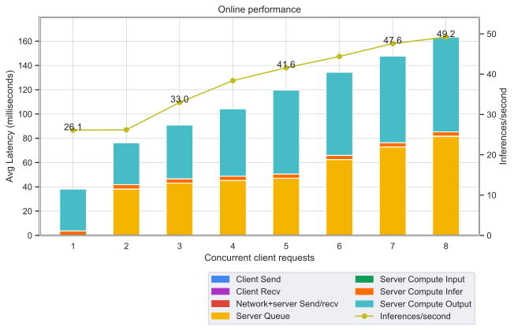
 
<details>

<summary>
Full tabular data
</summary>

|   Concurrent client requests |   Inferences/second |   Client Send |   Network+server Send/recv |   Server Queue |   Server Compute Input |   Server Compute Infer |   Server Compute Output |   Client Recv |   P50 Latency |   P90 Latency |   P95 Latency |   P99 Latency |   Avg Latency |
|-----------------------------:|--------------------:|--------------:|---------------------------:|---------------:|-----------------------:|-----------------------:|------------------------:|--------------:|--------------:|--------------:|--------------:|--------------:|--------------:|
|                            1 |                26.1 |         0.021 |                      0.081 |          0.012 |                  0.037 |                  3.582 |                  34.551 |             0 |        38.287 |        38.318 |        38.328 |        38.356 |        38.284 |
|                            2 |                26.2 |         0.022 |                      0.078 |         38.109 |                  0.036 |                  3.582 |                  34.552 |             0 |        76.381 |        76.414 |        76.423 |        76.433 |        76.379 |
|                            3 |                33   |         0.021 |                      0.095 |         42.958 |                  0.05  |                  3.55  |                  44.282 |             0 |        90.956 |        90.992 |        91.013 |        91.107 |        90.956 |
|                            4 |                38.4 |         0.031 |                      0.112 |         45.07  |                  0.069 |                  3.527 |                  55.545 |             0 |       104.352 |       104.399 |       104.419 |       104.486 |       104.354 |
|                            5 |                41.6 |         0.027 |                      0.131 |         46.829 |                  0.089 |                  3.522 |                  69.262 |             0 |       119.861 |       119.903 |       119.91  |       119.935 |       119.86  |
|                            6 |                44.4 |         0.031 |                      0.127 |         62.269 |                  0.085 |                  3.493 |                  68.42  |             0 |       134.425 |       134.467 |       134.488 |       134.608 |       134.425 |
|                            7 |                47.6 |         0.028 |                      0.146 |         72.667 |                  0.091 |                  3.473 |                  71.421 |             0 |       147.828 |       147.868 |       147.883 |       147.912 |       147.826 |
|                            8 |                49.2 |         0.031 |                      0.147 |         81.538 |                  0.101 |                  3.46  |                  78.08  |             0 |       163.351 |       163.406 |       163.435 |       163.607 |       163.357 |

</details>

### Online: NVIDIA DGX A100 (1x A100 80GB) with FP32
Our results were obtained using the following configuration:
 * **GPU:** NVIDIA DGX A100 (1x A100 80GB)
 * **Backend:** PyTorch
 * **Backend accelerator:** CUDA
 * **Precision:** FP32
 * **Model Format:** TorchScript
 * **Conversion variant:** Script
 * **Image resolution:** 4x128x128x128

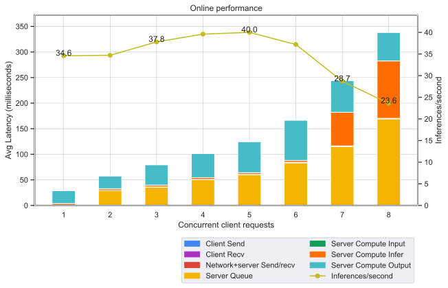
 
<details>

<summary>
Full tabular data
</summary>

|   Concurrent client requests |   Inferences/second |   Client Send |   Network+server Send/recv |   Server Queue |   Server Compute Input |   Server Compute Infer |   Server Compute Output |   Client Recv |   P50 Latency |   P90 Latency |   P95 Latency |   P99 Latency |   Avg Latency |
|-----------------------------:|--------------------:|--------------:|---------------------------:|---------------:|-----------------------:|-----------------------:|------------------------:|--------------:|--------------:|--------------:|--------------:|--------------:|--------------:|
|                            1 |                34.6 |         0.022 |                      0.085 |          0.012 |                  0.057 |                  3.54  |                  25.197 |             0 |        28.889 |        29.044 |        29.07  |        29.126 |        28.913 |
|                            2 |                34.7 |         0.03  |                      0.101 |         28.707 |                  0.056 |                  3.55  |                  25.185 |             0 |        57.585 |        57.755 |        57.787 |        58.012 |        57.629 |
|                            3 |                37.8 |         0.027 |                      0.105 |         36.011 |                  0.085 |                  3.482 |                  39.84  |             0 |        79.502 |        79.656 |        79.688 |        79.771 |        79.55  |
|                            4 |                39.6 |         0.026 |                      0.135 |         50.617 |                  0.097 |                  3.424 |                  47.198 |             0 |       101.463 |       101.683 |       101.718 |       101.818 |       101.497 |
|                            5 |                40   |         0.033 |                      0.112 |         59.913 |                  0.461 |                  3.556 |                  60.649 |             0 |       124.66  |       124.832 |       125.114 |       126.906 |       124.724 |
|                            6 |                37.2 |         0.03  |                      0     |         83.268 |                  1.142 |                  3.545 |                  78.663 |             0 |       148.762 |       149.446 |       150.996 |       411.775 |       166.648 |
|                            7 |                28.7 |         0.039 |                      0.252 |        115     |                  1.132 |                 65.661 |                  61.857 |             0 |       243.459 |       245.291 |       246.747 |       247.342 |       243.941 |
|                            8 |                23.6 |         0.039 |                      0.199 |        168.972 |                  1.052 |                112.231 |                  55.827 |             0 |       338.232 |       339.188 |       339.275 |       340.472 |       338.32  |

</details>


## **GPU:** NVIDIA A40

### Online: NVIDIA A40 with FP16
Our results were obtained using the following configuration:
 * **GPU:** NVIDIA A40
 * **Backend:** PyTorch
 * **Backend accelerator:** CUDA
 * **Precision:** FP16
 * **Model Format:** TorchScript
 * **Conversion variant:** Script
 * **Image resolution:** 4x128x128x128


 
<details>

<summary>
Full tabular data
</summary>

|   Concurrent client requests |   Inferences/second |   Client Send |   Network+server Send/recv |   Server Queue |   Server Compute Input |   Server Compute Infer |   Server Compute Output |   Client Recv |   P50 Latency |   P90 Latency |   P95 Latency |   P99 Latency |   Avg Latency |
|-----------------------------:|--------------------:|--------------:|---------------------------:|---------------:|-----------------------:|-----------------------:|------------------------:|--------------:|--------------:|--------------:|--------------:|--------------:|--------------:|
|                            1 |                22.2 |         0.073 |                      0.304 |          0.019 |                  0.07  |                  4.844 |                  39.599 |             0 |        44.912 |        44.93  |        44.938 |        44.951 |        44.909 |
|                            2 |                22.4 |         0.075 |                      0.299 |         44.198 |                  0.069 |                  4.844 |                  39.598 |             0 |        89.083 |        89.107 |        89.12  |        89.22  |        89.083 |
|                            3 |                25.9 |         0.073 |                      0.335 |         52.735 |                  0.106 |                  4.814 |                  56.894 |             0 |       114.959 |       114.987 |       114.996 |       115.006 |       114.957 |
|                            4 |                28   |         0.073 |                      0.364 |         57.54  |                  0.152 |                  4.798 |                  79.237 |             0 |       142.167 |       142.205 |       142.215 |       142.226 |       142.164 |
|                            5 |                29.8 |         0.074 |                      0.373 |         80.998 |                  0.158 |                  4.765 |                  81.681 |             0 |       168.052 |       168.103 |       168.114 |       168.147 |       168.049 |
|                            6 |                30.9 |         0.074 |                      0.386 |         97.176 |                  0.181 |                  4.756 |                  92.607 |             0 |       195.172 |       195.235 |       195.252 |       195.666 |       195.18  |
|                            7 |                31.5 |         0.077 |                      0.357 |        109.266 |                  0.213 |                  4.774 |                 108.641 |             0 |       223.325 |       223.389 |       223.4   |       223.473 |       223.328 |
|                            8 |                32   |         0.074 |                      0.359 |        125.387 |                  0.237 |                  4.783 |                 120.746 |             0 |       251.573 |       252.62  |       252.698 |       252.857 |       251.586 |

</details>

### Online: NVIDIA A40 with FP32
Our results were obtained using the following configuration:
 * **GPU:** NVIDIA A40
 * **Backend:** PyTorch
 * **Backend accelerator:** CUDA
 * **Precision:** FP32
 * **Model Format:** TorchScript
 * **Conversion variant:** Script
 * **Image resolution:** 4x128x128x128

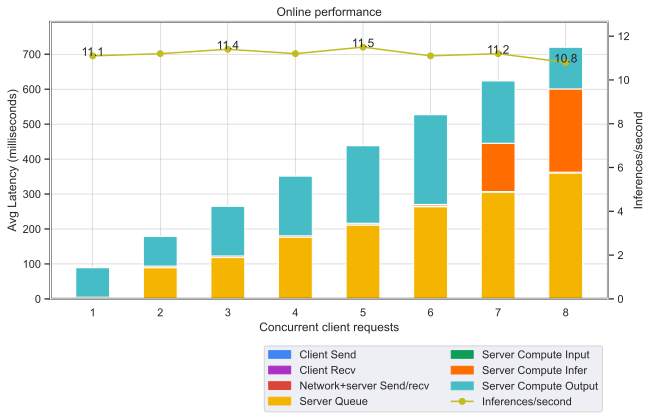
 
<details>

<summary>
Full tabular data
</summary>

|   Concurrent client requests |   Inferences/second |   Client Send |   Network+server Send/recv |   Server Queue |   Server Compute Input |   Server Compute Infer |   Server Compute Output |   Client Recv |   P50 Latency |   P90 Latency |   P95 Latency |   P99 Latency |   Avg Latency |
|-----------------------------:|--------------------:|--------------:|---------------------------:|---------------:|-----------------------:|-----------------------:|------------------------:|--------------:|--------------:|--------------:|--------------:|--------------:|--------------:|
|                            1 |                11.1 |         0.08  |                      0.286 |          0.019 |                  0.124 |                  4.467 |                  84.525 |             0 |        89.588 |        90.336 |        90.375 |        90.553 |        89.501 |
|                            2 |                11.2 |         0.077 |                      0.348 |         88.89  |                  0.123 |                  4.467 |                  84.637 |             0 |       178.634 |       179.887 |       179.99  |       180.176 |       178.542 |
|                            3 |                11.4 |         0.078 |                      0.3   |        117.917 |                  0.194 |                  4.391 |                 142.344 |             0 |       265.26  |       265.901 |       265.941 |       266.351 |       265.224 |
|                            4 |                11.2 |         0.078 |                      0.321 |        175.491 |                  0.231 |                  4.355 |                 171.23  |             0 |       351.697 |       352.266 |       352.337 |       352.512 |       351.706 |
|                            5 |                11.5 |         0.078 |                      0.353 |        210.898 |                  0.671 |                  4.372 |                 222.115 |             0 |       438.481 |       439.348 |       439.379 |       439.805 |       438.487 |
|                            6 |                11.1 |         0.078 |                      0.389 |        263.225 |                  2.16  |                  4.413 |                 256.974 |             0 |       527.101 |       528.705 |       528.849 |       528.966 |       527.239 |
|                            7 |                11.2 |         0.076 |                      0.204 |        304.798 |                  2.216 |                138.105 |                 178.66  |             0 |       624.066 |       625.626 |       625.732 |       625.977 |       624.059 |
|                            8 |                10.8 |         0.074 |                      0.459 |        359.748 |                  2.213 |                238.331 |                 119.62  |             0 |       720.475 |       721.2   |       721.206 |       721.513 |       720.445 |

</details>


## **GPU:** NVIDIA T4

### Online: NVIDIA T4 with FP16
Our results were obtained using the following configuration:
 * **GPU:** NVIDIA T4
 * **Backend:** PyTorch
 * **Backend accelerator:** CUDA
 * **Precision:** FP16
 * **Model Format:** TorchScript
 * **Conversion variant:** Script
 * **Image resolution:** 4x128x128x128

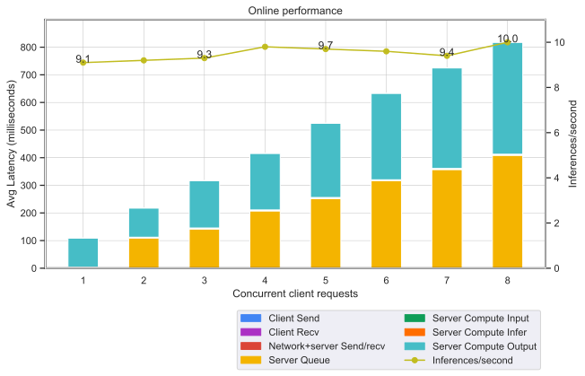
 
<details>

<summary>
Full tabular data
</summary>

|   Concurrent client requests |   Inferences/second |   Client Send |   Network+server Send/recv |   Server Queue |   Server Compute Input |   Server Compute Infer |   Server Compute Output |   Client Recv |   P50 Latency |   P90 Latency |   P95 Latency |   P99 Latency |   Avg Latency |
|-----------------------------:|--------------------:|--------------:|---------------------------:|---------------:|-----------------------:|-----------------------:|------------------------:|--------------:|--------------:|--------------:|--------------:|--------------:|--------------:|
|                            1 |                 9.1 |         0.109 |                      0.388 |          0.015 |                  0.151 |                  3.082 |                 105.624 |             0 |       109.31  |       110.144 |       110.413 |       110.505 |       109.369 |
|                            2 |                 9.2 |         0.116 |                      0.399 |        108.562 |                  0.154 |                  3.094 |                 105.774 |             0 |       218.195 |       219.242 |       219.55  |       219.902 |       218.099 |
|                            3 |                 9.3 |         0.116 |                      0.5   |        141.682 |                  0.244 |                  3.043 |                 171.276 |             0 |       316.812 |       319.269 |       319.839 |       320.185 |       316.861 |
|                            4 |                 9.8 |         0.116 |                      0.397 |        207.308 |                  0.288 |                  3.053 |                 204.455 |             0 |       415.558 |       416.726 |       416.902 |       417.25  |       415.617 |
|                            5 |                 9.7 |         0.115 |                      0.263 |        252.215 |                  0.372 |                  3.06  |                 268.918 |             0 |       525.233 |       526.928 |       527.007 |       527.18  |       524.943 |
|                            6 |                 9.6 |         0.114 |                      0.431 |        316.091 |                  0.43  |                  3.087 |                 313.056 |             0 |       633.186 |       634.815 |       634.871 |       634.899 |       633.209 |
|                            7 |                 9.4 |         0.115 |                      0.385 |        356.97  |                  0.507 |                  3.106 |                 364.103 |             0 |       725.346 |       726.226 |       726.345 |       727.387 |       725.186 |
|                            8 |                10   |         0.116 |                      0.425 |        408.406 |                  0.57  |                  3.122 |                 405.21  |             0 |       818.009 |       819.843 |       819.911 |       820.552 |       817.849 |

</details>

### Online: NVIDIA T4 with FP32
Our results were obtained using the following configuration:
 * **GPU:** NVIDIA T4
 * **Backend:** PyTorch
 * **Backend accelerator:** CUDA
 * **Precision:** FP32
 * **Model Format:** TorchScript
 * **Conversion variant:** Script
 * **Image resolution:** 4x128x128x128

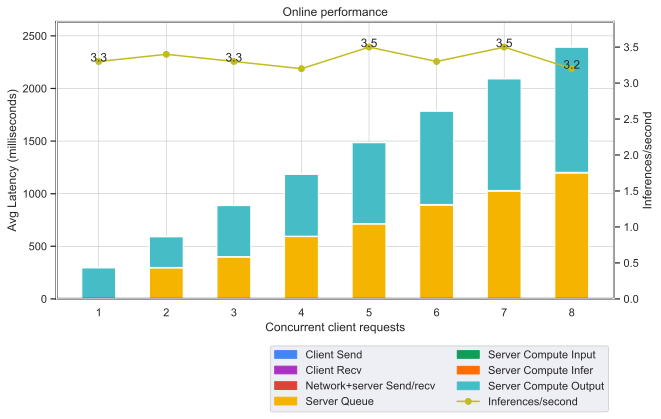
 
<details>

<summary>
Full tabular data
</summary>

|   Concurrent client requests |   Inferences/second |   Client Send |   Network+server Send/recv |   Server Queue |   Server Compute Input |   Server Compute Infer |   Server Compute Output |   Client Recv |   P50 Latency |   P90 Latency |   P95 Latency |   P99 Latency |   Avg Latency |
|-----------------------------:|--------------------:|--------------:|---------------------------:|---------------:|-----------------------:|-----------------------:|------------------------:|--------------:|--------------:|--------------:|--------------:|--------------:|--------------:|
|                            1 |                 3.3 |         0.12  |                      0.359 |          0.016 |                  0.286 |                  2.823 |                 292.021 |             0 |        296.31 |       298.223 |       298.333 |       299.091 |       295.625 |
|                            2 |                 3.4 |         0.121 |                      0.482 |        295.028 |                  0.285 |                  2.821 |                 292.411 |             0 |        590.8  |       593.113 |       593.181 |       593.506 |       591.148 |
|                            3 |                 3.3 |         0.118 |                      0.364 |        398.407 |                  0.462 |                  2.827 |                 484.536 |             0 |        887.21 |       888.227 |       888.444 |       889.069 |       886.714 |
|                            4 |                 3.2 |         0.117 |                      0.359 |        591.981 |                  0.559 |                  2.819 |                 589.073 |             0 |       1185.4  |      1187.74  |      1187.74  |      1188.02  |      1184.91  |
|                            5 |                 3.5 |         0.13  |                      0.54  |        711.986 |                  1.026 |                  2.816 |                 768.727 |             0 |       1485.15 |      1488.09  |      1488.09  |      1488.8   |      1485.22  |
|                            6 |                 3.3 |         0.137 |                      0.263 |        891.924 |                  2.513 |                  2.816 |                 887.156 |             0 |       1784.96 |      1786.4   |      1786.65  |      1786.65  |      1784.81  |
|                            7 |                 3.5 |         0.134 |                      0.61  |       1024     |                  3.064 |                  2.783 |                1061.49  |             0 |       2092.74 |      2094.77  |      2094.77  |      2094.77  |      2092.08  |
|                            8 |                 3.2 |         0.135 |                      0.858 |       1195.84  |                  3.696 |                  2.769 |                1189.92  |             0 |       2393.93 |      2394.67  |      2394.67  |      2394.67  |      2393.22  |

</details>


## **GPU:** NVIDIA DGX-1 (1x V100 32GB)

### Online: NVIDIA DGX-1 (1x V100 32GB) with FP16
Our results were obtained using the following configuration:
 * **GPU:** NVIDIA DGX-1 (1x V100 32GB)
 * **Backend:** PyTorch
 * **Backend accelerator:** CUDA
 * **Precision:** FP16
 * **Model Format:** TorchScript
 * **Conversion variant:** Script
 * **Image resolution:** 4x128x128x128

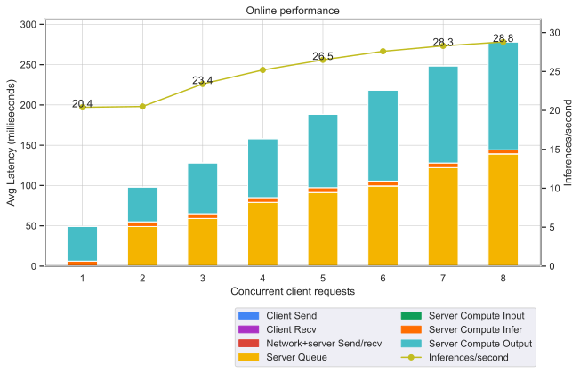
 
<details>

<summary>
Full tabular data
</summary>

|   Concurrent client requests |   Inferences/second |   Client Send |   Network+server Send/recv |   Server Queue |   Server Compute Input |   Server Compute Infer |   Server Compute Output |   Client Recv |   P50 Latency |   P90 Latency |   P95 Latency |   P99 Latency |   Avg Latency |
|-----------------------------:|--------------------:|--------------:|---------------------------:|---------------:|-----------------------:|-----------------------:|------------------------:|--------------:|--------------:|--------------:|--------------:|--------------:|--------------:|
|                            1 |                20.4 |         0.054 |                      0.21  |          0.022 |                  0.07  |                  5.813 |                  43.068 |             0 |        49.227 |        49.347 |        49.374 |        49.481 |        49.237 |
|                            2 |                20.5 |         0.058 |                      0.259 |         48.734 |                  0.075 |                  5.8   |                  43.081 |             0 |        97.959 |        98.151 |        98.226 |        98.817 |        98.007 |
|                            3 |                23.4 |         0.068 |                      0.31  |         58.668 |                  0.105 |                  5.88  |                  62.955 |             0 |       127.949 |       128.335 |       128.59  |       128.9   |       127.986 |
|                            4 |                25.2 |         0.068 |                      0.282 |         78.717 |                  0.123 |                  5.779 |                  73.061 |             0 |       157.991 |       158.398 |       158.599 |       158.762 |       158.03  |
|                            5 |                26.5 |         0.063 |                      0.303 |         90.872 |                  0.15  |                  5.866 |                  91.174 |             0 |       188.376 |       188.815 |       189.039 |       189.349 |       188.428 |
|                            6 |                27.6 |         0.067 |                      0.344 |         98.88  |                  0.192 |                  6.017 |                 112.827 |             0 |       218.299 |       219.14  |       219.271 |       219.443 |       218.327 |
|                            7 |                28.3 |         0.065 |                      0.285 |        121.672 |                  0.194 |                  5.721 |                 120.488 |             0 |       248.344 |       249.172 |       249.232 |       249.367 |       248.425 |
|                            8 |                28.8 |         0.056 |                      0.251 |        138.819 |                  0.209 |                  4.977 |                 133.895 |             0 |       277.678 |       279.799 |       280     |       280.367 |       278.207 |

</details>

### Online: NVIDIA DGX-1 (1x V100 32GB) with FP32
Our results were obtained using the following configuration:
 * **GPU:** NVIDIA DGX-1 (1x V100 32GB)
 * **Backend:** PyTorch
 * **Backend accelerator:** CUDA
 * **Precision:** FP32
 * **Model Format:** TorchScript
 * **Conversion variant:** Script
 * **Image resolution:** 4x128x128x128

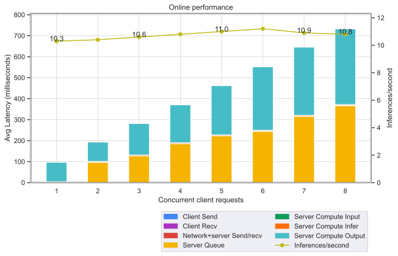
 
<details>

<summary>
Full tabular data
</summary>

|   Concurrent client requests |   Inferences/second |   Client Send |   Network+server Send/recv |   Server Queue |   Server Compute Input |   Server Compute Infer |   Server Compute Output |   Client Recv |   P50 Latency |   P90 Latency |   P95 Latency |   P99 Latency |   Avg Latency |
|-----------------------------:|--------------------:|--------------:|---------------------------:|---------------:|-----------------------:|-----------------------:|------------------------:|--------------:|--------------:|--------------:|--------------:|--------------:|--------------:|
|                            1 |                10.3 |         0.05  |                      0.194 |          0.016 |                  0.109 |                  4.508 |                  91.96  |             0 |        96.843 |        97.226 |        97.299 |        97.443 |        96.837 |
|                            2 |                10.4 |         0.05  |                      0.206 |         96.365 |                  0.106 |                  4.591 |                  91.863 |             0 |       193.236 |       193.883 |       193.988 |       194.156 |       193.181 |
|                            3 |                10.6 |         0.052 |                      0.154 |        126.753 |                  0.169 |                  4.543 |                 150.365 |             0 |       282.048 |       282.865 |       283.024 |       283.756 |       282.036 |
|                            4 |                10.8 |         0.053 |                      0.178 |        185.119 |                  0.201 |                  4.485 |                 180.649 |             0 |       370.513 |       372.052 |       372.606 |       373.333 |       370.685 |
|                            5 |                11   |         0.056 |                      0.261 |        222.045 |                  0.759 |                  4.419 |                 235.089 |             0 |       462.821 |       464.299 |       464.792 |       464.954 |       462.629 |
|                            6 |                11.2 |         0.056 |                      0.329 |        244.152 |                  0.889 |                  4.44  |                 302.491 |             0 |       552.087 |       553.883 |       554.899 |       556.337 |       552.357 |
|                            7 |                10.9 |         0.054 |                      0     |        315.268 |                  1.297 |                  4.412 |                 325.279 |             0 |       643.661 |       645.478 |       646.317 |       699.413 |       646.31  |
|                            8 |                10.8 |         0.057 |                      0.237 |        366.332 |                  1.247 |                  4.472 |                 360.891 |             0 |       733.164 |       735.221 |       735.813 |       736.436 |       733.236 |

</details>

# Release Notes
We’re constantly refining and improving our performance on AI
and HPC workloads with frequent updates
to our software stack. For our latest performance data, refer
to these pages for
[AI](https://developer.nvidia.com/deep-learning-performance-training-inference)
and [HPC](https://developer.nvidia.com/hpc-application-performance) benchmarks.

## Changelog
April 2021
  - Initial release
 
## Known issues
  - There are no known issues with this model.
 


