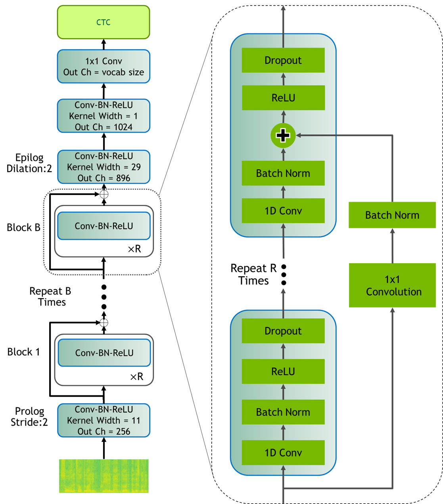
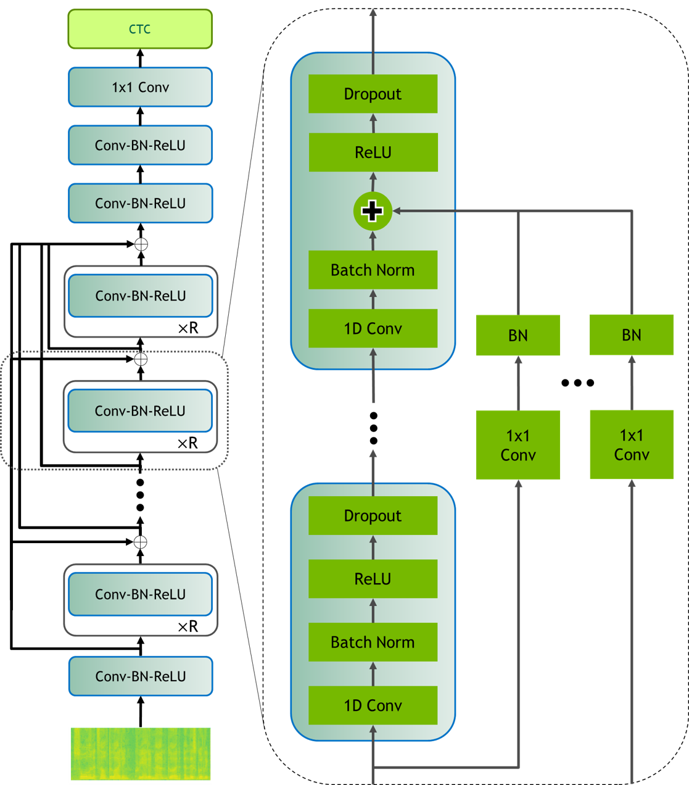

# Jasper For PyTorch

This repository provides scripts to train the Jasper model to achieve near state of the art accuracy and perform high-performance inference using NVIDIA TensorRT. This repository is tested and maintained by NVIDIA.

## Table Of Contents
- [Model overview](#model-overview)
   * [Model architecture](#model-architecture)
   * [Default configuration](#default-configuration)
   * [Feature support matrix](#feature-support-matrix)
 	   * [Features](#features)
   * [Mixed precision training](#mixed-precision-training)
 	   * [Enabling mixed precision](#enabling-mixed-precision)
   * [Glossary](#glossary)
- [Setup](#setup)
   * [Requirements](#requirements)
- [Quick Start Guide](#quick-start-guide)
- [Advanced](#advanced)
   * [Scripts and sample code](#scripts-and-sample-code)
   * [Parameters](#parameters)
   * [Command-line options](#command-line-options)
   * [Getting the data](#getting-the-data)
       * [Dataset guidelines](#dataset-guidelines)
   * [Training process](#training-process)
   * [Inference process](#inference-process)
   * [Evaluation process](#evaluation-process)
   * [Inference process with TensorRT](#inference-process-with-tensorrt)
   * [Inference process with TensorRT Inference Server](#inference-process-with-tensorrt-inference-server)
- [Performance](#performance)
   * [Benchmarking](#benchmarking)
       * [Training performance benchmark](#training-performance-benchmark)
       * [Inference performance benchmark](#inference-performance-benchmark)
   * [Results](#results)
       * [Training accuracy results](#training-accuracy-results)
           * [Training accuracy: NVIDIA DGX-1 (8x V100 32G)](#training-accuracy-nvidia-dgx-1-8x-v100-32G)
           * [Training stability test](#training-stability-test)
       * [Training performance results](#training-performance-results)
         * [Training performance: NVIDIA DGX-1 (8x V100 16G)](#training-performance-nvidia-dgx-1-8x-v100-16G)
         * [Training performance: NVIDIA DGX-1 (8x V100 32G)](#training-performance-nvidia-dgx-1-8x-v100-32G)
         * [Training performance: NVIDIA DGX-2 (16x V100 32G)](#training-performance-nvidia-dgx-2-16x-v100-32G)
       * [Inference performance results](#inference-performance-results)
           * [Inference performance: NVIDIA DGX-1 (1x V100 16G)](#inference-performance-nvidia-dgx-1-1x-v100-16G)
           * [Inference performance: NVIDIA DGX-1 (1x V100 32G)](#inference-performance-nvidia-dgx-1-1x-v100-32G)
           * [Inference performance: NVIDIA DGX-2 (1x V100 32G)](#inference-performance-nvidia-dgx-2-1x-v100-32G)
           * [Inference performance: NVIDIA T4](#inference-performance-nvidia-t4)
- [Release notes](#release-notes)
   * [Changelog](#changelog)
   * [Known issues](#known-issues)

## Model overview

This repository provides an implementation of the Jasper model in PyTorch from the paper `Jasper: An End-to-End Convolutional Neural Acoustic Model` [https://arxiv.org/pdf/1904.03288.pdf](https://arxiv.org/pdf/1904.03288.pdf).
The Jasper model is an end-to-end neural acoustic model for automatic speech recognition (ASR) that provides near state-of-the-art results on LibriSpeech among end-to-end ASR models without any external data. The Jasper architecture of convolutional layers was designed to facilitate fast GPU inference, by allowing whole sub-blocks to be fused into a single GPU kernel. This is important for meeting strict real-time requirements of ASR systems in deployment.

The results of the acoustic model are combined with the results of external language models to get the top-ranked word sequences
corresponding to a given audio segment. This post-processing step is called decoding.

This repository is a PyTorch implementation of Jasper and provides scripts to train the Jasper 10x5 model with dense residuals from scratch on the [Librispeech](http://www.openslr.org/12) dataset to achieve the greedy decoding results of the original paper.
The original reference code provides Jasper as part of a research toolkit in TensorFlow [openseq2seq](https://github.com/NVIDIA/OpenSeq2Seq).
This repository provides a simple implementation of Jasper with scripts for training and replicating the Jasper paper results.
This includes data preparation scripts, training and inference scripts.
Both training and inference scripts offer the option to use Automatic Mixed Precision (AMP) to benefit from Tensor Cores for better performance.

In addition to providing the hyperparameters for training a model checkpoint, we publish a thorough inference analysis across different NVIDIA GPU platforms, for example, DGX-1, DGX-2 and T4.

This model is trained with mixed precision using Tensor Cores on NVIDIA Volta GPUs and evaluated on Volta and Turing GPUs. Therefore, researchers can get results 3x faster than training without Tensor Cores, while experiencing the benefits of mixed precision training. This model is tested against each NGC monthly container release to ensure consistent accuracy and performance over time.

The original paper takes the output of the Jasper acoustic model and shows results for 3 different decoding variations: greedy decoding, beam search with a 6-gram language model and beam search with further rescoring of the best ranked hypotheses with Transformer XL, which is a neural language model. Beam search and the rescoring with the neural language model scores are run on CPU and result in better word error rates compared to greedy decoding.
This repository provides instructions to reproduce greedy decoding results. To run beam search or rescoring with TransformerXL, use the following scripts from the [openseq2seq](https://github.com/NVIDIA/OpenSeq2Seq) repository:
https://github.com/NVIDIA/OpenSeq2Seq/blob/master/scripts/decode.py
https://github.com/NVIDIA/OpenSeq2Seq/tree/master/external_lm_rescore

### Model architecture

Details on the model architecture can be found in the paper [Jasper: An End-to-End Convolutional Neural Acoustic Model](https://arxiv.org/pdf/1904.03288.pdf).

| | |
|:---:|:---:|
|Figure 1: Jasper BxR model: B- number of blocks, R- number of sub-blocks | Figure 2: Jasper Dense Residual |

Jasper is an end-to-end neural acoustic model that is based on convolutions.
In the audio processing stage, each frame is transformed into mel-scale spectrogram features, which the acoustic model takes as input and outputs a probability distribution over the vocabulary for each frame.
The acoustic model has a modular block structure and can be parametrized accordingly:
a Jasper BxR model has B blocks, each consisting of R repeating sub-blocks.

Each sub-block applies the following operations in sequence: 1D-Convolution, Batch Normalization, ReLU activation, and Dropout.

Each block input is connected directly to the last subblock of all following blocks via a residual connection, which is referred to as `dense residual` in the paper.
Every block differs in kernel size and number of filters, which are increasing in size from the bottom to the top layers.
Irrespective of the exact block configuration parameters B and R, every Jasper model has four additional convolutional blocks:
one immediately succeeding the input layer (Prologue) and three at the end of the B blocks (Epilogue).

The Prologue is to decimate the audio signal
in time in order to process a shorter time sequence for efficiency. The Epilogue with dilation captures a bigger context around an audio time step, which decreases the model word error rate (WER).
The paper achieves best results with Jasper 10x5 with dense residual connections, which is also the focus of this repository and is in the following referred to as Jasper Large.

### Default configuration

The following features were implemented in this model:

* GPU-supported feature extraction with data augmentation options [SpecAugment](https://arxiv.org/abs/1904.08779) and [Cutout](https://arxiv.org/pdf/1708.04552.pdf)
* offline and online [Speed Perturbation](https://www.danielpovey.com/files/2015_interspeech_augmentation.pdf)
* data-parallel multi-GPU training and evaluation
* AMP with dynamic loss scaling for Tensor Core training
* FP16 inference with AMP


Competitive training results and analysis is provided for the following Jasper model configuration

| **Model** | **Number of Blocks**  | **Number of Subblocks**  | **Max sequence length**   | **Number of Parameters**  |
|---    |---    |---    |---    |---    |
| Jasper Large  | 10    | 5 | 16.7s | 333M  |


### Feature support matrix

The following features are supported by this model.

| **Feature**   | **Jasper**    |
|---    |---    |
|[Apex AMP](https://nvidia.github.io/apex/amp.html) | Yes |
|[Apex DistributedDataParallel](https://nvidia.github.io/apex/parallel.html#apex.parallel.DistributedDataParallel) | Yes |

#### Features

[Apex AMP](https://nvidia.github.io/apex/amp.html) - a tool that enables Tensor Core-accelerated training. Refer to the [Enabling mixed precision](#enabling-mixed-precision) section for more details.

[Apex
DistributedDataParallel](https://nvidia.github.io/apex/parallel.html#apex.parallel.DistributedDataParallel) -
a module wrapper that enables easy multiprocess distributed data parallel
training, similar to
[torch.nn.parallel.DistributedDataParallel](https://pytorch.org/docs/stable/nn.html#torch.nn.parallel.DistributedDataParallel).
`DistributedDataParallel` is optimized for use with
[NCCL](https://github.com/NVIDIA/nccl). It achieves high performance by
overlapping communication with computation during `backward()` and bucketing
smaller gradient transfers to reduce the total number of transfers required.


### Mixed precision training

*Mixed precision* is the combined use of different numerical precisions in a computational method. [Mixed precision](https://arxiv.org/abs/1710.03740) training offers significant computational speedup by performing operations in half-precision format, while storing minimal information in single-precision to retain as much information as possible in critical parts of the network. Since the introduction of [Tensor Cores](https://developer.nvidia.com/tensor-cores) in the Volta and Turing architecture, significant training speedups are experienced by switching to mixed precision -- up to 3x overall speedup on the most arithmetically intense model architectures. Using mixed precision training requires two steps:

1. Porting the model to use the FP16 data type where appropriate.
2. Adding loss scaling to preserve small gradient values.

The ability to train deep learning networks with lower precision was introduced in the Pascal architecture and first supported in [CUDA 8](https://devblogs.nvidia.com/parallelforall/tag/fp16/) in the NVIDIA Deep Learning SDK.


For information about:
* How to train using mixed precision, see the[Mixed Precision Training](https://arxiv.org/abs/1710.03740) paper and [Training With Mixed Precision](https://docs.nvidia.com/deeplearning/sdk/mixed-precision-training/index.html) documentation.
* Techniques used for mixed precision training, see the [Mixed-Precision Training of Deep Neural Networks](https://devblogs.nvidia.com/mixed-precision-training-deep-neural-networks/) blog.
* APEX tools for mixed precision training, see the [NVIDIA Apex: Tools for Easy Mixed-Precision Training in PyTorch](https://devblogs.nvidia.com/apex-pytorch-easy-mixed-precision-training/).


#### Enabling mixed precision

For training, mixed precision can be enabled by setting the flag: `train.py --fp16`. You can change this behavior and execute the training in
single precision by removing the `--fp16` flag for the `train.py` training
script. For example, in the bash scripts `scripts/train.sh`, `scripts/inference.sh`, etc. the precision can be specified with the variable `PRECISION` by setting it to either `PRECISION=’fp16’` or  `PRECISION=’fp32’`.

Mixed precision is enabled in PyTorch by using the Automatic Mixed Precision
(AMP) library from [APEX](https://github.com/NVIDIA/apex) that casts variables
to half-precision upon retrieval, while storing variables in single-precision
format. Furthermore, to preserve small gradient magnitudes in backpropagation,
a [loss
scaling](https://docs.nvidia.com/deeplearning/sdk/mixed-precision-training/index.html#lossscaling)
step must be included when applying gradients. In PyTorch, loss scaling can be
easily applied by using `scale_loss()` method provided by AMP. The scaling
value to be used can be
[dynamic](https://nvidia.github.io/apex/amp.html#apex.amp.initialize) or fixed.

For an in-depth walk through on AMP, check out sample usage
[here](https://nvidia.github.io/apex/amp.html#). [APEX](https://github.com/NVIDIA/apex) is a PyTorch extension that contains
utility libraries, such as AMP, which require minimal network code changes to
leverage Tensor Cores performance.

The following steps were needed to enable mixed precision training in Jasper:

* Import AMP from APEX (file: `train.py`):
```
from apex import amp
```

* Initialize AMP and wrap the model and the optimizer
```
   model, optimizer = amp.initialize(
     min_loss_scale=1.0,
     models=model,
     optimizers=optimizer,
     opt_level=’O1’)

```

* Apply `scale_loss` context manager
```
with amp.scale_loss(loss, optimizer) as scaled_loss:
    scaled_loss.backward()
```


### Glossary

Acoustic model:
Assigns a probability distribution over a vocabulary of characters given an audio frame.

Language Model:
Assigns a probability distribution over a sequence of words. Given a sequence of words, it assigns a probability to the whole sequence.

Pre-training:
Training a model on vast amounts of data on the same (or different) task to build general understandings.

Automatic Speech Recognition (ASR):
Uses both acoustic model and language model to output the transcript of an input audio signal.


## Setup

The following section lists the requirements in order to start training and evaluating the Jasper model.

### Requirements

This repository contains a `Dockerfile` which extends the PyTorch 19.10-py3 NGC container and encapsulates some dependencies. Aside from these dependencies, ensure you have the following components:

* [NVIDIA Docker](https://github.com/NVIDIA/nvidia-docker)
* [PyTorch 19.10-py3 NGC container](https://ngc.nvidia.com/catalog/containers/nvidia:pytorch)
* [NVIDIA Volta](https://www.nvidia.com/en-us/data-center/volta-gpu-architecture/) or [Turing](https://www.nvidia.com/en-us/geforce/turing/) based GPU

Further required python packages are listed in `requirements.txt`, which are automatically installed with the Docker container built. To manually install them, run
```bash
pip install -r requirements.txt
```


For more information about how to get started with NGC containers, see the following sections from the NVIDIA GPU Cloud Documentation and the Deep Learning Documentation:

* [Getting Started Using NVIDIA GPU Cloud](https://docs.nvidia.com/ngc/ngc-getting-started-guide/index.html)
* [Accessing And Pulling From The NGC Container Registry](https://docs.nvidia.com/deeplearning/dgx/user-guide/index.html#accessing_registry)
* [Running PyTorch](https://docs.nvidia.com/deeplearning/dgx/pytorch-release-notes/running.html#running)

For those unable to use the PyTorch NGC container, to set up the required environment or create your own container, see the versioned [NVIDIA Container Support Matrix](https://docs.nvidia.com/deeplearning/dgx/support-matrix/index.html).


## Quick Start Guide

To train your model using mixed precision with Tensor Cores or using FP32, perform the following steps using the default parameters of the Jasper model on the Librispeech dataset. For details concerning training and inference, see [Advanced](#Advanced) section.

1. Clone the repository.
```bash
git clone https://github.com/NVIDIA/DeepLearningExamples
cd DeepLearningExamples/PyTorch/SpeechRecognition/Jasper
```
2. Build the Jasper PyTorch container.

Running the following scripts will build and launch the container which contains all the required dependencies for data download and processing as well as training and inference of the model.

```bash
bash scripts/docker/build.sh
```

3. Start an interactive session in the NGC container to run data download/training/inference

```bash
bash scripts/docker/launch.sh <DATA_DIR> <CHECKPOINT_DIR> <RESULT_DIR>
```
Within the container, the contents of this repository will be copied to the `/workspace/jasper` directory. The `/datasets`, `/checkpoints`, `/results` directories are mounted as volumes
and mapped to the corresponding directories `<DATA_DIR>`, `<CHECKPOINT_DIR>`, `<RESULT_DIR>` on the host.

4. Download and preprocess the dataset.

No GPU is required for data download and preprocessing. Therefore, if GPU usage is a limited resource, launch the container for this section on a CPU machine by following Steps 2 and 3.

Note: Downloading and preprocessing the dataset requires 500GB of free disk space and can take several hours to complete.

This repository provides scripts to download, and extract the following datasets:

* LibriSpeech [http://www.openslr.org/12](http://www.openslr.org/12)

LibriSpeech contains 1000 hours of 16kHz read English speech derived from public domain audiobooks from LibriVox project and has been carefully segmented and aligned. For more information, see the [LIBRISPEECH: AN ASR CORPUS BASED ON PUBLIC DOMAIN AUDIO BOOKS](http://www.danielpovey.com/files/2015_icassp_librispeech.pdf) paper.

Inside the container, download and extract the datasets into the required format for later training and inference:
```bash
bash scripts/download_librispeech.sh
```
Once the data download is complete, the following folders should exist:

* `/datasets/LibriSpeech/`
   * `train-clean-100/`
   * `train-clean-360/`
   * `train-other-500/`
   * `dev-clean/`
   * `dev-other/`
   * `test-clean/`
   * `test-other/`

Since `/datasets/` is mounted to `<DATA_DIR>` on the host (see Step 3),  once the dataset is downloaded it will be accessible from outside of the container at `<DATA_DIR>/LibriSpeech`.


Next, convert the data into WAV files and add speed perturbation with 0.9 and 1.1 to the training files:
```bash
bash scripts/preprocess_librispeech.sh
```
Once the data is converted, the following additional files and folders should exist:
* `datasets/LibriSpeech/`
   * `librispeech-train-clean-100-wav.json`
   * `librispeech-train-clean-360-wav.json`
   * `librispeech-train-other-500-wav.json`
   * `librispeech-dev-clean-wav.json`
   * `librispeech-dev-other-wav.json`
   * `librispeech-test-clean-wav.json`
   * `librispeech-test-other-wav.json`
   * `train-clean-100-wav/` containsWAV files with original speed, 0.9 and 1.1
   * `train-clean-360-wav/` contains WAV files with original speed, 0.9 and 1.1
   * `train-other-500-wav/` contains WAV files with original speed, 0.9 and 1.1
   * `dev-clean-wav/`
   * `dev-other-wav/`
   * `test-clean-wav/`
   * `test-other-wav/`


5. Start training.

Inside the container, use the following script to start training.
Make sure the downloaded and preprocessed dataset is located at `<DATA_DIR>/LibriSpeech` on the host (see Step 3), which corresponds to `/datasets/LibriSpeech` inside the container.

```bash
bash scripts/train.sh [OPTIONS]
```
By default, this will use automatic mixed precision, a batch size of 64 and run on a total of 8 GPUs. The hyperparameters are tuned for DGX-1 32GB 8x V100 GPUs and will require adjustment for 16GB GPUs (e.g. by using more gradient accumulation steps)

More details on available [OPTIONS] can be found in [Parameters](#parameters) and [Training process](#training-process).

6. Start validation/evaluation.

Inside the container, use the following script to run evaluation.
 Make sure the downloaded and preprocessed dataset is located at `<DATA_DIR>/LibriSpeech` on the host (see Step 3), which corresponds to `/datasets/LibriSpeech` inside the container.
```bash
bash scripts/evaluation.sh [OPTIONS]
```
By default, this will use full precision, a batch size of 64 and run on a single GPU.

More details on available [OPTIONS] can be found in [Parameters](#parameters) and [Evaluation process](#evaluation-process).


7. Start inference/predictions.

Inside the container, use the following script to run inference.
 Make sure the downloaded and preprocessed dataset is located at `<DATA_DIR>/LibriSpeech` on the host (see Step 3), which corresponds to `/datasets/LibriSpeech` inside the container.
A pretrained model checkpoint can be downloaded from `NGC model repository`[https://ngc.nvidia.com/catalog/models/nvidia:jasperpyt_fp16].

```bash
bash scripts/inference.sh [OPTIONS]
```
By default this will use full precision, a batch size of 64 and run on a single GPU.

More details on available [OPTIONS] can be found in [Parameters](#parameters) and [Inference process](#inference-process).


## Advanced

The following sections provide greater details of the dataset, running training and inference, and getting training and inference results.


### Scripts and sample code
In the `root` directory, the most important files are:
* `train.py` - Serves as entry point for training
* `inference.py` - Serves as entry point for inference and evaluation
* `model.py` - Contains the model architecture
* `dataset.py` - Contains the data loader and related functionality
* `optimizer.py` - Contains the optimizer
* `inference_benchmark.py` - Serves as inference benchmarking script that measures the latency of pre-processing and the acoustic model
* `requirements.py` - Contains the required dependencies that are installed when building the Docker container
* `Dockerfile` - Container with the basic set of dependencies to run Jasper

The `scripts/` folder encapsulates all the one-click scripts required for running various supported functionalities, such as:
* `train.sh` - Runs training using the `train.py` script
* `inference.sh` - Runs inference using the `inference.py` script
* `evaluation.sh` - Runs evaluation using the `inference.py` script
* `download_librispeech.sh` - Downloads LibriSpeech dataset
* `preprocess_librispeech.sh` - Preprocess LibriSpeech raw data files to be ready for training and inference
* `inference_benchmark.sh` - Runs the inference benchmark using the `inference_benchmark.py` script
* `train_benchmark.sh` - Runs the training performance benchmark using the `train.py` script
* `docker/` - Contains the scripts for building and launching the container


Other folders included in the `root` directory are:
* `notebooks/` - Contains Jupyter notebooks and example audio files
* `configs/` - Model configurations
* `utils/` - Contains the necessary files for data download and  processing
* `parts/` - Contains the necessary files for data pre-processing

### Parameters

The complete list of available parameters for `scripts/train.sh` script contains:
```bash
 DATA_DIR: directory of dataset. (default: '/datasets/LibriSpeech')
 MODEL_CONFIG: relative path to model configuration. (default: 'configs/jasper10x5dr_sp_offline_specaugment.toml')
 RESULT_DIR: directory for results, logs, and created checkpoints. (default: '/results')
CHECKPOINT: model checkpoint to continue training from. Model checkpoint is a dictionary object that contains apart from the model weights the optimizer state as well as the epoch number. If CHECKPOINT is "none" , training starts from scratch. (default: "none")
 CREATE_LOGFILE: boolean that indicates whether to create a training log that will be stored in `$RESULT_DIR`. (default: "true")
 CUDNN_BENCHMARK: boolean that indicates whether to enable cudnn benchmark mode for using more optimized kernels. (default: 'true')
 NUM_GPUS: number of GPUs to use. (default: 8)
 PRECISION: options are fp32 and fp16 with AMP. (default: 'fp16')
 EPOCHS: number of training epochs. (default: 400)
 SEED: seed for random number generator and used for ensuring reproducibility. (default: 6)
 BATCH_SIZE: data batch size. (default: 64)
 LEARNING_RATE: Initial learning rate. (default: 0.015)
 GRADIENT_ACCUMULATION_STEPS: number of gradient accumulation steps until optimizer updates weights. (default: 1)
 LAUNCH_OPT: additional launch options. (default: "none")
```

The complete list of available parameters for `scripts/inference.sh` script contains:
```bash
DATA_DIR: directory of dataset. (default: '/datasets/LibriSpeech')
DATASET: name of dataset to use. (default: 'dev-clean')
MODEL_CONFIG: model configuration. (default: 'configs/jasper10x5dr_sp_offline_specaugment.toml')
RESULT_DIR: directory for results and logs. (default: '/results')
CHECKPOINT: model checkpoint path. (required)
CREATE_LOGFILE: boolean that indicates whether to create a log file that will be stored in `$RESULT_DIR`. (default: "true")
CUDNN_BENCHMARK: boolean that indicates whether to enable cudnn benchmark mode for using more optimized kernels. (default: 'false')
PRECISION: options are fp32 and fp16 with AMP. (default: 'fp32')
NUM_STEPS: number of inference steps. If -1 runs inference on entire dataset. (default: -1)
SEED: seed for random number generator and useful for ensuring reproducibility. (default: 6)
BATCH_SIZE: data batch size.(default: 64)
MODELOUTPUT_FILE: destination path for serialized model output with binary protocol. If 'none' does not save model output. (default: 'none')
PREDICTION_FILE: destination path for saving predictions. If 'none' does not save predictions. (default: '${RESULT_DIR}/${DATASET}.predictions)
```

The complete list of available parameters for `scripts/evaluation.sh` script contains:
```bash
DATA_DIR: directory of dataset.(default: '/datasets/LibriSpeech')
DATASET: name of dataset to use.(default: 'dev-clean')
MODEL_CONFIG: model configuration.(default: 'configs/jasper10x5dr_sp_offline_specaugment.toml')
RESULT_DIR: directory for results and logs. (default: '/results')
CHECKPOINT: model checkpoint path. (required)
CREATE_LOGFILE: boolean that indicates whether to create a log file that will be stored in `$RESULT_DIR`. (default: 'true')
CUDNN_BENCHMARK: boolean that indicates whether to enable cudnn benchmark mode for using more optimized kernels. (default: 'false')
NUM_GPUS: number of GPUs to run evaluation on (default: 1)
PRECISION: options are fp32 and fp16 with AMP.(default: 'fp32')
NUM_STEPS: number of inference steps per GPU. If -1 runs inference on entire dataset (default: -1)
SEED: seed for random number generator and useful for ensuring reproducibility. (default: 0)
BATCH_SIZE: data batch size.(default: 64)
```

The `scripts/inference_benchmark.sh` script pads all input to the same length and computes the mean, 90%, 95%, 99% percentile of latency for the specified number of inference steps. Latency is measured in millisecond per batch. The `scripts/inference_benchmark.sh`
measures latency for a single GPU and extends  `scripts/inference.sh` by :
```bash
 MAX_DURATION: filters out input audio data that exceeds a maximum number of seconds. This ensures that when all filtered audio samples are padded to maximum length that length will stay under this specified threshold (default: 36)
```

The `scripts/train_benchmark.sh` script pads all input to the same length according to the input argument `MAX_DURATION` and measures average training latency and throughput performance. Latency is measured in seconds per batch, throughput in sequences per second.
The complete list of available parameters for `scripts/train_benchmark.sh` script contains:
```bash
DATA_DIR: directory of dataset.(default: '/datasets/LibriSpeech')
MODEL_CONFIG: model configuration. (default: 'configs/jasper10x5dr_sp_offline_specaugment.toml')
RESULT_DIR: directory for results and logs. (default: '/results')
CREATE_LOGFILE: boolean that indicates whether to create a log file that will be stored in `$RESULT_DIR`. (default: 'true')
CUDNN_BENCHMARK: boolean that indicates whether to enable cudnn benchmark mode for using more optimized kernels. (default: 'true')
NUM_GPUS: number of GPUs to use. (default: 8)
PRECISION: options are fp32 and fp16 with AMP. (default: 'fp16')
NUM_STEPS: number of training iterations. If -1 runs full training for  400 epochs. (default: -1)
MAX_DURATION: filters out input audio data that exceed a maximum number of seconds. This ensures that when all filtered audio samples are padded to maximum length that length will stay under this specified threshold (default: 16.7)
SEED: seed for random number generator and useful for ensuring reproducibility. (default: 0)
BATCH_SIZE: data batch size.(default: 64)
LEARNING_RATE: Initial learning rate. (default: 0.015)
GRADIENT_ACCUMULATION_STEPS: number of gradient accumulation steps until optimizer updates weights. (default: 1)
PRINT_FREQUENCY: number of iterations after which training progress is printed. (default: 1)
```


### Command-line options

To see the full list of available options and their descriptions, use the `-h` or `--help` command-line option with the Python file, for example:

```bash
python train.py --help
python inference.py --help
```

### Getting the data

The Jasper model was trained on LibriSpeech dataset. We use the concatenation of `train-clean-100`, `train-clean-360` and `train-other-500` for training and `dev-clean` for validation.

This repository contains the `scripts/download_librispeech.sh` and `scripts/preprocess_librispeech.sh` scripts which will automatically download and preprocess the training, test and development datasets. By default, data will be downloaded to the `/datasets/LibriSpeech` directory, a minimum of 500GB free space is required for download and preprocessing, the final preprocessed dataset is 320GB.


#### Dataset guidelines

The `scripts/preprocess_librispeech.sh` script converts the input audio files to WAV format with a sample rate of 16kHz, target transcripts are striped from whitespace characters, then lower-cased. For `train-clean-100`, `train-clean-360` and `train-other-500` it also creates speed perturbed versions with rates of 0.9 and 1.1 for data augmentation.

After preprocessing, the script creates JSON files with output file paths, sample rate, target transcript and other metadata. These JSON files are used by the training script to identify training and validation datasets.

The Jasper model was tuned on audio signals with a sample rate of 16kHz, if you wish to use a different sampling rate then some hyperparameters might need to be changed - specifically window size and step size.


### Training process

The training is performed using `train.py` script along with parameters defined in  `scripts/train.sh`
The `scripts/train.sh` script runs a job on a single node that trains the Jasper model from scratch using LibriSpeech as training data. To make training more efficient, we discard audio samples longer than 16.7 seconds from the training dataset, the total number of these samples is less than 1%. Such filtering does not degrade accuracy, but it allows us to decrease the number of time steps in a batch, which requires less GPU memory and increases training speed.
Apart from the default arguments as listed in the [Parameters](#parameters) section, by default the training script:

* Runs on 8 32GB V100 GPUs with training and evaluation batch size 64
* Uses FP16 precision with AMP optimization level O1 (default)
* Enables cudnn benchmark to make mixed precision training faster
* Trains on the concatenation of all 3 LibriSpeech training datasets and evaluates on the LibriSpeech dev-clean dataset
* Uses a seed of 6
* Runs for 400 epochs
* Uses an initial learning rate of 0.015 and polynomial (quadratic) learning rate decay
* Saves a checkpoint every 10 epochs
* Runs evaluation on the development dataset every 100 iterations and at the end of training
* Prints out training progress every 25 iterations
* Creates a log file with training progress
* Uses offline speed perturbed data
* Uses SpecAugment in data pre-processing
* Filters out audio samples longer than 16.7 seconds
* Pads each sequence in a batch to the same length (smallest multiple of 16 that is at least the length of the longest sequence in the batch)
* Uses masked convolutions and dense residuals as described in the paper
* Uses weight decay of 0.001
* Uses 1 gradient accumulation step
* Uses [Novograd](https://arxiv.org/pdf/1905.11286.pdf) as optimizer with betas=(0.95, 0)


These parameters will match the greedy WER [Results](#results) of the Jasper paper on a DGX1 with 32GB V100 GPUs.

### Inference process

Inference is performed using the `inference.py` script along with parameters defined in `scripts/inference.sh`.
The `scripts/inference.sh` script runs the job on a single GPU, taking a pre-trained Jasper model checkpoint and running it on the specified dataset.
Apart from the default arguments as listed in the [Parameters](#parameters) section by default the inference script:

* Evaluates on the LibriSpeech dev-clean dataset
* Uses full precision
* Uses a batch size of 64
* Runs for 1 epoch and prints out the final word error rate
* Creates a log file with progress and results which will be stored in the results folder
* Pads each sequence in a batch to the same length (smallest multiple of 16 that is at least the length of the longest sequence in the batch)
* Does not use data augmentation
* Does greedy decoding and saves the transcription in the results folder
* Has the option to save the model output tensors for more complex decoding, for example, beam search
* Has cudnn benchmark disabled

### Evaluation process

Evaluation is performed using the `inference.py` script along with parameters defined in `scripts/evaluation.sh`.
The `scripts/evaluation.sh` script runs a job on a single GPU, taking a pre-trained Jasper model checkpoint and running it on the specified dataset.
Apart from the default arguments as listed in the [Parameters](#parameters) section, by default the evaluation script:

* Uses a batch size of 64
* Evaluates the LibriSpeech dev-clean dataset
* Uses full precision
* Runs for 1 epoch and prints out the final word error rate
* Creates a log file with progress and results which is saved in the results folder
* Pads each sequence in a batch to the same length (smallest multiple of 16 that is at least the length of the longest sequence in the batch)
* Does not use data augmentation
* Has cudnn benchmark disabled


### Inference Process with TensorRT
NVIDIA TensorRT is a platform for high-performance deep learning inference. It includes a deep learning inference optimizer and runtime that delivers low latency and high-throughput for deep learning inference applications. Jasper’s architecture, which is of deep convolutional nature, is designed to facilitate fast GPU inference. After optimizing the compute-intensive acoustic model with NVIDIA TensorRT, inference throughput increased by up to 1.8x over native PyTorch. 
More information on how to perform inference using TensorRT and speed up comparison between TensorRT and native PyTorch can be found in the subfolder [./trt/README.md](trt/README.md)

### Inference Process with TensorRT Inference Server
The NVIDIA TensorRT Inference Server provides a datacenter and cloud inferencing solution optimized for NVIDIA GPUs. The server provides an inference service via an HTTP or gRPC endpoint, allowing remote clients to request inferencing for any number of GPU or CPU models being managed by the server.
More information on how to perform inference using TensorRT Inference Server with different model backends can be found in the subfolder [./trtis/README.md](trtis/README.md)


## Performance

### Benchmarking

The following section shows how to run benchmarks measuring the model performance in training and inference modes.

#### Training performance benchmark

To benchmark the training performance on a specific batch size and audio length, run:

```bash
bash scripts/train_benchmark.sh <DATA_DIR> <MODEL_CONFIG> <RESULT_DIR> <CREATE_LOGFILE> <CUDNN_BENCHMARK> <NUM_GPUS> <PRECISION> <NUM_STEPS> <MAX_DURATION> <SEED> <BATCH_SIZE>
<LEARNING_RATE> <GRADIENT_ACCUMULATION_STEPS> <PRINT_FREQUENCY>
```

By default, this script runs 400 epochs on the configuration `configs/jasper10x5dr_sp_offline_specaugment.toml` using full precision
and batch size 64 on a single node with 8x 32GB V100 GPUs cards.
By default, `NUM_STEPS=-1` means training is run for 400 EPOCHS. If `$NUM_STEPS > 0` is specified, training is only run for a user-defined number of iterations. Audio samples longer than `MAX_DURATION` are filtered out, the remaining ones are padded to this duration such that all batches have the same length. At the end of training the script saves the model checkpoint to the results folder, runs evaluation on LibriSpeech dev-clean dataset, and prints out information such as average training latency performance in seconds, average training throughput in sequences per second, final training loss, final training WER, evaluation loss and evaluation WER.


#### Inference performance benchmark

To benchmark the inference performance on a specific batch size and audio length, run:

```bash
bash scripts/inference_benchmark.sh <DATA_DIR> <DATASET> <MODEL_CONFIG> <RESULT_DIR> <CHECKPOINT> <CREATE_LOGFILE> <CUDNN_BENCHMARK> <PRECISION> <NUM_GPUS> <MAX_DURATION>
<SEED> <BATCH_SIZE>
```
By default, the script runs on a single GPU and evaluates on the entire dataset using the model configuration `configs/jasper10x5dr_sp_offline_specaugment.toml`, full precision, cudnn benchmark for faster fp16 inference and batch size 64.
By default, `MAX_DURATION` is set to 36 seconds, which covers the maximum audio length. All audio samples are padded to this length. The script prints out `MAX_DURATION`, `BATCH_SIZE` and latency performance in milliseconds per batch.


### Results

The following sections provide details on how we achieved our performance and accuracy in training and inference.
All results are trained on 960 hours of LibriSpeech with a maximum audio length of 16.7s. The training is evaluated
on LibriSpeech dev-clean, dev-other, test-clean, test-other.
The results for Jasper Large's word error rate from the original paper after greedy decoding are shown below:


| **Number of GPUs**    |  **dev-clean WER** | **dev-other WER**| **test-clean WER**| **test-other WER**
|---    |---    |---    |---    |---    |
|8  |   3.64|   11.89| 3.86 | 11.95


#### Training accuracy results

##### Training accuracy: NVIDIA DGX-1 (8x V100 32G)

Our results were obtained by running the `scripts/train.sh` training script in the PyTorch 19.10-py3 NGC container with NVIDIA DGX-1 with (8x V100 32G) GPUs.
The following tables report the word error rate(WER) of the acoustic model with greedy decoding on all LibriSpeech dev and test datasets for mixed precision training.

FP16 (seed #6)

| **Number of GPUs**    | **Batch size per GPU**    | **dev-clean WER** | **dev-other WER**| **test-clean WER**| **test-other WER**| **Total time to train with FP16 (Hrs)** |
|---    |---    |---    |---    |---    |---    |---    |
|8 |64| 3.51|11.14|3.74|11.06|100

FP32 training matches the results of mixed precision training and takes approximately 330 hours.


##### Training stability test

The following table compares greedy decoding word error rates across 8 different training runs with different seeds for mixed precision training.

| **FP16, 8x GPUs** | **seed #1** | **seed #2** | **seed #3** | **seed #4** | **seed #5** | **seed #6** | **seed #7** | **seed #8** | **mean** | **std** |
|:-----------:|:-----:|:-----:|:-----:|:-----:|:-----:|:-----:|:-----:|:-----:|:-----:|:-----:|
|dev-clean|3.74|3.75|3.77|3.68|3.75|3.51|3.71|3.58|3.69|0.09
|dev-other|11.56|11.62|11.5|11.36|11.62|11.14|11.8|11.3|11.49|0.21
|test-clean|3.9|3.95|3.88|3.79|3.95|3.74|4.03|3.85|3.89|0.09
|test-other|11.47|11.54|11.51|11.29|11.54|11.06|11.68|11.29|11.42|0.20


#### Training performance results

Our results were obtained by running the `scripts/train.sh` training script in the PyTorch 19.10-py3 NGC container. Performance (in sequences per second) is the steady-state throughput.

##### Training performance: NVIDIA DGX-1 (8x V100 16G)

| **GPUs** | **Batch size / GPU** | **Throughput - FP32** | **Throughput - mixed precision** | **Throughput speedup (FP32 to mixed precision)** | **Weak scaling - FP32** | **Weak scaling - mixed precision** |
|---|---|-----|------|----|----|----|
| 1 | 16 | 10| 29.63| 2.96| 1.00| 1.00|
| 4 | 16 | 38.79| 106.67| 2.75| 3.88| 3.60|
| 8 | 16 | 76.64| 209.84| 2.74| 7.66| 7.08|


| **GPUs** | **Batch size / GPU** | **Throughput - FP32** | **Throughput - mixed precision** | **Throughput speedup (FP32 to mixed precision)** | **Weak scaling - FP32** | **Weak scaling - mixed precision** |
|---|---|-----|------|----|----|----|
| 1 | 32 | - | 35.16 | - | - | 1.00 |
| 4 | 32 | - | 134.74 | - | - | 3.83 |
| 8 | 32 | - | 263.92 | - | - | 7.51 |


Note: The respective values for FP32 runs that use a batch size of 32 are not available due to out of memory errors that arise. Batch size of 32 is only available when using FP16.

To achieve these same results, follow the [Quick Start Guide](#quick-start-guide) outlined above.

##### Training performance: NVIDIA DGX-1 (8x V100 32GB)

| **GPUs** | **Batch size / GPU** | **Throughput - FP32** | **Throughput - mixed precision** | **Throughput speedup (FP32 to mixed precision)** | **Weak scaling - FP32** | **Weak scaling - mixed precision** |
|---|---|-----|------|----|----|----|
| 1 | 32 | 12.26| 34.04| 2.78| 1.00| 1.00|
| 4 | 32 | 48.67| 131.96| 2.71| 3.97| 3.88|
| 8 | 32 | 95.88| 253.47| 2.64| 7.82| 7.45|


| **GPUs** | **Batch size / GPU** | **Throughput - FP32** | **Throughput - mixed precision** | **Throughput speedup (FP32 to mixed precision)** | **Weak scaling - FP32** | **Weak scaling - mixed precision** |
|---|---|-----|------|----|----|----|
| 1 | 64 | - | 41.03 | - | - | 1.00 |
| 4 | 64 | - | 159.01 | - | - | 3.88 |
| 8 | 64 | - | 312.20 | - | - | 7.61 |


Note: The respective values for FP32 runs that use a batch size of 64 are not available due to out of memory errors that arise. Batch size of 64 is only available when using FP16.

To achieve these same results, follow the [Quick Start Guide](#quick-start-guide) outlined above.

##### Training performance: NVIDIA DGX-2 (16x V100 32GB)

| **GPUs** | **Batch size / GPU** | **Throughput - FP32** | **Throughput - mixed precision** | **Throughput speedup (FP32 to mixed precision)** | **Weak scaling - FP32** | **Weak scaling - mixed precision** |
|---|---|-----|------|----|----|----|
| 1 | 32 | 8.12| 24.24| 2.98| 1.00| 1.00|
| 4 | 32 | 32.16| 92.09| 2.86| 3.96| 3.80|
| 8 | 32 | 63.68| 181.56| 2.85| 7.84| 7.49|
|16 | 32 | 124.88| 275.67| 2.20| 15.38| 11.35|


| **GPUs** | **Batch size / GPU** | **Throughput - FP32** | **Throughput - mixed precision** | **Throughput speedup (FP32 to mixed precision)** | **Weak scaling - FP32** | **Weak scaling - mixed precision** |
|---|---|-----|------|----|----|----|
| 1 | 64 | - | 29.22 | - | - | 1.00 |
| 4 | 64 | - | 114.29 | - | - | 3.91 |
| 8 | 64 | - | 222.61 | - | - | 7.62 |
|16 | 64 | - | 414.57 | - | - | 14.19 |


Note: The respective values for FP32 runs that use a batch size of 64 are not available due to out of memory errors that arise. Batch size of 64 is only available when using FP16.

To achieve these same results, follow the [Quick Start Guide](#quick-start-guide) outlined above.


#### Inference performance results

Our results were obtained by running the `scripts/inference_benchmark.sh` script in the PyTorch 19.10-py3 NGC container on NVIDIA DGX-1, DGX-2 and T4 on a single GPU. Performance numbers (latency in milliseconds per batch) were averaged over 1000 iterations.

##### Inference performance: NVIDIA DGX-1 (1x V100 16G)

|   |       |FP16 Latency (ms) Percentiles  | | |       |FP32 Latency (ms) Percentiles  | | | | FP16/FP32 speed up|
|---    |---    |---    |---    |---    |---    |---    |---    |---    |---    |---    |
|BS |Sequence Length (in seconds) |90%    |95%    |99%    |Avg   |90%    |95%    |99%    |Avg   |Avg   |
|1|2|62.16|64.71|67.29|61.31|69.37|69.75|75.38|68.95|1.12
|2|2|60.94|63.60|68.03|59.57|82.18|83.12|84.26|75.33|1.26
|4|2|68.38|69.55|75.85|64.82|85.74|86.85|93.78|82.55|1.27
|8|2|68.80|71.54|73.28|62.83|104.22|106.58|109.41|95.77|1.52
|16|2|72.33|72.85|74.55|64.69|127.11|129.34|131.46|109.80|1.70
|1|7|59.06|60.51|62.83|58.10|75.41|75.72|78.64|74.70|1.29
|2|7|61.68|67.73|68.58|59.53|97.85|98.59|98.99|91.60|1.54
|4|7|60.88|62.13|65.23|60.38|119.08|119.80|121.28|118.67|1.97
|8|7|70.71|71.82|74.23|70.16|181.48|185.00|186.20|177.98|2.54
|16|7|93.75|94.70|100.58|92.96|219.72|220.25|221.28|215.09|2.31
|1|16.7|68.87|69.48|71.75|63.63|101.03|101.66|104.00|100.32|1.58
|2|16.7|73.00|73.76|75.58|66.44|145.64|146.64|152.41|143.69|2.16
|4|16.7|77.71|78.75|79.90|77.34|224.62|225.43|226.43|223.96|2.90
|8|16.7|96.34|97.07|104.46|95.94|318.52|319.13|320.74|316.14|3.30
|16|16.7|154.63|156.81|159.25|151.05|375.67|377.00|381.79|371.83|2.46

To achieve these same results, follow the [Quick Start Guide](#quick-start-guide) outlined above.


##### Inference performance: NVIDIA DGX-1 (1x V100 32G)

|   |       |FP16 Latency (ms) Percentiles  | | |       |FP32 Latency (ms) Percentiles  | | | | FP16/FP32 speed up|
|---    |---    |---    |---    |---    |---    |---    |---    |---    |---    |---    |
|BS |Sequence Length (in seconds) |90%    |95%    |99%    |Avg   |90%    |95%    |99%    |Avg   |Avg   |
|1|2|61.60|62.81|69.62|60.71|82.32|83.03|85.72|77.48|1.28
|2|2|68.82|70.10|72.08|61.91|77.99|81.99|85.13|76.93|1.24
|4|2|70.06|70.69|72.58|74.76|88.36|89.67|95.61|94.50|1.26
|8|2|69.98|71.51|74.20|64.20|105.82|107.16|110.04|98.02|1.53
|16|2|72.05|74.16|75.51|65.46|130.49|130.97|132.83|112.74|1.72
|1|7|61.40|61.78|65.53|60.93|75.72|75.83|76.55|75.35|1.24
|2|7|60.50|60.63|61.77|60.15|91.05|91.16|92.39|90.75|1.51
|4|7|64.67|71.41|72.10|64.19|123.77|123.99|124.92|123.38|1.92
|8|7|67.96|68.04|69.38|67.60|176.43|176.65|177.25|175.39|2.59
|16|7|95.41|95.80|100.94|93.86|213.04|213.38|215.52|212.05|2.26
|1|16.7|61.28|61.67|62.52|60.63|104.37|104.56|105.22|103.83|1.71
|2|16.7|66.88|67.31|68.09|66.40|151.08|151.61|152.26|146.73|2.21
|4|16.7|80.51|80.79|81.95|80.12|226.75|227.07|228.76|225.82|2.82
|8|16.7|95.66|95.89|98.86|95.62|314.74|316.74|318.66|312.10|3.26
|16|16.7|156.60|157.07|160.15|151.13|366.70|367.41|370.98|364.05|2.41

To achieve these same results, follow the [Quick Start Guide](#quick-start-guide) outlined above.


##### Inference performance: NVIDIA DGX-2 (1x V100 32G)

|   |       |FP16 Latency (ms) Percentiles  | | |       |FP32 Latency (ms) Percentiles  | | | | FP16/FP32 speed up|
|---    |---    |---    |---    |---    |---    |---    |---    |---    |---    |---    |
|BS |Sequence Length (in seconds) |90%    |95%    |99%    |Avg   |90%    |95%    |99%    |Avg   |Avg   |
|1|2|56.11|56.76|62.18|51.77|67.75|68.91|73.80|64.96|1.25
|2|2|55.56|56.96|61.72|50.63|65.84|69.88|74.05|63.57|1.26
|4|2|54.84|57.69|61.16|60.74|74.00|76.58|81.62|81.01|1.33
|8|2|57.15|57.92|60.80|52.47|90.56|91.83|93.79|84.58|1.61
|16|2|58.27|58.54|60.24|53.26|113.25|113.55|115.41|98.56|1.85
|1|7|49.16|49.39|50.82|48.31|64.53|64.84|65.79|63.90|1.32
|2|7|53.54|54.07|55.28|49.11|78.64|79.46|81.25|78.17|1.59
|4|7|50.87|51.15|53.36|50.07|109.33|110.61|114.00|108.17|2.16
|8|7|63.57|64.18|65.55|60.64|163.95|164.19|165.75|163.49|2.70
|16|7|82.15|83.66|87.01|81.46|196.15|197.18|202.09|195.36|2.40
|1|16.7|49.68|50.00|51.39|48.76|89.10|89.42|90.41|88.57|1.82
|2|16.7|52.47|52.91|54.27|51.51|128.58|129.09|130.34|127.36|2.47
|4|16.7|66.60|67.52|68.88|65.88|220.50|221.50|223.14|219.42|3.33
|8|16.7|85.42|86.03|88.37|85.11|293.80|294.39|296.21|290.58|3.41
|16|16.7|140.76|141.74|147.25|137.31|345.26|346.29|351.15|342.64|2.50


To achieve these same results, follow the [Quick Start Guide](#quick-start-guide) outlined above.

##### Inference performance: NVIDIA T4
|   |       |FP16 Latency (ms) Percentiles  | | |       |FP32 Latency (ms) Percentiles  | | | | FP16/FP32 speed up|
|---    |---    |---    |---    |---    |---    |---    |---    |---    |---    |---    |
|BS |Sequence Length (in seconds) |90%    |95%    |99%    |Avg   |90%    |95%    |99%    |Avg   |Avg   |
|1|2|57.30|57.50|74.62|56.74|73.71|73.98|88.79|72.95|1.29
|2|2|53.68|69.69|76.08|52.63|82.83|93.38|97.67|78.23|1.49
|4|2|72.26|76.49|83.92|57.60|116.06|121.25|125.98|104.17|1.81
|8|2|70.52|71.85|76.26|58.16|159.92|161.22|164.76|148.34|2.55
|16|2|78.29|79.04|82.86|66.97|251.96|252.67|253.64|206.41|3.08
|1|7|54.83|54.94|55.50|54.58|85.57|89.11|89.71|84.08|1.54
|2|7|55.17|55.38|67.09|54.87|134.28|135.76|138.23|131.01|2.39
|4|7|74.24|78.09|79.51|73.75|214.77|215.65|217.28|211.66|2.87
|8|7|99.99|100.34|104.26|98.84|379.67|380.96|382.70|375.12|3.80
|16|7|167.48|168.07|177.29|166.53|623.36|624.11|625.89|619.34|3.72
|1|16.7|72.23|72.65|80.13|67.77|155.76|157.11|160.05|151.85|2.24
|2|16.7|75.43|76.04|80.41|74.65|259.56|261.23|266.09|252.80|3.39
|4|16.7|131.71|132.45|134.92|129.63|481.40|484.17|486.88|469.05|3.62
|8|16.7|197.10|197.94|200.15|193.88|806.76|812.73|822.27|792.85|4.09
|16|16.7|364.22|365.22|372.17|358.62|1165.78|1167.11|1171.02|1150.44|3.21

To achieve these same results, follow the [Quick Start Guide](#quick-start-guide) outlined above.

## Release notes

### Changelog

December 2019
* Inference support for TRT 6 with dynamic shapes
* Inference support for TensorRT Inference Server with acoustic model backends in ONNX, PyTorch JIT, TensorRT
* Jupyter notebook for inference with TensorRT Inference Server

November 2019
* Google Colab notebook for inference with native TensorRT

September 2019
* Inference support for TensorRT 6 with static shapes
* Jupyter notebook for inference

August 2019
* Initial release


### Known issues

There are no known issues in this release.
