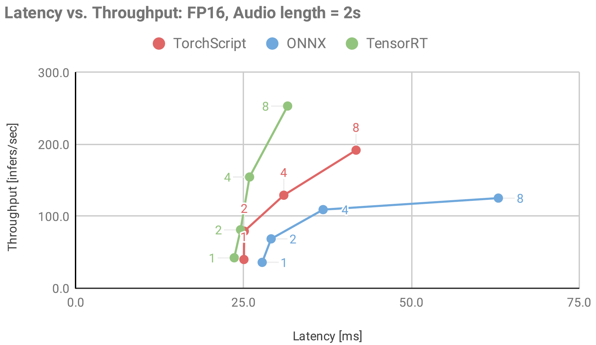
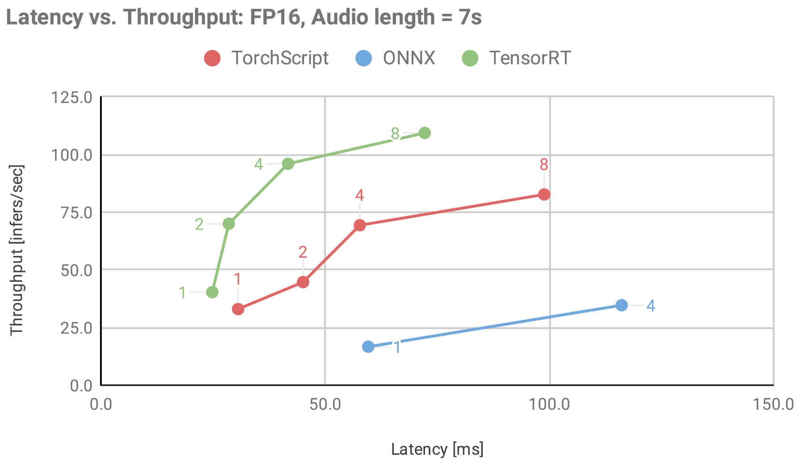
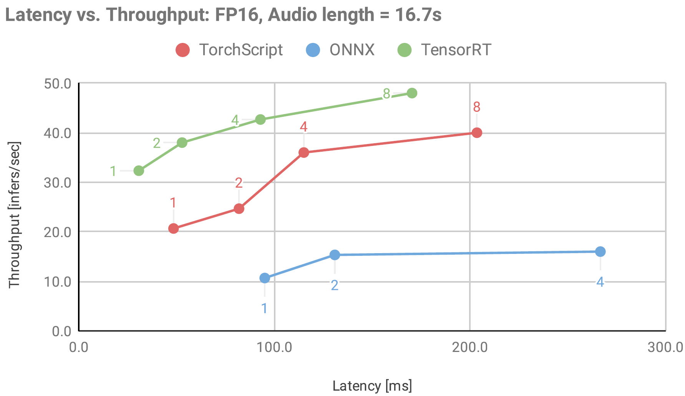
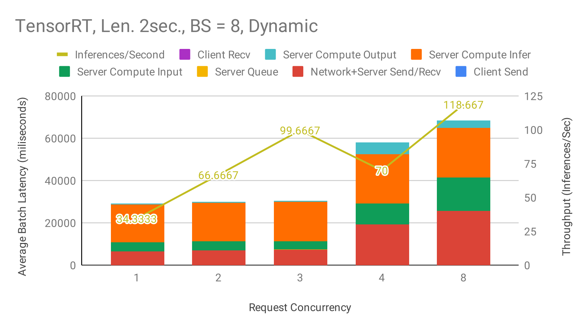
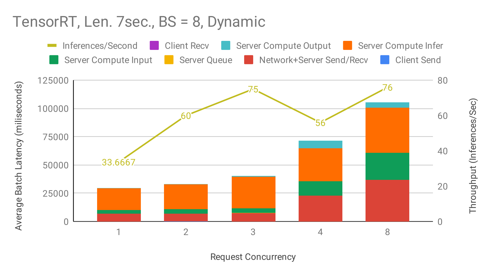

# Deploying the Jasper Inference model using Triton Inference Server

This subfolder of the Jasper for PyTorch repository contains scripts for  deployment of high-performance inference on NVIDIA Triton Inference Server as well as detailed performance analysis. It offers different options for the inference model pipeline.


## Table Of Contents
- [Solution overview](#solution-overview)
- [Inference Pipeline in Triton Inference Server](#inference-pipeline-in-triton-inference-server)
- [Setup](#setup)
- [Quick Start Guide](#quick-start-guide)
- [Advanced](#advanced)
     * [Scripts and sample code](#scripts-and-sample-code)
- [Performance](#performance)
     * [Inference Benchmarking in Triton Inference Server](#inference-benchmarking-in-triton-inference-server)
     * [Results](#results)
       * [Performance Analysis for Triton Inference Server: NVIDIA T4](#performance-analysis-for-triton-inference-server-nvidia-t4)
       * [Maximum batch size](#maximum-batch-size)
            * [Batching techniques: Static versus Dynamic Batching](#batching-techniques-static-versus-dynamic)
            * [TensorRT, ONNXRT-CUDA, and PyTorch JIT comparisons](#tensorrt-onnxrt-cuda-and-pytorch-jit-comparisons)
- [Release Notes](#release-notes)
	* [Changelog](#change-log)
	* [Known issues](#known-issues)


## Solution Overview

The [NVIDIA Triton Inference Server](https://github.com/NVIDIA/triton-inference-server) provides a datacenter and cloud inferencing solution optimized for NVIDIA GPUs. The server provides an inference service via an HTTP or gRPC endpoint, allowing remote clients to request inferencing for any number of GPU or CPU models being managed by the server.

This folder contains detailed performance analysis as well as scripts to run Jasper inference using Triton Inference Server.

A typical Triton Inference Server pipeline can be broken down into the following steps:

1. The client serializes the inference request into a message and sends it to the server (Client Send).
2. The message travels over the network from the client to the server (Network).
3. The message arrives at the server, and is deserialized (Server Receive).
4. The request is placed on the queue (Server Queue).
5. The request is removed from the queue and computed (Server Compute).
6. The completed request is serialized in a message and sent back to the client (Server Send).
7. The completed message then travels over the network from the server to the client (Network).
8. The completed message is deserialized by the client and processed as a completed inference request (Client Receive).

Generally, for local clients, steps 1-4 and 6-8 will only occupy a small fraction of time, compared to step 5. As backend deep learning systems like Jasper are rarely exposed directly to end users, but instead only interfacing with local front-end servers, for the sake of Jasper, we can consider that all clients are local.

In this section, we will go over how to launch both the Triton Inference Server and the client and get the best performance solution that fits your specific application needs.

More information on how to perform inference using NVIDIA Triton Inference Server can be found in [triton/README.md](https://github.com/triton-inference-server/server/blob/master/README.md).


## Inference Pipeline in Triton Inference Server

The Jasper model pipeline consists of 3 components, where each part can be customized to be a different backend:

**Data preprocessor**

The data processor transforms an input raw audio file into a spectrogram. By default the pipeline uses mel filter banks as spectrogram features. This part does not have any learnable weights.

**Acoustic model**

The acoustic model takes in the spectrogram and outputs a probability over a list of characters. This part is the most compute intensive, taking more than 90% of the entire end-to-end pipeline. The acoustic model is the only component with learnable parameters and what differentiates Jasper from other end-to-end neural speech recognition models. In the original paper, the acoustic model contains a masking operation for training (More details in [Jasper PyTorch README](../README.md)). We do not use masking for inference.

**Greedy decoder**

The decoder takes the probabilities over the list of characters and outputs the final transcription. Greedy decoding is a fast and simple way of doing this by always choosing the character with the maximum probability.

To run a model with TensorRT, we first construct the model in PyTorch, which is then exported into a ONNX static graph. Finally, a TensorRT engine is constructed from the ONNX file and can be launched to do inference. The following table shows which backends are supported for each part along the model pipeline.

|Backend\Pipeline component|Data preprocessor|Acoustic Model|Decoder|
|---|---|---|---|
|PyTorch JIT|x|x|x|
|ONNX|-|x|-|
|TensorRT|-|x|-|

In order to run inference with TensorRT outside of the inference server, refer to the [Jasper TensorRT README](../tensort/README.md).


## Setup

The repository contains a folder `./triton` with a `Dockerfile` which extends the PyTorch 20.10-py3 NGC container and encapsulates some dependencies. Ensure you have the following components:

- [NVIDIA Docker](https://github.com/NVIDIA/nvidia-docker)
- [PyTorch 20.10-py3 NGC container](https://ngc.nvidia.com/catalog/containers/nvidia:pytorch)
- [Triton Inference Server 20.10 NGC container](https://ngc.nvidia.com/catalog/containers/nvidia:tritonserver)
- Access to [NVIDIA machine learning repository](https://developer.download.nvidia.com/compute/machine-learning/repos/ubuntu1804/x86_64/nvidia-machine-learning-repo-ubuntu1804_1.0.0-1_amd64.deb) and [NVIDIA CUDA repository](https://developer.download.nvidia.com/compute/cuda/repos/ubuntu1804/x86_64/cuda-repo-ubuntu1804_10.1.243-1_amd64.deb) for NVIDIA TensorRT 6
- Supported GPUs:
    - [NVIDIA Volta architecture](https://www.nvidia.com/en-us/data-center/volta-gpu-architecture/)
    - [NVIDIA Turing architecture](https://www.nvidia.com/en-us/geforce/turing/)
    - [NVIDIA Ampere architecture](https://www.nvidia.com/en-us/data-center/nvidia-ampere-gpu-architecture/)
- [Pretrained Jasper Model Checkpoint](https://ngc.nvidia.com/catalog/models/nvidia:jasper_pyt_ckpt_amp)

Required Python packages are listed in `requirements.txt`. These packages are automatically installed when the Docker container is built.


## Quick Start Guide

Running the following scripts will build and launch the container containing all required dependencies for native PyTorch as well as Triton. This is necessary for using inference and can also be used for data download, processing, and training of the model. For more information on the scripts and arguments, refer to the [Advanced](#advanced) section.

1. Clone the repository.

    ```bash
    git clone https://github.com/NVIDIA/DeepLearningExamples
    cd DeepLearningExamples/PyTorch/SpeechRecognition/Jasper
    ```

2. Build the Jasper PyTorch container.

    Running the following scripts will build the container which contains all the required dependencies for data download and processing as well as converting the model.

    ```bash
    bash scripts/docker/build.sh
    ```

3. Start an interactive session in the Docker container:

    ```bash
    bash scripts/docker/launch.sh <DATA_DIR> <CHECKPOINT_DIR> <RESULT_DIR>
    ```

    Where <DATA_DIR>, <CHECKPOINT_DIR> and <RESULT_DIR> can be either empty or absolute directory paths to dataset, existing checkpoints or potential output files. When left empty, they default to `datasets/`, `/checkpoints`, and `results/`, respectively. The `/datasets`, `/checkpoints`, `/results` directories will be mounted as volumes and mapped to the corresponding directories `<DATA_DIR>`, `<CHECKPOINT_DIR>`, `<RESULT_DIR>` on the host.

    Note that `<DATA_DIR>`, `<CHECKPOINT_DIR>`, and `<RESULT_DIR>` directly correspond to the same arguments in `scripts/docker/launch.sh` and `trt/scripts/docker/launch.sh` mentioned in the [Jasper PyTorch README](../README.md) and [Jasper TensorRT README](../tensorrt/README.md).

    Briefly, `<DATA_DIR>` should contain, or be prepared to contain a `LibriSpeech` sub-directory (created in [Acquiring Dataset](../trt/README.md)), `<CHECKPOINT_DIR>` should contain a PyTorch model checkpoint (`*.pt`) file obtained through training described in [Jasper PyTorch README](../README.md), and `<RESULT_DIR>` should be prepared to contain converted model and logs.

4. Downloading the `test-clean` part of `LibriSpeech` is required for model conversion. But it is not required for inference on Triton Inference Server, which can use a single .wav audio file. To download and preprocess LibriSpeech, run the following inside the container:

   ```bash
   bash triton/scripts/download_triton_librispeech.sh
   bash triton/scripts/preprocess_triton_librispeech.sh
   ```

5. (Option 1) Convert pretrained PyTorch model checkpoint into Triton Inference Server compatible model backends.

   Inside the container, run:

    ```bash
    export CHECKPOINT_PATH=<CHECKPOINT_PATH>
    export CONVERT_PRECISIONS=<CONVERT_PRECISIONS>
    export CONVERTS=<CONVERTS>
    bash triton/scripts/export_model.sh
    ```

   Where `<CHECKPOINT_PATH>` (`"/checkpoints/jasper_fp16.pt"`) is the absolute file path of the pretrained checkpoint, `<CONVERT_PRECISIONS>` (`"fp16" "fp32"`) is the list of precisions used for conversion, and `<CONVERTS>` (`"feature-extractor" "decoder" "ts-trace" "onnx" "tensorrt"`) is the list of conversions to be applied. The feature extractor converts only to TorchScript trace module (`feature-extractor`), the decoder only to TorchScript script module (`decoder`), and the Jasper model can convert to TorchScript trace module (`ts-trace`), ONNX (`onnx`), or TensorRT (`tensorrt`).

   A pretrained PyTorch model checkpoint for model conversion can be downloaded from the [NGC model repository](https://ngc.nvidia.com/catalog/models/nvidia:jasper_pyt_ckpt_amp).

   More details can be found in the [Advanced](#advanced) section under [Scripts and sample code](#scripts-and-sample-code).

6. (Option 2) Download pre-exported inference checkpoints from NGC.

   Alternatively, you can skip the manual model export and download already generated model backends for every version of the model pipeline.

   * [Jasper_ONNX](https://ngc.nvidia.com/catalog/models/nvidia:jasper_pyt_onnx_fp16_amp/version),
   * [Jasper_TorchScript](https://ngc.nvidia.com/catalog/models/nvidia:jasper_pyt_torchscript_fp16_amp/version),
   * [Jasper_TensorRT_Turing](https://ngc.nvidia.com/catalog/models/nvidia:jasper_pyt_trt_fp16_amp_turing/version),
   * [Jasper_TensorRT_Volta](https://ngc.nvidia.com/catalog/models/nvidia:jasper_pyt_trt_fp16_amp_volta/version).

   If you wish to use TensorRT pipeline, make sure to download the correct version for your hardware. The extracted model folder should contain 3 subfolders `feature-extractor-ts-trace`, `decoder-ts-script` and `jasper-x` where `x` can be `ts-trace`, `onnx`, `tensorrt` depending on the model backend. Copy the 3 model folders to the directory `./triton/model_repo/fp16` in your Jasper project.

7. Build a container that extends Triton Inference Client:

    From outside the container, run:

    ```bash
    bash triton/scripts/docker/build_triton_client.sh
    ```

Once the above steps are completed you can either run inference benchmarks or perform inference on real data.

8. (Option 1) Run all inference benchmarks.

    From outside the container, run:

    ```bash
    export RESULT_DIR=<RESULT_DIR>
    export PRECISION_TESTS=<PRECISION_TESTS>
    export BATCH_SIZES=<BATCH_SIZES>
    export SEQ_LENS=<SEQ_LENS>
    bash triton/scripts/execute_all_perf_runs.sh
    ```

    Where `<RESULT_DIR>` is the absolute path to potential output files (`./results`), `<PRECISION_TESTS>` is a list of precisions to be tested (`"fp16" "fp32"`), `<BATCH_SIZES>` is a list of tested batch sizes (`"1" "2" "4" "8"`), and `<SEQ_LENS>` are tested sequnce lengths (`"32000" "112000" "267200"`).

    Note: This can take several hours to complete due to the extensiveness of the benchmark. More details about the benchmark are found in the [Advanced](#advanced) section under [Performance](#performance).

9. (Option 2) Run inference on real data using the Client and Triton Inference Server.

    8.1 From outside the container, restart the server:

    ```bash
    bash triton/scripts/run_server.sh <MODEL_TYPE> <PRECISION>
    ```

    8.2 From outside the container, submit the client request using:
    ```bash
    bash triton/scripts/run_client.sh <MODEL_TYPE> <DATA_DIR> <FILE>
    ```

    Where `<MODEL_TYPE>` can be either "ts-trace", "tensorrt" or "onnx", `<PRECISION>` is either "fp32" or "fp16". `<DATA_DIR>` is an absolute local path to the directory of files. <FILE> is the relative path to <DATA_DIR> to either an audio file in .wav format or a manifest file in .json format.

    Note: If <FILE> is *.json <DATA_DIR> should be the path to the LibriSpeech dataset. In this case this script will do both inference and evaluation on the accoring LibriSpeech dataset.


## Advanced

The following sections provide greater details about the Triton Inference Server pipeline and inference analysis and benchmarking results.


### Scripts and sample code

The `triton/` directory contains the following files:
* `jasper-client.py`: Python client script that takes an audio file and a specific model pipeline type and submits a client request to the server to run inference with the model on the given audio file.
* `speech_utils.py`: helper functions for `jasper-client.py`.
* `converter.py`: Python script for model conversion to different backends.
* `jasper_module.py`: helper functions for `converter.py`.
* `model_repo_configs/`: directory with Triton model config files for different backend and precision configurations.

The `triton/scripts/` directory has easy to use scripts to run supported functionalities, such as:
* `./docker/build_triton_client.sh`: builds container
* `execute_all_perf_runs.sh`: runs all benchmarks using Triton Inference Server performance client; calls `generate_perf_results.sh`
* `export_model.sh`: from pretrained PyTorch checkpoint generates backends for every version of the model inference pipeline.
* `prepare_model_repository.sh`: copies model config files from `./model_repo_configs/` to `./deploy/model_repo` and creates links to generated model backends, setting up the model repository for Triton Inference Server
* `generate_perf_results.sh`: runs benchmark with `perf-client` for specific configuration and calls `run_perf_client.sh`
* `run_server.sh`: launches Triton Inference Server
* `run_client.sh`: launches client by using `jasper-client.py` to submit inference requests to server


### Running the Triton Inference Server

Launch the Triton Inference Server in detached mode to run in the background by default:

```bash
bash triton/scripts/run_server.sh
```

To run in the foreground interactively, for debugging purposes, run:

```bash
DAEMON="--detach=false" bash triton/scripts/run_server.sh
```

The script mounts and loads models at `$PWD/triton/deploy/model_repo` to the server with all visible GPUs. In order to selectively choose the devices, set `NVIDIA_VISIBLE_DEVICES`.


### Running the Triton Inference Client

*Real data*
In order to run the client with real data, run:

```bash
bash triton/scripts/run_client.sh <backend> <data directory> <audio file>
```

The script calls `triton/jasper-client.py` which preprocesses data and sends/receives requests to/from the server.

*Synthetic data*
In order to run the client with synthetic data for performance measurements, run:

```bash
export MODEL_NAME=jasper-tensorrt-ensemble
export MODEL_VERSION=1
export BATCH_SIZE=1
export MAX_LATENCY=500
export MAX_CONCURRENCY=64
export AUDIO_LENGTH=32000
export SERVER_HOSTNAME=localhost
export RESULT_DIR_H=${PWD}/results/perf_client/${MODEL_NAME}/batch_${BATCH_SIZE}_len_${AUDIO_LENGTH}
bash triton/scripts/run_perf_client.sh
```

The export values above are default values. The script waits until the server is up and running, sends requests as per the constraints set and writes results to `/results/results_${TIMESTAMP}.csv` where `TIMESTAMP=$(date "+%y%m%d_%H%M")` and `/results/` is the results directory mounted in the docker .

For more information about `perf_client`, refer to the [official documentation](https://docs.nvidia.com/deeplearning/triton-inference-server/master-user-guide/docs/optimization.html#perf-client).


## Performance

The performance measurements in this document were conducted at the time of publication and may not reflect the performance achieved from NVIDIA’s latest software release. For the most up-to-date performance measurements, go to [NVIDIA Data Center Deep Learning Product Performance](https://developer.nvidia.com/deep-learning-performance-training-inference).

### Inference Benchmarking in Triton Inference Server

To benchmark the inference performance on Volta Turing or Ampere GPU, run `bash triton/scripts/execute_all_perf_runs.sh` according to [Quick-Start-Guide](#quick-start-guide) Step 7.

By default, this script measures inference performance for all 3 model pipelines: PyTorch JIT  (`ts-trace`) pipeline, ONNX (`onnx`) pipeline, TensorRT(`tensorrt`) pipeline, both with FP32 and FP16 precision. Each of these pipelines is measured for different audio input lengths (2sec, 7sec, 16.7sec) and a range of different server batch sizes (up to 8). This takes place in `triton/scripts/generate_perf_results.sh`. For a specific audio length and batch size, static and dynamic batching comparison is performed.


### Results

In the following section, we analyze the results using the example of the Triton pipeline.

#### Performance Analysis for Triton Inference Server: NVIDIA T4

All results below are obtained using the following configurations:
* Single T4 16GB GPU on a local server
* FP16 precision
* Python 3.6.10
* PyTorch 1.7.0a0+7036e91
* TensorRT 7.2.1.4
* CUDA 11.1.0.024
* CUDNN 8.0.4.30

##### Batching techniques: Static Batching

Static batching is a feature of the inference server that allows inference requests to be served as they are received. The largest improvements to throughput come from increasing the batch size due to efficiency gains in the GPU with larger batches.


Figure 1: Throughput vs. Latency for Jasper, Audio Length = 2sec using various model backends available in Triton Inference Server and static batching.


Figure 2: Throughput vs. Latency for Jasper, Audio Length = 7sec using various model backends available in Triton Inference Server and static batching.


Figure 3: Throughput vs. Latency for Jasper, Audio Length = 16.7sec using various model backends available in Triton Inference Server and static batching.

These charts can be used to establish the optimal batch size to use in dynamic batching, given a latency budget. For example, in Figure 2 (Audio length = 7s) given a budget of 50ms, the optimal batch size to use for the TensorRT backend is 4. This will result in a maximum throughput of 100 inf/s under the latency constraint. In all three charts, TensorRT shows the best throughput and latency performance for a given batch size

##### Batching techniques: Dynamic Batching

Dynamic batching is a feature of the inference server that allows inference requests to be combined by the server, so that a batch is created dynamically, resulting in an increased throughput. It is preferred in scenarios where we would like to maximize throughput and GPU utilization at the cost of higher latencies. You can set the Dynamic Batcher parameter `max_queue_delay_microseconds` to indicate the maximum amount of time you are willing to wait and `preferred_batch_size` to indicate your maximum server batch size in the Triton Inference Server model config.

Figures 4, 5, and 6 emphasizes the increase in overall throughput with dynamic batching. At low numbers of concurrent requests, the increased throughput comes at the cost of increasing latency as the requests are queued up to max_queue_delay_microseconds.


Figure 4: Triton pipeline - Latency & Throughput vs Concurrency using dynamic Batching at maximum server batch size = 8, max_queue_delay_microseconds = 5000, input audio length = 2 seconds, TensorRT backend.


Figure 5: Triton pipeline - Latency & Throughput vs Concurrency using dynamic Batching at maximum server batch size =  8, max_queue_delay_microseconds = 5000, input audio length = 7 seconds, TensorRT backend.


Figure 6: Triton pipeline - Latency & Throughput vs Concurrency using dynamic Batching at maximum server batch size = 8, max_queue_delay_microseconds = 5000, input audio length = 16.7 seconds, TensorRT backend.

##### TensorRT, ONNXRT-CUDA, and PyTorch JIT comparisons

The following tables show inference and latency comparisons across all 3 backends for mixed precision and static batching. The main observations are:
Increasing the batch size leads to higher inference throughput and - latency up to a certain batch size, after which it slowly saturates.
The longer the audio length, the lower the throughput and the higher the latency.

###### Throughput Comparison

The following table shows the throughput benchmark results for all 3 model backends in Triton Inference Server using static batching under optimal concurrency

|Audio length in seconds|Batch Size|TensorRT (inf/s)|PyTorch (inf/s)|ONNXRT-CUDA (inf/s)|TensorRT/PyTorch Speedup|TensorRT/ONNXRT-CUDA Speedup|
|---    |---    |---    |---    |---    |---    |---    |
|  2.0| 1|  49.67|  55.67|  41.67| 0.89| 1.19|
|  2.0| 2|  98.67|  96.00|  77.33| 1.03| 1.28|
|  2.0| 4| 180.00| 141.33| 118.67| 1.27| 1.52|
|  2.0| 8| 285.33| 202.67| 136.00| 1.41| 2.10|
|  7.0| 1|  47.67|  37.00|  18.00| 1.29| 2.65|
|  7.0| 2|  79.33|  47.33|  46.00| 1.68| 1.72|
|  7.0| 4| 100.00|  73.33|  36.00| 1.36| 2.78|
|  7.0| 8| 117.33|  82.67|  40.00| 1.42| 2.93|
| 16.7| 1|  36.33|  21.67|  11.33| 1.68| 3.21|
| 16.7| 2|  40.67|  25.33|  16.00| 1.61| 2.54|
| 16.7| 4|  46.67|  37.33|  16.00| 1.25| 2.92|
| 16.7| 8|  48.00|  40.00|  18.67| 1.20| 2.57|

###### Latency Comparison

The following table shows the throughput benchmark results for all 3 model backends in Triton Inference Server using static batching and a single concurrent request.

|Audio length in seconds|Batch Size|TensorRT (ms)|PyTorch (ms)|ONNXRT-CUDA (ms)|TensorRT/PyTorch Speedup|TensorRT/ONNXRT-CUDA Speedup|
|---    |---    |---    |---    |---    |---    |---    |
|  2.0| 1|  23.61|  25.06| 31.84| 1.06| 1.35|
|  2.0| 2|  24.56|  25.11| 37.54| 1.02| 1.53|
|  2.0| 4|  25.90|  31.00| 37.20| 1.20| 1.44|
|  2.0| 8|  31.57|  41.76| 37.13| 1.32| 1.18|
|  7.0| 1|  24.79|  30.55| 32.16| 1.23| 1.30|
|  7.0| 2|  28.48|  45.05| 37.47| 1.58| 1.32|
|  7.0| 4|  41.71|  57.71| 37.92| 1.38| 0.91|
|  7.0| 8|  72.19|  98.84| 38.13| 1.37| 0.53|
| 16.7| 1|  30.66|  48.42| 32.74| 1.58| 1.07|
| 16.7| 2|  52.79|  81.89| 37.82| 1.55| 0.72|
| 16.7| 4|  92.86| 115.03| 37.91| 1.24| 0.41|
| 16.7| 8| 170.34| 203.52| 37.84| 2.36| 0.22|

## Release Notes

### Changelog

March 2021
* Updated ONNX runtime information

February 2021
* Updated Triton scripts for compatibility with Triton Inference Server version 2
* Updated Quick Start Guide
* Updated performance results

### Known issues
There are no known issues in this deployment.
