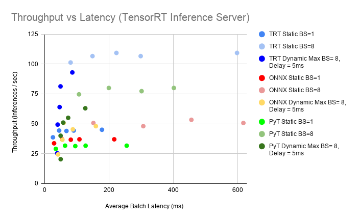
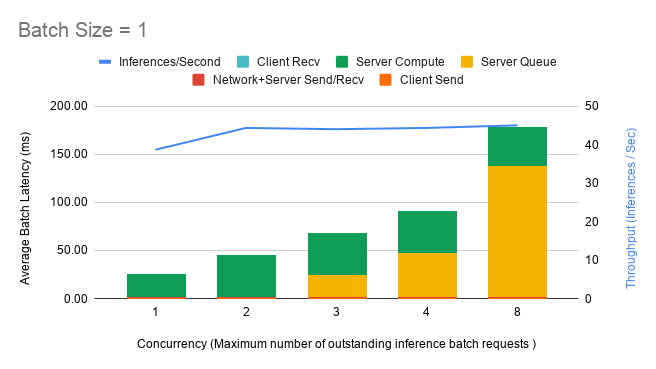
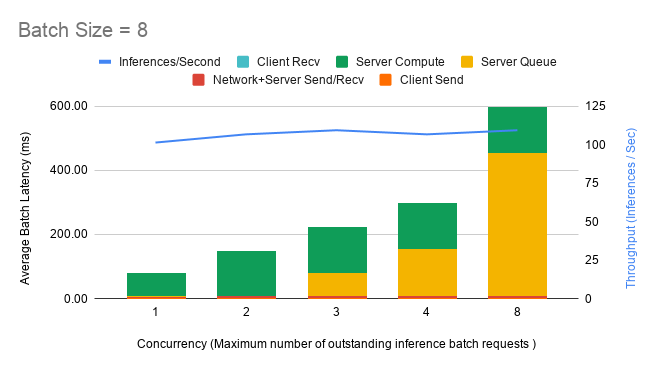

# Jasper Inference Using TensorRT Inference Server

This is a subfolder of the Jasper for PyTorch repository that provides scripts to deploy high-performance inference using NVIDIA TensorRT Inference Server offering different options for the inference model pipeline.


## Table Of Contents

- [Model overview](#model-overview)
   * [Model architecture](#model-architecture)
   * [TensorRT Inference Server Overview](#tensorrt-inference-server-overview)
   * [Inference Pipeline in TensorRT Inference Server](#inference-pipeline-in-tensorrt-inference-server)
- [Setup](#setup)
  * [Supported Software](#supported-software)
  * [Requirements](#requirements)
- [Quick Start Guide](#quick-start-guide)
- [Advanced](#advanced)
  * [Scripts and sample code](#scripts-and-sample-code)
- [Performance](#performance)
  * [Inference Benchmarking in TensorRT Inference Server](#inference-benchmarking-in-tensorrt-inference-server)
  * [Results](#results)
    * [Performance analysis for TensorRT Inference Server: NVIDIA T4](#performance-analysis-for-tensorrt-inference-server-nvidia-t4)
	* [Maximum Batch Size](#maximum-batch-size)
	* [Batching techniques: Static versus Dynamic Batching](#batching-techniques-static-versus-dynamic-batching)
    	* [TensorRT/ONNX/PyTorch JIT comparisons](#tensorrt/onnx/pytorch-jit-comparisons)
		    * [Throughput Comparison](#throughput-comparison)
		    * [Latency Comparison](#latency-comparison)

## Model overview

### Model architecture


Jasper is a neural acoustic model for speech recognition. Its network architecture is designed to facilitate fast GPU inference. More information about Jasper and its training and be found in the [Jasper PyTorch README](../README.md). 
By default the model configuration is Jasper 10x5 with dense residuals. A Jasper BxR model has B blocks, each consisting of R repeating sub-blocks.
Each sub-block applies the following operations in sequence: 1D-Convolution, Batch Normalization, ReLU activation, and Dropout.

In the original paper Jasper is trained with masked convolutions, which masks out the padded part of an input sequence in a batch before the 1D-Convolution. 
For inference masking is not used. The reason for this is that in inference, the original mask operation does not achieve better accuracy than without the mask operation on the test and development dataset. However, no masking achieves better inference performance especially after TensorRT optimization.

More information on the Jasper model architecture can be found in the [Jasper PyTorch README](../README.md). 


### TensorRT Inference Server Overview

The [NVIDIA TensorRT Inference Server](https://github.com/NVIDIA/tensorrt-inference-server) provides a datacenter and cloud inferencing solution optimized for NVIDIA GPUs. The server provides an inference service via an HTTP or gRPC endpoint, allowing remote clients to request inferencing for any number of GPU or CPU models being managed by the server.
This folder contains detailed performance analysis as well as scripts to run Jasper inference using TensorRT Inference Server.

A typical TensorRT Inference Server pipeline can be broken down into the following steps:

1. The client serializes the inference request into a message and sends it to the server (Client Send). 
2. The message travels over the network from the client to the server (Network).
3. The message arrives at the server, and is deserialized (Server Receive).
4. The request is placed on the queue (Server Queue).
5. The request is removed from the queue and computed (Server Compute).
6. The completed request is serialized in a message and sent back to the client (Server Send).
7. The completed message then travels over the network from the server to the client (Network).
8. The completed message is deserialized by the client and processed as a completed inference request (Client Receive).

Generally, for local clients, steps 1-4 and 6-8 will only occupy a small fraction of time, compared to steps 5-6. As backend deep learning systems like Jasper are rarely exposed directly to end users, but instead only interfacing with local front-end servers, for the sake of Jasper, we can consider that all clients are local.
In this section, we will go over how to launch both the TensorRT Inference Server and the client and get the best performance solution that fits your specific application needs.

Note: The following instructions are run from outside the container and call `docker run` commands as required.


## Inference Pipeline in TensorRT Inference Server

The Jasper model pipeline consists of 3 components, where each part can be customized to be a different backend: 

**Data preprocessor**

The data processor transforms an input raw audio file into a spectrogram. By default the pipeline uses mel filter banks as spectrogram features. This part does not have any learnable weights.

**Acoustic model**

The acoustic model takes in the spectrogram and outputs a probability over a list of characters. This part is the most compute intensive, taking more than 90% of the entire end-to-end pipeline. The acoustic model is the only component with learnable parameters and what differentiates Jasper from other end-to-end neural speech recognition models. In the original paper, the acoustic model contains a masking operation for training (More details in [../README.md]). We do not use masking for inference . 

**Greedy decoder**

The decoder takes the probabilities over the list of characters and outputs the final transcription. Greedy decoding is a fast and simple way of doing this by always choosing the character with the maximum probability. 

To run a model with TensorRT, we first construct the model in PyTorch, which is then exported into a ONNX static graph. Finally, a TensorRT engine is constructed from the ONNX file and can be launched to do inference. The following table shows which backends are supported for each part along the model pipeline.

|Backend\Pipeline component|Data preprocessor|Acoustic Model|Decoder|
|---|---|---|---|
|PyTorch JIT|x|x|x|
|ONNX|-|x|-|
|TensorRT|-|x|-|

In order to run inference with TensorRT outside of the inference server, refer to the [Jasper TensorRT README](../trt/README.md).


## Setup

### Supported Software

The following software version configuration is supported has been tested.

|Software|Version|
|--------|-------|
|Python|3.6.9|
|PyTorch|1.2.0|
|TensorRT|6.0.1.5|
|CUDA|10.1.243|


The following section lists the requirements in order to start inference with Jasper in TensorRT Inference Server.

### Requirements

The repository contains a folder `./trtis/` with a `Dockerfile` which extends the PyTorch 19.09-py3 NGC container and encapsulates some dependencies. Ensure you have the following components:

* [NVIDIA Docker](https://github.com/NVIDIA/nvidia-docker)
* [PyTorch 19.09-py3 NGC container](https://ngc.nvidia.com/catalog/containers/nvidia:pytorch)
* [TensorRT Inference Server 19.09 NGC container](https://ngc.nvidia.com/catalog/containers/nvidia:tensorrtserver)
* Access to [NVIDIA machine learning repository](https://developer.download.nvidia.com/compute/machine-learning/repos/ubuntu1804/x86_64/nvidia-machine-learning-repo-ubuntu1804_1.0.0-1_amd64.deb) and [NVIDIA cuda repository](https://developer.download.nvidia.com/compute/cuda/repos/ubuntu1804/x86_64/cuda-repo-ubuntu1804_10.1.243-1_amd64.deb) for NVIDIA TensorRT 6
* [NVIDIA Volta](https://www.nvidia.com/en-us/data-center/volta-gpu-architecture/) or [Turing](https://www.nvidia.com/en-us/geforce/turing/) based GPU
* [Pretrained Jasper Model Checkpoint](https://ngc.nvidia.com/catalog/models/nvidia:jasperpyt_fp16)

Required Python packages are listed in `requirements.txt`, `trt/requirements.txt` and `trtis/requirements.txt`. These packages are automatically installed when the Docker container is built. 


## Quick Start Guide

Running the following scripts will build and launch the container containing all required dependencies for both TensorRT 6 as well as native PyTorch. This is necessary for using inference with TensorRT and can also be used for data download, processing and training of the model.

1. Clone the repository.

    ```bash
    git clone https://github.com/NVIDIA/DeepLearningExamples
    cd DeepLearningExamples/PyTorch/SpeechRecognition/Jasper
    ```

2. Build a container that extends NGC PyTorch 19.09, TensorRT, TensorRT Inference Server, and TensorRT Inference Client:

    ```bash
    bash trtis/scripts/docker/build.sh
    ```

3. Start an interactive session in the Docker container:

    ```bash
    export DATA_DIR=<DATA_DIR>
    export CHECKPOINT_DIR=<CHECKPOINT_DIR>
    export RESULT_DIR=<RESULT_DIR>
    bash trtis/scripts/docker/launch.sh
    ```

    Where <DATA_DIR>, <CHECKPOINT_DIR> and <RESULT_DIR> can be either empty or absolute directory paths to dataset, existing checkpoints or potential output files.
      
    Alternatively, to start a script `foo.sh` in the Docker container without an interactive session, run:

    ```bash
    export DATA_DIR=<DATA_DIR>
    export CHECKPOINT_DIR=<CHECKPOINT_DIR>
    export RESULT_DIR=<RESULT_DIR>
    export PROGRAM_PATH=foo.sh
    bash trtis/scripts/docker/trtis.sh
    ```

    The `/datasets`, `/checkpoints`, `/results` directories will be mounted as volumes and mapped to the corresponding directories `<DATA_DIR>`, `<CHECKPOINT_DIR>`, `<RESULT_DIR>` on the host. Note that `<DATA_DIR>`, `<CHECKPOINT_DIR>`, and `<RESULT_DIR>` directly correspond to the same arguments in `scripts/docker/launch.sh` and `trt/scripts/docker/launch.sh` mentioned in the [Jasper PyTorch README](../README.md) and [Jasper TensorRT README](../trt/README.md).

    Briefly, `<DATA_DIR>` should contain, or be prepared to contain a `LibriSpeech` sub-directory (created in [Acquiring Dataset](../trt/README.md)), `<CHECKPOINT_DIR>` should contain a PyTorch model checkpoint (`*.pt`) file obtained through training described in [Jasper PyTorch README](../README.md), and `<RESULT_DIR>` should be prepared to contain timing results and logs. Downloading `LibriSpeech` is not required for Inference in TensorRT Inference Server on a single .wav audio file. To do inference and evaluation on LibriSpeech, download the dataset following the instructions in the [Jasper TensorRT README](../README.md)

4. Convert pretrained PyTorch model checkpoint into TensorRT Inference Server compatible model backends.

    From outside the container, run:

    ```bash
    export ARCH=<ARCH>
    export CHECKPOINT_DIR=<CHECKPOINT_DIR>
    export CHECKPOINT=<CHECKPOINT>
    export PRECISION=<PRECISION>
    export MAX_SEQUENCE_LENGTH_FOR_ENGINE=<MAX_SEQUENCE_LENGTH_FOR_ENGINE>
    bash trtis/scripts/export_model.sh
    bash trtis/scripts/prepare_model_repository.sh
    ```

    Where `<ARCH>` is either 70(Volta) or 75(Turing), `<CHECKPOINT_DIR>` is the absolute path that contains the pretrained checkpoint `<CHECKPOINT>`, and `<PRECISION>` is either `fp16` or `fp32`. `<MAX_SEQUENCE_LENGTH_FOR_ENGINE>` defines the maximum feasible audio length, where 100 corresponds to 1 second.
    The exported models for deployment will be generated at `./trtis/deploy/`.

    A pretrained PyTorch model checkpoint for model conversion can be downloaded from the [NGC model repository](https://ngc.nvidia.com/catalog/models/nvidia:jasperpyt_fp16). 

    More details can be found in the [Advanced](#advanced) section under [Scripts and sample code](#scripts-and-sample-code).

5. Download Pre-exported Inference Checkpoints from NGC 

    If you would like to skip the manual model export, you can find already generated model backends in [https://ngc.nvidia.com/models/nvidian:swdl:jasperpyt_jit_fp16](https://ngc.nvidia.com/models/nvidian:swdl:jasperpyt_jit_fp16), [https://ngc.nvidia.com/models/nvidian:swdl:jasperpyt_onnx_fp16](https://ngc.nvidia.com/models/nvidian:swdl:jasperpyt_onnx_fp16), [https://ngc.nvidia.com/models/nvidian:swdl:jasperpyt_trt_turing_fp16](https://ngc.nvidia.com/models/nvidian:swdl:jasperpyt_trt_turing_fp16), [https://ngc.nvidia.com/models/nvidian:swdl:jasperpyt_trt_volta_fp16](https://ngc.nvidia.com/models/nvidian:swdl:jasperpyt_trt_volta_fp16). for every version of the model pipeline. If you wish to use TensorRT pipeline, make sure to download the correct version for your hardware. The extracted model folder should contain 3 subfolders `jasper-feature-extractor`, `jasper-decoder` and `jasper-x` where x can be pyt, onnx, trt depending on the model backend. You will find folders with the same name in your local Jasper repository under `trtis/model_repo/’. Copy the content of each of the 3 model folders to the according directory in your Jasper project, replace files with the same name.

    Then run:
    ```bash
    bash trtis/scripts/prepare_model_repository.sh
    ```

6. Launch TensorRT Inference Server.

    Start the server:
    ```bash
    bash trtis/scripts/run_server.sh
    ```

7. Run all inference benchmarks. 

    From outside the container, run:

    ```bash
    export ARCH=<ARCH>
    export CHECKPOINT_DIR=<CHECKPOINT_DIR>
    export RESULT_DIR=<RESULT_DIR>
    export CHECKPOINT=<CHECKPOINT>
    bash trtis/scripts/execute_all_perf_runs.sh
    ```

    Where `<ARCH>` is either 70(Volta) or 75(Turing), `<CHECKPOINT_DIR>` is the absolute path that contains the pretrained checkpoint `<CHECKPOINT>`, and `<RESULT_DIR>` is the absolute path to potential output files.

    Note: This can take several hours to complete due to the extensiveness of the benchmark. More details about the benchmark are found in the [Advanced](#advanced) section under [Performance](#performance).

8. Run inference using the Client and TensorRT Inference Server.

    8.1 From outside the container, restart the server:
    ```bash
    bash trtis/scripts/run_server.sh
    ``` 

    8.2 From outside the container, submit the client request using:
    ```bash
    bash trtis/scripts/run_client.sh <MODEL_TYPE> <DATA_DIR> <FILE>
    ```

    Where `<MODEL_TYPE>` can be either “pyt” (default), “trt” or “onnx”. `<DATA_DIR>` is an absolute local path to the directory of files. <FILE> is the relative path to <DATA_DIR> to either an audio file in .wav format or a manifest file in .json format. 

    Note: If <FILE> is *.json <DATA_DIR> should be the path to the LibriSpeech dataset. In this case this script will do both inference and evaluation on the accoring LibriSpeech dataset. 

9. Start Jupyter Notebook to run inference interactively.

    Run:
    ```bash
    jupyter notebook -- notebooks/JasperTRTIS.ipynb
    ```

    A pretrained model checkpoint necessary for using the jupyter notebook to be able to run inference can be downloaded from [NGC model repository](https://ngc.nvidia.com/catalog/models/nvidia:jasperpyt_fp16). 


## Advanced

The following sections provide greater details about the TensorRT Inference Server pipeline and inference analysis and benchmarking results.


### Scripts and sample code

The `trtis/` directory contains the following files:
* `jasper-client.py`: Python client script that takes an audio file and a specific model pipeline type and submits a client request to the server to run inference with the model on the given audio file.
* `speech-utils.py`: helper functions for `jasper-client.py`

The `trtis/scripts/` directory has easy to use scripts to run supported functionalities, such as:
* `./docker/build.sh`: builds container
* `./docker/launch.sh`: launches container
* `execute_all_perf_runs.sh`: runs all benchmarks using TRTIS perfclient calls `generate_perf_results.sh`
* `export_model.sh`: from pretrained PyTorch checkpoint generates backends for every version of the model inference pipeline, calls `export_model_helper.sh`
* `prepare_model_repository.sh`: copies model config files from `./model_repo/` to `./deploy/model_rep`o and creates links to generated model backends, setting up the model repository for TensorRT Inference Server
* `generate_perf_results.sh`: runs benchmark with perf-client for specific configuration and calls `run_perf_client.sh`
* `run_server.sh`: launches TensorRT Inference Server
* `run_client.sh`: launches client by using `jasper-client.py` to submit inference requests to server


## Performance

### Inference Benchmarking in TensorRT Inference Server

To benchmark the inference performance on either Volta or Turing GPU, run `bash trtis/scripts/execute_all_perf_runs.sh` according to [Quick-Start-Guide](#quick-start-guide) Step 7 and set `ARCH` according to the underlying hardware (`ARCH=70` for Volta and `ARCH=75` for Turing)

By default, this script measures inference performance for all 3 model pipelines: PyTorch JIT  (‘pyt’) pipeline, ONNX (‘onnx’) pipeline, TensorRT(‘trt’) pipeline, both with fp32 and fp16 precision. Each of these pipelines is measured for different audio input lengths (2sec, 7sec, 16.7sec) and a range of different server batch sizes (up to 64). This takes place in `trtis/scripts/generate_perf_results.sh`. For a specific audio length and batch size static and dynamic batching comparison is performed. For benchmarking we used `MAX_SEQUENCE_LENGTH_FOR_ENGINE=1792` for inference model generation.


### Results


#### Performance Analysis for TensorRT Inference Server: NVIDIA T4


### Results


#### Performance Analysis for TensorRT Inference Server: NVIDIA T4

Based on the figure below, we recommend using the Dynamic Batcher with `max_batch_size=8`, `max_queue_delay_microseconds` as large as possible to fit within your latency window (the values used below are extremely large to exaggerate their effect). The largest improvements to both throughput and latency come from increasing the batch size due to efficiency gains in the GPU with larger batches. The Dynamic Batcher combines the best of both worlds by efficiently batching together a large number of concurrent requests, while also keeping latency down for infrequent requests. 

All results below are obtained using the following configurations:
* Single T4 16GB GPU on a local server
* Jasper Large
* Audio length = 7 seconds 
* FP16 precision

Latencies are indicated by bar plots using the left axis. Throughput is indicated by the blue line plot using the right axis. X-axis indicates the concurrency - the maximum number of inference requests that can be in the pipeline at any given time. For example, when the concurrency is set to 1, the client waits for an inference request to be completed (Step 8) before it sends another to the server (Step 1). A high number of concurrent requests can reduce the impact of network latency on overall throughput.


 

Figure 1: Latency vs Throughput for Jasper Large, FP16, Audio Length = 7sec using various configurations and all 3 model backends  available in TensorRT Inference Server. TensorRT is denoted as TRT, PyTorch as PyT.


##### Maximum Batch Size
In general, increasing batch size leads to higher throughput at the cost of higher latency. In the following sections, we analyze the results using the example of the TensorRT-pipeline. 
 
As we can see in Figure 2, the throughput at Batch Size=1, Client Concurrent Requests = 8 is 45 and in Figure 3, the throughput at Batch Size=8, Client Concurrent Requests = 1 is 101, giving a speedup of ~2.24x. 
Note: We compare Batch Size=1, Client Concurrent Requests = 8 to Batch Size=8, Client Concurrent Requests = 1 to keep the Total Number of Outstanding Requests equal between the two different modes. Where Total Number of Outstanding Requests = Batch Size * Client Concurrent Requests. 
Increasing the batch size by 8-fold from 1 to 8 results in an increase in compute time by only 2.42x (45ms to 109ms) showing that computation is more efficient at higher batch sizes. Hence, an optimal batch size would be the maximum batch size that can both fit in memory and is within the preferred latency threshold.

 

Figure 2: TensorRT pipeline - Latency & Throughput vs Concurrency using Static Batching at Batch size = 1

 

Figure 3: TensorRT pipeline - Latency & Throughput vs Concurrency using Static Batching at Batch size = 8

##### Batching techniques: Static versus Dynamic Batching
In the following section, we analyze the results using the example of the TensorRT-pipeline.
Static batching is a feature of the inference server that allows inference requests to be served as they are received. It is preferred in scenarios where low latency is desired at the cost of throughput when the GPU is under utilized.
Dynamic batching is a feature of the inference server that allows inference requests to be combined by the server, so that a batch is created dynamically, resulting in an increased throughput. It is preferred in scenarios where we would like to maximize throughput and GPU utilization at the cost of higher latencies. You can set the Dynamic Batcher parameter `max_queue_delay_microseconds` to indicate the maximum amount of time you are willing to wait and `preferred_batch_size` to indicate your maximum server batch size in the TensorRT Inference Server model config. 
Figure 4 emphasizes the increase in overall throughput with dynamic batching. At low numbers of concurrent requests, the increased throughput comes at the cost of increasing latency as the requests are queued up to max_queue_delay_microseconds. The effect of preferred_batchsize for dynamic batching is visually depicted by the dip in Server Queue time at integer multiples of the preferred batch sizes. At higher numbers of concurrent requests, the throughput approaches a maximum limit as we saturate the GPU utilization.

 
 
Figure 4: TensorRT pipeline - Latency & Throughput vs Concurrency using dynamic Batching at client Batch size = 1, maximum server batch size=4, max_queue_delay_microseconds = 5000


 
##### TensorRT/ONNX/PyTorch JIT comparisons
The following tables show inference and latency comparisons across all 3 backends for mixed precision and static batching. The main observations are:
Increasing the batch size leads to higher inference throughput and latency up to a certain batch size, after which it slowly saturates.
TensorRT is faster than both the PyTorch and ONNX pipeline, achieving a speedup of up to ~1.5x and ~2.4x respectively.
The longer the audio length, the lower the throughput and the higher the latency.


###### Throughput Comparison

Following Table shows throughput benchmark results for all 3 model backends in TensorRT Inference Server using static batching under optimal concurrency


|Audio length in seconds|Batch Size|TensorRT (inf/s)|PyTorch (inf/s)|ONNX (inf/s)|TensorRT/PyTorch Speedup|TensorRT/Onnx Speedup|
|---    |---    |---    |---    |---    |---    |---    |
|2.00|1.00|46.67|40.67|41.00|1.15|1.14|
|2.00|2.00|90.67|74.67|58.00|1.21|1.56|
|2.00|4.00|168.00|128.00|112.00|1.31|1.50|
|2.00|8.00|248.00|213.33|194.67|1.16|1.27|
|7.00|1.00|44.33|31.67|37.00|1.40|1.20|
|7.00|2.00|74.67|56.67|49.33|1.32|1.51|
|7.00|4.00|100.00|62.67|50.67|1.60|1.97|
|7.00|8.00|106.67|80.00|53.33|1.33|2.00|
|16.70|1.00|31.00|20.00|25.33|1.55|1.22|
|16.70|2.00|42.00|29.33|19.33|1.43|2.17|
|16.70|4.00|46.67|29.33|22.67|1.59|2.06|
|16.70|8.00|50.67|37.33|21.33|1.36|2.38|

###### Latency Comparison

Following Table shows throughput benchmark results for all 3 model backends in TensorRT Inference Server using static batching and a single concurrent request. 


|Audio length in seconds|Batch Size|TensorRT (ms)|PyTorch (ms)|ONNX (ms)|TensorRT/PyTorch Speedup|TensorRT/Onnx Speedup|
|---    |---    |---    |---    |---    |---    |---    |
|2.00|1.00|24.74|27.80|26.70|1.12|1.08|
|2.00|2.00|23.75|29.76|38.54|1.25|1.62|
|2.00|4.00|25.28|34.09|39.67|1.35|1.57|
|2.00|8.00|36.18|41.18|45.84|1.14|1.27|
|7.00|1.00|25.86|34.82|29.41|1.35|1.14|
|7.00|2.00|29.83|38.04|43.37|1.28|1.45|
|7.00|4.00|41.91|66.69|79.38|1.59|1.89|
|7.00|8.00|80.72|106.86|151.61|1.32|1.88|
|16.70|1.00|34.89|52.83|43.10|1.51|1.24|
|16.70|2.00|51.91|73.52|105.58|1.42|2.03|
|16.70|4.00|95.42|145.17|187.49|1.52|1.96|
|16.70|8.00|167.67|229.67|413.74|1.37|2.47|
