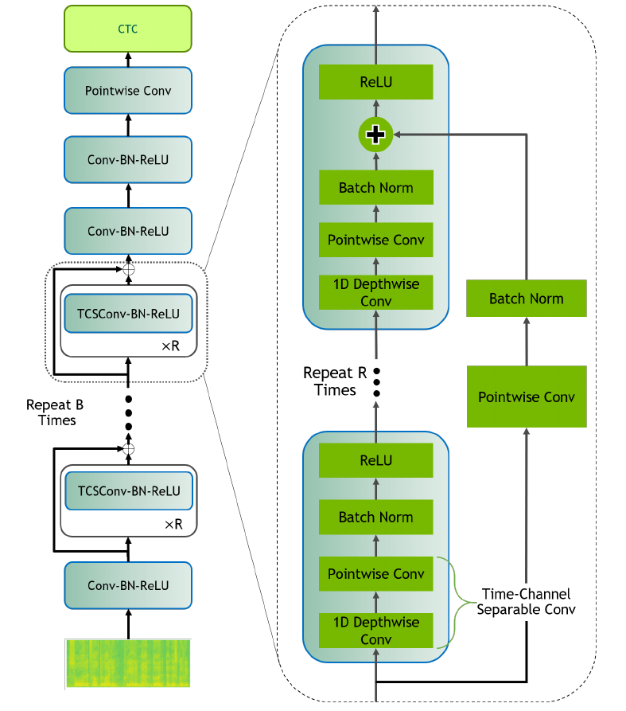
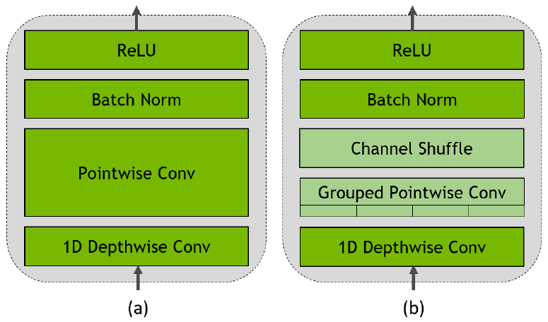

# QuartzNet For PyTorch

This repository provides a script and recipe to train the QuartzNet model to achieve state-of-the-art accuracy. The content of this repository is tested and maintained by NVIDIA.

## Table Of Contents

- [Model overview](#model-overview)
    * [Model architecture](#model-architecture)
    * [Default configuration](#default-configuration)
    * [Feature support matrix](#feature-support-matrix)
        * [Features](#features)
    * [Mixed precision training](#mixed-precision-training)
        * [Enabling mixed precision](#enabling-mixed-precision)
        * [Enabling TF32](#enabling-tf32)
    * [Glossary](#glossary)
    * [Language support and NeMo compatibility](#language-support-and-nemo-compatibility)
- [Setup](#setup)
    * [Requirements](#requirements)
- [Quick Start Guide](#quick-start-guide)
- [Advanced](#advanced)
    * [Scripts and sample code](#scripts-and-sample-code)
    * [Parameters](#parameters)
    * [Command-line options](#command-line-options)
    * [Getting the data](#getting-the-data)
        * [Dataset guidelines](#dataset-guidelines)
        * [Multi-dataset](#multi-dataset)
    * [Training process](#training-process)
    * [Inference process](#inference-process)
- [Performance](#performance)
    * [Benchmarking](#benchmarking)
        * [Training performance benchmark](#training-performance-benchmark)
        * [Inference performance benchmark](#inference-performance-benchmark)
    * [Results](#results)
        * [Training accuracy results](#training-accuracy-results)
            * [Training accuracy: NVIDIA DGX A100 (8x A100 80GB)](#training-accuracy-nvidia-dgx-a100-8x-a100-80gb)
            * [Training stability test](#training-stability-test)
        * [Training performance results](#training-performance-results)
            * [Training performance: NVIDIA DGX A100 (8x A100 80GB)](#training-performance-nvidia-dgx-a100-8x-a100-80gb)
            * [Training performance: NVIDIA DGX-2 (16x V100 32GB)](#training-performance-nvidia-dgx-2-16x-v100-32gb)
        * [Inference performance results](#inference-performance-results)
            * [Inference performance: NVIDIA DGX A100 (1x A100 80GB)](#inference-performance-nvidia-dgx-a100-1x-a100-80gb)
            * [Inference performance: NVIDIA DGX-2 (1x V100 32GB)](#inference-performance-nvidia-dgx-2-1x-v100-32gb)
- [Release notes](#release-notes)
    * [Changelog](#changelog)
    * [Known issues](#known-issues)

## Model overview

This repository provides an implementation of the QuartzNet model in PyTorch from the paper [QuartzNet: Deep Automatic Speech Recognition with 1D Time-Channel Separable Convolutions](https://arxiv.org/pdf/1910.10261).
The QuartzNet model is an end-to-end neural acoustic model for automatic speech recognition (ASR), that provides high accuracy at a low memory footprint. The QuartzNet architecture of convolutional layers was designed to facilitate fast GPU inference, by allowing whole sub-blocks to be fused into a single GPU kernel. This is important for meeting strict real-time requirements of ASR systems in deployment.


This repository is a PyTorch implementation of QuartzNet and provides scripts to train the QuartzNet 10x5 model from scratch on the [LibriSpeech](http://www.openslr.org/12) dataset to achieve the greedy decoding results improved upon the original paper.
The repository is self-contained and includes data preparation scripts, training, and inference scripts.
Both training and inference scripts offer the option to use Automatic Mixed Precision (AMP) to benefit from Tensor Cores for better performance.

In addition to providing the hyperparameters for training a model checkpoint, we publish a thorough inference analysis across different NVIDIA GPU platforms, for example, DGX-2, NVIDIA A100 GPU, and T4.

This model is trained with mixed precision using Tensor Cores on Volta, Turing, and the NVIDIA Ampere GPU architectures. Therefore, researchers can get results [1.4]x faster than training without Tensor Cores, while experiencing the benefits of mixed precision training. This model is tested against each NGC monthly container release to ensure consistent accuracy and performance over time.

### Model architecture

QuartzNet is an end-to-end neural acoustic model that is based on efficient, time-channel separable convolutions (Figure 1).
In the audio processing stage, each frame is transformed into mel-scale spectrogram features, which the acoustic model takes as input and outputs a probability distribution over the vocabulary for each frame.

<p align="center">
 
</p>
<p align="center">
 <em>Figure 1. Architecture of QuartzNet (<a href=”https://arxiv.org/abs/1910.10261”>source</a>)
 </em>
</p>

### Default configuration

The following features were implemented in this model:
* GPU-supported feature extraction with data augmentation options [SpecAugment](https://arxiv.org/abs/1904.08779) and [Cutout](https://arxiv.org/pdf/1708.04552.pdf) using the DALI library
* offline and online [Speed Perturbation](https://www.danielpovey.com/files/2015_interspeech_augmentation.pdf) using the DALI library
* data-parallel multi-GPU training and evaluation
* AMP with dynamic loss scaling for Tensor Core training
* FP16 inference

### Feature support matrix

| **Feature**   | **QuartzNet**    |
|---------------|---------------|
|[Apex AMP](https://nvidia.github.io/apex/amp.html) | Yes |
|[DALI](https://docs.nvidia.com/deeplearning/dali/release-notes/index.html)   | Yes |

#### Features

**DALI**
NVIDIA Data Loading Library (DALI) is a collection of highly optimized building blocks, and an execution engine, to accelerate the pre-processing of the input data for deep learning applications. DALI provides both the performance and the flexibility for accelerating different data pipelines as a single library. This single library can then be easily integrated into different deep learning training and inference applications. For details, see example sources in this repository or see the [DALI documentation](https://docs.nvidia.com/deeplearning/dali/index.html).

**Automatic Mixed Precision (AMP)**
Computation graphs can be modified by PyTorch on runtime to support mixed precision training. A detailed explanation of mixed precision can be found in the next section.

### Mixed precision training

Mixed precision is the combined use of different numerical precisions in a computational method. [Mixed precision](https://arxiv.org/abs/1710.03740) training offers significant computational speedup by performing operations in half-precision format while storing minimal information in single-precision to retain as much information as possible in critical parts of the network. Since the introduction of [Tensor Cores](https://developer.nvidia.com/tensor-cores) in Volta, and following with both the Turing and Ampere architectures, significant training speedups are experienced by switching to mixed precision -- up to 3x overall speedup on the most arithmetically intense model architectures. Using [mixed precision training](https://docs.nvidia.com/deeplearning/performance/mixed-precision-training/index.html) previously required two steps:
1. Porting the model to use the FP16 data type where appropriate.
2. Adding loss scaling to preserve small gradient values.

For information about:
-  How to train using mixed precision, see the [Mixed Precision Training](https://arxiv.org/abs/1710.03740) paper and [Training With Mixed Precision](https://docs.nvidia.com/deeplearning/performance/mixed-precision-training/index.html) documentation.
-  Techniques used for mixed precision training, see the [Mixed-Precision Training of Deep Neural Networks](https://devblogs.nvidia.com/mixed-precision-training-deep-neural-networks/) blog.
-  APEX tools for mixed precision training, see the [NVIDIA Apex: Tools for Easy Mixed-Precision Training in PyTorch](https://devblogs.nvidia.com/apex-pytorch-easy-mixed-precision-training/).

#### Enabling mixed precision

For training, mixed precision can be enabled by setting the flag: `train.py --amp`. When using bash helper scripts, mixed precision can be enabled with the environment variable `AMP=true`, for example, `AMP=true bash scripts/train.sh`, `AMP=true bash scripts/inference.sh`, etc.

#### Enabling TF32

TensorFloat-32 (TF32) is the new math mode in [NVIDIA A100](https://www.nvidia.com/en-us/data-center/a100/) GPUs for handling the matrix math also called tensor operations. TF32 running on Tensor Cores in A100 GPUs can provide up to 10x speedups compared to single-precision floating-point math (FP32) on Volta GPUs.

TF32 Tensor Cores can speed up networks using FP32, typically with no loss of accuracy. It is more robust than FP16 for models which require high dynamic range for weights or activations.

For more information, refer to the [TensorFloat-32 in the A100 GPU Accelerates AI Training, HPC up to 20x](https://blogs.nvidia.com/blog/2020/05/14/tensorfloat-32-precision-format/) blog post.

TF32 is supported in the NVIDIA Ampere GPU architecture and is enabled by default.

### Glossary

**Time-channel separable (TCS) convolution**
A module composed mainly of two convolutional layers: a 1D depthwise convolutional layer,
and a pointwise convolutional layer (Figure 2). The former operates across K time frames, and the latter across all channels. By decoupling time and channel axes, the separable module uses less parameters and calculates the result faster, than it would otherwise would.

<p align="center">
 
</p>
<p align="center">
 <em>Figure 2. Time-channel separable (TCS) convolutional module: (a) basic design, (b) TCS with a group shuffle layer, added to increase cross-group interchange</em>
</p>

**Automatic Speech Recognition (ASR)**
Uses both an acoustic model and a language model to output the transcript of an input audio signal.

**Acoustic model**
Assigns a probability distribution over a vocabulary of characters given an audio frame. Typically, a large part of the entire ASR model.

**Language model**
Assigns a probability distribution over a sequence of words. Given a sequence of words, it assigns a probability to the whole sequence.

**Pre-training**
Training a model on vast amounts of data on the same (or different) task to build general understandings.

### Language support and NeMo compatibility

This repository allows to train and run models in laguages other than English.

During inference, QuartzNet models trained with [NVIDIA NeMo](https://github.com/NVIDIA/NeMo) can also be used, for instance one of pre-trained models
for Catalan, French, German, Italian, Mandarin Chinese, Polish, Russian or Spanish available on [NGC](https://ngc.nvidia.com/).
To download automatically, run:
```bash
bash scripts/download_quartznet.sh [ca|fr|de|it|zh|pl|ru|es]
```

Pre-trained models can be explicitly converted from the `.nemo` checkpoint format to `.pt` and vice versa.
For more details, run:
```bash
python nemo_dle_model_converter.py --help
```

## Setup

The following section lists the requirements that you need to meet in order to start training the QuartzNet model.

### Requirements

This repository contains Dockerfile which extends the PyTorch 21.07-py3 NGC container and encapsulates some dependencies. Aside from these dependencies, ensure you have the following components:
-  [NVIDIA Docker](https://github.com/NVIDIA/nvidia-docker)
-  [PyTorch 21.07-py3 NGC container](https://ngc.nvidia.com/catalog/containers/nvidia:pytorch)
-  Supported GPUs:
   - [NVIDIA Volta architecture](https://www.nvidia.com/en-us/data-center/volta-gpu-architecture/)
   - [NVIDIA Turing architecture](https://www.nvidia.com/en-us/design-visualization/technologies/turing-architecture/)
   - [NVIDIA Ampere architecture](https://www.nvidia.com/en-us/data-center/nvidia-ampere-gpu-architecture/)

For more information about how to get started with NGC containers, see the following sections from the NVIDIA GPU Cloud Documentation and the Deep Learning Documentation:
-  [Getting Started Using NVIDIA GPU Cloud](https://docs.nvidia.com/ngc/ngc-getting-started-guide/index.html)
-  [Accessing And Pulling From The NGC Container Registry](https://docs.nvidia.com/deeplearning/frameworks/user-guide/index.html#accessing_registry)
-  [Running PyTorch](https://docs.nvidia.com/deeplearning/dgx/pytorch-release-notes/running.html#running)

Further required Python packages are listed in `requirements.txt`, which are automatically installed with the built Docker container. To manually install them, run:
```bash
pip install -r requirements.txt
```

For those unable to use the PyTorch 21.07-py3 NGC container, to set up the required environment or create your own container, see the versioned [NVIDIA Container Support Matrix](https://docs.nvidia.com/deeplearning/frameworks/support-matrix/index.html).

## Quick Start Guide

To train your model using mixed or TF32 precision with Tensor Cores or using FP32, perform the following steps using the default parameters of the QuartzNet model on the LibriSpeech dataset. For the specifics concerning training and inference, see the [Advanced](#advanced) section.

1. Clone the repository.
   ```bash
   git clone https://github.com/NVIDIA/DeepLearningExamples
   cd DeepLearningExamples/PyTorch/SpeechRecognition/QuartzNet
   ```

2. Build the QuartzNet PyTorch NGC container.
   ```bash
   bash scripts/docker/build.sh
   ```

3. Start an interactive session in the NGC container to prepare the dataset, or run training/inference.
   Specify a local mountpoint for the dataset with the `DATA_DIR` variable:
   ```bash
   DATA_DIR=<path_on_the_host> bash scripts/docker/launch.sh
   ```

4. Download and preprocess the dataset.
   No GPU is required for data download and preprocessing.
   It can take several hours to complete, and requires over 250GB of free disk space.

   This repository provides scripts to download and extract LibriSpeech [http://www.openslr.org/12](http://www.openslr.org/12). The dataset contains 1000 hours of 16kHz read English speech derived from public domain audiobooks from the LibriVox project and has been carefully segmented and aligned. For more information, see the [LIBRISPEECH: AN ASR CORPUS BASED ON PUBLIC DOMAIN AUDIO BOOKS](http://www.danielpovey.com/files/2015_icassp_librispeech.pdf) paper.

   Inside the container, download and extract the datasets into the required format for later training and inference:
   ```bash
   bash scripts/download_librispeech.sh
   ```
   After the data download is complete, the following folders should exist:
   ```bash
   datasets/LibriSpeech/
   ├── dev-clean
   ├── dev-other
   ├── test-clean
   ├── test-other
   ├── train-clean-100
   ├── train-clean-360
   └── train-other-500
   ```

   Since `/datasets/` is mounted to `DATA_DIR` on the host,  after the dataset is downloaded it will be accessible from outside of the container at `$DATA_DIR/LibriSpeech`.

   Next, convert the data into WAV files:
   ```bash
   bash scripts/preprocess_librispeech.sh
   ```

   After the data is converted, the following additional files and folders should exist:
   ```bash
   datasets/LibriSpeech/
   ├── dev-clean-wav
   ├── dev-other-wav
   ├── librispeech-train-clean-100-wav.json
   ├── librispeech-train-clean-360-wav.json
   ├── librispeech-train-other-500-wav.json
   ├── librispeech-dev-clean-wav.json
   ├── librispeech-dev-other-wav.json
   ├── librispeech-test-clean-wav.json
   ├── librispeech-test-other-wav.json
   ├── test-clean-wav
   ├── test-other-wav
   ├── train-clean-100-wav
   ├── train-clean-360-wav
   └── train-other-500-wav
   ```

5. Start training.
   Inside the container, use the following script to start training.
   Make sure the downloaded and preprocessed dataset is located at `$DATA_DIR/LibriSpeech` on the host, which is mounted as `/datasets/LibriSpeech` inside the container.

   ```bash
   [OPTION1=value1 OPTION2=value2 ...] bash scripts/train.sh
   ```
   By default, automatic precision is disabled, batch size is 144 over two gradient accumulation steps, and the recipe is run on a total of 8 GPUs. The hyperparameters are tuned for a GPU with at least 32GB of memory and will require adjustment for different configurations (for example, by lowering the batch size and using more gradient accumulation steps).

   Options are being passed as environment variables. More details on the available options can be found in the [Parameters](#parameters) and [Training process](#training-process) sections.

6. Start validation/evaluation.
   Inside the container, use the following script to run evaluation.
   Make sure the downloaded and preprocessed dataset is located at `$DATA_DIR/LibriSpeech` on the host, which is mounted as `/datasets/LibriSpeech` inside the container.
   ```bash
   [OPTION1=value1 OPTION2=value2 ...] bash scripts/evaluation.sh [OPTIONS]
   ```

   By default, this will use full precision, a batch size of 64, and run on a single GPU.

   Options are being passed as environment variables. More details on the available options can be found in the [Parameters](#parameters) and [Evaluation process](#evaluation-process) sections.

7. Start inference/predictions.
   Inside the container, use the following script to run inference.
   Make sure the downloaded and preprocessed dataset is located at `$DATA_DIR/LibriSpeech` on the host, which is mounted as `/datasets/LibriSpeech` inside the container.
   A pretrained model checkpoint can be downloaded from [NGC model repository](https://ngc.nvidia.com/catalog/models), manually or automatically using `scripts/download_quartznet.sh`.

   ```bash
   [OPTION1=value1 OPTION2=value2 ...] bash scripts/inference.sh
   ```

   By default, this will use single precision, a batch size of 64, and run on a single GPU.

   Options are being passed as environment variables. More details on the available options can be found in the [Parameters](#parameters) and [Inference process](#inference-process) sections.

Now that you have your model trained and evaluated, you can choose to compare your training results with our [Training accuracy results](#training-accuracy-results). You can also choose to benchmark your performance to [Training performance benchmark](#training-performance-results), or [Inference performance benchmark](#inference-performance-results). Following the steps in these sections will ensure that you achieve the same accuracy and performance results as stated in the [Results](#results) section.

## Advanced

The following sections provide greater details of the dataset, running training and inference, and the training results.

### Scripts and sample code

In the `root` directory, the most important files are:
```
quartznet
├── common        # data pre-processing, logging, etc.
├── configs       # model configurations
├── Dockerfile    # container with the basic set of dependencies to run QuartzNet
├── inference.py  # entry point for inference
├── quartznet     # model-specific code
├── scripts       # one-click scripts required for running various supported functionalities
│   ├── docker                     # contains the scripts for building and launching the container
│   ├── download_librispeech.sh    # downloads LibriSpeech dataset
│   ├── evaluation.sh              # runs evaluation using the `inference.py` script
│   ├── inference_benchmark.sh     # runs the inference benchmark using the `inference_benchmark.py` script
│   ├── inference.sh               # runs inference using the `inference.py` script
│   ├── preprocess_librispeech.sh  # preprocess LibriSpeech raw data files for training and inference
│   ├── train_benchmark.sh         # runs the training performance benchmark using the `train.py` script
│   └── train.sh                   # runs training using the `train.py` script
├── train.py      # entry point for training
└── utils         # data downloading and common routines
```

### Parameters

Parameters should be set as environment variables.

The complete list of available parameters for `scripts/train.sh` script contains:
```bash
DATA_DIR: directory of dataset. (default: '/datasets/LibriSpeech')
MODEL_CONFIG: relative path to model configuration. (default: 'configs/quartznet10x5dr_speedp_online_speca.yaml')
OUTPUT_DIR: directory for results, logs, and created checkpoints. (default: '/results')
CHECKPOINT: a specific model checkpoint to continue training from. To resume training from the last checkpoint, see the RESUME option.
RESUME: resume training from the last checkpoint found in OUTPUT_DIR, or from scratch if there are no checkpoints (default: true)
CUDNN_BENCHMARK: boolean that indicates whether to enable cudnn benchmark mode for using more optimized kernels. (default: true)
NUM_GPUS: number of GPUs to use. (default: 8)
AMP: if set to `true`, enables automatic mixed precision (default: false)
GPU_BATCH_SIZE: batch size for every forward/backward pass. The effective batch size might be higher, if gradient accumulation is enabled (default: 72)
GRAD_ACCUMULATION: number of forward/backward passes until the optimizer updates weights. (default: 2)
LEARNING_RATE: initial learning rate. (default: 0.01)
MIN_LEARNING_RATE: minimum learning rate, despite LR scheduling (default: 1e-5)
LR_POLICY: how to decay LR (default: exponential)
LR_EXP_GAMMA: decay factor for the exponential LR schedule (default: 0.981)
EMA: decay factor for exponential averages of checkpoints (default: 0.999)
SEED: seed for random number generator and used for ensuring reproducibility. (default: 0)
EPOCHS: number of training epochs. (default: 440)
WARMUP_EPOCHS: number of initial epoch of linearly increasing LR. (default: 2)
HOLD_EPOCHS:  number of epochs to hold maximum LR after warmup. (default: 140)
SAVE_FREQUENCY: number of epochs between saving the model to disk. (default: 10)
EPOCHS_THIS_JOB: run training for this number of epochs. Does not affect LR schedule like the EPOCHS parameter. (default: 0)
DALI_DEVICE: device to run the DALI pipeline on for calculation of filterbanks. Valid choices: cpu, gpu, none. (default: gpu)
PAD_TO_MAX_DURATION: pad all sequences with zeros to maximum length. (default: false)
EVAL_FREQUENCY: number of steps between evaluations on the validation set. (default: 544)
PREDICTION_FREQUENCY: the number of steps between writing a sample prediction to stdout. (default: 544)
TRAIN_MANIFESTS: lists of .json training set files
VAL_MANIFESTS: lists of .json validation set files

```

The complete list of available parameters for `scripts/inference.sh` script contains:
```bash
DATA_DIR: directory of dataset. (default: '/datasets/LibriSpeech')
MODEL_CONFIG: model configuration. (default: 'configs/quartznet10x5dr_speedp-online_speca.yaml')
OUTPUT_DIR: directory for results and logs. (default: '/results')
CHECKPOINT: model checkpoint path. (required)
DATASET: name of the LibriSpeech subset to use. (default: 'dev-clean')
LOG_FILE: path to the DLLogger .json logfile. (default: '')
CUDNN_BENCHMARK: enable cudnn benchmark mode for using more optimized kernels. (default: false)
MAX_DURATION: filter out recordings shorter then MAX_DURATION seconds. (default: "")
PAD_TO_MAX_DURATION: pad all sequences with zeros to maximum length. (default: false)
NUM_GPUS: number of GPUs to use. Note that with > 1 GPUs WER results might be inaccurate due to the batching policy. (default: 1)
NUM_STEPS: number of batches to evaluate, loop the dataset if necessary. (default: 0)
NUM_WARMUP_STEPS: number of initial steps before measuring performance. (default: 0)
AMP: enable FP16 inference with AMP. (default: false)
BATCH_SIZE: data batch size. (default: 64)
EMA: Attempt to load exponentially averaged weights from a checkpoint. (default: true)
SEED: seed for random number generator and used for ensuring reproducibility. (default: 0)
DALI_DEVICE: device to run the DALI pipeline on for calculation of filterbanks. Valid choices: cpu, gpu, none. (default: gpu)
CPU: run inference on CPU. (default: false)
LOGITS_FILE: dump logit matrices to a file. (default: "")
PREDICTION_FILE: save predictions to a file. (default: "${OUTPUT_DIR}/${DATASET}.predictions")
```

The complete list of available parameters for `scripts/evaluation.sh` is the same as `scripts/inference.sh`. Only the defaults have changed.
```bash
PREDICTION_FILE: (default: "")
DATASET: (default: "test-other")
```

The `scripts/inference_benchmark.sh` script pads all input to a fixed duration and computes the mean, 90%, 95%, 99% percentile of latency for the specified number of inference steps. Latency is measured in milliseconds per batch. The `scripts/inference_benchmark.sh` measures latency for a single GPU and loops over a number of batch sizes and durations. It extends  `scripts/inference.sh` and changes the defaults with:
```bash
BATCH_SIZE_SEQ: batch sizes to measure with. (default: "1 2 4 8 16")
MAX_DURATION_SEQ: input durations (in seconds) to measure with (default: "2 7 16.7")
CUDNN_BENCHMARK: (default: true)
PAD_TO_MAX_DURATION: (default: true)
NUM_WARMUP_STEPS: (default: 10)
NUM_STEPS: (default: 500)
DALI_DEVICE: (default: "cpu")
```

The `scripts/train_benchmark.sh` script pads all input to the same length according to the input argument `MAX_DURATION` and measures average training latency and throughput performance. Latency is measured in seconds per batch, throughput in sequences per second.
Training performance is measured with online speed perturbation and NVIDIA cuDNN benchmark mode enabled.
The script `scripts/train_benchmark.sh` loops over a number of batch sizes and GPU counts.
It extends `scripts/train.sh`, the complete list of available parameters for `scripts/train_benchmark.sh` script contains:
```bash
ACC_BATCH_SIZE: accumulated (effective) batch size to measure with. (default: "144")
GRAD_ACC_SEQ: the sequence of gradient accumulation settings to measure with. (default: "4 2")
NUM_GPUS_SEQ: number of GPUs to run the training on. (default: "1 4 8")
MODEL_CONFIG: (default: "configs/quartznet10x5dr_speedp-online_train-benchmark.yaml")
TRAIN_MANIFESTS: (default: "$DATA_DIR/librispeech-train-clean-100-wav.json")
RESUME: (default: false)
EPOCHS_THIS_JOB: (default: 2)
EPOCHS: (default: 100000)
SAVE_FREQUENCY: (default: 100000)
EVAL_FREQUENCY: (default: 100000)
GRAD_ACCUMULATION_STEPS: (default: 1)
PAD_TO_MAX_DURATION: (default: true)
EMA: (default: 0)
```

### Command-line options

To see the full list of available options and their descriptions, use the `-h` or `--help` command-line option, for example:
```bash
python train.py --help
python inference.py --help
```

### Getting the data

QuartzNet is trained on the LibriSpeech dataset. We use the concatenation of `train-clean-100`, `train-clean-360`, and `train-other-500` for training and `dev-clean` for validation.

This repository contains the `scripts/download_librispeech.sh` and `scripts/preprocess_librispeech.sh` scripts that automatically downloads and preprocesses the training, test, and development datasets. By default, data is downloaded to the `/datasets/LibriSpeech` directory. A minimum of 250GB free space is required for download and preprocessing; the final preprocessed dataset is approximately 100GB.

#### Dataset guidelines

The `scripts/preprocess_librispeech.sh` script converts the input audio files to WAV format with a sample rate of 16kHz. The target transcripts are stripped from whitespace characters, then lower-cased. No offline augmentations are stored on the disk - these are computed online with the DALI library without any impact on training time.

After preprocessing, the script creates JSON metadata files with output file paths, sample rate, target transcript and other metadata. These JSON files are used by the training script to identify training and validation datasets.

The QuartzNet model was tuned on audio signals with a sample rate of 16kHz. If you wish to use a different sampling rate, then some hyperparameters might need to be changed - specifically, the window size and step size.

#### Multi-dataset

Training scripts in this repository treat the training subsets of LibriSpeech (`train-clean-100`, `train-clean-360`, `train-other-500`) as three independent training datasets.
In order to add more datasets, follow the format of LibriSpeech, adjust the provided pre-processing scripts to generate metadata JSON files, and point them with the `TRAIN_MANIFESTS` variable to the `scripts/train.sh` script.

### Training process

Training is performed using the `train.py` script along with parameters defined in  `scripts/train.sh`.
The `scripts/train.sh` script runs a job on a single node that trains the QuartzNet model from scratch using LibriSpeech as training data. To make training more efficient, we discard audio samples longer than 16.7 seconds from the training dataset, the total number of these samples is less than 1%. Such filtering does not degrade accuracy, but it allows us to decrease the number of time steps in a batch, which requires less GPU memory and increases training speed.
Apart from the default arguments as listed in the [Parameters](#parameters) section, by default the training script:

* Runs on 8 GPUs with at least 32GB of memory and training/evaluation batch size 48, split over three gradient accumulation steps
* Uses TF32 precision (A100 GPU) or FP32 (other GPUs)
* Trains on the concatenation of all 3 LibriSpeech training datasets and evaluates on the LibriSpeech dev-clean dataset
* Maintains an exponential moving average of parameters for evaluation
* Has cuDNN benchmark enabled
* Runs for 260 epochs
* Uses an initial learning rate of 0.02 and an exponential learning rate decay
* Saves a checkpoint every 10 epochs
* Automatically removes old checkpoints and preserves milestone checkpoints
* Runs evaluation on the development dataset every epoch and at the end of training
* Maintains a separate checkpoint with the lowest WER on development set
* Prints out training progress every iteration to `stdout`
* Creates a DLLogger log file and a TensorBoard log
* Calculates speed perturbation online during training
* Uses `SpecAugment` in data pre-processing
* Filters out audio samples longer than 16.7 seconds
* Pads each batch so its length is divisible by 16
* Uses time-channel separable convolutions as described in the paper
* Uses weight decay of 0.001
* Uses [Novograd](https://arxiv.org/pdf/1905.11286.pdf) as optimizer with betas=(0.95, 0)

Enabling AMP permits batch size 144 with one gradient accumulation step. Since each batch has to be padded to the longest sequence, all GPUs have to wait for the slowest one, and two accumulation steps are slightly faster.

The current training setup improves upon the greedy WER [Results](#results) of the QuartzNet paper.

### Inference process

Inference is performed using the `inference.py` script along with parameters defined in `scripts/inference.sh`.
The `scripts/inference.sh` script runs the job on a single GPU, taking a pre-trained QuartzNet model checkpoint and running it on the specified dataset.
Apart from the default arguments as listed in the [Parameters](#parameters) section, by default, the inference script:

* Evaluates on the LibriSpeech dev-clean dataset and prints out the final word error rate
* Uses a batch size of 64
* Creates a log file with progress and results which will be stored in the `results` folder
* Pads each batch so its length would be divisible by 16
* Does not use data augmentation
* Does greedy decoding and optionally saves the transcriptions in the results folder
* Has the option to save the model output tensors for more complex decoding, for example, beam search
* Has cuDNN benchmark disabled

To view all available options for inference, run `python inference.py --help`.

## Performance

### Benchmarking

The following section shows how to run benchmarks measuring the model performance in training and inference modes.

#### Training performance benchmark

To benchmark the training performance with a number of specific configurations, run:
```bash
GRAD_ACC_SEQ=<SEQUENCE> NUM_GPUS_SEQ=<NUMS_OF_GPUS> bash scripts/train_benchmark.sh
```
for example:
```bash
GRAD_ACC_SEQ="12 24" NUM_GPUS_SEQ="4 8" bash scripts/train_benchmark.sh
```

This invocation will measure performance in four setups (two different batch sizes for every single forward/backward pass times two hardware setups).

By default, this script makes forward/backward pre-allocation passes with all possible audio lengths
enabling immediate stabilization of training step times in the cuDNN benchmark mode,
and trains for two epochs on the `train-clean-100` subset of LibriSpeech.

#### Inference performance benchmark

To benchmark the inference performance on a specific batch size and audio length, run:

```bash
BATCH_SIZE_SEQ=<BATCH_SIZES> MAX_DURATION_SEQ=<DURATIONS> bash scripts/inference_benchmark.sh
```

for example:
```bash
BATCH_SIZE_SEQ="24 48" MAX_DURATION_SEQ="2 7 16.7" bash scripts/inference_benchmark.sh
```

The script runs on a single GPU and evaluates on the dataset of fixed-length utterances shorter than `MAX_DURATION` and padded to that duration.

### Results

The following sections provide details on how we achieved our performance and accuracy in training and inference.

#### Training accuracy results

##### Training accuracy: NVIDIA DGX A100 (8x A100 80GB)

Our results were obtained by running the `scripts/train.sh` training script in the PyTorch 21.07-py3 NGC container on NVIDIA DGX A100 (8x A100 80GB) GPUs.

| Number of GPUs | Batch size per GPU | Precision | dev-clean WER | dev-other WER | test-clean WER | test-other WER | Time to train |
|-----|-----|-------|-------|-------|------|-------|------|
|   8 | 144 | mixed |  3.47 | 10.84 | 3.69 | 10.69 | 34 h |

The table reports word error rate (WER) of the acoustic model with greedy decoding on all LibriSpeech dev and test datasets for mixed precision training.

##### Training stability test

The following table compares greedy decoding word error rates across 8 different training runs with different seeds for mixed precision training.

| DGX A100 80GB, FP16, 8x GPU |   Seed #1 |   Seed #2 |   Seed #3 |   Seed #4 |   Seed #5 |   Seed #6 |   Seed #7 |   Seed #8 |   Mean |   Std |
|-----------:|----------:|----------:|----------:|----------:|----------:|----------:|----------:|----------:|-------:|------:|
| dev-clean  |      3.57 |      3.48 |      3.54 |      3.48 |      3.47 |      3.69 |      3.51 |      3.59 |   3.54 |  0.07 |
| dev-other  |     10.68 |     10.78 |     10.47 |     10.72 |     10.84 |     11.03 |     10.67 |     10.86 |  10.76 |  0.15 |
| test-clean |      3.70 |      3.82 |      3.79 |      3.84 |      3.69 |      4.03 |      3.82 |      3.80 |   3.81 |  0.10 |
| test-other |     10.75 |     10.62 |     10.54 |     10.90 |     10.69 |     11.14 |     10.41 |     10.82 |  10.73 |  0.21 |

#### Training performance results

##### Training performance: NVIDIA DGX A100 (8x A100 80GB)

Our results were obtained by running:
```bash
AMP=true NUM_GPUS_SEQ="1" GRAD_ACC_SEQ="16 24" bash scripts/train_benchmark.sh
AMP=true NUM_GPUS_SEQ="4" GRAD_ACC_SEQ="4 6" bash scripts/train_benchmark.sh
AMP=true NUM_GPUS_SEQ="8" GRAD_ACC_SEQ="2 3" bash scripts/train_benchmark.sh
AMP=false NUM_GPUS_SEQ="1" GRAD_ACC_SEQ="16 24" bash scripts/train_benchmark.sh
AMP=false NUM_GPUS_SEQ="4" GRAD_ACC_SEQ="4 6" bash scripts/train_benchmark.sh
AMP=false NUM_GPUS_SEQ="8" GRAD_ACC_SEQ="2 3" bash scripts/train_benchmark.sh
```
in the PyTorch 21.07-py3 NGC container on NVIDIA DGX A100 with (8x A100 80GB) GPUs. Performance numbers (in items/images per second) were averaged over an entire training epoch.

| Batch size / GPU | Grad accumulation | GPUs | Throughput - TF32 | Throughput - mixed precision | Throughput speedup (TF32 to mixed precision) | Weak scaling - TF32 | Weak scaling - mixed precision |
|-----:|-----:|-------:|----------:|-------:|--------:|-----:|------:|
|   48 |   24 |      1 |     78.89 |  89.69 |    1.14 | 1.00 |  1.00 |
|   72 |   16 |      1 |     79.01 |  88.70 |    1.12 | 1.00 |  1.00 |
|   48 |    6 |      4 |    303.16 | 343.06 |    1.13 | 3.84 |  3.82 |
|   72 |    4 |      4 |    304.47 | 341.95 |    1.12 | 3.85 |  3.86 |
|   48 |    3 |      8 |    576.37 | 644.27 |    1.12 | 7.31 |  7.18 |
|   72 |    2 |      8 |    583.31 | 651.60 |    1.12 | 7.38 |  7.35 |

To achieve these same results, follow the steps in the [Quick Start Guide](#quick-start-guide).

##### Training performance: NVIDIA DGX-2 (16x V100 32GB)

Our results were obtained by running:
```bash
AMP=true NUM_GPUS_SEQ="1" GRAD_ACC_SEQ="24 48" bash scripts/train_benchmark.sh
AMP=true NUM_GPUS_SEQ="4" GRAD_ACC_SEQ="6 12" bash scripts/train_benchmark.sh
AMP=true NUM_GPUS_SEQ="8" GRAD_ACC_SEQ="3 6" bash scripts/train_benchmark.sh
AMP=true NUM_GPUS_SEQ="16" GRAD_ACC_SEQ="3" bash scripts/train_benchmark.sh
AMP=false NUM_GPUS_SEQ="1" GRAD_ACC_SEQ="48" bash scripts/train_benchmark.sh
AMP=false NUM_GPUS_SEQ="4" GRAD_ACC_SEQ="12" bash scripts/train_benchmark.sh
AMP=false NUM_GPUS_SEQ="8" GRAD_ACC_SEQ="6" bash scripts/train_benchmark.sh
AMP=false NUM_GPUS_SEQ="16" GRAD_ACC_SEQ="3" bash scripts/train_benchmark.sh
```
in the PyTorch 21.07-py3 NGC container on NVIDIA DGX-2 with (16x V100 32GB) GPUs. Performance numbers (in items/images per second) were averaged over an entire training epoch.

| Batch size / GPU | Grad accumulation | GPUs | Throughput - FP32 | Throughput - mixed precision | Throughput speedup (FP32 to mixed precision) | Weak scaling - FP32 | Weak scaling - mixed precision |
|-----:|-----:|-------:|-------:|-------:|------:|------:|------:|
|   24 |   48 |      1 |  44.65 |  67.95 |  1.52 |  1.00 |  1.00 |
|   48 |   24 |      1 |      - |  67.49 |     - |  1.00 |  1.00 |
|   24 |   12 |      4 | 170.18 | 258.56 |  1.52 |  3.81 |  3.81 |
|   48 |    6 |      4 |      - | 254.58 |     - |     - |  3.77 |
|   24 |    6 |      8 | 330.53 | 495.52 |  1.50 |  7.40 |  7.29 |
|   48 |    3 |      8 |      - | 477.87 |     - |     - |  7.08 |
|   24 |    3 |     16 | 616.51 | 872.99 |  1.42 | 13.81 | 12.85 |


To achieve these same results, follow the steps in the [Quick Start Guide](#quick-start-guide).

#### Inference performance results

##### Inference performance: NVIDIA DGX A100 (1x A100 80GB)

Our results were obtained by running:
```bash
bash AMP=false scripts/inference_benchmark.sh
bash AMP=true scripts/inference_benchmark.sh
```

in the PyTorch 21.07-py3 NGC container on NVIDIA DGX A100 (1x A100 80GB) GPU.
Performance numbers (latency in milliseconds per batch) were averaged over 500 iterations.

|  |  | FP16 Latency (ms) Percentiles |  |  |  | TF32 Latency (ms) Percentiles |  |  |  | FP16/TF32 speed up |
|-----:|---------------:|------:|------:|------:|------:|------:|------:|------:|------:|------:|
|   BS |   Duration (s) |   90% |   95% |   99% |   Avg |   90% |   95% |   99% |   Avg |   Avg |
|    1 |            2.0 | 35.51 | 36.36 | 55.57 | 35.71 | 33.23 | 33.86 | 40.05 | 33.23 |  0.93 |
|    2 |            2.0 | 38.05 | 38.91 | 52.67 | 38.21 | 34.17 | 35.17 | 39.32 | 33.73 |  0.88 |
|    4 |            2.0 | 38.43 | 38.98 | 45.44 | 37.78 | 35.02 | 36.00 | 44.10 | 34.75 |  0.92 |
|    8 |            2.0 | 38.63 | 39.37 | 45.43 | 37.94 | 35.49 | 36.70 | 45.94 | 34.53 |  0.91 |
|   16 |            2.0 | 42.33 | 44.58 | 61.02 | 40.28 | 35.66 | 36.93 | 45.38 | 34.78 |  0.86 |
|    1 |            7.0 | 37.72 | 38.54 | 42.56 | 37.28 | 33.23 | 34.16 | 40.54 | 33.13 |  0.89 |
|    2 |            7.0 | 39.44 | 41.35 | 53.62 | 38.56 | 35.15 | 35.81 | 41.83 | 34.82 |  0.90 |
|    4 |            7.0 | 38.39 | 39.48 | 45.01 | 37.98 | 37.54 | 38.51 | 42.67 | 36.12 |  0.95 |
|    8 |            7.0 | 40.82 | 41.76 | 54.20 | 39.43 | 37.67 | 39.97 | 45.24 | 36.12 |  0.92 |
|   16 |            7.0 | 42.80 | 44.80 | 56.92 | 41.52 | 40.66 | 41.96 | 53.24 | 39.24 |  0.95 |
|    1 |           16.7 | 38.22 | 38.98 | 44.15 | 37.80 | 33.89 | 34.98 | 42.66 | 33.23 |  0.88 |
|    2 |           16.7 | 39.84 | 41.09 | 52.50 | 39.34 | 35.86 | 37.16 | 42.04 | 34.39 |  0.87 |
|    4 |           16.7 | 41.02 | 42.64 | 54.96 | 39.50 | 35.98 | 37.02 | 39.30 | 34.87 |  0.88 |
|    8 |           16.7 | 40.93 | 42.06 | 56.26 | 39.36 | 40.93 | 42.06 | 45.50 | 39.34 |  1.00 |
|   16 |           16.7 | 57.21 | 58.65 | 71.33 | 57.78 | 62.74 | 63.82 | 71.13 | 61.49 |  1.06 |

To achieve these same results, follow the steps in the [Quick Start Guide](#quick-start-guide).

##### Inference performance: NVIDIA DGX-2 (1x V100 32GB)

Our results were obtained by running:
```bash
bash AMP=false scripts/inference_benchmark.sh
bash AMP=true scripts/inference_benchmark.sh
```

in the PyTorch 21.07-py3 NGC container on NVIDIA DGX-2 with (1x V100 32GB) GPU.
Performance numbers (latency in milliseconds per batch) were averaged over 500 iterations.

|  |  | FP16 Latency (ms) Percentiles |  |  |  | FP32 Latency (ms) Percentiles |  |  |  | FP16/FP32 speed up |
|-----:|---------------:|------:|------:|------:|------:|-------:|-------:|-------:|-------:|------:|
|   BS |   Duration (s) |   90% |   95% |   99% |   Avg |    90% |    95% |    99% |    Avg |   Avg |
|    1 |            2.0 | 36.89 | 38.16 | 41.80 | 35.85 |  33.44 |  33.78 |  38.09 |  33.01 |  0.92 |
|    2 |            2.0 | 40.47 | 41.33 | 45.70 | 40.02 |  32.62 |  33.27 |  36.38 |  32.09 |  0.80 |
|    4 |            2.0 | 41.50 | 42.85 | 49.65 | 41.12 |  34.56 |  34.83 |  37.10 |  34.04 |  0.83 |
|    8 |            2.0 | 49.87 | 50.48 | 51.99 | 49.19 |  34.90 |  35.17 |  36.57 |  34.27 |  0.70 |
|   16 |            2.0 | 46.39 | 46.77 | 47.87 | 40.04 |  45.37 |  45.89 |  47.52 |  44.46 |  1.11 |
|    1 |            7.0 | 48.83 | 49.16 | 52.22 | 48.26 |  33.87 |  34.50 |  36.45 |  33.24 |  0.69 |
|    2 |            7.0 | 41.48 | 41.82 | 45.07 | 41.03 |  42.32 |  42.66 |  43.86 |  41.79 |  1.02 |
|    4 |            7.0 | 42.48 | 43.25 | 47.29 | 41.56 |  37.20 |  38.18 |  39.74 |  36.46 |  0.88 |
|    8 |            7.0 | 39.78 | 40.49 | 44.73 | 38.89 |  46.84 |  47.17 |  48.07 |  44.78 |  1.15 |
|   16 |            7.0 | 49.85 | 50.56 | 53.04 | 44.95 |  60.21 |  60.68 |  64.92 |  57.94 |  1.29 |
|    1 |           16.7 | 40.80 | 41.16 | 42.96 | 40.52 |  42.04 |  42.53 |  44.59 |  37.08 |  0.92 |
|    2 |           16.7 | 41.37 | 41.69 | 43.74 | 40.85 |  35.61 |  36.49 |  40.32 |  34.68 |  0.85 |
|    4 |           16.7 | 50.22 | 51.07 | 54.13 | 49.51 |  40.95 |  41.38 |  44.09 |  40.39 |  0.82 |
|    8 |           16.7 | 44.93 | 45.38 | 49.24 | 44.16 |  62.54 |  62.92 |  65.95 |  61.86 |  1.40 |
|   16 |           16.7 | 70.74 | 71.56 | 75.16 | 69.87 | 102.52 | 103.57 | 108.20 | 101.57 |  1.45 |

To achieve these same results, follow the steps in the [Quick Start Guide](#quick-start-guide).

## Release notes

We're constantly refining and improving our performance on AI and HPC workloads even on the same hardware with frequent updates to our software stack. For our latest performance data, refer to these pages for [AI](#https://developer.nvidia.com/deep-learning-performance-training-inference) and [HPC](#https://developer.nvidia.com/hpc-application-performance) benchmarks.

### Changelog

September 2021
- Initial release

### Known issues

There are no known issues in this release.
