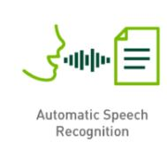
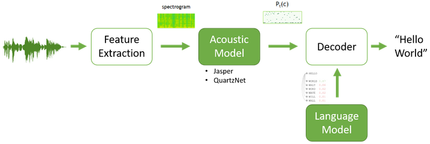
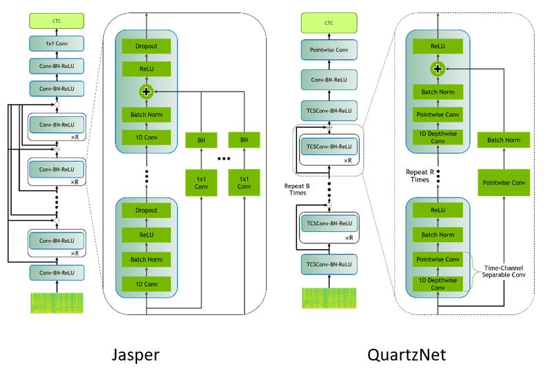

# Speech-to-text

Giving voice commands to an interactive virtual assistant, converting audio to subtitles on a video online, and transcribing customer interactions into text for archiving at a call center are all use cases for Automatic Speech Recognition (ASR) systems. With deep learning, the latest speech-to-text models are capable of recognition and translation of audio into text in real time! Good models can perform well in noisy environments, are robust to accents and have low word error rates (WERs). 

In this collection, we will cover:
- How does speech-to-text work?
- Usecases and applications
- Where to get started

---
## How does speech-to-text work?

Source: https://developer.nvidia.com/blog/how-to-build-domain-specific-automatic-speech-recognition-models-on-gpus/

Speech to text is a challenging process, as it introduces a series of tasks which are as follows-

### Feature extraction: 
Initially we resample the raw analog audio signals into convert into the discrete form following with some traditional signal preprocessing techniques such as standardization, windowing and conversion to a machine-understandable form by spectrogram transformation. 

### Acoustic Modelling:

Acoustic models can be of various types and with different loss functions but the most used in literature and production are Connectionist Temporal Classification (CTC) based model that considers spectrogram (X) as input and produces the log probability scores (P) of all different vocabulary tokens for each time step. For example, NVIDIA’s Jasper and QuartzNet.

### Language Modeling:

It is used to add contextual representation about the language and finally correct the acoustic model's mistakes. It tries to determine the context of speech by combining the knowledge from acoustic model what it understands with calculating the probability distribution over sequence for next possible word.

---
## How does speech-to-text work?

### Automatic Transcription in Online Meetings/Conferences:

Maintaining notes during meetings is sometimes crucial and hectic.  We are habitual to small errors, and we may get some distractions throughout a meeting which means that the notes we take aren’t always accurate and are generally incomplete. By Keeping digital transcribes of calls, your team will not only be able to share their conversations efficiently, but also understands the customer requirements, agenda and technical aspects behind the meeting.

### Captioning & Subtitling on Digital Platforms:

Useful in providing communication access to the students and professionals for media sessions, and live lectures with easy-to-read transcripts and captions containing precise grammar, proper punctuation, and accurate spelling. Moreover, this technique also improves reach and accessibility of education to deaf or hard-of-hearing audience.

### Documentation at medical facilities:

Medical doctors and clinicians can avail this technique in the respective field to proficiently digitize physician-patient conversations into text for entry into health record systems. The model will be trained to understand medical terminologies. This technique enables the practitioners to focus more on patient care than documentation while listening to them.

---
## Where to get started

NVIDIA provides Deep Learning Examples for Image Segmentation on its GitHub repository. These examples provide you with easy to consume and highly optimized scripts for both training and inferencing. The quick start guide at our GitHub repository will help you in setting up the environment using NGC Docker Images, download pre-trained models from NGC and adapt the model training and inference for your application/use-case. 
Here are the examples relevant for image segmentation, directly from [Deep Learning Examples](https://github.com/NVIDIA/DeepLearningExamples):

1. Jasper on Librispeech for English ASR using PyTorch
- [Git repository](https://github.com/NVIDIA/DeepLearningExamples/tree/master/PyTorch/SpeechRecognition/Jasper)
- Uses PyTorch 20.06-py3 [NGC container](https://ngc.nvidia.com/registry/nvidia-pytorch)

2. Kaldi ASR integrated with TRITON Inference Server
- [Git repository](https://github.com/NVIDIA/DeepLearningExamples/tree/master/Kaldi/SpeechRecognition)
- Uses Triton 19.12-py3 [NGC container](https://ngc.nvidia.com/catalog/containers/nvidia:tritonserver)
