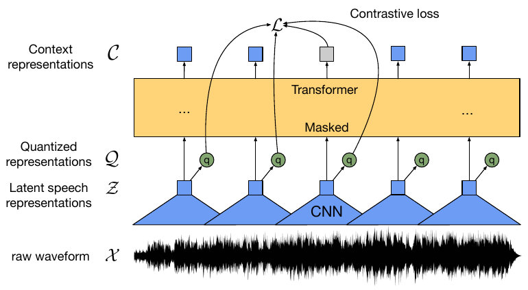
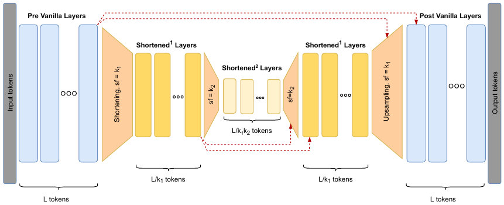
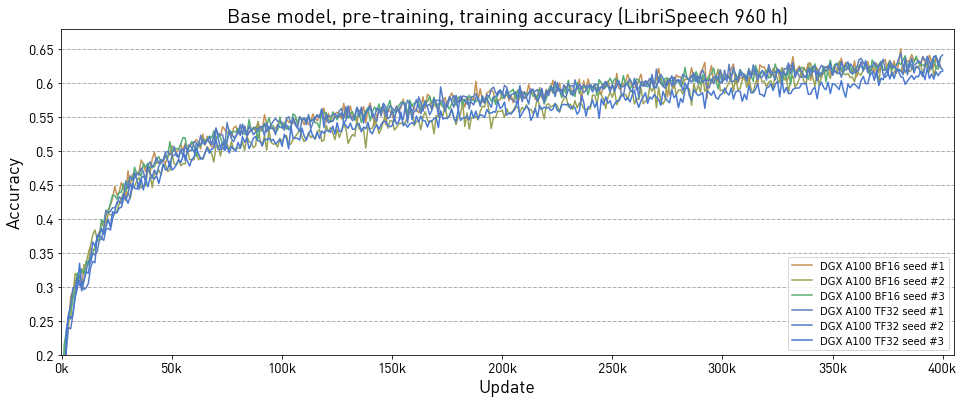
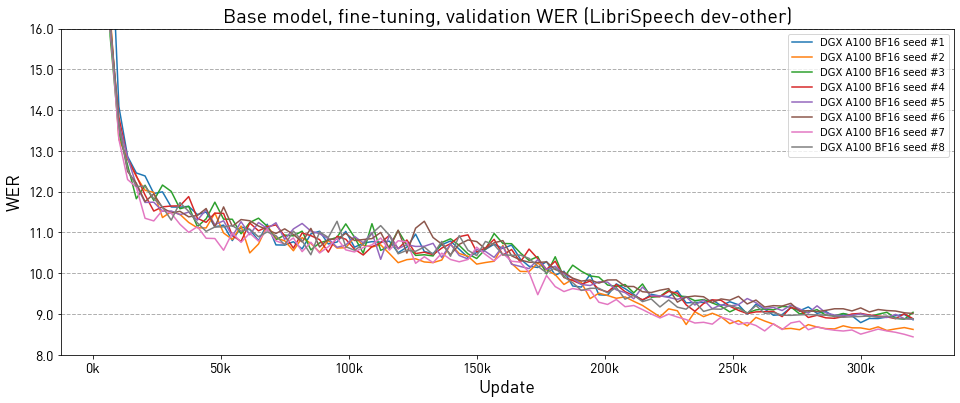

# wav2vec 2.0 for PyTorch

This repository provides a script and recipe to train the wav2vec 2.0 model to achieve state-of-the-art accuracy. The content of this repository is tested and maintained by NVIDIA.

## Table Of Contents

- [Model overview](#model-overview)
    * [Model architecture](#model-architecture)
    * [Default configuration](#default-configuration)
    * [Feature support matrix](#feature-support-matrix)
        * [Features](#features)
    * [Mixed precision training](#mixed-precision-training)
          * [Enabling mixed precision](#enabling-mixed-precision)
          * [Enabling TF32](#enabling-tf32)
    * [Glossary](#glossary)
- [Setup](#setup)
    * [Requirements](#requirements)
- [Quick Start Guide](#quick-start-guide)
- [Advanced](#advanced)
    * [Scripts and sample code](#scripts-and-sample-code)
    * [Parameters](#parameters)
        * [Adjusting batch size and the number of GPUs](#adjusting-batch-size-and-the-number-of-gpus)
        * [Adjusting mixed precision](#adjusting-mixed-precision)
        * [Adjusting Hourglass Transformer](#adjusting-hourglass-transformer)
    * [Command-line options](#command-line-options)
    * [Getting the data](#getting-the-data)
        * [Dataset guidelines](#dataset-guidelines)
        * [Multi-dataset](#multi-dataset)
    * [Training process](#training-process)
    * [Inference process](#inference-process)
- [Performance](#performance)
    * [Benchmarking](#benchmarking)
        * [Training performance benchmark](#training-performance-benchmark)
        * [Inference performance benchmark](#inference-performance-benchmark)
    * [Results](#results)
        * [Training accuracy results](#training-accuracy-results)
            * [Training accuracy: NVIDIA DGX A100 (8x A100 80GB)](#training-accuracy-nvidia-dgx-a100-8x-a100-80gb)
            * [Training stability test](#training-stability-test)
        * [Training performance results](#training-performance-results)
            * [Training performance: NVIDIA DGX A100 (8x A100 80GB)](#training-performance-nvidia-a100-8x-a100-80gb)
        * [Inference performance results](#inference-performance-results)
            * [Inference performance: NVIDIA DGX A100 (1x A100 80GB)](#inference-performance-nvidia-dgx-a100-1x-a100-80gb)
- [Release notes](#release-notes)
    * [Changelog](#changelog)
    * [Known issues](#known-issues)

## Model overview

This repository provides an optimized implementation of the wav2vec 2.0 model, as described in the paper [wav2vec 2.0: A Framework for Self-Supervised Learning of Speech Representations](https://proceedings.neurips.cc/paper/2020/file/92d1e1eb1cd6f9fba3227870bb6d7f07-Paper.pdf). It is based on the [Fairseq codebase](https://github.com/facebookresearch/fairseq) published by the authors of the paper. The wav2vec 2.0 model is pre-trained unsupervised on large corpora of speech recordings. Afterward, it can be quickly fine-tuned in a supervised way for speech recognition or serve as an extractor of high-level features and pseudo-phonemes for other applications.

The differences between this wav2vec 2.0 and the reference implementation are:
* Support for increased batch size, which does not change batch-dependent constants for negative sampling and loss calculation and improves hardware utilization
* Support for the [Hourglass Transformer](https://arxiv.org/abs/2110.13711) architecture, which in the default setting improves the training speed of the `Base` model by 1.4x, lowers memory consumption by 38%, and retains accuracy

This model is trained with mixed precision using Tensor Cores on NVIDIA Volta, NVIDIA Turning, and the NVIDIA Ampere GPU architectures. Therefore, researchers can get results up to 1.35x faster than training without Tensor Cores while experiencing the benefits of mixed precision training. This model is tested against each NGC monthly container release to ensure consistent accuracy and performance over time.

### Model architecture

The model takes raw waveforms as its input. A fully convolutional feature extractor reduces the resolution of the signal to a single vector roughly every 20 ms. Most of the computation is performed in the transformer encoder part of the model. The outputs of the transformer, and quantized outputs from the feature extractor, serve as inputs to the contrastive loss. During fine-tuning, this loss is replaced with the CTC loss, and quantization is not performed.


<p align="center">
  
</p>
<p align="center">
  <em>Figure 1. The architecture of wav2vec 2.0 ([source](https://proceedings.neurips.cc/paper/2020/file/92d1e1eb1cd6f9fba3227870bb6d7f07-Paper.pdf)). The model is composed of a convolutional feature extractor, and a transformer encoder. During fine-tuning, quantization is disabled and contrastive loss is replaced with the CTC loss function.</em>
</p>

In addition, our model uses the Hourglass Transformer architecture for the encoder. This architecture uses fixed-sized pooling in order to reduce the time dimension _T_ of the signal, and thus, lower the _O(T²)_ cost of the self-attention mechanism.

<p align="center">
  
</p>
<p align="center">
  <em>Figure 2. The Hourglass Transformer module ([source](https://arxiv.org/abs/2110.13711)). The signal is processed by the initial layers and downsampled. Most of the layers operate on the downsampled signal. Finally, the signal is upsampled for the final layers. The Hourglass Transformer replaced a regular stack of transformer layers, typically improving throughput and lowering memory consumption.</em>
</p>

### Default configuration

The following features were implemented in this model:
- general:
    - multi-GPU and multi-node training
    - Hourglass Transformer architecture
    - dynamic loss scaling with backoff for tensor cores (mixed precision) training
    - mixed-precision training with `O2` optimization level, based on float16 or bfloat16
- training:
    - support for variable batch size without changing batch-dependent constants for the loss function
- inference:
    - masking for inference with a larger batch

Our main recipes replicate the `Base` model described in the wav2vec 2.0 paper, and use Hourglass Transformer with pooling factor 4. Note that Hourglass Transformer can be entirely disabled and this codebase is compatible with Fairseq checkpoints.

Below we present performance numbers for the Hourglass Transformer with different pooling factors (`Base` model, pre-training, A100 80GB GPU, bfloat16):

| Configuration      | Throughput speedup | GPU memory (% of Baseline) |
|:-------------------|--------------------:|----------------:|
| Baseline           |                1.00 |         100.00% |
| Hourglass factor=2 |                1.25 |          70.98% |
| Hourglass factor=3 |                1.33 |          64.31% |
| **Hourglass factor=4 (default)** |  **1.37** |  **62.35%** |
| Hourglass factor=5 |                1.39 |          60.00% |
| Hourglass factor=6 |                1.40 |          59.61% |

### Feature support matrix

This model supports the following features:

| Feature                         | wav2vec 2.0 |
|---------------------------------|-------------|
| Multi-node training             | yes         |
| Automatic mixed precision (AMP) | yes         |

#### Features

**Automatic Mixed Precision (AMP)**
This implementation uses automatic mixed-precision training ported from Fairseq.
It allows us to use FP16 or BF16 training with FP16 master weights.

### Mixed precision training

Mixed precision is the combined use of different numerical precisions in a computational method. [Mixed precision](https://arxiv.org/abs/1710.03740) training offers significant computational speedup by performing operations in half-precision format while storing minimal information in single-precision to retain as much information as possible in critical parts of the network. Since the introduction of [Tensor Cores](https://developer.nvidia.com/tensor-cores) in NVIDIA Volta, and following with both the NVIDIA Turing and Ampere architectures, significant training speedups are experienced by switching to mixed precision -- up to 3x overall speedup on the most arithmetically intense model architectures. Using [mixed precision training](https://docs.nvidia.com/deeplearning/performance/mixed-precision-training/index.html) previously required two steps:
1. Porting the model to use the FP16 data type where appropriate.
2. Adding loss scaling to preserve small gradient values.

For information about:
- How to train using mixed precision, refer to the [Mixed Precision Training](https://arxiv.org/abs/1710.03740) paper and [Training With Mixed Precision](https://docs.nvidia.com/deeplearning/performance/mixed-precision-training/index.html) documentation.
- Techniques used for mixed precision training, refer to the [Mixed-Precision Training of Deep Neural Networks](https://devblogs.nvidia.com/mixed-precision-training-deep-neural-networks/) blog.

#### Enabling mixed precision

For training and inference, mixed precision can be enabled by adding the `--fp16` flag or `--bf16` flag, depending on the target’s lower precision. NVIDIA Ampere and later architectures provide hardware support for bfloat16, which is beneficial for this model, as it skips certain stabilizing FP32 casts. For NVIDIA Volta and NVIDIA Turing architectures, select `--fp16`.

#### Enabling TF32

TensorFloat-32 (TF32) is the new math mode in [NVIDIA A100](https://www.nvidia.com/en-us/data-center/a100/) GPUs for handling the matrix math, also called tensor operations. TF32 running on Tensor Cores in A100 GPUs can provide up to 10x speedups compared to single-precision floating-point math (FP32) on NVIDIA Volta GPUs.

TF32 Tensor Cores can speed up networks using FP32, typically with no loss of accuracy. It is more robust than FP16 for models which require a high dynamic range for weights or activations.

For more information, refer to the [TensorFloat-32 in the A100 GPU Accelerates AI Training, HPC up to 20x](https://blogs.nvidia.com/blog/2020/05/14/tensorfloat-32-precision-format/) blog post.

TF32 is supported in the NVIDIA Ampere GPU architecture and is enabled by default.

### Glossary

**Brain Floating Point (bfloat16)**
A 16-bit floating point format that uses an 8-bit exponent, a 7-bit fraction, and a sign bit.
Contrary to float16, which uses a 5-bit exponent, bfloat16 retains the same exponent precision as float32,
and its robustness with respect to wide ranges of values during training.

**Fine-tuning**
Training an already pretrained model further using a task-specific dataset for subject-specific refinements by adding task-specific layers on top if required.

**Hourglass Transformer**
Architecture proposed in the paper [Hierarchical Transformers Are More Efficient Language Models](https://arxiv.org/abs/2110.13711), which improves resource consumption
of a stack of transformer layers, in many cases retaining the accuracy.

**Pre-training**
Training a model on vast amounts of data on the same (or different) task to build general understandings.

**Transformer**
The paper [Attention Is All You Need](https://arxiv.org/abs/1706.03762) introduces a novel architecture called transformer that uses an attention mechanism and transforms one sequence into another.

**Connectionist Temporal Classification (CTC) Loss**
A loss function introduced in [Connectionist temporal classification: Labelling unsegmented sequence data with recurrent neural networks](https://www.cs.toronto.edu/~graves/icml_2006.pdf). It calculates the probability of all valid output sequences with repetitions, and allows to train end-to-end ASR models without any prior alignments of transcriptions to audio.

## Setup

The following section lists the requirements you need to meet in order to start training the wav2vec 2.0 model.

### Requirements

This repository contains a Dockerfile that extends the PyTorch NGC container and encapsulates some dependencies. Aside from these dependencies, ensure you have the following components:
- [NVIDIA Docker](https://github.com/NVIDIA/nvidia-docker)
- [PyTorch 22.11-py3 NGC container](https://ngc.nvidia.com/registry/nvidia-pytorch) or newer
- Supported GPUs:
  - [NVIDIA Volta architecture](https://www.nvidia.com/en-us/data-center/volta-gpu-architecture/)
  - [NVIDIA Turing architecture](https://www.nvidia.com/en-us/design-visualization/technologies/turing-architecture/)
  - [NVIDIA Ampere architecture](https://www.nvidia.com/en-us/data-center/nvidia-ampere-gpu-architecture/)

For more information about how to get started with NGC containers, refer to the following sections from the NVIDIA GPU Cloud Documentation and the Deep Learning Documentation:
- [Getting Started Using NVIDIA GPU Cloud](https://docs.nvidia.com/ngc/ngc-getting-started-guide/index.html)
- [Accessing And Pulling From The NGC Container Registry](https://docs.nvidia.com/deeplearning/frameworks/user-guide/index.html#accessing_registry)
- [Running PyTorch](https://docs.nvidia.com/deeplearning/frameworks/pytorch-release-notes/running.html#running)

For those unable to use the PyTorch NGC container to set up the required environment or create your own container, refer to the versioned [NVIDIA Container Support Matrix](https://docs.nvidia.com/deeplearning/frameworks/support-matrix/index.html).

## Quick Start Guide

To train your model using mixed or TF32 precision with Tensor Cores or using FP32, perform the following steps using the default parameters of the wav2vec 2.0 model on the LibriSpeech dataset. For the specifics concerning training and inference, refer to the [Advanced](#advanced) section.

1. Clone the repository.
   ```bash
   git clone https://github.com/NVIDIA/DeepLearningExamples
   cd DeepLearningExamples/PyTorch/SpeechRecognition/wav2vec2
   ```

2.  Build the 22.11-py3 PyTorch NGC container and start an interactive session to run training/inference. `DATASET_DIR` on the host will be mounted as `/datasets` inside the container.
    ```bash
    bash scripts/docker/build.sh
    DATASET_DIR=[PATH] bash scripts/docker/run.sh
    ```

3.  Download and preprocess the dataset. The dataset size is about 70GB and this step could take up to a few hours to complete.
    ```bash
    bash scripts/download_data.sh
    ```

4.  Generate filelists.
    ```bash
    bash scripts/generate_filelists.sh
    ```

5. Start pre-training.
    ```bash
    NUM_GPUS=[NUM] UPDATE_FREQUENCY=[NUM] NUM_CONCAT_BATCHES=[NUM] BF16=[true|false] FP16=[true|false] \
        bash scripts/pretrain_base.sh
    ```
    Adjust the variables to maintain `NUM_GPUS x NUM_CONCAT_BATCHES x UPDATE_FREQUENCY = 64`.
    For more details, refer to [Adjusting batch size and the number of GPUs](#adjusting-batch-size-and-the-number-of-gpus) and [Adjusting mixed precision](#adjusting-mixed-precision).

    For instance:
    ```bash
    # Mixed precision training on 4x A100 40GB
    NUM_GPUS=4 NUM_CONCAT_BATCHES=8 UPDATE_FREQUENCY=2 BF16=true bash scripts/pretrain_base.sh
    ```

6. Start fine-tuning.
    ```bash
    PRETRAINED_MODEL=[PATH] NUM_GPUS=[NUM] UPDATE_FREQUENCY=[NUM] BF16=[true|false] FP16=[true|false] \
        bash scripts/finetune_base_960h.sh
    ```
    Adjust the variables to maintain `NUM_GPUS x NUM_CONCAT_BATCHES x UPDATE_FREQUENCY = 8`.

7. Start inference/predictions.
    ```bash
    FINETUNED_MODEL=[PATH] BF16=[true|false] FP16=[true|false] BATCH_SIZE=[NUM] bash scripts/inference.sh
    ```

Now that you have your model trained and evaluated, you can choose to compare your training results with our [Training accuracy results](#training-accuracy-results). You can also choose to benchmark your performance to [Training performance benchmark](#training-performance-results) or [Inference performance benchmark](#inference-performance-results). Following the steps in these sections ensures you achieve the same accuracy and performance results as stated in the [Results](#results) section.
## Advanced

The following sections provide greater details of the dataset, running training and inference, and the training results.

### Scripts and sample code

In the root directory, the most important files are:
```bash
.
├── common                         # Generic code for training
│   ├── fairseq                    # Parts of https://github.com/facebookresearch/fairseq
│   └── ...
├── inference.py                   # Evaluates trained models and measures latency
├── scripts
│   ├── download_wav2vec2_base.sh  # Downloads pre-trained models from NGC
│   ├── finetune_base_960h.sh      # Helper script for fine-tuning with train.py
│   ├── inference.sh               # Helper script for inference.py
│   ├── pretrain_base.sh           # Helper script for pre-training with train.py
│   └── ...
├── train.py                       # Main pre-training and fine-tuning script
├── utils                          # Misc standalone Python scripts
└── wav2vec2                       # Code specific to wav2vec 2.0 model
    ├── arg_parser.py
    ├── criterion.py
    ├── logging.py
    ├── model.py
    └── utils.py
```

### Parameters

Parameters can be set through environment variables.
The most important available parameters for `scripts/pretrain_base.sh` script are:
```bash
OUTPUT_DIR              directory for results, logs, and created checkpoints
                        (default: "./results/pretrain_base")
NUM_GPUS                number of GPUs to use. (default: 8)
MAX_TOKENS              upper limit for the number of tokens in a batch; changing
                        this value alters loss function consts (default: 1400000)
NUM_CONCAT_BATCHES      number of sub-batches, each with MAX_TOKENS tokens,
                        to make up one large batch (default: 8)
UPDATE_FREQ             number of grad accumulation steps before the update (default: 1)
MAX_UPDATE              training length expressed as the number of updates (default: 400000)
LEARNING_RATE           peak learning rate (default: 0.0005)
SEED                    random seed controlling model weights and data shuffling (default: disabled)
FP16                    enables mixed-precision training with float16 (default: false)
BF16                    enabled mixed-precision training with bfloat16 (default: false)
DATASET_DIR             directory with file lists (default: /datasets/LibriSpeech)
TRAIN_SUBSET            base name of the .tsv file list in the DATASET_DIR (default: "train-full-960")
VALID_SUBSET            base name of the validation .tsv file list in the DATASET_DIR (default: "dev-other")
SAVE_FREQUENCY          frequency of saving checkpoints to disk (default: 1)
HOURGLASS_CONFIG        configuration of Hourglass Transformer; refer to the section
                        below for details (default: "[2,(8,4),2]")
```

In addition, important parameters for `scripts/finetune_base_960h.sh` script are:
```bash
PRETRAINED_MODEL        a path to a pre-trained model checkpoint for fine-tuning
                        (default: "./results/pretrain_base/wav2vec2_update400000.pt")
FREEZE_FINETUNE_UPDATES freeze wav2vec 2.0 encoder for an initial number of steps and train only
                        the output linear projection (default: 0)
```

Below we present more details on how to set crucial parameters.

#### Adjusting batch size and the number of GPUs

Every training recipe assumes a constant world size, and variables need to be adjusted to maintain that world size,
for example, `NUM_GPUS x NUM_CONCAT_BATCHES x UPDATE_FREQUENCY = 64` for pre-training of the `Base` model:
* first, set `NUM_GPUS` to the number of available GPUs,
* then, adjust `NUM_CONCAT_BATCHES` to a high value that does not cause out-of-memory errors
* finally, adjust the update frequency that controls gradient accumulation, to maintain the effective world size.

`NUM_CONCAT_BATCHES` controls the number of sub-batches that are forwarded through the model, each with `--max_tokens` tokens.
In the case of out-of-memory errors, it has to be lowered. With Hourglass Transformer and mixed-precision training,
the model should fit within 12GB of GPU memory on the lowest `NUM_CONCAT_BATCHES=1` setting.

#### Adjusting mixed precision

By default, the model is trained in TF32 (A100 GPUs) or FP32 (V100 and older GPUs).
Mixed-precision training can be performed in float16 or bfloat16 precisions.
Training in bfloat16 is more stable and requires less stabilizing casts to FP32; thus, it is a bit faster.
It is supported on the hardware level in NVIDIA Ampere and newer architectures.
Scripts `scripts/pretrain_base.sh` and `scripts/finetune_base_960h.sh` provide env vars
for setting appropriate casting flags.
In order to benefit from mixed-precision training,
set either `BF16=true` or `FP16=true`, depending on the architecture of the GPU.

#### Adjusting Hourglass Transformer

The Hourglass Transformer architecture is configurable by four parameters:
* the number of initial transformer layers,
* the number of middle transformer layers that process the downsampled signal,
* downsampling rate,
* the number of output transformer layers.

These are expressed in that exact order by a Python list without whitespace. For instance, the default setting is `HOURGLASS_CONFIG="[2,(8,4),2]"`.
It uses 12 layers in total (two initial, eight middle with a downsampling rate 4, and two output layers).

During fine-tuning, the same architecture as during pre-training has to be set.

### Command-line options

To view the full list of available options and their descriptions, use the `-h` or `--help` command-line option, for example:
`python train.py -h`. Most of the command-line options are a subset of those from the original [Fairseq](https://github.com/facebookresearch/fairseq) wav2vec 2.0 codebase.

### Getting the data

The wav2vec 2.0 model described in the paper was pre-trained on either the LibriSpeech or LibriVox datasets.
We publish recipes for training on pre-training and fine-tuning on the LibriSpeech dataset.
The `dev-other` subset is used as a validation dataset, and `test-other` is used as a testing dataset.

The `./scripts/download_ls_dataset.sh [TARGET_DATA_DIR]` script downloads and extracts the LibriSpeech dataset to the directory of choice,
by default `/datasets/LibriSpeech` if the argument is omitted.

The `./scripts/generate_ls_filelists.sh [SOURCE_DATA_DIR] [TARGET_FILELISTS_DIR]` script prepares filelists and collect transcriptions.
Again, positional arguments are optional and default to `/datasets/LibriSpeech`.

#### Dataset guidelines

LibriSpeech data is kept at the default sampling rate of 16 kHz.
The model works with either `.wav` or `.flac` files. Both are lossless, with `.flac` being more efficient in terms of storage but requiring extra computation during training.
Files are listed in `.tsv` filelists. The first row is the top-level directory, and subsequent lines listths to files and a number of samples delimited by `tab`:
```bash
/datasets/LibriSpeech/test-other
367/293981/367-293981-0017.flac\t46560
367/293981/367-293981-0009.flac\t52720
...
```

The `.ltr` files, generated alongside `.tsv` filelists, hold character-level transcriptions for filelists with the same basename.
Filelists and transcription lists should list samples in matching order.
```bash
A N D | A | V E R Y | R E S P E C T A B L E | O N E | S A I D | T H E | I N N K E E P E R |
T H E | O F F I C E R | T U R N E D | T O | H I M | A N D | S A I D | W E L L | H O W | G O E S | I T | G O O D | M A N |
...
```

Finally, generate a `dict.ltr.txt` dictionary using training `.ltr` transcripts:
```bash
python utils/generate_dictionary.py /my/dataset/path/train.ltr /my/dataset/path/dict.ltr.txt
```

#### Multi-dataset

In order to train on multiple datasets, prepare a filelist and transcription list with all files from those datasets.
Refer to `scripts/generate_filelists.sh` for an example of concatenating LibriSpeech training filelists.

### Training process

Training of wav2vec 2.0 is performed in two stages: unsupervised pre-training and supervised fine-tuning. Both are performed with the `train.py` script.

**Pre-training**
The `scripts/pretrain_base.sh` script sets command-line arguments for `train.py`
and runs a job on a single node that trains the wav2vec 2.0 model from scratch.
Key variables can be conveniently changed via env variables.

**Fine-tuning**
The `scripts/finetune_base_960h.sh` script sets command-line arguments for `train.py`
and runs a job on a single node that fine-tunes a pre-trained wav2vec 2.0 model.
Key variables can be conveniently changed via env variables.
Note that a checkpoint trained with Fairseq can be loaded and fine-tuned
using this repository.

Apart from the arguments as listed in the [Parameters](#parameters) section, by default both training scripts:
* Run on eight GPUs with at least 80GB of memory with increased batch size, so that gradient accumulation is not necessary
* Use TF32 precision (A100 GPU) or FP32 (other GPUs)
* Use Hourglass Transformer architecture with shortening factor of 4
* Train on 960 hours of LibriSpeech training data and evaluate on the dev-other subset
* Remove old checkpoints and preserve milestone checkpoints automatically
* Maintain a separate checkpoint with the lowest WER on the dev set
* Create a DLLogger log file and a TensorBoard log
* Set the remaining parameters according to the recipes published with the original paper

The current training setup recreates WER [Results](#results) published in the original paper,
while significantly lowering the time and memory required for training.

### Inference process

Inference is performed using the `inference.py` script along with parameters defined in `scripts/inference.sh`.
The `scripts/inference.sh` script runs the job on a single GPU, taking a fine-tuned wav2vec 2.0 model checkpoint
and running it on the specified dataset.
Apart from the default arguments as listed in the [Parameters](#parameters) section, by default, the inference script:
* Evaluates on the LibriSpeech test-other dataset and prints out the final word error rate
* Uses a batch size of 8
* Creates a log file with progress and results, which will be stored in the `results` folder
* Does greedy decoding and optionally saves the transcriptions in the results folder
* Has the option to save the model output tensors for more complex decoding, for example, beam search

To view all available options for inference, run `python inference.py --help`

## Performance
The performance measurements in this document were conducted at the time of publication and may not reflect the performance
achieved from NVIDIA’s latest software release. For the most up-to-date performance measurements,
go to [NVIDIA Data Center Deep Learning Product Performance](https://developer.nvidia.com/deep-learning-performance-training-inference).

### Benchmarking

The following section shows how to run benchmarks measuring the model performance in training and inference modes.

#### Training performance benchmark

To benchmark the training performance with a number of specific configurations, run:
```bash
NUM_GPUS=[NUM] UPDATE_FREQ=[NUM] NUM_CONCAT_BATCHES=[NUM] NUM_EPOCHS=[NUM] NUM_WARUP_EPOCHS=[NUM] \
    BF16=[true|false] FP16=[true|false] bash scripts/pretrain_base_benchmark.sh

NUM_GPUS=[NUM] UPDATE_FREQ=[NUM] NUM_CONCAT_BATCHES=[NUM] NUM_EPOCHS=[NUM] NUM_WARUP_EPOCHS=[NUM] \
    BF16=[true|false] FP16=[true|false] bash scripts/finetune_base_benchmark.sh
```
for example:
```bash
NUM_GPUS=8 UPDATE_FREQ=1 NUM_CONCAT_BATCHES=8 BF16=true bash scripts/pretrain_base_benchmark.sh
NUM_GPUS=8 UPDATE_FREQ=1 NUM_CONCAT_BATCHES=1 BF16=true bash scripts/finetune_base_benchmark.sh
```

By default, these scripts run initially for `NUM_WARMUP_EPOCHS=2`, and collect performance results for another `NUM_EPOCHS=5` on the `train-clean-100` subset of LibriSpeech.

#### Inference performance benchmark

To benchmark the inference performance on a specific batch size, run:

```bash
NUM_WARMUP_REPEATS=[NUM] NUM_REPEATS=[NUM] BATCH_SIZE=[NUM] BF16=[true|false] FP16=[true|false] \
    bash scripts/inference_benchmark.sh
```
for example:
```bash
NUM_WARMUP_REPEATS=2 NUM_REPEATS=10 BATCH_SIZE=8 BF16=true bash scripts/inference_benchmark.sh
```
By default, the model will process all samples in the `test-other` subset of LibriSpeech initially `NUM_WARMUP_REPEATS` times for warmup,
and then `NUM_REPEATS` times recording the measurements. The number of iterations will depend on the batch size.

### Results

The following sections provide details on how we achieved our performance and accuracy in training and inference.

#### Training accuracy results

##### Training accuracy: NVIDIA DGX A100 (8x A100 80GB)

Pre-training results were obtained by running the `scripts/pretrain_base.sh` training script in the PyTorch 22.11-py3 NGC container on NVIDIA A100 (8x A100 80GB) GPUs.
We report a median of eight (BF16 mixed precision) and three (TF32) runs.

| GPUs    | (Concatenated) batch size / GPU | Accuracy - TF32  | Accuracy - mixed precision  | Time to train - TF32  |  Time to train - mixed precision | Time to train speedup (TF32 to mixed precision) |
|--------:|--------------------------------:|-----------------:|----------------------------:|----------------------:|---------------------------------:|------------------------------------------------:|
|       8 |            8 x 1400k max tokens |            0.619 |                       0.633 |                64.9 h |                           48.1 h |                                            1.35 |

<p align="center">
  
</p>

Fine-tuning results were obtained by running the `scripts/finetune_base_960h.sh` training script in the PyTorch 22.11-py3 NGC container on NVIDIA A100 (8x A100 80GB) GPUs.
We report a median of eight runs; each resumed from a different pre-training checkpoint.

| GPUs    | (Concatenated) batch size / GPU | WER - mixed precision  | Time to train - TF32  |  Time to train - mid precision | Time to train speedup (TF32 to mixed precision) |
|--------:|--------------------------------:|-----------------------:|----------------------:|---------------------------------:|------------------------------------------------:|
|       8 |            1 x 3200k max tokens |                  8.878 |                 8.2 h |                            6.5 h |                                            1.27 |

<p align="center">
  
</p>

##### Training stability test

The wav2vec 2.0 Base model was pre-trained with eight different initial random seeds in bfloat16 precision in the PyTorch 22.11-py3 NGC container on NVIDIA DGX A100 with 8x A100 80GB.

Below we present accuracy of this model in the self-training task:

| Update   |   Average |   Std |   Min |   Max |   Median |
|---------:|----------:|------:|------:|------:|---------:|
| 50k      |     0.491 | 0.011 | 0.471 | 0.514 |    0.493 |
| 100k     |     0.537 | 0.009 | 0.518 | 0.550 |    0.539 |
| 150k     |     0.564 | 0.009 | 0.544 | 0.577 |    0.564 |
| 200k     |     0.580 | 0.009 | 0.558 | 0.589 |    0.583 |
| 250k     |     0.599 | 0.008 | 0.586 | 0.607 |    0.602 |
| 300k     |     0.610 | 0.010 | 0.589 | 0.622 |    0.611 |
| 350k     |     0.619 | 0.009 | 0.607 | 0.634 |    0.617 |
| 400k     |     0.629 | 0.007 | 0.614 | 0.636 |    0.633 |

Afterward, each of those runs was fine-tuned on LibriSpeech 960 h dataset with yet another different initial random seed.
Below we present the word error rate (WER) on the `dev-other` subset of LibriSpeech:

| Update   |   Average |   Std |    Min |    Max |   Median |
|---------:|----------:|------:|-------:|-------:|---------:|
| 50k      |    11.198 | 0.303 | 10.564 | 11.628 |   11.234 |
| 100k     |    10.825 | 0.214 | 10.574 | 11.211 |   10.763 |
| 150k     |    10.507 | 0.160 | 10.224 | 10.778 |   10.518 |
| 200k     |     9.567 | 0.186 |  9.235 |  9.836 |    9.530 |
| 250k     |     9.115 | 0.193 |  8.764 |  9.339 |    9.194 |
| 300k     |     8.885 | 0.201 |  8.507 |  9.151 |    8.972 |
| 320k     |     8.827 | 0.188 |  8.440 |  9.043 |    8.878 |

#### Training performance results

##### Training performance: NVIDIA DGX A100 (8x A100 80GB)

**Pre-training**

Our results were obtained by running the `scripts/pretrain_base_benchmark.sh` training script in the PyTorch 22.11-py3 NGC container on NVIDIA A100 (8x A100 80GB) GPUs. Performance numbers in transformer tokens per second were averaged over an entire training epoch.

|   GPUs |   Concat batches / GPU |   Grad accumulation |   Throughput - TF32 |   Throughput - mixed precision |   Throughput speedup (TF32 to mixed precision) |   Strong scaling - TF32 |   Strong scaling - mixed precision |
|-------:|-----------------------:|--------------------:|--------------------:|-------------------------------:|-----------------------------------------------:|------------------------:|-----------------------------------:|
|      1 |                      8 |                   8 |            28045.27 |                       37609.84 |                                           1.34 |                    1.00 |                               1.00 |
|      4 |                      8 |                   2 |           103842.47 |                      138956.38 |                                           1.34 |                    3.70 |                               3.69 |
|      8 |                      8 |                   1 |           194306.46 |                      261881.29 |                                          1.35 |                    6.93 |                               6.96 |

To achieve these same results, follow the steps in the [Quick Start Guide](#quick-start-guide).

**Fine-tuning**

Our results were obtained by running the `scripts/finetune_base_benchmark.sh` training script in the PyTorch 22.11-py3 NGC container on NVIDIA A100 (8x A100 80GB) GPUs. Performance numbers in transformer tokens per second were averaged over an entire training epoch.

|   GPUs | Concat batches / GPU |   Grad accumulation |   Throughput - TF32 |   Throughput - mixed precision |   Throughput speedup (TF32 to mixed precision) |   Strong scaling - TF32 |   Strong scaling - mixed precision |
|-------:|-------------------:|--------------------:|--------------------:|-------------------------------:|-----------------------------------------------:|------------------------:|-----------------------------------:|
|      1 |                  8 |                   1 |            34813.46 |                       41275.76 |                                           1.19 |                    1.00 |                               1.00 |
|      4 |                  2 |                   1 |           102326.57 |                      132361.62 |                                           1.29 |                    2.94 |                               3.21 |
|      8 |                  1 |                   1 |           163610.16 |                      207200.91 |                                           1.27 |                    4.70 |                               5.02 |

To achieve these same results, follow the steps in the [Quick Start Guide](#quick-start-guide).

#### Inference performance results

##### Inference performance: NVIDIA DGX A100 (1x A100 80GB)

Our results were obtained by running the `scripts/inference_benchmark.sh` inferencing benchmarking script in the PyTorch 22.11-py3 NGC container on the NVIDIA A100 (1x A100 80GB) GPU.
The script runs inference on the `test-other` subset of LibriSpeech in variable-length batches.

|  | Duration | BF16 Latency (ms) Percentiles |  |  |  | TF32 Latency (ms) Percentiles |  |  |  | BF16/TF32 speedup |
|-----:|-------:|------:|-------:|-------:|------:|-------:|-------:|-------:|------:|------:|
|   BS | Avg    |   90% |    95% |    99% |   Avg |    90% |    95% |    99% |   Avg |   Avg |
|    1 | 6.54 s | 11.02 |  11.41 |  12.42 | 10.45 |  10.88 |  11.23 |  12.51 | 10.31 |  0.99 |
|    4 | 6.54 s | 21.74 |  24.12 |  35.80 | 17.69 |  23.17 |  26.85 |  41.62 | 18.42 |  1.04 |
|    8 | 6.54 s | 40.06 |  48.07 |  74.59 | 28.70 |  46.43 |  54.86 |  88.73 | 31.30 |  1.09 |
|   16 | 6.54 s | 88.78 | 117.40 | 151.37 | 58.82 | 102.64 | 135.92 | 175.68 | 67.44 |  1.15 |

To achieve these same results, follow the steps in the [Quick Start Guide](#quick-start-guide).

## Release notes

### Changelog

December 2022
- Initial release

### Known issues

There are no known issues in this release.
