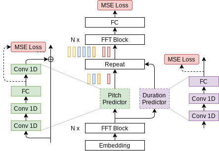
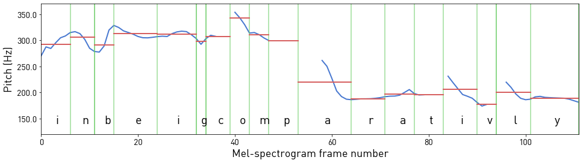
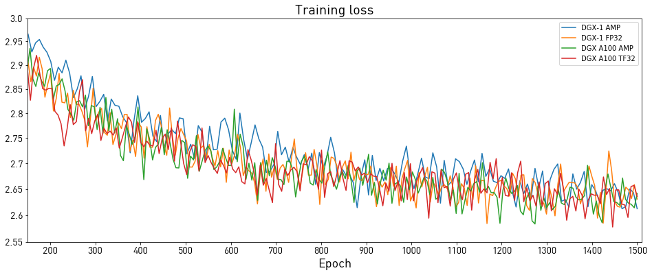

# FastPitch 1.1 for PyTorch

This repository provides a script and recipe to train the FastPitch model to achieve state-of-the-art accuracy and is tested and maintained by NVIDIA.

## Table Of Contents

- [Model overview](#model-overview)
    * [Model architecture](#model-architecture)
    * [Default configuration](#default-configuration)
    * [Feature support matrix](#feature-support-matrix)
        * [Features](#features)
    * [Mixed precision training](#mixed-precision-training)
        * [Enabling mixed precision](#enabling-mixed-precision)
        * [Enabling TF32](#enabling-tf32)
    * [Glossary](#glossary)
- [Setup](#setup)
    * [Requirements](#requirements)
- [Quick Start Guide](#quick-start-guide)
- [Advanced](#advanced)
    * [Scripts and sample code](#scripts-and-sample-code)
    * [Parameters](#parameters)
    * [Command-line options](#command-line-options)
    * [Getting the data](#getting-the-data)
        * [Dataset guidelines](#dataset-guidelines)
        * [Multi-dataset](#multi-dataset)
    * [Training process](#training-process)
    * [Inference process](#inference-process)
    * [Example: Training a model on Mandarin Chinese](#example-training-a-model-on-mandarin-chinese)
- [Performance](#performance)
    * [Benchmarking](#benchmarking)
        * [Training performance benchmark](#training-performance-benchmark)
        * [Inference performance benchmark](#inference-performance-benchmark)
    * [Results](#results)
        * [Training accuracy results](#training-accuracy-results)
            * [Training accuracy: NVIDIA DGX A100 (8x A100 80GB)](#training-accuracy-nvidia-dgx-a100-8x-a100-80gb)
            * [Training accuracy: NVIDIA DGX-1 (8x V100 16GB)](#training-accuracy-nvidia-dgx-1-8x-v100-16gb)
        * [Training performance results](#training-performance-results)
            * [Training performance: NVIDIA DGX A100 (8x A100 80GB)](#training-performance-nvidia-dgx-a100-8x-a100-80gb)
            * [Training performance: NVIDIA DGX-1 (8x V100 16GB)](#training-performance-nvidia-dgx-1-8x-v100-16gb)
            * [Expected training time](#expected-training-time)
        * [Inference performance results](#inference-performance-results)
            * [Inference performance: NVIDIA DGX A100 (1x A100 80GB)](#inference-performance-nvidia-dgx-a100-gpu-1x-a100-80gb)
            * [Inference performance: NVIDIA DGX-1 (1x V100 16GB)](#inference-performance-nvidia-dgx-1-1x-v100-16gb)
            * [Inference performance: NVIDIA T4](#inference-performance-nvidia-t4)
- [Release notes](#release-notes)
    * [Changelog](#changelog)
    * [Known issues](#known-issues)

## Model overview

[FastPitch](https://arxiv.org/abs/2006.06873) is one of two major components in a neural, text-to-speech (TTS) system:

* a mel-spectrogram generator such as [FastPitch](https://arxiv.org/abs/2006.06873) or [Tacotron 2](https://arxiv.org/abs/1712.05884), and
* a waveform synthesizer such as [WaveGlow](https://arxiv.org/abs/1811.00002) (refer to [NVIDIA example code](https://github.com/NVIDIA/DeepLearningExamples/tree/master/PyTorch/SpeechSynthesis/Tacotron2)).

Such a two-component TTS system is able to synthesize natural-sounding speech from raw transcripts.

The FastPitch model generates mel-spectrograms and predicts a pitch contour from raw input text.
In version 1.1, it does not need any pre-trained aligning model to bootstrap from.
It allows exerting additional control over the synthesized utterances, such as:
* modify the pitch contour to control the prosody,
* increase or decrease the fundamental frequency in a natural sounding way, that preserves the perceived identity of the speaker,
* alter the rate of speech,
* adjust the energy,
* specify input as graphemes or phonemes,
* switch speakers when the model has been trained with data from multiple speakers.
Some of the capabilities of FastPitch are presented on the website with [samples](https://fastpitch.github.io/).

Speech synthesized with FastPitch has state-of-the-art quality, and does not suffer from missing/repeating phrases as Tacotron 2 does.
This is reflected in Mean Opinion Scores ([details](https://arxiv.org/abs/2006.06873)).

| Model          | Mean Opinion Score (MOS) |
|:---------------|:-------------------------|
| Tacotron 2     | 3.946 ± 0.134            |
| FastPitch 1.0  | 4.080 ± 0.133            |

The current version of the model offers even higher quality, as reflected
in the pairwise preference scores ([details](https://arxiv.org/abs/2108.10447)).

| Model          | Average preference |
|:---------------|:-------------------|
| FastPitch 1.0  | 0.435 ± 0.068      |
| FastPitch 1.1  | 0.565 ± 0.068      |

The FastPitch model is based on the [FastSpeech](https://arxiv.org/abs/1905.09263) model. The main differences between FastPitch and FastSpeech are that FastPitch:
* no dependence on external aligner (Transformer TTS, Tacotron 2); in version 1.1, FastPitch aligns audio to transcriptions by itself as in [One TTS Alignment To Rule Them All](https://arxiv.org/abs/2108.10447),
* explicitly learns to predict the pitch contour,
* pitch conditioning removes harsh sounding artifacts and provides faster convergence,
* no need for distilling mel-spectrograms with a teacher model,
* capabilities to train a multi-speaker model.

The FastPitch model is similar to [FastSpeech2](https://arxiv.org/abs/2006.04558), which has been developed concurrently. FastPitch averages pitch/energy values over input tokens, and treats energy as optional.

FastPitch is trained on a publicly
available [LJ Speech dataset](https://keithito.com/LJ-Speech-Dataset/).

This model is trained with mixed precision using Tensor Cores on NVIDIA Volta, NVIDIA Turing, and the NVIDIA Ampere GPU architectures. Therefore, researchers can get results from 2.0x to 2.7x faster than training without Tensor Cores while experiencing the benefits of mixed precision training. This model is tested against each NGC monthly container release to ensure consistent accuracy and performance over time.

### Model architecture

FastPitch is a fully feedforward [Transformer](#glossary) model that predicts mel-spectrograms
from raw text (Figure 1). The entire process is parallel, which means that all input letters are processed simultaneously to produce a full mel-spectrogram in a single forward pass.

<p align="center">
  
</p>
<p align="center">
  <em>Figure 1. Architecture of FastPitch (<a href=”https://arxiv.org/abs/2006.06873”>source</a>). The model is composed of a bidirectional Transformer backbone (also known as a Transformer encoder), a pitch predictor, and a duration predictor. After passing through the first *N* Transformer blocks, encoding, the signal is augmented with pitch information and discretely upsampled. Then it goes through another set of *N* Transformer blocks, with the goal of
smoothing out the upsampled signal and constructing a mel-spectrogram.
  </em>
</p>

### Default configuration

The FastPitch model supports multi-GPU and mixed precision training with dynamic loss
scaling (refer to Apex code
[here](https://github.com/NVIDIA/apex/blob/master/apex/fp16_utils/loss_scaler.py)),
as well as mixed precision inference.

The following features were implemented in this model:

* data-parallel multi-GPU training,
* dynamic loss scaling with backoff for Tensor Cores (mixed precision)
training,
* gradient accumulation for reproducible results regardless of the number of GPUs.

Pitch contours and mel-spectrograms can be generated online during training.
To speed-up training, those could be generated during the pre-processing step and read
directly from the disk during training. For more information on data pre-processing, refer to [Dataset guidelines
](#dataset-guidelines) and the [paper](https://arxiv.org/abs/2006.06873).

### Feature support matrix

The following features are supported by this model.

| Feature                         | FastPitch |
| :-------------------------------|----------:|
| Automatic mixed precision (AMP) | Yes       |
| Distributed data parallel (DDP) | Yes       |

#### Features

Automatic Mixed Precision (AMP) - This implementation uses native PyTorch AMP
implementation of mixed precision training. It allows us to use FP16 training
with FP32 master weights by modifying just a few lines of code.

DistributedDataParallel (DDP) - The model uses PyTorch Lightning implementation
of distributed data parallelism at the module level, which can run across
multiple machines.

### Mixed precision training

Mixed precision is the combined use of different numerical precisions in a computational method. [Mixed precision](https://arxiv.org/abs/1710.03740) training offers significant computational speedup by performing operations in half-precision format while storing minimal information in single-precision to retain as much information as possible in critical parts of the network. Since the introduction of [Tensor Cores](https://developer.nvidia.com/tensor-cores) in NVIDIA Volta, and following with both the Turing and Ampere architectures, significant training speedups are experienced by switching to mixed precision -- up to 3x overall speedup on the most arithmetically intense model architectures. Using mixed precision training requires two steps:
1.  Porting the model to use the FP16 data type where appropriate.
2.  Adding loss scaling to preserve small gradient values.

The ability to train deep learning networks with lower precision was introduced in the Pascal architecture and first supported in [CUDA 8](https://devblogs.nvidia.com/parallelforall/tag/fp16/) in the NVIDIA Deep Learning SDK.

For information about:
-   How to train using mixed precision, refer to the [Mixed Precision Training](https://arxiv.org/abs/1710.03740) paper and [Training With Mixed Precision](https://docs.nvidia.com/deeplearning/performance/mixed-precision-training/index.html) documentation.
-   Techniques used for mixed precision training, refer to the [Mixed-Precision Training of Deep Neural Networks](https://devblogs.nvidia.com/mixed-precision-training-deep-neural-networks/) blog.
-   APEX tools for mixed precision training, refer to the [NVIDIA Apex: Tools for Easy Mixed-Precision Training in PyTorch](https://devblogs.nvidia.com/apex-pytorch-easy-mixed-precision-training/).

#### Enabling mixed precision

For training and inference, mixed precision can be enabled by adding the `--amp` flag.
Mixed precision is using [native PyTorch implementation](https://pytorch.org/blog/accelerating-training-on-nvidia-gpus-with-pytorch-automatic-mixed-precision/).

#### Enabling TF32

TensorFloat-32 (TF32) is the new math mode in [NVIDIA A100](https://www.nvidia.com/en-us/data-center/a100/) GPUs for handling the matrix math, also called tensor operations. TF32 running on Tensor Cores in A100 GPUs can provide up to 10x speedups compared to single-precision floating-point math (FP32) on Volta GPUs.

TF32 Tensor Cores can speed up networks using FP32, typically with no loss of accuracy. It is more robust than FP16 for models which require a high dynamic range for weights or activations.

For more information, refer to the [TensorFloat-32 in the A100 GPU Accelerates AI Training, HPC up to 20x](https://blogs.nvidia.com/blog/2020/05/14/tensorfloat-32-precision-format/) blog post.

TF32 is supported in the NVIDIA Ampere GPU architecture and is enabled by default.

### Glossary

**Character duration**
The time during which a character is being articulated. It could be measured in milliseconds, mel-spectrogram frames, and so on. Some characters are not pronounced, and thus, have 0 duration.

**Fundamental frequency**
The lowest vibration frequency of a periodic soundwave, for example, is produced by a vibrating instrument, and it is perceived as the loudest. In the context of speech, it refers to the frequency of vibration of vocal cords. It is abbreviated as *f0*.

**Pitch**
A perceived frequency of vibration of music or sound.

**Transformer**
The paper [Attention Is All You Need](https://arxiv.org/abs/1706.03762) introduces a novel architecture called Transformer, which repeatedly applies the attention mechanism. It transforms one sequence into another.

## Setup

The following section lists the requirements that you need to meet in order to start training the FastPitch model.

### Requirements

This repository contains Dockerfile that extends the PyTorch NGC container and encapsulates some dependencies. Aside from these dependencies, ensure you have the following components:
-   [NVIDIA Docker](https://github.com/NVIDIA/nvidia-docker)
-   [PyTorch 22.08-py3 NGC container](https://ngc.nvidia.com/registry/nvidia-pytorch)
or newer
- supported GPUs:
    - [NVIDIA Volta architecture](https://www.nvidia.com/en-us/data-center/volta-gpu-architecture/)
    - [NVIDIA Turing architecture](https://www.nvidia.com/en-us/geforce/turing/)
    - [NVIDIA Ampere architecture](https://www.nvidia.com/en-us/data-center/nvidia-ampere-gpu-architecture/)


For more information about how to get started with NGC containers, refer to the following sections from the NVIDIA GPU Cloud Documentation and the Deep Learning Documentation:
-   [Getting Started Using NVIDIA GPU Cloud](https://docs.nvidia.com/ngc/ngc-getting-started-guide/index.html)
-   [Accessing And Pulling From The NGC Container Registry](https://docs.nvidia.com/deeplearning/frameworks/user-guide/index.html#accessing_registry)
-   [Running PyTorch](https://docs.nvidia.com/deeplearning/frameworks/pytorch-release-notes/running.html#running)

For those unable to use the PyTorch NGC container, to set up the required environment or create your own container, refer to the versioned [NVIDIA Container Support Matrix](https://docs.nvidia.com/deeplearning/frameworks/support-matrix/index.html).

## Quick Start Guide

To train your model using mixed or TF32 precision with Tensor Cores or using FP32, perform the following steps using the default parameters of the FastPitch model on the LJSpeech 1.1 dataset. For the specifics concerning training and inference, refer to the [Advanced](#advanced) section. Pre-trained FastPitch models are available for download on [NGC](https://ngc.nvidia.com/catalog/models?query=FastPitch&quickFilter=models).

1. Clone the repository.
   ```bash
   git clone https://github.com/NVIDIA/DeepLearningExamples.git
   cd DeepLearningExamples/PyTorch/SpeechSynthesis/FastPitch
   ```

2. Build and run the FastPitch PyTorch NGC container.

   By default, the container will use all available GPUs.
   ```bash
   bash scripts/docker/build.sh
   bash scripts/docker/interactive.sh
   ```

3. Download and preprocess the dataset.

   Use the scripts to automatically download and preprocess the training, validation, and test datasets:
   ```bash
   bash scripts/download_dataset.sh
   bash scripts/prepare_dataset.sh
   ```

   The data is downloaded to the `./LJSpeech-1.1` directory (on the host). The
   `./LJSpeech-1.1` directory is mounted under the `/workspace/fastpitch/LJSpeech-1.1`
   location in the NGC container. The complete dataset has the following structure:
   ```bash
   ./LJSpeech-1.1
   ├── mels             # (optional) Pre-calculated target mel-spectrograms; can be calculated online
   ├── metadata.csv     # Mapping of waveforms to utterances
   ├── pitch            # Fundamental frequency contours for input utterances; can be calculated online
   ├── README
   └── wavs             # Raw waveforms
   ```

4. Start training.
   ```bash
   bash scripts/train.sh
   ```
   The training will produce a FastPitch model capable of generating mel-spectrograms from raw text.
   It will be serialized as a single `.pt` checkpoint file, along with a series of intermediate checkpoints.
   The script is configured for 8x GPU with at least 16GB of memory. Consult [Training process](#training-process) and [example configs](#training-performance-benchmark) to adjust to a different configuration or enable Automatic Mixed Precision.

5. Start validation/evaluation.

   Ensure your training loss values are comparable to those listed in the table in the
   [Results](#results) section. Note that the validation loss is evaluated with ground truth durations for letters (not the predicted ones). The loss values are stored in the `./output/nvlog.json` log file, `./output/{train,val,test}` as TensorBoard logs, and printed to the standard output (`stdout`) during training.
   The main reported loss is a weighted sum of losses for mel-, pitch-, and duration- predicting modules.

   The audio can be generated by following the [Inference process](#inference-process) section below.
   The synthesized audio should be similar to the samples in the `./audio` directory.

6. Start inference/predictions.

   To synthesize audio, you will need a WaveGlow model, which generates waveforms based on mel-spectrograms generated with FastPitch. By now, a pre-trained model should have been downloaded by the `scripts/download_dataset.sh` script. Alternatively, to train WaveGlow from scratch, follow the instructions in [NVIDIA/DeepLearningExamples/Tacotron2](https://github.com/NVIDIA/DeepLearningExamples/tree/master/PyTorch/SpeechSynthesis/Tacotron2) and replace the checkpoint in the `./pretrained_models/waveglow` directory.

   You can perform inference using the respective `.pt` checkpoints that are passed as `--fastpitch`
   and `--waveglow` arguments:
   ```bash
   python inference.py \
       --cuda \
       --fastpitch output/<FastPitch checkpoint> \
       --energy-conditioning \
       --waveglow pretrained_models/waveglow/<WaveGlow checkpoint> \
       --wn-channels 256 \
       -i phrases/devset10.tsv \
       -o output/wavs_devset10
   ```

   The speech is generated from a file passed with the `-i` argument, with one utterance per line:
   ```bash
   `<output wav file name>|<utterance>`
   ```
To run
   inference in mixed precision, use the `--amp` flag. The output audio will
   be stored in the path specified by the `-o` argument. Consult the `inference.py` to learn more options, such as setting the batch size.

## Advanced

The following sections provide greater details of the dataset, running training and inference, and the training results.

### Scripts and sample code

The repository holds code for FastPitch (training and inference) and WaveGlow (inference only).
The code specific to a particular model is located in that model’s directory - `./fastpitch` and `./waveglow` - and common functions live in the `./common` directory. The model-specific scripts are as follows:

* `<model_name>/model.py` - the model architecture, definition of forward and
inference functions
* `<model_name>/arg_parser.py` - argument parser for parameters specific to a
given model
* `<model_name>/data_function.py` - data loading functions
* `<model_name>/loss_function.py` - loss function for the model

In the root directory `./` of this repository, the `./train.py` script is used for
training, while inference can be executed with the `./inference.py` script. The
script `./models.py` is used to construct a model of the requested type and properties.

The repository is structured similarly to the [NVIDIA Tacotron2 Deep Learning example](https://github.com/NVIDIA/DeepLearningExamples/tree/master/PyTorch/SpeechSynthesis/Tacotron2) so that they could be combined in more advanced use cases.

### Parameters

In this section, we list the most important hyperparameters and command-line arguments,
together with their default values that are used to train FastPitch.

* `--epochs` - number of epochs (default: 1000)
* `--learning-rate` - learning rate (default: 0.1)
* `--batch-size` - batch size for a single forward-backward step (default: 16)
* `--grad-accumulation` - number of steps over which gradients are accumulated (default: 2)
* `--amp` - use mixed precision training (default: disabled)
* `--load-pitch-from-disk` - pre-calculated fundamental frequency values, estimated before training, are loaded from the disk during training (default: enabled)
* `--energy-conditioning` - enables additional conditioning on energy (default: enabled)
* `--p-arpabet` - probability of choosing phonemic over graphemic representation for every word, if available (default: 1.0)

### Command-line options

To review the full list of available options and their descriptions, use the `-h`
or `--help` command-line option, for example:
```bash
python train.py --help
```

The following example output is printed when running the model:

```bash
DLL 2021-06-14 23:08:53.659718 - epoch    1 | iter   1/48 | loss 40.97 | mel loss 35.04 | kl loss 0.02240 | kl weight 0.01000 |    5730.98 frames/s | took 24.54 s | lrate 3.16e-06
DLL 2021-06-14 23:09:28.449961 - epoch    1 | iter   2/48 | loss 41.07 | mel loss 35.12 | kl loss 0.02258 | kl weight 0.01000 |    4154.18 frames/s | took 34.79 s | lrate 6.32e-06
DLL 2021-06-14 23:09:59.365398 - epoch    1 | iter   3/48 | loss 40.86 | mel loss 34.93 | kl loss 0.02252 | kl weight 0.01000 |    4589.15 frames/s | took 30.91 s | lrate 9.49e-06
```

### Getting the data

The FastPitch and WaveGlow models were trained on the LJSpeech-1.1 dataset.
The `./scripts/download_dataset.sh` script will automatically download and extract the dataset to the `./LJSpeech-1.1` directory.

#### Dataset guidelines

The LJSpeech dataset has 13,100 clips that amount to about 24 hours of speech of a single female speaker. Since the original dataset does not define a train/dev/test split of the data, we provide a split in the form of three file lists:
```bash
./filelists
├── ljs_audio_pitch_text_train_v3.txt
├── ljs_audio_pitch_text_test.txt
└── ljs_audio_pitch_text_val.txt
```

FastPitch predicts character durations just as [FastSpeech](https://arxiv.org/abs/1905.09263) does.
FastPitch 1.1 aligns input symbols to output mel-spectrogram frames automatically and does not rely
on any external aligning model. FastPitch training can now be started on raw waveforms
without any pre-processing: pitch values and mel-spectrograms will be calculated online.

For every mel-spectrogram frame, its fundamental frequency in Hz is estimated with
the Probabilistic YIN algorithm.

<p align="center">
  
</p>
<p align="center">
  <em>Figure 2. Pitch estimates for mel-spectrogram frames of the phrase "in being comparatively"
(in blue) averaged over characters (in red). Silent letters have a duration of 0 and are omitted.</em>
</p>

#### Multi-dataset

Follow these steps to use datasets different from the default LJSpeech dataset.

1. Prepare a directory with .wav files.
   ```bash
   ./my_dataset
   └── wavs
   ```

2. Prepare filelists with transcripts and paths to .wav files. They define the training/validation split of the data (the test is currently unused):
   ```bash
   ./filelists
   ├── my-dataset_audio_text_train.txt
   └── my-dataset_audio_text_val.txt
   ```
   Those filelists should list a single utterance per line as:
   ```bash
   `<audio file path>|<transcript>`
   ```
   The `<audio file path>` is the relative path to the path provided by the `--dataset-path` option of `train.py`.

3. Run the pre-processing script to calculate pitch:
   ```bash
    python prepare_dataset.py \
        --wav-text-filelists filelists/my-dataset_audio_text_train.txt \
                             filelists/my-dataset_audio_text_val.txt \
        --n-workers 16 \
        --batch-size 1 \
        --dataset-path $DATA_DIR \
        --extract-pitch \
        --f0-method pyin
   ```
4. Prepare file lists with paths to pre-calculated pitch:
   ```bash
   ./filelists
   ├── my-dataset_audio_pitch_text_train.txt
   └── my-dataset_audio_pitch_text_val.txt
   ```

In order to use the prepared dataset, pass the following to the `train.py` script:
   ```bash
   --dataset-path ./my_dataset` \
   --training-files ./filelists/my-dataset_audio_pitch_text_train.txt \
   --validation files ./filelists/my-dataset_audio_pitch_text_val.txt
   ```

### Training process

FastPitch is trained to generate mel-spectrograms from raw text input. It uses short-time Fourier transform (STFT)
to generate target mel-spectrograms from audio waveforms to be the training targets.

The training loss is averaged over an entire training epoch, whereas the
validation loss is averaged over the validation dataset. Performance is
reported in total output mel-spectrogram frames per second and recorded as `train_frames/s` (after each iteration) and `avg_train_frames/s` (averaged over epoch) in the output log file `./output/nvlog.json`.
The result is averaged over an entire training epoch and summed over all GPUs that were
included in the training.

The `scripts/train.sh` script is configured for 8x GPU with at least 16GB of memory:
```bash
--batch-size 16
--grad-accumulation 2
```

In a single accumulated step, there are `batch_size x grad_accumulation x GPUs = 256` examples being processed in parallel. With a smaller number of GPUs, increase `--grad_accumulation` to keep this relation satisfied, e.g., through env variables
```bash
NUM_GPUS=1 GRAD_ACCUMULATION=16 bash scripts/train.sh
```

### Inference process

You can run inference using the `./inference.py` script. This script takes
text as input and runs FastPitch and then WaveGlow inference to produce an
audio file. It requires pre-trained checkpoints of both models
and input text as a text file, with one phrase per line.

Pre-trained FastPitch models are available for download on [NGC](https://ngc.nvidia.com/catalog/models?query=FastPitch&quickFilter=models).

Having pre-trained models in place, run the sample inference on LJSpeech-1.1 test-set with:
```bash
bash scripts/inference_example.sh
```
Examine the `inference_example.sh` script to adjust paths to pre-trained models,
and call `python inference.py --help` to learn all available options.
By default, synthesized audio samples are saved in `./output/audio_*` folders.

FastPitch allows us to linearly adjust the rate of synthesized speech like [FastSpeech](https://arxiv.org/abs/1905.09263).
For instance, pass `--pace 0.5` for a twofold decrease in speed.

For every input character, the model predicts a pitch cue - an average pitch over a character in Hz.
Pitch can be adjusted by transforming those pitch cues. A few simple examples are provided below.

| Transformation                              | Flag                          | Samples                                 |
| :-------------------------------------------|:------------------------------|:---------------------------------------:|
| -                                           | -                             | [link](./audio/sample_fp16.wav)         |
| Amplify pitch wrt. to the mean pitch        |`--pitch-transform-amplify`    | [link](./audio/sample_fp16_amplify.wav) |
| Invert pitch wrt. to the mean pitch         |`--pitch-transform-invert`     | [link](./audio/sample_fp16_invert.wav)  |
| Raise/lower pitch by <hz>                   |`--pitch-transform-shift <hz>` | [link](./audio/sample_fp16_shift.wav)   |
| Flatten the pitch to a constant value       |`--pitch-transform-flatten`    | [link](./audio/sample_fp16_flatten.wav) |
| Change the rate of speech (1.0 = unchanged) |`--pace <value>`               | [link](./audio/sample_fp16_pace.wav)    |

The flags can be combined. Modify these functions directly in the `inference.py` script to gain more control over the final result.

You can find all the available options by callng `python inference.py --help`.
More examples are presented on the website with [samples](https://fastpitch.github.io/).

### Example: Training a model on Mandarin Chinese

FastPitch can easily be trained or fine-tuned on datasets in various languages.
We present an example of training on the Mandarin Chinese dataset capable of pronouncing
phrases in English (for example, brand names).
For an overview of the deployment of this model in Chunghwa Telecom,
refer to the [blogpost](https://blogs.nvidia.com.tw/2022/06/20/cht-bilingual-speech-synthesis-enables-more-realistic-interactions/) (in Chinese).


1. Set up the repository and run a Docker container

    Follow stetps 1. and 2. of the [Quick Start Guide](#quick-start-guide).

2. Download the data

   The dataset for this section has been provided by Chunghwa Telecom Laboratories
   and is available for [download on NGC](https://catalog.ngc.nvidia.com/orgs/nvidia/resources/sf_bilingual_speech_zh_en)
   under the CC BY-NC 4.0 license.

   The dataset can be downloaded manually after signing in to NGC as `files.zip` or `SF_bilingual.zip`, depending on the method (manual or via command line).
   Afterward, it has to be pre-processed to extract pitch for training and prepare train/dev/test filelists:
   ```bash
   pip install -r scripts/mandarin_chinese/requirements.txt
   bash scripts/mandarin_chinese/prepare_dataset.sh path/to/files.zip
   ```

   The procedure should take about half an hour. If it completes successfully,
   `./data/SF_bilingual prepared successfully.` will be written to the standard output.

   After pre-processing, the dataset will be located at `./data/SF_bilingual`,
   and training/inference filelists at `./filelists/sf_*`.

3. Add support for textual inputs in the target language.

   The model is trained end-to-end, and supporting a new language requires
   to specify the input `symbol set`, `text normalization` routines,
   and (optionally) grapheme-to-phoneme (G2P) conversion for phoneme-based synthesis.
   Our main modifications touch the following files:

   ```bash
   ./common/text
   ├── symbols.py
   ├── text_processing.py
   └── zh
       ├── chinese.py
       ├── mandarin_text_processing.py
       └── pinyin_dict.txt
   ```
   We make small changes to `symbols.py` and `text_processing.py` and keep
   the crucial code in the `zh` directory.

   We design our Mandarin Chinese symbol set as an extension of the English
   symbol set, appending to `symbols` lists of `_mandarin_phonemes` and `_chinese_punctuation`:

   ```python
   # common/text/symbols.py

   def get_symbols(symbol_set='english_basic'):

       # ...

       elif symbol_set == 'english_mandarin_basic':
           from .zh.chinese import chinese_punctuations, valid_symbols as mandarin_valid_symbols

           # Prepend "#" to mandarin phonemes to ensure uniqueness (some are the same as uppercase letters):
           _mandarin_phonemes = ['#' + s for s in mandarin_valid_symbols]

           _pad = '_'
           _punctuation = '!\'(),.:;? '
           _chinese_punctuation = ["#" + p for p in chinese_punctuations]
           _special = '-'
           _letters = 'ABCDEFGHIJKLMNOPQRSTUVWXYZabcdefghijklmnopqrstuvwxyz'
           symbols = list(_pad + _special + _punctuation + _letters) + _arpabet + _mandarin_phonemes + _chinese_punctuation
   ```

   Text normalization and G2P are performed by a `TextProcessing` instance. We implement Mandarin text processing
   inside a `MandarinTextProcessing` class. For G2P, an off-shelf [pypinyin](https://github.com/mozillazg/python-pinyin) phonemizer and [the CMU Dictionary](http://www.speech.cs.cmu.edu/cgi-bin/cmudict) are used.
   `MandarinTextProcessing` is applied to the data only if `english_mandarin_basic` symbol set is in use:

   ```python
   # common/text/text_processing.py

   def get_text_processing(symbol_set, text_cleaners, p_arpabet):
       if symbol_set in ['englh_basic', 'english_basic_lowercase', 'english_expanded']:
           return TextProcessing(symbol_set, text_cleaners, p_arpabet=p_arpabet)
       elif symbol_set == 'english_mandarin_basic':
           from common.text.zh.mandarin_text_processing import MandarinTextProcessing
           return MandarinTextProcessing(symbol_set, text_cleaners, p_arpabet=p_arpabet)
   ```

   Note that text normalization is dependent on the target language, domain, and assumptions
   on how normalized the input already is.

4. Train the model

   The `SF dataset` is rather small (4.5 h compared to 24 h in `LJSpeech-1.1`).
   There are numerous English phrases in the transcriptions, such as technical terms
   and proper nouns. Thus, it is beneficial to initialize model weights with
   a pre-trained English model from NGC, using the flag `--init-from-checkpoint`.

   Note that by initializing with another model, possibly trained on a different symbol set,
   we also initialize grapheme/phoneme embedding tables. For this reason, we design
   the `english_mandarin_basic` symbol set as an extension of `english_basic`,
   so that the same English phonemes would retain their embeddings.

   In order to train, issue
   ```bash
   NUM_GPUS=<available_gpus> GRAD_ACCUMULATION=<number> bash scripts/mandarin_chinese/train.sh
   ```
   Adjust the variables to satisfy `$NUM_GPUS x $GRAD_ACCUMULATION = 256`.

   The model will be trained for 1000 epochs. Note that we have disabled mixed-precision
   training, as we found it unstable at times on this dataset.

5. Synthesize

   After training, samples can be synthesized ([audio sample](./audio/com_SF_ce1514_fastpitch_waveglow.wav)):
   ```bash
   bash scripts/mandarin_chinese/inference.sh
   ```
   Paths to specific checkpoints can be supplied as env variables or changed
   directly in the `.sh` files.

## Performance

### Benchmarking

The following section shows how to run benchmarks measuring the model
performance in training and inference mode.

#### Training performance benchmark

To benchmark the training performance on a specific batch size, run:

* NVIDIA DGX A100 (8x A100 80GB)
    ```bash
        AMP=true NUM_GPUS=1 BS=32 GRAD_ACCUMULATION=8 EPOCHS=10 bash scripts/train.sh
        AMP=true NUM_GPUS=8 BS=32 GRAD_ACCUMULATION=1 EPOCHS=10 bash scripts/train.sh
        AMP=false NUM_GPUS=1 BS=32 GRAD_ACCUMULATION=8 EPOCHS=10 bash scripts/train.sh
        AMP=false NUM_GPUS=8 BS=32 GRAD_ACCUMULATION=1 EPOCHS=10 bash scripts/train.sh
    ```

* NVIDIA DGX-1 (8x V100 16GB)
    ```bash
        AMP=true NUM_GPUS=1 BS=16 GRAD_ACCUMULATION=16 EPOCHS=10 bash scripts/train.sh
        AMP=true NUM_GPUS=8 BS=16 GRAD_ACCUMULATION=2 EPOCHS=10 bash scripts/train.sh
        AMP=false NUM_GPUS=1 BS=16 GRAD_ACCUMULATION=16 EPOCHS=10 bash scripts/train.sh
        AMP=false NUM_GPUS=8 BS=16 GRAD_ACCUMULATION=2 EPOCHS=10 bash scripts/train.sh
    ```

Each of these scripts runs for 10 epochs, and for each epoch, measures the
average number of items per second. The performance results can be read from
the `nvlog.json` files produced by the commands.

#### Inference performance benchmark

To benchmark the inference performance on a specific batch size, run:

* For FP16
    ```bash
    AMP=true BS_SEQUENCE=”1 4 8” REPEATS=100 bash scripts/inference_benchmark.sh
    ```

* For FP32 or TF32
    ```bash
    AMP=false BS_SEQUENCE=”1 4 8” REPEATS=100 bash scripts/inference_benchmark.sh
    ```

The output log files will contain performance numbers for the FastPitch model
(number of output mel-spectrogram frames per second, reported as `generator_frames/s w
`)
and for WaveGlow (nuber of output samples per second, reported as ` waveglow_samples/s
`).
The `inference.py` script will run a few warm-up iterations before running the benchmark. Inference will be averaged over 100 runs, as set by the `REPEATS` env variable.

### Results

The following sections provide details on how we achieved our performance
and accuracy in training and inference.

#### Training accuracy results

##### Training accuracy: NVIDIA DGX A100 (8x A100 80GB)

Our results were obtained by running the `./platform/DGXA100_FastPitch_{AMP,TF32}_8GPU.sh` training script in the PyTorch 21.05-py3 NGC container on NVIDIA DGX A100 (8x A100 80GB) GPUs.

| Loss (Model/Epoch)   |    50 |   250 |   500 |   750 |  1000 |  1250 |  1500 |
|:---------------------|------:|------:|------:|------:|------:|------:|------:|
| FastPitch AMP        | 3.35 |  2.89 |  2.79 |  2.71 |   2.68 |  2.64 |  2.61 |
| FastPitch TF32       | 3.37 |  2.88 |  2.78 |  2.71 |   2.68 |  2.63 |  2.61 |

##### Training accuracy: NVIDIA DGX-1 (8x V100 16GB)

Our results were obtained by running the `./platform/DGX1_FastPitch_{AMP,FP32}_8GPU.sh` training script in the PyTorch 21.05-py3 NGC container on NVIDIA DGX-1 with 8x V100 16GB GPUs.

All of the results were produced using the `train.py` script as described in the
[Training process](#training-process) section of this document.

| Loss (Model/Epoch)   |    50 |   250 |   500 |   750 |  1000 |  1250 |  1500 |
|:---------------------|------:|------:|------:|------:|------:|------:|------:|
| FastPitch AMP        | 3.38 |  2.88 |  2.79 |  2.71 |   2.68 |  2.64 |  2.61 |
| FastPitch FP32       | 3.38 |  2.89 |  2.80 |  2.71 |   2.68 |  2.65 |  2.62 |


<div style="text-align:center" align="center">
  
</div>

#### Training performance results

##### Training performance: NVIDIA DGX A100 (8x A100 80GB)

Our results were obtained by running the `./platform/DGXA100_FastPitch_{AMP,TF32}_8GPU.sh` training script in the PyTorch 22.08-py3 NGC container on NVIDIA DGX A100 (8x A100 80GB) GPUs. Performance numbers, in output mel-scale spectrogram frames per second, were averaged over
an entire training epoch.

| Batch size / GPU | GPUs | Grad accumulation | Throughput - TF32 | Throughput - mixed precision | Throughput speedup (TF32 to mixed precision) | Strong scaling - TF32 | Strong scaling - mixed precision |
|-----:|--:|---:|--------:|----------:|--------:|-----:|------:|
|  128 | 1 |  2 | 141,028 |   148,149 |    1.05 | 1.00 |  1.00 |
|   64 | 4 |  1 | 525,879 |   614,857 |    1.17 | 3.73 |  4.15 |
|   32 | 8 |  1 | 914,350 | 1,022,722 |    1.12 | 6.48 |  6.90 |

###### Expected training time

The following table shows the expected training time for convergence for 1000 epochs:

| Batch size / GPU | GPUs | Grad accumulation | Time to train with TF32 (Hrs) | Time to train with mixed precision (Hrs) | Speed-up with mixed precision|
|----:|--:|--:|-----:|-----:|-----:|
| 128 | 1 | 2 | 14.5 | 13.8 | 1.05 |
| 64  | 4 | 1 |  4.1 |  3.3 | 1.17 |
| 32  | 8 | 1 |  2.2 |  2.0 | 1.12 |

##### Training performance: NVIDIA DGX-1 (8x V100 16GB)

Our results were obtained by running the `./platform/DGX1_FastPitch_{AMP,FP32}_8GPU.sh`
training script in the PyTorch 22.08-py3 NGC container on NVIDIA DGX-1 with
8x V100 16GB GPUs. Performance numbers, in output mel-scale spectrogram frames per second, were averaged over
an entire training epoch.

| Batch size / GPU | GPUs | Grad accumulation | Throughput - FP32 | Throughput - mixed precision | Throughput speedup (FP32 to mixed precision) | Strong scaling - FP32 | Strong scaling - mixed precision |
|-----:|---:|-----:|---------:|----------:|--------:|-----:|------:|
|   16 |  1 |   16 |   31,863 |    83,761 |    2.63 | 1.00 |  1.00 |
|   16 |  4 |    4 |  117,971 |   269,143 |    2.28 | 3.70 |  3.21 |
|   16 |  8 |    2 |  225,826 |   435,799 |    1.93 | 7.09 |  5.20 |

To achieve these same results, follow the steps in the [Quick Start Guide](#quick-start-guide).

###### Expected training time

The following table shows the expected training time for convergence for 1000 epochs:

| Batch size / GPU | GPUs | Grad accumulation | Time to train with FP32 (Hrs) | Time to train with mixed precision (Hrs) | Speed-up with mixed precision|
|---:|--:|---:|-----:|-----:|-----:|
| 16 | 1 | 16 | 64.2 | 24.4 | 2.63 |
| 16 | 4 |  4 | 17.4 |  7.6 | 2.28 |
| 16 | 8 |  2 |  9.1 |  4.7 | 1.93 |

Note that most of the quality is achieved after the initial 1000 epochs.

#### Inference performance results

The following tables show inference statistics for the FastPitch and WaveGlow
text-to-speech system, gathered from 100 inference runs. Latency is measured from the start of FastPitch inference to
the end of WaveGlow inference. Throughput is measured
as the number of generated audio samples per second at 22KHz. RTF is the real-time factor that denotes the number of seconds of speech generated in a second of wall-clock time per input utterance.
The used WaveGlow model is a 256-channel model.

Note that performance numbers are related to the length of input. The numbers reported below were taken with a moderate length of 128 characters. Longer utterances yield higher RTF, as the generator is fully parallel.
##### Inference performance: NVIDIA DGX A100 (1x A100 80GB)

Our results were obtained by running the `./scripts/inference_benchmark.sh` inferencing benchmarking script in the PyTorch 22.08-py3 NGC container on NVIDIA DGX A100 (1x A100 80GB) GPU.

FastPitch (TorchScript, denoising)
|   Batch size | Precision   | Avg latency (s)   | Latency tolerance interval 90% (s)   | Latency tolerance interval 95% (s)   | Latency tolerance interval 99% (s)   | Throughput (frames/sec)   | Speed-up with mixed precision   | Avg RTF   |
|--------------|-------------|-------------------|--------------------------------------|--------------------------------------|--------------------------------------|----------------------------|---------------------------------|-----------|
|            1 | FP16        | 0.005            | 0.006                               | 0.006                               | 0.006                               | 120,333                    | 0.97                           | 1397.07  |
|            4 | FP16        | 0.006            | 0.006                               | 0.006                               | 0.006                               | 424,053                    | 1.12                           | 1230.81  |
|            8 | FP16        | 0.008            | 0.010                               | 0.010                               | 0.011                               | 669,549                    | 1.12                           | 971.68   |
|            1 | TF32        | 0.005            | 0.006                               | 0.006                               | 0.007                               | 123,718                    | -                               | 1436.37  |
|            4 | TF32        | 0.007            | 0.007                               | 0.007                               | 0.007                               | 379,980                    | -                               | 1102.89  |
|            8 | TF32        | 0.009            | 0.009                               | 0.009                               | 0.009                               | 600,435                    | -                               | 871.38   |

FastPitch + HiFi-GAN (TorchScript, denoising)
|   Batch size | Precision   | Avg latency (s)   | Latency tolerance interval 90% (s)   | Latency tolerance interval 95% (s)   | Latency tolerance interval 99% (s)   | Throughput (samples/sec)   | Speed-up with mixed precision   | Avg RTF   |
|--------------|-------------|-------------------|--------------------------------------|--------------------------------------|--------------------------------------|----------------------------|---------------------------------|-----------|
|            1 | FP16        | 0.015            | 0.016                               | 0.016                               | 0.016                               | 11,431,335                 | 1.28                           | 518.43   |
|            4 | FP16        | 0.038            | 0.040                               | 0.040                               | 0.040                               | 17,670,528                 | 1.42                           | 200.35   |
|            8 | FP16        | 0.069            | 0.069                               | 0.070                               | 0.070                               | 19,750,759                 | 1.46                           | 111.97   |
|            1 | TF32        | 0.019            | 0.020                               | 0.020                               | 0.020                               | 8,912,296                  | -                               | 404.19   |
|            4 | TF32        | 0.054            | 0.055                               | 0.055                               | 0.055                               | 12,471,624                 | -                               | 141.40   |
|            8 | TF32        | 0.100            | 0.100                               | 0.100                               | 0.101                               | 13,543,317                 | -                               | 76.78    |

FastPitch + WaveGlow (TorchScript, denoising)
|   Batch size | Precision   | Avg latency (s)   | Latency tolerance interval 90% (s)   | Latency tolerance interval 95% (s)   | Latency tolerance interval 99% (s)   | Throughput (samples/sec)   | Speed-up with mixed precision   | Avg RTF   |
|--------------|-------------|-------------------|--------------------------------------|--------------------------------------|--------------------------------------|----------------------------|---------------------------------|-----------|
|            1 | FP16        | 0.076            | 0.077                               | 0.077                               | 0.078                               | 2,223,336                  | 1.38                           | 100.83   |
|            4 | FP16        | 0.265            | 0.267                               | 0.267                               | 0.267                               | 2,552,577                  | 1.36                           | 28.94    |
|            8 | FP16        | 0.515            | 0.515                               | 0.516                               | 0.516                               | 2,630,328                  | 1.37                           | 14.91    |
|            1 | TF32        | 0.105            | 0.106                               | 0.106                               | 0.107                               | 1,610,266                  | -                               | 73.03    |
|            4 | TF32        | 0.362            | 0.363                               | 0.363                               | 0.363                               | 1,872,327                  | -                               | 21.23    |
|            8 | TF32        | 0.708            | 0.709                               | 0.709                               | 0.709                               | 1,915,577                  | -                               | 10.86    |


##### Inference performance: NVIDIA DGX-1 (1x V100 16GB)

Our results were obtained by running the `./scripts/inference_benchmark.sh` script in
the PyTorch 22.08-py3 NGC container. The input utterance has 128 characters, synthesized audio has 8.05 s.

FastPitch (TorchScript, denoising)
|   Batch size | Precision   | Avg latency (s)   | Latency tolerance interval 90% (s)   | Latency tolerance interval 95% (s)   | Latency tolerance interval 99% (s)   | Throughput (frames/sec)   | Speed-up with mixed precision   | Avg RTF   |
|--------------|-------------|-------------------|--------------------------------------|--------------------------------------|--------------------------------------|----------------------------|---------------------------------|-----------|
|            1 | FP16        | 0.007            | 0.008                               | 0.008                               | 0.008                               | 88,908                     | 1.10                           | 1032.23  |
|            4 | FP16        | 0.010            | 0.010                               | 0.010                               | 0.010                               | 272,564                    | 1.73                           | 791.12   |
|            8 | FP16        | 0.013            | 0.013                               | 0.013                               | 0.013                               | 415,263                    | 2.35                           | 602.65   |
|            1 | FP32        | 0.008            | 0.008                               | 0.008                               | 0.009                               | 80,558                     | -                               | 935.28   |
|            4 | FP32        | 0.017            | 0.017                               | 0.017                               | 0.017                               | 157,114                    | -                               | 456.02   |
|            8 | FP32        | 0.030            | 0.030                               | 0.030                               | 0.030                               | 176,754                    | -                               | 256.51   |

FastPitch + HiFi-GAN (TorchScript, denoising)
|   Batch size | Precision   | Avg latency (s)   | Latency tolerance interval 90% (s)   | Latency tolerance interval 95% (s)   | Latency tolerance interval 99% (s)   | Throughput (samples/sec)   | Speed-up with mixed precision   | Avg RTF   |
|--------------|-------------|-------------------|--------------------------------------|--------------------------------------|--------------------------------------|----------------------------|---------------------------------|-----------|
|            1 | FP16        | 0.025            | 0.025                               | 0.025                               | 0.025                               | 6,788,274                  | 2.09                           | 307.86   |
|            4 | FP16        | 0.067            | 0.068                               | 0.068                               | 0.068                               | 10,066,291                 | 2.63                           | 114.13   |
|            8 | FP16        | 0.123            | 0.124                               | 0.124                               | 0.124                               | 10,992,774                 | 2.78                           | 62.32    |
|            1 | FP32        | 0.052            | 0.053                               | 0.053                               | 0.053                               | 3,246,699                  | -                               | 147.24   |
|            4 | FP32        | 0.177            | 0.178                               | 0.179                               | 0.179                               | 3,829,018                  | -                               | 43.41    |
|            8 | FP32        | 0.343            | 0.345                               | 0.345                               | 0.346                               | 3,953,920                  | -                               | 22.41    |

FastPitch + WaveGlow (TorchScript, denoising)
|   Batch size | Precision   | Avg latency (s)   | Latency tolerance interval 90% (s)   | Latency tolerance interval 95% (s)   | Latency tolerance interval 99% (s)   | Throughput (samples/sec)   | Speed-up with mixed precision   | Avg RTF   |
|--------------|-------------|-------------------|--------------------------------------|--------------------------------------|--------------------------------------|----------------------------|---------------------------------|-----------|
|            1 | FP16        | 0.134            | 0.135                               | 0.135                               | 0.135                               | 1,259,550                  | 2.89                           | 57.12    |
|            4 | FP16        | 0.503            | 0.504                               | 0.505                               | 0.505                               | 1,346,145                  | 2.88                           | 15.26    |
|            8 | FP16        | 0.995            | 0.999                               | 0.999                               | 1.001                               | 1,360,952                  | 2.89                           | 7.72     |
|            1 | FP32        | 0.389            | 0.391                               | 0.392                               | 0.393                               | 435,564                    | -                               | 19.75    |
|            4 | FP32        | 1.453            | 1.455                               | 1.456                               | 1.457                               | 466,685                    | -                               | 5.29     |
|            8 | FP32        | 2.875            | 2.879                               | 2.880                               | 2.882                               | 471,602                    | -                               | 2.67     |


##### Inference performance: NVIDIA T4

Our results were obtained by running the `./scripts/inference_benchmark.sh` script in
the PyTorch 22.08-py3 NGC container.
The input utterance has 128 characters, synthesized audio has 8.05 s.

FastPitch (TorchScript, denoising)
|   Batch size | Precision   |   Avg latency (s) |   Latency tolerance interval 90% (s) |   Latency tolerance interval 95% (s) |   Latency tolerance interval 99% (s) | Throughput (frames/sec)   | Speed-up with mixed precision   |   Avg RTF |
|--------------|-------------|-------------------|--------------------------------------|--------------------------------------|--------------------------------------|----------------------------|---------------------------------|-----------|
|            1 | FP16        |             0.008 |                                0.008 |                                0.008 |                                0.008 | 87,937                     | 1.69                            |   1020.95 |
|            4 | FP16        |             0.017 |                                0.017 |                                0.017 |                                0.018 | 154,880                    | 2.55                            |    449.54 |
|            8 | FP16        |             0.029 |                                0.030 |                                0.030 |                                0.030 | 181,776                    | 2.61                            |    263.80 |
|            1 | FP32        |             0.013 |                                0.013 |                                0.013 |                                0.013 | 52,062                     | -                               |    604.45 |
|            4 | FP32        |             0.044 |                                0.045 |                                0.045 |                                0.045 | 60,733                     | -                               |    176.28 |
|            8 | FP32        |             0.076 |                                0.077 |                                0.077 |                                0.077 | 69,685                     | -                               |    101.13 |

FastPitch + HiFi-GAN (TorchScript, denoising)
|   Batch size | Precision   |   Avg latency (s) |   Latency tolerance interval 90% (s) |   Latency tolerance interval 95% (s) |   Latency tolerance interval 99% (s) | Throughput (samples/sec)   | Speed-up with mixed precision   |   Avg RTF |
|--------------|-------------|-------------------|--------------------------------------|--------------------------------------|--------------------------------------|----------------------------|---------------------------------|-----------|
|            1 | FP16        |             0.055 |                                0.056 |                                0.056 |                                0.057 | 3,076,809                  | 2.55                            |    139.54 |
|            4 | FP16        |             0.201 |                                0.203 |                                0.204 |                                0.204 | 3,360,014                  | 2.67                            |     38.10 |
|            8 | FP16        |             0.393 |                                0.395 |                                0.396 |                                0.397 | 3,444,245                  | 2.65                            |     19.53 |
|            1 | FP32        |             0.140 |                                0.142 |                                0.142 |                                0.142 | 1,208,678                  | -                               |     54.82 |
|            4 | FP32        |             0.538 |                                0.542 |                                0.543 |                                0.545 | 1,260,627                  | -                               |     14.29 |
|            8 | FP32        |             1.045 |                                1.049 |                                1.050 |                                1.051 | 1,297,726                  | -                               |      7.36 |

FastPitch + WaveGlow (TorchScript, denoising)
|   Batch size | Precision   |   Avg latency (s) |   Latency tolerance interval 90% (s) |   Latency tolerance interval 95% (s) |   Latency tolerance interval 99% (s) | Throughput (samples/sec)   | Speed-up with mixed precision   |   Avg RTF |
|--------------|-------------|-------------------|--------------------------------------|--------------------------------------|--------------------------------------|----------------------------|---------------------------------|-----------|
|            1 | FP16        |             0.409 |                                0.411 |                                0.411 |                                0.412 | 414,019                    | 2.65                            |     18.78 |
|            4 | FP16        |             1.619 |                                1.622 |                                1.623 |                                1.624 | 418,010                    | 2.91                            |      4.74 |
|            8 | FP16        |             3.214 |                                3.219 |                                3.220 |                                3.222 | 421,148                    | 2.72                            |      2.39 |
|            1 | FP32        |             1.084 |                                1.087 |                                1.088 |                                1.089 | 156,345                    | -                               |      7.09 |
|            4 | FP32        |             4.721 |                                4.735 |                                4.738 |                                4.743 | 143,585                    | -                               |      1.63 |
|            8 | FP32        |             8.764 |                                8.777 |                                8.779 |                                8.784 | 154,694                    | -                               |      0.88 |

## Release notes

We're constantly refining and improving our performance on AI and HPC workloads even on the same hardware, with frequent updates to our software stack. For our latest performance data, refer to these pages for AI and HPC benchmarks.

### Changelog

October 2022
- Updated performance tables

July 2022
- Performance optimizations, speedups up to 1.2x (DGX-1) and 1.6x (DGX A100)

June 2022
- MHA bug fix affecting models with > 1 attention heads

August 2021
- Improved quality of synthesized audio
- Added capability to automatically align audio to transcripts during training without a pre-trained Tacotron 2 aligning model
- Added capability to train on both graphemes and phonemes
- Added conditioning on energy
- Faster training recipe
- F0 is now estimated with Probabilistic YIN (PYIN)
- Updated performance tables
- Changed version of FastPitch from 1.0 to 1.1

October 2020
- Added multispeaker capabilities
- Updated text processing module

June 2020
- Updated performance tables to include A100 results

May 2020
- Initial release

### Known issues

There are no known issues with this model.
