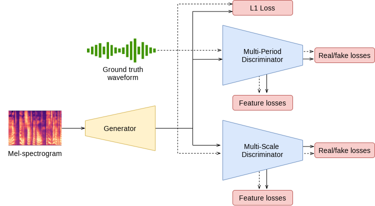
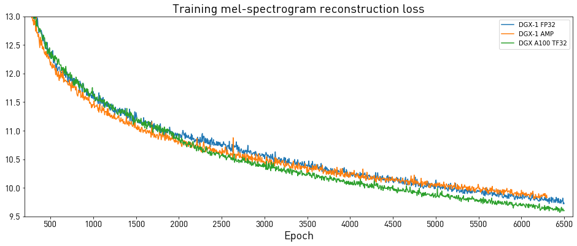

# HiFi-GAN 1.0 For PyTorch

This repository provides a script and recipe to train the HiFi-GAN model to achieve state-of-the-art accuracy. The content of this repository is tested and maintained by NVIDIA.

## Table Of Contents

- [Model overview](#model-overview)
    * [Model architecture](#model-architecture)
    * [Default configuration](#default-configuration)
    * [Feature support matrix](#feature-support-matrix)
	    * [Features](#features)
    * [Mixed precision training](#mixed-precision-training)
	    * [Enabling mixed precision](#enabling-mixed-precision)
          * [Enabling TF32](#enabling-tf32)
    * [Glossary](#glossary)
- [Setup](#setup)
    * [Requirements](#requirements)
- [Quick Start Guide](#quick-start-guide)
- [Advanced](#advanced)
    * [Scripts and sample code](#scripts-and-sample-code)
    * [Parameters](#parameters)
    * [Command-line options](#command-line-options)
    * [Getting the data](#getting-the-data)
        * [Dataset guidelines](#dataset-guidelines)
        * [Multi-dataset](#multi-dataset)
    * [Training process](#training-process)
    * [Inference process](#inference-process)
- [Performance](#performance)
    * [Benchmarking](#benchmarking)
        * [Training performance benchmark](#training-performance-benchmark)
        * [Inference performance benchmark](#inference-performance-benchmark)
    * [Results](#results)
        * [Training accuracy results](#training-accuracy-results)
            * [Training accuracy: NVIDIA DGX A100 (8x A100 80GB)](#training-accuracy-nvidia-dgx-a100-8x-a100-80gb)
            * [Training accuracy: NVIDIA DGX-1 (8x V100 16GB)](#training-accuracy-nvidia-dgx-1-8x-v100-16gb)
            * [Training stability test](#training-stability-test)
        * [Training performance results](#training-performance-results)
            * [Training performance: NVIDIA DGX A100 (8x A100 80GB)](#training-performance-nvidia-dgx-a100-8x-a100-80gb)
            * [Training performance: NVIDIA DGX-1 (8x V100 16GB)](#training-performance-nvidia-dgx-1-8x-v100-16gb)
        * [Inference performance results](#inference-performance-results)
            * [Inference performance: NVIDIA DGX A100 (1x A100 80GB)](#inference-performance-nvidia-dgx-a100-1x-a100-80gb)
            * [Inference performance: NVIDIA DGX-1 (1x V100 16GB)](#inference-performance-nvidia-dgx-1-1x-v100-16gb)
            * [Inference performance: NVIDIA T4](#inference-performance-nvidia-t4)
- [Release notes](#release-notes)
    * [Changelog](#changelog)
    * [Known issues](#known-issues)


## Model overview

This repository provides a PyTorch implementation of the HiFi-GAN model described in the paper [HiFi-GAN: Generative Adversarial Networks for Efficient and High Fidelity Speech Synthesis](https://arxiv.org/abs/2010.05646).
The HiFi-GAN model implements a spectrogram inversion model that allows to synthesize speech waveforms from mel-spectrograms. It follows the generative adversarial network (GAN) paradigm, and is composed of a generator and a discriminator. After training, the generator is used for synthesis, and the discriminator is discarded.

Our implementation is based on the one [published by the authors of the paper](https://github.com/jik876/hifi-gan). We modify the original hyperparameters and provide an alternative training recipe, which enables training on larger batches and faster convergence. HiFi-GAN is trained on a publicly available [LJ Speech dataset](https://keithito.com/LJ-Speech-Dataset/). The <a href="audio/">samples</a> demonstrate speech synthesized with our publicly available FastPitch and HiFi-GAN checkpoints.

This model is trained with mixed precision using Tensor Cores on NVIDIA Volta and the NVIDIA Ampere GPU architectures and evaluated on Volta, Turing and the NVIDIA Ampere GPU architectures. Therefore, researchers can get results up to 2.5x faster than training without Tensor Cores while experiencing the benefits of mixed-precision training. This model is tested against each NGC monthly container release to ensure consistent accuracy and performance over time.

### Model architecture

The entire model is composed of a generator and two discriminators. Both discriminators can be further divided into smaller sub-networks, that work at different resolutions.
The loss functions take as inputs intermediate feature maps and outputs of those sub-networks.
After training, the generator is used for synthesis, and the discriminators are discarded.
All three components are convolutional networks with different architectures.

<p align="center">
  
</p>
<p align="center">
  <em>Figure 1. The architecture of HiFi-GAN</em>
</p>

### Default configuration

The following features were implemented in this model:
* data-parallel multi-GPU training,
* training and inference with mixed precision using Tensor Cores,
* gradient accumulation for reproducible results regardless of the number of GPUs.

The training recipe we provide for the model, recreates the `v1` model from the HiFi-GAN paper,
which is the largest and has the highest quality of all models described in the paper.
Mixed precision training and memory optimizations allowed us to increase batch size and throughput significantly.
In effect, we modify some hyperparameters of the `v1` recipe.

### Feature support matrix

The following features are supported by this model.

| Feature                         | HiFi-GAN |
| :-------------------------------|:--------:|
| Automatic mixed precision (AMP) | Yes      |
| Distributed data parallel (DDP) | Yes      |

#### Features

**Automatic Mixed Precision (AMP)**
This implementation uses native PyTorch AMP
implementation of mixed precision training. It allows us to use FP16 training
with FP32 master weights by modifying just a few lines of code.

**DistributedDataParallel (DDP)**
The model uses PyTorch Lightning implementation
of distributed data parallelism at the module level which can run across
multiple machines.

### Mixed precision training

Mixed precision is the combined use of different numerical precisions in a computational method. [Mixed precision](https://arxiv.org/abs/1710.03740) training offers significant computational speedup by performing operations in half-precision format while storing minimal information in single-precision to retain as much information as possible in critical parts of the network. Since the introduction of [Tensor Cores](https://developer.nvidia.com/tensor-cores) in Volta, and following with both the Turing and Ampere architectures, significant training speedups are experienced by switching to mixed precision -- up to 3x overall speedup on the most arithmetically intense model architectures. Using [mixed precision training](https://docs.nvidia.com/deeplearning/performance/mixed-precision-training/index.html) previously required two steps:
1.  Porting the model to use the FP16 data type where appropriate.
2.  Adding loss scaling to preserve small gradient values.

For information about:
-   How to train using mixed precision, refer to the [Mixed Precision Training](https://arxiv.org/abs/1710.03740) paper and [Training With Mixed Precision](https://docs.nvidia.com/deeplearning/performance/mixed-precision-training/index.html) documentation.
-   Techniques used for mixed precision training, refer to the [Mixed-Precision Training of Deep Neural Networks](https://devblogs.nvidia.com/mixed-precision-training-deep-neural-networks/) blog.

#### Enabling mixed precision

For training and inference, mixed precision can be enabled by adding the `--amp` flag.
Mixed precision is using [native PyTorch implementation](https://pytorch.org/blog/accelerating-training-on-nvidia-gpus-with-pytorch-automatic-mixed-precision/).

#### Enabling TF32

TensorFloat-32 (TF32) is the new math mode in [NVIDIA A100](https://www.nvidia.com/en-us/data-center/a100/) GPUs for handling the matrix math also called tensor operations. TF32 running on Tensor Cores in A100 GPUs can provide up to 10x speedups compared to single-precision floating-point math (FP32) on Volta GPUs.

TF32 Tensor Cores can speed up networks using FP32, typically with no loss of accuracy. It is more robust than FP16 for models that require a high dynamic range for weights or activations.

For more information, refer to the [TensorFloat-32 in the A100 GPU Accelerates AI Training, HPC up to 20x](https://blogs.nvidia.com/blog/2020/05/14/tensorfloat-32-precision-format/) blog post.

TF32 is supported in the NVIDIA Ampere GPU architecture and is enabled by default.

### Glossary

**Multi-Period Discriminator**
A sub-network that extracts patterns from the data that occur periodically (for example, every *N* time steps).

**Multi-Scale Discriminator**
A sub-network that extracts patterns from the data at different resolutions of the input signal. Lower resolutions are obtained by average-pooling of the signal.

**Fine-tuning**
Training an already pretrained model further using a task specific dataset for subject-specific refinements, by adding task-specific layers on top if required.

## Setup

The following section lists the requirements you need to meet in order to start training the HiFi-GAN model.

### Requirements

This repository contains a Dockerfile that extends the PyTorch 21.12-py3 NGC container and encapsulates some dependencies. Aside from these dependencies, ensure you have the following components:
- [NVIDIA Docker](https://github.com/NVIDIA/nvidia-docker)
- [PyTorch 21.12-py3 NGC container](https://ngc.nvidia.com/registry/nvidia-pytorch) or newer
- Supported GPUs:
   - [NVIDIA Volta architecture](https://www.nvidia.com/en-us/data-center/volta-gpu-architecture/)
   - [NVIDIA Turing architecture](https://www.nvidia.com/en-us/design-visualization/technologies/turing-architecture/)
   - [NVIDIA Ampere architecture](https://www.nvidia.com/en-us/data-center/nvidia-ampere-gpu-architecture/)

For more information about how to get started with NGC containers, refer to the following sections from the NVIDIA GPU Cloud Documentation and the Deep Learning Documentation:
- [Getting Started Using NVIDIA GPU Cloud](https://docs.nvidia.com/ngc/ngc-getting-started-guide/index.html)
- [Accessing And Pulling From The NGC Container Registry](https://docs.nvidia.com/deeplearning/frameworks/user-guide/index.html#accessing_registry)
- [Running PyTorch](https://docs.nvidia.com/deeplearning/frameworks/pytorch-release-notes/running.html#running)

For those unable to use the PyTorch NGC container, to set up the required environment or create your own container, refer to the versioned [NVIDIA Container Support Matrix](https://docs.nvidia.com/deeplearning/frameworks/support-matrix/index.html).

## Quick Start Guide

To train your model using mixed or TF32 precision with Tensor Cores or using FP32, perform the following steps using the default parameters of the HiFi-GAN model on the LJSpeech 1.1 dataset. For the specifics concerning training and inference, refer to the [Advanced](#advanced) section. Pre-trained HiFi-GAN models are available for download on [NGC](https://ngc.nvidia.com/catalog/models?query=HiFi-GAN&quickFilter=models).

1. Clone the repository.
   ```bash
   git clone https://github.com/NVIDIA/DeepLearningExamples.git
   cd DeepLearningExamples/PyTorch/SpeechSynthesis/HiFiGAN
   ```

2. Build and run the HiFi-GAN PyTorch NGC container.

   By default the container uses all available GPUs.
   ```bash
   bash scripts/docker/build.sh
   bash scripts/docker/interactive.sh
   ```

3. Download and preprocess the dataset.

   ```bash
   bash scripts/download_dataset.sh
   bash scripts/prepare_dataset.sh
   ```

   The data is downloaded to the `./data/LJSpeech-1.1` directory (on the host).  The
   `./data/LJSpeech-1.1` directory is mounted under the `/workspace/hifigan/data/LJSpeech-1.1`
   location in the NGC container. The complete dataset has the following structure:
   ```bash
   ./data/LJSpeech-1.1
   ├── mels             # Mel-spectrograms generated with the `prepare_dataset.sh` script
   ├── metadata.csv     # Mapping of waveforms to utterances
   ├── README
   └── wavs             # Raw waveforms
   ```

   Apart from generating mel-spectrograms in `data/LJSpeech-1.1/mels` directory, the `scripts/prepare_dataset.sh` script additionally generates LJSpeech-1.1 relevant split metadata files in `data/filelists` directory.

4. Start training.
   ```bash
   NUM_GPUS=8 BATCH_SIZE=16 GRAD_ACCUMULATION=1 bash scripts/train_lj22khz.sh
   ```
   The training produces a HiFi-GAN model capable of generating waveforms from mel-spectrograms.
   It is serialized as a single `.pt` checkpoint file, along with a series of intermediate checkpoints.
   The script is configured for 8x GPU with at least 16GB of memory.

   To train with 1x GPU, run:
   ```
   NUM_GPUS=1 BATCH_SIZE=16 GRAD_ACCUMULATION=8 bash scripts/train_lj22khz.sh
   ```

   When training with AMP on Ampere GPU architectures, use an additional `--no_amp_grouped_conv` flag to speed up the training:
   ```bash
   AMP=true NUM_GPUS=8 BATCH_SIZE=16 GRAD_ACCUMULATION=1 bash scripts/train_lj22khz.sh  --no_amp_grouped_conv
   ```
   The flag will disable mixed-precision training on selected layers. For more details refer to [Known issues](#known-issues).

   Consult [Training process](#training-process) and [example configs](#training-performance-benchmark) to adjust to a different configuration or enable Automatic Mixed Precision.

5. (optionally) Fine-tune the model.

   Some mel-spectrogram generators are prone to model bias. As the spectrograms differ from the true data on which HiFi-GAN was trained, the quality of the generated audio might suffer. In order to overcome this problem, a HiFi-GAN model can be fine-tuned on the outputs of a particular mel-spectrogram generator in order to adapt to this bias.
   In this section we discuss fine-tuning to [FastPitch](https://github.com/NVIDIA/DeepLearningExamples/tree/master/PyTorch/SpeechSynthesis/FastPitch) outputs.

   Obtain a model for which HiFi-GAN will be fine-tuned. If the FastPitch model was trained using phonemes, additionally download the CMU Dictionary.
   ```bash
   bash scripts/download_models.sh fastpitch
   bash scripts/download_cmudict.sh
   ```

   Generate mel-spectrograms for all utterances in the dataset with the FastPitch model:
   ```bash
   bash scripts/extract_fine_tune_mels.sh
   ```

   Mel-spectrograms should now be prepared in the `data/mels-fastpitch-ljs22khz` directory. The fine-tuning script will load an existing HiFi-GAN model and run several epochs of training using spectrograms generated in the last step.
   ```bash
   bash scripts/fine_tune.sh
   ```
   This step will produce another `.pt` HiFi-GAN model checkpoint file fine-tuned to the particular FastPitch model.


5. Start validation/evaluation.

   Ensure your training loss values are comparable to those listed in the table in the
   [Results](#results) section. Note the validation loss is evaluated with ground truth durations for letters (not the predicted ones). The loss values are stored in the `./output/nvlog.json` log file, `./output/{train,val,test}` as TensorBoard logs, and printed to the standard output (`stdout`) during training.
   The main reported loss is a weighted sum of losses for mel-, pitch-, and duration- predicting modules.

7. Start inference.

   The audio can be synthesized either:
   - from ground truth mel-spectrograms, as a means of assessing the quality of HiFi-GAN, or
   - from an output of a mel-spectrogram generator model like FastPitch or Tacotron 2, as a full text-to-speech pipeline.
   We descibe both scenarios.

   **Sythesizing audio from ground truth mel-spectrograms**
   In order to perform inference, pass a `.pt` checkpoint with the `--hifigan` argument to the inference script:
   ```bash
   python inference.py --cuda \
                       --hifigan pretrained_models/hifigan/<HiFi-GAN checkpoint> \
                       -i phrases/devset10.tsv \
                       -o output/wavs_devset10
   ```

   The speech is generated from a file passed with the `-i` argument, with one utterance per line:
   ```bash
   `<output wav file name>|<utterance>`
   ```

   **Synthesizing audio from raw text with mel-spectrogram generator**
   The current implementation allows for convenient inference with the FastPitch model. A pre-trained FastPitch model can be downloaded with the `scripts/download_model.sh fastpitch` script. Alternatively, to train FastPitch or Tacotron 2 from scratch, follow the instructions in [NVIDIA/DeepLearningExamples/FastPitch](https://github.com/NVIDIA/DeepLearningExamples/tree/master/PyTorch/SpeechSynthesis/FastPitch) or [NVIDIA/DeepLearningExamples/Tacotron2](https://github.com/NVIDIA/DeepLearningExamples/tree/master/PyTorch/SpeechSynthesis/Tacotron2).

   Begin with downloading the model and the pronunciation dictionary:
   ```bash
   bash scripts/download_models.sh fastpitch
   bash scripts/download_cmudict.sh
   ```
   To run inference on FastPitch outputs, pass an additional `.pt` checkpoint with the `--fastpitch` flag:
   ```bash
   python inference.py --cuda \
                       --hifigan pretrained_models/hifigan/<HiFi-GAN checkpoint> \
                       --fastpitch pretrained_models/fastpitch/<FastPitch checkpoint> \
                       -i phrases/devset10.tsv \
                       -o output/wavs_devset10
   ```

To run inference in mixed precision, use the `--amp` flag. The output audio will
be stored in the path specified by the `-o` argument. Consult the `inference.py` to learn more options, such as setting the batch size.

Now that you have your model trained and evaluated, you can choose to compare your training results with our [Training accuracy results](#training-accuracy-results). You can also choose to benchmark your performance to the [Training performance benchmark](#training-performance-results), or the [Inference performance benchmark](#inference-performance-results). Following the steps in these sections ensures you achieve the same accuracy and performance results as stated in the [Results](#results) section.


   The audio can be generated by following the [Inference process](#inference-process) section below.
   The synthesized audio should be similar to the samples in the `./audio` directory.


## Advanced

The following sections provide greater details of the dataset, running training and inference, and the training results.

### Parameters

In this section, we list the most important hyperparameters and command-line arguments,
together with their default values that are used to train HiFi-GAN.

| Flag                  | Description                                                                         |
|:----------------------|:------------------------------------------------------------------------------------|
| `--epochs`            | number of epochs (default: 1000)                                                    |
| `--learning_rate`     | learning rate (default: 0.1)                                                        |
| `--batch_size`        | actual batch size for a single forward-backward step (default: 16)                  |
| `--grad_accumulation` | number of forward-backward steps over which gradients are accumulated (default: 1)  |
| `--amp`               | use mixed precision training (default: disabled)                                    |

### Command-line options

To see the full list of available options and their descriptions, use the `-h` or `--help` command-line option, for example:
`python train.py -h`.

### Getting the data

The `./scripts/download_dataset.sh` script will automatically download and extract the dataset to the `./data/LJSpeech-1.1` directory.
The `./scripts/prepare_dataset.sh` script will preprocess the dataset by generating split filelists in `./data/filelists` directory and extracting mel-spectrograms into the `./data/LJSpeech-1.1/mels` directory. Data preparation for LJSpeech-1.1 takes around 3 hours on a CPU.

#### Dataset guidelines

The LJSpeech dataset has 13,100 clips that amount to about 24 hours of speech of a single, female speaker. Since the original dataset does not define a train/dev/test split of the data, we provide a split in the form of three file lists:
```bash
./data/filelists
├── ljs_audio_train_v3.txt
├── ljs_audio_test.txt
└── ljs_audio_val.txt
```

These files are generated during `./scripts/prepare_dataset.sh` script execution.

#### Multi-dataset

Follow these steps to use datasets different from the default LJSpeech dataset.

1. Prepare a directory with .wav files.
   ```bash
   ./data/my_dataset
   └── wavs
   ```

2. Prepare filelists with paths to .wav files. They define training/validation split of the data (test is currently unused, but it's a good practice to create it for the final evaluation):
   ```bash
   ./data/filelists
   ├── my-dataset_audio_train.txt
   └── my-dataset_audio_val.txt
   ```
   Those filelists should list a single wavefile per line as:
   ```bash
   path/to/file001.wav
   path/to/file002.wav
   ...
   ```
   Those paths should be relative to the path provided by the `--dataset-path` option of `train.py`.

3. (Optional) Prepare file lists with paths to pre-calculated pitch when doing fine-tuning:
   ```bash
   ./data/filelists
   ├── my-dataset_audio_pitch_text_train.txt
   └── my-dataset_audio_pitch_text_val.txt
   ```

In order to use the prepared dataset, pass the following to the `train.py` script:
   ```bash
   --dataset-path ./data/my_dataset` \
   --training-files ./data/filelists/my-dataset_audio_text_train.txt \
   --validation files ./data/filelists/my-dataset_audio_text_val.txt
   ```

### Training process

HiFi-GAN is trained to generate waveforms from input mel-spectrograms. During training and validation, the network processes small, random chunks of the input of fixed length.

The training can be started with `scripts/train.sh` script. Output models, DLLogger logs and TensorBoard logs will be saved in  the `output/` directory.

The following example output is printed when running the model:

```bash
DLL 2021-06-30 10:58:05.828323 - epoch    1 | iter   1/24 | d loss  7.966 | g loss 95.839 | mel loss 87.291 |  3092.31 frames/s | took 13.25 s | g lr 3.00e-04 | d lr 3.00e-04
DLL 2021-06-30 10:58:06.999175 - epoch    1 | iter   2/24 | d loss  7.957 | g loss 96.151 | mel loss 87.627 | 35109.29 frames/s | took 1.17 s | g lr 3.00e-04 | d lr 3.00e-04
DLL 2021-06-30 10:58:07.945764 - epoch    1 | iter   3/24 | d loss  7.956 | g loss 93.872 | mel loss 88.154 | 43443.33 frames/s | took 0.94 s | g lr 3.00e-04 | d lr 3.00e-04
```

Performance is reported in total input mel-spectrogram frames per second and recorded as `train_frames/s` (after each iteration) and `avg_train_frames/s` (averaged over epoch) in the output log file `./output/nvlog.json`.
The result is averaged over an entire training epoch and summed over all GPUs that were
included in the training. The metrics are averaged in such a way, that gradient accumulation steps would be transparent to the user.

The `scripts/train.sh` script is configured for 8x GPU with at least 16GB of memory.
In a single accumulated step, there are `batch_size x grad_accumulation x GPUs = 16 x 1 x 8 = 128` examples being processed in parallel. With a smaller number of GPUs, increase gradient accumulation steps to keep the relation satisfied, e.g., through env variables
```bash
NUM_GPUS=1 GRAD_ACCUMULATION=8 BATCH_SIZE=16 bash scripts/train.sh
```

The script also enables automatic mixed precision training. To train with mixed precision, specify the `AMP` variable
```bash
AMP=true bash scripts/train.sh
```

### Inference process

You can run inference using the `./inference.py` script. This script takes
mel-spectrograms as input and runs HiFi-GAN inference to produce audio files.

Pre-trained HiFi-GAN models are available for download on [NGC](https://ngc.nvidia.com/catalog/models?query=HiFi-GAN&quickFilter=models).
The latest model can be downloaded with:
```bash
scripts/download_model.sh hifigan
```

Having pre-trained models in place, extract validation mel-spectrograms from the LJSpeech-1.1 test-set, and run inference with:
```bash
bash scripts/inference_example.sh
```
Examine the `inference_example.sh` script to adjust paths to pre-trained models,
and call `python inference.py --help` to learn all available options.
By default, synthesized audio samples are saved in `./output/audio_*` folders.

## Performance

### Benchmarking

The following section shows how to run benchmarks measuring the model
performance in training and inference mode.

#### Training performance benchmark

To benchmark the training performance on a specific batch size, run:

* NVIDIA DGX A100 (8x A100 80GB)
    ```bash
    AMP=true NUM_GPUS=1 BS=64 GRAD_ACCUMULATION=8 EPOCHS=10 bash scripts/train.sh
    AMP=true NUM_GPUS=8 BS=64 GRAD_ACCUMULATION=1 EPOCHS=10 bash scripts/train.sh
    NUM_GPUS=1 BS=64 GRAD_ACCUMULATION=8 EPOCHS=10 bash scripts/train.sh
    NUM_GPUS=8 BS=64 GRAD_ACCUMULATION=1 EPOCHS=10 bash scripts/train.sh
    ```

* NVIDIA DGX-1 (8x V100 16GB)
    ```bash
    AMP=true NUM_GPUS=1 BS=64 GRAD_ACCUMULATION=8 EPOCHS=10 bash scripts/train.sh
    AMP=true NUM_GPUS=8 BS=64 GRAD_ACCUMULATION=1 EPOCHS=10 bash scripts/train.sh
    NUM_GPUS=1 BS=64 GRAD_ACCUMULATION=8 EPOCHS=10 bash scripts/train.sh
    NUM_GPUS=8 BS=64 GRAD_ACCUMULATION=1 EPOCHS=10 bash scripts/train.sh
    ```

Each of these scripts runs for 10 epochs and measures the
average number of items per second for each epoch. The performance results can be read from
the `nvlog.json` files produced by the commands.

#### Inference performance benchmark

To benchmark the inference performance on a specific batch size, run:

* For FP16
    ```bash
    AMP=true BATCH_SIZE=1 REPEATS=100 bash scripts/inference_benchmark.sh
    ```

* For FP32 or TF32
    ```bash
    BATCH_SIZE=1 REPEATS=100 bash scripts/inference_benchmark.sh
    ```

The output log files will contain performance numbers for the HiFi-GAN model
(number of input mel-spectrogram frames per second, reported as `hifigan_frames/s`)
and FastPitch (number of output mel-spectrogram frames per second as `mel_gen_frames/s`).
The `inference.py` script will run a few warm-up iterations before running the benchmark. Inference will be averaged over 100 runs, as set by the `REPEATS` env variable.

### Results

The following sections provide details on how we achieved our performance and accuracy in training and inference.

#### Training accuracy results

##### Training accuracy: NVIDIA DGX A100 (8x A100 80GB)

Our results were obtained by running the `./platform/DGXA100_HiFi-GAN_{AMP,TF32}_8GPU.sh` training script in the 21.12-py3 NGC container on NVIDIA DGX A100 (8x A100 80GB) GPUs.
We present median mel loss values calculated on the validation subset at the end of the training.

| Dataset | Batch size / GPU | Grad accumulation | GPUs | Val mel loss - FP32 | Val mel loss - mixed precision | Time to train - FP32 | Time to train - mixed precision | Time to train speedup (FP32 to mixed precision) |
|---------|------------------|-------------------|------|-----------------|----------------------------|----------------------|---------------------------------|-------------------------------------------------|
| LJSpeech-1.1 | 128 | 1 | 1 | 9.65 | 9.68 | 151.4 h | 117.1 h | 1.29x |
| LJSpeech-1.1 |  16 | 1 | 8 | 9.65 | 9.68 |  32.9 h |  32.8 h | 1.00x |

##### Training accuracy: NVIDIA DGX-1 (8x V100 16GB)

Our results were obtained by running the `./platform/DGX1_HiFi-GAN_{AMP,FP32}_8GPU.sh` training script in the 21.12-py3 NGC container on NVIDIA DGX-1 (8x V100 16GB) GPUs.
We present median mel loss values calculated on the validation subset at the end of the training.

| Dataset | Batch size / GPU | Grad accumulation | GPUs | Val mel loss - FP32 | Val mel loss - mixed precision | Time to train - FP32 | Time to train - mixed precision | Time to train speedup (FP32 to mixed precision) |
|---------|------------------|-------------------|------|-----------------|----------------------------|----------------------|---------------------------------|-------------------------------------------------|
| LJSpeech-1.1 |  32 | 4 | 1 | 9.65 | 9.73 | 604.6 h | 279.7 h | 2.16x |
| LJSpeech-1.1 |  64 | 2 | 1 | 9.65 | 9.73 |       - | 240.2 h | 2.52x |
| LJSpeech-1.1 |  16 | 1 | 8 | 9.65 | 9.73 |  88.3 h |  56.7 h | 1.56x |

Fine tuning of the model on FastPitch outputs makes about half of the steps of the base model and will prolong the training by 50%.

##### Training stability test

The training is stable when different random seeds are used. Below we compare loss curves obtained by training HiFi-GAN with different seeds.

<div style="text-align:center" align="center">
  
</div>

The training is also stable with respect to different platforms:

<div style="text-align:center" align="center">
  
</div>

#### Training performance results

##### Training performance: NVIDIA DGX A100 (8x A100 80GB)

Our results were obtained by running the `./platform/DGXA100_HiFi-GAN_{AMP,TF32}_8GPU.sh` training script in the 21.12-py3 NGC container on NVIDIA DGX A100 (8x A100 80GB) GPUs. Performance numbers, in input mel-scale spectrogram frames per second, were averaged over an entire training epoch.

| Batch size / GPU | Grad accumulation | GPUs | Throughput - TF32 | Throughput - mixed precision | Throughput speedup (TF32 to mixed precision) | Strong scaling - TF32 | Strong scaling - mixed precision |
|-----:|-----:|-------:|---------:|----------:|--------:|-----:|------:|
|  128 |    1 |      1 | 12055.44 |  15578.65 |    1.29 | 1.00 |  1.00 |
|   32 |    1 |      4 | 36766.63 |  40949.55 |    1.11 | 3.05 |  2.63 |
|   16 |    1 |      8 | 55372.63 |  55634.66 |    1.00 | 4.59 |  3.57 |

##### Training performance: NVIDIA DGX-1 (8x V100 16GB)

Our results were obtained by running the `./platform/DGX1_HiFi-GAN_{AMP,FP32}_8GPU.sh`
training script in the PyTorch 21.12-py3 NGC container on NVIDIA DGX-1 with
8x V100 16GB GPUs. Performance numbers, in output mel-scale spectrogram frames per second, were averaged over
an entire training epoch.

| Batch size / GPU | Grad accumulation | GPUs | Throughput - FP32 | Throughput - mixed precision | Throughput speedup (FP32 to mixed precision) | Strong scaling - FP32 | Strong scaling - mixed precision |
|-----:|-----:|-------:|----------:|---------:|--------:|-----:|------:|
|   32 |    4 |      1 |   3017.57 |  6522.37 |    2.16 | 1.00 |  1.00 |
|   64 |    2 |      1 |         - |  7596.32 |    2.52 |    - |  1.00 |
|   32 |    1 |      4 |  12135.04 | 23660.14 |    1.95 | 4.02 |  3.11 |
|   16 |    1 |      8 |  20659.86 | 32175.41 |    1.56 | 6.85 |  4.24 |


#### Inference performance results

The following tables show inference statistics for the FastPitch and HiFi-GAN
text-to-speech system, gathered from 100 inference runs. Latency is measured from the start of FastPitch inference to
the end of HiFi-GAN inference. Throughput is measured
as the number of generated audio samples per second at 22KHz. RTF is the real-time factor that denotes the number of seconds of speech generated in a second of wall-clock time per input utterance.

Our results were obtained by running the `./scripts/inference_benchmark.sh` script in
the PyTorch 21.12-py3 NGC container. The input utterance has 128 characters, synthesized audio has 8.05 s.

##### Inference performance: NVIDIA DGX A100 (1x A100 80GB)

TorchScript + denoising:

|Batch size|Precision|Avg latency (s)|Latency tolerance interval 90% (s)|Latency tolerance interval 95% (s)|Latency tolerance interval 99% (s)|Throughput (samples/sec)|Speed-up with mixed precision|Avg RTF|
|------|--------|-----------|---------|---------|---------|--------------|-----------|--------|
|    1 | FP16   |     0.019 |   0.021 |   0.021 |   0.022 |      8906958 | 1.29      | 403.94 |
|    2 | FP16   |     0.029 |   0.029 |   0.029 |   0.03  |     11780358 | 1.97      | 267.13 |
|    4 | FP16   |     0.044 |   0.045 |   0.045 |   0.046 |     15248417 | 1.57      | 172.88 |
|    8 | FP16   |     0.082 |   0.082 |   0.082 |   0.082 |     16597793 | 1.57      |  94.09 |
|    1 | TF32   |     0.025 |   0.025 |   0.025 |   0.025 |      6915487 | -         | 313.63 |
|    2 | TF32   |     0.057 |   0.057 |   0.057 |   0.057 |      5966172 | -         | 135.29 |
|    4 | TF32   |     0.07  |   0.071 |   0.071 |   0.072 |      9710162 | -         | 110.09 |
|    8 | TF32   |     0.128 |   0.129 |   0.129 |   0.129 |     10578539 | -         |  59.97 |

TorchScript, no denoising:

|Batch size|Precision|Avg latency (s)|Latency tolerance interval 90% (s)|Latency tolerance interval 95% (s)|Latency tolerance interval 99% (s)|Throughput (samples/sec)|Speed-up with mixed precision|Avg RTF|
|------|--------|-----------|---------|---------|---------|--------------|-----------|--------|
|    1 | FP16   |     0.018 |   0.019 |   0.019 |   0.020 |      9480432 | 1.32      | 429.95 |
|    2 | FP16   |     0.027 |   0.028 |   0.028 |   0.028 |     12430026 | 2.02      | 281.86 |
|    4 | FP16   |     0.042 |   0.044 |   0.044 |   0.045 |     15952396 | 1.60      | 180.87 |
|    8 | FP16   |     0.082 |   0.083 |   0.083 |   0.084 |     16461910 | 1.52      |  93.32 |
|    1 | TF32   |     0.024 |   0.025 |   0.025 |   0.025 |      7194880 | -         | 326.3  |
|    2 | TF32   |     0.055 |   0.056 |   0.056 |   0.056 |      6141659 | -         | 139.27 |
|    4 | TF32   |     0.068 |   0.068 |   0.069 |   0.069 |      9977333 | -         | 113.12 |
|    8 | TF32   |     0.125 |   0.126 |   0.126 |   0.127 |     10813904 | -         |  61.3  |

##### Inference performance: NVIDIA DGX-1 (1x V100 16GB)

TorchScript + denoising:

|Batch size|Precision|Avg latency (s)|Latency tolerance interval 90% (s)|Latency tolerance interval 95% (s)|Latency tolerance interval 99% (s)|Throughput (samples/sec)|Speed-up with mixed precision|Avg RTF|
|------|--------|-----------|---------|---------|---------|--------------|-----------|--------|
|    1 | FP16   |     0.033 |   0.034 |   0.035 |   0.035 |      5062222 | 1.82      | 229.58 |
|    4 | FP16   |     0.083 |   0.085 |   0.085 |   0.085 |      8106313 | 2.29      |  91.91 |
|    8 | FP16   |     0.142 |   0.144 |   0.144 |   0.145 |      9501139 | 2.54      |  53.86 |
|    1 | FP32   |     0.061 |   0.062 |   0.062 |   0.062 |      2783145 | -         | 126.22 |
|    4 | FP32   |     0.192 |   0.194 |   0.194 |   0.195 |      3534640 | -         |  40.08 |
|    8 | FP32   |     0.362 |   0.364 |   0.364 |   0.365 |      3747958 | -         |  21.25 |

TorchScript, no denoising:

|Batch size|Precision|Avg latency (s)|Latency tolerance interval 90% (s)|Latency tolerance interval 95% (s)|Latency tolerance interval 99% (s)|Throughput (samples/sec)|Speed-up with mixed precision|Avg RTF|
|------|--------|-----------|---------|---------|---------|--------------|-----------|--------|
|    1 | FP16   |     0.030 |   0.031 |   0.031 |   0.031 |      5673639 | 2.02      | 257.31 |
|    4 | FP16   |     0.080 |   0.081 |   0.081 |   0.082 |      8472603 | 2.37      |  96.06 |
|    8 | FP16   |     0.139 |   0.140 |   0.141 |   0.141 |      9737865 | 2.57      |  55.20 |
|    1 | FP32   |     0.060 |   0.061 |   0.061 |   0.062 |      2806620 | -         | 127.28 |
|    4 | FP32   |     0.190 |   0.192 |   0.192 |   0.193 |      3571308 | -         |  40.49 |
|    8 | FP32   |     0.358 |   0.360 |   0.361 |   0.361 |      3788591 | -         |  21.48 |

##### Inference performance: NVIDIA T4

TorchScript, denoising:

|Batch size|Precision|Avg latency (s)|Latency tolerance interval 90% (s)|Latency tolerance interval 95% (s)|Latency tolerance interval 99% (s)|Throughput (samples/sec)|Speed-up with mixed precision|Avg RTF|
|------|--------|-----------|---------|---------|---------|--------------|-----------|--------|
|    1 | FP16   |     0.060 |   0.061 |   0.061 |   0.061 |      2835064 | 2.42      | 128.57 |
|    4 | FP16   |     0.211 |   0.213 |   0.213 |   0.214 |      3205667 | 2.42      |  36.35 |
|    8 | FP16   |     0.410 |   0.413 |   0.413 |   0.414 |      3304070 | 2.45      |  18.73 |
|    1 | FP32   |     0.145 |   0.146 |   0.147 |   0.147 |      1171258 | -         |  53.12 |
|    4 | FP32   |     0.512 |   0.515 |   0.515 |   0.516 |      1324952 | -         |  15.02 |
|    8 | FP32   |     1.006 |   1.011 |   1.012 |   1.013 |      1347688 | -         |   7.64 |

TorchScript, no denoising:

|Batch size|Precision|Avg latency (s)|Latency tolerance interval 90% (s)|Latency tolerance interval 95% (s)|Latency tolerance interval 99% (s)|Throughput (samples/sec)|Speed-up with mixed precision|Avg RTF|
|------|--------|-----------|---------|---------|---------|--------------|-----------|--------|
|    1 | FP16   |     0.057 |   0.058 |   0.058 |   0.059 |      2969398 | 2.48      | 134.67 |
|    4 | FP16   |     0.205 |   0.207 |   0.207 |   0.208 |      3299130 | 2.45      |  37.41 |
|    8 | FP16   |     0.399 |   0.402 |   0.403 |   0.404 |      3389001 | 2.48      |  19.21 |
|    1 | FP32   |     0.142 |   0.143 |   0.143 |   0.144 |      1195309 | -         |  54.21 |
|    4 | FP32   |     0.504 |   0.507 |   0.507 |   0.509 |      1345995 | -         |  15.26 |
|    8 | FP32   |     0.993 |   0.997 |   0.998 |   0.999 |      1365273 | -         |   7.74 |

## Release notes
The performance measurements in this document were conducted at the time of publication and may not reflect the performance achieved from NVIDIA’s latest software release. For the most up-to-date performance measurements, go to https://developer.nvidia.com/deep-learning-performance-training-inference.

### Changelog

February 2022
- Initial release

### Known issues
- With mixed-precision training on Ampere GPUs, the model might suffer from slower training. Be sure to use the scripts provided in the <a href="platform/">platform/</a> directory, and a PyTorch NGC container not older than 21.12-py3.
- For some mel-spectrogram generator models, the best results require fine-tuning of HiFi-GAN on outputs from those models.
For more details, refer to the fine-tuning step of the [Quick Start Guide](#quick-start-guide) section.
