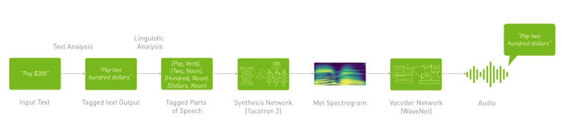
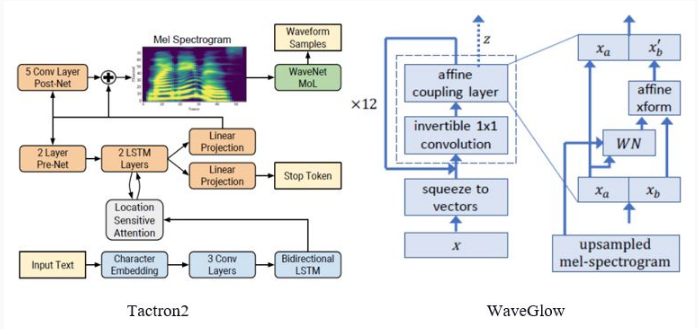

# Text-to-Speech (TTS)

Speech Synthesis or Text-to-Speech is the task of artificially producing human speech from a raw transcripts. With deep learning today, the synthesized waveforms can sound very natural, almost undistinguishable from how a human would speak. Such Text-to-Speech models can be used in cases like when an interactive virtual assistants responds, or when a mobile device converts the text on a webpage to speech for accessibility reasons. 

In this collection, we will cover:
- How does Text-to-Speech work?
- Usecases and applications
- Where to get started

---
## How does Text-to-Speech work?

TTS synthesis is a 2-step process described as follows:

1. Text to Spectrogram Model:
This model Transforms the text into time-aligned features such as spectrogram, mel spectrogram, or F0 frequencies and other acoustic features. We use architectures like Tacotron

2. Spectrogram to Audio Model:
Converts generated spectrogram time-aligned representation into continuous human-like audio—for example, WaveGlow.

---
## Use Cases and applications

### Telecommunications and Multimedia:
E-mail services have become very prevalent in this decade. However, it is sometimes challenging to understand and read those important messages when being abroad. The lack of proper computer systems or some security problems may arise. With TTS technology, e-mail messages can listen quickly and efficiently on smartphones, adding to productivity.  

### Voice assistant for Visually Impaired, Vocally Handicapped:

- Possibly, TTS's most useful and vital application is the reading of printed or non-braille texts for visually impaired/blind.
- This process also helps vocally handicapped people find difficulties communicating with others who do not understand sign language. 

### Voice Assistant:

- Modern home appliances such as refrigerators can adopt this use case for reading cooking recipes.
- Automobiles for voice navigation to the destination spot.
- Easy teaching of pronunciation, phonetics of humongous difficult natural multi-lingual texts.

---
## Where to get started

NVIDIA provides Deep Learning Examples for Image Segmentation on its GitHub repository. These examples provide you with easy to consume and highly optimized scripts for both training and inferencing. The quick start guide at our GitHub repository will help you in setting up the environment using NGC Docker Images, download pre-trained models from NGC and adapt the model training and inference for your application/use-case. 
Here are the examples relevant for image segmentation, directly from [Deep Learning Examples](https://github.com/NVIDIA/DeepLearningExamples):

1. Tacotron2 and WaveGlow for Speech Synthesis using PyTorch
- [Git repository](https://github.com/NVIDIA/DeepLearningExamples/tree/master/PyTorch/SpeechSynthesis/Tacotron2)
- Uses PyTorch 20.03-py3 [NGC container](https://ngc.nvidia.com/registry/nvidia-pytorch)

2. FastPitch for text to melspectogram generation using PyTorch
- [Git repository](https://github.com/NVIDIA/DeepLearningExamples/tree/master/PyTorch/SpeechSynthesis/FastPitch)
- Uses PyTorch 20.03-py3 [NGC container](https://ngc.nvidia.com/registry/nvidia-pytorch)
