# Tacotron 2 And WaveGlow v1.10 For PyTorch

This repository provides a script and recipe to train Tacotron 2 and WaveGlow
v1.6 models to achieve state of the art accuracy, and is tested and maintained by NVIDIA.

## Table of Contents
- [Model overview](#model-overview)
   * [Model architecture](#model-architecture)
   * [Default configuration](#default-configuration)
   * [Feature support matrix](#feature-support-matrix)
      * [Features](#features)
   * [Mixed precision training](#mixed-precision-training)
      * [Enabling mixed precision](#enabling-mixed-precision)
      * [Enabling TF32](#enabling-tf32)
- [Setup](#setup)
   * [Requirements](#requirements)
- [Quick Start Guide](#quick-start-guide)
- [Advanced](#advanced)
   * [Scripts and sample code](#scripts-and-sample-code)
   * [Parameters](#parameters)
      * [Shared parameters](#shared-parameters)
      * [Shared audio/STFT parameters](#shared-audiostft-parameters)
      * [Tacotron 2 parameters](#tacotron-2-parameters)
      * [WaveGlow parameters](#waveglow-parameters)
   * [Command-line options](#command-line-options)
   * [Getting the data](#getting-the-data)
      * [Dataset guidelines](#dataset-guidelines)
      * [Multi-dataset](#multi-dataset)
   * [Training process](#training-process)
   * [Inference process](#inference-process)
- [Performance](#performance)
   * [Benchmarking](#benchmarking)
      * [Training performance benchmark](#training-performance-benchmark)
      * [Inference performance benchmark](#inference-performance-benchmark)
   * [Results](#results)
      * [Training accuracy results](#training-accuracy-results)
         * [Training accuracy: NVIDIA DGX A100 (8x A100 40GB)](#training-accuracy-nvidia-dgx-a100-8x-a100-40gb)
         * [Training accuracy: NVIDIA DGX-1 (8x V100 16GB)](#training-accuracy-nvidia-dgx-1-8x-v100-16gb)
         * [Training curves](#training-curves)
      * [Training performance results](#training-performance-results)
         * [Training performance: NVIDIA DGX A100 (8x A100 40GB)](#training-performance-nvidia-dgx-a100-8x-a100-40gb)
         * [Training performance: NVIDIA DGX-1 (8x V100 16GB)](#training-performance-nvidia-dgx-1-8x-v100-16gB)
         * [Expected training time](#expected-training-time)
      * [Inference performance results](#inference-performance-results)
         * [Inference performance: NVIDIA DGX A100 (1x A100 40GB)](#inference-performance-nvidia-dgx-a100-1x-a100-40gb)
         * [Inference performance: NVIDIA DGX-1 (1x V100 16GB)](#inference-performance-nvidia-dgx-1-1x-v100-16gb)
         * [Inference performance: NVIDIA T4](#inference-performance-nvidia-t4)
- [Release notes](#release-notes)
   * [Changelog](#changelog)
   * [Known issues](#known-issues)

## Model overview

This text-to-speech (TTS) system is a combination of two neural network
models:

* a modified Tacotron 2 model from the [Natural TTS Synthesis by Conditioning WaveNet on Mel Spectrogram Predictions](https://arxiv.org/abs/1712.05884)
paper
* a flow-based neural network model from the [WaveGlow: A Flow-based Generative Network for Speech Synthesis](https://arxiv.org/abs/1811.00002) paper

The Tacotron 2 and WaveGlow models form a text-to-speech system that enables
users to synthesize natural sounding speech from raw transcripts without
any additional information such as patterns and/or rhythms of speech.

Our implementation of Tacotron 2 models differs from the model described in the
paper. Our implementation uses Dropout instead of Zoneout to regularize the
LSTM layers. Also, the original text-to-speech system proposed in the paper
uses the [WaveNet](https://arxiv.org/abs/1609.03499) model to synthesize
waveforms. In our implementation, we use the WaveGlow model for this purpose.

Both models are based on implementations of NVIDIA GitHub repositories
[Tacotron 2](https://github.com/NVIDIA/tacotron2) and
[WaveGlow](https://github.com/NVIDIA/waveglow), and are trained on a publicly
available [LJ Speech dataset](https://keithito.com/LJ-Speech-Dataset/).

The Tacotron 2 and WaveGlow model enables you to efficiently synthesize high
quality speech from text.

Both models are trained with mixed precision using Tensor Cores on Volta,
Turing, and the NVIDIA Ampere GPU architectures. Therefore, researchers can
get results 2.0x faster for Tacotron 2 and 3.1x faster for WaveGlow than
training without Tensor Cores, while experiencing the benefits of mixed
precision training. The models are tested against each NGC monthly
container release to ensure consistent accuracy and performance over time.

### Model architecture

The Tacotron 2 model is a recurrent sequence-to-sequence model with attention that
predicts mel-spectrograms from text. The encoder (blue blocks in the figure
below) transforms the whole text into a fixed-size hidden feature
representation. This feature representation is then consumed by the
autoregressive decoder (orange blocks) that produces one spectrogram frame at
a time. In our implementation, the autoregressive WaveNet (green block) is
replaced by the flow-based generative WaveGlow.

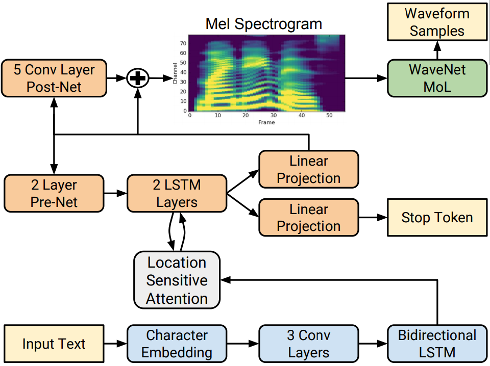

Figure 1. Architecture of the Tacotron 2 model. Taken from the
[Tacotron 2](https://arxiv.org/abs/1712.05884) paper.

The WaveGlow model is a flow-based generative model that generates audio
samples from Gaussian distribution using mel-spectrogram conditioning (Figure
2). During training, the model learns to transform the dataset distribution
into spherical Gaussian distribution through a series of flows. One step of a
flow consists of an invertible convolution, followed by a modified WaveNet
architecture that serves as an affine coupling layer. During inference, the
network is inverted and audio samples are generated from the Gaussian
distribution. Our implementation uses 512 residual channels in the coupling layer.

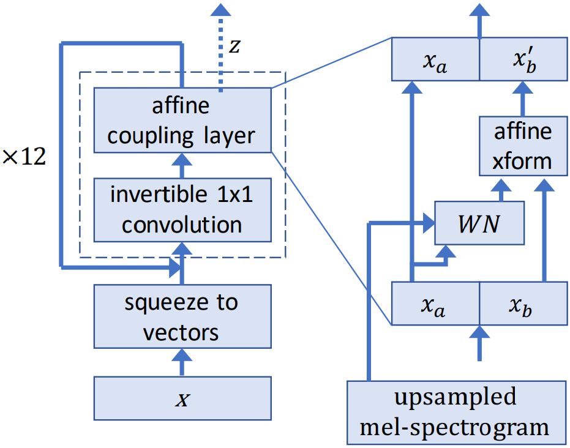

Figure 2. Architecture of the WaveGlow model. Taken from the
[WaveGlow](https://arxiv.org/abs/1811.00002) paper.

### Default configuration

Both models support multi-GPU and mixed precision training with dynamic loss
scaling (see Apex code
[here](https://github.com/NVIDIA/apex/blob/master/apex/fp16_utils/loss_scaler.py)),
as well as mixed precision inference. To speed up Tacotron 2 training,
reference mel-spectrograms are generated during a preprocessing step and read
directly from disk during training, instead of being generated during training.

The following features were implemented in this model:

* data-parallel multi-GPU training
* dynamic loss scaling with backoff for Tensor Cores (mixed precision)
training.

### Feature support matrix

The following features are supported by this model.

| Feature               | Tacotron 2 | WaveGlow |
| :-----------------------|------------:|--------------:|
|[AMP](https://nvidia.github.io/apex/amp.html) | Yes | Yes |
|[Apex DistributedDataParallel](https://nvidia.github.io/apex/parallel.html) | Yes | Yes |

#### Features

AMP - a tool that enables Tensor Core-accelerated training. For more information,
refer to [Enabling mixed precision](#enabling-mixed-precision).

Apex DistributedDataParallel - a module wrapper that enables easy multiprocess
distributed data parallel training, similar to `torch.nn.parallel.DistributedDataParallel`.
`DistributedDataParallel` is optimized for use with NCCL. It achieves high
performance by overlapping communication with computation during `backward()`
and bucketing smaller gradient transfers to reduce the total number of transfers
required.

### Mixed precision training

*Mixed precision* is the combined use of different numerical precisions in a
computational method. [Mixed precision](https://arxiv.org/abs/1710.03740)
training offers significant computational speedup by performing operations in
half-precision format, while storing minimal information in single-precision
to retain as much information as possible in critical parts of the network.
Since the introduction of [Tensor Cores](https://developer.nvidia.com/tensor-cores)
in Volta, and following with both the Turing and Ampere architectures,
significant training speedups are
experienced by switching to mixed precision -- up to 3x overall speedup on
the most arithmetically intense model architectures.  Using mixed precision
training requires two steps:

1. Porting the model to use the FP16 data type where appropriate.
2. Adding loss scaling to preserve small gradient values.

The ability to train deep learning networks with lower precision was
introduced in the Pascal architecture and first supported in [CUDA 8](https://devblogs.nvidia.com/parallelforall/tag/fp16/) in the NVIDIA Deep Learning SDK.

For information about:
* How to train using mixed precision, see the [Mixed Precision Training](https://arxiv.org/abs/1710.03740)
paper and [Training With Mixed Precision](https://docs.nvidia.com/deeplearning/sdk/mixed-precision-training/index.html)
documentation.
* Techniques used for mixed precision training, see the [Mixed-Precision Training of Deep Neural Networks](https://devblogs.nvidia.com/mixed-precision-training-deep-neural-networks/)
blog.
* APEX tools for mixed precision training, see the [NVIDIA Apex: Tools for Easy Mixed-Precision Training in PyTorch](https://devblogs.nvidia.com/apex-pytorch-easy-mixed-precision-training/).

#### Enabling mixed precision

Mixed precision is enabled in PyTorch by using the Automatic Mixed Precision
(AMP)  library from [APEX](https://github.com/NVIDIA/apex) that casts variables
to half-precision upon retrieval, while storing variables in single-precision
format. Furthermore, to preserve small gradient magnitudes in backpropagation,
a [loss scaling](https://docs.nvidia.com/deeplearning/sdk/mixed-precision-training/index.html#lossscaling)
step must be included when applying gradients. In PyTorch, loss scaling can be
easily applied by using the `scale_loss()` method provided by AMP. The scaling value
to be used can be [dynamic](https://nvidia.github.io/apex/fp16_utils.html#apex.fp16_utils.DynamicLossScaler) or fixed.

By default, the `train_tacotron2.sh` and `train_waveglow.sh` scripts will
launch mixed precision training with Tensor Cores. You can change this
behaviour by removing the `--amp` flag from the `train.py` script.

To enable mixed precision, the following steps were performed in the Tacotron 2 and
WaveGlow models:
* Import AMP from APEX:
    ```bash
    from apex import amp
	amp.lists.functional_overrides.FP32_FUNCS.remove('softmax')
	amp.lists.functional_overrides.FP16_FUNCS.append('softmax')
    ```

* Initialize AMP:
    ```bash
	model, optimizer = amp.initialize(model, optimizer, opt_level="O1")
    ```

* If running on multi-GPU, wrap the model with `DistributedDataParallel`:
    ```bash
    from apex.parallel import DistributedDataParallel as DDP
    model = DDP(model)
	```

* Scale loss before backpropagation (assuming loss is stored in a variable
called `losses`):

    * Default backpropagate for FP32:
        ```bash
        losses.backward()
        ```

    * Scale loss and backpropagate with AMP:
        ```bash
        with optimizer.scale_loss(losses) as scaled_losses:
            scaled_losses.backward()
        ```

#### Enabling TF32

TensorFloat-32 (TF32) is the new math mode in [NVIDIA A100](#https://www.nvidia.com/en-us/data-center/a100/) GPUs for handling the matrix math also called tensor operations. TF32 running on Tensor Cores in A100 GPUs can provide up to 10x speedups compared to single-precision floating-point math (FP32) on Volta GPUs.

TF32 Tensor Cores can speed up networks using FP32, typically with no loss of accuracy. It is more robust than FP16 for models which require high dynamic range for weights or activations.

For more information, refer to the [TensorFloat-32 in the A100 GPU Accelerates AI Training, HPC up to 20x](#https://blogs.nvidia.com/blog/2020/05/14/tensorfloat-32-precision-format/) blog post.

TF32 is supported in the NVIDIA Ampere GPU architecture and is enabled by default.


## Setup

The following section lists the requirements in order to start training the
Tacotron 2 and WaveGlow models.

### Requirements

This repository contains Dockerfile which extends the PyTorch NGC container
and encapsulates some dependencies. Aside from these dependencies, ensure you
have the following components:

- [NVIDIA Docker](https://github.com/NVIDIA/nvidia-docker)
- [PyTorch 20.06-py3 NGC container](https://ngc.nvidia.com/registry/nvidia-pytorch)
or newer
- Supported GPUs:
   - [NVIDIA Volta](https://www.nvidia.com/en-us/data-center/volta-gpu-architecture/)
   - [NVIDIA Turing](https://www.nvidia.com/en-us/geforce/turing/)
   - [NVIDIA Ampere architecture](https://www.nvidia.com/en-us/data-center/nvidia-ampere-gpu-architecture/)

For more information about how to get started with NGC containers, see the
following sections from the NVIDIA GPU Cloud Documentation and the Deep Learning
Documentation:

- [Getting Started Using NVIDIA GPU Cloud](https://docs.nvidia.com/ngc/ngc-getting-started-guide/index.html)
- [Accessing And Pulling From The NGC Container Registry](https://docs.nvidia.com/deeplearning/frameworks/user-guide/index.html#accessing_registry)
- [Running PyTorch](https://docs.nvidia.com/deeplearning/frameworks/pytorch-release-notes/running.html#running)

For those unable to use the PyTorch NGC container, to set up the required
environment or create your own container, see the versioned
[NVIDIA Container Support Matrix](https://docs.nvidia.com/deeplearning/frameworks/support-matrix/index.html).

## Quick Start Guide

To train your model using mixed precision with Tensor Cores or using FP32,
perform the following steps using the default parameters of the Tacrotron 2
and WaveGlow model on the [LJ Speech](https://keithito.com/LJ-Speech-Dataset/)
dataset.

1. Clone the repository.
   ```bash
   git clone https://github.com/NVIDIA/DeepLearningExamples.git
   cd DeepLearningExamples/PyTorch/SpeechSynthesis/Tacotron2
   ```

2. Download and preprocess the dataset.
Use the `./scripts/prepare_dataset.sh` download script to automatically
download and preprocess the training, validation and test datasets. To run
this script, issue:
   ```bash
   bash scripts/prepare_dataset.sh
   ```

   Data is downloaded to the `./LJSpeech-1.1` directory (on the host).  The
   `./LJSpeech-1.1` directory is mounted to the `/workspace/tacotron2/LJSpeech-1.1`
   location in the NGC container.

3. Build the Tacotron 2 and WaveGlow PyTorch NGC container.
   ```bash
   bash scripts/docker/build.sh
   ```

4. Start an interactive session in the NGC container to run training/inference.
After you build the container image, you can start an interactive CLI session with:

   ```bash
   bash scripts/docker/interactive.sh
   ```

   The `interactive.sh` script requires that the location on the dataset is specified.
   For example, `LJSpeech-1.1`. To preprocess the datasets for Tacotron 2 training, use
   the `./scripts/prepare_mels.sh` script:
   ```bash
   bash scripts/prepare_mels.sh
   ```

   The preprocessed mel-spectrograms are stored in the `./LJSpeech-1.1/mels` directory.

5. Start training.
To start Tacotron 2 training, run:
   ```bash
   bash scripts/train_tacotron2.sh
   ```

   To start WaveGlow training, run:
   ```bash
   bash scripts/train_waveglow.sh
   ```

6. Start validation/evaluation.
Ensure your loss values are comparable to those listed in the table in the
[Results](#results) section. For both models, the loss values are stored in the `./output/nvlog.json` log file.

   After you have trained the Tacotron 2 and WaveGlow models, you should get
   audio results similar to the
   samples in the `./audio` folder. For details about generating audio, see the
   [Inference process](#inference-process) section below.

   The training scripts automatically run the validation after each training
   epoch. The results from the validation are printed to the standard output
   (`stdout`) and saved to the log files.

7. Start inference.
After you have trained the Tacotron 2 and WaveGlow models, you can perform
inference using the respective checkpoints that are passed as `--tacotron2`
and `--waveglow` arguments. Tacotron2 and WaveGlow checkpoints can also be downloaded from NGC:

   https://ngc.nvidia.com/catalog/models/nvidia:tacotron2pyt_fp16/files?version=3

   https://ngc.nvidia.com/catalog/models/nvidia:waveglow256pyt_fp16/files?version=2

   To run inference issue:

   ```bash
   python inference.py --tacotron2 <Tacotron2_checkpoint> --waveglow <WaveGlow_checkpoint> --wn-channels 256 -o output/ -i phrases/phrase.txt --fp16
   ```

   The speech is generated from lines of text in the file that is passed with
   `-i` argument. The number of lines determines inference batch size. To run
   inference in mixed precision, use the `--fp16` flag. The output audio will
   be stored in the path specified by the `-o` argument.

   You can also run inference on CPU with TorchScript by adding flag --cpu:
   ```bash
   export CUDA_VISIBLE_DEVICES=
   ```
   ```bash
   python inference.py --tacotron2 <Tacotron2_checkpoint> --waveglow <WaveGlow_checkpoint> --wn-channels 256 --cpu -o output/ -i phrases/phrase.txt
   ```

## Advanced

The following sections provide greater details of the dataset, running
training and inference, and the training results.

### Scripts and sample code

The sample code for Tacotron 2 and WaveGlow has scripts specific to a
particular model, located in directories `./tacotron2` and `./waveglow`, as well as scripts common to both
models, located in the `./common` directory. The model-specific scripts are as follows:

* `<model_name>/model.py` - the model architecture, definition of forward and
inference functions
* `<model_name>/arg_parser.py` - argument parser for parameters specific to a
given model
* `<model_name>/data_function.py` - data loading functions
* `<model_name>/loss_function.py` - loss function for the model

The common scripts contain layer definitions common to both models
(`common/layers.py`), some utility scripts (`common/utils.py`) and scripts
for audio processing (`common/audio_processing.py` and `common/stft.py`). In
the root directory `./` of this repository, the `./run.py` script is used for
training while inference can be executed with the `./inference.py` script. The
scripts `./models.py`, `./data_functions.py` and `./loss_functions.py` call
the respective scripts in the `<model_name>` directory, depending on what
model is trained using the `run.py` script.

### Parameters

In this section, we list the most important hyperparameters and command-line arguments,
together with their default values that are used to train Tacotron 2 and
WaveGlow models.

#### Shared parameters

* `--epochs` - number of epochs (Tacotron 2: 1501, WaveGlow: 1001)
* `--learning-rate` - learning rate (Tacotron 2: 1e-3, WaveGlow: 1e-4)
* `--batch-size` - batch size (Tacotron 2 FP16/FP32: 104/48, WaveGlow FP16/FP32: 10/4)
* `--amp` - use mixed precision training
* `--cpu` - use CPU with TorchScript for inference

#### Shared audio/STFT parameters

* `--sampling-rate` - sampling rate in Hz of input and output audio (22050)
* `--filter-length` - (1024)
* `--hop-length` - hop length for FFT, i.e., sample stride between consecutive FFTs (256)
* `--win-length` - window size for FFT (1024)
* `--mel-fmin` - lowest frequency in Hz (0.0)
* `--mel-fmax` - highest frequency in Hz (8.000)

#### Tacotron 2 parameters

* `--anneal-steps` - epochs at which to anneal the learning rate (500 1000 1500)
* `--anneal-factor` - factor by which to anneal the learning rate (FP16/FP32: 0.3/0.1)

#### WaveGlow parameters

* `--segment-length` - segment length of input audio processed by the neural network (8000)
* `--wn-channels` - number of residual channels in the coupling layer networks (512)


### Command-line options

To see the full list of available options and their descriptions, use the `-h`
or `--help` command line option, for example:
```bash
python train.py --help
```

The following example output is printed when running the sample:

```bash
Batch: 7/260 epoch 0
:::NVLOGv0.2.2 Tacotron2_PyT 1560936205.667271376 (/workspace/tacotron2/dllogger/logger.py:251) train_iter_start: 7
:::NVLOGv0.2.2 Tacotron2_PyT 1560936207.209611416 (/workspace/tacotron2/dllogger/logger.py:251) train_iteration_loss: 5.415428161621094
:::NVLOGv0.2.2 Tacotron2_PyT 1560936208.705905914 (/workspace/tacotron2/dllogger/logger.py:251) train_iter_stop: 7
:::NVLOGv0.2.2 Tacotron2_PyT 1560936208.706479311 (/workspace/tacotron2/dllogger/logger.py:251) train_iter_items/sec: 8924.00136085362
:::NVLOGv0.2.2 Tacotron2_PyT 1560936208.706998110 (/workspace/tacotron2/dllogger/logger.py:251) iter_time: 3.0393316745758057
Batch: 8/260 epoch 0
:::NVLOGv0.2.2 Tacotron2_PyT 1560936208.711485624 (/workspace/tacotron2/dllogger/logger.py:251) train_iter_start: 8
:::NVLOGv0.2.2 Tacotron2_PyT 1560936210.236668825 (/workspace/tacotron2/dllogger/logger.py:251) train_iteration_loss: 5.516331672668457
```


### Getting the data

The Tacotron 2 and WaveGlow models were trained on the LJSpeech-1.1 dataset.
This repository contains the `./scripts/prepare_dataset.sh` script which will automatically download and extract the whole dataset. By default, data will be extracted to the `./LJSpeech-1.1` directory. The dataset directory contains a `README` file, a `wavs` directory with all audio samples, and a file `metadata.csv` that contains audio file names and the corresponding transcripts.

#### Dataset guidelines

The LJSpeech dataset has 13,100 clips that amount to about 24 hours of speech. Since the original dataset has all transcripts in the `metadata.csv` file, in this repository we provide file lists in the `./filelists` directory that determine training and validation subsets; `ljs_audio_text_train_filelist.txt` is a test set used as a training dataset and `ljs_audio_text_val_filelist.txt` is a test set used as a validation dataset.

#### Multi-dataset

To use datasets different than the default LJSpeech dataset:

1. Prepare a directory with all audio files and pass it to the `--dataset-path` command-line option.

2. Add two text files containing file lists: one for the training subset (`--training-files`) and one for the validation subset (`--validation files`).
The structure of the filelists should be as follows:
   ```bash
   `<audio file path>|<transcript>`
   ```

   The `<audio file path>` is the relative path to the path provided by the `--dataset-path` option.

### Training process

The Tacotron2 and WaveGlow models are trained separately and independently.
Both models obtain mel-spectrograms from short time Fourier transform (STFT)
during training. These mel-spectrograms are used for loss computation in case
of Tacotron 2 and as conditioning input to the network in case of WaveGlow.

The training loss is averaged over an entire training epoch, whereas the
validation loss is averaged over the validation dataset. Performance is
reported in total output mel-spectrograms per second for the Tacotron 2 model and
in total output samples per second for the WaveGlow model. Both measures are
recorded as `train_iter_items/sec` (after each iteration) and
`train_epoch_items/sec` (averaged over epoch) in the output log file `./output/nvlog.json`. The result is
averaged over an entire training epoch and summed over all GPUs that were
included in the training.

Even though the training script uses all available GPUs, you can change
this behavior by setting the `CUDA_VISIBLE_DEVICES` variable in your
environment or by setting the `NV_GPU` variable at the Docker container launch
([see section "GPU isolation"](https://github.com/NVIDIA/nvidia-docker/wiki/nvidia-docker#gpu-isolation)).

### Inference process

You can run inference using the `./inference.py` script. This script takes
text as input and runs Tacotron 2 and then WaveGlow inference to produce an
audio file. It requires  pre-trained checkpoints from Tacotron 2 and WaveGlow
models and input text as a text file, with one phrase per line.

To run inference, issue:
```bash
python inference.py --tacotron2 <Tacotron2_checkpoint> --waveglow <WaveGlow_checkpoint> --wn-channels 256 -o output/ --include-warmup -i phrases/phrase.txt --fp16
```
Here, `Tacotron2_checkpoint` and `WaveGlow_checkpoint` are pre-trained
checkpoints for the respective models, and `phrases/phrase.txt` contains input
phrases. The number of text lines determines the inference batch size. Audio
will be saved in the output folder. The audio files [audio_fp16](./audio/audio_fp16.wav)
and [audio_fp32](./audio/audio_fp32.wav) were generated using checkpoints from
mixed precision and FP32 training, respectively.

You can find all the available options by calling `python inference.py --help`.

You can also run inference on CPU with TorchScript by adding flag --cpu:
```bash
export CUDA_VISIBLE_DEVICES=
```
```bash
python inference.py --tacotron2 <Tacotron2_checkpoint> --waveglow <WaveGlow_checkpoint> --wn-channels 256 --cpu -o output/ -i phrases/phrase.txt
```

## Performance

The performance measurements in this document were conducted at the time of publication and may not reflect the performance achieved from NVIDIA’s latest software release. For the most up-to-date performance measurements, go to [NVIDIA Data Center Deep Learning Product Performance](https://developer.nvidia.com/deep-learning-performance-training-inference).

### Benchmarking

The following section shows how to run benchmarks measuring the model
performance in training and inference mode.

#### Training performance benchmark

To benchmark the training performance on a specific batch size, run:

**Tacotron 2**

* For 1 GPU
	* FP16
        ```bash
        python train.py -m Tacotron2 -o <output_dir> -lr 1e-3 --epochs 10 -bs <batch_size> --weight-decay 1e-6 --grad-clip-thresh 1.0 --cudnn-enabled --log-file nvlog.json --load-mel-from-disk --training-files=filelists/ljs_mel_text_train_subset_2500_filelist.txt --validation-files=filelists/ljs_mel_text_val_filelist.txt --dataset-path <dataset-path> --amp
        ```
	* TF32 (or FP32 if TF32 not enabled)
        ```bash
        python train.py -m Tacotron2 -o <output_dir> -lr 1e-3 --epochs 10 -bs <batch_size> --weight-decay 1e-6 --grad-clip-thresh 1.0 --cudnn-enabled --log-file nvlog.json --load-mel-from-disk --training-files=filelists/ljs_mel_text_train_subset_2500_filelist.txt --validation-files=filelists/ljs_mel_text_val_filelist.txt --dataset-path <dataset-path>
        ```

* For multiple GPUs
	* FP16
        ```bash
        python -m multiproc train.py -m Tacotron2 -o <output_dir> -lr 1e-3 --epochs 10 -bs <batch_size> --weight-decay 1e-6 --grad-clip-thresh 1.0 --cudnn-enabled --log-file nvlog.json --load-mel-from-disk --training-files=filelists/ljs_mel_text_train_subset_2500_filelist.txt --validation-files=filelists/ljs_mel_text_val_filelist.txt --dataset-path <dataset-path> --amp
        ```
	* TF32 (or FP32 if TF32 not enabled)
        ```bash
        python -m multiproc train.py -m Tacotron2 -o <output_dir> -lr 1e-3 --epochs 10 -bs <batch_size> --weight-decay 1e-6 --grad-clip-thresh 1.0 --cudnn-enabled --log-file nvlog.json --load-mel-from-disk --training-files=filelists/ljs_mel_text_train_subset_2500_filelist.txt --validation-files=filelists/ljs_mel_text_val_filelist.txt --dataset-path <dataset-path>
        ```

**WaveGlow**

* For 1 GPU
	* FP16
        ```bash
        python train.py -m WaveGlow -o <output_dir> -lr 1e-4 --epochs 10 -bs <batch_size> --segment-length 8000 --weight-decay 0 --grad-clip-thresh 65504.0 --cudnn-enabled --cudnn-benchmark --log-file nvlog.json --training-files filelists/ljs_audio_text_train_subset_1250_filelist.txt --dataset-path <dataset-path> --amp
        ```
	* TF32 (or FP32 if TF32 not enabled)
        ```bash
        python train.py -m WaveGlow -o <output_dir> -lr 1e-4 --epochs 10 -bs <batch_size> --segment-length  8000 --weight-decay 0 --grad-clip-thresh 3.4028234663852886e+38 --cudnn-enabled --cudnn-benchmark --log-file nvlog.json --training-files filelists/ljs_audio_text_train_subset_1250_filelist.txt --dataset-path <dataset-path>
        ```

* For multiple GPUs
	* FP16
        ```bash
        python -m multiproc train.py -m WaveGlow -o <output_dir> -lr 1e-4 --epochs 10 -bs <batch_size> --segment-length 8000 --weight-decay 0 --grad-clip-thresh 65504.0 --cudnn-enabled --cudnn-benchmark --log-file nvlog.json --training-files filelists/ljs_audio_text_train_subset_1250_filelist.txt --dataset-path <dataset-path> --amp
        ```
	* TF32 (or FP32 if TF32 not enabled)
        ```bash
        python -m multiproc train.py -m WaveGlow -o <output_dir> -lr 1e-4 --epochs 10 -bs <batch_size> --segment-length 8000 --weight-decay 0 --grad-clip-thresh 3.4028234663852886e+38 --cudnn-enabled --cudnn-benchmark --log-file nvlog.json --training-files filelists/ljs_audio_text_train_subset_1250_filelist.txt --dataset-path <dataset-path>
        ```

Each of these scripts runs for 10 epochs and for each epoch measures the
average number of items per second. The performance results can be read from
the `nvlog.json` files produced by the commands.

#### Inference performance benchmark

To benchmark the inference performance on a batch size=1, run:

* For FP16
    ```bash
    python inference.py --tacotron2 <Tacotron2_checkpoint> --waveglow <WaveGlow_checkpoint> -o output/ --include-warmup -i phrases/phrase_1_64.txt --fp16 --log-file=output/nvlog_fp16.json
    ```
* For TF32 (or FP32 if TF32 not enabled)
    ```bash
    python inference.py --tacotron2 <Tacotron2_checkpoint> --waveglow <WaveGlow_checkpoint> -o output/ --include-warmup -i phrases/phrase_1_64.txt --log-file=output/nvlog_fp32.json
    ```

The output log files will contain performance numbers for Tacotron 2 model
(number of output mel-spectrograms per second, reported as `tacotron2_items_per_sec`)
and for WaveGlow (number of output samples per second, reported as `waveglow_items_per_sec`).
The `inference.py` script will run a few warmup iterations before running the benchmark.


### Results

The following sections provide details on how we achieved our performance
and accuracy in training and inference.

#### Training accuracy results

##### Training accuracy: NVIDIA DGX A100 (8x A100 40GB)
Our results were obtained by running the `./platform/DGXA100_{tacotron2,waveglow}_{AMP,TF32}_{1,4,8}NGPU_train.sh`
training script in the PyTorch-20.06-py3 NGC container on
NVIDIA DGX A100 (8x A100 40GB) GPUs.

All of the results were produced using the `train.py` script as described in the
[Training process](#training-process) section of this document. For each model,
the loss is taken from a sample run.

| Loss (Model/Epoch) |       1 |     250 |     500 |     750 |    1000 |
| :----------------: | ------: | ------: | ------: | ------: | ------: |
| Tacotron 2 FP16 | 3.82| 0.56| 0.42| 0.38| 0.35|
| Tacotron 2 TF32 | 3.50| 0.54| 0.41| 0.37| 0.35|
| WaveGlow FP16   | -3.31| -5.72| -5.87 | -5.94| -5.99
| WaveGlow TF32   | -4.46| -5.93| -5.98| | |

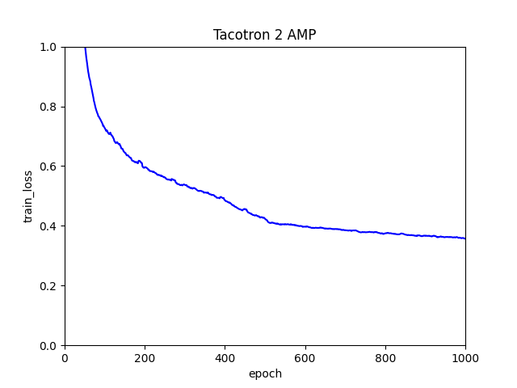

Figure 4. Tacotron 2 FP16 loss - batch size 128 (sample run)

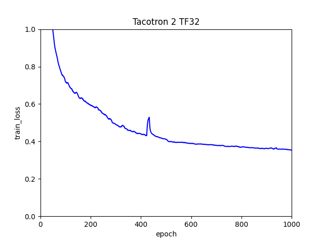

Figure 5. Tacotron 2 TF32 loss - batch size 128 (sample run)

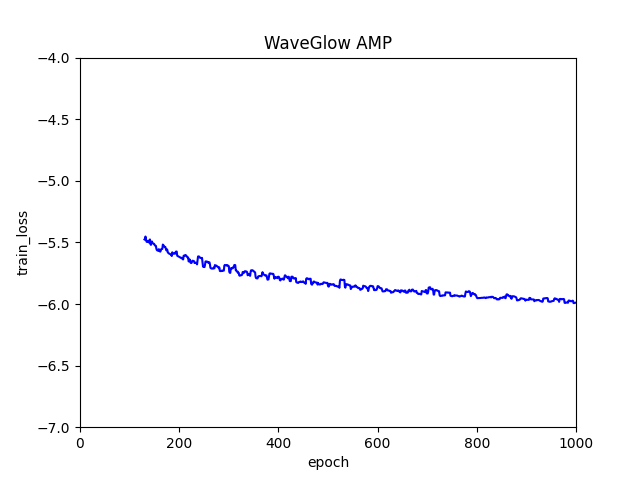

Figure 6. WaveGlow FP16 loss - batch size 10 (sample run)

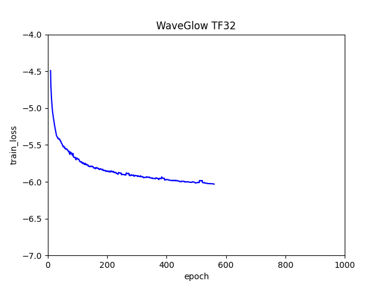

Figure 7. WaveGlow TF32 loss - batch size 4 (sample run)

##### Training accuracy: NVIDIA DGX-1 (8x V100 16GB)

Our results were obtained by running the `./platform/DGX1_{tacotron2,waveglow}_{AMP,TF32}_{1,4,8}NGPU_train.sh`
training script in the PyTorch-20.06-py3 NGC container on
NVIDIA DGX-1 with 8x V100 16G GPUs.

All of the results were produced using the `train.py` script as described in the
[Training process](#training-process) section of this document.

| Loss (Model/Epoch) |       1 |     250 |     500 |     750 |    1000 |
| :----------------: | ------: | ------: | ------: | ------: | ------: |
| Tacotron 2 FP16 | 13.0732 | 0.5736 | 0.4408 | 0.3923 | 0.3735 |
| Tacotron 2 FP32 | 8.5776 | 0.4807 | 0.3875 | 0.3421 | 0.3308 |
| WaveGlow FP16  | -2.2054 | -5.7602 |  -5.901 | -5.9706 | -6.0258 |
| WaveGlow FP32  | -3.0327 |  -5.858 | -6.0056 | -6.0613 | -6.1087 |

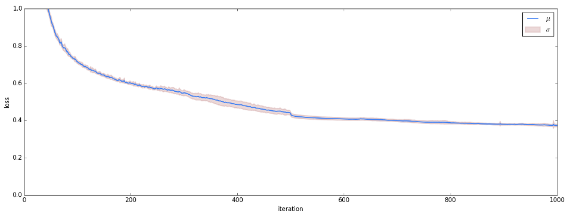

Figure 4. Tacotron 2 FP16 loss - batch size 104 (mean and std over 16 runs)

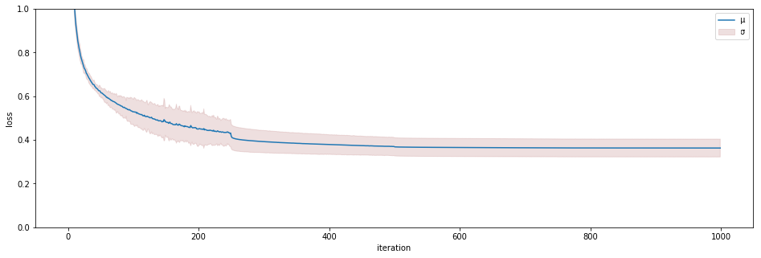

Figure 5. Tacotron 2 FP32 loss - batch size 48 (mean and std over 16 runs)

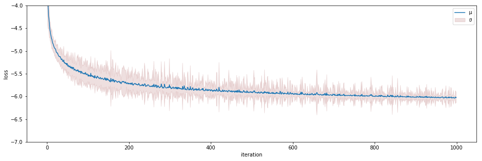

Figure 6. WaveGlow FP16 loss - batch size 10 (mean and std over 16 runs)

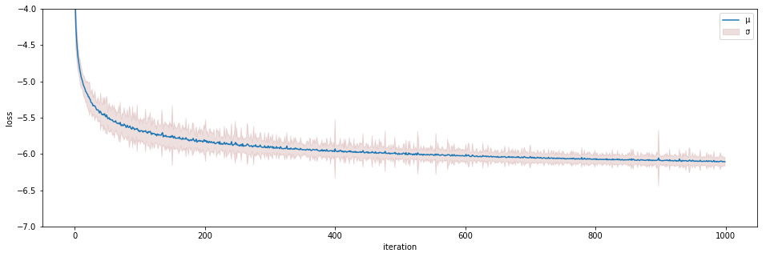

Figure 7. WaveGlow FP32 loss - batch size 4 (mean and std over 16 runs)

#### Training curves

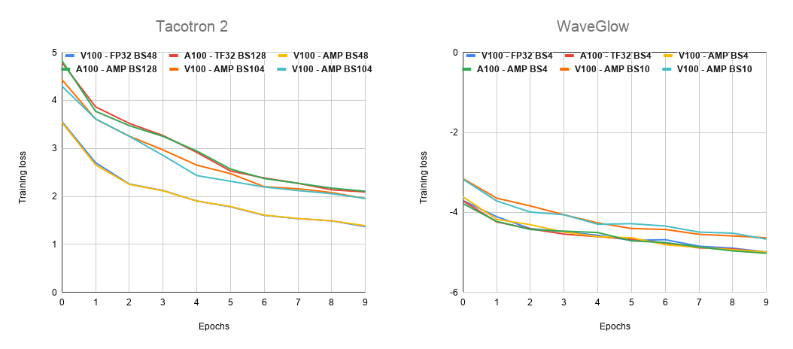

Figure 3. Tacotron 2 and WaveGlow training loss.

#### Training performance results

##### Training performance: NVIDIA DGX A100 (8x A100 40GB)

Our results were obtained by running the `./platform/DGXA100_{tacotron2,waveglow}_{AMP,TF32}_{1,4,8}NGPU_train.sh`
training script in the [framework-container-name] NGC container on
NVIDIA DGX A100 (8x A100 40GB) GPUs. Performance numbers (in output mel-spectrograms per second for
Tacotron 2 and output samples per second for WaveGlow)
were averaged over an entire training epoch.

This table shows the results for Tacotron 2:

|Number of GPUs|Batch size per GPU|Number of mels used with mixed precision|Number of mels used with TF32|Speed-up with mixed precision|Multi-GPU weak scaling with mixed precision|Multi-GPU weak scaling with TF32|
|---:|---:|---:|---:|---:|---:|---:|
|1| 128|  26,484|  31,499| 0.84| 1.00| 1.00|
|4| 128| 107,482| 124,591| 0.86| 4.06| 3.96|
|8| 128| 209,186| 250,556| 0.83| 7.90| 7.95|

The following table shows the results for WaveGlow:

|Number of GPUs|Batch size per GPU|Number of samples used with mixed precision|Number of samples used with TF32|Speed-up with mixed precision|Multi-GPU weak scaling with mixed precision|Multi-GPU weak scaling with TF32|
|---:|---:|---:|---:|---:|---:|---:|
|1| 10@FP16, 4@TF32 | 149,479|  67,581| 2.21| 1.00| 1.00|
|4| 10@FP16, 4@TF32 | 532,363| 233,846| 2.28| 3.56| 3.46|
|8| 10@FP16, 4@TF32 | 905,043| 383,043| 2.36| 6.05| 5.67|


##### Expected training time

The following table shows the expected training time for convergence for Tacotron 2 (1501 epochs):

|Number of GPUs|Batch size per GPU|Time to train with mixed precision (Hrs)|Time to train with TF32 (Hrs)|Speed-up with mixed precision|
|---:|---:|---:|---:|---:|
|1| 128| 112| 94| 0.84|
|4| 128|  29| 25| 0.87|
|8| 128|  16| 14| 0.84|

  
The following table shows the expected training time for convergence for WaveGlow (1001 epochs):

|Number of GPUs|Batch size per GPU|Time to train with mixed precision (Hrs)|Time to train with TF32 (Hrs)|Speed-up with mixed precision|
|---:|---:|---:|---:|---:|
|1| 10@FP16, 4@TF32 | 188| 416| 2.21|
|4| 10@FP16, 4@TF32 |  54| 122| 2.27|
|8| 10@FP16, 4@TF32 |  33|  75| 2.29|

##### Training performance: NVIDIA DGX-1 (8x V100 16GB)

Our results were obtained by running the `./platform/DGX1_{tacotron2,waveglow}_{AMP,TF32}_{1,4,8}NGPU_train.sh`
training script in the PyTorch-20.06-py3 NGC container on NVIDIA DGX-1 with
8x V100 16G GPUs. Performance numbers (in output mel-spectrograms per second for
Tacotron 2 and output samples per second for WaveGlow) were averaged over
an entire training epoch.

This table shows the results for Tacotron 2:

|Number of GPUs|Batch size per GPU|Number of mels used with mixed precision|Number of mels used with FP32|Speed-up with mixed precision|Multi-GPU weak scaling with mixed precision|Multi-GPU weak scaling with FP32|
|---:|---:|---:|---:|---:|---:|---:|
|1|104@FP16, 48@FP32|  15,891|  9,174| 1.73| 1.00| 1.00|
|4|104@FP16, 48@FP32|  53,417| 32,035| 1.67| 3.36| 3.49|
|8|104@FP16, 48@FP32| 115,032| 58,703| 1.96| 7.24| 6.40|

The following table shows the results for WaveGlow:

|Number of GPUs|Batch size per GPU|Number of samples used with mixed precision|Number of samples used with FP32|Speed-up with mixed precision|Multi-GPU weak scaling with mixed precision|Multi-GPU weak scaling with FP32|
|---:|---:|---:|---:|---:|---:|---:|
|1| 10@FP16, 4@FP32 | 105,873|  33,761| 3.14| 1.00| 1.00|
|4| 10@FP16, 4@FP32 | 364,471| 118,254| 3.08| 3.44| 3.50|
|8| 10@FP16, 4@FP32 | 690,909| 222,794| 3.10| 6.53| 6.60|

To achieve these same results, follow the steps in the [Quick Start Guide](#quick-start-guide).

##### Expected training time

The following table shows the expected training time for convergence for Tacotron 2 (1501 epochs):

|Number of GPUs|Batch size per GPU|Time to train with mixed precision (Hrs)|Time to train with FP32 (Hrs)|Speed-up with mixed precision|
|---:|---:|---:|---:|---:|
|1| 104@FP16, 48@FP32| 181| 333| 1.84|
|4| 104@FP16, 48@FP32|  53|  88| 1.66|
|8| 104@FP16, 48@FP32|  31|  48| 1.56|

The following table shows the expected training time for convergence for WaveGlow (1001 epochs):

|Number of GPUs|Batch size per GPU|Time to train with mixed precision (Hrs)|Time to train with FP32 (Hrs)|Speed-up with mixed precision|
|---:|---:|---:|---:|---:|
|1| 10@FP16, 4@FP32 | 249| 793| 3.18|
|4| 10@FP16, 4@FP32 |  78| 233| 3.00|
|8| 10@FP16, 4@FP32 |  48| 127| 2.98|

#### Inference performance results

The following tables show inference statistics for the Tacotron2 and WaveGlow
text-to-speech system, gathered from 1000 inference runs, on 1x A100, 1x V100 and 1x T4,
respectively. Latency is measured from the start of Tacotron 2 inference to
the end of WaveGlow inference. The tables include average latency, latency standard
deviation, and latency confidence intervals. Throughput is measured
as the number of generated audio samples per second. RTF is the real-time factor
which tells how many seconds of speech are generated in 1 second of compute.

##### Inference performance: NVIDIA DGX A100 (1x A100 40GB)

Our results were obtained by running the `inference-script-name.sh` inferencing
benchmarking script in the PyTorch-20.06-py3 NGC container on NVIDIA DGX A100 (1x A100 40GB) GPU.

|Batch size|Input length|Precision|WN channels|Avg latency (s)|Latency std (s)|Latency confidence interval 50% (s)|Latency confidence interval 90% (s)|Latency confidence interval 95% (s)|Latency confidence interval 99% (s)|Throughput (samples/sec)|Speed-up with mixed precision|Avg mels generated (81 mels=1 sec of speech)|Avg audio length (s)|Avg RTF|
|---:|---:|---:|---:|---:|---:|---:|---:|---:|---:|---:|---:|---:|---:|---:|
|1| 128| FP16| 256| 0.80| 0.02| 0.80| 0.83| 0.84| 0.86| 192,086| 1.08| 602| 6.99| 8.74|
|4| 128| FP16| 256| 1.05| 0.03| 1.05| 1.09| 1.10| 1.13| 602,856| 1.20| 619| 7.19| 6.85|
|1| 128| FP32| 256| 0.87| 0.02| 0.87| 0.90| 0.91| 0.93| 177,210| 1.00| 601| 6.98| 8.02|
|4| 128| FP32| 256| 1.27| 0.03| 1.26| 1.31| 1.32| 1.35| 500,458| 1.00| 620| 7.20| 5.67|
|1| 128| FP16| 512| 0.87| 0.02| 0.87| 0.90| 0.92| 0.94| 176,135| 1.12| 601| 6.98| 8.02|
|4| 128| FP16| 512| 1.37| 0.03| 1.36| 1.42| 1.43| 1.45| 462,691| 1.32| 619| 7.19| 5.25|
|1| 128| FP32| 512| 0.98| 0.03| 0.98| 1.02| 1.03| 1.07| 156,586| 1.00| 602| 6.99| 7.13|
|4| 128| FP32| 512| 1.81| 0.05| 1.79| 1.86| 1.90| 1.93| 351,465| 1.00| 620| 7.20| 3.98|

##### Inference performance: NVIDIA DGX-1 (1x V100 16GB)

|Batch size|Input length|Precision|WN channels|Avg latency (s)|Latency std (s)|Latency confidence interval 50% (s)|Latency confidence interval 90% (s)|Latency confidence interval 95% (s)|Latency confidence interval 99% (s)|Throughput (samples/sec)|Speed-up with mixed precision|Avg mels generated (81 mels=1 sec of speech)|Avg audio length (s)|Avg RTF|
|---:|---:|---:|---:|---:|---:|---:|---:|---:|---:|---:|---:|---:|---:|---:|
|1| 128| FP16| 256| 1.14| 0.07| 1.12| 1.20| 1.33| 1.40| 136,069| 1.58| 602| 6.99| 6.13|
|4| 128| FP16| 256| 1.52| 0.05| 1.52| 1.58| 1.61| 1.65| 416,688| 1.72| 619| 7.19| 4.73|
|1| 128| FP32| 256| 1.79| 0.06| 1.78| 1.86| 1.89| 1.99|  86,175| 1.00| 602| 6.99| 3.91|
|4| 128| FP32| 256| 2.61| 0.07| 2.61| 2.71| 2.74| 2.78| 242,656| 1.00| 619| 7.19| 2.75|
|1| 128| FP16| 512| 1.25| 0.08| 1.23| 1.32| 1.44| 1.50| 124,057| 1.90| 602| 6.99| 5.59|
|4| 128| FP16| 512| 2.11| 0.06| 2.10| 2.19| 2.22| 2.29| 300,505| 2.37| 620| 7.20| 3.41|
|1| 128| FP32| 512| 2.36| 0.08| 2.35| 2.46| 2.54| 2.61|  65,239| 1.00| 601| 6.98| 2.96|
|4| 128| FP32| 512| 5.00| 0.14| 4.96| 5.18| 5.26| 5.42| 126,810| 1.00| 618| 7.18| 1.44|


##### Inference performance: NVIDIA T4

|Batch size|Input length|Precision|WN channels|Avg latency (s)|Latency std (s)|Latency confidence interval 50% (s)|Latency confidence interval 90% (s)|Latency confidence interval 95% (s)|Latency confidence interval 99% (s)|Throughput (samples/sec)|Speed-up with mixed precision|Avg mels generated (81 mels=1 sec of speech)|Avg audio length (s)|Avg RTF|
|---:|---:|---:|---:|---:|---:|---:|---:|---:|---:|---:|---:|---:|---:|---:|
|1| 128| FP16| 256|  1.23| 0.05|  1.22|  1.29|  1.33|  1.42| 125,397| 2.46| 602| 6.99| 5.68|
|4| 128| FP16| 256|  2.85| 0.08|  2.84|  2.96|  2.99|  3.07| 222,672| 1.90| 620| 7.20| 2.53|
|1| 128| FP32| 256|  3.03| 0.10|  3.02|  3.14|  3.19|  3.32|  50,900| 1.00| 602| 6.99| 2.31|
|4| 128| FP32| 256|  5.41| 0.15|  5.38|  5.61|  5.66|  5.85| 117,325| 1.00| 620| 7.20| 1.33|
|1| 128| FP16| 512|  1.75| 0.08|  1.73|  1.87|  1.91|  1.98|  88,319| 2.79| 602| 6.99| 4.00|
|4| 128| FP16| 512|  4.59| 0.13|  4.57|  4.77|  4.83|  4.94| 138,226| 2.84| 620| 7.20| 1.57|
|1| 128| FP32| 512|  4.87| 0.14|  4.86|  5.03|  5.13|  5.27|  31,630| 1.00| 602| 6.99| 1.44|
|4| 128| FP32| 512| 13.02| 0.37| 12.96| 13.53| 13.67| 14.13|  48,749| 1.00| 620| 7.20| 0.55|

Our results were obtained by running the `./run_latency_tests.sh` script in
the PyTorch-20.06-py3 NGC container. Please note that to reproduce the results,
you need to provide pretrained checkpoints for Tacotron 2 and WaveGlow. Please
edit the script to provide your checkpoint filenames.


To compare with inference performance on CPU with TorchScript, benchmark inference on CPU using `./run_latency_tests_cpu.sh` script and get the performance numbers for batch size 1 and 4. Intel's optimization for PyTorch on CPU are added, you need to set `export OMP_NUM_THREADS=<num physical cores>` based on your CPU's core number, for your reference: https://software.intel.com/content/www/us/en/develop/articles/maximize-tensorflow-performance-on-cpu-considerations-and-recommendations-for-inference.html


## Release notes

### Changelog

June 2020
* Updated performance tables to include A100 results

March 2020
* Added Tacotron 2 and WaveGlow inference using TensorRT Inference Server with custom TensorRT backend in `trtis_cpp`
* Added Conversational AI demo script in `notebooks/conversationalai`
* Fixed loading CUDA RNG state in `load_checkpoint()` function in `train.py`
* Fixed FP16 export to TensorRT in `trt/README.md`

January 2020
* Updated batch sizes and performance results for Tacotron 2.

December 2019
* Added export and inference scripts for TensorRT. See [Tacotron2 TensorRT README](trt/README.md).

November 2019
* Implemented training resume from checkpoint
* Added notebook for running Tacotron 2 and WaveGlow in TRTIS.

October 2019
* Tacotron 2 inference with torch.jit.script

September 2019
* Introduced inference statistics

August 2019
* Fixed inference results
* Fixed initialization of Batch Normalization

July 2019
* Changed measurement units for Tacotron 2 training and inference performance
benchmarks from input tokes per second to output mel-spectrograms per second
* Introduced batched inference
* Included warmup in the inference script

June 2019
* AMP support
* Data preprocessing for Tacotron 2 training
* Fixed dropouts on LSTMCells

March 2019
* Initial release


### Known issues

There are no known issues in this release.
