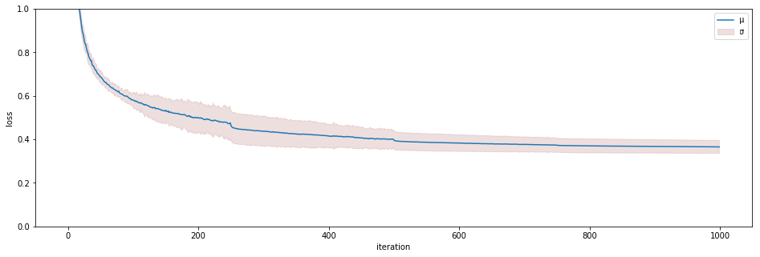

# Tacotron 2 And WaveGlow v1.0 For PyTorch

This repository provides a script and recipe to train Tacotron 2 and WaveGlow v1.0 to achieve state of the art accuracy, and is tested and maintained by NVIDIA.

## Table Of Contents
* [The model](#the-model)
	* [Default configuration](#default-configuration)
* [Setup](#setup)
	* [Requirements](#requirements)
* [Quick Start Guide](#quick-start-guide)
* [Details](#details)
	* [Training process](#training-process)
		* [Hyperparameters and command line arguments](#hyperparameters-and-command-line-arguments)
		    * [Shared parameters](#shared-parameters)
            * [Shared audio/STFT parameters](#shared-audiostft-parameters)
            * [Tacotron 2 parameters](#tacotron-2-parameters)
            * [WaveGlow parameters](#waveglow-parameters)
	* [Enabling mixed precision](#enabling-mixed-precision)
	* [Inference process](#inference-process)
* [Benchmarking](#benchmarking)
	* [Inference performance benchmark](#inference-performance-benchmark)
	* [Training performance benchmark](#training-performance-benchmark)
* [Results](#results)
	* [Training accuracy results](#training-accuracy-results)
	* [Training performance results](#training-performance-results)
		* [Expected training time](#expected-training-time)
	* [Inference performance results](#inference-performance-results)
* [Changelog](#changelog)
* [Known issues](#known-issues)


# The model
This text-to-speech (TTS) system is a combination of two neural network models:
* a modified Tacotron 2 model from the [Natural TTS Synthesis by Conditioning WaveNet on Mel Spectrogram Predictions](https://arxiv.org/abs/1712.05884) paper and
* a flow-based neural network model from the [WaveGlow: A Flow-based Generative Network for Speech Synthesis](https://arxiv.org/abs/1811.00002) paper.

The Tacotron 2 and WaveGlow model form a text-to-speech system that enables
user to synthesise a natural sounding speech from raw transcripts without
any additional prosody information.

Our implementation of Tacotron 2 model differs from the model described in the
paper. Our implementation uses Dropout instead of Zoneout to regularize the LSTM layers.
Also, the original text-to-speech system proposed in the paper used the [WaveNet](https://arxiv.org/abs/1609.03499)
model to synthesize waveforms.
In our implementation, we use the WaveGlow model for this purpose.

Both models are based on implementations of NVIDIA GitHub repositories
[Tacotron 2](https://github.com/NVIDIA/tacotron2) and
[WaveGlow](https://github.com/NVIDIA/waveglow), and are trained on a publicly
available [LJ Speech dataset](https://keithito.com/LJ-Speech-Dataset/).

This model trains with mixed precision tensor cores on Volta, therefore researchers
can get results much faster than training without tensor cores.  This model is
tested against each NGC monthly container release to ensure consistent accuracy
and performance over time.

## Default configuration
The Tacotron 2 model produces mel spectrograms from input text using
encoder-decoder architecture. WaveGlow is a flow-based model that consumes the
mel spectrograms to generate speech. Both models support multi-gpu and mixed
precision training with dynamic loss scaling (see Apex code [here](https://github.com/NVIDIA/apex/blob/master/apex/fp16_utils/loss_scaler.py)),
as well as mixed precision inference.

# Setup
The following sections list the requirements in order to
start training the Tacotron 2 and WaveGlow models.

## Requirements
This repository contains `Dockerfile` which extends the PyTorch NGC container
and encapsulates some dependencies. Aside from these dependencies, ensure you
have the following components:

* [NVIDIA Docker](https://github.com/NVIDIA/nvidia-docker)
* [PyTorch 18.12.1-py3 NGC container](https://ngc.nvidia.com/registry/nvidia-pytorch) or newer
* [NVIDIA Volta based GPU](https://www.nvidia.com/en-us/data-center/volta-gpu-architecture/)


For more information about how to get started with NGC containers, see the
following sections from the NVIDIA GPU Cloud Documentation and the Deep Learning
Documentation:

* [Getting Started Using NVIDIA GPU Cloud](https://docs.nvidia.com/ngc/ngc-getting-started-guide/index.html)
* [Accessing And Pulling From The NGC Container Registry](https://docs.nvidia.com/deeplearning/dgx/user-guide/index.html#accessing_registry)
* [Running PyTorch](https://docs.nvidia.com/deeplearning/dgx/pytorch-release-notes/running.html#running)

# Quick Start Guide
To train your model using mixed precision with tensor cores or using FP32,
perform the following steps using the default parameters of the Tacrotron 2
and WaveGlow model on the [LJ Speech](https://keithito.com/LJ-Speech-Dataset/) dataset.

## 1. Clone the repository.
```bash
git clone https://github.com/NVIDIA/DeepLearningExamples.git
cd DeepLearningExamples/PyTorch/SpeechSynthesis/Tacotron2
```

## 2. Download and preprocess the dataset.
Use the `./scripts/prepare-dataset.sh` download script to automatically
download and preprocess the training, validation and test datasets. To run this script, issue:
```bash
bash scripts/prepare-dataset.sh
```
Data is downloaded to the `./LJSpeech-1.1` directory (on the host).  The
`./LJSpeech-1.1` directory is mounted to the `/workspace/tacotron2/LJSpeech-1.1`
location in the NGC container.  The script will also generate the necessary
filelists for training and validation in `./filelists` if they are not already present.

## 3. Build the Tacotron 2 and WaveGlow PyTorch NGC container.
```bash
bash scripts/docker/build.sh
```

## 4. Start an interactive session in the NGC container to run training/inference.
After you build the container image, you can start an interactive CLI session with

```bash
bash scripts/docker/interactive.sh
```

The `interactive.sh` script requires that the location on the dataset is specified.
For example, `LJSpeech-1.1`.

## 5. Start training.
To run Tacotron 2 training, run:
```bash
bash scripts/train_tacotron2.sh
```

To run WaveGlow training, run:
```bash
bash scripts/train_waveglow.sh
```

## 6. Start validation/evaluation.
Ensure your loss values are comparable to those listed in the table in the 
Results section. For both models, the loss values are stored in the 
`./output/nvlog.json` log file. 

After you have trained the Tacotron 2 model for 1500 epochs and the 
WaveGlow model for 800 epochs, you should get audio results similar to the 
samples in the `./audio` folder. For details about generating audio, see the 
[Inference process](#inference-process) section below.

The training scripts automatically run the validation after each training 
epoch. The results from the validation are printed to the standard output 
(`stdout`) and saved to the log files.

## 7. Start inference.
After you have trained the Tacotron 2 and WaveGlow models, you can perform 
inference using the respective checkpoints that are passed as `--tacotron2` 
and `--waveglow` arguments. 

To run inference issue:
```bash
python inference.py --tacotron2 <Tacotron2_checkpoint> --waveglow <WaveGlow_checkpoint> -o output/ -i text.txt --fp16-run
```
The speech is generated from text file passed with `-i` argument. To run 
inference in mixed precision, use `--fp16-run` flag. The output audio will 
be stored in the path specified by `-o` argument.

# Details
The following sections provide greater details of the dataset, running training 
and inference, and the training results.

## Training process
The Tacotron2 and WaveGlow models are trained separately and independently. 
Both models obtain mel spectrograms from short time Fourier transform (STFT) 
during training. These mel spectrograms are used for loss computation in case 
of Tacotron 2 and as conditioning input to the network in case of WaveGlow.

The training loss is averaged over an entire training epoch, whereas the 
validation loss is averaged over the validation dataset. Performance is 
reported in total input tokens per second for the Tacotron 2 model, and 
in total output samples per second for the WaveGlow model. Both measures are 
recorded as `train_iter_items/sec` (after each iteration) and `train_epoch_items/sec` 
(averaged over epoch) in the output log. The result is averaged over an 
entire training epoch and summed over all GPUs that were included in the training.

Even though the training script uses all available GPUs, you can change 
this behavior by setting the `CUDA_VISIBLE_DEVICES` variable in your 
environment or by setting the `NV_GPU` variable at the Docker container launch 
([see section "GPU isolation"](https://github.com/NVIDIA/nvidia-docker/wiki/nvidia-docker#gpu-isolation)). 

### Hyperparameters and command line arguments
Here, we list the most important hyperparameters and command line arguments, 
together with their default values that are used to train Tacotron 2 and 
WaveGlow models.

#### Shared parameters
`--epochs` - number of epochs (Tacotron 2: 1500, WaveGlow: 1000)

`--learning-rate` - learning rate (Tacotron 2: 1e-3, WaveGlow: 1e-4)

`--batch-size` - batch size (Tacotron 2 FP16/FP32: 80/48, WaveGlow FP16/FP32: 8/4)

`--fp16-run` - use mixed precision training

#### Shared audio/STFT parameters
`--sampling-rate` - Sampling rate in Hz of input and output audio (22050)

`--filter-length` - (1024)

`--hop-length` - Hop length for FFT, i.e., sample stride between consecutive FFTs (256)

`--win-length` - Window size for FFT (1024)

`--mel-fmin` - Lowest frequency in Hz (0.0)

`--mel-fmax` - Highest frequency in Hz (8.000)

#### Tacotron 2 parameters
`--anneal-steps` - epochs at which to anneal the learning rate (500 1000 1500)

`--anneal-factor` - factor by which to anneal the learning rate (FP16/FP32: 0.3/0.1)

#### WaveGlow parameters
`--segment-length` - segment length of input audio processed by the neural network (8000)


## Enabling mixed precision
[Mixed precision](https://arxiv.org/abs/1710.03740) training offers significant 
computational speedup by performing operations in half-precision format, while 
storing minimal information in single-precision to retain as much information as 
possible in critical parts of the network. Since the introduction of 
[tensor cores](https://developer.nvidia.com/tensor-cores) in the Volta and Turing 
architectures, significant training speedups are experienced by switching to 
mixed precision -- up to 3x overall speedup on the most arithmetically intense 
model architectures. Using [mixed precision training](https://docs.nvidia.com/deeplearning/sdk/mixed-precision-training/index.html) 
previously required two steps:

1. Porting the model to use the FP16 data type where appropriate.
2. Manually adding loss scaling to preserve small gradient values.
 

Mixed precision is enabled in PyTorch by using the Automatic Mixed Precision 
(AMP),  library from [APEX](https://github.com/NVIDIA/apex) that casts variables 
to half-precision upon retrieval, while storing variables in single-precision 
format. Furthermore, to preserve small gradient magnitudes in backpropagation, 
a [loss scaling](https://docs.nvidia.com/deeplearning/sdk/mixed-precision-training/index.html#lossscaling) 
step must be included when applying gradients. In PyTorch, loss scaling can be 
easily applied by using `scale_loss()` method provided by AMP. The scaling value 
to be used can be [dynamic](https://nvidia.github.io/apex/fp16_utils.html#apex.fp16_utils.DynamicLossScaler) or fixed.

By default, the `train_tacotron2.sh` and `train_waveglow.sh` scripts will launch 
mixed precision training with tensor cores. You can change this behaviour by 
removing the `--fp16-run` flag from the `train.py` script.

For an in-depth walk through on AMP, check out sample usage [here](https://github.com/NVIDIA/apex/tree/master/apex/amp#usage-and-getting-started). 
[APEX](https://github.com/NVIDIA/apex) is a PyTorch extension that contains 
utility libraries, such as AMP, which require minimal network code changes to 
leverage tensor cores performance.

To enable mixed precision, you can:
* Import AMP from APEX, for example: 
    ```bash
    from apex import amp
    ```

* Initialize an AMP handle, for example: 
    ```bash
    amp_handle = amp.init(enabled=True, verbose=True)
    ```

* Wrap your optimizer with the AMP handle, for example:
    ```bash
    optimizer = amp_handle.wrap_optimizer(optimizer)    
    ```

* Scale loss before backpropagation (assuming loss is stored in a variable called losses)
    * Default backpropagate for FP32:
        ```bash
        losses.backward()
        ```
    
    * Scale loss and backpropagate with AMP:
        ```bash
        with optimizer.scale_loss(losses) as scaled_losses:
            scaled_losses.backward()
        ````

For information about:
* How to train using mixed precision, see the [Mixed Precision Training](https://arxiv.org/abs/1710.03740) 
paper and [Training With Mixed Precision](https://docs.nvidia.com/deeplearning/sdk/mixed-precision-training/index.html) documentation.
* Techniques used for mixed precision training, see the [Mixed-Precision Training of Deep Neural Networks](https://devblogs.nvidia.com/mixed-precision-training-deep-neural-networks/) blog.
* APEX tools for mixed precision training, see the [NVIDIA Apex: Tools for Easy Mixed-Precision Training in PyTorch](https://devblogs.nvidia.com/apex-pytorch-easy-mixed-precision-training/).

## Inference process
You can run inference using the `./inference.py` script. This script takes text 
as input, and runs Tacotron 2 and then WaveGlow inference to produce an audio 
file. It requires  pre-trained checkpoints from Tacotron 2 and WaveGlow models 
and input text as a text file, with one phrase per line.

To run inference, issue:
```bash
python inference.py --tacotron2 <Tacotron2_checkpoint> --waveglow <WaveGlow_checkpoint> -o output/ -i text.txt --fp16-run
```
Here, `Tacotron2_checkpoint` and `WaveGlow_checkpoint` are pre-trained 
checkpoints for the respective models, and `text.txt` contains input phrases. 
Audio will be saved in the output folder.

You can find all available options by calling `python inference.py --help`.

# Benchmarking
The following section shows how to run benchmarks measuring the model 
performance in training mode.

## Inference performance benchmark
To benchmark the inference performance on a batch size=1, run:

* For FP32
    ```bash
    python inference.py --tacotron2 <Tacotron2_checkpoint> --waveglow <WaveGlow_checkpoint> -o output/ -i text.txt --log-file=output/nvlog_fp32.json
    ```
* For FP16
    ```bash
    python inference.py --tacotron2 <Tacotron2_checkpoint> --waveglow <WaveGlow_checkpoint> -o output/ -i text.txt --fp16-run--log-file=output/nvlog_fp16.json
    ```

The log files will contain performance numbers for Tacotron 2 model 
(number of input tokens per second, reported as `tacotron2_items_per_sec`) 
and for WaveGlow (number of output samples per second, reported as 
`waveglow_items_per_sec`).

## Training performance benchmark
To benchmark the training performance on a specific batch size, run:

**Tacotron 2**

* For 1 GPU
	* FP32
        ```bash
        python train.py -m Tacotron2 -o <output_dir> -lr 1e-3 --epochs 10 -bs <batch_size> --weight-decay 1e-6 --grad-clip-thresh 1.0 --cudnn-benchmark=True --log-file nvlog.json --training-files filelists/ljs_audio_text_train_subset_2500_filelist.txt --dataset-path <dataset-path>
        ```
	* FP16
        ```bash
        python train.py -m Tacotron2 -o <output_dir> -lr 1e-3 --epochs 10 -bs <batch_size> --weight-decay 1e-6 --grad-clip-thresh 1.0 --cudnn-benchmark=True --log-file nvlog.json --training-files filelists/ljs_audio_text_train_subset_2500_filelist.txt --dataset-path <dataset-path> --fp16-run
        ```

* For multiple GPUs
	* FP32
        ```bash
        python -m multiproc train.py -m Tacotron2 -o <output_dir> -lr 1e-3 --epochs 10 -bs <batch_size> --weight-decay 1e-6 --grad-clip-thresh 1.0 --cudnn-benchmark=True --log-file nvlog.json --training-files filelists/ljs_audio_text_train_subset_2500_filelist.txt --dataset-path <dataset-path>
        ```
	* FP16
        ```bash
        python -m multiproc train.py -m Tacotron2 -o <output_dir> -lr 1e-3 --epochs 10 -bs <batch_size> --weight-decay 1e-6 --grad-clip-thresh 1.0 --cudnn-benchmark=True --log-file nvlog.json --training-files filelists/ljs_audio_text_train_subset_2500_filelist.txt --dataset-path <dataset-path> --fp16-run
        ```

**WaveGlow**

* For 1 GPU
	* FP32
        ```bash
        python train.py -m WaveGlow -o <output_dir> -lr 1e-4 --epochs 10 -bs <batch_size> --segment-length  8000 --weight-decay 0 --grad-clip-thresh 3.4028234663852886e+38 --cudnn-benchmark=True --log-file nvlog.json --training-files filelists/ljs_audio_text_train_subset_1250_filelist.txt --dataset-path <dataset-path>
        ```
	* FP16
        ```bash
        python train.py -m WaveGlow -o <output_dir> -lr 1e-4 --epochs 10 -bs <batch_size> --segment-length 8000 --weight-decay 0 --grad-clip-thresh 65504.0 --cudnn-benchmark=True --log-file nvlog.json --training-files filelists/ljs_audio_text_train_subset_1250_filelist.txt --dataset-path <dataset-path> --fp16-run
        ```

* For multiple GPUs
	* FP32
        ```bash
        python -m multiproc train.py -m WaveGlow -o <output_dir> -lr 1e-4 --epochs 10 -bs <batch_size> --segment-length 8000 --weight-decay 0 --grad-clip-thresh 3.4028234663852886e+38 --cudnn-benchmark=True --log-file nvlog.json --training-files filelists/ljs_audio_text_train_subset_1250_filelist.txt --dataset-path <dataset-path>
        ```
	* FP16
        ```bash
        python -m multiproc train.py -m WaveGlow -o <output_dir> -lr 1e-4 --epochs 10 -bs <batch_size> --segment-length 8000 --weight-decay 0 --grad-clip-thresh 65504.0 --cudnn-benchmark=True --log-file nvlog.json --training-files filelists/ljs_audio_text_train_subset_1250_filelist.txt --dataset-path <dataset-path> --fp16-run
        ```

Each of these scripts runs for 10 epochs and for each epoch measures the averaged number of items per second. The performance results can be read from the nvlog.json files produced by the commands.

# Results
The following sections provide details on how we achieved our performance 
and accuracy in training and inference.

## Training accuracy results
Our results were obtained by running the `./platform/train_{tacotron2,waveglow}_{FP16,FP32}_DGX1_16GB_8GPU.sh` 
training script in the PyTorch-18.12.1-py3 NGC container on NVIDIA DGX-1 with 8x V100 16G GPUs.

All of the results were produced using the `train.py` as described in the 
[Training process](#training-process) section of this document.

| Loss (Model/Epoch) |       1 |     250 |     500 |     750 |    1000 |
| :----------------: | ------: | ------: | ------: | ------: | ------: |
| **Tacotron 2 FP16** | 26.7176 |   0.473 |  0.3985 |  0.3725 |  0.3645 |
| **Tacotron 2 FP32** |  5.3406 |  0.4317 |  0.3699 |  0.3635 |  0.3629 |
| **WaveGlow FP16**  | -2.2054 | -5.7602 |  -5.901 | -5.9706 | -6.0258 |
| **WaveGlow FP32**  | -3.0327 |  -5.858 | -6.0056 | -6.0613 | -6.1087 |

Tacotron 2 FP16 loss - batch size 80 (mean and std over 16 runs)

Tacotron 2 FP32 loss - batch size 48 (mean and std over 16 runs)

WaveGlow FP16 loss - batch size 8 (mean and std over 16 runs)

WaveGlow FP32 loss - batch size 4 (mean and std over 16 runs)


## Training performance results
Our results were obtained by running the `./platform/train_{tacotron2,waveglow}_{FP16,FP32}_DGX1_16GB_8GPU.sh` 
training script in the PyTorch-18.12.1-py3 NGC container on NVIDIA DGX-1 with 
8x V100 16G GPUs. Performance numbers (in input tokens per second for 
Tacotron 2 and output samples per second for WaveGlow) were averaged over 
an entire training epoch.

This table shows the results for Tacotron 2, with batch size equal 48 and 80 
for mixed precision and FP32 training, respectively.

|Number of GPUs|Mixed precision tokens/sec|FP32 tokens/sec|Speed-up with mixed precision|Multi-gpu weak scaling with mixed precision|Multi-gpu weak scaling with FP32|
|---:|---:|---:|---:|---:|---:|
|**1**|2,424|1,826|1.33|1.00|1.00|
|**4**|7,280|5,944|1.22|3.00|3.26|
|**8**|12,742|10,843|1.18|5.26|5.94|

The following table shows the results for WaveGlow, with batch size equal 4 and 8 for mixed precision and FP32 training, respectively.

|Number of GPUs|Mixed precision samples/sec|FP32 samples/sec|Speed-up with mixed precision|Multi-gpu weak scaling with mixed precision|Multi-gpu weak scaling with FP32|
|---:|---:|---:|---:|---:|---:|
|**1**| 70,362 | 35,180 | 2.00 | 1.00 | 1.00 |
|**4**| 215,380 | 118,961 | 1.81 | 3.06 | 3.38 |
|**8**| 500,375 | 257,687 | 1.94 | 7.11 | 7.32 |

To achieve these same results, follow the [Quick Start Guide](#quick-start-guide) outlined above.

### Expected training time

This table shows the expected training time for convergence for Tacotron 2 (1500 epochs).

|Number of GPUs|Expected training time with mixed precision|Expected training time with FP32|Speed-up with mixed precision|
|---:|---:|---:|---:|
|**1**| 208.00 | 288.03 | 1.38 | 
|**4**| 67.53 | 84.20 | 1.25 |
|**8**| 33.14 | 44.00 | 1.33 |

This table shows the expected training time for convergence for WaveGlow (1000 epochs).

|Number of GPUs|Expected training time with mixed precision|Expected training time with FP32|Speed-up with mixed precision|
|---:|---:|---:|---:|
|**1**| 437.03 | 814.30 | 1.86 |
|**4**|	108.26 | 223.04 | 2.06 |
|**8**|	54.83 | 109.96 | 2.01 |

## Inference performance results
Our results were obtained by running the `./inference.py` inference script in the 
PyTorch-18.12.1-py3 NGC container on NVIDIA DGX-1 with 8x V100 16G GPUs.
Performance numbers (in input tokens per second for Tacotron 2 and output 
samples per second for WaveGlow) were averaged over 16 runs.


This table shows the inference performance results for Tacotron 2.
Results are measured in the number of input tokens per second.

|Number of GPUs|Mixed precision tokens/sec|FP32 tokens/sec|Speed-up with mixed precision|
|---:|---:|---:|---:|
|**1**|170|178|0.96|


This table shows the inference performance results for WaveGlow. 
Results are measured in the number of output audio samples per second.<sup>1</sup>

|Number of GPUs|Mixed precision samples/sec|FP32 samples/sec|Speed-up with mixed precision|
|---:|---:|---:|---:|
|**1**|537525|404206|1.33|

<sup>1</sup>With sampling rate equal to 22050, one second of audio is generated from 22050 samples.

To achieve these same results, follow the [Quick Start Guide](#quick-start-guide) outlined above.

# Changelog
March 2019

* Initial release

# Known issues
For mixed precision training of Tacotron 2, dropouts on LSTMCells 
cause overflow leading to dynamic loss scaling going to 1, see [here](https://github.com/NVIDIA/tacotron2/issues/112). 
The current workaround, which is already applied in our model implementation, 
is to convert `attention_rnn` and `decoder_rnn` back to FP32 precision.