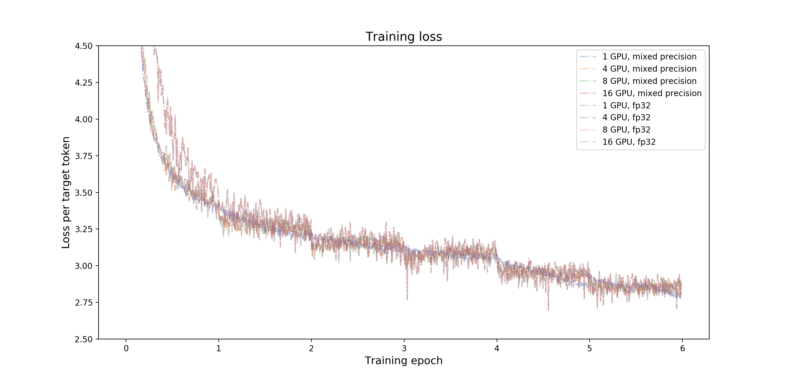
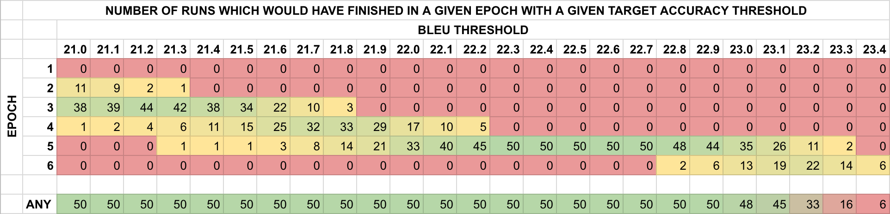

# GNMT v2 For PyTorch

This repository provides a script and recipe to train the GNMT v2 model to
achieve state of the art accuracy, and is tested and maintained by NVIDIA.

## Table Of Contents

<!-- TOC GFM -->

* [Model overview](#model-overview)
  * [Model architecture](#model-architecture)
  * [Default configuration](#default-configuration)
  * [Feature support matrix](#feature-support-matrix)
    * [Features](#features)
  * [Mixed precision training](#mixed-precision-training)
    * [Enabling mixed precision](#enabling-mixed-precision)
* [Setup](#setup)
  * [Requirements](#requirements)
* [Quick Start Guide](#quick-start-guide)
* [Advanced](#advanced)
  * [Scripts and sample code](#scripts-and-sample-code)
  * [Parameters](#parameters)
  * [Command-line options](#command-line-options)
  * [Getting the data](#getting-the-data)
    * [Dataset guidelines](#dataset-guidelines)
  * [Training process](#training-process)
  * [Inference process](#inference-process)
* [Performance](#performance)
  * [Benchmarking](#benchmarking)
    * [Training performance benchmark](#training-performance-benchmark)
    * [Inference performance benchmark](#inference-performance-benchmark)
  * [Results](#results)
    * [Training accuracy results](#training-accuracy-results)
      * [Training accuracy: NVIDIA DGX-1 (8x V100 16G)](#training-accuracy-nvidia-dgx-1-8x-v100-16g)
      * [Training accuracy: NVIDIA DGX-2 (16x V100 32G)](#training-accuracy-nvidia-dgx-2-16x-v100-32g)
      * [Training stability test](#training-stability-test)
    * [Training throughput results](#training-throughput-results)
      * [Training throughput: NVIDIA DGX-1 (8x V100 16G)](#training-throughput-nvidia-dgx-1-8x-v100-16g)
      * [Training throughput: NVIDIA DGX-2 (16x V100 32G)](#training-throughput-nvidia-dgx-2-16x-v100-32g)
    * [Inference accuracy results](#inference-accuracy-results)
      * [Inference accuracy: NVIDIA Tesla V100 16G](#inference-accuracy-nvidia-tesla-v100-16g)
      * [Inference accuracy: NVIDIA T4](#inference-accuracy-nvidia-t4)
    * [Inference throughput results](#inference-throughput-results)
      * [Inference throughput: NVIDIA T4](#inference-throughput-nvidia-t4)
    * [Inference latency results](#inference-latency-results)
      * [Inference latency: NVIDIA T4](#inference-latency-nvidia-t4)
* [Release notes](#release-notes)
  * [Changelog](#changelog)
  * [Known issues](#known-issues)

<!-- /TOC -->

## Model overview
The GNMT v2 model is similar to the one discussed in the [Google's Neural
Machine Translation System: Bridging the Gap between Human and Machine
Translation](https://arxiv.org/abs/1609.08144) paper.

The most important difference between the two models is in the attention
mechanism. In our model, the output from the first LSTM layer of the decoder
goes into the attention module, then the re-weighted context is concatenated
with inputs to all subsequent LSTM layers in the decoder at the current
time step.

The same attention mechanism is also implemented in the default GNMT-like
models from [TensorFlow Neural Machine Translation
Tutorial](https://github.com/tensorflow/nmt) and [NVIDIA OpenSeq2Seq
Toolkit](https://github.com/NVIDIA/OpenSeq2Seq).

### Model architecture


### Default configuration

The following features were implemented in this model:

* general:
  * encoder and decoder are using shared embeddings
  * data-parallel multi-GPU training
  * dynamic loss scaling with backoff for Tensor Cores (mixed precision)
    training
  * trained with label smoothing loss (smoothing factor 0.1)
* encoder:
  * 4-layer LSTM, hidden size 1024, first layer is bidirectional, the rest are
    unidirectional
  * with residual connections starting from 3rd layer
  * uses standard PyTorch nn.LSTM layer
  * dropout is applied on input to all LSTM layers, probability of dropout is
    set to 0.2
  * hidden state of LSTM layers is initialized with zeros
  * weights and bias of LSTM layers is initialized with uniform(-0.1,0.1)
    distribution
* decoder:
  * 4-layer unidirectional LSTM with hidden size 1024 and fully-connected
    classifier
  * with residual connections starting from 3rd layer
  * uses standard PyTorch nn.LSTM layer
  * dropout is applied on input to all LSTM layers, probability of dropout is
    set to 0.2
  * hidden state of LSTM layers is initialized with zeros
  * weights and bias of LSTM layers is initialized with uniform(-0.1,0.1)
    distribution
  * weights and bias of fully-connected classifier is initialized with
    uniform(-0.1,0.1) distribution
* attention:
  * normalized Bahdanau attention
  * output from first LSTM layer of decoder goes into attention, then
    re-weighted context is concatenated with the input to all subsequent LSTM
    layers of the decoder at the current timestep
  * linear transform of keys and queries is initialized with uniform(-0.1,
    0.1), normalization scalar is initialized with 1.0/sqrt(1024),
    normalization bias is initialized with zero
* inference:
  * beam search with default beam size of 5
  * with coverage penalty and length normalization, coverage penalty factor is
    set to 0.1, length normalization factor is set to 0.6 and length
    normalization constant is set to 5.0
  * de-tokenized BLEU computed by
    [SacreBLEU](https://github.com/mjpost/sacrebleu)
  * [motivation](https://github.com/mjpost/sacrebleu#motivation) for choosing
    SacreBLEU

When comparing the BLEU score, there are various tokenization approaches and
BLEU calculation methodologies; therefore, ensure you align similar metrics.

Code from this repository can be used to train a larger, 8-layer GNMT v2 model.
Our experiments show that a 4-layer model is significantly faster to train and
yields comparable accuracy on the public [WMT16
English-German](http://www.statmt.org/wmt16/translation-task.html) dataset. The
number of LSTM layers is controlled by the `--num_layers` parameter in the
`train.py` training script.

### Feature support matrix
The following features are supported by this model.

| **Feature** | **GNMT v2** |
|:------------|------------:|
|[Apex AMP](https://nvidia.github.io/apex/amp.html) | Yes |
|[Apex DistributedDataParallel](https://nvidia.github.io/apex/parallel.html#apex.parallel.DistributedDataParallel) | Yes |

#### Features
[Apex AMP](https://nvidia.github.io/apex/amp.html) - a tool that enables Tensor
Core-accelerated training. Refer to the [Enabling mixed
precision](#enabling-mixed-precision) section for more details.

[Apex
DistributedDataParallel](https://nvidia.github.io/apex/parallel.html#apex.parallel.DistributedDataParallel) -
a module wrapper that enables easy multiprocess distributed data parallel
training, similar to
[torch.nn.parallel.DistributedDataParallel](https://pytorch.org/docs/stable/nn.html#torch.nn.parallel.DistributedDataParallel).
`DistributedDataParallel` is optimized for use with
[NCCL](https://github.com/NVIDIA/nccl). It achieves high performance by
overlapping communication with computation during `backward()` and bucketing
smaller gradient transfers to reduce the total number of transfers required.

### Mixed precision training
Mixed precision is the combined use of different numerical precisions in a
computational method.
[Mixed precision](https://arxiv.org/abs/1710.03740) training offers significant
computational speedup by performing operations in half-precision format, while
storing minimal information in single-precision to retain as much information
as possible in critical parts of the network. Since the introduction of [Tensor
Cores](https://developer.nvidia.com/tensor-cores) in the Volta and Turing
architectures, significant training speedups are experienced by switching to
mixed precision -- up to 3x overall speedup on the most arithmetically intense
model architectures. Using mixed precision training previously required two
steps:

1. Porting the model to use the FP16 data type where appropriate.
2. Manually adding loss scaling to preserve small gradient values.

The ability to train deep learning networks with lower precision was introduced
in the Pascal architecture and first supported in [CUDA
8](https://devblogs.nvidia.com/parallelforall/tag/fp16/) in the NVIDIA Deep
Learning SDK.

For information about:
* How to train using mixed precision, see the [Mixed Precision
  Training](https://arxiv.org/abs/1710.03740) paper and [Training With Mixed
  Precision](https://docs.nvidia.com/deeplearning/sdk/mixed-precision-training/index.html)
  documentation.
* Techniques used for mixed precision training, see the [Mixed-Precision
  Training of Deep Neural
  Networks](https://devblogs.nvidia.com/mixed-precision-training-deep-neural-networks/)
  blog.
* APEX tools for mixed precision training, see the [NVIDIA Apex: Tools for Easy
  Mixed-Precision Training in
  PyTorch](https://devblogs.nvidia.com/apex-pytorch-easy-mixed-precision-training/)
  .

#### Enabling mixed precision
By default, the `train.py` training script will launch mixed precision training
with Tensor Cores. You can change this behavior and execute the training in
single precision by setting the `--math fp32` flag for the `train.py` training
script.

Mixed precision is enabled in PyTorch by using the Automatic Mixed Precision
(AMP), library from [APEX](https://github.com/NVIDIA/apex) that casts variables
to half-precision upon retrieval, while storing variables in single-precision
format. Furthermore, to preserve small gradient magnitudes in backpropagation,
a [loss
scaling](https://docs.nvidia.com/deeplearning/sdk/mixed-precision-training/index.html#lossscaling)
step must be included when applying gradients. In PyTorch, loss scaling can be
easily applied by using `scale_loss()` method provided by AMP. The scaling
value to be used can be
[dynamic](https://nvidia.github.io/apex/amp.html#apex.amp.initialize) or fixed.

For an in-depth walk through on AMP, check out sample usage
[here](https://nvidia.github.io/apex/amp.html#).
[APEX](https://github.com/NVIDIA/apex) is a PyTorch extension that contains
utility libraries, such as AMP, which require minimal network code changes to
leverage tensor cores performance.

The following steps were needed to enable mixed precision training in GNMT:

* Import AMP from APEX (file: `seq2seq/train/trainer.py`):

```
from apex import amp
```

* Initialize AMP and wrap the model and the optimizer (file:
  `seq2seq/train/trainer.py`, class: `Seq2SeqTrainer`):

```
self.model, self.optimizer = amp.initialize(
    self.model,
    self.optimizer,
    cast_model_outputs=torch.float16,
    keep_batchnorm_fp32=False,
    opt_level='O2')
```

* Apply `scale_loss` context manager (file: `seq2seq/train/fp_optimizers.py`,
  class: `AMPOptimizer`):

```
with amp.scale_loss(loss, optimizer) as scaled_loss:
    scaled_loss.backward()
```

* Apply gradient clipping on single precision master weights (file:
  `seq2seq/train/fp_optimizers.py`, class: `AMPOptimizer`):

```
if self.grad_clip != float('inf'):
    clip_grad_norm_(amp.master_params(optimizer), self.grad_clip)
```

## Setup

The following section lists the requirements in order to start training the
GNMT v2 model.

### Requirements

This repository contains `Dockerfile` which extends the PyTorch NGC container
and encapsulates some dependencies.  Aside from these dependencies, ensure you
have the following components:

* [NVIDIA Docker](https://github.com/NVIDIA/nvidia-docker)
* [PyTorch 19.05-py3 NGC container](https://ngc.nvidia.com/registry/nvidia-pytorch)
* [NVIDIA Volta](https://www.nvidia.com/en-us/data-center/volta-gpu-architecture/)
  or [Turing](https://www.nvidia.com/pl-pl/geforce/turing/) based GPU

For more information about how to get started with NGC containers, see the
following sections from the NVIDIA GPU Cloud Documentation and the Deep
Learning DGX Documentation:

* [Getting Started Using NVIDIA GPU Cloud](https://docs.nvidia.com/ngc/ngc-getting-started-guide/index.html),
* [Accessing And Pulling From The NGC container registry](https://docs.nvidia.com/deeplearning/dgx/user-guide/index.html#accessing_registry),
* [Running PyTorch](https://docs.nvidia.com/deeplearning/dgx/pytorch-release-notes/running.html#running).

For those unable to use the Pytorch NGC container, to set up the required
environment or create your own container, see the versioned [NVIDIA Container
Support
Matrix](https://docs.nvidia.com/deeplearning/frameworks/support-matrix/index.html).


## Quick Start Guide
To train your model using mixed precision with Tensor Cores or using FP32,
perform the following steps using the default parameters of the GNMT v2 model
on the WMT16 English German dataset. For the specifics concerning training
and inference, see the [Advanced](#advanced) section.

**1. Clone the repository.**

```
git clone https://github.com/NVIDIA/DeepLearningExamples
cd DeepLearningExamples/PyTorch/Translation/GNMT
```

**2. Build the GNMT v2 Docker container.**

```
bash scripts/docker/build.sh
```

**3. Start an interactive session in the container to run training/inference.**

```
bash scripts/docker/interactive.sh
```

**4. Download and preprocess the dataset.**

Data will be downloaded to the `data` directory (on the host). The `data`
directory is mounted to the `/workspace/gnmt/data` location in the Docker
container.

```
bash scripts/wmt16_en_de.sh
```

**5. Start training.**

By default, the `train.py` training script will use all available GPUs. The
training script saves only one checkpoint with the lowest value of the loss
function on the validation dataset. All results and logs are saved to the
`results` directory (on the host) or to the `/workspace/gnmt/results` directory
(in the container). By default, the `train.py` script will launch mixed
precision training with Tensor Cores. You can change this behavior by setting
the `--math fp32` flag for the `train.py` training script.

To launch mixed precision training on 1, 4 or 8 GPUs, run:

```
python3 -m launch train.py --seed 2 --train-global-batch-size 1024
```

To launch mixed precision training on 16 GPUs, run:

```
python3 -m launch train.py --seed 2 --train-global-batch-size 2048
```

By default, the training script will launch training with batch size 128 per
GPU. If `--train-global-batch-size` is specified and larger than 128 times the
number of GPUs available for the training then the training script will
accumulate gradients over consecutive iterations and then perform the weight
update. For example, 1 GPU training with `--train-global-batch-size 1024` will
accumulate gradients over 8 iterations before doing the weight update with
accumulated gradients.

**6. Start evaluation.**

The training process automatically runs evaluation and outputs the BLEU score
after each training epoch. Additionally, after the training is done, you can
manually run inference on the test dataset with the checkpoint saved during the
training.

To launch mixed precision inference on the `newstest2014.en` test set, run:

```
python3 translate.py \
  --input data/wmt16_de_en/newstest2014.en \
  --reference data/wmt16_de_en/newstest2014.de \
  --output /tmp/output \
  --model results/gnmt/model_best.pth
```

The script will load the checkpoint specified by the `--model` option, then it
will launch inference on the file specified by the `--input` option, and
compute BLEU score against the reference translation specified by the
`--reference` option. Outputs will be stored to the location specified by the
`--output` option.


Additionally, one can pass the input text directly from the command-line:

```
python3 translate.py \
  --input-text "The quick brown fox jumps over the lazy dog" \
  --model results/gnmt/model_best.pth
```

Translated output will be printed to the console:

```
(...)
0: Translated output:
Der schnelle braune Fuchs springt über den faulen Hund
```

By default, the `translate.py` script will launch mixed precision inference
with Tensor Cores. You can change this behavior by setting the `--math fp32`
flag for the `translate.py` inference script.

## Advanced
The following sections provide greater details of the dataset, running training
and inference, and the training results.

### Scripts and sample code
In the `root` directory, the most important files are:

* `train.py`: serves as the entry point to launch the training
* `translate.py`: serves as the entry point to launch inference
* `Dockerfile`: container with the basic set of dependencies to run GNMT v2
* `requirements.txt`: set of extra requirements for running GNMT v2

The `seq2seq/model` directory contains the implementation of GNMT v2 building
blocks:

* `attention.py`: implementation of normalized Bahdanau attention
* `encoder.py`: implementation of recurrent encoder
* `decoder.py`: implementation of recurrent decoder with attention
* `seq2seq_base.py`: base class for seq2seq models
* `gnmt.py`: implementation of GNMT v2 model

The `seq2seq/train` directory encapsulates the necessary tools to execute
training:

* `trainer.py`: implementation of training loop
* `smoothing.py`: implementation of cross-entropy with label smoothing
* `lr_scheduler.py`: implementation of exponential learning rate warmup and
  step decay
* `fp_optimizers.py`: implementation of optimizers for various floating point
  precisions

The `seq2seq/inference` directory contains scripts required to run inference:

* `beam_search.py`: implementation of beam search with length normalization and
  length penalty
* `translator.py`: implementation of auto-regressive inference

The `seq2seq/data` directory contains implementation of components needed for
data loading:

* `dataset.py`: implementation of text datasets
* `sampler.py`: implementation of batch samplers with bucketing by sequence
  length
* `tokenizer.py`: implementation of tokenizer (maps integer vocabulary indices
  to text)

### Parameters
Training


The complete list of available parameters for the `train.py` training script
contains:

```
dataset setup:
  --dataset-dir DATASET_DIR
                        path to the directory with training/test data
                        (default: data/wmt16_de_en)
  --src-lang SRC_LANG   source language (default: en)
  --tgt-lang TGT_LANG   target language (default: de)
  --vocab VOCAB         path to the vocabulary file (relative to DATASET_DIR
                        directory) (default: vocab.bpe.32000)
  -bpe BPE_CODES, --bpe-codes BPE_CODES
                        path to the file with bpe codes (relative to
                        DATASET_DIR directory) (default: bpe.32000)
  --train-src TRAIN_SRC
                        path to the training source data file (relative to
                        DATASET_DIR directory) (default:
                        train.tok.clean.bpe.32000.en)
  --train-tgt TRAIN_TGT
                        path to the training target data file (relative to
                        DATASET_DIR directory) (default:
                        train.tok.clean.bpe.32000.de)
  --val-src VAL_SRC     path to the validation source data file (relative to
                        DATASET_DIR directory) (default:
                        newstest_dev.tok.clean.bpe.32000.en)
  --val-tgt VAL_TGT     path to the validation target data file (relative to
                        DATASET_DIR directory) (default:
                        newstest_dev.tok.clean.bpe.32000.de)
  --test-src TEST_SRC   path to the test source data file (relative to
                        DATASET_DIR directory) (default:
                        newstest2014.tok.bpe.32000.en)
  --test-tgt TEST_TGT   path to the test target data file (relative to
                        DATASET_DIR directory) (default: newstest2014.de)
  --train-max-size TRAIN_MAX_SIZE
                        use at most TRAIN_MAX_SIZE elements from training
                        dataset (useful for benchmarking), by default uses
                        entire dataset (default: None)

results setup:
  --results-dir RESULTS_DIR
                        path to directory with results, it will be
                        automatically created if it does not exist (default:
                        results)
  --save-dir SAVE_DIR   defines subdirectory within RESULTS_DIR for results
                        from this training run (default: gnmt)
  --print-freq PRINT_FREQ
                        print log every PRINT_FREQ batches (default: 10)

model setup:
  --hidden-size HIDDEN_SIZE
                        hidden size of the model (default: 1024)
  --num-layers NUM_LAYERS
                        number of RNN layers in encoder and in decoder
                        (default: 4)
  --dropout DROPOUT     dropout applied to input of RNN cells (default: 0.2)
  --share-embedding     use shared embeddings for encoder and decoder (use '--
                        no-share-embedding' to disable) (default: True)
  --smoothing SMOOTHING
                        label smoothing, if equal to zero model will use
                        CrossEntropyLoss, if not zero model will be trained
                        with label smoothing loss (default: 0.1)

general setup:
  --math {fp16,fp32,manual_fp16}
                        precision (default: fp16)
  --seed SEED           master seed for random number generators, if "seed" is
                        undefined then the master seed will be sampled from
                        random.SystemRandom() (default: None)
  --prealloc-mode {off,once,always}
                        controls preallocation (default: always)
  --eval                run validation and test after every epoch (use '--no-
                        eval' to disable) (default: True)
  --env                 print info about execution env (use '--no-env' to
                        disable) (default: True)
  --cuda                enables cuda (use '--no-cuda' to disable) (default:
                        True)
  --cudnn               enables cudnn (use '--no-cudnn' to disable) (default:
                        True)
  --log-all-ranks       enables logging from all distributed ranks, if
                        disabled then only logs from rank 0 are reported (use
                        '--no-log-all-ranks' to disable) (default: True)

training setup:
  --train-batch-size TRAIN_BATCH_SIZE
                        training batch size per worker (default: 128)
  --train-global-batch-size TRAIN_GLOBAL_BATCH_SIZE
                        global training batch size, this argument does not
                        have to be defined, if it is defined it will be used
                        to automatically compute train_iter_size using the
                        equation: train_iter_size = train_global_batch_size //
                        (train_batch_size * world_size) (default: None)
  --train-iter-size N   training iter size, training loop will accumulate
                        gradients over N iterations and execute optimizer
                        every N steps (default: 1)
  --epochs EPOCHS       max number of training epochs (default: 6)
  --grad-clip GRAD_CLIP
                        enables gradient clipping and sets maximum norm of
                        gradients (default: 5.0)
  --train-max-length TRAIN_MAX_LENGTH
                        maximum sequence length for training (including
                        special BOS and EOS tokens) (default: 50)
  --train-min-length TRAIN_MIN_LENGTH
		minimum sequence length for training (including
                        special BOS and EOS tokens) (default: 0)
  --train-loader-workers TRAIN_LOADER_WORKERS
                        number of workers for training data loading (default:
                        2)
  --batching {random,sharding,bucketing}
                        select batching algorithm (default: bucketing)
  --shard-size SHARD_SIZE
                        shard size for "sharding" batching algorithm, in
                        multiples of global batch size (default: 80)
  --num-buckets NUM_BUCKETS
                        number of buckets for "bucketing" batching algorithm
                        (default: 5)

optimizer setup:
  --optimizer OPTIMIZER
                        training optimizer (default: SparseAdam)
  --lr LR               learning rate (default: 0.002)
  --optimizer-extra OPTIMIZER_EXTRA
                        extra options for the optimizer (default: {})

mixed precision loss scaling setup:
  --init-scale INIT_SCALE
                        initial loss scale (default: 8192)
  --upscale-interval UPSCALE_INTERVAL
                        loss upscaling interval (default: 128)

learning rate scheduler setup:
  --warmup-steps WARMUP_STEPS
                        number of learning rate warmup iterations (default:
                        200)
  --remain-steps REMAIN_STEPS
                        starting iteration for learning rate decay (default:
                        0.666)
  --decay-interval DECAY_INTERVAL
                        interval between learning rate decay steps (default:
                        None)
  --decay-steps DECAY_STEPS
                        max number of learning rate decay steps (default: 4)
  --decay-factor DECAY_FACTOR
                        learning rate decay factor (default: 0.5)

validation setup:
  --val-batch-size VAL_BATCH_SIZE
                        batch size for validation (default: 64)
  --val-max-length VAL_MAX_LENGTH
                        maximum sequence length for validation (including
                        special BOS and EOS tokens) (default: 125)
  --val-min-length VAL_MIN_LENGTH
                        minimum sequence length for validation (including
                        special BOS and EOS tokens) (default: 0)
  --val-loader-workers VAL_LOADER_WORKERS
                        number of workers for validation data loading
                        (default: 0)

test setup:
  --test-batch-size TEST_BATCH_SIZE
                        batch size for test (default: 128)
  --test-max-length TEST_MAX_LENGTH
                        maximum sequence length for test (including special
                        BOS and EOS tokens) (default: 150)
  --test-min-length TEST_MIN_LENGTH
                        minimum sequence length for test (including special
                        BOS and EOS tokens) (default: 0)
  --beam-size BEAM_SIZE
                        beam size (default: 5)
  --len-norm-factor LEN_NORM_FACTOR
                        length normalization factor (default: 0.6)
  --cov-penalty-factor COV_PENALTY_FACTOR
                        coverage penalty factor (default: 0.1)
  --len-norm-const LEN_NORM_CONST
                        length normalization constant (default: 5.0)
  --intra-epoch-eval N  evaluate within training epoch, this option will
                        enable extra N equally spaced evaluations executed
                        during each training epoch (default: 0)
  --test-loader-workers TEST_LOADER_WORKERS
                        number of workers for test data loading (default: 0)

checkpointing setup:
  --start-epoch START_EPOCH
                        manually set initial epoch counter (default: 0)
  --resume PATH         resumes training from checkpoint from PATH (default:
                        None)
  --save-all            saves checkpoint after every epoch (default: False)
  --save-freq SAVE_FREQ
                        save checkpoint every SAVE_FREQ batches (default:
                        5000)
  --keep-checkpoints KEEP_CHECKPOINTS
                        keep only last KEEP_CHECKPOINTS checkpoints, affects
                        only checkpoints controlled by --save-freq option
                        (default: 0)

benchmark setup:
  --target-perf TARGET_PERF
                        target training performance (in tokens per second)
                        (default: None)
  --target-bleu TARGET_BLEU
                        target accuracy (default: None)
```

Inference


The complete list of available parameters for the `translate.py` inference
script contains:

```
data setup:
  -o OUTPUT, --output OUTPUT
                        full path to the output file if not specified, then
                        the output will be printed (default: None)
  -r REFERENCE, --reference REFERENCE
                        full path to the file with reference translations (for
                        sacrebleu, raw text) (default: None)
  -m MODEL, --model MODEL
                        full path to the model checkpoint file (default: None)
  -i INPUT, --input INPUT
                        full path to the input file (raw text) (default: None)
  -t INPUT_TEXT [INPUT_TEXT ...], --input-text INPUT_TEXT [INPUT_TEXT ...]
                        raw input text (default: None)
  --sort                sorts dataset by sequence length (use '--no-sort' to
                        disable) (default: False)

inference setup:
  --batch-size BATCH_SIZE [BATCH_SIZE ...]
                        batch size per GPU (default: [128])
  --beam-size BEAM_SIZE [BEAM_SIZE ...]
                        beam size (default: [5])
  --max-seq-len MAX_SEQ_LEN
                        maximum generated sequence length (default: 80)
  --len-norm-factor LEN_NORM_FACTOR
                        length normalization factor (default: 0.6)
  --cov-penalty-factor COV_PENALTY_FACTOR
                        coverage penalty factor (default: 0.1)
  --len-norm-const LEN_NORM_CONST
                        length normalization constant (default: 5.0)

general setup:
  --math {fp16,fp32} [{fp16,fp32} ...]
                        arithmetic type (default: ['fp16'])
  --env                 print info about execution env (use '--no-env' to
                        disable) (default: False)
  --bleu                compares with reference translation and computes BLEU
                        (use '--no-bleu' to disable) (default: True)
  --cuda                enables cuda (use '--no-cuda' to disable) (default:
                        True)
  --cudnn               enables cudnn (use '--no-cudnn' to disable) (default:
                        True)
  --batch-first         uses (batch, seq, feature) data format for RNNs
                        (default: True)
  --seq-first           uses (seq, batch, feature) data format for RNNs
                        (default: True)
  --print-freq PRINT_FREQ, -p PRINT_FREQ
                        print log every PRINT_FREQ batches (default: 1)

benchmark setup:
  --target-perf TARGET_PERF
                        target inference performance (in tokens per second)
                        (default: None)
  --target-bleu TARGET_BLEU
                        target accuracy (default: None)
  --repeat REPEAT [REPEAT ...]
                        loops over the dataset REPEAT times, flag accepts
                        multiple arguments, one for each specified batch size
                        (default: [1])
  --warmup WARMUP       warmup iterations for performance counters (default:
                        0)
  --percentiles PERCENTILES [PERCENTILES ...]
                        Percentiles for confidence intervals for
                        throughput/latency benchmarks (default: (50, 90, 95,
                        99, 100))
  --tables              print accuracy, throughput and latency results in
                        tables (use '--no-tables' to disable) (default: False)
```

### Command-line options
To see the full list of available options and their descriptions, use the `-h`
or `--help` command line option. For example, for training:

```
python3 train.py --help

usage: train.py [-h] [--dataset-dir DATASET_DIR] [--src-lang SRC_LANG]
                [--tgt-lang TGT_LANG] [--vocab VOCAB] [-bpe BPE_CODES]
                [--train-src TRAIN_SRC] [--train-tgt TRAIN_TGT]
                [--val-src VAL_SRC] [--val-tgt VAL_TGT] [--test-src TEST_SRC]
                [--test-tgt TEST_TGT] [--results-dir RESULTS_DIR]
                [--save-dir SAVE_DIR] [--print-freq PRINT_FREQ]
                [--hidden-size HIDDEN_SIZE] [--num-layers NUM_LAYERS]
                [--dropout DROPOUT] [--share-embedding]
                [--smoothing SMOOTHING] [--math {fp16,fp32,manual_fp16}]
                [--seed SEED] [--prealloc-mode {off,once,always}] [--eval]
                [--env] [--cuda] [--cudnn] [--log-all-ranks]
                [--train-max-size TRAIN_MAX_SIZE]
                [--train-batch-size TRAIN_BATCH_SIZE]
                [--train-global-batch-size TRAIN_GLOBAL_BATCH_SIZE]
                [--train-iter-size N] [--epochs EPOCHS]
                [--grad-clip GRAD_CLIP] [--train-max-length TRAIN_MAX_LENGTH]
                [--train-min-length TRAIN_MIN_LENGTH]
                [--train-loader-workers TRAIN_LOADER_WORKERS]
                [--batching {random,sharding,bucketing}]
                [--shard-size SHARD_SIZE] [--num-buckets NUM_BUCKETS]
                [--optimizer OPTIMIZER] [--lr LR]
                [--optimizer-extra OPTIMIZER_EXTRA] [--init-scale INIT_SCALE]
                [--upscale-interval UPSCALE_INTERVAL]
                [--warmup-steps WARMUP_STEPS] [--remain-steps REMAIN_STEPS]
                [--decay-interval DECAY_INTERVAL] [--decay-steps DECAY_STEPS]
                [--decay-factor DECAY_FACTOR]
                [--val-batch-size VAL_BATCH_SIZE]
                [--val-max-length VAL_MAX_LENGTH]
                [--val-min-length VAL_MIN_LENGTH]
                [--val-loader-workers VAL_LOADER_WORKERS]
                [--test-batch-size TEST_BATCH_SIZE]
                [--test-max-length TEST_MAX_LENGTH]
                [--test-min-length TEST_MIN_LENGTH] [--beam-size BEAM_SIZE]
                [--len-norm-factor LEN_NORM_FACTOR]
                [--cov-penalty-factor COV_PENALTY_FACTOR]
                [--len-norm-const LEN_NORM_CONST] [--intra-epoch-eval N]
                [--test-loader-workers TEST_LOADER_WORKERS]
                [--start-epoch START_EPOCH] [--resume PATH] [--save-all]
                [--save-freq SAVE_FREQ] [--keep-checkpoints KEEP_CHECKPOINTS]
                [--target-perf TARGET_PERF] [--target-bleu TARGET_BLEU]
                [--rank RANK] [--local_rank LOCAL_RANK]
```
For example, for inference:

```
python3 translate.py --help

usage: translate.py [-h] [-o OUTPUT] [-r REFERENCE] -m MODEL
                    (-i INPUT | -t INPUT_TEXT [INPUT_TEXT ...]) [--sort]
                    [--batch-size BATCH_SIZE [BATCH_SIZE ...]]
                    [--beam-size BEAM_SIZE [BEAM_SIZE ...]]
                    [--max-seq-len MAX_SEQ_LEN]
                    [--len-norm-factor LEN_NORM_FACTOR]
                    [--cov-penalty-factor COV_PENALTY_FACTOR]
                    [--len-norm-const LEN_NORM_CONST]
                    [--math {fp16,fp32} [{fp16,fp32} ...]] [--env] [--bleu]
                    [--cuda] [--cudnn] [--batch-first | --seq-first]
                    [--print-freq PRINT_FREQ] [--target-perf TARGET_PERF]
                    [--target-bleu TARGET_BLEU] [--repeat REPEAT [REPEAT ...]]
                    [--warmup WARMUP]
                    [--percentiles PERCENTILES [PERCENTILES ...]] [--tables]
                    [--rank RANK] [--local_rank LOCAL_RANK]
```

### Getting the data
The GNMT v2 model was trained on the [WMT16
English-German](http://www.statmt.org/wmt16/translation-task.html) dataset.
Concatenation of the newstest2015 and newstest2016 test sets are used as a
validation dataset and the newstest2014 is used as a testing dataset.

This repository contains the `scripts/wmt16_en_de.sh` download script which
automatically downloads and preprocesses the training, validation and test
datasets. By default, data is downloaded to the `data` directory.

Our download script is very similar to the `wmt16_en_de.sh` script from the
[tensorflow/nmt](https://github.com/tensorflow/nmt/blob/master/nmt/scripts/wmt16_en_de.sh)
repository. Our download script contains an extra preprocessing step, which
discards all pairs of sentences which can't be decoded by *latin-1* encoder.
The `scripts/wmt16_en_de.sh` script uses the
[subword-nmt](https://github.com/rsennrich/subword-nmt) package to segment text
into subword units (Byte Pair Encodings -
[BPE](https://en.wikipedia.org/wiki/Byte_pair_encoding)). By default, the
script builds the shared vocabulary of 32,000 tokens.

In order to test with other datasets, the script needs to be customized
accordingly.

#### Dataset guidelines
The process of downloading and preprocessing the data can be found in the
`scripts/wmt16_en_de.sh` script.

Initially, data is downloaded from [www.statmt.org](www.statmt.org). Then
`europarl-v7`, `commoncrawl` and `news-commentary` corpora are concatenated to
form the training dataset, similarly `newstest2015` and `newstest2016` are
concatenated to form the validation dataset. Raw data is preprocessed with
[Moses](https://github.com/moses-smt/mosesdecoder), first by launching [Moses
tokenizer](https://github.com/moses-smt/mosesdecoder/blob/master/scripts/tokenizer/tokenizer.perl)
(tokenizer breaks up text into individual words), then by launching
[clean-corpus-n.perl](https://github.com/moses-smt/mosesdecoder/blob/master/scripts/training/clean-corpus-n.perl)
which removes invalid sentences and does initial filtering by sequence length.

Second stage of preprocessing is done by launching the
`scripts/filter_dataset.py` script, which discards all pairs of sentences that
can't be decoded by latin-1 encoder.

Third state of preprocessing uses the
[subword-nmt](https://github.com/rsennrich/subword-nmt) package. First it
builds shared [byte pair
encoding](https://en.wikipedia.org/wiki/Byte_pair_encoding) vocabulary with
32,000 merge operations (command `subword-nmt learn-bpe`), then it applies
generated vocabulary to training, validation and test corpora (command
`subword-nmt apply-bpe`).

### Training process
The default training configuration can be launched by running the `train.py`
training script. By default, the training script saves only one checkpoint with
the lowest value of the loss function on the validation dataset. An evaluation
is then performed after each training epoch. Results are stored in the
`results/gnmt` directory.

The training script launches data-parallel training with batch size 128 per GPU
on all available GPUs. We have tested reliance on up to 16 GPUs on a single
node.
After each training epoch, the script runs an evaluation on the validation
dataset and outputs a BLEU score on the test dataset (newstest2014). BLEU is
computed by the [SacreBLEU](https://github.com/mjpost/sacreBLEU) package. Logs
from the training and evaluation are saved to the `results` directory.

The summary after each training epoch is printed in the following format:

```
0: Summary: Epoch: 3	Training Loss: 3.1336	Validation Loss: 2.9587	Test BLEU: 23.18
0: Performance: Epoch: 3	Training: 418772 Tok/s	Validation: 1445331 Tok/s
```

The training loss is averaged over an entire training epoch, the validation
loss is averaged over the validation dataset and the BLEU score is computed on
the test dataset. Performance is reported in total tokens per second. The
result is averaged over an entire training epoch and summed over all GPUs
participating in the training.

Even though the training script uses all available GPUs, you can change this
behavior by setting the `CUDA_VISIBLE_DEVICES` variable in your environment or
by setting the `NV_GPU` variable at the Docker container launch ([see section
"GPU
isolation"](https://github.com/NVIDIA/nvidia-docker/wiki/nvidia-docker#gpu-isolation)).

By default, the `train.py` script will launch mixed precision training with
Tensor Cores. You can change this behavior by setting the `--math fp32` flag
for the `train.py` script.

To view all available options for training, run `python3 train.py --help`.

### Inference process
Inference can be run by launching the `translate.py` inference script,
although, it requires a pre-trained model checkpoint and tokenized input.

The inference script, `translate.py`, supports batched inference. By default,
it launches beam search with beam size of 5, coverage penalty term and length
normalization term. Greedy decoding can be enabled by setting the beam size to
1.

To view all available options for inference, run `python3 translate.py --help`.


## Performance

### Benchmarking
The following section shows how to run benchmarks measuring the model
performance in training and inference modes.

#### Training performance benchmark
Training is launched on batches of text data, different batches have different
sequence lengths (number of tokens in the longest sequence). Sequence length
and batch efficiency (ratio of non-pad tokens to total number of tokens) affect
performance of the training, therefore it's recommended to run the training on
a large chunk of training dataset to get a stable and reliable average training
performance. Ideally at least one full epoch of training should be launched to
get a good estimate of training performance.

The following commands will launch one epoch of training:

To launch mixed precision training on 1, 4 or 8 GPUs, run:
```
python3 -m launch train.py --seed 2 --train-global-batch-size 1024 --epochs 1 --math fp16
```

To launch mixed precision training on 16 GPUs, run:
```
python3 -m launch train.py --seed 2 --train-global-batch-size 2048 --epochs 1 --math fp16
```

Change `--math fp16` to `--math fp32` to launch a single precision training.

After the training is completed, the `train.py` script prints a summary to
standard output. Performance results are printed in the following format:

```
(...)
0: Performance: Epoch: 0	Training: 418926 Tok/s	Validation: 1430828 Tok/s
(...)
```

`Training: 418926 Tok/s` represents training throughput averaged over an entire
training epoch and summed over all GPUs participating in the training.

#### Inference performance benchmark
The inference performance and accuracy benchmarks require a checkpoint from a
fully trained model.

Command to launch the inference accuracy benchmark:

```
python3 translate.py \
  --model results/gnmt/model_best.pth \
  --input data/wmt16_de_en/newstest2014.en \
  --reference data/wmt16_de_en/newstest2014.de \
  --output /tmp/output \
  --math fp16 fp32 \
  --batch-size 128 \
  --beam-size 1 2 5 \
  --tables
```

Command to launch the inference throughput and latency benchmarks:

```
python3 translate.py \
  --model results/gnmt/model_best.pth \
  --input data/wmt16_de_en/newstest2014.en \
  --reference data/wmt16_de_en/newstest2014.de \
  --output /tmp/output \
  --math fp16 fp32 \
  --batch-size 1 2 4 8 32 128 512 \
  --repeat 1 1 1 1 2 8 16 \
  --beam-size 1 2 5 \
  --warmup 5 \
  --tables
```

### Results
The following sections provide details on how we achieved our performance and
accuracy in training and inference.

#### Training accuracy results

##### Training accuracy: NVIDIA DGX-1 (8x V100 16G)
Our results were obtained by running the `train.py` script with the default
batch size = 128 per GPU in the pytorch-19.05-py3 NGC container on NVIDIA DGX-1
with (8x V100 16G) GPUs.

Command to launch the training:

```
python3 -m launch train.py --seed 2 --train-global-batch-size 1024 --math fp16
```

Change `--math fp16` to `--math fp32` to launch a single precision training.

| **GPUs** | **Batch Size / GPU** | **Accuracy - FP32 (BLEU)** | **Accuracy - Mixed precision (BLEU)** | **Time to Train - FP32 (minutes)** | **Time to Train - Mixed precision (minutes)** | **Time to Train Speedup (FP32 to Mixed precision)** |
| --- | --- | ----- | ----- | ----- | ------ | ---- |
|  1  | 128 | 24.41 | 24.41 | 821.2 | 256.0  | 3.21 |
|  4  | 128 | 24.43 | 24.51 | 232.3 | 79.0   | 2.94 |
|  8  | 128 | 24.45 | 24.48 | 118.1 | 42.5   | 2.78 |

To achieve these same results, follow the [Quick Start Guide](#quick-start-guide)
outlined above.

##### Training accuracy: NVIDIA DGX-2 (16x V100 32G)
Our results were obtained by running the `train.py` script with the default
batch size = 128 per GPU in the pytorch-19.05-py3 NGC container on NVIDIA DGX-2
with (16x V100 32G) GPUs.

Commands to launch the training:

To launch mixed precision training on 1, 4 or 8 GPUs, run:
```
python3 -m launch train.py --seed 2 --train-global-batch-size 1024 --math fp16
```

To launch mixed precision training on 16 GPUs, run:
```
python3 -m launch train.py --seed 2 --train-global-batch-size 2048 --math fp16
```

Change `--math fp16` to `--math fp32` to launch a single precision training.

| **GPUs** | **Batch Size / GPU** | **Accuracy - FP32 (BLEU)** | **Accuracy - Mixed precision (BLEU)** | **Time to Train - FP32 (minutes)** | **Time to Train - Mixed precision (minutes)** | **Time to Train Speedup (FP32 to Mixed precision)** |
| --- | --- | ----- | ----- | ------ | ----- | ---- |
| 1   | 128 | 24.41 | 24.41 | 831.4  | 240.8 | 3.45 |
| 4   | 128 | 24.43 | 24.45 | 219.2  | 74.5  | 2.94 |
| 8   | 128 | 24.72 | 24.56 | 114.6  | 42.4  | 2.70 |
| 16  | 128 | 23.98 | 24.08 | 59.1   | 23.3  | 2.54 |

To achieve these same results, follow the [Quick Start Guide](#quick-start-guide)
outlined above.



##### Training stability test
The GNMT v2 model was trained for 6 epochs, starting from 50 different initial
random seeds. After each training epoch, the model was evaluated on the test
dataset and the BLEU score was recorded. The training was performed in the
pytorch-19.05-py3 Docker container on NVIDIA DGX-1 with 8 Tesla V100 16G GPUs.
The following table summarizes the results of the stability test.



In the following table, the BLEU scores after each training epoch for different
initial random seeds are displayed.

| **Epoch** | **Average** | **Standard deviation** | **Minimum** | **Maximum** | **Median** |
| --- | ------ | ----- | ------ | ------ | ------ |
|  1  | 19.960 | 0.347 | 18.460 | 20.510 | 19.975 |
|  2  | 21.778 | 0.248 | 21.190 | 22.170 | 21.790 |
|  3  | 22.501 | 0.210 | 21.890 | 22.870 | 22.475 |
|  4  | 23.148 | 0.169 | 22.660 | 23.480 | 23.165 |
|  5  | 24.158 | 0.140 | 23.910 | 24.460 | 24.155 |
|  6  | 24.378 | 0.165 | 24.010 | 24.690 | 24.395 |


#### Training throughput results

##### Training throughput: NVIDIA DGX-1 (8x V100 16G)
Our results were obtained by running the `train.py` training script in the
pytorch-19.05-py3 NGC container on NVIDIA DGX-1 with (8x V100 16G) GPUs.
Throughput performance numbers (in tokens per second) were averaged over an
entire training epoch.

| **GPUs** | **Batch size / GPU** | **Throughput - FP32 (tok/s)** | **Throughput - Mixed precision (tok/s)** | **Throughput speedup (FP32 to Mixed precision)** | **Strong Scaling - FP32** | **Strong Scaling - Mixed precision** |
| --- | --- | ------ | ------ | ----- | ----- | ----- |
|  1  | 128 | 21424  | 68312  | 3.189 | 1.000 | 1.000 |
|  4  | 128 | 75658  | 221308 | 2.925 | 3.531 | 3.240 |
|  8  | 128 | 149552 | 419075 | 2.802 | 6.981 | 6.135 |

To achieve these same results, follow the [Quick Start Guide](#quick-start-guide)
outlined above.

##### Training throughput: NVIDIA DGX-2 (16x V100 32G)
Our results were obtained by running the `train.py` training script in the
pytorch-19.05-py3 NGC container on NVIDIA DGX-2 with (16x V100 32G) GPUs.
Throughput performance numbers (in tokens per second) were averaged over an
entire training epoch.

| **GPUs** | **Batch size / GPU** | **Throughput - FP32 (tok/s)** | **Throughput - Mixed precision (tok/s)** | **Throughput speedup (FP32 to Mixed precision)** | **Strong Scaling - FP32** | **Strong Scaling - Mixed precision** |
| --- | --- | ------ | ------ | ----- | ------ | ------ |
|  1  | 128 | 22742  | 72684  | 3.196 | 1.000  | 1.000  |
|  4  | 128 | 80395  | 237616 | 2.956 | 3.535  | 3.269  |
|  8  | 128 | 155297 | 430377 | 2.771 | 6.829  | 5.921  |
| 16  | 128 | 312426 | 852550 | 2.729 | 13.738 | 11.730 |

To achieve these same results, follow the [Quick Start Guide](#quick-start-guide)
outlined above.

#### Inference accuracy results

##### Inference accuracy: NVIDIA Tesla V100 16G
Our results were obtained by running the `translate.py` script in the
pytorch-19.05-py3 NGC Docker container with NVIDIA Tesla V100 16G GPUs. Full
command to launch the inference accuracy benchmark was provided in the
[Inference performance benchmark](#inference-performance-benchmark) section.

| **Batch Size** | **Beam Size** | **Accuracy - FP32 (BLEU)** | **Accuracy - FP16 (BLEU)** |
| -------------: | ------------: | -------------------------: | -------------------------: |
| 128            | 1             | 23.07                      | 23.07                      |
| 128            | 2             | 23.81                      | 23.79                      |
| 128            | 5             | 24.40                      | 24.43                      |

##### Inference accuracy: NVIDIA T4
Our results were obtained by running the `translate.py` script in the
pytorch-19.05-py3 NGC Docker container with NVIDIA Tesla T4. Full command to
launch the inference accuracy benchmark was provided in the [Inference
performance benchmark](#inference-performance-benchmark) section.

| **Batch Size** | **Beam Size** | **Accuracy - FP32 (BLEU)** | **Accuracy - FP16 (BLEU)** |
| -------------: | ------------: | -------------------------: | -------------------------: |
| 128            | 1             | 23.07                      | 23.08                      |
| 128            | 2             | 23.81                      | 23.80                      |
| 128            | 5             | 24.40                      | 24.39                      |

To achieve these same results, follow the [Quick Start Guide](#quick-start-guide)
outlined above.

#### Inference throughput results
Tables presented in this section show the average inference throughput (columns
**Avg (tok/s)**) and inference throughput for various confidence intervals
(columns **N% (ms)**, where `N` denotes the confidence interval). Inference
throughput is measured in tokens per second. Speedups reported in FP16
subsections are relative to FP32 numbers for corresponding configuration.

##### Inference throughput: NVIDIA T4
Our results were obtained by running the `translate.py` script in the
pytorch-19.05-py3 NGC Docker container with NVIDIA T4.
Full command to launch the inference throughput benchmark was provided in the
[Inference performance benchmark](#inference-performance-benchmark) section.

**FP16**

| **Batch Size** | **Beam Size** | **Avg (tok/s)** | **Speedup** | **50% (tok/s)** | **Speedup** | **90% (tok/s)** | **Speedup** | **95% (tok/s)** | **Speedup** | **99% (tok/s)** | **Speedup** | **100% (tok/s)** | **Speedup** |
| -------------: | ------------: | --------------: | ----------: | --------------: | ----------: | --------------: | ----------: | --------------: | ----------: | --------------: | ----------: | ---------------: | ----------: |
| 1              | 1             | 987.6           | 1.221       | 985.5           | 1.221       | 921.6           | 1.208       | 898.6           | 1.203       | 855.8           | 1.195       | 665.2            | 1.127       |
| 1              | 2             | 664.4           | 1.239       | 667.5           | 1.239       | 608.4           | 1.234       | 582.4           | 1.233       | 529.8           | 1.225       | 412.1            | 1.218       |
| 1              | 5             | 633.1           | 1.373       | 639.7           | 1.371       | 566.0           | 1.369       | 537.0           | 1.371       | 481.0           | 1.356       | 292.2            | 1.344       |
| 2              | 1             | 1530.2          | 1.301       | 1538.6          | 1.304       | 1281.3          | 1.288       | 1225.7          | 1.285       | 1127.6          | 1.261       | 1032.9           | 1.241       |
| 2              | 2             | 1085.3          | 1.325       | 1090.3          | 1.323       | 898.5           | 1.286       | 852.2           | 1.279       | 780.1           | 1.260       | 692.1            | 1.277       |
| 2              | 5             | 1041.4          | 1.381       | 1041.8          | 1.380       | 855.2           | 1.382       | 819.1           | 1.375       | 760.0           | 1.402       | 636.4            | 1.364       |
| 4              | 1             | 2545.2          | 1.392       | 2538.4          | 1.387       | 2104.4          | 1.358       | 1985.7          | 1.347       | 1801.2          | 1.332       | 1607.0           | 1.304       |
| 4              | 2             | 1820.8          | 1.348       | 1815.3          | 1.347       | 1508.7          | 1.328       | 1421.1          | 1.308       | 1278.3          | 1.309       | 1052.9           | 1.273       |
| 4              | 5             | 1702.1          | 1.339       | 1694.6          | 1.336       | 1395.9          | 1.347       | 1314.0          | 1.349       | 1181.0          | 1.333       | 1000.0           | 1.346       |
| 8              | 1             | 4361.0          | 1.453       | 4372.8          | 1.460       | 3636.9          | 1.425       | 3388.2          | 1.401       | 2945.2          | 1.342       | 2650.7           | 1.351       |
| 8              | 2             | 3087.6          | 1.337       | 3094.6          | 1.339       | 2555.4          | 1.322       | 2411.7          | 1.333       | 2173.2          | 1.348       | 1928.6           | 1.329       |
| 8              | 5             | 2927.4          | 1.623       | 2934.8          | 1.619       | 2456.4          | 1.588       | 2304.5          | 1.578       | 2018.4          | 1.512       | 1976.1           | 1.577       |
| 32             | 1             | 12564.5         | 1.621       | 12615.6         | 1.632       | 10924.6         | 1.632       | 10252.5         | 1.602       | 9577.1          | 1.653       | 8987.6           | 1.594       |
| 32             | 2             | 8652.0          | 1.753       | 8765.0          | 1.761       | 7460.1          | 1.762       | 6903.1          | 1.690       | 6531.2          | 1.739       | 6413.8           | 1.746       |
| 32             | 5             | 6750.6          | 2.455       | 6774.2          | 2.455       | 5842.7          | 2.347       | 5640.9          | 2.342       | 5239.2          | 2.325       | 5185.2           | 2.401       |
| 128            | 1             | 29255.3         | 2.602       | 29157.9         | 2.578       | 26514.6         | 2.622       | 23953.9         | 2.540       | 23105.5         | 2.541       | 22825.4          | 2.543       |
| 128            | 2             | 17823.4         | 2.640       | 17788.7         | 2.633       | 16089.4         | 2.641       | 14960.7         | 2.521       | 14573.0         | 2.677       | 14440.7          | 2.671       |
| 128            | 5             | 10106.9         | 3.128       | 10116.9         | 3.109       | 9111.7          | 3.087       | 8798.0          | 3.014       | 8273.3          | 3.133       | 8207.6           | 3.141       |
| 512            | 1             | 40817.8         | 3.381       | 41080.7         | 3.391       | 36490.2         | 3.418       | 36296.2         | 3.416       | 36133.0         | 3.416       | 36066.3          | 3.412       |
| 512            | 2             | 23112.0         | 3.238       | 23174.9         | 3.240       | 20655.0         | 3.262       | 20540.2         | 3.250       | 20430.7         | 3.243       | 20429.4          | 3.245       |
| 512            | 5             | 10836.4         | 3.460       | 10888.2         | 3.467       | 9598.3          | 3.432       | 9573.4          | 3.434       | 9527.9          | 3.424       | 9498.1           | 3.416       |

To achieve these same results, follow the [Quick Start Guide](#quick-start-guide)
outlined above.

#### Inference latency results
Tables presented in this section show the average inference latency (columns **Avg
(ms)**) and inference latency for various confidence intervals (columns **N%
(ms)**, where `N` denotes the confidence interval). Inference latency is
measured in milliseconds. Speedups reported in FP16 subsections are relative to
FP32 numbers for corresponding configuration.

##### Inference latency: NVIDIA T4
Our results were obtained by running the `translate.py` script in the
pytorch-19.05-py3 NGC Docker container with NVIDIA T4.
Full command to launch the inference latency benchmark was provided in the
[Inference performance benchmark](#inference-performance-benchmark) section.

**FP16**

| **Batch Size** | **Beam Size** | **Avg (ms)** | **Speedup** | **50% (ms)** | **Speedup** | **90% (ms)** | **Speedup** | **95% (ms)** | **Speedup** | **99% (ms)** | **Speedup** | **100% (ms)** | **Speedup** |
| -------------: | ------------: | -----------: | ----------: | -----------: | ----------: | -----------: | ----------: | -----------: | ----------: | -----------: | ----------: | ------------: | ----------: |
| 1              | 1             | 58.35        | 1.217       | 53.92        | 1.214       | 96.43        | 1.208       | 110.4        | 1.202       | 129.7        | 1.211       | 161.2         | 1.227       |
| 1              | 2             | 86.04        | 1.238       | 79.70        | 1.232       | 139.58       | 1.241       | 158.2        | 1.241       | 187.3        | 1.242       | 231.9         | 1.252       |
| 1              | 5             | 89.92        | 1.373       | 83.20        | 1.369       | 144.67       | 1.379       | 165.1        | 1.372       | 193.9        | 1.387       | 249.0         | 1.307       |
| 2              | 1             | 76.07        | 1.298       | 72.06        | 1.299       | 115.35       | 1.292       | 124.8        | 1.287       | 146.7        | 1.284       | 169.7         | 1.305       |
| 2              | 2             | 107.00       | 1.319       | 101.46       | 1.323       | 159.65       | 1.312       | 171.4        | 1.314       | 199.8        | 1.310       | 236.5         | 1.278       |
| 2              | 5             | 111.24       | 1.383       | 105.79       | 1.384       | 165.88       | 1.379       | 178.8        | 1.392       | 210.3        | 1.410       | 235.0         | 1.465       |
| 4              | 1             | 91.62        | 1.385       | 89.44        | 1.387       | 126.05       | 1.375       | 136.9        | 1.358       | 155.5        | 1.395       | 173.4         | 1.393       |
| 4              | 2             | 127.74       | 1.346       | 125.35       | 1.349       | 173.20       | 1.348       | 186.6        | 1.344       | 216.4        | 1.350       | 237.0         | 1.419       |
| 4              | 5             | 136.62       | 1.349       | 134.64       | 1.335       | 185.34       | 1.386       | 198.6        | 1.396       | 237.0        | 1.405       | 250.0         | 1.492       |
| 8              | 1             | 106.57       | 1.450       | 106.08       | 1.452       | 137.45       | 1.440       | 147.0        | 1.452       | 166.0        | 1.463       | 175.8         | 1.455       |
| 8              | 2             | 150.30       | 1.341       | 150.59       | 1.340       | 190.34       | 1.347       | 203.0        | 1.361       | 232.7        | 1.386       | 245.5         | 1.417       |
| 8              | 5             | 158.51       | 1.628       | 157.91       | 1.614       | 200.90       | 1.665       | 217.3        | 1.683       | 244.2        | 1.706       | 269.5         | 1.633       |
| 32             | 1             | 147.38       | 1.626       | 148.19       | 1.597       | 177.61       | 1.686       | 184.7        | 1.685       | 192.5        | 1.694       | 197.6         | 1.725       |
| 32             | 2             | 214.38       | 1.756       | 211.63       | 1.773       | 259.40       | 1.816       | 273.0        | 1.780       | 286.3        | 1.787       | 293.8         | 1.825       |
| 32             | 5             | 274.72       | 2.455       | 273.77       | 2.461       | 337.34       | 2.443       | 351.2        | 2.498       | 363.2        | 2.518       | 375.0         | 2.530       |
| 128            | 1             | 252.24       | 2.601       | 253.45       | 2.609       | 276.06       | 2.663       | 281.8        | 2.661       | 309.7        | 2.647       | 312.4         | 2.658       |
| 128            | 2             | 414.53       | 2.642       | 415.38       | 2.648       | 458.75       | 2.675       | 474.4        | 2.665       | 501.5        | 2.719       | 509.1         | 2.721       |
| 128            | 5             | 730.79       | 3.129       | 738.87       | 3.118       | 820.11       | 3.141       | 843.1        | 3.137       | 895.4        | 3.150       | 915.7         | 3.141       |
| 512            | 1             | 722.77       | 3.382       | 710.66       | 3.377       | 823.14       | 3.414       | 826.9        | 3.419       | 831.8        | 3.412       | 840.0         | 3.395       |
| 512            | 2             | 1278.33      | 3.239       | 1264.85      | 3.227       | 1453.04      | 3.252       | 1467.6       | 3.251       | 1478.1       | 3.250       | 1485.9        | 3.245       |
| 512            | 5             | 2726.34      | 3.458       | 2700.51      | 3.467       | 3107.75      | 3.432       | 3146.0       | 3.433       | 3172.9       | 3.422       | 3180.1        | 3.443       |

To achieve these same results, follow the [Quick Start Guide](#quick-start-guide)
outlined above.

## Release notes
### Changelog
1. Aug 7, 2018
  * Initial release
2. Dec 4, 2018
  * Added exponential warm-up and step learning rate decay
  * Multi-GPU (distributed) inference and validation
  * Default container updated to NGC PyTorch 18.11-py3
  * General performance improvements
3. Feb 14, 2019
  * Different batching algorithm (bucketing with 5 equal-width buckets)
  * Additional dropouts before first LSTM layer in encoder and in decoder
  * Weight initialization changed to uniform (-0.1,0.1)
  * Switched order of dropout and concatenation with attention in decoder
  * Default container updated to NGC PyTorch 19.01-py3
4. Jun 25, 2019
  * Default container updated to NGC PyTorch 19.05-py3
  * Mixed precision training implemented using APEX AMP
  * Added inference throughput and latency results on NVIDIA T4 and NVIDIA Tesla V100 16G
  * Added option to run inference on user-provided raw input text from command
    line

### Known issues
There are no known issues in this release.
