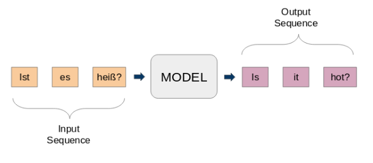
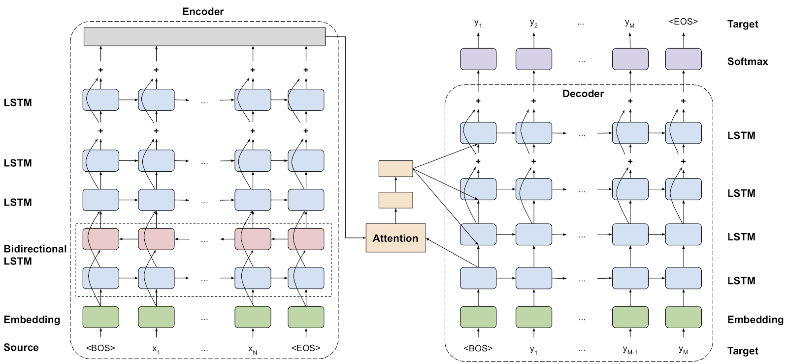
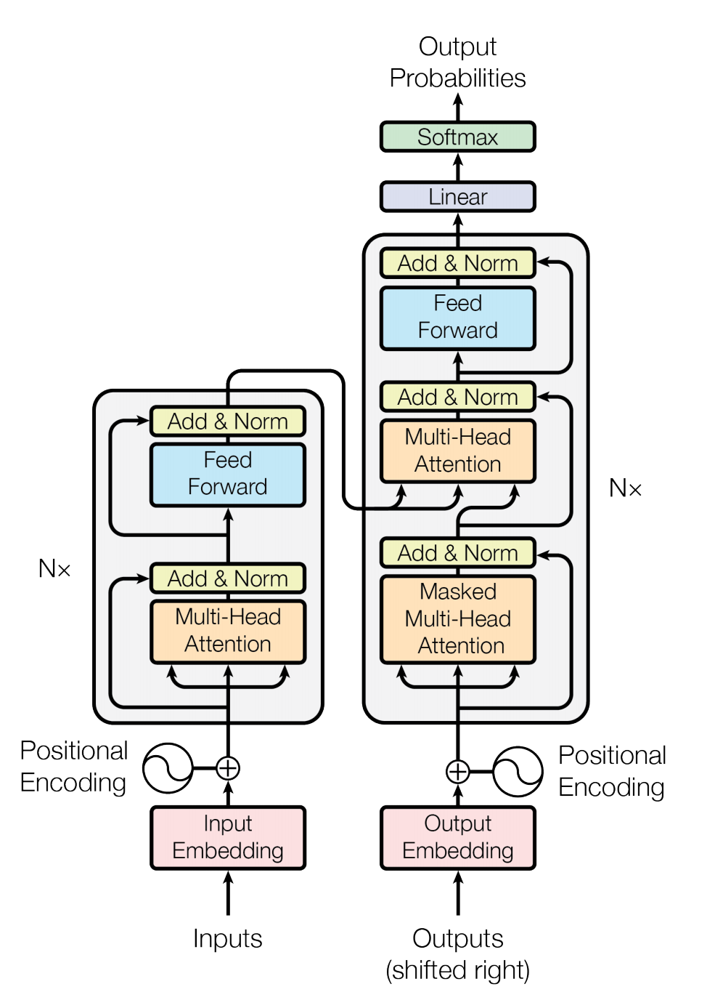

# Machine Translation

Machine Translation is the task of translation text from one language to another. Simply replacing one word with it's equivalent in another language rarely produces a semantically meaningful translation, because that may not account for the phrase-level meaning at all. A good machine translation system may require modeling whole sentences or phrases. Use of Neural Networks has allowed end-to-end architectures that can accomplish this, mapping from input text to the corresponding output text.A good model should be able to handle challenges like morphologically rich languages and very large vocalbularies well, while maintaining reasonable training and inference times. This Collection contains state-of-the-art models and containers that can help with the task of Machine Translation.

In this collection, we will cover:
- Challenges in Machine Translation
- Model architecture
- Where to get started

---
## Challenges in Machine Translation

Ages before, it was very time consuming to translate the text from an unfamiliar language. Adopting simple vocabularies with word-for-word translation was challenging for two purposes: 1) the user had to know the grammar rules, and 2) must keep in mind all language transcriptions while translating the whole sentence.
Presently, we don't need to struggle so much– we can translate phrases, sentences, and even large texts just by putting them in Google Translate.
If the Google Translator tried to keep the translations for even short sentences, it wouldn't work because of the massive number of possible variations. The most useful approach can be to train the machine sets of grammar rules and translate them accordingly. If only it were as easy as it sounds.
Suppose you have ever tried discovering a foreign language. In that case, you comprehend that there are always many exceptions to rules when we try to capture all these rules, limitations, and exceptions to the program's peculiarities, the quality of translation fragments down.

---
## Model architecture

i) Google’s Neural Machine Translation:

Sequence-to-Sequence (seq2seq) models are used for several Natural Language Processing (NLP) jobs, such as text summarization, speech recognition, and nucleotide sequence modeling. We aim to translate the provided sentences from one language to another.
Here, both the input and output are sentences. In another way, these sentences are a sequence of words proceeding in and out of the network. It is the fundamental purpose of Sequence-to-Sequence modeling. The figure underneath tries to demonstrate this technique.

Source - https://developer.nvidia.com/blog/introduction-neural-machine-translation-with-gpus/

The GNMT v2 model is related to the one addressed in [Google's Neural Machine Translation System: Bridging the Gap between Human and Machine Translation](https://arxiv.org/abs/1609.08144) paper.
The most crucial difference between the two models is in the attention mechanism. In the version2 (v2) model, the decoder's output from the primary LSTM layer goes into the attention module. The re-weighted setting is then concatenated with inputs to all subsequent LSTM layers in the decoder at the present step.

ii) Transformer based Neural Machine Translation:

The Transformer model uses typical NMT encoder-decoder architecture. Unlike other NMT models, this method uses no repeated contacts and works on a rigid-sized context windowpane. The encoder stack is made up of N identical layers. The individual layer is composed of the subsequent sublayers: 1. Self-attention layer 2. Feedforward network (which is two fully-connected layers) Like the encoder stack, the decoder stack comprises N identical layers. Each layer is composed of the sublayers: 1. Self-attention, layer 2. Multi-headed attention layer merging encoder outputs with events from the previous self-attention layer. 3. Feedforward network (2 fully-connected layers)

The encoder uses self-attention to calculate a representation of the input sequence. The decoder generates the output sequence one token at a time, taking the encoder output and former decoder-outputted tickets as inputs. The model also applies embeddings on the input and output tokens and adds a fixed positional encoding. The positional encoding adds knowledge about the location of each token.

Source - [Attention is all you Need](https://arxiv.org/abs/1706.03762)

---
## Where to get started

NVIDIA provides Deep Learning Examples for Image Segmentation on its GitHub repository. These examples provide you with easy to consume and highly optimized scripts for both training and inferencing. The quick start guide at our GitHub repository will help you in setting up the environment using NGC Docker Images, download pre-trained models from NGC and adapt the model training and inference for your application/use-case. 
Here are the examples relevant for image segmentation, directly from [Deep Learning Examples](https://github.com/NVIDIA/DeepLearningExamples):

1. Machine translation with GNMT using PyTorch
- [Git repository](https://github.com/NVIDIA/DeepLearningExamples/tree/master/TensorFlow/Translation/GNMT)
- Uses TensorFlow 20.06-tf1-py3 [NGC container](https://ngc.nvidia.com/registry/nvidia-tensorflow)

2. Machine translation with Transformers using PyTorch
- [Git repository](https://github.com/NVIDIA/DeepLearningExamples/tree/master/PyTorch/Translation/Transformer)
- Uses PyTorch 20.03-py3 [NGC container](https://ngc.nvidia.com/registry/nvidia-pytorch)