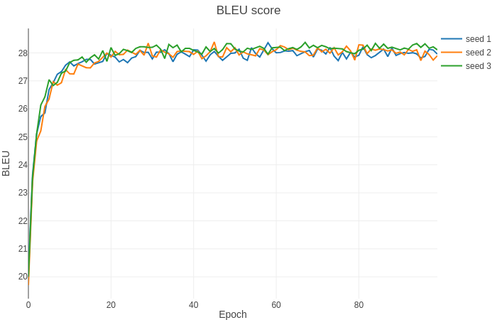

# Transformer For PyTorch

This repository provides a script and recipe to train the Transformer model to achieve state of the art accuracy, and is tested and maintained by NVIDIA.

**Table Of Contents**
- [Model overview](#model-overview)
    * [Model architecture](#model-architecture)
    * [Default configuration](#default-configuration)
    * [Feature support matrix](#feature-support-matrix)
	    * [Features](#features)
    * [Mixed precision training](#mixed-precision-training)
	    * [Enabling mixed precision](#enabling-mixed-precision)
        * [Glossary](#glossary)
- [Setup](#setup)
    * [Requirements](#requirements)
- [Quick Start Guide](#quick-start-guide)
- [Advanced](#advanced)
    * [Scripts and sample code](#scripts-and-sample-code)
    * [Parameters](#parameters)
    * [Command-line options](#command-line-options)
    * [Getting the data](#getting-the-data)
        * [Dataset guidelines](#dataset-guidelines)
        * [Multi-dataset](#multi-dataset)
    * [Training process](#training-process)
    * [Inference process](#inference-process)
- [Performance](#performance)
    * [Benchmarking](#benchmarking)
        * [Training performance benchmark](#training-performance-benchmark)
        * [Inference performance benchmark](#inference-performance-benchmark)
    * [Results](#results)
        * [Training accuracy results](#training-accuracy-results)
        * [Training performance results](#training-performance-results)
            * [NVIDIA DGX-1 (8x V100 16G)](#nvidia-dgx-1-8x-v100-16g)
            * [NVIDIA DGX-2 (16x V100 32G)](#nvidia-dgx-2-16x-v100-32g))
        * [Inference performance results](#inference-performance-results)
- [Release notes](#release-notes)
    * [Changelog](#changelog)
    * [Known issues](#known-issues)


## Model overview

The Transformer is a Neural Machine Translation (NMT) model which uses attention mechanism to boost training speed and overall accuracy. The Transformer model was introduced in [Attention Is All You Need](https://arxiv.org/abs/1706.03762) and improved in [Scaling Neural Machine Translation](https://arxiv.org/abs/1806.00187).
This implementation is based on the optimized implementation in [Facebook's Fairseq NLP toolkit](https://github.com/pytorch/fairseq), built on top of PyTorch.

This model is trained with mixed precision using Tensor Cores on NVIDIA Volta and Turing GPUs. Therefore, researchers can get results 3.6x faster than training without Tensor Cores, while experiencing the benefits of mixed precision training. This model is tested against each NGC monthly container release to ensure consistent accuracy and performance over time.

### Model architecture

The Transformer model uses standard NMT encoder-decoder architecture. This model unlike other NMT models, uses no recurrent connections and operates on fixed size context window.
The encoder stack is made up of N identical layers. Each layer is composed of the following sublayers:
    1. Self-attention layer
    2. Feedforward network (which is 2 fully-connected layers)
Like the encoder stack, the decoder stack is made up of N identical layers. Each layer is composed of the sublayers:
    1. Self-attention layer
    2. Multi-headed attention layer combining encoder outputs with results from
       the previous self-attention layer.
    3. Feedforward network (2 fully-connected layers)

The encoder uses self-attention to compute a representation of the input sequence. The decoder generates the output sequence one token at a time, taking the encoder output and previous decoder-outputted tokens as inputs.
The model also applies embeddings on the input and output tokens, and adds a constant positional encoding. The positional encoding adds information about the position of each token.

<p align="center">
    
    <br>
    Figure 1. The architecture of a Transformer model.
</p>

The complete description of the Transformer architecture can be found in [Attention Is All You Need](https://arxiv.org/abs/1706.03762) paper.
### Default configuration

The Transformer uses Byte Pair Encoding tokenization scheme using [Moses decoder](https://github.com/moses-smt/mosesdecoder). This is a lossy compression method (we drop information about white spaces). Tokenization is applied over whole [WMT14](http://statmt.org/wmt14/) en-de dataset including test set. Default vocabulary size is 33708, excluding all special tokens. Encoder and decoder are using shared embeddings.
We use 6 blocks in each encoder and decoder stacks. Self attention layer computes it's outputs according to the following formula $`Attention(Q,K,V) = softmax(\frac{QK^T}{\sqrt{d_k}})V`$. At each attention step, the model computes 16 different attention representations (which we will call attention heads) and concatenates them.
We trained the Transformer model using the Adam optimizer with betas `(0.9, 0.997)`, epsilon `1e-9` and learning rate `6e-4`. We used the inverse square root training schedule preceded with liniar warmup of 4000 steps.
The implementation allows to perform training in mixed precision. We use dynamic loss scaling and custom mixed precision optimizer. Distributed multi-GPU and multi-Node is implemented with `torch.distirbuted` module with NCCL backend.
For inference, we use beam search with default beam size of 5. Model performance is evaluated with BLEU4 metrics. For clarity, we report internal (legacy) BLEU implementation as well as external [SacreBleu](https://github.com/mjpost/sacreBLEU) score.

### Feature support matrix

The following features are supported by this model.<br>

| Feature                  | Yes column                
|--------------------------|--------------------------
| Multi-GPU training with [Distributed Communication Package](https://pytorch.org/docs/stable/distributed.html)  | Yes          
| APEX                     | Yes         

#### Features

Multi-GPU training with [Distributed Communication Package](https://pytorch.org/docs/stable/distributed.html) 

Our model uses torch.distributed package to implement efficient multi-GPU training with NCCL.
To enable multi-GPU training with torch.distributed, you have to initialize your model
identically in every process spawned by torch.distributed.launch. For efficiency the only point of synchronization is gradient gathering.
For details, see example sources in this repo or see
the [pytorch tutorial](https://pytorch.org/docs/stable/distributed.html)

APEX - This implementation uses Apex's FP16_Optimizer API to perform mixed precision training.
The purpose of the APEX is to provide easy and intuitive framework for distributed training and mixed precision training.
For details, see official [APEX repository](https://github.com/NVIDIA/apex).


### Mixed precision training
Mixed precision is the combined use of different numerical precisions in a computational method. [Mixed precision](https://arxiv.org/abs/1710.03740) training offers significant computational speedup by performing operations in half-precision format, while storing minimal information in single-precision to retain as much information as possible in critical parts of the network. Since the introduction of [Tensor Cores](https://developer.nvidia.com/tensor-cores) in the Volta and Turing architecture, significant training speedups are experienced by switching to mixed precision -- up to 3x overall speedup on the most arithmetically intense model architectures. Using mixed precision training requires two steps:
1.  Porting the model to use the FP16 data type where appropriate.    
2.  Adding loss scaling to preserve small gradient values.

The ability to train deep learning networks with lower precision was introduced in the Pascal architecture and first supported in [CUDA 8](https://devblogs.nvidia.com/parallelforall/tag/fp16/) in the NVIDIA Deep Learning SDK.

For information about:
-   How to train using mixed precision, see the [Mixed Precision Training](https://arxiv.org/abs/1710.03740) paper and [Training With Mixed Precision](https://docs.nvidia.com/deeplearning/sdk/mixed-precision-training/index.html) documentation.
-   Techniques used for mixed precision training, see the [Mixed-Precision Training of Deep Neural Networks](https://devblogs.nvidia.com/mixed-precision-training-deep-neural-networks/) blog.
-   APEX tools for mixed precision training, see the [NVIDIA Apex: Tools for Easy Mixed-Precision Training in PyTorch](https://devblogs.nvidia.com/apex-pytorch-easy-mixed-precision-training/).

#### Enabling mixed precision

Mixed precision is enabled using the `--fp16` option in the `train.py` script. The script then builds a custom mixed precision optimizer. Forward and backward pass are computed with FP16 precision with exclusion of a loss function which is computed in FP32 precision. We keep a copy of a model in higher precision in order to perform accurate weight update. After the update FP32 weights are again copied to FP16 model. We use dynamic loss scaling with initial scale of 2^7 increasing it by a factor of 2 every 2000 successful iterations. Overflow is being checked after reducing gradients from all of the workers. If we encounter infs or nans the whole batch is dropped.

### Glossary

Attention layer - Layer that computes which elements of input sequence or it's hidden representation contribute the most to the currently considered output element.
Beam search - A heuristic search algorithm which at each step of predictions keeps N most possible outputs as a base to perform further prediction.
BPE - Binary Pair Encoding, compression algorithm that find most common pair of symbols in a data and replaces them with new symbol absent in the data.
EOS - End of a sentence.
Self attention layer - Attention layer that computes hidden representation of input using the same tensor as query, key and value.
Token - A  string that is representable within the model. We also refer to the token's position in the dictionary as a token. There are special non-string tokens: alphabet tokens (all characters in a dataset), EOS token, PAD token.
Tokenizer - Object that converts raw strings to sequences of tokens.
Vocabulary embedding - Layer that projects one-hot token representations to a high dimensional space which preserves some information about correlations between tokens.

## Setup

The following section lists the requirements in order to start training the Transformer model.

### Requirements

This repository contains Dockerfile which extends the PyTorch NGC container and encapsulates some dependencies. Aside from these dependencies, ensure you have the following components:

-   [NVIDIA Docker](https://github.com/NVIDIA/nvidia-docker)
-   [PyTorch 19.03-py3+ NGC container](https://ngc.nvidia.com/registry/nvidia-pytorch)
-   [NVIDIA Volta](https://www.nvidia.com/en-us/data-center/volta-gpu-architecture/) or [Turing](https://www.nvidia.com/en-us/geforce/turing/) based GPU

For more information about how to get started with NGC containers, see the following sections from the NVIDIA GPU Cloud Documentation and the Deep Learning Documentation:
-   [Getting Started Using NVIDIA GPU Cloud](https://docs.nvidia.com/ngc/ngc-getting-started-guide/index.html)
-   [Accessing And Pulling From The NGC Container Registry](https://docs.nvidia.com/deeplearning/dgx/user-guide/index.html#accessing_registry)
-   Running [PyTorch NGC container](https://ngc.nvidia.com/catalog/containers/nvidia:pytorch)
  
For those unable to use the PyTorch NGC container, to set up the required environment or create your own container, see the versioned [NVIDIA Container Support Matrix](https://docs.nvidia.com/deeplearning/frameworks/support-matrix/index.html).

## Quick Start Guide
To train your model using mixed precision with Tensor Cores or using FP32, perform the following steps using the default parameters of the Transformer model on the [WMT14 English-German](http://statmt.org/wmt14/translation-task.html#Download) dataset. For the specifics concerning training and inference, see the [Advanced](#advanced) section.

1. Clone the repository 
```
git clone --recurse-submodules https://github.com/NVIDIA/DeepLearningExamples.git 
cd DeepLearningExamples/PyTorch/Translation/Transformer
```

2. Build and launch the Transformer PyTorch NGC  container
```bash
docker build . -t your.repository:transformer
nvidia-docker run -it --rm --ipc=host your.repository:transformer bash
```
If you have already preprocessed data, use:
```bash
nvidia-docker run -it --rm --ipc=host -v path/to/your/data/:/data/wmt14_en_de_joined_dict your.repository:transformer bash
```
3. Download and preprocess dataset
Download and preprocess the WMT14 English-German dataset.
```bash
./run_preprocessing.sh
```
After running this command, the processed dataset will be put into: `/data/wmt14_en_de_joined_dict` directory.
4. Start training
The following command runs the training script that is distributed between 8 workers.
```bash
python -m torch.distributed.launch --nproc_per_node 8 /workspace/translation/train.py /data/wmt14_en_de_joined_dict \
  --arch transformer_wmt_en_de_big_t2t \
  --share-all-embeddings \
  --optimizer adam \
  --adam-betas '(0.9, 0.997)' \
  --adam-eps "1e-9" \
  --clip-norm 0.0 \
  --lr-scheduler inverse_sqrt \
  --warmup-init-lr 0.0 \
  --warmup-updates 4000 \
  --lr 0.0006 \
  --min-lr 0.0 \
  --dropout 0.1 \
  --weight-decay 0.0 \
  --criterion label_smoothed_cross_entropy \
  --label-smoothing 0.1 \
  --max-tokens 5120 \
  --seed 1 \
  --target-bleu 28.3 \
  --ignore-case \
  --fp16 \
  --save-dir /workspace/checkpoints \
  --distributed-init-method env:// 
```

The script saves checkpoints every epoch to the directory specified in the `--save-dir` option. In addition, the best performing checkpoint (in terms of loss) and the latest checkpoints are saved separately.
**WARNING**: If you don't have access to sufficient disk space, use the `--save-interval $N` option. The checkpoints are ~2.5GB large. For example, it takes the Transformer model 16 epochs to reach the BLEU score of 28 points. The default option is to save last checkpoint, the best checkpoint and a checkpoint for every epoch, which means (16+1+1)*2.5GB = 45GB of a disk space used. Specifying `--save-interval 5` reduces this to (16/5+1+1)*2.5GB = 12.5GB. 

## Advanced
The following sections provide greater details of the dataset, running training and inference, and the training results.

### Scripts and sample code

The `preprocess.py` script performs binarization of the dataset obtained and tokenized by the `examples/translation/prepare-wmt14en2de.sh` script. The `train.py` script contains training loop as well as statistics gathering code. Steps performed in single training step can be found in `fairseq/trainer.py` if you are using FP32 precision or inside `fairseq/fp16_trainer.py` for mixed precision. Model definition is placed in the file `fairseq/models/transformer.py`. Model specific modules including multiheaded attention and sinusoidal positional embedding are inside the `fairseq/modules/` directory. Finally, the data wrappers are placed inside the `fairseq/data/` directory.

### Parameters

In this section we give a user friendly description of the most common options used in the `train.py` script.
### Command-line options
`--arch` - select the specific configuration for the model. You can select between various predefined hyper parameters values like number of encoder/decoder blocks, dropout value or size of hidden state representation.<br/>
`--share-all-embeddings` - use the same set of weights for encoder and decoder words embedding.<br/>
`--optimizer` - choose optimization algorithm.<br/>
`--clip-norm` - set a value that gradients will be clipped to.<br/>
`--lr-scheduler` - choose learning rate change strategy.<br/>
`--warmup-init-lr` - start linear warmup with a learning rate at this value.<br/>
`--warmup-updates` - set number of optimization steps after which linear warmup will end.<br/>
`--lr` - set learning rate.<br/>
`--min-lr` - prevent learning rate to fall below this value using arbitrary learning rate schedule.<br/>
`--dropout` - set dropout value.<br/>
`--weight-decay` - set weight decay value.<br/>
`--criterion` - select loss function.<br/>
`--label-smoothing` - distribute value of one-hot labels between all entries of a dictionary. Value set by this option will be a value subtracted from one-hot label.<br/>
`--max-tokens` - set batch size in terms of tokens.<br/>
`--max-sentences` - set batch size in terms of sentences. Note that then the actual batchsize will vary a lot more than when using `--max-tokens` option.<br/>
`--seed` - set random seed for NumPy and PyTorch RNGs.<br/>
`--max-epochs` - set the maximum number of epochs.<br/>
`--online-eval` - perform inference on test set and then compute BLEU score after every epoch.<br/>
`--ignore-case` - used with `--online-eval`, ignore case while computing BLEU score.<br/>
`--target-bleu` - works like `--online-eval` and sets a BLEU score threshold which after being attained will cause training to stop.<br/>
`--fp16` - use mixed precision.<br/>
`--save-dir` - set directory for saving checkpoints.<br/>
`--distributed-init-method` - method for initializing torch.distributed package. You can either provide addresses with the `tcp` method or use the envionment variables initialization with `env` method<br/>
`--update-freq` - use gradient accumulation. Set number of training steps across which gradient will be accumulated.<br/>

To see the full list of available options and their descriptions, use the `-h` or `--help` command line option, for example:
```
python train.py --help
```

The following (partial) output is printed when running the sample:
```
usage: train.py [-h] [--no-progress-bar] [--log-interval N]
                [--log-format {json,none,simple,tqdm}] [--seed N] [--fp16]
                [--profile PROFILE] [--task TASK]
                [--skip-invalid-size-inputs-valid-test] [--max-tokens N]
                [--max-sentences N] [--sentencepiece] [--train-subset SPLIT]
                [--valid-subset SPLIT] [--max-sentences-valid N]
                [--gen-subset SPLIT] [--num-shards N] [--shard-id ID]
                [--distributed-world-size N]
                [--distributed-rank DISTRIBUTED_RANK]
                [--local_rank LOCAL_RANK]
                [--distributed-backend DISTRIBUTED_BACKEND]
                [--distributed-init-method DISTRIBUTED_INIT_METHOD]
                [--distributed-port DISTRIBUTED_PORT] [--device-id DEVICE_ID]
                --arch ARCH [--criterion CRIT] [--max-epoch N]
                [--max-update N] [--target-bleu TARGET] [--clip-norm NORM]
                [--sentence-avg] [--update-freq N] [--optimizer OPT]
                [--lr LR_1,LR_2,...,LR_N] [--momentum M] [--weight-decay WD]
                [--lr-scheduler LR_SCHEDULER] [--lr-shrink LS] [--min-lr LR]
                [--min-loss-scale D] [--enable-parallel-backward-allred-opt]
                [--parallel-backward-allred-opt-threshold N]
                [--enable-parallel-backward-allred-opt-correctness-check]
                [--save-dir DIR] [--restore-file RESTORE_FILE]
                [--save-interval N] [--save-interval-updates N]
                [--keep-interval-updates N] [--no-save]
                [--no-epoch-checkpoints] [--validate-interval N] [--path FILE]
                [--remove-bpe [REMOVE_BPE]] [--cpu] [--quiet] [--beam N]
                [--nbest N] [--max-len-a N] [--max-len-b N] [--min-len N]
                [--no-early-stop] [--unnormalized] [--no-beamable-mm]
                [--lenpen LENPEN] [--unkpen UNKPEN]
                [--replace-unk [REPLACE_UNK]] [--score-reference]
                [--prefix-size PS] [--sampling] [--sampling-topk PS]
                [--sampling-temperature N] [--print-alignment]
                [--model-overrides DICT] [--online-eval] [--ignore-case]
                [--bpe-codes CODES] [--fuse-dropout-add] [--fuse-relu-dropout]
```

### Getting the data

The Transformer model was trained on the [WMT14 English-German](http://statmt.org/wmt14/translation-task.html#Download) dataset. Concatenation of the *commoncrawl*, *europarl* and *news-commentary* is used as train and validation dataset and *newstest2014* is used as test dataset.<br/>
This repository contains the `run_preprocessing.sh` script which will automatically downloads and preprocesses the training and test datasets. By default, data will be stored in the `/data/wmt14_en_de_joined_dict` directory.<br/>
Our download script utilizes [Moses decoder](https://github.com/moses-smt/mosesdecoder) to perform tokenization of the dataset and [subword-nmt](https://github.com/rsennrich/subword-nmt) to segment text into subword units (BPE). By default, the script builds a shared vocabulary of 33708 tokens, which is consistent with [Scaling Neural Machine Translation](https://arxiv.org/abs/1806.00187).

#### Dataset guidelines

The Transformer model works with a fixed sized vocabulary. Prior to the training, we need to learn a data representation that allows us to store the entire dataset as a sequence of tokens. To achieve this we use Binary Pair Encoding. This algorithm builds a vocabulary by iterating over a dataset, looking for the most frequent pair of symbols and replacing them with a new symbol, yet absent in the dataset. After identifying the desired number of encodings (new symbols can also be merged together) it outputs a code file that is used as an input for the `Dictionary` class.
This approach does not minimize the length of the encoded dataset, however this is allowed using [SentencePiece](https://github.com/google/sentencepiece/) to tokenize the dataset with the unigram model. This approach tries to find encoding that is close to the theoretical entropy limit.
Data is then sorted by length (in terms of tokens) and examples with similar length are batched together, padded if necessary.

#### Multi-dataset

The model has been tested oni the [wmt14 en-fr](http://www.statmt.org/wmt14/translation-task.html) dataset. Achieving state of the art accuracy of 41.4 BLEU.

### Training process

The default training configuration can be launched by running the `train.py` training script. By default, the script saves one checkpoint every epoch in addition to the latest and the best ones. The best checkpoint is considered the one with the lowest value of loss, not the one with the highest BLEU score. To override this behavior use the `--save-interval $N` option to save epoch checkpoints every N epoch or `--no-epoch-checkpoints` to disable them entirely (with this option the latest and the best checkpoints still will be saved). Specify save the directory with `--save-dir` option.<br/>
In order to run multi-GPU training, launch the training script with `python -m torch.distributed.launch --nproc_per_node $N` prepended, where N is the number of GPUs.
We have tested reliance on up to 16 GPUs on a single node.<br/>
After each training epoch, the script runs a loss validation on the validation split of the dataset and outputs the validation loss. By default the evaluation after each epoch is disabled. To enable it, use the `--online-eval` option or to use the BLEU score value as the training stopping condition use the `--target-bleu $TGT` option. In order to compute the case insensitive BLEU score, use the flag `--ignore-case` along with previous ones. The BLEU is computed by the internal fairseq algorithm which implementation can be found in the `fairseq/bleu.py` script.<br/>
By default, the `train.py` script will launch FP32 training without Tensor Cores. To use mixed precision with Tensor Cores use the `--fp16` option.<br/>

To reach the BLEU score reported in [Scaling Neural Machine Translation](https://arxiv.org/abs/1806.00187) research paper, we used mixed precision training with a batch size of 5120 per GPU and learning rate of 6e-4 on a DGX-1V system with 8 Tesla V100s 16G. If you use a different setup, we recommend you scale your hyperparameters by applying the following rules:
1. To use FP32, reduce the batch size to 2560 and set the `--update-freq 2` and `--warmup-updates 8000` options.
2. To train on a fewer GPUs, multiply `--update-freq` and `--warmup-updates` by the reciprocal of scaling factor.

For example, when training in FP32 mode on 4 GPUs, use the `--update-freq=4` and `--warmup-updates 16000` options.

### Inference process

Inference on a raw input can be performed by launching the `interactive.py` inference script. It requires a pre-trained model checkpoint, BPE codes file and dictionary file (both are produced by the `run_preprocessing.sh` script and can be found in the dataset directory).<br/>
To enhance the speed of the inference on large input files, it is recommended to preprocess them the same way as the dataset and run inference on a binarized input with the `generate.py` script.<br/>
Both scripts run inference with a default beam size of 4 and give tokenized output. To remove BPE codes use the `--remove-bpe` option.<br/>
In order to run interactive inference, run command:
```
python interactive.py --buffer-size 1 --fp16 --path /path/to/your/checkpoint.pt --max-tokens 128 \
        --fuse-dropout-add --remove-bpe --bpe-codes /path/to/code/file \
        /path/to/dataset/wmt14_en_de_joined_dict/
```
The `--buffer-size` option allows the batching of input sentences up to `--max_token` length.

## Performance

### Benchmarking

The following section shows how to run benchmarks measuring the model performance in training and inference modes.

#### Training performance benchmark

To benchmark the training performance on a specific batch size, just run `train.py` training script. Performance in words/s will be printed to standard output every N iterations, specified by the `--log-interval` option. After each epoch, the mean performance across the epoch will be reported as well.

#### Inference performance benchmark

To benchmark the inference performance on a specific batch size, run the `generate.py` script. The mean throughput will be reported at the end of the script.

### Results

The following sections provide details on how we achieved our performance and accuracy in training and inference.

#### Training accuracy results

In order to test the accuracy of our implementation, we have run experiments with different seeds for 100 epochs with batch size 5120 per GPU and learning rate 6e-4 in the pytorch-18.12-py3 Docker container. The plot below shows the BLEU score changes.<br/>


Running this code with the provided hyperparameters will allow you to achieve the following results. Our setup is a DGX-1 with 8x Tesla V100 16GB. We've verified our results after training 32 epochs to obtain multi-GPU and mixed precision scaling results.

 GPU count | Mixed precision BLEU | fp32 BLEU | Mixed precision training time | fp32 training time
---|---|---|---|---
 8 | 28.69 | 28.43 | 446 min | 1896 min
 4 | 28.35 | 28.31 | 834 min | 3733 min

In some cases we can train further with the same setup to achieve slightly better results. 

#### Training performance results

##### NVIDIA DGX-1 (8x V100 16G)

Our results were obtained by running the `run_training.sh` and `run_training_fp32.sh` training scripts in the PyTorch NGC container on NVIDIA DGX-1 with (8x V100 16G) GPUs. Performance numbers (in tokens per second) were averaged over an entire training epoch.

| GPUs   | Batch size / GPU   | Throughput - FP32    | Throughput - mixed precision    | Throughput speedup (FP32 - mixed precision)   | Weak scaling - FP32    | Weak scaling - mixed precision        
|--------|--------------------|----------------------|---------------------------------|-----------------------------------------------|------------------------|------------------------------
|8       |2560                | 53641                | 186442                          | 3.48                                          |  7.03                  | 7.82
|4       |2560                | 26647                | 92514                           | 3.47                                          |  3.49                  | 3.88
|1       |2560                | 7635                 | 23821                           | 3.12                                          |  1                     | 1

In addition mixed precision training has lower memory requirements, so we can train with batch size twice as big

| GPUs   | Batch size / GPU   | Throughput - mixed precision    | Throughput speedup (FP32 - mixed precision)   | Weak scaling - mixed precision        
|--------|--------------------|---------------------------------|-----------------------------------------------|--------------------
|8       |5120                | 235077                          | 4.38                                          | 7.31 
|4       |5120                | 75574                           | 2.83                                          | 2.35
|1       |5120                | 32153                           | 4.21                                          | 1

To achieve these same results, follow the steps in the [Quick Start Guide](#quick-start-guide).

##### NVIDIA DGX-2 (16x V100 32G)

Our results were obtained by running the `run_training.sh` and `run_training_fp32.sh` training scripts in the Pytorch NGC container on NVIDIA DGX-2 with (16x V100 32G) GPUs. Performance numbers (in items/images per second) were averaged over an entire training epoch.

| GPUs   | Batch size / GPU   | Throughput - FP32    | Throughput - mixed precision    | Throughput speedup (FP32 - mixed precision)   | Weak scaling - FP32    | Weak scaling - mixed precision        
|--------|--------------------|----------------------|---------------------------------|-----------------------------------------------|------------------------|-----------------------------
| 16     | 5120               | 128319               | 476585                          | 3.71                                          |                        |                         
 
To achieve these same results, follow the steps in the [Quick Start Guide](#quick-start-guide).

#### Inference performance results

We provide two inference scripts, `generate.py` for preprocessed data and `interactive.py` for raw input. To measure throughput of the Transformer model, run:
```bash
python generate.py /path/to/dataset/wmt14_en_de_joined_dict  \
  --path /path/to/your/checkpoint.pt \
  --beam 4 \
  --remove-bpe \
  --quiet \
  --fp16
```
To measure end-to-end inference with tokenization,
```
python interactive.py \
    --buffer-size 1 \
    --fp16 \
    --path /path/to/your/checkpoint.pt \
    --max-tokens 128 \
    --fuse-dropout-add \
    --remove-bpe\
    --bpe-codes /path/to/code/file \
    /path/to/dataset/wmt14_en_de_joined_dict/

```
We have benchmarked the inference performance by running the `generate.py` script using the pytorch-19.03-py3 NGC Docker container. Inference was run on a single GPU.

GPU | Mixed precision | FP32 | FP16/Mixed speedup
---|---|---|---
Tesla V100-SXM2-32GB | 6010 | 3414 | 1.76

## Release notes

### Changelog

January 2019
- initial commit, forked from [fairseq](https://github.com/pytorch/fairseq/commit/ac5fddfc691267285a84c81d39475411da5ed1c6)

May 2019:
- add mid-training [SacreBLEU](https://pypi.org/project/sacrebleu/1.2.10/) evaluation. Better handling of OOMs.

June 2019
- new README

July 2019
- replace custom fused operators with jit functions

August 2019
- add basic AMP support

## Known issues

- Course of a training heavily depends on a random seed. There is high variance in the time required to reach a certain BLEU score. Also the highest BLEU score value observed vary between runs with different seeds.
- Translations produced by training script during online evaluation may differ from those produced by `generate.py` script. It is probably a format conversion issue.
